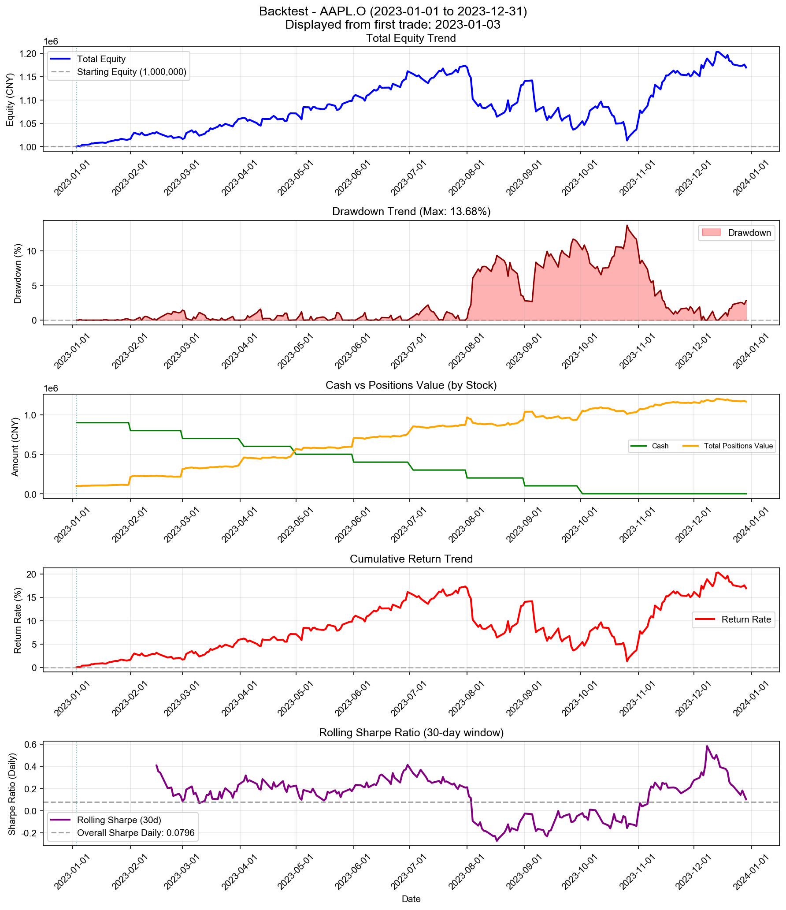
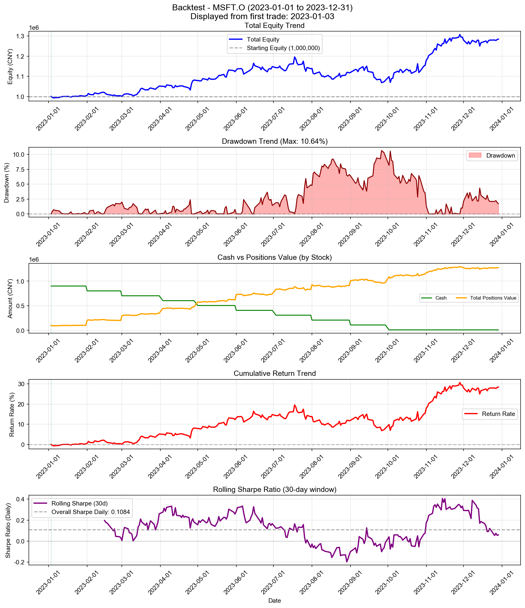
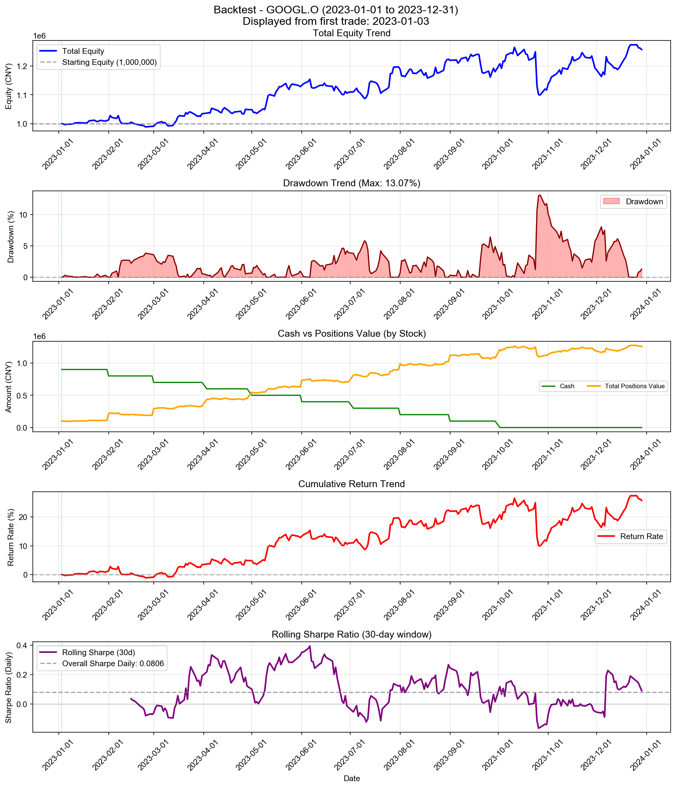
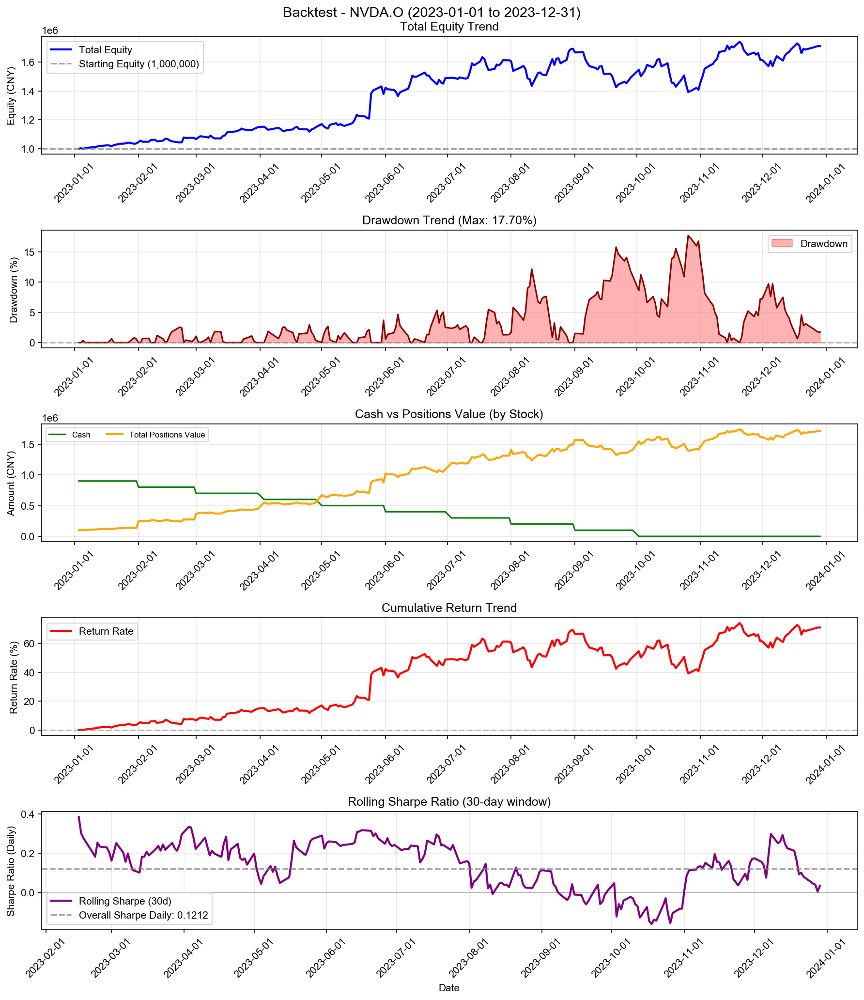
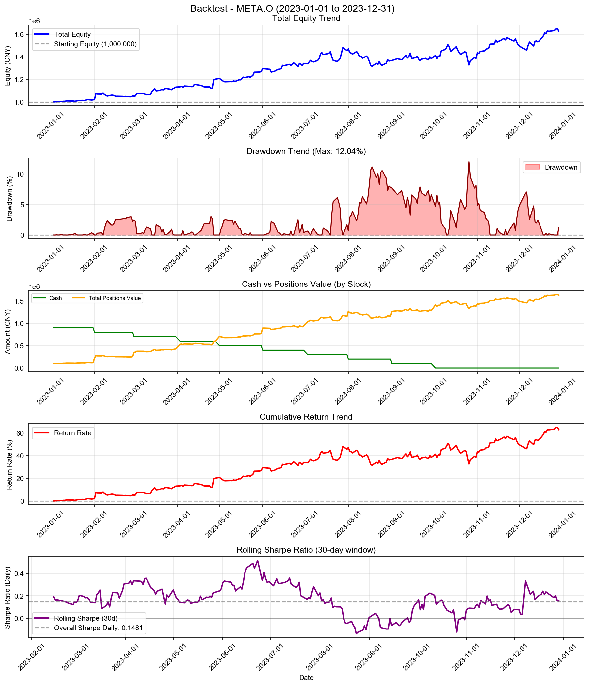
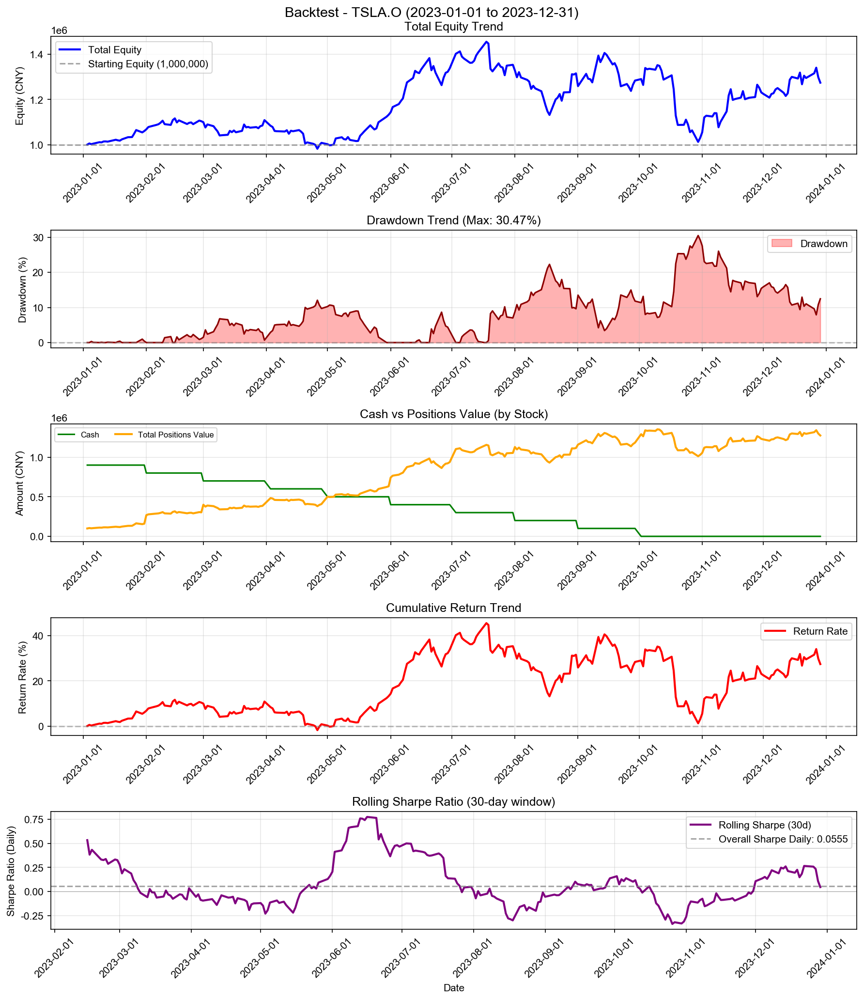
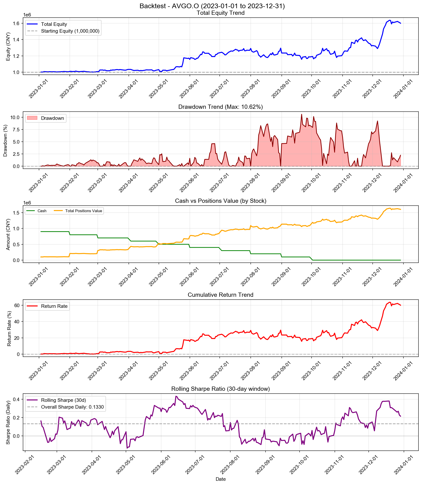
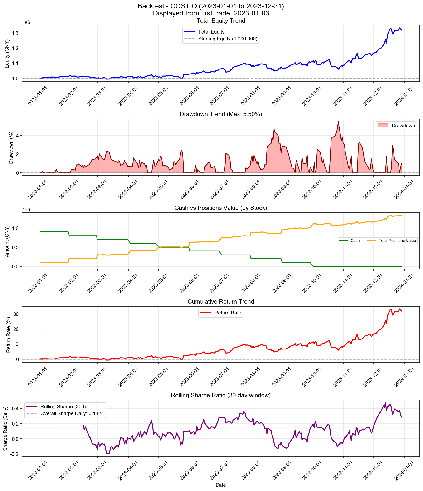
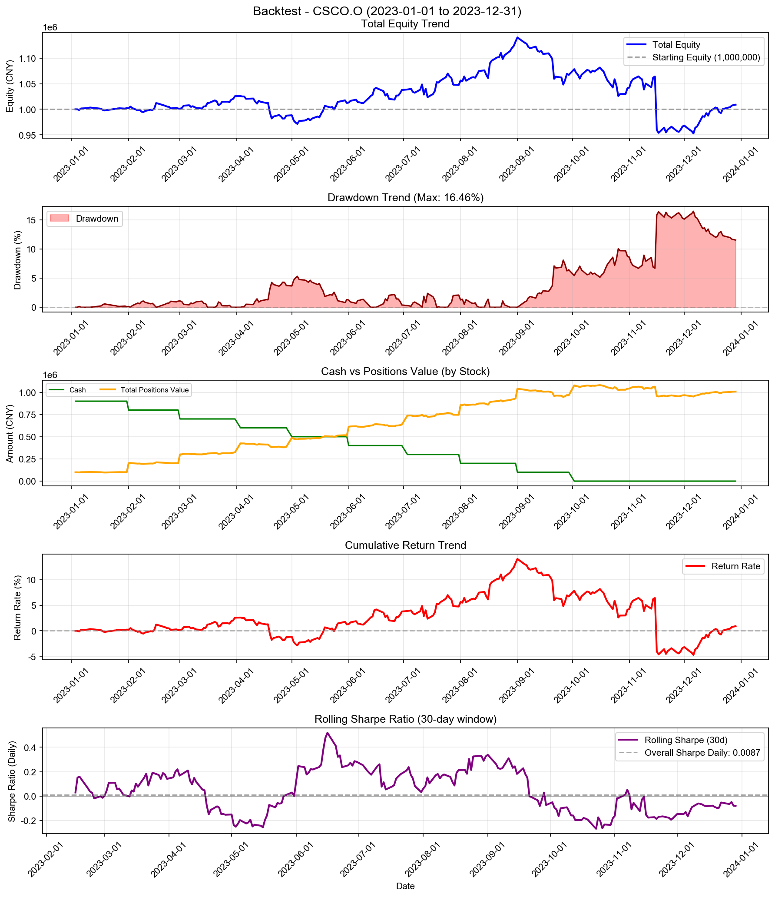

# DCA Strategy - 多股票回测综合报告

**策略名称:** DCA Strategy  
**回测期间:** 2023-01-01 至 2023-12-31  
**测试股票数:** 10 支  
**每只股票初始资金:** 1000000.00 元

---

## 综合统计

| 项目 | 数值 |
|------|------|
| 成功回测股票数 | 10/10 |
| 总初始资金 | 10000000.00 元 |
| 总最终权益 | 13619107.88 元 |
| 总盈亏 | +3619107.88 元 |
| 平均收益率 | +36.19% |
| 总交易次数 | 100 次 |

---

## 各股票详细结果

| 股票代码 | 初始资金 | 最终权益 | 盈亏 | 收益率 | 交易次数 |
|----------|----------|----------|------|--------|------------------|
| AAPL.O | 1000000.00 | 1169705.85 | +169705.85 | +16.97% | 10 |
| MSFT.O | 1000000.00 | 1284369.22 | +284369.22 | +28.44% | 10 |
| GOOGL.O | 1000000.00 | 1257215.32 | +257215.32 | +25.72% | 10 |
| AMZN.O | 1000000.00 | 1366407.02 | +366407.02 | +36.64% | 10 |
| NVDA.O | 1000000.00 | 1709438.09 | +709438.09 | +70.94% | 10 |
| META.O | 1000000.00 | 1628771.00 | +628771.00 | +62.88% | 10 |
| TSLA.O | 1000000.00 | 1274355.59 | +274355.59 | +27.44% | 10 |
| AVGO.O | 1000000.00 | 1600306.22 | +600306.22 | +60.03% | 10 |
| COST.O | 1000000.00 | 1319488.38 | +319488.38 | +31.95% | 10 |
| CSCO.O | 1000000.00 | 1009051.20 | +9051.20 | +0.91% | 10 |

---

## 收益率排名

### 收益率最高的股票

| 排名 | 股票代码 | 收益率 | 盈亏 |
|------|----------|--------|------|
| 1 | NVDA.O | +70.94% | +709438.09 |
| 2 | META.O | +62.88% | +628771.00 |
| 3 | AVGO.O | +60.03% | +600306.22 |
| 4 | AMZN.O | +36.64% | +366407.02 |
| 5 | COST.O | +31.95% | +319488.38 |

### 收益率最低的股票

| 排名 | 股票代码 | 收益率 | 盈亏 |
|------|----------|--------|------|
| 1 | CSCO.O | +0.91% | +9051.20 |
| 2 | AAPL.O | +16.97% | +169705.85 |
| 3 | GOOGL.O | +25.72% | +257215.32 |
| 4 | TSLA.O | +27.44% | +274355.59 |
| 5 | MSFT.O | +28.44% | +284369.22 |

---

## 交易统计

| 股票代码 | 交易次数 | 平均每笔交易金额 |
|----------|------------------|------------------|
| AAPL.O | 10 | 108485.29 |
| MSFT.O | 10 | 114218.46 |
| GOOGL.O | 10 | 112860.77 |
| AMZN.O | 10 | 118320.35 |
| NVDA.O | 10 | 135471.90 |
| META.O | 10 | 131438.55 |
| TSLA.O | 10 | 113717.78 |
| AVGO.O | 10 | 130015.31 |
| COST.O | 10 | 115974.42 |
| CSCO.O | 10 | 100452.56 |

---

## 各股票详细分析

### AAPL.O

#### 账户摘要

| 项目 | 数值 |
|------|------|
| 初始资金 | 1000000.00 元 |
| 最终现金 | 2424.91 元 |
| 最终持仓市值 | 1167280.94 元 |
| 最终总权益 | 1169705.85 元 |
| 总盈亏 | +169705.85 元 |
| 总收益率 | +16.97% |

| 资金比（现金/权益） | 0.21% |

#### 风险与稳健性指标

| 指标 | 数值 |
|------|------|
| 最大回撤 (Max Drawdown) | 13.68% |
| 年化收益率 (CAGR) | +17.12% |
| 年化夏普比率 (Sharpe) | 1.2641 |
| 日频夏普比率 (Sharpe Daily) | 0.0796 |
| 年化 Sortino 比率 | 1.1721 |
| 日频 Sortino 比率 | 0.0738 |
| Calmar 比率 (CAGR/MaxDD) | 1.2514 |
| 年化波动率 (Volatility) | 13.25% |
| VaR 95% | -1.28% |
| VaR 99% | -2.65% |
| CVaR 95% | -2.06% |
| CVaR 99% | -3.29% |

#### 统计信息

| 指标 | 数值 |
|------|------|
| 交易日数 | 250 天 |
| 最高权益 | 1203536.56 元 |
| 最低权益 | 999960.16 元 |
| 最高收益率 | +20.35% |
| 最低收益率 | -0.00% |

#### 最终持仓

| 股票代码 | 股数 | 成本价 | 现价 | 市值 | 盈亏 | 收益率 |
|----------|------|--------|------|------|------|--------|
| AAPL.O | 2096 | 475.94 | 556.91 | 1167280.94 | +169705.85 | +17.01% |

---

### MSFT.O

#### 账户摘要

| 项目 | 数值 |
|------|------|
| 初始资金 | 1000000.00 元 |
| 最终现金 | 9153.00 元 |
| 最终持仓市值 | 1275216.23 元 |
| 最终总权益 | 1284369.22 元 |
| 总盈亏 | +284369.22 元 |
| 总收益率 | +28.44% |

| 资金比（现金/权益） | 0.71% |

#### 风险与稳健性指标

| 指标 | 数值 |
|------|------|
| 最大回撤 (Max Drawdown) | 10.64% |
| 年化收益率 (CAGR) | +28.69% |
| 年化夏普比率 (Sharpe) | 1.7214 |
| 日频夏普比率 (Sharpe Daily) | 0.1084 |
| 年化 Sortino 比率 | 1.7360 |
| 日频 Sortino 比率 | 0.1094 |
| Calmar 比率 (CAGR/MaxDD) | 2.6957 |
| 年化波动率 (Volatility) | 15.41% |
| VaR 95% | -1.53% |
| VaR 99% | -2.59% |
| CVaR 95% | -2.17% |
| CVaR 99% | -3.03% |

#### 统计信息

| 指标 | 数值 |
|------|------|
| 交易日数 | 250 天 |
| 最高权益 | 1306954.43 元 |
| 最低权益 | 992843.05 元 |
| 最高收益率 | +30.70% |
| 最低收益率 | -0.72% |

#### 最终持仓

| 股票代码 | 股数 | 成本价 | 现价 | 市值 | 盈亏 | 收益率 |
|----------|------|--------|------|------|------|--------|
| MSFT.O | 730 | 1357.32 | 1746.87 | 1275216.23 | +284369.22 | +28.70% |

---

### GOOGL.O

#### 账户摘要

| 项目 | 数值 |
|------|------|
| 初始资金 | 1000000.00 元 |
| 最终现金 | 215.92 元 |
| 最终持仓市值 | 1256999.41 元 |
| 最终总权益 | 1257215.32 元 |
| 总盈亏 | +257215.32 元 |
| 总收益率 | +25.72% |

| 资金比（现金/权益） | 0.02% |

#### 风险与稳健性指标

| 指标 | 数值 |
|------|------|
| 最大回撤 (Max Drawdown) | 13.07% |
| 年化收益率 (CAGR) | +25.95% |
| 年化夏普比率 (Sharpe) | 1.2789 |
| 日频夏普比率 (Sharpe Daily) | 0.0806 |
| 年化 Sortino 比率 | 1.2053 |
| 日频 Sortino 比率 | 0.0759 |
| Calmar 比率 (CAGR/MaxDD) | 1.9849 |
| 年化波动率 (Volatility) | 19.64% |
| VaR 95% | -1.70% |
| VaR 99% | -2.65% |
| CVaR 95% | -2.67% |
| CVaR 99% | -5.01% |

#### 统计信息

| 指标 | 数值 |
|------|------|
| 交易日数 | 250 天 |
| 最高权益 | 1273682.57 元 |
| 最低权益 | 988762.78 元 |
| 最高收益率 | +27.37% |
| 最低收益率 | -1.12% |

#### 最终持仓

| 股票代码 | 股数 | 成本价 | 现价 | 市值 | 盈亏 | 收益率 |
|----------|------|--------|------|------|------|--------|
| GOOGL.O | 22518 | 44.40 | 55.82 | 1256999.41 | +257215.32 | +25.73% |

---

### AMZN.O

#### 账户摘要

| 项目 | 数值 |
|------|------|
| 初始资金 | 1000000.00 元 |
| 最终现金 | 1499.61 元 |
| 最终持仓市值 | 1364907.41 元 |
| 最终总权益 | 1366407.02 元 |
| 总盈亏 | +366407.02 元 |
| 总收益率 | +36.64% |

| 资金比（现金/权益） | 0.11% |

#### 风险与稳健性指标

| 指标 | 数值 |
|------|------|
| 最大回撤 (Max Drawdown) | 16.67% |
| 年化收益率 (CAGR) | +36.98% |
| 年化夏普比率 (Sharpe) | 1.5532 |
| 日频夏普比率 (Sharpe Daily) | 0.0978 |
| 年化 Sortino 比率 | 1.6279 |
| 日频 Sortino 比率 | 0.1025 |
| Calmar 比率 (CAGR/MaxDD) | 2.2180 |
| 年化波动率 (Volatility) | 21.88% |
| VaR 95% | -1.92% |
| VaR 99% | -3.68% |
| CVaR 95% | -2.99% |
| CVaR 99% | -4.43% |

#### 统计信息

| 指标 | 数值 |
|------|------|
| 交易日数 | 250 天 |
| 最高权益 | 1385541.23 元 |
| 最低权益 | 990448.36 元 |
| 最高收益率 | +38.55% |
| 最低收益率 | -0.96% |

#### 最终持仓

| 股票代码 | 股数 | 成本价 | 现价 | 市值 | 盈亏 | 收益率 |
|----------|------|--------|------|------|------|--------|
| AMZN.O | 3743 | 266.76 | 364.66 | 1364907.41 | +366407.02 | +36.70% |

---

### NVDA.O

#### 账户摘要

| 项目 | 数值 |
|------|------|
| 初始资金 | 1000000.00 元 |
| 最终现金 | 853.93 元 |
| 最终持仓市值 | 1708584.15 元 |
| 最终总权益 | 1709438.09 元 |
| 总盈亏 | +709438.09 元 |
| 总收益率 | +70.94% |

| 资金比（现金/权益） | 0.05% |

#### 风险与稳健性指标

| 指标 | 数值 |
|------|------|
| 最大回撤 (Max Drawdown) | 17.70% |
| 年化收益率 (CAGR) | +71.68% |
| 年化夏普比率 (Sharpe) | 1.9234 |
| 日频夏普比率 (Sharpe Daily) | 0.1212 |
| 年化 Sortino 比率 | 2.1581 |
| 日频 Sortino 比率 | 0.1359 |
| Calmar 比率 (CAGR/MaxDD) | 4.0492 |
| 年化波动率 (Volatility) | 30.62% |
| VaR 95% | -2.84% |
| VaR 99% | -4.21% |
| CVaR 95% | -3.61% |
| CVaR 99% | -4.40% |

#### 统计信息

| 指标 | 数值 |
|------|------|
| 交易日数 | 250 天 |
| 最高权益 | 1739888.07 元 |
| 最低权益 | 999650.90 元 |
| 最高收益率 | +73.99% |
| 最低收益率 | -0.03% |

#### 最终持仓

| 股票代码 | 股数 | 成本价 | 现价 | 市值 | 盈亏 | 收益率 |
|----------|------|--------|------|------|------|--------|
| NVDA.O | 6594 | 151.52 | 259.11 | 1708584.15 | +709438.09 | +71.00% |

---

### META.O

#### 账户摘要

| 项目 | 数值 |
|------|------|
| 初始资金 | 1000000.00 元 |
| 最终现金 | 13.44 元 |
| 最终持仓市值 | 1628757.56 元 |
| 最终总权益 | 1628771.00 元 |
| 总盈亏 | +628771.00 元 |
| 总收益率 | +62.88% |

| 资金比（现金/权益） | 0.00% |

#### 风险与稳健性指标

| 指标 | 数值 |
|------|------|
| 最大回撤 (Max Drawdown) | 12.04% |
| 年化收益率 (CAGR) | +63.51% |
| 年化夏普比率 (Sharpe) | 2.3517 |
| 日频夏普比率 (Sharpe Daily) | 0.1481 |
| 年化 Sortino 比率 | 2.6486 |
| 日频 Sortino 比率 | 0.1668 |
| Calmar 比率 (CAGR/MaxDD) | 5.2752 |
| 年化波动率 (Volatility) | 22.04% |
| VaR 95% | -2.14% |
| VaR 99% | -3.40% |
| CVaR 95% | -2.76% |
| CVaR 99% | -3.77% |

#### 统计信息

| 指标 | 数值 |
|------|------|
| 交易日数 | 250 天 |
| 最高权益 | 1648833.67 元 |
| 最低权益 | 1000000.00 元 |
| 最高收益率 | +64.88% |
| 最低收益率 | +0.00% |

#### 最终持仓

| 股票代码 | 股数 | 成本价 | 现价 | 市值 | 盈亏 | 收益率 |
|----------|------|--------|------|------|------|--------|
| META.O | 460153 | 2.17 | 3.54 | 1628757.56 | +628771.00 | +62.88% |

---

### TSLA.O

#### 账户摘要

| 项目 | 数值 |
|------|------|
| 初始资金 | 1000000.00 元 |
| 最终现金 | 212.27 元 |
| 最终持仓市值 | 1274143.32 元 |
| 最终总权益 | 1274355.59 元 |
| 总盈亏 | +274355.59 元 |
| 总收益率 | +27.44% |

| 资金比（现金/权益） | 0.02% |

#### 风险与稳健性指标

| 指标 | 数值 |
|------|------|
| 最大回撤 (Max Drawdown) | 30.47% |
| 年化收益率 (CAGR) | +27.68% |
| 年化夏普比率 (Sharpe) | 0.8811 |
| 日频夏普比率 (Sharpe Daily) | 0.0555 |
| 年化 Sortino 比率 | 0.8668 |
| 日频 Sortino 比率 | 0.0546 |
| Calmar 比率 (CAGR/MaxDD) | 0.9087 |
| 年化波动率 (Volatility) | 34.65% |
| VaR 95% | -3.69% |
| VaR 99% | -5.46% |
| CVaR 95% | -4.92% |
| CVaR 99% | -7.49% |

#### 统计信息

| 指标 | 数值 |
|------|------|
| 交易日数 | 250 天 |
| 最高权益 | 1455724.63 元 |
| 最低权益 | 981760.23 元 |
| 最高收益率 | +45.57% |
| 最低收益率 | -1.82% |

#### 最终持仓

| 股票代码 | 股数 | 成本价 | 现价 | 市值 | 盈亏 | 收益率 |
|----------|------|--------|------|------|------|--------|
| TSLA.O | 34185 | 29.25 | 37.27 | 1274143.32 | +274355.59 | +27.44% |

---

### AVGO.O

#### 账户摘要

| 项目 | 数值 |
|------|------|
| 初始资金 | 1000000.00 元 |
| 最终现金 | 49.18 元 |
| 最终持仓市值 | 1600257.04 元 |
| 最终总权益 | 1600306.22 元 |
| 总盈亏 | +600306.22 元 |
| 总收益率 | +60.03% |

| 资金比（现金/权益） | 0.00% |

#### 风险与稳健性指标

| 指标 | 数值 |
|------|------|
| 最大回撤 (Max Drawdown) | 10.62% |
| 年化收益率 (CAGR) | +60.63% |
| 年化夏普比率 (Sharpe) | 2.1111 |
| 日频夏普比率 (Sharpe Daily) | 0.1330 |
| 年化 Sortino 比率 | 2.6028 |
| 日频 Sortino 比率 | 0.1640 |
| Calmar 比率 (CAGR/MaxDD) | 5.7107 |
| 年化波动率 (Volatility) | 23.89% |
| VaR 95% | -2.10% |
| VaR 99% | -3.08% |
| CVaR 95% | -2.75% |
| CVaR 99% | -3.76% |

#### 统计信息

| 指标 | 数值 |
|------|------|
| 交易日数 | 250 天 |
| 最高权益 | 1636863.04 元 |
| 最低权益 | 999689.91 元 |
| 最高收益率 | +63.69% |
| 最低收益率 | -0.03% |

#### 最终持仓

| 股票代码 | 股数 | 成本价 | 现价 | 市值 | 盈亏 | 收益率 |
|----------|------|--------|------|------|------|--------|
| AVGO.O | 113650 | 8.80 | 14.08 | 1600257.04 | +600306.22 | +60.03% |

---

### COST.O

#### 账户摘要

| 项目 | 数值 |
|------|------|
| 初始资金 | 1000000.00 元 |
| 最终现金 | 62.96 元 |
| 最终持仓市值 | 1319425.42 元 |
| 最终总权益 | 1319488.38 元 |
| 总盈亏 | +319488.38 元 |
| 总收益率 | +31.95% |

| 资金比（现金/权益） | 0.00% |

#### 风险与稳健性指标

| 指标 | 数值 |
|------|------|
| 最大回撤 (Max Drawdown) | 5.50% |
| 年化收益率 (CAGR) | +32.24% |
| 年化夏普比率 (Sharpe) | 2.2613 |
| 日频夏普比率 (Sharpe Daily) | 0.1424 |
| 年化 Sortino 比率 | 2.3440 |
| 日频 Sortino 比率 | 0.1477 |
| Calmar 比率 (CAGR/MaxDD) | 5.8616 |
| 年化波动率 (Volatility) | 12.77% |
| VaR 95% | -1.03% |
| VaR 99% | -2.25% |
| CVaR 95% | -1.75% |
| CVaR 99% | -2.59% |

#### 统计信息

| 指标 | 数值 |
|------|------|
| 交易日数 | 250 天 |
| 最高权益 | 1332920.90 元 |
| 最低权益 | 993675.86 元 |
| 最高收益率 | +33.29% |
| 最低收益率 | -0.63% |

#### 最终持仓

| 股票代码 | 股数 | 成本价 | 现价 | 市值 | 盈亏 | 收益率 |
|----------|------|--------|------|------|------|--------|
| COST.O | 67511 | 14.81 | 19.54 | 1319425.42 | +319488.38 | +31.95% |

---

### CSCO.O

#### 账户摘要

| 项目 | 数值 |
|------|------|
| 初始资金 | 1000000.00 元 |
| 最终现金 | 917.78 元 |
| 最终持仓市值 | 1008133.42 元 |
| 最终总权益 | 1009051.20 元 |
| 总盈亏 | +9051.20 元 |
| 总收益率 | +0.91% |

| 资金比（现金/权益） | 0.09% |

#### 风险与稳健性指标

| 指标 | 数值 |
|------|------|
| 最大回撤 (Max Drawdown) | 16.46% |
| 年化收益率 (CAGR) | +0.91% |
| 年化夏普比率 (Sharpe) | 0.1377 |
| 日频夏普比率 (Sharpe Daily) | 0.0087 |
| 年化 Sortino 比率 | 0.1083 |
| 日频 Sortino 比率 | 0.0068 |
| Calmar 比率 (CAGR/MaxDD) | 0.0554 |
| 年化波动率 (Volatility) | 14.73% |
| VaR 95% | -1.08% |
| VaR 99% | -1.96% |
| CVaR 95% | -2.30% |
| CVaR 99% | -5.11% |

#### 统计信息

| 指标 | 数值 |
|------|------|
| 交易日数 | 250 天 |
| 最高权益 | 1140504.00 元 |
| 最低权益 | 952777.72 元 |
| 最高收益率 | +14.05% |
| 最低收益率 | -4.72% |

#### 最终持仓

| 股票代码 | 股数 | 成本价 | 现价 | 市值 | 盈亏 | 收益率 |
|----------|------|--------|------|------|------|--------|
| CSCO.O | 4774 | 209.28 | 211.17 | 1008133.42 | +9051.20 | +0.91% |

---

---

## 策略参数

- **monthly_investment:** 100,000.00 元
- **dca_frequency:** monthly

---

*报告生成时间: 2025-12-25 21:17:17*
