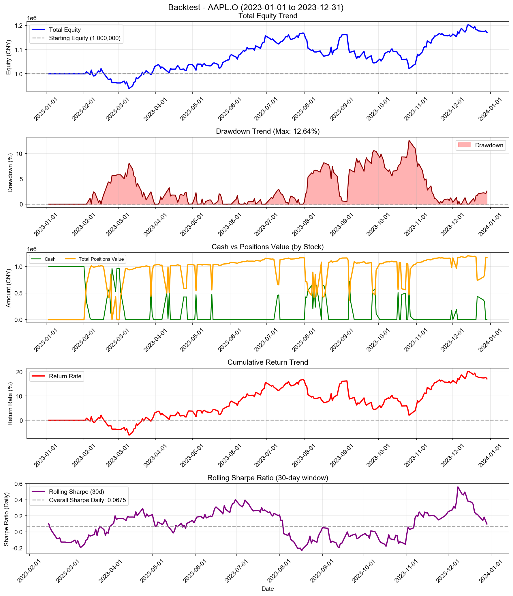
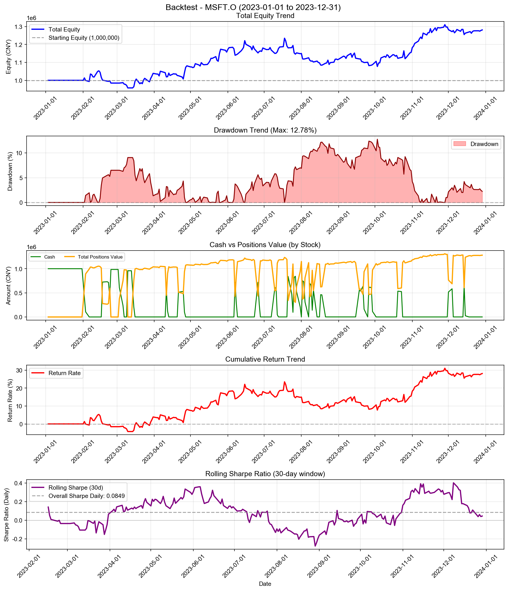
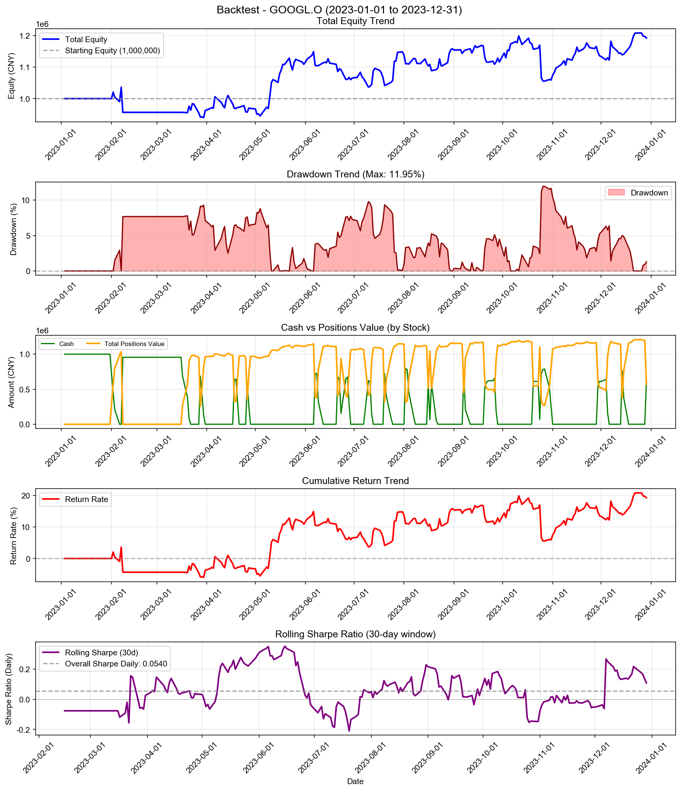
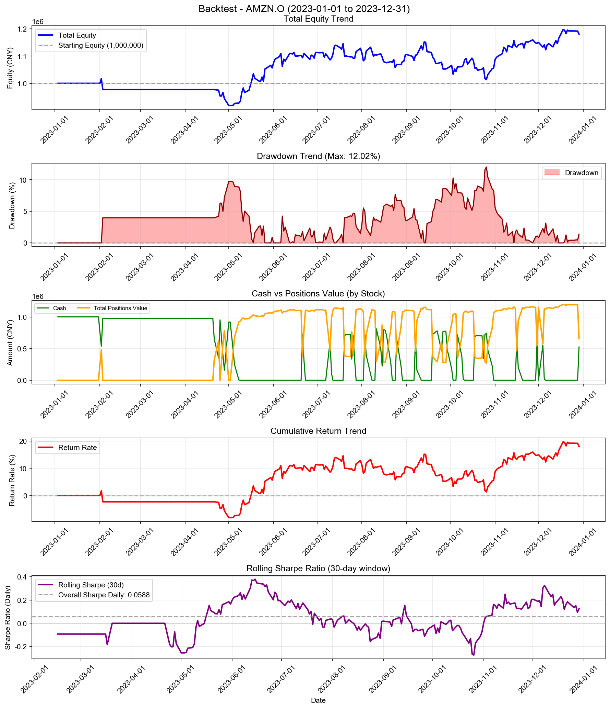
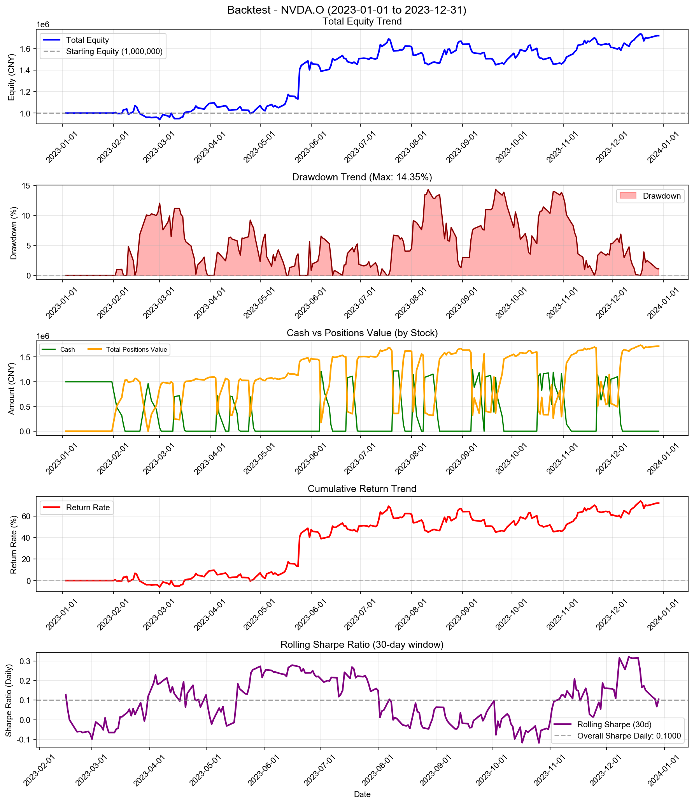
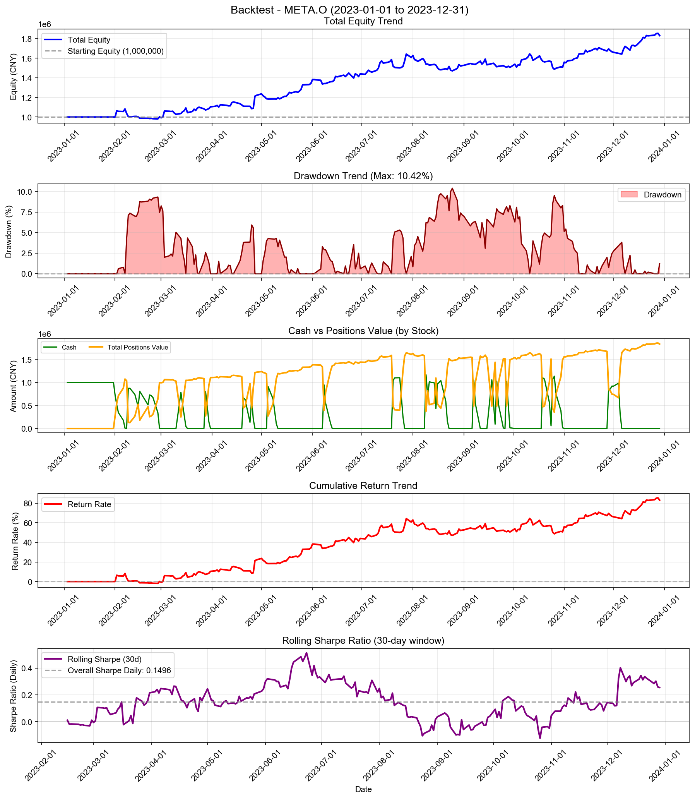
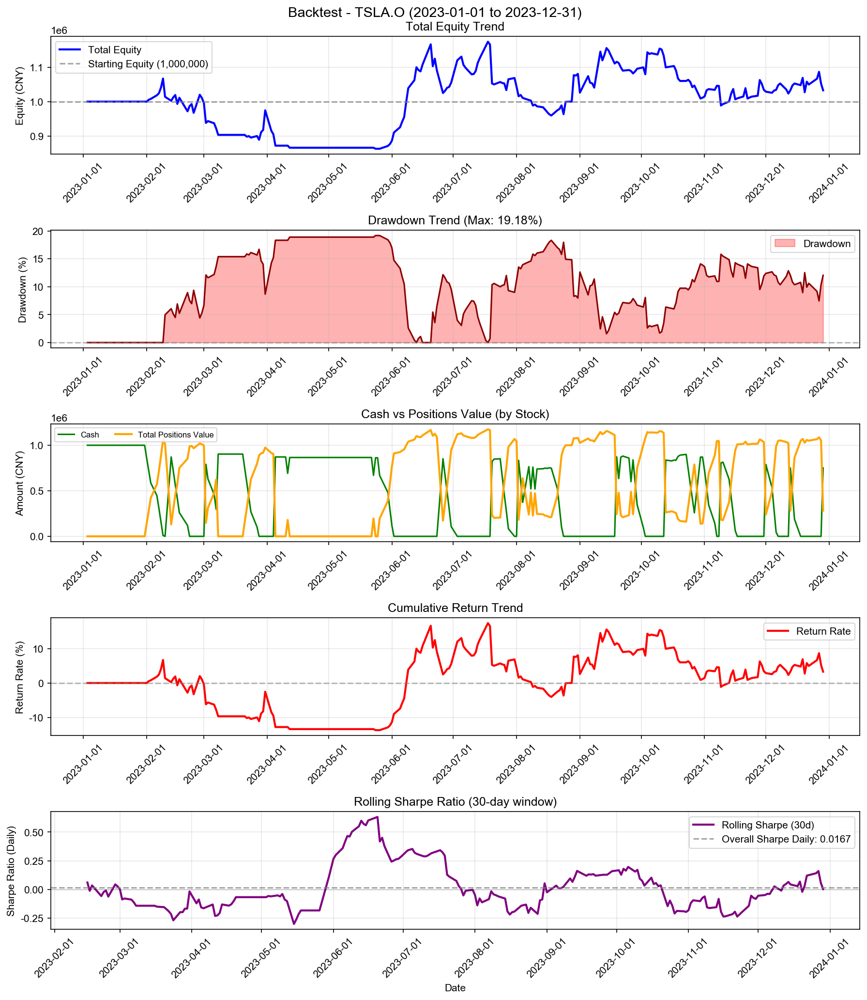
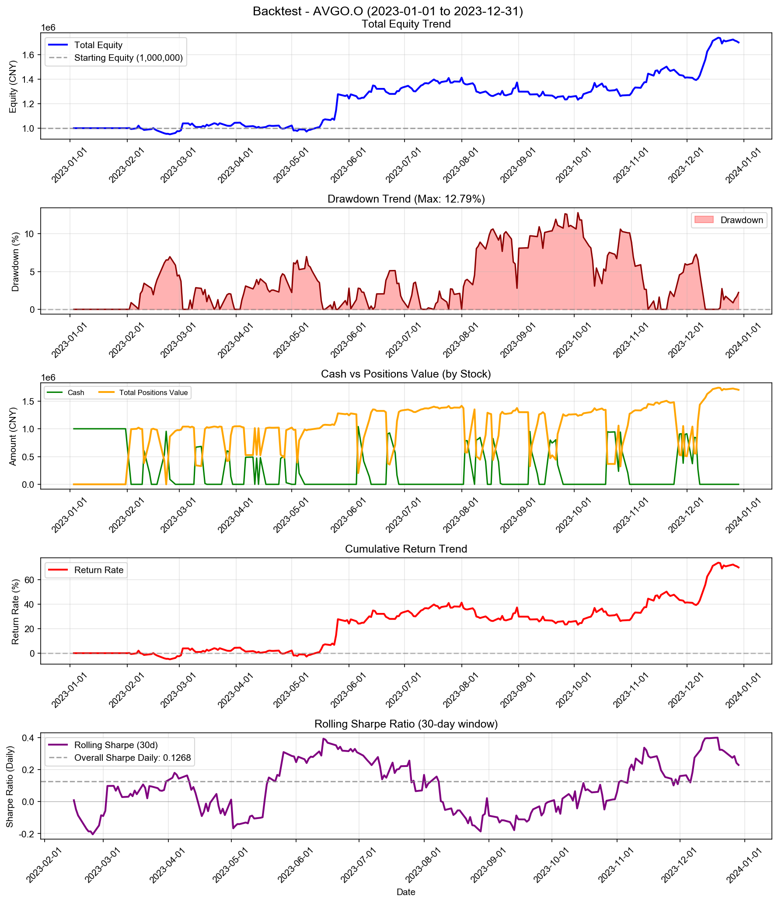
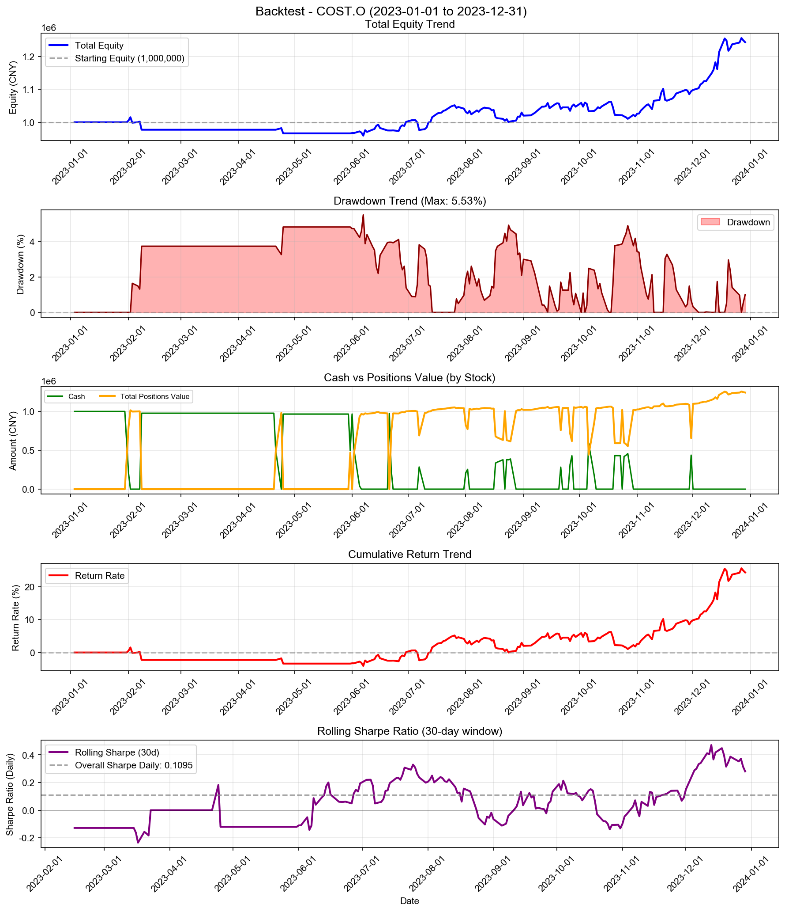
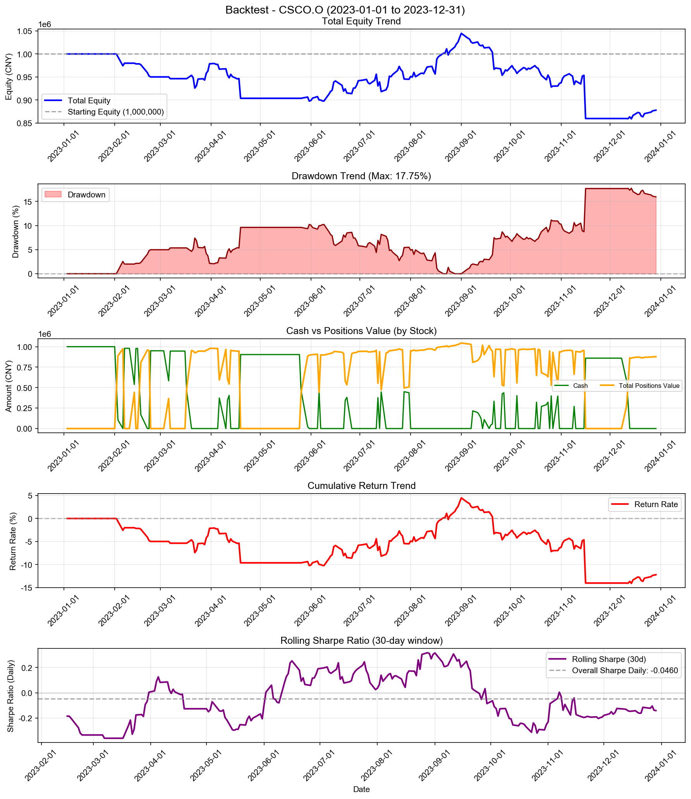

# Turtle Strategy - 多股票回测综合报告

**策略名称:** Turtle Strategy  
**回测期间:** 2023-01-01 至 2023-12-31  
**测试股票数:** 10 支  
**每只股票初始资金:** 1000000.00 元

---

## 综合统计

| 项目 | 数值 |
|------|------|
| 成功回测股票数 | 10/10 |
| 总初始资金 | 10000000.00 元 |
| 总最终权益 | 13232138.71 元 |
| 总盈亏 | +3232138.71 元 |
| 平均收益率 | +32.32% |
| 总交易次数 | 1134 次 |

---

## 各股票详细结果

| 股票代码 | 初始资金 | 最终权益 | 盈亏 | 收益率 | 交易次数 |
|----------|----------|----------|------|--------|------------------|
| AAPL.O | 1000000.00 | 1170608.89 | +170608.89 | +17.06% | 105 |
| MSFT.O | 1000000.00 | 1281505.72 | +281505.72 | +28.15% | 107 |
| GOOGL.O | 1000000.00 | 1192594.98 | +192594.98 | +19.26% | 113 |
| AMZN.O | 1000000.00 | 1180982.02 | +180982.02 | +18.10% | 112 |
| NVDA.O | 1000000.00 | 1719915.47 | +719915.47 | +71.99% | 137 |
| META.O | 1000000.00 | 1831598.47 | +831598.47 | +83.16% | 128 |
| TSLA.O | 1000000.00 | 1033022.76 | +33022.76 | +3.30% | 147 |
| AVGO.O | 1000000.00 | 1700563.31 | +700563.31 | +70.06% | 126 |
| COST.O | 1000000.00 | 1243346.23 | +243346.23 | +24.33% | 64 |
| CSCO.O | 1000000.00 | 878000.86 | -121999.14 | -12.20% | 95 |

---

## 收益率排名

### 收益率最高的股票

| 排名 | 股票代码 | 收益率 | 盈亏 |
|------|----------|--------|------|
| 1 | META.O | +83.16% | +831598.47 |
| 2 | NVDA.O | +71.99% | +719915.47 |
| 3 | AVGO.O | +70.06% | +700563.31 |
| 4 | MSFT.O | +28.15% | +281505.72 |
| 5 | COST.O | +24.33% | +243346.23 |

### 收益率最低的股票

| 排名 | 股票代码 | 收益率 | 盈亏 |
|------|----------|--------|------|
| 1 | CSCO.O | -12.20% | -121999.14 |
| 2 | TSLA.O | +3.30% | +33022.76 |
| 3 | AAPL.O | +17.06% | +170608.89 |
| 4 | AMZN.O | +18.10% | +180982.02 |
| 5 | GOOGL.O | +19.26% | +192594.98 |

---

## 交易统计

| 股票代码 | 交易次数 | 平均每笔交易金额 |
|----------|------------------|------------------|
| AAPL.O | 105 | 10336.23 |
| MSFT.O | 107 | 10661.24 |
| GOOGL.O | 113 | 9701.75 |
| AMZN.O | 112 | 9736.53 |
| NVDA.O | 137 | 9926.70 |
| META.O | 128 | 11060.93 |
| TSLA.O | 147 | 6915.04 |
| AVGO.O | 126 | 10716.52 |
| COST.O | 64 | 17526.14 |
| CSCO.O | 95 | 9884.22 |

---

## 各股票详细分析

### AAPL.O

#### 账户摘要

| 项目 | 数值 |
|------|------|
| 初始资金 | 1000000.00 元 |
| 最终现金 | 543.41 元 |
| 最终持仓市值 | 1170065.48 元 |
| 最终总权益 | 1170608.89 元 |
| 总盈亏 | +170608.89 元 |
| 总收益率 | +17.06% |

| 资金比（现金/权益） | 0.05% |

#### 风险与稳健性指标

| 指标 | 数值 |
|------|------|
| 最大回撤 (Max Drawdown) | 12.64% |
| 年化收益率 (CAGR) | +17.21% |
| 年化夏普比率 (Sharpe) | 1.0709 |
| 日频夏普比率 (Sharpe Daily) | 0.0675 |
| 年化 Sortino 比率 | 0.9954 |
| 日频 Sortino 比率 | 0.0627 |
| Calmar 比率 (CAGR/MaxDD) | 1.3619 |
| 年化波动率 (Volatility) | 16.10% |
| VaR 95% | -1.55% |
| VaR 99% | -2.92% |
| CVaR 95% | -2.29% |
| CVaR 99% | -3.18% |

#### 统计信息

| 指标 | 数值 |
|------|------|
| 交易日数 | 250 天 |
| 最高权益 | 1201774.87 元 |
| 最低权益 | 938408.07 元 |
| 最高收益率 | +20.18% |
| 最低收益率 | -6.16% |

#### 最终持仓

| 股票代码 | 股数 | 成本价 | 现价 | 市值 | 盈亏 | 收益率 |
|----------|------|--------|------|------|------|--------|
| AAPL.O | 2101 | 559.06 | 556.91 | 1170065.48 | -4526.66 | -0.39% |

---

### MSFT.O

#### 账户摘要

| 项目 | 数值 |
|------|------|
| 初始资金 | 1000000.00 元 |
| 最终现金 | 1048.88 元 |
| 最终持仓市值 | 1280456.84 元 |
| 最终总权益 | 1281505.72 元 |
| 总盈亏 | +281505.72 元 |
| 总收益率 | +28.15% |

| 资金比（现金/权益） | 0.08% |

#### 风险与稳健性指标

| 指标 | 数值 |
|------|------|
| 最大回撤 (Max Drawdown) | 12.78% |
| 年化收益率 (CAGR) | +28.41% |
| 年化夏普比率 (Sharpe) | 1.3483 |
| 日频夏普比率 (Sharpe Daily) | 0.0849 |
| 年化 Sortino 比率 | 1.3467 |
| 日频 Sortino 比率 | 0.0848 |
| Calmar 比率 (CAGR/MaxDD) | 2.2234 |
| 年化波动率 (Volatility) | 20.12% |
| VaR 95% | -1.92% |
| VaR 99% | -3.09% |
| CVaR 95% | -2.63% |
| CVaR 99% | -3.43% |

#### 统计信息

| 指标 | 数值 |
|------|------|
| 交易日数 | 250 天 |
| 最高权益 | 1310879.40 元 |
| 最低权益 | 957638.77 元 |
| 最高收益率 | +31.09% |
| 最低收益率 | -4.24% |

#### 最终持仓

| 股票代码 | 股数 | 成本价 | 现价 | 市值 | 盈亏 | 收益率 |
|----------|------|--------|------|------|------|--------|
| MSFT.O | 733 | 1711.48 | 1746.87 | 1280456.84 | +25938.98 | +2.07% |

---

### GOOGL.O

#### 账户摘要

| 项目 | 数值 |
|------|------|
| 初始资金 | 1000000.00 元 |
| 最终现金 | 619470.68 元 |
| 最终持仓市值 | 573124.30 元 |
| 最终总权益 | 1192594.98 元 |
| 总盈亏 | +192594.98 元 |
| 总收益率 | +19.26% |

| 资金比（现金/权益） | 51.94% |

#### 风险与稳健性指标

| 指标 | 数值 |
|------|------|
| 最大回撤 (Max Drawdown) | 11.95% |
| 年化收益率 (CAGR) | +19.43% |
| 年化夏普比率 (Sharpe) | 0.8573 |
| 日频夏普比率 (Sharpe Daily) | 0.0540 |
| 年化 Sortino 比率 | 0.7528 |
| 日频 Sortino 比率 | 0.0474 |
| Calmar 比率 (CAGR/MaxDD) | 1.6252 |
| 年化波动率 (Volatility) | 24.24% |
| VaR 95% | -1.99% |
| VaR 99% | -3.78% |
| CVaR 95% | -3.47% |
| CVaR 99% | -6.81% |

#### 统计信息

| 指标 | 数值 |
|------|------|
| 交易日数 | 250 天 |
| 最高权益 | 1208218.31 元 |
| 最低权益 | 939550.22 元 |
| 最高收益率 | +20.82% |
| 最低收益率 | -6.04% |

#### 最终持仓

| 股票代码 | 股数 | 成本价 | 现价 | 市值 | 盈亏 | 收益率 |
|----------|------|--------|------|------|------|--------|
| GOOGL.O | 10267 | 55.82 | 55.82 | 573124.30 | +0.00 | +0.00% |

---

### AMZN.O

#### 账户摘要

| 项目 | 数值 |
|------|------|
| 初始资金 | 1000000.00 元 |
| 最终现金 | 524965.88 元 |
| 最终持仓市值 | 656016.14 元 |
| 最终总权益 | 1180982.02 元 |
| 总盈亏 | +180982.02 元 |
| 总收益率 | +18.10% |

| 资金比（现金/权益） | 44.45% |

#### 风险与稳健性指标

| 指标 | 数值 |
|------|------|
| 最大回撤 (Max Drawdown) | 12.02% |
| 年化收益率 (CAGR) | +18.26% |
| 年化夏普比率 (Sharpe) | 0.9334 |
| 日频夏普比率 (Sharpe Daily) | 0.0588 |
| 年化 Sortino 比率 | 0.7544 |
| 日频 Sortino 比率 | 0.0475 |
| Calmar 比率 (CAGR/MaxDD) | 1.5184 |
| 年化波动率 (Volatility) | 20.23% |
| VaR 95% | -2.19% |
| VaR 99% | -3.98% |
| CVaR 95% | -3.03% |
| CVaR 99% | -4.07% |

#### 统计信息

| 指标 | 数值 |
|------|------|
| 交易日数 | 250 天 |
| 最高权益 | 1197534.68 元 |
| 最低权益 | 918640.77 元 |
| 最高收益率 | +19.75% |
| 最低收益率 | -8.14% |

#### 最终持仓

| 股票代码 | 股数 | 成本价 | 现价 | 市值 | 盈亏 | 收益率 |
|----------|------|--------|------|------|------|--------|
| AMZN.O | 1799 | 364.66 | 364.66 | 656016.14 | +0.00 | +0.00% |

---

### NVDA.O

#### 账户摘要

| 项目 | 数值 |
|------|------|
| 初始资金 | 1000000.00 元 |
| 最终现金 | 189.50 元 |
| 最终持仓市值 | 1719725.97 元 |
| 最终总权益 | 1719915.47 元 |
| 总盈亏 | +719915.47 元 |
| 总收益率 | +71.99% |

| 资金比（现金/权益） | 0.01% |

#### 风险与稳健性指标

| 指标 | 数值 |
|------|------|
| 最大回撤 (Max Drawdown) | 14.35% |
| 年化收益率 (CAGR) | +72.74% |
| 年化夏普比率 (Sharpe) | 1.5881 |
| 日频夏普比率 (Sharpe Daily) | 0.1000 |
| 年化 Sortino 比率 | 1.9989 |
| 日频 Sortino 比率 | 0.1259 |
| Calmar 比率 (CAGR/MaxDD) | 5.0699 |
| 年化波动率 (Volatility) | 39.13% |
| VaR 95% | -3.04% |
| VaR 99% | -4.80% |
| CVaR 95% | -3.91% |
| CVaR 99% | -5.10% |

#### 统计信息

| 指标 | 数值 |
|------|------|
| 交易日数 | 250 天 |
| 最高权益 | 1739188.68 元 |
| 最低权益 | 939727.40 元 |
| 最高收益率 | +73.92% |
| 最低收益率 | -6.03% |

#### 最终持仓

| 股票代码 | 股数 | 成本价 | 现价 | 市值 | 盈亏 | 收益率 |
|----------|------|--------|------|------|------|--------|
| NVDA.O | 6637 | 240.28 | 259.11 | 1719725.97 | +124956.46 | +7.84% |

---

### META.O

#### 账户摘要

| 项目 | 数值 |
|------|------|
| 初始资金 | 1000000.00 元 |
| 最终现金 | 0.59 元 |
| 最终持仓市值 | 1831597.88 元 |
| 最终总权益 | 1831598.47 元 |
| 总盈亏 | +831598.47 元 |
| 总收益率 | +83.16% |

| 资金比（现金/权益） | 0.00% |

#### 风险与稳健性指标

| 指标 | 数值 |
|------|------|
| 最大回撤 (Max Drawdown) | 10.42% |
| 年化收益率 (CAGR) | +84.05% |
| 年化夏普比率 (Sharpe) | 2.3752 |
| 日频夏普比率 (Sharpe Daily) | 0.1496 |
| 年化 Sortino 比率 | 2.7802 |
| 日频 Sortino 比率 | 0.1751 |
| Calmar 比率 (CAGR/MaxDD) | 8.0696 |
| 年化波动率 (Volatility) | 27.36% |
| VaR 95% | -2.24% |
| VaR 99% | -4.24% |
| CVaR 95% | -3.27% |
| CVaR 99% | -4.29% |

#### 统计信息

| 指标 | 数值 |
|------|------|
| 交易日数 | 250 天 |
| 最高权益 | 1854159.68 元 |
| 最低权益 | 981314.15 元 |
| 最高收益率 | +85.42% |
| 最低收益率 | -1.87% |

#### 最终持仓

| 股票代码 | 股数 | 成本价 | 现价 | 市值 | 盈亏 | 收益率 |
|----------|------|--------|------|------|------|--------|
| META.O | 517459 | 3.19 | 3.54 | 1831597.88 | +181816.98 | +11.02% |

---

### TSLA.O

#### 账户摘要

| 项目 | 数值 |
|------|------|
| 初始资金 | 1000000.00 元 |
| 最终现金 | 750799.17 元 |
| 最终持仓市值 | 282223.58 元 |
| 最终总权益 | 1033022.76 元 |
| 总盈亏 | +33022.76 元 |
| 总收益率 | +3.30% |

| 资金比（现金/权益） | 72.68% |

#### 风险与稳健性指标

| 指标 | 数值 |
|------|------|
| 最大回撤 (Max Drawdown) | 19.18% |
| 年化收益率 (CAGR) | +3.33% |
| 年化夏普比率 (Sharpe) | 0.2651 |
| 日频夏普比率 (Sharpe Daily) | 0.0167 |
| 年化 Sortino 比率 | 0.2271 |
| 日频 Sortino 比率 | 0.0143 |
| Calmar 比率 (CAGR/MaxDD) | 0.1736 |
| 年化波动率 (Volatility) | 33.65% |
| VaR 95% | -3.32% |
| VaR 99% | -6.06% |
| CVaR 95% | -5.17% |
| CVaR 99% | -7.30% |

#### 统计信息

| 指标 | 数值 |
|------|------|
| 交易日数 | 250 天 |
| 最高权益 | 1174655.66 元 |
| 最低权益 | 862540.51 元 |
| 最高收益率 | +17.47% |
| 最低收益率 | -13.75% |

#### 最终持仓

| 股票代码 | 股数 | 成本价 | 现价 | 市值 | 盈亏 | 收益率 |
|----------|------|--------|------|------|------|--------|
| TSLA.O | 7572 | 37.27 | 37.27 | 282223.58 | +0.00 | +0.00% |

---

### AVGO.O

#### 账户摘要

| 项目 | 数值 |
|------|------|
| 初始资金 | 1000000.00 元 |
| 最终现金 | 10.36 元 |
| 最终持仓市值 | 1700552.96 元 |
| 最终总权益 | 1700563.31 元 |
| 总盈亏 | +700563.31 元 |
| 总收益率 | +70.06% |

| 资金比（现金/权益） | 0.00% |

#### 风险与稳健性指标

| 指标 | 数值 |
|------|------|
| 最大回撤 (Max Drawdown) | 12.79% |
| 年化收益率 (CAGR) | +70.78% |
| 年化夏普比率 (Sharpe) | 2.0133 |
| 日频夏普比率 (Sharpe Daily) | 0.1268 |
| 年化 Sortino 比率 | 2.5313 |
| 日频 Sortino 比率 | 0.1595 |
| Calmar 比率 (CAGR/MaxDD) | 5.5360 |
| 年化波动率 (Volatility) | 28.71% |
| VaR 95% | -2.23% |
| VaR 99% | -3.67% |
| CVaR 95% | -2.97% |
| CVaR 99% | -4.38% |

#### 统计信息

| 指标 | 数值 |
|------|------|
| 交易日数 | 250 天 |
| 最高权益 | 1739411.33 元 |
| 最低权益 | 949683.23 元 |
| 最高收益率 | +73.94% |
| 最低收益率 | -5.03% |

#### 最终持仓

| 股票代码 | 股数 | 成本价 | 现价 | 市值 | 盈亏 | 收益率 |
|----------|------|--------|------|------|------|--------|
| AVGO.O | 120773 | 11.54 | 14.08 | 1700552.96 | +307080.55 | +22.04% |

---

### COST.O

#### 账户摘要

| 项目 | 数值 |
|------|------|
| 初始资金 | 1000000.00 元 |
| 最终现金 | 5.04 元 |
| 最终持仓市值 | 1243341.18 元 |
| 最终总权益 | 1243346.23 元 |
| 总盈亏 | +243346.23 元 |
| 总收益率 | +24.33% |

| 资金比（现金/权益） | 0.00% |

#### 风险与稳健性指标

| 指标 | 数值 |
|------|------|
| 最大回撤 (Max Drawdown) | 5.53% |
| 年化收益率 (CAGR) | +24.55% |
| 年化夏普比率 (Sharpe) | 1.7390 |
| 日频夏普比率 (Sharpe Daily) | 0.1095 |
| 年化 Sortino 比率 | 1.2747 |
| 日频 Sortino 比率 | 0.0803 |
| Calmar 比率 (CAGR/MaxDD) | 4.4432 |
| 年化波动率 (Volatility) | 13.18% |
| VaR 95% | -1.49% |
| VaR 99% | -2.46% |
| CVaR 95% | -2.03% |
| CVaR 99% | -2.66% |

#### 统计信息

| 指标 | 数值 |
|------|------|
| 交易日数 | 250 天 |
| 最高权益 | 1256004.17 元 |
| 最低权益 | 959202.23 元 |
| 最高收益率 | +25.60% |
| 最低收益率 | -4.08% |

#### 最终持仓

| 股票代码 | 股数 | 成本价 | 现价 | 市值 | 盈亏 | 收益率 |
|----------|------|--------|------|------|------|--------|
| COST.O | 63618 | 17.20 | 19.54 | 1243341.18 | +149091.81 | +13.63% |

---

### CSCO.O

#### 账户摘要

| 项目 | 数值 |
|------|------|
| 初始资金 | 1000000.00 元 |
| 最终现金 | 160.35 元 |
| 最终持仓市值 | 877840.51 元 |
| 最终总权益 | 878000.86 元 |
| 总盈亏 | -121999.14 元 |
| 总收益率 | -12.20% |

| 资金比（现金/权益） | 0.02% |

#### 风险与稳健性指标

| 指标 | 数值 |
|------|------|
| 最大回撤 (Max Drawdown) | 17.75% |
| 年化收益率 (CAGR) | -12.29% |
| 年化夏普比率 (Sharpe) | -0.7299 |
| 日频夏普比率 (Sharpe Daily) | -0.0460 |
| 年化 Sortino 比率 | -0.4735 |
| 日频 Sortino 比率 | -0.0298 |
| Calmar 比率 (CAGR/MaxDD) | -0.6923 |
| 年化波动率 (Volatility) | 16.19% |
| VaR 95% | -1.38% |
| VaR 99% | -3.67% |
| CVaR 95% | -2.88% |
| CVaR 99% | -6.01% |

#### 统计信息

| 指标 | 数值 |
|------|------|
| 交易日数 | 250 天 |
| 最高权益 | 1044714.07 元 |
| 最低权益 | 859234.68 元 |
| 最高收益率 | +4.47% |
| 最低收益率 | -14.08% |

#### 最终持仓

| 股票代码 | 股数 | 成本价 | 现价 | 市值 | 盈亏 | 收益率 |
|----------|------|--------|------|------|------|--------|
| CSCO.O | 4157 | 206.83 | 211.17 | 877840.51 | +18039.67 | +2.10% |

---

---

## 策略参数

- **entry_period:** 20
- **exit_period:** 10
- **atr_period:** 20
- **risk_per_trade:** 2.0%
- **stop_loss_atr:** 2.0
- **max_positions:** 4
- **add_position_atr:** 0.5

---

*报告生成时间: 2025-12-24 19:37:27*
