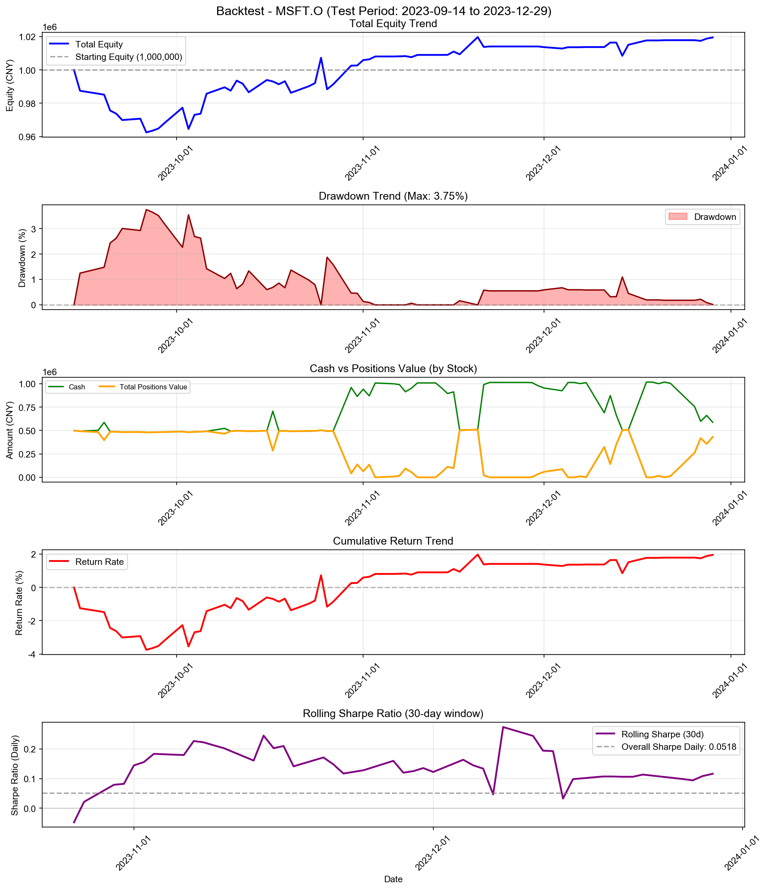
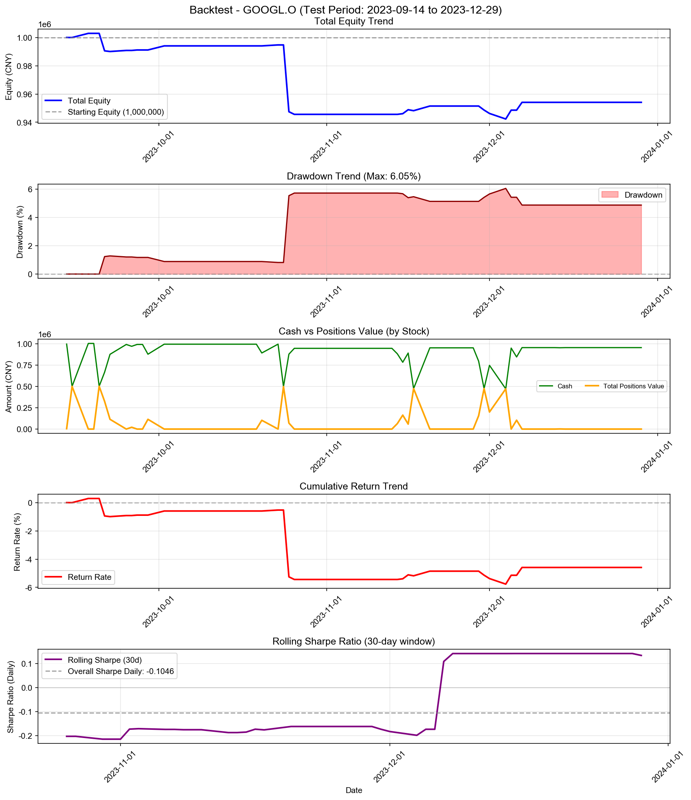
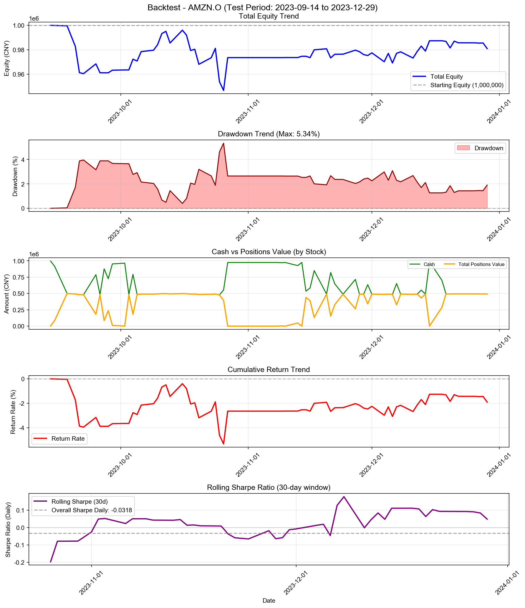
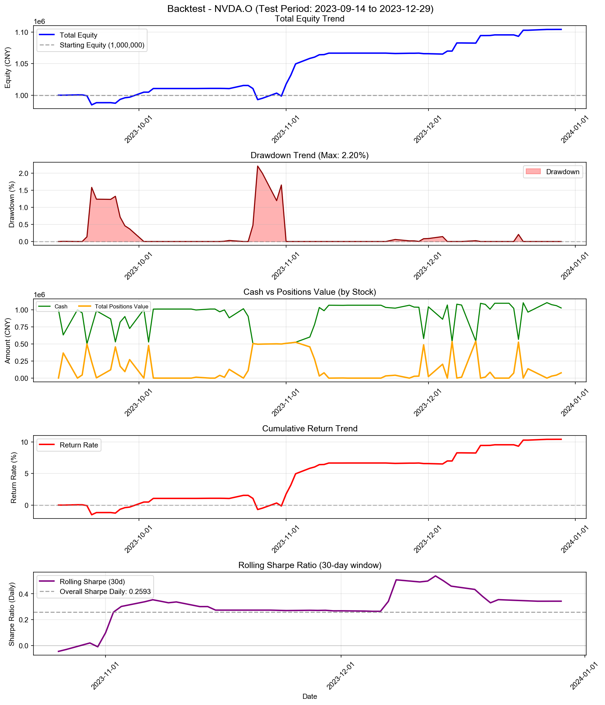
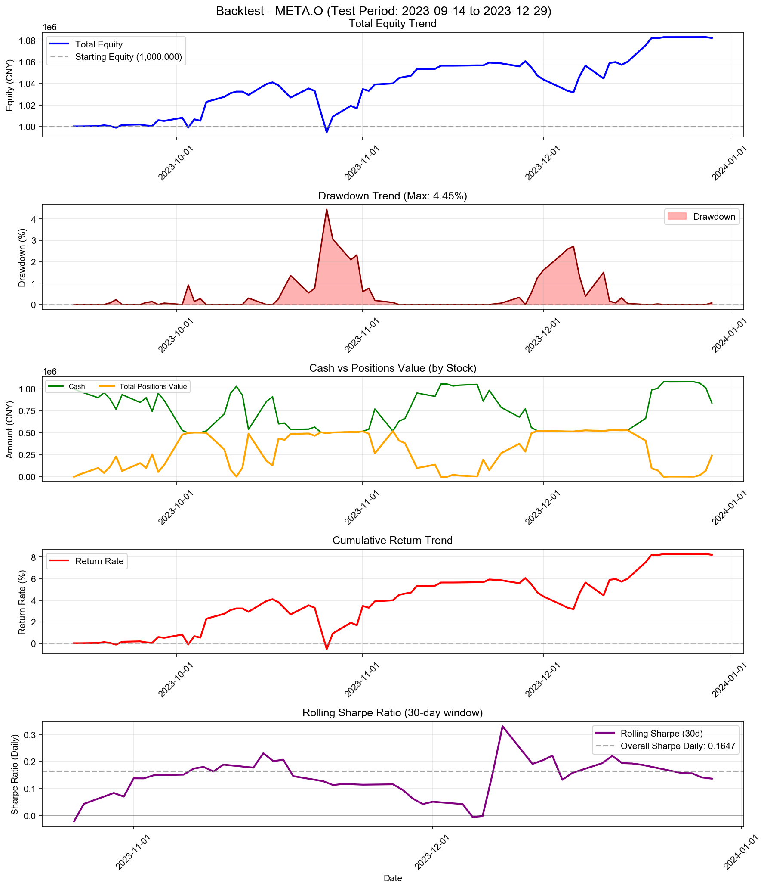
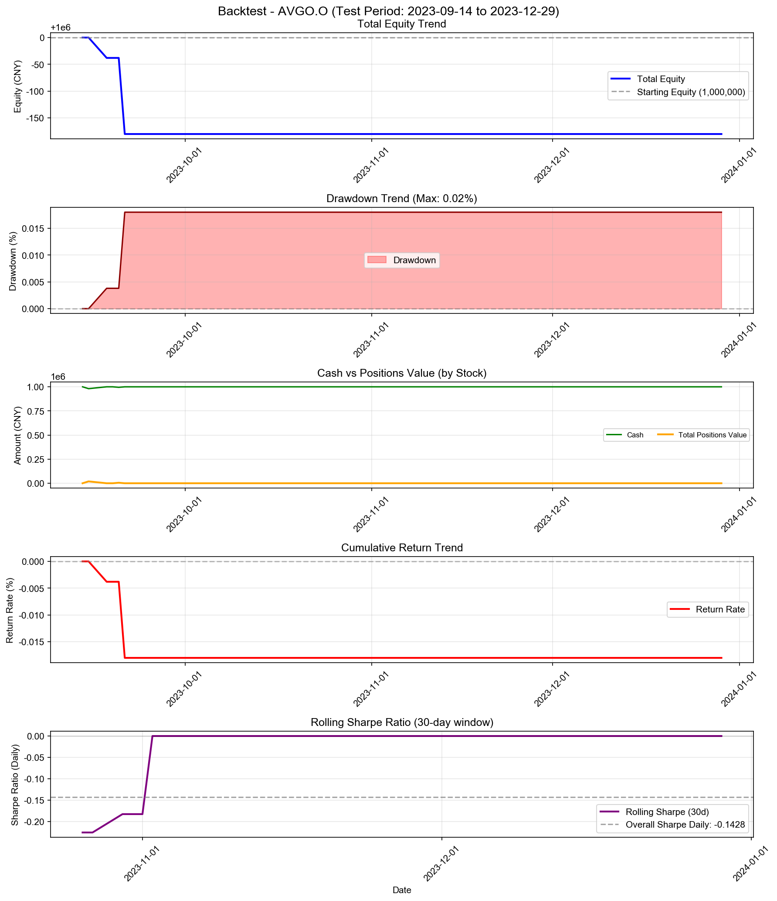
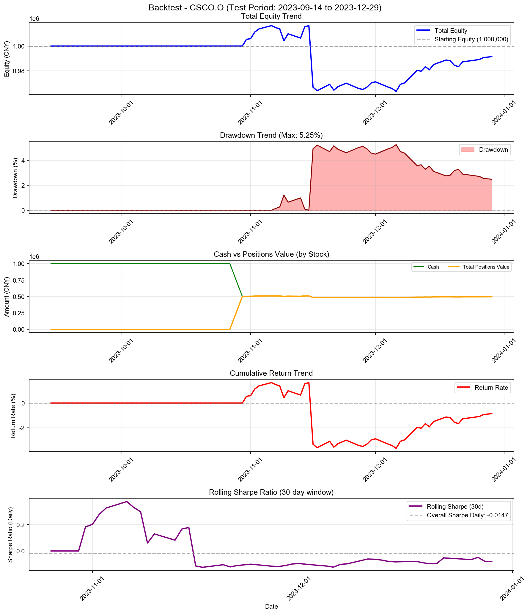

# Logistic Regression Strategy (Higher Position) - 多股票回测综合报告

**策略名称:** Logistic Regression Strategy (Higher Position)  
**回测期间:** 2023-01-03 至 2023-12-29  
**测试股票数:** 10 支  
**每只股票初始资金:** 1000000.00 元

---

## 综合统计

| 项目 | 数值 |
|------|------|
| 成功回测股票数 | 10/10 |
| 总初始资金 | 10000000.00 元 |
| 总最终权益 | 10170391.76 元 |
| 总盈亏 | +170391.76 元 |
| 平均收益率 | +1.70% |
| 总交易次数 | 396 次 |

---

## 各股票详细结果

| 股票代码 | 初始资金 | 最终权益 | 盈亏 | 收益率 | 交易次数 |
|----------|----------|----------|------|--------|------------------|
| AAPL.O | 1000000.00 | 1035119.98 | +35119.98 | +3.51% | 54 |
| MSFT.O | 1000000.00 | 1019592.29 | +19592.29 | +1.96% | 61 |
| GOOGL.O | 1000000.00 | 954094.64 | -45905.36 | -4.59% | 30 |
| AMZN.O | 1000000.00 | 980941.98 | -19058.02 | -1.91% | 64 |
| NVDA.O | 1000000.00 | 1104051.06 | +104051.06 | +10.41% | 63 |
| META.O | 1000000.00 | 1082116.49 | +82116.49 | +8.21% | 73 |
| TSLA.O | 1000000.00 | 1003252.93 | +3252.93 | +0.33% | 4 |
| AVGO.O | 1000000.00 | 999819.76 | -180.24 | -0.02% | 4 |
| COST.O | 1000000.00 | 1000000.00 | +0.00 | +0.00% | 0 |
| CSCO.O | 1000000.00 | 991402.63 | -8597.37 | -0.86% | 43 |

---

## 收益率排名

### 收益率最高的股票

| 排名 | 股票代码 | 收益率 | 盈亏 |
|------|----------|--------|------|
| 1 | NVDA.O | +10.41% | +104051.06 |
| 2 | META.O | +8.21% | +82116.49 |
| 3 | AAPL.O | +3.51% | +35119.98 |
| 4 | MSFT.O | +1.96% | +19592.29 |
| 5 | TSLA.O | +0.33% | +3252.93 |

### 收益率最低的股票

| 排名 | 股票代码 | 收益率 | 盈亏 |
|------|----------|--------|------|
| 1 | GOOGL.O | -4.59% | -45905.36 |
| 2 | AMZN.O | -1.91% | -19058.02 |
| 3 | CSCO.O | -0.86% | -8597.37 |
| 4 | AVGO.O | -0.02% | -180.24 |
| 5 | COST.O | +0.00% | +0.00 |

---

## 交易统计

| 股票代码 | 交易次数 | 平均每笔交易金额 |
|----------|------------------|------------------|
| AAPL.O | 54 | 18843.70 |
| MSFT.O | 61 | 16554.04 |
| GOOGL.O | 30 | 32568.24 |
| AMZN.O | 64 | 15476.11 |
| NVDA.O | 63 | 16698.82 |
| META.O | 73 | 14261.07 |
| TSLA.O | 4 | 250406.62 |
| AVGO.O | 4 | 249977.47 |
| COST.O | 0 | 0.00 |
| CSCO.O | 43 | 23155.84 |

---

## 各股票详细分析

### AAPL.O

#### 账户摘要

| 项目 | 数值 |
|------|------|
| 初始资金 | 1000000.00 元 |
| 最终现金 | 517751.66 元 |
| 最终持仓市值 | 517368.32 元 |
| 最终总权益 | 1035119.98 元 |
| 总盈亏 | +35119.98 元 |
| 总收益率 | +3.51% |

| 资金比（现金/权益） | 50.02% |

#### 风险与稳健性指标

| 指标 | 数值 |
|------|------|
| 最大回撤 (Max Drawdown) | 3.75% |
| 年化收益率 (CAGR) | +12.30% |
| 年化夏普比率 (Sharpe) | 1.8746 |
| 日频夏普比率 (Sharpe Daily) | 0.1181 |
| 年化 Sortino 比率 | 1.8112 |
| 日频 Sortino 比率 | 0.1141 |
| Calmar 比率 (CAGR/MaxDD) | 3.2828 |
| 年化波动率 (Volatility) | 6.38% |
| VaR 95% | -0.65% |
| VaR 99% | -1.23% |
| CVaR 95% | -0.82% |
| CVaR 99% | -1.23% |

#### 统计信息

| 指标 | 数值 |
|------|------|
| 交易日数 | 75 天 |
| 最高权益 | 1049973.27 元 |
| 最低权益 | 974277.12 元 |
| 最高收益率 | +5.00% |
| 最低收益率 | -2.57% |

#### 最终持仓

| 股票代码 | 股数 | 成本价 | 现价 | 市值 | 盈亏 | 收益率 |
|----------|------|--------|------|------|------|--------|
| AAPL.O | 929 | 529.87 | 556.91 | 517368.32 | +25123.64 | +5.10% |

---

### MSFT.O

#### 账户摘要

| 项目 | 数值 |
|------|------|
| 初始资金 | 1000000.00 元 |
| 最终现金 | 588115.02 元 |
| 最终持仓市值 | 431477.27 元 |
| 最终总权益 | 1019592.29 元 |
| 总盈亏 | +19592.29 元 |
| 总收益率 | +1.96% |

| 资金比（现金/权益） | 57.68% |

#### 风险与稳健性指标

| 指标 | 数值 |
|------|------|
| 最大回撤 (Max Drawdown) | 3.75% |
| 年化收益率 (CAGR) | +6.74% |
| 年化夏普比率 (Sharpe) | 0.8223 |
| 日频夏普比率 (Sharpe Daily) | 0.0518 |
| 年化 Sortino 比率 | 0.6480 |
| 日频 Sortino 比率 | 0.0408 |
| Calmar 比率 (CAGR/MaxDD) | 1.7956 |
| 年化波动率 (Volatility) | 8.47% |
| VaR 95% | -0.97% |
| VaR 99% | -1.88% |
| CVaR 95% | -1.35% |
| CVaR 99% | -1.88% |

#### 统计信息

| 指标 | 数值 |
|------|------|
| 交易日数 | 75 天 |
| 最高权益 | 1019773.19 元 |
| 最低权益 | 962483.75 元 |
| 最高收益率 | +1.98% |
| 最低收益率 | -3.75% |

#### 最终持仓

| 股票代码 | 股数 | 成本价 | 现价 | 市值 | 盈亏 | 收益率 |
|----------|------|--------|------|------|------|--------|
| MSFT.O | 247 | 1740.69 | 1746.87 | 431477.27 | +1526.55 | +0.36% |

---

### GOOGL.O

#### 账户摘要

| 项目 | 数值 |
|------|------|
| 初始资金 | 1000000.00 元 |
| 最终现金 | 954094.64 元 |
| 最终持仓市值 | 0.00 元 |
| 最终总权益 | 954094.64 元 |
| 总盈亏 | -45905.36 元 |
| 总收益率 | -4.59% |

| 资金比（现金/权益） | 100.00% |

#### 风险与稳健性指标

| 指标 | 数值 |
|------|------|
| 最大回撤 (Max Drawdown) | 6.05% |
| 年化收益率 (CAGR) | -14.61% |
| 年化夏普比率 (Sharpe) | -1.6611 |
| 日频夏普比率 (Sharpe Daily) | -0.1046 |
| 年化 Sortino 比率 | -0.5938 |
| 日频 Sortino 比率 | -0.0374 |
| Calmar 比率 (CAGR/MaxDD) | -2.4160 |
| 年化波动率 (Volatility) | 9.36% |
| VaR 95% | -0.30% |
| VaR 99% | -4.75% |
| CVaR 95% | -1.68% |
| CVaR 99% | -4.75% |

#### 统计信息

| 指标 | 数值 |
|------|------|
| 交易日数 | 75 天 |
| 最高权益 | 1002925.67 元 |
| 最低权益 | 942293.08 元 |
| 最高收益率 | +0.29% |
| 最低收益率 | -5.77% |

---

### AMZN.O

#### 账户摘要

| 项目 | 数值 |
|------|------|
| 初始资金 | 1000000.00 元 |
| 最终现金 | 490479.66 元 |
| 最终持仓市值 | 490462.32 元 |
| 最终总权益 | 980941.98 元 |
| 总盈亏 | -19058.02 元 |
| 总收益率 | -1.91% |

| 资金比（现金/权益） | 50.00% |

#### 风险与稳健性指标

| 指标 | 数值 |
|------|------|
| 最大回撤 (Max Drawdown) | 5.34% |
| 年化收益率 (CAGR) | -6.26% |
| 年化夏普比率 (Sharpe) | -0.5055 |
| 日频夏普比率 (Sharpe Daily) | -0.0318 |
| 年化 Sortino 比率 | -0.4148 |
| 日频 Sortino 比率 | -0.0261 |
| Calmar 比率 (CAGR/MaxDD) | -1.1731 |
| 年化波动率 (Volatility) | 11.64% |
| VaR 95% | -1.26% |
| VaR 99% | -2.79% |
| CVaR 95% | -1.88% |
| CVaR 99% | -2.79% |

#### 统计信息

| 指标 | 数值 |
|------|------|
| 交易日数 | 75 天 |
| 最高权益 | 1000000.00 元 |
| 最低权益 | 946631.42 元 |
| 最高收益率 | +0.00% |
| 最低收益率 | -5.34% |

#### 最终持仓

| 股票代码 | 股数 | 成本价 | 现价 | 市值 | 盈亏 | 收益率 |
|----------|------|--------|------|------|------|--------|
| AMZN.O | 1345 | 369.42 | 364.66 | 490462.32 | -6407.15 | -1.29% |

---

### NVDA.O

#### 账户摘要

| 项目 | 数值 |
|------|------|
| 初始资金 | 1000000.00 元 |
| 最终现金 | 1026576.59 元 |
| 最终持仓市值 | 77474.47 元 |
| 最终总权益 | 1104051.06 元 |
| 总盈亏 | +104051.06 元 |
| 总收益率 | +10.41% |

| 资金比（现金/权益） | 92.98% |

#### 风险与稳健性指标

| 指标 | 数值 |
|------|------|
| 最大回撤 (Max Drawdown) | 2.20% |
| 年化收益率 (CAGR) | +39.46% |
| 年化夏普比率 (Sharpe) | 4.1169 |
| 日频夏普比率 (Sharpe Daily) | 0.2593 |
| 年化 Sortino 比率 | 3.6158 |
| 日频 Sortino 比率 | 0.2278 |
| Calmar 比率 (CAGR/MaxDD) | 17.8956 |
| 年化波动率 (Volatility) | 8.28% |
| VaR 95% | -0.46% |
| VaR 99% | -1.74% |
| CVaR 95% | -1.03% |
| CVaR 99% | -1.74% |

#### 统计信息

| 指标 | 数值 |
|------|------|
| 交易日数 | 75 天 |
| 最高权益 | 1104051.06 元 |
| 最低权益 | 984684.44 元 |
| 最高收益率 | +10.41% |
| 最低收益率 | -1.53% |

#### 最终持仓

| 股票代码 | 股数 | 成本价 | 现价 | 市值 | 盈亏 | 收益率 |
|----------|------|--------|------|------|------|--------|
| NVDA.O | 299 | 258.90 | 259.11 | 77474.47 | +62.63 | +0.08% |

---

### META.O

#### 账户摘要

| 项目 | 数值 |
|------|------|
| 初始资金 | 1000000.00 元 |
| 最终现金 | 840152.97 元 |
| 最终持仓市值 | 241963.52 元 |
| 最终总权益 | 1082116.49 元 |
| 总盈亏 | +82116.49 元 |
| 总收益率 | +8.21% |

| 资金比（现金/权益） | 77.64% |

#### 风险与稳健性指标

| 指标 | 数值 |
|------|------|
| 最大回撤 (Max Drawdown) | 4.45% |
| 年化收益率 (CAGR) | +30.36% |
| 年化夏普比率 (Sharpe) | 2.6142 |
| 日频夏普比率 (Sharpe Daily) | 0.1647 |
| 年化 Sortino 比率 | 2.7590 |
| 日频 Sortino 比率 | 0.1738 |
| Calmar 比率 (CAGR/MaxDD) | 6.8217 |
| 年化波动率 (Volatility) | 10.49% |
| VaR 95% | -0.91% |
| VaR 99% | -1.88% |
| CVaR 95% | -1.45% |
| CVaR 99% | -1.88% |

#### 统计信息

| 指标 | 数值 |
|------|------|
| 交易日数 | 75 天 |
| 最高权益 | 1082969.79 元 |
| 最低权益 | 994594.84 元 |
| 最高收益率 | +8.30% |
| 最低收益率 | -0.54% |

#### 最终持仓

| 股票代码 | 股数 | 成本价 | 现价 | 市值 | 盈亏 | 收益率 |
|----------|------|--------|------|------|------|--------|
| META.O | 68359 | 3.55 | 3.54 | 241963.52 | -805.59 | -0.33% |

---

### TSLA.O

#### 账户摘要

| 项目 | 数值 |
|------|------|
| 初始资金 | 1000000.00 元 |
| 最终现金 | 1003252.93 元 |
| 最终持仓市值 | 0.00 元 |
| 最终总权益 | 1003252.93 元 |
| 总盈亏 | +3252.93 元 |
| 总收益率 | +0.33% |

| 资金比（现金/权益） | 100.00% |

#### 风险与稳健性指标

| 指标 | 数值 |
|------|------|
| 最大回撤 (Max Drawdown) | 0.00% |
| 年化收益率 (CAGR) | +1.10% |
| 年化夏普比率 (Sharpe) | 2.2935 |
| 日频夏普比率 (Sharpe Daily) | 0.1445 |
| 年化 Sortino 比率 | 0.0000 |
| 日频 Sortino 比率 | 0.0000 |
| 年化波动率 (Volatility) | 0.48% |
| VaR 95% | 0.00% |
| VaR 99% | 0.00% |
| CVaR 95% | 0.00% |
| CVaR 99% | 0.00% |

#### 统计信息

| 指标 | 数值 |
|------|------|
| 交易日数 | 75 天 |
| 最高权益 | 1003252.93 元 |
| 最低权益 | 1000000.00 元 |
| 最高收益率 | +0.33% |
| 最低收益率 | +0.00% |

---

### AVGO.O

#### 账户摘要

| 项目 | 数值 |
|------|------|
| 初始资金 | 1000000.00 元 |
| 最终现金 | 999819.76 元 |
| 最终持仓市值 | 0.00 元 |
| 最终总权益 | 999819.76 元 |
| 总盈亏 | -180.24 元 |
| 总收益率 | -0.02% |

| 资金比（现金/权益） | 100.00% |

#### 风险与稳健性指标

| 指标 | 数值 |
|------|------|
| 最大回撤 (Max Drawdown) | 0.02% |
| 年化收益率 (CAGR) | -0.06% |
| 年化夏普比率 (Sharpe) | -2.2671 |
| 日频夏普比率 (Sharpe Daily) | -0.1428 |
| 年化 Sortino 比率 | -0.2626 |
| 日频 Sortino 比率 | -0.0165 |
| Calmar 比率 (CAGR/MaxDD) | -3.3593 |
| 年化波动率 (Volatility) | 0.03% |
| VaR 95% | 0.00% |
| VaR 99% | -0.01% |
| CVaR 95% | -0.00% |
| CVaR 99% | -0.01% |

#### 统计信息

| 指标 | 数值 |
|------|------|
| 交易日数 | 75 天 |
| 最高权益 | 1000000.00 元 |
| 最低权益 | 999819.76 元 |
| 最高收益率 | +0.00% |
| 最低收益率 | -0.02% |

---

### COST.O

#### 账户摘要

| 项目 | 数值 |
|------|------|
| 初始资金 | 1000000.00 元 |
| 最终现金 | 1000000.00 元 |
| 最终持仓市值 | 0.00 元 |
| 最终总权益 | 1000000.00 元 |
| 总盈亏 | +0.00 元 |
| 总收益率 | +0.00% |

| 资金比（现金/权益） | 100.00% |

#### 风险与稳健性指标

| 指标 | 数值 |
|------|------|
| 最大回撤 (Max Drawdown) | 0.00% |
| 年化收益率 (CAGR) | +0.00% |
| 年化夏普比率 (Sharpe) | 0.0000 |
| 日频夏普比率 (Sharpe Daily) | 0.0000 |
| 年化 Sortino 比率 | 0.0000 |
| 日频 Sortino 比率 | 0.0000 |
| 年化波动率 (Volatility) | 0.00% |
| VaR 95% | 0.00% |
| VaR 99% | 0.00% |
| CVaR 95% | 0.00% |
| CVaR 99% | 0.00% |

#### 统计信息

| 指标 | 数值 |
|------|------|
| 交易日数 | 75 天 |
| 最高权益 | 1000000.00 元 |
| 最低权益 | 1000000.00 元 |
| 最高收益率 | +0.00% |
| 最低收益率 | +0.00% |

---

### CSCO.O

#### 账户摘要

| 项目 | 数值 |
|------|------|
| 初始资金 | 1000000.00 元 |
| 最终现金 | 495571.62 元 |
| 最终持仓市值 | 495831.01 元 |
| 最终总权益 | 991402.63 元 |
| 总盈亏 | -8597.37 元 |
| 总收益率 | -0.86% |

| 资金比（现金/权益） | 49.99% |

#### 风险与稳健性指标

| 指标 | 数值 |
|------|------|
| 最大回撤 (Max Drawdown) | 5.25% |
| 年化收益率 (CAGR) | -2.86% |
| 年化夏普比率 (Sharpe) | -0.2326 |
| 日频夏普比率 (Sharpe Daily) | -0.0147 |
| 年化 Sortino 比率 | -0.1181 |
| 日频 Sortino 比率 | -0.0074 |
| Calmar 比率 (CAGR/MaxDD) | -0.5447 |
| 年化波动率 (Volatility) | 10.32% |
| VaR 95% | -0.44% |
| VaR 99% | -4.92% |
| CVaR 95% | -1.70% |
| CVaR 99% | -4.92% |

#### 统计信息

| 指标 | 数值 |
|------|------|
| 交易日数 | 75 天 |
| 最高权益 | 1016590.52 元 |
| 最低权益 | 963223.97 元 |
| 最高收益率 | +1.66% |
| 最低收益率 | -3.68% |

#### 最终持仓

| 股票代码 | 股数 | 成本价 | 现价 | 市值 | 盈亏 | 收益率 |
|----------|------|--------|------|------|------|--------|
| CSCO.O | 2348 | 214.51 | 211.17 | 495831.01 | -7833.81 | -1.56% |

---

---

## 策略参数

- **train_window_days:** 252
- **prediction_horizon:** 5
- **ret_threshold:** 0.00%
- **retrain_frequency:** 每 20 个交易日
- **max_position_weight:** 50%
- **min_score_threshold:** 0.0
- **max_total_weight:** 100%
- **train_test_split_ratio:** 70%

---

*报告生成时间: 2025-12-24 17:47:44*
