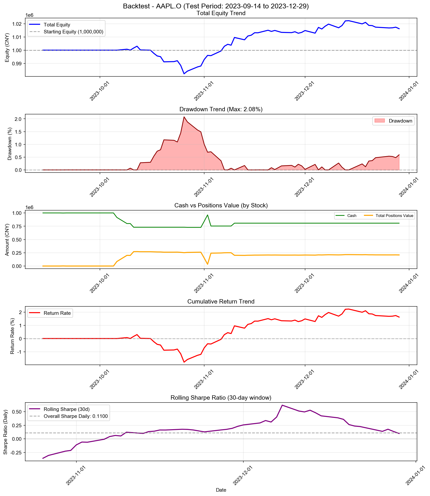
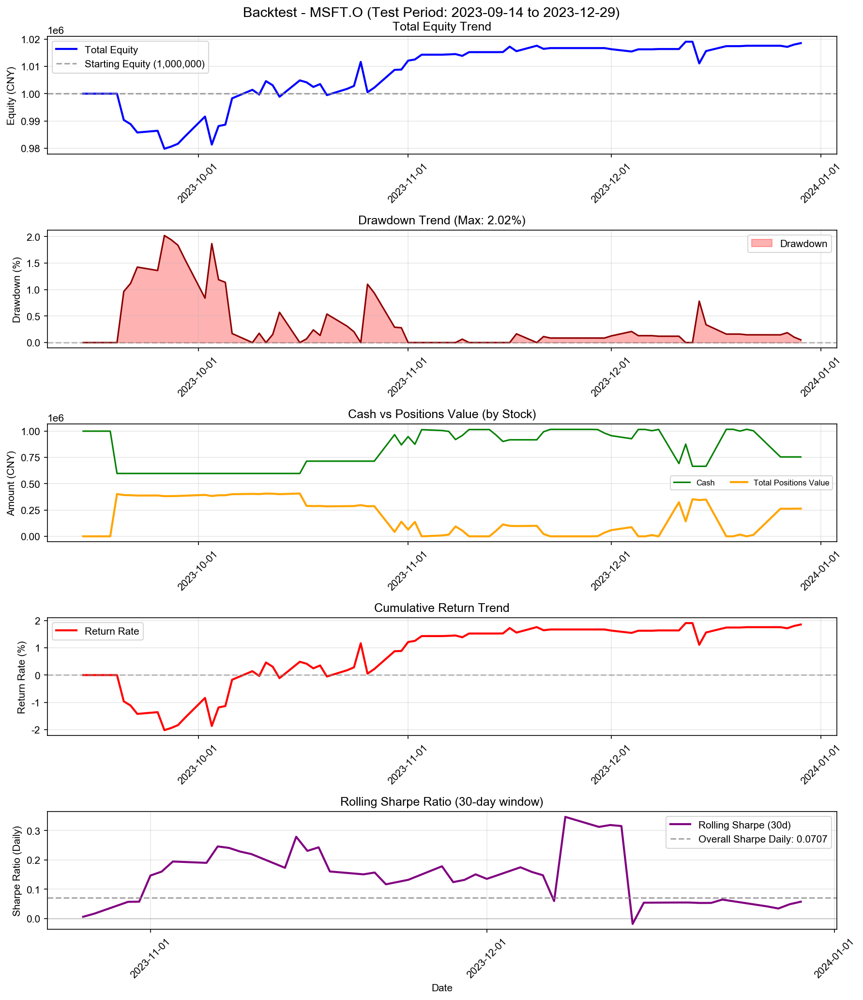
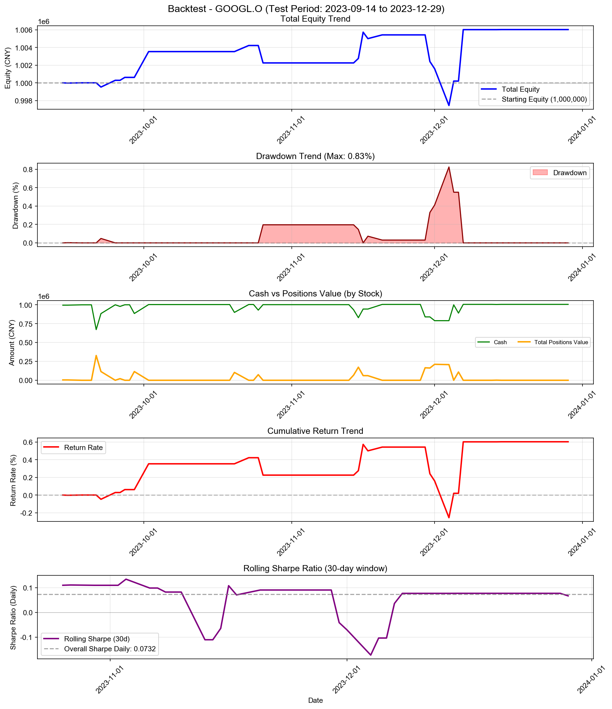
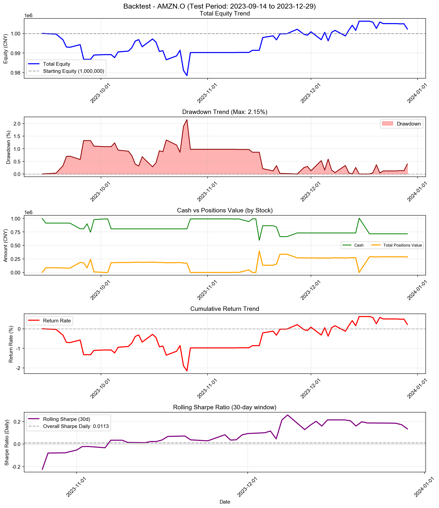
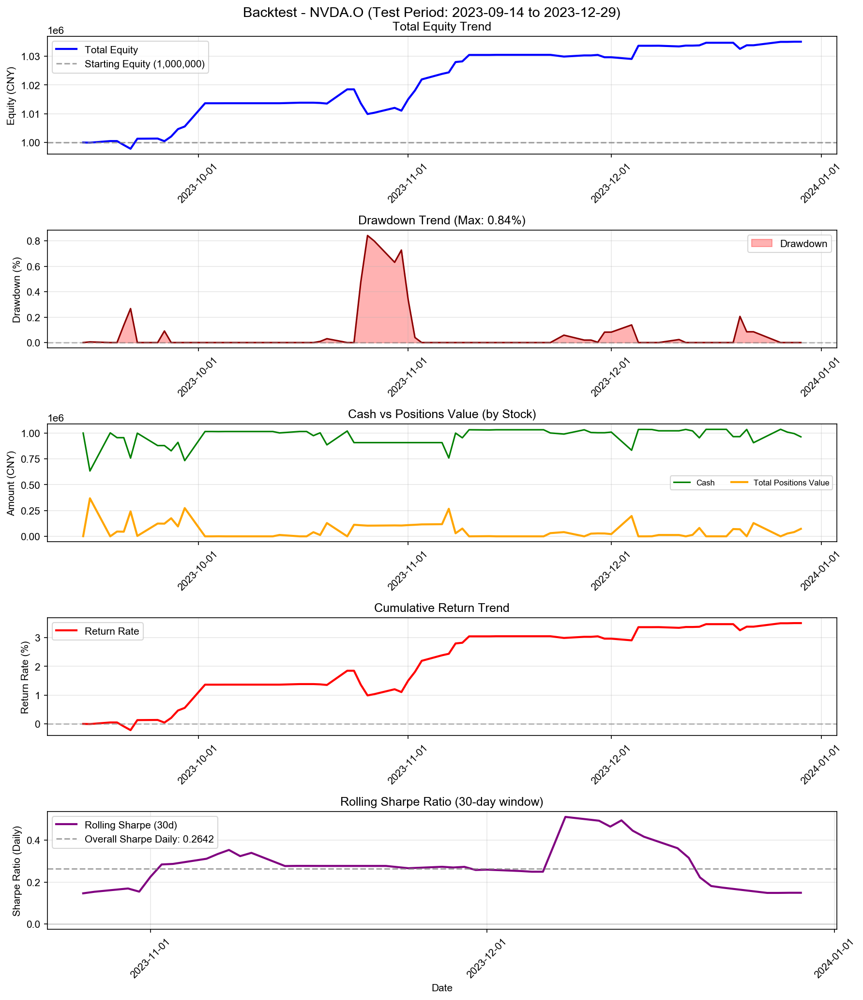
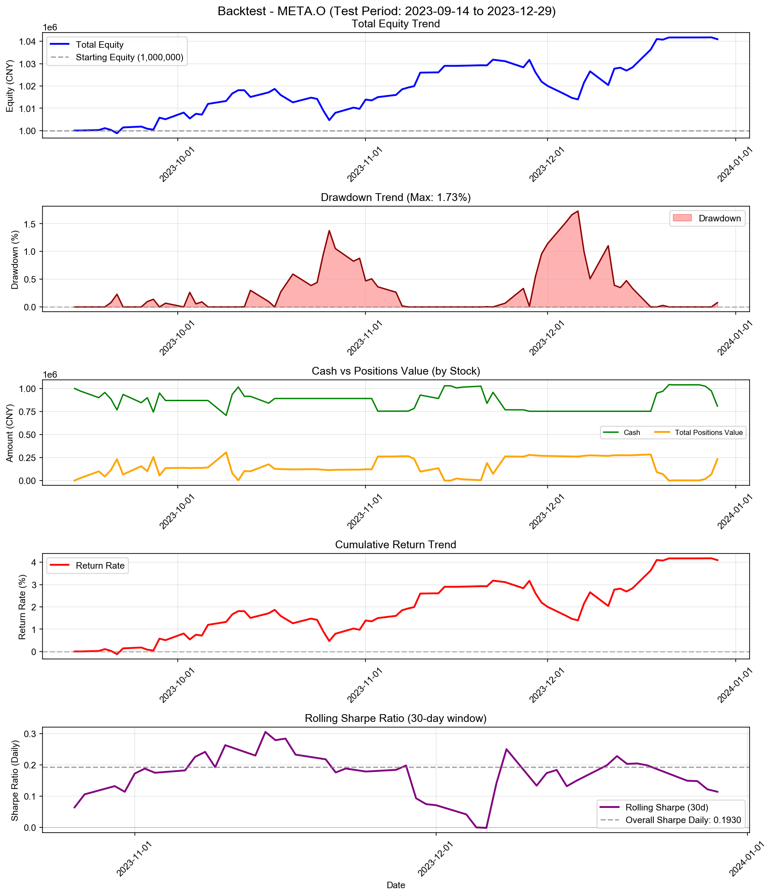
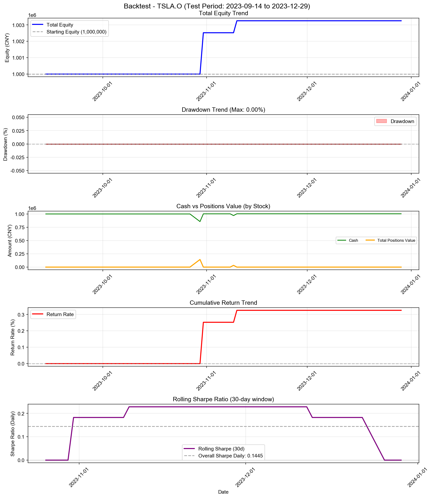
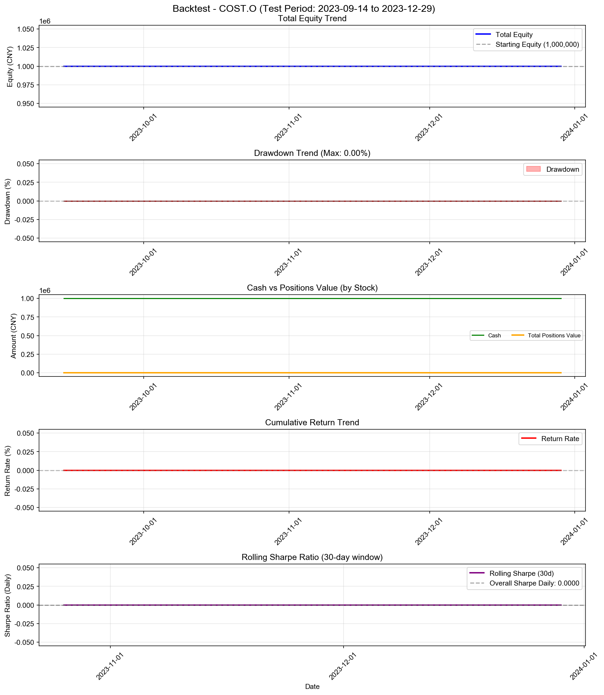

# Logistic Regression Strategy (Higher Position + Risk Control) - 多股票回测综合报告

**策略名称:** Logistic Regression Strategy (Higher Position + Risk Control)  
**回测期间:** 2023-01-03 至 2023-12-29  
**测试股票数:** 10 支  
**每只股票初始资金:** 1000000.00 元

---

## 综合统计

| 项目 | 数值 |
|------|------|
| 成功回测股票数 | 10/10 |
| 总初始资金 | 10000000.00 元 |
| 总最终权益 | 10122048.01 元 |
| 总盈亏 | +122048.01 元 |
| 平均收益率 | +1.22% |
| 总交易次数 | 178 次 |

---

## 各股票详细结果

| 股票代码 | 初始资金 | 最终权益 | 盈亏 | 收益率 | 交易次数 |
|----------|----------|----------|------|--------|------------------|
| AAPL.O | 1000000.00 | 1016222.03 | +16222.03 | +1.62% | 10 |
| MSFT.O | 1000000.00 | 1018558.93 | +18558.93 | +1.86% | 32 |
| GOOGL.O | 1000000.00 | 1006035.07 | +6035.07 | +0.60% | 24 |
| AMZN.O | 1000000.00 | 1002208.50 | +2208.50 | +0.22% | 20 |
| NVDA.O | 1000000.00 | 1035003.35 | +35003.35 | +3.50% | 47 |
| META.O | 1000000.00 | 1040947.45 | +40947.45 | +4.09% | 37 |
| TSLA.O | 1000000.00 | 1003252.93 | +3252.93 | +0.33% | 4 |
| AVGO.O | 1000000.00 | 999819.76 | -180.24 | -0.02% | 4 |
| COST.O | 1000000.00 | 1000000.00 | +0.00 | +0.00% | 0 |
| CSCO.O | 1000000.00 | 1000000.00 | +0.00 | +0.00% | 0 |

---

## 收益率排名

### 收益率最高的股票

| 排名 | 股票代码 | 收益率 | 盈亏 |
|------|----------|--------|------|
| 1 | META.O | +4.09% | +40947.45 |
| 2 | NVDA.O | +3.50% | +35003.35 |
| 3 | MSFT.O | +1.86% | +18558.93 |
| 4 | AAPL.O | +1.62% | +16222.03 |
| 5 | GOOGL.O | +0.60% | +6035.07 |

### 收益率最低的股票

| 排名 | 股票代码 | 收益率 | 盈亏 |
|------|----------|--------|------|
| 1 | AVGO.O | -0.02% | -180.24 |
| 2 | COST.O | +0.00% | +0.00 |
| 3 | CSCO.O | +0.00% | +0.00 |
| 4 | AMZN.O | +0.22% | +2208.50 |
| 5 | TSLA.O | +0.33% | +3252.93 |

---

## 交易统计

| 股票代码 | 交易次数 | 平均每笔交易金额 |
|----------|------------------|------------------|
| AAPL.O | 10 | 100811.10 |
| MSFT.O | 32 | 31539.98 |
| GOOGL.O | 24 | 41792.40 |
| AMZN.O | 20 | 50055.21 |
| NVDA.O | 47 | 21648.97 |
| META.O | 37 | 27580.37 |
| TSLA.O | 4 | 250406.62 |
| AVGO.O | 4 | 249977.47 |
| COST.O | 0 | 0.00 |
| CSCO.O | 0 | 0.00 |

---

## 各股票详细分析

### AAPL.O

#### 账户摘要

| 项目 | 数值 |
|------|------|
| 初始资金 | 1000000.00 元 |
| 最终现金 | 807381.21 元 |
| 最终持仓市值 | 208840.82 元 |
| 最终总权益 | 1016222.03 元 |
| 总盈亏 | +16222.03 元 |
| 总收益率 | +1.62% |

| 资金比（现金/权益） | 79.45% |

#### 风险与稳健性指标

| 指标 | 数值 |
|------|------|
| 最大回撤 (Max Drawdown) | 2.08% |
| 年化收益率 (CAGR) | +5.56% |
| 年化夏普比率 (Sharpe) | 1.7469 |
| 日频夏普比率 (Sharpe Daily) | 0.1100 |
| 年化 Sortino 比率 | 1.6617 |
| 日频 Sortino 比率 | 0.1047 |
| Calmar 比率 (CAGR/MaxDD) | 2.6739 |
| 年化波动率 (Volatility) | 3.17% |
| VaR 95% | -0.28% |
| VaR 99% | -0.64% |
| CVaR 95% | -0.42% |
| CVaR 99% | -0.64% |

#### 统计信息

| 指标 | 数值 |
|------|------|
| 交易日数 | 75 天 |
| 最高权益 | 1022274.75 元 |
| 最低权益 | 982141.82 元 |
| 最高收益率 | +2.23% |
| 最低收益率 | -1.79% |

#### 最终持仓

| 股票代码 | 股数 | 成本价 | 现价 | 市值 | 盈亏 | 收益率 |
|----------|------|--------|------|------|------|--------|
| AAPL.O | 375 | 511.06 | 556.91 | 208840.82 | +17192.17 | +8.97% |

---

### MSFT.O

#### 账户摘要

| 项目 | 数值 |
|------|------|
| 初始资金 | 1000000.00 元 |
| 最终现金 | 754781.33 元 |
| 最终持仓市值 | 263777.60 元 |
| 最终总权益 | 1018558.93 元 |
| 总盈亏 | +18558.93 元 |
| 总收益率 | +1.86% |

| 资金比（现金/权益） | 74.10% |

#### 风险与稳健性指标

| 指标 | 数值 |
|------|------|
| 最大回撤 (Max Drawdown) | 2.02% |
| 年化收益率 (CAGR) | +6.37% |
| 年化夏普比率 (Sharpe) | 1.1223 |
| 日频夏普比率 (Sharpe Daily) | 0.0707 |
| 年化 Sortino 比率 | 0.7986 |
| 日频 Sortino 比率 | 0.0503 |
| Calmar 比率 (CAGR/MaxDD) | 3.1541 |
| 年化波动率 (Volatility) | 5.72% |
| VaR 95% | -0.78% |
| VaR 99% | -1.10% |
| CVaR 95% | -0.97% |
| CVaR 99% | -1.10% |

#### 统计信息

| 指标 | 数值 |
|------|------|
| 交易日数 | 75 天 |
| 最高权益 | 1019078.10 元 |
| 最低权益 | 979793.21 元 |
| 最高收益率 | +1.91% |
| 最低收益率 | -2.02% |

#### 最终持仓

| 股票代码 | 股数 | 成本价 | 现价 | 市值 | 盈亏 | 收益率 |
|----------|------|--------|------|------|------|--------|
| MSFT.O | 151 | 1740.44 | 1746.87 | 263777.60 | +970.99 | +0.37% |

---

### GOOGL.O

#### 账户摘要

| 项目 | 数值 |
|------|------|
| 初始资金 | 1000000.00 元 |
| 最终现金 | 1006035.07 元 |
| 最终持仓市值 | 0.00 元 |
| 最终总权益 | 1006035.07 元 |
| 总盈亏 | +6035.07 元 |
| 总收益率 | +0.60% |

| 资金比（现金/权益） | 100.00% |

#### 风险与稳健性指标

| 指标 | 数值 |
|------|------|
| 最大回撤 (Max Drawdown) | 0.83% |
| 年化收益率 (CAGR) | +2.04% |
| 年化夏普比率 (Sharpe) | 1.1616 |
| 日频夏普比率 (Sharpe Daily) | 0.0732 |
| 年化 Sortino 比率 | 0.6131 |
| 日频 Sortino 比率 | 0.0386 |
| Calmar 比率 (CAGR/MaxDD) | 2.4749 |
| 年化波动率 (Volatility) | 1.78% |
| VaR 95% | -0.08% |
| VaR 99% | -0.41% |
| CVaR 95% | -0.25% |
| CVaR 99% | -0.41% |

#### 统计信息

| 指标 | 数值 |
|------|------|
| 交易日数 | 75 天 |
| 最高权益 | 1006035.07 元 |
| 最低权益 | 997440.41 元 |
| 最高收益率 | +0.60% |
| 最低收益率 | -0.26% |

---

### AMZN.O

#### 账户摘要

| 项目 | 数值 |
|------|------|
| 初始资金 | 1000000.00 元 |
| 最终现金 | 715224.23 元 |
| 最终持仓市值 | 286984.27 元 |
| 最终总权益 | 1002208.50 元 |
| 总盈亏 | +2208.50 元 |
| 总收益率 | +0.22% |

| 资金比（现金/权益） | 71.36% |

#### 风险与稳健性指标

| 指标 | 数值 |
|------|------|
| 最大回撤 (Max Drawdown) | 2.15% |
| 年化收益率 (CAGR) | +0.74% |
| 年化夏普比率 (Sharpe) | 0.1793 |
| 日频夏普比率 (Sharpe Daily) | 0.0113 |
| 年化 Sortino 比率 | 0.1593 |
| 日频 Sortino 比率 | 0.0100 |
| Calmar 比率 (CAGR/MaxDD) | 0.3457 |
| 年化波动率 (Volatility) | 4.83% |
| VaR 95% | -0.47% |
| VaR 99% | -1.04% |
| CVaR 95% | -0.69% |
| CVaR 99% | -1.04% |

#### 统计信息

| 指标 | 数值 |
|------|------|
| 交易日数 | 75 天 |
| 最高权益 | 1006231.65 元 |
| 最低权益 | 978476.30 元 |
| 最高收益率 | +0.62% |
| 最低收益率 | -2.15% |

#### 最终持仓

| 股票代码 | 股数 | 成本价 | 现价 | 市值 | 盈亏 | 收益率 |
|----------|------|--------|------|------|------|--------|
| AMZN.O | 787 | 369.74 | 364.66 | 286984.27 | -4001.27 | -1.38% |

---

### NVDA.O

#### 账户摘要

| 项目 | 数值 |
|------|------|
| 初始资金 | 1000000.00 元 |
| 最终现金 | 962192.90 元 |
| 最终持仓市值 | 72810.46 元 |
| 最终总权益 | 1035003.35 元 |
| 总盈亏 | +35003.35 元 |
| 总收益率 | +3.50% |

| 资金比（现金/权益） | 92.97% |

#### 风险与稳健性指标

| 指标 | 数值 |
|------|------|
| 最大回撤 (Max Drawdown) | 0.84% |
| 年化收益率 (CAGR) | +12.25% |
| 年化夏普比率 (Sharpe) | 4.1935 |
| 日频夏普比率 (Sharpe Daily) | 0.2642 |
| 年化 Sortino 比率 | 4.3171 |
| 日频 Sortino 比率 | 0.2720 |
| Calmar 比率 (CAGR/MaxDD) | 14.5598 |
| 年化波动率 (Volatility) | 2.80% |
| VaR 95% | -0.14% |
| VaR 99% | -0.48% |
| CVaR 95% | -0.30% |
| CVaR 99% | -0.48% |

#### 统计信息

| 指标 | 数值 |
|------|------|
| 交易日数 | 75 天 |
| 最高权益 | 1035003.35 元 |
| 最低权益 | 997828.98 元 |
| 最高收益率 | +3.50% |
| 最低收益率 | -0.22% |

#### 最终持仓

| 股票代码 | 股数 | 成本价 | 现价 | 市值 | 盈亏 | 收益率 |
|----------|------|--------|------|------|------|--------|
| NVDA.O | 281 | 258.90 | 259.11 | 72810.46 | +58.24 | +0.08% |

---

### META.O

#### 账户摘要

| 项目 | 数值 |
|------|------|
| 初始资金 | 1000000.00 元 |
| 最终现金 | 808190.44 元 |
| 最终持仓市值 | 232757.02 元 |
| 最终总权益 | 1040947.45 元 |
| 总盈亏 | +40947.45 元 |
| 总收益率 | +4.09% |

| 资金比（现金/权益） | 77.64% |

#### 风险与稳健性指标

| 指标 | 数值 |
|------|------|
| 最大回撤 (Max Drawdown) | 1.73% |
| 年化收益率 (CAGR) | +14.44% |
| 年化夏普比率 (Sharpe) | 3.0635 |
| 日频夏普比率 (Sharpe Daily) | 0.1930 |
| 年化 Sortino 比率 | 3.4425 |
| 日频 Sortino 比率 | 0.2169 |
| Calmar 比率 (CAGR/MaxDD) | 8.3508 |
| 年化波动率 (Volatility) | 4.49% |
| VaR 95% | -0.44% |
| VaR 99% | -0.60% |
| CVaR 95% | -0.52% |
| CVaR 99% | -0.60% |

#### 统计信息

| 指标 | 数值 |
|------|------|
| 交易日数 | 75 天 |
| 最高权益 | 1041768.31 元 |
| 最低权益 | 998753.15 元 |
| 最高收益率 | +4.18% |
| 最低收益率 | -0.12% |

#### 最终持仓

| 股票代码 | 股数 | 成本价 | 现价 | 市值 | 盈亏 | 收益率 |
|----------|------|--------|------|------|------|--------|
| META.O | 65758 | 3.55 | 3.54 | 232757.02 | -775.59 | -0.33% |

---

### TSLA.O

#### 账户摘要

| 项目 | 数值 |
|------|------|
| 初始资金 | 1000000.00 元 |
| 最终现金 | 1003252.93 元 |
| 最终持仓市值 | 0.00 元 |
| 最终总权益 | 1003252.93 元 |
| 总盈亏 | +3252.93 元 |
| 总收益率 | +0.33% |

| 资金比（现金/权益） | 100.00% |

#### 风险与稳健性指标

| 指标 | 数值 |
|------|------|
| 最大回撤 (Max Drawdown) | 0.00% |
| 年化收益率 (CAGR) | +1.10% |
| 年化夏普比率 (Sharpe) | 2.2935 |
| 日频夏普比率 (Sharpe Daily) | 0.1445 |
| 年化 Sortino 比率 | 0.0000 |
| 日频 Sortino 比率 | 0.0000 |
| 年化波动率 (Volatility) | 0.48% |
| VaR 95% | 0.00% |
| VaR 99% | 0.00% |
| CVaR 95% | 0.00% |
| CVaR 99% | 0.00% |

#### 统计信息

| 指标 | 数值 |
|------|------|
| 交易日数 | 75 天 |
| 最高权益 | 1003252.93 元 |
| 最低权益 | 1000000.00 元 |
| 最高收益率 | +0.33% |
| 最低收益率 | +0.00% |

---

### AVGO.O

#### 账户摘要

| 项目 | 数值 |
|------|------|
| 初始资金 | 1000000.00 元 |
| 最终现金 | 999819.76 元 |
| 最终持仓市值 | 0.00 元 |
| 最终总权益 | 999819.76 元 |
| 总盈亏 | -180.24 元 |
| 总收益率 | -0.02% |

| 资金比（现金/权益） | 100.00% |

#### 风险与稳健性指标

| 指标 | 数值 |
|------|------|
| 最大回撤 (Max Drawdown) | 0.02% |
| 年化收益率 (CAGR) | -0.06% |
| 年化夏普比率 (Sharpe) | -2.2671 |
| 日频夏普比率 (Sharpe Daily) | -0.1428 |
| 年化 Sortino 比率 | -0.2626 |
| 日频 Sortino 比率 | -0.0165 |
| Calmar 比率 (CAGR/MaxDD) | -3.3593 |
| 年化波动率 (Volatility) | 0.03% |
| VaR 95% | 0.00% |
| VaR 99% | -0.01% |
| CVaR 95% | -0.00% |
| CVaR 99% | -0.01% |

#### 统计信息

| 指标 | 数值 |
|------|------|
| 交易日数 | 75 天 |
| 最高权益 | 1000000.00 元 |
| 最低权益 | 999819.76 元 |
| 最高收益率 | +0.00% |
| 最低收益率 | -0.02% |

---

### COST.O

#### 账户摘要

| 项目 | 数值 |
|------|------|
| 初始资金 | 1000000.00 元 |
| 最终现金 | 1000000.00 元 |
| 最终持仓市值 | 0.00 元 |
| 最终总权益 | 1000000.00 元 |
| 总盈亏 | +0.00 元 |
| 总收益率 | +0.00% |

| 资金比（现金/权益） | 100.00% |

#### 风险与稳健性指标

| 指标 | 数值 |
|------|------|
| 最大回撤 (Max Drawdown) | 0.00% |
| 年化收益率 (CAGR) | +0.00% |
| 年化夏普比率 (Sharpe) | 0.0000 |
| 日频夏普比率 (Sharpe Daily) | 0.0000 |
| 年化 Sortino 比率 | 0.0000 |
| 日频 Sortino 比率 | 0.0000 |
| 年化波动率 (Volatility) | 0.00% |
| VaR 95% | 0.00% |
| VaR 99% | 0.00% |
| CVaR 95% | 0.00% |
| CVaR 99% | 0.00% |

#### 统计信息

| 指标 | 数值 |
|------|------|
| 交易日数 | 75 天 |
| 最高权益 | 1000000.00 元 |
| 最低权益 | 1000000.00 元 |
| 最高收益率 | +0.00% |
| 最低收益率 | +0.00% |

---

### CSCO.O

#### 账户摘要

| 项目 | 数值 |
|------|------|
| 初始资金 | 1000000.00 元 |
| 最终现金 | 1000000.00 元 |
| 最终持仓市值 | 0.00 元 |
| 最终总权益 | 1000000.00 元 |
| 总盈亏 | +0.00 元 |
| 总收益率 | +0.00% |

| 资金比（现金/权益） | 100.00% |

#### 风险与稳健性指标

| 指标 | 数值 |
|------|------|
| 最大回撤 (Max Drawdown) | 0.00% |
| 年化收益率 (CAGR) | +0.00% |
| 年化夏普比率 (Sharpe) | 0.0000 |
| 日频夏普比率 (Sharpe Daily) | 0.0000 |
| 年化 Sortino 比率 | 0.0000 |
| 日频 Sortino 比率 | 0.0000 |
| 年化波动率 (Volatility) | 0.00% |
| VaR 95% | 0.00% |
| VaR 99% | 0.00% |
| CVaR 95% | 0.00% |
| CVaR 99% | 0.00% |

#### 统计信息

| 指标 | 数值 |
|------|------|
| 交易日数 | 75 天 |
| 最高权益 | 1000000.00 元 |
| 最低权益 | 1000000.00 元 |
| 最高收益率 | +0.00% |
| 最低收益率 | +0.00% |

---

---

## 策略参数

- **train_window_days:** 252
- **prediction_horizon:** 5
- **ret_threshold:** 0.00%
- **retrain_frequency:** 每 20 个交易日
- **max_position_weight:** 50%
- **min_score_threshold:** 0.0
- **max_total_weight:** 100%
- **train_test_split_ratio:** 70%
- **max_leverage:** 0.80

---

*报告生成时间: 2025-12-24 17:49:22*
