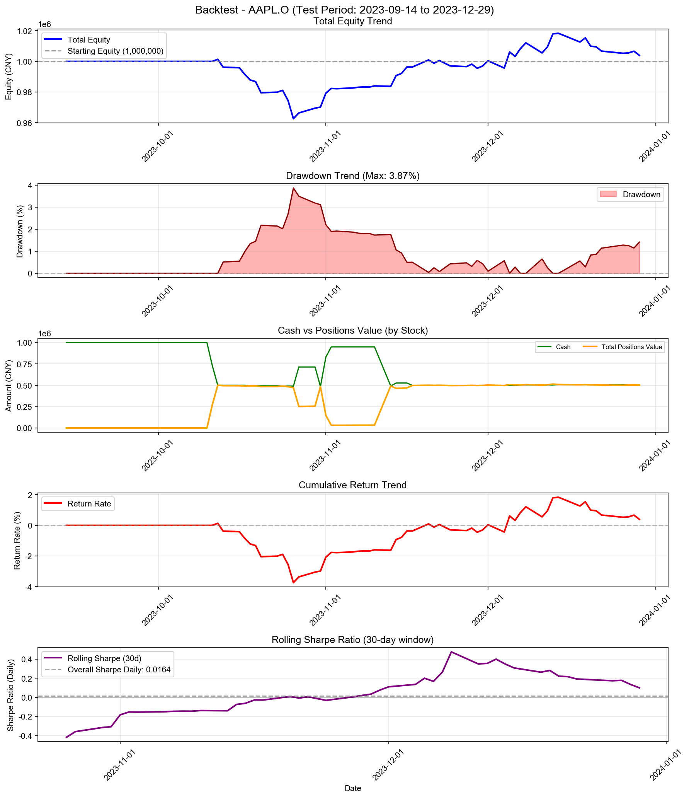

# Backtest

**股票代码:** AAPL.O  
**回测期间:** 2023-01-03 至 2023-12-29  
**交易日数:** 75

---

## 账户摘要

| 项目 | 金额 |
|------|------|
| 初始资金 | 1000000.00 元 |
| 最终现金 | 502151.25 元 |
| 最终持仓市值 | 501774.87 元 |
| 最终总权益 | 1003926.11 元 |
| 总盈亏 | +3926.11 元 |
| 总收益率 | +0.39% |

### 持仓明细

| 股票代码 | 股数 | 成本价 | 现价 | 市值 | 权重 | 盈亏 | 收益率 |
|----------|------|--------|------|------|------|------|--------|
| AAPL.O | 901 | 534.08 | 556.91 | 501774.87 | 49.98% | +20568.79 | +4.27% |

## 交易统计

| 项目 | 数值 |
|------|------|
| 总交易次数 | 22 次 |
| 买入次数 | 14 次 |
| 卖出次数 | 8 次 |
| 买入总成本 | 1233861.79 元 |
| 卖出总收入 | 736013.04 元 |
| 已实现盈亏 | -16642.68 元 |

---

## 交易记录

| 序号 | 日期 | 类型 | 股票代码 | 股数 | 价格 | 成本/收入 | 利润 |
|------|------|------|----------|------|------|-----------|------|
| 1 | 2023-10-11 | 买入 | AAPL.O | 522 | 519.40 | 271127.84 | - |
| 2 | 2023-10-12 | 买入 | AAPL.O | 437 | 522.03 | 228127.45 | - |
| 3 | 2023-10-18 | 买入 | AAPL.O | 13 | 507.96 | 6603.51 | - |
| 4 | 2023-10-24 | 买入 | AAPL.O | 7 | 501.03 | 3507.21 | - |
| 5 | 2023-10-27 | 卖出 | AAPL.O | 460 | 485.95 | 223536.98 | -15797.40 |
| 6 | 2023-10-31 | 买入 | AAPL.O | 464 | 493.32 | 228898.78 | - |
| 7 | 2023-11-01 | 卖出 | AAPL.O | 688 | 502.56 | 345761.57 | -3438.95 |
| 8 | 2023-11-02 | 卖出 | AAPL.O | 232 | 512.96 | 119006.72 | +1253.06 |
| 9 | 2023-11-13 | 买入 | AAPL.O | 857 | 534.55 | 458108.65 | - |
| 10 | 2023-11-14 | 卖出 | AAPL.O | 64 | 542.19 | 34699.88 | +607.02 |
| 11 | 2023-11-17 | 买入 | AAPL.O | 51 | 548.69 | 27983.39 | - |
| 12 | 2023-11-20 | 卖出 | AAPL.O | 3 | 553.78 | 1661.35 | +60.55 |
| 13 | 2023-11-27 | 买入 | AAPL.O | 3 | 548.98 | 1646.95 | - |
| 14 | 2023-11-29 | 买入 | AAPL.O | 1 | 547.77 | 547.77 | - |
| 15 | 2023-12-07 | 卖出 | AAPL.O | 10 | 561.94 | 5619.42 | +282.75 |
| 16 | 2023-12-14 | 卖出 | AAPL.O | 9 | 573.05 | 5157.45 | +354.45 |
| 17 | 2023-12-18 | 买入 | AAPL.O | 4 | 566.63 | 2266.51 | - |
| 18 | 2023-12-19 | 卖出 | AAPL.O | 1 | 569.67 | 569.67 | +35.85 |
| 19 | 2023-12-20 | 买入 | AAPL.O | 3 | 563.56 | 1690.69 | - |
| 20 | 2023-12-21 | 买入 | AAPL.O | 1 | 563.13 | 563.13 | - |
| 21 | 2023-12-27 | 买入 | AAPL.O | 3 | 558.70 | 1676.11 | - |
| 22 | 2023-12-29 | 买入 | AAPL.O | 2 | 556.91 | 1113.82 | - |

---

## 最终持仓

### 现金与持仓总览

| 项目 | 金额 | 占比 |
|------|------|------|
| **现金** | 502151.25 元 | 50.02% |
| **持仓市值** | 501774.87 元 | 49.98% |
| **总权益** | 1003926.11 元 | 100.00% |
| **总盈亏** | +3926.11 元 | +0.39% |

### 各股票持仓明细

| 股票代码 | 股数 | 成本价 | 现价 | 市值 | 权重 | 盈亏 | 收益率 |
|----------|------|--------|------|------|------|------|--------|
| AAPL.O | 901 | 534.08 | 556.91 | 501774.87 | 49.98% | +20568.79 | +4.27% |

---

## 交易表现 (Return)

| 指标 | 数值 |
|------|------|
| 总收益率 (Total Return) | +0.39% |
| 年化收益率 (CAGR) | +1.33% |
| 胜率 (Hit Rate) | 75.00% |
| 盈亏比 (Profit Factor) | 0.13 |
| 单笔平均收益 (Avg Trade Return) | -2080.33 元 |

---

## 风险与稳健性 (Risk / Robustness)

| 指标 | 数值 |
|------|------|
| 最大回撤 (Max Drawdown) | 3.87% |
| 年化波动率 (Volatility) | 5.75% |
| 年化夏普比率 (Sharpe) | 0.2605 |
| 日频夏普比率 (Sharpe Daily) | 0.0164 |
| 年化 Sortino 比率 | 0.2170 |
| 日频 Sortino 比率 | 0.0137 |
| Calmar 比率 (CAGR/MaxDD) | 0.3424 |
### 尾部风险 (Tail Risk)
| 指标 | 数值 |
|------|------|
| VaR 95% | -0.65% |
| VaR 99% | -1.22% |
| CVaR 95% | -0.82% |
| CVaR 99% | -1.22% |
| 极端日跌幅 (5%分位) | -0.67% |
| 极端日跌幅 (1%分位) | -1.22% |

---

## 执行与成本 (Execution)

| 指标 | 数值 |
|------|------|
| 换手率 (Turnover) | 98.87% |
| 交易频率 (每日) | 0.29 次/日 |
| 交易频率 (每周) | 1.47 次/周 |
| 平均持仓周期 | 15.0 天 |

---

## 统计信息

| 指标 | 数值 |
|------|------|
| 最高权益 | 1018332.79 元 |
| 最低权益 | 962617.62 元 |
| 最高收益率 | +1.83% |
| 最低收益率 | -3.74% |

---

## 走势图

