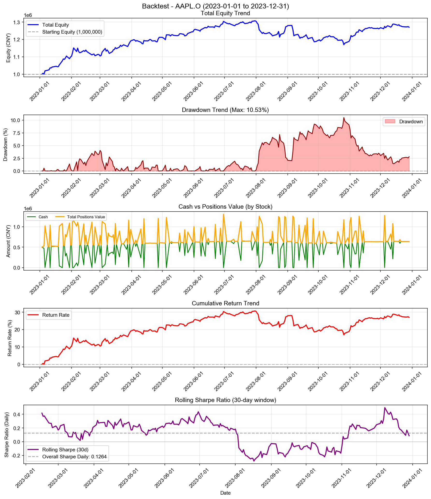
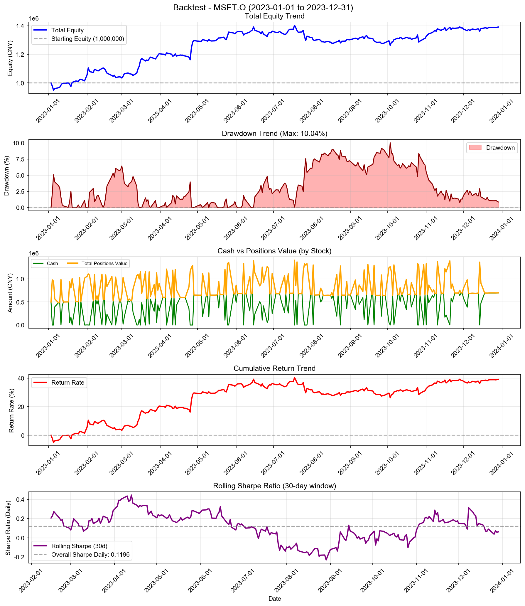
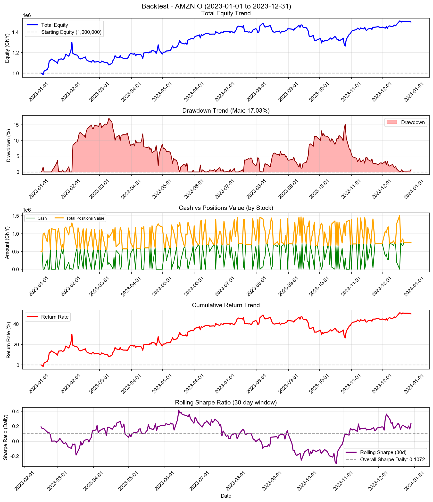
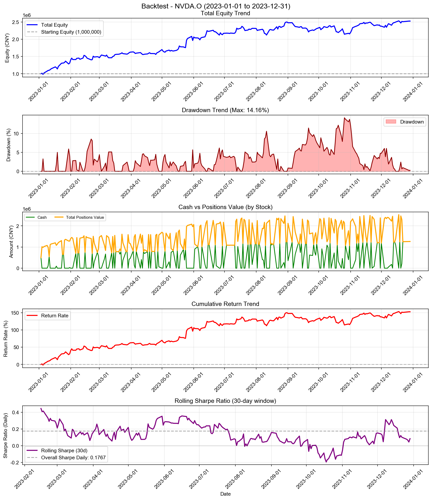
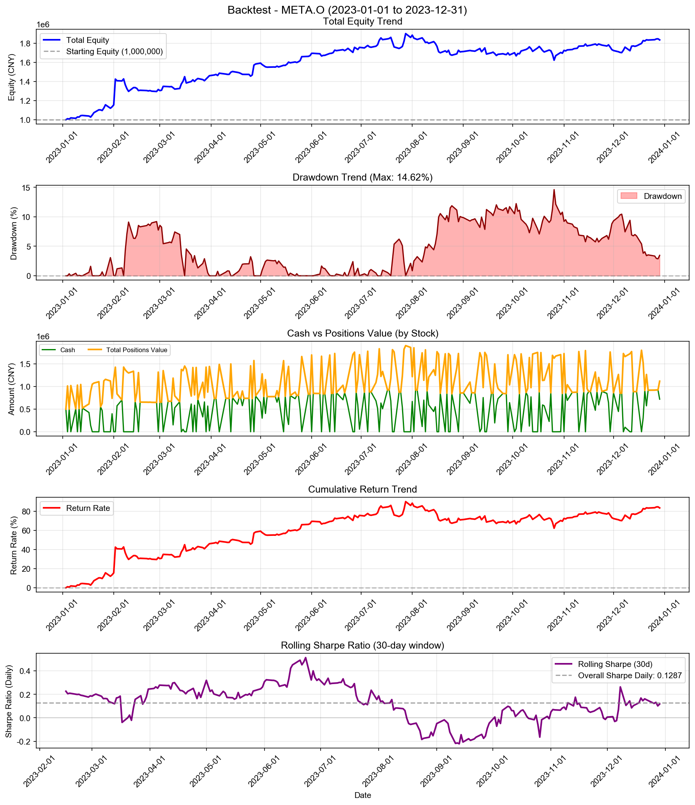
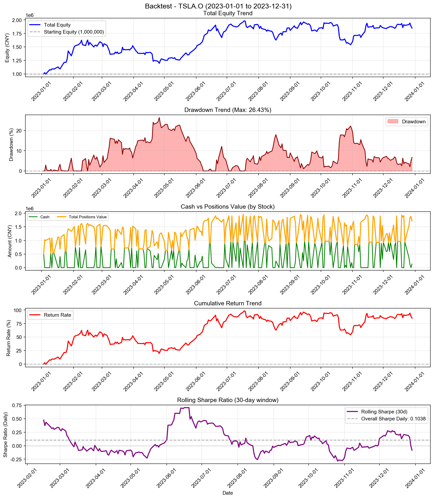
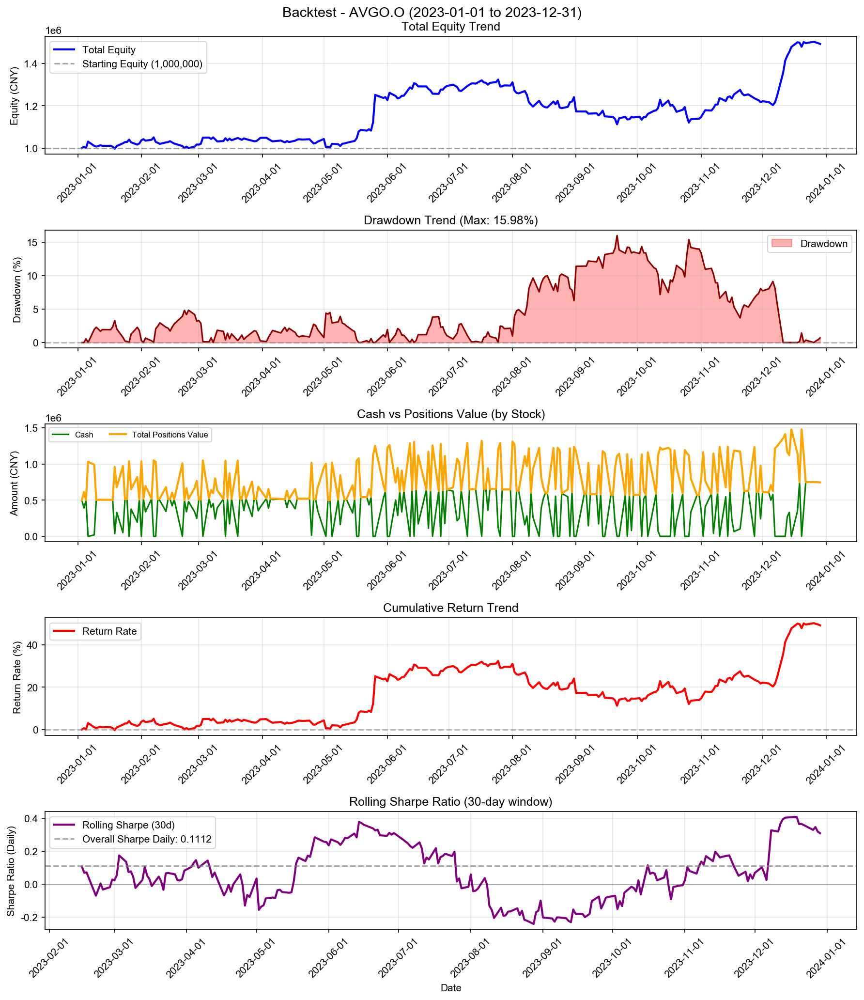
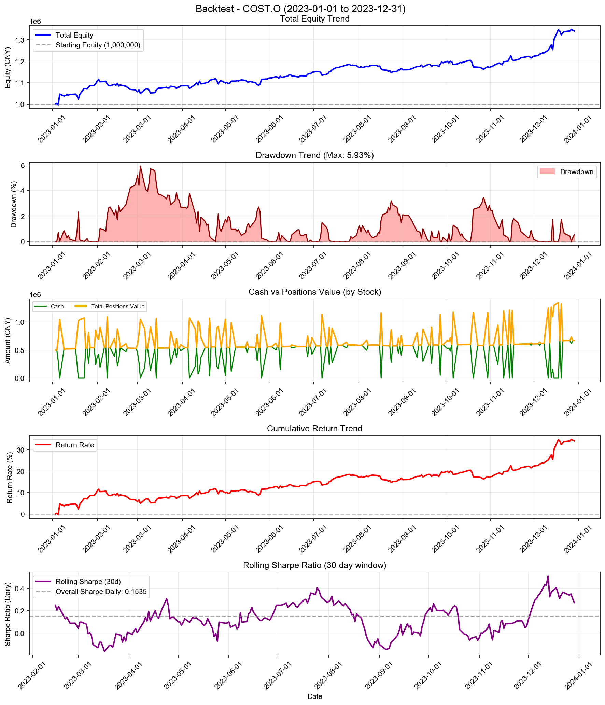
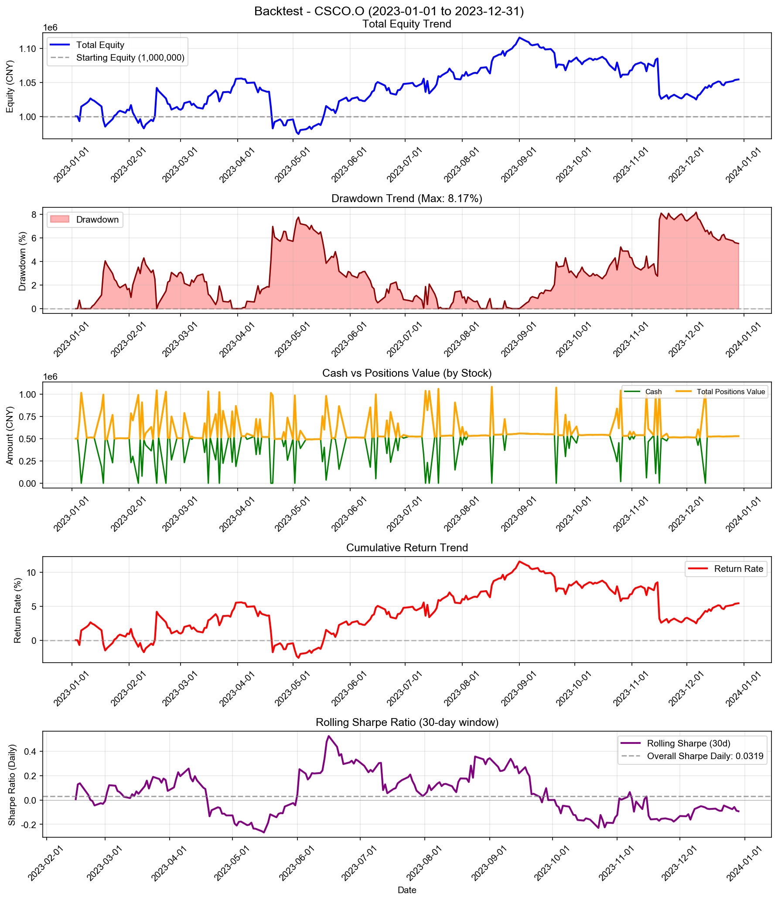

# Chasing Extremes Strategy - 多股票回测综合报告

**策略名称:** Chasing Extremes Strategy  
**回测期间:** 2023-01-01 至 2023-12-31  
**测试股票数:** 10 支  
**每只股票初始资金:** 1000000.00 元

---

## 综合统计

| 项目 | 数值 |
|------|------|
| 成功回测股票数 | 10/10 |
| 总初始资金 | 10000000.00 元 |
| 总最终权益 | 15484687.05 元 |
| 总盈亏 | +5484687.05 元 |
| 平均收益率 | +54.85% |
| 总交易次数 | 2081 次 |

---

## 各股票详细结果

| 股票代码 | 初始资金 | 最终权益 | 盈亏 | 收益率 | 交易次数 |
|----------|----------|----------|------|--------|------------------|
| AAPL.O | 1000000.00 | 1270425.55 | +270425.55 | +27.04% | 214 |
| MSFT.O | 1000000.00 | 1391577.95 | +391577.95 | +39.16% | 207 |
| GOOGL.O | 1000000.00 | 1228701.19 | +228701.19 | +22.87% | 217 |
| AMZN.O | 1000000.00 | 1496426.98 | +496426.98 | +49.64% | 223 |
| NVDA.O | 1000000.00 | 2524686.19 | +1524686.19 | +152.47% | 203 |
| META.O | 1000000.00 | 1834398.50 | +834398.50 | +83.44% | 217 |
| TSLA.O | 1000000.00 | 1849877.31 | +849877.31 | +84.99% | 186 |
| AVGO.O | 1000000.00 | 1493040.46 | +493040.46 | +49.30% | 216 |
| COST.O | 1000000.00 | 1341206.34 | +341206.34 | +34.12% | 199 |
| CSCO.O | 1000000.00 | 1054346.58 | +54346.58 | +5.43% | 199 |

---

## 收益率排名

### 收益率最高的股票

| 排名 | 股票代码 | 收益率 | 盈亏 |
|------|----------|--------|------|
| 1 | NVDA.O | +152.47% | +1524686.19 |
| 2 | TSLA.O | +84.99% | +849877.31 |
| 3 | META.O | +83.44% | +834398.50 |
| 4 | AMZN.O | +49.64% | +496426.98 |
| 5 | AVGO.O | +49.30% | +493040.46 |

### 收益率最低的股票

| 排名 | 股票代码 | 收益率 | 盈亏 |
|------|----------|--------|------|
| 1 | CSCO.O | +5.43% | +54346.58 |
| 2 | GOOGL.O | +22.87% | +228701.19 |
| 3 | AAPL.O | +27.04% | +270425.55 |
| 4 | COST.O | +34.12% | +341206.34 |
| 5 | MSFT.O | +39.16% | +391577.95 |

---

## 交易统计

| 股票代码 | 交易次数 | 平均每笔交易金额 |
|----------|------------------|------------------|
| AAPL.O | 214 | 5304.73 |
| MSFT.O | 207 | 5776.76 |
| GOOGL.O | 217 | 5135.26 |
| AMZN.O | 223 | 5597.37 |
| NVDA.O | 203 | 8681.49 |
| META.O | 217 | 6530.87 |
| TSLA.O | 186 | 7660.96 |
| AVGO.O | 216 | 5770.93 |
| COST.O | 199 | 5882.43 |
| CSCO.O | 199 | 5161.67 |

---

## 各股票详细分析

### AAPL.O

#### 账户摘要

| 项目 | 数值 |
|------|------|
| 初始资金 | 1000000.00 元 |
| 最终现金 | 636106.38 元 |
| 最终持仓市值 | 634319.17 元 |
| 最终总权益 | 1270425.55 元 |
| 总盈亏 | +270425.55 元 |
| 总收益率 | +27.04% |

| 资金比（现金/权益） | 50.07% |

#### 风险与稳健性指标

| 指标 | 数值 |
|------|------|
| 最大回撤 (Max Drawdown) | 10.53% |
| 年化收益率 (CAGR) | +27.29% |
| 年化夏普比率 (Sharpe) | 2.0068 |
| 日频夏普比率 (Sharpe Daily) | 0.1264 |
| 年化 Sortino 比率 | 2.0110 |
| 日频 Sortino 比率 | 0.1267 |
| Calmar 比率 (CAGR/MaxDD) | 2.5912 |
| 年化波动率 (Volatility) | 12.46% |
| VaR 95% | -1.03% |
| VaR 99% | -2.40% |
| CVaR 95% | -1.76% |
| CVaR 99% | -2.65% |

#### 统计信息

| 指标 | 数值 |
|------|------|
| 交易日数 | 250 天 |
| 最高权益 | 1307229.70 元 |
| 最低权益 | 999657.61 元 |
| 最高收益率 | +30.72% |
| 最低收益率 | -0.03% |

#### 最终持仓

| 股票代码 | 股数 | 成本价 | 现价 | 市值 | 盈亏 | 收益率 |
|----------|------|--------|------|------|------|--------|
| AAPL.O | 1139 | 557.76 | 556.91 | 634319.17 | -968.10 | -0.15% |

---

### MSFT.O

#### 账户摘要

| 项目 | 数值 |
|------|------|
| 初始资金 | 1000000.00 元 |
| 最终现金 | 694576.20 元 |
| 最终持仓市值 | 697001.75 元 |
| 最终总权益 | 1391577.95 元 |
| 总盈亏 | +391577.95 元 |
| 总收益率 | +39.16% |

| 资金比（现金/权益） | 49.91% |

#### 风险与稳健性指标

| 指标 | 数值 |
|------|------|
| 最大回撤 (Max Drawdown) | 10.04% |
| 年化收益率 (CAGR) | +39.53% |
| 年化夏普比率 (Sharpe) | 1.8988 |
| 日频夏普比率 (Sharpe Daily) | 0.1196 |
| 年化 Sortino 比率 | 2.1335 |
| 日频 Sortino 比率 | 0.1344 |
| Calmar 比率 (CAGR/MaxDD) | 3.9378 |
| 年化波动率 (Volatility) | 18.52% |
| VaR 95% | -1.54% |
| VaR 99% | -2.96% |
| CVaR 95% | -2.20% |
| CVaR 99% | -3.30% |

#### 统计信息

| 指标 | 数值 |
|------|------|
| 交易日数 | 250 天 |
| 最高权益 | 1403855.96 元 |
| 最低权益 | 949156.93 元 |
| 最高收益率 | +40.39% |
| 最低收益率 | -5.08% |

#### 最终持仓

| 股票代码 | 股数 | 成本价 | 现价 | 市值 | 盈亏 | 收益率 |
|----------|------|--------|------|------|------|--------|
| MSFT.O | 399 | 1707.98 | 1746.87 | 697001.75 | +15518.67 | +2.28% |

---

### GOOGL.O

#### 账户摘要

| 项目 | 数值 |
|------|------|
| 初始资金 | 1000000.00 元 |
| 最终现金 | 614380.27 元 |
| 最终持仓市值 | 614320.92 元 |
| 最终总权益 | 1228701.19 元 |
| 总盈亏 | +228701.19 元 |
| 总收益率 | +22.87% |

| 资金比（现金/权益） | 50.00% |

#### 风险与稳健性指标

| 指标 | 数值 |
|------|------|
| 最大回撤 (Max Drawdown) | 16.33% |
| 年化收益率 (CAGR) | +23.07% |
| 年化夏普比率 (Sharpe) | 1.0192 |
| 日频夏普比率 (Sharpe Daily) | 0.0642 |
| 年化 Sortino 比率 | 0.9730 |
| 日频 Sortino 比率 | 0.0613 |
| Calmar 比率 (CAGR/MaxDD) | 1.4125 |
| 年化波动率 (Volatility) | 23.08% |
| VaR 95% | -1.83% |
| VaR 99% | -4.39% |
| CVaR 95% | -3.26% |
| CVaR 99% | -6.71% |

#### 统计信息

| 指标 | 数值 |
|------|------|
| 交易日数 | 250 天 |
| 最高权益 | 1302398.58 元 |
| 最低权益 | 981784.44 元 |
| 最高收益率 | +30.24% |
| 最低收益率 | -1.82% |

#### 最终持仓

| 股票代码 | 股数 | 成本价 | 现价 | 市值 | 盈亏 | 收益率 |
|----------|------|--------|------|------|------|--------|
| GOOGL.O | 11005 | 54.55 | 55.82 | 614320.92 | +14047.29 | +2.34% |

---

### AMZN.O

#### 账户摘要

| 项目 | 数值 |
|------|------|
| 初始资金 | 1000000.00 元 |
| 最终现金 | 748517.52 元 |
| 最终持仓市值 | 747909.46 元 |
| 最终总权益 | 1496426.98 元 |
| 总盈亏 | +496426.98 元 |
| 总收益率 | +49.64% |

| 资金比（现金/权益） | 50.02% |

#### 风险与稳健性指标

| 指标 | 数值 |
|------|------|
| 最大回撤 (Max Drawdown) | 17.03% |
| 年化收益率 (CAGR) | +50.13% |
| 年化夏普比率 (Sharpe) | 1.7022 |
| 日频夏普比率 (Sharpe Daily) | 0.1072 |
| 年化 Sortino 比率 | 1.7769 |
| 日频 Sortino 比率 | 0.1119 |
| Calmar 比率 (CAGR/MaxDD) | 2.9426 |
| 年化波动率 (Volatility) | 25.95% |
| VaR 95% | -2.06% |
| VaR 99% | -3.98% |
| CVaR 95% | -3.46% |
| CVaR 99% | -5.60% |

#### 统计信息

| 指标 | 数值 |
|------|------|
| 交易日数 | 250 天 |
| 最高权益 | 1507726.73 元 |
| 最低权益 | 984224.56 元 |
| 最高收益率 | +50.77% |
| 最低收益率 | -1.58% |

#### 最终持仓

| 股票代码 | 股数 | 成本价 | 现价 | 市值 | 盈亏 | 收益率 |
|----------|------|--------|------|------|------|--------|
| AMZN.O | 2051 | 356.30 | 364.66 | 747909.46 | +17132.49 | +2.34% |

---

### NVDA.O

#### 账户摘要

| 项目 | 数值 |
|------|------|
| 初始资金 | 1000000.00 元 |
| 最终现金 | 1262292.80 元 |
| 最终持仓市值 | 1262393.39 元 |
| 最终总权益 | 2524686.19 元 |
| 总盈亏 | +1524686.19 元 |
| 总收益率 | +152.47% |

| 资金比（现金/权益） | 50.00% |

#### 风险与稳健性指标

| 指标 | 数值 |
|------|------|
| 最大回撤 (Max Drawdown) | 14.16% |
| 年化收益率 (CAGR) | +154.35% |
| 年化夏普比率 (Sharpe) | 2.8055 |
| 日频夏普比率 (Sharpe Daily) | 0.1767 |
| 年化 Sortino 比率 | 3.3795 |
| 日频 Sortino 比率 | 0.2129 |
| Calmar 比率 (CAGR/MaxDD) | 10.9019 |
| 年化波动率 (Volatility) | 35.69% |
| VaR 95% | -2.89% |
| VaR 99% | -3.96% |
| CVaR 95% | -3.78% |
| CVaR 99% | -5.18% |

#### 统计信息

| 指标 | 数值 |
|------|------|
| 交易日数 | 250 天 |
| 最高权益 | 2530977.39 元 |
| 最低权益 | 981845.90 元 |
| 最高收益率 | +153.10% |
| 最低收益率 | -1.82% |

#### 最终持仓

| 股票代码 | 股数 | 成本价 | 现价 | 市值 | 盈亏 | 收益率 |
|----------|------|--------|------|------|------|--------|
| NVDA.O | 4872 | 252.22 | 259.11 | 1262393.39 | +33579.12 | +2.73% |

---

### META.O

#### 账户摘要

| 项目 | 数值 |
|------|------|
| 初始资金 | 1000000.00 元 |
| 最终现金 | 718362.62 元 |
| 最终持仓市值 | 1116035.88 元 |
| 最终总权益 | 1834398.50 元 |
| 总盈亏 | +834398.50 元 |
| 总收益率 | +83.44% |

| 资金比（现金/权益） | 39.16% |

#### 风险与稳健性指标

| 指标 | 数值 |
|------|------|
| 最大回撤 (Max Drawdown) | 14.62% |
| 年化收益率 (CAGR) | +84.33% |
| 年化夏普比率 (Sharpe) | 2.0427 |
| 日频夏普比率 (Sharpe Daily) | 0.1287 |
| 年化 Sortino 比率 | 3.1101 |
| 日频 Sortino 比率 | 0.1959 |
| Calmar 比率 (CAGR/MaxDD) | 5.7677 |
| 年化波动率 (Volatility) | 32.49% |
| VaR 95% | -2.12% |
| VaR 99% | -3.73% |
| CVaR 95% | -3.08% |
| CVaR 99% | -4.18% |

#### 统计信息

| 指标 | 数值 |
|------|------|
| 交易日数 | 250 天 |
| 最高权益 | 1900249.32 元 |
| 最低权益 | 1000000.00 元 |
| 最高收益率 | +90.02% |
| 最低收益率 | +0.00% |

#### 最终持仓

| 股票代码 | 股数 | 成本价 | 现价 | 市值 | 盈亏 | 收益率 |
|----------|------|--------|------|------|------|--------|
| META.O | 315300 | 3.43 | 3.54 | 1116035.88 | +33524.34 | +3.10% |

---

### TSLA.O

#### 账户摘要

| 项目 | 数值 |
|------|------|
| 初始资金 | 1000000.00 元 |
| 最终现金 | 132830.81 元 |
| 最终持仓市值 | 1717046.50 元 |
| 最终总权益 | 1849877.31 元 |
| 总盈亏 | +849877.31 元 |
| 总收益率 | +84.99% |

| 资金比（现金/权益） | 7.18% |

#### 风险与稳健性指标

| 指标 | 数值 |
|------|------|
| 最大回撤 (Max Drawdown) | 26.43% |
| 年化收益率 (CAGR) | +85.90% |
| 年化夏普比率 (Sharpe) | 1.6480 |
| 日频夏普比率 (Sharpe Daily) | 0.1038 |
| 年化 Sortino 比率 | 1.6988 |
| 日频 Sortino 比率 | 0.1070 |
| Calmar 比率 (CAGR/MaxDD) | 3.2506 |
| 年化波动率 (Volatility) | 43.54% |
| VaR 95% | -4.18% |
| VaR 99% | -6.32% |
| CVaR 95% | -5.94% |
| CVaR 99% | -8.45% |

#### 统计信息

| 指标 | 数值 |
|------|------|
| 交易日数 | 250 天 |
| 最高权益 | 1983412.50 元 |
| 最低权益 | 995840.73 元 |
| 最高收益率 | +98.34% |
| 最低收益率 | -0.42% |

#### 最终持仓

| 股票代码 | 股数 | 成本价 | 现价 | 市值 | 盈亏 | 收益率 |
|----------|------|--------|------|------|------|--------|
| TSLA.O | 46068 | 38.13 | 37.27 | 1717046.50 | -39660.97 | -2.26% |

---

### AVGO.O

#### 账户摘要

| 项目 | 数值 |
|------|------|
| 初始资金 | 1000000.00 元 |
| 最终现金 | 746530.76 元 |
| 最终持仓市值 | 746509.70 元 |
| 最终总权益 | 1493040.46 元 |
| 总盈亏 | +493040.46 元 |
| 总收益率 | +49.30% |

| 资金比（现金/权益） | 50.00% |

#### 风险与稳健性指标

| 指标 | 数值 |
|------|------|
| 最大回撤 (Max Drawdown) | 15.98% |
| 年化收益率 (CAGR) | +49.78% |
| 年化夏普比率 (Sharpe) | 1.7649 |
| 日频夏普比率 (Sharpe Daily) | 0.1112 |
| 年化 Sortino 比率 | 2.2072 |
| 日频 Sortino 比率 | 0.1390 |
| Calmar 比率 (CAGR/MaxDD) | 3.1147 |
| 年化波动率 (Volatility) | 24.68% |
| VaR 95% | -2.01% |
| VaR 99% | -3.57% |
| CVaR 95% | -2.87% |
| CVaR 99% | -4.23% |

#### 统计信息

| 指标 | 数值 |
|------|------|
| 交易日数 | 250 天 |
| 最高权益 | 1503451.04 元 |
| 最低权益 | 996677.56 元 |
| 最高收益率 | +50.35% |
| 最低收益率 | -0.33% |

#### 最终持仓

| 股票代码 | 股数 | 成本价 | 现价 | 市值 | 盈亏 | 收益率 |
|----------|------|--------|------|------|------|--------|
| AVGO.O | 53017 | 13.14 | 14.08 | 746509.70 | +49658.47 | +7.13% |

---

### COST.O

#### 账户摘要

| 项目 | 数值 |
|------|------|
| 初始资金 | 1000000.00 元 |
| 最终现金 | 670617.47 元 |
| 最终持仓市值 | 670588.87 元 |
| 最终总权益 | 1341206.34 元 |
| 总盈亏 | +341206.34 元 |
| 总收益率 | +34.12% |

| 资金比（现金/权益） | 50.00% |

#### 风险与稳健性指标

| 指标 | 数值 |
|------|------|
| 最大回撤 (Max Drawdown) | 5.93% |
| 年化收益率 (CAGR) | +34.44% |
| 年化夏普比率 (Sharpe) | 2.4371 |
| 日频夏普比率 (Sharpe Daily) | 0.1535 |
| 年化 Sortino 比率 | 2.8722 |
| 日频 Sortino 比率 | 0.1809 |
| Calmar 比率 (CAGR/MaxDD) | 5.8100 |
| 年化波动率 (Volatility) | 12.51% |
| VaR 95% | -1.12% |
| VaR 99% | -1.57% |
| CVaR 95% | -1.36% |
| CVaR 99% | -1.69% |

#### 统计信息

| 指标 | 数值 |
|------|------|
| 交易日数 | 250 天 |
| 最高权益 | 1348339.43 元 |
| 最低权益 | 996616.60 元 |
| 最高收益率 | +34.83% |
| 最低收益率 | -0.34% |

#### 最终持仓

| 股票代码 | 股数 | 成本价 | 现价 | 市值 | 盈亏 | 收益率 |
|----------|------|--------|------|------|------|--------|
| COST.O | 34312 | 18.72 | 19.54 | 670588.87 | +28129.18 | +4.38% |

---

### CSCO.O

#### 账户摘要

| 项目 | 数值 |
|------|------|
| 初始资金 | 1000000.00 元 |
| 最终现金 | 526839.82 元 |
| 最终持仓市值 | 527506.76 元 |
| 最终总权益 | 1054346.58 元 |
| 总盈亏 | +54346.58 元 |
| 总收益率 | +5.43% |

| 资金比（现金/权益） | 49.97% |

#### 风险与稳健性指标

| 指标 | 数值 |
|------|------|
| 最大回撤 (Max Drawdown) | 8.17% |
| 年化收益率 (CAGR) | +5.48% |
| 年化夏普比率 (Sharpe) | 0.5066 |
| 日频夏普比率 (Sharpe Daily) | 0.0319 |
| 年化 Sortino 比率 | 0.4516 |
| 日频 Sortino 比率 | 0.0284 |
| Calmar 比率 (CAGR/MaxDD) | 0.6709 |
| 年化波动率 (Volatility) | 11.99% |
| VaR 95% | -1.04% |
| VaR 99% | -2.26% |
| CVaR 95% | -1.91% |
| CVaR 99% | -3.40% |

#### 统计信息

| 指标 | 数值 |
|------|------|
| 交易日数 | 250 天 |
| 最高权益 | 1115912.16 元 |
| 最低权益 | 973981.88 元 |
| 最高收益率 | +11.59% |
| 最低收益率 | -2.60% |

#### 最终持仓

| 股票代码 | 股数 | 成本价 | 现价 | 市值 | 盈亏 | 收益率 |
|----------|------|--------|------|------|------|--------|
| CSCO.O | 2498 | 207.30 | 211.17 | 527506.76 | +9663.22 | +1.87% |

---

---

## 策略参数

- **extreme_threshold:** 1.0%
- **lookback_days:** 1
- **max_position_weight:** 100%
- **chase_up:** True
- **chase_down:** True

---

*报告生成时间: 2025-12-24 17:58:10*
