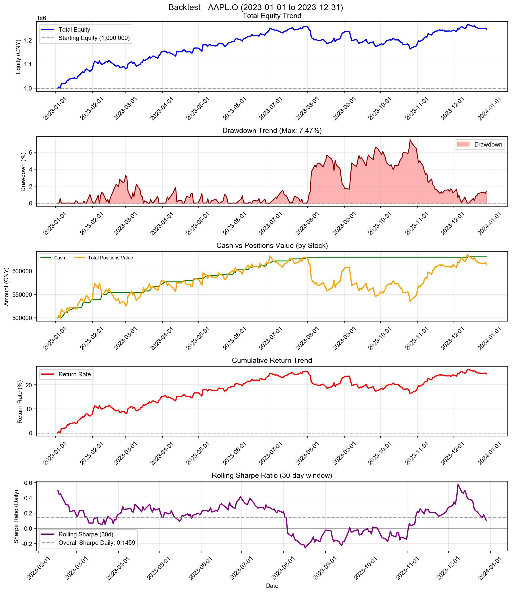
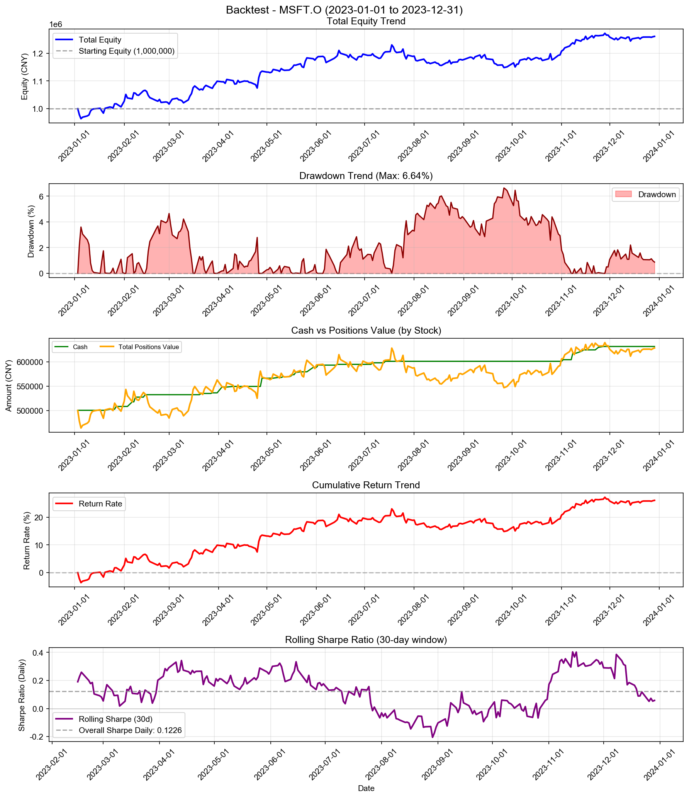
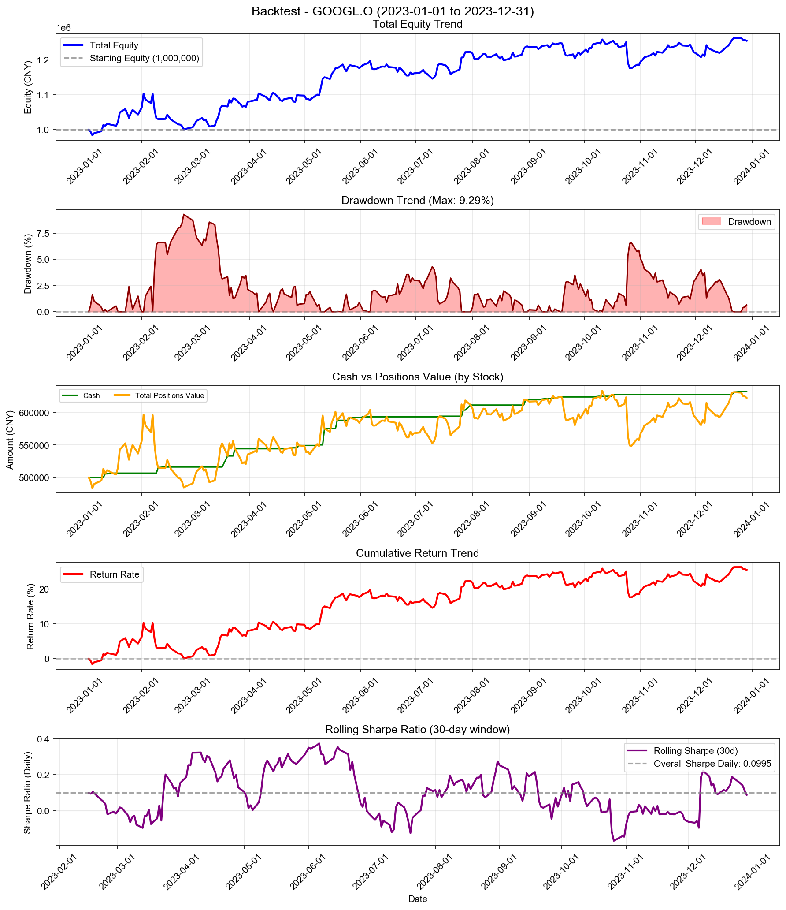
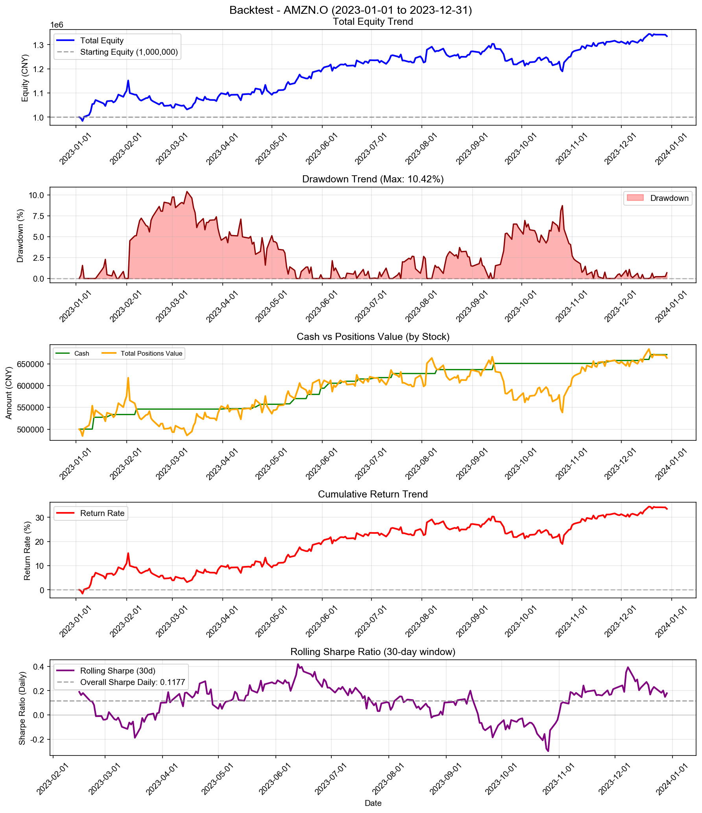
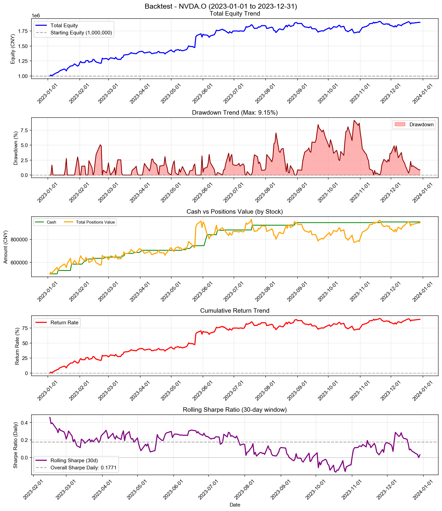
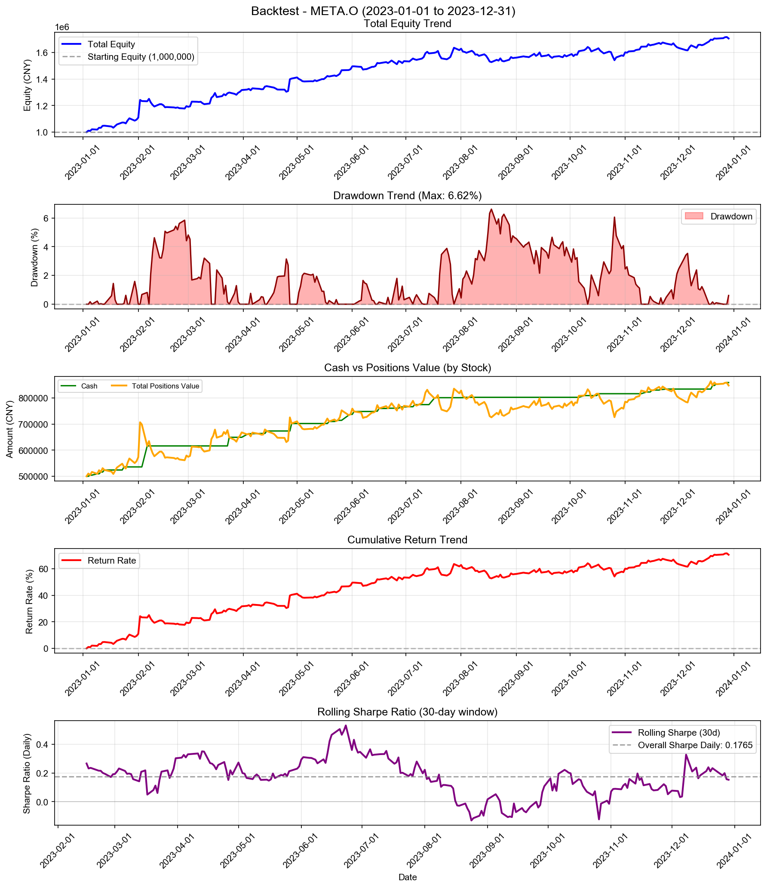
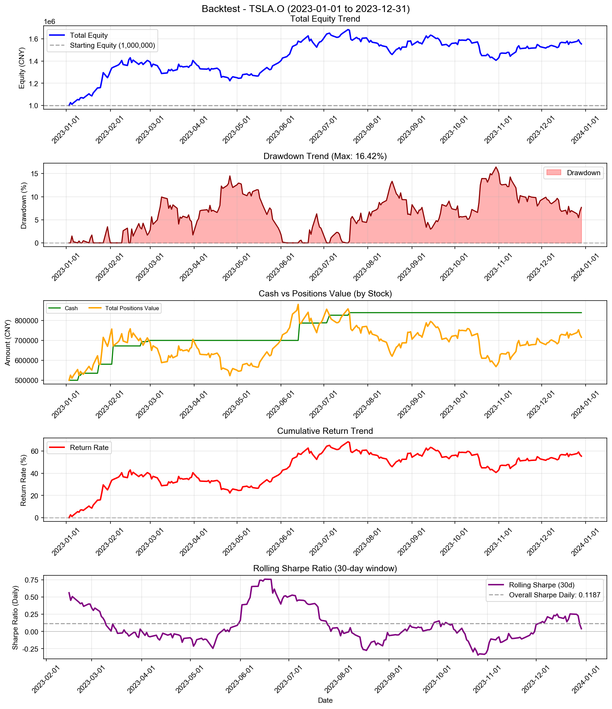
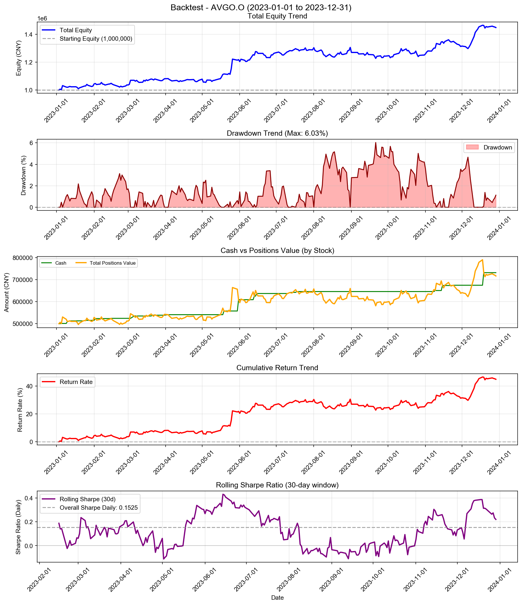
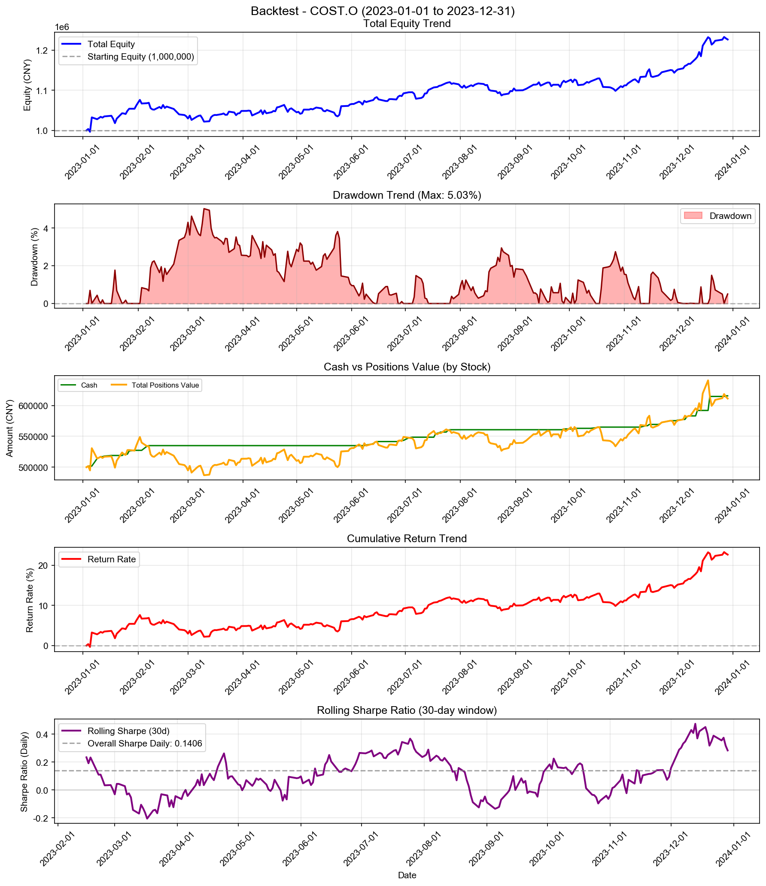
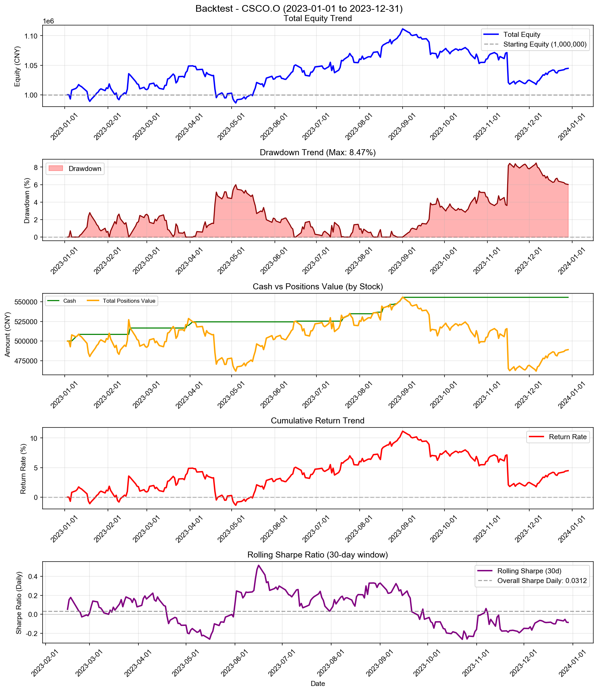

# Chasing Extremes with Leverage Risk Control - 多股票回测综合报告

**策略名称:** Chasing Extremes with Leverage Risk Control  
**回测期间:** 2023-01-01 至 2023-12-31  
**测试股票数:** 10 支  
**每只股票初始资金:** 1000000.00 元

---

## 综合统计

| 项目 | 数值 |
|------|------|
| 成功回测股票数 | 10/10 |
| 总初始资金 | 10000000.00 元 |
| 总最终权益 | 13971271.27 元 |
| 总盈亏 | +3971271.27 元 |
| 平均收益率 | +39.71% |
| 总交易次数 | 292 次 |

---

## 各股票详细结果

| 股票代码 | 初始资金 | 最终权益 | 盈亏 | 收益率 | 交易次数 |
|----------|----------|----------|------|--------|------------------|
| AAPL.O | 1000000.00 | 1245904.64 | +245904.64 | +24.59% | 40 |
| MSFT.O | 1000000.00 | 1260886.38 | +260886.38 | +26.09% | 29 |
| GOOGL.O | 1000000.00 | 1255093.77 | +255093.77 | +25.51% | 27 |
| AMZN.O | 1000000.00 | 1335002.63 | +335002.63 | +33.50% | 27 |
| NVDA.O | 1000000.00 | 1893600.26 | +893600.26 | +89.36% | 27 |
| META.O | 1000000.00 | 1706560.92 | +706560.92 | +70.66% | 40 |
| TSLA.O | 1000000.00 | 1553833.90 | +553833.90 | +55.38% | 12 |
| AVGO.O | 1000000.00 | 1448891.53 | +448891.53 | +44.89% | 24 |
| COST.O | 1000000.00 | 1226787.67 | +226787.67 | +22.68% | 43 |
| CSCO.O | 1000000.00 | 1044709.56 | +44709.56 | +4.47% | 23 |

---

## 收益率排名

### 收益率最高的股票

| 排名 | 股票代码 | 收益率 | 盈亏 |
|------|----------|--------|------|
| 1 | NVDA.O | +89.36% | +893600.26 |
| 2 | META.O | +70.66% | +706560.92 |
| 3 | TSLA.O | +55.38% | +553833.90 |
| 4 | AVGO.O | +44.89% | +448891.53 |
| 5 | AMZN.O | +33.50% | +335002.63 |

### 收益率最低的股票

| 排名 | 股票代码 | 收益率 | 盈亏 |
|------|----------|--------|------|
| 1 | CSCO.O | +4.47% | +44709.56 |
| 2 | COST.O | +22.68% | +226787.67 |
| 3 | AAPL.O | +24.59% | +245904.64 |
| 4 | GOOGL.O | +25.51% | +255093.77 |
| 5 | MSFT.O | +26.09% | +260886.38 |

---

## 交易统计

| 股票代码 | 交易次数 | 平均每笔交易金额 |
|----------|------------------|------------------|
| AAPL.O | 40 | 28073.81 |
| MSFT.O | 29 | 38980.80 |
| GOOGL.O | 27 | 41761.00 |
| AMZN.O | 27 | 43240.79 |
| NVDA.O | 27 | 53585.19 |
| META.O | 40 | 33832.01 |
| TSLA.O | 12 | 106409.75 |
| AVGO.O | 24 | 51018.57 |
| COST.O | 43 | 25892.88 |
| CSCO.O | 23 | 44450.21 |

---

## 各股票详细分析

### AAPL.O

#### 账户摘要

| 项目 | 数值 |
|------|------|
| 初始资金 | 1000000.00 元 |
| 最终现金 | 631634.18 元 |
| 最终持仓市值 | 614270.46 元 |
| 最终总权益 | 1245904.64 元 |
| 总盈亏 | +245904.64 元 |
| 总收益率 | +24.59% |

| 资金比（现金/权益） | 50.70% |

#### 风险与稳健性指标

| 指标 | 数值 |
|------|------|
| 最大回撤 (Max Drawdown) | 7.47% |
| 年化收益率 (CAGR) | +24.81% |
| 年化夏普比率 (Sharpe) | 2.3168 |
| 日频夏普比率 (Sharpe Daily) | 0.1459 |
| 年化 Sortino 比率 | 2.4370 |
| 日频 Sortino 比率 | 0.1535 |
| Calmar 比率 (CAGR/MaxDD) | 3.3221 |
| 年化波动率 (Volatility) | 9.82% |
| VaR 95% | -0.83% |
| VaR 99% | -1.41% |
| CVaR 95% | -1.22% |
| CVaR 99% | -1.85% |

#### 统计信息

| 指标 | 数值 |
|------|------|
| 交易日数 | 250 天 |
| 最高权益 | 1263707.73 元 |
| 最低权益 | 999800.23 元 |
| 最高收益率 | +26.37% |
| 最低收益率 | -0.02% |

#### 最终持仓

| 股票代码 | 股数 | 成本价 | 现价 | 市值 | 盈亏 | 收益率 |
|----------|------|--------|------|------|------|--------|
| AAPL.O | 1103 | 359.76 | 556.91 | 614270.46 | +217450.38 | +54.80% |

---

### MSFT.O

#### 账户摘要

| 项目 | 数值 |
|------|------|
| 初始资金 | 1000000.00 元 |
| 最终现金 | 632012.63 元 |
| 最终持仓市值 | 628873.76 元 |
| 最终总权益 | 1260886.38 元 |
| 总盈亏 | +260886.38 元 |
| 总收益率 | +26.09% |

| 资金比（现金/权益） | 50.12% |

#### 风险与稳健性指标

| 指标 | 数值 |
|------|------|
| 最大回撤 (Max Drawdown) | 6.64% |
| 年化收益率 (CAGR) | +26.32% |
| 年化夏普比率 (Sharpe) | 1.9462 |
| 日频夏普比率 (Sharpe Daily) | 0.1226 |
| 年化 Sortino 比率 | 2.1013 |
| 日频 Sortino 比率 | 0.1324 |
| Calmar 比率 (CAGR/MaxDD) | 3.9659 |
| 年化波动率 (Volatility) | 12.46% |
| VaR 95% | -1.17% |
| VaR 99% | -1.87% |
| CVaR 95% | -1.46% |
| CVaR 99% | -1.99% |

#### 统计信息

| 指标 | 数值 |
|------|------|
| 交易日数 | 250 天 |
| 最高权益 | 1272024.29 元 |
| 最低权益 | 963976.69 元 |
| 最高收益率 | +27.20% |
| 最低收益率 | -3.60% |

#### 最终持仓

| 股票代码 | 股数 | 成本价 | 现价 | 市值 | 盈亏 | 收益率 |
|----------|------|--------|------|------|------|--------|
| MSFT.O | 360 | 1103.17 | 1746.87 | 628873.76 | +231731.48 | +58.35% |

---

### GOOGL.O

#### 账户摘要

| 项目 | 数值 |
|------|------|
| 初始资金 | 1000000.00 元 |
| 最终现金 | 632511.19 元 |
| 最终持仓市值 | 622582.57 元 |
| 最终总权益 | 1255093.77 元 |
| 总盈亏 | +255093.77 元 |
| 总收益率 | +25.51% |

| 资金比（现金/权益） | 50.40% |

#### 风险与稳健性指标

| 指标 | 数值 |
|------|------|
| 最大回撤 (Max Drawdown) | 9.29% |
| 年化收益率 (CAGR) | +25.74% |
| 年化夏普比率 (Sharpe) | 1.5800 |
| 日频夏普比率 (Sharpe Daily) | 0.0995 |
| 年化 Sortino 比率 | 1.6032 |
| 日频 Sortino 比率 | 0.1010 |
| Calmar 比率 (CAGR/MaxDD) | 2.7700 |
| 年化波动率 (Volatility) | 15.30% |
| VaR 95% | -1.26% |
| VaR 99% | -2.28% |
| CVaR 95% | -1.98% |
| CVaR 99% | -3.73% |

#### 统计信息

| 指标 | 数值 |
|------|------|
| 交易日数 | 250 天 |
| 最高权益 | 1263249.87 元 |
| 最低权益 | 983618.30 元 |
| 最高收益率 | +26.32% |
| 最低收益率 | -1.64% |

#### 最终持仓

| 股票代码 | 股数 | 成本价 | 现价 | 市值 | 盈亏 | 收益率 |
|----------|------|--------|------|------|------|--------|
| GOOGL.O | 11153 | 35.61 | 55.82 | 622582.57 | +225384.79 | +56.74% |

---

### AMZN.O

#### 账户摘要

| 项目 | 数值 |
|------|------|
| 初始资金 | 1000000.00 元 |
| 最终现金 | 671328.71 元 |
| 最终持仓市值 | 663673.92 元 |
| 最终总权益 | 1335002.63 元 |
| 总盈亏 | +335002.63 元 |
| 总收益率 | +33.50% |

| 资金比（现金/权益） | 50.29% |

#### 风险与稳健性指标

| 指标 | 数值 |
|------|------|
| 最大回撤 (Max Drawdown) | 10.42% |
| 年化收益率 (CAGR) | +33.81% |
| 年化夏普比率 (Sharpe) | 1.8679 |
| 日频夏普比率 (Sharpe Daily) | 0.1177 |
| 年化 Sortino 比率 | 1.9750 |
| 日频 Sortino 比率 | 0.1244 |
| Calmar 比率 (CAGR/MaxDD) | 3.2442 |
| 年化波动率 (Volatility) | 16.38% |
| VaR 95% | -1.38% |
| VaR 99% | -2.14% |
| CVaR 95% | -2.06% |
| CVaR 99% | -3.10% |

#### 统计信息

| 指标 | 数值 |
|------|------|
| 交易日数 | 250 天 |
| 最高权益 | 1344326.63 元 |
| 最低权益 | 984273.04 元 |
| 最高收益率 | +34.43% |
| 最低收益率 | -1.57% |

#### 最终持仓

| 股票代码 | 股数 | 成本价 | 现价 | 市值 | 盈亏 | 收益率 |
|----------|------|--------|------|------|------|--------|
| AMZN.O | 1820 | 205.97 | 364.66 | 663673.92 | +288812.16 | +77.04% |

---

### NVDA.O

#### 账户摘要

| 项目 | 数值 |
|------|------|
| 初始资金 | 1000000.00 元 |
| 最终现金 | 950691.90 元 |
| 最终持仓市值 | 942908.36 元 |
| 最终总权益 | 1893600.26 元 |
| 总盈亏 | +893600.26 元 |
| 总收益率 | +89.36% |

| 资金比（现金/权益） | 50.21% |

#### 风险与稳健性指标

| 指标 | 数值 |
|------|------|
| 最大回撤 (Max Drawdown) | 9.15% |
| 年化收益率 (CAGR) | +90.33% |
| 年化夏普比率 (Sharpe) | 2.8119 |
| 日频夏普比率 (Sharpe Daily) | 0.1771 |
| 年化 Sortino 比率 | 3.6905 |
| 日频 Sortino 比率 | 0.2325 |
| Calmar 比率 (CAGR/MaxDD) | 9.8774 |
| 年化波动率 (Volatility) | 24.01% |
| VaR 95% | -1.67% |
| VaR 99% | -2.40% |
| CVaR 95% | -2.18% |
| CVaR 99% | -2.87% |

#### 统计信息

| 指标 | 数值 |
|------|------|
| 交易日数 | 250 天 |
| 最高权益 | 1910458.07 元 |
| 最低权益 | 998253.72 元 |
| 最高收益率 | +91.05% |
| 最低收益率 | -0.17% |

#### 最终持仓

| 股票代码 | 股数 | 成本价 | 现价 | 市值 | 盈亏 | 收益率 |
|----------|------|--------|------|------|------|--------|
| NVDA.O | 3639 | 74.87 | 259.11 | 942908.36 | +670468.91 | +246.10% |

---

### META.O

#### 账户摘要

| 项目 | 数值 |
|------|------|
| 初始资金 | 1000000.00 元 |
| 最终现金 | 858911.68 元 |
| 最终持仓市值 | 847649.25 元 |
| 最终总权益 | 1706560.92 元 |
| 总盈亏 | +706560.92 元 |
| 总收益率 | +70.66% |

| 资金比（现金/权益） | 50.33% |

#### 风险与稳健性指标

| 指标 | 数值 |
|------|------|
| 最大回撤 (Max Drawdown) | 6.62% |
| 年化收益率 (CAGR) | +71.39% |
| 年化夏普比率 (Sharpe) | 2.8023 |
| 日频夏普比率 (Sharpe Daily) | 0.1765 |
| 年化 Sortino 比率 | 4.2744 |
| 日频 Sortino 比率 | 0.2693 |
| Calmar 比率 (CAGR/MaxDD) | 10.7910 |
| 年化波动率 (Volatility) | 20.01% |
| VaR 95% | -1.34% |
| VaR 99% | -2.15% |
| CVaR 95% | -1.77% |
| CVaR 99% | -2.23% |

#### 统计信息

| 指标 | 数值 |
|------|------|
| 交易日数 | 250 天 |
| 最高权益 | 1717002.08 元 |
| 最低权益 | 1000000.00 元 |
| 最高收益率 | +71.70% |
| 最低收益率 | +0.00% |

#### 最终持仓

| 股票代码 | 股数 | 成本价 | 现价 | 市值 | 盈亏 | 收益率 |
|----------|------|--------|------|------|------|--------|
| META.O | 239476 | 1.25 | 3.54 | 847649.25 | +548926.89 | +183.76% |

---

### TSLA.O

#### 账户摘要

| 项目 | 数值 |
|------|------|
| 初始资金 | 1000000.00 元 |
| 最终现金 | 838472.40 元 |
| 最终持仓市值 | 715361.50 元 |
| 最终总权益 | 1553833.90 元 |
| 总盈亏 | +553833.90 元 |
| 总收益率 | +55.38% |

| 资金比（现金/权益） | 53.96% |

#### 风险与稳健性指标

| 指标 | 数值 |
|------|------|
| 最大回撤 (Max Drawdown) | 16.42% |
| 年化收益率 (CAGR) | +55.93% |
| 年化夏普比率 (Sharpe) | 1.8839 |
| 日频夏普比率 (Sharpe Daily) | 0.1187 |
| 年化 Sortino 比率 | 2.0231 |
| 日频 Sortino 比率 | 0.1274 |
| Calmar 比率 (CAGR/MaxDD) | 3.4057 |
| 年化波动率 (Volatility) | 25.40% |
| VaR 95% | -2.36% |
| VaR 99% | -4.23% |
| CVaR 95% | -3.24% |
| CVaR 99% | -4.55% |

#### 统计信息

| 指标 | 数值 |
|------|------|
| 交易日数 | 250 天 |
| 最高权益 | 1683075.32 元 |
| 最低权益 | 1000000.00 元 |
| 最高收益率 | +68.31% |
| 最低收益率 | +0.00% |

#### 最终持仓

| 股票代码 | 股数 | 成本价 | 现价 | 市值 | 盈亏 | 收益率 |
|----------|------|--------|------|------|------|--------|
| TSLA.O | 19193 | 16.21 | 37.27 | 715361.50 | +404147.00 | +129.86% |

---

### AVGO.O

#### 账户摘要

| 项目 | 数值 |
|------|------|
| 初始资金 | 1000000.00 元 |
| 最终现金 | 731936.95 元 |
| 最终持仓市值 | 716954.58 元 |
| 最终总权益 | 1448891.53 元 |
| 总盈亏 | +448891.53 元 |
| 总收益率 | +44.89% |

| 资金比（现金/权益） | 50.52% |

#### 风险与稳健性指标

| 指标 | 数值 |
|------|------|
| 最大回撤 (Max Drawdown) | 6.03% |
| 年化收益率 (CAGR) | +45.32% |
| 年化夏普比率 (Sharpe) | 2.4216 |
| 日频夏普比率 (Sharpe Daily) | 0.1525 |
| 年化 Sortino 比率 | 3.1615 |
| 日频 Sortino 比率 | 0.1992 |
| Calmar 比率 (CAGR/MaxDD) | 7.5156 |
| 年化波动率 (Volatility) | 16.03% |
| VaR 95% | -1.18% |
| VaR 99% | -1.82% |
| CVaR 95% | -1.56% |
| CVaR 99% | -2.19% |

#### 统计信息

| 指标 | 数值 |
|------|------|
| 交易日数 | 250 天 |
| 最高权益 | 1465378.80 元 |
| 最低权益 | 1000000.00 元 |
| 最高收益率 | +46.54% |
| 最低收益率 | +0.00% |

#### 最终持仓

| 股票代码 | 股数 | 成本价 | 现价 | 市值 | 盈亏 | 收益率 |
|----------|------|--------|------|------|------|--------|
| AVGO.O | 50918 | 6.83 | 14.08 | 716954.58 | +369371.56 | +106.27% |

---

### COST.O

#### 账户摘要

| 项目 | 数值 |
|------|------|
| 初始资金 | 1000000.00 元 |
| 最终现金 | 615573.05 元 |
| 最终持仓市值 | 611214.63 元 |
| 最终总权益 | 1226787.67 元 |
| 总盈亏 | +226787.67 元 |
| 总收益率 | +22.68% |

| 资金比（现金/权益） | 50.18% |

#### 风险与稳健性指标

| 指标 | 数值 |
|------|------|
| 最大回撤 (Max Drawdown) | 5.03% |
| 年化收益率 (CAGR) | +22.88% |
| 年化夏普比率 (Sharpe) | 2.2313 |
| 日频夏普比率 (Sharpe Daily) | 0.1406 |
| 年化 Sortino 比率 | 2.3742 |
| 日频 Sortino 比率 | 0.1496 |
| Calmar 比率 (CAGR/MaxDD) | 4.5455 |
| 年化波动率 (Volatility) | 9.47% |
| VaR 95% | -0.88% |
| VaR 99% | -1.23% |
| CVaR 95% | -1.10% |
| CVaR 99% | -1.34% |

#### 统计信息

| 指标 | 数值 |
|------|------|
| 交易日数 | 250 天 |
| 最高权益 | 1233015.67 元 |
| 最低权益 | 996616.60 元 |
| 最高收益率 | +23.30% |
| 最低收益率 | -0.34% |

#### 最终持仓

| 股票代码 | 股数 | 成本价 | 现价 | 市值 | 盈亏 | 收益率 |
|----------|------|--------|------|------|------|--------|
| COST.O | 31274 | 13.02 | 19.54 | 611214.63 | +203907.52 | +50.06% |

---

### CSCO.O

#### 账户摘要

| 项目 | 数值 |
|------|------|
| 初始资金 | 1000000.00 元 |
| 最终现金 | 555636.04 元 |
| 最终持仓市值 | 489073.52 元 |
| 最终总权益 | 1044709.56 元 |
| 总盈亏 | +44709.56 元 |
| 总收益率 | +4.47% |

| 资金比（现金/权益） | 53.19% |

#### 风险与稳健性指标

| 指标 | 数值 |
|------|------|
| 最大回撤 (Max Drawdown) | 8.47% |
| 年化收益率 (CAGR) | +4.51% |
| 年化夏普比率 (Sharpe) | 0.4949 |
| 日频夏普比率 (Sharpe Daily) | 0.0312 |
| 年化 Sortino 比率 | 0.4289 |
| 日频 Sortino 比率 | 0.0270 |
| Calmar 比率 (CAGR/MaxDD) | 0.5322 |
| 年化波动率 (Volatility) | 9.95% |
| VaR 95% | -0.91% |
| VaR 99% | -1.91% |
| CVaR 95% | -1.55% |
| CVaR 99% | -2.95% |

#### 统计信息

| 指标 | 数值 |
|------|------|
| 交易日数 | 250 天 |
| 最高权益 | 1111557.95 元 |
| 最低权益 | 986169.56 元 |
| 最高收益率 | +11.16% |
| 最低收益率 | -1.38% |

#### 最终持仓

| 股票代码 | 股数 | 成本价 | 现价 | 市值 | 盈亏 | 收益率 |
|----------|------|--------|------|------|------|--------|
| CSCO.O | 2316 | 194.43 | 211.17 | 489073.52 | +38779.24 | +8.61% |

---

---

## 策略参数

- **extreme_threshold:** 1.0%
- **lookback_days:** 1
- **max_position_weight:** 100%
- **chase_up:** True
- **chase_down:** True
- **max_leverage:** 1.00

---

*报告生成时间: 2025-12-24 18:01:45*
