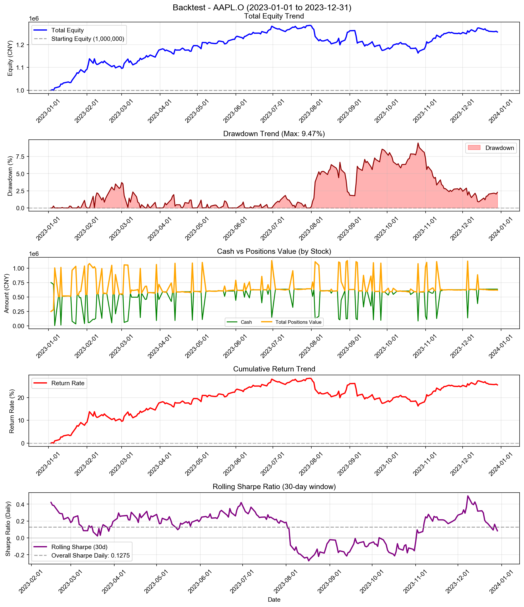
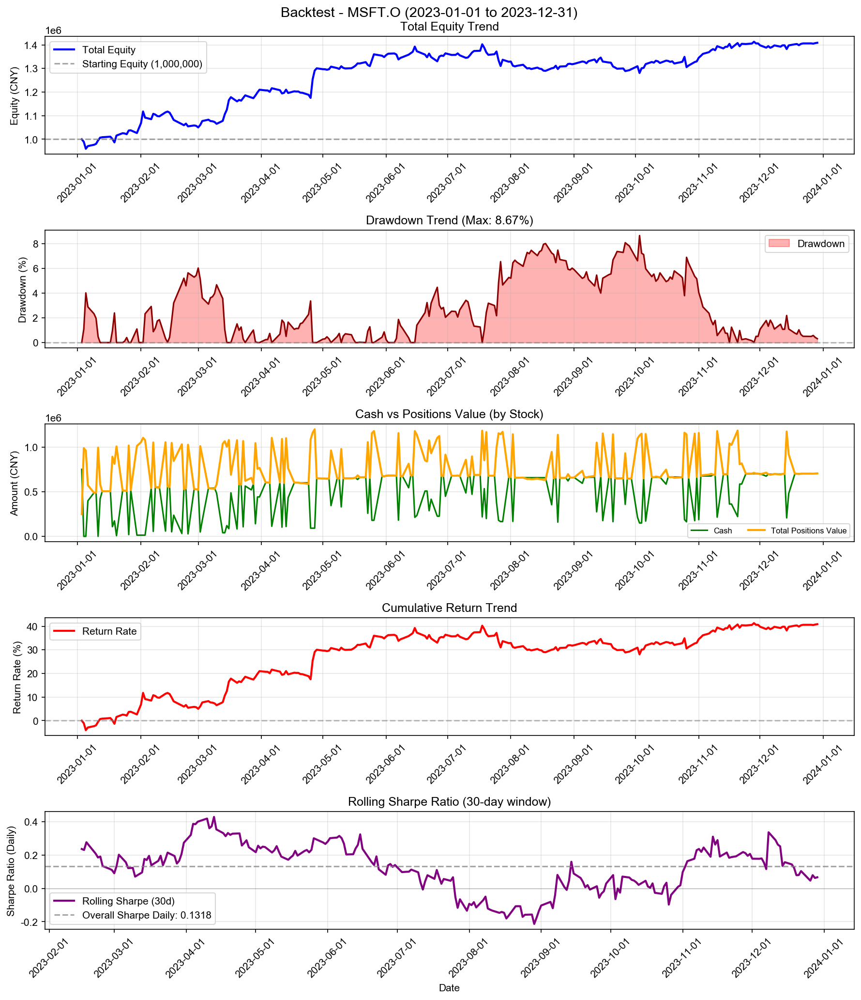
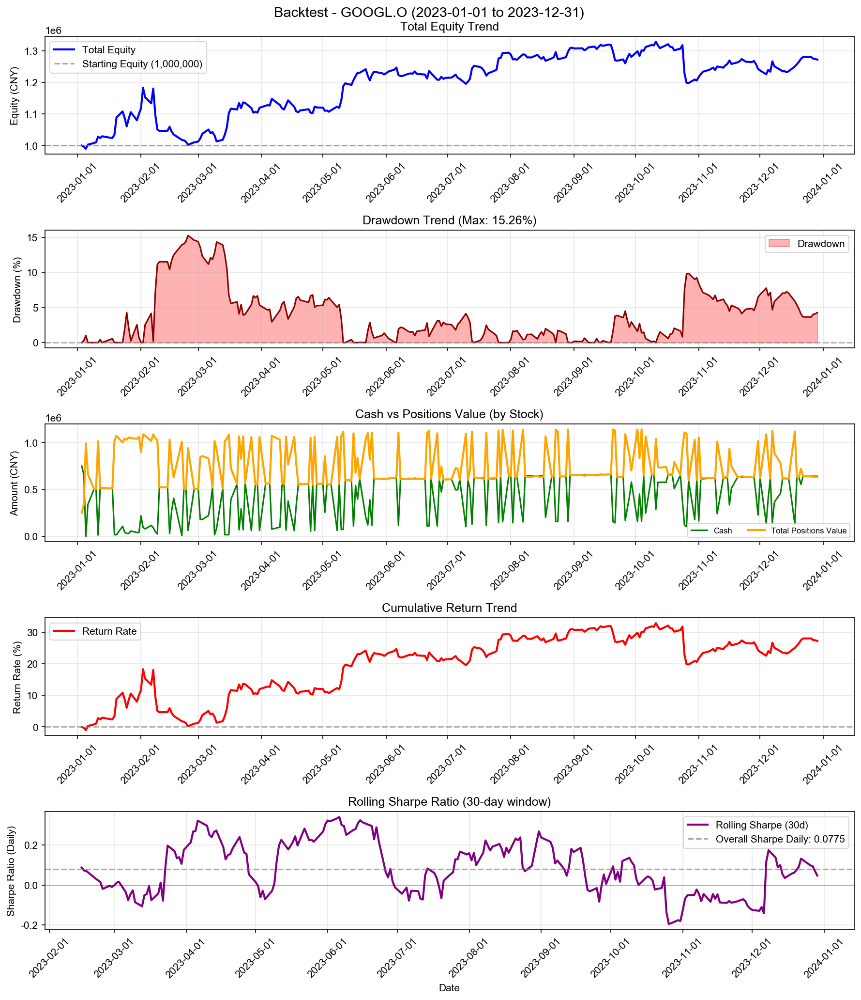
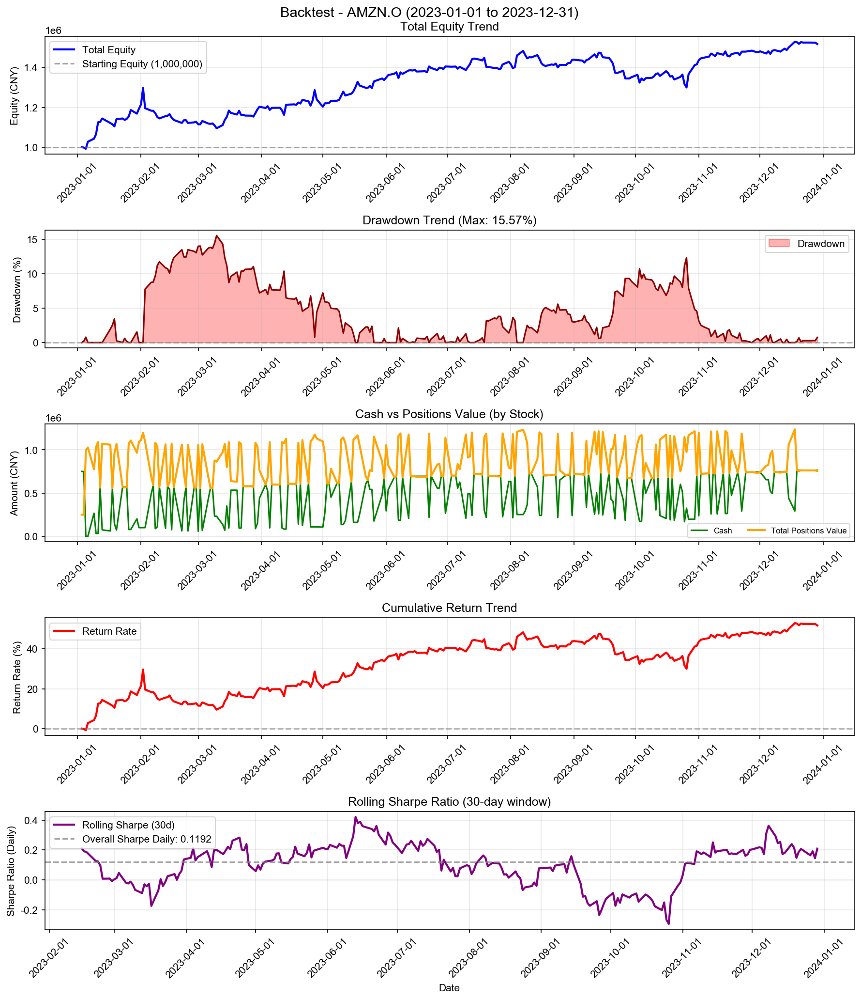
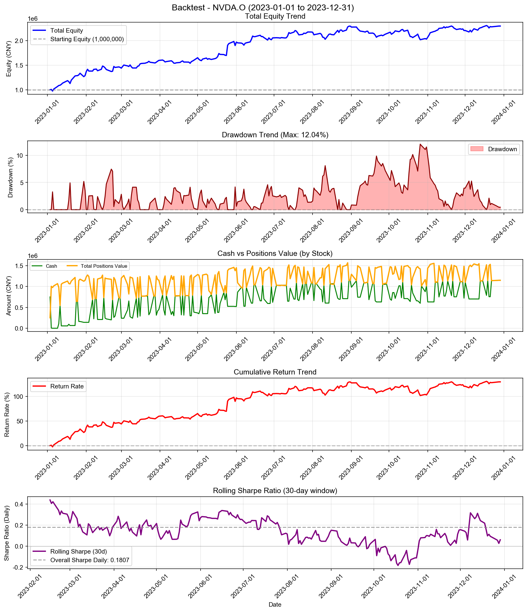
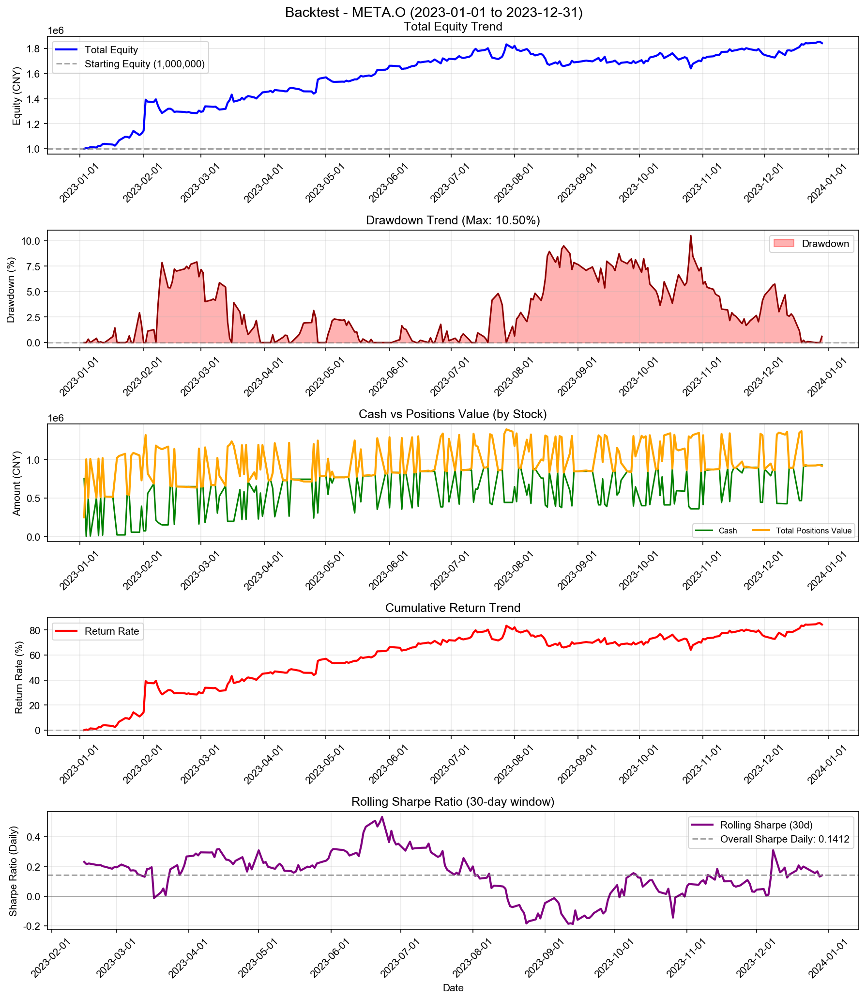
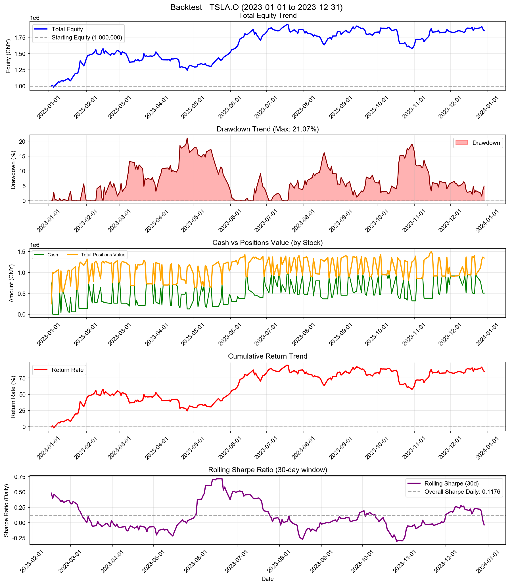
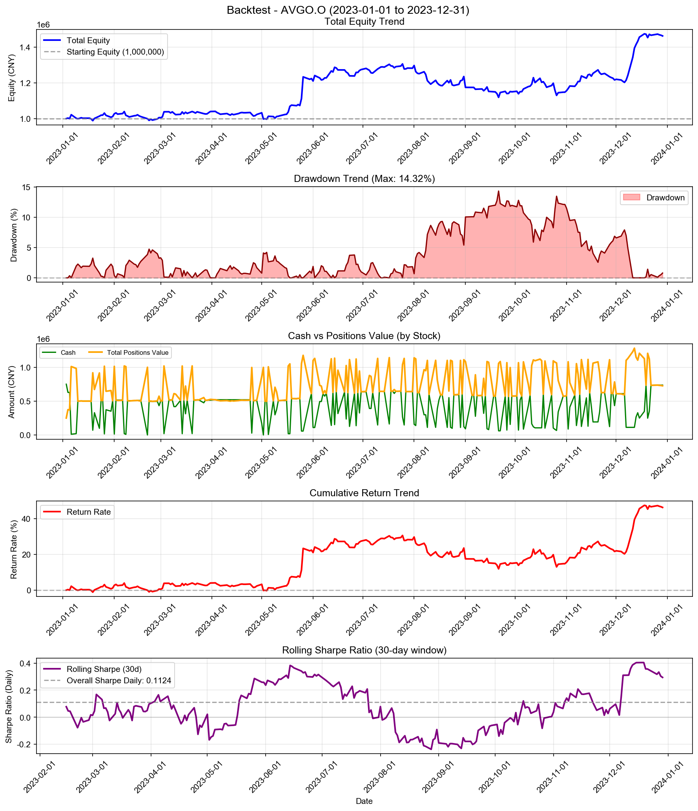
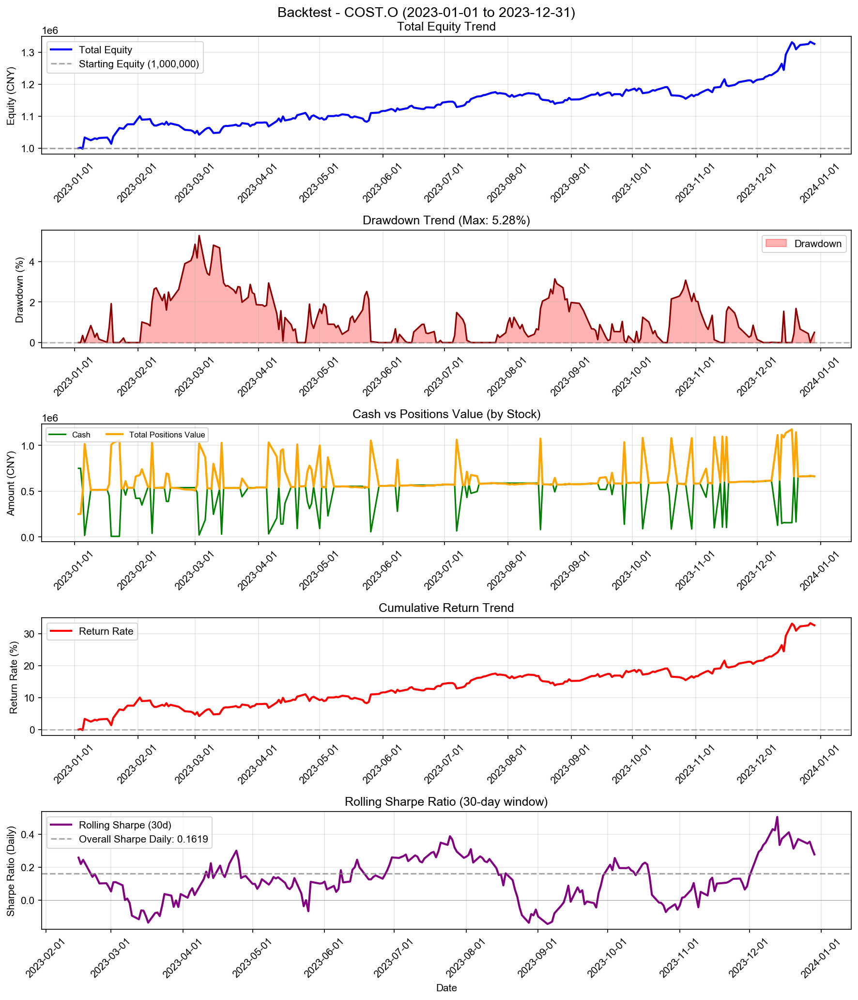
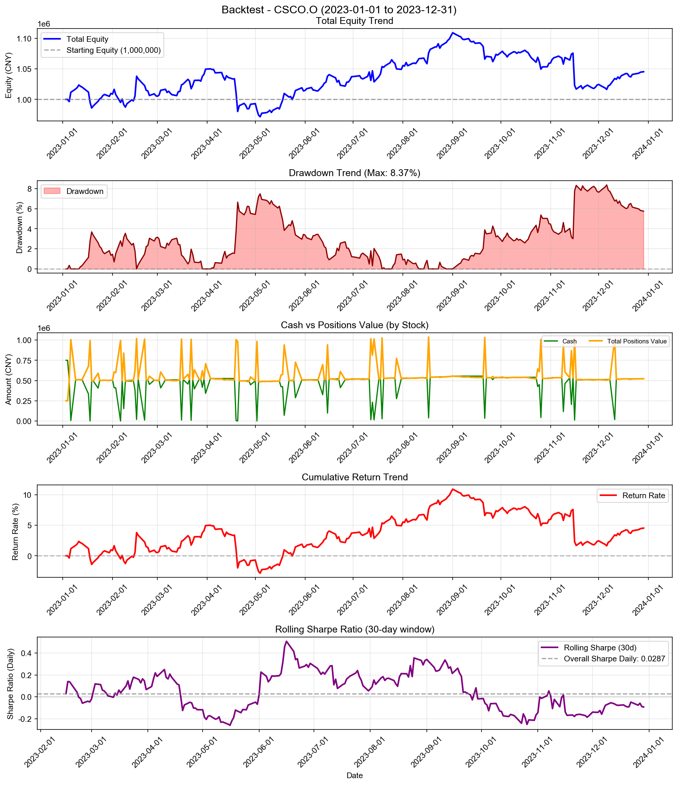

# Chasing Extremes with Position Scaling - 多股票回测综合报告

**策略名称:** Chasing Extremes with Position Scaling  
**回测期间:** 2023-01-01 至 2023-12-31  
**测试股票数:** 10 支  
**每只股票初始资金:** 1000000.00 元

---

## 综合统计

| 项目 | 数值 |
|------|------|
| 成功回测股票数 | 10/10 |
| 总初始资金 | 10000000.00 元 |
| 总最终权益 | 15278714.52 元 |
| 总盈亏 | +5278714.52 元 |
| 平均收益率 | +52.79% |
| 总交易次数 | 1673 次 |

---

## 各股票详细结果

| 股票代码 | 初始资金 | 最终权益 | 盈亏 | 收益率 | 交易次数 |
|----------|----------|----------|------|--------|------------------|
| AAPL.O | 1000000.00 | 1255105.37 | +255105.37 | +25.51% | 153 |
| MSFT.O | 1000000.00 | 1408649.04 | +408649.04 | +40.86% | 154 |
| GOOGL.O | 1000000.00 | 1272082.57 | +272082.57 | +27.21% | 182 |
| AMZN.O | 1000000.00 | 1517625.93 | +517625.93 | +51.76% | 185 |
| NVDA.O | 1000000.00 | 2295344.52 | +1295344.52 | +129.53% | 173 |
| META.O | 1000000.00 | 1843472.30 | +843472.30 | +84.35% | 177 |
| TSLA.O | 1000000.00 | 1851657.35 | +851657.35 | +85.17% | 176 |
| AVGO.O | 1000000.00 | 1462819.04 | +462819.04 | +46.28% | 180 |
| COST.O | 1000000.00 | 1326610.82 | +326610.82 | +32.66% | 156 |
| CSCO.O | 1000000.00 | 1045347.59 | +45347.59 | +4.53% | 137 |

---

## 收益率排名

### 收益率最高的股票

| 排名 | 股票代码 | 收益率 | 盈亏 |
|------|----------|--------|------|
| 1 | NVDA.O | +129.53% | +1295344.52 |
| 2 | TSLA.O | +85.17% | +851657.35 |
| 3 | META.O | +84.35% | +843472.30 |
| 4 | AMZN.O | +51.76% | +517625.93 |
| 5 | AVGO.O | +46.28% | +462819.04 |

### 收益率最低的股票

| 排名 | 股票代码 | 收益率 | 盈亏 |
|------|----------|--------|------|
| 1 | CSCO.O | +4.53% | +45347.59 |
| 2 | AAPL.O | +25.51% | +255105.37 |
| 3 | GOOGL.O | +27.21% | +272082.57 |
| 4 | COST.O | +32.66% | +326610.82 |
| 5 | MSFT.O | +40.86% | +408649.04 |

---

## 交易统计

| 股票代码 | 交易次数 | 平均每笔交易金额 |
|----------|------------------|------------------|
| AAPL.O | 153 | 7369.63 |
| MSFT.O | 154 | 7820.29 |
| GOOGL.O | 182 | 6241.99 |
| AMZN.O | 185 | 6804.39 |
| NVDA.O | 173 | 9524.12 |
| META.O | 177 | 8032.41 |
| TSLA.O | 176 | 8101.30 |
| AVGO.O | 180 | 6841.16 |
| COST.O | 156 | 7457.09 |
| CSCO.O | 137 | 7464.77 |

---

## 各股票详细分析

### AAPL.O

#### 账户摘要

| 项目 | 数值 |
|------|------|
| 初始资金 | 1000000.00 元 |
| 最终现金 | 636379.65 元 |
| 最终持仓市值 | 618725.73 元 |
| 最终总权益 | 1255105.37 元 |
| 总盈亏 | +255105.37 元 |
| 总收益率 | +25.51% |

| 资金比（现金/权益） | 50.70% |

#### 风险与稳健性指标

| 指标 | 数值 |
|------|------|
| 最大回撤 (Max Drawdown) | 9.47% |
| 年化收益率 (CAGR) | +25.74% |
| 年化夏普比率 (Sharpe) | 2.0243 |
| 日频夏普比率 (Sharpe Daily) | 0.1275 |
| 年化 Sortino 比率 | 2.0431 |
| 日频 Sortino 比率 | 0.1287 |
| Calmar 比率 (CAGR/MaxDD) | 2.7178 |
| 年化波动率 (Volatility) | 11.70% |
| VaR 95% | -1.00% |
| VaR 99% | -2.36% |
| CVaR 95% | -1.63% |
| CVaR 99% | -2.46% |

#### 统计信息

| 指标 | 数值 |
|------|------|
| 交易日数 | 250 天 |
| 最高权益 | 1284431.63 元 |
| 最低权益 | 999749.86 元 |
| 最高收益率 | +28.44% |
| 最低收益率 | -0.03% |

#### 最终持仓

| 股票代码 | 股数 | 成本价 | 现价 | 市值 | 盈亏 | 收益率 |
|----------|------|--------|------|------|------|--------|
| AAPL.O | 1111 | 545.90 | 556.91 | 618725.73 | +12228.87 | +2.02% |

---

### MSFT.O

#### 账户摘要

| 项目 | 数值 |
|------|------|
| 初始资金 | 1000000.00 元 |
| 最终现金 | 702912.94 元 |
| 最终持仓市值 | 705736.10 元 |
| 最终总权益 | 1408649.04 元 |
| 总盈亏 | +408649.04 元 |
| 总收益率 | +40.86% |

| 资金比（现金/权益） | 49.90% |

#### 风险与稳健性指标

| 指标 | 数值 |
|------|------|
| 最大回撤 (Max Drawdown) | 8.67% |
| 年化收益率 (CAGR) | +41.25% |
| 年化夏普比率 (Sharpe) | 2.0927 |
| 日频夏普比率 (Sharpe Daily) | 0.1318 |
| 年化 Sortino 比率 | 2.4250 |
| 日频 Sortino 比率 | 0.1528 |
| Calmar 比率 (CAGR/MaxDD) | 4.7598 |
| 年化波动率 (Volatility) | 17.29% |
| VaR 95% | -1.40% |
| VaR 99% | -2.72% |
| CVaR 95% | -1.98% |
| CVaR 99% | -2.97% |

#### 统计信息

| 指标 | 数值 |
|------|------|
| 交易日数 | 250 天 |
| 最高权益 | 1413076.75 元 |
| 最低权益 | 959798.47 元 |
| 最高收益率 | +41.31% |
| 最低收益率 | -4.02% |

#### 最终持仓

| 股票代码 | 股数 | 成本价 | 现价 | 市值 | 盈亏 | 收益率 |
|----------|------|--------|------|------|------|--------|
| MSFT.O | 404 | 1687.20 | 1746.87 | 705736.10 | +24107.02 | +3.54% |

---

### GOOGL.O

#### 账户摘要

| 项目 | 数值 |
|------|------|
| 初始资金 | 1000000.00 元 |
| 最终现金 | 641015.05 元 |
| 最终持仓市值 | 631067.52 元 |
| 最终总权益 | 1272082.57 元 |
| 总盈亏 | +272082.57 元 |
| 总收益率 | +27.21% |

| 资金比（现金/权益） | 50.39% |

#### 风险与稳健性指标

| 指标 | 数值 |
|------|------|
| 最大回撤 (Max Drawdown) | 15.26% |
| 年化收益率 (CAGR) | +27.45% |
| 年化夏普比率 (Sharpe) | 1.2305 |
| 日频夏普比率 (Sharpe Daily) | 0.0775 |
| 年化 Sortino 比率 | 1.2106 |
| 日频 Sortino 比率 | 0.0763 |
| Calmar 比率 (CAGR/MaxDD) | 1.7992 |
| 年化波动率 (Volatility) | 21.72% |
| VaR 95% | -1.72% |
| VaR 99% | -4.19% |
| CVaR 95% | -3.00% |
| CVaR 99% | -6.02% |

#### 统计信息

| 指标 | 数值 |
|------|------|
| 交易日数 | 250 天 |
| 最高权益 | 1328800.22 元 |
| 最低权益 | 989837.64 元 |
| 最高收益率 | +32.88% |
| 最低收益率 | -1.02% |

#### 最终持仓

| 股票代码 | 股数 | 成本价 | 现价 | 市值 | 盈亏 | 收益率 |
|----------|------|--------|------|------|------|--------|
| GOOGL.O | 11305 | 54.03 | 55.82 | 631067.52 | +20314.87 | +3.33% |

---

### AMZN.O

#### 账户摘要

| 项目 | 数值 |
|------|------|
| 初始资金 | 1000000.00 元 |
| 最终现金 | 763152.66 元 |
| 最终持仓市值 | 754473.26 元 |
| 最终总权益 | 1517625.93 元 |
| 总盈亏 | +517625.93 元 |
| 总收益率 | +51.76% |

| 资金比（现金/权益） | 50.29% |

#### 风险与稳健性指标

| 指标 | 数值 |
|------|------|
| 最大回撤 (Max Drawdown) | 15.57% |
| 年化收益率 (CAGR) | +52.27% |
| 年化夏普比率 (Sharpe) | 1.8925 |
| 日频夏普比率 (Sharpe Daily) | 0.1192 |
| 年化 Sortino 比率 | 2.0249 |
| 日频 Sortino 比率 | 0.1276 |
| Calmar 比率 (CAGR/MaxDD) | 3.3580 |
| 年化波动率 (Volatility) | 23.81% |
| VaR 95% | -1.71% |
| VaR 99% | -3.48% |
| CVaR 95% | -3.02% |
| CVaR 99% | -4.97% |

#### 统计信息

| 指标 | 数值 |
|------|------|
| 交易日数 | 250 天 |
| 最高权益 | 1529059.46 元 |
| 最低权益 | 992100.98 元 |
| 最高收益率 | +52.91% |
| 最低收益率 | -0.79% |

#### 最终持仓

| 股票代码 | 股数 | 成本价 | 现价 | 市值 | 盈亏 | 收益率 |
|----------|------|--------|------|------|------|--------|
| AMZN.O | 2069 | 352.07 | 364.66 | 754473.26 | +26043.02 | +3.58% |

---

### NVDA.O

#### 账户摘要

| 项目 | 数值 |
|------|------|
| 初始资金 | 1000000.00 元 |
| 最终现金 | 1148255.94 元 |
| 最终持仓市值 | 1147088.57 元 |
| 最终总权益 | 2295344.52 元 |
| 总盈亏 | +1295344.52 元 |
| 总收益率 | +129.53% |

| 资金比（现金/权益） | 50.03% |

#### 风险与稳健性指标

| 指标 | 数值 |
|------|------|
| 最大回撤 (Max Drawdown) | 12.04% |
| 年化收益率 (CAGR) | +131.07% |
| 年化夏普比率 (Sharpe) | 2.8691 |
| 日频夏普比率 (Sharpe Daily) | 0.1807 |
| 年化 Sortino 比率 | 3.6189 |
| 日频 Sortino 比率 | 0.2280 |
| Calmar 比率 (CAGR/MaxDD) | 10.8863 |
| 年化波动率 (Volatility) | 30.99% |
| VaR 95% | -2.42% |
| VaR 99% | -3.27% |
| CVaR 95% | -3.09% |
| CVaR 99% | -4.21% |

#### 统计信息

| 指标 | 数值 |
|------|------|
| 交易日数 | 250 天 |
| 最高权益 | 2305604.66 元 |
| 最低权益 | 974639.16 元 |
| 最高收益率 | +130.56% |
| 最低收益率 | -2.54% |

#### 最终持仓

| 股票代码 | 股数 | 成本价 | 现价 | 市值 | 盈亏 | 收益率 |
|----------|------|--------|------|------|------|--------|
| NVDA.O | 4427 | 249.30 | 259.11 | 1147088.57 | +43439.23 | +3.94% |

---

### META.O

#### 账户摘要

| 项目 | 数值 |
|------|------|
| 初始资金 | 1000000.00 元 |
| 最终现金 | 927738.85 元 |
| 最终持仓市值 | 915733.46 元 |
| 最终总权益 | 1843472.30 元 |
| 总盈亏 | +843472.30 元 |
| 总收益率 | +84.35% |

| 资金比（现金/权益） | 50.33% |

#### 风险与稳健性指标

| 指标 | 数值 |
|------|------|
| 最大回撤 (Max Drawdown) | 10.50% |
| 年化收益率 (CAGR) | +85.25% |
| 年化夏普比率 (Sharpe) | 2.2417 |
| 日频夏普比率 (Sharpe Daily) | 0.1412 |
| 年化 Sortino 比率 | 3.6899 |
| 日频 Sortino 比率 | 0.2324 |
| Calmar 比率 (CAGR/MaxDD) | 8.1155 |
| 年化波动率 (Volatility) | 29.44% |
| VaR 95% | -1.80% |
| VaR 99% | -2.93% |
| CVaR 95% | -2.54% |
| CVaR 99% | -3.49% |

#### 统计信息

| 指标 | 数值 |
|------|------|
| 交易日数 | 250 天 |
| 最高权益 | 1854752.10 元 |
| 最低权益 | 1000000.00 元 |
| 最高收益率 | +85.48% |
| 最低收益率 | +0.00% |

#### 最终持仓

| 股票代码 | 股数 | 成本价 | 现价 | 市值 | 盈亏 | 收益率 |
|----------|------|--------|------|------|------|--------|
| META.O | 258711 | 3.32 | 3.54 | 915733.46 | +56688.07 | +6.60% |

---

### TSLA.O

#### 账户摘要

| 项目 | 数值 |
|------|------|
| 初始资金 | 1000000.00 元 |
| 最终现金 | 507032.68 元 |
| 最终持仓市值 | 1344624.67 元 |
| 最终总权益 | 1851657.35 元 |
| 总盈亏 | +851657.35 元 |
| 总收益率 | +85.17% |

| 资金比（现金/权益） | 27.38% |

#### 风险与稳健性指标

| 指标 | 数值 |
|------|------|
| 最大回撤 (Max Drawdown) | 21.07% |
| 年化收益率 (CAGR) | +86.08% |
| 年化夏普比率 (Sharpe) | 1.8663 |
| 日频夏普比率 (Sharpe Daily) | 0.1176 |
| 年化 Sortino 比率 | 1.9935 |
| 日频 Sortino 比率 | 0.1256 |
| Calmar 比率 (CAGR/MaxDD) | 4.0850 |
| 年化波动率 (Volatility) | 37.11% |
| VaR 95% | -3.03% |
| VaR 99% | -5.68% |
| CVaR 95% | -4.81% |
| CVaR 99% | -6.93% |

#### 统计信息

| 指标 | 数值 |
|------|------|
| 交易日数 | 250 天 |
| 最高权益 | 1948039.70 元 |
| 最低权益 | 983587.22 元 |
| 最高收益率 | +94.80% |
| 最低收益率 | -1.64% |

#### 最终持仓

| 股票代码 | 股数 | 成本价 | 现价 | 市值 | 盈亏 | 收益率 |
|----------|------|--------|------|------|------|--------|
| TSLA.O | 36076 | 37.30 | 37.27 | 1344624.67 | -1181.14 | -0.09% |

---

### AVGO.O

#### 账户摘要

| 项目 | 数值 |
|------|------|
| 初始资金 | 1000000.00 元 |
| 最终现金 | 736486.80 元 |
| 最终持仓市值 | 726332.24 元 |
| 最终总权益 | 1462819.04 元 |
| 总盈亏 | +462819.04 元 |
| 总收益率 | +46.28% |

| 资金比（现金/权益） | 50.35% |

#### 风险与稳健性指标

| 指标 | 数值 |
|------|------|
| 最大回撤 (Max Drawdown) | 14.32% |
| 年化收益率 (CAGR) | +46.73% |
| 年化夏普比率 (Sharpe) | 1.7842 |
| 日频夏普比率 (Sharpe Daily) | 0.1124 |
| 年化 Sortino 比率 | 2.2516 |
| 日频 Sortino 比率 | 0.1418 |
| Calmar 比率 (CAGR/MaxDD) | 3.2634 |
| 年化波动率 (Volatility) | 23.04% |
| VaR 95% | -1.84% |
| VaR 99% | -3.26% |
| CVaR 95% | -2.62% |
| CVaR 99% | -3.84% |

#### 统计信息

| 指标 | 数值 |
|------|------|
| 交易日数 | 250 天 |
| 最高权益 | 1474441.68 元 |
| 最低权益 | 988630.33 元 |
| 最高收益率 | +47.44% |
| 最低收益率 | -1.14% |

#### 最终持仓

| 股票代码 | 股数 | 成本价 | 现价 | 市值 | 盈亏 | 收益率 |
|----------|------|--------|------|------|------|--------|
| AVGO.O | 51584 | 12.75 | 14.08 | 726332.24 | +68685.70 | +10.44% |

---

### COST.O

#### 账户摘要

| 项目 | 数值 |
|------|------|
| 初始资金 | 1000000.00 元 |
| 最终现金 | 664816.68 元 |
| 最终持仓市值 | 661794.13 元 |
| 最终总权益 | 1326610.82 元 |
| 总盈亏 | +326610.82 元 |
| 总收益率 | +32.66% |

| 资金比（现金/权益） | 50.11% |

#### 风险与稳健性指标

| 指标 | 数值 |
|------|------|
| 最大回撤 (Max Drawdown) | 5.28% |
| 年化收益率 (CAGR) | +32.96% |
| 年化夏普比率 (Sharpe) | 2.5702 |
| 日频夏普比率 (Sharpe Daily) | 0.1619 |
| 年化 Sortino 比率 | 3.0023 |
| 日频 Sortino 比率 | 0.1891 |
| Calmar 比率 (CAGR/MaxDD) | 6.2408 |
| 年化波动率 (Volatility) | 11.38% |
| VaR 95% | -1.05% |
| VaR 99% | -1.38% |
| CVaR 95% | -1.22% |
| CVaR 99% | -1.49% |

#### 统计信息

| 指标 | 数值 |
|------|------|
| 交易日数 | 250 天 |
| 最高权益 | 1333358.02 元 |
| 最低权益 | 998295.81 元 |
| 最高收益率 | +33.34% |
| 最低收益率 | -0.17% |

#### 最终持仓

| 股票代码 | 股数 | 成本价 | 现价 | 市值 | 盈亏 | 收益率 |
|----------|------|--------|------|------|------|--------|
| COST.O | 33862 | 18.41 | 19.54 | 661794.13 | +38282.76 | +6.14% |

---

### CSCO.O

#### 账户摘要

| 项目 | 数值 |
|------|------|
| 初始资金 | 1000000.00 元 |
| 最终现金 | 522697.78 元 |
| 最终持仓市值 | 522649.81 元 |
| 最终总权益 | 1045347.59 元 |
| 总盈亏 | +45347.59 元 |
| 总收益率 | +4.53% |

| 资金比（现金/权益） | 50.00% |

#### 风险与稳健性指标

| 指标 | 数值 |
|------|------|
| 最大回撤 (Max Drawdown) | 8.37% |
| 年化收益率 (CAGR) | +4.57% |
| 年化夏普比率 (Sharpe) | 0.4562 |
| 日频夏普比率 (Sharpe Daily) | 0.0287 |
| 年化 Sortino 比率 | 0.3955 |
| 日频 Sortino 比率 | 0.0249 |
| Calmar 比率 (CAGR/MaxDD) | 0.5464 |
| 年化波动率 (Volatility) | 11.22% |
| VaR 95% | -0.94% |
| VaR 99% | -2.22% |
| CVaR 95% | -1.80% |
| CVaR 99% | -3.39% |

#### 统计信息

| 指标 | 数值 |
|------|------|
| 交易日数 | 250 天 |
| 最高权益 | 1109123.50 元 |
| 最低权益 | 971535.75 元 |
| 最高收益率 | +10.91% |
| 最低收益率 | -2.85% |

#### 最终持仓

| 股票代码 | 股数 | 成本价 | 现价 | 市值 | 盈亏 | 收益率 |
|----------|------|--------|------|------|------|--------|
| CSCO.O | 2475 | 208.17 | 211.17 | 522649.81 | +7426.49 | +1.44% |

---

---

## 策略参数

- **extreme_threshold:** 1.0%
- **lookback_days:** 1
- **max_position_weight:** 100%
- **chase_up:** True
- **chase_down:** True
- **enable_equity_scaling:** True
- **equity_scaling_factor:** 0.5
- **enable_confidence_scaling:** True
- **confidence_power:** 1.0
- **enable_performance_scaling:** True
- **consecutive_loss_threshold:** 3
- **consecutive_win_threshold:** 3
- **loss_scaling_factor:** 0.5
- **win_scaling_factor:** 1.2

---

*报告生成时间: 2025-12-24 17:59:46*
