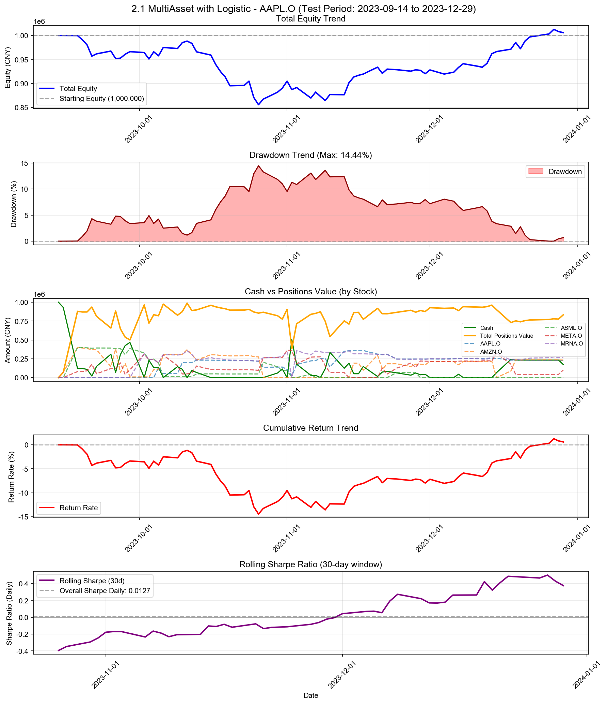

# 2.1 MultiAsset with Logistic

**策略名称:** 2.1 MultiAsset with Logistic  
**回测期间:** 2023-01-03 至 2023-12-29  
**交易日数:** 75  
**组合股票数:** 5 支  
**初始资金:** 1000000.00 元

---

## 组合整体表现

| 项目 | 数值 |
|------|------|
| 初始资金 | 1000000.00 元 |
| 最终现金 | 173060.01 元 |
| 最终持仓市值 | 832961.86 元 |
| 最终总权益 | 1006021.87 元 |
| 总盈亏 | +6021.87 元 |
| 总收益率 | +0.60% |
| 年化收益率 (CAGR) | +2.04% |

---

## 持仓明细

| 股票代码 | 股数 | 成本价 | 现价 | 市值 | 权重 | 盈亏 | 收益率 | 贡献度 |
|----------|------|--------|------|------|------|------|--------|--------|
| AAPL.O | 410 | 526.37 | 556.91 | 228332.63 | 22.70% | +12520.91 | +5.80% | 1.32% |
| AMZN.O | 639 | 369.35 | 364.66 | 233015.18 | 23.16% | -2996.42 | -1.27% | -0.29% |
| META.O | 28580 | 3.46 | 3.54 | 101161.77 | 10.06% | +2251.77 | +2.28% | 0.23% |
| MRNA.O | 271948 | 0.79 | 0.99 | 270452.29 | 26.88% | +56944.14 | +26.67% | 7.17% |

### 权重分布

| 股票代码 | 权重 | 市值占比 |
|----------|------|----------|
| AAPL.O | 22.70% | 22.70% |
| AMZN.O | 23.16% | 23.16% |
| META.O | 10.06% | 10.06% |
| MRNA.O | 26.88% | 26.88% |

---

## 交易统计

| 项目 | 数值 |
|------|------|
| 总交易次数 | 112 次 |
| 买入次数 | 57 次 |
| 卖出次数 | 55 次 |
| 买入总成本 | 6284896.68 元 |
| 卖出总收入 | 5457956.69 元 |
| 已实现盈亏 | -62698.52 元 |

### 交易质量指标

| 指标 | 数值 |
|------|------|
| 胜率 (Hit Rate) | 58.18% |
| 盈亏比 (Profit Factor) | 0.58 |
| 单笔平均收益 | -1139.97 元 |
| 平均持仓周期 | 11.8 天 |

---

## 风险与稳健性

| 指标 | 数值 |
|------|------|
| 最大回撤 (Max Drawdown) | 14.44% |
| 年化波动率 (Volatility) | 19.99% |
| 年化夏普比率 (Sharpe) | 0.2012 |
| 日频夏普比率 (Sharpe Daily) | 0.0127 |
| 年化 Sortino 比率 | 0.1820 |
| 日频 Sortino 比率 | 0.0115 |
| Calmar 比率 (CAGR/MaxDD) | 0.1411 |
### 尾部风险 (Tail Risk)

| 指标 | 数值 |
|------|------|
| VaR 95% | -2.02% |
| VaR 99% | -3.76% |
| CVaR 95% | -2.65% |
| CVaR 99% | -3.76% |
| 极端日跌幅 (5%分位) | -2.39% |
| 极端日跌幅 (1%分位) | -3.76% |

---

## 执行与成本

| 指标 | 数值 |
|------|------|
| 换手率 (Turnover) | 625.13% |
| 交易频率 (每日) | 1.49 次/日 |
| 交易频率 (每周) | 7.47 次/周 |

---

## 各股票表现分析

| 股票代码 | 初始权重 | 最终权重 | 收益率 | 盈亏 | 交易次数 | 贡献度 |
|----------|----------|----------|--------|------|----------|--------|
| AAPL.O | 74.71% | 22.70% | +5.80% | +12520.91 | 15 | 1.32% |
| AMZN.O | 200.11% | 23.16% | -1.27% | -2996.42 | 28 | -0.29% |
| META.O | 165.66% | 10.06% | +2.28% | +2251.77 | 34 | 0.23% |
| MRNA.O | 110.18% | 26.88% | +26.67% | +56944.14 | 19 | 7.17% |

---

## 策略参数

- **max_position_weight:** 40%
- **min_score_threshold:** 0.05
- **max_total_weight:** 100%
- **train_window_days:** 252
- **prediction_horizon:** 5
- **ret_threshold:** 0.0
- **retrain_frequency:** 20
- **min_trade_amount:** 5,000 元
- **min_weight_change:** 5%

---

## 交易记录

| 序号 | 日期 | 类型 | 股票代码 | 股数 | 价格 | 成本/收入 | 利润 |
|------|------|------|----------|------|------|-----------|------|
| 1 | 2023-09-15 | 买入 | AMZN.O | 206 | 336.94 | 69408.82 | - |
| 2 | 2023-09-18 | 买入 | AMZN.O | 984 | 335.95 | 330576.77 | - |
| 3 | 2023-09-18 | 买入 | ASML.O | 5285 | 75.67 | 399906.41 | - |
| 4 | 2023-09-18 | 买入 | META.O | 26361 | 3.03 | 79755.21 | - |
| 5 | 2023-09-20 | 买入 | META.O | 3675 | 3.00 | 11012.87 | - |
| 6 | 2023-09-21 | 买入 | META.O | 29943 | 2.96 | 88550.43 | - |
| 7 | 2023-09-22 | 卖出 | META.O | 43021 | 2.99 | 128667.21 | +47.83 |
| 8 | 2023-09-25 | 卖出 | AMZN.O | 730 | 315.05 | 229985.04 | -15384.27 |
| 9 | 2023-09-25 | 买入 | META.O | 23055 | 3.01 | 69356.36 | - |
| 10 | 2023-09-26 | 买入 | AMZN.O | 799 | 302.35 | 241579.25 | - |
| 11 | 2023-09-27 | 卖出 | AMZN.O | 1038 | 302.35 | 313841.38 | -12807.52 |
| 12 | 2023-09-27 | 买入 | META.O | 25626 | 2.98 | 76298.85 | - |
| 13 | 2023-09-28 | 买入 | AMZN.O | 403 | 302.35 | 121847.86 | - |
| 14 | 2023-09-28 | 卖出 | ASML.O | 1124 | 73.51 | 82620.74 | -2430.31 |
| 15 | 2023-09-28 | 卖出 | META.O | 51832 | 3.04 | 157548.55 | +2496.85 |
| 16 | 2023-09-29 | 卖出 | AMZN.O | 595 | 305.09 | 181527.36 | -972.19 |
| 17 | 2023-09-29 | 买入 | ASML.O | 1025 | 74.52 | 76383.00 | - |
| 18 | 2023-09-29 | 买入 | META.O | 20866 | 3.00 | 62641.82 | - |
| 19 | 2023-10-02 | 卖出 | ASML.O | 751 | 73.70 | 55348.46 | -1307.92 |
| 20 | 2023-10-02 | 买入 | META.O | 66651 | 3.07 | 204498.60 | - |
| 21 | 2023-10-02 | 买入 | MRNA.O | 307542 | 1.03 | 317721.64 | - |
| 22 | 2023-10-03 | 卖出 | ASML.O | 1143 | 72.23 | 82563.16 | -3666.19 |
| 23 | 2023-10-03 | 卖出 | META.O | 22323 | 3.01 | 67178.84 | -775.20 |
| 24 | 2023-10-03 | 卖出 | MRNA.O | 76901 | 1.03 | 79269.55 | -176.87 |
| 25 | 2023-10-04 | 买入 | AMZN.O | 318 | 304.80 | 96926.40 | - |
| 26 | 2023-10-05 | 买入 | AAPL.O | 261 | 505.28 | 131877.00 | - |
| 27 | 2023-10-05 | 卖出 | ASML.O | 650 | 73.64 | 47864.47 | -1172.34 |
| 28 | 2023-10-05 | 卖出 | META.O | 15170 | 3.05 | 46236.64 | +57.25 |
| 29 | 2023-10-05 | 卖出 | MRNA.O | 41703 | 1.03 | 42941.58 | -141.79 |
| 30 | 2023-10-06 | 卖出 | AAPL.O | 159 | 512.73 | 81523.90 | +1185.03 |
| 31 | 2023-10-06 | 买入 | AMZN.O | 648 | 307.10 | 199003.39 | - |
| 32 | 2023-10-06 | 卖出 | ASML.O | 2476 | 75.62 | 187238.48 | +445.92 |
| 33 | 2023-10-06 | 买入 | META.O | 31018 | 3.15 | 97840.08 | - |
| 34 | 2023-10-06 | 买入 | MRNA.O | 105092 | 1.04 | 109169.57 | - |
| 35 | 2023-10-09 | 卖出 | META.O | 45656 | 3.18 | 145350.44 | +4722.84 |
| 36 | 2023-10-10 | 买入 | AAPL.O | 282 | 515.33 | 145322.73 | - |
| 37 | 2023-10-10 | 卖出 | META.O | 34188 | 3.22 | 110030.66 | +4726.29 |
| 38 | 2023-10-11 | 买入 | AMZN.O | 173 | 316.39 | 54735.82 | - |
| 39 | 2023-10-11 | 买入 | MRNA.O | 53837 | 1.03 | 55322.90 | - |
| 40 | 2023-10-12 | 卖出 | AMZN.O | 201 | 317.59 | 63835.99 | +1959.56 |
| 41 | 2023-10-12 | 买入 | META.O | 4219 | 3.24 | 13676.31 | - |
| 42 | 2023-10-12 | 卖出 | MRNA.O | 43153 | 1.01 | 43489.59 | -1129.35 |
| 43 | 2023-10-13 | 买入 | AAPL.O | 64 | 516.66 | 33066.09 | - |
| 44 | 2023-10-13 | 卖出 | AMZN.O | 222 | 311.50 | 69152.11 | +810.98 |
| 45 | 2023-10-13 | 买入 | ASML.O | 482 | 75.92 | 36595.33 | - |
| 46 | 2023-10-13 | 买入 | META.O | 29597 | 3.15 | 93138.80 | - |
| 47 | 2023-10-13 | 卖出 | MRNA.O | 68789 | 0.98 | 67619.59 | -3506.23 |
| 48 | 2023-10-16 | 买入 | AMZN.O | 212 | 318.12 | 67441.44 | - |
| 49 | 2023-10-16 | 卖出 | META.O | 15196 | 3.21 | 48801.95 | +1169.03 |
| 50 | 2023-10-16 | 买入 | MRNA.O | 53276 | 0.92 | 48981.95 | - |
| 51 | 2023-10-27 | 卖出 | AAPL.O | 165 | 485.95 | 80181.74 | -4501.18 |
| 52 | 2023-10-27 | 卖出 | AMZN.O | 957 | 306.58 | 293393.23 | -3391.19 |
| 53 | 2023-10-27 | 买入 | ASML.O | 2081 | 74.69 | 155429.13 | - |
| 54 | 2023-10-27 | 买入 | META.O | 55027 | 2.97 | 163281.62 | - |
| 55 | 2023-10-27 | 买入 | MRNA.O | 76295 | 0.72 | 54863.73 | - |
| 56 | 2023-10-30 | 卖出 | ASML.O | 817 | 74.55 | 60905.59 | -331.30 |
| 57 | 2023-10-31 | 卖出 | ASML.O | 706 | 75.80 | 53518.27 | +601.20 |
| 58 | 2023-11-01 | 卖出 | AAPL.O | 65 | 502.56 | 32666.43 | -693.51 |
| 59 | 2023-11-01 | 买入 | META.O | 27393 | 3.12 | 85425.07 | - |
| 60 | 2023-11-01 | 买入 | MRNA.O | 80926 | 0.76 | 61665.61 | - |
| 61 | 2023-11-02 | 卖出 | AAPL.O | 173 | 512.96 | 88742.08 | -46.67 |
| 62 | 2023-11-02 | 卖出 | ASML.O | 1206 | 80.13 | 96642.26 | +6248.51 |
| 63 | 2023-11-02 | 卖出 | MRNA.O | 446422 | 0.71 | 317986.39 | -91464.47 |
| 64 | 2023-11-03 | 买入 | AAPL.O | 295 | 510.30 | 150539.19 | - |
| 65 | 2023-11-03 | 卖出 | META.O | 57738 | 3.15 | 181643.75 | +5458.58 |
| 66 | 2023-11-03 | 买入 | MRNA.O | 459905 | 0.78 | 356564.35 | - |
| 67 | 2023-11-06 | 买入 | AAPL.O | 89 | 517.76 | 46080.23 | - |
| 68 | 2023-11-06 | 买入 | ASML.O | 549 | 80.90 | 44415.41 | - |
| 69 | 2023-11-06 | 买入 | META.O | 27680 | 3.16 | 87413.44 | - |
| 70 | 2023-11-06 | 卖出 | MRNA.O | 41618 | 0.72 | 29994.09 | -2272.34 |
| 71 | 2023-11-07 | 卖出 | ASML.O | 549 | 80.76 | 44336.68 | -78.74 |
| 72 | 2023-11-07 | 买入 | MRNA.O | 60623 | 0.74 | 44654.90 | - |
| 73 | 2023-11-08 | 买入 | AAPL.O | 56 | 528.33 | 29586.39 | - |
| 74 | 2023-11-09 | 卖出 | META.O | 36083 | 3.21 | 115664.06 | +4320.73 |
| 75 | 2023-11-10 | 卖出 | AAPL.O | 224 | 539.18 | 120775.72 | +5634.57 |
| 76 | 2023-11-10 | 卖出 | META.O | 29699 | 3.29 | 97641.40 | +5997.54 |
| 77 | 2023-11-13 | 买入 | AAPL.O | 394 | 534.55 | 210612.38 | - |
| 78 | 2023-11-14 | 卖出 | META.O | 20205 | 3.36 | 67951.44 | +5603.74 |
| 79 | 2023-11-15 | 买入 | AMZN.O | 557 | 343.68 | 191429.76 | - |
| 80 | 2023-11-15 | 卖出 | MRNA.O | 66811 | 0.76 | 51010.20 | -461.07 |
| 81 | 2023-11-17 | 卖出 | AMZN.O | 275 | 348.43 | 95818.80 | +1306.80 |
| 82 | 2023-11-20 | 卖出 | AAPL.O | 94 | 553.78 | 52055.78 | +2576.99 |
| 83 | 2023-11-20 | 买入 | AMZN.O | 567 | 350.71 | 198853.70 | - |
| 84 | 2023-11-20 | 卖出 | MRNA.O | 18910 | 0.79 | 14931.34 | +363.05 |
| 85 | 2023-11-21 | 卖出 | AMZN.O | 537 | 345.36 | 185458.32 | -1619.74 |
| 86 | 2023-11-21 | 买入 | META.O | 37761 | 3.37 | 127247.02 | - |
| 87 | 2023-11-22 | 买入 | AMZN.O | 208 | 352.10 | 73237.63 | - |
| 88 | 2023-11-22 | 卖出 | META.O | 24327 | 3.41 | 83074.27 | +1097.15 |
| 89 | 2023-11-24 | 卖出 | AAPL.O | 113 | 549.50 | 62093.93 | +2614.12 |
| 90 | 2023-11-24 | 买入 | ASML.O | 748 | 87.72 | 65616.77 | - |
| 91 | 2023-11-24 | 买入 | META.O | 23525 | 3.38 | 79568.61 | - |
| 92 | 2023-11-24 | 卖出 | MRNA.O | 80019 | 0.79 | 62830.92 | +1184.19 |
| 93 | 2023-11-27 | 卖出 | AMZN.O | 107 | 354.55 | 37937.06 | +501.26 |
| 94 | 2023-11-27 | 买入 | META.O | 20537 | 3.35 | 68737.34 | - |
| 95 | 2023-11-28 | 买入 | AMZN.O | 90 | 352.87 | 31758.48 | - |
| 96 | 2023-11-28 | 卖出 | META.O | 17873 | 3.39 | 60587.68 | +413.39 |
| 97 | 2023-11-29 | 卖出 | ASML.O | 748 | 87.27 | 65277.85 | -338.92 |
| 98 | 2023-11-29 | 买入 | META.O | 26822 | 3.32 | 89102.68 | - |
| 99 | 2023-11-30 | 卖出 | AMZN.O | 20 | 350.62 | 7012.32 | +4.22 |
| 100 | 2023-12-01 | 买入 | AMZN.O | 124 | 352.87 | 43756.13 | - |
| 101 | 2023-12-07 | 卖出 | AMZN.O | 126 | 352.51 | 44416.51 | +201.98 |
| 102 | 2023-12-08 | 买入 | AMZN.O | 126 | 353.81 | 44579.81 | - |
| 103 | 2023-12-15 | 卖出 | AMZN.O | 607 | 359.93 | 218476.30 | +5109.28 |
| 104 | 2023-12-15 | 买入 | META.O | 29749 | 3.35 | 99635.35 | - |
| 105 | 2023-12-15 | 买入 | MRNA.O | 61409 | 0.86 | 52817.88 | - |
| 106 | 2023-12-18 | 卖出 | AAPL.O | 38 | 566.63 | 21531.86 | +1529.80 |
| 107 | 2023-12-18 | 买入 | AMZN.O | 237 | 369.77 | 87635.02 | - |
| 108 | 2023-12-18 | 卖出 | META.O | 44738 | 3.45 | 154176.10 | +4355.10 |
| 109 | 2023-12-18 | 卖出 | MRNA.O | 102631 | 0.85 | 87667.40 | +7091.13 |
| 110 | 2023-12-19 | 买入 | AMZN.O | 402 | 369.10 | 148376.59 | - |
| 111 | 2023-12-19 | 卖出 | META.O | 39651 | 3.50 | 138921.24 | +6135.87 |
| 112 | 2023-12-29 | 买入 | META.O | 16775 | 3.54 | 59376.79 | - |

---

## 走势图

---

*报告生成时间: 2025-12-24 18:21:18*
