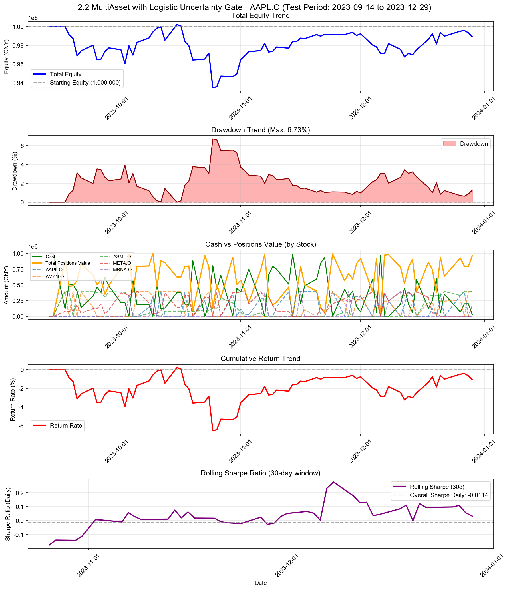

# 2.2 MultiAsset with Logistic Uncertainty Gate

**策略名称:** 2.2 MultiAsset with Logistic Uncertainty Gate  
**回测期间:** 2023-01-03 至 2023-12-29  
**交易日数:** 75  
**组合股票数:** 5 支  
**初始资金:** 1000000.00 元

---

## 组合整体表现

| 项目 | 数值 |
|------|------|
| 初始资金 | 1000000.00 元 |
| 最终现金 | 24260.01 元 |
| 最终持仓市值 | 964960.68 元 |
| 最终总权益 | 989220.70 元 |
| 总盈亏 | -10779.30 元 |
| 总收益率 | -1.08% |
| 年化收益率 (CAGR) | -3.58% |

---

## 持仓明细

| 股票代码 | 股数 | 成本价 | 现价 | 市值 | 权重 | 盈亏 | 收益率 | 贡献度 |
|----------|------|--------|------|------|------|------|--------|--------|
| AMZN.O | 1079 | 368.11 | 364.66 | 393463.82 | 39.78% | -3729.02 | -0.94% | -0.37% |
| ASML.O | 4107 | 94.81 | 96.07 | 394545.18 | 39.88% | +5159.74 | +1.33% | 0.53% |
| META.O | 49992 | 3.54 | 3.54 | 176951.68 | 17.89% | +0.00 | +0.00% | 0.00% |

### 权重分布

| 股票代码 | 权重 | 市值占比 |
|----------|------|----------|
| AMZN.O | 39.78% | 39.78% |
| ASML.O | 39.88% | 39.88% |
| META.O | 17.89% | 17.89% |

---

## 交易统计

| 项目 | 数值 |
|------|------|
| 总交易次数 | 166 次 |
| 买入次数 | 87 次 |
| 卖出次数 | 79 次 |
| 买入总成本 | 18278428.16 元 |
| 卖出总收入 | 17302688.17 元 |
| 已实现盈亏 | -12210.02 元 |

### 交易质量指标

| 指标 | 数值 |
|------|------|
| 胜率 (Hit Rate) | 58.23% |
| 盈亏比 (Profit Factor) | 0.92 |
| 单笔平均收益 | -154.56 元 |
| 平均持仓周期 | 4.4 天 |

---

## 风险与稳健性

| 指标 | 数值 |
|------|------|
| 最大回撤 (Max Drawdown) | 6.73% |
| 年化波动率 (Volatility) | 14.54% |
| 年化夏普比率 (Sharpe) | -0.1816 |
| 日频夏普比率 (Sharpe Daily) | -0.0114 |
| 年化 Sortino 比率 | -0.1502 |
| 日频 Sortino 比率 | -0.0095 |
| Calmar 比率 (CAGR/MaxDD) | -0.5315 |
### 尾部风险 (Tail Risk)

| 指标 | 数值 |
|------|------|
| VaR 95% | -1.59% |
| VaR 99% | -3.81% |
| CVaR 95% | -2.24% |
| CVaR 99% | -3.81% |
| 极端日跌幅 (5%分位) | -1.67% |
| 极端日跌幅 (1%分位) | -3.81% |

---

## 执行与成本

| 指标 | 数值 |
|------|------|
| 换手率 (Turnover) | 1815.61% |
| 交易频率 (每日) | 2.21 次/日 |
| 交易频率 (每周) | 11.07 次/周 |

---

## 各股票表现分析

| 股票代码 | 初始权重 | 最终权重 | 收益率 | 盈亏 | 交易次数 | 贡献度 |
|----------|----------|----------|--------|------|----------|--------|
| AMZN.O | 491.89% | 39.78% | -0.94% | -3729.02 | 38 | -0.37% |
| ASML.O | 178.58% | 39.88% | +1.33% | +5159.74 | 26 | 0.53% |
| META.O | 387.31% | 17.89% | +0.00% | +0.00 | 49 | 0.00% |

---

## 策略参数

- **max_position_weight:** 40%
- **min_score_threshold:** 0.05
- **max_total_weight:** 100%
- **train_window_days:** 252
- **prediction_horizon:** 5
- **ret_threshold:** 0.0
- **retrain_frequency:** 20
- **min_trade_amount:** 5,000 元
- **min_weight_change:** 5%
- **apply_llm_gate:** 启用
- **llm_model:** deepseek-chat
- **llm_temperature:** 0.30

---

## 交易记录

| 序号 | 日期 | 类型 | 股票代码 | 股数 | 价格 | 成本/收入 | 利润 |
|------|------|------|----------|------|------|-----------|------|
| 1 | 2023-09-18 | 买入 | AMZN.O | 1190 | 335.95 | 399782.88 | - |
| 2 | 2023-09-18 | 买入 | ASML.O | 5286 | 75.67 | 399982.08 | - |
| 3 | 2023-09-18 | 买入 | META.O | 26366 | 3.03 | 79770.33 | - |
| 4 | 2023-09-19 | 卖出 | AMZN.O | 1190 | 330.31 | 393071.28 | -6711.60 |
| 5 | 2023-09-20 | 买入 | AMZN.O | 1216 | 324.70 | 394830.34 | - |
| 6 | 2023-09-20 | 卖出 | ASML.O | 5286 | 74.67 | 394729.10 | -5252.97 |
| 7 | 2023-09-20 | 买入 | META.O | 3881 | 3.00 | 11630.19 | - |
| 8 | 2023-09-21 | 卖出 | AMZN.O | 1216 | 310.39 | 377436.67 | -17393.66 |
| 9 | 2023-09-21 | 买入 | ASML.O | 5258 | 73.69 | 387472.98 | - |
| 10 | 2023-09-21 | 买入 | META.O | 30465 | 2.96 | 90094.14 | - |
| 11 | 2023-09-22 | 买入 | AMZN.O | 1257 | 309.89 | 389529.22 | - |
| 12 | 2023-09-22 | 卖出 | META.O | 43538 | 2.99 | 130213.45 | +59.36 |
| 13 | 2023-09-25 | 卖出 | AMZN.O | 791 | 315.05 | 249202.97 | +4081.56 |
| 14 | 2023-09-25 | 买入 | META.O | 23363 | 3.01 | 70282.91 | - |
| 15 | 2023-09-26 | 卖出 | AMZN.O | 466 | 302.35 | 140896.03 | -3511.78 |
| 16 | 2023-09-27 | 买入 | META.O | 25971 | 2.98 | 77326.06 | - |
| 17 | 2023-09-28 | 卖出 | ASML.O | 1042 | 73.51 | 76593.24 | -193.91 |
| 18 | 2023-09-28 | 卖出 | META.O | 52519 | 3.04 | 159636.75 | +2533.37 |
| 19 | 2023-09-29 | 买入 | ASML.O | 1029 | 74.52 | 76681.08 | - |
| 20 | 2023-09-29 | 买入 | META.O | 21078 | 3.00 | 63278.26 | - |
| 21 | 2023-10-02 | 买入 | META.O | 85887 | 3.07 | 263518.49 | - |
| 22 | 2023-10-04 | 卖出 | ASML.O | 879 | 74.80 | 65747.88 | +829.77 |
| 23 | 2023-10-04 | 卖出 | META.O | 14104 | 3.06 | 43099.00 | +112.91 |
| 24 | 2023-10-04 | 买入 | MRNA.O | 313108 | 1.04 | 326446.40 | - |
| 25 | 2023-10-05 | 卖出 | ASML.O | 4366 | 73.64 | 321501.98 | -946.81 |
| 26 | 2023-10-05 | 买入 | META.O | 20395 | 3.05 | 62161.92 | - |
| 27 | 2023-10-05 | 卖出 | MRNA.O | 313108 | 1.03 | 322407.31 | -4039.09 |
| 28 | 2023-10-06 | 买入 | AMZN.O | 1280 | 307.10 | 393093.12 | - |
| 29 | 2023-10-09 | 买入 | AAPL.O | 278 | 517.06 | 143743.26 | - |
| 30 | 2023-10-09 | 买入 | ASML.O | 599 | 74.86 | 44842.98 | - |
| 31 | 2023-10-09 | 卖出 | META.O | 59127 | 3.18 | 188236.72 | +8028.77 |
| 32 | 2023-10-10 | 买入 | AAPL.O | 320 | 515.33 | 164905.22 | - |
| 33 | 2023-10-10 | 卖出 | AMZN.O | 287 | 310.75 | 89185.82 | +1046.98 |
| 34 | 2023-10-10 | 卖出 | ASML.O | 331 | 76.23 | 25231.38 | +451.71 |
| 35 | 2023-10-10 | 卖出 | META.O | 52975 | 3.22 | 170494.74 | +9036.93 |
| 36 | 2023-10-10 | 买入 | MRNA.O | 295233 | 1.04 | 308311.82 | - |
| 37 | 2023-10-11 | 卖出 | AAPL.O | 598 | 519.40 | 310602.39 | +1953.91 |
| 38 | 2023-10-11 | 买入 | AMZN.O | 269 | 316.39 | 85109.45 | - |
| 39 | 2023-10-11 | 卖出 | MRNA.O | 295233 | 1.03 | 303381.43 | -4930.39 |
| 40 | 2023-10-12 | 买入 | AAPL.O | 765 | 522.03 | 399353.54 | - |
| 41 | 2023-10-12 | 卖出 | ASML.O | 268 | 78.08 | 20924.70 | +861.40 |
| 42 | 2023-10-12 | 买入 | META.O | 9890 | 3.24 | 32059.42 | - |
| 43 | 2023-10-13 | 卖出 | AAPL.O | 765 | 516.66 | 395243.10 | -4110.44 |
| 44 | 2023-10-13 | 买入 | ASML.O | 1102 | 75.92 | 83668.15 | - |
| 45 | 2023-10-13 | 买入 | META.O | 94292 | 3.15 | 296727.49 | - |
| 46 | 2023-10-16 | 卖出 | META.O | 75941 | 3.21 | 243884.52 | +5264.68 |
| 47 | 2023-10-18 | 买入 | AAPL.O | 742 | 507.96 | 376908.12 | - |
| 48 | 2023-10-18 | 卖出 | AMZN.O | 1262 | 307.51 | 388080.14 | -1983.58 |
| 49 | 2023-10-18 | 买入 | META.O | 60881 | 3.17 | 192974.51 | - |
| 50 | 2023-10-19 | 卖出 | AAPL.O | 742 | 506.86 | 376093.61 | -814.52 |
| 51 | 2023-10-19 | 买入 | AMZN.O | 1271 | 308.16 | 391671.36 | - |
| 52 | 2023-10-20 | 卖出 | AMZN.O | 1271 | 300.41 | 381818.57 | -9852.79 |
| 53 | 2023-10-20 | 卖出 | META.O | 104265 | 3.09 | 321813.92 | -7480.67 |
| 54 | 2023-10-23 | 买入 | AAPL.O | 503 | 499.76 | 251378.43 | - |
| 55 | 2023-10-23 | 买入 | AMZN.O | 1043 | 303.74 | 316804.99 | - |
| 56 | 2023-10-23 | 买入 | ASML.O | 176 | 74.41 | 13096.14 | - |
| 57 | 2023-10-23 | 买入 | META.O | 96084 | 3.14 | 301713.37 | - |
| 58 | 2023-10-24 | 卖出 | AAPL.O | 503 | 501.03 | 252017.77 | +639.34 |
| 59 | 2023-10-24 | 买入 | AMZN.O | 216 | 308.54 | 66645.50 | - |
| 60 | 2023-10-25 | 卖出 | AMZN.O | 1259 | 291.34 | 366792.02 | -16658.47 |
| 61 | 2023-10-25 | 买入 | ASML.O | 486 | 73.85 | 35889.41 | - |
| 62 | 2023-10-25 | 卖出 | META.O | 96084 | 3.00 | 287800.41 | -13912.96 |
| 63 | 2023-10-26 | 买入 | META.O | 129815 | 2.88 | 374321.55 | - |
| 64 | 2023-10-27 | 买入 | ASML.O | 2166 | 74.69 | 161777.75 | - |
| 65 | 2023-10-27 | 卖出 | META.O | 129815 | 2.97 | 385200.05 | +10878.50 |
| 66 | 2023-10-30 | 买入 | AAPL.O | 700 | 491.93 | 344350.81 | - |
| 67 | 2023-10-30 | 卖出 | ASML.O | 1080 | 74.55 | 80511.68 | -400.78 |
| 68 | 2023-10-30 | 买入 | META.O | 125094 | 3.03 | 378609.50 | - |
| 69 | 2023-10-31 | 卖出 | AAPL.O | 700 | 493.32 | 345321.44 | +970.63 |
| 70 | 2023-10-31 | 卖出 | ASML.O | 1131 | 75.80 | 85735.36 | +1002.03 |
| 71 | 2023-11-01 | 买入 | AAPL.O | 232 | 502.56 | 116594.02 | - |
| 72 | 2023-11-01 | 卖出 | ASML.O | 847 | 77.20 | 65388.57 | +1932.23 |
| 73 | 2023-11-02 | 卖出 | AAPL.O | 182 | 512.96 | 93358.72 | +1892.73 |
| 74 | 2023-11-02 | 卖出 | ASML.O | 872 | 80.13 | 69877.32 | +4548.00 |
| 75 | 2023-11-03 | 卖出 | META.O | 61434 | 3.15 | 193271.36 | +7335.22 |
| 76 | 2023-11-06 | 买入 | AAPL.O | 504 | 517.76 | 260948.71 | - |
| 77 | 2023-11-06 | 买入 | ASML.O | 710 | 80.90 | 57440.70 | - |
| 78 | 2023-11-06 | 买入 | META.O | 59758 | 3.16 | 188715.76 | - |
| 79 | 2023-11-07 | 卖出 | ASML.O | 710 | 80.76 | 57338.87 | -101.83 |
| 80 | 2023-11-07 | 卖出 | META.O | 25907 | 3.19 | 82596.70 | +2538.29 |
| 81 | 2023-11-07 | 买入 | MRNA.O | 516283 | 0.74 | 380294.06 | - |
| 82 | 2023-11-08 | 卖出 | AAPL.O | 554 | 528.33 | 292693.88 | +6617.15 |
| 83 | 2023-11-08 | 卖出 | MRNA.O | 516283 | 0.71 | 368316.29 | -11977.77 |
| 84 | 2023-11-09 | 卖出 | META.O | 41290 | 3.21 | 132355.10 | +4759.79 |
| 85 | 2023-11-10 | 买入 | AAPL.O | 290 | 539.18 | 156361.42 | - |
| 86 | 2023-11-10 | 卖出 | META.O | 33679 | 3.29 | 110726.45 | +6650.83 |
| 87 | 2023-11-13 | 买入 | AAPL.O | 441 | 534.55 | 235736.19 | - |
| 88 | 2023-11-14 | 卖出 | AAPL.O | 731 | 542.19 | 396337.67 | +4240.06 |
| 89 | 2023-11-14 | 卖出 | META.O | 22542 | 3.36 | 75811.00 | +6151.20 |
| 90 | 2023-11-15 | 买入 | AAPL.O | 723 | 543.83 | 393192.25 | - |
| 91 | 2023-11-16 | 买入 | MRNA.O | 516106 | 0.77 | 395079.14 | - |
| 92 | 2023-11-17 | 买入 | AMZN.O | 302 | 348.43 | 105226.46 | - |
| 93 | 2023-11-17 | 卖出 | MRNA.O | 516106 | 0.76 | 394511.43 | -567.72 |
| 94 | 2023-11-20 | 卖出 | AMZN.O | 302 | 350.71 | 105915.02 | +688.56 |
| 95 | 2023-11-21 | 卖出 | AAPL.O | 723 | 551.44 | 398692.47 | +5500.22 |
| 96 | 2023-11-21 | 买入 | META.O | 43585 | 3.37 | 146872.73 | - |
| 97 | 2023-11-22 | 卖出 | META.O | 27181 | 3.41 | 92820.40 | +1225.86 |
| 98 | 2023-11-24 | 买入 | AAPL.O | 718 | 549.50 | 394543.75 | - |
| 99 | 2023-11-24 | 买入 | AMZN.O | 1121 | 352.18 | 394789.30 | - |
| 100 | 2023-11-24 | 买入 | META.O | 43100 | 3.38 | 145777.13 | - |
| 101 | 2023-11-27 | 卖出 | AAPL.O | 718 | 548.98 | 394169.92 | -373.84 |
| 102 | 2023-11-27 | 卖出 | AMZN.O | 515 | 354.55 | 182594.28 | +1223.64 |
| 103 | 2023-11-27 | 买入 | ASML.O | 776 | 87.37 | 67797.24 | - |
| 104 | 2023-11-27 | 买入 | META.O | 24849 | 3.35 | 83169.60 | - |
| 105 | 2023-11-28 | 卖出 | AMZN.O | 606 | 352.87 | 213840.43 | +421.78 |
| 106 | 2023-11-28 | 卖出 | META.O | 20984 | 3.39 | 71133.66 | +428.70 |
| 107 | 2023-11-28 | 买入 | MRNA.O | 507938 | 0.78 | 397105.93 | - |
| 108 | 2023-11-29 | 买入 | AAPL.O | 573 | 547.77 | 313871.23 | - |
| 109 | 2023-11-29 | 买入 | AMZN.O | 1 | 351.17 | 351.17 | - |
| 110 | 2023-11-29 | 卖出 | ASML.O | 776 | 87.27 | 67721.41 | -75.84 |
| 111 | 2023-11-29 | 买入 | META.O | 20399 | 3.32 | 67765.48 | - |
| 112 | 2023-11-29 | 卖出 | MRNA.O | 507938 | 0.79 | 401321.81 | +4215.89 |
| 113 | 2023-11-30 | 买入 | AMZN.O | 704 | 350.62 | 246833.66 | - |
| 114 | 2023-12-01 | 买入 | AMZN.O | 232 | 352.87 | 81866.30 | - |
| 115 | 2023-12-04 | 卖出 | AAPL.O | 573 | 547.94 | 313970.67 | +99.45 |
| 116 | 2023-12-04 | 卖出 | AMZN.O | 937 | 347.62 | 325716.19 | -3334.94 |
| 117 | 2023-12-04 | 买入 | META.O | 38772 | 3.20 | 124078.15 | - |
| 118 | 2023-12-05 | 买入 | AAPL.O | 582 | 559.48 | 325619.25 | - |
| 119 | 2023-12-05 | 买入 | AMZN.O | 744 | 352.51 | 262268.93 | - |
| 120 | 2023-12-05 | 卖出 | META.O | 20090 | 3.18 | 63944.46 | -2513.47 |
| 121 | 2023-12-06 | 卖出 | AAPL.O | 582 | 556.30 | 323767.42 | -1851.83 |
| 122 | 2023-12-06 | 卖出 | AMZN.O | 744 | 346.85 | 258054.91 | -4214.02 |
| 123 | 2023-12-06 | 卖出 | META.O | 102450 | 3.17 | 325227.53 | -13678.14 |
| 124 | 2023-12-07 | 买入 | AAPL.O | 648 | 561.94 | 364138.38 | - |
| 125 | 2023-12-07 | 买入 | AMZN.O | 688 | 352.51 | 242528.26 | - |
| 126 | 2023-12-07 | 买入 | META.O | 111571 | 3.27 | 364379.73 | - |
| 127 | 2023-12-08 | 卖出 | AAPL.O | 214 | 566.11 | 121146.95 | +891.38 |
| 128 | 2023-12-08 | 卖出 | META.O | 37806 | 3.33 | 125799.47 | +2328.85 |
| 129 | 2023-12-08 | 买入 | MRNA.O | 305590 | 0.80 | 245449.89 | - |
| 130 | 2023-12-11 | 卖出 | AAPL.O | 434 | 558.79 | 242514.44 | -1368.36 |
| 131 | 2023-12-11 | 卖出 | AMZN.O | 688 | 350.14 | 240893.57 | -1634.69 |
| 132 | 2023-12-11 | 买入 | META.O | 46220 | 3.25 | 150344.42 | - |
| 133 | 2023-12-11 | 买入 | MRNA.O | 170372 | 0.82 | 139705.04 | - |
| 134 | 2023-12-12 | 买入 | AAPL.O | 346 | 563.21 | 194872.28 | - |
| 135 | 2023-12-12 | 卖出 | META.O | 23481 | 3.34 | 78478.20 | +1910.09 |
| 136 | 2023-12-12 | 卖出 | MRNA.O | 475962 | 0.78 | 371440.74 | -13714.18 |
| 137 | 2023-12-13 | 买入 | AAPL.O | 332 | 572.62 | 190108.37 | - |
| 138 | 2023-12-13 | 买入 | META.O | 19568 | 3.35 | 65501.92 | - |
| 139 | 2023-12-14 | 卖出 | AAPL.O | 113 | 573.05 | 64754.59 | +591.15 |
| 140 | 2023-12-14 | 买入 | AMZN.O | 732 | 353.81 | 258987.46 | - |
| 141 | 2023-12-14 | 卖出 | META.O | 19041 | 3.33 | 63438.90 | +1071.17 |
| 142 | 2023-12-15 | 卖出 | AAPL.O | 565 | 571.49 | 322890.41 | +2073.21 |
| 143 | 2023-12-15 | 卖出 | AMZN.O | 732 | 359.93 | 263467.30 | +4479.84 |
| 144 | 2023-12-15 | 买入 | META.O | 19429 | 3.35 | 65071.61 | - |
| 145 | 2023-12-18 | 买入 | AMZN.O | 617 | 369.77 | 228146.86 | - |
| 146 | 2023-12-18 | 买入 | ASML.O | 3517 | 94.18 | 331232.88 | - |
| 147 | 2023-12-18 | 卖出 | META.O | 29061 | 3.45 | 100150.02 | +4604.75 |
| 148 | 2023-12-19 | 买入 | AAPL.O | 220 | 569.67 | 125326.33 | - |
| 149 | 2023-12-19 | 买入 | AMZN.O | 1 | 369.10 | 369.10 | - |
| 150 | 2023-12-19 | 卖出 | META.O | 71770 | 3.50 | 251453.37 | +15491.64 |
| 151 | 2023-12-20 | 卖出 | AAPL.O | 220 | 563.56 | 123983.59 | -1342.74 |
| 152 | 2023-12-20 | 卖出 | AMZN.O | 618 | 365.09 | 225624.38 | -2891.57 |
| 153 | 2023-12-21 | 买入 | AAPL.O | 637 | 563.13 | 358712.47 | - |
| 154 | 2023-12-21 | 买入 | AMZN.O | 656 | 369.22 | 242205.70 | - |
| 155 | 2023-12-21 | 卖出 | META.O | 15629 | 3.54 | 55340.73 | +3956.50 |
| 156 | 2023-12-22 | 卖出 | AAPL.O | 637 | 560.00 | 356722.49 | -1989.98 |
| 157 | 2023-12-22 | 买入 | ASML.O | 628 | 95.51 | 59979.87 | - |
| 158 | 2023-12-26 | 买入 | AAPL.O | 594 | 558.41 | 331697.31 | - |
| 159 | 2023-12-26 | 买入 | AMZN.O | 56 | 368.18 | 20618.30 | - |
| 160 | 2023-12-26 | 卖出 | ASML.O | 718 | 96.80 | 69500.65 | +1734.48 |
| 161 | 2023-12-27 | 买入 | AAPL.O | 118 | 558.70 | 65926.86 | - |
| 162 | 2023-12-27 | 卖出 | AMZN.O | 712 | 368.02 | 262027.39 | -796.61 |
| 163 | 2023-12-27 | 买入 | ASML.O | 680 | 96.97 | 65938.85 | - |
| 164 | 2023-12-28 | 卖出 | AAPL.O | 712 | 559.95 | 398681.59 | +1057.41 |
| 165 | 2023-12-28 | 买入 | AMZN.O | 1079 | 368.11 | 397192.85 | - |
| 166 | 2023-12-29 | 买入 | META.O | 49992 | 3.54 | 176951.68 | - |

---

## 走势图

---

*报告生成时间: 2025-12-24 19:12:28*
