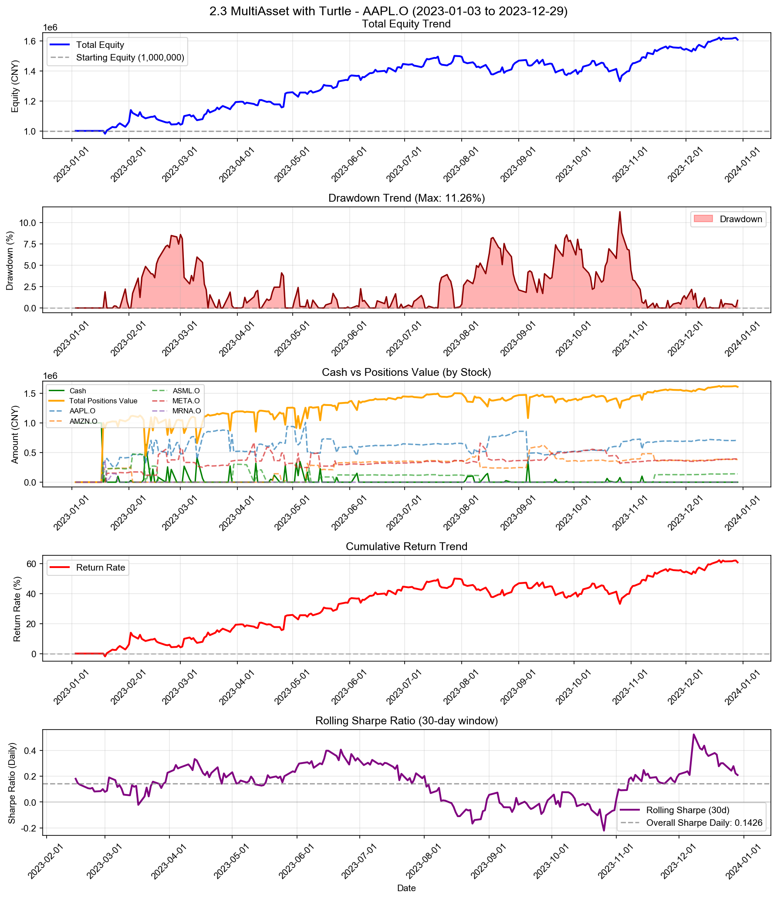

# 2.3 MultiAsset with Turtle

**策略名称:** 2.3 MultiAsset with Turtle  
**回测期间:** 2023-01-03 至 2023-12-29  
**交易日数:** 250  
**组合股票数:** 5 支  
**初始资金:** 1000000.00 元

---

## 组合整体表现

| 项目 | 数值 |
|------|------|
| 初始资金 | 1000000.00 元 |
| 最终现金 | 2.83 元 |
| 最终持仓市值 | 1608907.91 元 |
| 最终总权益 | 1608910.75 元 |
| 总盈亏 | +608910.75 元 |
| 总收益率 | +60.89% |
| 年化收益率 (CAGR) | +61.50% |

---

## 持仓明细

| 股票代码 | 股数 | 成本价 | 现价 | 市值 | 权重 | 盈亏 | 收益率 | 贡献度 |
|----------|------|--------|------|------|------|------|--------|--------|
| AAPL.O | 1257 | 558.70 | 556.91 | 700034.42 | 43.51% | -2254.30 | -0.32% | -0.14% |
| AMZN.O | 1045 | 364.66 | 364.66 | 381065.52 | 23.68% | +0.00 | +0.00% | 0.00% |
| ASML.O | 1453 | 92.60 | 96.07 | 139584.65 | 8.68% | +5036.27 | +3.74% | 0.32% |
| META.O | 109680 | 3.20 | 3.54 | 388223.33 | 24.13% | +37225.39 | +10.61% | 2.56% |

### 权重分布

| 股票代码 | 权重 | 市值占比 |
|----------|------|----------|
| AAPL.O | 43.51% | 43.51% |
| AMZN.O | 23.68% | 23.68% |
| ASML.O | 8.68% | 8.68% |
| META.O | 24.13% | 24.13% |

---

## 交易统计

| 项目 | 数值 |
|------|------|
| 总交易次数 | 451 次 |
| 买入次数 | 260 次 |
| 卖出次数 | 191 次 |
| 买入总成本 | 69899830.77 元 |
| 卖出总收入 | 68899833.60 元 |
| 已实现盈亏 | +568903.38 元 |

### 交易质量指标

| 指标 | 数值 |
|------|------|
| 胜率 (Hit Rate) | 51.83% |
| 盈亏比 (Profit Factor) | 2.08 |
| 单笔平均收益 | +2978.55 元 |
| 平均持仓周期 | 7.2 天 |

---

## 风险与稳健性

| 指标 | 数值 |
|------|------|
| 最大回撤 (Max Drawdown) | 11.26% |
| 年化波动率 (Volatility) | 22.37% |
| 年化夏普比率 (Sharpe) | 2.2633 |
| 日频夏普比率 (Sharpe Daily) | 0.1426 |
| 年化 Sortino 比率 | 2.6027 |
| 日频 Sortino 比率 | 0.1640 |
| Calmar 比率 (CAGR/MaxDD) | 5.4603 |
### 尾部风险 (Tail Risk)

| 指标 | 数值 |
|------|------|
| VaR 95% | -1.97% |
| VaR 99% | -2.61% |
| CVaR 95% | -2.42% |
| CVaR 99% | -2.94% |
| 极端日跌幅 (5%分位) | -2.11% |
| 极端日跌幅 (1%分位) | -2.88% |

---

## 执行与成本

| 指标 | 数值 |
|------|------|
| 换手率 (Turnover) | 5225.96% |
| 交易频率 (每日) | 1.80 次/日 |
| 交易频率 (每周) | 9.02 次/周 |

---

## 各股票表现分析

| 股票代码 | 初始权重 | 最终权重 | 收益率 | 盈亏 | 交易次数 | 贡献度 |
|----------|----------|----------|--------|------|----------|--------|
| AAPL.O | 3323.44% | 43.51% | -0.32% | -2254.30 | 147 | -0.14% |
| AMZN.O | 1396.18% | 23.68% | +0.00% | +0.00 | 94 | 0.00% |
| ASML.O | 478.03% | 8.68% | +3.74% | +5036.27 | 62 | 0.32% |
| META.O | 1740.85% | 24.13% | +10.61% | +37225.39 | 143 | 2.56% |

---

## 策略参数

- **max_position_weight:** 40%
- **min_score_threshold:** 0.00
- **max_total_weight:** 100%
- **entry_period:** 20
- **exit_period:** 10
- **atr_period:** 20
- **risk_per_trade:** 2.0%
- **stop_loss_atr:** 2.0
- **max_positions:** 4
- **add_position_atr:** 0.5
- **min_trade_amount:** 5,000 元
- **min_weight_change:** 5%

---

## 交易记录

| 序号 | 日期 | 类型 | 股票代码 | 股数 | 价格 | 成本/收入 | 利润 |
|------|------|------|----------|------|------|-----------|------|
| 1 | 2023-01-18 | 买入 | AAPL.O | 862 | 388.93 | 335259.47 | - |
| 2 | 2023-01-18 | 买入 | AMZN.O | 974 | 229.10 | 223147.30 | - |
| 3 | 2023-01-18 | 买入 | ASML.O | 3291 | 81.97 | 269761.34 | - |
| 4 | 2023-01-18 | 买入 | MRNA.O | 87215 | 1.97 | 171830.99 | - |
| 5 | 2023-01-19 | 卖出 | ASML.O | 3291 | 79.20 | 260646.47 | -9114.87 |
| 6 | 2023-01-19 | 买入 | MRNA.O | 105169 | 1.90 | 200220.74 | - |
| 7 | 2023-01-20 | 买入 | AAPL.O | 152 | 396.58 | 60280.71 | - |
| 8 | 2023-01-20 | 买入 | ASML.O | 1 | 81.54 | 81.54 | - |
| 9 | 2023-01-20 | 买入 | META.O | 46 | 1.39 | 64.11 | - |
| 10 | 2023-01-20 | 卖出 | MRNA.O | 192384 | 1.94 | 373186.48 | +1134.75 |
| 11 | 2023-01-20 | 买入 | ASML.O | 2746 | 81.54 | 223900.96 | - |
| 12 | 2023-01-20 | 买入 | META.O | 107114 | 1.39 | 149284.78 | - |
| 13 | 2023-01-23 | 卖出 | AAPL.O | 352 | 405.90 | 142878.02 | +5570.19 |
| 14 | 2023-01-23 | 买入 | MRNA.O | 72549 | 1.97 | 142878.00 | - |
| 15 | 2023-01-25 | 卖出 | AMZN.O | 974 | 233.23 | 227167.97 | +4020.67 |
| 16 | 2023-01-25 | 买入 | AMZN.O | 974 | 233.23 | 227167.97 | - |
| 17 | 2023-01-26 | 卖出 | MRNA.O | 72549 | 1.93 | 140193.69 | -2684.31 |
| 18 | 2023-01-26 | 买入 | AAPL.O | 98 | 414.10 | 40581.95 | - |
| 19 | 2023-01-27 | 买入 | AAPL.O | 237 | 419.77 | 99485.07 | - |
| 20 | 2023-01-27 | 买入 | ASML.O | 1 | 83.87 | 83.87 | - |
| 21 | 2023-01-27 | 买入 | META.O | 28 | 1.52 | 42.49 | - |
| 22 | 2023-01-30 | 卖出 | ASML.O | 2748 | 81.72 | 224568.20 | +501.84 |
| 23 | 2023-01-30 | 买入 | ASML.O | 2748 | 81.72 | 224568.20 | - |
| 24 | 2023-01-31 | 卖出 | ASML.O | 2748 | 83.04 | 228204.48 | +3636.27 |
| 25 | 2023-01-31 | 买入 | ASML.O | 2748 | 83.04 | 228204.48 | - |
| 26 | 2023-02-01 | 卖出 | AAPL.O | 997 | 418.33 | 417074.98 | +18775.62 |
| 27 | 2023-02-01 | 买入 | AAPL.O | 997 | 418.33 | 417074.98 | - |
| 28 | 2023-02-02 | 卖出 | META.O | 14596 | 1.89 | 27552.87 | +7209.95 |
| 29 | 2023-02-03 | 买入 | AAPL.O | 62 | 444.42 | 27554.03 | - |
| 30 | 2023-02-03 | 卖出 | AMZN.O | 974 | 248.14 | 241684.46 | +14516.50 |
| 31 | 2023-02-03 | 买入 | ASML.O | 2829 | 85.40 | 241607.38 | - |
| 32 | 2023-02-03 | 买入 | META.O | 41 | 1.87 | 76.48 | - |
| 33 | 2023-02-09 | 卖出 | META.O | 92633 | 1.78 | 164812.63 | +35687.69 |
| 34 | 2023-02-09 | 买入 | META.O | 68184 | 1.78 | 121312.97 | - |
| 35 | 2023-02-10 | 卖出 | AAPL.O | 1059 | 435.04 | 460711.68 | +16082.67 |
| 36 | 2023-02-10 | 买入 | AAPL.O | 753 | 435.04 | 327588.19 | - |
| 37 | 2023-02-10 | 卖出 | ASML.O | 5577 | 82.66 | 460999.81 | -8812.05 |
| 38 | 2023-02-10 | 卖出 | META.O | 68184 | 1.74 | 118742.44 | -2570.54 |
| 39 | 2023-02-10 | 买入 | META.O | 66620 | 1.74 | 116018.73 | - |
| 40 | 2023-02-13 | 买入 | AAPL.O | 840 | 443.23 | 372309.69 | - |
| 41 | 2023-02-13 | 买入 | ASML.O | 3182 | 84.22 | 267992.16 | - |
| 42 | 2023-02-13 | 买入 | META.O | 25 | 1.79 | 44.86 | - |
| 43 | 2023-02-14 | 卖出 | AAPL.O | 501 | 441.35 | 221117.97 | +999.43 |
| 44 | 2023-02-15 | 买入 | AAPL.O | 494 | 447.49 | 221059.84 | - |
| 45 | 2023-02-15 | 买入 | META.O | 33 | 1.77 | 58.46 | - |
| 46 | 2023-02-16 | 卖出 | META.O | 66678 | 1.72 | 114979.54 | -1142.51 |
| 47 | 2023-02-16 | 买入 | META.O | 66678 | 1.72 | 114979.54 | - |
| 48 | 2023-02-17 | 卖出 | AAPL.O | 1586 | 439.48 | 697016.33 | -3822.85 |
| 49 | 2023-02-17 | 买入 | AAPL.O | 1202 | 439.48 | 528255.75 | - |
| 50 | 2023-02-17 | 卖出 | ASML.O | 3182 | 82.10 | 261255.69 | -6736.47 |
| 51 | 2023-02-17 | 卖出 | META.O | 66678 | 1.73 | 115272.93 | +293.38 |
| 52 | 2023-02-17 | 买入 | META.O | 160797 | 1.73 | 277985.85 | - |
| 53 | 2023-02-17 | 买入 | META.O | 108368 | 1.73 | 187346.60 | - |
| 54 | 2023-02-21 | 卖出 | AAPL.O | 1202 | 427.76 | 514162.01 | -14093.75 |
| 55 | 2023-02-21 | 买入 | AAPL.O | 1178 | 427.76 | 503895.88 | - |
| 56 | 2023-02-21 | 买入 | META.O | 52431 | 1.72 | 90223.26 | - |
| 57 | 2023-02-22 | 卖出 | AAPL.O | 1178 | 428.99 | 505355.17 | +1459.29 |
| 58 | 2023-02-22 | 买入 | AAPL.O | 1079 | 428.99 | 462884.74 | - |
| 59 | 2023-02-22 | 卖出 | META.O | 321596 | 1.71 | 550315.08 | -5240.64 |
| 60 | 2023-02-22 | 买入 | META.O | 195742 | 1.71 | 334953.71 | - |
| 61 | 2023-02-23 | 买入 | AAPL.O | 599 | 430.41 | 257813.10 | - |
| 62 | 2023-02-23 | 卖出 | META.O | 195742 | 1.72 | 336754.54 | +1800.83 |
| 63 | 2023-02-23 | 买入 | META.O | 195752 | 1.72 | 336771.74 | - |
| 64 | 2023-02-24 | 卖出 | AAPL.O | 1678 | 422.66 | 709217.15 | -11480.69 |
| 65 | 2023-02-24 | 买入 | AAPL.O | 1066 | 422.66 | 450551.54 | - |
| 66 | 2023-02-24 | 卖出 | META.O | 195752 | 1.70 | 333541.83 | -3229.91 |
| 67 | 2023-02-24 | 买入 | META.O | 221369 | 1.70 | 377190.64 | - |
| 68 | 2023-02-27 | 买入 | AAPL.O | 504 | 426.14 | 214775.62 | - |
| 69 | 2023-02-27 | 买入 | META.O | 143 | 1.70 | 242.44 | - |
| 70 | 2023-03-01 | 卖出 | AAPL.O | 1570 | 418.62 | 657238.07 | -8089.09 |
| 71 | 2023-03-01 | 买入 | AAPL.O | 1139 | 418.62 | 476811.57 | - |
| 72 | 2023-03-01 | 买入 | META.O | 104040 | 1.73 | 180426.17 | - |
| 73 | 2023-03-02 | 卖出 | AAPL.O | 1139 | 420.35 | 478780.37 | +1968.80 |
| 74 | 2023-03-02 | 买入 | AAPL.O | 1139 | 420.35 | 478780.37 | - |
| 75 | 2023-03-03 | 卖出 | META.O | 145781 | 1.85 | 270059.30 | +20251.96 |
| 76 | 2023-03-06 | 买入 | AAPL.O | 609 | 443.17 | 269889.44 | - |
| 77 | 2023-03-06 | 买入 | META.O | 92 | 1.85 | 170.11 | - |
| 78 | 2023-03-06 | 卖出 | AAPL.O | 115 | 443.17 | 50964.34 | +1709.75 |
| 79 | 2023-03-07 | 买入 | AAPL.O | 116 | 436.74 | 50662.28 | - |
| 80 | 2023-03-07 | 买入 | META.O | 163 | 1.85 | 300.75 | - |
| 81 | 2023-03-10 | 卖出 | AAPL.O | 1749 | 427.81 | 748244.99 | -1832.51 |
| 82 | 2023-03-10 | 买入 | AAPL.O | 903 | 427.81 | 386315.17 | - |
| 83 | 2023-03-10 | 卖出 | META.O | 180026 | 1.80 | 323164.67 | +14641.90 |
| 84 | 2023-03-10 | 买入 | META.O | 150764 | 1.80 | 270636.46 | - |
| 85 | 2023-03-13 | 买入 | AAPL.O | 856 | 433.49 | 371066.07 | - |
| 86 | 2023-03-13 | 卖出 | META.O | 150764 | 1.81 | 272732.08 | +2095.62 |
| 87 | 2023-03-13 | 买入 | META.O | 138927 | 1.81 | 251318.94 | - |
| 88 | 2023-03-14 | 买入 | AAPL.O | 147 | 439.60 | 64620.60 | - |
| 89 | 2023-03-14 | 买入 | META.O | 95 | 1.94 | 184.32 | - |
| 90 | 2023-03-28 | 卖出 | AAPL.O | 1906 | 454.17 | 865654.17 | +43652.34 |
| 91 | 2023-03-28 | 买入 | AAPL.O | 1149 | 454.17 | 521845.04 | - |
| 92 | 2023-03-28 | 卖出 | META.O | 139022 | 2.01 | 278989.35 | +27486.09 |
| 93 | 2023-03-28 | 买入 | META.O | 173878 | 2.01 | 348938.37 | - |
| 94 | 2023-03-29 | 买入 | AAPL.O | 591 | 463.16 | 273728.52 | - |
| 95 | 2023-03-29 | 买入 | META.O | 64 | 2.05 | 131.42 | - |
| 96 | 2023-03-30 | 卖出 | AAPL.O | 646 | 467.74 | 302161.49 | +6793.38 |
| 97 | 2023-03-30 | 买入 | ASML.O | 3545 | 85.22 | 302109.37 | - |
| 98 | 2023-03-31 | 买入 | META.O | 25 | 2.12 | 52.99 | - |
| 99 | 2023-04-05 | 卖出 | ASML.O | 3545 | 83.61 | 296403.63 | -5705.74 |
| 100 | 2023-04-05 | 买入 | ASML.O | 3545 | 83.61 | 296403.63 | - |
| 101 | 2023-04-06 | 卖出 | ASML.O | 3545 | 82.76 | 293376.65 | -3026.99 |
| 102 | 2023-04-06 | 买入 | ASML.O | 3545 | 82.76 | 293376.65 | - |
| 103 | 2023-04-10 | 卖出 | AAPL.O | 1094 | 466.79 | 510669.96 | +10464.51 |
| 104 | 2023-04-10 | 买入 | AAPL.O | 1094 | 466.79 | 510669.96 | - |
| 105 | 2023-04-10 | 卖出 | ASML.O | 3545 | 83.33 | 295394.64 | +2017.99 |
| 106 | 2023-04-10 | 买入 | META.O | 137553 | 2.15 | 295395.07 | - |
| 107 | 2023-04-11 | 卖出 | AAPL.O | 159 | 463.25 | 73656.44 | -563.42 |
| 108 | 2023-04-11 | 买入 | ASML.O | 886 | 83.09 | 73619.17 | - |
| 109 | 2023-04-11 | 卖出 | META.O | 149845 | 2.14 | 320443.53 | +10422.42 |
| 110 | 2023-04-12 | 卖出 | AAPL.O | 935 | 461.23 | 431251.38 | -5198.72 |
| 111 | 2023-04-12 | 买入 | AAPL.O | 1347 | 461.23 | 621278.73 | - |
| 112 | 2023-04-12 | 买入 | ASML.O | 1582 | 82.45 | 130432.82 | - |
| 113 | 2023-04-12 | 买入 | META.O | 9 | 2.14 | 19.26 | - |
| 114 | 2023-04-17 | 卖出 | ASML.O | 2468 | 80.48 | 198626.78 | -5425.21 |
| 115 | 2023-04-17 | 买入 | META.O | 90756 | 2.19 | 198628.58 | - |
| 116 | 2023-04-17 | 卖出 | AAPL.O | 78 | 476.01 | 37128.81 | +1152.76 |
| 117 | 2023-04-17 | 买入 | META.O | 16964 | 2.19 | 37127.41 | - |
| 118 | 2023-04-19 | 卖出 | META.O | 269404 | 2.16 | 581104.43 | +10832.44 |
| 119 | 2023-04-19 | 买入 | META.O | 246918 | 2.16 | 532602.13 | - |
| 120 | 2023-04-20 | 买入 | AAPL.O | 101 | 480.10 | 48490.23 | - |
| 121 | 2023-04-20 | 卖出 | META.O | 246918 | 2.13 | 526108.18 | -6493.94 |
| 122 | 2023-04-20 | 买入 | META.O | 230195 | 2.13 | 490476.49 | - |
| 123 | 2023-04-21 | 买入 | AAPL.O | 74 | 475.41 | 35180.00 | - |
| 124 | 2023-04-21 | 买入 | AMZN.O | 1 | 256.70 | 256.70 | - |
| 125 | 2023-04-21 | 卖出 | META.O | 230195 | 2.13 | 490062.14 | -414.35 |
| 126 | 2023-04-21 | 买入 | META.O | 226307 | 2.13 | 481784.97 | - |
| 127 | 2023-04-21 | 卖出 | AAPL.O | 282 | 475.41 | 134064.33 | +3420.04 |
| 128 | 2023-04-21 | 买入 | AMZN.O | 555 | 256.70 | 142470.72 | - |
| 129 | 2023-04-21 | 卖出 | META.O | 55690 | 2.13 | 118558.44 | +0.00 |
| 130 | 2023-04-24 | 卖出 | AAPL.O | 1162 | 476.30 | 553458.87 | +15130.25 |
| 131 | 2023-04-24 | 买入 | AAPL.O | 1411 | 476.30 | 672057.20 | - |
| 132 | 2023-04-24 | 买入 | META.O | 18 | 2.13 | 38.30 | - |
| 133 | 2023-04-25 | 卖出 | AAPL.O | 1411 | 471.80 | 665715.88 | -6341.31 |
| 134 | 2023-04-25 | 买入 | AAPL.O | 1411 | 471.80 | 665715.88 | - |
| 135 | 2023-04-25 | 卖出 | AMZN.O | 556 | 246.17 | 136869.41 | -5858.02 |
| 136 | 2023-04-25 | 卖出 | META.O | 170635 | 2.08 | 354152.94 | -9111.89 |
| 137 | 2023-04-25 | 买入 | META.O | 236580 | 2.08 | 491021.79 | - |
| 138 | 2023-04-26 | 卖出 | AAPL.O | 1411 | 471.78 | 665675.23 | -40.65 |
| 139 | 2023-04-26 | 买入 | AAPL.O | 1411 | 471.78 | 665675.23 | - |
| 140 | 2023-04-27 | 卖出 | AAPL.O | 59 | 485.17 | 28625.13 | +790.37 |
| 141 | 2023-04-27 | 买入 | AMZN.O | 108 | 263.57 | 28465.34 | - |
| 142 | 2023-04-27 | 卖出 | META.O | 117113 | 2.39 | 279384.77 | +36316.74 |
| 143 | 2023-04-28 | 买入 | AAPL.O | 571 | 488.83 | 279122.16 | - |
| 144 | 2023-04-28 | 卖出 | AMZN.O | 108 | 253.08 | 27332.64 | -1132.70 |
| 145 | 2023-04-28 | 买入 | META.O | 11549 | 2.40 | 27754.56 | - |
| 146 | 2023-05-02 | 买入 | META.O | 1 | 2.39 | 2.39 | - |
| 147 | 2023-05-03 | 卖出 | META.O | 131017 | 2.37 | 310549.60 | +34838.89 |
| 148 | 2023-05-03 | 买入 | META.O | 105665 | 2.37 | 250457.75 | - |
| 149 | 2023-05-03 | 卖出 | AAPL.O | 546 | 482.41 | 263393.68 | +3039.23 |
| 150 | 2023-05-04 | 卖出 | AAPL.O | 1377 | 477.62 | 657687.86 | +1079.67 |
| 151 | 2023-05-04 | 买入 | AAPL.O | 1318 | 477.62 | 629508.06 | - |
| 152 | 2023-05-04 | 买入 | META.O | 103241 | 2.34 | 241088.38 | - |
| 153 | 2023-05-05 | 买入 | AAPL.O | 221 | 500.04 | 110508.20 | - |
| 154 | 2023-05-05 | 卖出 | META.O | 208906 | 2.33 | 486291.39 | -5254.75 |
| 155 | 2023-05-05 | 买入 | META.O | 106070 | 2.33 | 246909.75 | - |
| 156 | 2023-05-05 | 卖出 | AAPL.O | 219 | 500.04 | 109508.12 | +4203.66 |
| 157 | 2023-05-08 | 买入 | AAPL.O | 698 | 499.84 | 348885.13 | - |
| 158 | 2023-05-08 | 买入 | META.O | 31 | 2.33 | 72.31 | - |
| 159 | 2023-05-09 | 卖出 | AAPL.O | 983 | 494.85 | 486439.00 | +7313.24 |
| 160 | 2023-05-09 | 买入 | AMZN.O | 1243 | 255.89 | 318068.78 | - |
| 161 | 2023-05-10 | 买入 | AAPL.O | 336 | 499.99 | 167997.94 | - |
| 162 | 2023-05-10 | 买入 | AMZN.O | 1 | 264.46 | 264.46 | - |
| 163 | 2023-05-10 | 买入 | ASML.O | 1 | 83.00 | 83.00 | - |
| 164 | 2023-05-10 | 买入 | META.O | 11 | 2.33 | 25.64 | - |
| 165 | 2023-05-10 | 卖出 | AAPL.O | 313 | 499.99 | 156498.08 | +2973.04 |
| 166 | 2023-05-10 | 卖出 | AMZN.O | 306 | 264.46 | 80923.54 | +2619.70 |
| 167 | 2023-05-10 | 买入 | ASML.O | 2860 | 83.00 | 237380.03 | - |
| 168 | 2023-05-10 | 买入 | META.O | 17 | 2.33 | 39.62 | - |
| 169 | 2023-05-11 | 卖出 | ASML.O | 2861 | 82.12 | 234951.59 | -2511.44 |
| 170 | 2023-05-11 | 买入 | META.O | 99645 | 2.36 | 234952.95 | - |
| 171 | 2023-05-11 | 卖出 | AAPL.O | 69 | 500.56 | 34538.34 | +694.16 |
| 172 | 2023-05-11 | 买入 | AMZN.O | 128 | 269.23 | 34461.70 | - |
| 173 | 2023-05-11 | 买入 | META.O | 32 | 2.36 | 75.45 | - |
| 174 | 2023-05-12 | 卖出 | AAPL.O | 989 | 497.84 | 492367.58 | +7267.69 |
| 175 | 2023-05-12 | 买入 | AAPL.O | 989 | 497.84 | 492367.58 | - |
| 176 | 2023-05-16 | 卖出 | AMZN.O | 303 | 272.16 | 82464.48 | +4443.09 |
| 177 | 2023-05-16 | 买入 | ASML.O | 1001 | 82.36 | 82439.48 | - |
| 178 | 2023-05-16 | 卖出 | META.O | 95620 | 2.39 | 228359.68 | +4381.37 |
| 179 | 2023-05-17 | 卖出 | AAPL.O | 989 | 498.19 | 492709.96 | +342.38 |
| 180 | 2023-05-17 | 买入 | AAPL.O | 1447 | 498.19 | 720881.00 | - |
| 181 | 2023-05-17 | 买入 | ASML.O | 2 | 84.69 | 169.37 | - |
| 182 | 2023-05-17 | 买入 | META.O | 19 | 2.42 | 46.07 | - |
| 183 | 2023-05-23 | 卖出 | AMZN.O | 763 | 275.98 | 210569.69 | +14099.98 |
| 184 | 2023-05-23 | 买入 | AMZN.O | 763 | 275.98 | 210569.69 | - |
| 185 | 2023-05-24 | 卖出 | AAPL.O | 1447 | 495.74 | 717332.74 | -3548.26 |
| 186 | 2023-05-24 | 买入 | AAPL.O | 1447 | 495.74 | 717332.74 | - |
| 187 | 2023-05-24 | 卖出 | ASML.O | 1003 | 84.22 | 84471.51 | +1862.66 |
| 188 | 2023-05-24 | 买入 | META.O | 33895 | 2.49 | 84469.73 | - |
| 189 | 2023-05-24 | 卖出 | AAPL.O | 210 | 495.74 | 104104.96 | +0.00 |
| 190 | 2023-05-24 | 买入 | AMZN.O | 368 | 280.20 | 103113.60 | - |
| 191 | 2023-05-24 | 买入 | META.O | 398 | 2.49 | 991.86 | - |
| 192 | 2023-05-25 | 卖出 | AAPL.O | 237 | 499.06 | 118276.16 | +786.27 |
| 193 | 2023-05-25 | 买入 | ASML.O | 1321 | 89.48 | 118209.03 | - |
| 194 | 2023-05-25 | 卖出 | META.O | 31455 | 2.53 | 79483.64 | +4686.08 |
| 195 | 2023-05-26 | 买入 | AAPL.O | 157 | 506.09 | 79456.86 | - |
| 196 | 2023-05-26 | 买入 | ASML.O | 1 | 92.95 | 92.95 | - |
| 197 | 2023-06-05 | 卖出 | AAPL.O | 290 | 518.07 | 150239.39 | +6067.85 |
| 198 | 2023-06-06 | 买入 | AAPL.O | 290 | 517.00 | 149929.85 | - |
| 199 | 2023-06-06 | 买入 | AMZN.O | 1 | 303.86 | 303.86 | - |
| 200 | 2023-06-06 | 卖出 | ASML.O | 1322 | 90.51 | 119659.36 | +1357.38 |
| 201 | 2023-06-06 | 买入 | ASML.O | 1322 | 90.51 | 119659.36 | - |
| 202 | 2023-06-06 | 买入 | META.O | 3 | 2.71 | 8.13 | - |
| 203 | 2023-06-07 | 卖出 | META.O | 113046 | 2.64 | 297989.26 | +29173.61 |
| 204 | 2023-06-07 | 买入 | META.O | 113046 | 2.64 | 297989.26 | - |
| 205 | 2023-06-08 | 卖出 | META.O | 113046 | 2.65 | 299097.11 | +1107.85 |
| 206 | 2023-06-08 | 买入 | META.O | 113046 | 2.65 | 299097.11 | - |
| 207 | 2023-06-20 | 卖出 | ASML.O | 1322 | 90.99 | 120290.53 | +631.17 |
| 208 | 2023-06-20 | 买入 | ASML.O | 1322 | 90.99 | 120290.53 | - |
| 209 | 2023-06-21 | 卖出 | AMZN.O | 1132 | 299.59 | 339138.14 | +25150.99 |
| 210 | 2023-06-21 | 买入 | AMZN.O | 1132 | 299.59 | 339138.14 | - |
| 211 | 2023-06-21 | 卖出 | ASML.O | 1322 | 89.34 | 118101.49 | -2189.04 |
| 212 | 2023-06-21 | 买入 | ASML.O | 1322 | 89.34 | 118101.49 | - |
| 213 | 2023-06-22 | 卖出 | ASML.O | 1322 | 90.61 | 119789.60 | +1688.12 |
| 214 | 2023-06-22 | 买入 | ASML.O | 1322 | 90.61 | 119789.60 | - |
| 215 | 2023-06-23 | 卖出 | ASML.O | 1322 | 88.15 | 116530.25 | -3259.35 |
| 216 | 2023-06-23 | 买入 | ASML.O | 1322 | 88.15 | 116530.25 | - |
| 217 | 2023-07-05 | 卖出 | ASML.O | 1322 | 90.39 | 119499.07 | +2968.82 |
| 218 | 2023-07-05 | 买入 | ASML.O | 1322 | 90.39 | 119499.07 | - |
| 219 | 2023-07-06 | 卖出 | ASML.O | 1322 | 88.33 | 116767.36 | -2731.71 |
| 220 | 2023-07-06 | 买入 | ASML.O | 1322 | 88.33 | 116767.36 | - |
| 221 | 2023-07-10 | 卖出 | AAPL.O | 1157 | 544.12 | 629543.77 | +48590.72 |
| 222 | 2023-07-10 | 买入 | AAPL.O | 1157 | 544.12 | 629543.77 | - |
| 223 | 2023-07-10 | 卖出 | AMZN.O | 1132 | 305.11 | 345386.78 | +6248.64 |
| 224 | 2023-07-10 | 买入 | AMZN.O | 1132 | 305.11 | 345386.78 | - |
| 225 | 2023-07-11 | 卖出 | AAPL.O | 1157 | 542.59 | 627774.74 | -1769.04 |
| 226 | 2023-07-11 | 买入 | AAPL.O | 1157 | 542.59 | 627774.74 | - |
| 227 | 2023-07-19 | 卖出 | ASML.O | 1322 | 90.41 | 119517.44 | +2750.08 |
| 228 | 2023-07-19 | 买入 | ASML.O | 1322 | 90.41 | 119517.44 | - |
| 229 | 2023-07-20 | 卖出 | AMZN.O | 1132 | 311.90 | 353075.33 | +7688.54 |
| 230 | 2023-07-20 | 买入 | AMZN.O | 1132 | 311.90 | 353075.33 | - |
| 231 | 2023-07-20 | 卖出 | ASML.O | 1322 | 85.40 | 112896.87 | -6620.56 |
| 232 | 2023-07-20 | 买入 | ASML.O | 1322 | 85.40 | 112896.87 | - |
| 233 | 2023-07-20 | 卖出 | META.O | 113046 | 3.03 | 341986.76 | +42889.65 |
| 234 | 2023-07-20 | 买入 | META.O | 113046 | 3.03 | 341986.76 | - |
| 235 | 2023-07-21 | 卖出 | AAPL.O | 1157 | 553.72 | 640658.67 | +12883.93 |
| 236 | 2023-07-21 | 买入 | AAPL.O | 1157 | 553.72 | 640658.67 | - |
| 237 | 2023-07-21 | 卖出 | AMZN.O | 1132 | 312.00 | 353184.00 | +108.67 |
| 238 | 2023-07-21 | 买入 | AMZN.O | 1132 | 312.00 | 353184.00 | - |
| 239 | 2023-07-21 | 卖出 | META.O | 113046 | 2.94 | 332649.16 | -9337.60 |
| 240 | 2023-07-21 | 买入 | META.O | 113046 | 2.94 | 332649.16 | - |
| 241 | 2023-07-24 | 卖出 | AMZN.O | 1132 | 309.12 | 349923.84 | -3260.16 |
| 242 | 2023-07-24 | 买入 | AMZN.O | 1132 | 309.12 | 349923.84 | - |
| 243 | 2023-07-24 | 卖出 | META.O | 113046 | 2.92 | 329653.44 | -2995.72 |
| 244 | 2023-07-24 | 买入 | META.O | 113046 | 2.92 | 329653.44 | - |
| 245 | 2023-07-26 | 卖出 | AMZN.O | 1132 | 307.56 | 348157.92 | -1765.92 |
| 246 | 2023-07-26 | 买入 | AMZN.O | 1132 | 307.56 | 348157.92 | - |
| 247 | 2023-08-02 | 卖出 | AAPL.O | 1157 | 555.57 | 642794.87 | +2136.20 |
| 248 | 2023-08-02 | 买入 | AAPL.O | 1157 | 555.57 | 642794.87 | - |
| 249 | 2023-08-02 | 卖出 | AMZN.O | 1132 | 307.70 | 348320.93 | +163.01 |
| 250 | 2023-08-02 | 买入 | AMZN.O | 1132 | 307.70 | 348320.93 | - |
| 251 | 2023-08-02 | 卖出 | ASML.O | 1322 | 86.47 | 114313.79 | +1416.92 |
| 252 | 2023-08-02 | 买入 | ASML.O | 1322 | 86.47 | 114313.79 | - |
| 253 | 2023-08-03 | 卖出 | AAPL.O | 1157 | 551.50 | 638088.56 | -4706.31 |
| 254 | 2023-08-03 | 买入 | AAPL.O | 1157 | 551.50 | 638088.56 | - |
| 255 | 2023-08-03 | 卖出 | AMZN.O | 1132 | 309.38 | 350222.69 | +1901.76 |
| 256 | 2023-08-03 | 买入 | AMZN.O | 1132 | 309.38 | 350222.69 | - |
| 257 | 2023-08-03 | 卖出 | ASML.O | 1322 | 86.21 | 113970.71 | -343.08 |
| 258 | 2023-08-03 | 买入 | ASML.O | 1322 | 86.21 | 113970.71 | - |
| 259 | 2023-08-03 | 卖出 | META.O | 113046 | 3.13 | 354048.77 | +24395.33 |
| 260 | 2023-08-03 | 买入 | META.O | 103399 | 3.13 | 323835.33 | - |
| 261 | 2023-08-04 | 卖出 | AAPL.O | 1157 | 525.02 | 607447.49 | -30641.07 |
| 262 | 2023-08-04 | 买入 | AAPL.O | 1214 | 525.02 | 637373.60 | - |
| 263 | 2023-08-04 | 买入 | ASML.O | 3 | 85.83 | 257.50 | - |
| 264 | 2023-08-04 | 买入 | META.O | 9 | 3.11 | 27.97 | - |
| 265 | 2023-08-04 | 卖出 | AAPL.O | 176 | 525.02 | 92403.42 | +0.00 |
| 266 | 2023-08-07 | 卖出 | AAPL.O | 1038 | 515.96 | 535567.43 | -9402.75 |
| 267 | 2023-08-07 | 买入 | AAPL.O | 1136 | 515.96 | 586131.60 | - |
| 268 | 2023-08-07 | 买入 | AMZN.O | 122 | 341.33 | 41642.02 | - |
| 269 | 2023-08-07 | 买入 | ASML.O | 2 | 87.78 | 175.56 | - |
| 270 | 2023-08-07 | 买入 | META.O | 7 | 3.17 | 22.16 | - |
| 271 | 2023-08-07 | 卖出 | AAPL.O | 247 | 515.96 | 127442.35 | +0.00 |
| 272 | 2023-08-07 | 买入 | META.O | 7112 | 3.17 | 22513.75 | - |
| 273 | 2023-08-08 | 买入 | AAPL.O | 202 | 518.70 | 104777.71 | - |
| 274 | 2023-08-08 | 卖出 | ASML.O | 1327 | 86.00 | 114126.27 | -277.52 |
| 275 | 2023-08-08 | 买入 | ASML.O | 1328 | 86.00 | 114212.27 | - |
| 276 | 2023-08-08 | 买入 | META.O | 21 | 3.13 | 65.65 | - |
| 277 | 2023-08-09 | 卖出 | AAPL.O | 1091 | 514.06 | 560836.07 | -2630.90 |
| 278 | 2023-08-09 | 买入 | AAPL.O | 1015 | 514.06 | 521767.75 | - |
| 279 | 2023-08-09 | 买入 | AMZN.O | 118 | 330.84 | 39039.12 | - |
| 280 | 2023-08-09 | 卖出 | META.O | 110548 | 3.05 | 337403.55 | -9061.30 |
| 281 | 2023-08-09 | 买入 | META.O | 110557 | 3.05 | 337431.02 | - |
| 282 | 2023-08-11 | 卖出 | AAPL.O | 1015 | 513.60 | 521299.48 | -468.27 |
| 283 | 2023-08-11 | 买入 | AAPL.O | 1001 | 513.60 | 514109.14 | - |
| 284 | 2023-08-11 | 卖出 | AMZN.O | 1372 | 332.18 | 455756.45 | +24852.62 |
| 285 | 2023-08-11 | 买入 | AMZN.O | 1050 | 332.18 | 348793.20 | - |
| 286 | 2023-08-11 | 卖出 | ASML.O | 1328 | 83.78 | 111255.13 | -2957.14 |
| 287 | 2023-08-11 | 卖出 | META.O | 110557 | 3.02 | 333484.13 | -3946.88 |
| 288 | 2023-08-11 | 买入 | META.O | 173571 | 3.02 | 523559.56 | - |
| 289 | 2023-08-11 | 卖出 | AMZN.O | 304 | 332.18 | 100983.94 | +0.00 |
| 290 | 2023-08-11 | 买入 | META.O | 45192 | 3.02 | 136317.15 | - |
| 291 | 2023-08-14 | 卖出 | META.O | 218763 | 3.06 | 669830.43 | +9953.72 |
| 292 | 2023-08-14 | 买入 | META.O | 179710 | 3.06 | 550254.05 | - |
| 293 | 2023-08-15 | 买入 | AAPL.O | 233 | 512.61 | 119438.91 | - |
| 294 | 2023-08-15 | 买入 | META.O | 46 | 3.02 | 138.90 | - |
| 295 | 2023-08-15 | 卖出 | META.O | 48389 | 3.02 | 146110.59 | -2051.17 |
| 296 | 2023-08-16 | 卖出 | AAPL.O | 1234 | 510.07 | 629427.91 | -4120.15 |
| 297 | 2023-08-16 | 买入 | AAPL.O | 1520 | 510.07 | 775308.28 | - |
| 298 | 2023-08-16 | 卖出 | AMZN.O | 746 | 324.17 | 241829.33 | -5979.94 |
| 299 | 2023-08-16 | 买入 | AMZN.O | 746 | 324.17 | 241829.33 | - |
| 300 | 2023-08-16 | 卖出 | META.O | 131367 | 2.94 | 386599.94 | -15631.25 |
| 301 | 2023-08-16 | 买入 | META.O | 131445 | 2.94 | 386829.49 | - |
| 302 | 2023-08-17 | 卖出 | AAPL.O | 1520 | 502.65 | 764023.57 | -11284.72 |
| 303 | 2023-08-17 | 买入 | AAPL.O | 1520 | 502.65 | 764023.57 | - |
| 304 | 2023-08-17 | 卖出 | AMZN.O | 746 | 321.55 | 239877.79 | -1951.54 |
| 305 | 2023-08-17 | 买入 | AMZN.O | 746 | 321.55 | 239877.79 | - |
| 306 | 2023-08-17 | 卖出 | META.O | 131445 | 2.85 | 374736.55 | -12092.94 |
| 307 | 2023-08-17 | 买入 | META.O | 131445 | 2.85 | 374736.55 | - |
| 308 | 2023-08-18 | 卖出 | AAPL.O | 1520 | 504.06 | 766175.13 | +2151.56 |
| 309 | 2023-08-18 | 买入 | AAPL.O | 1520 | 504.06 | 766175.13 | - |
| 310 | 2023-08-18 | 卖出 | AMZN.O | 746 | 319.73 | 238517.09 | -1360.70 |
| 311 | 2023-08-18 | 买入 | AMZN.O | 746 | 319.73 | 238517.09 | - |
| 312 | 2023-08-18 | 卖出 | META.O | 131445 | 2.83 | 372317.96 | -2418.59 |
| 313 | 2023-08-18 | 买入 | META.O | 131445 | 2.83 | 372317.96 | - |
| 314 | 2023-08-25 | 卖出 | AMZN.O | 746 | 319.82 | 238588.70 | +71.62 |
| 315 | 2023-08-25 | 买入 | AMZN.O | 746 | 319.82 | 238588.70 | - |
| 316 | 2023-08-25 | 卖出 | META.O | 131445 | 2.85 | 375275.47 | +2957.51 |
| 317 | 2023-08-25 | 买入 | META.O | 122650 | 2.85 | 350165.75 | - |
| 318 | 2023-08-28 | 买入 | AAPL.O | 48 | 520.53 | 24985.37 | - |
| 319 | 2023-08-28 | 买入 | META.O | 43 | 2.90 | 124.81 | - |
| 320 | 2023-09-06 | 卖出 | AAPL.O | 1568 | 528.39 | 828509.38 | +37348.87 |
| 321 | 2023-09-06 | 买入 | AAPL.O | 1268 | 528.39 | 669993.55 | - |
| 322 | 2023-09-06 | 买入 | AMZN.O | 487 | 324.86 | 158208.77 | - |
| 323 | 2023-09-06 | 买入 | META.O | 103 | 2.99 | 308.15 | - |
| 324 | 2023-09-06 | 卖出 | AAPL.O | 675 | 528.39 | 356660.60 | +0.00 |
| 325 | 2023-09-07 | 卖出 | AAPL.O | 593 | 512.93 | 304168.16 | -9164.79 |
| 326 | 2023-09-07 | 买入 | AAPL.O | 956 | 512.93 | 490362.16 | - |
| 327 | 2023-09-07 | 卖出 | AMZN.O | 1233 | 330.84 | 407925.72 | +11128.25 |
| 328 | 2023-09-07 | 买入 | AMZN.O | 1748 | 330.84 | 578308.32 | - |
| 329 | 2023-09-07 | 卖出 | META.O | 122796 | 2.99 | 366754.81 | +16156.11 |
| 330 | 2023-09-07 | 买入 | META.O | 122824 | 2.99 | 366838.44 | - |
| 331 | 2023-09-14 | 卖出 | AAPL.O | 956 | 507.67 | 485335.92 | -5026.24 |
| 332 | 2023-09-14 | 买入 | AAPL.O | 912 | 507.67 | 462998.28 | - |
| 333 | 2023-09-14 | 买入 | AMZN.O | 64 | 347.33 | 22228.99 | - |
| 334 | 2023-09-14 | 买入 | META.O | 35 | 3.12 | 109.10 | - |
| 335 | 2023-09-15 | 卖出 | META.O | 122859 | 3.00 | 368957.86 | +2010.32 |
| 336 | 2023-09-15 | 买入 | META.O | 122859 | 3.00 | 368957.86 | - |
| 337 | 2023-09-18 | 卖出 | AMZN.O | 1812 | 335.95 | 608745.02 | +8207.71 |
| 338 | 2023-09-18 | 买入 | AMZN.O | 1531 | 335.95 | 514342.51 | - |
| 339 | 2023-09-18 | 卖出 | META.O | 122859 | 3.03 | 371709.90 | +2752.04 |
| 340 | 2023-09-18 | 买入 | META.O | 152539 | 3.03 | 461506.74 | - |
| 341 | 2023-09-19 | 买入 | AAPL.O | 8 | 517.29 | 4138.35 | - |
| 342 | 2023-09-19 | 卖出 | AMZN.O | 1531 | 330.31 | 505707.67 | -8634.84 |
| 343 | 2023-09-19 | 买入 | AMZN.O | 1454 | 330.31 | 480273.65 | - |
| 344 | 2023-09-19 | 买入 | META.O | 8490 | 3.05 | 25900.44 | - |
| 345 | 2023-09-20 | 卖出 | AMZN.O | 1454 | 324.70 | 472107.98 | -8165.66 |
| 346 | 2023-09-20 | 买入 | AMZN.O | 1454 | 324.70 | 472107.98 | - |
| 347 | 2023-09-21 | 卖出 | AMZN.O | 1454 | 310.39 | 451309.97 | -20798.02 |
| 348 | 2023-09-21 | 买入 | AMZN.O | 1309 | 310.39 | 406303.13 | - |
| 349 | 2023-09-21 | 卖出 | META.O | 161029 | 2.96 | 476211.06 | -11196.13 |
| 350 | 2023-09-21 | 买入 | META.O | 159859 | 2.96 | 472751.02 | - |
| 351 | 2023-09-22 | 买入 | AAPL.O | 95 | 504.93 | 47968.28 | - |
| 352 | 2023-09-22 | 卖出 | AMZN.O | 1309 | 309.89 | 405643.39 | -659.74 |
| 353 | 2023-09-22 | 买入 | AMZN.O | 1259 | 309.89 | 390148.99 | - |
| 354 | 2023-09-22 | 买入 | META.O | 5347 | 2.99 | 15991.81 | - |
| 355 | 2023-09-26 | 卖出 | AAPL.O | 1015 | 496.75 | 504205.29 | -10899.61 |
| 356 | 2023-09-26 | 买入 | AAPL.O | 1015 | 496.75 | 504205.29 | - |
| 357 | 2023-09-26 | 卖出 | AMZN.O | 1259 | 302.35 | 380661.17 | -9487.82 |
| 358 | 2023-09-26 | 买入 | AMZN.O | 1255 | 302.35 | 379451.76 | - |
| 359 | 2023-09-26 | 买入 | META.O | 405 | 2.99 | 1210.79 | - |
| 360 | 2023-09-27 | 卖出 | AAPL.O | 1015 | 492.33 | 499719.16 | -4486.13 |
| 361 | 2023-09-27 | 买入 | AAPL.O | 1015 | 492.33 | 499719.16 | - |
| 362 | 2023-09-27 | 卖出 | AMZN.O | 1255 | 302.35 | 379451.76 | +0.00 |
| 363 | 2023-09-27 | 买入 | AMZN.O | 1173 | 302.35 | 354658.90 | - |
| 364 | 2023-09-27 | 卖出 | META.O | 165611 | 2.98 | 493090.19 | +3136.58 |
| 365 | 2023-09-27 | 买入 | META.O | 169567 | 2.98 | 504868.79 | - |
| 366 | 2023-09-28 | 卖出 | AAPL.O | 1015 | 493.09 | 500481.51 | +762.35 |
| 367 | 2023-09-28 | 买入 | AAPL.O | 1041 | 493.09 | 513301.73 | - |
| 368 | 2023-09-28 | 卖出 | AMZN.O | 1173 | 302.35 | 354658.90 | +0.00 |
| 369 | 2023-09-28 | 买入 | AMZN.O | 1173 | 302.35 | 354658.90 | - |
| 370 | 2023-09-28 | 买入 | META.O | 64 | 3.04 | 194.53 | - |
| 371 | 2023-10-06 | 卖出 | AMZN.O | 1173 | 307.10 | 360232.99 | +5574.10 |
| 372 | 2023-10-06 | 买入 | AMZN.O | 1173 | 307.10 | 360232.99 | - |
| 373 | 2023-10-16 | 卖出 | AAPL.O | 1041 | 516.28 | 537449.67 | +24147.95 |
| 374 | 2023-10-16 | 买入 | AAPL.O | 1041 | 516.28 | 537449.67 | - |
| 375 | 2023-10-17 | 卖出 | AAPL.O | 1041 | 511.75 | 532728.35 | -4721.33 |
| 376 | 2023-10-17 | 买入 | AAPL.O | 1041 | 511.75 | 532728.35 | - |
| 377 | 2023-10-17 | 卖出 | AMZN.O | 1173 | 315.53 | 370114.34 | +9881.35 |
| 378 | 2023-10-17 | 买入 | AMZN.O | 1173 | 315.53 | 370114.34 | - |
| 379 | 2023-10-18 | 卖出 | AMZN.O | 1173 | 307.51 | 360711.58 | -9402.77 |
| 380 | 2023-10-18 | 买入 | AMZN.O | 1173 | 307.51 | 360711.58 | - |
| 381 | 2023-10-19 | 卖出 | AMZN.O | 1173 | 308.16 | 361471.68 | +760.10 |
| 382 | 2023-10-19 | 买入 | AMZN.O | 1173 | 308.16 | 361471.68 | - |
| 383 | 2023-10-19 | 卖出 | META.O | 169631 | 3.13 | 530622.73 | +25559.41 |
| 384 | 2023-10-19 | 买入 | META.O | 149434 | 3.13 | 467444.50 | - |
| 385 | 2023-10-20 | 卖出 | AAPL.O | 1041 | 499.41 | 519887.53 | -12840.81 |
| 386 | 2023-10-20 | 买入 | AAPL.O | 1167 | 499.41 | 582813.40 | - |
| 387 | 2023-10-20 | 卖出 | AMZN.O | 1173 | 300.41 | 352378.58 | -9093.10 |
| 388 | 2023-10-20 | 买入 | AMZN.O | 1173 | 300.41 | 352378.58 | - |
| 389 | 2023-10-20 | 卖出 | META.O | 149434 | 3.09 | 461228.04 | -6216.45 |
| 390 | 2023-10-20 | 买入 | META.O | 143233 | 3.09 | 442088.65 | - |
| 391 | 2023-10-23 | 卖出 | AAPL.O | 1167 | 499.76 | 583217.95 | +404.54 |
| 392 | 2023-10-23 | 买入 | AAPL.O | 1205 | 499.76 | 602208.76 | - |
| 393 | 2023-10-23 | 卖出 | AMZN.O | 1173 | 303.74 | 356291.71 | +3913.13 |
| 394 | 2023-10-23 | 买入 | AMZN.O | 1174 | 303.74 | 356595.46 | - |
| 395 | 2023-10-23 | 买入 | META.O | 31 | 3.14 | 97.34 | - |
| 396 | 2023-10-25 | 卖出 | AMZN.O | 1174 | 291.34 | 342028.46 | -14566.99 |
| 397 | 2023-10-25 | 买入 | AMZN.O | 1174 | 291.34 | 342028.46 | - |
| 398 | 2023-10-25 | 卖出 | META.O | 143264 | 3.00 | 429118.66 | -13067.34 |
| 399 | 2023-10-25 | 买入 | META.O | 136633 | 3.00 | 409256.82 | - |
| 400 | 2023-10-26 | 卖出 | AAPL.O | 1205 | 482.11 | 580940.00 | -21268.76 |
| 401 | 2023-10-26 | 买入 | AAPL.O | 1246 | 482.11 | 600706.42 | - |
| 402 | 2023-10-26 | 卖出 | AMZN.O | 1174 | 286.97 | 336900.43 | -5128.03 |
| 403 | 2023-10-26 | 买入 | AMZN.O | 1174 | 286.97 | 336900.43 | - |
| 404 | 2023-10-26 | 卖出 | META.O | 136633 | 2.88 | 393981.26 | -15275.57 |
| 405 | 2023-10-26 | 买入 | META.O | 109543 | 2.88 | 315867.24 | - |
| 406 | 2023-10-27 | 买入 | AAPL.O | 160 | 485.95 | 77751.99 | - |
| 407 | 2023-10-27 | 买入 | AMZN.O | 1 | 306.58 | 306.58 | - |
| 408 | 2023-10-27 | 买入 | META.O | 50 | 2.97 | 148.37 | - |
| 409 | 2023-11-07 | 卖出 | AAPL.O | 341 | 525.24 | 179105.92 | +14558.04 |
| 410 | 2023-11-07 | 买入 | AMZN.O | 226 | 342.50 | 77405.90 | - |
| 411 | 2023-11-08 | 买入 | AAPL.O | 192 | 528.33 | 101439.03 | - |
| 412 | 2023-11-08 | 买入 | META.O | 82 | 3.20 | 262.22 | - |
| 413 | 2023-11-14 | 卖出 | AMZN.O | 356 | 349.92 | 124571.52 | +19216.63 |
| 414 | 2023-11-14 | 买入 | ASML.O | 1453 | 85.72 | 124553.28 | - |
| 415 | 2023-11-14 | 买入 | META.O | 5 | 3.36 | 16.82 | - |
| 416 | 2023-11-16 | 卖出 | AMZN.O | 1045 | 342.79 | 358217.64 | +48959.61 |
| 417 | 2023-11-16 | 买入 | AMZN.O | 1045 | 342.79 | 358217.64 | - |
| 418 | 2023-11-27 | 卖出 | AAPL.O | 1257 | 548.98 | 690071.84 | +74722.27 |
| 419 | 2023-11-27 | 买入 | AAPL.O | 1257 | 548.98 | 690071.84 | - |
| 420 | 2023-11-28 | 卖出 | ASML.O | 1453 | 85.80 | 124660.23 | +106.96 |
| 421 | 2023-11-28 | 买入 | ASML.O | 1453 | 85.80 | 124660.23 | - |
| 422 | 2023-11-28 | 卖出 | META.O | 109680 | 3.39 | 371804.23 | +55509.59 |
| 423 | 2023-11-28 | 买入 | META.O | 109680 | 3.39 | 371804.23 | - |
| 424 | 2023-11-29 | 卖出 | META.O | 109680 | 3.32 | 364356.96 | -7447.27 |
| 425 | 2023-11-29 | 买入 | META.O | 109680 | 3.32 | 364356.96 | - |
| 426 | 2023-11-30 | 卖出 | AAPL.O | 1257 | 549.45 | 690653.60 | +581.76 |
| 427 | 2023-11-30 | 买入 | AAPL.O | 1257 | 549.45 | 690653.60 | - |
| 428 | 2023-11-30 | 卖出 | AMZN.O | 1045 | 350.62 | 366393.72 | +8176.08 |
| 429 | 2023-11-30 | 买入 | AMZN.O | 1045 | 350.62 | 366393.72 | - |
| 430 | 2023-11-30 | 卖出 | META.O | 109680 | 3.27 | 358818.12 | -5538.84 |
| 431 | 2023-11-30 | 买入 | META.O | 109680 | 3.27 | 358818.12 | - |
| 432 | 2023-12-01 | 卖出 | META.O | 109680 | 3.25 | 356262.58 | -2555.54 |
| 433 | 2023-12-01 | 买入 | META.O | 109680 | 3.25 | 356262.58 | - |
| 434 | 2023-12-04 | 卖出 | AAPL.O | 1257 | 547.94 | 688762.89 | -1890.71 |
| 435 | 2023-12-04 | 买入 | AAPL.O | 1257 | 547.94 | 688762.89 | - |
| 436 | 2023-12-04 | 卖出 | AMZN.O | 1045 | 347.62 | 363258.72 | -3135.00 |
| 437 | 2023-12-04 | 买入 | AMZN.O | 1045 | 347.62 | 363258.72 | - |
| 438 | 2023-12-04 | 卖出 | META.O | 109680 | 3.20 | 350997.94 | -5264.64 |
| 439 | 2023-12-04 | 买入 | META.O | 109680 | 3.20 | 350997.94 | - |
| 440 | 2023-12-20 | 卖出 | ASML.O | 1453 | 92.60 | 134548.37 | +9888.14 |
| 441 | 2023-12-20 | 买入 | ASML.O | 1453 | 92.60 | 134548.37 | - |
| 442 | 2023-12-21 | 卖出 | AAPL.O | 1257 | 563.13 | 707851.77 | +19088.87 |
| 443 | 2023-12-21 | 买入 | AAPL.O | 1257 | 563.13 | 707851.77 | - |
| 444 | 2023-12-22 | 卖出 | AAPL.O | 1257 | 560.00 | 703924.91 | -3926.85 |
| 445 | 2023-12-22 | 买入 | AAPL.O | 1257 | 560.00 | 703924.91 | - |
| 446 | 2023-12-26 | 卖出 | AAPL.O | 1257 | 558.41 | 701925.12 | -1999.79 |
| 447 | 2023-12-26 | 买入 | AAPL.O | 1257 | 558.41 | 701925.12 | - |
| 448 | 2023-12-27 | 卖出 | AAPL.O | 1257 | 558.70 | 702288.72 | +363.60 |
| 449 | 2023-12-27 | 买入 | AAPL.O | 1257 | 558.70 | 702288.72 | - |
| 450 | 2023-12-29 | 卖出 | AMZN.O | 1045 | 364.66 | 381065.52 | +17806.80 |
| 451 | 2023-12-29 | 买入 | AMZN.O | 1045 | 364.66 | 381065.52 | - |

---

## 走势图

---

*报告生成时间: 2025-12-24 18:20:00*
