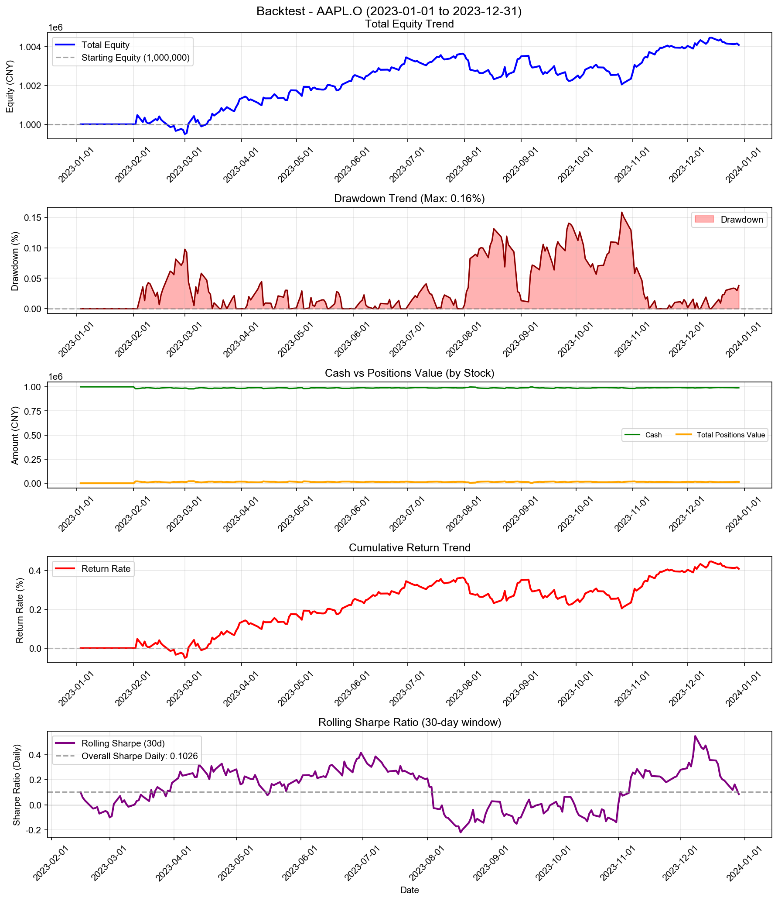
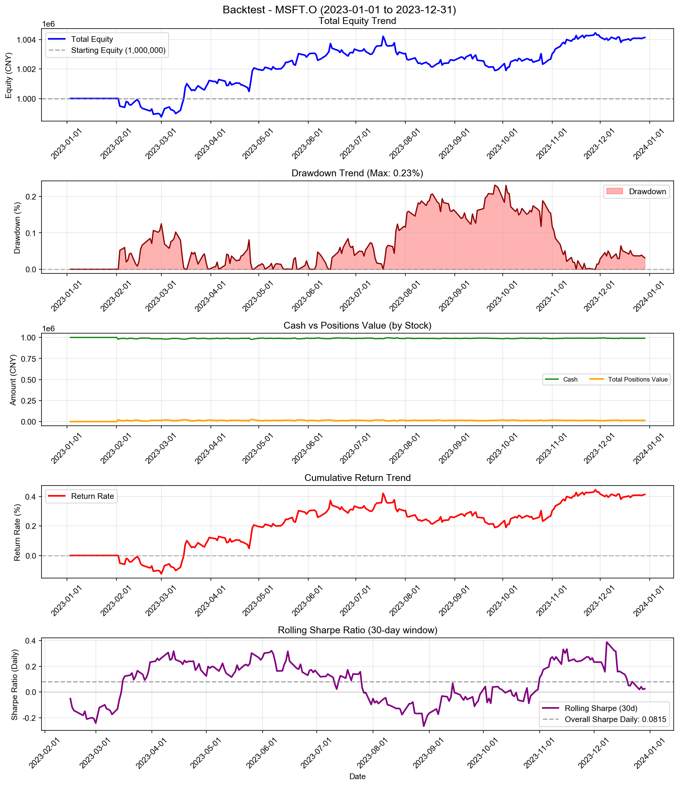
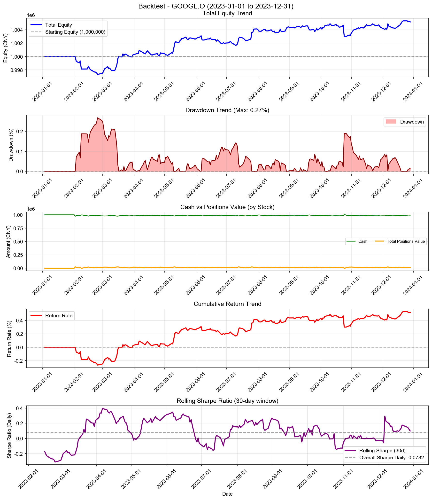
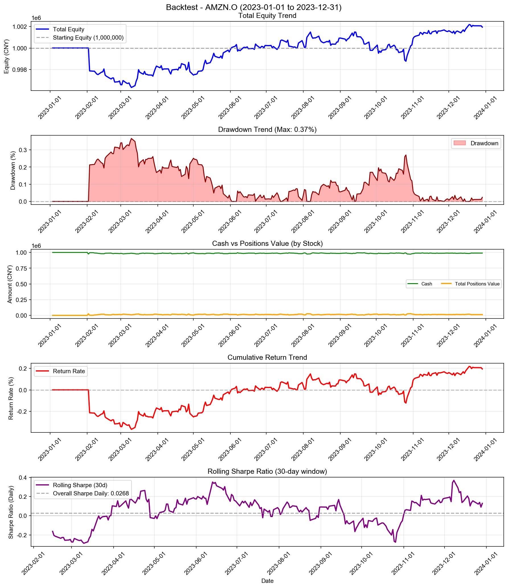
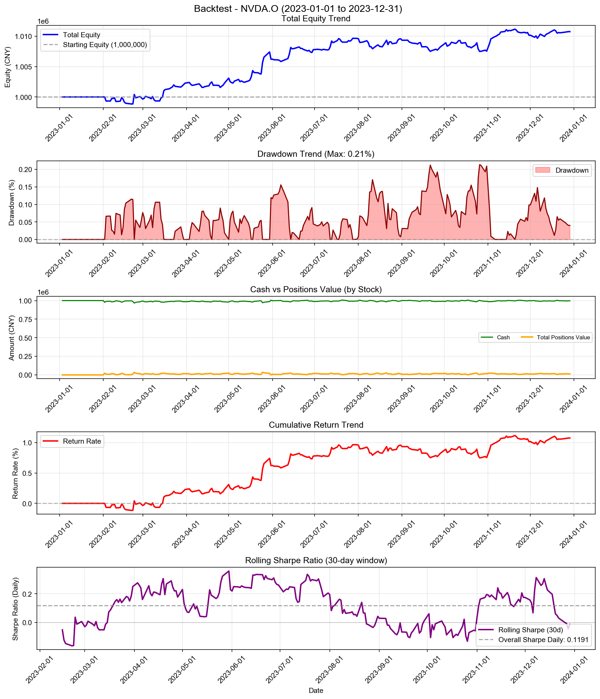
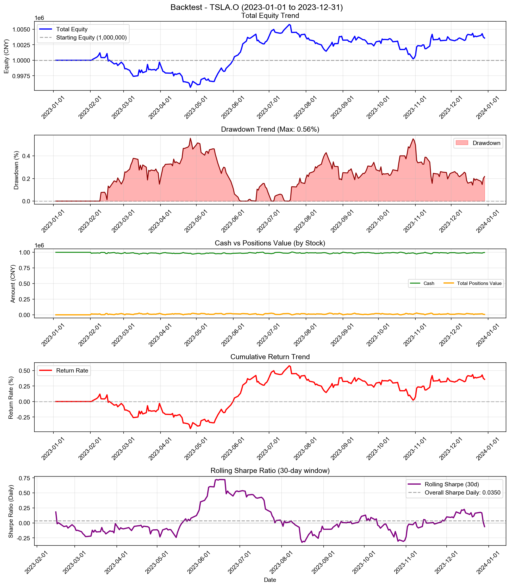
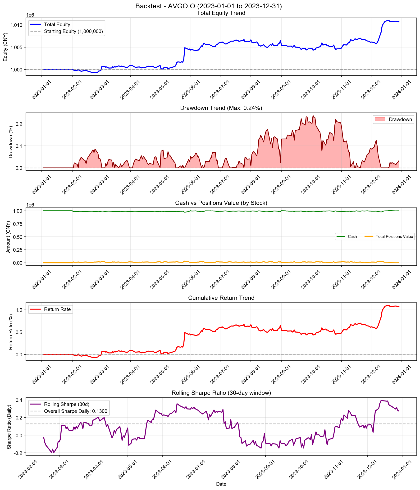
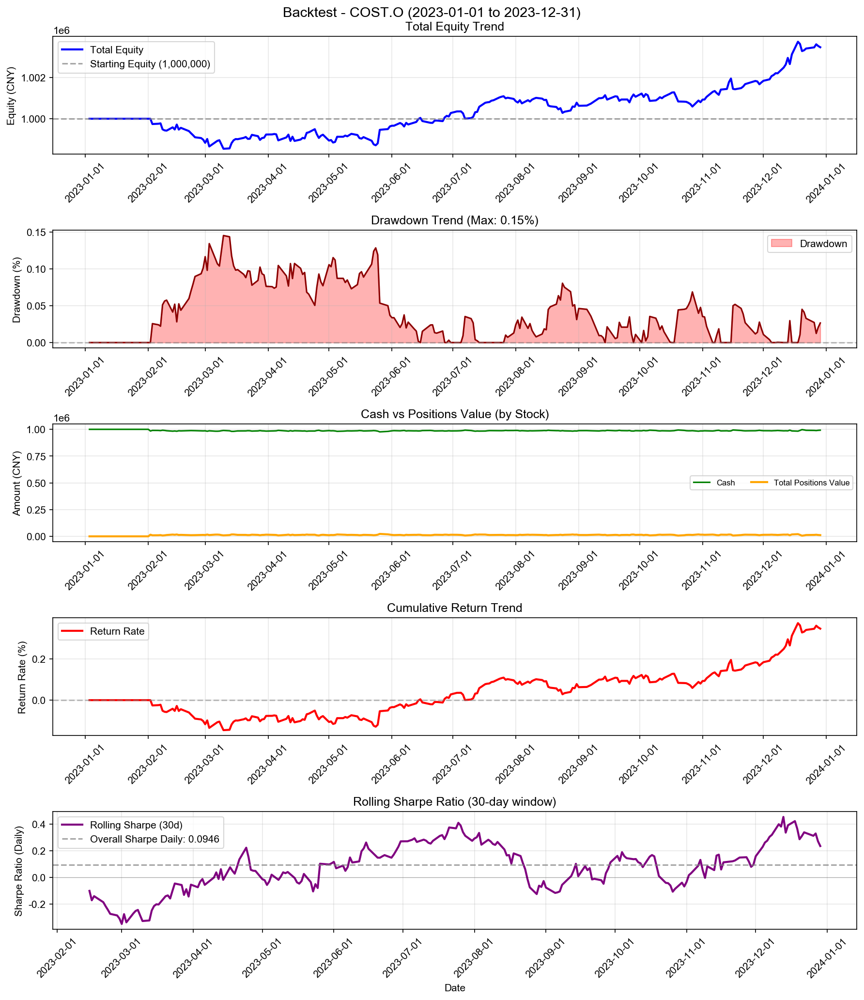
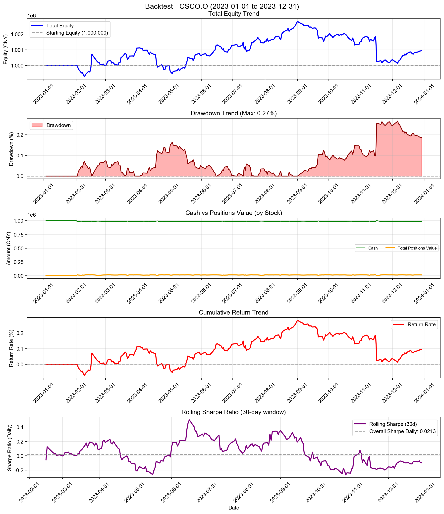

# Predictor Agent Strategy - 多股票回测综合报告

**策略名称:** Predictor Agent Strategy  
**回测期间:** 2023-01-01 至 2023-12-31  
**测试股票数:** 10 支  
**每只股票初始资金:** 1000000.00 元

---

## 综合统计

| 项目 | 数值 |
|------|------|
| 成功回测股票数 | 10/10 |
| 总初始资金 | 10000000.00 元 |
| 总最终权益 | 10054345.44 元 |
| 总盈亏 | +54345.44 元 |
| 平均收益率 | +0.54% |
| 总交易次数 | 2120 次 |

---

## 各股票详细结果

| 股票代码 | 初始资金 | 最终权益 | 盈亏 | 收益率 | 交易次数 |
|----------|----------|----------|------|--------|------------------|
| AAPL.O | 1000000.00 | 1004094.56 | +4094.56 | +0.41% | 188 |
| MSFT.O | 1000000.00 | 1004133.97 | +4133.97 | +0.41% | 144 |
| GOOGL.O | 1000000.00 | 1005191.94 | +5191.94 | +0.52% | 226 |
| AMZN.O | 1000000.00 | 1001938.73 | +1938.73 | +0.19% | 216 |
| NVDA.O | 1000000.00 | 1010753.31 | +10753.31 | +1.08% | 222 |
| META.O | 1000000.00 | 1009578.58 | +9578.58 | +0.96% | 226 |
| TSLA.O | 1000000.00 | 1003582.61 | +3582.61 | +0.36% | 228 |
| AVGO.O | 1000000.00 | 1010668.03 | +10668.03 | +1.07% | 229 |
| COST.O | 1000000.00 | 1003459.61 | +3459.61 | +0.35% | 228 |
| CSCO.O | 1000000.00 | 1000944.10 | +944.10 | +0.09% | 213 |

---

## 收益率排名

### 收益率最高的股票

| 排名 | 股票代码 | 收益率 | 盈亏 |
|------|----------|--------|------|
| 1 | NVDA.O | +1.08% | +10753.31 |
| 2 | AVGO.O | +1.07% | +10668.03 |
| 3 | META.O | +0.96% | +9578.58 |
| 4 | GOOGL.O | +0.52% | +5191.94 |
| 5 | MSFT.O | +0.41% | +4133.97 |

### 收益率最低的股票

| 排名 | 股票代码 | 收益率 | 盈亏 |
|------|----------|--------|------|
| 1 | CSCO.O | +0.09% | +944.10 |
| 2 | AMZN.O | +0.19% | +1938.73 |
| 3 | COST.O | +0.35% | +3459.61 |
| 4 | TSLA.O | +0.36% | +3582.61 |
| 5 | AAPL.O | +0.41% | +4094.56 |

---

## 交易统计

| 股票代码 | 交易次数 | 平均每笔交易金额 |
|----------|------------------|------------------|
| AAPL.O | 188 | 5330.04 |
| MSFT.O | 144 | 6958.80 |
| GOOGL.O | 226 | 4436.27 |
| AMZN.O | 216 | 4634.12 |
| NVDA.O | 222 | 4528.72 |
| META.O | 226 | 4445.97 |
| TSLA.O | 228 | 4393.82 |
| AVGO.O | 229 | 4390.10 |
| COST.O | 228 | 4393.55 |
| CSCO.O | 213 | 4697.05 |

---

## 各股票详细分析

### AAPL.O

#### 账户摘要

| 项目 | 数值 |
|------|------|
| 初始资金 | 1000000.00 元 |
| 最终现金 | 990171.84 元 |
| 最终持仓市值 | 13922.72 元 |
| 最终总权益 | 1004094.56 元 |
| 总盈亏 | +4094.56 元 |
| 总收益率 | +0.41% |

| 资金比（现金/权益） | 98.61% |

#### 风险与稳健性指标

| 指标 | 数值 |
|------|------|
| 最大回撤 (Max Drawdown) | 0.16% |
| 年化收益率 (CAGR) | +0.41% |
| 年化夏普比率 (Sharpe) | 1.6286 |
| 日频夏普比率 (Sharpe Daily) | 0.1026 |
| 年化 Sortino 比率 | 1.6280 |
| 日频 Sortino 比率 | 0.1026 |
| Calmar 比率 (CAGR/MaxDD) | 2.6019 |
| 年化波动率 (Volatility) | 0.25% |
| VaR 95% | -0.02% |
| VaR 99% | -0.04% |
| CVaR 95% | -0.03% |
| CVaR 99% | -0.05% |

#### 统计信息

| 指标 | 数值 |
|------|------|
| 交易日数 | 250 天 |
| 最高权益 | 1004474.53 元 |
| 最低权益 | 999499.43 元 |
| 最高收益率 | +0.45% |
| 最低收益率 | -0.05% |

#### 最终持仓

| 股票代码 | 股数 | 成本价 | 现价 | 市值 | 盈亏 | 收益率 |
|----------|------|--------|------|------|------|--------|
| AAPL.O | 25 | 544.64 | 556.91 | 13922.72 | +306.74 | +2.25% |

---

### MSFT.O

#### 账户摘要

| 项目 | 数值 |
|------|------|
| 初始资金 | 1000000.00 元 |
| 最终现金 | 990159.00 元 |
| 最终持仓市值 | 13974.97 元 |
| 最终总权益 | 1004133.97 元 |
| 总盈亏 | +4133.97 元 |
| 总收益率 | +0.41% |

| 资金比（现金/权益） | 98.61% |

#### 风险与稳健性指标

| 指标 | 数值 |
|------|------|
| 最大回撤 (Max Drawdown) | 0.23% |
| 年化收益率 (CAGR) | +0.42% |
| 年化夏普比率 (Sharpe) | 1.2945 |
| 日频夏普比率 (Sharpe Daily) | 0.0815 |
| 年化 Sortino 比率 | 1.2770 |
| 日频 Sortino 比率 | 0.0804 |
| Calmar 比率 (CAGR/MaxDD) | 1.8053 |
| 年化波动率 (Volatility) | 0.32% |
| VaR 95% | -0.03% |
| VaR 99% | -0.05% |
| CVaR 95% | -0.04% |
| CVaR 99% | -0.06% |

#### 统计信息

| 指标 | 数值 |
|------|------|
| 交易日数 | 250 天 |
| 最高权益 | 1004450.93 元 |
| 最低权益 | 998751.92 元 |
| 最高收益率 | +0.45% |
| 最低收益率 | -0.12% |

#### 最终持仓

| 股票代码 | 股数 | 成本价 | 现价 | 市值 | 盈亏 | 收益率 |
|----------|------|--------|------|------|------|--------|
| MSFT.O | 8 | 1669.19 | 1746.87 | 13974.97 | +621.43 | +4.65% |

---

### GOOGL.O

#### 账户摘要

| 项目 | 数值 |
|------|------|
| 初始资金 | 1000000.00 元 |
| 最终现金 | 994195.01 元 |
| 最终持仓市值 | 10996.93 元 |
| 最终总权益 | 1005191.94 元 |
| 总盈亏 | +5191.94 元 |
| 总收益率 | +0.52% |

| 资金比（现金/权益） | 98.91% |

#### 风险与稳健性指标

| 指标 | 数值 |
|------|------|
| 最大回撤 (Max Drawdown) | 0.27% |
| 年化收益率 (CAGR) | +0.52% |
| 年化夏普比率 (Sharpe) | 1.2419 |
| 日频夏普比率 (Sharpe Daily) | 0.0782 |
| 年化 Sortino 比率 | 1.1436 |
| 日频 Sortino 比率 | 0.0720 |
| Calmar 比率 (CAGR/MaxDD) | 1.9543 |
| 年化波动率 (Volatility) | 0.42% |
| VaR 95% | -0.03% |
| VaR 99% | -0.07% |
| CVaR 95% | -0.06% |
| CVaR 99% | -0.12% |

#### 统计信息

| 指标 | 数值 |
|------|------|
| 交易日数 | 250 天 |
| 最高权益 | 1005344.94 元 |
| 最低权益 | 997322.04 元 |
| 最高收益率 | +0.53% |
| 最低收益率 | -0.27% |

#### 最终持仓

| 股票代码 | 股数 | 成本价 | 现价 | 市值 | 盈亏 | 收益率 |
|----------|------|--------|------|------|------|--------|
| GOOGL.O | 197 | 53.61 | 55.82 | 10996.93 | +436.10 | +4.13% |

---

### AMZN.O

#### 账户摘要

| 项目 | 数值 |
|------|------|
| 初始资金 | 1000000.00 元 |
| 最终现金 | 990269.74 元 |
| 最终持仓市值 | 11668.99 元 |
| 最终总权益 | 1001938.73 元 |
| 总盈亏 | +1938.73 元 |
| 总收益率 | +0.19% |

| 资金比（现金/权益） | 98.84% |

#### 风险与稳健性指标

| 指标 | 数值 |
|------|------|
| 最大回撤 (Max Drawdown) | 0.37% |
| 年化收益率 (CAGR) | +0.20% |
| 年化夏普比率 (Sharpe) | 0.4259 |
| 日频夏普比率 (Sharpe Daily) | 0.0268 |
| 年化 Sortino 比率 | 0.3640 |
| 日频 Sortino 比率 | 0.0229 |
| Calmar 比率 (CAGR/MaxDD) | 0.5340 |
| 年化波动率 (Volatility) | 0.46% |
| VaR 95% | -0.04% |
| VaR 99% | -0.09% |
| CVaR 95% | -0.07% |
| CVaR 99% | -0.13% |

#### 统计信息

| 指标 | 数值 |
|------|------|
| 交易日数 | 250 天 |
| 最高权益 | 1002176.57 元 |
| 最低权益 | 996340.62 元 |
| 最高收益率 | +0.22% |
| 最低收益率 | -0.37% |

#### 最终持仓

| 股票代码 | 股数 | 成本价 | 现价 | 市值 | 盈亏 | 收益率 |
|----------|------|--------|------|------|------|--------|
| AMZN.O | 32 | 355.51 | 364.66 | 11668.99 | +292.56 | +2.57% |

---

### NVDA.O

#### 账户摘要

| 项目 | 数值 |
|------|------|
| 初始资金 | 1000000.00 元 |
| 最终现金 | 997020.37 元 |
| 最终持仓市值 | 13732.93 元 |
| 最终总权益 | 1010753.31 元 |
| 总盈亏 | +10753.31 元 |
| 总收益率 | +1.08% |

| 资金比（现金/权益） | 98.64% |

#### 风险与稳健性指标

| 指标 | 数值 |
|------|------|
| 最大回撤 (Max Drawdown) | 0.21% |
| 年化收益率 (CAGR) | +1.08% |
| 年化夏普比率 (Sharpe) | 1.8906 |
| 日频夏普比率 (Sharpe Daily) | 0.1191 |
| 年化 Sortino 比率 | 2.0749 |
| 日频 Sortino 比率 | 0.1307 |
| Calmar 比率 (CAGR/MaxDD) | 5.0753 |
| 年化波动率 (Volatility) | 0.57% |
| VaR 95% | -0.05% |
| VaR 99% | -0.07% |
| CVaR 95% | -0.07% |
| CVaR 99% | -0.10% |

#### 统计信息

| 指标 | 数值 |
|------|------|
| 交易日数 | 250 天 |
| 最高权益 | 1011159.27 元 |
| 最低权益 | 998847.71 元 |
| 最高收益率 | +1.12% |
| 最低收益率 | -0.12% |

#### 最终持仓

| 股票代码 | 股数 | 成本价 | 现价 | 市值 | 盈亏 | 收益率 |
|----------|------|--------|------|------|------|--------|
| NVDA.O | 53 | 253.24 | 259.11 | 13732.93 | +310.95 | +2.32% |

---

### META.O

#### 账户摘要

| 项目 | 数值 |
|------|------|
| 初始资金 | 1000000.00 元 |
| 最终现金 | 999349.13 元 |
| 最终持仓市值 | 10229.44 元 |
| 最终总权益 | 1009578.58 元 |
| 总盈亏 | +9578.58 元 |
| 总收益率 | +0.96% |

| 资金比（现金/权益） | 98.99% |

#### 风险与稳健性指标

| 指标 | 数值 |
|------|------|
| 最大回撤 (Max Drawdown) | 0.23% |
| 年化收益率 (CAGR) | +0.97% |
| 年化夏普比率 (Sharpe) | 2.1082 |
| 日频夏普比率 (Sharpe Daily) | 0.1328 |
| 年化 Sortino 比率 | 2.4554 |
| 日频 Sortino 比率 | 0.1547 |
| Calmar 比率 (CAGR/MaxDD) | 4.2113 |
| 年化波动率 (Volatility) | 0.46% |
| VaR 95% | -0.03% |
| VaR 99% | -0.06% |
| CVaR 95% | -0.05% |
| CVaR 99% | -0.08% |

#### 统计信息

| 指标 | 数值 |
|------|------|
| 交易日数 | 250 天 |
| 最高权益 | 1009736.76 元 |
| 最低权益 | 998557.13 元 |
| 最高收益率 | +0.97% |
| 最低收益率 | -0.14% |

#### 最终持仓

| 股票代码 | 股数 | 成本价 | 现价 | 市值 | 盈亏 | 收益率 |
|----------|------|--------|------|------|------|--------|
| META.O | 2890 | 3.35 | 3.54 | 10229.44 | +559.50 | +5.79% |

---

### TSLA.O

#### 账户摘要

| 项目 | 数值 |
|------|------|
| 初始资金 | 1000000.00 元 |
| 最终现金 | 997097.28 元 |
| 最终持仓市值 | 6485.33 元 |
| 最终总权益 | 1003582.61 元 |
| 总盈亏 | +3582.61 元 |
| 总收益率 | +0.36% |

| 资金比（现金/权益） | 99.35% |

#### 风险与稳健性指标

| 指标 | 数值 |
|------|------|
| 最大回撤 (Max Drawdown) | 0.56% |
| 年化收益率 (CAGR) | +0.36% |
| 年化夏普比率 (Sharpe) | 0.5549 |
| 日频夏普比率 (Sharpe Daily) | 0.0350 |
| 年化 Sortino 比率 | 0.5263 |
| 日频 Sortino 比率 | 0.0332 |
| Calmar 比率 (CAGR/MaxDD) | 0.6489 |
| 年化波动率 (Volatility) | 0.66% |
| VaR 95% | -0.06% |
| VaR 99% | -0.11% |
| CVaR 95% | -0.09% |
| CVaR 99% | -0.13% |

#### 统计信息

| 指标 | 数值 |
|------|------|
| 交易日数 | 250 天 |
| 最高权益 | 1005773.83 元 |
| 最低权益 | 995633.77 元 |
| 最高收益率 | +0.58% |
| 最低收益率 | -0.44% |

#### 最终持仓

| 股票代码 | 股数 | 成本价 | 现价 | 市值 | 盈亏 | 收益率 |
|----------|------|--------|------|------|------|--------|
| TSLA.O | 174 | 37.88 | 37.27 | 6485.33 | -106.40 | -1.61% |

---

### AVGO.O

#### 账户摘要

| 项目 | 数值 |
|------|------|
| 初始资金 | 1000000.00 元 |
| 最终现金 | 998713.63 元 |
| 最终持仓市值 | 11954.41 元 |
| 最终总权益 | 1010668.03 元 |
| 总盈亏 | +10668.03 元 |
| 总收益率 | +1.07% |

| 资金比（现金/权益） | 98.82% |

#### 风险与稳健性指标

| 指标 | 数值 |
|------|------|
| 最大回撤 (Max Drawdown) | 0.24% |
| 年化收益率 (CAGR) | +1.08% |
| 年化夏普比率 (Sharpe) | 2.0630 |
| 日频夏普比率 (Sharpe Daily) | 0.1300 |
| 年化 Sortino 比率 | 2.7731 |
| 日频 Sortino 比率 | 0.1747 |
| Calmar 比率 (CAGR/MaxDD) | 4.5145 |
| 年化波动率 (Volatility) | 0.52% |
| VaR 95% | -0.04% |
| VaR 99% | -0.07% |
| CVaR 95% | -0.05% |
| CVaR 99% | -0.08% |

#### 统计信息

| 指标 | 数值 |
|------|------|
| 交易日数 | 250 天 |
| 最高权益 | 1010994.59 元 |
| 最低权益 | 999263.02 元 |
| 最高收益率 | +1.10% |
| 最低收益率 | -0.07% |

#### 最终持仓

| 股票代码 | 股数 | 成本价 | 现价 | 市值 | 盈亏 | 收益率 |
|----------|------|--------|------|------|------|--------|
| AVGO.O | 849 | 13.69 | 14.08 | 11954.41 | +332.58 | +2.86% |

---

### COST.O

#### 账户摘要

| 项目 | 数值 |
|------|------|
| 初始资金 | 1000000.00 元 |
| 最终现金 | 991948.28 元 |
| 最终持仓市值 | 11511.33 元 |
| 最终总权益 | 1003459.61 元 |
| 总盈亏 | +3459.61 元 |
| 总收益率 | +0.35% |

| 资金比（现金/权益） | 98.85% |

#### 风险与稳健性指标

| 指标 | 数值 |
|------|------|
| 最大回撤 (Max Drawdown) | 0.15% |
| 年化收益率 (CAGR) | +0.35% |
| 年化夏普比率 (Sharpe) | 1.5011 |
| 日频夏普比率 (Sharpe Daily) | 0.0946 |
| 年化 Sortino 比率 | 1.3881 |
| 日频 Sortino 比率 | 0.0874 |
| Calmar 比率 (CAGR/MaxDD) | 2.4021 |
| 年化波动率 (Volatility) | 0.23% |
| VaR 95% | -0.02% |
| VaR 99% | -0.03% |
| CVaR 95% | -0.03% |
| CVaR 99% | -0.04% |

#### 统计信息

| 指标 | 数值 |
|------|------|
| 交易日数 | 250 天 |
| 最高权益 | 1003726.25 元 |
| 最低权益 | 998548.21 元 |
| 最高收益率 | +0.37% |
| 最低收益率 | -0.15% |

#### 最终持仓

| 股票代码 | 股数 | 成本价 | 现价 | 市值 | 盈亏 | 收益率 |
|----------|------|--------|------|------|------|--------|
| COST.O | 589 | 18.87 | 19.54 | 11511.33 | +395.50 | +3.56% |

---

### CSCO.O

#### 账户摘要

| 项目 | 数值 |
|------|------|
| 初始资金 | 1000000.00 元 |
| 最终现金 | 987217.94 元 |
| 最终持仓市值 | 13726.16 元 |
| 最终总权益 | 1000944.10 元 |
| 总盈亏 | +944.10 元 |
| 总收益率 | +0.09% |

| 资金比（现金/权益） | 98.63% |

#### 风险与稳健性指标

| 指标 | 数值 |
|------|------|
| 最大回撤 (Max Drawdown) | 0.27% |
| 年化收益率 (CAGR) | +0.10% |
| 年化夏普比率 (Sharpe) | 0.3378 |
| 日频夏普比率 (Sharpe Daily) | 0.0213 |
| 年化 Sortino 比率 | 0.2739 |
| 日频 Sortino 比率 | 0.0173 |
| Calmar 比率 (CAGR/MaxDD) | 0.3583 |
| 年化波动率 (Volatility) | 0.28% |
| VaR 95% | -0.02% |
| VaR 99% | -0.05% |
| CVaR 95% | -0.04% |
| CVaR 99% | -0.09% |

#### 统计信息

| 指标 | 数值 |
|------|------|
| 交易日数 | 250 天 |
| 最高权益 | 1002810.53 元 |
| 最低权益 | 999305.77 元 |
| 最高收益率 | +0.28% |
| 最低收益率 | -0.07% |

#### 最终持仓

| 股票代码 | 股数 | 成本价 | 现价 | 市值 | 盈亏 | 收益率 |
|----------|------|--------|------|------|------|--------|
| CSCO.O | 65 | 204.33 | 211.17 | 13726.16 | +444.98 | +3.35% |

---

---

## 策略参数

- **max_position_weight:** 50%
- **min_score_threshold:** 0.0
- **max_total_weight:** 100%
- **use_close_only:** True
- **seq_len:** 21
- **use_square_weight:** False

---

*报告生成时间: 2025-12-24 18:40:20*
