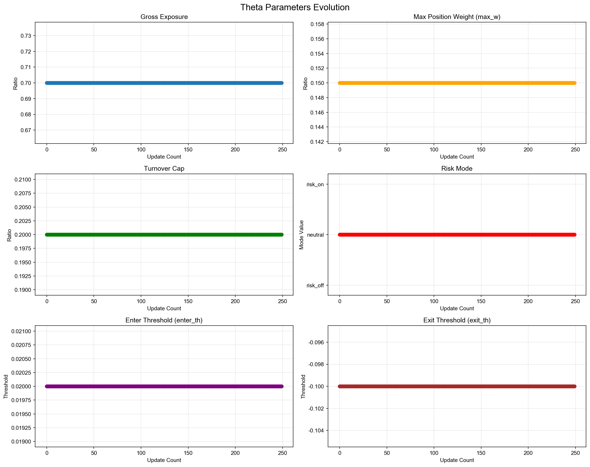
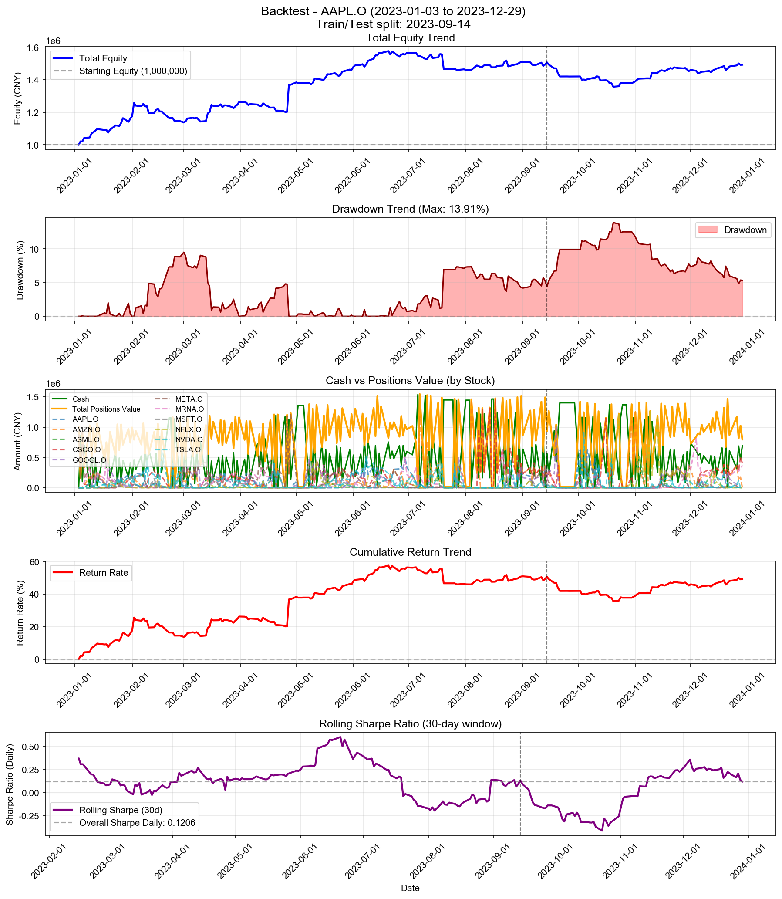

# Backtest

**策略名称:** 层级式多资产交易系统（无反思层）  
**回测期间:** 2023-01-03 至 2023-12-29  
**交易日数:** 250  
**组合股票数:** 20 支  
**初始资金:** 1000000.00 元

---

## 组合整体表现

| 项目 | 数值 |
|------|------|
| 初始资金 | 1000000.00 元 |
| 最终现金 | 695845.76 元 |
| 最终持仓市值 | 796260.34 元 |
| 最终总权益 | 1492106.09 元 |
| 总盈亏 | +492106.09 元 |
| 总收益率 | +49.21% |
| 年化收益率 (CAGR) | +49.69% |

---

## 参数θ追踪

### 初始参数

| 参数 | 数值 |
|------|------|
| 总仓位上限 (gross_exposure) | 0.85 |
| 单票上限 (max_w) | 0.20 |
| 换手上限 (turnover_cap) | 0.25 |
| 风险模式 (risk_mode) | neutral |
| 进场阈值 (enter_th) | 0.020 |
| 出场阈值 (exit_th) | -0.100 |

### 最终参数

| 参数 | 数值 |
|------|------|
| 总仓位上限 (gross_exposure) | 0.85 |
| 单票上限 (max_w) | 0.20 |
| 换手上限 (turnover_cap) | 0.25 |
| 风险模式 (risk_mode) | neutral |
| 进场阈值 (enter_th) | 0.020 |
| 出场阈值 (exit_th) | -0.100 |

### 参数变化趋势图

---

## 持仓明细

| 股票代码 | 股数 | 成本价 | 现价 | 市值 | 权重 | 盈亏 | 收益率 | 贡献度 |
|----------|------|--------|------|------|------|------|--------|--------|
| AAPL.O | 10 | 559.55 | 556.91 | 5569.09 | 0.37% | -26.37 | -0.47% | -0.00% |
| MSFT.O | 2 | 1717.65 | 1746.87 | 3493.74 | 0.23% | +58.45 | +1.70% | 0.00% |
| GOOGL.O | 109 | 56.05 | 55.82 | 6084.60 | 0.41% | -25.26 | -0.41% | -0.00% |
| NVDA.O | 12 | 261.81 | 259.11 | 3109.34 | 0.21% | -32.33 | -1.03% | -0.00% |
| META.O | 931 | 3.54 | 3.54 | 3295.37 | 0.22% | -2.30 | -0.07% | -0.00% |
| ASML.O | 4 | 95.79 | 96.07 | 384.27 | 0.03% | +1.10 | +0.29% | 0.00% |
| MRNA.O | 372640 | 0.98 | 0.99 | 370590.48 | 24.84% | +5943.48 | +1.63% | 0.40% |
| NFLX.O | 12 | 66.22 | 68.16 | 817.96 | 0.05% | +23.30 | +2.93% | 0.00% |
| CSCO.O | 1908 | 210.57 | 211.17 | 402915.49 | 27.00% | +1144.32 | +0.28% | 0.08% |

### 权重分布

| 股票代码 | 权重 | 市值占比 |
|----------|------|----------|
| AAPL.O | 0.37% | 0.37% |
| MSFT.O | 0.23% | 0.23% |
| GOOGL.O | 0.41% | 0.41% |
| NVDA.O | 0.21% | 0.21% |
| META.O | 0.22% | 0.22% |
| ASML.O | 0.03% | 0.03% |
| MRNA.O | 24.84% | 24.84% |
| NFLX.O | 0.05% | 0.05% |
| CSCO.O | 27.00% | 27.00% |

---

## 交易统计

| 项目 | 数值 |
|------|------|
| 总交易次数 | 2098 次 |
| 买入次数 | 1192 次 |
| 卖出次数 | 906 次 |
| 买入总成本 | 101642687.98 元 |
| 卖出总收入 | 101338533.74 元 |
| 已实现盈亏 | +485021.69 元 |

### 交易质量指标

| 指标 | 数值 |
|------|------|
| 胜率 (Hit Rate) | 57.06% |
| 盈亏比 (Profit Factor) | 1.64 |
| 单笔平均收益 | +535.34 元 |
| 平均持仓周期 | 4.2 天 |

---

## 风险与稳健性

| 指标 | 数值 |
|------|------|
| 最大回撤 (Max Drawdown) | 13.91% |
| 年化波动率 (Volatility) | 22.43% |
| 年化夏普比率 (Sharpe) | 1.9149 |
| 日频夏普比率 (Sharpe Daily) | 0.1206 |
| 年化 Sortino 比率 | 2.4398 |
| 日频 Sortino 比率 | 0.1537 |
| Calmar 比率 (CAGR/MaxDD) | 3.5728 |
### 尾部风险 (Tail Risk)

| 指标 | 数值 |
|------|------|
| VaR 95% | -1.55% |
| VaR 99% | -3.33% |
| CVaR 95% | -2.33% |
| CVaR 99% | -4.15% |
| 极端日跌幅 (5%分位) | -1.57% |
| 极端日跌幅 (1%分位) | -3.40% |

---

## 执行与成本

| 指标 | 数值 |
|------|------|
| 换手率 (Turnover) | 7393.95% |
| 交易频率 (每日) | 8.39 次/日 |
| 交易频率 (每周) | 41.96 次/周 |

---

## 各股票表现分析

| 股票代码 | 初始权重 | 最终权重 | 收益率 | 盈亏 | 交易次数 | 贡献度 |
|----------|----------|----------|--------|------|----------|--------|
| AAPL.O | 799.06% | 0.37% | -0.47% | -26.37 | 180 | -0.00% |
| MSFT.O | 203.15% | 0.23% | +1.70% | +58.45 | 107 | 0.00% |
| GOOGL.O | 924.42% | 0.41% | -0.41% | -25.26 | 196 | -0.00% |
| NVDA.O | 737.00% | 0.21% | -1.03% | -32.33 | 196 | -0.00% |
| META.O | 1333.42% | 0.22% | -0.07% | -2.30 | 247 | -0.00% |
| ASML.O | 188.59% | 0.03% | +0.29% | +1.10 | 78 | 0.00% |
| MRNA.O | 894.75% | 24.84% | +1.63% | +5943.48 | 206 | 0.40% |
| NFLX.O | 953.73% | 0.05% | +2.93% | +23.30 | 160 | 0.00% |
| CSCO.O | 1579.67% | 27.00% | +0.28% | +1144.32 | 244 | 0.08% |

---

## 策略参数

---

## 交易记录

| 序号 | 日期 | 类型 | 股票代码 | 股数 | 价格 | 成本/收入 | 利润 |
|------|------|------|----------|------|------|-----------|------|
| 1 | 2023-01-03 | 买入 | META.O | 128266 | 1.25 | 159999.01 | - |
| 2 | 2023-01-03 | 买入 | META.O | 673401 | 1.25 | 840000.41 | - |
| 3 | 2023-01-04 | 卖出 | META.O | 673400 | 1.27 | 857709.58 | +17710.42 |
| 4 | 2023-01-05 | 买入 | META.O | 595286 | 1.27 | 755656.05 | - |
| 5 | 2023-01-06 | 买入 | AMZN.O | 233 | 206.59 | 48135.94 | - |
| 6 | 2023-01-06 | 卖出 | META.O | 607393 | 1.30 | 789732.38 | +21076.55 |
| 7 | 2023-01-06 | 买入 | MRNA.O | 48654 | 1.80 | 87747.49 | - |
| 8 | 2023-01-06 | 买入 | CSCO.O | 279 | 197.53 | 55112.13 | - |
| 9 | 2023-01-09 | 买入 | AMZN.O | 131 | 209.66 | 27465.98 | - |
| 10 | 2023-01-09 | 买入 | TSLA.O | 1709 | 17.97 | 30703.04 | - |
| 11 | 2023-01-09 | 买入 | ASML.O | 419 | 78.08 | 32715.04 | - |
| 12 | 2023-01-09 | 买入 | MRNA.O | 19890 | 1.84 | 36587.65 | - |
| 13 | 2023-01-09 | 卖出 | CSCO.O | 184 | 198.60 | 36541.92 | +195.57 |
| 14 | 2023-01-09 | 买入 | AMZN.O | 502 | 209.66 | 105251.33 | - |
| 15 | 2023-01-09 | 买入 | TSLA.O | 2358 | 17.97 | 42362.65 | - |
| 16 | 2023-01-09 | 买入 | META.O | 157264 | 1.29 | 203609.70 | - |
| 17 | 2023-01-09 | 买入 | ASML.O | 578 | 78.08 | 45129.58 | - |
| 18 | 2023-01-09 | 买入 | MRNA.O | 94544 | 1.84 | 173913.69 | - |
| 19 | 2023-01-09 | 买入 | CSCO.O | 130 | 198.60 | 25817.66 | - |
| 20 | 2023-01-10 | 买入 | GOOGL.O | 389 | 35.33 | 13744.85 | - |
| 21 | 2023-01-10 | 卖出 | AMZN.O | 257 | 215.69 | 55431.82 | +1760.59 |
| 22 | 2023-01-10 | 买入 | NVDA.O | 183 | 83.20 | 15226.17 | - |
| 23 | 2023-01-10 | 卖出 | TSLA.O | 3546 | 17.83 | 63216.32 | -489.35 |
| 24 | 2023-01-10 | 卖出 | META.O | 158592 | 1.33 | 210911.50 | +7549.80 |
| 25 | 2023-01-10 | 卖出 | ASML.O | 621 | 79.59 | 49428.10 | +941.13 |
| 26 | 2023-01-10 | 卖出 | MRNA.O | 85990 | 1.90 | 163080.04 | +5824.95 |
| 27 | 2023-01-10 | 卖出 | CSCO.O | 196 | 199.54 | 39109.38 | +272.25 |
| 28 | 2023-01-11 | 买入 | MSFT.O | 19 | 1085.63 | 20626.96 | - |
| 29 | 2023-01-11 | 买入 | GOOGL.O | 2185 | 36.57 | 79911.15 | - |
| 30 | 2023-01-11 | 卖出 | NVDA.O | 106 | 83.68 | 8870.53 | +51.00 |
| 31 | 2023-01-11 | 买入 | TSLA.O | 591 | 18.48 | 10923.45 | - |
| 32 | 2023-01-11 | 卖出 | META.O | 4440 | 1.33 | 5900.32 | +206.93 |
| 33 | 2023-01-11 | 卖出 | ASML.O | 221 | 81.01 | 17903.90 | +648.47 |
| 34 | 2023-01-11 | 卖出 | MRNA.O | 31625 | 1.87 | 59024.90 | +1190.36 |
| 35 | 2023-01-11 | 买入 | MSFT.O | 17 | 1085.63 | 18455.70 | - |
| 36 | 2023-01-11 | 买入 | GOOGL.O | 2240 | 36.57 | 81922.65 | - |
| 37 | 2023-01-11 | 买入 | AMZN.O | 525 | 228.22 | 119813.40 | - |
| 38 | 2023-01-11 | 买入 | NVDA.O | 66 | 83.68 | 5523.16 | - |
| 39 | 2023-01-11 | 买入 | TSLA.O | 968 | 18.48 | 17891.54 | - |
| 40 | 2023-01-11 | 买入 | META.O | 96077 | 1.33 | 127676.73 | - |
| 41 | 2023-01-11 | 买入 | ASML.O | 134 | 81.01 | 10855.76 | - |
| 42 | 2023-01-11 | 买入 | MRNA.O | 39575 | 1.87 | 73862.78 | - |
| 43 | 2023-01-12 | 卖出 | MSFT.O | 30 | 1098.25 | 32947.38 | +378.50 |
| 44 | 2023-01-12 | 卖出 | GOOGL.O | 2640 | 36.42 | 96140.25 | -147.17 |
| 45 | 2023-01-12 | 卖出 | AMZN.O | 473 | 228.65 | 108150.50 | +5126.84 |
| 46 | 2023-01-12 | 买入 | NVDA.O | 428 | 86.35 | 36958.45 | - |
| 47 | 2023-01-12 | 卖出 | TSLA.O | 1751 | 18.53 | 32453.03 | +316.27 |
| 48 | 2023-01-12 | 卖出 | META.O | 94123 | 1.37 | 128675.55 | +5940.88 |
| 49 | 2023-01-12 | 卖出 | ASML.O | 243 | 82.00 | 19926.81 | +623.04 |
| 50 | 2023-01-12 | 卖出 | MRNA.O | 13440 | 1.88 | 25275.26 | +461.33 |
| 51 | 2023-01-13 | 卖出 | MSFT.O | 5 | 1101.56 | 5507.81 | +79.66 |
| 52 | 2023-01-13 | 买入 | GOOGL.O | 1643 | 36.81 | 60482.74 | - |
| 53 | 2023-01-13 | 买入 | AMZN.O | 37 | 235.49 | 8713.06 | - |
| 54 | 2023-01-13 | 买入 | NVDA.O | 274 | 88.38 | 24216.32 | - |
| 55 | 2023-01-13 | 卖出 | META.O | 22784 | 1.37 | 31209.52 | +1499.60 |
| 56 | 2023-01-13 | 买入 | MRNA.O | 12643 | 1.92 | 24274.56 | - |
| 57 | 2023-01-13 | 卖出 | CSCO.O | 28 | 199.82 | 5595.07 | +46.91 |
| 58 | 2023-01-13 | 买入 | GOOGL.O | 2216 | 36.81 | 81576.23 | - |
| 59 | 2023-01-13 | 买入 | AMZN.O | 405 | 235.49 | 95372.64 | - |
| 60 | 2023-01-13 | 买入 | NVDA.O | 490 | 88.38 | 43306.56 | - |
| 61 | 2023-01-13 | 买入 | META.O | 51990 | 1.37 | 71215.90 | - |
| 62 | 2023-01-13 | 买入 | MRNA.O | 48907 | 1.92 | 93901.44 | - |
| 63 | 2023-01-17 | 卖出 | GOOGL.O | 4044 | 36.48 | 147527.95 | -846.03 |
| 64 | 2023-01-17 | 卖出 | AMZN.O | 734 | 230.52 | 169201.68 | +4129.90 |
| 65 | 2023-01-17 | 卖出 | NVDA.O | 918 | 92.58 | 84988.78 | +4939.78 |
| 66 | 2023-01-17 | 买入 | TSLA.O | 2808 | 19.72 | 55383.59 | - |
| 67 | 2023-01-17 | 卖出 | META.O | 94762 | 1.35 | 128269.84 | +2411.14 |
| 68 | 2023-01-17 | 卖出 | MRNA.O | 57187 | 1.91 | 109049.89 | +1518.14 |
| 69 | 2023-01-18 | 卖出 | GOOGL.O | 1493 | 36.41 | 54364.26 | -413.77 |
| 70 | 2023-01-18 | 卖出 | AMZN.O | 276 | 229.10 | 63232.70 | +1162.12 |
| 71 | 2023-01-18 | 卖出 | NVDA.O | 311 | 90.88 | 28263.88 | +1144.88 |
| 72 | 2023-01-18 | 卖出 | TSLA.O | 2341 | 19.32 | 45221.10 | -615.23 |
| 73 | 2023-01-18 | 卖出 | META.O | 34958 | 1.33 | 46501.13 | +71.46 |
| 74 | 2023-01-18 | 买入 | MRNA.O | 3471 | 1.97 | 6838.56 | - |
| 75 | 2023-01-18 | 买入 | GOOGL.O | 1068 | 36.41 | 38888.83 | - |
| 76 | 2023-01-18 | 买入 | AMZN.O | 198 | 229.10 | 45362.59 | - |
| 77 | 2023-01-18 | 买入 | NVDA.O | 227 | 90.88 | 20629.91 | - |
| 78 | 2023-01-18 | 买入 | TSLA.O | 1717 | 19.32 | 33167.29 | - |
| 79 | 2023-01-18 | 买入 | META.O | 25531 | 1.33 | 33961.34 | - |
| 80 | 2023-01-18 | 买入 | MRNA.O | 171437 | 1.97 | 337765.18 | - |
| 81 | 2023-01-19 | 买入 | GOOGL.O | 1583 | 37.18 | 58862.30 | - |
| 82 | 2023-01-19 | 卖出 | AMZN.O | 265 | 224.83 | 59580.48 | -775.48 |
| 83 | 2023-01-19 | 卖出 | NVDA.O | 303 | 87.68 | 26567.02 | -614.76 |
| 84 | 2023-01-19 | 卖出 | TSLA.O | 2291 | 19.08 | 43701.97 | -743.99 |
| 85 | 2023-01-19 | 卖出 | META.O | 34193 | 1.36 | 46553.77 | +1092.38 |
| 86 | 2023-01-19 | 卖出 | MRNA.O | 228337 | 1.90 | 434707.98 | -8949.12 |
| 87 | 2023-01-19 | 买入 | GOOGL.O | 4148 | 37.18 | 154239.31 | - |
| 88 | 2023-01-19 | 买入 | AMZN.O | 33 | 224.83 | 7419.46 | - |
| 89 | 2023-01-19 | 买入 | TSLA.O | 291 | 19.08 | 5550.97 | - |
| 90 | 2023-01-19 | 买入 | META.O | 4177 | 1.36 | 5686.99 | - |
| 91 | 2023-01-19 | 买入 | MRNA.O | 29711 | 1.90 | 56563.80 | - |
| 92 | 2023-01-20 | 卖出 | GOOGL.O | 4085 | 39.17 | 160009.84 | +8711.62 |
| 93 | 2023-01-20 | 买入 | AMZN.O | 47 | 233.40 | 10969.80 | - |
| 94 | 2023-01-20 | 买入 | NVDA.O | 138 | 93.30 | 12874.97 | - |
| 95 | 2023-01-20 | 买入 | TSLA.O | 1150 | 20.01 | 23014.95 | - |
| 96 | 2023-01-20 | 买入 | META.O | 27443 | 1.39 | 38247.31 | - |
| 97 | 2023-01-20 | 卖出 | MRNA.O | 14345 | 1.94 | 27826.43 | +273.88 |
| 98 | 2023-01-20 | 买入 | NFLX.O | 851 | 47.95 | 40805.45 | - |
| 99 | 2023-01-20 | 买入 | GOOGL.O | 4907 | 39.17 | 192207.66 | - |
| 100 | 2023-01-20 | 买入 | AMZN.O | 162 | 233.40 | 37810.80 | - |
| 101 | 2023-01-20 | 买入 | NVDA.O | 258 | 93.30 | 24070.59 | - |
| 102 | 2023-01-20 | 买入 | TSLA.O | 2543 | 20.01 | 50893.06 | - |
| 103 | 2023-01-20 | 买入 | META.O | 53202 | 1.39 | 74147.63 | - |
| 104 | 2023-01-20 | 买入 | MRNA.O | 57969 | 1.94 | 112448.27 | - |
| 105 | 2023-01-20 | 买入 | NFLX.O | 1302 | 47.95 | 62430.90 | - |
| 106 | 2023-01-23 | 买入 | AAPL.O | 123 | 405.90 | 49926.13 | - |
| 107 | 2023-01-23 | 卖出 | GOOGL.O | 5862 | 39.88 | 233761.39 | +9090.10 |
| 108 | 2023-01-23 | 卖出 | AMZN.O | 141 | 234.05 | 33000.77 | +317.30 |
| 109 | 2023-01-23 | 卖出 | TSLA.O | 1408 | 21.56 | 30360.00 | +2318.56 |
| 110 | 2023-01-23 | 卖出 | META.O | 28705 | 1.43 | 41125.65 | +1229.71 |
| 111 | 2023-01-23 | 买入 | ASML.O | 213 | 84.95 | 18094.92 | - |
| 112 | 2023-01-23 | 卖出 | MRNA.O | 66737 | 1.97 | 131431.85 | +2479.19 |
| 113 | 2023-01-23 | 卖出 | NFLX.O | 1218 | 50.04 | 60947.26 | +2544.16 |
| 114 | 2023-01-23 | 买入 | AAPL.O | 15 | 405.90 | 6088.55 | - |
| 115 | 2023-01-23 | 买入 | GOOGL.O | 274 | 39.88 | 10926.41 | - |
| 116 | 2023-01-23 | 买入 | TSLA.O | 340 | 21.56 | 7331.25 | - |
| 117 | 2023-01-23 | 买入 | META.O | 7216 | 1.43 | 10338.36 | - |
| 118 | 2023-01-23 | 买入 | MRNA.O | 3546 | 1.97 | 6983.49 | - |
| 119 | 2023-01-23 | 买入 | NFLX.O | 113 | 50.04 | 5654.38 | - |
| 120 | 2023-01-24 | 买入 | AAPL.O | 74 | 409.99 | 30339.12 | - |
| 121 | 2023-01-24 | 买入 | MSFT.O | 19 | 1114.50 | 21175.51 | - |
| 122 | 2023-01-24 | 卖出 | GOOGL.O | 1249 | 39.04 | 48763.73 | +683.81 |
| 123 | 2023-01-24 | 买入 | NVDA.O | 223 | 100.75 | 22468.31 | - |
| 124 | 2023-01-24 | 买入 | TSLA.O | 425 | 21.58 | 9172.99 | - |
| 125 | 2023-01-24 | 卖出 | META.O | 7877 | 1.43 | 11275.14 | +290.59 |
| 126 | 2023-01-24 | 买入 | NFLX.O | 112 | 50.94 | 5704.85 | - |
| 127 | 2023-01-24 | 买入 | CSCO.O | 67 | 195.45 | 13095.12 | - |
| 128 | 2023-01-24 | 买入 | AAPL.O | 176 | 409.99 | 72157.91 | - |
| 129 | 2023-01-24 | 买入 | MSFT.O | 17 | 1114.50 | 18946.51 | - |
| 130 | 2023-01-24 | 买入 | GOOGL.O | 1065 | 39.04 | 41579.96 | - |
| 131 | 2023-01-24 | 买入 | AMZN.O | 115 | 231.17 | 26584.32 | - |
| 132 | 2023-01-24 | 买入 | NVDA.O | 540 | 100.75 | 54407.57 | - |
| 133 | 2023-01-24 | 买入 | TSLA.O | 2966 | 21.58 | 64016.66 | - |
| 134 | 2023-01-24 | 买入 | META.O | 48813 | 1.43 | 69870.93 | - |
| 135 | 2023-01-24 | 买入 | ASML.O | 173 | 84.20 | 14565.94 | - |
| 136 | 2023-01-24 | 买入 | MRNA.O | 26117 | 1.97 | 51387.81 | - |
| 137 | 2023-01-24 | 买入 | NFLX.O | 966 | 50.94 | 49204.37 | - |
| 138 | 2023-01-24 | 买入 | CSCO.O | 56 | 195.45 | 10945.18 | - |
| 139 | 2023-01-25 | 卖出 | AAPL.O | 138 | 408.06 | 56312.40 | -65.48 |
| 140 | 2023-01-25 | 卖出 | MSFT.O | 14 | 1107.92 | 15510.82 | -81.26 |
| 141 | 2023-01-25 | 卖出 | GOOGL.O | 1879 | 38.05 | 71498.17 | -1300.65 |
| 142 | 2023-01-25 | 卖出 | NVDA.O | 314 | 101.06 | 31732.24 | +962.70 |
| 143 | 2023-01-25 | 卖出 | TSLA.O | 1709 | 21.66 | 37024.63 | +1361.71 |
| 144 | 2023-01-25 | 卖出 | META.O | 62858 | 1.42 | 88944.07 | +234.48 |
| 145 | 2023-01-25 | 卖出 | MRNA.O | 34017 | 1.93 | 65676.62 | -663.04 |
| 146 | 2023-01-25 | 卖出 | NFLX.O | 1060 | 51.51 | 54605.26 | +2055.56 |
| 147 | 2023-01-26 | 买入 | AAPL.O | 20 | 414.10 | 8282.03 | - |
| 148 | 2023-01-26 | 买入 | MSFT.O | 37 | 1141.94 | 42251.92 | - |
| 149 | 2023-01-26 | 买入 | GOOGL.O | 153 | 38.97 | 5962.45 | - |
| 150 | 2023-01-26 | 卖出 | TSLA.O | 699 | 24.04 | 16804.31 | +2217.78 |
| 151 | 2023-01-26 | 买入 | META.O | 27531 | 1.47 | 40553.16 | - |
| 152 | 2023-01-26 | 卖出 | ASML.O | 196 | 85.94 | 16844.56 | +368.28 |
| 153 | 2023-01-26 | 卖出 | MRNA.O | 5636 | 1.93 | 10891.01 | -100.27 |
| 154 | 2023-01-26 | 卖出 | NFLX.O | 515 | 51.08 | 26307.13 | +775.90 |
| 155 | 2023-01-26 | 买入 | AAPL.O | 152 | 414.10 | 62943.43 | - |
| 156 | 2023-01-26 | 买入 | MSFT.O | 34 | 1141.94 | 38826.09 | - |
| 157 | 2023-01-26 | 买入 | GOOGL.O | 348 | 38.97 | 13561.66 | - |
| 158 | 2023-01-26 | 买入 | AMZN.O | 146 | 238.13 | 34766.69 | - |
| 159 | 2023-01-26 | 买入 | NVDA.O | 491 | 103.56 | 50849.55 | - |
| 160 | 2023-01-26 | 买入 | TSLA.O | 2319 | 24.04 | 55749.92 | - |
| 161 | 2023-01-26 | 买入 | META.O | 40597 | 1.47 | 59799.38 | - |
| 162 | 2023-01-26 | 买入 | ASML.O | 132 | 85.94 | 11344.30 | - |
| 163 | 2023-01-26 | 买入 | MRNA.O | 10780 | 1.93 | 20831.27 | - |
| 164 | 2023-01-26 | 买入 | NFLX.O | 309 | 51.08 | 15784.28 | - |
| 165 | 2023-01-26 | 买入 | CSCO.O | 70 | 197.62 | 13833.14 | - |
| 166 | 2023-01-27 | 卖出 | AAPL.O | 83 | 419.77 | 34840.76 | +744.03 |
| 167 | 2023-01-27 | 卖出 | MSFT.O | 42 | 1142.68 | 47992.58 | +320.99 |
| 168 | 2023-01-27 | 卖出 | AMZN.O | 36 | 245.38 | 8833.54 | +409.79 |
| 169 | 2023-01-27 | 卖出 | NVDA.O | 530 | 106.51 | 56449.08 | +3451.91 |
| 170 | 2023-01-27 | 卖出 | TSLA.O | 3227 | 26.69 | 86112.50 | +15085.54 |
| 171 | 2023-01-27 | 卖出 | META.O | 26802 | 1.52 | 40669.35 | +1844.43 |
| 172 | 2023-01-27 | 卖出 | ASML.O | 297 | 83.87 | 24908.48 | -258.30 |
| 173 | 2023-01-27 | 卖出 | MRNA.O | 24230 | 1.89 | 45879.50 | -1218.37 |
| 174 | 2023-01-27 | 卖出 | NFLX.O | 583 | 50.51 | 29446.05 | +228.12 |
| 175 | 2023-01-27 | 买入 | CSCO.O | 50 | 198.31 | 9915.56 | - |
| 176 | 2023-01-30 | 卖出 | MSFT.O | 28 | 1117.59 | 31292.39 | -488.67 |
| 177 | 2023-01-30 | 卖出 | GOOGL.O | 571 | 38.74 | 22119.69 | -69.91 |
| 178 | 2023-01-30 | 买入 | AMZN.O | 55 | 241.32 | 13272.60 | - |
| 179 | 2023-01-30 | 卖出 | NVDA.O | 443 | 100.22 | 44395.73 | +98.09 |
| 180 | 2023-01-30 | 买入 | TSLA.O | 1494 | 25.00 | 37348.51 | - |
| 181 | 2023-01-30 | 卖出 | META.O | 14986 | 1.47 | 22038.41 | +329.94 |
| 182 | 2023-01-30 | 卖出 | NFLX.O | 152 | 49.44 | 7514.18 | -103.53 |
| 183 | 2023-01-30 | 买入 | CSCO.O | 155 | 197.13 | 30554.48 | - |
| 184 | 2023-01-30 | 买入 | AAPL.O | 184 | 411.34 | 75686.57 | - |
| 185 | 2023-01-30 | 买入 | MSFT.O | 12 | 1117.59 | 13411.03 | - |
| 186 | 2023-01-30 | 买入 | GOOGL.O | 210 | 38.74 | 8135.09 | - |
| 187 | 2023-01-30 | 买入 | AMZN.O | 217 | 241.32 | 52366.44 | - |
| 188 | 2023-01-30 | 买入 | NVDA.O | 209 | 100.22 | 20945.16 | - |
| 189 | 2023-01-30 | 买入 | TSLA.O | 2508 | 25.00 | 62697.49 | - |
| 190 | 2023-01-30 | 买入 | META.O | 37792 | 1.47 | 55576.92 | - |
| 191 | 2023-01-30 | 买入 | CSCO.O | 212 | 197.13 | 41790.65 | - |
| 192 | 2023-01-31 | 卖出 | AAPL.O | 143 | 415.05 | 59352.26 | +580.32 |
| 193 | 2023-01-31 | 卖出 | MSFT.O | 29 | 1141.07 | 33091.00 | +343.61 |
| 194 | 2023-01-31 | 买入 | GOOGL.O | 427 | 39.50 | 16865.55 | - |
| 195 | 2023-01-31 | 卖出 | AMZN.O | 90 | 247.51 | 22276.08 | +929.26 |
| 196 | 2023-01-31 | 卖出 | NVDA.O | 389 | 102.18 | 39746.97 | +819.14 |
| 197 | 2023-01-31 | 卖出 | TSLA.O | 2172 | 25.98 | 56435.08 | +5028.12 |
| 198 | 2023-01-31 | 卖出 | META.O | 30597 | 1.49 | 45580.35 | +1023.87 |
| 199 | 2023-01-31 | 卖出 | MRNA.O | 4883 | 1.76 | 8597.01 | -894.48 |
| 200 | 2023-01-31 | 卖出 | CSCO.O | 225 | 198.97 | 44767.20 | +454.98 |
| 201 | 2023-01-31 | 买入 | AAPL.O | 29 | 415.05 | 12036.47 | - |
| 202 | 2023-01-31 | 买入 | AMZN.O | 40 | 247.51 | 9900.48 | - |
| 203 | 2023-01-31 | 买入 | TSLA.O | 386 | 25.98 | 10029.44 | - |
| 204 | 2023-01-31 | 买入 | META.O | 5986 | 1.49 | 8917.34 | - |
| 205 | 2023-01-31 | 买入 | CSCO.O | 29 | 198.97 | 5769.99 | - |
| 206 | 2023-02-01 | 卖出 | AAPL.O | 33 | 418.33 | 13804.89 | +232.64 |
| 207 | 2023-02-01 | 卖出 | GOOGL.O | 637 | 40.13 | 25564.83 | +658.57 |
| 208 | 2023-02-01 | 卖出 | AMZN.O | 59 | 252.36 | 14889.24 | +852.76 |
| 209 | 2023-02-01 | 买入 | NVDA.O | 566 | 109.53 | 61994.32 | - |
| 210 | 2023-02-01 | 卖出 | TSLA.O | 628 | 27.21 | 17088.82 | +2121.94 |
| 211 | 2023-02-01 | 卖出 | CSCO.O | 264 | 198.56 | 52418.92 | +388.62 |
| 212 | 2023-02-01 | 买入 | AAPL.O | 163 | 418.33 | 68187.78 | - |
| 213 | 2023-02-01 | 买入 | GOOGL.O | 172 | 40.13 | 6902.90 | - |
| 214 | 2023-02-01 | 买入 | AMZN.O | 223 | 252.36 | 56276.28 | - |
| 215 | 2023-02-01 | 买入 | NVDA.O | 338 | 109.53 | 37021.34 | - |
| 216 | 2023-02-01 | 买入 | TSLA.O | 2086 | 27.21 | 56763.19 | - |
| 217 | 2023-02-01 | 买入 | META.O | 37207 | 1.53 | 56971.36 | - |
| 218 | 2023-02-01 | 买入 | CSCO.O | 65 | 198.56 | 12906.17 | - |
| 219 | 2023-02-02 | 卖出 | AAPL.O | 175 | 433.83 | 75921.01 | +3573.87 |
| 220 | 2023-02-02 | 买入 | MSFT.O | 42 | 1218.38 | 51171.98 | - |
| 221 | 2023-02-02 | 买入 | GOOGL.O | 914 | 43.05 | 39351.66 | - |
| 222 | 2023-02-02 | 卖出 | AMZN.O | 191 | 270.98 | 51757.94 | +5483.65 |
| 223 | 2023-02-02 | 卖出 | NVDA.O | 483 | 113.54 | 54838.24 | +2806.17 |
| 224 | 2023-02-02 | 卖出 | TSLA.O | 3689 | 28.24 | 104179.20 | +12485.25 |
| 225 | 2023-02-02 | 卖出 | META.O | 73958 | 1.89 | 139610.52 | +30087.57 |
| 226 | 2023-02-02 | 买入 | CSCO.O | 91 | 201.62 | 18347.65 | - |
| 227 | 2023-02-02 | 买入 | AAPL.O | 27 | 433.83 | 11713.53 | - |
| 228 | 2023-02-02 | 买入 | AMZN.O | 41 | 270.98 | 11110.34 | - |
| 229 | 2023-02-02 | 买入 | TSLA.O | 241 | 28.24 | 6805.96 | - |
| 230 | 2023-02-02 | 买入 | META.O | 3570 | 1.89 | 6739.09 | - |
| 231 | 2023-02-03 | 卖出 | AAPL.O | 47 | 444.42 | 20887.73 | +1391.08 |
| 232 | 2023-02-03 | 卖出 | MSFT.O | 24 | 1189.60 | 28550.44 | -385.00 |
| 233 | 2023-02-03 | 卖出 | GOOGL.O | 737 | 41.87 | 30859.28 | +156.97 |
| 234 | 2023-02-03 | 卖出 | AMZN.O | 296 | 248.14 | 73448.26 | +1142.65 |
| 235 | 2023-02-03 | 卖出 | NVDA.O | 315 | 110.35 | 34760.79 | +826.83 |
| 236 | 2023-02-03 | 买入 | TSLA.O | 766 | 28.50 | 21828.70 | - |
| 237 | 2023-02-03 | 买入 | META.O | 13090 | 1.87 | 24416.78 | - |
| 238 | 2023-02-03 | 卖出 | NFLX.O | 122 | 51.23 | 6249.57 | +135.36 |
| 239 | 2023-02-03 | 卖出 | CSCO.O | 154 | 198.80 | 30615.48 | +9.31 |
| 240 | 2023-02-03 | 买入 | AAPL.O | 197 | 444.42 | 87550.71 | - |
| 241 | 2023-02-03 | 买入 | MSFT.O | 14 | 1189.60 | 16654.42 | - |
| 242 | 2023-02-03 | 买入 | GOOGL.O | 426 | 41.87 | 17837.25 | - |
| 243 | 2023-02-03 | 买入 | AMZN.O | 167 | 248.14 | 41438.71 | - |
| 244 | 2023-02-03 | 买入 | NVDA.O | 182 | 110.35 | 20084.01 | - |
| 245 | 2023-02-03 | 买入 | TSLA.O | 2411 | 28.50 | 68706.27 | - |
| 246 | 2023-02-03 | 买入 | META.O | 36702 | 1.87 | 68460.24 | - |
| 247 | 2023-02-03 | 买入 | CSCO.O | 87 | 198.80 | 17295.76 | - |
| 248 | 2023-02-06 | 卖出 | AAPL.O | 163 | 436.45 | 71141.67 | +1768.86 |
| 249 | 2023-02-06 | 卖出 | MSFT.O | 30 | 1182.33 | 35469.79 | -526.75 |
| 250 | 2023-02-06 | 卖出 | GOOGL.O | 906 | 41.12 | 37254.91 | -557.89 |
| 251 | 2023-02-06 | 卖出 | AMZN.O | 356 | 245.23 | 87302.59 | -159.56 |
| 252 | 2023-02-06 | 卖出 | NVDA.O | 389 | 110.29 | 42904.43 | +627.76 |
| 253 | 2023-02-06 | 卖出 | TSLA.O | 1373 | 29.21 | 40110.82 | +3413.67 |
| 254 | 2023-02-06 | 卖出 | META.O | 18477 | 1.86 | 34378.31 | +3237.98 |
| 255 | 2023-02-06 | 卖出 | CSCO.O | 185 | 194.47 | 35976.67 | -794.53 |
| 256 | 2023-02-06 | 买入 | AAPL.O | 125 | 436.45 | 54556.49 | - |
| 257 | 2023-02-06 | 买入 | AMZN.O | 34 | 245.23 | 8337.89 | - |
| 258 | 2023-02-06 | 买入 | TSLA.O | 1749 | 29.21 | 51095.29 | - |
| 259 | 2023-02-06 | 买入 | META.O | 27441 | 1.86 | 51056.72 | - |
| 260 | 2023-02-07 | 卖出 | AAPL.O | 116 | 444.85 | 51602.75 | +1920.32 |
| 261 | 2023-02-07 | 买入 | MSFT.O | 15 | 1232.01 | 18480.15 | - |
| 262 | 2023-02-07 | 买入 | GOOGL.O | 630 | 43.01 | 27099.06 | - |
| 263 | 2023-02-07 | 卖出 | AMZN.O | 101 | 245.06 | 24751.46 | -51.00 |
| 264 | 2023-02-07 | 买入 | NVDA.O | 323 | 115.96 | 37456.19 | - |
| 265 | 2023-02-07 | 卖出 | TSLA.O | 1300 | 29.52 | 38377.95 | +2823.41 |
| 266 | 2023-02-07 | 卖出 | META.O | 31544 | 1.92 | 60444.61 | +5898.67 |
| 267 | 2023-02-07 | 买入 | CSCO.O | 181 | 195.57 | 35398.58 | - |
| 268 | 2023-02-07 | 买入 | AAPL.O | 232 | 444.85 | 103205.51 | - |
| 269 | 2023-02-07 | 买入 | MSFT.O | 14 | 1232.01 | 17248.14 | - |
| 270 | 2023-02-07 | 买入 | GOOGL.O | 537 | 43.01 | 23098.72 | - |
| 271 | 2023-02-07 | 买入 | NVDA.O | 261 | 115.96 | 30266.46 | - |
| 272 | 2023-02-07 | 买入 | TSLA.O | 3416 | 29.52 | 100845.44 | - |
| 273 | 2023-02-07 | 买入 | META.O | 46896 | 1.92 | 89862.12 | - |
| 274 | 2023-02-07 | 买入 | CSCO.O | 141 | 195.57 | 27575.69 | - |
| 275 | 2023-02-08 | 卖出 | AAPL.O | 457 | 437.00 | 199708.30 | +1141.15 |
| 276 | 2023-02-08 | 卖出 | MSFT.O | 27 | 1228.19 | 33161.08 | +102.24 |
| 277 | 2023-02-08 | 卖出 | GOOGL.O | 1034 | 39.71 | 41059.70 | -3172.55 |
| 278 | 2023-02-08 | 买入 | NVDA.O | 301 | 116.13 | 34955.37 | - |
| 279 | 2023-02-08 | 卖出 | TSLA.O | 3676 | 30.19 | 110991.31 | +7459.68 |
| 280 | 2023-02-08 | 卖出 | META.O | 75647 | 1.83 | 138759.29 | +2644.52 |
| 281 | 2023-02-08 | 卖出 | CSCO.O | 278 | 191.97 | 53368.98 | -1129.52 |
| 282 | 2023-02-08 | 买入 | AAPL.O | 21 | 437.00 | 9176.97 | - |
| 283 | 2023-02-08 | 买入 | NVDA.O | 130 | 116.13 | 15097.00 | - |
| 284 | 2023-02-08 | 买入 | TSLA.O | 712 | 30.19 | 21497.77 | - |
| 285 | 2023-02-08 | 买入 | META.O | 6480 | 1.83 | 11886.26 | - |
| 286 | 2023-02-09 | 卖出 | AAPL.O | 159 | 433.98 | 69002.53 | -128.76 |
| 287 | 2023-02-09 | 卖出 | MSFT.O | 9 | 1213.87 | 10924.81 | -94.80 |
| 288 | 2023-02-09 | 卖出 | GOOGL.O | 337 | 37.97 | 12794.97 | -1621.15 |
| 289 | 2023-02-09 | 卖出 | AMZN.O | 33 | 235.78 | 7780.61 | -323.17 |
| 290 | 2023-02-09 | 买入 | NVDA.O | 129 | 116.82 | 15069.93 | - |
| 291 | 2023-02-09 | 卖出 | META.O | 48466 | 1.78 | 86230.71 | -1172.71 |
| 292 | 2023-02-09 | 卖出 | CSCO.O | 84 | 191.03 | 16046.90 | -420.27 |
| 293 | 2023-02-09 | 买入 | AAPL.O | 35 | 433.98 | 15189.24 | - |
| 294 | 2023-02-09 | 买入 | NVDA.O | 1897 | 116.82 | 221609.70 | - |
| 295 | 2023-02-09 | 买入 | TSLA.O | 9024 | 31.10 | 280628.35 | - |
| 296 | 2023-02-09 | 买入 | META.O | 11164 | 1.78 | 19862.99 | - |
| 297 | 2023-02-10 | 卖出 | AAPL.O | 52 | 435.04 | 22622.29 | +38.30 |
| 298 | 2023-02-10 | 卖出 | NVDA.O | 2788 | 111.21 | 310066.43 | -14118.68 |
| 299 | 2023-02-10 | 卖出 | TSLA.O | 9267 | 29.53 | 273686.94 | -4368.33 |
| 300 | 2023-02-10 | 卖出 | META.O | 16475 | 1.74 | 28691.21 | -779.96 |
| 301 | 2023-02-10 | 买入 | CSCO.O | 625 | 193.20 | 120750.73 | - |
| 302 | 2023-02-10 | 买入 | NVDA.O | 214 | 111.21 | 23799.93 | - |
| 303 | 2023-02-10 | 买入 | TSLA.O | 3466 | 29.53 | 102363.11 | - |
| 304 | 2023-02-10 | 买入 | CSCO.O | 376 | 193.20 | 72643.64 | - |
| 305 | 2023-02-13 | 买入 | AAPL.O | 67 | 443.23 | 29696.13 | - |
| 306 | 2023-02-13 | 买入 | MSFT.O | 51 | 1249.32 | 63715.49 | - |
| 307 | 2023-02-13 | 卖出 | NVDA.O | 392 | 113.95 | 44668.36 | -179.19 |
| 308 | 2023-02-13 | 卖出 | TSLA.O | 6237 | 29.20 | 182095.45 | -3957.14 |
| 309 | 2023-02-13 | 买入 | META.O | 16533 | 1.79 | 29665.16 | - |
| 310 | 2023-02-13 | 买入 | NFLX.O | 405 | 50.20 | 20330.92 | - |
| 311 | 2023-02-13 | 卖出 | CSCO.O | 346 | 195.65 | 67696.28 | +834.19 |
| 312 | 2023-02-13 | 买入 | AAPL.O | 97 | 443.23 | 42992.90 | - |
| 313 | 2023-02-13 | 买入 | MSFT.O | 69 | 1249.32 | 86203.31 | - |
| 314 | 2023-02-13 | 买入 | NVDA.O | 243 | 113.95 | 27689.83 | - |
| 315 | 2023-02-13 | 买入 | TSLA.O | 4085 | 29.20 | 119265.66 | - |
| 316 | 2023-02-13 | 买入 | META.O | 24305 | 1.79 | 43610.46 | - |
| 317 | 2023-02-13 | 买入 | NFLX.O | 533 | 50.20 | 26756.49 | - |
| 318 | 2023-02-13 | 买入 | CSCO.O | 873 | 195.65 | 170805.94 | - |
| 319 | 2023-02-14 | 卖出 | AAPL.O | 131 | 441.35 | 57817.27 | -197.48 |
| 320 | 2023-02-14 | 卖出 | MSFT.O | 93 | 1253.24 | 116551.07 | +401.99 |
| 321 | 2023-02-14 | 买入 | NVDA.O | 132 | 120.14 | 15858.07 | - |
| 322 | 2023-02-14 | 卖出 | TSLA.O | 3520 | 31.39 | 110484.00 | +6745.23 |
| 323 | 2023-02-14 | 卖出 | META.O | 17374 | 1.79 | 31182.86 | +13.29 |
| 324 | 2023-02-14 | 买入 | MRNA.O | 37595 | 1.76 | 66024.34 | - |
| 325 | 2023-02-14 | 卖出 | NFLX.O | 725 | 50.39 | 36535.94 | +141.28 |
| 326 | 2023-02-14 | 卖出 | CSCO.O | 840 | 195.00 | 163799.93 | +329.95 |
| 327 | 2023-02-14 | 买入 | MSFT.O | 8 | 1253.24 | 10025.90 | - |
| 328 | 2023-02-14 | 买入 | NVDA.O | 170 | 120.14 | 20423.28 | - |
| 329 | 2023-02-14 | 买入 | TSLA.O | 1119 | 31.39 | 35122.61 | - |
| 330 | 2023-02-14 | 买入 | META.O | 7738 | 1.79 | 13888.16 | - |
| 331 | 2023-02-14 | 买入 | MRNA.O | 11634 | 1.76 | 20431.63 | - |
| 332 | 2023-02-14 | 买入 | CSCO.O | 212 | 195.00 | 41339.98 | - |
| 333 | 2023-02-15 | 买入 | AAPL.O | 103 | 447.49 | 46091.42 | - |
| 334 | 2023-02-15 | 卖出 | MSFT.O | 25 | 1243.22 | 31080.51 | -165.73 |
| 335 | 2023-02-15 | 卖出 | NVDA.O | 326 | 119.05 | 38811.71 | +793.83 |
| 336 | 2023-02-15 | 卖出 | TSLA.O | 512 | 32.14 | 16453.63 | +1136.30 |
| 337 | 2023-02-15 | 卖出 | META.O | 6859 | 1.77 | 12151.40 | -155.10 |
| 338 | 2023-02-15 | 卖出 | MRNA.O | 13036 | 1.77 | 23110.22 | +176.48 |
| 339 | 2023-02-15 | 买入 | NFLX.O | 1373 | 50.60 | 69472.15 | - |
| 340 | 2023-02-15 | 卖出 | CSCO.O | 177 | 198.07 | 35057.67 | +596.10 |
| 341 | 2023-02-15 | 买入 | AAPL.O | 105 | 447.49 | 46986.40 | - |
| 342 | 2023-02-15 | 买入 | MSFT.O | 8 | 1243.22 | 9945.76 | - |
| 343 | 2023-02-15 | 买入 | NVDA.O | 297 | 119.05 | 35359.13 | - |
| 344 | 2023-02-15 | 买入 | TSLA.O | 3154 | 32.14 | 101356.94 | - |
| 345 | 2023-02-15 | 买入 | META.O | 19379 | 1.77 | 34331.84 | - |
| 346 | 2023-02-15 | 买入 | MRNA.O | 27139 | 1.77 | 48112.02 | - |
| 347 | 2023-02-15 | 买入 | NFLX.O | 1165 | 50.60 | 58947.60 | - |
| 348 | 2023-02-15 | 买入 | CSCO.O | 540 | 198.07 | 106955.61 | - |
| 349 | 2023-02-16 | 卖出 | AAPL.O | 196 | 442.82 | 86793.21 | -768.41 |
| 350 | 2023-02-16 | 卖出 | MSFT.O | 15 | 1210.12 | 18151.84 | -556.13 |
| 351 | 2023-02-16 | 卖出 | NVDA.O | 553 | 115.07 | 63633.22 | -1426.13 |
| 352 | 2023-02-16 | 卖出 | TSLA.O | 5826 | 30.31 | 176562.76 | -3201.27 |
| 353 | 2023-02-16 | 卖出 | META.O | 36110 | 1.72 | 62268.08 | -2175.49 |
| 354 | 2023-02-16 | 卖出 | MRNA.O | 50550 | 1.72 | 87102.71 | -2117.52 |
| 355 | 2023-02-16 | 卖出 | NFLX.O | 2169 | 49.10 | 106496.60 | -3184.28 |
| 356 | 2023-02-16 | 卖出 | CSCO.O | 520 | 208.45 | 108393.79 | +6410.79 |
| 357 | 2023-02-16 | 买入 | TSLA.O | 222 | 30.31 | 6727.93 | - |
| 358 | 2023-02-16 | 买入 | CSCO.O | 103 | 208.45 | 21470.31 | - |
| 359 | 2023-02-17 | 卖出 | AAPL.O | 37 | 439.48 | 16260.78 | -268.71 |
| 360 | 2023-02-17 | 卖出 | NVDA.O | 106 | 111.86 | 11856.94 | -613.75 |
| 361 | 2023-02-17 | 买入 | TSLA.O | 2597 | 31.25 | 81147.16 | - |
| 362 | 2023-02-17 | 卖出 | META.O | 6986 | 1.73 | 12077.40 | -390.14 |
| 363 | 2023-02-17 | 卖出 | MRNA.O | 9657 | 1.67 | 16088.56 | -955.94 |
| 364 | 2023-02-17 | 卖出 | NFLX.O | 419 | 48.71 | 20411.33 | -776.44 |
| 365 | 2023-02-17 | 卖出 | CSCO.O | 647 | 207.55 | 134284.99 | +6440.39 |
| 366 | 2023-02-17 | 买入 | AAPL.O | 49 | 439.48 | 21534.55 | - |
| 367 | 2023-02-17 | 买入 | NVDA.O | 145 | 111.86 | 16219.40 | - |
| 368 | 2023-02-17 | 买入 | TSLA.O | 14985 | 31.25 | 468228.80 | - |
| 369 | 2023-02-17 | 买入 | META.O | 9129 | 1.73 | 15782.22 | - |
| 370 | 2023-02-17 | 买入 | MRNA.O | 13275 | 1.67 | 22116.15 | - |
| 371 | 2023-02-17 | 买入 | NFLX.O | 556 | 48.71 | 27085.21 | - |
| 372 | 2023-02-17 | 买入 | CSCO.O | 718 | 207.55 | 149021.06 | - |
| 373 | 2023-02-21 | 卖出 | AAPL.O | 64 | 427.76 | 27376.35 | -859.35 |
| 374 | 2023-02-21 | 卖出 | MSFT.O | 5 | 1166.36 | 5831.81 | -404.18 |
| 375 | 2023-02-21 | 卖出 | NVDA.O | 189 | 108.02 | 20416.61 | -979.30 |
| 376 | 2023-02-21 | 卖出 | TSLA.O | 19434 | 29.61 | 575353.29 | -31045.04 |
| 377 | 2023-02-21 | 卖出 | META.O | 11840 | 1.72 | 20374.27 | -246.12 |
| 378 | 2023-02-21 | 卖出 | MRNA.O | 17217 | 1.60 | 27562.70 | -1511.04 |
| 379 | 2023-02-21 | 卖出 | NFLX.O | 722 | 47.25 | 34114.50 | -1364.91 |
| 380 | 2023-02-21 | 卖出 | CSCO.O | 932 | 203.14 | 189321.94 | -1984.66 |
| 381 | 2023-02-23 | 买入 | NVDA.O | 685 | 123.76 | 84776.47 | - |
| 382 | 2023-02-23 | 买入 | TSLA.O | 1971 | 30.31 | 59742.00 | - |
| 383 | 2023-02-23 | 买入 | META.O | 49267 | 1.72 | 84758.95 | - |
| 384 | 2023-02-23 | 买入 | CSCO.O | 94 | 201.17 | 18910.25 | - |
| 385 | 2023-02-23 | 买入 | AAPL.O | 25 | 430.41 | 10760.15 | - |
| 386 | 2023-02-23 | 买入 | NVDA.O | 2760 | 123.76 | 341581.10 | - |
| 387 | 2023-02-23 | 买入 | TSLA.O | 7942 | 30.31 | 240725.99 | - |
| 388 | 2023-02-23 | 买入 | META.O | 182913 | 1.72 | 314683.53 | - |
| 389 | 2023-02-24 | 卖出 | AAPL.O | 25 | 422.66 | 10566.41 | -193.74 |
| 390 | 2023-02-24 | 卖出 | NVDA.O | 3445 | 121.78 | 419547.09 | -6810.48 |
| 391 | 2023-02-24 | 卖出 | TSLA.O | 9913 | 29.53 | 292750.72 | -7717.27 |
| 392 | 2023-02-24 | 卖出 | META.O | 232180 | 1.70 | 395611.50 | -3830.97 |
| 393 | 2023-02-24 | 卖出 | CSCO.O | 93 | 198.19 | 18431.54 | -277.54 |
| 394 | 2023-02-27 | 买入 | AAPL.O | 153 | 426.14 | 65199.74 | - |
| 395 | 2023-02-27 | 买入 | AMZN.O | 282 | 225.02 | 63456.77 | - |
| 396 | 2023-02-27 | 买入 | NVDA.O | 353 | 122.91 | 43386.80 | - |
| 397 | 2023-02-27 | 买入 | TSLA.O | 3041 | 31.14 | 94710.42 | - |
| 398 | 2023-02-27 | 买入 | META.O | 25572 | 1.70 | 43354.77 | - |
| 399 | 2023-02-27 | 买入 | CSCO.O | 47 | 199.21 | 9362.90 | - |
| 400 | 2023-02-27 | 买入 | AAPL.O | 484 | 426.14 | 206252.78 | - |
| 401 | 2023-02-27 | 买入 | AMZN.O | 898 | 225.02 | 202071.55 | - |
| 402 | 2023-02-27 | 买入 | NVDA.O | 1112 | 122.91 | 136674.57 | - |
| 403 | 2023-02-27 | 买入 | TSLA.O | 8747 | 31.14 | 272420.94 | - |
| 404 | 2023-02-27 | 买入 | META.O | 9 | 1.70 | 15.26 | - |
| 405 | 2023-02-28 | 卖出 | AAPL.O | 561 | 424.67 | 238241.47 | -824.25 |
| 406 | 2023-02-28 | 买入 | GOOGL.O | 1397 | 35.99 | 50276.88 | - |
| 407 | 2023-02-28 | 卖出 | AMZN.O | 730 | 226.15 | 165090.96 | +785.41 |
| 408 | 2023-02-28 | 卖出 | NVDA.O | 1290 | 121.42 | 156629.55 | -1922.79 |
| 409 | 2023-02-28 | 卖出 | TSLA.O | 10291 | 30.86 | 317544.24 | -2963.81 |
| 410 | 2023-02-28 | 买入 | META.O | 27067 | 1.75 | 47351.01 | - |
| 411 | 2023-03-01 | 卖出 | AAPL.O | 48 | 418.62 | 20093.90 | -360.92 |
| 412 | 2023-03-01 | 买入 | GOOGL.O | 1829 | 36.11 | 66043.47 | - |
| 413 | 2023-03-01 | 卖出 | AMZN.O | 286 | 221.21 | 63265.49 | -1106.28 |
| 414 | 2023-03-01 | 卖出 | NVDA.O | 110 | 118.71 | 13058.01 | -461.96 |
| 415 | 2023-03-01 | 卖出 | TSLA.O | 951 | 30.42 | 28925.14 | -693.28 |
| 416 | 2023-03-01 | 买入 | META.O | 24023 | 1.73 | 41660.69 | - |
| 417 | 2023-03-01 | 卖出 | CSCO.O | 39 | 197.62 | 7707.03 | -63.77 |
| 418 | 2023-03-01 | 买入 | AAPL.O | 56 | 418.62 | 23442.89 | - |
| 419 | 2023-03-01 | 买入 | GOOGL.O | 6708 | 36.11 | 242219.56 | - |
| 420 | 2023-03-01 | 买入 | AMZN.O | 339 | 221.21 | 74989.51 | - |
| 421 | 2023-03-01 | 买入 | NVDA.O | 130 | 118.71 | 15432.19 | - |
| 422 | 2023-03-01 | 买入 | TSLA.O | 1113 | 30.42 | 33852.45 | - |
| 423 | 2023-03-01 | 买入 | META.O | 156444 | 1.73 | 271305.18 | - |
| 424 | 2023-03-02 | 卖出 | AAPL.O | 81 | 420.35 | 34048.47 | -63.01 |
| 425 | 2023-03-02 | 卖出 | GOOGL.O | 5313 | 36.76 | 195329.39 | +3354.75 |
| 426 | 2023-03-02 | 卖出 | AMZN.O | 105 | 221.11 | 23216.76 | -144.13 |
| 427 | 2023-03-02 | 卖出 | NVDA.O | 188 | 121.93 | 22922.99 | +342.49 |
| 428 | 2023-03-02 | 卖出 | TSLA.O | 1600 | 28.64 | 45816.00 | -3232.68 |
| 429 | 2023-03-02 | 卖出 | META.O | 133679 | 1.75 | 233309.96 | +1817.08 |
| 430 | 2023-03-02 | 买入 | GOOGL.O | 315 | 36.76 | 11580.79 | - |
| 431 | 2023-03-02 | 买入 | AMZN.O | 27 | 221.11 | 5970.02 | - |
| 432 | 2023-03-02 | 买入 | META.O | 6711 | 1.75 | 11712.71 | - |
| 433 | 2023-03-03 | 买入 | AAPL.O | 171 | 435.10 | 74402.39 | - |
| 434 | 2023-03-03 | 买入 | MSFT.O | 16 | 1178.46 | 18855.29 | - |
| 435 | 2023-03-03 | 卖出 | GOOGL.O | 411 | 37.42 | 15381.18 | +514.15 |
| 436 | 2023-03-03 | 买入 | AMZN.O | 212 | 227.76 | 48285.12 | - |
| 437 | 2023-03-03 | 卖出 | META.O | 13306 | 1.85 | 24649.37 | +1595.83 |
| 438 | 2023-03-03 | 买入 | AAPL.O | 164 | 435.10 | 71356.68 | - |
| 439 | 2023-03-03 | 买入 | MSFT.O | 15 | 1178.46 | 17676.84 | - |
| 440 | 2023-03-03 | 买入 | GOOGL.O | 4334 | 37.42 | 162194.69 | - |
| 441 | 2023-03-03 | 买入 | AMZN.O | 604 | 227.76 | 137567.04 | - |
| 442 | 2023-03-03 | 买入 | META.O | 87745 | 1.85 | 162547.61 | - |
| 443 | 2023-03-06 | 卖出 | AAPL.O | 338 | 443.17 | 149790.85 | +2768.40 |
| 444 | 2023-03-06 | 卖出 | MSFT.O | 31 | 1185.75 | 36758.23 | +226.10 |
| 445 | 2023-03-06 | 卖出 | GOOGL.O | 4012 | 38.02 | 152517.04 | +4953.17 |
| 446 | 2023-03-06 | 卖出 | AMZN.O | 643 | 225.00 | 144675.00 | -588.48 |
| 447 | 2023-03-06 | 卖出 | META.O | 79696 | 1.85 | 147357.90 | +4635.04 |
| 448 | 2023-03-07 | 买入 | AMZN.O | 227 | 224.52 | 50966.04 | - |
| 449 | 2023-03-07 | 买入 | GOOGL.O | 4722 | 37.51 | 177111.38 | - |
| 450 | 2023-03-07 | 买入 | AMZN.O | 788 | 224.52 | 176921.76 | - |
| 451 | 2023-03-07 | 买入 | META.O | 95993 | 1.85 | 177116.68 | - |
| 452 | 2023-03-08 | 卖出 | GOOGL.O | 4674 | 37.66 | 176039.45 | +2460.44 |
| 453 | 2023-03-08 | 卖出 | AMZN.O | 788 | 225.41 | 177621.50 | +290.86 |
| 454 | 2023-03-08 | 卖出 | META.O | 95983 | 1.85 | 177539.76 | +3110.26 |
| 455 | 2023-03-09 | 卖出 | AMZN.O | 828 | 221.40 | 183319.20 | -3013.00 |
| 456 | 2023-03-09 | 买入 | GOOGL.O | 6520 | 36.89 | 240537.80 | - |
| 457 | 2023-03-09 | 买入 | META.O | 132399 | 1.82 | 240555.74 | - |
| 458 | 2023-03-10 | 卖出 | GOOGL.O | 11476 | 36.22 | 415625.76 | -8963.72 |
| 459 | 2023-03-10 | 卖出 | META.O | 131432 | 1.80 | 235933.58 | -2887.71 |
| 460 | 2023-03-10 | 买入 | META.O | 102851 | 1.80 | 184627.83 | - |
| 461 | 2023-03-13 | 买入 | MSFT.O | 20 | 1172.13 | 23442.63 | - |
| 462 | 2023-03-13 | 买入 | GOOGL.O | 1775 | 36.41 | 64625.56 | - |
| 463 | 2023-03-13 | 买入 | AMZN.O | 291 | 221.83 | 64553.11 | - |
| 464 | 2023-03-13 | 卖出 | META.O | 117285 | 1.81 | 212168.57 | +348.01 |
| 465 | 2023-03-13 | 买入 | MRNA.O | 43132 | 1.48 | 63792.23 | - |
| 466 | 2023-03-13 | 买入 | MSFT.O | 36 | 1172.13 | 42196.74 | - |
| 467 | 2023-03-13 | 买入 | GOOGL.O | 3076 | 36.41 | 111993.37 | - |
| 468 | 2023-03-13 | 买入 | AMZN.O | 505 | 221.83 | 112025.16 | - |
| 469 | 2023-03-13 | 买入 | META.O | 151519 | 1.81 | 274097.87 | - |
| 470 | 2023-03-13 | 买入 | MRNA.O | 74748 | 1.48 | 110552.29 | - |
| 471 | 2023-03-14 | 卖出 | GOOGL.O | 1931 | 37.55 | 72512.26 | +2206.93 |
| 472 | 2023-03-14 | 卖出 | AMZN.O | 322 | 227.71 | 73323.26 | +1893.36 |
| 473 | 2023-03-14 | 买入 | NVDA.O | 134 | 125.87 | 16866.50 | - |
| 474 | 2023-03-14 | 买入 | TSLA.O | 343 | 27.49 | 9428.73 | - |
| 475 | 2023-03-14 | 卖出 | META.O | 161103 | 1.94 | 312572.04 | +21311.63 |
| 476 | 2023-03-14 | 卖出 | MRNA.O | 84403 | 1.51 | 127684.86 | +2852.82 |
| 477 | 2023-03-14 | 买入 | CSCO.O | 165 | 200.52 | 33085.60 | - |
| 478 | 2023-03-15 | 买入 | MSFT.O | 23 | 1225.31 | 28182.12 | - |
| 479 | 2023-03-15 | 买入 | GOOGL.O | 705 | 38.41 | 27076.82 | - |
| 480 | 2023-03-15 | 买入 | AMZN.O | 108 | 230.88 | 24935.04 | - |
| 481 | 2023-03-15 | 买入 | NVDA.O | 154 | 126.73 | 19516.80 | - |
| 482 | 2023-03-15 | 卖出 | TSLA.O | 273 | 27.07 | 7389.43 | -241.94 |
| 483 | 2023-03-15 | 卖出 | META.O | 6117 | 1.98 | 12096.37 | +1037.36 |
| 484 | 2023-03-15 | 买入 | NFLX.O | 775 | 42.53 | 32961.22 | - |
| 485 | 2023-03-15 | 买入 | MSFT.O | 61 | 1225.31 | 74743.89 | - |
| 486 | 2023-03-15 | 买入 | GOOGL.O | 2802 | 38.41 | 107615.95 | - |
| 487 | 2023-03-15 | 买入 | AMZN.O | 450 | 230.88 | 103896.00 | - |
| 488 | 2023-03-15 | 买入 | NVDA.O | 228 | 126.73 | 28895.00 | - |
| 489 | 2023-03-15 | 买入 | META.O | 55437 | 1.98 | 109626.67 | - |
| 490 | 2023-03-15 | 买入 | MRNA.O | 24400 | 1.50 | 36502.40 | - |
| 491 | 2023-03-15 | 买入 | NFLX.O | 599 | 42.53 | 25475.83 | - |
| 492 | 2023-03-15 | 买入 | CSCO.O | 136 | 200.56 | 27276.11 | - |
| 493 | 2023-03-16 | 卖出 | MSFT.O | 78 | 1274.98 | 99448.39 | +5533.39 |
| 494 | 2023-03-16 | 卖出 | GOOGL.O | 2812 | 40.09 | 112730.85 | +7283.53 |
| 495 | 2023-03-16 | 卖出 | AMZN.O | 466 | 240.10 | 111884.74 | +6231.24 |
| 496 | 2023-03-16 | 买入 | NVDA.O | 215 | 133.60 | 28724.12 | - |
| 497 | 2023-03-16 | 卖出 | META.O | 61205 | 2.05 | 125427.41 | +10249.26 |
| 498 | 2023-03-16 | 卖出 | MRNA.O | 23284 | 1.52 | 35340.46 | +736.54 |
| 499 | 2023-03-16 | 卖出 | NFLX.O | 215 | 43.41 | 9332.81 | +188.73 |
| 500 | 2023-03-16 | 买入 | CSCO.O | 174 | 204.89 | 35651.38 | - |
| 501 | 2023-03-17 | 买入 | MSFT.O | 31 | 1289.89 | 39986.57 | - |
| 502 | 2023-03-17 | 买入 | GOOGL.O | 182 | 40.61 | 7390.78 | - |
| 503 | 2023-03-17 | 卖出 | AMZN.O | 68 | 237.48 | 16148.64 | +731.39 |
| 504 | 2023-03-17 | 买入 | NVDA.O | 60 | 134.56 | 8073.78 | - |
| 505 | 2023-03-17 | 卖出 | META.O | 24643 | 1.96 | 48204.17 | +1829.94 |
| 506 | 2023-03-17 | 买入 | MRNA.O | 11181 | 1.50 | 16773.74 | - |
| 507 | 2023-03-17 | 卖出 | NFLX.O | 848 | 42.49 | 36031.52 | -34.43 |
| 508 | 2023-03-17 | 买入 | CSCO.O | 54 | 205.18 | 11079.67 | - |
| 509 | 2023-03-17 | 买入 | MSFT.O | 38 | 1289.89 | 49015.80 | - |
| 510 | 2023-03-17 | 买入 | GOOGL.O | 1551 | 40.61 | 62984.10 | - |
| 511 | 2023-03-17 | 买入 | AMZN.O | 203 | 237.48 | 48208.44 | - |
| 512 | 2023-03-17 | 买入 | NVDA.O | 326 | 134.56 | 43867.55 | - |
| 513 | 2023-03-17 | 买入 | META.O | 16880 | 1.96 | 33018.97 | - |
| 514 | 2023-03-17 | 买入 | MRNA.O | 18699 | 1.50 | 28052.24 | - |
| 515 | 2023-03-17 | 买入 | CSCO.O | 219 | 205.18 | 44934.23 | - |
| 516 | 2023-03-20 | 买入 | AAPL.O | 28 | 453.45 | 12696.68 | - |
| 517 | 2023-03-20 | 卖出 | MSFT.O | 91 | 1256.65 | 114355.45 | +673.00 |
| 518 | 2023-03-20 | 卖出 | GOOGL.O | 1582 | 40.45 | 63990.09 | +3072.46 |
| 519 | 2023-03-20 | 卖出 | AMZN.O | 258 | 234.50 | 60502.03 | +1203.58 |
| 520 | 2023-03-20 | 卖出 | NVDA.O | 387 | 135.48 | 52430.15 | +1891.35 |
| 521 | 2023-03-20 | 卖出 | META.O | 34522 | 1.98 | 68287.97 | +2579.52 |
| 522 | 2023-03-20 | 买入 | ASML.O | 285 | 81.40 | 23198.71 | - |
| 523 | 2023-03-20 | 卖出 | NFLX.O | 183 | 42.72 | 7817.43 | +34.33 |
| 524 | 2023-03-20 | 卖出 | CSCO.O | 112 | 208.25 | 23323.46 | +565.38 |
| 525 | 2023-03-21 | 买入 | AAPL.O | 33 | 458.87 | 15142.68 | - |
| 526 | 2023-03-21 | 卖出 | MSFT.O | 27 | 1263.81 | 34122.82 | +392.87 |
| 527 | 2023-03-21 | 买入 | AMZN.O | 125 | 241.46 | 30183.00 | - |
| 528 | 2023-03-21 | 买入 | NVDA.O | 46 | 137.04 | 6303.95 | - |
| 529 | 2023-03-21 | 买入 | TSLA.O | 1734 | 29.64 | 51390.56 | - |
| 530 | 2023-03-21 | 卖出 | ASML.O | 241 | 80.87 | 19489.68 | -287.90 |
| 531 | 2023-03-21 | 卖出 | MRNA.O | 17813 | 1.52 | 27093.57 | +504.63 |
| 532 | 2023-03-21 | 卖出 | CSCO.O | 84 | 207.14 | 17399.88 | +331.32 |
| 533 | 2023-03-21 | 买入 | AAPL.O | 31 | 458.87 | 14224.94 | - |
| 534 | 2023-03-21 | 买入 | MSFT.O | 6 | 1263.81 | 7582.85 | - |
| 535 | 2023-03-21 | 买入 | GOOGL.O | 1913 | 41.93 | 80207.17 | - |
| 536 | 2023-03-21 | 买入 | AMZN.O | 287 | 241.46 | 69300.17 | - |
| 537 | 2023-03-21 | 买入 | NVDA.O | 396 | 137.04 | 54268.80 | - |
| 538 | 2023-03-21 | 买入 | TSLA.O | 942 | 29.64 | 27918.05 | - |
| 539 | 2023-03-21 | 买入 | META.O | 11123 | 2.02 | 22486.26 | - |
| 540 | 2023-03-21 | 买入 | MRNA.O | 23599 | 1.52 | 35894.08 | - |
| 541 | 2023-03-21 | 买入 | CSCO.O | 283 | 207.14 | 58621.02 | - |
| 542 | 2023-03-22 | 卖出 | AAPL.O | 63 | 454.69 | 28645.58 | -159.32 |
| 543 | 2023-03-22 | 卖出 | MSFT.O | 13 | 1256.93 | 16340.09 | +40.01 |
| 544 | 2023-03-22 | 卖出 | GOOGL.O | 1923 | 41.31 | 79435.34 | +3171.07 |
| 545 | 2023-03-22 | 卖出 | AMZN.O | 297 | 236.88 | 70353.36 | +427.46 |
| 546 | 2023-03-22 | 卖出 | NVDA.O | 228 | 138.45 | 31566.49 | +1240.27 |
| 547 | 2023-03-22 | 卖出 | TSLA.O | 1917 | 28.67 | 54965.18 | -1700.55 |
| 548 | 2023-03-22 | 卖出 | META.O | 4528 | 2.00 | 9047.40 | +257.81 |
| 549 | 2023-03-22 | 卖出 | CSCO.O | 579 | 202.19 | 117070.83 | -1346.08 |
| 550 | 2023-03-23 | 卖出 | AAPL.O | 18 | 457.86 | 8241.49 | +11.52 |
| 551 | 2023-03-23 | 卖出 | AMZN.O | 120 | 236.90 | 28428.48 | +175.59 |
| 552 | 2023-03-23 | 买入 | NVDA.O | 120 | 142.23 | 17067.77 | - |
| 553 | 2023-03-23 | 卖出 | TSLA.O | 552 | 28.83 | 15915.82 | -401.08 |
| 554 | 2023-03-23 | 买入 | META.O | 22896 | 2.04 | 46771.95 | - |
| 555 | 2023-03-23 | 卖出 | ASML.O | 95 | 83.64 | 7946.23 | +150.09 |
| 556 | 2023-03-23 | 买入 | MRNA.O | 6237 | 1.49 | 9319.33 | - |
| 557 | 2023-03-23 | 买入 | NFLX.O | 491 | 44.85 | 22022.23 | - |
| 558 | 2023-03-23 | 卖出 | CSCO.O | 164 | 203.30 | 33340.98 | -200.25 |
| 559 | 2023-03-23 | 买入 | GOOGL.O | 2213 | 42.20 | 93386.75 | - |
| 560 | 2023-03-23 | 买入 | AMZN.O | 253 | 236.90 | 59936.71 | - |
| 561 | 2023-03-23 | 买入 | NVDA.O | 620 | 142.23 | 88183.48 | - |
| 562 | 2023-03-23 | 买入 | META.O | 30782 | 2.04 | 62881.47 | - |
| 563 | 2023-03-23 | 买入 | MRNA.O | 44287 | 1.49 | 66173.64 | - |
| 564 | 2023-03-23 | 买入 | NFLX.O | 358 | 44.85 | 16056.94 | - |
| 565 | 2023-03-23 | 买入 | CSCO.O | 57 | 203.30 | 11588.02 | - |
| 566 | 2023-03-24 | 买入 | AAPL.O | 36 | 461.66 | 16619.89 | - |
| 567 | 2023-03-24 | 卖出 | MSFT.O | 5 | 1295.15 | 6475.76 | +206.50 |
| 568 | 2023-03-24 | 卖出 | GOOGL.O | 2690 | 42.14 | 113343.76 | +4127.70 |
| 569 | 2023-03-24 | 卖出 | AMZN.O | 191 | 235.51 | 44982.79 | -88.72 |
| 570 | 2023-03-24 | 卖出 | NVDA.O | 948 | 140.08 | 132792.35 | +2873.46 |
| 571 | 2023-03-24 | 卖出 | TSLA.O | 231 | 28.56 | 6597.71 | -230.56 |
| 572 | 2023-03-24 | 卖出 | META.O | 28308 | 2.06 | 58317.31 | +1527.25 |
| 573 | 2023-03-24 | 卖出 | MRNA.O | 37401 | 1.51 | 56430.63 | +372.31 |
| 574 | 2023-03-24 | 卖出 | NFLX.O | 791 | 45.97 | 36365.91 | +1128.68 |
| 575 | 2023-03-24 | 买入 | CSCO.O | 337 | 206.49 | 69586.23 | - |
| 576 | 2023-03-27 | 卖出 | AAPL.O | 28 | 455.99 | 12767.67 | -129.80 |
| 577 | 2023-03-27 | 卖出 | GOOGL.O | 1973 | 40.94 | 80783.26 | +677.95 |
| 578 | 2023-03-27 | 买入 | AMZN.O | 123 | 235.30 | 28941.41 | - |
| 579 | 2023-03-27 | 卖出 | NVDA.O | 75 | 138.78 | 10408.43 | +130.04 |
| 580 | 2023-03-27 | 卖出 | META.O | 9027 | 2.03 | 18310.37 | +200.86 |
| 581 | 2023-03-27 | 买入 | MRNA.O | 17627 | 1.48 | 26149.65 | - |
| 582 | 2023-03-27 | 买入 | CSCO.O | 186 | 206.61 | 38429.45 | - |
| 583 | 2023-03-27 | 买入 | GOOGL.O | 717 | 40.94 | 29357.12 | - |
| 584 | 2023-03-27 | 买入 | AMZN.O | 342 | 235.30 | 80471.23 | - |
| 585 | 2023-03-27 | 买入 | NVDA.O | 366 | 138.78 | 50793.14 | - |
| 586 | 2023-03-27 | 买入 | META.O | 25626 | 2.03 | 51979.78 | - |
| 587 | 2023-03-27 | 买入 | MRNA.O | 55528 | 1.48 | 82375.79 | - |
| 588 | 2023-03-27 | 买入 | CSCO.O | 374 | 206.61 | 77272.13 | - |
| 589 | 2023-03-28 | 卖出 | AAPL.O | 13 | 454.17 | 5904.25 | -83.86 |
| 590 | 2023-03-28 | 卖出 | GOOGL.O | 1640 | 40.37 | 66211.61 | -573.37 |
| 591 | 2023-03-28 | 卖出 | AMZN.O | 248 | 233.38 | 57877.25 | -563.60 |
| 592 | 2023-03-28 | 卖出 | NVDA.O | 840 | 138.15 | 116042.76 | +409.23 |
| 593 | 2023-03-28 | 卖出 | META.O | 40330 | 2.01 | 80934.24 | -292.06 |
| 594 | 2023-03-28 | 卖出 | MRNA.O | 42156 | 1.47 | 61935.60 | -947.41 |
| 595 | 2023-03-28 | 卖出 | NFLX.O | 164 | 45.29 | 7428.02 | +122.20 |
| 596 | 2023-03-28 | 卖出 | CSCO.O | 251 | 206.00 | 51705.19 | -48.95 |
| 597 | 2023-03-28 | 买入 | AMZN.O | 43 | 233.38 | 10035.17 | - |
| 598 | 2023-03-28 | 买入 | MRNA.O | 7011 | 1.47 | 10300.56 | - |
| 599 | 2023-03-28 | 买入 | CSCO.O | 49 | 206.00 | 10093.84 | - |
| 600 | 2023-03-29 | 买入 | AAPL.O | 135 | 463.16 | 62526.82 | - |
| 601 | 2023-03-29 | 卖出 | GOOGL.O | 278 | 40.52 | 11263.67 | -57.20 |
| 602 | 2023-03-29 | 卖出 | AMZN.O | 77 | 240.60 | 18526.20 | +391.16 |
| 603 | 2023-03-29 | 买入 | NVDA.O | 361 | 141.15 | 50954.66 | - |
| 604 | 2023-03-29 | 买入 | TSLA.O | 1285 | 29.08 | 37370.37 | - |
| 605 | 2023-03-29 | 买入 | META.O | 3207 | 2.05 | 6585.57 | - |
| 606 | 2023-03-29 | 卖出 | MRNA.O | 15633 | 1.49 | 23261.90 | -37.14 |
| 607 | 2023-03-29 | 卖出 | CSCO.O | 179 | 209.19 | 37444.19 | +537.87 |
| 608 | 2023-03-29 | 买入 | AAPL.O | 88 | 463.16 | 40758.22 | - |
| 609 | 2023-03-29 | 买入 | AMZN.O | 428 | 240.60 | 102976.80 | - |
| 610 | 2023-03-29 | 买入 | NVDA.O | 348 | 141.15 | 49119.72 | - |
| 611 | 2023-03-29 | 买入 | TSLA.O | 872 | 29.08 | 25359.50 | - |
| 612 | 2023-03-29 | 买入 | META.O | 22024 | 2.05 | 45226.28 | - |
| 613 | 2023-03-29 | 买入 | MRNA.O | 66323 | 1.49 | 98688.62 | - |
| 614 | 2023-03-29 | 买入 | CSCO.O | 422 | 209.19 | 88276.26 | - |
| 615 | 2023-03-30 | 卖出 | AAPL.O | 19 | 467.74 | 8887.10 | +88.30 |
| 616 | 2023-03-30 | 买入 | MSFT.O | 27 | 1311.22 | 35402.83 | - |
| 617 | 2023-03-30 | 卖出 | AMZN.O | 419 | 244.80 | 102571.20 | +3068.33 |
| 618 | 2023-03-30 | 卖出 | NVDA.O | 118 | 143.24 | 16901.82 | +334.74 |
| 619 | 2023-03-30 | 卖出 | TSLA.O | 851 | 29.29 | 24927.49 | +159.84 |
| 620 | 2023-03-30 | 卖出 | META.O | 20211 | 2.08 | 42006.54 | +948.63 |
| 621 | 2023-03-30 | 买入 | ASML.O | 249 | 85.22 | 21220.09 | - |
| 622 | 2023-03-30 | 卖出 | MRNA.O | 98784 | 1.47 | 145647.13 | -1487.71 |
| 623 | 2023-03-30 | 卖出 | CSCO.O | 512 | 210.25 | 107647.15 | +1490.32 |
| 624 | 2023-03-31 | 买入 | AAPL.O | 109 | 475.06 | 51781.51 | - |
| 625 | 2023-03-31 | 买入 | MSFT.O | 9 | 1330.83 | 11977.51 | - |
| 626 | 2023-03-31 | 买入 | GOOGL.O | 1062 | 41.45 | 44021.91 | - |
| 627 | 2023-03-31 | 卖出 | AMZN.O | 190 | 247.90 | 47100.24 | +1979.61 |
| 628 | 2023-03-31 | 卖出 | NVDA.O | 165 | 145.30 | 23973.95 | +808.13 |
| 629 | 2023-03-31 | 买入 | TSLA.O | 1406 | 31.12 | 43753.31 | - |
| 630 | 2023-03-31 | 卖出 | META.O | 6724 | 2.12 | 14250.85 | +591.28 |
| 631 | 2023-03-31 | 卖出 | ASML.O | 159 | 85.73 | 13630.88 | +118.02 |
| 632 | 2023-03-31 | 卖出 | MRNA.O | 13292 | 1.54 | 20413.85 | +615.95 |
| 633 | 2023-03-31 | 买入 | NFLX.O | 255 | 48.37 | 12333.64 | - |
| 634 | 2023-03-31 | 卖出 | CSCO.O | 45 | 213.70 | 9616.62 | +286.43 |
| 635 | 2023-03-31 | 买入 | AAPL.O | 123 | 475.06 | 58432.35 | - |
| 636 | 2023-03-31 | 买入 | MSFT.O | 14 | 1330.83 | 18631.69 | - |
| 637 | 2023-03-31 | 买入 | GOOGL.O | 449 | 41.45 | 18611.90 | - |
| 638 | 2023-03-31 | 买入 | AMZN.O | 193 | 247.90 | 47843.93 | - |
| 639 | 2023-03-31 | 买入 | NVDA.O | 238 | 145.30 | 34580.61 | - |
| 640 | 2023-03-31 | 买入 | TSLA.O | 1085 | 31.12 | 33764.12 | - |
| 641 | 2023-03-31 | 买入 | META.O | 11640 | 2.12 | 24669.82 | - |
| 642 | 2023-03-31 | 买入 | MRNA.O | 23122 | 1.54 | 35510.77 | - |
| 643 | 2023-03-31 | 买入 | CSCO.O | 207 | 213.70 | 44236.47 | - |
| 644 | 2023-04-03 | 卖出 | AAPL.O | 116 | 478.72 | 55531.34 | +1083.82 |
| 645 | 2023-04-03 | 卖出 | MSFT.O | 37 | 1325.90 | 49058.13 | +257.39 |
| 646 | 2023-04-03 | 卖出 | AMZN.O | 254 | 245.78 | 62429.14 | +1375.07 |
| 647 | 2023-04-03 | 卖出 | NVDA.O | 122 | 146.28 | 17846.17 | +551.75 |
| 648 | 2023-04-03 | 卖出 | TSLA.O | 2834 | 29.22 | 82796.73 | -3329.72 |
| 649 | 2023-04-03 | 卖出 | META.O | 20060 | 2.13 | 42741.84 | +1500.03 |
| 650 | 2023-04-03 | 卖出 | NFLX.O | 178 | 48.76 | 8679.14 | +123.77 |
| 651 | 2023-04-03 | 卖出 | CSCO.O | 237 | 213.85 | 50681.46 | +1123.87 |
| 652 | 2023-04-04 | 买入 | AAPL.O | 25 | 477.16 | 11929.07 | - |
| 653 | 2023-04-04 | 卖出 | MSFT.O | 10 | 1325.66 | 13256.65 | +67.26 |
| 654 | 2023-04-04 | 买入 | GOOGL.O | 740 | 41.85 | 30967.15 | - |
| 655 | 2023-04-04 | 买入 | AMZN.O | 62 | 249.48 | 15467.76 | - |
| 656 | 2023-04-04 | 卖出 | NVDA.O | 271 | 143.60 | 38916.11 | +499.83 |
| 657 | 2023-04-04 | 卖出 | TSLA.O | 769 | 28.89 | 22214.10 | -1156.13 |
| 658 | 2023-04-04 | 卖出 | ASML.O | 99 | 84.21 | 8337.16 | -76.51 |
| 659 | 2023-04-04 | 买入 | AAPL.O | 156 | 477.16 | 74437.39 | - |
| 660 | 2023-04-04 | 买入 | GOOGL.O | 1049 | 41.85 | 43898.03 | - |
| 661 | 2023-04-04 | 买入 | AMZN.O | 224 | 249.48 | 55883.52 | - |
| 662 | 2023-04-04 | 买入 | NVDA.O | 206 | 143.60 | 29581.99 | - |
| 663 | 2023-04-04 | 买入 | META.O | 10586 | 2.15 | 22730.26 | - |
| 664 | 2023-04-04 | 买入 | MRNA.O | 38463 | 1.57 | 60202.29 | - |
| 665 | 2023-04-04 | 买入 | CSCO.O | 237 | 213.43 | 50583.84 | - |
| 666 | 2023-04-05 | 卖出 | AAPL.O | 339 | 471.78 | 159931.90 | -128.78 |
| 667 | 2023-04-05 | 卖出 | GOOGL.O | 2290 | 41.75 | 95602.01 | +252.69 |
| 668 | 2023-04-05 | 卖出 | AMZN.O | 482 | 242.64 | 116952.48 | -633.38 |
| 669 | 2023-04-05 | 卖出 | NVDA.O | 447 | 140.61 | 62852.61 | -766.10 |
| 670 | 2023-04-05 | 卖出 | META.O | 20989 | 2.11 | 44387.54 | +609.34 |
| 671 | 2023-04-05 | 卖出 | MRNA.O | 28347 | 1.55 | 43827.30 | +676.61 |
| 672 | 2023-04-05 | 卖出 | CSCO.O | 117 | 213.43 | 24971.77 | +345.68 |
| 673 | 2023-04-05 | 买入 | MRNA.O | 5904 | 1.55 | 9128.17 | - |
| 674 | 2023-04-05 | 买入 | CSCO.O | 39 | 213.43 | 8323.92 | - |
| 675 | 2023-04-06 | 买入 | GOOGL.O | 1154 | 43.33 | 49998.29 | - |
| 676 | 2023-04-06 | 卖出 | AMZN.O | 123 | 244.94 | 30128.11 | +121.76 |
| 677 | 2023-04-06 | 卖出 | NVDA.O | 112 | 141.43 | 15839.70 | -100.56 |
| 678 | 2023-04-06 | 卖出 | TSLA.O | 225 | 27.76 | 6245.77 | -592.07 |
| 679 | 2023-04-06 | 买入 | META.O | 28885 | 2.16 | 62420.49 | - |
| 680 | 2023-04-06 | 卖出 | MRNA.O | 6021 | 1.58 | 9529.44 | +355.53 |
| 681 | 2023-04-06 | 卖出 | CSCO.O | 348 | 211.17 | 73486.68 | +179.81 |
| 682 | 2023-04-06 | 买入 | AAPL.O | 186 | 474.37 | 88232.51 | - |
| 683 | 2023-04-06 | 买入 | GOOGL.O | 2400 | 43.33 | 103982.58 | - |
| 684 | 2023-04-06 | 买入 | AMZN.O | 128 | 244.94 | 31352.83 | - |
| 685 | 2023-04-06 | 买入 | NVDA.O | 118 | 141.43 | 16688.25 | - |
| 686 | 2023-04-06 | 买入 | META.O | 42594 | 2.16 | 92045.63 | - |
| 687 | 2023-04-06 | 买入 | MRNA.O | 98498 | 1.58 | 155892.78 | - |
| 688 | 2023-04-06 | 买入 | CSCO.O | 337 | 211.17 | 71163.83 | - |
| 689 | 2023-04-10 | 卖出 | AAPL.O | 268 | 466.79 | 125100.14 | -1749.12 |
| 690 | 2023-04-10 | 卖出 | GOOGL.O | 3560 | 42.53 | 151424.03 | -1381.03 |
| 691 | 2023-04-10 | 卖出 | AMZN.O | 191 | 245.21 | 46834.73 | +142.69 |
| 692 | 2023-04-10 | 买入 | NVDA.O | 375 | 144.26 | 54097.87 | - |
| 693 | 2023-04-10 | 卖出 | META.O | 26327 | 2.15 | 56537.23 | -83.27 |
| 694 | 2023-04-10 | 卖出 | MRNA.O | 97742 | 1.60 | 156533.81 | +4642.38 |
| 695 | 2023-04-10 | 卖出 | CSCO.O | 504 | 211.42 | 106553.54 | +251.39 |
| 696 | 2023-04-10 | 买入 | META.O | 3152 | 2.15 | 6768.92 | - |
| 697 | 2023-04-10 | 买入 | MRNA.O | 5234 | 1.60 | 8382.25 | - |
| 698 | 2023-04-11 | 卖出 | AAPL.O | 60 | 463.25 | 27794.88 | -604.20 |
| 699 | 2023-04-11 | 卖出 | GOOGL.O | 772 | 42.10 | 32500.63 | -635.75 |
| 700 | 2023-04-11 | 卖出 | AMZN.O | 41 | 239.81 | 9832.13 | -190.77 |
| 701 | 2023-04-11 | 卖出 | NVDA.O | 420 | 142.12 | 59688.86 | -517.88 |
| 702 | 2023-04-11 | 买入 | META.O | 15030 | 2.14 | 32141.66 | - |
| 703 | 2023-04-11 | 卖出 | MRNA.O | 70035 | 1.55 | 108729.34 | -280.97 |
| 704 | 2023-04-11 | 卖出 | CSCO.O | 106 | 208.49 | 22100.09 | -257.11 |
| 705 | 2023-04-11 | 买入 | AAPL.O | 57 | 463.25 | 26405.14 | - |
| 706 | 2023-04-11 | 买入 | GOOGL.O | 744 | 42.10 | 31321.85 | - |
| 707 | 2023-04-11 | 买入 | AMZN.O | 39 | 239.81 | 9352.51 | - |
| 708 | 2023-04-11 | 买入 | NVDA.O | 408 | 142.12 | 57983.47 | - |
| 709 | 2023-04-11 | 买入 | META.O | 165498 | 2.14 | 353917.47 | - |
| 710 | 2023-04-11 | 买入 | MRNA.O | 64413 | 1.55 | 100001.18 | - |
| 711 | 2023-04-11 | 买入 | CSCO.O | 103 | 208.49 | 21474.62 | - |
| 712 | 2023-04-12 | 卖出 | AAPL.O | 80 | 461.23 | 36898.51 | -413.69 |
| 713 | 2023-04-12 | 卖出 | GOOGL.O | 1044 | 41.82 | 43655.42 | -564.23 |
| 714 | 2023-04-12 | 卖出 | AMZN.O | 55 | 234.79 | 12913.56 | -356.69 |
| 715 | 2023-04-12 | 卖出 | NVDA.O | 572 | 138.59 | 79273.92 | -2236.67 |
| 716 | 2023-04-12 | 卖出 | META.O | 152172 | 2.14 | 325648.08 | -225.33 |
| 717 | 2023-04-12 | 买入 | MRNA.O | 19756 | 1.56 | 30732.43 | - |
| 718 | 2023-04-12 | 卖出 | CSCO.O | 144 | 206.39 | 29720.28 | -411.92 |
| 719 | 2023-04-12 | 买入 | META.O | 54585 | 2.14 | 116811.90 | - |
| 720 | 2023-04-12 | 买入 | MRNA.O | 70212 | 1.56 | 109221.79 | - |
| 721 | 2023-04-13 | 买入 | AAPL.O | 145 | 476.96 | 69159.36 | - |
| 722 | 2023-04-13 | 买入 | AMZN.O | 135 | 245.76 | 33177.60 | - |
| 723 | 2023-04-13 | 卖出 | META.O | 62727 | 2.20 | 138218.94 | +3925.83 |
| 724 | 2023-04-13 | 卖出 | MRNA.O | 76990 | 1.61 | 123592.05 | +3899.07 |
| 725 | 2023-04-13 | 买入 | NFLX.O | 1093 | 48.47 | 52973.99 | - |
| 726 | 2023-04-13 | 买入 | CSCO.O | 176 | 209.23 | 36824.97 | - |
| 727 | 2023-04-13 | 买入 | AAPL.O | 135 | 476.96 | 64389.75 | - |
| 728 | 2023-04-13 | 买入 | AMZN.O | 124 | 245.76 | 30474.24 | - |
| 729 | 2023-04-13 | 买入 | META.O | 72699 | 2.20 | 160192.25 | - |
| 730 | 2023-04-13 | 买入 | MRNA.O | 96873 | 1.61 | 155510.23 | - |
| 731 | 2023-04-13 | 买入 | NFLX.O | 1085 | 48.47 | 52586.26 | - |
| 732 | 2023-04-13 | 买入 | CSCO.O | 166 | 209.23 | 34732.65 | - |
| 733 | 2023-04-14 | 卖出 | AAPL.O | 283 | 475.95 | 134694.64 | -253.68 |
| 734 | 2023-04-14 | 卖出 | AMZN.O | 261 | 246.02 | 64212.26 | +77.87 |
| 735 | 2023-04-14 | 卖出 | META.O | 62536 | 2.21 | 138510.99 | +2762.24 |
| 736 | 2023-04-14 | 卖出 | MRNA.O | 106098 | 1.57 | 166679.96 | -825.72 |
| 737 | 2023-04-14 | 卖出 | NFLX.O | 2277 | 47.41 | 107948.47 | -2370.10 |
| 738 | 2023-04-14 | 卖出 | CSCO.O | 348 | 208.16 | 72440.35 | -372.78 |
| 739 | 2023-04-14 | 买入 | META.O | 18550 | 2.21 | 41086.40 | - |
| 740 | 2023-04-14 | 买入 | MRNA.O | 20030 | 1.57 | 31467.13 | - |
| 741 | 2023-04-17 | 买入 | AAPL.O | 175 | 476.01 | 83301.82 | - |
| 742 | 2023-04-17 | 买入 | AMZN.O | 194 | 246.58 | 47835.74 | - |
| 743 | 2023-04-17 | 买入 | NVDA.O | 304 | 141.24 | 42937.81 | - |
| 744 | 2023-04-17 | 卖出 | META.O | 29109 | 2.19 | 63707.96 | +300.60 |
| 745 | 2023-04-17 | 卖出 | MRNA.O | 69274 | 1.44 | 99733.78 | -9542.73 |
| 746 | 2023-04-17 | 买入 | AAPL.O | 287 | 476.01 | 136614.99 | - |
| 747 | 2023-04-17 | 买入 | AMZN.O | 317 | 246.58 | 78164.59 | - |
| 748 | 2023-04-17 | 买入 | NVDA.O | 530 | 141.24 | 74858.68 | - |
| 749 | 2023-04-17 | 买入 | META.O | 129686 | 2.19 | 283830.78 | - |
| 750 | 2023-04-17 | 买入 | MRNA.O | 78301 | 1.44 | 112729.95 | - |
| 751 | 2023-04-18 | 卖出 | AAPL.O | 236 | 479.58 | 113181.52 | +843.07 |
| 752 | 2023-04-18 | 卖出 | AMZN.O | 457 | 245.52 | 112202.64 | -482.59 |
| 753 | 2023-04-18 | 买入 | NVDA.O | 125 | 144.72 | 18090.16 | - |
| 754 | 2023-04-18 | 卖出 | META.O | 127973 | 2.18 | 278840.37 | -739.06 |
| 755 | 2023-04-18 | 卖出 | MRNA.O | 113028 | 1.43 | 161211.84 | -7432.17 |
| 756 | 2023-04-19 | 买入 | AAPL.O | 158 | 482.92 | 76302.08 | - |
| 757 | 2023-04-19 | 卖出 | AMZN.O | 49 | 250.32 | 12265.68 | +183.46 |
| 758 | 2023-04-19 | 买入 | NVDA.O | 308 | 146.10 | 44999.49 | - |
| 759 | 2023-04-19 | 买入 | META.O | 7364 | 2.16 | 15884.15 | - |
| 760 | 2023-04-19 | 卖出 | MRNA.O | 12192 | 1.43 | 17412.61 | -778.52 |
| 761 | 2023-04-19 | 买入 | AAPL.O | 430 | 482.92 | 207657.56 | - |
| 762 | 2023-04-19 | 买入 | NVDA.O | 1445 | 146.10 | 211117.72 | - |
| 763 | 2023-04-19 | 买入 | META.O | 99415 | 2.16 | 214438.15 | - |
| 764 | 2023-04-20 | 卖出 | AAPL.O | 814 | 480.10 | 390802.45 | -735.55 |
| 765 | 2023-04-20 | 卖出 | NVDA.O | 2733 | 141.78 | 387474.72 | -7521.65 |
| 766 | 2023-04-20 | 卖出 | META.O | 188000 | 2.13 | 400571.60 | -7192.20 |
| 767 | 2023-04-21 | 买入 | AAPL.O | 167 | 475.41 | 79392.71 | - |
| 768 | 2023-04-21 | 买入 | AMZN.O | 340 | 256.70 | 87279.36 | - |
| 769 | 2023-04-21 | 买入 | NVDA.O | 568 | 141.85 | 80573.52 | - |
| 770 | 2023-04-21 | 买入 | META.O | 79912 | 2.13 | 170124.66 | - |
| 771 | 2023-04-21 | 买入 | AAPL.O | 429 | 475.41 | 203948.93 | - |
| 772 | 2023-04-21 | 买入 | AMZN.O | 886 | 256.70 | 227439.74 | - |
| 773 | 2023-04-21 | 买入 | NVDA.O | 1459 | 141.85 | 206966.15 | - |
| 774 | 2023-04-21 | 买入 | META.O | 66741 | 2.13 | 142084.91 | - |
| 775 | 2023-04-24 | 卖出 | AAPL.O | 588 | 476.30 | 280063.52 | +525.13 |
| 776 | 2023-04-24 | 卖出 | AMZN.O | 1214 | 254.90 | 309453.46 | -2135.26 |
| 777 | 2023-04-24 | 卖出 | NVDA.O | 2000 | 141.45 | 282904.05 | -805.55 |
| 778 | 2023-04-24 | 卖出 | META.O | 57454 | 2.13 | 122256.37 | -57.45 |
| 779 | 2023-04-25 | 卖出 | META.O | 89199 | 2.08 | 185132.52 | -4763.23 |
| 780 | 2023-04-26 | 买入 | META.O | 91891 | 2.09 | 192419.75 | - |
| 781 | 2023-04-26 | 买入 | META.O | 471533 | 2.09 | 987390.10 | - |
| 782 | 2023-04-27 | 卖出 | META.O | 471700 | 2.39 | 1125287.52 | +137547.72 |
| 783 | 2023-04-28 | 买入 | META.O | 411269 | 2.40 | 988361.66 | - |
| 784 | 2023-05-01 | 买入 | AAPL.O | 197 | 488.57 | 96248.51 | - |
| 785 | 2023-05-01 | 买入 | GOOGL.O | 949 | 42.84 | 40653.78 | - |
| 786 | 2023-05-01 | 卖出 | META.O | 421924 | 2.43 | 1026034.78 | +35857.04 |
| 787 | 2023-05-02 | 卖出 | AAPL.O | 205 | 485.55 | 99536.97 | -514.79 |
| 788 | 2023-05-02 | 卖出 | GOOGL.O | 986 | 42.09 | 41498.05 | -722.90 |
| 789 | 2023-05-02 | 卖出 | META.O | 81069 | 2.39 | 193949.48 | +3695.50 |
| 790 | 2023-05-08 | 买入 | AAPL.O | 96 | 499.84 | 47984.20 | - |
| 791 | 2023-05-08 | 买入 | GOOGL.O | 2753 | 43.07 | 118561.60 | - |
| 792 | 2023-05-08 | 买入 | NVDA.O | 261 | 152.48 | 39798.28 | - |
| 793 | 2023-05-08 | 买入 | META.O | 40811 | 2.33 | 95199.82 | - |
| 794 | 2023-05-08 | 买入 | NFLX.O | 1877 | 46.37 | 87035.36 | - |
| 795 | 2023-05-08 | 买入 | AAPL.O | 301 | 499.84 | 150450.46 | - |
| 796 | 2023-05-08 | 买入 | GOOGL.O | 8563 | 43.07 | 368776.95 | - |
| 797 | 2023-05-08 | 买入 | NVDA.O | 898 | 152.48 | 136930.49 | - |
| 798 | 2023-05-08 | 买入 | META.O | 126914 | 2.33 | 296052.29 | - |
| 799 | 2023-05-08 | 买入 | NFLX.O | 436 | 46.37 | 20217.06 | - |
| 800 | 2023-05-09 | 卖出 | AAPL.O | 357 | 494.85 | 176661.98 | -1779.27 |
| 801 | 2023-05-09 | 卖出 | GOOGL.O | 7694 | 42.90 | 330060.97 | -1291.34 |
| 802 | 2023-05-09 | 卖出 | NVDA.O | 1065 | 149.45 | 159164.20 | -2973.38 |
| 803 | 2023-05-09 | 卖出 | META.O | 151062 | 2.33 | 352533.39 | +151.06 |
| 804 | 2023-05-09 | 买入 | MRNA.O | 49501 | 1.34 | 66217.49 | - |
| 805 | 2023-05-09 | 买入 | NFLX.O | 750 | 46.50 | 34874.70 | - |
| 806 | 2023-05-10 | 卖出 | AAPL.O | 23 | 499.99 | 11499.86 | +3.64 |
| 807 | 2023-05-10 | 买入 | GOOGL.O | 204 | 44.66 | 9109.98 | - |
| 808 | 2023-05-10 | 买入 | AMZN.O | 48 | 264.46 | 12693.89 | - |
| 809 | 2023-05-10 | 卖出 | NVDA.O | 71 | 151.09 | 10727.56 | -81.61 |
| 810 | 2023-05-10 | 卖出 | META.O | 9690 | 2.33 | 22585.45 | -18.41 |
| 811 | 2023-05-10 | 卖出 | MRNA.O | 28968 | 1.31 | 37898.83 | -947.56 |
| 812 | 2023-05-10 | 买入 | NFLX.O | 461 | 46.96 | 21648.01 | - |
| 813 | 2023-05-10 | 买入 | CSCO.O | 550 | 192.39 | 105812.90 | - |
| 814 | 2023-05-10 | 买入 | AAPL.O | 24 | 499.99 | 11999.85 | - |
| 815 | 2023-05-10 | 买入 | GOOGL.O | 5737 | 44.66 | 256195.99 | - |
| 816 | 2023-05-10 | 买入 | AMZN.O | 97 | 264.46 | 25652.23 | - |
| 817 | 2023-05-10 | 买入 | NVDA.O | 74 | 151.09 | 11180.84 | - |
| 818 | 2023-05-10 | 买入 | META.O | 10453 | 2.33 | 24363.85 | - |
| 819 | 2023-05-10 | 买入 | MRNA.O | 32409 | 1.31 | 42400.69 | - |
| 820 | 2023-05-10 | 买入 | NFLX.O | 5284 | 46.96 | 248130.30 | - |
| 821 | 2023-05-10 | 买入 | CSCO.O | 825 | 192.39 | 158719.35 | - |
| 822 | 2023-05-11 | 卖出 | AAPL.O | 41 | 500.56 | 20522.78 | +25.73 |
| 823 | 2023-05-11 | 卖出 | GOOGL.O | 4730 | 46.58 | 220337.23 | +11959.93 |
| 824 | 2023-05-11 | 卖出 | AMZN.O | 162 | 269.23 | 43615.58 | +906.20 |
| 825 | 2023-05-11 | 卖出 | NVDA.O | 124 | 149.49 | 18536.34 | -256.60 |
| 826 | 2023-05-11 | 买入 | TSLA.O | 1092 | 25.81 | 28186.70 | - |
| 827 | 2023-05-11 | 卖出 | META.O | 17426 | 2.36 | 41088.77 | +459.00 |
| 828 | 2023-05-11 | 卖出 | MRNA.O | 54027 | 1.28 | 69376.07 | -2014.59 |
| 829 | 2023-05-11 | 卖出 | NFLX.O | 4143 | 48.27 | 199967.70 | +6220.63 |
| 830 | 2023-05-11 | 卖出 | CSCO.O | 913 | 190.99 | 174370.87 | -1278.54 |
| 831 | 2023-05-12 | 卖出 | TSLA.O | 1166 | 25.20 | 29379.70 | -1055.89 |
| 832 | 2023-05-12 | 买入 | CSCO.O | 706 | 192.39 | 135825.29 | - |
| 833 | 2023-05-12 | 买入 | GOOGL.O | 4906 | 46.96 | 230378.69 | - |
| 834 | 2023-05-12 | 买入 | NFLX.O | 4842 | 47.58 | 230404.63 | - |
| 835 | 2023-05-12 | 买入 | CSCO.O | 1197 | 192.39 | 230287.35 | - |
| 836 | 2023-05-15 | 卖出 | GOOGL.O | 5771 | 46.56 | 268691.68 | +6010.98 |
| 837 | 2023-05-15 | 买入 | META.O | 23296 | 2.39 | 55644.83 | - |
| 838 | 2023-05-15 | 买入 | ASML.O | 533 | 82.82 | 44141.39 | - |
| 839 | 2023-05-15 | 买入 | MRNA.O | 59365 | 1.30 | 77328.85 | - |
| 840 | 2023-05-15 | 卖出 | NFLX.O | 7337 | 47.02 | 345019.49 | -1157.71 |
| 841 | 2023-05-15 | 卖出 | CSCO.O | 1341 | 193.99 | 260145.16 | +2154.07 |
| 842 | 2023-05-16 | 买入 | MSFT.O | 69 | 1439.04 | 99293.56 | - |
| 843 | 2023-05-16 | 卖出 | META.O | 13508 | 2.39 | 32259.81 | -5.40 |
| 844 | 2023-05-16 | 卖出 | ASML.O | 313 | 82.36 | 25777.78 | -157.63 |
| 845 | 2023-05-16 | 卖出 | MRNA.O | 33401 | 1.25 | 41787.99 | -1720.15 |
| 846 | 2023-05-16 | 卖出 | NFLX.O | 1252 | 46.73 | 58499.70 | -572.65 |
| 847 | 2023-05-16 | 卖出 | CSCO.O | 41 | 193.25 | 7923.33 | +35.46 |
| 848 | 2023-05-16 | 买入 | MSFT.O | 73 | 1439.04 | 105049.71 | - |
| 849 | 2023-05-16 | 买入 | GOOGL.O | 3808 | 47.76 | 181861.65 | - |
| 850 | 2023-05-16 | 买入 | META.O | 9675 | 2.39 | 23105.83 | - |
| 851 | 2023-05-16 | 买入 | ASML.O | 227 | 82.36 | 18695.07 | - |
| 852 | 2023-05-16 | 买入 | MRNA.O | 25664 | 1.25 | 32108.23 | - |
| 853 | 2023-05-16 | 买入 | NFLX.O | 906 | 46.73 | 42332.85 | - |
| 854 | 2023-05-16 | 买入 | CSCO.O | 970 | 193.25 | 187454.47 | - |
| 855 | 2023-05-17 | 卖出 | MSFT.O | 89 | 1452.64 | 129284.81 | +1503.34 |
| 856 | 2023-05-17 | 卖出 | GOOGL.O | 4608 | 48.29 | 222516.97 | +7717.23 |
| 857 | 2023-05-17 | 买入 | TSLA.O | 1741 | 26.08 | 45403.54 | - |
| 858 | 2023-05-17 | 买入 | META.O | 29687 | 2.42 | 71986.52 | - |
| 859 | 2023-05-17 | 买入 | ASML.O | 371 | 84.69 | 31419.04 | - |
| 860 | 2023-05-17 | 卖出 | MRNA.O | 41481 | 1.26 | 52087.69 | -883.53 |
| 861 | 2023-05-17 | 卖出 | NFLX.O | 481 | 47.59 | 22892.91 | +307.46 |
| 862 | 2023-05-17 | 卖出 | CSCO.O | 1012 | 196.18 | 198530.47 | +3399.98 |
| 863 | 2023-05-17 | 买入 | MSFT.O | 5 | 1452.64 | 7263.19 | - |
| 864 | 2023-05-17 | 买入 | GOOGL.O | 285 | 48.29 | 13762.44 | - |
| 865 | 2023-05-17 | 买入 | META.O | 4428 | 2.42 | 10737.24 | - |
| 866 | 2023-05-17 | 买入 | CSCO.O | 84 | 196.18 | 16478.81 | - |
| 867 | 2023-05-18 | 卖出 | GOOGL.O | 814 | 49.08 | 39954.79 | +1898.04 |
| 868 | 2023-05-18 | 买入 | AMZN.O | 207 | 283.56 | 58696.92 | - |
| 869 | 2023-05-18 | 买入 | NVDA.O | 260 | 165.70 | 43082.56 | - |
| 870 | 2023-05-18 | 买入 | META.O | 10868 | 2.47 | 26827.66 | - |
| 871 | 2023-05-18 | 买入 | ASML.O | 264 | 87.90 | 23205.44 | - |
| 872 | 2023-05-18 | 卖出 | MRNA.O | 7740 | 1.25 | 9700.54 | -183.44 |
| 873 | 2023-05-18 | 买入 | NFLX.O | 558 | 51.98 | 29005.17 | - |
| 874 | 2023-05-18 | 卖出 | CSCO.O | 274 | 198.52 | 54395.59 | +1488.38 |
| 875 | 2023-05-18 | 买入 | MSFT.O | 33 | 1473.55 | 48627.11 | - |
| 876 | 2023-05-18 | 买入 | GOOGL.O | 1504 | 49.08 | 73823.09 | - |
| 877 | 2023-05-18 | 买入 | AMZN.O | 118 | 283.56 | 33460.08 | - |
| 878 | 2023-05-18 | 买入 | NVDA.O | 148 | 165.70 | 24523.92 | - |
| 879 | 2023-05-18 | 买入 | TSLA.O | 856 | 26.53 | 22712.68 | - |
| 880 | 2023-05-18 | 买入 | META.O | 36759 | 2.47 | 90739.59 | - |
| 881 | 2023-05-18 | 买入 | ASML.O | 623 | 87.90 | 54761.31 | - |
| 882 | 2023-05-18 | 买入 | NFLX.O | 1084 | 51.98 | 56346.97 | - |
| 883 | 2023-05-18 | 买入 | CSCO.O | 428 | 198.52 | 84968.29 | - |
| 884 | 2023-05-19 | 卖出 | MSFT.O | 34 | 1472.72 | 50072.35 | +780.27 |
| 885 | 2023-05-19 | 卖出 | GOOGL.O | 1100 | 49.06 | 53962.18 | +1603.03 |
| 886 | 2023-05-19 | 卖出 | AMZN.O | 149 | 279.00 | 41571.00 | -679.44 |
| 887 | 2023-05-19 | 卖出 | NVDA.O | 323 | 163.54 | 52822.31 | -699.48 |
| 888 | 2023-05-19 | 卖出 | META.O | 27580 | 2.46 | 67747.51 | +496.93 |
| 889 | 2023-05-19 | 卖出 | ASML.O | 766 | 87.66 | 67144.20 | +1426.36 |
| 890 | 2023-05-19 | 卖出 | NFLX.O | 2144 | 51.15 | 109666.46 | +3067.65 |
| 891 | 2023-05-19 | 卖出 | CSCO.O | 292 | 202.35 | 59087.51 | +2128.84 |
| 892 | 2023-05-22 | 买入 | GOOGL.O | 282 | 49.97 | 14092.00 | - |
| 893 | 2023-05-22 | 卖出 | NVDA.O | 55 | 163.08 | 8969.19 | -144.42 |
| 894 | 2023-05-22 | 买入 | TSLA.O | 1604 | 28.33 | 45442.12 | - |
| 895 | 2023-05-22 | 卖出 | ASML.O | 617 | 88.24 | 54445.11 | +1510.50 |
| 896 | 2023-05-22 | 买入 | MRNA.O | 21146 | 1.27 | 26800.44 | - |
| 897 | 2023-05-22 | 卖出 | NFLX.O | 542 | 50.82 | 27545.20 | +597.18 |
| 898 | 2023-05-22 | 卖出 | CSCO.O | 39 | 201.08 | 7842.03 | +234.54 |
| 899 | 2023-05-22 | 买入 | MSFT.O | 31 | 1485.85 | 46061.49 | - |
| 900 | 2023-05-22 | 买入 | GOOGL.O | 1663 | 49.97 | 83102.84 | - |
| 901 | 2023-05-22 | 买入 | AMZN.O | 85 | 276.02 | 23462.04 | - |
| 902 | 2023-05-22 | 买入 | TSLA.O | 2101 | 28.33 | 59522.38 | - |
| 903 | 2023-05-22 | 买入 | META.O | 35720 | 2.48 | 88699.90 | - |
| 904 | 2023-05-22 | 买入 | ASML.O | 166 | 88.24 | 14648.12 | - |
| 905 | 2023-05-22 | 买入 | MRNA.O | 11781 | 1.27 | 14931.24 | - |
| 906 | 2023-05-22 | 买入 | NFLX.O | 149 | 50.82 | 7572.39 | - |
| 907 | 2023-05-22 | 买入 | CSCO.O | 423 | 201.08 | 85055.85 | - |
| 908 | 2023-05-23 | 卖出 | MSFT.O | 66 | 1458.47 | 96258.84 | -228.34 |
| 909 | 2023-05-23 | 卖出 | GOOGL.O | 2694 | 48.98 | 131942.98 | +1218.46 |
| 910 | 2023-05-23 | 卖出 | AMZN.O | 84 | 275.98 | 23181.98 | -430.90 |
| 911 | 2023-05-23 | 卖出 | TSLA.O | 4261 | 27.87 | 118734.90 | +1709.04 |
| 912 | 2023-05-23 | 卖出 | META.O | 49519 | 2.47 | 122183.18 | +711.94 |
| 913 | 2023-05-23 | 卖出 | ASML.O | 366 | 86.07 | 31501.80 | -196.71 |
| 914 | 2023-05-23 | 买入 | MRNA.O | 57833 | 1.38 | 79664.96 | - |
| 915 | 2023-05-23 | 卖出 | NFLX.O | 329 | 49.84 | 16396.90 | -81.41 |
| 916 | 2023-05-23 | 卖出 | CSCO.O | 362 | 201.45 | 72924.31 | +1586.64 |
| 917 | 2023-05-24 | 卖出 | MSFT.O | 14 | 1451.94 | 20327.22 | -139.76 |
| 918 | 2023-05-24 | 卖出 | GOOGL.O | 1239 | 48.31 | 59860.12 | -261.52 |
| 919 | 2023-05-24 | 买入 | AMZN.O | 251 | 280.20 | 70330.20 | - |
| 920 | 2023-05-24 | 卖出 | TSLA.O | 1100 | 27.44 | 30178.50 | -32.35 |
| 921 | 2023-05-24 | 买入 | META.O | 6302 | 2.49 | 15705.21 | - |
| 922 | 2023-05-24 | 卖出 | MRNA.O | 48918 | 1.32 | 64371.20 | -982.87 |
| 923 | 2023-05-24 | 买入 | MSFT.O | 10 | 1451.94 | 14519.44 | - |
| 924 | 2023-05-24 | 买入 | GOOGL.O | 929 | 48.31 | 44883.01 | - |
| 925 | 2023-05-24 | 买入 | AMZN.O | 377 | 280.20 | 105635.40 | - |
| 926 | 2023-05-24 | 买入 | TSLA.O | 828 | 27.44 | 22716.18 | - |
| 927 | 2023-05-24 | 买入 | META.O | 58254 | 2.49 | 145174.79 | - |
| 928 | 2023-05-24 | 买入 | MRNA.O | 38980 | 1.32 | 51293.78 | - |
| 929 | 2023-05-24 | 买入 | CSCO.O | 799 | 199.39 | 159311.80 | - |
| 930 | 2023-05-25 | 买入 | MSFT.O | 15 | 1507.78 | 22616.75 | - |
| 931 | 2023-05-25 | 卖出 | AMZN.O | 563 | 276.00 | 155388.00 | -2476.72 |
| 932 | 2023-05-25 | 买入 | NVDA.O | 155 | 198.67 | 30793.36 | - |
| 933 | 2023-05-25 | 卖出 | TSLA.O | 496 | 27.67 | 13724.57 | +109.05 |
| 934 | 2023-05-25 | 卖出 | META.O | 53680 | 2.53 | 135643.99 | +2877.01 |
| 935 | 2023-05-25 | 卖出 | ASML.O | 108 | 89.48 | 9664.33 | +310.67 |
| 936 | 2023-05-25 | 卖出 | MRNA.O | 63988 | 1.26 | 80925.62 | -3959.71 |
| 937 | 2023-05-25 | 卖出 | CSCO.O | 790 | 201.94 | 159534.66 | +2994.30 |
| 938 | 2023-05-25 | 买入 | MSFT.O | 5 | 1507.78 | 7538.92 | - |
| 939 | 2023-05-25 | 买入 | GOOGL.O | 263 | 49.34 | 12977.54 | - |
| 940 | 2023-05-25 | 买入 | AMZN.O | 34 | 276.00 | 9384.00 | - |
| 941 | 2023-05-25 | 买入 | META.O | 10011 | 2.53 | 25296.80 | - |
| 942 | 2023-05-25 | 买入 | CSCO.O | 129 | 201.94 | 26050.60 | - |
| 943 | 2023-05-26 | 卖出 | GOOGL.O | 627 | 49.80 | 31221.98 | +791.77 |
| 944 | 2023-05-26 | 买入 | AMZN.O | 77 | 288.26 | 22196.33 | - |
| 945 | 2023-05-26 | 买入 | TSLA.O | 2038 | 28.98 | 59052.07 | - |
| 946 | 2023-05-26 | 卖出 | META.O | 7903 | 2.62 | 20709.02 | +1109.96 |
| 947 | 2023-05-26 | 买入 | ASML.O | 98 | 92.95 | 9109.25 | - |
| 948 | 2023-05-26 | 卖出 | MRNA.O | 13151 | 1.26 | 16601.82 | -844.06 |
| 949 | 2023-05-26 | 买入 | NFLX.O | 427 | 53.04 | 22649.45 | - |
| 950 | 2023-05-26 | 卖出 | CSCO.O | 107 | 205.36 | 21973.65 | +721.38 |
| 951 | 2023-05-26 | 买入 | MSFT.O | 27 | 1540.03 | 41580.75 | - |
| 952 | 2023-05-26 | 买入 | GOOGL.O | 1020 | 49.80 | 50791.73 | - |
| 953 | 2023-05-26 | 买入 | AMZN.O | 222 | 288.26 | 63994.61 | - |
| 954 | 2023-05-26 | 买入 | NVDA.O | 118 | 203.72 | 24038.93 | - |
| 955 | 2023-05-26 | 买入 | TSLA.O | 2087 | 28.98 | 60471.87 | - |
| 956 | 2023-05-26 | 买入 | META.O | 45887 | 2.62 | 120242.29 | - |
| 957 | 2023-05-26 | 买入 | NFLX.O | 344 | 53.04 | 18246.86 | - |
| 958 | 2023-05-26 | 买入 | CSCO.O | 592 | 205.36 | 121573.82 | - |
| 959 | 2023-05-30 | 买入 | AAPL.O | 200 | 511.49 | 102297.87 | - |
| 960 | 2023-05-30 | 卖出 | MSFT.O | 50 | 1532.26 | 76612.79 | +1396.14 |
| 961 | 2023-05-30 | 卖出 | GOOGL.O | 1406 | 49.42 | 69484.77 | +561.36 |
| 962 | 2023-05-30 | 卖出 | AMZN.O | 287 | 291.98 | 83799.41 | +2225.76 |
| 963 | 2023-05-30 | 卖出 | NVDA.O | 131 | 209.81 | 27485.59 | +1630.02 |
| 964 | 2023-05-30 | 卖出 | TSLA.O | 920 | 30.17 | 27760.08 | +1433.46 |
| 965 | 2023-05-30 | 卖出 | META.O | 70944 | 2.63 | 186242.19 | +6452.52 |
| 966 | 2023-05-30 | 买入 | MRNA.O | 9582 | 1.29 | 12350.24 | - |
| 967 | 2023-05-30 | 卖出 | CSCO.O | 652 | 206.64 | 134727.97 | +3529.57 |
| 968 | 2023-05-31 | 买入 | AAPL.O | 94 | 511.35 | 48066.44 | - |
| 969 | 2023-05-31 | 卖出 | MSFT.O | 11 | 1519.21 | 16711.31 | +163.64 |
| 970 | 2023-05-31 | 卖出 | GOOGL.O | 692 | 49.10 | 33977.54 | +55.06 |
| 971 | 2023-05-31 | 卖出 | AMZN.O | 161 | 289.39 | 46592.11 | +831.28 |
| 972 | 2023-05-31 | 卖出 | NVDA.O | 92 | 197.90 | 18207.09 | +48.97 |
| 973 | 2023-05-31 | 买入 | TSLA.O | 915 | 30.59 | 27989.39 | - |
| 974 | 2023-05-31 | 卖出 | ASML.O | 100 | 91.31 | 9130.96 | -35.26 |
| 975 | 2023-05-31 | 卖出 | MRNA.O | 8772 | 1.28 | 11202.72 | -231.96 |
| 976 | 2023-05-31 | 卖出 | NFLX.O | 533 | 55.33 | 29492.06 | +1430.78 |
| 977 | 2023-05-31 | 买入 | AAPL.O | 189 | 511.35 | 96644.22 | - |
| 978 | 2023-05-31 | 买入 | MSFT.O | 5 | 1519.21 | 7596.05 | - |
| 979 | 2023-05-31 | 买入 | GOOGL.O | 348 | 49.10 | 17086.97 | - |
| 980 | 2023-05-31 | 买入 | AMZN.O | 81 | 289.39 | 23440.75 | - |
| 981 | 2023-05-31 | 买入 | NVDA.O | 51 | 197.90 | 10093.06 | - |
| 982 | 2023-05-31 | 买入 | TSLA.O | 3472 | 30.59 | 106206.74 | - |
| 983 | 2023-05-31 | 买入 | META.O | 32040 | 2.65 | 84816.29 | - |
| 984 | 2023-05-31 | 买入 | NFLX.O | 229 | 55.33 | 12671.07 | - |
| 985 | 2023-05-31 | 买入 | CSCO.O | 561 | 204.58 | 114768.60 | - |
| 986 | 2023-06-01 | 卖出 | AAPL.O | 127 | 519.54 | 65981.35 | +1032.93 |
| 987 | 2023-06-01 | 卖出 | MSFT.O | 10 | 1538.59 | 15385.94 | +285.39 |
| 988 | 2023-06-01 | 卖出 | GOOGL.O | 730 | 49.44 | 36091.32 | +283.33 |
| 989 | 2023-06-01 | 买入 | NVDA.O | 51 | 208.03 | 10609.53 | - |
| 990 | 2023-06-01 | 卖出 | TSLA.O | 2799 | 31.13 | 87127.27 | +4297.67 |
| 991 | 2023-06-01 | 卖出 | META.O | 14145 | 2.73 | 38560.68 | +2072.21 |
| 992 | 2023-06-01 | 买入 | MRNA.O | 7683 | 1.29 | 9874.19 | - |
| 993 | 2023-06-01 | 卖出 | CSCO.O | 733 | 204.87 | 150167.46 | +1712.73 |
| 994 | 2023-06-01 | 买入 | AAPL.O | 39 | 519.54 | 20261.99 | - |
| 995 | 2023-06-01 | 买入 | TSLA.O | 671 | 31.13 | 20886.89 | - |
| 996 | 2023-06-01 | 买入 | META.O | 7272 | 2.73 | 19824.20 | - |
| 997 | 2023-06-01 | 买入 | CSCO.O | 78 | 204.87 | 15979.62 | - |
| 998 | 2023-06-02 | 买入 | GOOGL.O | 839 | 49.82 | 41798.80 | - |
| 999 | 2023-06-02 | 买入 | AMZN.O | 51 | 298.20 | 15208.20 | - |
| 1000 | 2023-06-02 | 卖出 | NVDA.O | 133 | 205.71 | 27359.79 | +692.38 |
| 1001 | 2023-06-02 | 卖出 | TSLA.O | 494 | 32.10 | 15855.18 | +1160.90 |
| 1002 | 2023-06-02 | 卖出 | META.O | 16760 | 2.73 | 45689.44 | +2210.44 |
| 1003 | 2023-06-02 | 买入 | MRNA.O | 21794 | 1.31 | 28443.35 | - |
| 1004 | 2023-06-02 | 卖出 | NFLX.O | 429 | 56.07 | 24052.23 | +1016.29 |
| 1005 | 2023-06-02 | 买入 | AAPL.O | 164 | 522.02 | 85611.14 | - |
| 1006 | 2023-06-02 | 买入 | GOOGL.O | 429 | 49.82 | 21372.69 | - |
| 1007 | 2023-06-02 | 买入 | AMZN.O | 111 | 298.20 | 33100.20 | - |
| 1008 | 2023-06-02 | 买入 | TSLA.O | 2684 | 32.10 | 86144.32 | - |
| 1009 | 2023-06-02 | 买入 | META.O | 24145 | 2.73 | 65821.68 | - |
| 1010 | 2023-06-02 | 买入 | MRNA.O | 15640 | 1.31 | 20411.76 | - |
| 1011 | 2023-06-02 | 买入 | CSCO.O | 335 | 206.02 | 69016.76 | - |
| 1012 | 2023-06-05 | 卖出 | AAPL.O | 201 | 518.07 | 104131.44 | +599.09 |
| 1013 | 2023-06-05 | 买入 | GOOGL.O | 1812 | 50.36 | 91243.75 | - |
| 1014 | 2023-06-05 | 卖出 | AMZN.O | 142 | 300.72 | 42702.24 | +1312.62 |
| 1015 | 2023-06-05 | 卖出 | TSLA.O | 2543 | 32.64 | 83007.33 | +5567.77 |
| 1016 | 2023-06-05 | 卖出 | META.O | 44557 | 2.71 | 120923.24 | +3566.06 |
| 1017 | 2023-06-05 | 卖出 | MRNA.O | 40960 | 1.29 | 52797.44 | -530.60 |
| 1018 | 2023-06-05 | 卖出 | CSCO.O | 323 | 206.80 | 66797.29 | +990.62 |
| 1019 | 2023-06-05 | 买入 | TSLA.O | 252 | 32.64 | 8225.66 | - |
| 1020 | 2023-06-06 | 买入 | GOOGL.O | 982 | 50.87 | 49959.02 | - |
| 1021 | 2023-06-06 | 卖出 | NVDA.O | 46 | 202.19 | 9300.85 | +77.53 |
| 1022 | 2023-06-06 | 卖出 | META.O | 29265 | 2.71 | 79343.27 | +2263.17 |
| 1023 | 2023-06-06 | 卖出 | MRNA.O | 9022 | 1.27 | 11448.92 | -297.31 |
| 1024 | 2023-06-06 | 卖出 | NFLX.O | 148 | 55.90 | 8273.29 | +326.16 |
| 1025 | 2023-06-06 | 卖出 | CSCO.O | 299 | 205.16 | 61341.42 | +424.41 |
| 1026 | 2023-06-06 | 买入 | AAPL.O | 179 | 517.00 | 92542.91 | - |
| 1027 | 2023-06-06 | 买入 | GOOGL.O | 2089 | 50.87 | 106277.39 | - |
| 1028 | 2023-06-06 | 买入 | AMZN.O | 117 | 303.86 | 35552.09 | - |
| 1029 | 2023-06-06 | 买入 | TSLA.O | 3324 | 33.20 | 110345.17 | - |
| 1030 | 2023-06-06 | 买入 | META.O | 3208 | 2.71 | 8697.53 | - |
| 1031 | 2023-06-06 | 买入 | CSCO.O | 246 | 205.16 | 50468.19 | - |
| 1032 | 2023-06-07 | 卖出 | AAPL.O | 274 | 512.99 | 140559.12 | -749.27 |
| 1033 | 2023-06-07 | 卖出 | GOOGL.O | 5327 | 48.95 | 260770.66 | -8069.38 |
| 1034 | 2023-06-07 | 卖出 | AMZN.O | 289 | 290.95 | 84085.13 | -1365.61 |
| 1035 | 2023-06-07 | 卖出 | TSLA.O | 3433 | 33.69 | 115642.32 | +7765.91 |
| 1036 | 2023-06-07 | 卖出 | META.O | 8195 | 2.64 | 21602.02 | -192.30 |
| 1037 | 2023-06-07 | 卖出 | CSCO.O | 38 | 205.03 | 7791.20 | +31.43 |
| 1038 | 2023-06-07 | 买入 | AAPL.O | 57 | 512.99 | 29240.40 | - |
| 1039 | 2023-06-07 | 买入 | GOOGL.O | 214 | 48.95 | 10475.86 | - |
| 1040 | 2023-06-07 | 买入 | TSLA.O | 1421 | 33.69 | 47867.10 | - |
| 1041 | 2023-06-07 | 买入 | CSCO.O | 153 | 205.03 | 31369.85 | - |
| 1042 | 2023-06-08 | 买入 | AAPL.O | 78 | 520.92 | 40631.99 | - |
| 1043 | 2023-06-08 | 卖出 | GOOGL.O | 1038 | 48.81 | 50663.50 | -1440.82 |
| 1044 | 2023-06-08 | 买入 | AMZN.O | 66 | 298.20 | 19681.20 | - |
| 1045 | 2023-06-08 | 卖出 | TSLA.O | 1507 | 35.23 | 53090.10 | +5125.60 |
| 1046 | 2023-06-08 | 卖出 | CSCO.O | 745 | 204.62 | 152441.75 | +199.76 |
| 1047 | 2023-06-08 | 买入 | AAPL.O | 502 | 520.92 | 261503.30 | - |
| 1048 | 2023-06-08 | 买入 | GOOGL.O | 201 | 48.81 | 9810.56 | - |
| 1049 | 2023-06-08 | 买入 | AMZN.O | 153 | 298.20 | 45624.60 | - |
| 1050 | 2023-06-08 | 买入 | TSLA.O | 8118 | 35.23 | 285989.02 | - |
| 1051 | 2023-06-08 | 买入 | CSCO.O | 144 | 204.62 | 29465.25 | - |
| 1052 | 2023-06-09 | 卖出 | AAPL.O | 593 | 522.05 | 309574.47 | +1866.04 |
| 1053 | 2023-06-09 | 卖出 | GOOGL.O | 361 | 48.84 | 17632.95 | -209.11 |
| 1054 | 2023-06-09 | 卖出 | AMZN.O | 275 | 296.23 | 81463.80 | -399.93 |
| 1055 | 2023-06-09 | 卖出 | TSLA.O | 7939 | 36.66 | 291043.74 | +23306.61 |
| 1056 | 2023-06-09 | 买入 | NFLX.O | 2477 | 58.80 | 145654.54 | - |
| 1057 | 2023-06-09 | 卖出 | CSCO.O | 259 | 204.54 | 52975.19 | +9.50 |
| 1058 | 2023-06-09 | 买入 | AAPL.O | 108 | 522.05 | 56381.19 | - |
| 1059 | 2023-06-09 | 买入 | TSLA.O | 2354 | 36.66 | 86297.64 | - |
| 1060 | 2023-06-09 | 买入 | NFLX.O | 884 | 58.80 | 51981.68 | - |
| 1061 | 2023-06-12 | 卖出 | AAPL.O | 51 | 530.21 | 27040.82 | +535.10 |
| 1062 | 2023-06-12 | 买入 | AMZN.O | 156 | 303.77 | 47387.81 | - |
| 1063 | 2023-06-12 | 卖出 | TSLA.O | 3028 | 37.47 | 113472.79 | +9023.85 |
| 1064 | 2023-06-12 | 买入 | META.O | 17031 | 2.71 | 46162.53 | - |
| 1065 | 2023-06-12 | 卖出 | NFLX.O | 1702 | 59.36 | 101023.57 | +964.41 |
| 1066 | 2023-06-12 | 买入 | CSCO.O | 453 | 207.91 | 94185.41 | - |
| 1067 | 2023-06-12 | 买入 | AAPL.O | 310 | 530.21 | 164365.79 | - |
| 1068 | 2023-06-12 | 买入 | AMZN.O | 133 | 303.77 | 40401.14 | - |
| 1069 | 2023-06-12 | 买入 | TSLA.O | 5072 | 37.47 | 190070.66 | - |
| 1070 | 2023-06-12 | 买入 | META.O | 15807 | 2.71 | 42844.87 | - |
| 1071 | 2023-06-12 | 买入 | NFLX.O | 1422 | 59.36 | 84403.95 | - |
| 1072 | 2023-06-12 | 买入 | CSCO.O | 386 | 207.91 | 80255.12 | - |
| 1073 | 2023-06-13 | 卖出 | AAPL.O | 411 | 528.83 | 217348.10 | +1759.74 |
| 1074 | 2023-06-13 | 卖出 | AMZN.O | 213 | 303.98 | 64748.59 | +46.01 |
| 1075 | 2023-06-13 | 买入 | NVDA.O | 83 | 214.60 | 17811.90 | - |
| 1076 | 2023-06-13 | 卖出 | TSLA.O | 5345 | 38.81 | 207420.74 | +15715.73 |
| 1077 | 2023-06-13 | 卖出 | META.O | 21418 | 2.71 | 58111.32 | +105.45 |
| 1078 | 2023-06-13 | 买入 | MRNA.O | 83087 | 1.28 | 106334.74 | - |
| 1079 | 2023-06-13 | 卖出 | NFLX.O | 1666 | 61.00 | 101629.67 | +3252.49 |
| 1080 | 2023-06-13 | 买入 | AAPL.O | 18 | 528.83 | 9518.89 | - |
| 1081 | 2023-06-13 | 买入 | TSLA.O | 390 | 38.81 | 15134.53 | - |
| 1082 | 2023-06-13 | 买入 | CSCO.O | 58 | 209.23 | 12135.50 | - |
| 1083 | 2023-06-14 | 卖出 | AAPL.O | 15 | 530.67 | 7960.11 | +87.80 |
| 1084 | 2023-06-14 | 买入 | NVDA.O | 374 | 224.93 | 84125.00 | - |
| 1085 | 2023-06-14 | 卖出 | TSLA.O | 239 | 38.52 | 9205.92 | +588.69 |
| 1086 | 2023-06-14 | 买入 | MRNA.O | 16929 | 1.26 | 21339.00 | - |
| 1087 | 2023-06-14 | 买入 | CSCO.O | 132 | 209.89 | 27705.72 | - |
| 1088 | 2023-06-14 | 买入 | AAPL.O | 150 | 530.67 | 79601.07 | - |
| 1089 | 2023-06-14 | 买入 | AMZN.O | 38 | 303.41 | 11529.50 | - |
| 1090 | 2023-06-14 | 买入 | NVDA.O | 262 | 224.93 | 58932.48 | - |
| 1091 | 2023-06-14 | 买入 | TSLA.O | 3312 | 38.52 | 127573.27 | - |
| 1092 | 2023-06-14 | 买入 | META.O | 8487 | 2.73 | 23199.21 | - |
| 1093 | 2023-06-14 | 买入 | MRNA.O | 58043 | 1.26 | 73163.20 | - |
| 1094 | 2023-06-14 | 买入 | NFLX.O | 751 | 61.72 | 46352.02 | - |
| 1095 | 2023-06-14 | 买入 | CSCO.O | 585 | 209.89 | 122786.71 | - |
| 1096 | 2023-06-15 | 卖出 | AAPL.O | 152 | 536.62 | 81565.73 | +1472.24 |
| 1097 | 2023-06-15 | 买入 | MSFT.O | 29 | 1610.39 | 46701.40 | - |
| 1098 | 2023-06-15 | 买入 | GOOGL.O | 480 | 49.99 | 23994.06 | - |
| 1099 | 2023-06-15 | 卖出 | AMZN.O | 72 | 305.06 | 21964.61 | +101.95 |
| 1100 | 2023-06-15 | 卖出 | NVDA.O | 494 | 223.13 | 110227.98 | -252.11 |
| 1101 | 2023-06-15 | 卖出 | TSLA.O | 3996 | 38.38 | 153386.46 | +5741.03 |
| 1102 | 2023-06-15 | 买入 | META.O | 4223 | 2.82 | 11901.68 | - |
| 1103 | 2023-06-15 | 卖出 | MRNA.O | 25935 | 1.30 | 33710.31 | +745.80 |
| 1104 | 2023-06-15 | 卖出 | NFLX.O | 1284 | 62.34 | 80041.74 | +3037.68 |
| 1105 | 2023-06-15 | 卖出 | CSCO.O | 628 | 213.89 | 134321.04 | +3169.25 |
| 1106 | 2023-06-16 | 卖出 | MSFT.O | 27 | 1583.70 | 42759.89 | -466.74 |
| 1107 | 2023-06-16 | 卖出 | GOOGL.O | 410 | 49.36 | 20239.34 | -255.59 |
| 1108 | 2023-06-16 | 买入 | AMZN.O | 39 | 301.18 | 11745.86 | - |
| 1109 | 2023-06-16 | 买入 | NVDA.O | 78 | 223.34 | 17420.33 | - |
| 1110 | 2023-06-16 | 买入 | TSLA.O | 842 | 39.08 | 32906.20 | - |
| 1111 | 2023-06-16 | 卖出 | MRNA.O | 29685 | 1.29 | 38213.50 | +482.58 |
| 1112 | 2023-06-16 | 卖出 | NFLX.O | 760 | 60.47 | 45960.54 | +381.82 |
| 1113 | 2023-06-16 | 买入 | CSCO.O | 113 | 214.46 | 24234.39 | - |
| 1114 | 2023-06-16 | 买入 | AAPL.O | 115 | 533.47 | 61349.30 | - |
| 1115 | 2023-06-16 | 买入 | AMZN.O | 36 | 301.18 | 10842.34 | - |
| 1116 | 2023-06-16 | 买入 | NVDA.O | 138 | 223.34 | 30820.59 | - |
| 1117 | 2023-06-16 | 买入 | TSLA.O | 2698 | 39.08 | 105440.54 | - |
| 1118 | 2023-06-16 | 买入 | META.O | 11241 | 2.81 | 31587.21 | - |
| 1119 | 2023-06-16 | 买入 | MRNA.O | 47125 | 1.29 | 60664.01 | - |
| 1120 | 2023-06-16 | 买入 | CSCO.O | 495 | 214.46 | 106159.50 | - |
| 1121 | 2023-06-20 | 卖出 | AAPL.O | 189 | 533.73 | 100875.31 | +910.24 |
| 1122 | 2023-06-20 | 卖出 | AMZN.O | 80 | 301.87 | 24149.76 | -15.31 |
| 1123 | 2023-06-20 | 买入 | NVDA.O | 116 | 229.18 | 26584.39 | - |
| 1124 | 2023-06-20 | 卖出 | TSLA.O | 3420 | 41.17 | 140792.85 | +11454.98 |
| 1125 | 2023-06-20 | 买入 | META.O | 3523 | 2.84 | 10016.95 | - |
| 1126 | 2023-06-20 | 卖出 | MRNA.O | 102762 | 1.24 | 127661.23 | -3473.03 |
| 1127 | 2023-06-20 | 卖出 | CSCO.O | 1093 | 212.32 | 232067.81 | +1460.89 |
| 1128 | 2023-06-20 | 买入 | AAPL.O | 17 | 533.73 | 9073.44 | - |
| 1129 | 2023-06-20 | 买入 | NVDA.O | 51 | 229.18 | 11687.96 | - |
| 1130 | 2023-06-20 | 买入 | TSLA.O | 484 | 41.17 | 19925.07 | - |
| 1131 | 2023-06-20 | 买入 | META.O | 3720 | 2.84 | 10577.08 | - |
| 1132 | 2023-06-20 | 买入 | CSCO.O | 46 | 212.32 | 9766.81 | - |
| 1133 | 2023-06-21 | 卖出 | AAPL.O | 113 | 530.70 | 59969.40 | +157.23 |
| 1134 | 2023-06-21 | 买入 | AMZN.O | 295 | 299.59 | 88379.64 | - |
| 1135 | 2023-06-21 | 卖出 | NVDA.O | 331 | 225.18 | 74535.99 | +45.23 |
| 1136 | 2023-06-21 | 卖出 | TSLA.O | 3015 | 38.92 | 117340.78 | +2468.33 |
| 1137 | 2023-06-21 | 卖出 | META.O | 24108 | 2.82 | 67897.77 | +1076.24 |
| 1138 | 2023-06-21 | 卖出 | MRNA.O | 24256 | 1.21 | 29366.74 | -1586.27 |
| 1139 | 2023-06-21 | 卖出 | CSCO.O | 297 | 209.44 | 62203.31 | -492.71 |
| 1140 | 2023-06-21 | 买入 | AAPL.O | 121 | 530.70 | 64215.02 | - |
| 1141 | 2023-06-21 | 买入 | AMZN.O | 432 | 299.59 | 129423.74 | - |
| 1142 | 2023-06-21 | 买入 | NVDA.O | 363 | 225.18 | 81741.88 | - |
| 1143 | 2023-06-21 | 买入 | TSLA.O | 3545 | 38.92 | 137967.85 | - |
| 1144 | 2023-06-21 | 买入 | META.O | 25985 | 2.82 | 73184.15 | - |
| 1145 | 2023-06-21 | 买入 | MRNA.O | 31934 | 1.21 | 38662.49 | - |
| 1146 | 2023-06-21 | 买入 | CSCO.O | 323 | 209.44 | 67648.71 | - |
| 1147 | 2023-06-22 | 卖出 | AMZN.O | 291 | 312.36 | 90896.76 | +3680.66 |
| 1148 | 2023-06-22 | 卖出 | NVDA.O | 319 | 225.08 | 71800.40 | -14.39 |
| 1149 | 2023-06-22 | 卖出 | TSLA.O | 3219 | 39.69 | 127766.94 | +3632.97 |
| 1150 | 2023-06-22 | 卖出 | MRNA.O | 44345 | 1.20 | 53426.86 | -1522.99 |
| 1151 | 2023-06-22 | 卖出 | CSCO.O | 450 | 210.55 | 94747.86 | +174.72 |
| 1152 | 2023-06-22 | 买入 | AAPL.O | 117 | 539.47 | 63118.31 | - |
| 1153 | 2023-06-22 | 买入 | AMZN.O | 244 | 312.36 | 76215.84 | - |
| 1154 | 2023-06-22 | 买入 | NVDA.O | 166 | 225.08 | 37363.22 | - |
| 1155 | 2023-06-22 | 买入 | TSLA.O | 1577 | 39.69 | 62593.50 | - |
| 1156 | 2023-06-22 | 买入 | META.O | 22897 | 2.85 | 65228.97 | - |
| 1157 | 2023-06-22 | 买入 | CSCO.O | 63 | 210.55 | 13264.70 | - |
| 1158 | 2023-06-23 | 卖出 | AMZN.O | 143 | 310.39 | 44386.06 | +911.77 |
| 1159 | 2023-06-23 | 卖出 | NVDA.O | 362 | 220.81 | 79933.52 | -1556.10 |
| 1160 | 2023-06-23 | 卖出 | TSLA.O | 3415 | 38.49 | 131443.35 | -1561.13 |
| 1161 | 2023-06-23 | 卖出 | META.O | 7300 | 2.89 | 21077.29 | +533.58 |
| 1162 | 2023-06-23 | 卖出 | MRNA.O | 7393 | 1.19 | 8760.70 | -400.29 |
| 1163 | 2023-06-23 | 卖出 | CSCO.O | 138 | 207.30 | 28606.98 | -413.59 |
| 1164 | 2023-06-23 | 买入 | AAPL.O | 235 | 538.55 | 126559.14 | - |
| 1165 | 2023-06-23 | 买入 | AMZN.O | 412 | 310.39 | 127881.50 | - |
| 1166 | 2023-06-23 | 买入 | NVDA.O | 91 | 220.81 | 20093.79 | - |
| 1167 | 2023-06-23 | 买入 | TSLA.O | 875 | 38.49 | 33678.75 | - |
| 1168 | 2023-06-23 | 买入 | META.O | 44319 | 2.89 | 127962.25 | - |
| 1169 | 2023-06-26 | 卖出 | AAPL.O | 217 | 534.48 | 115982.56 | -228.29 |
| 1170 | 2023-06-26 | 卖出 | AMZN.O | 730 | 305.59 | 223082.16 | -794.39 |
| 1171 | 2023-06-26 | 卖出 | NVDA.O | 160 | 212.56 | 34009.75 | -1721.97 |
| 1172 | 2023-06-26 | 卖出 | TSLA.O | 1523 | 36.16 | 55067.87 | -3957.42 |
| 1173 | 2023-06-26 | 卖出 | META.O | 77858 | 2.78 | 216811.17 | -4678.90 |
| 1174 | 2023-06-26 | 买入 | MRNA.O | 87821 | 1.20 | 105745.27 | - |
| 1175 | 2023-06-26 | 买入 | AAPL.O | 233 | 534.48 | 124534.27 | - |
| 1176 | 2023-06-26 | 买入 | AMZN.O | 171 | 305.59 | 52256.23 | - |
| 1177 | 2023-06-26 | 买入 | NVDA.O | 38 | 212.56 | 8077.32 | - |
| 1178 | 2023-06-26 | 买入 | TSLA.O | 380 | 36.16 | 13739.85 | - |
| 1179 | 2023-06-26 | 买入 | META.O | 18772 | 2.78 | 52274.39 | - |
| 1180 | 2023-06-26 | 买入 | MRNA.O | 61984 | 1.20 | 74634.93 | - |
| 1181 | 2023-06-27 | 卖出 | AAPL.O | 223 | 542.53 | 120984.34 | +1654.04 |
| 1182 | 2023-06-27 | 买入 | AMZN.O | 26 | 310.03 | 8060.83 | - |
| 1183 | 2023-06-27 | 买入 | NVDA.O | 378 | 219.07 | 82808.00 | - |
| 1184 | 2023-06-27 | 卖出 | TSLA.O | 708 | 37.53 | 26572.30 | -130.25 |
| 1185 | 2023-06-27 | 卖出 | META.O | 34869 | 2.87 | 100091.46 | +1736.50 |
| 1186 | 2023-06-27 | 卖出 | MRNA.O | 33344 | 1.21 | 40236.20 | +50.58 |
| 1187 | 2023-06-27 | 卖出 | CSCO.O | 38 | 209.48 | 7960.24 | -30.94 |
| 1188 | 2023-06-27 | 买入 | AAPL.O | 308 | 542.53 | 167099.45 | - |
| 1189 | 2023-06-27 | 买入 | AMZN.O | 388 | 310.03 | 120292.42 | - |
| 1190 | 2023-06-27 | 买入 | NVDA.O | 407 | 219.07 | 89160.99 | - |
| 1191 | 2023-06-27 | 买入 | META.O | 10242 | 2.87 | 29399.66 | - |
| 1192 | 2023-06-27 | 买入 | MRNA.O | 103940 | 1.21 | 125424.40 | - |
| 1193 | 2023-06-28 | 卖出 | AAPL.O | 276 | 545.96 | 150685.97 | +2050.77 |
| 1194 | 2023-06-28 | 卖出 | AMZN.O | 543 | 309.70 | 168164.93 | +861.78 |
| 1195 | 2023-06-28 | 卖出 | NVDA.O | 732 | 215.10 | 157451.86 | -2909.57 |
| 1196 | 2023-06-28 | 卖出 | META.O | 18491 | 2.85 | 52752.97 | +170.39 |
| 1197 | 2023-06-28 | 卖出 | MRNA.O | 63636 | 1.23 | 78272.28 | +1534.70 |
| 1198 | 2023-06-28 | 买入 | NFLX.O | 1178 | 60.18 | 70889.21 | - |
| 1199 | 2023-06-28 | 买入 | AAPL.O | 133 | 545.96 | 72613.17 | - |
| 1200 | 2023-06-28 | 买入 | AMZN.O | 101 | 309.70 | 31279.30 | - |
| 1201 | 2023-06-28 | 买入 | NVDA.O | 50 | 215.10 | 10754.91 | - |
| 1202 | 2023-06-28 | 买入 | MRNA.O | 55125 | 1.23 | 67803.75 | - |
| 1203 | 2023-06-28 | 买入 | NFLX.O | 446 | 60.18 | 26839.21 | - |
| 1204 | 2023-06-29 | 卖出 | AAPL.O | 82 | 546.94 | 44849.45 | +535.36 |
| 1205 | 2023-06-29 | 卖出 | AMZN.O | 377 | 306.96 | 115723.92 | -584.60 |
| 1206 | 2023-06-29 | 卖出 | NVDA.O | 189 | 213.55 | 40361.88 | -855.11 |
| 1207 | 2023-06-29 | 卖出 | TSLA.O | 235 | 38.62 | 9076.88 | +213.74 |
| 1208 | 2023-06-29 | 卖出 | META.O | 3430 | 2.82 | 9656.48 | -97.36 |
| 1209 | 2023-06-29 | 卖出 | MRNA.O | 19547 | 1.22 | 23868.84 | +177.50 |
| 1210 | 2023-06-29 | 卖出 | NFLX.O | 1660 | 59.95 | 99522.98 | -346.37 |
| 1211 | 2023-06-29 | 买入 | AAPL.O | 481 | 546.94 | 263080.32 | - |
| 1212 | 2023-06-29 | 买入 | MRNA.O | 214648 | 1.22 | 262106.67 | - |
| 1213 | 2023-06-30 | 卖出 | AAPL.O | 546 | 559.58 | 305530.85 | +8608.20 |
| 1214 | 2023-06-30 | 卖出 | MSFT.O | 4 | 1575.42 | 6301.67 | -102.27 |
| 1215 | 2023-06-30 | 买入 | AMZN.O | 229 | 312.86 | 71645.86 | - |
| 1216 | 2023-06-30 | 买入 | NVDA.O | 291 | 221.30 | 64397.53 | - |
| 1217 | 2023-06-30 | 卖出 | MRNA.O | 299940 | 1.22 | 364427.10 | -525.74 |
| 1218 | 2023-06-30 | 买入 | NFLX.O | 797 | 61.67 | 49149.87 | - |
| 1219 | 2023-06-30 | 买入 | CSCO.O | 221 | 213.10 | 47096.08 | - |
| 1220 | 2023-06-30 | 买入 | AAPL.O | 226 | 559.58 | 126465.15 | - |
| 1221 | 2023-06-30 | 买入 | AMZN.O | 150 | 312.86 | 46929.60 | - |
| 1222 | 2023-06-30 | 买入 | NVDA.O | 182 | 221.30 | 40276.12 | - |
| 1223 | 2023-06-30 | 买入 | MRNA.O | 67219 | 1.22 | 81671.09 | - |
| 1224 | 2023-06-30 | 买入 | NFLX.O | 536 | 61.67 | 33054.37 | - |
| 1225 | 2023-06-30 | 买入 | CSCO.O | 139 | 213.10 | 29621.52 | - |
| 1226 | 2023-07-03 | 卖出 | AAPL.O | 395 | 555.22 | 219313.54 | +2176.68 |
| 1227 | 2023-07-03 | 买入 | NVDA.O | 35 | 221.88 | 7765.73 | - |
| 1228 | 2023-07-03 | 买入 | TSLA.O | 1867 | 41.97 | 78363.59 | - |
| 1229 | 2023-07-03 | 卖出 | MRNA.O | 117875 | 1.22 | 143489.24 | +142.07 |
| 1230 | 2023-07-03 | 卖出 | NFLX.O | 939 | 61.80 | 58031.70 | +218.99 |
| 1231 | 2023-07-03 | 卖出 | CSCO.O | 243 | 213.43 | 51864.45 | +98.53 |
| 1232 | 2023-07-03 | 买入 | AAPL.O | 164 | 555.22 | 91056.76 | - |
| 1233 | 2023-07-03 | 买入 | AMZN.O | 307 | 312.53 | 95946.10 | - |
| 1234 | 2023-07-03 | 买入 | NVDA.O | 410 | 221.88 | 90969.99 | - |
| 1235 | 2023-07-03 | 买入 | TSLA.O | 1481 | 41.97 | 62162.01 | - |
| 1236 | 2023-07-03 | 买入 | MRNA.O | 48368 | 1.22 | 58878.37 | - |
| 1237 | 2023-07-03 | 买入 | NFLX.O | 386 | 61.80 | 23855.42 | - |
| 1238 | 2023-07-03 | 买入 | CSCO.O | 100 | 213.43 | 21343.39 | - |
| 1239 | 2023-07-05 | 卖出 | AAPL.O | 295 | 551.96 | 162829.45 | -50.80 |
| 1240 | 2023-07-05 | 卖出 | AMZN.O | 563 | 312.91 | 176169.46 | +185.21 |
| 1241 | 2023-07-05 | 卖出 | NVDA.O | 735 | 221.38 | 162711.22 | -118.76 |
| 1242 | 2023-07-05 | 卖出 | TSLA.O | 2666 | 42.37 | 112963.75 | +1084.04 |
| 1243 | 2023-07-05 | 买入 | MRNA.O | 21786 | 1.24 | 26914.42 | - |
| 1244 | 2023-07-05 | 卖出 | NFLX.O | 695 | 62.43 | 43386.07 | +524.54 |
| 1245 | 2023-07-05 | 卖出 | CSCO.O | 180 | 213.77 | 38477.87 | +100.59 |
| 1246 | 2023-07-05 | 买入 | AAPL.O | 87 | 551.96 | 48020.89 | - |
| 1247 | 2023-07-05 | 买入 | AMZN.O | 162 | 312.91 | 50691.74 | - |
| 1248 | 2023-07-05 | 买入 | NVDA.O | 217 | 221.38 | 48038.55 | - |
| 1249 | 2023-07-05 | 买入 | TSLA.O | 775 | 42.37 | 32838.30 | - |
| 1250 | 2023-07-05 | 买入 | MRNA.O | 148190 | 1.24 | 183073.93 | - |
| 1251 | 2023-07-05 | 买入 | NFLX.O | 202 | 62.43 | 12610.05 | - |
| 1252 | 2023-07-05 | 买入 | CSCO.O | 52 | 213.77 | 11115.83 | - |
| 1253 | 2023-07-06 | 卖出 | AAPL.O | 165 | 553.35 | 91302.58 | +215.05 |
| 1254 | 2023-07-06 | 卖出 | AMZN.O | 307 | 308.06 | 94575.65 | -1440.64 |
| 1255 | 2023-07-06 | 卖出 | NVDA.O | 411 | 220.26 | 90525.34 | -491.47 |
| 1256 | 2023-07-06 | 卖出 | TSLA.O | 1463 | 41.48 | 60686.70 | -1023.78 |
| 1257 | 2023-07-06 | 卖出 | MRNA.O | 279516 | 1.18 | 330639.48 | -12618.19 |
| 1258 | 2023-07-06 | 卖出 | NFLX.O | 382 | 61.44 | 23469.16 | -241.72 |
| 1259 | 2023-07-06 | 卖出 | CSCO.O | 99 | 212.11 | 20998.49 | -138.07 |
| 1260 | 2023-07-07 | 买入 | AAPL.O | 19 | 550.09 | 10451.69 | - |
| 1261 | 2023-07-07 | 买入 | AMZN.O | 584 | 311.47 | 181899.65 | - |
| 1262 | 2023-07-07 | 买入 | NVDA.O | 46 | 222.35 | 10228.05 | - |
| 1263 | 2023-07-07 | 买入 | MRNA.O | 33334 | 1.19 | 39624.13 | - |
| 1264 | 2023-07-07 | 买入 | AAPL.O | 103 | 550.09 | 56659.17 | - |
| 1265 | 2023-07-07 | 买入 | AMZN.O | 3175 | 311.47 | 988923.60 | - |
| 1266 | 2023-07-07 | 买入 | NVDA.O | 254 | 222.35 | 56476.61 | - |
| 1267 | 2023-07-07 | 买入 | TSLA.O | 939 | 41.16 | 38653.47 | - |
| 1268 | 2023-07-07 | 买入 | MRNA.O | 131665 | 1.19 | 156510.19 | - |
| 1269 | 2023-07-10 | 卖出 | AAPL.O | 122 | 544.12 | 66382.32 | -728.55 |
| 1270 | 2023-07-10 | 卖出 | AMZN.O | 3759 | 305.11 | 1146916.01 | -23907.24 |
| 1271 | 2023-07-10 | 卖出 | NVDA.O | 300 | 220.66 | 66197.73 | -506.92 |
| 1272 | 2023-07-10 | 卖出 | TSLA.O | 938 | 40.44 | 37934.13 | -678.17 |
| 1273 | 2023-07-10 | 卖出 | MRNA.O | 164999 | 1.23 | 203097.27 | +6962.96 |
| 1274 | 2023-07-11 | 买入 | AMZN.O | 621 | 309.07 | 191933.71 | - |
| 1275 | 2023-07-11 | 买入 | MRNA.O | 13376 | 1.22 | 16336.11 | - |
| 1276 | 2023-07-11 | 买入 | NFLX.O | 1915 | 61.63 | 118020.30 | - |
| 1277 | 2023-07-11 | 买入 | CSCO.O | 545 | 216.30 | 117882.10 | - |
| 1278 | 2023-07-11 | 买入 | AAPL.O | 23 | 542.59 | 12479.53 | - |
| 1279 | 2023-07-11 | 买入 | AMZN.O | 1863 | 309.07 | 575801.14 | - |
| 1280 | 2023-07-11 | 买入 | NVDA.O | 58 | 221.84 | 12866.50 | - |
| 1281 | 2023-07-11 | 买入 | TSLA.O | 217 | 40.47 | 8781.66 | - |
| 1282 | 2023-07-11 | 买入 | MRNA.O | 40126 | 1.22 | 49005.88 | - |
| 1283 | 2023-07-11 | 买入 | NFLX.O | 5747 | 61.63 | 354184.16 | - |
| 1284 | 2023-07-11 | 买入 | CSCO.O | 292 | 216.30 | 63158.85 | - |
| 1285 | 2023-07-12 | 卖出 | AAPL.O | 18 | 547.46 | 9854.35 | +87.76 |
| 1286 | 2023-07-12 | 卖出 | AMZN.O | 1881 | 313.92 | 590483.52 | +9119.09 |
| 1287 | 2023-07-12 | 买入 | NVDA.O | 283 | 229.67 | 64995.91 | - |
| 1288 | 2023-07-12 | 买入 | META.O | 5764 | 3.09 | 17830.36 | - |
| 1289 | 2023-07-12 | 买入 | MRNA.O | 25940 | 1.26 | 32663.65 | - |
| 1290 | 2023-07-12 | 卖出 | NFLX.O | 5222 | 62.17 | 324636.07 | +2807.35 |
| 1291 | 2023-07-12 | 卖出 | CSCO.O | 552 | 210.57 | 116234.89 | -3161.30 |
| 1292 | 2023-07-13 | 买入 | NVDA.O | 252 | 240.52 | 60611.70 | - |
| 1293 | 2023-07-13 | 卖出 | TSLA.O | 201 | 41.69 | 8378.69 | +243.87 |
| 1294 | 2023-07-13 | 卖出 | META.O | 3348 | 3.13 | 10492.97 | +173.54 |
| 1295 | 2023-07-13 | 买入 | ASML.O | 467 | 94.82 | 44281.94 | - |
| 1296 | 2023-07-13 | 买入 | MRNA.O | 33459 | 1.27 | 42362.44 | - |
| 1297 | 2023-07-13 | 买入 | NFLX.O | 348 | 63.05 | 21942.51 | - |
| 1298 | 2023-07-13 | 卖出 | CSCO.O | 158 | 213.85 | 33788.13 | -386.86 |
| 1299 | 2023-07-13 | 买入 | AMZN.O | 624 | 322.32 | 201127.68 | - |
| 1300 | 2023-07-13 | 买入 | NVDA.O | 619 | 240.52 | 148883.50 | - |
| 1301 | 2023-07-13 | 买入 | META.O | 2802 | 3.13 | 8781.75 | - |
| 1302 | 2023-07-13 | 买入 | ASML.O | 511 | 94.82 | 48454.12 | - |
| 1303 | 2023-07-13 | 买入 | MRNA.O | 117856 | 1.27 | 149217.48 | - |
| 1304 | 2023-07-13 | 买入 | NFLX.O | 2910 | 63.05 | 183484.81 | - |
| 1305 | 2023-07-13 | 买入 | CSCO.O | 131 | 213.85 | 28014.21 | - |
| 1306 | 2023-07-14 | 卖出 | AMZN.O | 632 | 323.23 | 204282.62 | +4691.10 |
| 1307 | 2023-07-14 | 卖出 | NVDA.O | 499 | 237.87 | 118694.68 | +384.90 |
| 1308 | 2023-07-14 | 卖出 | META.O | 4259 | 3.09 | 13154.77 | -85.33 |
| 1309 | 2023-07-14 | 买入 | ASML.O | 323 | 95.24 | 30761.37 | - |
| 1310 | 2023-07-14 | 卖出 | MRNA.O | 177683 | 1.21 | 215618.32 | -7362.70 |
| 1311 | 2023-07-14 | 卖出 | NFLX.O | 4417 | 61.87 | 273268.31 | -2544.63 |
| 1312 | 2023-07-14 | 卖出 | CSCO.O | 199 | 209.08 | 41606.21 | -1189.57 |
| 1313 | 2023-07-17 | 买入 | NVDA.O | 53 | 243.05 | 12881.89 | - |
| 1314 | 2023-07-17 | 买入 | TSLA.O | 2564 | 43.56 | 111680.15 | - |
| 1315 | 2023-07-17 | 卖出 | ASML.O | 746 | 95.30 | 71090.66 | +318.89 |
| 1316 | 2023-07-17 | 卖出 | MRNA.O | 30159 | 1.23 | 36974.93 | -872.72 |
| 1317 | 2023-07-17 | 买入 | NFLX.O | 163 | 63.01 | 10270.14 | - |
| 1318 | 2023-07-17 | 买入 | AMZN.O | 654 | 320.54 | 209635.78 | - |
| 1319 | 2023-07-17 | 买入 | NVDA.O | 819 | 243.05 | 199061.72 | - |
| 1320 | 2023-07-17 | 买入 | TSLA.O | 2762 | 43.56 | 120304.43 | - |
| 1321 | 2023-07-17 | 买入 | ASML.O | 617 | 95.30 | 58797.51 | - |
| 1322 | 2023-07-17 | 买入 | MRNA.O | 24519 | 1.23 | 30060.29 | - |
| 1323 | 2023-07-17 | 买入 | NFLX.O | 1545 | 63.01 | 97345.82 | - |
| 1324 | 2023-07-18 | 买入 | MSFT.O | 22 | 1663.09 | 36587.89 | - |
| 1325 | 2023-07-18 | 卖出 | AMZN.O | 954 | 318.79 | 304127.57 | +480.33 |
| 1326 | 2023-07-18 | 卖出 | NVDA.O | 815 | 248.46 | 202493.76 | +6589.64 |
| 1327 | 2023-07-18 | 卖出 | TSLA.O | 1802 | 44.00 | 79289.80 | +817.78 |
| 1328 | 2023-07-18 | 卖出 | ASML.O | 919 | 95.62 | 87871.66 | +484.84 |
| 1329 | 2023-07-18 | 卖出 | MRNA.O | 36466 | 1.23 | 44710.96 | -506.13 |
| 1330 | 2023-07-18 | 卖出 | NFLX.O | 799 | 66.47 | 53111.13 | +2961.49 |
| 1331 | 2023-07-18 | 卖出 | CSCO.O | 47 | 212.65 | 9994.34 | -113.21 |
| 1332 | 2023-07-19 | 卖出 | MSFT.O | 15 | 1642.68 | 24640.26 | -265.53 |
| 1333 | 2023-07-19 | 买入 | AMZN.O | 268 | 324.86 | 87063.55 | - |
| 1334 | 2023-07-19 | 买入 | NVDA.O | 93 | 246.28 | 22903.77 | - |
| 1335 | 2023-07-19 | 卖出 | TSLA.O | 245 | 43.69 | 10703.81 | +34.75 |
| 1336 | 2023-07-19 | 卖出 | ASML.O | 187 | 90.41 | 16906.02 | -875.63 |
| 1337 | 2023-07-19 | 卖出 | MRNA.O | 7721 | 1.25 | 9664.38 | +90.49 |
| 1338 | 2023-07-19 | 买入 | NFLX.O | 783 | 66.86 | 52353.42 | - |
| 1339 | 2023-07-19 | 买入 | MSFT.O | 6 | 1642.68 | 9856.10 | - |
| 1340 | 2023-07-19 | 买入 | AMZN.O | 535 | 324.86 | 173802.24 | - |
| 1341 | 2023-07-19 | 买入 | NVDA.O | 819 | 246.28 | 201700.97 | - |
| 1342 | 2023-07-19 | 买入 | TSLA.O | 3126 | 43.69 | 136571.81 | - |
| 1343 | 2023-07-19 | 买入 | NFLX.O | 2821 | 66.86 | 188619.39 | - |
| 1344 | 2023-07-20 | 卖出 | MSFT.O | 14 | 1604.70 | 22465.84 | -673.35 |
| 1345 | 2023-07-20 | 卖出 | AMZN.O | 1098 | 311.90 | 342470.59 | -12290.31 |
| 1346 | 2023-07-20 | 卖出 | NVDA.O | 1682 | 238.13 | 400537.83 | -9154.24 |
| 1347 | 2023-07-20 | 卖出 | TSLA.O | 6422 | 39.43 | 253251.57 | -26851.76 |
| 1348 | 2023-07-20 | 卖出 | ASML.O | 89 | 85.40 | 7600.47 | -862.45 |
| 1349 | 2023-07-20 | 卖出 | NFLX.O | 5794 | 61.24 | 354817.61 | -23611.65 |
| 1350 | 2023-07-26 | 买入 | GOOGL.O | 1574 | 51.66 | 81309.71 | - |
| 1351 | 2023-07-26 | 买入 | AMZN.O | 286 | 307.56 | 87962.16 | - |
| 1352 | 2023-07-26 | 买入 | NVDA.O | 430 | 237.78 | 102243.75 | - |
| 1353 | 2023-07-26 | 买入 | TSLA.O | 1747 | 39.65 | 69272.92 | - |
| 1354 | 2023-07-26 | 买入 | NFLX.O | 1616 | 59.17 | 95624.86 | - |
| 1355 | 2023-07-26 | 买入 | MSFT.O | 10 | 1562.60 | 15626.04 | - |
| 1356 | 2023-07-26 | 买入 | GOOGL.O | 4738 | 51.66 | 244755.66 | - |
| 1357 | 2023-07-26 | 买入 | AMZN.O | 825 | 307.56 | 253737.00 | - |
| 1358 | 2023-07-26 | 买入 | NVDA.O | 1239 | 237.78 | 294604.65 | - |
| 1359 | 2023-07-26 | 买入 | TSLA.O | 5034 | 39.65 | 199610.69 | - |
| 1360 | 2023-07-26 | 买入 | ASML.O | 65 | 86.43 | 5617.98 | - |
| 1361 | 2023-07-27 | 卖出 | MSFT.O | 10 | 1529.99 | 15299.89 | -326.15 |
| 1362 | 2023-07-27 | 卖出 | GOOGL.O | 6382 | 51.71 | 330012.98 | +448.47 |
| 1363 | 2023-07-27 | 卖出 | AMZN.O | 1111 | 307.80 | 341965.80 | +266.64 |
| 1364 | 2023-07-27 | 卖出 | NVDA.O | 1669 | 240.12 | 400759.96 | +3911.56 |
| 1365 | 2023-07-27 | 卖出 | TSLA.O | 6781 | 38.36 | 260095.43 | -8788.18 |
| 1366 | 2023-07-27 | 卖出 | NFLX.O | 1615 | 57.84 | 93417.74 | -2147.95 |
| 1367 | 2023-07-28 | 买入 | GOOGL.O | 2738 | 52.98 | 145061.24 | - |
| 1368 | 2023-07-28 | 买入 | AMZN.O | 321 | 317.30 | 101854.58 | - |
| 1369 | 2023-07-28 | 买入 | NVDA.O | 367 | 244.57 | 89755.89 | - |
| 1370 | 2023-07-28 | 买入 | TSLA.O | 736 | 39.97 | 29414.98 | - |
| 1371 | 2023-07-28 | 买入 | META.O | 32275 | 3.25 | 105048.67 | - |
| 1372 | 2023-07-28 | 买入 | NFLX.O | 681 | 59.61 | 40593.87 | - |
| 1373 | 2023-07-28 | 买入 | GOOGL.O | 6808 | 52.98 | 360692.83 | - |
| 1374 | 2023-07-28 | 买入 | AMZN.O | 798 | 317.30 | 253208.59 | - |
| 1375 | 2023-07-28 | 买入 | NVDA.O | 912 | 244.57 | 223044.62 | - |
| 1376 | 2023-07-28 | 买入 | TSLA.O | 1832 | 39.97 | 73217.71 | - |
| 1377 | 2023-07-28 | 买入 | META.O | 6045 | 3.25 | 19675.27 | - |
| 1378 | 2023-07-31 | 卖出 | GOOGL.O | 8666 | 53.04 | 459615.85 | +484.83 |
| 1379 | 2023-07-31 | 卖出 | AMZN.O | 579 | 320.83 | 185761.73 | +2042.71 |
| 1380 | 2023-07-31 | 卖出 | NVDA.O | 1160 | 244.46 | 283569.67 | -127.44 |
| 1381 | 2023-07-31 | 卖出 | TSLA.O | 2332 | 40.11 | 93547.01 | +346.30 |
| 1382 | 2023-07-31 | 卖出 | META.O | 28551 | 3.19 | 90963.49 | -1834.82 |
| 1383 | 2023-07-31 | 卖出 | NFLX.O | 469 | 61.46 | 28822.77 | +866.35 |
| 1384 | 2023-08-01 | 卖出 | GOOGL.O | 880 | 52.57 | 46260.83 | -362.21 |
| 1385 | 2023-08-01 | 卖出 | AMZN.O | 540 | 316.06 | 170670.24 | -673.92 |
| 1386 | 2023-08-01 | 卖出 | NVDA.O | 119 | 243.30 | 28952.13 | -151.28 |
| 1387 | 2023-08-01 | 卖出 | TSLA.O | 236 | 39.16 | 9241.88 | -190.10 |
| 1388 | 2023-08-01 | 卖出 | META.O | 10997 | 3.23 | 35488.42 | -254.74 |
| 1389 | 2023-08-01 | 卖出 | NFLX.O | 213 | 61.41 | 13079.65 | +383.02 |
| 1390 | 2023-08-04 | 买入 | AMZN.O | 697 | 334.97 | 233472.70 | - |
| 1391 | 2023-08-04 | 买入 | AMZN.O | 3619 | 334.97 | 1212249.19 | - |
| 1392 | 2023-08-07 | 卖出 | AMZN.O | 3618 | 341.33 | 1234924.70 | +23010.48 |
| 1393 | 2023-08-08 | 卖出 | AMZN.O | 525 | 335.86 | 176324.40 | +466.20 |
| 1394 | 2023-08-08 | 买入 | CSCO.O | 736 | 220.20 | 162066.04 | - |
| 1395 | 2023-08-08 | 买入 | AMZN.O | 842 | 335.86 | 282790.75 | - |
| 1396 | 2023-08-08 | 买入 | CSCO.O | 3650 | 220.20 | 803724.24 | - |
| 1397 | 2023-08-09 | 卖出 | AMZN.O | 1015 | 330.84 | 335802.60 | -4937.62 |
| 1398 | 2023-08-09 | 卖出 | CSCO.O | 3323 | 219.91 | 730754.02 | -918.69 |
| 1399 | 2023-08-09 | 买入 | CSCO.O | 69 | 219.91 | 15173.65 | - |
| 1400 | 2023-08-10 | 卖出 | CSCO.O | 75 | 221.48 | 16611.37 | +98.79 |
| 1401 | 2023-08-10 | 买入 | CSCO.O | 4814 | 221.48 | 1066228.39 | - |
| 1402 | 2023-08-11 | 卖出 | CSCO.O | 4815 | 223.23 | 1074842.40 | +9544.99 |
| 1403 | 2023-08-11 | 买入 | CSCO.O | 70 | 223.23 | 15625.95 | - |
| 1404 | 2023-08-14 | 卖出 | CSCO.O | 72 | 223.60 | 16099.30 | +160.84 |
| 1405 | 2023-08-14 | 买入 | CSCO.O | 4807 | 223.60 | 1074851.99 | - |
| 1406 | 2023-08-15 | 卖出 | CSCO.O | 5872 | 221.40 | 1300072.06 | -10534.49 |
| 1407 | 2023-08-17 | 买入 | CSCO.O | 1039 | 227.13 | 235986.93 | - |
| 1408 | 2023-08-17 | 买入 | CSCO.O | 5412 | 227.13 | 1229221.62 | - |
| 1409 | 2023-08-18 | 卖出 | CSCO.O | 5411 | 228.42 | 1235955.73 | +6964.53 |
| 1410 | 2023-08-21 | 买入 | NVDA.O | 257 | 245.70 | 63145.33 | - |
| 1411 | 2023-08-21 | 买入 | MRNA.O | 172387 | 1.11 | 191487.48 | - |
| 1412 | 2023-08-21 | 卖出 | CSCO.O | 44 | 230.08 | 10123.32 | +129.67 |
| 1413 | 2023-08-21 | 买入 | NVDA.O | 574 | 245.70 | 141032.76 | - |
| 1414 | 2023-08-21 | 买入 | MRNA.O | 391504 | 1.11 | 434882.64 | - |
| 1415 | 2023-08-21 | 买入 | CSCO.O | 1806 | 230.08 | 415516.16 | - |
| 1416 | 2023-08-22 | 卖出 | NVDA.O | 782 | 238.91 | 186824.59 | -5314.12 |
| 1417 | 2023-08-22 | 卖出 | MRNA.O | 391802 | 1.16 | 455430.64 | +19927.21 |
| 1418 | 2023-08-22 | 买入 | NFLX.O | 3009 | 57.84 | 174051.99 | - |
| 1419 | 2023-08-22 | 卖出 | CSCO.O | 1806 | 230.16 | 415666.06 | +2043.05 |
| 1420 | 2023-08-23 | 买入 | MSFT.O | 61 | 1515.98 | 92474.91 | - |
| 1421 | 2023-08-23 | 买入 | GOOGL.O | 1832 | 52.90 | 96906.96 | - |
| 1422 | 2023-08-23 | 买入 | TSLA.O | 652 | 35.53 | 23164.91 | - |
| 1423 | 2023-08-23 | 卖出 | MRNA.O | 75688 | 1.15 | 87389.36 | +3259.16 |
| 1424 | 2023-08-23 | 卖出 | NFLX.O | 431 | 59.86 | 25798.37 | +867.69 |
| 1425 | 2023-08-23 | 卖出 | CSCO.O | 102 | 232.32 | 23696.27 | +335.50 |
| 1426 | 2023-08-23 | 买入 | MSFT.O | 64 | 1515.98 | 97022.86 | - |
| 1427 | 2023-08-23 | 买入 | GOOGL.O | 1927 | 52.90 | 101932.16 | - |
| 1428 | 2023-08-23 | 买入 | TSLA.O | 685 | 35.53 | 24337.37 | - |
| 1429 | 2023-08-23 | 买入 | MRNA.O | 104789 | 1.15 | 120989.38 | - |
| 1430 | 2023-08-23 | 买入 | NFLX.O | 2711 | 59.86 | 162272.33 | - |
| 1431 | 2023-08-23 | 买入 | CSCO.O | 940 | 232.32 | 218377.41 | - |
| 1432 | 2023-08-24 | 卖出 | MSFT.O | 107 | 1483.39 | 158722.83 | -3487.27 |
| 1433 | 2023-08-24 | 卖出 | GOOGL.O | 3247 | 51.86 | 168395.31 | -3360.64 |
| 1434 | 2023-08-24 | 卖出 | NVDA.O | 42 | 246.73 | 10362.54 | +43.06 |
| 1435 | 2023-08-24 | 卖出 | TSLA.O | 1153 | 34.51 | 39785.42 | -1179.52 |
| 1436 | 2023-08-24 | 卖出 | MRNA.O | 176495 | 1.13 | 198821.62 | -1255.09 |
| 1437 | 2023-08-24 | 卖出 | NFLX.O | 4547 | 56.97 | 259043.50 | -8664.37 |
| 1438 | 2023-08-24 | 卖出 | CSCO.O | 915 | 229.25 | 209759.54 | -1342.03 |
| 1439 | 2023-08-25 | 卖出 | MSFT.O | 12 | 1497.35 | 17968.14 | -223.64 |
| 1440 | 2023-08-25 | 买入 | GOOGL.O | 1005 | 51.90 | 52161.29 | - |
| 1441 | 2023-08-25 | 买入 | TSLA.O | 4033 | 35.79 | 144335.02 | - |
| 1442 | 2023-08-25 | 卖出 | MRNA.O | 19539 | 1.12 | 21870.00 | -279.63 |
| 1443 | 2023-08-25 | 卖出 | NFLX.O | 525 | 58.24 | 30578.20 | -331.54 |
| 1444 | 2023-08-25 | 买入 | MSFT.O | 10 | 1497.35 | 14973.45 | - |
| 1445 | 2023-08-25 | 买入 | GOOGL.O | 3150 | 51.90 | 163490.60 | - |
| 1446 | 2023-08-25 | 买入 | TSLA.O | 8756 | 35.79 | 313364.11 | - |
| 1447 | 2023-08-25 | 买入 | MRNA.O | 17445 | 1.12 | 19526.19 | - |
| 1448 | 2023-08-25 | 买入 | NFLX.O | 449 | 58.24 | 26151.65 | - |
| 1449 | 2023-08-25 | 买入 | CSCO.O | 1904 | 231.15 | 440117.96 | - |
| 1450 | 2023-08-28 | 卖出 | MSFT.O | 16 | 1500.68 | 24010.93 | -58.41 |
| 1451 | 2023-08-28 | 卖出 | GOOGL.O | 4667 | 52.35 | 244333.03 | +1597.99 |
| 1452 | 2023-08-28 | 卖出 | TSLA.O | 12973 | 35.82 | 464731.78 | +495.32 |
| 1453 | 2023-08-28 | 卖出 | MRNA.O | 25848 | 1.14 | 29422.78 | +370.85 |
| 1454 | 2023-08-28 | 卖出 | NFLX.O | 666 | 58.53 | 38979.91 | +52.24 |
| 1455 | 2023-08-28 | 卖出 | CSCO.O | 1798 | 233.23 | 419346.44 | +3989.92 |
| 1456 | 2023-08-29 | 买入 | AAPL.O | 91 | 531.88 | 48401.22 | - |
| 1457 | 2023-08-29 | 买入 | GOOGL.O | 1441 | 53.78 | 77491.16 | - |
| 1458 | 2023-08-29 | 买入 | AMZN.O | 252 | 323.78 | 81593.57 | - |
| 1459 | 2023-08-29 | 买入 | TSLA.O | 1688 | 38.58 | 65117.98 | - |
| 1460 | 2023-08-29 | 买入 | META.O | 3755 | 2.98 | 11189.52 | - |
| 1461 | 2023-08-29 | 卖出 | CSCO.O | 157 | 234.72 | 36851.57 | +582.95 |
| 1462 | 2023-08-29 | 买入 | AAPL.O | 216 | 531.88 | 114886.40 | - |
| 1463 | 2023-08-29 | 买入 | GOOGL.O | 3219 | 53.78 | 173104.82 | - |
| 1464 | 2023-08-29 | 买入 | AMZN.O | 562 | 323.78 | 181966.61 | - |
| 1465 | 2023-08-29 | 买入 | TSLA.O | 3769 | 38.58 | 145396.71 | - |
| 1466 | 2023-08-29 | 买入 | META.O | 8386 | 2.98 | 24989.44 | - |
| 1467 | 2023-08-29 | 买入 | CSCO.O | 1525 | 234.72 | 357953.16 | - |
| 1468 | 2023-08-30 | 卖出 | AAPL.O | 75 | 542.08 | 40655.92 | +751.93 |
| 1469 | 2023-08-30 | 卖出 | GOOGL.O | 2084 | 54.30 | 113160.07 | +1090.96 |
| 1470 | 2023-08-30 | 卖出 | AMZN.O | 403 | 324.17 | 130639.70 | +154.75 |
| 1471 | 2023-08-30 | 卖出 | TSLA.O | 4688 | 38.53 | 180652.08 | -196.90 |
| 1472 | 2023-08-30 | 卖出 | META.O | 10417 | 2.95 | 30740.57 | -301.05 |
| 1473 | 2023-08-30 | 买入 | MRNA.O | 7819 | 1.17 | 9118.52 | - |
| 1474 | 2023-08-30 | 卖出 | CSCO.O | 1557 | 235.76 | 367079.69 | +3713.93 |
| 1475 | 2023-08-31 | 买入 | GOOGL.O | 781 | 54.42 | 42498.38 | - |
| 1476 | 2023-08-31 | 买入 | AMZN.O | 223 | 331.22 | 73862.95 | - |
| 1477 | 2023-08-31 | 买入 | NVDA.O | 76 | 258.19 | 19622.76 | - |
| 1478 | 2023-08-31 | 买入 | CSCO.O | 96 | 238.00 | 22848.18 | - |
| 1479 | 2023-08-31 | 买入 | AAPL.O | 207 | 542.71 | 112341.88 | - |
| 1480 | 2023-08-31 | 买入 | GOOGL.O | 2951 | 54.42 | 160579.68 | - |
| 1481 | 2023-08-31 | 买入 | AMZN.O | 557 | 331.22 | 184491.77 | - |
| 1482 | 2023-08-31 | 买入 | NVDA.O | 73 | 258.19 | 18848.18 | - |
| 1483 | 2023-08-31 | 买入 | TSLA.O | 731 | 38.71 | 28298.47 | - |
| 1484 | 2023-08-31 | 买入 | CSCO.O | 800 | 238.00 | 190401.50 | - |
| 1485 | 2023-09-01 | 卖出 | AAPL.O | 39 | 547.31 | 21345.00 | +401.08 |
| 1486 | 2023-09-01 | 卖出 | GOOGL.O | 3223 | 54.21 | 174723.80 | +184.68 |
| 1487 | 2023-09-01 | 卖出 | AMZN.O | 486 | 331.49 | 161103.17 | +1376.09 |
| 1488 | 2023-09-01 | 卖出 | NVDA.O | 148 | 253.77 | 37557.73 | -572.05 |
| 1489 | 2023-09-01 | 卖出 | TSLA.O | 1423 | 36.75 | 52297.38 | -2691.31 |
| 1490 | 2023-09-01 | 卖出 | MRNA.O | 7686 | 1.13 | 8651.36 | -312.05 |
| 1491 | 2023-09-01 | 卖出 | CSCO.O | 755 | 240.04 | 181226.70 | +3222.26 |
| 1492 | 2023-09-05 | 卖出 | AAPL.O | 190 | 548.00 | 104120.17 | +2085.69 |
| 1493 | 2023-09-05 | 买入 | MSFT.O | 52 | 1546.35 | 80410.11 | - |
| 1494 | 2023-09-05 | 卖出 | GOOGL.O | 1449 | 54.26 | 78616.22 | +146.72 |
| 1495 | 2023-09-05 | 卖出 | AMZN.O | 83 | 329.45 | 27344.18 | +65.69 |
| 1496 | 2023-09-05 | 买入 | NFLX.O | 1254 | 62.82 | 78770.26 | - |
| 1497 | 2023-09-05 | 卖出 | CSCO.O | 113 | 237.63 | 26852.01 | +210.28 |
| 1498 | 2023-09-05 | 买入 | AAPL.O | 134 | 548.00 | 73432.12 | - |
| 1499 | 2023-09-05 | 买入 | MSFT.O | 32 | 1546.35 | 49483.14 | - |
| 1500 | 2023-09-05 | 买入 | GOOGL.O | 1021 | 54.26 | 55394.86 | - |
| 1501 | 2023-09-05 | 买入 | AMZN.O | 388 | 329.45 | 127825.82 | - |
| 1502 | 2023-09-05 | 买入 | NFLX.O | 783 | 62.82 | 49184.30 | - |
| 1503 | 2023-09-05 | 买入 | CSCO.O | 539 | 237.63 | 128081.69 | - |
| 1504 | 2023-09-06 | 卖出 | AAPL.O | 243 | 528.39 | 128397.82 | -3123.10 |
| 1505 | 2023-09-06 | 卖出 | MSFT.O | 22 | 1543.24 | 33951.33 | -68.34 |
| 1506 | 2023-09-06 | 卖出 | GOOGL.O | 1877 | 53.73 | 100854.97 | -865.57 |
| 1507 | 2023-09-06 | 卖出 | AMZN.O | 712 | 324.86 | 231303.17 | -2916.77 |
| 1508 | 2023-09-06 | 买入 | META.O | 24865 | 2.99 | 74388.62 | - |
| 1509 | 2023-09-06 | 卖出 | NFLX.O | 1440 | 62.41 | 89865.22 | -588.67 |
| 1510 | 2023-09-06 | 卖出 | CSCO.O | 588 | 237.21 | 139481.47 | +430.12 |
| 1511 | 2023-09-06 | 买入 | AAPL.O | 14 | 528.39 | 7397.41 | - |
| 1512 | 2023-09-06 | 买入 | MSFT.O | 8 | 1543.24 | 12345.94 | - |
| 1513 | 2023-09-06 | 买入 | AMZN.O | 40 | 324.86 | 12994.56 | - |
| 1514 | 2023-09-06 | 买入 | META.O | 3640 | 2.99 | 10889.79 | - |
| 1515 | 2023-09-06 | 买入 | CSCO.O | 111 | 237.21 | 26330.68 | - |
| 1516 | 2023-09-07 | 卖出 | AAPL.O | 78 | 512.93 | 40008.63 | -2091.01 |
| 1517 | 2023-09-07 | 卖出 | MSFT.O | 46 | 1529.47 | 70355.76 | -759.93 |
| 1518 | 2023-09-07 | 买入 | GOOGL.O | 463 | 54.05 | 25025.94 | - |
| 1519 | 2023-09-07 | 买入 | AMZN.O | 150 | 330.84 | 49626.00 | - |
| 1520 | 2023-09-07 | 买入 | META.O | 10137 | 2.99 | 30276.18 | - |
| 1521 | 2023-09-07 | 卖出 | NFLX.O | 368 | 62.04 | 22830.57 | -285.42 |
| 1522 | 2023-09-07 | 卖出 | CSCO.O | 85 | 235.68 | 20032.62 | -75.79 |
| 1523 | 2023-09-07 | 买入 | AAPL.O | 43 | 512.93 | 22056.04 | - |
| 1524 | 2023-09-07 | 买入 | MSFT.O | 25 | 1529.47 | 38236.83 | - |
| 1525 | 2023-09-07 | 买入 | GOOGL.O | 1329 | 54.05 | 71834.70 | - |
| 1526 | 2023-09-07 | 买入 | AMZN.O | 521 | 330.84 | 172367.64 | - |
| 1527 | 2023-09-07 | 买入 | META.O | 43137 | 2.99 | 128837.28 | - |
| 1528 | 2023-09-07 | 买入 | NFLX.O | 243 | 62.04 | 15075.62 | - |
| 1529 | 2023-09-07 | 买入 | CSCO.O | 899 | 235.68 | 211874.41 | - |
| 1530 | 2023-09-08 | 卖出 | AAPL.O | 74 | 514.72 | 38089.44 | -847.68 |
| 1531 | 2023-09-08 | 卖出 | MSFT.O | 42 | 1549.69 | 65086.82 | +509.11 |
| 1532 | 2023-09-08 | 买入 | GOOGL.O | 189 | 54.50 | 10300.36 | - |
| 1533 | 2023-09-08 | 卖出 | AMZN.O | 399 | 331.75 | 132369.05 | +679.89 |
| 1534 | 2023-09-08 | 卖出 | META.O | 38481 | 2.98 | 114631.05 | -360.43 |
| 1535 | 2023-09-08 | 卖出 | NFLX.O | 410 | 61.99 | 25416.72 | -173.80 |
| 1536 | 2023-09-08 | 卖出 | CSCO.O | 839 | 235.18 | 197315.92 | -779.60 |
| 1537 | 2023-09-08 | 买入 | GOOGL.O | 191 | 54.50 | 10409.36 | - |
| 1538 | 2023-09-08 | 买入 | AMZN.O | 42 | 331.75 | 13933.58 | - |
| 1539 | 2023-09-08 | 买入 | META.O | 3121 | 2.98 | 9297.15 | - |
| 1540 | 2023-09-08 | 买入 | CSCO.O | 62 | 235.18 | 14581.15 | - |
| 1541 | 2023-09-11 | 买入 | MSFT.O | 36 | 1566.70 | 56401.21 | - |
| 1542 | 2023-09-11 | 卖出 | GOOGL.O | 932 | 54.72 | 50994.43 | +529.72 |
| 1543 | 2023-09-11 | 卖出 | AMZN.O | 39 | 343.44 | 13394.16 | +518.01 |
| 1544 | 2023-09-11 | 买入 | TSLA.O | 1508 | 41.04 | 61883.80 | - |
| 1545 | 2023-09-11 | 买入 | META.O | 10189 | 3.08 | 31337.29 | - |
| 1546 | 2023-09-11 | 卖出 | CSCO.O | 59 | 235.89 | 13917.24 | -9.67 |
| 1547 | 2023-09-11 | 买入 | MSFT.O | 28 | 1566.70 | 43867.61 | - |
| 1548 | 2023-09-11 | 买入 | GOOGL.O | 1338 | 54.72 | 73208.74 | - |
| 1549 | 2023-09-11 | 买入 | AMZN.O | 405 | 343.44 | 139093.20 | - |
| 1550 | 2023-09-11 | 买入 | TSLA.O | 1050 | 41.04 | 43088.85 | - |
| 1551 | 2023-09-11 | 买入 | META.O | 38653 | 3.08 | 118881.17 | - |
| 1552 | 2023-09-11 | 买入 | CSCO.O | 599 | 235.89 | 141295.34 | - |
| 1553 | 2023-09-12 | 卖出 | MSFT.O | 52 | 1538.10 | 79981.00 | -1338.05 |
| 1554 | 2023-09-12 | 卖出 | GOOGL.O | 453 | 54.08 | 24499.90 | -131.14 |
| 1555 | 2023-09-12 | 卖出 | AMZN.O | 430 | 338.95 | 145749.36 | +1509.31 |
| 1556 | 2023-09-12 | 卖出 | TSLA.O | 1949 | 40.12 | 78197.78 | -1646.98 |
| 1557 | 2023-09-12 | 卖出 | META.O | 71850 | 3.02 | 216742.71 | -1102.65 |
| 1558 | 2023-09-12 | 卖出 | CSCO.O | 1118 | 234.02 | 261632.00 | -2198.15 |
| 1559 | 2023-09-13 | 买入 | MSFT.O | 16 | 1557.98 | 24927.75 | - |
| 1560 | 2023-09-13 | 买入 | GOOGL.O | 290 | 54.63 | 15843.03 | - |
| 1561 | 2023-09-13 | 卖出 | AMZN.O | 22 | 347.64 | 7648.08 | +268.36 |
| 1562 | 2023-09-13 | 买入 | META.O | 10380 | 3.05 | 31665.23 | - |
| 1563 | 2023-09-13 | 买入 | MRNA.O | 44927 | 1.09 | 48786.23 | - |
| 1564 | 2023-09-13 | 买入 | CSCO.O | 262 | 233.56 | 61193.08 | - |
| 1565 | 2023-09-13 | 买入 | MSFT.O | 34 | 1557.98 | 52971.48 | - |
| 1566 | 2023-09-13 | 买入 | GOOGL.O | 3096 | 54.63 | 169137.99 | - |
| 1567 | 2023-09-13 | 买入 | AMZN.O | 547 | 347.64 | 190159.08 | - |
| 1568 | 2023-09-13 | 买入 | TSLA.O | 686 | 40.70 | 27916.77 | - |
| 1569 | 2023-09-13 | 买入 | META.O | 34411 | 3.05 | 104974.20 | - |
| 1570 | 2023-09-13 | 买入 | MRNA.O | 43660 | 1.09 | 47410.39 | - |
| 1571 | 2023-09-13 | 买入 | CSCO.O | 522 | 233.56 | 121919.04 | - |
| 1572 | 2023-09-14 | 卖出 | MSFT.O | 30 | 1570.22 | 47106.71 | +318.90 |
| 1573 | 2023-09-14 | 卖出 | GOOGL.O | 2893 | 55.19 | 159654.83 | +1951.59 |
| 1574 | 2023-09-14 | 卖出 | AMZN.O | 555 | 347.33 | 192767.04 | +3269.58 |
| 1575 | 2023-09-14 | 卖出 | TSLA.O | 637 | 41.41 | 26375.62 | +366.26 |
| 1576 | 2023-09-14 | 卖出 | META.O | 17600 | 3.12 | 54862.72 | +1290.17 |
| 1577 | 2023-09-14 | 买入 | MRNA.O | 11730 | 1.13 | 13232.61 | - |
| 1578 | 2023-09-14 | 卖出 | CSCO.O | 447 | 233.93 | 104568.89 | -190.32 |
| 1579 | 2023-09-15 | 卖出 | MSFT.O | 24 | 1530.91 | 36741.85 | -688.40 |
| 1580 | 2023-09-15 | 买入 | GOOGL.O | 202 | 54.91 | 11091.19 | - |
| 1581 | 2023-09-15 | 卖出 | AMZN.O | 80 | 336.94 | 26954.88 | -360.07 |
| 1582 | 2023-09-15 | 卖出 | META.O | 32694 | 3.00 | 98183.35 | -1333.75 |
| 1583 | 2023-09-15 | 买入 | MRNA.O | 48678 | 1.15 | 55780.12 | - |
| 1584 | 2023-09-15 | 买入 | CSCO.O | 98 | 232.57 | 22791.41 | - |
| 1585 | 2023-09-15 | 买入 | MSFT.O | 7 | 1530.91 | 10716.37 | - |
| 1586 | 2023-09-15 | 买入 | GOOGL.O | 1827 | 54.91 | 100314.85 | - |
| 1587 | 2023-09-15 | 买入 | AMZN.O | 242 | 336.94 | 81538.51 | - |
| 1588 | 2023-09-15 | 买入 | TSLA.O | 389 | 41.16 | 16010.66 | - |
| 1589 | 2023-09-15 | 买入 | META.O | 9967 | 3.00 | 29931.90 | - |
| 1590 | 2023-09-15 | 买入 | MRNA.O | 75712 | 1.15 | 86758.38 | - |
| 1591 | 2023-09-15 | 买入 | CSCO.O | 417 | 232.57 | 96979.77 | - |
| 1592 | 2023-09-18 | 卖出 | MSFT.O | 16 | 1525.53 | 24408.52 | -398.95 |
| 1593 | 2023-09-18 | 卖出 | GOOGL.O | 1878 | 55.23 | 103722.98 | +1072.19 |
| 1594 | 2023-09-18 | 卖出 | AMZN.O | 534 | 335.95 | 179398.37 | -2121.09 |
| 1595 | 2023-09-18 | 卖出 | TSLA.O | 815 | 39.79 | 32430.48 | -939.17 |
| 1596 | 2023-09-18 | 卖出 | META.O | 22032 | 3.03 | 66657.82 | -102.62 |
| 1597 | 2023-09-18 | 卖出 | MRNA.O | 161119 | 1.04 | 167789.33 | -12880.39 |
| 1598 | 2023-09-18 | 卖出 | CSCO.O | 919 | 232.86 | 213994.56 | -696.55 |
| 1599 | 2023-09-18 | 买入 | GOOGL.O | 602 | 55.23 | 33248.79 | - |
| 1600 | 2023-09-18 | 买入 | AMZN.O | 31 | 335.95 | 10414.51 | - |
| 1601 | 2023-09-18 | 买入 | MRNA.O | 10816 | 1.04 | 11263.78 | - |
| 1602 | 2023-09-18 | 买入 | CSCO.O | 54 | 232.86 | 12574.22 | - |
| 1603 | 2023-09-19 | 卖出 | MSFT.O | 5 | 1523.63 | 7618.16 | -134.18 |
| 1604 | 2023-09-19 | 卖出 | AMZN.O | 216 | 330.31 | 71347.39 | -1953.64 |
| 1605 | 2023-09-19 | 卖出 | TSLA.O | 309 | 39.98 | 12352.27 | -299.53 |
| 1606 | 2023-09-19 | 卖出 | META.O | 7567 | 3.05 | 23084.65 | +155.44 |
| 1607 | 2023-09-19 | 卖出 | MRNA.O | 74537 | 1.07 | 79560.79 | -3156.11 |
| 1608 | 2023-09-19 | 卖出 | CSCO.O | 373 | 231.74 | 86437.30 | -659.73 |
| 1609 | 2023-09-19 | 买入 | GOOGL.O | 14430 | 55.16 | 795996.62 | - |
| 1610 | 2023-09-20 | 卖出 | GOOGL.O | 17528 | 53.44 | 936771.40 | -28473.66 |
| 1611 | 2023-09-20 | 买入 | CSCO.O | 693 | 230.32 | 159614.81 | - |
| 1612 | 2023-09-20 | 买入 | GOOGL.O | 1381 | 53.44 | 73806.56 | - |
| 1613 | 2023-09-20 | 买入 | CSCO.O | 910 | 230.32 | 209595.20 | - |
| 1614 | 2023-09-21 | 卖出 | GOOGL.O | 2434 | 52.13 | 126873.61 | -4920.34 |
| 1615 | 2023-09-21 | 卖出 | CSCO.O | 1603 | 221.36 | 354840.75 | -14369.25 |
| 1616 | 2023-10-02 | 买入 | AAPL.O | 216 | 501.92 | 108415.78 | - |
| 1617 | 2023-10-02 | 买入 | GOOGL.O | 413 | 53.62 | 22143.46 | - |
| 1618 | 2023-10-02 | 买入 | NVDA.O | 352 | 234.29 | 82470.23 | - |
| 1619 | 2023-10-02 | 买入 | CSCO.O | 278 | 225.72 | 62749.58 | - |
| 1620 | 2023-10-02 | 买入 | AAPL.O | 1009 | 501.92 | 506442.21 | - |
| 1621 | 2023-10-02 | 买入 | GOOGL.O | 1837 | 53.62 | 98492.81 | - |
| 1622 | 2023-10-02 | 买入 | NVDA.O | 1603 | 234.29 | 375567.58 | - |
| 1623 | 2023-10-02 | 买入 | CSCO.O | 649 | 225.72 | 146490.92 | - |
| 1624 | 2023-10-03 | 卖出 | AAPL.O | 786 | 498.03 | 391447.68 | -3234.93 |
| 1625 | 2023-10-03 | 卖出 | GOOGL.O | 2250 | 52.92 | 119071.78 | -1564.49 |
| 1626 | 2023-10-03 | 卖出 | NVDA.O | 1963 | 227.67 | 446920.56 | -13178.32 |
| 1627 | 2023-10-03 | 卖出 | CSCO.O | 926 | 224.25 | 207660.06 | -1354.73 |
| 1628 | 2023-10-04 | 卖出 | AAPL.O | 340 | 501.66 | 170566.07 | -161.78 |
| 1629 | 2023-10-04 | 买入 | TSLA.O | 3974 | 39.17 | 155677.48 | - |
| 1630 | 2023-10-04 | 买入 | AAPL.O | 532 | 501.66 | 266885.73 | - |
| 1631 | 2023-10-04 | 买入 | TSLA.O | 19355 | 39.17 | 758212.77 | - |
| 1632 | 2023-10-05 | 卖出 | AAPL.O | 227 | 505.28 | 114697.62 | +801.18 |
| 1633 | 2023-10-05 | 卖出 | TSLA.O | 23071 | 39.01 | 899942.03 | -3841.32 |
| 1634 | 2023-10-05 | 买入 | AAPL.O | 28 | 505.28 | 14147.72 | - |
| 1635 | 2023-10-06 | 卖出 | AAPL.O | 70 | 512.73 | 35891.02 | +753.16 |
| 1636 | 2023-10-06 | 买入 | NVDA.O | 315 | 239.42 | 75416.55 | - |
| 1637 | 2023-10-06 | 买入 | META.O | 29256 | 3.15 | 92282.20 | - |
| 1638 | 2023-10-06 | 买入 | NFLX.O | 1551 | 53.41 | 82841.08 | - |
| 1639 | 2023-10-06 | 买入 | AAPL.O | 841 | 512.73 | 431205.02 | - |
| 1640 | 2023-10-06 | 买入 | NVDA.O | 712 | 239.42 | 170465.33 | - |
| 1641 | 2023-10-06 | 买入 | TSLA.O | 274 | 39.08 | 10707.78 | - |
| 1642 | 2023-10-06 | 买入 | META.O | 66011 | 3.15 | 208218.50 | - |
| 1643 | 2023-10-06 | 买入 | NFLX.O | 2251 | 53.41 | 120229.06 | - |
| 1644 | 2023-10-09 | 卖出 | AAPL.O | 777 | 517.06 | 401757.23 | +5935.49 |
| 1645 | 2023-10-09 | 卖出 | NVDA.O | 1027 | 236.86 | 243254.45 | -2627.43 |
| 1646 | 2023-10-09 | 卖出 | TSLA.O | 532 | 38.95 | 20721.67 | -93.01 |
| 1647 | 2023-10-09 | 卖出 | META.O | 95267 | 3.18 | 303292.02 | +2791.32 |
| 1648 | 2023-10-09 | 卖出 | NFLX.O | 3864 | 54.03 | 208783.51 | +1843.58 |
| 1649 | 2023-10-10 | 卖出 | AAPL.O | 201 | 515.33 | 103581.09 | +1187.05 |
| 1650 | 2023-10-10 | 买入 | NVDA.O | 309 | 239.61 | 74038.24 | - |
| 1651 | 2023-10-10 | 买入 | META.O | 23059 | 3.22 | 74213.09 | - |
| 1652 | 2023-10-10 | 买入 | MRNA.O | 71065 | 1.04 | 74213.18 | - |
| 1653 | 2023-10-10 | 买入 | AAPL.O | 708 | 515.33 | 364852.80 | - |
| 1654 | 2023-10-10 | 买入 | NVDA.O | 934 | 239.61 | 223791.96 | - |
| 1655 | 2023-10-10 | 买入 | META.O | 69550 | 3.22 | 223839.72 | - |
| 1656 | 2023-10-10 | 买入 | MRNA.O | 214346 | 1.04 | 223841.53 | - |
| 1657 | 2023-10-11 | 卖出 | AAPL.O | 679 | 519.40 | 352673.95 | +3768.18 |
| 1658 | 2023-10-11 | 买入 | GOOGL.O | 945 | 56.17 | 53076.54 | - |
| 1659 | 2023-10-11 | 卖出 | NVDA.O | 650 | 244.88 | 159171.74 | +3427.87 |
| 1660 | 2023-10-11 | 卖出 | META.O | 48876 | 3.28 | 160225.30 | +2922.78 |
| 1661 | 2023-10-11 | 卖出 | MRNA.O | 205487 | 1.03 | 211158.44 | -3431.63 |
| 1662 | 2023-10-12 | 买入 | AAPL.O | 39 | 522.03 | 20359.20 | - |
| 1663 | 2023-10-12 | 卖出 | GOOGL.O | 500 | 55.53 | 27767.13 | -315.69 |
| 1664 | 2023-10-12 | 买入 | NVDA.O | 68 | 245.61 | 16701.26 | - |
| 1665 | 2023-10-12 | 卖出 | META.O | 23204 | 3.24 | 75218.09 | +538.33 |
| 1666 | 2023-10-12 | 卖出 | MRNA.O | 42097 | 1.01 | 42425.36 | -1536.54 |
| 1667 | 2023-10-12 | 买入 | CSCO.O | 421 | 225.09 | 94763.27 | - |
| 1668 | 2023-10-12 | 买入 | AAPL.O | 396 | 522.03 | 206724.19 | - |
| 1669 | 2023-10-12 | 买入 | GOOGL.O | 578 | 55.53 | 32098.80 | - |
| 1670 | 2023-10-12 | 买入 | NVDA.O | 861 | 245.61 | 211467.47 | - |
| 1671 | 2023-10-12 | 买入 | META.O | 26740 | 3.24 | 86680.38 | - |
| 1672 | 2023-10-12 | 买入 | MRNA.O | 49273 | 1.01 | 49657.33 | - |
| 1673 | 2023-10-12 | 买入 | CSCO.O | 550 | 225.09 | 123800.00 | - |
| 1674 | 2023-10-13 | 卖出 | AAPL.O | 592 | 516.66 | 305861.33 | -1348.00 |
| 1675 | 2023-10-13 | 卖出 | GOOGL.O | 865 | 54.89 | 47480.61 | -794.09 |
| 1676 | 2023-10-13 | 卖出 | NVDA.O | 1282 | 237.84 | 304914.51 | -6956.05 |
| 1677 | 2023-10-13 | 卖出 | META.O | 39860 | 3.15 | 125435.43 | -3373.12 |
| 1678 | 2023-10-13 | 卖出 | MRNA.O | 73512 | 0.98 | 72262.30 | -2988.39 |
| 1679 | 2023-10-13 | 卖出 | CSCO.O | 272 | 224.76 | 61133.77 | -91.13 |
| 1680 | 2023-10-13 | 买入 | CSCO.O | 36 | 224.76 | 8091.23 | - |
| 1681 | 2023-10-16 | 卖出 | AAPL.O | 108 | 516.28 | 55758.47 | -286.48 |
| 1682 | 2023-10-16 | 卖出 | GOOGL.O | 158 | 55.58 | 8782.31 | -35.50 |
| 1683 | 2023-10-16 | 卖出 | NVDA.O | 240 | 241.16 | 57878.35 | -506.15 |
| 1684 | 2023-10-16 | 卖出 | META.O | 7409 | 3.21 | 23794.00 | -148.36 |
| 1685 | 2023-10-16 | 卖出 | MRNA.O | 13588 | 0.92 | 12492.81 | -1416.57 |
| 1686 | 2023-10-16 | 买入 | CSCO.O | 251 | 226.39 | 56823.06 | - |
| 1687 | 2023-10-16 | 买入 | CSCO.O | 4086 | 226.39 | 925016.06 | - |
| 1688 | 2023-10-17 | 买入 | TSLA.O | 5828 | 38.23 | 222789.87 | - |
| 1689 | 2023-10-17 | 卖出 | CSCO.O | 4084 | 225.47 | 920807.67 | -2978.51 |
| 1690 | 2023-10-17 | 买入 | TSLA.O | 1341 | 38.23 | 51263.08 | - |
| 1691 | 2023-10-17 | 买入 | CSCO.O | 227 | 225.47 | 51181.03 | - |
| 1692 | 2023-10-18 | 卖出 | TSLA.O | 7169 | 36.40 | 260965.94 | -13087.01 |
| 1693 | 2023-10-18 | 卖出 | CSCO.O | 1216 | 224.76 | 273303.92 | -1585.37 |
| 1694 | 2023-10-19 | 买入 | TSLA.O | 2774 | 33.02 | 91587.77 | - |
| 1695 | 2023-10-19 | 买入 | NFLX.O | 1884 | 56.25 | 105970.86 | - |
| 1696 | 2023-10-19 | 买入 | CSCO.O | 411 | 222.88 | 91601.84 | - |
| 1697 | 2023-10-19 | 买入 | TSLA.O | 11835 | 33.02 | 390750.28 | - |
| 1698 | 2023-10-19 | 买入 | NFLX.O | 8040 | 56.25 | 452232.31 | - |
| 1699 | 2023-10-19 | 买入 | CSCO.O | 1074 | 222.88 | 239368.32 | - |
| 1700 | 2023-10-20 | 卖出 | TSLA.O | 14555 | 31.80 | 462827.17 | -17727.99 |
| 1701 | 2023-10-20 | 卖出 | NFLX.O | 6112 | 56.13 | 343093.45 | -693.10 |
| 1702 | 2023-10-20 | 卖出 | CSCO.O | 1477 | 221.25 | 326779.38 | -2407.78 |
| 1703 | 2023-10-23 | 买入 | NFLX.O | 17501 | 56.96 | 996814.96 | - |
| 1704 | 2023-10-24 | 卖出 | NFLX.O | 20380 | 57.92 | 1180454.44 | +22245.86 |
| 1705 | 2023-10-24 | 买入 | CSCO.O | 684 | 221.58 | 151560.55 | - |
| 1706 | 2023-10-25 | 卖出 | NFLX.O | 933 | 57.58 | 53717.48 | +694.48 |
| 1707 | 2023-10-25 | 卖出 | CSCO.O | 692 | 219.03 | 151568.74 | -1774.81 |
| 1708 | 2023-10-30 | 买入 | AMZN.O | 493 | 318.50 | 157022.47 | - |
| 1709 | 2023-10-30 | 买入 | NFLX.O | 214 | 57.41 | 12286.00 | - |
| 1710 | 2023-10-30 | 买入 | CSCO.O | 162 | 215.56 | 34920.82 | - |
| 1711 | 2023-10-30 | 买入 | AMZN.O | 2973 | 318.50 | 946912.39 | - |
| 1712 | 2023-10-30 | 买入 | NFLX.O | 1293 | 57.41 | 74232.68 | - |
| 1713 | 2023-10-30 | 买入 | CSCO.O | 671 | 215.56 | 144641.16 | - |
| 1714 | 2023-10-31 | 卖出 | AMZN.O | 2773 | 319.42 | 885740.57 | +2512.30 |
| 1715 | 2023-10-31 | 卖出 | NFLX.O | 1507 | 57.64 | 86858.36 | +339.68 |
| 1716 | 2023-10-31 | 卖出 | CSCO.O | 833 | 217.90 | 181511.85 | +1949.87 |
| 1717 | 2023-11-01 | 买入 | AMZN.O | 3087 | 328.80 | 1015005.60 | - |
| 1718 | 2023-11-02 | 卖出 | AMZN.O | 3257 | 331.37 | 1079265.58 | +14515.54 |
| 1719 | 2023-11-02 | 买入 | ASML.O | 1646 | 80.13 | 131901.45 | - |
| 1720 | 2023-11-02 | 买入 | NFLX.O | 2306 | 59.46 | 137113.38 | - |
| 1721 | 2023-11-03 | 卖出 | AMZN.O | 71 | 332.64 | 23617.44 | +406.74 |
| 1722 | 2023-11-03 | 买入 | ASML.O | 1048 | 81.53 | 85446.77 | - |
| 1723 | 2023-11-03 | 买入 | NFLX.O | 1411 | 60.53 | 85408.39 | - |
| 1724 | 2023-11-03 | 买入 | AMZN.O | 609 | 332.64 | 202577.76 | - |
| 1725 | 2023-11-03 | 买入 | ASML.O | 3716 | 81.53 | 302977.27 | - |
| 1726 | 2023-11-03 | 买入 | NFLX.O | 4902 | 60.53 | 296720.02 | - |
| 1727 | 2023-11-06 | 卖出 | AMZN.O | 995 | 335.38 | 333699.12 | +5153.71 |
| 1728 | 2023-11-06 | 卖出 | ASML.O | 6060 | 80.90 | 490268.50 | -1965.85 |
| 1729 | 2023-11-06 | 卖出 | NFLX.O | 5055 | 60.86 | 307665.50 | +3132.81 |
| 1730 | 2023-11-07 | 买入 | AMZN.O | 581 | 342.50 | 198994.82 | - |
| 1731 | 2023-11-07 | 卖出 | ASML.O | 410 | 80.76 | 33111.18 | -191.80 |
| 1732 | 2023-11-07 | 买入 | NFLX.O | 126 | 60.85 | 7666.52 | - |
| 1733 | 2023-11-07 | 买入 | AMZN.O | 1437 | 342.50 | 492178.25 | - |
| 1734 | 2023-11-07 | 买入 | NFLX.O | 7657 | 60.85 | 465893.23 | - |
| 1735 | 2023-11-08 | 卖出 | AMZN.O | 2085 | 340.99 | 710968.32 | -2327.91 |
| 1736 | 2023-11-08 | 卖出 | NFLX.O | 7660 | 61.13 | 468263.46 | +3634.98 |
| 1737 | 2023-11-09 | 买入 | NFLX.O | 17046 | 60.92 | 1038459.37 | - |
| 1738 | 2023-11-10 | 买入 | AAPL.O | 38 | 539.18 | 20488.74 | - |
| 1739 | 2023-11-10 | 买入 | MSFT.O | 21 | 1713.80 | 35989.83 | - |
| 1740 | 2023-11-10 | 买入 | AMZN.O | 65 | 344.54 | 22395.36 | - |
| 1741 | 2023-11-10 | 买入 | NVDA.O | 237 | 252.88 | 59932.33 | - |
| 1742 | 2023-11-10 | 买入 | META.O | 611 | 3.29 | 2008.78 | - |
| 1743 | 2023-11-10 | 卖出 | NFLX.O | 17499 | 62.61 | 1095675.39 | +30442.03 |
| 1744 | 2023-11-13 | 卖出 | AAPL.O | 38 | 534.55 | 20312.87 | -175.87 |
| 1745 | 2023-11-13 | 卖出 | MSFT.O | 22 | 1699.94 | 37398.68 | -141.62 |
| 1746 | 2023-11-13 | 卖出 | AMZN.O | 65 | 342.22 | 22244.04 | -151.32 |
| 1747 | 2023-11-13 | 卖出 | NVDA.O | 237 | 254.37 | 60285.71 | +353.38 |
| 1748 | 2023-11-13 | 买入 | NFLX.O | 471 | 62.25 | 29318.24 | - |
| 1749 | 2023-11-13 | 买入 | NFLX.O | 15286 | 62.25 | 951504.58 | - |
| 1750 | 2023-11-14 | 买入 | GOOGL.O | 1043 | 53.40 | 55692.37 | - |
| 1751 | 2023-11-14 | 买入 | AMZN.O | 84 | 349.92 | 29393.28 | - |
| 1752 | 2023-11-14 | 买入 | NVDA.O | 154 | 259.79 | 40007.70 | - |
| 1753 | 2023-11-14 | 买入 | TSLA.O | 964 | 35.61 | 34329.49 | - |
| 1754 | 2023-11-14 | 买入 | META.O | 13029 | 3.36 | 43817.83 | - |
| 1755 | 2023-11-14 | 买入 | ASML.O | 583 | 85.72 | 49975.61 | - |
| 1756 | 2023-11-14 | 卖出 | NFLX.O | 16369 | 62.81 | 1028153.26 | +13062.19 |
| 1757 | 2023-11-14 | 买入 | CSCO.O | 41 | 222.25 | 9112.19 | - |
| 1758 | 2023-11-14 | 买入 | GOOGL.O | 264 | 53.40 | 14096.63 | - |
| 1759 | 2023-11-14 | 买入 | AMZN.O | 21 | 349.92 | 7348.32 | - |
| 1760 | 2023-11-14 | 买入 | NVDA.O | 39 | 259.79 | 10131.82 | - |
| 1761 | 2023-11-14 | 买入 | TSLA.O | 257 | 35.61 | 9152.16 | - |
| 1762 | 2023-11-14 | 买入 | META.O | 3454 | 3.36 | 11616.15 | - |
| 1763 | 2023-11-14 | 买入 | ASML.O | 149 | 85.72 | 12772.50 | - |
| 1764 | 2023-11-14 | 买入 | NFLX.O | 663 | 62.81 | 41643.69 | - |
| 1765 | 2023-11-15 | 买入 | AAPL.O | 45 | 543.83 | 24472.55 | - |
| 1766 | 2023-11-15 | 买入 | MSFT.O | 21 | 1717.28 | 36062.88 | - |
| 1767 | 2023-11-15 | 买入 | GOOGL.O | 801 | 53.80 | 43090.55 | - |
| 1768 | 2023-11-15 | 卖出 | AMZN.O | 42 | 343.68 | 14434.56 | -262.08 |
| 1769 | 2023-11-15 | 买入 | NVDA.O | 33 | 255.77 | 8440.48 | - |
| 1770 | 2023-11-15 | 买入 | TSLA.O | 287 | 36.43 | 10454.26 | - |
| 1771 | 2023-11-15 | 买入 | META.O | 7261 | 3.33 | 24158.07 | - |
| 1772 | 2023-11-15 | 卖出 | ASML.O | 159 | 86.05 | 13681.98 | +57.11 |
| 1773 | 2023-11-15 | 卖出 | NFLX.O | 1055 | 64.67 | 68228.54 | +2634.89 |
| 1774 | 2023-11-15 | 买入 | CSCO.O | 160 | 222.71 | 35633.33 | - |
| 1775 | 2023-11-15 | 买入 | AAPL.O | 55 | 543.83 | 29910.89 | - |
| 1776 | 2023-11-15 | 买入 | MSFT.O | 25 | 1717.28 | 42932.00 | - |
| 1777 | 2023-11-15 | 买入 | GOOGL.O | 2549 | 53.80 | 137125.86 | - |
| 1778 | 2023-11-15 | 买入 | AMZN.O | 75 | 343.68 | 25776.00 | - |
| 1779 | 2023-11-15 | 买入 | NVDA.O | 273 | 255.77 | 69825.81 | - |
| 1780 | 2023-11-15 | 买入 | TSLA.O | 1888 | 36.43 | 68772.29 | - |
| 1781 | 2023-11-15 | 买入 | META.O | 29449 | 3.33 | 97979.77 | - |
| 1782 | 2023-11-15 | 买入 | ASML.O | 698 | 86.05 | 60063.02 | - |
| 1783 | 2023-11-15 | 买入 | NFLX.O | 2696 | 64.67 | 174354.63 | - |
| 1784 | 2023-11-15 | 买入 | CSCO.O | 243 | 222.71 | 54118.13 | - |
| 1785 | 2023-11-16 | 卖出 | MSFT.O | 14 | 1747.48 | 24464.66 | +422.74 |
| 1786 | 2023-11-16 | 卖出 | GOOGL.O | 2045 | 54.72 | 111900.46 | +2117.11 |
| 1787 | 2023-11-16 | 卖出 | AMZN.O | 108 | 342.79 | 37021.54 | -403.56 |
| 1788 | 2023-11-16 | 卖出 | NVDA.O | 123 | 258.87 | 31840.94 | +189.81 |
| 1789 | 2023-11-16 | 卖出 | TSLA.O | 2686 | 35.04 | 94113.41 | -2809.21 |
| 1790 | 2023-11-16 | 卖出 | META.O | 20936 | 3.34 | 69966.02 | +88.32 |
| 1791 | 2023-11-16 | 卖出 | ASML.O | 885 | 86.41 | 76476.77 | +466.37 |
| 1792 | 2023-11-16 | 卖出 | NFLX.O | 2622 | 65.37 | 171408.01 | +4803.59 |
| 1793 | 2023-11-16 | 卖出 | CSCO.O | 339 | 200.81 | 68073.01 | -7410.72 |
| 1794 | 2023-11-17 | 卖出 | AAPL.O | 59 | 548.69 | 32372.94 | +286.71 |
| 1795 | 2023-11-17 | 卖出 | MSFT.O | 18 | 1718.12 | 30926.09 | +15.05 |
| 1796 | 2023-11-17 | 买入 | GOOGL.O | 332 | 54.07 | 17951.80 | - |
| 1797 | 2023-11-17 | 买入 | AMZN.O | 151 | 348.43 | 52613.23 | - |
| 1798 | 2023-11-17 | 卖出 | NVDA.O | 34 | 257.92 | 8769.19 | +20.09 |
| 1799 | 2023-11-17 | 买入 | TSLA.O | 286 | 35.15 | 10051.47 | - |
| 1800 | 2023-11-17 | 买入 | META.O | 10419 | 3.35 | 34907.82 | - |
| 1801 | 2023-11-17 | 买入 | ASML.O | 87 | 87.08 | 7575.69 | - |
| 1802 | 2023-11-17 | 买入 | MRNA.O | 10982 | 0.76 | 8394.64 | - |
| 1803 | 2023-11-17 | 买入 | NFLX.O | 187 | 65.23 | 12197.52 | - |
| 1804 | 2023-11-17 | 卖出 | CSCO.O | 59 | 199.61 | 11777.23 | -1360.06 |
| 1805 | 2023-11-17 | 买入 | AAPL.O | 32 | 548.69 | 17558.21 | - |
| 1806 | 2023-11-17 | 买入 | MSFT.O | 11 | 1718.12 | 18899.28 | - |
| 1807 | 2023-11-17 | 买入 | GOOGL.O | 2353 | 54.07 | 127230.65 | - |
| 1808 | 2023-11-17 | 买入 | AMZN.O | 144 | 348.43 | 50174.21 | - |
| 1809 | 2023-11-17 | 买入 | NVDA.O | 272 | 257.92 | 70153.49 | - |
| 1810 | 2023-11-17 | 买入 | TSLA.O | 839 | 35.15 | 29486.66 | - |
| 1811 | 2023-11-17 | 买入 | META.O | 34590 | 3.35 | 115890.34 | - |
| 1812 | 2023-11-17 | 买入 | ASML.O | 382 | 87.08 | 33263.39 | - |
| 1813 | 2023-11-17 | 买入 | NFLX.O | 1991 | 65.23 | 129867.75 | - |
| 1814 | 2023-11-20 | 卖出 | AAPL.O | 58 | 553.78 | 32119.52 | +453.58 |
| 1815 | 2023-11-20 | 卖出 | MSFT.O | 19 | 1753.38 | 33314.13 | +678.82 |
| 1816 | 2023-11-20 | 卖出 | GOOGL.O | 2288 | 54.45 | 124575.45 | +1297.08 |
| 1817 | 2023-11-20 | 买入 | AMZN.O | 46 | 350.71 | 16132.75 | - |
| 1818 | 2023-11-20 | 卖出 | NVDA.O | 181 | 263.73 | 47735.09 | +1111.65 |
| 1819 | 2023-11-20 | 卖出 | TSLA.O | 1497 | 35.34 | 52903.98 | -276.83 |
| 1820 | 2023-11-20 | 卖出 | META.O | 28648 | 3.40 | 97394.61 | +1566.13 |
| 1821 | 2023-11-20 | 卖出 | ASML.O | 457 | 88.12 | 40270.93 | +723.92 |
| 1822 | 2023-11-20 | 卖出 | NFLX.O | 1863 | 66.43 | 123751.27 | +3847.69 |
| 1823 | 2023-11-21 | 卖出 | MSFT.O | 4 | 1733.07 | 6932.30 | +61.71 |
| 1824 | 2023-11-21 | 买入 | GOOGL.O | 426 | 54.74 | 23317.12 | - |
| 1825 | 2023-11-21 | 买入 | AMZN.O | 46 | 345.36 | 15886.56 | - |
| 1826 | 2023-11-21 | 卖出 | NVDA.O | 152 | 261.30 | 39717.14 | +563.76 |
| 1827 | 2023-11-21 | 买入 | TSLA.O | 1074 | 36.18 | 38857.32 | - |
| 1828 | 2023-11-21 | 买入 | META.O | 6923 | 3.37 | 23329.13 | - |
| 1829 | 2023-11-21 | 卖出 | ASML.O | 269 | 86.86 | 23366.68 | +88.46 |
| 1830 | 2023-11-21 | 卖出 | MRNA.O | 9651 | 0.77 | 7444.78 | +67.56 |
| 1831 | 2023-11-21 | 买入 | NFLX.O | 258 | 66.49 | 17155.19 | - |
| 1832 | 2023-11-21 | 卖出 | CSCO.O | 40 | 199.80 | 7992.09 | -914.55 |
| 1833 | 2023-11-21 | 买入 | GOOGL.O | 1959 | 54.74 | 107225.93 | - |
| 1834 | 2023-11-21 | 买入 | AMZN.O | 237 | 345.36 | 81850.32 | - |
| 1835 | 2023-11-21 | 买入 | NVDA.O | 159 | 261.30 | 41546.22 | - |
| 1836 | 2023-11-21 | 买入 | TSLA.O | 836 | 36.18 | 30246.48 | - |
| 1837 | 2023-11-21 | 买入 | META.O | 32019 | 3.37 | 107897.63 | - |
| 1838 | 2023-11-21 | 买入 | NFLX.O | 1641 | 66.49 | 109115.01 | - |
| 1839 | 2023-11-22 | 卖出 | AAPL.O | 13 | 553.38 | 7193.94 | +96.40 |
| 1840 | 2023-11-22 | 卖出 | GOOGL.O | 1732 | 55.34 | 95853.12 | +1877.76 |
| 1841 | 2023-11-22 | 卖出 | AMZN.O | 118 | 352.10 | 41548.27 | +581.53 |
| 1842 | 2023-11-22 | 卖出 | NVDA.O | 348 | 254.87 | 88695.57 | -1411.49 |
| 1843 | 2023-11-22 | 卖出 | TSLA.O | 1821 | 35.13 | 63974.46 | -1706.19 |
| 1844 | 2023-11-22 | 卖出 | META.O | 28729 | 3.41 | 98106.66 | +1692.97 |
| 1845 | 2023-11-22 | 卖出 | ASML.O | 91 | 86.91 | 7909.10 | +34.31 |
| 1846 | 2023-11-22 | 卖出 | NFLX.O | 1474 | 66.92 | 98640.08 | +2451.53 |
| 1847 | 2023-11-24 | 买入 | GOOGL.O | 423 | 54.62 | 23105.59 | - |
| 1848 | 2023-11-24 | 买入 | AMZN.O | 100 | 352.18 | 35217.60 | - |
| 1849 | 2023-11-24 | 卖出 | NVDA.O | 82 | 249.95 | 20496.26 | -735.86 |
| 1850 | 2023-11-24 | 卖出 | TSLA.O | 430 | 35.32 | 15186.53 | -322.91 |
| 1851 | 2023-11-24 | 买入 | META.O | 7289 | 3.38 | 24653.58 | - |
| 1852 | 2023-11-24 | 买入 | NFLX.O | 318 | 67.14 | 21350.01 | - |
| 1853 | 2023-11-24 | 买入 | GOOGL.O | 2169 | 54.62 | 118477.60 | - |
| 1854 | 2023-11-24 | 买入 | AMZN.O | 338 | 352.18 | 119035.49 | - |
| 1855 | 2023-11-24 | 买入 | META.O | 35435 | 3.38 | 119851.80 | - |
| 1856 | 2023-11-24 | 买入 | NFLX.O | 1785 | 67.14 | 119842.04 | - |
| 1857 | 2023-11-27 | 卖出 | GOOGL.O | 2872 | 54.51 | 156556.31 | +292.22 |
| 1858 | 2023-11-27 | 卖出 | AMZN.O | 339 | 354.55 | 120193.13 | +1738.28 |
| 1859 | 2023-11-27 | 卖出 | META.O | 63192 | 3.35 | 211503.62 | -1262.67 |
| 1860 | 2023-11-27 | 买入 | MRNA.O | 184127 | 0.78 | 143103.50 | - |
| 1861 | 2023-11-27 | 卖出 | NFLX.O | 1790 | 67.08 | 120080.00 | +1894.16 |
| 1862 | 2023-11-28 | 卖出 | GOOGL.O | 534 | 54.83 | 29277.59 | +222.91 |
| 1863 | 2023-11-28 | 卖出 | AMZN.O | 164 | 352.87 | 57871.01 | +565.42 |
| 1864 | 2023-11-28 | 买入 | TSLA.O | 2387 | 37.01 | 88338.10 | - |
| 1865 | 2023-11-28 | 买入 | META.O | 19060 | 3.39 | 64611.49 | - |
| 1866 | 2023-11-28 | 买入 | MRNA.O | 67263 | 0.78 | 52586.21 | - |
| 1867 | 2023-11-28 | 卖出 | NFLX.O | 773 | 67.06 | 51837.38 | +799.58 |
| 1868 | 2023-11-28 | 买入 | GOOGL.O | 1160 | 54.83 | 63599.26 | - |
| 1869 | 2023-11-28 | 买入 | AMZN.O | 191 | 352.87 | 67398.55 | - |
| 1870 | 2023-11-28 | 买入 | TSLA.O | 993 | 37.01 | 36748.94 | - |
| 1871 | 2023-11-28 | 买入 | META.O | 23642 | 3.39 | 80144.02 | - |
| 1872 | 2023-11-28 | 买入 | MRNA.O | 102956 | 0.78 | 80491.00 | - |
| 1873 | 2023-11-28 | 买入 | NFLX.O | 1052 | 67.06 | 70547.12 | - |
| 1874 | 2023-11-29 | 卖出 | GOOGL.O | 2104 | 53.94 | 113497.76 | -1234.04 |
| 1875 | 2023-11-29 | 卖出 | AMZN.O | 122 | 351.17 | 42842.50 | +91.37 |
| 1876 | 2023-11-29 | 卖出 | TSLA.O | 360 | 36.62 | 13183.56 | -134.29 |
| 1877 | 2023-11-29 | 卖出 | META.O | 61106 | 3.32 | 202994.13 | -3480.83 |
| 1878 | 2023-11-29 | 卖出 | MRNA.O | 102051 | 0.79 | 80630.50 | +1096.69 |
| 1879 | 2023-11-29 | 卖出 | NFLX.O | 952 | 66.81 | 63599.88 | +458.59 |
| 1880 | 2023-11-30 | 卖出 | GOOGL.O | 1774 | 52.96 | 93952.37 | -2784.41 |
| 1881 | 2023-11-30 | 买入 | AMZN.O | 103 | 350.62 | 36113.45 | - |
| 1882 | 2023-11-30 | 卖出 | TSLA.O | 1080 | 36.01 | 38892.96 | -1060.60 |
| 1883 | 2023-11-30 | 卖出 | META.O | 19178 | 3.27 | 62740.83 | -2060.94 |
| 1884 | 2023-11-30 | 买入 | MRNA.O | 37676 | 0.78 | 29274.25 | - |
| 1885 | 2023-11-30 | 卖出 | NFLX.O | 442 | 66.36 | 29329.26 | +13.66 |
| 1886 | 2023-11-30 | 买入 | AMZN.O | 425 | 350.62 | 149011.80 | - |
| 1887 | 2023-11-30 | 买入 | TSLA.O | 1317 | 36.01 | 47427.80 | - |
| 1888 | 2023-11-30 | 买入 | MRNA.O | 192764 | 0.78 | 149777.63 | - |
| 1889 | 2023-11-30 | 买入 | NFLX.O | 1483 | 66.36 | 98405.65 | - |
| 1890 | 2023-12-01 | 卖出 | AMZN.O | 405 | 352.87 | 142913.16 | +954.01 |
| 1891 | 2023-12-01 | 卖出 | TSLA.O | 1386 | 35.82 | 49652.76 | -1079.09 |
| 1892 | 2023-12-01 | 卖出 | MRNA.O | 191294 | 0.80 | 152710.00 | +3838.67 |
| 1893 | 2023-12-01 | 卖出 | NFLX.O | 3725 | 65.20 | 242883.41 | -4222.64 |
| 1894 | 2023-12-01 | 买入 | AMZN.O | 205 | 352.87 | 72338.76 | - |
| 1895 | 2023-12-01 | 买入 | TSLA.O | 596 | 35.82 | 21351.40 | - |
| 1896 | 2023-12-01 | 买入 | MRNA.O | 90944 | 0.80 | 72600.60 | - |
| 1897 | 2023-12-04 | 卖出 | AMZN.O | 867 | 347.62 | 301383.07 | -2997.00 |
| 1898 | 2023-12-04 | 卖出 | TSLA.O | 2518 | 35.34 | 88978.57 | -2723.92 |
| 1899 | 2023-12-04 | 卖出 | MRNA.O | 92289 | 0.80 | 73711.22 | +1449.94 |
| 1900 | 2023-12-04 | 买入 | MRNA.O | 737516 | 0.80 | 589054.03 | - |
| 1901 | 2023-12-05 | 买入 | AAPL.O | 149 | 559.48 | 83363.00 | - |
| 1902 | 2023-12-05 | 买入 | GOOGL.O | 547 | 52.35 | 28632.90 | - |
| 1903 | 2023-12-05 | 买入 | AMZN.O | 238 | 352.51 | 83897.86 | - |
| 1904 | 2023-12-05 | 买入 | ASML.O | 635 | 88.15 | 55974.06 | - |
| 1905 | 2023-12-05 | 卖出 | MRNA.O | 823605 | 0.78 | 644717.99 | -9430.46 |
| 1906 | 2023-12-05 | 买入 | AAPL.O | 165 | 559.48 | 92314.74 | - |
| 1907 | 2023-12-05 | 买入 | GOOGL.O | 742 | 52.35 | 38840.25 | - |
| 1908 | 2023-12-05 | 买入 | AMZN.O | 262 | 352.51 | 92358.14 | - |
| 1909 | 2023-12-05 | 买入 | ASML.O | 743 | 88.15 | 65494.05 | - |
| 1910 | 2023-12-05 | 买入 | MRNA.O | 224966 | 0.78 | 176103.38 | - |
| 1911 | 2023-12-06 | 卖出 | AAPL.O | 258 | 556.30 | 143525.76 | -798.84 |
| 1912 | 2023-12-06 | 卖出 | GOOGL.O | 1159 | 51.96 | 60219.00 | -681.26 |
| 1913 | 2023-12-06 | 卖出 | AMZN.O | 304 | 346.85 | 105441.79 | -1720.98 |
| 1914 | 2023-12-06 | 买入 | TSLA.O | 1018 | 35.91 | 36551.80 | - |
| 1915 | 2023-12-06 | 卖出 | ASML.O | 1162 | 87.84 | 102066.80 | -304.64 |
| 1916 | 2023-12-06 | 卖出 | MRNA.O | 203489 | 0.81 | 164012.13 | +3609.09 |
| 1917 | 2023-12-06 | 买入 | CSCO.O | 605 | 199.38 | 120627.41 | - |
| 1918 | 2023-12-06 | 买入 | AAPL.O | 47 | 556.30 | 26146.17 | - |
| 1919 | 2023-12-06 | 买入 | GOOGL.O | 213 | 51.96 | 11066.99 | - |
| 1920 | 2023-12-06 | 买入 | AMZN.O | 161 | 346.85 | 55842.53 | - |
| 1921 | 2023-12-06 | 买入 | TSLA.O | 837 | 35.91 | 30052.90 | - |
| 1922 | 2023-12-06 | 买入 | ASML.O | 212 | 87.84 | 18621.48 | - |
| 1923 | 2023-12-06 | 买入 | MRNA.O | 186566 | 0.81 | 150372.20 | - |
| 1924 | 2023-12-06 | 买入 | CSCO.O | 502 | 199.38 | 100090.84 | - |
| 1925 | 2023-12-07 | 卖出 | AAPL.O | 80 | 561.94 | 44955.35 | +314.42 |
| 1926 | 2023-12-07 | 买入 | GOOGL.O | 1061 | 54.72 | 58056.91 | - |
| 1927 | 2023-12-07 | 卖出 | AMZN.O | 32 | 352.51 | 11280.38 | +81.56 |
| 1928 | 2023-12-07 | 卖出 | TSLA.O | 228 | 36.40 | 8298.29 | +111.83 |
| 1929 | 2023-12-07 | 买入 | ASML.O | 132 | 88.80 | 11721.33 | - |
| 1930 | 2023-12-07 | 卖出 | MRNA.O | 252960 | 0.80 | 202241.52 | +817.43 |
| 1931 | 2023-12-07 | 卖出 | CSCO.O | 324 | 201.72 | 65358.88 | +717.75 |
| 1932 | 2023-12-07 | 买入 | AAPL.O | 16 | 561.94 | 8991.07 | - |
| 1933 | 2023-12-07 | 买入 | GOOGL.O | 1047 | 54.72 | 57290.85 | - |
| 1934 | 2023-12-07 | 买入 | AMZN.O | 222 | 352.51 | 78257.66 | - |
| 1935 | 2023-12-07 | 买入 | TSLA.O | 1109 | 36.40 | 40363.16 | - |
| 1936 | 2023-12-07 | 买入 | ASML.O | 412 | 88.80 | 36584.75 | - |
| 1937 | 2023-12-07 | 买入 | MRNA.O | 109496 | 0.80 | 87542.05 | - |
| 1938 | 2023-12-07 | 买入 | CSCO.O | 538 | 201.72 | 108528.01 | - |
| 1939 | 2023-12-08 | 卖出 | AAPL.O | 31 | 566.11 | 17549.32 | +203.42 |
| 1940 | 2023-12-08 | 卖出 | GOOGL.O | 1981 | 53.94 | 106862.67 | -650.59 |
| 1941 | 2023-12-08 | 卖出 | AMZN.O | 125 | 353.81 | 44226.00 | +351.53 |
| 1942 | 2023-12-08 | 卖出 | TSLA.O | 547 | 36.58 | 20007.07 | +258.01 |
| 1943 | 2023-12-08 | 买入 | META.O | 11270 | 3.33 | 37500.93 | - |
| 1944 | 2023-12-08 | 卖出 | ASML.O | 781 | 88.39 | 69032.02 | -23.23 |
| 1945 | 2023-12-08 | 卖出 | MRNA.O | 91885 | 0.80 | 73802.03 | +516.45 |
| 1946 | 2023-12-08 | 卖出 | CSCO.O | 428 | 202.23 | 86552.95 | +778.42 |
| 1947 | 2023-12-08 | 买入 | GOOGL.O | 240 | 53.94 | 12946.51 | - |
| 1948 | 2023-12-08 | 买入 | AMZN.O | 169 | 353.81 | 59793.55 | - |
| 1949 | 2023-12-08 | 买入 | TSLA.O | 879 | 36.58 | 32150.30 | - |
| 1950 | 2023-12-08 | 买入 | META.O | 5088 | 3.33 | 16930.32 | - |
| 1951 | 2023-12-08 | 买入 | ASML.O | 93 | 88.39 | 8220.20 | - |
| 1952 | 2023-12-08 | 买入 | MRNA.O | 71540 | 0.80 | 57460.93 | - |
| 1953 | 2023-12-08 | 买入 | CSCO.O | 360 | 202.23 | 72801.55 | - |
| 1954 | 2023-12-11 | 卖出 | GOOGL.O | 618 | 53.26 | 32917.43 | -564.81 |
| 1955 | 2023-12-11 | 卖出 | AMZN.O | 262 | 350.14 | 91735.63 | -435.59 |
| 1956 | 2023-12-11 | 卖出 | TSLA.O | 2257 | 35.96 | 81163.98 | -628.48 |
| 1957 | 2023-12-11 | 卖出 | META.O | 13032 | 3.25 | 42390.49 | -1026.09 |
| 1958 | 2023-12-11 | 买入 | ASML.O | 829 | 90.14 | 74727.72 | - |
| 1959 | 2023-12-11 | 卖出 | MRNA.O | 54047 | 0.82 | 44318.54 | +1124.69 |
| 1960 | 2023-12-11 | 买入 | NFLX.O | 550 | 64.38 | 35411.53 | - |
| 1961 | 2023-12-11 | 卖出 | CSCO.O | 323 | 206.45 | 66682.80 | +1783.10 |
| 1962 | 2023-12-11 | 买入 | AMZN.O | 189 | 350.14 | 66175.70 | - |
| 1963 | 2023-12-11 | 买入 | TSLA.O | 465 | 35.96 | 16721.87 | - |
| 1964 | 2023-12-11 | 买入 | META.O | 2708 | 3.25 | 8808.58 | - |
| 1965 | 2023-12-11 | 买入 | ASML.O | 664 | 90.14 | 59854.29 | - |
| 1966 | 2023-12-11 | 买入 | MRNA.O | 112268 | 0.82 | 92059.76 | - |
| 1967 | 2023-12-11 | 买入 | NFLX.O | 316 | 64.38 | 20345.53 | - |
| 1968 | 2023-12-11 | 买入 | CSCO.O | 537 | 206.45 | 110862.73 | - |
| 1969 | 2023-12-12 | 卖出 | GOOGL.O | 138 | 52.96 | 7308.03 | -168.58 |
| 1970 | 2023-12-12 | 卖出 | AMZN.O | 59 | 353.95 | 20883.17 | +162.77 |
| 1971 | 2023-12-12 | 卖出 | TSLA.O | 967 | 35.55 | 34378.30 | -567.13 |
| 1972 | 2023-12-12 | 买入 | META.O | 4009 | 3.34 | 13398.88 | - |
| 1973 | 2023-12-12 | 卖出 | ASML.O | 322 | 91.45 | 29447.48 | +521.92 |
| 1974 | 2023-12-12 | 卖出 | MRNA.O | 230504 | 0.78 | 179885.32 | -6080.89 |
| 1975 | 2023-12-12 | 卖出 | NFLX.O | 242 | 64.82 | 15686.44 | +105.37 |
| 1976 | 2023-12-12 | 卖出 | CSCO.O | 528 | 206.20 | 108872.27 | +1719.75 |
| 1977 | 2023-12-12 | 买入 | AMZN.O | 182 | 353.95 | 64419.26 | - |
| 1978 | 2023-12-12 | 买入 | META.O | 4541 | 3.34 | 15176.93 | - |
| 1979 | 2023-12-12 | 买入 | ASML.O | 594 | 91.45 | 54322.36 | - |
| 1980 | 2023-12-12 | 买入 | MRNA.O | 30691 | 0.78 | 23951.26 | - |
| 1981 | 2023-12-12 | 买入 | NFLX.O | 247 | 64.82 | 16010.54 | - |
| 1982 | 2023-12-12 | 买入 | CSCO.O | 374 | 206.20 | 77117.86 | - |
| 1983 | 2023-12-13 | 卖出 | AMZN.O | 153 | 357.22 | 54654.05 | +801.84 |
| 1984 | 2023-12-13 | 卖出 | TSLA.O | 222 | 35.89 | 7968.36 | -54.27 |
| 1985 | 2023-12-13 | 卖出 | META.O | 12731 | 3.35 | 42615.75 | +299.22 |
| 1986 | 2023-12-13 | 卖出 | ASML.O | 119 | 93.32 | 11105.23 | +360.59 |
| 1987 | 2023-12-13 | 卖出 | MRNA.O | 48789 | 0.79 | 38348.15 | -648.05 |
| 1988 | 2023-12-13 | 买入 | NFLX.O | 1022 | 67.20 | 68675.54 | - |
| 1989 | 2023-12-13 | 卖出 | CSCO.O | 325 | 207.70 | 67503.24 | +1247.46 |
| 1990 | 2023-12-13 | 买入 | AMZN.O | 251 | 357.22 | 89661.22 | - |
| 1991 | 2023-12-13 | 买入 | ASML.O | 1017 | 93.32 | 94907.75 | - |
| 1992 | 2023-12-13 | 买入 | MRNA.O | 30526 | 0.79 | 23993.44 | - |
| 1993 | 2023-12-13 | 买入 | NFLX.O | 976 | 67.20 | 65584.47 | - |
| 1994 | 2023-12-13 | 买入 | CSCO.O | 512 | 207.70 | 106343.56 | - |
| 1995 | 2023-12-14 | 卖出 | AMZN.O | 396 | 353.81 | 140107.97 | +21.84 |
| 1996 | 2023-12-14 | 买入 | TSLA.O | 2212 | 37.66 | 83298.39 | - |
| 1997 | 2023-12-14 | 卖出 | ASML.O | 1158 | 95.66 | 110773.25 | +5022.61 |
| 1998 | 2023-12-14 | 买入 | MRNA.O | 48455 | 0.86 | 41608.31 | - |
| 1999 | 2023-12-14 | 卖出 | NFLX.O | 2015 | 65.78 | 132539.04 | -1218.28 |
| 2000 | 2023-12-14 | 卖出 | CSCO.O | 555 | 206.66 | 114694.79 | +826.07 |
| 2001 | 2023-12-14 | 买入 | AMZN.O | 72 | 353.81 | 25474.18 | - |
| 2002 | 2023-12-14 | 买入 | TSLA.O | 487 | 37.66 | 18339.20 | - |
| 2003 | 2023-12-14 | 买入 | ASML.O | 388 | 95.66 | 37115.73 | - |
| 2004 | 2023-12-14 | 买入 | MRNA.O | 29322 | 0.86 | 25178.80 | - |
| 2005 | 2023-12-14 | 买入 | NFLX.O | 181 | 65.78 | 11905.49 | - |
| 2006 | 2023-12-14 | 买入 | CSCO.O | 201 | 206.66 | 41538.11 | - |
| 2007 | 2023-12-15 | 买入 | AMZN.O | 200 | 359.93 | 71985.60 | - |
| 2008 | 2023-12-15 | 买入 | TSLA.O | 447 | 38.02 | 16997.17 | - |
| 2009 | 2023-12-15 | 卖出 | META.O | 3136 | 3.35 | 10503.09 | +79.35 |
| 2010 | 2023-12-15 | 卖出 | ASML.O | 914 | 95.56 | 87345.42 | +3184.44 |
| 2011 | 2023-12-15 | 卖出 | MRNA.O | 48451 | 0.86 | 41672.71 | +1727.15 |
| 2012 | 2023-12-15 | 卖出 | CSCO.O | 59 | 208.45 | 12298.83 | +178.54 |
| 2013 | 2023-12-15 | 买入 | AMZN.O | 267 | 359.93 | 96100.78 | - |
| 2014 | 2023-12-15 | 买入 | TSLA.O | 1400 | 38.02 | 53235.00 | - |
| 2015 | 2023-12-15 | 买入 | ASML.O | 565 | 95.56 | 53993.62 | - |
| 2016 | 2023-12-15 | 买入 | MRNA.O | 51553 | 0.86 | 44340.74 | - |
| 2017 | 2023-12-15 | 买入 | NFLX.O | 419 | 66.09 | 27691.04 | - |
| 2018 | 2023-12-15 | 买入 | CSCO.O | 473 | 208.45 | 98599.06 | - |
| 2019 | 2023-12-18 | 卖出 | AMZN.O | 275 | 369.77 | 101686.20 | +3504.81 |
| 2020 | 2023-12-18 | 买入 | NVDA.O | 137 | 262.02 | 35896.17 | - |
| 2021 | 2023-12-18 | 卖出 | TSLA.O | 1721 | 37.81 | 65074.45 | +62.86 |
| 2022 | 2023-12-18 | 卖出 | ASML.O | 1650 | 94.18 | 155397.86 | +1730.12 |
| 2023 | 2023-12-18 | 卖出 | MRNA.O | 30767 | 0.85 | 26281.17 | +583.80 |
| 2024 | 2023-12-18 | 卖出 | NFLX.O | 1297 | 68.06 | 88269.67 | +2380.67 |
| 2025 | 2023-12-18 | 卖出 | CSCO.O | 492 | 210.00 | 103320.62 | +1800.07 |
| 2026 | 2023-12-18 | 买入 | AMZN.O | 50 | 369.77 | 18488.40 | - |
| 2027 | 2023-12-18 | 买入 | TSLA.O | 241 | 37.81 | 9112.69 | - |
| 2028 | 2023-12-18 | 买入 | MRNA.O | 11610 | 0.85 | 9917.26 | - |
| 2029 | 2023-12-18 | 买入 | CSCO.O | 89 | 210.00 | 18690.11 | - |
| 2030 | 2023-12-19 | 卖出 | AMZN.O | 29 | 369.10 | 10703.78 | +322.02 |
| 2031 | 2023-12-19 | 卖出 | NVDA.O | 135 | 259.54 | 35038.03 | -305.75 |
| 2032 | 2023-12-19 | 买入 | TSLA.O | 1020 | 38.58 | 39354.66 | - |
| 2033 | 2023-12-19 | 卖出 | ASML.O | 203 | 94.52 | 19187.18 | +281.39 |
| 2034 | 2023-12-19 | 买入 | MRNA.O | 36239 | 0.89 | 32285.33 | - |
| 2035 | 2023-12-19 | 卖出 | NFLX.O | 145 | 69.30 | 10048.91 | +446.82 |
| 2036 | 2023-12-19 | 卖出 | CSCO.O | 55 | 209.75 | 11536.28 | +172.03 |
| 2037 | 2023-12-19 | 买入 | AMZN.O | 401 | 369.10 | 148007.50 | - |
| 2038 | 2023-12-19 | 买入 | TSLA.O | 2664 | 38.58 | 102785.11 | - |
| 2039 | 2023-12-19 | 买入 | MRNA.O | 119813 | 0.89 | 106741.40 | - |
| 2040 | 2023-12-19 | 买入 | CSCO.O | 706 | 209.75 | 148083.82 | - |
| 2041 | 2023-12-20 | 买入 | GOOGL.O | 1819 | 55.28 | 100558.88 | - |
| 2042 | 2023-12-20 | 卖出 | AMZN.O | 453 | 365.09 | 165384.86 | +1256.25 |
| 2043 | 2023-12-20 | 卖出 | TSLA.O | 5304 | 37.07 | 196624.58 | -6051.24 |
| 2044 | 2023-12-20 | 卖出 | MRNA.O | 222703 | 0.86 | 191947.72 | -511.46 |
| 2045 | 2023-12-20 | 卖出 | CSCO.O | 802 | 208.16 | 166945.98 | +258.36 |
| 2046 | 2023-12-21 | 买入 | GOOGL.O | 495 | 56.11 | 27776.28 | - |
| 2047 | 2023-12-21 | 卖出 | TSLA.O | 289 | 38.18 | 11032.58 | -10.66 |
| 2048 | 2023-12-21 | 买入 | META.O | 9344 | 3.54 | 33086.17 | - |
| 2049 | 2023-12-21 | 买入 | ASML.O | 399 | 95.86 | 38246.98 | - |
| 2050 | 2023-12-21 | 买入 | MRNA.O | 71313 | 0.91 | 65008.93 | - |
| 2051 | 2023-12-21 | 买入 | GOOGL.O | 1869 | 56.11 | 104876.51 | - |
| 2052 | 2023-12-21 | 买入 | AMZN.O | 447 | 369.22 | 165039.55 | - |
| 2053 | 2023-12-21 | 买入 | TSLA.O | 969 | 38.18 | 36991.58 | - |
| 2054 | 2023-12-21 | 买入 | META.O | 7366 | 3.54 | 26082.27 | - |
| 2055 | 2023-12-21 | 买入 | ASML.O | 325 | 95.86 | 31153.56 | - |
| 2056 | 2023-12-21 | 买入 | MRNA.O | 121639 | 0.91 | 110886.11 | - |
| 2057 | 2023-12-21 | 买入 | CSCO.O | 767 | 207.74 | 159339.70 | - |
| 2058 | 2023-12-22 | 卖出 | GOOGL.O | 1604 | 56.54 | 90692.22 | +1315.31 |
| 2059 | 2023-12-22 | 卖出 | AMZN.O | 500 | 368.21 | 184104.00 | +1440.32 |
| 2060 | 2023-12-22 | 卖出 | TSLA.O | 1940 | 37.88 | 73489.14 | -610.58 |
| 2061 | 2023-12-22 | 买入 | META.O | 6570 | 3.53 | 23217.72 | - |
| 2062 | 2023-12-22 | 卖出 | ASML.O | 650 | 95.51 | 62081.08 | -183.07 |
| 2063 | 2023-12-22 | 卖出 | MRNA.O | 75492 | 0.95 | 71634.36 | +3908.31 |
| 2064 | 2023-12-22 | 卖出 | CSCO.O | 731 | 209.37 | 153052.58 | +1151.81 |
| 2065 | 2023-12-26 | 卖出 | GOOGL.O | 2125 | 56.55 | 120175.71 | +1768.02 |
| 2066 | 2023-12-26 | 买入 | AMZN.O | 65 | 368.18 | 23931.96 | - |
| 2067 | 2023-12-26 | 买入 | TSLA.O | 499 | 38.49 | 19207.26 | - |
| 2068 | 2023-12-26 | 卖出 | META.O | 18690 | 3.55 | 66317.73 | +193.96 |
| 2069 | 2023-12-26 | 卖出 | MRNA.O | 21422 | 0.97 | 20850.03 | +1631.74 |
| 2070 | 2023-12-26 | 买入 | GOOGL.O | 358 | 56.55 | 20246.07 | - |
| 2071 | 2023-12-26 | 买入 | AMZN.O | 393 | 368.18 | 144696.31 | - |
| 2072 | 2023-12-26 | 买入 | TSLA.O | 515 | 38.49 | 19823.12 | - |
| 2073 | 2023-12-26 | 买入 | META.O | 3134 | 3.55 | 11120.37 | - |
| 2074 | 2023-12-26 | 买入 | MRNA.O | 120634 | 0.97 | 117413.07 | - |
| 2075 | 2023-12-26 | 买入 | CSCO.O | 706 | 210.17 | 148378.93 | - |
| 2076 | 2023-12-27 | 卖出 | GOOGL.O | 787 | 56.09 | 44145.76 | +31.50 |
| 2077 | 2023-12-27 | 卖出 | AMZN.O | 729 | 368.02 | 268283.66 | +988.76 |
| 2078 | 2023-12-27 | 买入 | TSLA.O | 1083 | 39.22 | 42470.93 | - |
| 2079 | 2023-12-27 | 卖出 | META.O | 6902 | 3.58 | 24697.43 | +250.03 |
| 2080 | 2023-12-27 | 卖出 | ASML.O | 88 | 96.97 | 8533.26 | +103.66 |
| 2081 | 2023-12-27 | 卖出 | MRNA.O | 87299 | 1.01 | 87936.28 | +6956.87 |
| 2082 | 2023-12-27 | 卖出 | CSCO.O | 686 | 210.84 | 144634.35 | +1430.15 |
| 2083 | 2023-12-27 | 买入 | AMZN.O | 65 | 368.02 | 23921.04 | - |
| 2084 | 2023-12-27 | 买入 | TSLA.O | 612 | 39.22 | 24000.19 | - |
| 2085 | 2023-12-27 | 买入 | MRNA.O | 55351 | 1.01 | 55755.06 | - |
| 2086 | 2023-12-27 | 买入 | CSCO.O | 275 | 210.84 | 57980.24 | - |
| 2087 | 2023-12-28 | 卖出 | AMZN.O | 93 | 368.11 | 34234.42 | +109.28 |
| 2088 | 2023-12-28 | 卖出 | TSLA.O | 2982 | 37.98 | 113247.41 | -2681.52 |
| 2089 | 2023-12-28 | 卖出 | MRNA.O | 124406 | 0.99 | 122900.69 | +5464.38 |
| 2090 | 2023-12-28 | 卖出 | CSCO.O | 212 | 211.00 | 44732.94 | +386.92 |
| 2091 | 2023-12-28 | 买入 | AMZN.O | 260 | 368.11 | 95709.12 | - |
| 2092 | 2023-12-28 | 买入 | MRNA.O | 168529 | 0.99 | 166489.80 | - |
| 2093 | 2023-12-28 | 买入 | CSCO.O | 1313 | 211.00 | 277048.83 | - |
| 2094 | 2023-12-29 | 卖出 | AMZN.O | 485 | 364.66 | 176858.16 | -1411.77 |
| 2095 | 2023-12-29 | 卖出 | MRNA.O | 92866 | 0.99 | 92355.24 | +2500.11 |
| 2096 | 2023-12-29 | 卖出 | CSCO.O | 1313 | 211.17 | 277268.37 | +1328.47 |
| 2097 | 2023-12-29 | 买入 | MRNA.O | 151871 | 0.99 | 151035.71 | - |
| 2098 | 2023-12-29 | 买入 | CSCO.O | 777 | 211.17 | 164080.37 | - |

---

## 走势图

---

*报告生成时间: 2025-12-25 21:20:21*