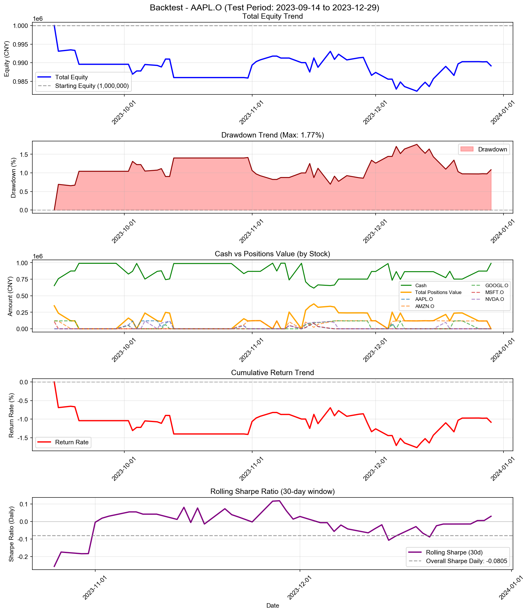

# Backtest

**策略名称:** 层级式多资产交易系统（无反思层）  
**回测期间:** 2023-01-03 至 2023-12-29  
**交易日数:** 75  
**组合股票数:** 5 支  
**初始资金:** 1000000.00 元

---

## 组合整体表现

| 项目 | 数值 |
|------|------|
| 初始资金 | 1000000.00 元 |
| 最终现金 | 989156.13 元 |
| 最终持仓市值 | 0.00 元 |
| 最终总权益 | 989156.13 元 |
| 总盈亏 | -10843.87 元 |
| 总收益率 | -1.08% |
| 年化收益率 (CAGR) | -3.60% |

---

## 参数θ追踪

### 初始参数

| 参数 | 数值 |
|------|------|
| 总仓位上限 (gross_exposure) | 0.70 |
| 单票上限 (max_w) | 0.15 |
| 换手上限 (turnover_cap) | 0.20 |
| 风险模式 (risk_mode) | neutral |
| 进场阈值 (enter_th) | 0.020 |
| 出场阈值 (exit_th) | -0.100 |

### 最终参数

| 参数 | 数值 |
|------|------|
| 总仓位上限 (gross_exposure) | 0.70 |
| 单票上限 (max_w) | 0.15 |
| 换手上限 (turnover_cap) | 0.20 |
| 风险模式 (risk_mode) | neutral |
| 进场阈值 (enter_th) | 0.020 |
| 出场阈值 (exit_th) | -0.100 |

### 参数变化趋势图

---

## 持仓明细

(无持仓)

---

## 交易统计

| 项目 | 数值 |
|------|------|
| 总交易次数 | 88 次 |
| 买入次数 | 50 次 |
| 卖出次数 | 38 次 |
| 买入总成本 | 2848506.15 元 |
| 卖出总收入 | 2837662.28 元 |
| 已实现盈亏 | -10843.87 元 |

### 交易质量指标

| 指标 | 数值 |
|------|------|
| 胜率 (Hit Rate) | 36.84% |
| 盈亏比 (Profit Factor) | 0.61 |
| 单笔平均收益 | -285.36 元 |
| 平均持仓周期 | 5.7 天 |

---

## 风险与稳健性

| 指标 | 数值 |
|------|------|
| 最大回撤 (Max Drawdown) | 1.77% |
| 年化波动率 (Volatility) | 2.87% |
| 年化夏普比率 (Sharpe) | -1.2777 |
| 日频夏普比率 (Sharpe Daily) | -0.0805 |
| 年化 Sortino 比率 | -0.9695 |
| 日频 Sortino 比率 | -0.0611 |
| Calmar 比率 (CAGR/MaxDD) | -2.0357 |
### 尾部风险 (Tail Risk)

| 指标 | 数值 |
|------|------|
| VaR 95% | -0.27% |
| VaR 99% | -0.69% |
| CVaR 95% | -0.46% |
| CVaR 99% | -0.69% |
| 极端日跌幅 (5%分位) | -0.38% |
| 极端日跌幅 (1%分位) | -0.69% |

---

## 执行与成本

| 指标 | 数值 |
|------|------|
| 换手率 (Turnover) | 287.57% |
| 交易频率 (每日) | 1.17 次/日 |
| 交易频率 (每周) | 5.87 次/周 |

---

## 各股票表现分析

---

## 策略参数

---

## 交易记录

| 序号 | 日期 | 类型 | 股票代码 | 股数 | 价格 | 成本/收入 | 利润 |
|------|------|------|----------|------|------|-----------|------|
| 1 | 2023-09-14 | 买入 | MSFT.O | 69 | 1570.22 | 108345.44 | - |
| 2 | 2023-09-14 | 买入 | GOOGL.O | 2174 | 55.19 | 119975.66 | - |
| 3 | 2023-09-14 | 买入 | AMZN.O | 345 | 347.33 | 119828.16 | - |
| 4 | 2023-09-15 | 卖出 | MSFT.O | 69 | 1530.91 | 105632.81 | -2712.63 |
| 5 | 2023-09-18 | 卖出 | AMZN.O | 345 | 335.95 | 115903.44 | -3924.72 |
| 6 | 2023-09-20 | 卖出 | GOOGL.O | 2174 | 53.44 | 116187.87 | -3787.79 |
| 7 | 2023-10-02 | 买入 | AAPL.O | 113 | 501.92 | 56717.51 | - |
| 8 | 2023-10-02 | 买入 | GOOGL.O | 924 | 53.62 | 49541.29 | - |
| 9 | 2023-10-02 | 买入 | NVDA.O | 239 | 234.29 | 55995.42 | - |
| 10 | 2023-10-03 | 买入 | AAPL.O | 124 | 498.03 | 61755.11 | - |
| 11 | 2023-10-03 | 卖出 | GOOGL.O | 924 | 52.92 | 48898.81 | -642.48 |
| 12 | 2023-10-03 | 卖出 | NVDA.O | 239 | 227.67 | 54413.66 | -1581.76 |
| 13 | 2023-10-04 | 卖出 | AAPL.O | 237 | 501.66 | 118894.58 | +421.96 |
| 14 | 2023-10-05 | 买入 | AAPL.O | 234 | 505.28 | 118234.55 | - |
| 15 | 2023-10-06 | 买入 | NVDA.O | 495 | 239.42 | 118511.71 | - |
| 16 | 2023-10-09 | 卖出 | NVDA.O | 495 | 236.86 | 117245.33 | -1266.38 |
| 17 | 2023-10-10 | 卖出 | AAPL.O | 186 | 515.33 | 95851.16 | +1869.85 |
| 18 | 2023-10-10 | 买入 | NVDA.O | 366 | 239.61 | 87695.78 | - |
| 19 | 2023-10-11 | 买入 | AAPL.O | 111 | 519.40 | 57653.62 | - |
| 20 | 2023-10-11 | 买入 | GOOGL.O | 1154 | 56.17 | 64815.16 | - |
| 21 | 2023-10-11 | 买入 | NVDA.O | 47 | 244.88 | 11509.34 | - |
| 22 | 2023-10-12 | 买入 | AAPL.O | 68 | 522.03 | 35498.09 | - |
| 23 | 2023-10-12 | 卖出 | GOOGL.O | 1154 | 55.53 | 64086.54 | -728.62 |
| 24 | 2023-10-12 | 买入 | NVDA.O | 71 | 245.61 | 17438.08 | - |
| 25 | 2023-10-13 | 卖出 | AAPL.O | 227 | 516.66 | 117281.29 | -123.67 |
| 26 | 2023-10-13 | 卖出 | NVDA.O | 484 | 237.84 | 115115.93 | -1527.27 |
| 27 | 2023-10-30 | 买入 | AAPL.O | 93 | 491.93 | 45749.46 | - |
| 28 | 2023-10-30 | 买入 | AMZN.O | 190 | 318.50 | 60515.76 | - |
| 29 | 2023-10-30 | 买入 | NVDA.O | 214 | 215.35 | 46084.06 | - |
| 30 | 2023-10-31 | 卖出 | AAPL.O | 93 | 493.32 | 45878.42 | +128.95 |
| 31 | 2023-10-31 | 买入 | AMZN.O | 180 | 319.42 | 57494.88 | - |
| 32 | 2023-10-31 | 卖出 | NVDA.O | 214 | 213.35 | 45657.49 | -426.57 |
| 33 | 2023-11-06 | 卖出 | AMZN.O | 370 | 335.38 | 124089.12 | +6078.48 |
| 34 | 2023-11-07 | 买入 | AMZN.O | 347 | 342.50 | 118848.89 | - |
| 35 | 2023-11-08 | 卖出 | AMZN.O | 347 | 340.99 | 118324.22 | -524.66 |
| 36 | 2023-11-10 | 买入 | AAPL.O | 90 | 539.18 | 48525.96 | - |
| 37 | 2023-11-10 | 买入 | MSFT.O | 29 | 1713.80 | 49700.25 | - |
| 38 | 2023-11-10 | 买入 | AMZN.O | 305 | 344.54 | 105085.92 | - |
| 39 | 2023-11-10 | 买入 | NVDA.O | 197 | 252.88 | 49817.17 | - |
| 40 | 2023-11-13 | 卖出 | AAPL.O | 90 | 534.55 | 48109.43 | -416.53 |
| 41 | 2023-11-13 | 卖出 | MSFT.O | 29 | 1699.94 | 49298.26 | -401.99 |
| 42 | 2023-11-13 | 卖出 | AMZN.O | 305 | 342.22 | 104375.88 | -710.04 |
| 43 | 2023-11-13 | 卖出 | NVDA.O | 197 | 254.37 | 50110.91 | +293.74 |
| 44 | 2023-11-14 | 买入 | AAPL.O | 35 | 542.19 | 18976.50 | - |
| 45 | 2023-11-14 | 买入 | MSFT.O | 11 | 1716.58 | 18882.42 | - |
| 46 | 2023-11-14 | 买入 | GOOGL.O | 1132 | 53.40 | 60444.65 | - |
| 47 | 2023-11-14 | 买入 | AMZN.O | 290 | 349.92 | 101476.80 | - |
| 48 | 2023-11-14 | 买入 | NVDA.O | 308 | 259.79 | 80015.39 | - |
| 49 | 2023-11-15 | 买入 | AAPL.O | 60 | 543.83 | 32630.06 | - |
| 50 | 2023-11-15 | 买入 | MSFT.O | 24 | 1717.28 | 41214.72 | - |
| 51 | 2023-11-15 | 买入 | GOOGL.O | 338 | 53.80 | 18183.03 | - |
| 52 | 2023-11-15 | 卖出 | AMZN.O | 115 | 343.68 | 39523.20 | -717.60 |
| 53 | 2023-11-15 | 买入 | NVDA.O | 35 | 255.77 | 8952.03 | - |
| 54 | 2023-11-16 | 买入 | AAPL.O | 53 | 548.75 | 29083.84 | - |
| 55 | 2023-11-16 | 买入 | MSFT.O | 12 | 1747.48 | 20969.71 | - |
| 56 | 2023-11-16 | 买入 | GOOGL.O | 255 | 54.72 | 13953.36 | - |
| 57 | 2023-11-16 | 卖出 | AMZN.O | 112 | 342.79 | 38392.70 | -798.34 |
| 58 | 2023-11-16 | 买入 | NVDA.O | 33 | 258.87 | 8542.69 | - |
| 59 | 2023-11-17 | 卖出 | AAPL.O | 88 | 548.69 | 48285.06 | +306.99 |
| 60 | 2023-11-17 | 卖出 | MSFT.O | 27 | 1718.12 | 46389.14 | -181.18 |
| 61 | 2023-11-17 | 买入 | AMZN.O | 131 | 348.43 | 45644.59 | - |
| 62 | 2023-11-20 | 卖出 | AAPL.O | 50 | 553.78 | 27689.24 | +428.97 |
| 63 | 2023-11-20 | 卖出 | MSFT.O | 16 | 1753.38 | 28054.00 | +456.78 |
| 64 | 2023-11-20 | 买入 | GOOGL.O | 310 | 54.45 | 16878.67 | - |
| 65 | 2023-11-20 | 买入 | AMZN.O | 108 | 350.71 | 37876.90 | - |
| 66 | 2023-11-20 | 买入 | NVDA.O | 44 | 263.73 | 11604.11 | - |
| 67 | 2023-11-21 | 卖出 | AAPL.O | 10 | 551.44 | 5514.42 | +62.36 |
| 68 | 2023-11-21 | 卖出 | MSFT.O | 4 | 1733.07 | 6932.30 | +32.99 |
| 69 | 2023-11-21 | 买入 | GOOGL.O | 137 | 54.74 | 7498.70 | - |
| 70 | 2023-11-21 | 买入 | AMZN.O | 42 | 345.36 | 14505.12 | - |
| 71 | 2023-11-21 | 卖出 | NVDA.O | 70 | 261.30 | 18290.79 | +105.09 |
| 72 | 2023-11-22 | 卖出 | NVDA.O | 350 | 254.87 | 89205.32 | -1723.20 |
| 73 | 2023-11-30 | 卖出 | GOOGL.O | 2172 | 52.96 | 115030.75 | -1927.65 |
| 74 | 2023-12-04 | 卖出 | AMZN.O | 344 | 347.62 | 119579.90 | -491.66 |
| 75 | 2023-12-05 | 买入 | AAPL.O | 145 | 559.48 | 81125.07 | - |
| 76 | 2023-12-05 | 买入 | GOOGL.O | 1151 | 52.35 | 60249.49 | - |
| 77 | 2023-12-05 | 买入 | AMZN.O | 314 | 352.51 | 110688.77 | - |
| 78 | 2023-12-06 | 卖出 | AAPL.O | 145 | 556.30 | 80663.70 | -461.37 |
| 79 | 2023-12-06 | 卖出 | GOOGL.O | 1151 | 51.96 | 59803.34 | -446.16 |
| 80 | 2023-12-06 | 买入 | AMZN.O | 26 | 346.85 | 9018.05 | - |
| 81 | 2023-12-07 | 买入 | GOOGL.O | 2159 | 54.72 | 118138.43 | - |
| 82 | 2023-12-08 | 卖出 | GOOGL.O | 2159 | 53.94 | 116464.66 | -1673.76 |
| 83 | 2023-12-18 | 卖出 | AMZN.O | 19 | 369.77 | 7025.59 | +336.09 |
| 84 | 2023-12-18 | 买入 | NVDA.O | 375 | 262.02 | 98255.94 | - |
| 85 | 2023-12-19 | 卖出 | NVDA.O | 375 | 259.54 | 97327.87 | -928.07 |
| 86 | 2023-12-20 | 买入 | GOOGL.O | 2141 | 55.28 | 118359.84 | - |
| 87 | 2023-12-26 | 卖出 | GOOGL.O | 2141 | 56.55 | 121080.56 | +2720.72 |
| 88 | 2023-12-29 | 卖出 | AMZN.O | 321 | 364.66 | 117054.58 | +4037.26 |

---

## 走势图

---

*报告生成时间: 2025-12-25 15:18:12*