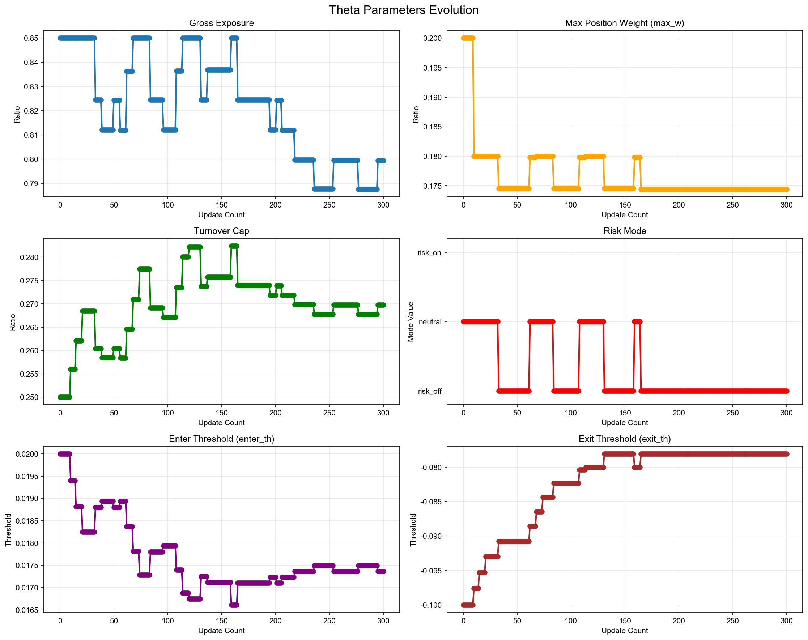
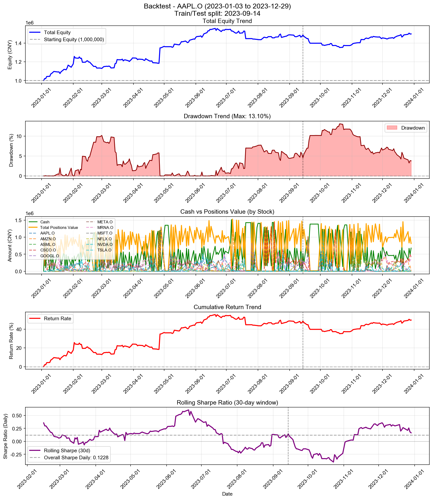

# Backtest

**策略名称:** 层级式多资产交易系统（带每周反思层）  
**回测期间:** 2023-01-03 至 2023-12-29  
**交易日数:** 250  
**组合股票数:** 20 支  
**初始资金:** 1000000.00 元

---

## 组合整体表现

| 项目 | 数值 |
|------|------|
| 初始资金 | 1000000.00 元 |
| 最终现金 | 681248.99 元 |
| 最终持仓市值 | 816192.83 元 |
| 最终总权益 | 1497441.82 元 |
| 总盈亏 | +497441.82 元 |
| 总收益率 | +49.74% |
| 年化收益率 (CAGR) | +50.23% |

---

## 参数θ追踪

### 初始参数

| 参数 | 数值 |
|------|------|
| 总仓位上限 (gross_exposure) | 0.85 |
| 单票上限 (max_w) | 0.20 |
| 换手上限 (turnover_cap) | 0.25 |
| 风险模式 (risk_mode) | neutral |
| 进场阈值 (enter_th) | 0.020 |
| 出场阈值 (exit_th) | -0.100 |

### 最终参数

| 参数 | 数值 |
|------|------|
| 总仓位上限 (gross_exposure) | 0.85 |
| 单票上限 (max_w) | 0.20 |
| 换手上限 (turnover_cap) | 0.26 |
| 风险模式 (risk_mode) | neutral |
| 进场阈值 (enter_th) | 0.017 |
| 出场阈值 (exit_th) | -0.080 |

### 参数变化趋势图

---

## 持仓明细

| 股票代码 | 股数 | 成本价 | 现价 | 市值 | 权重 | 盈亏 | 收益率 | 贡献度 |
|----------|------|--------|------|------|------|------|--------|--------|
| AAPL.O | 1 | 559.34 | 556.91 | 556.91 | 0.04% | -2.43 | -0.43% | -0.00% |
| MSFT.O | 1 | 1717.63 | 1746.87 | 1746.87 | 0.12% | +29.24 | +1.70% | 0.00% |
| GOOGL.O | 76 | 56.02 | 55.82 | 4242.47 | 0.28% | -15.02 | -0.35% | -0.00% |
| NVDA.O | 2 | 261.98 | 259.11 | 518.22 | 0.03% | -5.73 | -1.09% | -0.00% |
| META.O | 672 | 3.54 | 3.54 | 2378.61 | 0.16% | -1.85 | -0.08% | -0.00% |
| ASML.O | 77 | 95.85 | 96.07 | 7397.12 | 0.49% | +16.69 | +0.23% | 0.00% |
| MRNA.O | 385396 | 0.98 | 0.99 | 383276.32 | 25.60% | +5967.55 | +1.58% | 0.40% |
| NFLX.O | 1 | 66.17 | 68.16 | 68.16 | 0.00% | +1.99 | +3.01% | 0.00% |
| CSCO.O | 1970 | 210.58 | 211.17 | 416008.13 | 27.78% | +1158.26 | +0.28% | 0.08% |

### 权重分布

| 股票代码 | 权重 | 市值占比 |
|----------|------|----------|
| AAPL.O | 0.04% | 0.04% |
| MSFT.O | 0.12% | 0.12% |
| GOOGL.O | 0.28% | 0.28% |
| NVDA.O | 0.03% | 0.03% |
| META.O | 0.16% | 0.16% |
| ASML.O | 0.49% | 0.49% |
| MRNA.O | 25.60% | 25.60% |
| NFLX.O | 0.00% | 0.00% |
| CSCO.O | 27.78% | 27.78% |

---

## 交易统计

| 项目 | 数值 |
|------|------|
| 总交易次数 | 2063 次 |
| 买入次数 | 1175 次 |
| 卖出次数 | 888 次 |
| 买入总成本 | 103026142.46 元 |
| 卖出总收入 | 102707391.45 元 |
| 已实现盈亏 | +490293.10 元 |

### 交易质量指标

| 指标 | 数值 |
|------|------|
| 胜率 (Hit Rate) | 58.45% |
| 盈亏比 (Profit Factor) | 1.66 |
| 单笔平均收益 | +552.13 元 |
| 平均持仓周期 | 4.2 天 |

---

## 风险与稳健性

| 指标 | 数值 |
|------|------|
| 最大回撤 (Max Drawdown) | 13.10% |
| 年化波动率 (Volatility) | 22.19% |
| 年化夏普比率 (Sharpe) | 1.9497 |
| 日频夏普比率 (Sharpe Daily) | 0.1228 |
| 年化 Sortino 比率 | 2.5542 |
| 日频 Sortino 比率 | 0.1609 |
| Calmar 比率 (CAGR/MaxDD) | 3.8346 |
### 尾部风险 (Tail Risk)

| 指标 | 数值 |
|------|------|
| VaR 95% | -1.48% |
| VaR 99% | -3.48% |
| CVaR 95% | -2.32% |
| CVaR 99% | -4.19% |
| 极端日跌幅 (5%分位) | -1.52% |
| 极端日跌幅 (1%分位) | -3.88% |

---

## 执行与成本

| 指标 | 数值 |
|------|------|
| 换手率 (Turnover) | 7570.58% |
| 交易频率 (每日) | 8.25 次/日 |
| 交易频率 (每周) | 41.26 次/周 |

---

## 各股票表现分析

| 股票代码 | 初始权重 | 最终权重 | 收益率 | 盈亏 | 交易次数 | 贡献度 |
|----------|----------|----------|--------|------|----------|--------|
| AAPL.O | 765.92% | 0.04% | -0.43% | -2.43 | 178 | -0.00% |
| MSFT.O | 235.02% | 0.12% | +1.70% | +29.24 | 109 | 0.00% |
| GOOGL.O | 1023.48% | 0.28% | -0.35% | -15.02 | 197 | -0.00% |
| NVDA.O | 729.62% | 0.03% | -1.09% | -5.73 | 185 | -0.00% |
| META.O | 1421.82% | 0.16% | -0.08% | -1.85 | 240 | -0.00% |
| ASML.O | 169.74% | 0.49% | +0.23% | +16.69 | 75 | 0.00% |
| MRNA.O | 858.50% | 25.60% | +1.58% | +5967.55 | 203 | 0.40% |
| NFLX.O | 996.62% | 0.00% | +3.01% | +1.99 | 154 | 0.00% |
| CSCO.O | 1588.29% | 27.78% | +0.28% | +1158.26 | 237 | 0.08% |

---

## 策略参数

---

## 交易记录

| 序号 | 日期 | 类型 | 股票代码 | 股数 | 价格 | 成本/收入 | 利润 |
|------|------|------|----------|------|------|-----------|------|
| 1 | 2023-01-03 | 买入 | META.O | 128266 | 1.25 | 159999.01 | - |
| 2 | 2023-01-03 | 买入 | META.O | 673401 | 1.25 | 840000.41 | - |
| 3 | 2023-01-04 | 卖出 | META.O | 673400 | 1.27 | 857709.58 | +17710.42 |
| 4 | 2023-01-05 | 买入 | META.O | 595286 | 1.27 | 755656.05 | - |
| 5 | 2023-01-06 | 买入 | AMZN.O | 235 | 206.59 | 48549.12 | - |
| 6 | 2023-01-06 | 卖出 | META.O | 607231 | 1.30 | 789521.75 | +21070.93 |
| 7 | 2023-01-06 | 买入 | MRNA.O | 49237 | 1.80 | 88798.93 | - |
| 8 | 2023-01-06 | 买入 | CSCO.O | 282 | 197.53 | 55704.73 | - |
| 9 | 2023-01-09 | 买入 | AMZN.O | 132 | 209.66 | 27675.65 | - |
| 10 | 2023-01-09 | 买入 | TSLA.O | 1734 | 17.97 | 31152.18 | - |
| 11 | 2023-01-09 | 买入 | ASML.O | 425 | 78.08 | 33183.51 | - |
| 12 | 2023-01-09 | 买入 | MRNA.O | 19943 | 1.84 | 36685.15 | - |
| 13 | 2023-01-09 | 卖出 | CSCO.O | 188 | 198.60 | 37336.31 | +199.82 |
| 14 | 2023-01-09 | 买入 | AMZN.O | 501 | 209.66 | 105041.66 | - |
| 15 | 2023-01-09 | 买入 | TSLA.O | 2366 | 17.97 | 42506.37 | - |
| 16 | 2023-01-09 | 买入 | META.O | 156015 | 1.29 | 201992.62 | - |
| 17 | 2023-01-09 | 买入 | ASML.O | 580 | 78.08 | 45285.74 | - |
| 18 | 2023-01-09 | 买入 | MRNA.O | 94368 | 1.84 | 173589.94 | - |
| 19 | 2023-01-09 | 买入 | CSCO.O | 127 | 198.60 | 25221.87 | - |
| 20 | 2023-01-10 | 买入 | GOOGL.O | 382 | 35.33 | 13497.51 | - |
| 21 | 2023-01-10 | 卖出 | AMZN.O | 252 | 215.69 | 54353.38 | +1727.64 |
| 22 | 2023-01-10 | 买入 | NVDA.O | 186 | 83.20 | 15475.78 | - |
| 23 | 2023-01-10 | 卖出 | TSLA.O | 3588 | 17.83 | 63965.07 | -495.14 |
| 24 | 2023-01-10 | 卖出 | META.O | 156964 | 1.33 | 208746.42 | +7482.80 |
| 25 | 2023-01-10 | 卖出 | ASML.O | 626 | 79.59 | 49826.07 | +948.71 |
| 26 | 2023-01-10 | 卖出 | MRNA.O | 85854 | 1.90 | 162822.11 | +5824.16 |
| 27 | 2023-01-10 | 卖出 | CSCO.O | 193 | 199.54 | 38510.77 | +268.72 |
| 28 | 2023-01-11 | 买入 | MSFT.O | 19 | 1085.63 | 20626.96 | - |
| 29 | 2023-01-11 | 买入 | GOOGL.O | 2225 | 36.57 | 81374.06 | - |
| 30 | 2023-01-11 | 卖出 | NVDA.O | 109 | 83.68 | 9121.58 | +52.45 |
| 31 | 2023-01-11 | 买入 | TSLA.O | 606 | 18.48 | 11200.70 | - |
| 32 | 2023-01-11 | 卖出 | META.O | 4498 | 1.33 | 5977.39 | +209.93 |
| 33 | 2023-01-11 | 卖出 | ASML.O | 225 | 81.01 | 18227.95 | +660.21 |
| 34 | 2023-01-11 | 卖出 | MRNA.O | 32217 | 1.87 | 60129.81 | +1215.80 |
| 35 | 2023-01-11 | 买入 | MSFT.O | 17 | 1085.63 | 18455.70 | - |
| 36 | 2023-01-11 | 买入 | GOOGL.O | 2240 | 36.57 | 81922.65 | - |
| 37 | 2023-01-11 | 买入 | AMZN.O | 522 | 228.22 | 119128.75 | - |
| 38 | 2023-01-11 | 买入 | NVDA.O | 65 | 83.68 | 5439.48 | - |
| 39 | 2023-01-11 | 买入 | TSLA.O | 961 | 18.48 | 17762.16 | - |
| 40 | 2023-01-11 | 买入 | META.O | 95240 | 1.33 | 126564.44 | - |
| 41 | 2023-01-11 | 买入 | ASML.O | 131 | 81.01 | 10612.72 | - |
| 42 | 2023-01-11 | 买入 | MRNA.O | 39064 | 1.87 | 72909.05 | - |
| 43 | 2023-01-12 | 卖出 | MSFT.O | 30 | 1098.25 | 32947.38 | +378.50 |
| 44 | 2023-01-12 | 卖出 | GOOGL.O | 2662 | 36.42 | 96941.42 | -154.97 |
| 45 | 2023-01-12 | 卖出 | AMZN.O | 473 | 228.65 | 108150.50 | +5167.25 |
| 46 | 2023-01-12 | 买入 | NVDA.O | 439 | 86.35 | 37908.32 | - |
| 47 | 2023-01-12 | 卖出 | TSLA.O | 1759 | 18.53 | 32601.31 | +313.89 |
| 48 | 2023-01-12 | 卖出 | META.O | 93155 | 1.37 | 127352.20 | +5897.29 |
| 49 | 2023-01-12 | 卖出 | ASML.O | 241 | 82.00 | 19762.81 | +620.76 |
| 50 | 2023-01-12 | 卖出 | MRNA.O | 12277 | 1.88 | 23088.13 | +423.56 |
| 51 | 2023-01-13 | 卖出 | MSFT.O | 5 | 1101.56 | 5507.81 | +79.66 |
| 52 | 2023-01-13 | 买入 | GOOGL.O | 1704 | 36.81 | 62728.29 | - |
| 53 | 2023-01-13 | 买入 | AMZN.O | 40 | 235.49 | 9419.52 | - |
| 54 | 2023-01-13 | 买入 | NVDA.O | 279 | 88.38 | 24658.22 | - |
| 55 | 2023-01-13 | 卖出 | META.O | 23330 | 1.37 | 31957.43 | +1539.92 |
| 56 | 2023-01-13 | 买入 | MRNA.O | 13021 | 1.92 | 25000.32 | - |
| 57 | 2023-01-13 | 卖出 | CSCO.O | 27 | 199.82 | 5395.24 | +45.32 |
| 58 | 2023-01-13 | 买入 | GOOGL.O | 2212 | 36.81 | 81428.98 | - |
| 59 | 2023-01-13 | 买入 | AMZN.O | 401 | 235.49 | 94430.69 | - |
| 60 | 2023-01-13 | 买入 | NVDA.O | 489 | 88.38 | 43218.18 | - |
| 61 | 2023-01-13 | 买入 | META.O | 50984 | 1.37 | 69837.88 | - |
| 62 | 2023-01-13 | 买入 | MRNA.O | 48513 | 1.92 | 93144.96 | - |
| 63 | 2023-01-17 | 卖出 | GOOGL.O | 4095 | 36.48 | 149388.46 | -863.40 |
| 64 | 2023-01-17 | 卖出 | AMZN.O | 738 | 230.52 | 170123.76 | +4216.29 |
| 65 | 2023-01-17 | 卖出 | NVDA.O | 929 | 92.58 | 86007.17 | +4999.72 |
| 66 | 2023-01-17 | 买入 | TSLA.O | 2874 | 19.72 | 56685.34 | - |
| 67 | 2023-01-17 | 卖出 | META.O | 94284 | 1.35 | 127622.82 | +2439.47 |
| 68 | 2023-01-17 | 卖出 | MRNA.O | 57125 | 1.91 | 108931.66 | +1531.72 |
| 69 | 2023-01-18 | 卖出 | GOOGL.O | 1534 | 36.41 | 55857.18 | -427.64 |
| 70 | 2023-01-18 | 卖出 | AMZN.O | 281 | 229.10 | 64378.22 | +1207.49 |
| 71 | 2023-01-18 | 卖出 | NVDA.O | 319 | 90.88 | 28990.93 | +1174.59 |
| 72 | 2023-01-18 | 卖出 | TSLA.O | 2428 | 19.32 | 46901.68 | -654.22 |
| 73 | 2023-01-18 | 卖出 | META.O | 35260 | 1.33 | 46902.85 | +87.22 |
| 74 | 2023-01-18 | 买入 | MRNA.O | 3449 | 1.97 | 6795.22 | - |
| 75 | 2023-01-18 | 买入 | GOOGL.O | 1025 | 36.41 | 37323.08 | - |
| 76 | 2023-01-18 | 买入 | AMZN.O | 189 | 229.10 | 43300.66 | - |
| 77 | 2023-01-18 | 买入 | NVDA.O | 218 | 90.88 | 19811.98 | - |
| 78 | 2023-01-18 | 买入 | TSLA.O | 1665 | 19.32 | 32162.81 | - |
| 79 | 2023-01-18 | 买入 | META.O | 24071 | 1.33 | 32019.24 | - |
| 80 | 2023-01-18 | 买入 | MRNA.O | 174223 | 1.97 | 343254.15 | - |
| 81 | 2023-01-19 | 买入 | GOOGL.O | 1718 | 37.18 | 63882.14 | - |
| 82 | 2023-01-19 | 卖出 | AMZN.O | 252 | 224.83 | 56657.66 | -735.20 |
| 83 | 2023-01-19 | 卖出 | NVDA.O | 291 | 87.68 | 25514.86 | -592.16 |
| 84 | 2023-01-19 | 卖出 | TSLA.O | 2229 | 19.08 | 42519.29 | -727.55 |
| 85 | 2023-01-19 | 卖出 | META.O | 32325 | 1.36 | 44010.49 | +1036.96 |
| 86 | 2023-01-19 | 卖出 | MRNA.O | 232759 | 1.90 | 443126.58 | -9132.31 |
| 87 | 2023-01-19 | 买入 | GOOGL.O | 4357 | 37.18 | 162010.77 | - |
| 88 | 2023-01-19 | 买入 | AMZN.O | 31 | 224.83 | 6969.79 | - |
| 89 | 2023-01-19 | 买入 | MRNA.O | 29251 | 1.90 | 55688.05 | - |
| 90 | 2023-01-20 | 卖出 | GOOGL.O | 4313 | 39.17 | 168940.63 | +9148.65 |
| 91 | 2023-01-20 | 买入 | AMZN.O | 51 | 233.40 | 11903.40 | - |
| 92 | 2023-01-20 | 买入 | NVDA.O | 142 | 93.30 | 13248.16 | - |
| 93 | 2023-01-20 | 买入 | TSLA.O | 1486 | 20.01 | 29739.32 | - |
| 94 | 2023-01-20 | 买入 | META.O | 32537 | 1.39 | 45346.82 | - |
| 95 | 2023-01-20 | 卖出 | MRNA.O | 12940 | 1.94 | 25101.01 | +250.26 |
| 96 | 2023-01-20 | 买入 | NFLX.O | 871 | 47.95 | 41764.45 | - |
| 97 | 2023-01-20 | 买入 | GOOGL.O | 4973 | 39.17 | 194792.89 | - |
| 98 | 2023-01-20 | 买入 | AMZN.O | 162 | 233.40 | 37810.80 | - |
| 99 | 2023-01-20 | 买入 | NVDA.O | 260 | 93.30 | 24257.19 | - |
| 100 | 2023-01-20 | 买入 | TSLA.O | 2576 | 20.01 | 51553.49 | - |
| 101 | 2023-01-20 | 买入 | META.O | 53953 | 1.39 | 75194.30 | - |
| 102 | 2023-01-20 | 买入 | MRNA.O | 57834 | 1.94 | 112186.39 | - |
| 103 | 2023-01-20 | 买入 | NFLX.O | 1329 | 47.95 | 63725.55 | - |
| 104 | 2023-01-23 | 买入 | AAPL.O | 126 | 405.90 | 51143.84 | - |
| 105 | 2023-01-23 | 卖出 | GOOGL.O | 5962 | 39.88 | 237749.13 | +9223.68 |
| 106 | 2023-01-23 | 卖出 | AMZN.O | 140 | 234.05 | 32766.72 | +300.31 |
| 107 | 2023-01-23 | 卖出 | TSLA.O | 1416 | 21.56 | 30532.50 | +2235.08 |
| 108 | 2023-01-23 | 卖出 | META.O | 28951 | 1.43 | 41478.10 | +1187.77 |
| 109 | 2023-01-23 | 买入 | ASML.O | 221 | 84.95 | 18774.54 | - |
| 110 | 2023-01-23 | 卖出 | MRNA.O | 66624 | 1.97 | 131209.31 | +2482.16 |
| 111 | 2023-01-23 | 卖出 | NFLX.O | 1249 | 50.04 | 62498.46 | +2608.91 |
| 112 | 2023-01-23 | 买入 | GOOGL.O | 227 | 39.88 | 9052.17 | - |
| 113 | 2023-01-23 | 买入 | TSLA.O | 285 | 21.56 | 6145.31 | - |
| 114 | 2023-01-23 | 买入 | META.O | 6057 | 1.43 | 8677.86 | - |
| 115 | 2023-01-23 | 买入 | MRNA.O | 2921 | 1.97 | 5752.62 | - |
| 116 | 2023-01-24 | 买入 | AAPL.O | 91 | 409.99 | 37308.92 | - |
| 117 | 2023-01-24 | 买入 | MSFT.O | 20 | 1114.50 | 22290.01 | - |
| 118 | 2023-01-24 | 卖出 | GOOGL.O | 1229 | 39.04 | 47982.89 | +702.06 |
| 119 | 2023-01-24 | 买入 | NVDA.O | 232 | 100.75 | 23375.11 | - |
| 120 | 2023-01-24 | 买入 | TSLA.O | 493 | 21.58 | 10640.67 | - |
| 121 | 2023-01-24 | 卖出 | META.O | 6993 | 1.43 | 10009.78 | +251.64 |
| 122 | 2023-01-24 | 买入 | NFLX.O | 229 | 50.94 | 11664.39 | - |
| 123 | 2023-01-24 | 买入 | CSCO.O | 69 | 195.45 | 13486.02 | - |
| 124 | 2023-01-24 | 买入 | AAPL.O | 182 | 409.99 | 74617.84 | - |
| 125 | 2023-01-24 | 买入 | MSFT.O | 18 | 1114.50 | 20061.01 | - |
| 126 | 2023-01-24 | 买入 | GOOGL.O | 1064 | 39.04 | 41540.92 | - |
| 127 | 2023-01-24 | 买入 | AMZN.O | 117 | 231.17 | 27046.66 | - |
| 128 | 2023-01-24 | 买入 | NVDA.O | 557 | 100.75 | 56120.41 | - |
| 129 | 2023-01-24 | 买入 | TSLA.O | 3047 | 21.58 | 65764.92 | - |
| 130 | 2023-01-24 | 买入 | META.O | 49929 | 1.43 | 71468.37 | - |
| 131 | 2023-01-24 | 买入 | ASML.O | 177 | 84.20 | 14902.72 | - |
| 132 | 2023-01-24 | 买入 | MRNA.O | 26568 | 1.97 | 52275.20 | - |
| 133 | 2023-01-24 | 买入 | NFLX.O | 991 | 50.94 | 50477.77 | - |
| 134 | 2023-01-24 | 买入 | CSCO.O | 59 | 195.45 | 11531.53 | - |
| 135 | 2023-01-25 | 卖出 | AAPL.O | 144 | 408.06 | 58760.76 | -91.78 |
| 136 | 2023-01-25 | 卖出 | MSFT.O | 15 | 1107.92 | 16618.74 | -87.66 |
| 137 | 2023-01-25 | 卖出 | GOOGL.O | 1892 | 38.05 | 71992.83 | -1287.38 |
| 138 | 2023-01-25 | 卖出 | NVDA.O | 326 | 101.06 | 32944.94 | +983.34 |
| 139 | 2023-01-25 | 卖出 | TSLA.O | 1756 | 21.66 | 38042.86 | +1342.52 |
| 140 | 2023-01-25 | 卖出 | META.O | 64591 | 1.42 | 91396.26 | +203.72 |
| 141 | 2023-01-25 | 卖出 | MRNA.O | 33746 | 1.93 | 65153.40 | -653.90 |
| 142 | 2023-01-25 | 卖出 | NFLX.O | 1092 | 51.51 | 56253.72 | +2059.84 |
| 143 | 2023-01-26 | 买入 | AAPL.O | 19 | 414.10 | 7867.93 | - |
| 144 | 2023-01-26 | 买入 | MSFT.O | 38 | 1141.94 | 43393.87 | - |
| 145 | 2023-01-26 | 买入 | GOOGL.O | 181 | 38.97 | 7053.62 | - |
| 146 | 2023-01-26 | 卖出 | TSLA.O | 748 | 24.04 | 17982.29 | +2349.12 |
| 147 | 2023-01-26 | 买入 | META.O | 28828 | 1.47 | 42463.64 | - |
| 148 | 2023-01-26 | 卖出 | ASML.O | 208 | 85.94 | 17875.86 | +383.12 |
| 149 | 2023-01-26 | 卖出 | MRNA.O | 5712 | 1.93 | 11037.87 | -100.97 |
| 150 | 2023-01-26 | 卖出 | NFLX.O | 537 | 51.08 | 27430.93 | +780.63 |
| 151 | 2023-01-26 | 买入 | AAPL.O | 148 | 414.10 | 61287.02 | - |
| 152 | 2023-01-26 | 买入 | MSFT.O | 33 | 1141.94 | 37684.15 | - |
| 153 | 2023-01-26 | 买入 | GOOGL.O | 336 | 38.97 | 13094.02 | - |
| 154 | 2023-01-26 | 买入 | AMZN.O | 143 | 238.13 | 34052.30 | - |
| 155 | 2023-01-26 | 买入 | NVDA.O | 479 | 103.56 | 49606.79 | - |
| 156 | 2023-01-26 | 买入 | TSLA.O | 2257 | 24.04 | 54259.41 | - |
| 157 | 2023-01-26 | 买入 | META.O | 39849 | 1.47 | 58697.58 | - |
| 158 | 2023-01-26 | 买入 | ASML.O | 126 | 85.94 | 10828.65 | - |
| 159 | 2023-01-26 | 买入 | MRNA.O | 10363 | 1.93 | 20025.46 | - |
| 160 | 2023-01-26 | 买入 | NFLX.O | 293 | 51.08 | 14966.97 | - |
| 161 | 2023-01-26 | 买入 | CSCO.O | 69 | 197.62 | 13635.52 | - |
| 162 | 2023-01-27 | 卖出 | AAPL.O | 74 | 419.77 | 31062.85 | +660.95 |
| 163 | 2023-01-27 | 卖出 | MSFT.O | 42 | 1142.68 | 47992.58 | +329.99 |
| 164 | 2023-01-27 | 卖出 | AMZN.O | 26 | 245.38 | 6379.78 | +296.41 |
| 165 | 2023-01-27 | 卖出 | NVDA.O | 524 | 106.51 | 55810.04 | +3426.05 |
| 166 | 2023-01-27 | 卖出 | TSLA.O | 3190 | 26.69 | 85125.15 | +14935.53 |
| 167 | 2023-01-27 | 卖出 | META.O | 25391 | 1.52 | 38528.30 | +1740.02 |
| 168 | 2023-01-27 | 卖出 | ASML.O | 297 | 83.87 | 24908.48 | -260.61 |
| 169 | 2023-01-27 | 卖出 | MRNA.O | 24432 | 1.89 | 46261.99 | -1230.58 |
| 170 | 2023-01-27 | 卖出 | NFLX.O | 571 | 50.51 | 28839.95 | +211.04 |
| 171 | 2023-01-27 | 买入 | CSCO.O | 55 | 198.31 | 10907.12 | - |
| 172 | 2023-01-30 | 卖出 | MSFT.O | 30 | 1117.59 | 33527.56 | -517.15 |
| 173 | 2023-01-30 | 卖出 | GOOGL.O | 568 | 38.74 | 22003.48 | -69.32 |
| 174 | 2023-01-30 | 买入 | AMZN.O | 57 | 241.32 | 13755.24 | - |
| 175 | 2023-01-30 | 卖出 | NVDA.O | 466 | 100.22 | 46700.70 | +114.94 |
| 176 | 2023-01-30 | 买入 | TSLA.O | 1591 | 25.00 | 39773.41 | - |
| 177 | 2023-01-30 | 卖出 | META.O | 16113 | 1.47 | 23695.78 | +350.12 |
| 178 | 2023-01-30 | 卖出 | NFLX.O | 150 | 49.44 | 7415.31 | -105.42 |
| 179 | 2023-01-30 | 买入 | CSCO.O | 161 | 197.13 | 31737.24 | - |
| 180 | 2023-01-30 | 买入 | AAPL.O | 180 | 411.34 | 74041.21 | - |
| 181 | 2023-01-30 | 买入 | MSFT.O | 11 | 1117.59 | 12293.44 | - |
| 182 | 2023-01-30 | 买入 | GOOGL.O | 197 | 38.74 | 7631.49 | - |
| 183 | 2023-01-30 | 买入 | AMZN.O | 213 | 241.32 | 51401.16 | - |
| 184 | 2023-01-30 | 买入 | NVDA.O | 193 | 100.22 | 19341.70 | - |
| 185 | 2023-01-30 | 买入 | TSLA.O | 2454 | 25.00 | 61347.55 | - |
| 186 | 2023-01-30 | 买入 | META.O | 36563 | 1.47 | 53769.55 | - |
| 187 | 2023-01-30 | 买入 | CSCO.O | 210 | 197.13 | 41396.40 | - |
| 188 | 2023-01-31 | 卖出 | AAPL.O | 138 | 415.05 | 57277.00 | +557.88 |
| 189 | 2023-01-31 | 卖出 | MSFT.O | 28 | 1141.07 | 31949.93 | +331.03 |
| 190 | 2023-01-31 | 买入 | GOOGL.O | 501 | 39.50 | 19788.39 | - |
| 191 | 2023-01-31 | 卖出 | AMZN.O | 80 | 247.51 | 19800.96 | +831.90 |
| 192 | 2023-01-31 | 卖出 | NVDA.O | 372 | 102.18 | 38009.96 | +790.53 |
| 193 | 2023-01-31 | 卖出 | TSLA.O | 2103 | 25.98 | 54642.25 | +4869.60 |
| 194 | 2023-01-31 | 卖出 | META.O | 28488 | 1.49 | 42438.57 | +954.53 |
| 195 | 2023-01-31 | 卖出 | MRNA.O | 4462 | 1.76 | 7855.80 | -817.74 |
| 196 | 2023-01-31 | 卖出 | CSCO.O | 229 | 198.97 | 45563.06 | +463.28 |
| 197 | 2023-01-31 | 买入 | AAPL.O | 29 | 415.05 | 12036.47 | - |
| 198 | 2023-01-31 | 买入 | AMZN.O | 41 | 247.51 | 10147.99 | - |
| 199 | 2023-01-31 | 买入 | TSLA.O | 391 | 25.98 | 10159.35 | - |
| 200 | 2023-01-31 | 买入 | META.O | 6051 | 1.49 | 9014.17 | - |
| 201 | 2023-01-31 | 买入 | CSCO.O | 29 | 198.97 | 5769.99 | - |
| 202 | 2023-02-01 | 卖出 | AAPL.O | 35 | 418.33 | 14641.55 | +246.47 |
| 203 | 2023-02-01 | 卖出 | GOOGL.O | 697 | 40.13 | 27972.82 | +697.72 |
| 204 | 2023-02-01 | 卖出 | AMZN.O | 66 | 252.36 | 16655.76 | +958.83 |
| 205 | 2023-02-01 | 买入 | NVDA.O | 610 | 109.53 | 66813.67 | - |
| 206 | 2023-02-01 | 卖出 | TSLA.O | 666 | 27.21 | 18122.86 | +2252.06 |
| 207 | 2023-02-01 | 卖出 | CSCO.O | 280 | 198.56 | 55595.82 | +413.25 |
| 208 | 2023-02-01 | 买入 | AAPL.O | 154 | 418.33 | 64422.82 | - |
| 209 | 2023-02-01 | 买入 | GOOGL.O | 157 | 40.13 | 6300.91 | - |
| 210 | 2023-02-01 | 买入 | AMZN.O | 212 | 252.36 | 53500.32 | - |
| 211 | 2023-02-01 | 买入 | NVDA.O | 328 | 109.53 | 35926.04 | - |
| 212 | 2023-02-01 | 买入 | TSLA.O | 1982 | 27.21 | 53933.19 | - |
| 213 | 2023-02-01 | 买入 | META.O | 35480 | 1.53 | 54326.98 | - |
| 214 | 2023-02-01 | 买入 | CSCO.O | 58 | 198.56 | 11516.28 | - |
| 215 | 2023-02-02 | 卖出 | AAPL.O | 170 | 433.83 | 73751.84 | +3490.21 |
| 216 | 2023-02-02 | 买入 | MSFT.O | 44 | 1218.38 | 53608.74 | - |
| 217 | 2023-02-02 | 买入 | GOOGL.O | 964 | 43.05 | 41504.38 | - |
| 218 | 2023-02-02 | 卖出 | AMZN.O | 184 | 270.98 | 49861.06 | +5333.08 |
| 219 | 2023-02-02 | 卖出 | NVDA.O | 497 | 113.54 | 56427.76 | +2829.16 |
| 220 | 2023-02-02 | 卖出 | TSLA.O | 3672 | 28.24 | 103699.12 | +12620.82 |
| 221 | 2023-02-02 | 卖出 | META.O | 73903 | 1.89 | 139506.69 | +30148.10 |
| 222 | 2023-02-02 | 买入 | CSCO.O | 107 | 201.62 | 21573.61 | - |
| 223 | 2023-02-02 | 买入 | AAPL.O | 29 | 433.83 | 12581.20 | - |
| 224 | 2023-02-02 | 买入 | AMZN.O | 44 | 270.98 | 11923.30 | - |
| 225 | 2023-02-02 | 买入 | TSLA.O | 257 | 28.24 | 7257.81 | - |
| 226 | 2023-02-02 | 买入 | META.O | 3819 | 1.89 | 7209.13 | - |
| 227 | 2023-02-03 | 卖出 | AAPL.O | 48 | 444.42 | 21332.15 | +1421.59 |
| 228 | 2023-02-03 | 卖出 | MSFT.O | 25 | 1189.60 | 29740.04 | -452.07 |
| 229 | 2023-02-03 | 卖出 | GOOGL.O | 772 | 41.87 | 32324.78 | +102.69 |
| 230 | 2023-02-03 | 卖出 | AMZN.O | 311 | 248.14 | 77170.30 | +1246.21 |
| 231 | 2023-02-03 | 卖出 | NVDA.O | 329 | 110.35 | 36305.71 | +824.95 |
| 232 | 2023-02-03 | 买入 | TSLA.O | 818 | 28.50 | 23310.55 | - |
| 233 | 2023-02-03 | 买入 | META.O | 13866 | 1.87 | 25864.25 | - |
| 234 | 2023-02-03 | 卖出 | CSCO.O | 159 | 198.80 | 31609.49 | -20.45 |
| 235 | 2023-02-03 | 买入 | AAPL.O | 192 | 444.42 | 85328.61 | - |
| 236 | 2023-02-03 | 买入 | MSFT.O | 13 | 1189.60 | 15464.82 | - |
| 237 | 2023-02-03 | 买入 | GOOGL.O | 408 | 41.87 | 17083.56 | - |
| 238 | 2023-02-03 | 买入 | AMZN.O | 159 | 248.14 | 39453.62 | - |
| 239 | 2023-02-03 | 买入 | NVDA.O | 174 | 110.35 | 19201.20 | - |
| 240 | 2023-02-03 | 买入 | TSLA.O | 2374 | 28.50 | 67651.88 | - |
| 241 | 2023-02-03 | 买入 | META.O | 36168 | 1.87 | 67464.17 | - |
| 242 | 2023-02-03 | 买入 | CSCO.O | 82 | 198.80 | 16301.75 | - |
| 243 | 2023-02-06 | 卖出 | AAPL.O | 155 | 436.45 | 67650.05 | +1726.34 |
| 244 | 2023-02-06 | 卖出 | MSFT.O | 30 | 1182.33 | 35469.79 | -575.16 |
| 245 | 2023-02-06 | 卖出 | GOOGL.O | 907 | 41.12 | 37296.03 | -603.67 |
| 246 | 2023-02-06 | 卖出 | AMZN.O | 354 | 245.23 | 86812.13 | -114.08 |
| 247 | 2023-02-06 | 卖出 | NVDA.O | 388 | 110.29 | 42794.14 | +604.38 |
| 248 | 2023-02-06 | 卖出 | TSLA.O | 1259 | 29.21 | 36780.43 | +3157.88 |
| 249 | 2023-02-06 | 卖出 | META.O | 16725 | 1.86 | 31118.53 | +2933.78 |
| 250 | 2023-02-06 | 卖出 | CSCO.O | 183 | 194.47 | 35587.73 | -808.22 |
| 251 | 2023-02-06 | 买入 | AAPL.O | 127 | 436.45 | 55429.40 | - |
| 252 | 2023-02-06 | 买入 | AMZN.O | 30 | 245.23 | 7356.96 | - |
| 253 | 2023-02-06 | 买入 | TSLA.O | 1792 | 29.21 | 52351.49 | - |
| 254 | 2023-02-06 | 买入 | META.O | 28130 | 1.86 | 52338.68 | - |
| 255 | 2023-02-07 | 卖出 | AAPL.O | 117 | 444.85 | 52047.61 | +1963.24 |
| 256 | 2023-02-07 | 买入 | MSFT.O | 17 | 1232.01 | 20944.17 | - |
| 257 | 2023-02-07 | 买入 | GOOGL.O | 697 | 43.01 | 29981.02 | - |
| 258 | 2023-02-07 | 卖出 | AMZN.O | 94 | 245.06 | 23036.02 | -38.70 |
| 259 | 2023-02-07 | 买入 | NVDA.O | 355 | 115.96 | 41167.02 | - |
| 260 | 2023-02-07 | 卖出 | TSLA.O | 1345 | 29.52 | 39706.42 | +2946.94 |
| 261 | 2023-02-07 | 卖出 | META.O | 33011 | 1.92 | 63255.68 | +6183.09 |
| 262 | 2023-02-07 | 买入 | CSCO.O | 199 | 195.57 | 38918.88 | - |
| 263 | 2023-02-07 | 买入 | AAPL.O | 223 | 444.85 | 99201.85 | - |
| 264 | 2023-02-07 | 买入 | MSFT.O | 14 | 1232.01 | 17248.14 | - |
| 265 | 2023-02-07 | 买入 | GOOGL.O | 530 | 43.01 | 22797.62 | - |
| 266 | 2023-02-07 | 买入 | NVDA.O | 258 | 115.96 | 29918.56 | - |
| 267 | 2023-02-07 | 买入 | TSLA.O | 3310 | 29.52 | 97716.17 | - |
| 268 | 2023-02-07 | 买入 | META.O | 45206 | 1.92 | 86623.74 | - |
| 269 | 2023-02-07 | 买入 | CSCO.O | 140 | 195.57 | 27380.11 | - |
| 270 | 2023-02-08 | 卖出 | AAPL.O | 460 | 437.00 | 201019.30 | +1325.67 |
| 271 | 2023-02-08 | 卖出 | MSFT.O | 28 | 1228.19 | 34389.27 | +68.24 |
| 272 | 2023-02-08 | 卖出 | GOOGL.O | 1067 | 39.71 | 42370.12 | -3311.76 |
| 273 | 2023-02-08 | 买入 | NVDA.O | 320 | 116.13 | 37161.85 | - |
| 274 | 2023-02-08 | 卖出 | TSLA.O | 3621 | 30.19 | 109330.66 | +7500.17 |
| 275 | 2023-02-08 | 卖出 | META.O | 75622 | 1.83 | 138713.43 | +2851.89 |
| 276 | 2023-02-08 | 卖出 | CSCO.O | 288 | 191.97 | 55288.73 | -1156.56 |
| 277 | 2023-02-08 | 买入 | AAPL.O | 17 | 437.00 | 7428.97 | - |
| 278 | 2023-02-08 | 买入 | NVDA.O | 111 | 116.13 | 12890.52 | - |
| 279 | 2023-02-08 | 买入 | TSLA.O | 596 | 30.19 | 17995.33 | - |
| 280 | 2023-02-08 | 买入 | META.O | 5330 | 1.83 | 9776.82 | - |
| 281 | 2023-02-09 | 卖出 | AAPL.O | 160 | 433.98 | 69436.50 | -66.69 |
| 282 | 2023-02-09 | 卖出 | MSFT.O | 10 | 1213.87 | 12138.68 | -118.83 |
| 283 | 2023-02-09 | 卖出 | GOOGL.O | 359 | 37.97 | 13630.25 | -1739.76 |
| 284 | 2023-02-09 | 卖出 | AMZN.O | 27 | 235.78 | 6365.95 | -261.89 |
| 285 | 2023-02-09 | 买入 | NVDA.O | 150 | 116.82 | 17523.17 | - |
| 286 | 2023-02-09 | 卖出 | META.O | 49885 | 1.78 | 88755.39 | -1050.38 |
| 287 | 2023-02-09 | 卖出 | CSCO.O | 90 | 191.03 | 17193.11 | -446.05 |
| 288 | 2023-02-09 | 买入 | AAPL.O | 23 | 433.98 | 9981.50 | - |
| 289 | 2023-02-09 | 买入 | NVDA.O | 1966 | 116.82 | 229670.36 | - |
| 290 | 2023-02-09 | 买入 | TSLA.O | 9289 | 31.10 | 288869.32 | - |
| 291 | 2023-02-09 | 买入 | META.O | 7448 | 1.78 | 13251.48 | - |
| 292 | 2023-02-10 | 卖出 | AAPL.O | 36 | 435.04 | 15661.59 | +32.22 |
| 293 | 2023-02-10 | 卖出 | NVDA.O | 3055 | 111.21 | 339760.74 | -15591.56 |
| 294 | 2023-02-10 | 卖出 | TSLA.O | 11725 | 29.53 | 346280.29 | -5403.98 |
| 295 | 2023-02-10 | 卖出 | META.O | 11600 | 1.74 | 20201.40 | -534.35 |
| 296 | 2023-02-10 | 买入 | CSCO.O | 408 | 193.20 | 78826.08 | - |
| 297 | 2023-02-10 | 买入 | NVDA.O | 192 | 111.21 | 21353.21 | - |
| 298 | 2023-02-10 | 买入 | TSLA.O | 3461 | 29.53 | 102215.44 | - |
| 299 | 2023-02-10 | 买入 | CSCO.O | 391 | 193.20 | 75541.66 | - |
| 300 | 2023-02-13 | 买入 | AAPL.O | 46 | 443.23 | 20388.39 | - |
| 301 | 2023-02-13 | 买入 | MSFT.O | 34 | 1249.32 | 42476.99 | - |
| 302 | 2023-02-13 | 卖出 | NVDA.O | 335 | 113.95 | 38173.22 | +31.38 |
| 303 | 2023-02-13 | 卖出 | TSLA.O | 5988 | 29.20 | 174825.65 | -3446.73 |
| 304 | 2023-02-13 | 买入 | META.O | 11370 | 1.79 | 20401.19 | - |
| 305 | 2023-02-13 | 买入 | NFLX.O | 163 | 50.20 | 8182.57 | - |
| 306 | 2023-02-13 | 卖出 | CSCO.O | 455 | 195.65 | 89022.57 | +1100.35 |
| 307 | 2023-02-13 | 买入 | AAPL.O | 149 | 443.23 | 66040.65 | - |
| 308 | 2023-02-13 | 买入 | MSFT.O | 107 | 1249.32 | 133677.60 | - |
| 309 | 2023-02-13 | 买入 | NVDA.O | 191 | 113.95 | 21764.43 | - |
| 310 | 2023-02-13 | 买入 | TSLA.O | 3567 | 29.20 | 104142.13 | - |
| 311 | 2023-02-13 | 买入 | META.O | 36943 | 1.79 | 66286.82 | - |
| 312 | 2023-02-13 | 买入 | NFLX.O | 843 | 50.20 | 42318.43 | - |
| 313 | 2023-02-13 | 买入 | CSCO.O | 1076 | 195.65 | 210523.70 | - |
| 314 | 2023-02-14 | 卖出 | AAPL.O | 181 | 441.35 | 79884.94 | -314.05 |
| 315 | 2023-02-14 | 卖出 | MSFT.O | 130 | 1253.24 | 162920.85 | +530.39 |
| 316 | 2023-02-14 | 卖出 | TSLA.O | 3147 | 31.39 | 98776.46 | +6448.67 |
| 317 | 2023-02-14 | 卖出 | META.O | 35867 | 1.79 | 64374.09 | +21.66 |
| 318 | 2023-02-14 | 买入 | MRNA.O | 21204 | 1.76 | 37238.46 | - |
| 319 | 2023-02-14 | 卖出 | NFLX.O | 1026 | 50.39 | 51704.65 | +206.09 |
| 320 | 2023-02-14 | 卖出 | CSCO.O | 1112 | 195.00 | 216839.90 | -61.63 |
| 321 | 2023-02-14 | 买入 | AAPL.O | 14 | 441.35 | 6178.95 | - |
| 322 | 2023-02-14 | 买入 | MSFT.O | 10 | 1253.24 | 12532.37 | - |
| 323 | 2023-02-14 | 买入 | NVDA.O | 259 | 120.14 | 31115.46 | - |
| 324 | 2023-02-14 | 买入 | TSLA.O | 1418 | 31.39 | 44507.47 | - |
| 325 | 2023-02-14 | 买入 | META.O | 11770 | 1.79 | 21124.80 | - |
| 326 | 2023-02-14 | 买入 | MRNA.O | 19444 | 1.76 | 34147.55 | - |
| 327 | 2023-02-14 | 买入 | CSCO.O | 282 | 195.00 | 54989.97 | - |
| 328 | 2023-02-15 | 买入 | AAPL.O | 37 | 447.49 | 16557.11 | - |
| 329 | 2023-02-15 | 卖出 | MSFT.O | 18 | 1243.22 | 22377.96 | -140.25 |
| 330 | 2023-02-15 | 卖出 | NVDA.O | 339 | 119.05 | 40359.42 | +675.38 |
| 331 | 2023-02-15 | 卖出 | TSLA.O | 1173 | 32.14 | 37695.53 | +2149.29 |
| 332 | 2023-02-15 | 卖出 | META.O | 13124 | 1.77 | 23250.48 | -300.29 |
| 333 | 2023-02-15 | 卖出 | MRNA.O | 24158 | 1.77 | 42827.30 | +334.32 |
| 334 | 2023-02-15 | 买入 | NFLX.O | 681 | 50.60 | 34457.78 | - |
| 335 | 2023-02-15 | 卖出 | CSCO.O | 283 | 198.07 | 56052.66 | +859.38 |
| 336 | 2023-02-15 | 买入 | AAPL.O | 164 | 447.49 | 73388.29 | - |
| 337 | 2023-02-15 | 买入 | MSFT.O | 8 | 1243.22 | 9945.76 | - |
| 338 | 2023-02-15 | 买入 | NVDA.O | 414 | 119.05 | 49288.49 | - |
| 339 | 2023-02-15 | 买入 | TSLA.O | 4401 | 32.14 | 141430.54 | - |
| 340 | 2023-02-15 | 买入 | META.O | 28398 | 1.77 | 50309.90 | - |
| 341 | 2023-02-15 | 买入 | MRNA.O | 40977 | 1.77 | 72644.03 | - |
| 342 | 2023-02-15 | 买入 | NFLX.O | 1858 | 50.60 | 94012.57 | - |
| 343 | 2023-02-15 | 买入 | CSCO.O | 758 | 198.07 | 150133.99 | - |
| 344 | 2023-02-16 | 卖出 | AAPL.O | 225 | 442.82 | 99635.06 | -894.21 |
| 345 | 2023-02-16 | 卖出 | MSFT.O | 11 | 1210.12 | 13311.35 | -392.64 |
| 346 | 2023-02-16 | 卖出 | NVDA.O | 571 | 115.07 | 65704.46 | -1938.92 |
| 347 | 2023-02-16 | 卖出 | TSLA.O | 6063 | 30.31 | 183745.28 | -7823.78 |
| 348 | 2023-02-16 | 卖出 | META.O | 39155 | 1.72 | 67518.88 | -2111.87 |
| 349 | 2023-02-16 | 卖出 | MRNA.O | 56496 | 1.72 | 97348.26 | -2577.68 |
| 350 | 2023-02-16 | 卖出 | NFLX.O | 2561 | 49.10 | 125743.56 | -3802.91 |
| 351 | 2023-02-16 | 卖出 | CSCO.O | 586 | 208.45 | 122151.46 | +6609.56 |
| 352 | 2023-02-16 | 买入 | TSLA.O | 253 | 30.31 | 7667.42 | - |
| 353 | 2023-02-16 | 买入 | CSCO.O | 708 | 208.45 | 147582.31 | - |
| 354 | 2023-02-17 | 买入 | TSLA.O | 2937 | 31.25 | 91770.97 | - |
| 355 | 2023-02-17 | 卖出 | CSCO.O | 1171 | 207.55 | 243041.31 | +4342.52 |
| 356 | 2023-02-17 | 买入 | TSLA.O | 24031 | 31.25 | 750884.64 | - |
| 357 | 2023-02-17 | 买入 | CSCO.O | 185 | 207.55 | 38396.79 | - |
| 358 | 2023-02-21 | 卖出 | TSLA.O | 27396 | 29.61 | 811072.28 | -44780.12 |
| 359 | 2023-02-21 | 卖出 | CSCO.O | 211 | 203.14 | 42861.51 | -835.17 |
| 360 | 2023-02-23 | 买入 | NVDA.O | 466 | 123.76 | 57672.75 | - |
| 361 | 2023-02-23 | 买入 | TSLA.O | 783 | 30.31 | 23733.12 | - |
| 362 | 2023-02-23 | 买入 | META.O | 33682 | 1.72 | 57946.51 | - |
| 363 | 2023-02-23 | 买入 | NVDA.O | 3390 | 123.76 | 419550.70 | - |
| 364 | 2023-02-23 | 买入 | TSLA.O | 5492 | 30.31 | 166465.27 | - |
| 365 | 2023-02-23 | 买入 | META.O | 235201 | 1.72 | 404639.80 | - |
| 366 | 2023-02-24 | 卖出 | NVDA.O | 3873 | 121.78 | 471670.79 | -7566.56 |
| 367 | 2023-02-24 | 卖出 | TSLA.O | 6275 | 29.53 | 185313.30 | -4885.09 |
| 368 | 2023-02-24 | 卖出 | META.O | 269975 | 1.70 | 460010.40 | -4517.85 |
| 369 | 2023-02-27 | 买入 | AAPL.O | 90 | 426.14 | 38352.79 | - |
| 370 | 2023-02-27 | 买入 | AMZN.O | 182 | 225.02 | 40954.37 | - |
| 371 | 2023-02-27 | 买入 | NVDA.O | 148 | 122.91 | 18190.50 | - |
| 372 | 2023-02-27 | 买入 | TSLA.O | 1564 | 31.14 | 48710.00 | - |
| 373 | 2023-02-27 | 买入 | META.O | 10754 | 1.70 | 18232.33 | - |
| 374 | 2023-02-27 | 买入 | AAPL.O | 579 | 426.14 | 246736.28 | - |
| 375 | 2023-02-27 | 买入 | AMZN.O | 1097 | 225.02 | 246851.33 | - |
| 376 | 2023-02-27 | 买入 | NVDA.O | 883 | 122.91 | 108528.46 | - |
| 377 | 2023-02-27 | 买入 | TSLA.O | 9314 | 31.14 | 290079.87 | - |
| 378 | 2023-02-27 | 买入 | META.O | 35601 | 1.70 | 60357.94 | - |
| 379 | 2023-02-28 | 卖出 | AAPL.O | 648 | 424.67 | 275188.01 | -1090.67 |
| 380 | 2023-02-28 | 买入 | GOOGL.O | 976 | 35.99 | 35125.43 | - |
| 381 | 2023-02-28 | 卖出 | AMZN.O | 1019 | 226.15 | 230448.89 | +1116.89 |
| 382 | 2023-02-28 | 卖出 | NVDA.O | 988 | 121.42 | 119961.24 | -1472.65 |
| 383 | 2023-02-28 | 卖出 | TSLA.O | 10434 | 30.86 | 321956.72 | -3004.99 |
| 384 | 2023-02-28 | 卖出 | META.O | 16239 | 1.75 | 28408.51 | +876.91 |
| 385 | 2023-03-01 | 卖出 | AAPL.O | 23 | 418.62 | 9628.33 | -177.86 |
| 386 | 2023-03-01 | 买入 | GOOGL.O | 1124 | 36.11 | 40586.58 | - |
| 387 | 2023-03-01 | 卖出 | AMZN.O | 215 | 221.21 | 47559.72 | -827.31 |
| 388 | 2023-03-01 | 卖出 | TSLA.O | 366 | 30.42 | 11132.07 | -266.81 |
| 389 | 2023-03-01 | 买入 | META.O | 16074 | 1.73 | 27875.53 | - |
| 390 | 2023-03-01 | 买入 | AAPL.O | 22 | 418.62 | 9209.71 | - |
| 391 | 2023-03-01 | 买入 | GOOGL.O | 10255 | 36.11 | 370298.39 | - |
| 392 | 2023-03-01 | 买入 | AMZN.O | 220 | 221.21 | 48665.76 | - |
| 393 | 2023-03-01 | 买入 | TSLA.O | 370 | 30.42 | 11253.74 | - |
| 394 | 2023-03-01 | 买入 | META.O | 221169 | 1.73 | 383551.28 | - |
| 395 | 2023-03-02 | 卖出 | AAPL.O | 26 | 420.35 | 10929.14 | +7.71 |
| 396 | 2023-03-02 | 卖出 | GOOGL.O | 9941 | 36.76 | 365475.14 | +6388.39 |
| 397 | 2023-03-02 | 卖出 | AMZN.O | 62 | 221.11 | 13708.94 | -47.95 |
| 398 | 2023-03-02 | 卖出 | TSLA.O | 436 | 28.64 | 12484.86 | -831.64 |
| 399 | 2023-03-02 | 卖出 | META.O | 215428 | 1.75 | 375986.49 | +3332.79 |
| 400 | 2023-03-03 | 买入 | AAPL.O | 73 | 435.10 | 31762.42 | - |
| 401 | 2023-03-03 | 买入 | MSFT.O | 6 | 1178.46 | 7070.73 | - |
| 402 | 2023-03-03 | 卖出 | GOOGL.O | 409 | 37.42 | 15306.33 | +532.51 |
| 403 | 2023-03-03 | 买入 | AMZN.O | 79 | 227.76 | 17993.04 | - |
| 404 | 2023-03-03 | 卖出 | META.O | 10561 | 1.85 | 19564.25 | +1295.52 |
| 405 | 2023-03-03 | 买入 | AAPL.O | 225 | 435.10 | 97897.88 | - |
| 406 | 2023-03-03 | 买入 | MSFT.O | 21 | 1178.46 | 24747.57 | - |
| 407 | 2023-03-03 | 买入 | GOOGL.O | 6174 | 37.42 | 231054.46 | - |
| 408 | 2023-03-03 | 买入 | AMZN.O | 858 | 227.76 | 195418.08 | - |
| 409 | 2023-03-03 | 买入 | META.O | 124904 | 1.85 | 231384.66 | - |
| 410 | 2023-03-06 | 卖出 | AAPL.O | 286 | 443.17 | 126746.11 | +2321.41 |
| 411 | 2023-03-06 | 卖出 | MSFT.O | 26 | 1185.75 | 30829.48 | +127.08 |
| 412 | 2023-03-06 | 卖出 | GOOGL.O | 5932 | 38.02 | 225506.25 | +5430.75 |
| 413 | 2023-03-06 | 卖出 | AMZN.O | 845 | 225.00 | 190125.00 | -1441.10 |
| 414 | 2023-03-06 | 卖出 | META.O | 119242 | 1.85 | 220478.46 | +3222.06 |
| 415 | 2023-03-07 | 买入 | AMZN.O | 83 | 224.52 | 18635.16 | - |
| 416 | 2023-03-07 | 买入 | GOOGL.O | 6921 | 37.51 | 259590.83 | - |
| 417 | 2023-03-07 | 买入 | AMZN.O | 1113 | 224.52 | 249890.76 | - |
| 418 | 2023-03-07 | 买入 | META.O | 140716 | 1.85 | 259635.09 | - |
| 419 | 2023-03-08 | 卖出 | GOOGL.O | 6755 | 37.66 | 254417.31 | +1737.49 |
| 420 | 2023-03-08 | 卖出 | AMZN.O | 1085 | 225.41 | 244567.68 | +491.78 |
| 421 | 2023-03-08 | 卖出 | META.O | 137782 | 1.85 | 254855.37 | +1431.83 |
| 422 | 2023-03-09 | 买入 | GOOGL.O | 237 | 36.89 | 8743.48 | - |
| 423 | 2023-03-09 | 卖出 | AMZN.O | 372 | 221.40 | 82360.80 | -1322.37 |
| 424 | 2023-03-09 | 买入 | META.O | 4695 | 1.82 | 8530.35 | - |
| 425 | 2023-03-09 | 买入 | GOOGL.O | 9631 | 36.89 | 355309.75 | - |
| 426 | 2023-03-09 | 买入 | AMZN.O | 126 | 221.40 | 27896.40 | - |
| 427 | 2023-03-09 | 买入 | META.O | 195572 | 1.82 | 355334.77 | - |
| 428 | 2023-03-10 | 卖出 | GOOGL.O | 12322 | 36.22 | 446265.31 | -9583.07 |
| 429 | 2023-03-10 | 卖出 | AMZN.O | 162 | 217.75 | 35275.82 | -718.95 |
| 430 | 2023-03-10 | 卖出 | META.O | 189555 | 1.80 | 340270.18 | -4980.44 |
| 431 | 2023-03-10 | 买入 | META.O | 37184 | 1.80 | 66749.00 | - |
| 432 | 2023-03-13 | 买入 | MSFT.O | 10 | 1172.13 | 11721.32 | - |
| 433 | 2023-03-13 | 买入 | GOOGL.O | 1012 | 36.41 | 36845.67 | - |
| 434 | 2023-03-13 | 买入 | AMZN.O | 166 | 221.83 | 36824.11 | - |
| 435 | 2023-03-13 | 卖出 | META.O | 57868 | 1.81 | 104683.21 | -138.37 |
| 436 | 2023-03-13 | 买入 | MRNA.O | 23354 | 1.48 | 34540.57 | - |
| 437 | 2023-03-13 | 买入 | MSFT.O | 51 | 1172.13 | 59778.71 | - |
| 438 | 2023-03-13 | 买入 | GOOGL.O | 4212 | 36.41 | 153353.73 | - |
| 439 | 2023-03-13 | 买入 | AMZN.O | 691 | 221.83 | 153285.91 | - |
| 440 | 2023-03-13 | 买入 | META.O | 166330 | 1.81 | 300890.97 | - |
| 441 | 2023-03-13 | 买入 | MRNA.O | 103693 | 1.48 | 153361.95 | - |
| 442 | 2023-03-14 | 卖出 | MSFT.O | 36 | 1203.84 | 43338.40 | +1131.69 |
| 443 | 2023-03-14 | 卖出 | GOOGL.O | 3863 | 37.55 | 145062.07 | +4415.00 |
| 444 | 2023-03-14 | 卖出 | AMZN.O | 632 | 227.71 | 143913.98 | +3716.16 |
| 445 | 2023-03-14 | 卖出 | META.O | 174208 | 1.94 | 337998.36 | +22775.35 |
| 446 | 2023-03-14 | 卖出 | MRNA.O | 113414 | 1.51 | 171572.70 | +3430.27 |
| 447 | 2023-03-14 | 买入 | CSCO.O | 88 | 200.52 | 17645.65 | - |
| 448 | 2023-03-15 | 买入 | MSFT.O | 5 | 1225.31 | 6126.55 | - |
| 449 | 2023-03-15 | 买入 | NVDA.O | 79 | 126.73 | 10011.87 | - |
| 450 | 2023-03-15 | 卖出 | META.O | 3602 | 1.98 | 7122.95 | +605.27 |
| 451 | 2023-03-15 | 买入 | NFLX.O | 240 | 42.53 | 10207.34 | - |
| 452 | 2023-03-15 | 买入 | MSFT.O | 97 | 1225.31 | 118855.03 | - |
| 453 | 2023-03-15 | 买入 | GOOGL.O | 4272 | 38.41 | 164074.00 | - |
| 454 | 2023-03-15 | 买入 | AMZN.O | 710 | 230.88 | 163924.80 | - |
| 455 | 2023-03-15 | 买入 | NVDA.O | 361 | 126.73 | 45750.42 | - |
| 456 | 2023-03-15 | 买入 | META.O | 84141 | 1.98 | 166388.83 | - |
| 457 | 2023-03-15 | 买入 | MRNA.O | 38265 | 1.50 | 57244.44 | - |
| 458 | 2023-03-15 | 买入 | NFLX.O | 921 | 42.53 | 39170.68 | - |
| 459 | 2023-03-15 | 买入 | CSCO.O | 222 | 200.56 | 44524.24 | - |
| 460 | 2023-03-16 | 卖出 | MSFT.O | 104 | 1274.98 | 132597.85 | +6317.17 |
| 461 | 2023-03-16 | 卖出 | GOOGL.O | 4271 | 40.09 | 171221.00 | +9247.26 |
| 462 | 2023-03-16 | 卖出 | AMZN.O | 718 | 240.10 | 172388.93 | +8180.41 |
| 463 | 2023-03-16 | 卖出 | NVDA.O | 235 | 133.60 | 31396.13 | +1693.99 |
| 464 | 2023-03-16 | 卖出 | META.O | 87411 | 2.05 | 179131.36 | +9993.84 |
| 465 | 2023-03-16 | 卖出 | MRNA.O | 40496 | 1.52 | 61464.83 | +1037.69 |
| 466 | 2023-03-16 | 卖出 | NFLX.O | 822 | 43.41 | 35681.70 | +334.97 |
| 467 | 2023-03-16 | 卖出 | CSCO.O | 147 | 204.89 | 30119.27 | +638.71 |
| 468 | 2023-03-17 | 买入 | MSFT.O | 32 | 1289.89 | 41276.46 | - |
| 469 | 2023-03-17 | 买入 | GOOGL.O | 933 | 40.61 | 37887.92 | - |
| 470 | 2023-03-17 | 买入 | AMZN.O | 92 | 237.48 | 21848.16 | - |
| 471 | 2023-03-17 | 买入 | NVDA.O | 227 | 134.56 | 30545.81 | - |
| 472 | 2023-03-17 | 买入 | MRNA.O | 14898 | 1.50 | 22349.98 | - |
| 473 | 2023-03-17 | 卖出 | NFLX.O | 213 | 42.49 | 9050.37 | -108.82 |
| 474 | 2023-03-17 | 买入 | CSCO.O | 157 | 205.18 | 32213.13 | - |
| 475 | 2023-03-17 | 买入 | MSFT.O | 97 | 1289.89 | 125119.28 | - |
| 476 | 2023-03-17 | 买入 | GOOGL.O | 3869 | 40.61 | 157115.08 | - |
| 477 | 2023-03-17 | 买入 | AMZN.O | 521 | 237.48 | 123727.08 | - |
| 478 | 2023-03-17 | 买入 | NVDA.O | 801 | 134.56 | 107784.98 | - |
| 479 | 2023-03-17 | 买入 | META.O | 44189 | 1.96 | 86438.10 | - |
| 480 | 2023-03-17 | 买入 | MRNA.O | 47008 | 1.50 | 70521.40 | - |
| 481 | 2023-03-17 | 买入 | NFLX.O | 333 | 42.49 | 14149.17 | - |
| 482 | 2023-03-17 | 买入 | CSCO.O | 275 | 205.18 | 56424.27 | - |
| 483 | 2023-03-20 | 卖出 | MSFT.O | 126 | 1256.65 | 158338.31 | -2640.34 |
| 484 | 2023-03-20 | 卖出 | GOOGL.O | 3288 | 40.45 | 132995.85 | +1424.86 |
| 485 | 2023-03-20 | 卖出 | AMZN.O | 487 | 234.50 | 114203.45 | -331.75 |
| 486 | 2023-03-20 | 卖出 | NVDA.O | 712 | 135.48 | 96460.63 | +1782.48 |
| 487 | 2023-03-20 | 卖出 | META.O | 51638 | 1.98 | 102145.13 | +1532.76 |
| 488 | 2023-03-20 | 买入 | ASML.O | 236 | 81.40 | 19210.16 | - |
| 489 | 2023-03-20 | 卖出 | MRNA.O | 26898 | 1.55 | 41562.79 | +1247.82 |
| 490 | 2023-03-20 | 卖出 | NFLX.O | 439 | 42.72 | 18753.29 | +16.55 |
| 491 | 2023-03-20 | 卖出 | CSCO.O | 97 | 208.25 | 20199.78 | +420.47 |
| 492 | 2023-03-21 | 买入 | AAPL.O | 42 | 458.87 | 19272.50 | - |
| 493 | 2023-03-21 | 卖出 | MSFT.O | 9 | 1263.81 | 11374.27 | -124.20 |
| 494 | 2023-03-21 | 买入 | GOOGL.O | 441 | 41.93 | 18490.00 | - |
| 495 | 2023-03-21 | 买入 | AMZN.O | 160 | 241.46 | 38634.24 | - |
| 496 | 2023-03-21 | 买入 | NVDA.O | 122 | 137.04 | 16719.18 | - |
| 497 | 2023-03-21 | 买入 | TSLA.O | 1679 | 29.64 | 49760.52 | - |
| 498 | 2023-03-21 | 卖出 | ASML.O | 198 | 80.87 | 16012.26 | -244.30 |
| 499 | 2023-03-21 | 卖出 | MRNA.O | 7106 | 1.52 | 10808.23 | +157.69 |
| 500 | 2023-03-21 | 买入 | AAPL.O | 45 | 458.87 | 20649.11 | - |
| 501 | 2023-03-21 | 买入 | MSFT.O | 15 | 1263.81 | 18957.12 | - |
| 502 | 2023-03-21 | 买入 | GOOGL.O | 2706 | 41.93 | 113455.62 | - |
| 503 | 2023-03-21 | 买入 | AMZN.O | 410 | 241.46 | 99000.24 | - |
| 504 | 2023-03-21 | 买入 | NVDA.O | 560 | 137.04 | 76743.76 | - |
| 505 | 2023-03-21 | 买入 | TSLA.O | 1380 | 29.64 | 40899.06 | - |
| 506 | 2023-03-21 | 买入 | META.O | 15566 | 2.02 | 31468.23 | - |
| 507 | 2023-03-21 | 买入 | ASML.O | 82 | 80.87 | 6631.34 | - |
| 508 | 2023-03-21 | 买入 | MRNA.O | 33352 | 1.52 | 50728.39 | - |
| 509 | 2023-03-21 | 买入 | CSCO.O | 398 | 207.14 | 82442.28 | - |
| 510 | 2023-03-22 | 卖出 | AAPL.O | 73 | 454.69 | 33192.50 | -78.91 |
| 511 | 2023-03-22 | 卖出 | MSFT.O | 25 | 1256.93 | 31423.26 | -364.75 |
| 512 | 2023-03-22 | 卖出 | GOOGL.O | 2580 | 41.31 | 106574.71 | +757.35 |
| 513 | 2023-03-22 | 卖出 | AMZN.O | 393 | 236.88 | 93093.84 | -874.49 |
| 514 | 2023-03-22 | 卖出 | NVDA.O | 370 | 138.45 | 51226.33 | +1201.85 |
| 515 | 2023-03-22 | 卖出 | TSLA.O | 2253 | 28.67 | 64599.14 | -2180.99 |
| 516 | 2023-03-22 | 卖出 | META.O | 5109 | 2.00 | 10208.29 | +79.37 |
| 517 | 2023-03-22 | 卖出 | ASML.O | 135 | 80.65 | 10887.53 | -121.85 |
| 518 | 2023-03-22 | 卖出 | MRNA.O | 9724 | 1.48 | 14409.02 | -262.34 |
| 519 | 2023-03-22 | 卖出 | CSCO.O | 662 | 202.19 | 133853.01 | -2085.81 |
| 520 | 2023-03-23 | 卖出 | AAPL.O | 19 | 457.86 | 8699.35 | +39.67 |
| 521 | 2023-03-23 | 卖出 | MSFT.O | 6 | 1281.72 | 7690.31 | +61.19 |
| 522 | 2023-03-23 | 买入 | GOOGL.O | 224 | 42.20 | 9452.61 | - |
| 523 | 2023-03-23 | 卖出 | AMZN.O | 123 | 236.90 | 29139.19 | -270.74 |
| 524 | 2023-03-23 | 买入 | NVDA.O | 167 | 142.23 | 23752.65 | - |
| 525 | 2023-03-23 | 卖出 | TSLA.O | 573 | 28.83 | 16521.31 | -462.72 |
| 526 | 2023-03-23 | 买入 | META.O | 24566 | 2.04 | 50183.42 | - |
| 527 | 2023-03-23 | 买入 | MRNA.O | 8433 | 1.49 | 12600.59 | - |
| 528 | 2023-03-23 | 买入 | NFLX.O | 562 | 44.85 | 25206.71 | - |
| 529 | 2023-03-23 | 买入 | GOOGL.O | 2341 | 42.20 | 98788.25 | - |
| 530 | 2023-03-23 | 买入 | AMZN.O | 252 | 236.90 | 59699.81 | - |
| 531 | 2023-03-23 | 买入 | NVDA.O | 666 | 142.23 | 94726.12 | - |
| 532 | 2023-03-23 | 买入 | META.O | 33723 | 2.04 | 68889.34 | - |
| 533 | 2023-03-23 | 买入 | MRNA.O | 46573 | 1.49 | 69589.38 | - |
| 534 | 2023-03-23 | 买入 | NFLX.O | 418 | 44.85 | 18748.05 | - |
| 535 | 2023-03-23 | 买入 | CSCO.O | 132 | 203.30 | 26835.42 | - |
| 536 | 2023-03-24 | 买入 | AAPL.O | 39 | 461.66 | 18004.88 | - |
| 537 | 2023-03-24 | 卖出 | GOOGL.O | 2840 | 42.14 | 119664.04 | +1746.51 |
| 538 | 2023-03-24 | 卖出 | AMZN.O | 164 | 235.51 | 38623.97 | -449.11 |
| 539 | 2023-03-24 | 卖出 | NVDA.O | 999 | 140.08 | 139936.24 | +1446.96 |
| 540 | 2023-03-24 | 卖出 | META.O | 31582 | 2.06 | 65062.08 | +1167.42 |
| 541 | 2023-03-24 | 卖出 | MRNA.O | 37820 | 1.51 | 57062.82 | +254.56 |
| 542 | 2023-03-24 | 卖出 | NFLX.O | 898 | 45.97 | 41285.19 | +1175.61 |
| 543 | 2023-03-24 | 买入 | CSCO.O | 170 | 206.49 | 35102.85 | - |
| 544 | 2023-03-27 | 卖出 | AAPL.O | 29 | 455.99 | 13223.66 | -135.51 |
| 545 | 2023-03-27 | 卖出 | GOOGL.O | 1990 | 40.94 | 81479.32 | -1146.00 |
| 546 | 2023-03-27 | 买入 | AMZN.O | 130 | 235.30 | 30588.48 | - |
| 547 | 2023-03-27 | 卖出 | NVDA.O | 57 | 138.78 | 7910.41 | +8.62 |
| 548 | 2023-03-27 | 卖出 | TSLA.O | 220 | 28.77 | 6329.73 | -191.19 |
| 549 | 2023-03-27 | 卖出 | META.O | 8948 | 2.03 | 18150.12 | +47.11 |
| 550 | 2023-03-27 | 买入 | MRNA.O | 18084 | 1.48 | 26827.61 | - |
| 551 | 2023-03-27 | 买入 | CSCO.O | 158 | 206.61 | 32644.38 | - |
| 552 | 2023-03-27 | 买入 | GOOGL.O | 623 | 40.94 | 25508.35 | - |
| 553 | 2023-03-27 | 买入 | AMZN.O | 325 | 235.30 | 76471.20 | - |
| 554 | 2023-03-27 | 买入 | NVDA.O | 345 | 138.78 | 47878.78 | - |
| 555 | 2023-03-27 | 买入 | META.O | 24363 | 2.03 | 49417.91 | - |
| 556 | 2023-03-27 | 买入 | MRNA.O | 52835 | 1.48 | 78380.72 | - |
| 557 | 2023-03-27 | 买入 | CSCO.O | 367 | 206.61 | 75825.86 | - |
| 558 | 2023-03-28 | 卖出 | AAPL.O | 13 | 454.17 | 5904.25 | -84.34 |
| 559 | 2023-03-28 | 卖出 | GOOGL.O | 1505 | 40.37 | 60761.26 | -1426.92 |
| 560 | 2023-03-28 | 卖出 | AMZN.O | 230 | 233.38 | 53676.48 | -792.21 |
| 561 | 2023-03-28 | 卖出 | NVDA.O | 835 | 138.15 | 115352.03 | -445.91 |
| 562 | 2023-03-28 | 卖出 | META.O | 39405 | 2.01 | 79077.95 | -715.51 |
| 563 | 2023-03-28 | 卖出 | MRNA.O | 39296 | 1.47 | 57733.68 | -952.54 |
| 564 | 2023-03-28 | 卖出 | NFLX.O | 158 | 45.29 | 7156.26 | +99.12 |
| 565 | 2023-03-28 | 卖出 | CSCO.O | 258 | 206.00 | 53147.16 | +25.09 |
| 566 | 2023-03-28 | 买入 | AMZN.O | 53 | 233.38 | 12368.93 | - |
| 567 | 2023-03-28 | 买入 | MRNA.O | 8469 | 1.47 | 12442.65 | - |
| 568 | 2023-03-28 | 买入 | CSCO.O | 59 | 206.00 | 12153.81 | - |
| 569 | 2023-03-29 | 买入 | AAPL.O | 141 | 463.16 | 65305.79 | - |
| 570 | 2023-03-29 | 卖出 | GOOGL.O | 227 | 40.52 | 9197.31 | -182.57 |
| 571 | 2023-03-29 | 卖出 | AMZN.O | 100 | 240.60 | 24060.00 | +401.89 |
| 572 | 2023-03-29 | 买入 | NVDA.O | 398 | 141.15 | 56177.16 | - |
| 573 | 2023-03-29 | 买入 | TSLA.O | 1423 | 29.08 | 41383.69 | - |
| 574 | 2023-03-29 | 买入 | META.O | 3761 | 2.05 | 7723.21 | - |
| 575 | 2023-03-29 | 卖出 | MRNA.O | 17817 | 1.49 | 26511.70 | -66.90 |
| 576 | 2023-03-29 | 卖出 | CSCO.O | 201 | 209.19 | 42046.27 | +659.13 |
| 577 | 2023-03-29 | 买入 | AAPL.O | 90 | 463.16 | 41684.55 | - |
| 578 | 2023-03-29 | 买入 | AMZN.O | 406 | 240.60 | 97683.60 | - |
| 579 | 2023-03-29 | 买入 | NVDA.O | 344 | 141.15 | 48555.13 | - |
| 580 | 2023-03-29 | 买入 | TSLA.O | 888 | 29.08 | 25824.82 | - |
| 581 | 2023-03-29 | 买入 | META.O | 21304 | 2.05 | 43747.76 | - |
| 582 | 2023-03-29 | 买入 | MRNA.O | 63777 | 1.49 | 94900.18 | - |
| 583 | 2023-03-29 | 买入 | CSCO.O | 405 | 209.19 | 84720.10 | - |
| 584 | 2023-03-30 | 卖出 | AAPL.O | 23 | 467.74 | 10758.07 | +106.57 |
| 585 | 2023-03-30 | 买入 | MSFT.O | 26 | 1311.22 | 34091.62 | - |
| 586 | 2023-03-30 | 卖出 | AMZN.O | 399 | 244.80 | 97675.20 | +2670.32 |
| 587 | 2023-03-30 | 卖出 | NVDA.O | 114 | 143.24 | 16328.87 | +288.61 |
| 588 | 2023-03-30 | 卖出 | TSLA.O | 934 | 29.29 | 27358.73 | +190.56 |
| 589 | 2023-03-30 | 卖出 | META.O | 19462 | 2.08 | 40449.82 | +791.61 |
| 590 | 2023-03-30 | 买入 | ASML.O | 236 | 85.22 | 20112.22 | - |
| 591 | 2023-03-30 | 卖出 | MRNA.O | 97754 | 1.47 | 144128.50 | -1556.94 |
| 592 | 2023-03-30 | 卖出 | CSCO.O | 496 | 210.25 | 104283.17 | +1535.76 |
| 593 | 2023-03-31 | 买入 | AAPL.O | 106 | 475.06 | 50356.33 | - |
| 594 | 2023-03-31 | 买入 | MSFT.O | 7 | 1330.83 | 9315.84 | - |
| 595 | 2023-03-31 | 买入 | GOOGL.O | 1114 | 41.45 | 46177.40 | - |
| 596 | 2023-03-31 | 卖出 | AMZN.O | 179 | 247.90 | 44373.38 | +1752.15 |
| 597 | 2023-03-31 | 卖出 | NVDA.O | 182 | 145.30 | 26444.00 | +835.86 |
| 598 | 2023-03-31 | 买入 | TSLA.O | 1421 | 31.12 | 44220.10 | - |
| 599 | 2023-03-31 | 卖出 | META.O | 6876 | 2.12 | 14572.99 | +561.60 |
| 600 | 2023-03-31 | 卖出 | ASML.O | 179 | 85.73 | 15345.46 | +201.89 |
| 601 | 2023-03-31 | 卖出 | MRNA.O | 11022 | 1.54 | 16927.59 | +501.20 |
| 602 | 2023-03-31 | 买入 | NFLX.O | 265 | 48.37 | 12817.31 | - |
| 603 | 2023-03-31 | 卖出 | CSCO.O | 38 | 213.70 | 8120.70 | +248.93 |
| 604 | 2023-03-31 | 买入 | AAPL.O | 121 | 475.06 | 57482.23 | - |
| 605 | 2023-03-31 | 买入 | MSFT.O | 13 | 1330.83 | 17300.85 | - |
| 606 | 2023-03-31 | 买入 | GOOGL.O | 449 | 41.45 | 18611.90 | - |
| 607 | 2023-03-31 | 买入 | AMZN.O | 185 | 247.90 | 45860.76 | - |
| 608 | 2023-03-31 | 买入 | NVDA.O | 230 | 145.30 | 33418.24 | - |
| 609 | 2023-03-31 | 买入 | TSLA.O | 1071 | 31.12 | 33328.45 | - |
| 610 | 2023-03-31 | 买入 | META.O | 11265 | 2.12 | 23875.04 | - |
| 611 | 2023-03-31 | 买入 | MRNA.O | 22371 | 1.54 | 34357.38 | - |
| 612 | 2023-03-31 | 买入 | CSCO.O | 201 | 213.70 | 42954.25 | - |
| 613 | 2023-04-03 | 卖出 | AAPL.O | 115 | 478.72 | 55052.62 | +1086.08 |
| 614 | 2023-04-03 | 卖出 | MSFT.O | 36 | 1325.90 | 47732.24 | +327.68 |
| 615 | 2023-04-03 | 卖出 | AMZN.O | 243 | 245.78 | 59725.51 | +1214.45 |
| 616 | 2023-04-03 | 卖出 | NVDA.O | 108 | 146.28 | 15798.25 | +466.24 |
| 617 | 2023-04-03 | 卖出 | TSLA.O | 2871 | 29.22 | 83877.70 | -3365.53 |
| 618 | 2023-04-03 | 卖出 | META.O | 19632 | 2.13 | 41829.90 | +1384.31 |
| 619 | 2023-04-03 | 卖出 | NFLX.O | 185 | 48.76 | 9020.45 | +111.51 |
| 620 | 2023-04-03 | 卖出 | CSCO.O | 230 | 213.85 | 49184.54 | +1126.42 |
| 621 | 2023-04-04 | 买入 | AAPL.O | 24 | 477.16 | 11451.91 | - |
| 622 | 2023-04-04 | 卖出 | MSFT.O | 9 | 1325.66 | 11930.98 | +79.84 |
| 623 | 2023-04-04 | 买入 | GOOGL.O | 743 | 41.85 | 31092.70 | - |
| 624 | 2023-04-04 | 买入 | AMZN.O | 68 | 249.48 | 16964.64 | - |
| 625 | 2023-04-04 | 卖出 | NVDA.O | 278 | 143.60 | 39921.33 | +455.60 |
| 626 | 2023-04-04 | 卖出 | TSLA.O | 762 | 28.89 | 22011.89 | -1143.57 |
| 627 | 2023-04-04 | 卖出 | ASML.O | 95 | 84.21 | 8000.31 | -36.78 |
| 628 | 2023-04-04 | 买入 | MRNA.O | 4688 | 1.57 | 7337.66 | - |
| 629 | 2023-04-04 | 买入 | AAPL.O | 152 | 477.16 | 72528.74 | - |
| 630 | 2023-04-04 | 买入 | GOOGL.O | 1038 | 41.85 | 43437.71 | - |
| 631 | 2023-04-04 | 买入 | AMZN.O | 219 | 249.48 | 54636.12 | - |
| 632 | 2023-04-04 | 买入 | NVDA.O | 197 | 143.60 | 28289.57 | - |
| 633 | 2023-04-04 | 买入 | META.O | 10322 | 2.15 | 22163.40 | - |
| 634 | 2023-04-04 | 买入 | MRNA.O | 37598 | 1.57 | 58848.39 | - |
| 635 | 2023-04-04 | 买入 | CSCO.O | 232 | 213.43 | 49516.67 | - |
| 636 | 2023-04-05 | 卖出 | AAPL.O | 337 | 471.78 | 158988.34 | -90.99 |
| 637 | 2023-04-05 | 卖出 | GOOGL.O | 2312 | 41.75 | 96520.46 | +212.51 |
| 638 | 2023-04-05 | 卖出 | AMZN.O | 481 | 242.64 | 116709.84 | -775.23 |
| 639 | 2023-04-05 | 卖出 | NVDA.O | 436 | 140.61 | 61305.90 | -806.55 |
| 640 | 2023-04-05 | 卖出 | META.O | 20567 | 2.11 | 43495.09 | +539.60 |
| 641 | 2023-04-05 | 卖出 | MRNA.O | 30787 | 1.55 | 47599.78 | +675.31 |
| 642 | 2023-04-05 | 卖出 | CSCO.O | 108 | 213.43 | 23050.87 | +331.53 |
| 643 | 2023-04-05 | 买入 | MRNA.O | 4106 | 1.55 | 6348.29 | - |
| 644 | 2023-04-06 | 买入 | GOOGL.O | 1177 | 43.33 | 50994.79 | - |
| 645 | 2023-04-06 | 卖出 | AMZN.O | 122 | 244.94 | 29883.17 | +84.46 |
| 646 | 2023-04-06 | 卖出 | NVDA.O | 109 | 141.43 | 15415.42 | -112.69 |
| 647 | 2023-04-06 | 买入 | META.O | 29472 | 2.16 | 63688.99 | - |
| 648 | 2023-04-06 | 卖出 | MRNA.O | 4215 | 1.58 | 6671.08 | +242.81 |
| 649 | 2023-04-06 | 卖出 | CSCO.O | 315 | 211.17 | 66518.12 | +253.39 |
| 650 | 2023-04-06 | 买入 | AAPL.O | 185 | 474.37 | 87758.14 | - |
| 651 | 2023-04-06 | 买入 | GOOGL.O | 2433 | 43.33 | 105412.34 | - |
| 652 | 2023-04-06 | 买入 | AMZN.O | 124 | 244.94 | 30373.06 | - |
| 653 | 2023-04-06 | 买入 | NVDA.O | 111 | 141.43 | 15698.27 | - |
| 654 | 2023-04-06 | 买入 | META.O | 43310 | 2.16 | 93592.91 | - |
| 655 | 2023-04-06 | 买入 | MRNA.O | 99030 | 1.58 | 156734.78 | - |
| 656 | 2023-04-06 | 买入 | CSCO.O | 332 | 211.17 | 70107.98 | - |
| 657 | 2023-04-10 | 卖出 | AAPL.O | 266 | 466.79 | 124166.55 | -1725.07 |
| 658 | 2023-04-10 | 卖出 | GOOGL.O | 3625 | 42.53 | 154188.80 | -1453.08 |
| 659 | 2023-04-10 | 卖出 | AMZN.O | 186 | 245.21 | 45608.69 | +111.62 |
| 660 | 2023-04-10 | 买入 | NVDA.O | 393 | 144.26 | 56694.56 | - |
| 661 | 2023-04-10 | 卖出 | TSLA.O | 232 | 27.68 | 6420.95 | -629.01 |
| 662 | 2023-04-10 | 卖出 | META.O | 27030 | 2.15 | 58046.92 | -106.14 |
| 663 | 2023-04-10 | 卖出 | MRNA.O | 98277 | 1.60 | 157390.62 | +4585.33 |
| 664 | 2023-04-10 | 卖出 | CSCO.O | 498 | 211.42 | 105285.04 | +317.15 |
| 665 | 2023-04-11 | 卖出 | AAPL.O | 59 | 463.25 | 27331.63 | -591.70 |
| 666 | 2023-04-11 | 卖出 | GOOGL.O | 775 | 42.10 | 32626.93 | -648.23 |
| 667 | 2023-04-11 | 卖出 | AMZN.O | 39 | 239.81 | 9352.51 | -187.20 |
| 668 | 2023-04-11 | 卖出 | NVDA.O | 433 | 142.12 | 61536.37 | -570.41 |
| 669 | 2023-04-11 | 买入 | META.O | 17923 | 2.14 | 38328.34 | - |
| 670 | 2023-04-11 | 卖出 | MRNA.O | 66191 | 1.55 | 102761.53 | -155.07 |
| 671 | 2023-04-11 | 卖出 | CSCO.O | 104 | 208.49 | 21683.11 | -237.90 |
| 672 | 2023-04-11 | 买入 | AAPL.O | 53 | 463.25 | 24552.15 | - |
| 673 | 2023-04-11 | 买入 | GOOGL.O | 709 | 42.10 | 29848.38 | - |
| 674 | 2023-04-11 | 买入 | AMZN.O | 35 | 239.81 | 8393.28 | - |
| 675 | 2023-04-11 | 买入 | NVDA.O | 400 | 142.12 | 56846.54 | - |
| 676 | 2023-04-11 | 买入 | META.O | 170821 | 2.14 | 365300.71 | - |
| 677 | 2023-04-11 | 买入 | MRNA.O | 62367 | 1.55 | 96824.77 | - |
| 678 | 2023-04-11 | 买入 | CSCO.O | 95 | 208.49 | 19806.69 | - |
| 679 | 2023-04-12 | 卖出 | AAPL.O | 75 | 461.23 | 34592.36 | -385.69 |
| 680 | 2023-04-12 | 卖出 | GOOGL.O | 996 | 41.82 | 41648.27 | -536.60 |
| 681 | 2023-04-12 | 卖出 | AMZN.O | 49 | 234.79 | 11504.81 | -319.57 |
| 682 | 2023-04-12 | 卖出 | NVDA.O | 562 | 138.59 | 77888.01 | -2207.59 |
| 683 | 2023-04-12 | 卖出 | META.O | 157700 | 2.14 | 337478.00 | -235.24 |
| 684 | 2023-04-12 | 买入 | MRNA.O | 25631 | 1.56 | 39871.58 | - |
| 685 | 2023-04-12 | 卖出 | CSCO.O | 133 | 206.39 | 27449.99 | -372.64 |
| 686 | 2023-04-12 | 买入 | META.O | 51727 | 2.14 | 110695.78 | - |
| 687 | 2023-04-12 | 买入 | MRNA.O | 67864 | 1.56 | 105569.24 | - |
| 688 | 2023-04-13 | 买入 | AAPL.O | 150 | 476.96 | 71544.17 | - |
| 689 | 2023-04-13 | 买入 | AMZN.O | 139 | 245.76 | 34160.64 | - |
| 690 | 2023-04-13 | 卖出 | META.O | 60092 | 2.20 | 132412.72 | +3759.42 |
| 691 | 2023-04-13 | 卖出 | MRNA.O | 76190 | 1.61 | 122307.81 | +3875.66 |
| 692 | 2023-04-13 | 买入 | NFLX.O | 1132 | 48.47 | 54864.19 | - |
| 693 | 2023-04-13 | 买入 | CSCO.O | 183 | 209.23 | 38289.60 | - |
| 694 | 2023-04-13 | 买入 | AAPL.O | 135 | 476.96 | 64389.75 | - |
| 695 | 2023-04-13 | 买入 | AMZN.O | 125 | 245.76 | 30720.00 | - |
| 696 | 2023-04-13 | 买入 | META.O | 70516 | 2.20 | 155382.01 | - |
| 697 | 2023-04-13 | 买入 | MRNA.O | 94861 | 1.61 | 152280.36 | - |
| 698 | 2023-04-13 | 买入 | NFLX.O | 1089 | 48.47 | 52780.13 | - |
| 699 | 2023-04-13 | 买入 | CSCO.O | 166 | 209.23 | 34732.65 | - |
| 700 | 2023-04-14 | 卖出 | AAPL.O | 287 | 475.95 | 136598.45 | -268.21 |
| 701 | 2023-04-14 | 卖出 | AMZN.O | 266 | 246.02 | 65442.38 | +79.12 |
| 702 | 2023-04-14 | 卖出 | META.O | 61599 | 2.21 | 136435.63 | +2744.65 |
| 703 | 2023-04-14 | 卖出 | MRNA.O | 106269 | 1.57 | 166948.60 | -780.04 |
| 704 | 2023-04-14 | 卖出 | NFLX.O | 2317 | 47.41 | 109844.80 | -2422.54 |
| 705 | 2023-04-14 | 卖出 | CSCO.O | 353 | 208.16 | 73481.16 | -377.86 |
| 706 | 2023-04-14 | 买入 | META.O | 14812 | 2.21 | 32807.10 | - |
| 707 | 2023-04-14 | 买入 | MRNA.O | 16006 | 1.57 | 25145.43 | - |
| 708 | 2023-04-17 | 买入 | AAPL.O | 178 | 476.01 | 84729.85 | - |
| 709 | 2023-04-17 | 买入 | AMZN.O | 197 | 246.58 | 48575.47 | - |
| 710 | 2023-04-17 | 买入 | NVDA.O | 315 | 141.24 | 44491.48 | - |
| 711 | 2023-04-17 | 卖出 | META.O | 24902 | 2.19 | 54500.52 | +295.45 |
| 712 | 2023-04-17 | 卖出 | MRNA.O | 65493 | 1.44 | 94290.27 | -9010.99 |
| 713 | 2023-04-17 | 买入 | AAPL.O | 294 | 476.01 | 139947.06 | - |
| 714 | 2023-04-17 | 买入 | AMZN.O | 325 | 246.58 | 80137.20 | - |
| 715 | 2023-04-17 | 买入 | NVDA.O | 545 | 141.24 | 76977.32 | - |
| 716 | 2023-04-17 | 买入 | META.O | 129429 | 2.19 | 283268.31 | - |
| 717 | 2023-04-17 | 买入 | MRNA.O | 76115 | 1.44 | 109582.77 | - |
| 718 | 2023-04-18 | 卖出 | AAPL.O | 244 | 479.58 | 117018.19 | +871.64 |
| 719 | 2023-04-18 | 卖出 | AMZN.O | 472 | 245.52 | 115885.44 | -498.43 |
| 720 | 2023-04-18 | 买入 | NVDA.O | 122 | 144.72 | 17656.00 | - |
| 721 | 2023-04-18 | 卖出 | META.O | 127186 | 2.18 | 277125.58 | -664.73 |
| 722 | 2023-04-18 | 卖出 | MRNA.O | 110489 | 1.43 | 157590.46 | -7212.59 |
| 723 | 2023-04-19 | 买入 | AAPL.O | 163 | 482.92 | 78716.70 | - |
| 724 | 2023-04-19 | 卖出 | AMZN.O | 48 | 250.32 | 12015.36 | +179.71 |
| 725 | 2023-04-19 | 买入 | NVDA.O | 305 | 146.10 | 44561.18 | - |
| 726 | 2023-04-19 | 买入 | META.O | 8036 | 2.16 | 17333.65 | - |
| 727 | 2023-04-19 | 卖出 | MRNA.O | 11323 | 1.43 | 16171.51 | -717.64 |
| 728 | 2023-04-19 | 买入 | AAPL.O | 425 | 482.92 | 205242.94 | - |
| 729 | 2023-04-19 | 买入 | NVDA.O | 1415 | 146.10 | 206734.65 | - |
| 730 | 2023-04-19 | 买入 | META.O | 96404 | 2.16 | 207943.43 | - |
| 731 | 2023-04-20 | 卖出 | AAPL.O | 816 | 480.10 | 391762.65 | -727.37 |
| 732 | 2023-04-20 | 卖出 | NVDA.O | 2716 | 141.78 | 385064.52 | -7351.37 |
| 733 | 2023-04-20 | 卖出 | META.O | 185025 | 2.13 | 394232.77 | -7052.14 |
| 734 | 2023-04-21 | 买入 | AAPL.O | 105 | 475.41 | 49917.57 | - |
| 735 | 2023-04-21 | 买入 | AMZN.O | 208 | 256.70 | 53394.43 | - |
| 736 | 2023-04-21 | 买入 | NVDA.O | 355 | 141.85 | 50358.45 | - |
| 737 | 2023-04-21 | 买入 | META.O | 49057 | 2.13 | 104437.45 | - |
| 738 | 2023-04-21 | 买入 | AAPL.O | 431 | 475.41 | 204899.74 | - |
| 739 | 2023-04-21 | 买入 | AMZN.O | 861 | 256.70 | 221022.14 | - |
| 740 | 2023-04-21 | 买入 | NVDA.O | 1456 | 141.85 | 206540.58 | - |
| 741 | 2023-04-21 | 买入 | META.O | 136434 | 2.13 | 290454.34 | - |
| 742 | 2023-04-24 | 卖出 | AAPL.O | 536 | 476.30 | 255296.00 | +478.69 |
| 743 | 2023-04-24 | 卖出 | AMZN.O | 1071 | 254.90 | 273002.18 | -1907.54 |
| 744 | 2023-04-24 | 卖出 | NVDA.O | 1811 | 141.45 | 256169.61 | -729.42 |
| 745 | 2023-04-24 | 卖出 | META.O | 130848 | 2.13 | 278431.46 | -130.85 |
| 746 | 2023-04-25 | 卖出 | META.O | 54643 | 2.08 | 113411.55 | -2917.94 |
| 747 | 2023-04-26 | 买入 | META.O | 55399 | 2.09 | 116005.51 | - |
| 748 | 2023-04-26 | 买入 | META.O | 505178 | 2.09 | 1057842.73 | - |
| 749 | 2023-04-27 | 买入 | AMZN.O | 9 | 263.57 | 2372.11 | - |
| 750 | 2023-04-27 | 卖出 | META.O | 505228 | 2.39 | 1205271.92 | +147324.48 |
| 751 | 2023-04-28 | 买入 | META.O | 34381 | 2.40 | 82624.42 | - |
| 752 | 2023-04-28 | 买入 | META.O | 445417 | 2.40 | 1070426.13 | - |
| 753 | 2023-05-01 | 买入 | AAPL.O | 107 | 488.57 | 52277.11 | - |
| 754 | 2023-05-01 | 卖出 | META.O | 455098 | 2.43 | 1106707.32 | +27569.76 |
| 755 | 2023-05-02 | 卖出 | AAPL.O | 107 | 485.55 | 51953.44 | -323.67 |
| 756 | 2023-05-02 | 卖出 | META.O | 80049 | 2.39 | 191509.23 | +1695.42 |
| 757 | 2023-05-08 | 买入 | AAPL.O | 96 | 499.84 | 47984.20 | - |
| 758 | 2023-05-08 | 买入 | GOOGL.O | 2739 | 43.07 | 117958.67 | - |
| 759 | 2023-05-08 | 买入 | NVDA.O | 287 | 152.48 | 43762.86 | - |
| 760 | 2023-05-08 | 买入 | META.O | 39789 | 2.33 | 92815.80 | - |
| 761 | 2023-05-08 | 买入 | NFLX.O | 1888 | 46.37 | 87545.43 | - |
| 762 | 2023-05-08 | 买入 | AAPL.O | 298 | 499.84 | 148950.96 | - |
| 763 | 2023-05-08 | 买入 | GOOGL.O | 8568 | 43.07 | 368992.28 | - |
| 764 | 2023-05-08 | 买入 | NVDA.O | 893 | 152.48 | 136168.07 | - |
| 765 | 2023-05-08 | 买入 | META.O | 123400 | 2.33 | 287855.18 | - |
| 766 | 2023-05-08 | 买入 | NFLX.O | 391 | 46.37 | 18130.44 | - |
| 767 | 2023-05-09 | 卖出 | AAPL.O | 355 | 494.85 | 175672.27 | -1769.30 |
| 768 | 2023-05-09 | 卖出 | GOOGL.O | 7700 | 42.90 | 330318.36 | -1280.74 |
| 769 | 2023-05-09 | 卖出 | NVDA.O | 1063 | 149.45 | 158865.30 | -3225.01 |
| 770 | 2023-05-09 | 卖出 | META.O | 147404 | 2.33 | 343996.71 | +147.40 |
| 771 | 2023-05-09 | 买入 | MRNA.O | 51031 | 1.34 | 68264.17 | - |
| 772 | 2023-05-09 | 买入 | NFLX.O | 801 | 46.50 | 37246.18 | - |
| 773 | 2023-05-10 | 卖出 | AAPL.O | 23 | 499.99 | 11499.86 | +3.64 |
| 774 | 2023-05-10 | 买入 | GOOGL.O | 197 | 44.66 | 8797.39 | - |
| 775 | 2023-05-10 | 买入 | AMZN.O | 57 | 264.46 | 15073.99 | - |
| 776 | 2023-05-10 | 卖出 | NVDA.O | 70 | 151.09 | 10576.47 | -97.40 |
| 777 | 2023-05-10 | 卖出 | META.O | 9377 | 2.33 | 21855.91 | -17.82 |
| 778 | 2023-05-10 | 卖出 | MRNA.O | 30096 | 1.31 | 39374.60 | -918.61 |
| 779 | 2023-05-10 | 买入 | NFLX.O | 453 | 46.96 | 21272.34 | - |
| 780 | 2023-05-10 | 买入 | CSCO.O | 560 | 192.39 | 107736.77 | - |
| 781 | 2023-05-10 | 买入 | AAPL.O | 22 | 499.99 | 10999.87 | - |
| 782 | 2023-05-10 | 买入 | GOOGL.O | 5650 | 44.66 | 252310.85 | - |
| 783 | 2023-05-10 | 买入 | AMZN.O | 97 | 264.46 | 25652.23 | - |
| 784 | 2023-05-10 | 买入 | NVDA.O | 69 | 151.09 | 10425.38 | - |
| 785 | 2023-05-10 | 买入 | META.O | 9456 | 2.33 | 22040.04 | - |
| 786 | 2023-05-10 | 买入 | MRNA.O | 31450 | 1.31 | 41146.04 | - |
| 787 | 2023-05-10 | 买入 | NFLX.O | 5214 | 46.96 | 244843.18 | - |
| 788 | 2023-05-10 | 买入 | CSCO.O | 827 | 192.39 | 159104.13 | - |
| 789 | 2023-05-11 | 卖出 | AAPL.O | 38 | 500.56 | 19021.11 | +23.88 |
| 790 | 2023-05-11 | 卖出 | GOOGL.O | 4714 | 46.58 | 219591.90 | +11954.78 |
| 791 | 2023-05-11 | 卖出 | AMZN.O | 163 | 269.23 | 43884.82 | +786.48 |
| 792 | 2023-05-11 | 卖出 | NVDA.O | 116 | 149.49 | 17340.44 | -251.68 |
| 793 | 2023-05-11 | 买入 | TSLA.O | 1122 | 25.81 | 28961.06 | - |
| 794 | 2023-05-11 | 卖出 | META.O | 15864 | 2.36 | 37405.73 | +417.74 |
| 795 | 2023-05-11 | 卖出 | MRNA.O | 52759 | 1.28 | 67747.83 | -1927.19 |
| 796 | 2023-05-11 | 卖出 | NFLX.O | 4149 | 48.27 | 200257.29 | +6236.85 |
| 797 | 2023-05-11 | 卖出 | CSCO.O | 931 | 190.99 | 177808.63 | -1303.75 |
| 798 | 2023-05-12 | 卖出 | TSLA.O | 1151 | 25.20 | 29001.75 | -840.56 |
| 799 | 2023-05-12 | 买入 | CSCO.O | 697 | 192.39 | 134093.81 | - |
| 800 | 2023-05-12 | 买入 | GOOGL.O | 4845 | 46.96 | 227514.22 | - |
| 801 | 2023-05-12 | 买入 | NFLX.O | 4782 | 47.58 | 227549.56 | - |
| 802 | 2023-05-12 | 买入 | CSCO.O | 1182 | 192.39 | 227401.55 | - |
| 803 | 2023-05-15 | 卖出 | GOOGL.O | 5689 | 46.56 | 264873.85 | +5938.98 |
| 804 | 2023-05-15 | 买入 | META.O | 23805 | 2.39 | 56860.62 | - |
| 805 | 2023-05-15 | 买入 | ASML.O | 546 | 82.82 | 45218.01 | - |
| 806 | 2023-05-15 | 买入 | MRNA.O | 60660 | 1.30 | 79015.72 | - |
| 807 | 2023-05-15 | 卖出 | NFLX.O | 7295 | 47.02 | 343044.46 | -1147.85 |
| 808 | 2023-05-15 | 卖出 | CSCO.O | 1321 | 193.99 | 256265.30 | +2121.94 |
| 809 | 2023-05-16 | 买入 | MSFT.O | 71 | 1439.04 | 102171.64 | - |
| 810 | 2023-05-16 | 卖出 | META.O | 14090 | 2.39 | 33649.74 | -5.64 |
| 811 | 2023-05-16 | 卖出 | ASML.O | 327 | 82.36 | 26930.78 | -160.83 |
| 812 | 2023-05-16 | 卖出 | MRNA.O | 34891 | 1.25 | 43652.13 | -1796.90 |
| 813 | 2023-05-16 | 卖出 | NFLX.O | 1229 | 46.73 | 57425.03 | -561.59 |
| 814 | 2023-05-16 | 卖出 | CSCO.O | 38 | 193.25 | 7343.58 | +32.87 |
| 815 | 2023-05-16 | 买入 | MSFT.O | 73 | 1439.04 | 105049.71 | - |
| 816 | 2023-05-16 | 买入 | GOOGL.O | 3729 | 47.76 | 178088.79 | - |
| 817 | 2023-05-16 | 买入 | META.O | 9466 | 2.39 | 22606.70 | - |
| 818 | 2023-05-16 | 买入 | ASML.O | 222 | 82.36 | 18283.28 | - |
| 819 | 2023-05-16 | 买入 | MRNA.O | 25112 | 1.25 | 31417.62 | - |
| 820 | 2023-05-16 | 买入 | NFLX.O | 833 | 46.73 | 38921.93 | - |
| 821 | 2023-05-16 | 买入 | CSCO.O | 950 | 193.25 | 183589.43 | - |
| 822 | 2023-05-17 | 卖出 | MSFT.O | 91 | 1452.64 | 132190.08 | +1538.36 |
| 823 | 2023-05-17 | 卖出 | GOOGL.O | 4511 | 48.29 | 217832.91 | +7582.44 |
| 824 | 2023-05-17 | 买入 | TSLA.O | 1770 | 26.08 | 46159.83 | - |
| 825 | 2023-05-17 | 买入 | META.O | 30589 | 2.42 | 74173.74 | - |
| 826 | 2023-05-17 | 买入 | ASML.O | 387 | 84.69 | 32774.04 | - |
| 827 | 2023-05-17 | 卖出 | MRNA.O | 41139 | 1.26 | 51658.24 | -883.80 |
| 828 | 2023-05-17 | 卖出 | NFLX.O | 363 | 47.59 | 17276.77 | +231.53 |
| 829 | 2023-05-17 | 卖出 | CSCO.O | 990 | 196.18 | 194214.59 | +3329.00 |
| 830 | 2023-05-17 | 买入 | MSFT.O | 5 | 1452.64 | 7263.19 | - |
| 831 | 2023-05-17 | 买入 | GOOGL.O | 284 | 48.29 | 13714.15 | - |
| 832 | 2023-05-17 | 买入 | META.O | 4508 | 2.42 | 10931.22 | - |
| 833 | 2023-05-17 | 买入 | CSCO.O | 84 | 196.18 | 16478.81 | - |
| 834 | 2023-05-18 | 卖出 | GOOGL.O | 810 | 49.08 | 39758.45 | +1892.65 |
| 835 | 2023-05-18 | 买入 | AMZN.O | 215 | 283.56 | 60965.40 | - |
| 836 | 2023-05-18 | 买入 | NVDA.O | 269 | 165.70 | 44573.87 | - |
| 837 | 2023-05-18 | 卖出 | TSLA.O | 272 | 26.53 | 7217.11 | +123.62 |
| 838 | 2023-05-18 | 买入 | META.O | 10831 | 2.47 | 26736.32 | - |
| 839 | 2023-05-18 | 买入 | ASML.O | 267 | 87.90 | 23469.13 | - |
| 840 | 2023-05-18 | 卖出 | MRNA.O | 7711 | 1.25 | 9664.20 | -184.16 |
| 841 | 2023-05-18 | 买入 | NFLX.O | 594 | 51.98 | 30876.48 | - |
| 842 | 2023-05-18 | 卖出 | CSCO.O | 277 | 198.52 | 54991.16 | +1505.05 |
| 843 | 2023-05-18 | 买入 | MSFT.O | 31 | 1473.55 | 45680.01 | - |
| 844 | 2023-05-18 | 买入 | GOOGL.O | 1433 | 49.08 | 70338.09 | - |
| 845 | 2023-05-18 | 买入 | AMZN.O | 118 | 283.56 | 33460.08 | - |
| 846 | 2023-05-18 | 买入 | NVDA.O | 148 | 165.70 | 24523.92 | - |
| 847 | 2023-05-18 | 买入 | TSLA.O | 822 | 26.53 | 21810.54 | - |
| 848 | 2023-05-18 | 买入 | META.O | 35746 | 2.47 | 88239.00 | - |
| 849 | 2023-05-18 | 买入 | ASML.O | 606 | 87.90 | 53267.02 | - |
| 850 | 2023-05-18 | 买入 | NFLX.O | 1054 | 51.98 | 54787.55 | - |
| 851 | 2023-05-18 | 买入 | CSCO.O | 407 | 198.52 | 80799.29 | - |
| 852 | 2023-05-19 | 卖出 | MSFT.O | 32 | 1472.72 | 47126.92 | +751.00 |
| 853 | 2023-05-19 | 卖出 | GOOGL.O | 984 | 49.06 | 48271.63 | +1457.16 |
| 854 | 2023-05-19 | 卖出 | AMZN.O | 156 | 279.00 | 43524.00 | -711.36 |
| 855 | 2023-05-19 | 卖出 | NVDA.O | 337 | 163.54 | 55111.83 | -729.79 |
| 856 | 2023-05-19 | 买入 | TSLA.O | 413 | 27.02 | 11159.67 | - |
| 857 | 2023-05-19 | 卖出 | META.O | 26458 | 2.46 | 64991.43 | +484.80 |
| 858 | 2023-05-19 | 卖出 | ASML.O | 762 | 87.66 | 66793.58 | +1430.86 |
| 859 | 2023-05-19 | 卖出 | NFLX.O | 2174 | 51.15 | 111200.97 | +3064.97 |
| 860 | 2023-05-19 | 卖出 | CSCO.O | 256 | 202.35 | 51802.75 | +1879.27 |
| 861 | 2023-05-22 | 买入 | GOOGL.O | 309 | 49.97 | 15441.24 | - |
| 862 | 2023-05-22 | 卖出 | NVDA.O | 54 | 163.08 | 8806.12 | -141.80 |
| 863 | 2023-05-22 | 买入 | TSLA.O | 1604 | 28.33 | 45442.12 | - |
| 864 | 2023-05-22 | 卖出 | ASML.O | 649 | 88.24 | 57268.84 | +1599.02 |
| 865 | 2023-05-22 | 买入 | MRNA.O | 22892 | 1.27 | 29013.32 | - |
| 866 | 2023-05-22 | 卖出 | NFLX.O | 544 | 50.82 | 27646.84 | +587.97 |
| 867 | 2023-05-22 | 卖出 | CSCO.O | 42 | 201.08 | 8445.26 | +254.69 |
| 868 | 2023-05-22 | 买入 | MSFT.O | 30 | 1485.85 | 44575.64 | - |
| 869 | 2023-05-22 | 买入 | GOOGL.O | 1588 | 49.97 | 79354.97 | - |
| 870 | 2023-05-22 | 买入 | AMZN.O | 80 | 276.02 | 22081.92 | - |
| 871 | 2023-05-22 | 买入 | TSLA.O | 2044 | 28.33 | 57907.54 | - |
| 872 | 2023-05-22 | 买入 | META.O | 33943 | 2.48 | 84287.26 | - |
| 873 | 2023-05-22 | 买入 | ASML.O | 141 | 88.24 | 12442.07 | - |
| 874 | 2023-05-22 | 买入 | MRNA.O | 11751 | 1.27 | 14893.22 | - |
| 875 | 2023-05-22 | 买入 | CSCO.O | 401 | 201.08 | 80632.15 | - |
| 876 | 2023-05-23 | 卖出 | MSFT.O | 66 | 1458.47 | 96258.84 | -187.99 |
| 877 | 2023-05-23 | 卖出 | GOOGL.O | 2681 | 48.98 | 131306.28 | +1298.15 |
| 878 | 2023-05-23 | 卖出 | AMZN.O | 79 | 275.98 | 21802.10 | -413.81 |
| 879 | 2023-05-23 | 卖出 | TSLA.O | 4364 | 27.87 | 121605.04 | +1657.47 |
| 880 | 2023-05-23 | 卖出 | META.O | 48577 | 2.47 | 119858.89 | +737.69 |
| 881 | 2023-05-23 | 卖出 | ASML.O | 327 | 86.07 | 28145.05 | -161.90 |
| 882 | 2023-05-23 | 买入 | MRNA.O | 59793 | 1.38 | 82364.86 | - |
| 883 | 2023-05-23 | 卖出 | NFLX.O | 159 | 49.84 | 7924.34 | +15.59 |
| 884 | 2023-05-23 | 卖出 | CSCO.O | 337 | 201.45 | 67888.10 | +1514.50 |
| 885 | 2023-05-24 | 卖出 | MSFT.O | 14 | 1451.94 | 20327.22 | -131.20 |
| 886 | 2023-05-24 | 卖出 | GOOGL.O | 1271 | 48.31 | 61406.14 | -227.71 |
| 887 | 2023-05-24 | 买入 | AMZN.O | 261 | 280.20 | 73132.20 | - |
| 888 | 2023-05-24 | 卖出 | TSLA.O | 1124 | 27.44 | 30836.94 | -56.98 |
| 889 | 2023-05-24 | 买入 | META.O | 6790 | 2.49 | 16921.36 | - |
| 890 | 2023-05-24 | 卖出 | MRNA.O | 52467 | 1.32 | 69041.33 | -1046.64 |
| 891 | 2023-05-24 | 买入 | MSFT.O | 9 | 1451.94 | 13067.50 | - |
| 892 | 2023-05-24 | 买入 | GOOGL.O | 862 | 48.31 | 41646.02 | - |
| 893 | 2023-05-24 | 买入 | AMZN.O | 376 | 280.20 | 105355.20 | - |
| 894 | 2023-05-24 | 买入 | TSLA.O | 765 | 27.44 | 20987.78 | - |
| 895 | 2023-05-24 | 买入 | META.O | 57084 | 2.49 | 142259.04 | - |
| 896 | 2023-05-24 | 买入 | MRNA.O | 37740 | 1.32 | 49662.07 | - |
| 897 | 2023-05-24 | 买入 | CSCO.O | 782 | 199.39 | 155922.18 | - |
| 898 | 2023-05-25 | 买入 | MSFT.O | 17 | 1507.78 | 25632.31 | - |
| 899 | 2023-05-25 | 卖出 | AMZN.O | 575 | 276.00 | 158700.00 | -2542.36 |
| 900 | 2023-05-25 | 买入 | NVDA.O | 164 | 198.67 | 32581.36 | - |
| 901 | 2023-05-25 | 卖出 | TSLA.O | 393 | 27.67 | 10874.51 | +81.82 |
| 902 | 2023-05-25 | 卖出 | META.O | 52532 | 2.53 | 132743.11 | +2840.93 |
| 903 | 2023-05-25 | 卖出 | ASML.O | 95 | 89.48 | 8501.03 | +277.30 |
| 904 | 2023-05-25 | 卖出 | MRNA.O | 63432 | 1.26 | 80222.45 | -3928.87 |
| 905 | 2023-05-25 | 卖出 | CSCO.O | 776 | 201.94 | 156707.46 | +3000.82 |
| 906 | 2023-05-25 | 买入 | MSFT.O | 5 | 1507.78 | 7538.92 | - |
| 907 | 2023-05-25 | 买入 | GOOGL.O | 267 | 49.34 | 13174.92 | - |
| 908 | 2023-05-25 | 买入 | AMZN.O | 34 | 276.00 | 9384.00 | - |
| 909 | 2023-05-25 | 买入 | META.O | 10183 | 2.53 | 25731.42 | - |
| 910 | 2023-05-25 | 买入 | CSCO.O | 131 | 201.94 | 26454.48 | - |
| 911 | 2023-05-26 | 卖出 | GOOGL.O | 518 | 49.80 | 25794.23 | +657.45 |
| 912 | 2023-05-26 | 买入 | AMZN.O | 86 | 288.26 | 24790.70 | - |
| 913 | 2023-05-26 | 买入 | TSLA.O | 2167 | 28.98 | 62789.91 | - |
| 914 | 2023-05-26 | 卖出 | META.O | 7856 | 2.62 | 20585.86 | +1106.17 |
| 915 | 2023-05-26 | 买入 | ASML.O | 108 | 92.95 | 10038.77 | - |
| 916 | 2023-05-26 | 卖出 | MRNA.O | 13153 | 1.26 | 16604.35 | -844.93 |
| 917 | 2023-05-26 | 买入 | NFLX.O | 478 | 53.04 | 25354.65 | - |
| 918 | 2023-05-26 | 卖出 | CSCO.O | 107 | 205.36 | 21973.65 | +728.08 |
| 919 | 2023-05-26 | 买入 | MSFT.O | 26 | 1540.03 | 40040.73 | - |
| 920 | 2023-05-26 | 买入 | GOOGL.O | 982 | 49.80 | 48899.49 | - |
| 921 | 2023-05-26 | 买入 | AMZN.O | 219 | 288.26 | 63129.82 | - |
| 922 | 2023-05-26 | 买入 | NVDA.O | 115 | 203.72 | 23427.78 | - |
| 923 | 2023-05-26 | 买入 | TSLA.O | 2086 | 28.98 | 60442.89 | - |
| 924 | 2023-05-26 | 买入 | META.O | 44646 | 2.62 | 116990.38 | - |
| 925 | 2023-05-26 | 买入 | ASML.O | 77 | 92.95 | 7157.27 | - |
| 926 | 2023-05-26 | 买入 | NFLX.O | 349 | 53.04 | 18512.08 | - |
| 927 | 2023-05-26 | 买入 | CSCO.O | 575 | 205.36 | 118082.68 | - |
| 928 | 2023-05-30 | 买入 | AAPL.O | 208 | 511.49 | 106389.78 | - |
| 929 | 2023-05-30 | 卖出 | MSFT.O | 50 | 1532.26 | 76612.79 | +1352.55 |
| 930 | 2023-05-30 | 卖出 | GOOGL.O | 1379 | 49.42 | 68150.43 | +570.93 |
| 931 | 2023-05-30 | 卖出 | AMZN.O | 290 | 291.98 | 84675.36 | +2230.37 |
| 932 | 2023-05-30 | 卖出 | NVDA.O | 132 | 209.81 | 27695.41 | +1590.83 |
| 933 | 2023-05-30 | 卖出 | TSLA.O | 928 | 30.17 | 28001.47 | +1434.13 |
| 934 | 2023-05-30 | 卖出 | META.O | 70946 | 2.63 | 186247.44 | +6553.00 |
| 935 | 2023-05-30 | 卖出 | ASML.O | 153 | 91.98 | 14073.37 | -57.22 |
| 936 | 2023-05-30 | 买入 | MRNA.O | 10600 | 1.29 | 13662.34 | - |
| 937 | 2023-05-30 | 卖出 | CSCO.O | 638 | 206.64 | 131835.04 | +3514.71 |
| 938 | 2023-05-31 | 买入 | AAPL.O | 95 | 511.35 | 48577.79 | - |
| 939 | 2023-05-31 | 卖出 | MSFT.O | 10 | 1519.21 | 15192.10 | +140.05 |
| 940 | 2023-05-31 | 卖出 | GOOGL.O | 711 | 49.10 | 34910.45 | +67.07 |
| 941 | 2023-05-31 | 卖出 | AMZN.O | 168 | 289.39 | 48617.86 | +856.62 |
| 942 | 2023-05-31 | 卖出 | NVDA.O | 97 | 197.90 | 19196.60 | +13.69 |
| 943 | 2023-05-31 | 买入 | TSLA.O | 915 | 30.59 | 27989.39 | - |
| 944 | 2023-05-31 | 卖出 | MRNA.O | 9173 | 1.28 | 11714.84 | -221.52 |
| 945 | 2023-05-31 | 卖出 | NFLX.O | 575 | 55.33 | 31816.01 | +1515.53 |
| 946 | 2023-05-31 | 买入 | AAPL.O | 187 | 511.35 | 95621.53 | - |
| 947 | 2023-05-31 | 买入 | GOOGL.O | 314 | 49.10 | 15417.55 | - |
| 948 | 2023-05-31 | 买入 | AMZN.O | 74 | 289.39 | 21415.01 | - |
| 949 | 2023-05-31 | 买入 | NVDA.O | 46 | 197.90 | 9103.54 | - |
| 950 | 2023-05-31 | 买入 | TSLA.O | 3403 | 30.59 | 104096.07 | - |
| 951 | 2023-05-31 | 买入 | META.O | 30819 | 2.65 | 81584.06 | - |
| 952 | 2023-05-31 | 买入 | NFLX.O | 215 | 55.33 | 11896.42 | - |
| 953 | 2023-05-31 | 买入 | CSCO.O | 542 | 204.58 | 110881.61 | - |
| 954 | 2023-06-01 | 卖出 | AAPL.O | 127 | 519.54 | 65981.35 | +1032.74 |
| 955 | 2023-06-01 | 卖出 | MSFT.O | 6 | 1538.59 | 9231.56 | +200.33 |
| 956 | 2023-06-01 | 卖出 | GOOGL.O | 691 | 49.44 | 34163.15 | +275.03 |
| 957 | 2023-06-01 | 买入 | NVDA.O | 65 | 208.03 | 13521.95 | - |
| 958 | 2023-06-01 | 卖出 | TSLA.O | 2751 | 31.13 | 85633.13 | +4260.99 |
| 959 | 2023-06-01 | 卖出 | META.O | 11129 | 2.73 | 30338.77 | +1647.65 |
| 960 | 2023-06-01 | 买入 | MRNA.O | 8381 | 1.29 | 10771.26 | - |
| 961 | 2023-06-01 | 卖出 | CSCO.O | 722 | 204.87 | 147913.92 | +1751.45 |
| 962 | 2023-06-01 | 买入 | AAPL.O | 40 | 519.54 | 20781.53 | - |
| 963 | 2023-06-01 | 买入 | TSLA.O | 686 | 31.13 | 21353.81 | - |
| 964 | 2023-06-01 | 买入 | META.O | 7456 | 2.73 | 20325.80 | - |
| 965 | 2023-06-01 | 买入 | CSCO.O | 78 | 204.87 | 15979.62 | - |
| 966 | 2023-06-02 | 卖出 | AAPL.O | 14 | 522.02 | 7308.27 | +137.28 |
| 967 | 2023-06-02 | 买入 | GOOGL.O | 930 | 49.82 | 46332.41 | - |
| 968 | 2023-06-02 | 买入 | AMZN.O | 71 | 298.20 | 21172.20 | - |
| 969 | 2023-06-02 | 卖出 | NVDA.O | 146 | 205.71 | 30034.06 | +634.66 |
| 970 | 2023-06-02 | 卖出 | TSLA.O | 504 | 32.10 | 16176.13 | +1190.00 |
| 971 | 2023-06-02 | 卖出 | META.O | 18103 | 2.73 | 49350.59 | +2411.11 |
| 972 | 2023-06-02 | 买入 | MRNA.O | 23383 | 1.31 | 30517.15 | - |
| 973 | 2023-06-02 | 卖出 | NFLX.O | 435 | 56.07 | 24388.62 | +1028.58 |
| 974 | 2023-06-02 | 买入 | AAPL.O | 154 | 522.02 | 80390.95 | - |
| 975 | 2023-06-02 | 买入 | GOOGL.O | 423 | 49.82 | 21073.77 | - |
| 976 | 2023-06-02 | 买入 | AMZN.O | 106 | 298.20 | 31609.20 | - |
| 977 | 2023-06-02 | 买入 | TSLA.O | 2524 | 32.10 | 81009.04 | - |
| 978 | 2023-06-02 | 买入 | META.O | 22376 | 2.73 | 60999.21 | - |
| 979 | 2023-06-02 | 买入 | MRNA.O | 15275 | 1.31 | 19935.40 | - |
| 980 | 2023-06-02 | 买入 | CSCO.O | 314 | 206.02 | 64690.34 | - |
| 981 | 2023-06-05 | 卖出 | AAPL.O | 182 | 518.07 | 94288.17 | +559.18 |
| 982 | 2023-06-05 | 买入 | GOOGL.O | 1973 | 50.36 | 99350.95 | - |
| 983 | 2023-06-05 | 卖出 | AMZN.O | 143 | 300.72 | 43002.96 | +1257.77 |
| 984 | 2023-06-05 | 卖出 | TSLA.O | 2374 | 32.64 | 77490.92 | +5305.22 |
| 985 | 2023-06-05 | 卖出 | META.O | 44011 | 2.71 | 119441.45 | +3655.05 |
| 986 | 2023-06-05 | 卖出 | MRNA.O | 43910 | 1.29 | 56599.99 | -549.62 |
| 987 | 2023-06-05 | 卖出 | CSCO.O | 285 | 206.80 | 58938.78 | +901.32 |
| 988 | 2023-06-05 | 买入 | TSLA.O | 253 | 32.64 | 8258.30 | - |
| 989 | 2023-06-06 | 买入 | GOOGL.O | 933 | 50.87 | 47466.16 | - |
| 990 | 2023-06-06 | 卖出 | NVDA.O | 39 | 202.19 | 7885.50 | +32.24 |
| 991 | 2023-06-06 | 卖出 | META.O | 30856 | 2.71 | 83656.79 | +2479.24 |
| 992 | 2023-06-06 | 卖出 | MRNA.O | 8661 | 1.27 | 10990.81 | -281.63 |
| 993 | 2023-06-06 | 卖出 | CSCO.O | 332 | 205.16 | 68111.54 | +502.99 |
| 994 | 2023-06-06 | 买入 | AAPL.O | 168 | 517.00 | 86855.91 | - |
| 995 | 2023-06-06 | 买入 | GOOGL.O | 2011 | 50.87 | 102309.16 | - |
| 996 | 2023-06-06 | 买入 | AMZN.O | 111 | 303.86 | 33728.90 | - |
| 997 | 2023-06-06 | 买入 | TSLA.O | 3137 | 33.20 | 104137.42 | - |
| 998 | 2023-06-06 | 买入 | CSCO.O | 218 | 205.16 | 44723.84 | - |
| 999 | 2023-06-07 | 卖出 | AAPL.O | 269 | 512.99 | 137994.17 | -710.62 |
| 1000 | 2023-06-07 | 卖出 | GOOGL.O | 5507 | 48.95 | 269582.13 | -8267.62 |
| 1001 | 2023-06-07 | 卖出 | AMZN.O | 290 | 290.95 | 84376.08 | -1412.39 |
| 1002 | 2023-06-07 | 卖出 | TSLA.O | 3329 | 33.69 | 112139.03 | +7775.32 |
| 1003 | 2023-06-07 | 卖出 | META.O | 2941 | 2.64 | 7752.48 | +15.14 |
| 1004 | 2023-06-07 | 买入 | AAPL.O | 60 | 512.99 | 30779.37 | - |
| 1005 | 2023-06-07 | 买入 | GOOGL.O | 208 | 48.95 | 10182.15 | - |
| 1006 | 2023-06-07 | 买入 | TSLA.O | 1526 | 33.69 | 51404.07 | - |
| 1007 | 2023-06-07 | 买入 | CSCO.O | 165 | 205.03 | 33830.23 | - |
| 1008 | 2023-06-08 | 买入 | AAPL.O | 87 | 520.92 | 45320.29 | - |
| 1009 | 2023-06-08 | 卖出 | GOOGL.O | 1000 | 48.81 | 48808.77 | -1362.05 |
| 1010 | 2023-06-08 | 买入 | AMZN.O | 75 | 298.20 | 22365.00 | - |
| 1011 | 2023-06-08 | 卖出 | TSLA.O | 1599 | 35.23 | 56331.17 | +5497.05 |
| 1012 | 2023-06-08 | 卖出 | NFLX.O | 128 | 57.31 | 7335.91 | +462.15 |
| 1013 | 2023-06-08 | 卖出 | CSCO.O | 779 | 204.62 | 159398.82 | +256.55 |
| 1014 | 2023-06-08 | 买入 | AAPL.O | 501 | 520.92 | 260982.38 | - |
| 1015 | 2023-06-08 | 买入 | AMZN.O | 154 | 298.20 | 45922.80 | - |
| 1016 | 2023-06-08 | 买入 | TSLA.O | 7965 | 35.23 | 280598.98 | - |
| 1017 | 2023-06-08 | 买入 | CSCO.O | 99 | 204.62 | 20257.36 | - |
| 1018 | 2023-06-09 | 卖出 | AAPL.O | 605 | 522.05 | 315839.05 | +1914.57 |
| 1019 | 2023-06-09 | 卖出 | AMZN.O | 279 | 296.23 | 82648.73 | -430.19 |
| 1020 | 2023-06-09 | 卖出 | TSLA.O | 7902 | 36.66 | 289687.32 | +23491.05 |
| 1021 | 2023-06-09 | 买入 | NFLX.O | 2455 | 58.80 | 144360.87 | - |
| 1022 | 2023-06-09 | 卖出 | CSCO.O | 181 | 204.54 | 37021.27 | +12.10 |
| 1023 | 2023-06-09 | 买入 | AAPL.O | 116 | 522.05 | 60557.57 | - |
| 1024 | 2023-06-09 | 买入 | TSLA.O | 2520 | 36.66 | 92383.20 | - |
| 1025 | 2023-06-09 | 买入 | NFLX.O | 946 | 58.80 | 55627.45 | - |
| 1026 | 2023-06-12 | 卖出 | AAPL.O | 55 | 530.21 | 29161.67 | +574.90 |
| 1027 | 2023-06-12 | 买入 | GOOGL.O | 179 | 49.41 | 8844.07 | - |
| 1028 | 2023-06-12 | 买入 | AMZN.O | 157 | 303.77 | 47691.58 | - |
| 1029 | 2023-06-12 | 卖出 | TSLA.O | 3159 | 37.47 | 118381.95 | +9351.99 |
| 1030 | 2023-06-12 | 买入 | META.O | 17861 | 2.71 | 48412.24 | - |
| 1031 | 2023-06-12 | 卖出 | NFLX.O | 1782 | 59.36 | 105772.04 | +988.12 |
| 1032 | 2023-06-12 | 买入 | CSCO.O | 454 | 207.91 | 94393.32 | - |
| 1033 | 2023-06-12 | 买入 | AAPL.O | 292 | 530.21 | 154821.97 | - |
| 1034 | 2023-06-12 | 买入 | GOOGL.O | 227 | 49.41 | 11215.66 | - |
| 1035 | 2023-06-12 | 买入 | AMZN.O | 126 | 303.77 | 38274.77 | - |
| 1036 | 2023-06-12 | 买入 | TSLA.O | 4747 | 37.47 | 177891.45 | - |
| 1037 | 2023-06-12 | 买入 | META.O | 14966 | 2.71 | 40565.34 | - |
| 1038 | 2023-06-12 | 买入 | NFLX.O | 1302 | 59.36 | 77281.25 | - |
| 1039 | 2023-06-12 | 买入 | CSCO.O | 365 | 207.91 | 75888.90 | - |
| 1040 | 2023-06-13 | 卖出 | AAPL.O | 399 | 528.83 | 211002.17 | +1761.67 |
| 1041 | 2023-06-13 | 卖出 | GOOGL.O | 169 | 49.48 | 8362.82 | -13.25 |
| 1042 | 2023-06-13 | 卖出 | AMZN.O | 210 | 303.98 | 63836.64 | +45.36 |
| 1043 | 2023-06-13 | 买入 | NVDA.O | 85 | 214.60 | 18241.10 | - |
| 1044 | 2023-06-13 | 卖出 | TSLA.O | 4981 | 38.81 | 193295.18 | +14806.70 |
| 1045 | 2023-06-13 | 卖出 | META.O | 20949 | 2.71 | 56838.83 | +93.49 |
| 1046 | 2023-06-13 | 买入 | MRNA.O | 86167 | 1.28 | 110276.53 | - |
| 1047 | 2023-06-13 | 卖出 | NFLX.O | 1533 | 61.00 | 93516.37 | +2995.21 |
| 1048 | 2023-06-13 | 买入 | CSCO.O | 45 | 209.23 | 9415.48 | - |
| 1049 | 2023-06-13 | 买入 | AAPL.O | 17 | 528.83 | 8990.07 | - |
| 1050 | 2023-06-13 | 买入 | TSLA.O | 384 | 38.81 | 14901.70 | - |
| 1051 | 2023-06-13 | 买入 | CSCO.O | 58 | 209.23 | 12135.50 | - |
| 1052 | 2023-06-14 | 卖出 | GOOGL.O | 286 | 49.42 | 14134.17 | -40.71 |
| 1053 | 2023-06-14 | 买入 | NVDA.O | 390 | 224.93 | 87723.93 | - |
| 1054 | 2023-06-14 | 卖出 | TSLA.O | 218 | 38.52 | 8397.03 | +544.13 |
| 1055 | 2023-06-14 | 买入 | MRNA.O | 15935 | 1.26 | 20086.07 | - |
| 1056 | 2023-06-14 | 买入 | CSCO.O | 119 | 209.89 | 24977.13 | - |
| 1057 | 2023-06-14 | 买入 | AAPL.O | 139 | 530.67 | 73763.66 | - |
| 1058 | 2023-06-14 | 买入 | AMZN.O | 35 | 303.41 | 10619.28 | - |
| 1059 | 2023-06-14 | 买入 | NVDA.O | 251 | 224.93 | 56458.22 | - |
| 1060 | 2023-06-14 | 买入 | TSLA.O | 3071 | 38.52 | 118290.31 | - |
| 1061 | 2023-06-14 | 买入 | META.O | 7889 | 2.73 | 21564.58 | - |
| 1062 | 2023-06-14 | 买入 | MRNA.O | 54325 | 1.26 | 68476.66 | - |
| 1063 | 2023-06-14 | 买入 | NFLX.O | 691 | 61.72 | 42648.80 | - |
| 1064 | 2023-06-14 | 买入 | CSCO.O | 548 | 209.89 | 115020.71 | - |
| 1065 | 2023-06-15 | 卖出 | AAPL.O | 147 | 536.62 | 78882.65 | +1457.54 |
| 1066 | 2023-06-15 | 买入 | MSFT.O | 33 | 1610.39 | 53142.97 | - |
| 1067 | 2023-06-15 | 买入 | GOOGL.O | 473 | 49.99 | 23644.15 | - |
| 1068 | 2023-06-15 | 卖出 | AMZN.O | 67 | 305.06 | 20439.29 | +94.65 |
| 1069 | 2023-06-15 | 卖出 | NVDA.O | 514 | 223.13 | 114690.65 | -271.65 |
| 1070 | 2023-06-15 | 卖出 | TSLA.O | 3777 | 38.38 | 144980.14 | +5671.62 |
| 1071 | 2023-06-15 | 买入 | META.O | 6142 | 2.82 | 17310.00 | - |
| 1072 | 2023-06-15 | 卖出 | MRNA.O | 19559 | 1.30 | 25422.79 | +556.76 |
| 1073 | 2023-06-15 | 卖出 | NFLX.O | 1214 | 62.34 | 75678.09 | +2915.72 |
| 1074 | 2023-06-15 | 卖出 | CSCO.O | 596 | 213.89 | 127476.65 | +3013.91 |
| 1075 | 2023-06-16 | 卖出 | MSFT.O | 31 | 1583.70 | 49094.69 | -641.16 |
| 1076 | 2023-06-16 | 卖出 | GOOGL.O | 478 | 49.36 | 23596.10 | -277.16 |
| 1077 | 2023-06-16 | 买入 | AMZN.O | 43 | 301.18 | 12950.57 | - |
| 1078 | 2023-06-16 | 买入 | NVDA.O | 97 | 223.34 | 21663.74 | - |
| 1079 | 2023-06-16 | 买入 | TSLA.O | 933 | 39.08 | 36462.57 | - |
| 1080 | 2023-06-16 | 卖出 | MRNA.O | 34546 | 1.29 | 44471.07 | +551.56 |
| 1081 | 2023-06-16 | 卖出 | NFLX.O | 784 | 60.47 | 47411.93 | +422.06 |
| 1082 | 2023-06-16 | 买入 | CSCO.O | 118 | 214.46 | 25306.71 | - |
| 1083 | 2023-06-16 | 买入 | AAPL.O | 106 | 533.47 | 56548.05 | - |
| 1084 | 2023-06-16 | 买入 | AMZN.O | 35 | 301.18 | 10541.16 | - |
| 1085 | 2023-06-16 | 买入 | NVDA.O | 129 | 223.34 | 28810.55 | - |
| 1086 | 2023-06-16 | 买入 | TSLA.O | 2521 | 39.08 | 98523.20 | - |
| 1087 | 2023-06-16 | 买入 | META.O | 10427 | 2.81 | 29299.87 | - |
| 1088 | 2023-06-16 | 买入 | MRNA.O | 43000 | 1.29 | 55353.90 | - |
| 1089 | 2023-06-16 | 买入 | CSCO.O | 462 | 214.46 | 99082.20 | - |
| 1090 | 2023-06-20 | 卖出 | AAPL.O | 184 | 533.73 | 98206.65 | +938.60 |
| 1091 | 2023-06-20 | 卖出 | AMZN.O | 83 | 301.87 | 25055.38 | -13.02 |
| 1092 | 2023-06-20 | 买入 | NVDA.O | 146 | 229.18 | 33459.66 | - |
| 1093 | 2023-06-20 | 卖出 | TSLA.O | 3263 | 41.17 | 134329.55 | +11092.70 |
| 1094 | 2023-06-20 | 买入 | META.O | 4903 | 2.84 | 13940.70 | - |
| 1095 | 2023-06-20 | 卖出 | MRNA.O | 101616 | 1.24 | 126237.56 | -3426.94 |
| 1096 | 2023-06-20 | 卖出 | CSCO.O | 1104 | 212.32 | 234403.35 | +1561.68 |
| 1097 | 2023-06-20 | 买入 | AAPL.O | 18 | 533.73 | 9607.17 | - |
| 1098 | 2023-06-20 | 买入 | NVDA.O | 57 | 229.18 | 13063.02 | - |
| 1099 | 2023-06-20 | 买入 | TSLA.O | 520 | 41.17 | 21407.10 | - |
| 1100 | 2023-06-20 | 买入 | META.O | 4105 | 2.84 | 11671.75 | - |
| 1101 | 2023-06-20 | 买入 | CSCO.O | 45 | 212.32 | 9554.48 | - |
| 1102 | 2023-06-21 | 卖出 | AAPL.O | 118 | 530.70 | 62622.91 | +191.90 |
| 1103 | 2023-06-21 | 买入 | AMZN.O | 315 | 299.59 | 94371.48 | - |
| 1104 | 2023-06-21 | 卖出 | NVDA.O | 364 | 225.18 | 81967.07 | -38.03 |
| 1105 | 2023-06-21 | 卖出 | TSLA.O | 3213 | 38.92 | 125046.75 | +2725.39 |
| 1106 | 2023-06-21 | 卖出 | META.O | 26309 | 2.82 | 74096.67 | +1042.13 |
| 1107 | 2023-06-21 | 卖出 | MRNA.O | 23327 | 1.21 | 28242.00 | -1523.82 |
| 1108 | 2023-06-21 | 卖出 | CSCO.O | 292 | 209.44 | 61156.11 | -464.98 |
| 1109 | 2023-06-21 | 买入 | AAPL.O | 114 | 530.70 | 60500.10 | - |
| 1110 | 2023-06-21 | 买入 | AMZN.O | 456 | 299.59 | 136613.95 | - |
| 1111 | 2023-06-21 | 买入 | NVDA.O | 361 | 225.18 | 81291.51 | - |
| 1112 | 2023-06-21 | 买入 | TSLA.O | 3404 | 38.92 | 132480.28 | - |
| 1113 | 2023-06-21 | 买入 | META.O | 25648 | 2.82 | 72235.03 | - |
| 1114 | 2023-06-21 | 买入 | MRNA.O | 27791 | 1.21 | 33646.56 | - |
| 1115 | 2023-06-21 | 买入 | CSCO.O | 287 | 209.44 | 60108.92 | - |
| 1116 | 2023-06-22 | 买入 | AAPL.O | 36 | 539.47 | 19421.02 | - |
| 1117 | 2023-06-22 | 卖出 | AMZN.O | 308 | 312.36 | 96206.88 | +3899.06 |
| 1118 | 2023-06-22 | 卖出 | NVDA.O | 310 | 225.08 | 69774.68 | -46.55 |
| 1119 | 2023-06-22 | 卖出 | TSLA.O | 2955 | 39.69 | 117288.38 | +3374.08 |
| 1120 | 2023-06-22 | 卖出 | MRNA.O | 39292 | 1.20 | 47339.00 | -1349.33 |
| 1121 | 2023-06-22 | 卖出 | CSCO.O | 407 | 210.55 | 85694.18 | +169.94 |
| 1122 | 2023-06-22 | 买入 | AAPL.O | 125 | 539.47 | 67434.09 | - |
| 1123 | 2023-06-22 | 买入 | AMZN.O | 261 | 312.36 | 81525.96 | - |
| 1124 | 2023-06-22 | 买入 | NVDA.O | 173 | 225.08 | 38938.77 | - |
| 1125 | 2023-06-22 | 买入 | TSLA.O | 1614 | 39.69 | 64062.08 | - |
| 1126 | 2023-06-22 | 买入 | META.O | 24487 | 2.85 | 69758.57 | - |
| 1127 | 2023-06-22 | 买入 | CSCO.O | 53 | 210.55 | 11159.19 | - |
| 1128 | 2023-06-23 | 卖出 | AAPL.O | 16 | 538.55 | 8616.79 | +69.62 |
| 1129 | 2023-06-23 | 卖出 | AMZN.O | 158 | 310.39 | 49041.94 | +1002.32 |
| 1130 | 2023-06-23 | 卖出 | NVDA.O | 390 | 220.81 | 86116.22 | -1703.26 |
| 1131 | 2023-06-23 | 卖出 | TSLA.O | 3630 | 38.49 | 139718.70 | -1643.63 |
| 1132 | 2023-06-23 | 卖出 | META.O | 4804 | 2.89 | 13870.59 | +339.92 |
| 1133 | 2023-06-23 | 卖出 | MRNA.O | 6559 | 1.19 | 7772.41 | -355.11 |
| 1134 | 2023-06-23 | 卖出 | CSCO.O | 120 | 207.30 | 24875.64 | -357.49 |
| 1135 | 2023-06-23 | 买入 | AAPL.O | 219 | 538.55 | 117942.35 | - |
| 1136 | 2023-06-23 | 买入 | AMZN.O | 381 | 310.39 | 118259.35 | - |
| 1137 | 2023-06-23 | 买入 | NVDA.O | 71 | 220.81 | 15677.57 | - |
| 1138 | 2023-06-23 | 买入 | TSLA.O | 671 | 38.49 | 25826.79 | - |
| 1139 | 2023-06-23 | 买入 | META.O | 41334 | 2.89 | 119343.66 | - |
| 1140 | 2023-06-26 | 卖出 | AAPL.O | 204 | 534.48 | 109034.30 | -285.59 |
| 1141 | 2023-06-26 | 卖出 | AMZN.O | 732 | 305.59 | 223693.34 | -669.76 |
| 1142 | 2023-06-26 | 卖出 | NVDA.O | 136 | 212.56 | 28908.29 | -1486.75 |
| 1143 | 2023-06-26 | 卖出 | TSLA.O | 1267 | 36.16 | 45811.55 | -3306.32 |
| 1144 | 2023-06-26 | 卖出 | META.O | 78766 | 2.78 | 219339.68 | -4672.32 |
| 1145 | 2023-06-26 | 买入 | MRNA.O | 95015 | 1.20 | 114407.56 | - |
| 1146 | 2023-06-26 | 买入 | AAPL.O | 248 | 534.48 | 132551.50 | - |
| 1147 | 2023-06-26 | 买入 | AMZN.O | 172 | 305.59 | 52561.82 | - |
| 1148 | 2023-06-26 | 买入 | TSLA.O | 317 | 36.16 | 11461.93 | - |
| 1149 | 2023-06-26 | 买入 | META.O | 19026 | 2.78 | 52981.70 | - |
| 1150 | 2023-06-26 | 买入 | MRNA.O | 67633 | 1.20 | 81436.90 | - |
| 1151 | 2023-06-27 | 卖出 | AAPL.O | 238 | 542.53 | 129122.30 | +1717.89 |
| 1152 | 2023-06-27 | 买入 | AMZN.O | 51 | 310.03 | 15811.63 | - |
| 1153 | 2023-06-27 | 买入 | NVDA.O | 466 | 219.07 | 102086.05 | - |
| 1154 | 2023-06-27 | 卖出 | TSLA.O | 602 | 37.53 | 22593.96 | -104.54 |
| 1155 | 2023-06-27 | 卖出 | META.O | 36024 | 2.87 | 103406.89 | +1824.49 |
| 1156 | 2023-06-27 | 卖出 | MRNA.O | 38318 | 1.21 | 46238.33 | +72.37 |
| 1157 | 2023-06-27 | 买入 | AAPL.O | 295 | 542.53 | 160046.55 | - |
| 1158 | 2023-06-27 | 买入 | AMZN.O | 377 | 310.03 | 116882.06 | - |
| 1159 | 2023-06-27 | 买入 | NVDA.O | 409 | 219.07 | 89599.13 | - |
| 1160 | 2023-06-27 | 买入 | META.O | 8501 | 2.87 | 24402.12 | - |
| 1161 | 2023-06-27 | 买入 | MRNA.O | 101656 | 1.21 | 122668.30 | - |
| 1162 | 2023-06-28 | 卖出 | AAPL.O | 266 | 545.96 | 145226.34 | +1984.00 |
| 1163 | 2023-06-28 | 卖出 | AMZN.O | 555 | 309.70 | 171881.28 | +888.60 |
| 1164 | 2023-06-28 | 卖出 | NVDA.O | 787 | 215.10 | 169282.26 | -3305.94 |
| 1165 | 2023-06-28 | 卖出 | META.O | 16391 | 2.85 | 46761.88 | +173.73 |
| 1166 | 2023-06-28 | 卖出 | MRNA.O | 61402 | 1.23 | 75524.46 | +1495.24 |
| 1167 | 2023-06-28 | 买入 | NFLX.O | 1337 | 60.18 | 80457.45 | - |
| 1168 | 2023-06-28 | 买入 | AAPL.O | 118 | 545.96 | 64423.71 | - |
| 1169 | 2023-06-28 | 买入 | AMZN.O | 87 | 309.70 | 26943.55 | - |
| 1170 | 2023-06-28 | 买入 | NVDA.O | 40 | 215.10 | 8603.93 | - |
| 1171 | 2023-06-28 | 买入 | MRNA.O | 49765 | 1.23 | 61210.95 | - |
| 1172 | 2023-06-28 | 买入 | NFLX.O | 420 | 60.18 | 25274.59 | - |
| 1173 | 2023-06-29 | 卖出 | AAPL.O | 69 | 546.94 | 37739.17 | +465.32 |
| 1174 | 2023-06-29 | 卖出 | AMZN.O | 383 | 306.96 | 117565.68 | -573.97 |
| 1175 | 2023-06-29 | 卖出 | NVDA.O | 176 | 213.55 | 37585.67 | -842.91 |
| 1176 | 2023-06-29 | 卖出 | META.O | 2789 | 2.82 | 7851.87 | -75.31 |
| 1177 | 2023-06-29 | 卖出 | MRNA.O | 16437 | 1.22 | 20071.22 | +162.49 |
| 1178 | 2023-06-29 | 卖出 | NFLX.O | 1839 | 59.95 | 110254.67 | -392.13 |
| 1179 | 2023-06-29 | 买入 | AAPL.O | 486 | 546.94 | 265815.04 | - |
| 1180 | 2023-06-29 | 买入 | MRNA.O | 217899 | 1.22 | 266076.47 | - |
| 1181 | 2023-06-30 | 卖出 | AAPL.O | 554 | 559.58 | 310007.49 | +8796.38 |
| 1182 | 2023-06-30 | 买入 | AMZN.O | 253 | 312.86 | 79154.59 | - |
| 1183 | 2023-06-30 | 买入 | NVDA.O | 315 | 221.30 | 69708.66 | - |
| 1184 | 2023-06-30 | 卖出 | MRNA.O | 308590 | 1.22 | 374936.85 | -417.59 |
| 1185 | 2023-06-30 | 买入 | NFLX.O | 892 | 61.67 | 55008.39 | - |
| 1186 | 2023-06-30 | 买入 | CSCO.O | 210 | 213.10 | 44751.93 | - |
| 1187 | 2023-06-30 | 买入 | AAPL.O | 208 | 559.58 | 116392.70 | - |
| 1188 | 2023-06-30 | 买入 | AMZN.O | 138 | 312.86 | 43175.23 | - |
| 1189 | 2023-06-30 | 买入 | NVDA.O | 172 | 221.30 | 38063.14 | - |
| 1190 | 2023-06-30 | 买入 | MRNA.O | 60442 | 1.22 | 73437.03 | - |
| 1191 | 2023-06-30 | 买入 | NFLX.O | 487 | 61.67 | 30032.61 | - |
| 1192 | 2023-06-30 | 买入 | CSCO.O | 134 | 213.10 | 28555.99 | - |
| 1193 | 2023-07-03 | 卖出 | AAPL.O | 386 | 555.22 | 214316.52 | +2286.71 |
| 1194 | 2023-07-03 | 买入 | NVDA.O | 57 | 221.88 | 12647.05 | - |
| 1195 | 2023-07-03 | 买入 | TSLA.O | 1825 | 41.97 | 76600.73 | - |
| 1196 | 2023-07-03 | 卖出 | MRNA.O | 112812 | 1.22 | 137326.05 | +160.76 |
| 1197 | 2023-07-03 | 卖出 | NFLX.O | 909 | 61.80 | 56177.65 | +120.90 |
| 1198 | 2023-07-03 | 卖出 | CSCO.O | 249 | 213.43 | 53145.05 | +147.08 |
| 1199 | 2023-07-03 | 买入 | AAPL.O | 155 | 555.22 | 86059.74 | - |
| 1200 | 2023-07-03 | 买入 | AMZN.O | 308 | 312.53 | 96258.62 | - |
| 1201 | 2023-07-03 | 买入 | NVDA.O | 416 | 221.88 | 92301.26 | - |
| 1202 | 2023-07-03 | 买入 | TSLA.O | 1533 | 41.97 | 64344.61 | - |
| 1203 | 2023-07-03 | 买入 | MRNA.O | 44571 | 1.22 | 54256.28 | - |
| 1204 | 2023-07-03 | 买入 | NFLX.O | 359 | 61.80 | 22186.77 | - |
| 1205 | 2023-07-03 | 买入 | CSCO.O | 98 | 213.43 | 20916.53 | - |
| 1206 | 2023-07-05 | 卖出 | AAPL.O | 288 | 551.96 | 158965.70 | +30.65 |
| 1207 | 2023-07-05 | 卖出 | AMZN.O | 559 | 312.91 | 174917.81 | +109.59 |
| 1208 | 2023-07-05 | 卖出 | NVDA.O | 771 | 221.38 | 170680.75 | -160.09 |
| 1209 | 2023-07-05 | 卖出 | TSLA.O | 2848 | 42.37 | 120675.46 | +1744.95 |
| 1210 | 2023-07-05 | 买入 | MRNA.O | 30874 | 1.24 | 38141.74 | - |
| 1211 | 2023-07-05 | 卖出 | NFLX.O | 668 | 62.43 | 41700.57 | +467.47 |
| 1212 | 2023-07-05 | 卖出 | CSCO.O | 183 | 213.77 | 39119.17 | +122.39 |
| 1213 | 2023-07-05 | 买入 | AAPL.O | 77 | 551.96 | 42501.25 | - |
| 1214 | 2023-07-05 | 买入 | AMZN.O | 153 | 312.91 | 47875.54 | - |
| 1215 | 2023-07-05 | 买入 | NVDA.O | 207 | 221.38 | 45824.79 | - |
| 1216 | 2023-07-05 | 买入 | TSLA.O | 755 | 42.37 | 31990.86 | - |
| 1217 | 2023-07-05 | 买入 | MRNA.O | 147139 | 1.24 | 181775.52 | - |
| 1218 | 2023-07-05 | 买入 | NFLX.O | 177 | 62.43 | 11049.40 | - |
| 1219 | 2023-07-05 | 买入 | CSCO.O | 49 | 213.77 | 10474.53 | - |
| 1220 | 2023-07-06 | 卖出 | AAPL.O | 148 | 553.35 | 81895.65 | +212.50 |
| 1221 | 2023-07-06 | 卖出 | AMZN.O | 293 | 308.06 | 90262.75 | -1393.02 |
| 1222 | 2023-07-06 | 卖出 | NVDA.O | 396 | 220.26 | 87221.49 | -482.57 |
| 1223 | 2023-07-06 | 卖出 | TSLA.O | 1442 | 41.48 | 59815.60 | -863.90 |
| 1224 | 2023-07-06 | 卖出 | MRNA.O | 280805 | 1.18 | 332164.23 | -12798.76 |
| 1225 | 2023-07-06 | 卖出 | NFLX.O | 338 | 61.44 | 20765.91 | -221.41 |
| 1226 | 2023-07-06 | 卖出 | CSCO.O | 94 | 212.11 | 19937.96 | -125.94 |
| 1227 | 2023-07-07 | 买入 | AAPL.O | 14 | 550.09 | 7701.25 | - |
| 1228 | 2023-07-07 | 买入 | AMZN.O | 616 | 311.47 | 191866.75 | - |
| 1229 | 2023-07-07 | 买入 | NVDA.O | 37 | 222.35 | 8226.91 | - |
| 1230 | 2023-07-07 | 买入 | MRNA.O | 27518 | 1.19 | 32710.65 | - |
| 1231 | 2023-07-07 | 买入 | AAPL.O | 76 | 550.09 | 41806.77 | - |
| 1232 | 2023-07-07 | 买入 | AMZN.O | 3354 | 311.47 | 1044677.09 | - |
| 1233 | 2023-07-07 | 买入 | NVDA.O | 202 | 222.35 | 44914.47 | - |
| 1234 | 2023-07-07 | 买入 | TSLA.O | 762 | 41.16 | 31367.35 | - |
| 1235 | 2023-07-07 | 买入 | MRNA.O | 94407 | 1.19 | 112221.60 | - |
| 1236 | 2023-07-10 | 卖出 | AAPL.O | 84 | 544.12 | 45705.86 | -501.62 |
| 1237 | 2023-07-10 | 卖出 | AMZN.O | 3733 | 305.11 | 1138983.10 | -23741.88 |
| 1238 | 2023-07-10 | 卖出 | NVDA.O | 224 | 220.66 | 49427.64 | -378.50 |
| 1239 | 2023-07-10 | 卖出 | TSLA.O | 708 | 40.44 | 28632.58 | -511.88 |
| 1240 | 2023-07-10 | 卖出 | MRNA.O | 9342 | 1.23 | 11499.07 | +394.23 |
| 1241 | 2023-07-10 | 买入 | NFLX.O | 2054 | 61.84 | 127018.13 | - |
| 1242 | 2023-07-11 | 买入 | AMZN.O | 234 | 309.07 | 72322.85 | - |
| 1243 | 2023-07-11 | 卖出 | MRNA.O | 65464 | 1.22 | 79951.18 | +2134.13 |
| 1244 | 2023-07-11 | 买入 | NFLX.O | 681 | 61.63 | 41969.62 | - |
| 1245 | 2023-07-11 | 买入 | CSCO.O | 537 | 216.30 | 116151.72 | - |
| 1246 | 2023-07-11 | 买入 | AMZN.O | 956 | 309.07 | 295472.83 | - |
| 1247 | 2023-07-11 | 买入 | MRNA.O | 95538 | 1.22 | 116680.56 | - |
| 1248 | 2023-07-11 | 买入 | NFLX.O | 5547 | 61.63 | 341858.28 | - |
| 1249 | 2023-07-11 | 买入 | CSCO.O | 1088 | 216.30 | 235331.61 | - |
| 1250 | 2023-07-12 | 卖出 | AMZN.O | 883 | 313.92 | 277191.36 | +3928.82 |
| 1251 | 2023-07-12 | 买入 | NVDA.O | 361 | 229.67 | 82909.98 | - |
| 1252 | 2023-07-12 | 买入 | META.O | 6782 | 3.09 | 20979.44 | - |
| 1253 | 2023-07-12 | 卖出 | MRNA.O | 39632 | 1.26 | 49904.61 | +1928.80 |
| 1254 | 2023-07-12 | 卖出 | NFLX.O | 5370 | 62.17 | 333836.79 | +2607.23 |
| 1255 | 2023-07-12 | 卖出 | CSCO.O | 1370 | 210.57 | 288481.51 | -7845.97 |
| 1256 | 2023-07-13 | 买入 | AMZN.O | 45 | 322.32 | 14504.40 | - |
| 1257 | 2023-07-13 | 买入 | NVDA.O | 278 | 240.52 | 66865.29 | - |
| 1258 | 2023-07-13 | 卖出 | META.O | 4172 | 3.13 | 13075.47 | +169.80 |
| 1259 | 2023-07-13 | 买入 | ASML.O | 513 | 94.82 | 48643.76 | - |
| 1260 | 2023-07-13 | 买入 | MRNA.O | 25860 | 1.27 | 32741.35 | - |
| 1261 | 2023-07-13 | 买入 | NFLX.O | 168 | 63.05 | 10592.94 | - |
| 1262 | 2023-07-13 | 卖出 | CSCO.O | 157 | 213.85 | 33574.28 | -384.41 |
| 1263 | 2023-07-13 | 买入 | AMZN.O | 524 | 322.32 | 168895.68 | - |
| 1264 | 2023-07-13 | 买入 | NVDA.O | 581 | 240.52 | 139743.64 | - |
| 1265 | 2023-07-13 | 买入 | ASML.O | 501 | 94.82 | 47505.90 | - |
| 1266 | 2023-07-13 | 买入 | MRNA.O | 114537 | 1.27 | 145015.30 | - |
| 1267 | 2023-07-13 | 买入 | NFLX.O | 2737 | 63.05 | 172576.61 | - |
| 1268 | 2023-07-13 | 买入 | CSCO.O | 86 | 213.85 | 18391.01 | - |
| 1269 | 2023-07-14 | 卖出 | AMZN.O | 736 | 323.23 | 237898.75 | +5293.60 |
| 1270 | 2023-07-14 | 卖出 | NVDA.O | 756 | 237.87 | 179826.01 | +556.59 |
| 1271 | 2023-07-14 | 卖出 | ASML.O | 127 | 95.24 | 12095.03 | +67.61 |
| 1272 | 2023-07-14 | 卖出 | MRNA.O | 211574 | 1.21 | 256745.05 | -6152.94 |
| 1273 | 2023-07-14 | 卖出 | NFLX.O | 4654 | 61.87 | 287930.88 | -2322.88 |
| 1274 | 2023-07-14 | 卖出 | CSCO.O | 160 | 209.08 | 33452.23 | -972.25 |
| 1275 | 2023-07-17 | 卖出 | AMZN.O | 61 | 320.54 | 19553.18 | +274.77 |
| 1276 | 2023-07-17 | 卖出 | NVDA.O | 71 | 243.05 | 17256.88 | +420.73 |
| 1277 | 2023-07-17 | 买入 | TSLA.O | 1520 | 43.56 | 66206.64 | - |
| 1278 | 2023-07-17 | 卖出 | META.O | 2442 | 3.11 | 7585.34 | +31.26 |
| 1279 | 2023-07-17 | 卖出 | ASML.O | 686 | 95.30 | 65372.92 | +405.91 |
| 1280 | 2023-07-17 | 卖出 | MRNA.O | 23375 | 1.23 | 28657.75 | -387.60 |
| 1281 | 2023-07-17 | 卖出 | NFLX.O | 298 | 63.01 | 18776.09 | +190.86 |
| 1282 | 2023-07-17 | 买入 | AMZN.O | 782 | 320.54 | 250665.41 | - |
| 1283 | 2023-07-17 | 买入 | NVDA.O | 1010 | 243.05 | 245485.15 | - |
| 1284 | 2023-07-17 | 买入 | TSLA.O | 3899 | 43.56 | 169828.74 | - |
| 1285 | 2023-07-17 | 买入 | ASML.O | 623 | 95.30 | 59369.28 | - |
| 1286 | 2023-07-17 | 买入 | MRNA.O | 20990 | 1.23 | 25733.74 | - |
| 1287 | 2023-07-17 | 买入 | NFLX.O | 2142 | 63.01 | 134960.99 | - |
| 1288 | 2023-07-18 | 买入 | MSFT.O | 11 | 1663.09 | 18293.94 | - |
| 1289 | 2023-07-18 | 卖出 | AMZN.O | 1007 | 318.79 | 321023.54 | -458.84 |
| 1290 | 2023-07-18 | 卖出 | NVDA.O | 1041 | 248.46 | 258645.41 | +7400.48 |
| 1291 | 2023-07-18 | 卖出 | TSLA.O | 3543 | 44.00 | 155895.54 | +1656.73 |
| 1292 | 2023-07-18 | 卖出 | ASML.O | 803 | 95.62 | 76780.14 | +394.45 |
| 1293 | 2023-07-18 | 卖出 | MRNA.O | 27044 | 1.23 | 33158.65 | -126.26 |
| 1294 | 2023-07-18 | 卖出 | NFLX.O | 1790 | 66.47 | 118984.88 | +6532.15 |
| 1295 | 2023-07-18 | 买入 | AMZN.O | 26 | 318.79 | 8288.59 | - |
| 1296 | 2023-07-18 | 买入 | NVDA.O | 109 | 248.46 | 27081.99 | - |
| 1297 | 2023-07-18 | 买入 | TSLA.O | 559 | 44.00 | 24596.56 | - |
| 1298 | 2023-07-18 | 买入 | NFLX.O | 353 | 66.47 | 23464.62 | - |
| 1299 | 2023-07-19 | 卖出 | MSFT.O | 10 | 1642.68 | 16426.84 | -47.47 |
| 1300 | 2023-07-19 | 买入 | AMZN.O | 129 | 324.86 | 41907.46 | - |
| 1301 | 2023-07-19 | 卖出 | NVDA.O | 93 | 246.28 | 22903.77 | +309.98 |
| 1302 | 2023-07-19 | 卖出 | TSLA.O | 927 | 43.69 | 40499.70 | +46.89 |
| 1303 | 2023-07-19 | 卖出 | NFLX.O | 172 | 66.86 | 11500.37 | +553.73 |
| 1304 | 2023-07-19 | 买入 | MSFT.O | 11 | 1642.68 | 18069.52 | - |
| 1305 | 2023-07-19 | 买入 | AMZN.O | 678 | 324.86 | 220257.79 | - |
| 1306 | 2023-07-19 | 买入 | NVDA.O | 1080 | 246.28 | 265979.30 | - |
| 1307 | 2023-07-19 | 买入 | TSLA.O | 4296 | 43.69 | 187687.94 | - |
| 1308 | 2023-07-19 | 买入 | NFLX.O | 3845 | 66.86 | 257086.70 | - |
| 1309 | 2023-07-20 | 卖出 | MSFT.O | 16 | 1604.70 | 25675.24 | -631.44 |
| 1310 | 2023-07-20 | 卖出 | AMZN.O | 923 | 311.90 | 287887.39 | -11293.84 |
| 1311 | 2023-07-20 | 卖出 | NVDA.O | 1473 | 238.13 | 350768.27 | -10688.02 |
| 1312 | 2023-07-20 | 卖出 | TSLA.O | 5858 | 39.43 | 231010.23 | -24840.91 |
| 1313 | 2023-07-20 | 卖出 | NFLX.O | 5243 | 61.24 | 321075.03 | -24984.94 |
| 1314 | 2023-07-26 | 买入 | GOOGL.O | 1622 | 51.66 | 83789.30 | - |
| 1315 | 2023-07-26 | 买入 | AMZN.O | 45 | 307.56 | 13840.20 | - |
| 1316 | 2023-07-26 | 买入 | NVDA.O | 73 | 237.78 | 17357.66 | - |
| 1317 | 2023-07-26 | 买入 | TSLA.O | 308 | 39.65 | 12212.97 | - |
| 1318 | 2023-07-26 | 买入 | NFLX.O | 283 | 59.17 | 16746.19 | - |
| 1319 | 2023-07-26 | 买入 | MSFT.O | 6 | 1562.60 | 9375.62 | - |
| 1320 | 2023-07-26 | 买入 | GOOGL.O | 14398 | 51.66 | 743772.06 | - |
| 1321 | 2023-07-26 | 买入 | AMZN.O | 402 | 307.56 | 123639.12 | - |
| 1322 | 2023-07-26 | 买入 | NVDA.O | 629 | 237.78 | 149561.20 | - |
| 1323 | 2023-07-26 | 买入 | TSLA.O | 2660 | 39.65 | 105475.65 | - |
| 1324 | 2023-07-26 | 买入 | NFLX.O | 2442 | 59.17 | 144502.42 | - |
| 1325 | 2023-07-27 | 卖出 | MSFT.O | 6 | 1529.99 | 9179.93 | -195.69 |
| 1326 | 2023-07-27 | 卖出 | GOOGL.O | 16069 | 51.71 | 830927.38 | +918.76 |
| 1327 | 2023-07-27 | 卖出 | AMZN.O | 447 | 307.80 | 137586.60 | +90.74 |
| 1328 | 2023-07-27 | 卖出 | NVDA.O | 702 | 240.12 | 168564.10 | +1645.24 |
| 1329 | 2023-07-27 | 卖出 | TSLA.O | 2968 | 38.36 | 113842.09 | -3846.53 |
| 1330 | 2023-07-27 | 卖出 | NFLX.O | 2725 | 57.84 | 157624.36 | -3624.25 |
| 1331 | 2023-07-28 | 买入 | GOOGL.O | 1704 | 52.98 | 90279.17 | - |
| 1332 | 2023-07-28 | 买入 | AMZN.O | 143 | 317.30 | 45374.47 | - |
| 1333 | 2023-07-28 | 买入 | NVDA.O | 141 | 244.57 | 34483.87 | - |
| 1334 | 2023-07-28 | 买入 | META.O | 20894 | 3.25 | 68005.79 | - |
| 1335 | 2023-07-28 | 买入 | GOOGL.O | 8825 | 52.98 | 467554.96 | - |
| 1336 | 2023-07-28 | 买入 | AMZN.O | 748 | 317.30 | 237343.39 | - |
| 1337 | 2023-07-28 | 买入 | NVDA.O | 734 | 244.57 | 179511.79 | - |
| 1338 | 2023-07-28 | 买入 | TSLA.O | 399 | 39.97 | 15946.43 | - |
| 1339 | 2023-07-28 | 买入 | META.O | 87706 | 3.25 | 285465.49 | - |
| 1340 | 2023-07-31 | 卖出 | GOOGL.O | 10418 | 53.04 | 552536.11 | +582.84 |
| 1341 | 2023-07-31 | 卖出 | AMZN.O | 508 | 320.83 | 162982.66 | +1797.75 |
| 1342 | 2023-07-31 | 卖出 | NVDA.O | 865 | 244.46 | 211454.97 | -95.03 |
| 1343 | 2023-07-31 | 卖出 | TSLA.O | 394 | 40.11 | 15805.11 | +58.51 |
| 1344 | 2023-07-31 | 卖出 | META.O | 107370 | 3.19 | 342080.82 | -7360.29 |
| 1345 | 2023-08-01 | 卖出 | AMZN.O | 384 | 316.06 | 121365.50 | -475.05 |
| 1346 | 2023-08-04 | 买入 | AMZN.O | 411 | 334.97 | 137671.85 | - |
| 1347 | 2023-08-04 | 买入 | AMZN.O | 3769 | 334.97 | 1262494.39 | - |
| 1348 | 2023-08-07 | 卖出 | AMZN.O | 3768 | 341.33 | 1286123.90 | +23964.48 |
| 1349 | 2023-08-08 | 卖出 | AMZN.O | 392 | 335.86 | 131655.55 | +348.10 |
| 1350 | 2023-08-08 | 买入 | CSCO.O | 552 | 220.20 | 121549.53 | - |
| 1351 | 2023-08-08 | 买入 | AMZN.O | 170 | 335.86 | 57095.52 | - |
| 1352 | 2023-08-08 | 买入 | CSCO.O | 4945 | 220.20 | 1088881.19 | - |
| 1353 | 2023-08-09 | 卖出 | AMZN.O | 190 | 330.84 | 62859.60 | -935.28 |
| 1354 | 2023-08-09 | 卖出 | CSCO.O | 4884 | 219.91 | 1074030.29 | -1311.68 |
| 1355 | 2023-08-09 | 买入 | CSCO.O | 48 | 219.91 | 10555.58 | - |
| 1356 | 2023-08-10 | 卖出 | CSCO.O | 52 | 221.48 | 11517.22 | +69.02 |
| 1357 | 2023-08-10 | 买入 | CSCO.O | 5132 | 221.48 | 1136660.60 | - |
| 1358 | 2023-08-11 | 卖出 | CSCO.O | 4734 | 223.23 | 1056760.94 | +8941.24 |
| 1359 | 2023-08-11 | 买入 | CSCO.O | 47 | 223.23 | 10491.71 | - |
| 1360 | 2023-08-14 | 卖出 | CSCO.O | 48 | 223.60 | 10732.87 | +104.63 |
| 1361 | 2023-08-14 | 买入 | CSCO.O | 4726 | 223.60 | 1056740.27 | - |
| 1362 | 2023-08-15 | 卖出 | CSCO.O | 5756 | 221.40 | 1274389.44 | -10415.01 |
| 1363 | 2023-08-17 | 买入 | CSCO.O | 1004 | 227.13 | 228037.42 | - |
| 1364 | 2023-08-17 | 买入 | CSCO.O | 5301 | 227.13 | 1204010.31 | - |
| 1365 | 2023-08-18 | 卖出 | CSCO.O | 5300 | 228.42 | 1210601.62 | +6818.43 |
| 1366 | 2023-08-21 | 买入 | NVDA.O | 225 | 245.70 | 55282.88 | - |
| 1367 | 2023-08-21 | 买入 | TSLA.O | 963 | 34.69 | 33408.40 | - |
| 1368 | 2023-08-21 | 买入 | MRNA.O | 161084 | 1.11 | 178932.11 | - |
| 1369 | 2023-08-21 | 卖出 | CSCO.O | 48 | 230.08 | 11043.62 | +141.43 |
| 1370 | 2023-08-21 | 买入 | NVDA.O | 508 | 245.70 | 124816.45 | - |
| 1371 | 2023-08-21 | 买入 | TSLA.O | 2087 | 34.69 | 72402.20 | - |
| 1372 | 2023-08-21 | 买入 | MRNA.O | 352669 | 1.11 | 391744.73 | - |
| 1373 | 2023-08-21 | 买入 | CSCO.O | 1587 | 230.08 | 365129.65 | - |
| 1374 | 2023-08-22 | 卖出 | NVDA.O | 694 | 238.91 | 165800.85 | -4705.51 |
| 1375 | 2023-08-22 | 卖出 | TSLA.O | 2864 | 34.98 | 100178.42 | +795.81 |
| 1376 | 2023-08-22 | 卖出 | MRNA.O | 346260 | 1.16 | 402492.62 | +17672.34 |
| 1377 | 2023-08-22 | 买入 | NFLX.O | 2886 | 57.84 | 166937.21 | - |
| 1378 | 2023-08-22 | 卖出 | CSCO.O | 1587 | 230.16 | 365261.37 | +1890.77 |
| 1379 | 2023-08-23 | 买入 | MSFT.O | 64 | 1515.98 | 97022.86 | - |
| 1380 | 2023-08-23 | 买入 | GOOGL.O | 1779 | 52.90 | 94103.43 | - |
| 1381 | 2023-08-23 | 买入 | TSLA.O | 582 | 35.53 | 20677.88 | - |
| 1382 | 2023-08-23 | 卖出 | MRNA.O | 75895 | 1.15 | 87628.37 | +3281.53 |
| 1383 | 2023-08-23 | 卖出 | NFLX.O | 364 | 59.86 | 21787.95 | +732.80 |
| 1384 | 2023-08-23 | 卖出 | CSCO.O | 89 | 232.32 | 20676.16 | +298.10 |
| 1385 | 2023-08-23 | 买入 | MSFT.O | 67 | 1515.98 | 101570.81 | - |
| 1386 | 2023-08-23 | 买入 | GOOGL.O | 1959 | 52.90 | 103624.86 | - |
| 1387 | 2023-08-23 | 买入 | TSLA.O | 801 | 35.53 | 28458.73 | - |
| 1388 | 2023-08-23 | 买入 | MRNA.O | 97434 | 1.15 | 112497.30 | - |
| 1389 | 2023-08-23 | 买入 | NFLX.O | 2613 | 59.86 | 156406.34 | - |
| 1390 | 2023-08-23 | 买入 | CSCO.O | 898 | 232.32 | 208620.12 | - |
| 1391 | 2023-08-24 | 卖出 | MSFT.O | 114 | 1483.39 | 169106.56 | -3715.41 |
| 1392 | 2023-08-24 | 卖出 | GOOGL.O | 3364 | 51.86 | 174463.15 | -3489.88 |
| 1393 | 2023-08-24 | 卖出 | NVDA.O | 43 | 246.73 | 10609.26 | +44.75 |
| 1394 | 2023-08-24 | 卖出 | TSLA.O | 1373 | 34.51 | 47376.74 | -1266.57 |
| 1395 | 2023-08-24 | 卖出 | MRNA.O | 167234 | 1.13 | 188389.10 | -1148.39 |
| 1396 | 2023-08-24 | 卖出 | NFLX.O | 4469 | 56.97 | 254599.82 | -8482.33 |
| 1397 | 2023-08-24 | 卖出 | CSCO.O | 868 | 229.25 | 198985.00 | -1236.67 |
| 1398 | 2023-08-25 | 卖出 | MSFT.O | 12 | 1497.35 | 17968.14 | -223.64 |
| 1399 | 2023-08-25 | 买入 | GOOGL.O | 1101 | 51.90 | 57143.86 | - |
| 1400 | 2023-08-25 | 买入 | TSLA.O | 4223 | 35.79 | 151134.84 | - |
| 1401 | 2023-08-25 | 卖出 | MRNA.O | 18020 | 1.12 | 20169.79 | -253.49 |
| 1402 | 2023-08-25 | 卖出 | NFLX.O | 500 | 58.24 | 29122.10 | -312.02 |
| 1403 | 2023-08-25 | 买入 | MSFT.O | 8 | 1497.35 | 11978.76 | - |
| 1404 | 2023-08-25 | 买入 | GOOGL.O | 3259 | 51.90 | 169147.89 | - |
| 1405 | 2023-08-25 | 买入 | TSLA.O | 9087 | 35.79 | 325210.10 | - |
| 1406 | 2023-08-25 | 买入 | MRNA.O | 12726 | 1.12 | 14244.21 | - |
| 1407 | 2023-08-25 | 买入 | NFLX.O | 340 | 58.24 | 19803.03 | - |
| 1408 | 2023-08-25 | 买入 | CSCO.O | 1856 | 231.15 | 429022.55 | - |
| 1409 | 2023-08-28 | 卖出 | MSFT.O | 13 | 1500.68 | 19508.88 | -49.79 |
| 1410 | 2023-08-28 | 卖出 | GOOGL.O | 4845 | 52.35 | 253651.93 | +1704.06 |
| 1411 | 2023-08-28 | 卖出 | TSLA.O | 13511 | 35.82 | 484004.55 | +538.49 |
| 1412 | 2023-08-28 | 卖出 | MRNA.O | 18923 | 1.14 | 21540.05 | +272.36 |
| 1413 | 2023-08-28 | 卖出 | NFLX.O | 506 | 58.53 | 29615.37 | +40.21 |
| 1414 | 2023-08-28 | 卖出 | CSCO.O | 1764 | 233.23 | 411416.64 | +3938.83 |
| 1415 | 2023-08-29 | 买入 | AAPL.O | 95 | 531.88 | 50528.74 | - |
| 1416 | 2023-08-29 | 买入 | GOOGL.O | 1513 | 53.78 | 81363.03 | - |
| 1417 | 2023-08-29 | 买入 | AMZN.O | 259 | 323.78 | 83860.06 | - |
| 1418 | 2023-08-29 | 买入 | TSLA.O | 1771 | 38.58 | 68319.87 | - |
| 1419 | 2023-08-29 | 买入 | META.O | 2543 | 2.98 | 7577.89 | - |
| 1420 | 2023-08-29 | 卖出 | CSCO.O | 152 | 234.72 | 35677.95 | +566.49 |
| 1421 | 2023-08-29 | 买入 | AAPL.O | 221 | 531.88 | 117545.81 | - |
| 1422 | 2023-08-29 | 买入 | GOOGL.O | 3292 | 53.78 | 177030.47 | - |
| 1423 | 2023-08-29 | 买入 | AMZN.O | 564 | 323.78 | 182614.18 | - |
| 1424 | 2023-08-29 | 买入 | TSLA.O | 3855 | 38.58 | 148714.34 | - |
| 1425 | 2023-08-29 | 买入 | META.O | 8577 | 2.98 | 25558.60 | - |
| 1426 | 2023-08-29 | 买入 | CSCO.O | 1360 | 234.72 | 319223.80 | - |
| 1427 | 2023-08-30 | 卖出 | AAPL.O | 77 | 542.08 | 41740.07 | +759.07 |
| 1428 | 2023-08-30 | 卖出 | GOOGL.O | 2154 | 54.30 | 116961.03 | +1127.60 |
| 1429 | 2023-08-30 | 卖出 | AMZN.O | 397 | 324.17 | 128694.70 | +152.45 |
| 1430 | 2023-08-30 | 卖出 | TSLA.O | 4870 | 38.53 | 187665.45 | -204.54 |
| 1431 | 2023-08-30 | 卖出 | META.O | 10823 | 2.95 | 31938.67 | -644.76 |
| 1432 | 2023-08-30 | 买入 | MRNA.O | 8337 | 1.17 | 9722.61 | - |
| 1433 | 2023-08-30 | 卖出 | CSCO.O | 1379 | 235.76 | 325114.25 | +3390.13 |
| 1434 | 2023-08-31 | 买入 | GOOGL.O | 827 | 54.42 | 45001.49 | - |
| 1435 | 2023-08-31 | 买入 | AMZN.O | 226 | 331.22 | 74856.62 | - |
| 1436 | 2023-08-31 | 买入 | NVDA.O | 86 | 258.19 | 22204.70 | - |
| 1437 | 2023-08-31 | 卖出 | MRNA.O | 7387 | 1.13 | 8352.48 | -262.24 |
| 1438 | 2023-08-31 | 买入 | CSCO.O | 115 | 238.00 | 27370.22 | - |
| 1439 | 2023-08-31 | 买入 | AAPL.O | 198 | 542.71 | 107457.45 | - |
| 1440 | 2023-08-31 | 买入 | GOOGL.O | 2871 | 54.42 | 156226.45 | - |
| 1441 | 2023-08-31 | 买入 | AMZN.O | 538 | 331.22 | 178198.51 | - |
| 1442 | 2023-08-31 | 买入 | NVDA.O | 75 | 258.19 | 19364.56 | - |
| 1443 | 2023-08-31 | 买入 | TSLA.O | 698 | 38.71 | 27020.98 | - |
| 1444 | 2023-08-31 | 买入 | CSCO.O | 727 | 238.00 | 173027.36 | - |
| 1445 | 2023-09-01 | 卖出 | AAPL.O | 17 | 547.31 | 9304.23 | +176.74 |
| 1446 | 2023-09-01 | 卖出 | GOOGL.O | 3262 | 54.21 | 176838.05 | +206.06 |
| 1447 | 2023-09-01 | 卖出 | AMZN.O | 472 | 331.49 | 156462.34 | +1381.73 |
| 1448 | 2023-09-01 | 卖出 | NVDA.O | 167 | 253.77 | 42379.33 | -664.05 |
| 1449 | 2023-09-01 | 卖出 | TSLA.O | 1454 | 36.75 | 53436.68 | -2748.51 |
| 1450 | 2023-09-01 | 卖出 | CSCO.O | 670 | 240.04 | 160823.70 | +2914.94 |
| 1451 | 2023-09-05 | 卖出 | AAPL.O | 208 | 548.00 | 113984.18 | +2306.71 |
| 1452 | 2023-09-05 | 买入 | MSFT.O | 55 | 1546.35 | 85049.15 | - |
| 1453 | 2023-09-05 | 卖出 | GOOGL.O | 1509 | 54.26 | 81871.55 | +161.65 |
| 1454 | 2023-09-05 | 卖出 | AMZN.O | 89 | 329.45 | 29320.87 | +78.98 |
| 1455 | 2023-09-05 | 买入 | NFLX.O | 1324 | 62.82 | 83167.32 | - |
| 1456 | 2023-09-05 | 卖出 | CSCO.O | 120 | 237.63 | 28515.41 | +233.24 |
| 1457 | 2023-09-05 | 买入 | AAPL.O | 124 | 548.00 | 67952.11 | - |
| 1458 | 2023-09-05 | 买入 | MSFT.O | 31 | 1546.35 | 47936.79 | - |
| 1459 | 2023-09-05 | 买入 | GOOGL.O | 904 | 54.26 | 49046.97 | - |
| 1460 | 2023-09-05 | 买入 | AMZN.O | 359 | 329.45 | 118271.83 | - |
| 1461 | 2023-09-05 | 买入 | NFLX.O | 758 | 62.82 | 47613.92 | - |
| 1462 | 2023-09-05 | 买入 | CSCO.O | 498 | 237.63 | 118338.93 | - |
| 1463 | 2023-09-06 | 卖出 | AAPL.O | 249 | 528.39 | 131568.13 | -3123.90 |
| 1464 | 2023-09-06 | 卖出 | MSFT.O | 22 | 1543.24 | 33951.33 | -68.34 |
| 1465 | 2023-09-06 | 卖出 | GOOGL.O | 1824 | 53.73 | 98007.18 | -830.62 |
| 1466 | 2023-09-06 | 卖出 | AMZN.O | 725 | 324.86 | 235526.40 | -2913.81 |
| 1467 | 2023-09-06 | 买入 | META.O | 27898 | 2.99 | 83462.45 | - |
| 1468 | 2023-09-06 | 卖出 | NFLX.O | 1102 | 62.41 | 68771.85 | -450.50 |
| 1469 | 2023-09-06 | 卖出 | CSCO.O | 534 | 237.21 | 126671.94 | +438.74 |
| 1470 | 2023-09-06 | 买入 | MSFT.O | 9 | 1543.24 | 13889.18 | - |
| 1471 | 2023-09-06 | 买入 | AMZN.O | 37 | 324.86 | 12019.97 | - |
| 1472 | 2023-09-06 | 买入 | META.O | 4264 | 2.99 | 12756.61 | - |
| 1473 | 2023-09-06 | 买入 | NFLX.O | 141 | 62.41 | 8799.30 | - |
| 1474 | 2023-09-06 | 买入 | CSCO.O | 120 | 237.21 | 28465.61 | - |
| 1475 | 2023-09-07 | 卖出 | AAPL.O | 58 | 512.93 | 29750.01 | -1624.04 |
| 1476 | 2023-09-07 | 卖出 | MSFT.O | 49 | 1529.47 | 74944.18 | -808.12 |
| 1477 | 2023-09-07 | 买入 | GOOGL.O | 550 | 54.05 | 29728.43 | - |
| 1478 | 2023-09-07 | 买入 | AMZN.O | 179 | 330.84 | 59220.36 | - |
| 1479 | 2023-09-07 | 买入 | META.O | 7873 | 2.99 | 23514.29 | - |
| 1480 | 2023-09-07 | 卖出 | NFLX.O | 762 | 62.04 | 47274.18 | -551.83 |
| 1481 | 2023-09-07 | 卖出 | CSCO.O | 107 | 235.68 | 25217.53 | -87.43 |
| 1482 | 2023-09-07 | 买入 | AAPL.O | 34 | 512.93 | 17439.66 | - |
| 1483 | 2023-09-07 | 买入 | MSFT.O | 23 | 1529.47 | 35177.88 | - |
| 1484 | 2023-09-07 | 买入 | GOOGL.O | 1208 | 54.05 | 65294.45 | - |
| 1485 | 2023-09-07 | 买入 | AMZN.O | 479 | 330.84 | 158472.36 | - |
| 1486 | 2023-09-07 | 买入 | META.O | 41722 | 2.99 | 124611.10 | - |
| 1487 | 2023-09-07 | 买入 | NFLX.O | 358 | 62.04 | 22210.18 | - |
| 1488 | 2023-09-07 | 买入 | CSCO.O | 847 | 235.68 | 199619.16 | - |
| 1489 | 2023-09-08 | 卖出 | AAPL.O | 61 | 514.72 | 31398.05 | -757.15 |
| 1490 | 2023-09-08 | 卖出 | MSFT.O | 41 | 1549.69 | 63537.13 | +483.45 |
| 1491 | 2023-09-08 | 买入 | GOOGL.O | 433 | 54.50 | 23598.18 | - |
| 1492 | 2023-09-08 | 卖出 | AMZN.O | 342 | 331.75 | 113459.18 | +574.58 |
| 1493 | 2023-09-08 | 卖出 | META.O | 37706 | 2.98 | 112322.40 | -385.05 |
| 1494 | 2023-09-08 | 卖出 | NFLX.O | 635 | 61.99 | 39364.92 | -260.47 |
| 1495 | 2023-09-08 | 卖出 | CSCO.O | 786 | 235.18 | 184851.39 | -712.74 |
| 1496 | 2023-09-08 | 买入 | GOOGL.O | 258 | 54.50 | 14060.81 | - |
| 1497 | 2023-09-08 | 买入 | AMZN.O | 55 | 331.75 | 18246.36 | - |
| 1498 | 2023-09-08 | 买入 | META.O | 4142 | 2.98 | 12338.60 | - |
| 1499 | 2023-09-08 | 买入 | CSCO.O | 82 | 235.18 | 19284.75 | - |
| 1500 | 2023-09-11 | 买入 | MSFT.O | 39 | 1566.70 | 61101.31 | - |
| 1501 | 2023-09-11 | 卖出 | GOOGL.O | 1098 | 54.72 | 60077.13 | +587.52 |
| 1502 | 2023-09-11 | 卖出 | AMZN.O | 53 | 343.44 | 18202.32 | +701.21 |
| 1503 | 2023-09-11 | 买入 | TSLA.O | 1686 | 41.04 | 69188.38 | - |
| 1504 | 2023-09-11 | 买入 | META.O | 9778 | 3.08 | 30073.22 | - |
| 1505 | 2023-09-11 | 卖出 | CSCO.O | 80 | 235.89 | 18870.83 | -10.10 |
| 1506 | 2023-09-11 | 买入 | MSFT.O | 27 | 1566.70 | 42300.91 | - |
| 1507 | 2023-09-11 | 买入 | GOOGL.O | 1214 | 54.72 | 66424.08 | - |
| 1508 | 2023-09-11 | 买入 | AMZN.O | 373 | 343.44 | 128103.12 | - |
| 1509 | 2023-09-11 | 买入 | TSLA.O | 1019 | 41.04 | 41816.70 | - |
| 1510 | 2023-09-11 | 买入 | META.O | 36071 | 3.08 | 110939.97 | - |
| 1511 | 2023-09-11 | 买入 | CSCO.O | 550 | 235.89 | 129736.96 | - |
| 1512 | 2023-09-12 | 卖出 | MSFT.O | 53 | 1538.10 | 81519.09 | -1388.80 |
| 1513 | 2023-09-12 | 卖出 | GOOGL.O | 290 | 54.08 | 15684.26 | -86.38 |
| 1514 | 2023-09-12 | 卖出 | AMZN.O | 401 | 338.95 | 135919.75 | +1508.80 |
| 1515 | 2023-09-12 | 卖出 | TSLA.O | 2007 | 40.12 | 80524.85 | -1836.40 |
| 1516 | 2023-09-12 | 卖出 | META.O | 71147 | 3.02 | 214622.04 | -959.75 |
| 1517 | 2023-09-12 | 卖出 | CSCO.O | 1090 | 234.02 | 255079.49 | -2121.39 |
| 1518 | 2023-09-13 | 买入 | MSFT.O | 17 | 1557.98 | 26485.74 | - |
| 1519 | 2023-09-13 | 买入 | GOOGL.O | 307 | 54.63 | 16771.76 | - |
| 1520 | 2023-09-13 | 卖出 | AMZN.O | 22 | 347.64 | 7648.08 | +273.91 |
| 1521 | 2023-09-13 | 买入 | META.O | 11557 | 3.05 | 35255.78 | - |
| 1522 | 2023-09-13 | 买入 | MRNA.O | 46980 | 1.09 | 51015.58 | - |
| 1523 | 2023-09-13 | 买入 | CSCO.O | 291 | 233.56 | 67966.36 | - |
| 1524 | 2023-09-13 | 买入 | MSFT.O | 33 | 1557.98 | 51413.49 | - |
| 1525 | 2023-09-13 | 买入 | GOOGL.O | 3016 | 54.63 | 164767.50 | - |
| 1526 | 2023-09-13 | 买入 | AMZN.O | 528 | 347.64 | 183553.92 | - |
| 1527 | 2023-09-13 | 买入 | TSLA.O | 668 | 40.70 | 27184.26 | - |
| 1528 | 2023-09-13 | 买入 | META.O | 33644 | 3.05 | 102634.39 | - |
| 1529 | 2023-09-13 | 买入 | MRNA.O | 44611 | 1.09 | 48443.08 | - |
| 1530 | 2023-09-13 | 买入 | CSCO.O | 441 | 233.56 | 103000.57 | - |
| 1531 | 2023-09-14 | 卖出 | MSFT.O | 29 | 1570.22 | 45536.49 | +304.50 |
| 1532 | 2023-09-14 | 卖出 | GOOGL.O | 2791 | 55.19 | 154025.79 | +1876.92 |
| 1533 | 2023-09-14 | 卖出 | AMZN.O | 533 | 347.33 | 185125.82 | +3272.89 |
| 1534 | 2023-09-14 | 卖出 | TSLA.O | 618 | 41.41 | 25588.91 | +331.40 |
| 1535 | 2023-09-14 | 卖出 | META.O | 15046 | 3.12 | 46901.39 | +1110.79 |
| 1536 | 2023-09-14 | 买入 | MRNA.O | 15085 | 1.13 | 17017.39 | - |
| 1537 | 2023-09-14 | 卖出 | CSCO.O | 362 | 233.93 | 84684.43 | -157.35 |
| 1538 | 2023-09-15 | 卖出 | MSFT.O | 27 | 1530.91 | 41334.58 | -777.96 |
| 1539 | 2023-09-15 | 买入 | GOOGL.O | 202 | 54.91 | 11091.19 | - |
| 1540 | 2023-09-15 | 卖出 | AMZN.O | 85 | 336.94 | 28639.56 | -361.38 |
| 1541 | 2023-09-15 | 卖出 | META.O | 36544 | 3.00 | 109745.29 | -1471.75 |
| 1542 | 2023-09-15 | 买入 | MRNA.O | 48579 | 1.15 | 55666.68 | - |
| 1543 | 2023-09-15 | 买入 | CSCO.O | 99 | 232.57 | 23023.97 | - |
| 1544 | 2023-09-15 | 买入 | MSFT.O | 5 | 1530.91 | 7654.55 | - |
| 1545 | 2023-09-15 | 买入 | GOOGL.O | 1642 | 54.91 | 90157.08 | - |
| 1546 | 2023-09-15 | 买入 | AMZN.O | 213 | 336.94 | 71767.37 | - |
| 1547 | 2023-09-15 | 买入 | TSLA.O | 350 | 41.16 | 14405.47 | - |
| 1548 | 2023-09-15 | 买入 | META.O | 8154 | 3.00 | 24487.28 | - |
| 1549 | 2023-09-15 | 买入 | MRNA.O | 69984 | 1.15 | 80194.67 | - |
| 1550 | 2023-09-15 | 买入 | CSCO.O | 376 | 232.57 | 87444.59 | - |
| 1551 | 2023-09-18 | 卖出 | MSFT.O | 13 | 1525.53 | 19831.92 | -340.44 |
| 1552 | 2023-09-18 | 卖出 | GOOGL.O | 1732 | 55.23 | 95659.32 | +1004.61 |
| 1553 | 2023-09-18 | 卖出 | AMZN.O | 515 | 335.95 | 173015.28 | -2021.36 |
| 1554 | 2023-09-18 | 卖出 | TSLA.O | 801 | 39.79 | 31873.39 | -937.01 |
| 1555 | 2023-09-18 | 卖出 | META.O | 19737 | 3.03 | 59714.29 | -106.84 |
| 1556 | 2023-09-18 | 卖出 | MRNA.O | 163228 | 1.04 | 169985.64 | -12911.70 |
| 1557 | 2023-09-18 | 卖出 | CSCO.O | 908 | 232.86 | 211433.15 | -734.50 |
| 1558 | 2023-09-18 | 买入 | GOOGL.O | 776 | 55.23 | 42858.91 | - |
| 1559 | 2023-09-18 | 买入 | AMZN.O | 38 | 335.95 | 12766.18 | - |
| 1560 | 2023-09-18 | 买入 | MRNA.O | 13673 | 1.04 | 14239.06 | - |
| 1561 | 2023-09-18 | 买入 | CSCO.O | 66 | 232.86 | 15368.49 | - |
| 1562 | 2023-09-19 | 卖出 | MSFT.O | 5 | 1523.63 | 7618.16 | -140.44 |
| 1563 | 2023-09-19 | 卖出 | GOOGL.O | 156 | 55.16 | 8605.37 | +63.76 |
| 1564 | 2023-09-19 | 卖出 | AMZN.O | 214 | 330.31 | 70686.77 | -1897.76 |
| 1565 | 2023-09-19 | 卖出 | TSLA.O | 297 | 39.98 | 11872.58 | -293.08 |
| 1566 | 2023-09-19 | 卖出 | META.O | 6618 | 3.05 | 20189.53 | +130.95 |
| 1567 | 2023-09-19 | 卖出 | MRNA.O | 76634 | 1.07 | 81799.13 | -2987.87 |
| 1568 | 2023-09-19 | 卖出 | CSCO.O | 374 | 231.74 | 86669.04 | -668.21 |
| 1569 | 2023-09-19 | 买入 | GOOGL.O | 13962 | 55.16 | 770180.51 | - |
| 1570 | 2023-09-20 | 卖出 | GOOGL.O | 17285 | 53.44 | 923784.44 | -28068.73 |
| 1571 | 2023-09-20 | 买入 | CSCO.O | 730 | 230.32 | 168136.81 | - |
| 1572 | 2023-09-20 | 买入 | GOOGL.O | 1181 | 53.44 | 63117.70 | - |
| 1573 | 2023-09-20 | 买入 | CSCO.O | 987 | 230.32 | 227330.18 | - |
| 1574 | 2023-09-21 | 卖出 | GOOGL.O | 2055 | 52.13 | 107118.03 | -4129.25 |
| 1575 | 2023-09-21 | 卖出 | CSCO.O | 1716 | 221.36 | 379854.48 | -15382.18 |
| 1576 | 2023-10-02 | 买入 | AAPL.O | 136 | 501.92 | 68261.79 | - |
| 1577 | 2023-10-02 | 买入 | GOOGL.O | 202 | 53.62 | 10830.46 | - |
| 1578 | 2023-10-02 | 买入 | NVDA.O | 233 | 234.29 | 54589.67 | - |
| 1579 | 2023-10-02 | 买入 | CSCO.O | 172 | 225.72 | 38823.48 | - |
| 1580 | 2023-10-02 | 买入 | AAPL.O | 1012 | 501.92 | 507947.99 | - |
| 1581 | 2023-10-02 | 买入 | GOOGL.O | 1425 | 53.62 | 76402.97 | - |
| 1582 | 2023-10-02 | 买入 | NVDA.O | 1642 | 234.29 | 384704.90 | - |
| 1583 | 2023-10-02 | 买入 | CSCO.O | 1076 | 225.72 | 242872.47 | - |
| 1584 | 2023-10-03 | 卖出 | AAPL.O | 884 | 498.03 | 440254.14 | -3601.69 |
| 1585 | 2023-10-03 | 卖出 | GOOGL.O | 1627 | 52.92 | 86102.13 | -1131.30 |
| 1586 | 2023-10-03 | 卖出 | NVDA.O | 1875 | 227.67 | 426885.40 | -12409.17 |
| 1587 | 2023-10-03 | 卖出 | CSCO.O | 1248 | 224.25 | 279870.14 | -1830.41 |
| 1588 | 2023-10-04 | 卖出 | AAPL.O | 257 | 501.66 | 128927.88 | -111.65 |
| 1589 | 2023-10-04 | 买入 | TSLA.O | 3072 | 39.17 | 120342.53 | - |
| 1590 | 2023-10-04 | 买入 | AAPL.O | 125 | 501.66 | 62708.11 | - |
| 1591 | 2023-10-04 | 买入 | TSLA.O | 26343 | 39.17 | 1031960.68 | - |
| 1592 | 2023-10-05 | 买入 | AAPL.O | 111 | 505.28 | 56085.62 | - |
| 1593 | 2023-10-05 | 卖出 | TSLA.O | 29326 | 39.01 | 1143933.95 | -4882.78 |
| 1594 | 2023-10-05 | 买入 | AAPL.O | 18 | 505.28 | 9094.97 | - |
| 1595 | 2023-10-06 | 卖出 | AAPL.O | 91 | 512.73 | 46658.33 | +847.04 |
| 1596 | 2023-10-06 | 买入 | NVDA.O | 187 | 239.42 | 44771.09 | - |
| 1597 | 2023-10-06 | 买入 | META.O | 16674 | 3.15 | 52594.80 | - |
| 1598 | 2023-10-06 | 买入 | NFLX.O | 876 | 53.41 | 46788.39 | - |
| 1599 | 2023-10-06 | 买入 | AAPL.O | 801 | 512.73 | 410695.86 | - |
| 1600 | 2023-10-06 | 买入 | NVDA.O | 847 | 239.42 | 202786.71 | - |
| 1601 | 2023-10-06 | 买入 | META.O | 75403 | 3.15 | 237843.68 | - |
| 1602 | 2023-10-06 | 买入 | NFLX.O | 4333 | 53.41 | 231431.60 | - |
| 1603 | 2023-10-09 | 卖出 | AAPL.O | 721 | 517.06 | 372801.76 | +4344.42 |
| 1604 | 2023-10-09 | 卖出 | NVDA.O | 1034 | 236.86 | 244912.47 | -2645.33 |
| 1605 | 2023-10-09 | 卖出 | META.O | 92077 | 3.18 | 293136.34 | +2697.86 |
| 1606 | 2023-10-09 | 卖出 | NFLX.O | 5291 | 54.03 | 285888.60 | +2551.64 |
| 1607 | 2023-10-10 | 卖出 | AAPL.O | 178 | 515.33 | 91728.53 | +764.03 |
| 1608 | 2023-10-10 | 买入 | NVDA.O | 211 | 239.61 | 50556.86 | - |
| 1609 | 2023-10-10 | 买入 | META.O | 15761 | 3.22 | 50725.20 | - |
| 1610 | 2023-10-10 | 买入 | MRNA.O | 48575 | 1.04 | 50726.87 | - |
| 1611 | 2023-10-10 | 买入 | AAPL.O | 455 | 515.33 | 234474.61 | - |
| 1612 | 2023-10-10 | 买入 | NVDA.O | 1209 | 239.61 | 289683.59 | - |
| 1613 | 2023-10-10 | 买入 | META.O | 90031 | 3.22 | 289755.77 | - |
| 1614 | 2023-10-10 | 买入 | MRNA.O | 277465 | 1.04 | 289756.70 | - |
| 1615 | 2023-10-11 | 卖出 | AAPL.O | 433 | 519.40 | 224901.06 | +2041.60 |
| 1616 | 2023-10-11 | 买入 | GOOGL.O | 426 | 56.17 | 23926.57 | - |
| 1617 | 2023-10-11 | 卖出 | NVDA.O | 1134 | 244.88 | 277693.47 | +5980.32 |
| 1618 | 2023-10-11 | 卖出 | META.O | 85504 | 3.28 | 280299.21 | +5113.14 |
| 1619 | 2023-10-11 | 卖出 | MRNA.O | 288192 | 1.03 | 296146.10 | -4812.81 |
| 1620 | 2023-10-11 | 买入 | CSCO.O | 107 | 224.30 | 23999.75 | - |
| 1621 | 2023-10-12 | 买入 | AAPL.O | 42 | 522.03 | 21925.29 | - |
| 1622 | 2023-10-12 | 卖出 | GOOGL.O | 308 | 55.53 | 17104.55 | -194.47 |
| 1623 | 2023-10-12 | 买入 | NVDA.O | 39 | 245.61 | 9578.67 | - |
| 1624 | 2023-10-12 | 卖出 | META.O | 14706 | 3.24 | 47670.97 | +341.18 |
| 1625 | 2023-10-12 | 卖出 | MRNA.O | 27348 | 1.01 | 27561.31 | -998.20 |
| 1626 | 2023-10-12 | 买入 | CSCO.O | 192 | 225.09 | 43217.46 | - |
| 1627 | 2023-10-12 | 买入 | AAPL.O | 542 | 522.03 | 282940.68 | - |
| 1628 | 2023-10-12 | 买入 | GOOGL.O | 441 | 55.53 | 24490.61 | - |
| 1629 | 2023-10-12 | 买入 | NVDA.O | 1224 | 245.61 | 300622.75 | - |
| 1630 | 2023-10-12 | 买入 | META.O | 20995 | 3.24 | 68057.39 | - |
| 1631 | 2023-10-12 | 买入 | MRNA.O | 39492 | 1.01 | 39800.04 | - |
| 1632 | 2023-10-12 | 买入 | CSCO.O | 1128 | 225.09 | 253902.55 | - |
| 1633 | 2023-10-13 | 卖出 | AAPL.O | 679 | 516.66 | 350810.54 | -2906.93 |
| 1634 | 2023-10-13 | 卖出 | GOOGL.O | 554 | 54.89 | 30409.55 | -430.27 |
| 1635 | 2023-10-13 | 卖出 | NVDA.O | 1535 | 237.84 | 365088.75 | -10216.99 |
| 1636 | 2023-10-13 | 卖出 | META.O | 26338 | 3.15 | 82883.05 | -2365.87 |
| 1637 | 2023-10-13 | 卖出 | MRNA.O | 49545 | 0.98 | 48702.74 | -1608.54 |
| 1638 | 2023-10-13 | 卖出 | CSCO.O | 878 | 224.76 | 197336.22 | -241.74 |
| 1639 | 2023-10-13 | 买入 | CSCO.O | 83 | 224.76 | 18654.79 | - |
| 1640 | 2023-10-16 | 卖出 | CSCO.O | 50 | 226.39 | 11319.34 | +69.55 |
| 1641 | 2023-10-16 | 买入 | CSCO.O | 4754 | 226.39 | 1076242.37 | - |
| 1642 | 2023-10-17 | 买入 | TSLA.O | 2973 | 38.23 | 113650.36 | - |
| 1643 | 2023-10-17 | 卖出 | CSCO.O | 4785 | 225.47 | 1078860.12 | -3673.19 |
| 1644 | 2023-10-18 | 卖出 | TSLA.O | 3062 | 36.40 | 111462.92 | -5673.92 |
| 1645 | 2023-10-18 | 卖出 | CSCO.O | 552 | 224.76 | 124065.60 | -815.99 |
| 1646 | 2023-10-19 | 买入 | TSLA.O | 535 | 33.02 | 17663.83 | - |
| 1647 | 2023-10-19 | 买入 | NFLX.O | 1620 | 56.25 | 91121.44 | - |
| 1648 | 2023-10-19 | 买入 | CSCO.O | 84 | 222.88 | 18721.54 | - |
| 1649 | 2023-10-19 | 买入 | TSLA.O | 5091 | 33.02 | 168087.00 | - |
| 1650 | 2023-10-19 | 买入 | NFLX.O | 15410 | 56.25 | 866778.60 | - |
| 1651 | 2023-10-19 | 买入 | CSCO.O | 800 | 222.88 | 178300.43 | - |
| 1652 | 2023-10-20 | 卖出 | TSLA.O | 5626 | 31.80 | 178898.36 | -6852.47 |
| 1653 | 2023-10-20 | 卖出 | NFLX.O | 14763 | 56.13 | 828712.15 | -1674.12 |
| 1654 | 2023-10-20 | 卖出 | CSCO.O | 884 | 221.25 | 195580.89 | -1441.08 |
| 1655 | 2023-10-23 | 买入 | NFLX.O | 18903 | 56.96 | 1076669.51 | - |
| 1656 | 2023-10-24 | 卖出 | NFLX.O | 21048 | 57.92 | 1219146.47 | +21902.74 |
| 1657 | 2023-10-24 | 买入 | CSCO.O | 520 | 221.58 | 115221.47 | - |
| 1658 | 2023-10-25 | 卖出 | NFLX.O | 122 | 57.58 | 7024.15 | +84.60 |
| 1659 | 2023-10-25 | 卖出 | CSCO.O | 520 | 219.03 | 113895.58 | -1325.88 |
| 1660 | 2023-10-30 | 买入 | AMZN.O | 599 | 318.50 | 190783.90 | - |
| 1661 | 2023-10-30 | 买入 | CSCO.O | 40 | 215.56 | 8622.42 | - |
| 1662 | 2023-10-30 | 买入 | AMZN.O | 3644 | 318.50 | 1160628.58 | - |
| 1663 | 2023-10-30 | 买入 | CSCO.O | 1 | 215.56 | 215.56 | - |
| 1664 | 2023-10-31 | 卖出 | AMZN.O | 3581 | 319.42 | 1143828.70 | +3265.87 |
| 1665 | 2023-10-31 | 卖出 | CSCO.O | 41 | 217.90 | 8933.96 | +95.97 |
| 1666 | 2023-11-01 | 买入 | AMZN.O | 3085 | 328.80 | 1014348.00 | - |
| 1667 | 2023-11-02 | 买入 | AAPL.O | 165 | 512.96 | 84638.40 | - |
| 1668 | 2023-11-02 | 卖出 | AMZN.O | 3273 | 331.37 | 1084567.46 | +14358.79 |
| 1669 | 2023-11-02 | 买入 | ASML.O | 1054 | 80.13 | 84461.81 | - |
| 1670 | 2023-11-02 | 买入 | NFLX.O | 1518 | 59.46 | 90259.37 | - |
| 1671 | 2023-11-03 | 卖出 | AAPL.O | 112 | 510.30 | 57153.86 | -334.03 |
| 1672 | 2023-11-03 | 买入 | MSFT.O | 46 | 1635.59 | 75237.22 | - |
| 1673 | 2023-11-03 | 卖出 | AMZN.O | 85 | 332.64 | 28274.40 | +481.02 |
| 1674 | 2023-11-03 | 买入 | ASML.O | 790 | 81.53 | 64411.21 | - |
| 1675 | 2023-11-03 | 买入 | NFLX.O | 1063 | 60.53 | 64343.82 | - |
| 1676 | 2023-11-03 | 买入 | AAPL.O | 89 | 510.30 | 45416.91 | - |
| 1677 | 2023-11-03 | 买入 | MSFT.O | 69 | 1635.59 | 112855.83 | - |
| 1678 | 2023-11-03 | 买入 | AMZN.O | 584 | 332.64 | 194261.76 | - |
| 1679 | 2023-11-03 | 买入 | ASML.O | 2881 | 81.53 | 234897.07 | - |
| 1680 | 2023-11-03 | 买入 | NFLX.O | 3881 | 60.53 | 234918.48 | - |
| 1681 | 2023-11-06 | 卖出 | AAPL.O | 135 | 517.76 | 69896.98 | +844.03 |
| 1682 | 2023-11-06 | 卖出 | MSFT.O | 104 | 1652.88 | 171899.96 | +1798.41 |
| 1683 | 2023-11-06 | 卖出 | AMZN.O | 882 | 335.38 | 295801.63 | +4408.64 |
| 1684 | 2023-11-06 | 卖出 | ASML.O | 4342 | 80.90 | 351278.19 | -2290.33 |
| 1685 | 2023-11-06 | 卖出 | NFLX.O | 3308 | 60.86 | 201336.79 | +1934.49 |
| 1686 | 2023-11-07 | 卖出 | MSFT.O | 10 | 1671.43 | 16714.28 | +358.37 |
| 1687 | 2023-11-07 | 买入 | AMZN.O | 510 | 342.50 | 174677.04 | - |
| 1688 | 2023-11-07 | 卖出 | ASML.O | 429 | 80.76 | 34645.60 | -287.82 |
| 1689 | 2023-11-07 | 买入 | NFLX.O | 380 | 60.85 | 23121.25 | - |
| 1690 | 2023-11-07 | 买入 | AMZN.O | 1377 | 342.50 | 471628.01 | - |
| 1691 | 2023-11-07 | 买入 | NFLX.O | 8098 | 60.85 | 492726.05 | - |
| 1692 | 2023-11-08 | 卖出 | AAPL.O | 14 | 528.33 | 7396.60 | +235.55 |
| 1693 | 2023-11-08 | 卖出 | AMZN.O | 1977 | 340.99 | 674141.18 | -1886.27 |
| 1694 | 2023-11-08 | 卖出 | NFLX.O | 8037 | 61.13 | 491309.85 | +3530.09 |
| 1695 | 2023-11-09 | 买入 | NFLX.O | 16985 | 60.92 | 1034743.18 | - |
| 1696 | 2023-11-10 | 买入 | AAPL.O | 39 | 539.18 | 21027.92 | - |
| 1697 | 2023-11-10 | 买入 | MSFT.O | 22 | 1713.80 | 37703.64 | - |
| 1698 | 2023-11-10 | 买入 | AMZN.O | 67 | 344.54 | 23084.45 | - |
| 1699 | 2023-11-10 | 买入 | NVDA.O | 231 | 252.88 | 58415.05 | - |
| 1700 | 2023-11-10 | 买入 | META.O | 29 | 3.29 | 95.34 | - |
| 1701 | 2023-11-10 | 卖出 | NFLX.O | 17388 | 62.61 | 1088725.28 | +30127.19 |
| 1702 | 2023-11-13 | 卖出 | AAPL.O | 39 | 534.55 | 20847.42 | -180.50 |
| 1703 | 2023-11-13 | 卖出 | MSFT.O | 23 | 1699.94 | 39098.62 | -240.61 |
| 1704 | 2023-11-13 | 卖出 | AMZN.O | 68 | 342.22 | 23270.69 | -155.71 |
| 1705 | 2023-11-13 | 卖出 | NVDA.O | 245 | 254.37 | 62320.67 | +482.63 |
| 1706 | 2023-11-13 | 买入 | NFLX.O | 493 | 62.25 | 30687.67 | - |
| 1707 | 2023-11-13 | 买入 | NFLX.O | 15182 | 62.25 | 945030.92 | - |
| 1708 | 2023-11-14 | 买入 | GOOGL.O | 1078 | 53.40 | 57561.24 | - |
| 1709 | 2023-11-14 | 买入 | AMZN.O | 87 | 349.92 | 30443.04 | - |
| 1710 | 2023-11-14 | 买入 | NVDA.O | 160 | 259.79 | 41566.44 | - |
| 1711 | 2023-11-14 | 买入 | TSLA.O | 1057 | 35.61 | 37641.36 | - |
| 1712 | 2023-11-14 | 买入 | META.O | 13896 | 3.36 | 46733.64 | - |
| 1713 | 2023-11-14 | 买入 | ASML.O | 520 | 85.72 | 44575.16 | - |
| 1714 | 2023-11-14 | 卖出 | NFLX.O | 16275 | 62.81 | 1022249.02 | +12943.17 |
| 1715 | 2023-11-14 | 买入 | CSCO.O | 42 | 222.25 | 9334.44 | - |
| 1716 | 2023-11-14 | 买入 | GOOGL.O | 278 | 53.40 | 14844.18 | - |
| 1717 | 2023-11-14 | 买入 | AMZN.O | 22 | 349.92 | 7698.24 | - |
| 1718 | 2023-11-14 | 买入 | NVDA.O | 41 | 259.79 | 10651.40 | - |
| 1719 | 2023-11-14 | 买入 | TSLA.O | 272 | 35.61 | 9686.33 | - |
| 1720 | 2023-11-14 | 买入 | META.O | 3644 | 3.36 | 12255.14 | - |
| 1721 | 2023-11-14 | 买入 | ASML.O | 157 | 85.72 | 13458.27 | - |
| 1722 | 2023-11-14 | 买入 | NFLX.O | 666 | 62.81 | 41832.13 | - |
| 1723 | 2023-11-15 | 买入 | AAPL.O | 47 | 543.83 | 25560.22 | - |
| 1724 | 2023-11-15 | 买入 | MSFT.O | 22 | 1717.28 | 37780.16 | - |
| 1725 | 2023-11-15 | 买入 | GOOGL.O | 822 | 53.80 | 44220.27 | - |
| 1726 | 2023-11-15 | 卖出 | AMZN.O | 45 | 343.68 | 15465.60 | -280.80 |
| 1727 | 2023-11-15 | 买入 | NVDA.O | 32 | 255.77 | 8184.71 | - |
| 1728 | 2023-11-15 | 买入 | TSLA.O | 285 | 36.43 | 10381.41 | - |
| 1729 | 2023-11-15 | 买入 | META.O | 7404 | 3.33 | 24633.85 | - |
| 1730 | 2023-11-15 | 卖出 | ASML.O | 111 | 86.05 | 9551.57 | +54.11 |
| 1731 | 2023-11-15 | 卖出 | NFLX.O | 1035 | 64.67 | 66935.11 | +2580.57 |
| 1732 | 2023-11-15 | 买入 | CSCO.O | 168 | 222.71 | 37415.00 | - |
| 1733 | 2023-11-15 | 买入 | AAPL.O | 55 | 543.83 | 29910.89 | - |
| 1734 | 2023-11-15 | 买入 | MSFT.O | 25 | 1717.28 | 42932.00 | - |
| 1735 | 2023-11-15 | 买入 | GOOGL.O | 2534 | 53.80 | 136318.92 | - |
| 1736 | 2023-11-15 | 买入 | AMZN.O | 73 | 343.68 | 25088.64 | - |
| 1737 | 2023-11-15 | 买入 | NVDA.O | 271 | 255.77 | 69314.27 | - |
| 1738 | 2023-11-15 | 买入 | TSLA.O | 1874 | 36.43 | 68262.32 | - |
| 1739 | 2023-11-15 | 买入 | META.O | 29269 | 3.33 | 97380.89 | - |
| 1740 | 2023-11-15 | 买入 | ASML.O | 686 | 86.05 | 59030.42 | - |
| 1741 | 2023-11-15 | 买入 | NFLX.O | 2579 | 64.67 | 166788.06 | - |
| 1742 | 2023-11-15 | 买入 | CSCO.O | 243 | 222.71 | 54118.13 | - |
| 1743 | 2023-11-16 | 卖出 | MSFT.O | 13 | 1747.48 | 22717.18 | +392.54 |
| 1744 | 2023-11-16 | 卖出 | GOOGL.O | 2034 | 54.72 | 111298.55 | +2107.22 |
| 1745 | 2023-11-16 | 卖出 | AMZN.O | 108 | 342.79 | 37021.54 | -410.73 |
| 1746 | 2023-11-16 | 卖出 | NVDA.O | 116 | 258.87 | 30028.85 | +173.40 |
| 1747 | 2023-11-16 | 卖出 | TSLA.O | 2728 | 35.04 | 95585.03 | -2938.49 |
| 1748 | 2023-11-16 | 卖出 | META.O | 20627 | 3.34 | 68933.37 | +74.82 |
| 1749 | 2023-11-16 | 卖出 | ASML.O | 885 | 86.41 | 76476.77 | +522.19 |
| 1750 | 2023-11-16 | 卖出 | NFLX.O | 2480 | 65.37 | 162125.04 | +4601.97 |
| 1751 | 2023-11-16 | 卖出 | CSCO.O | 347 | 200.81 | 69679.45 | -7585.55 |
| 1752 | 2023-11-17 | 卖出 | AAPL.O | 62 | 548.69 | 34019.02 | +301.29 |
| 1753 | 2023-11-17 | 卖出 | MSFT.O | 20 | 1718.12 | 34362.33 | +16.72 |
| 1754 | 2023-11-17 | 买入 | GOOGL.O | 326 | 54.07 | 17627.37 | - |
| 1755 | 2023-11-17 | 买入 | AMZN.O | 160 | 348.43 | 55749.12 | - |
| 1756 | 2023-11-17 | 卖出 | NVDA.O | 40 | 257.92 | 10316.69 | +21.70 |
| 1757 | 2023-11-17 | 买入 | TSLA.O | 311 | 35.15 | 10930.10 | - |
| 1758 | 2023-11-17 | 买入 | META.O | 10619 | 3.35 | 35577.90 | - |
| 1759 | 2023-11-17 | 买入 | ASML.O | 94 | 87.08 | 8185.23 | - |
| 1760 | 2023-11-17 | 买入 | MRNA.O | 10839 | 0.76 | 8285.33 | - |
| 1761 | 2023-11-17 | 买入 | NFLX.O | 204 | 65.23 | 13306.39 | - |
| 1762 | 2023-11-17 | 卖出 | CSCO.O | 62 | 199.61 | 12376.07 | -1429.20 |
| 1763 | 2023-11-17 | 买入 | AAPL.O | 29 | 548.69 | 15912.12 | - |
| 1764 | 2023-11-17 | 买入 | MSFT.O | 10 | 1718.12 | 17181.16 | - |
| 1765 | 2023-11-17 | 买入 | GOOGL.O | 2277 | 54.07 | 123121.21 | - |
| 1766 | 2023-11-17 | 买入 | AMZN.O | 143 | 348.43 | 49825.78 | - |
| 1767 | 2023-11-17 | 买入 | NVDA.O | 262 | 257.92 | 67574.32 | - |
| 1768 | 2023-11-17 | 买入 | TSLA.O | 810 | 35.15 | 28467.45 | - |
| 1769 | 2023-11-17 | 买入 | META.O | 33646 | 3.35 | 112727.56 | - |
| 1770 | 2023-11-17 | 买入 | ASML.O | 368 | 87.08 | 32044.31 | - |
| 1771 | 2023-11-17 | 买入 | NFLX.O | 1911 | 65.23 | 124649.56 | - |
| 1772 | 2023-11-20 | 卖出 | AAPL.O | 55 | 553.78 | 30458.17 | +434.94 |
| 1773 | 2023-11-20 | 卖出 | MSFT.O | 19 | 1753.38 | 33314.13 | +679.19 |
| 1774 | 2023-11-20 | 卖出 | GOOGL.O | 2218 | 54.45 | 120764.14 | +1270.67 |
| 1775 | 2023-11-20 | 买入 | AMZN.O | 57 | 350.71 | 19990.58 | - |
| 1776 | 2023-11-20 | 卖出 | NVDA.O | 164 | 263.73 | 43251.68 | +1004.02 |
| 1777 | 2023-11-20 | 卖出 | TSLA.O | 1515 | 35.34 | 53540.10 | -298.74 |
| 1778 | 2023-11-20 | 卖出 | META.O | 27660 | 3.40 | 94035.70 | +1509.01 |
| 1779 | 2023-11-20 | 卖出 | ASML.O | 449 | 88.12 | 39565.97 | +726.93 |
| 1780 | 2023-11-20 | 卖出 | NFLX.O | 1773 | 66.43 | 117772.94 | +3711.43 |
| 1781 | 2023-11-21 | 买入 | GOOGL.O | 445 | 54.74 | 24357.09 | - |
| 1782 | 2023-11-21 | 买入 | AMZN.O | 40 | 345.36 | 13814.40 | - |
| 1783 | 2023-11-21 | 卖出 | NVDA.O | 167 | 261.30 | 43636.60 | +616.11 |
| 1784 | 2023-11-21 | 买入 | TSLA.O | 1172 | 36.18 | 42402.96 | - |
| 1785 | 2023-11-21 | 买入 | META.O | 7002 | 3.37 | 23595.34 | - |
| 1786 | 2023-11-21 | 卖出 | ASML.O | 286 | 86.86 | 24843.39 | +104.04 |
| 1787 | 2023-11-21 | 卖出 | MRNA.O | 10169 | 0.77 | 7844.37 | -29.94 |
| 1788 | 2023-11-21 | 买入 | NFLX.O | 271 | 66.49 | 18019.60 | - |
| 1789 | 2023-11-21 | 卖出 | CSCO.O | 39 | 199.80 | 7792.28 | -891.68 |
| 1790 | 2023-11-21 | 买入 | GOOGL.O | 1878 | 54.74 | 102792.40 | - |
| 1791 | 2023-11-21 | 买入 | AMZN.O | 229 | 345.36 | 79087.44 | - |
| 1792 | 2023-11-21 | 买入 | NVDA.O | 148 | 261.30 | 38671.95 | - |
| 1793 | 2023-11-21 | 买入 | TSLA.O | 822 | 36.18 | 29739.96 | - |
| 1794 | 2023-11-21 | 买入 | META.O | 30715 | 3.37 | 103503.41 | - |
| 1795 | 2023-11-21 | 买入 | NFLX.O | 1569 | 66.49 | 104327.52 | - |
| 1796 | 2023-11-22 | 卖出 | MSFT.O | 4 | 1755.28 | 7021.12 | +150.61 |
| 1797 | 2023-11-22 | 卖出 | GOOGL.O | 1649 | 55.34 | 91259.69 | +1809.26 |
| 1798 | 2023-11-22 | 卖出 | AMZN.O | 104 | 352.10 | 36618.82 | +500.38 |
| 1799 | 2023-11-22 | 卖出 | NVDA.O | 347 | 254.87 | 88440.70 | -1392.88 |
| 1800 | 2023-11-22 | 卖出 | TSLA.O | 1918 | 35.13 | 67382.22 | -1819.82 |
| 1801 | 2023-11-22 | 卖出 | META.O | 27427 | 3.41 | 93660.46 | +1623.93 |
| 1802 | 2023-11-22 | 卖出 | ASML.O | 86 | 86.91 | 7474.54 | +35.43 |
| 1803 | 2023-11-22 | 卖出 | NFLX.O | 1397 | 66.92 | 93487.24 | +2381.72 |
| 1804 | 2023-11-24 | 卖出 | AAPL.O | 13 | 549.50 | 7143.55 | +47.15 |
| 1805 | 2023-11-24 | 买入 | GOOGL.O | 466 | 54.62 | 25454.38 | - |
| 1806 | 2023-11-24 | 买入 | AMZN.O | 104 | 352.18 | 36626.30 | - |
| 1807 | 2023-11-24 | 卖出 | NVDA.O | 78 | 249.95 | 19496.45 | -696.69 |
| 1808 | 2023-11-24 | 卖出 | TSLA.O | 432 | 35.32 | 15257.16 | -329.53 |
| 1809 | 2023-11-24 | 买入 | META.O | 7898 | 3.38 | 26713.41 | - |
| 1810 | 2023-11-24 | 买入 | NFLX.O | 351 | 67.14 | 23565.58 | - |
| 1811 | 2023-11-24 | 买入 | GOOGL.O | 2070 | 54.62 | 113069.91 | - |
| 1812 | 2023-11-24 | 买入 | AMZN.O | 324 | 352.18 | 114105.02 | - |
| 1813 | 2023-11-24 | 买入 | META.O | 33777 | 3.38 | 114243.95 | - |
| 1814 | 2023-11-24 | 买入 | NFLX.O | 1701 | 67.14 | 114202.42 | - |
| 1815 | 2023-11-27 | 卖出 | GOOGL.O | 2887 | 54.51 | 157373.98 | +327.22 |
| 1816 | 2023-11-27 | 卖出 | AMZN.O | 337 | 354.55 | 119484.02 | +1729.13 |
| 1817 | 2023-11-27 | 卖出 | META.O | 64806 | 3.35 | 216905.68 | -1264.87 |
| 1818 | 2023-11-27 | 买入 | MRNA.O | 200926 | 0.78 | 156159.69 | - |
| 1819 | 2023-11-27 | 卖出 | NFLX.O | 1749 | 67.08 | 117329.57 | +1930.36 |
| 1820 | 2023-11-28 | 卖出 | GOOGL.O | 549 | 54.83 | 30099.99 | +235.54 |
| 1821 | 2023-11-28 | 卖出 | AMZN.O | 178 | 352.87 | 62811.22 | +614.27 |
| 1822 | 2023-11-28 | 买入 | TSLA.O | 2538 | 37.01 | 93926.30 | - |
| 1823 | 2023-11-28 | 买入 | META.O | 21352 | 3.39 | 72381.14 | - |
| 1824 | 2023-11-28 | 买入 | MRNA.O | 54621 | 0.78 | 42702.70 | - |
| 1825 | 2023-11-28 | 卖出 | NFLX.O | 843 | 67.06 | 56531.58 | +910.35 |
| 1826 | 2023-11-28 | 买入 | GOOGL.O | 1107 | 54.83 | 60693.43 | - |
| 1827 | 2023-11-28 | 买入 | AMZN.O | 181 | 352.87 | 63869.83 | - |
| 1828 | 2023-11-28 | 买入 | TSLA.O | 993 | 37.01 | 36748.94 | - |
| 1829 | 2023-11-28 | 买入 | META.O | 22990 | 3.39 | 77933.80 | - |
| 1830 | 2023-11-28 | 买入 | MRNA.O | 100065 | 0.78 | 78230.82 | - |
| 1831 | 2023-11-28 | 买入 | NFLX.O | 1000 | 67.06 | 67060.00 | - |
| 1832 | 2023-11-29 | 卖出 | GOOGL.O | 2069 | 53.94 | 111609.72 | -1188.39 |
| 1833 | 2023-11-29 | 卖出 | AMZN.O | 104 | 351.17 | 36521.47 | +81.44 |
| 1834 | 2023-11-29 | 卖出 | TSLA.O | 388 | 36.62 | 14208.95 | -149.14 |
| 1835 | 2023-11-29 | 卖出 | META.O | 62365 | 3.32 | 207176.53 | -3565.28 |
| 1836 | 2023-11-29 | 卖出 | MRNA.O | 100201 | 0.79 | 79168.81 | +1093.62 |
| 1837 | 2023-11-29 | 卖出 | NFLX.O | 865 | 66.81 | 57787.71 | +453.04 |
| 1838 | 2023-11-30 | 卖出 | GOOGL.O | 1844 | 52.96 | 97659.63 | -2871.89 |
| 1839 | 2023-11-30 | 买入 | AMZN.O | 109 | 350.62 | 38217.14 | - |
| 1840 | 2023-11-30 | 卖出 | TSLA.O | 1200 | 36.01 | 43214.40 | -1192.06 |
| 1841 | 2023-11-30 | 卖出 | META.O | 19222 | 3.27 | 62884.77 | -2069.59 |
| 1842 | 2023-11-30 | 买入 | MRNA.O | 38786 | 0.78 | 30136.72 | - |
| 1843 | 2023-11-30 | 卖出 | NFLX.O | 462 | 66.36 | 30656.38 | +33.70 |
| 1844 | 2023-11-30 | 买入 | AMZN.O | 431 | 350.62 | 151115.50 | - |
| 1845 | 2023-11-30 | 买入 | TSLA.O | 1288 | 36.01 | 46383.46 | - |
| 1846 | 2023-11-30 | 买入 | MRNA.O | 194908 | 0.78 | 151443.52 | - |
| 1847 | 2023-11-30 | 买入 | NFLX.O | 1477 | 66.36 | 98007.52 | - |
| 1848 | 2023-12-01 | 卖出 | AMZN.O | 425 | 352.87 | 149970.60 | +1008.08 |
| 1849 | 2023-12-01 | 卖出 | TSLA.O | 1326 | 35.82 | 47503.29 | -1042.37 |
| 1850 | 2023-12-01 | 卖出 | MRNA.O | 199119 | 0.80 | 158956.70 | +4013.49 |
| 1851 | 2023-12-01 | 卖出 | NFLX.O | 3717 | 65.20 | 242361.78 | -4119.32 |
| 1852 | 2023-12-01 | 买入 | AMZN.O | 206 | 352.87 | 72691.63 | - |
| 1853 | 2023-12-01 | 买入 | TSLA.O | 601 | 35.82 | 21530.52 | - |
| 1854 | 2023-12-01 | 买入 | MRNA.O | 91462 | 0.80 | 73014.11 | - |
| 1855 | 2023-12-04 | 卖出 | AMZN.O | 364 | 347.62 | 126532.22 | -1255.41 |
| 1856 | 2023-12-04 | 卖出 | TSLA.O | 2516 | 35.34 | 88907.89 | -2731.94 |
| 1857 | 2023-12-04 | 卖出 | MRNA.O | 92754 | 0.80 | 74082.62 | +1459.70 |
| 1858 | 2023-12-04 | 买入 | AMZN.O | 740 | 347.62 | 257235.84 | - |
| 1859 | 2023-12-04 | 买入 | MRNA.O | 428530 | 0.80 | 342266.91 | - |
| 1860 | 2023-12-05 | 买入 | AAPL.O | 190 | 559.48 | 106301.82 | - |
| 1861 | 2023-12-05 | 买入 | GOOGL.O | 826 | 52.35 | 43237.26 | - |
| 1862 | 2023-12-05 | 卖出 | AMZN.O | 726 | 352.51 | 255923.71 | +2543.64 |
| 1863 | 2023-12-05 | 买入 | ASML.O | 829 | 88.15 | 73074.79 | - |
| 1864 | 2023-12-05 | 卖出 | MRNA.O | 520476 | 0.78 | 407428.61 | -4970.98 |
| 1865 | 2023-12-05 | 买入 | AAPL.O | 98 | 559.48 | 54829.36 | - |
| 1866 | 2023-12-05 | 买入 | GOOGL.O | 443 | 52.35 | 23188.99 | - |
| 1867 | 2023-12-05 | 买入 | AMZN.O | 264 | 352.51 | 93063.17 | - |
| 1868 | 2023-12-05 | 买入 | ASML.O | 443 | 88.15 | 39049.62 | - |
| 1869 | 2023-12-05 | 买入 | MRNA.O | 101638 | 0.78 | 79562.23 | - |
| 1870 | 2023-12-06 | 卖出 | AAPL.O | 204 | 556.30 | 113485.49 | -639.49 |
| 1871 | 2023-12-06 | 卖出 | GOOGL.O | 923 | 51.96 | 47956.98 | -413.10 |
| 1872 | 2023-12-06 | 卖出 | AMZN.O | 459 | 346.85 | 159203.23 | -1536.61 |
| 1873 | 2023-12-06 | 买入 | TSLA.O | 873 | 35.91 | 31345.50 | - |
| 1874 | 2023-12-06 | 卖出 | ASML.O | 925 | 87.84 | 81249.39 | -247.97 |
| 1875 | 2023-12-06 | 卖出 | MRNA.O | 85839 | 0.81 | 69186.23 | +1449.85 |
| 1876 | 2023-12-06 | 买入 | CSCO.O | 517 | 199.38 | 103081.61 | - |
| 1877 | 2023-12-06 | 买入 | AAPL.O | 72 | 556.30 | 40053.70 | - |
| 1878 | 2023-12-06 | 买入 | GOOGL.O | 324 | 51.96 | 16834.30 | - |
| 1879 | 2023-12-06 | 买入 | AMZN.O | 271 | 346.85 | 93995.81 | - |
| 1880 | 2023-12-06 | 买入 | TSLA.O | 742 | 35.91 | 26641.88 | - |
| 1881 | 2023-12-06 | 买入 | ASML.O | 323 | 87.84 | 28371.41 | - |
| 1882 | 2023-12-06 | 买入 | MRNA.O | 181712 | 0.81 | 146459.87 | - |
| 1883 | 2023-12-06 | 买入 | CSCO.O | 444 | 199.38 | 88526.56 | - |
| 1884 | 2023-12-07 | 卖出 | AAPL.O | 122 | 561.94 | 68556.92 | +481.09 |
| 1885 | 2023-12-07 | 买入 | GOOGL.O | 917 | 54.72 | 50177.37 | - |
| 1886 | 2023-12-07 | 卖出 | AMZN.O | 211 | 352.51 | 74380.03 | +812.64 |
| 1887 | 2023-12-07 | 买入 | META.O | 3929 | 3.27 | 12831.72 | - |
| 1888 | 2023-12-07 | 卖出 | MRNA.O | 243105 | 0.80 | 194362.45 | +638.79 |
| 1889 | 2023-12-07 | 卖出 | CSCO.O | 196 | 201.72 | 39538.09 | +435.17 |
| 1890 | 2023-12-07 | 买入 | AAPL.O | 18 | 561.94 | 10114.95 | - |
| 1891 | 2023-12-07 | 买入 | GOOGL.O | 840 | 54.72 | 45964.00 | - |
| 1892 | 2023-12-07 | 买入 | AMZN.O | 196 | 352.51 | 69092.35 | - |
| 1893 | 2023-12-07 | 买入 | TSLA.O | 819 | 36.40 | 29808.32 | - |
| 1894 | 2023-12-07 | 买入 | META.O | 2226 | 3.27 | 7269.89 | - |
| 1895 | 2023-12-07 | 买入 | ASML.O | 343 | 88.80 | 30457.69 | - |
| 1896 | 2023-12-07 | 买入 | MRNA.O | 78787 | 0.80 | 62990.21 | - |
| 1897 | 2023-12-07 | 买入 | CSCO.O | 398 | 201.72 | 80286.52 | - |
| 1898 | 2023-12-08 | 卖出 | AAPL.O | 40 | 566.11 | 22644.29 | +270.78 |
| 1899 | 2023-12-08 | 卖出 | GOOGL.O | 1863 | 53.94 | 100497.30 | -99.02 |
| 1900 | 2023-12-08 | 卖出 | AMZN.O | 125 | 353.81 | 44226.00 | +479.60 |
| 1901 | 2023-12-08 | 卖出 | TSLA.O | 212 | 36.58 | 7754.11 | +107.16 |
| 1902 | 2023-12-08 | 买入 | META.O | 8335 | 3.33 | 27734.71 | - |
| 1903 | 2023-12-08 | 卖出 | ASML.O | 803 | 88.39 | 70976.58 | +112.25 |
| 1904 | 2023-12-08 | 卖出 | MRNA.O | 53179 | 0.80 | 42713.37 | +288.85 |
| 1905 | 2023-12-08 | 卖出 | CSCO.O | 263 | 202.23 | 53185.58 | +516.87 |
| 1906 | 2023-12-08 | 买入 | GOOGL.O | 278 | 53.94 | 14996.38 | - |
| 1907 | 2023-12-08 | 买入 | AMZN.O | 208 | 353.81 | 73592.06 | - |
| 1908 | 2023-12-08 | 买入 | TSLA.O | 1030 | 36.58 | 37673.28 | - |
| 1909 | 2023-12-08 | 买入 | META.O | 6894 | 3.33 | 22939.78 | - |
| 1910 | 2023-12-08 | 买入 | ASML.O | 112 | 88.39 | 9899.60 | - |
| 1911 | 2023-12-08 | 买入 | MRNA.O | 82508 | 0.80 | 66270.43 | - |
| 1912 | 2023-12-08 | 买入 | CSCO.O | 419 | 202.23 | 84732.91 | - |
| 1913 | 2023-12-11 | 卖出 | GOOGL.O | 660 | 53.26 | 35154.54 | -472.34 |
| 1914 | 2023-12-11 | 卖出 | AMZN.O | 319 | 350.14 | 111693.38 | -333.74 |
| 1915 | 2023-12-11 | 卖出 | TSLA.O | 2443 | 35.96 | 87852.72 | -658.72 |
| 1916 | 2023-12-11 | 卖出 | META.O | 16319 | 3.25 | 53082.44 | -949.10 |
| 1917 | 2023-12-11 | 买入 | ASML.O | 821 | 90.14 | 74006.58 | - |
| 1918 | 2023-12-11 | 卖出 | MRNA.O | 63786 | 0.82 | 52304.52 | +1308.29 |
| 1919 | 2023-12-11 | 买入 | NFLX.O | 559 | 64.38 | 35990.99 | - |
| 1920 | 2023-12-11 | 卖出 | CSCO.O | 382 | 206.45 | 78863.24 | +2125.87 |
| 1921 | 2023-12-11 | 买入 | AMZN.O | 159 | 350.14 | 55671.62 | - |
| 1922 | 2023-12-11 | 买入 | TSLA.O | 379 | 35.96 | 13629.22 | - |
| 1923 | 2023-12-11 | 买入 | META.O | 2550 | 3.25 | 8294.64 | - |
| 1924 | 2023-12-11 | 买入 | ASML.O | 552 | 90.14 | 49758.38 | - |
| 1925 | 2023-12-11 | 买入 | MRNA.O | 92205 | 0.82 | 75608.10 | - |
| 1926 | 2023-12-11 | 买入 | NFLX.O | 262 | 64.38 | 16868.77 | - |
| 1927 | 2023-12-11 | 买入 | CSCO.O | 441 | 206.45 | 91043.69 | - |
| 1928 | 2023-12-12 | 卖出 | GOOGL.O | 140 | 52.96 | 7413.95 | -143.27 |
| 1929 | 2023-12-12 | 卖出 | AMZN.O | 23 | 353.95 | 8140.90 | +71.37 |
| 1930 | 2023-12-12 | 卖出 | TSLA.O | 899 | 35.55 | 31960.80 | -533.21 |
| 1931 | 2023-12-12 | 买入 | META.O | 4151 | 3.34 | 13873.47 | - |
| 1932 | 2023-12-12 | 卖出 | ASML.O | 189 | 91.45 | 17284.39 | +319.49 |
| 1933 | 2023-12-12 | 卖出 | MRNA.O | 215826 | 0.78 | 168430.61 | -5533.28 |
| 1934 | 2023-12-12 | 卖出 | NFLX.O | 183 | 64.82 | 11862.06 | +79.68 |
| 1935 | 2023-12-12 | 卖出 | CSCO.O | 425 | 206.20 | 87633.93 | +1504.40 |
| 1936 | 2023-12-12 | 买入 | AMZN.O | 227 | 353.95 | 80347.10 | - |
| 1937 | 2023-12-12 | 买入 | META.O | 5817 | 3.34 | 19441.58 | - |
| 1938 | 2023-12-12 | 买入 | ASML.O | 737 | 91.45 | 67399.97 | - |
| 1939 | 2023-12-12 | 买入 | MRNA.O | 34971 | 0.78 | 27291.37 | - |
| 1940 | 2023-12-12 | 买入 | NFLX.O | 305 | 64.82 | 19770.10 | - |
| 1941 | 2023-12-12 | 买入 | CSCO.O | 458 | 206.20 | 94438.45 | - |
| 1942 | 2023-12-13 | 卖出 | AMZN.O | 201 | 357.22 | 71800.42 | +1078.39 |
| 1943 | 2023-12-13 | 卖出 | TSLA.O | 218 | 35.89 | 7824.78 | -54.74 |
| 1944 | 2023-12-13 | 卖出 | META.O | 14951 | 3.35 | 50046.98 | +409.02 |
| 1945 | 2023-12-13 | 卖出 | ASML.O | 233 | 93.32 | 21743.86 | +701.97 |
| 1946 | 2023-12-13 | 卖出 | MRNA.O | 49864 | 0.79 | 39193.10 | -585.02 |
| 1947 | 2023-12-13 | 买入 | NFLX.O | 1058 | 67.20 | 71094.64 | - |
| 1948 | 2023-12-13 | 卖出 | CSCO.O | 401 | 207.70 | 83288.61 | +1563.75 |
| 1949 | 2023-12-13 | 买入 | AMZN.O | 210 | 357.22 | 75015.36 | - |
| 1950 | 2023-12-13 | 买入 | ASML.O | 858 | 93.32 | 80069.66 | - |
| 1951 | 2023-12-13 | 买入 | MRNA.O | 24413 | 0.79 | 19188.62 | - |
| 1952 | 2023-12-13 | 买入 | NFLX.O | 841 | 67.20 | 56512.85 | - |
| 1953 | 2023-12-13 | 买入 | CSCO.O | 426 | 207.70 | 88481.17 | - |
| 1954 | 2023-12-14 | 卖出 | AAPL.O | 12 | 573.05 | 6876.59 | +164.54 |
| 1955 | 2023-12-14 | 卖出 | AMZN.O | 364 | 353.81 | 128786.11 | +136.40 |
| 1956 | 2023-12-14 | 买入 | TSLA.O | 2318 | 37.66 | 87290.08 | - |
| 1957 | 2023-12-14 | 卖出 | ASML.O | 1026 | 95.66 | 98146.25 | +4575.80 |
| 1958 | 2023-12-14 | 买入 | MRNA.O | 59396 | 0.86 | 51003.35 | - |
| 1959 | 2023-12-14 | 卖出 | NFLX.O | 1969 | 65.78 | 129513.34 | -1052.39 |
| 1960 | 2023-12-14 | 卖出 | CSCO.O | 475 | 206.66 | 98162.21 | +808.35 |
| 1961 | 2023-12-14 | 买入 | AMZN.O | 93 | 353.81 | 32904.14 | - |
| 1962 | 2023-12-14 | 买入 | TSLA.O | 642 | 37.66 | 24176.11 | - |
| 1963 | 2023-12-14 | 买入 | ASML.O | 504 | 95.66 | 48212.19 | - |
| 1964 | 2023-12-14 | 买入 | MRNA.O | 38141 | 0.86 | 32751.68 | - |
| 1965 | 2023-12-14 | 买入 | NFLX.O | 234 | 65.78 | 15391.63 | - |
| 1966 | 2023-12-14 | 买入 | CSCO.O | 259 | 206.66 | 53524.24 | - |
| 1967 | 2023-12-15 | 买入 | AMZN.O | 199 | 359.93 | 71625.67 | - |
| 1968 | 2023-12-15 | 买入 | TSLA.O | 307 | 38.02 | 11673.67 | - |
| 1969 | 2023-12-15 | 卖出 | META.O | 2968 | 3.35 | 9940.43 | +86.54 |
| 1970 | 2023-12-15 | 卖出 | ASML.O | 1080 | 95.56 | 103209.03 | +3693.83 |
| 1971 | 2023-12-15 | 卖出 | MRNA.O | 59984 | 0.86 | 51592.24 | +1855.23 |
| 1972 | 2023-12-15 | 卖出 | NFLX.O | 114 | 66.09 | 7534.08 | -12.46 |
| 1973 | 2023-12-15 | 卖出 | CSCO.O | 108 | 208.45 | 22513.10 | +339.05 |
| 1974 | 2023-12-15 | 买入 | AMZN.O | 235 | 359.93 | 84583.08 | - |
| 1975 | 2023-12-15 | 买入 | TSLA.O | 1225 | 38.02 | 46580.62 | - |
| 1976 | 2023-12-15 | 买入 | ASML.O | 477 | 95.56 | 45583.99 | - |
| 1977 | 2023-12-15 | 买入 | MRNA.O | 44064 | 0.86 | 37899.45 | - |
| 1978 | 2023-12-15 | 买入 | NFLX.O | 364 | 66.09 | 24056.18 | - |
| 1979 | 2023-12-15 | 买入 | CSCO.O | 409 | 208.45 | 85257.96 | - |
| 1980 | 2023-12-18 | 卖出 | AMZN.O | 254 | 369.77 | 93921.07 | +3320.67 |
| 1981 | 2023-12-18 | 买入 | NVDA.O | 158 | 262.02 | 41398.50 | - |
| 1982 | 2023-12-18 | 卖出 | TSLA.O | 1607 | 37.81 | 60763.88 | +87.83 |
| 1983 | 2023-12-18 | 卖出 | ASML.O | 1626 | 94.18 | 153137.52 | +1819.05 |
| 1984 | 2023-12-18 | 卖出 | MRNA.O | 20224 | 0.85 | 17275.34 | +338.24 |
| 1985 | 2023-12-18 | 卖出 | NFLX.O | 1247 | 68.06 | 84866.83 | +2354.86 |
| 1986 | 2023-12-18 | 卖出 | CSCO.O | 431 | 210.00 | 90510.54 | +1657.00 |
| 1987 | 2023-12-18 | 买入 | AMZN.O | 90 | 369.77 | 33279.12 | - |
| 1988 | 2023-12-18 | 买入 | TSLA.O | 432 | 37.81 | 16334.78 | - |
| 1989 | 2023-12-18 | 买入 | MRNA.O | 21042 | 0.85 | 17974.08 | - |
| 1990 | 2023-12-18 | 买入 | CSCO.O | 160 | 210.00 | 33600.20 | - |
| 1991 | 2023-12-19 | 卖出 | AMZN.O | 67 | 369.10 | 24729.43 | +720.02 |
| 1992 | 2023-12-19 | 卖出 | NVDA.O | 158 | 259.54 | 41007.48 | -384.85 |
| 1993 | 2023-12-19 | 买入 | TSLA.O | 980 | 38.58 | 37811.34 | - |
| 1994 | 2023-12-19 | 卖出 | ASML.O | 149 | 94.52 | 14083.20 | +216.99 |
| 1995 | 2023-12-19 | 买入 | MRNA.O | 31085 | 0.89 | 27693.63 | - |
| 1996 | 2023-12-19 | 卖出 | NFLX.O | 109 | 69.30 | 7554.01 | +341.65 |
| 1997 | 2023-12-19 | 卖出 | CSCO.O | 122 | 209.75 | 25589.56 | +378.64 |
| 1998 | 2023-12-19 | 买入 | AMZN.O | 367 | 369.10 | 135458.23 | - |
| 1999 | 2023-12-19 | 买入 | TSLA.O | 2496 | 38.58 | 96303.17 | - |
| 2000 | 2023-12-19 | 买入 | MRNA.O | 112044 | 0.89 | 99820.00 | - |
| 2001 | 2023-12-19 | 买入 | CSCO.O | 647 | 209.75 | 135708.54 | - |
| 2002 | 2023-12-20 | 买入 | GOOGL.O | 1916 | 55.28 | 105921.28 | - |
| 2003 | 2023-12-20 | 卖出 | AMZN.O | 425 | 365.09 | 155162.40 | +1205.95 |
| 2004 | 2023-12-20 | 卖出 | TSLA.O | 5345 | 37.07 | 198144.49 | -5921.75 |
| 2005 | 2023-12-20 | 卖出 | MRNA.O | 223296 | 0.86 | 192458.82 | -343.71 |
| 2006 | 2023-12-20 | 卖出 | CSCO.O | 753 | 208.16 | 156746.04 | +291.49 |
| 2007 | 2023-12-20 | 买入 | GOOGL.O | 151 | 55.28 | 8347.66 | - |
| 2008 | 2023-12-20 | 买入 | AMZN.O | 44 | 365.09 | 16063.87 | - |
| 2009 | 2023-12-20 | 买入 | CSCO.O | 77 | 208.16 | 16028.48 | - |
| 2010 | 2023-12-21 | 买入 | GOOGL.O | 338 | 56.11 | 18966.43 | - |
| 2011 | 2023-12-21 | 卖出 | AMZN.O | 45 | 369.22 | 16614.72 | +304.53 |
| 2012 | 2023-12-21 | 卖出 | TSLA.O | 272 | 38.18 | 10383.60 | -1.06 |
| 2013 | 2023-12-21 | 买入 | META.O | 10035 | 3.54 | 35532.93 | - |
| 2014 | 2023-12-21 | 买入 | ASML.O | 441 | 95.86 | 42272.98 | - |
| 2015 | 2023-12-21 | 买入 | MRNA.O | 77499 | 0.91 | 70648.09 | - |
| 2016 | 2023-12-21 | 卖出 | CSCO.O | 65 | 207.74 | 13503.36 | -3.76 |
| 2017 | 2023-12-21 | 买入 | GOOGL.O | 1781 | 56.11 | 99938.50 | - |
| 2018 | 2023-12-21 | 买入 | AMZN.O | 419 | 369.22 | 154701.50 | - |
| 2019 | 2023-12-21 | 买入 | TSLA.O | 894 | 38.18 | 34128.45 | - |
| 2020 | 2023-12-21 | 买入 | META.O | 7226 | 3.54 | 25586.54 | - |
| 2021 | 2023-12-21 | 买入 | ASML.O | 318 | 95.86 | 30482.56 | - |
| 2022 | 2023-12-21 | 买入 | MRNA.O | 116416 | 0.91 | 106124.83 | - |
| 2023 | 2023-12-21 | 买入 | CSCO.O | 744 | 207.74 | 154561.59 | - |
| 2024 | 2023-12-22 | 卖出 | GOOGL.O | 1521 | 56.54 | 85999.30 | +1322.57 |
| 2025 | 2023-12-22 | 卖出 | AMZN.O | 472 | 368.21 | 173794.18 | +1385.38 |
| 2026 | 2023-12-22 | 卖出 | TSLA.O | 1924 | 37.88 | 72883.04 | -570.03 |
| 2027 | 2023-12-22 | 买入 | META.O | 7482 | 3.53 | 26440.64 | - |
| 2028 | 2023-12-22 | 卖出 | ASML.O | 684 | 95.51 | 65328.39 | -232.84 |
| 2029 | 2023-12-22 | 卖出 | MRNA.O | 68550 | 0.95 | 65047.10 | +3561.12 |
| 2030 | 2023-12-22 | 卖出 | CSCO.O | 713 | 209.37 | 149283.85 | +1138.27 |
| 2031 | 2023-12-26 | 卖出 | GOOGL.O | 2275 | 56.55 | 128658.70 | +2005.48 |
| 2032 | 2023-12-26 | 买入 | AMZN.O | 68 | 368.18 | 25036.51 | - |
| 2033 | 2023-12-26 | 买入 | TSLA.O | 578 | 38.49 | 22248.09 | - |
| 2034 | 2023-12-26 | 卖出 | META.O | 20573 | 3.55 | 72999.18 | +202.51 |
| 2035 | 2023-12-26 | 卖出 | MRNA.O | 26258 | 0.97 | 25556.91 | +2004.78 |
| 2036 | 2023-12-26 | 买入 | GOOGL.O | 305 | 56.55 | 17248.75 | - |
| 2037 | 2023-12-26 | 买入 | AMZN.O | 392 | 368.18 | 144328.13 | - |
| 2038 | 2023-12-26 | 买入 | TSLA.O | 520 | 38.49 | 20015.58 | - |
| 2039 | 2023-12-26 | 买入 | META.O | 2750 | 3.55 | 9757.82 | - |
| 2040 | 2023-12-26 | 买入 | MRNA.O | 120210 | 0.97 | 117000.39 | - |
| 2041 | 2023-12-26 | 买入 | CSCO.O | 703 | 210.17 | 147748.42 | - |
| 2042 | 2023-12-27 | 卖出 | GOOGL.O | 697 | 56.09 | 39097.32 | +51.68 |
| 2043 | 2023-12-27 | 卖出 | AMZN.O | 751 | 368.02 | 276380.02 | +1046.30 |
| 2044 | 2023-12-27 | 买入 | TSLA.O | 1179 | 39.22 | 46235.66 | - |
| 2045 | 2023-12-27 | 卖出 | META.O | 6285 | 3.58 | 22489.62 | +225.96 |
| 2046 | 2023-12-27 | 卖出 | MRNA.O | 84425 | 1.01 | 85041.30 | +6768.10 |
| 2047 | 2023-12-27 | 卖出 | CSCO.O | 687 | 210.84 | 144845.19 | +1450.63 |
| 2048 | 2023-12-27 | 买入 | AMZN.O | 67 | 368.02 | 24657.07 | - |
| 2049 | 2023-12-27 | 买入 | TSLA.O | 697 | 39.22 | 27333.55 | - |
| 2050 | 2023-12-27 | 买入 | MRNA.O | 61424 | 1.01 | 61872.40 | - |
| 2051 | 2023-12-27 | 买入 | CSCO.O | 303 | 210.84 | 63883.69 | - |
| 2052 | 2023-12-28 | 卖出 | AMZN.O | 83 | 368.11 | 30553.30 | +98.45 |
| 2053 | 2023-12-28 | 卖出 | TSLA.O | 3191 | 37.98 | 121184.61 | -2932.74 |
| 2054 | 2023-12-28 | 卖出 | MRNA.O | 135462 | 0.99 | 133822.91 | +5858.53 |
| 2055 | 2023-12-28 | 卖出 | CSCO.O | 256 | 211.00 | 54017.14 | +465.44 |
| 2056 | 2023-12-28 | 买入 | AMZN.O | 253 | 368.11 | 93132.34 | - |
| 2057 | 2023-12-28 | 买入 | MRNA.O | 164095 | 0.99 | 162109.45 | - |
| 2058 | 2023-12-28 | 买入 | CSCO.O | 1276 | 211.00 | 269241.67 | - |
| 2059 | 2023-12-29 | 卖出 | AMZN.O | 478 | 364.66 | 174305.57 | -1385.09 |
| 2060 | 2023-12-29 | 卖出 | MRNA.O | 88159 | 0.99 | 87674.13 | +2374.52 |
| 2061 | 2023-12-29 | 卖出 | CSCO.O | 1276 | 211.17 | 269455.01 | +1304.45 |
| 2062 | 2023-12-29 | 买入 | MRNA.O | 163838 | 0.99 | 162936.89 | - |
| 2063 | 2023-12-29 | 买入 | CSCO.O | 837 | 211.17 | 176750.66 | - |

---

## 走势图

---

*报告生成时间: 2025-12-25 21:23:30*