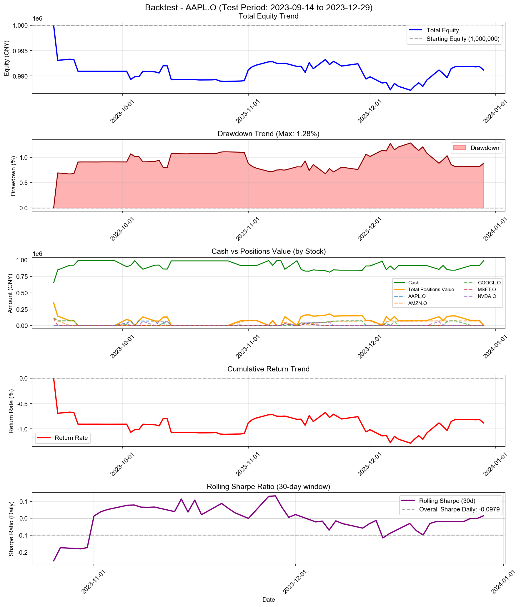

# Backtest

**策略名称:** 层级式多资产交易系统（带每周反思层）  
**回测期间:** 2023-01-03 至 2023-12-29  
**交易日数:** 75  
**组合股票数:** 5 支  
**初始资金:** 1000000.00 元

---

## 组合整体表现

| 项目 | 数值 |
|------|------|
| 初始资金 | 1000000.00 元 |
| 最终现金 | 987635.57 元 |
| 最终持仓市值 | 3549.57 元 |
| 最终总权益 | 991185.13 元 |
| 总盈亏 | -8814.87 元 |
| 总收益率 | -0.88% |
| 年化收益率 (CAGR) | -2.93% |

---

## 参数θ追踪

### 初始参数

| 参数 | 数值 |
|------|------|
| 总仓位上限 (gross_exposure) | 0.70 |
| 单票上限 (max_w) | 0.15 |
| 换手上限 (turnover_cap) | 0.20 |
| 风险模式 (risk_mode) | neutral |
| 进场阈值 (enter_th) | 0.020 |
| 出场阈值 (exit_th) | -0.100 |

### 最终参数

| 参数 | 数值 |
|------|------|
| 总仓位上限 (gross_exposure) | 0.68 |
| 单票上限 (max_w) | 0.15 |
| 换手上限 (turnover_cap) | 0.19 |
| 风险模式 (risk_mode) | risk_off |
| 进场阈值 (enter_th) | 0.021 |
| 出场阈值 (exit_th) | -0.098 |

### 参数变化趋势图

---

## 持仓明细

| 股票代码 | 股数 | 成本价 | 现价 | 市值 | 权重 | 盈亏 | 收益率 | 贡献度 |
|----------|------|--------|------|------|------|------|--------|--------|
| MSFT.O | 2 | 1722.64 | 1746.87 | 3493.74 | 0.35% | +48.46 | +1.41% | 0.00% |
| GOOGL.O | 1 | 55.37 | 55.82 | 55.82 | 0.01% | +0.45 | +0.81% | 0.00% |

### 权重分布

| 股票代码 | 权重 | 市值占比 |
|----------|------|----------|
| MSFT.O | 0.35% | 0.35% |
| GOOGL.O | 0.01% | 0.01% |

---

## 交易统计

| 项目 | 数值 |
|------|------|
| 总交易次数 | 91 次 |
| 买入次数 | 52 次 |
| 卖出次数 | 39 次 |
| 买入总成本 | 1714138.41 元 |
| 卖出总收入 | 1701773.98 元 |
| 已实现盈亏 | -8863.77 元 |

### 交易质量指标

| 指标 | 数值 |
|------|------|
| 胜率 (Hit Rate) | 33.33% |
| 盈亏比 (Profit Factor) | 0.54 |
| 单笔平均收益 | -227.28 元 |
| 平均持仓周期 | 7.4 天 |

---

## 风险与稳健性

| 指标 | 数值 |
|------|------|
| 最大回撤 (Max Drawdown) | 1.28% |
| 年化波动率 (Volatility) | 1.93% |
| 年化夏普比率 (Sharpe) | -1.5540 |
| 日频夏普比率 (Sharpe Daily) | -0.0979 |
| 年化 Sortino 比率 | -1.2306 |
| 日频 Sortino 比率 | -0.0775 |
| Calmar 比率 (CAGR/MaxDD) | -2.2873 |
### 尾部风险 (Tail Risk)

| 指标 | 数值 |
|------|------|
| VaR 95% | -0.16% |
| VaR 99% | -0.69% |
| CVaR 95% | -0.34% |
| CVaR 99% | -0.69% |
| 极端日跌幅 (5%分位) | -0.23% |
| 极端日跌幅 (1%分位) | -0.69% |

---

## 执行与成本

| 指标 | 数值 |
|------|------|
| 换手率 (Turnover) | 172.39% |
| 交易频率 (每日) | 1.21 次/日 |
| 交易频率 (每周) | 6.07 次/周 |

---

## 各股票表现分析

| 股票代码 | 初始权重 | 最终权重 | 收益率 | 盈亏 | 交易次数 | 贡献度 |
|----------|----------|----------|--------|------|----------|--------|
| MSFT.O | 17.37% | 0.35% | +1.41% | +48.46 | 9 | 0.00% |
| GOOGL.O | 40.71% | 0.01% | +0.81% | +0.45 | 22 | 0.00% |

---

## 策略参数

---

## 交易记录

| 序号 | 日期 | 类型 | 股票代码 | 股数 | 价格 | 成本/收入 | 利润 |
|------|------|------|----------|------|------|-----------|------|
| 1 | 2023-09-14 | 买入 | MSFT.O | 69 | 1570.22 | 108345.44 | - |
| 2 | 2023-09-14 | 买入 | GOOGL.O | 2174 | 55.19 | 119975.66 | - |
| 3 | 2023-09-14 | 买入 | AMZN.O | 345 | 347.33 | 119828.16 | - |
| 4 | 2023-09-15 | 卖出 | MSFT.O | 69 | 1530.91 | 105632.81 | -2712.63 |
| 5 | 2023-09-15 | 卖出 | GOOGL.O | 858 | 54.91 | 47110.09 | -240.01 |
| 6 | 2023-09-15 | 卖出 | AMZN.O | 130 | 336.94 | 43801.68 | -1350.96 |
| 7 | 2023-09-18 | 卖出 | AMZN.O | 214 | 335.95 | 71893.73 | -2434.46 |
| 8 | 2023-09-20 | 卖出 | GOOGL.O | 1316 | 53.44 | 70332.68 | -2292.89 |
| 9 | 2023-10-02 | 买入 | AAPL.O | 76 | 501.92 | 38146.29 | - |
| 10 | 2023-10-02 | 买入 | GOOGL.O | 316 | 53.62 | 16942.69 | - |
| 11 | 2023-10-02 | 买入 | NVDA.O | 162 | 234.29 | 37955.05 | - |
| 12 | 2023-10-03 | 买入 | AAPL.O | 68 | 498.03 | 33865.70 | - |
| 13 | 2023-10-03 | 卖出 | GOOGL.O | 316 | 52.92 | 16722.97 | -219.72 |
| 14 | 2023-10-03 | 卖出 | NVDA.O | 162 | 227.67 | 36882.90 | -1072.15 |
| 15 | 2023-10-04 | 卖出 | AAPL.O | 144 | 501.66 | 72239.75 | +227.75 |
| 16 | 2023-10-05 | 买入 | AAPL.O | 142 | 505.28 | 71749.17 | - |
| 17 | 2023-10-06 | 卖出 | AAPL.O | 9 | 512.73 | 4614.56 | +67.08 |
| 18 | 2023-10-06 | 买入 | NVDA.O | 265 | 239.42 | 63445.66 | - |
| 19 | 2023-10-09 | 卖出 | NVDA.O | 265 | 236.86 | 62767.70 | -677.96 |
| 20 | 2023-10-10 | 卖出 | AAPL.O | 124 | 515.33 | 63900.77 | +1246.56 |
| 21 | 2023-10-10 | 买入 | NVDA.O | 265 | 239.61 | 63495.58 | - |
| 22 | 2023-10-11 | 买入 | AAPL.O | 68 | 519.40 | 35319.34 | - |
| 23 | 2023-10-11 | 买入 | GOOGL.O | 623 | 56.17 | 34991.20 | - |
| 24 | 2023-10-11 | 卖出 | NVDA.O | 44 | 244.88 | 10774.70 | +232.04 |
| 25 | 2023-10-12 | 买入 | AAPL.O | 44 | 522.03 | 22969.35 | - |
| 26 | 2023-10-12 | 卖出 | GOOGL.O | 570 | 55.53 | 31654.53 | -359.89 |
| 27 | 2023-10-12 | 买入 | NVDA.O | 42 | 245.61 | 10315.49 | - |
| 28 | 2023-10-13 | 卖出 | AAPL.O | 121 | 516.66 | 62515.58 | -320.60 |
| 29 | 2023-10-13 | 卖出 | NVDA.O | 263 | 237.84 | 62552.66 | -715.74 |
| 30 | 2023-10-30 | 买入 | AAPL.O | 19 | 491.93 | 9346.66 | - |
| 31 | 2023-10-30 | 买入 | AMZN.O | 155 | 318.50 | 49368.12 | - |
| 32 | 2023-10-30 | 买入 | NVDA.O | 45 | 215.35 | 9690.57 | - |
| 33 | 2023-10-31 | 卖出 | AAPL.O | 19 | 493.32 | 9373.01 | +26.35 |
| 34 | 2023-10-31 | 买入 | AMZN.O | 69 | 319.42 | 22039.70 | - |
| 35 | 2023-10-31 | 卖出 | NVDA.O | 45 | 213.35 | 9600.88 | -89.70 |
| 36 | 2023-11-06 | 卖出 | AMZN.O | 225 | 335.38 | 75459.60 | +3704.45 |
| 37 | 2023-11-07 | 买入 | AMZN.O | 210 | 342.50 | 71925.84 | - |
| 38 | 2023-11-08 | 卖出 | AMZN.O | 210 | 340.99 | 71608.32 | -317.52 |
| 39 | 2023-11-10 | 买入 | AAPL.O | 51 | 539.18 | 27498.04 | - |
| 40 | 2023-11-10 | 买入 | MSFT.O | 16 | 1713.80 | 27420.83 | - |
| 41 | 2023-11-10 | 买入 | AMZN.O | 144 | 344.54 | 49614.34 | - |
| 42 | 2023-11-10 | 买入 | NVDA.O | 108 | 252.88 | 27310.93 | - |
| 43 | 2023-11-13 | 卖出 | AAPL.O | 51 | 534.55 | 27262.01 | -236.03 |
| 44 | 2023-11-13 | 卖出 | MSFT.O | 16 | 1699.94 | 27199.04 | -221.79 |
| 45 | 2023-11-13 | 卖出 | AMZN.O | 144 | 342.22 | 49279.10 | -335.23 |
| 46 | 2023-11-13 | 卖出 | NVDA.O | 108 | 254.37 | 27471.97 | +161.03 |
| 47 | 2023-11-14 | 买入 | AAPL.O | 13 | 542.19 | 7048.41 | - |
| 48 | 2023-11-14 | 买入 | MSFT.O | 4 | 1716.58 | 6866.33 | - |
| 49 | 2023-11-14 | 买入 | GOOGL.O | 580 | 53.40 | 30969.87 | - |
| 50 | 2023-11-14 | 买入 | AMZN.O | 134 | 349.92 | 46889.28 | - |
| 51 | 2023-11-14 | 买入 | NVDA.O | 158 | 259.79 | 41046.86 | - |
| 52 | 2023-11-15 | 买入 | AAPL.O | 37 | 543.83 | 20121.87 | - |
| 53 | 2023-11-15 | 买入 | MSFT.O | 14 | 1717.28 | 24041.92 | - |
| 54 | 2023-11-15 | 买入 | GOOGL.O | 97 | 53.80 | 5218.21 | - |
| 55 | 2023-11-15 | 卖出 | AMZN.O | 69 | 343.68 | 23713.92 | -430.56 |
| 56 | 2023-11-16 | 买入 | AAPL.O | 19 | 548.75 | 10426.28 | - |
| 57 | 2023-11-16 | 买入 | MSFT.O | 4 | 1747.48 | 6989.90 | - |
| 58 | 2023-11-16 | 卖出 | AMZN.O | 46 | 342.79 | 15768.43 | -327.89 |
| 59 | 2023-11-17 | 卖出 | AAPL.O | 50 | 548.69 | 27434.70 | +190.81 |
| 60 | 2023-11-17 | 卖出 | MSFT.O | 15 | 1718.12 | 25771.74 | -67.91 |
| 61 | 2023-11-17 | 买入 | GOOGL.O | 93 | 54.07 | 5028.67 | - |
| 62 | 2023-11-17 | 买入 | AMZN.O | 81 | 348.43 | 28222.99 | - |
| 63 | 2023-11-20 | 卖出 | AAPL.O | 15 | 553.78 | 8306.77 | +133.61 |
| 64 | 2023-11-20 | 卖出 | MSFT.O | 5 | 1753.38 | 8766.88 | +153.66 |
| 65 | 2023-11-20 | 买入 | GOOGL.O | 122 | 54.45 | 6642.57 | - |
| 66 | 2023-11-20 | 买入 | AMZN.O | 41 | 350.71 | 14379.19 | - |
| 67 | 2023-11-20 | 买入 | NVDA.O | 37 | 263.73 | 9758.00 | - |
| 68 | 2023-11-21 | 买入 | GOOGL.O | 165 | 54.74 | 9031.28 | - |
| 69 | 2023-11-21 | 买入 | AMZN.O | 34 | 345.36 | 11742.24 | - |
| 70 | 2023-11-22 | 买入 | GOOGL.O | 108 | 55.34 | 5976.98 | - |
| 71 | 2023-11-22 | 买入 | AMZN.O | 16 | 352.10 | 5633.66 | - |
| 72 | 2023-11-22 | 卖出 | NVDA.O | 183 | 254.87 | 46641.64 | -1036.77 |
| 73 | 2023-11-24 | 买入 | GOOGL.O | 103 | 54.62 | 5626.18 | - |
| 74 | 2023-11-29 | 买入 | AMZN.O | 14 | 351.17 | 4916.35 | - |
| 75 | 2023-11-30 | 卖出 | GOOGL.O | 1321 | 52.96 | 69961.15 | -1509.39 |
| 76 | 2023-12-04 | 卖出 | AMZN.O | 205 | 347.62 | 71261.28 | -281.64 |
| 77 | 2023-12-05 | 买入 | AAPL.O | 71 | 559.48 | 39723.31 | - |
| 78 | 2023-12-05 | 买入 | GOOGL.O | 614 | 52.35 | 32140.04 | - |
| 79 | 2023-12-05 | 买入 | AMZN.O | 161 | 352.51 | 56754.43 | - |
| 80 | 2023-12-06 | 卖出 | AAPL.O | 75 | 556.30 | 41722.61 | -180.22 |
| 81 | 2023-12-06 | 卖出 | GOOGL.O | 614 | 51.96 | 31902.04 | -238.00 |
| 82 | 2023-12-06 | 买入 | AMZN.O | 46 | 346.85 | 15955.01 | - |
| 83 | 2023-12-07 | 买入 | GOOGL.O | 1159 | 54.72 | 63419.38 | - |
| 84 | 2023-12-07 | 卖出 | AMZN.O | 15 | 352.51 | 5287.68 | +18.88 |
| 85 | 2023-12-08 | 卖出 | GOOGL.O | 1159 | 53.94 | 62520.86 | -898.51 |
| 86 | 2023-12-18 | 买入 | NVDA.O | 217 | 262.02 | 56857.44 | - |
| 87 | 2023-12-19 | 卖出 | NVDA.O | 229 | 259.54 | 59434.89 | -549.01 |
| 88 | 2023-12-20 | 买入 | GOOGL.O | 1148 | 55.28 | 63464.32 | - |
| 89 | 2023-12-21 | 买入 | GOOGL.O | 137 | 56.11 | 7687.58 | - |
| 90 | 2023-12-26 | 卖出 | GOOGL.O | 1284 | 56.55 | 72614.41 | +1517.88 |
| 91 | 2023-12-29 | 卖出 | AMZN.O | 192 | 364.66 | 70013.95 | +2573.31 |

---

## 走势图

---

*报告生成时间: 2025-12-25 15:29:55*