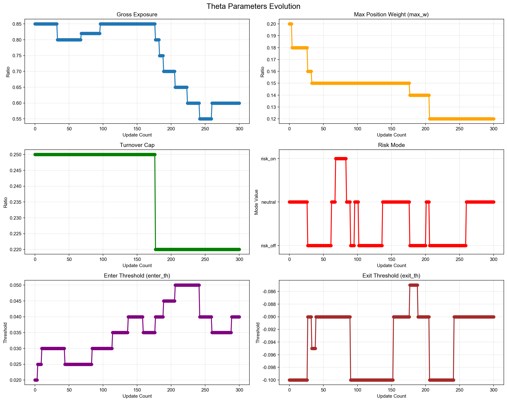
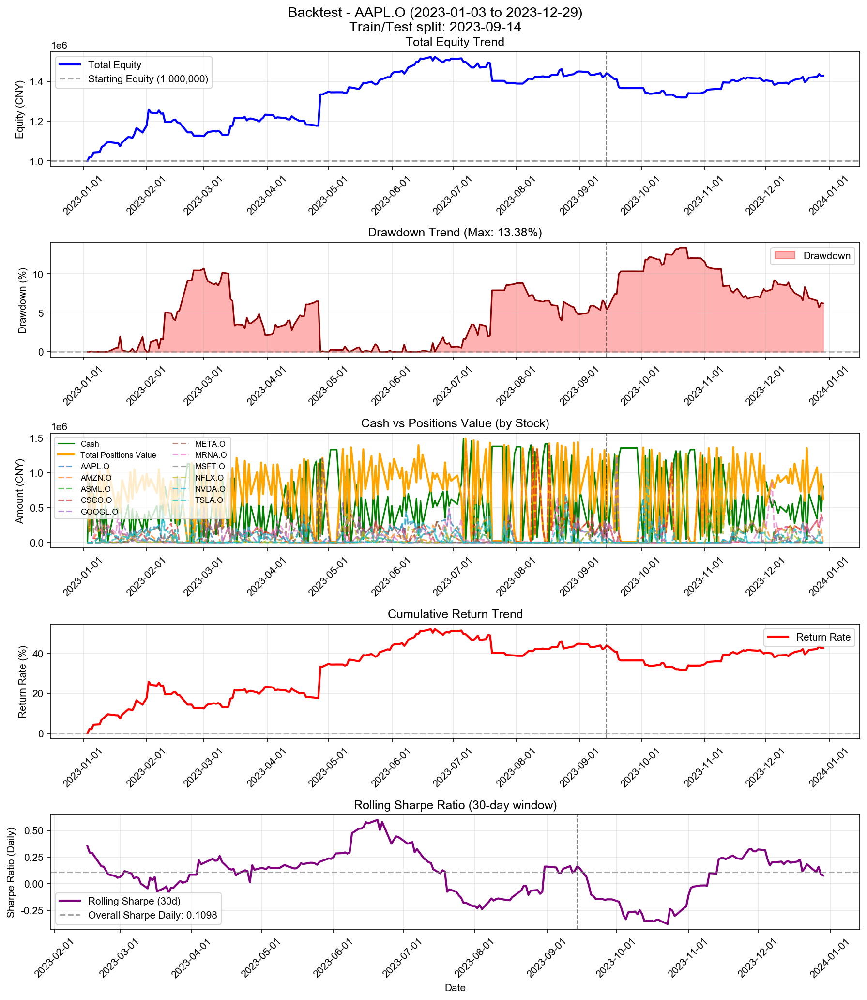

# Backtest

**策略名称:** 层级式多资产交易系统（带 RAG 反思层）  
**回测期间:** 2023-01-03 至 2023-12-29  
**交易日数:** 250  
**组合股票数:** 20 支  
**初始资金:** 1000000.00 元

---

## 组合整体表现

| 项目 | 数值 |
|------|------|
| 初始资金 | 1000000.00 元 |
| 最终现金 | 841907.97 元 |
| 最终持仓市值 | 569787.00 元 |
| 最终总权益 | 1411694.97 元 |
| 总盈亏 | +411694.97 元 |
| 总收益率 | +41.17% |
| 年化收益率 (CAGR) | +41.56% |

---

## 参数θ追踪

### 初始参数

| 参数 | 数值 |
|------|------|
| 总仓位上限 (gross_exposure) | 0.85 |
| 单票上限 (max_w) | 0.20 |
| 换手上限 (turnover_cap) | 0.25 |
| 风险模式 (risk_mode) | neutral |
| 进场阈值 (enter_th) | 0.020 |
| 出场阈值 (exit_th) | -0.100 |

### 最终参数

| 参数 | 数值 |
|------|------|
| 总仓位上限 (gross_exposure) | 0.60 |
| 单票上限 (max_w) | 0.12 |
| 换手上限 (turnover_cap) | 0.22 |
| 风险模式 (risk_mode) | neutral |
| 进场阈值 (enter_th) | 0.040 |
| 出场阈值 (exit_th) | -0.090 |

### 参数变化趋势图

---

## 持仓明细

| 股票代码 | 股数 | 成本价 | 现价 | 市值 | 权重 | 盈亏 | 收益率 | 贡献度 |
|----------|------|--------|------|------|------|------|--------|--------|
| AAPL.O | 5 | 561.04 | 556.91 | 2784.54 | 0.20% | -20.66 | -0.74% | -0.00% |
| GOOGL.O | 27 | 56.28 | 55.82 | 1507.19 | 0.11% | -12.39 | -0.82% | -0.00% |
| TSLA.O | 1 | 39.17 | 37.27 | 37.27 | 0.00% | -1.90 | -4.85% | -0.00% |
| META.O | 281 | 3.54 | 3.54 | 994.63 | 0.07% | -0.92 | -0.09% | -0.00% |
| ASML.O | 67 | 95.86 | 96.07 | 6436.46 | 0.46% | +14.03 | +0.22% | 0.00% |
| MRNA.O | 280544 | 0.99 | 0.99 | 279001.01 | 19.76% | +1690.13 | +0.61% | 0.12% |
| NFLX.O | 1 | 66.35 | 68.16 | 68.16 | 0.00% | +1.81 | +2.73% | 0.00% |
| CSCO.O | 1321 | 210.94 | 211.17 | 278957.74 | 19.76% | +305.69 | +0.11% | 0.02% |

### 权重分布

| 股票代码 | 权重 | 市值占比 |
|----------|------|----------|
| AAPL.O | 0.20% | 0.20% |
| GOOGL.O | 0.11% | 0.11% |
| TSLA.O | 0.00% | 0.00% |
| META.O | 0.07% | 0.07% |
| ASML.O | 0.46% | 0.46% |
| MRNA.O | 19.76% | 19.76% |
| NFLX.O | 0.00% | 0.00% |
| CSCO.O | 19.76% | 19.76% |

---

## 交易统计

| 项目 | 数值 |
|------|------|
| 总交易次数 | 1735 次 |
| 买入次数 | 986 次 |
| 卖出次数 | 749 次 |
| 买入总成本 | 113666658.61 元 |
| 卖出总收入 | 113508566.57 元 |
| 已实现盈亏 | +409719.18 元 |

### 交易质量指标

| 指标 | 数值 |
|------|------|
| 胜率 (Hit Rate) | 57.54% |
| 盈亏比 (Profit Factor) | 1.53 |
| 单笔平均收益 | +547.02 元 |
| 平均持仓周期 | 4.0 天 |

---

## 风险与稳健性

| 指标 | 数值 |
|------|------|
| 最大回撤 (Max Drawdown) | 12.04% |
| 年化波动率 (Volatility) | 21.90% |
| 年化夏普比率 (Sharpe) | 1.6998 |
| 日频夏普比率 (Sharpe Daily) | 0.1071 |
| 年化 Sortino 比率 | 2.1770 |
| 日频 Sortino 比率 | 0.1371 |
| Calmar 比率 (CAGR/MaxDD) | 3.4529 |
### 尾部风险 (Tail Risk)

| 指标 | 数值 |
|------|------|
| VaR 95% | -1.44% |
| VaR 99% | -2.78% |
| CVaR 95% | -2.43% |
| CVaR 99% | -4.04% |
| 极端日跌幅 (5%分位) | -1.44% |
| 极端日跌幅 (1%分位) | -3.21% |

---

## 执行与成本

| 指标 | 数值 |
|------|------|
| 换手率 (Turnover) | 8403.72% |
| 交易频率 (每日) | 6.94 次/日 |
| 交易频率 (每周) | 34.70 次/周 |

---

## 各股票表现分析

| 股票代码 | 初始权重 | 最终权重 | 收益率 | 盈亏 | 交易次数 | 贡献度 |
|----------|----------|----------|--------|------|----------|--------|
| AAPL.O | 865.48% | 0.20% | -0.74% | -20.66 | 136 | -0.00% |
| GOOGL.O | 1094.04% | 0.11% | -0.82% | -12.39 | 171 | -0.00% |
| TSLA.O | 1135.98% | 0.00% | -4.85% | -1.90 | 189 | -0.00% |
| META.O | 1584.78% | 0.07% | -0.09% | -0.92 | 221 | -0.00% |
| ASML.O | 252.01% | 0.46% | +0.22% | +14.03 | 61 | 0.00% |
| MRNA.O | 971.85% | 19.76% | +0.61% | +1690.13 | 173 | 0.12% |
| NFLX.O | 974.44% | 0.00% | +2.73% | +1.81 | 138 | 0.00% |
| CSCO.O | 1623.40% | 19.76% | +0.11% | +305.69 | 171 | 0.02% |

---

## 策略参数

---

## 交易记录

| 序号 | 日期 | 类型 | 股票代码 | 股数 | 价格 | 成本/收入 | 利润 |
|------|------|------|----------|------|------|-----------|------|
| 1 | 2023-01-03 | 买入 | META.O | 128266 | 1.25 | 159999.01 | - |
| 2 | 2023-01-03 | 买入 | META.O | 673401 | 1.25 | 840000.41 | - |
| 3 | 2023-01-04 | 卖出 | META.O | 673400 | 1.27 | 857709.58 | +17710.42 |
| 4 | 2023-01-05 | 买入 | META.O | 595286 | 1.27 | 755656.05 | - |
| 5 | 2023-01-06 | 买入 | AMZN.O | 254 | 206.59 | 52474.37 | - |
| 6 | 2023-01-06 | 卖出 | META.O | 613522 | 1.30 | 797701.30 | +21289.23 |
| 7 | 2023-01-06 | 买入 | MRNA.O | 47811 | 1.80 | 86227.14 | - |
| 8 | 2023-01-06 | 买入 | CSCO.O | 304 | 197.53 | 60050.49 | - |
| 9 | 2023-01-09 | 买入 | AMZN.O | 184 | 209.66 | 38578.18 | - |
| 10 | 2023-01-09 | 买入 | TSLA.O | 2278 | 17.97 | 40925.41 | - |
| 11 | 2023-01-09 | 买入 | MRNA.O | 21384 | 1.84 | 39335.87 | - |
| 12 | 2023-01-09 | 卖出 | CSCO.O | 234 | 198.60 | 46471.79 | +248.72 |
| 13 | 2023-01-09 | 买入 | AMZN.O | 631 | 209.66 | 132297.98 | - |
| 14 | 2023-01-09 | 买入 | TSLA.O | 3281 | 17.97 | 58944.81 | - |
| 15 | 2023-01-09 | 买入 | META.O | 156019 | 1.29 | 201997.80 | - |
| 16 | 2023-01-09 | 买入 | MRNA.O | 99640 | 1.84 | 183287.78 | - |
| 17 | 2023-01-09 | 买入 | CSCO.O | 99 | 198.60 | 19661.14 | - |
| 18 | 2023-01-10 | 卖出 | AMZN.O | 431 | 215.69 | 92961.53 | +2910.94 |
| 19 | 2023-01-10 | 买入 | NVDA.O | 240 | 83.20 | 19968.74 | - |
| 20 | 2023-01-10 | 卖出 | TSLA.O | 5161 | 17.83 | 92007.73 | -712.22 |
| 21 | 2023-01-10 | 卖出 | META.O | 156426 | 1.33 | 208030.94 | +7395.25 |
| 22 | 2023-01-10 | 买入 | ASML.O | 330 | 79.59 | 26266.14 | - |
| 23 | 2023-01-10 | 卖出 | MRNA.O | 93147 | 1.90 | 176653.29 | +6258.97 |
| 24 | 2023-01-10 | 卖出 | CSCO.O | 157 | 199.54 | 31327.41 | +216.74 |
| 25 | 2023-01-11 | 买入 | MSFT.O | 21 | 1085.63 | 22798.22 | - |
| 26 | 2023-01-11 | 买入 | GOOGL.O | 2195 | 36.57 | 80276.88 | - |
| 27 | 2023-01-11 | 卖出 | AMZN.O | 52 | 228.22 | 11867.23 | +1002.66 |
| 28 | 2023-01-11 | 卖出 | NVDA.O | 147 | 83.68 | 12301.58 | +70.73 |
| 29 | 2023-01-11 | 买入 | TSLA.O | 721 | 18.48 | 13326.24 | - |
| 30 | 2023-01-11 | 卖出 | META.O | 6652 | 1.33 | 8839.84 | +307.83 |
| 31 | 2023-01-11 | 卖出 | ASML.O | 204 | 81.01 | 16526.67 | +289.42 |
| 32 | 2023-01-11 | 卖出 | MRNA.O | 32124 | 1.87 | 59956.23 | +1191.63 |
| 33 | 2023-01-11 | 买入 | MSFT.O | 20 | 1085.63 | 21712.59 | - |
| 34 | 2023-01-11 | 买入 | GOOGL.O | 2128 | 36.57 | 77826.51 | - |
| 35 | 2023-01-11 | 买入 | AMZN.O | 567 | 228.22 | 129398.47 | - |
| 36 | 2023-01-11 | 买入 | NVDA.O | 90 | 83.68 | 7531.58 | - |
| 37 | 2023-01-11 | 买入 | TSLA.O | 1085 | 18.48 | 20054.06 | - |
| 38 | 2023-01-11 | 买入 | META.O | 99842 | 1.33 | 132680.03 | - |
| 39 | 2023-01-11 | 买入 | ASML.O | 122 | 81.01 | 9883.60 | - |
| 40 | 2023-01-11 | 买入 | MRNA.O | 42239 | 1.87 | 78834.87 | - |
| 41 | 2023-01-12 | 卖出 | MSFT.O | 35 | 1098.25 | 38438.61 | +441.58 |
| 42 | 2023-01-12 | 卖出 | GOOGL.O | 2237 | 36.42 | 81464.29 | -348.63 |
| 43 | 2023-01-12 | 卖出 | AMZN.O | 534 | 228.65 | 122098.03 | +5463.80 |
| 44 | 2023-01-12 | 买入 | NVDA.O | 439 | 86.35 | 37908.32 | - |
| 45 | 2023-01-12 | 卖出 | TSLA.O | 1925 | 18.53 | 35677.95 | +278.07 |
| 46 | 2023-01-12 | 卖出 | META.O | 98746 | 1.37 | 134995.66 | +6092.16 |
| 47 | 2023-01-12 | 卖出 | ASML.O | 216 | 82.00 | 17712.72 | +369.59 |
| 48 | 2023-01-12 | 卖出 | MRNA.O | 17510 | 1.88 | 32929.31 | +578.42 |
| 49 | 2023-01-13 | 卖出 | MSFT.O | 5 | 1101.56 | 5507.81 | +79.66 |
| 50 | 2023-01-13 | 买入 | GOOGL.O | 1848 | 36.81 | 68029.27 | - |
| 51 | 2023-01-13 | 买入 | AMZN.O | 26 | 235.49 | 6122.69 | - |
| 52 | 2023-01-13 | 买入 | NVDA.O | 263 | 88.38 | 23244.13 | - |
| 53 | 2023-01-13 | 卖出 | META.O | 15549 | 1.37 | 21299.02 | +1001.28 |
| 54 | 2023-01-13 | 买入 | MRNA.O | 10102 | 1.92 | 19395.84 | - |
| 55 | 2023-01-13 | 买入 | GOOGL.O | 2538 | 36.81 | 93429.81 | - |
| 56 | 2023-01-13 | 买入 | AMZN.O | 416 | 235.49 | 97963.01 | - |
| 57 | 2023-01-13 | 买入 | NVDA.O | 571 | 88.38 | 50465.40 | - |
| 58 | 2023-01-13 | 买入 | META.O | 57102 | 1.37 | 78218.32 | - |
| 59 | 2023-01-13 | 买入 | MRNA.O | 50571 | 1.92 | 97096.32 | - |
| 60 | 2023-01-17 | 卖出 | GOOGL.O | 4336 | 36.48 | 158180.31 | -1103.07 |
| 61 | 2023-01-17 | 卖出 | AMZN.O | 706 | 230.52 | 162747.12 | +3524.29 |
| 62 | 2023-01-17 | 卖出 | NVDA.O | 1001 | 92.58 | 92672.95 | +5437.92 |
| 63 | 2023-01-17 | 买入 | TSLA.O | 2319 | 19.72 | 45738.80 | - |
| 64 | 2023-01-17 | 卖出 | META.O | 97428 | 1.35 | 131878.54 | +2235.40 |
| 65 | 2023-01-17 | 卖出 | MRNA.O | 86500 | 1.91 | 164946.85 | +2184.71 |
| 66 | 2023-01-18 | 卖出 | GOOGL.O | 1500 | 36.41 | 54619.15 | -483.50 |
| 67 | 2023-01-18 | 卖出 | AMZN.O | 248 | 229.10 | 56817.79 | +886.83 |
| 68 | 2023-01-18 | 卖出 | NVDA.O | 317 | 90.88 | 28809.16 | +1183.29 |
| 69 | 2023-01-18 | 卖出 | TSLA.O | 1809 | 19.32 | 34944.45 | -476.21 |
| 70 | 2023-01-18 | 卖出 | META.O | 33618 | 1.33 | 44718.66 | -15.33 |
| 71 | 2023-01-18 | 买入 | MRNA.O | 19780 | 1.97 | 38970.56 | - |
| 72 | 2023-01-18 | 买入 | GOOGL.O | 1686 | 36.41 | 61391.92 | - |
| 73 | 2023-01-18 | 买入 | AMZN.O | 281 | 229.10 | 64378.22 | - |
| 74 | 2023-01-18 | 买入 | NVDA.O | 365 | 90.88 | 33171.44 | - |
| 75 | 2023-01-18 | 买入 | TSLA.O | 2090 | 19.32 | 40372.53 | - |
| 76 | 2023-01-18 | 买入 | META.O | 38642 | 1.33 | 51401.59 | - |
| 77 | 2023-01-18 | 买入 | MRNA.O | 165039 | 1.97 | 325159.84 | - |
| 78 | 2023-01-19 | 卖出 | GOOGL.O | 2322 | 37.18 | 86341.29 | +1585.85 |
| 79 | 2023-01-19 | 卖出 | AMZN.O | 388 | 224.83 | 87234.82 | -1274.91 |
| 80 | 2023-01-19 | 卖出 | NVDA.O | 503 | 87.68 | 44103.00 | -1094.84 |
| 81 | 2023-01-19 | 卖出 | TSLA.O | 2879 | 19.08 | 54918.36 | -902.98 |
| 82 | 2023-01-19 | 卖出 | META.O | 53216 | 1.36 | 72453.58 | +1659.02 |
| 83 | 2023-01-19 | 卖出 | MRNA.O | 227285 | 1.90 | 432705.18 | -11331.07 |
| 84 | 2023-01-20 | 买入 | GOOGL.O | 1909 | 39.17 | 74775.71 | - |
| 85 | 2023-01-20 | 买入 | AMZN.O | 152 | 233.40 | 35476.80 | - |
| 86 | 2023-01-20 | 买入 | NVDA.O | 61 | 93.30 | 5691.11 | - |
| 87 | 2023-01-20 | 买入 | TSLA.O | 2081 | 20.01 | 41647.05 | - |
| 88 | 2023-01-20 | 买入 | META.O | 43339 | 1.39 | 60401.56 | - |
| 89 | 2023-01-20 | 买入 | MRNA.O | 58975 | 1.94 | 114399.71 | - |
| 90 | 2023-01-20 | 买入 | NFLX.O | 946 | 47.95 | 45360.70 | - |
| 91 | 2023-01-20 | 买入 | GOOGL.O | 4852 | 39.17 | 190053.31 | - |
| 92 | 2023-01-20 | 买入 | AMZN.O | 386 | 233.40 | 90092.40 | - |
| 93 | 2023-01-20 | 买入 | NVDA.O | 157 | 93.30 | 14647.61 | - |
| 94 | 2023-01-20 | 买入 | TSLA.O | 5290 | 20.01 | 105868.77 | - |
| 95 | 2023-01-20 | 买入 | META.O | 110165 | 1.39 | 153536.96 | - |
| 96 | 2023-01-20 | 买入 | MRNA.O | 70195 | 1.94 | 136164.26 | - |
| 97 | 2023-01-23 | 卖出 | GOOGL.O | 5097 | 39.88 | 203255.17 | +3605.19 |
| 98 | 2023-01-23 | 卖出 | AMZN.O | 386 | 234.05 | 90342.53 | +250.13 |
| 99 | 2023-01-23 | 买入 | NVDA.O | 178 | 100.38 | 17867.32 | - |
| 100 | 2023-01-23 | 卖出 | TSLA.O | 4296 | 21.56 | 92632.50 | +6656.65 |
| 101 | 2023-01-23 | 卖出 | META.O | 92677 | 1.43 | 132778.34 | +3614.44 |
| 102 | 2023-01-23 | 买入 | ASML.O | 240 | 84.95 | 20388.64 | - |
| 103 | 2023-01-23 | 卖出 | MRNA.O | 89942 | 1.97 | 177131.77 | +2662.28 |
| 104 | 2023-01-24 | 买入 | AAPL.O | 225 | 409.99 | 92247.32 | - |
| 105 | 2023-01-24 | 买入 | MSFT.O | 21 | 1114.50 | 23404.51 | - |
| 106 | 2023-01-24 | 卖出 | GOOGL.O | 674 | 39.04 | 26314.46 | -86.19 |
| 107 | 2023-01-24 | 买入 | NVDA.O | 270 | 100.75 | 27203.79 | - |
| 108 | 2023-01-24 | 买入 | TSLA.O | 704 | 21.58 | 15194.78 | - |
| 109 | 2023-01-24 | 卖出 | MRNA.O | 3533 | 1.97 | 6951.53 | +98.22 |
| 110 | 2023-01-24 | 买入 | NFLX.O | 274 | 50.94 | 13956.52 | - |
| 111 | 2023-01-24 | 买入 | CSCO.O | 51 | 195.45 | 9967.93 | - |
| 112 | 2023-01-24 | 买入 | AAPL.O | 209 | 409.99 | 85687.51 | - |
| 113 | 2023-01-24 | 买入 | MSFT.O | 21 | 1114.50 | 23404.51 | - |
| 114 | 2023-01-24 | 买入 | GOOGL.O | 921 | 39.04 | 35957.88 | - |
| 115 | 2023-01-24 | 买入 | AMZN.O | 139 | 231.17 | 32132.35 | - |
| 116 | 2023-01-24 | 买入 | NVDA.O | 620 | 100.75 | 62467.96 | - |
| 117 | 2023-01-24 | 买入 | TSLA.O | 3516 | 21.58 | 75887.59 | - |
| 118 | 2023-01-24 | 买入 | META.O | 55786 | 1.43 | 79852.08 | - |
| 119 | 2023-01-24 | 买入 | ASML.O | 197 | 84.20 | 16586.65 | - |
| 120 | 2023-01-24 | 买入 | MRNA.O | 33215 | 1.97 | 65353.83 | - |
| 121 | 2023-01-24 | 买入 | NFLX.O | 625 | 50.94 | 31835.12 | - |
| 122 | 2023-01-25 | 卖出 | AAPL.O | 177 | 408.06 | 72226.77 | -341.12 |
| 123 | 2023-01-25 | 卖出 | MSFT.O | 19 | 1107.92 | 21050.40 | -112.35 |
| 124 | 2023-01-25 | 卖出 | GOOGL.O | 1573 | 38.05 | 59854.50 | -1663.11 |
| 125 | 2023-01-25 | 卖出 | AMZN.O | 46 | 233.23 | 10728.67 | +41.31 |
| 126 | 2023-01-25 | 卖出 | NVDA.O | 395 | 101.06 | 39917.95 | +639.78 |
| 127 | 2023-01-25 | 卖出 | TSLA.O | 2412 | 21.66 | 52254.77 | +1792.12 |
| 128 | 2023-01-25 | 卖出 | META.O | 71977 | 1.42 | 101847.46 | +235.02 |
| 129 | 2023-01-25 | 卖出 | MRNA.O | 42838 | 1.93 | 82707.33 | -963.84 |
| 130 | 2023-01-25 | 卖出 | NFLX.O | 759 | 51.51 | 39099.43 | +1600.99 |
| 131 | 2023-01-25 | 买入 | CSCO.O | 65 | 196.14 | 12749.40 | - |
| 132 | 2023-01-26 | 买入 | MSFT.O | 36 | 1141.94 | 41109.98 | - |
| 133 | 2023-01-26 | 买入 | GOOGL.O | 239 | 38.97 | 9313.90 | - |
| 134 | 2023-01-26 | 卖出 | TSLA.O | 777 | 24.04 | 18679.47 | +2423.46 |
| 135 | 2023-01-26 | 买入 | META.O | 27039 | 1.47 | 39828.45 | - |
| 136 | 2023-01-26 | 卖出 | ASML.O | 232 | 85.94 | 19938.46 | +376.93 |
| 137 | 2023-01-26 | 卖出 | MRNA.O | 6701 | 1.93 | 12949.01 | -139.38 |
| 138 | 2023-01-26 | 卖出 | NFLX.O | 535 | 51.08 | 27328.76 | +897.05 |
| 139 | 2023-01-26 | 买入 | AAPL.O | 143 | 414.10 | 59216.52 | - |
| 140 | 2023-01-26 | 买入 | MSFT.O | 31 | 1141.94 | 35400.26 | - |
| 141 | 2023-01-26 | 买入 | GOOGL.O | 305 | 38.97 | 11885.94 | - |
| 142 | 2023-01-26 | 买入 | AMZN.O | 138 | 238.13 | 32861.66 | - |
| 143 | 2023-01-26 | 买入 | NVDA.O | 461 | 103.56 | 47742.66 | - |
| 144 | 2023-01-26 | 买入 | TSLA.O | 2172 | 24.04 | 52215.97 | - |
| 145 | 2023-01-26 | 买入 | META.O | 37938 | 1.47 | 55882.67 | - |
| 146 | 2023-01-26 | 买入 | ASML.O | 125 | 85.94 | 10742.71 | - |
| 147 | 2023-01-26 | 买入 | MRNA.O | 10253 | 1.93 | 19812.90 | - |
| 148 | 2023-01-26 | 买入 | NFLX.O | 291 | 51.08 | 14864.80 | - |
| 149 | 2023-01-26 | 买入 | CSCO.O | 66 | 197.62 | 13042.67 | - |
| 150 | 2023-01-27 | 卖出 | AAPL.O | 84 | 419.77 | 35260.53 | +698.00 |
| 151 | 2023-01-27 | 卖出 | MSFT.O | 38 | 1142.68 | 43421.86 | +309.76 |
| 152 | 2023-01-27 | 卖出 | AMZN.O | 27 | 245.38 | 6625.15 | +295.77 |
| 153 | 2023-01-27 | 卖出 | NVDA.O | 509 | 106.51 | 54212.42 | +2882.38 |
| 154 | 2023-01-27 | 卖出 | TSLA.O | 3047 | 26.69 | 81309.20 | +14273.43 |
| 155 | 2023-01-27 | 卖出 | META.O | 23504 | 1.52 | 35664.97 | +1629.97 |
| 156 | 2023-01-27 | 卖出 | ASML.O | 292 | 83.87 | 24489.15 | -295.22 |
| 157 | 2023-01-27 | 卖出 | MRNA.O | 23949 | 1.89 | 45347.43 | -1257.34 |
| 158 | 2023-01-27 | 卖出 | NFLX.O | 566 | 50.51 | 28587.41 | +296.16 |
| 159 | 2023-01-27 | 买入 | CSCO.O | 53 | 198.31 | 10510.50 | - |
| 160 | 2023-01-30 | 卖出 | MSFT.O | 30 | 1117.59 | 33527.56 | -508.30 |
| 161 | 2023-01-30 | 卖出 | GOOGL.O | 508 | 38.74 | 19679.17 | -144.64 |
| 162 | 2023-01-30 | 买入 | AMZN.O | 58 | 241.32 | 13996.56 | - |
| 163 | 2023-01-30 | 卖出 | NVDA.O | 468 | 100.22 | 46901.13 | -294.27 |
| 164 | 2023-01-30 | 买入 | TSLA.O | 1238 | 25.00 | 30948.76 | - |
| 165 | 2023-01-30 | 卖出 | META.O | 15477 | 1.47 | 22760.48 | +348.98 |
| 166 | 2023-01-30 | 卖出 | MRNA.O | 3189 | 1.81 | 5767.94 | -437.85 |
| 167 | 2023-01-30 | 卖出 | NFLX.O | 158 | 49.44 | 7810.79 | -86.77 |
| 168 | 2023-01-30 | 买入 | CSCO.O | 163 | 197.13 | 32131.49 | - |
| 169 | 2023-01-30 | 买入 | AAPL.O | 172 | 411.34 | 70750.49 | - |
| 170 | 2023-01-30 | 买入 | MSFT.O | 12 | 1117.59 | 13411.03 | - |
| 171 | 2023-01-30 | 买入 | GOOGL.O | 201 | 38.74 | 7786.44 | - |
| 172 | 2023-01-30 | 买入 | AMZN.O | 224 | 241.32 | 54055.68 | - |
| 173 | 2023-01-30 | 买入 | NVDA.O | 202 | 100.22 | 20243.65 | - |
| 174 | 2023-01-30 | 买入 | TSLA.O | 2416 | 25.00 | 60397.58 | - |
| 175 | 2023-01-30 | 买入 | META.O | 38182 | 1.47 | 56150.45 | - |
| 176 | 2023-01-30 | 买入 | CSCO.O | 221 | 197.13 | 43564.78 | - |
| 177 | 2023-01-31 | 卖出 | AAPL.O | 148 | 415.05 | 61427.51 | +537.82 |
| 178 | 2023-01-31 | 卖出 | MSFT.O | 27 | 1141.07 | 30808.86 | +333.43 |
| 179 | 2023-01-31 | 买入 | GOOGL.O | 426 | 39.50 | 16826.05 | - |
| 180 | 2023-01-31 | 卖出 | AMZN.O | 111 | 247.51 | 27473.83 | +1114.58 |
| 181 | 2023-01-31 | 卖出 | NVDA.O | 454 | 102.18 | 46388.50 | +704.87 |
| 182 | 2023-01-31 | 卖出 | TSLA.O | 1925 | 25.98 | 50017.28 | +4602.87 |
| 183 | 2023-01-31 | 卖出 | META.O | 30892 | 1.49 | 46019.81 | +1042.19 |
| 184 | 2023-01-31 | 卖出 | CSCO.O | 240 | 198.97 | 47751.68 | +457.36 |
| 185 | 2023-01-31 | 买入 | AAPL.O | 33 | 415.05 | 13696.67 | - |
| 186 | 2023-01-31 | 买入 | AMZN.O | 51 | 247.51 | 12623.11 | - |
| 187 | 2023-01-31 | 买入 | TSLA.O | 489 | 25.98 | 12705.69 | - |
| 188 | 2023-01-31 | 买入 | META.O | 7683 | 1.49 | 11445.37 | - |
| 189 | 2023-01-31 | 买入 | CSCO.O | 38 | 198.97 | 7560.68 | - |
| 190 | 2023-02-01 | 卖出 | AAPL.O | 37 | 418.33 | 15478.21 | +243.89 |
| 191 | 2023-02-01 | 卖出 | MSFT.O | 5 | 1163.82 | 5819.08 | +175.48 |
| 192 | 2023-02-01 | 卖出 | GOOGL.O | 600 | 40.13 | 24079.90 | +579.09 |
| 193 | 2023-02-01 | 卖出 | AMZN.O | 67 | 252.36 | 16908.12 | +938.22 |
| 194 | 2023-02-01 | 买入 | NVDA.O | 602 | 109.53 | 65937.42 | - |
| 195 | 2023-02-01 | 卖出 | TSLA.O | 693 | 27.21 | 18857.57 | +2359.68 |
| 196 | 2023-02-01 | 卖出 | CSCO.O | 269 | 198.56 | 53411.70 | +357.25 |
| 197 | 2023-02-01 | 买入 | AAPL.O | 151 | 418.33 | 63167.83 | - |
| 198 | 2023-02-01 | 买入 | GOOGL.O | 180 | 40.13 | 7223.97 | - |
| 199 | 2023-02-01 | 买入 | AMZN.O | 230 | 252.36 | 58042.80 | - |
| 200 | 2023-02-01 | 买入 | NVDA.O | 327 | 109.53 | 35816.51 | - |
| 201 | 2023-02-01 | 买入 | TSLA.O | 2145 | 27.21 | 58368.67 | - |
| 202 | 2023-02-01 | 买入 | META.O | 38352 | 1.53 | 58724.58 | - |
| 203 | 2023-02-01 | 买入 | CSCO.O | 71 | 198.56 | 14097.51 | - |
| 204 | 2023-02-02 | 卖出 | AAPL.O | 154 | 433.83 | 66810.49 | +3088.03 |
| 205 | 2023-02-02 | 买入 | MSFT.O | 48 | 1218.38 | 58482.26 | - |
| 206 | 2023-02-02 | 买入 | GOOGL.O | 946 | 43.05 | 40729.40 | - |
| 207 | 2023-02-02 | 卖出 | AMZN.O | 222 | 270.98 | 60158.45 | +6278.34 |
| 208 | 2023-02-02 | 卖出 | NVDA.O | 426 | 113.54 | 48366.65 | +2150.20 |
| 209 | 2023-02-02 | 卖出 | TSLA.O | 3674 | 28.24 | 103755.60 | +12402.16 |
| 210 | 2023-02-02 | 卖出 | META.O | 76150 | 1.89 | 143748.36 | +30944.90 |
| 211 | 2023-02-02 | 买入 | CSCO.O | 87 | 201.62 | 17541.16 | - |
| 212 | 2023-02-02 | 买入 | AAPL.O | 28 | 433.83 | 12147.36 | - |
| 213 | 2023-02-02 | 买入 | AMZN.O | 45 | 270.98 | 12194.28 | - |
| 214 | 2023-02-02 | 买入 | TSLA.O | 280 | 28.24 | 7907.34 | - |
| 215 | 2023-02-02 | 买入 | META.O | 4160 | 1.89 | 7852.83 | - |
| 216 | 2023-02-03 | 卖出 | AAPL.O | 173 | 444.42 | 76884.64 | +5031.26 |
| 217 | 2023-02-03 | 卖出 | MSFT.O | 36 | 1189.60 | 42825.66 | -846.17 |
| 218 | 2023-02-03 | 卖出 | GOOGL.O | 1108 | 41.87 | 46393.60 | +201.72 |
| 219 | 2023-02-03 | 卖出 | AMZN.O | 413 | 248.14 | 102480.17 | +1311.83 |
| 220 | 2023-02-03 | 卖出 | NVDA.O | 454 | 110.35 | 50099.67 | +845.52 |
| 221 | 2023-02-03 | 卖出 | TSLA.O | 1074 | 28.50 | 30605.78 | +3611.48 |
| 222 | 2023-02-03 | 卖出 | META.O | 14925 | 1.87 | 27839.60 | +5245.22 |
| 223 | 2023-02-03 | 卖出 | CSCO.O | 231 | 198.80 | 45923.21 | +17.25 |
| 224 | 2023-02-03 | 买入 | AAPL.O | 188 | 444.42 | 83550.93 | - |
| 225 | 2023-02-03 | 买入 | MSFT.O | 14 | 1189.60 | 16654.42 | - |
| 226 | 2023-02-03 | 买入 | GOOGL.O | 420 | 41.87 | 17586.02 | - |
| 227 | 2023-02-03 | 买入 | AMZN.O | 151 | 248.14 | 37468.54 | - |
| 228 | 2023-02-03 | 买入 | NVDA.O | 172 | 110.35 | 18980.49 | - |
| 229 | 2023-02-03 | 买入 | TSLA.O | 2442 | 28.50 | 69589.67 | - |
| 230 | 2023-02-03 | 买入 | META.O | 37185 | 1.87 | 69361.18 | - |
| 231 | 2023-02-03 | 买入 | CSCO.O | 86 | 198.80 | 17096.95 | - |
| 232 | 2023-02-06 | 卖出 | AAPL.O | 197 | 436.45 | 85981.03 | +1294.94 |
| 233 | 2023-02-06 | 卖出 | MSFT.O | 26 | 1182.33 | 30740.48 | -505.25 |
| 234 | 2023-02-06 | 卖出 | GOOGL.O | 763 | 41.12 | 31374.72 | -503.85 |
| 235 | 2023-02-06 | 卖出 | AMZN.O | 275 | 245.23 | 67438.80 | -361.85 |
| 236 | 2023-02-06 | 卖出 | NVDA.O | 313 | 110.29 | 34522.08 | +273.46 |
| 237 | 2023-02-06 | 卖出 | TSLA.O | 2294 | 29.21 | 67016.92 | +5494.63 |
| 238 | 2023-02-06 | 卖出 | META.O | 33732 | 1.86 | 62761.76 | +5757.48 |
| 239 | 2023-02-06 | 卖出 | CSCO.O | 157 | 194.47 | 30531.55 | -674.44 |
| 240 | 2023-02-06 | 买入 | AAPL.O | 305 | 436.45 | 133117.84 | - |
| 241 | 2023-02-06 | 买入 | AMZN.O | 46 | 245.23 | 11280.67 | - |
| 242 | 2023-02-06 | 买入 | TSLA.O | 4419 | 29.21 | 129096.67 | - |
| 243 | 2023-02-06 | 买入 | META.O | 69352 | 1.86 | 129036.33 | - |
| 244 | 2023-02-07 | 卖出 | AAPL.O | 327 | 444.85 | 145466.39 | +3541.55 |
| 245 | 2023-02-07 | 买入 | MSFT.O | 10 | 1232.01 | 12320.10 | - |
| 246 | 2023-02-07 | 买入 | GOOGL.O | 413 | 43.01 | 17764.94 | - |
| 247 | 2023-02-07 | 卖出 | AMZN.O | 66 | 245.06 | 16174.22 | -43.21 |
| 248 | 2023-02-07 | 买入 | NVDA.O | 208 | 115.96 | 24120.39 | - |
| 249 | 2023-02-07 | 卖出 | TSLA.O | 4669 | 29.52 | 137835.88 | +5559.15 |
| 250 | 2023-02-07 | 卖出 | META.O | 73949 | 1.92 | 141701.07 | +8764.66 |
| 251 | 2023-02-07 | 买入 | AAPL.O | 244 | 444.85 | 108543.73 | - |
| 252 | 2023-02-07 | 买入 | MSFT.O | 20 | 1232.01 | 24640.20 | - |
| 253 | 2023-02-07 | 买入 | GOOGL.O | 767 | 43.01 | 32992.03 | - |
| 254 | 2023-02-07 | 买入 | NVDA.O | 375 | 115.96 | 43486.29 | - |
| 255 | 2023-02-07 | 买入 | TSLA.O | 3656 | 29.52 | 107930.60 | - |
| 256 | 2023-02-07 | 买入 | META.O | 56323 | 1.92 | 107926.13 | - |
| 257 | 2023-02-08 | 卖出 | AAPL.O | 380 | 437.00 | 166059.42 | -1372.76 |
| 258 | 2023-02-08 | 卖出 | MSFT.O | 31 | 1228.19 | 38073.83 | -33.22 |
| 259 | 2023-02-08 | 卖出 | GOOGL.O | 1188 | 39.71 | 47174.97 | -3837.41 |
| 260 | 2023-02-08 | 卖出 | TSLA.O | 3285 | 30.19 | 99185.65 | +3730.36 |
| 261 | 2023-02-08 | 卖出 | META.O | 72238 | 1.83 | 132506.16 | -2583.44 |
| 262 | 2023-02-08 | 买入 | AAPL.O | 37 | 437.00 | 16168.94 | - |
| 263 | 2023-02-08 | 买入 | NVDA.O | 1240 | 116.13 | 144002.18 | - |
| 264 | 2023-02-08 | 买入 | TSLA.O | 5097 | 30.19 | 153896.27 | - |
| 265 | 2023-02-08 | 买入 | META.O | 37709 | 1.83 | 69169.62 | - |
| 266 | 2023-02-09 | 卖出 | AAPL.O | 58 | 433.98 | 25170.73 | -251.04 |
| 267 | 2023-02-09 | 卖出 | NVDA.O | 1013 | 116.82 | 118339.81 | +866.30 |
| 268 | 2023-02-09 | 卖出 | TSLA.O | 4640 | 31.10 | 144294.72 | +6022.37 |
| 269 | 2023-02-09 | 卖出 | META.O | 57693 | 1.78 | 102647.39 | -3893.57 |
| 270 | 2023-02-09 | 买入 | NVDA.O | 2108 | 116.82 | 246258.96 | - |
| 271 | 2023-02-09 | 买入 | TSLA.O | 7919 | 31.10 | 246265.06 | - |
| 272 | 2023-02-10 | 卖出 | NVDA.O | 2877 | 111.21 | 319964.54 | -15428.24 |
| 273 | 2023-02-10 | 卖出 | TSLA.O | 8281 | 29.53 | 244566.91 | -9890.70 |
| 274 | 2023-02-10 | 买入 | CSCO.O | 370 | 193.20 | 71484.43 | - |
| 275 | 2023-02-10 | 买入 | NVDA.O | 170 | 111.21 | 18906.49 | - |
| 276 | 2023-02-10 | 买入 | TSLA.O | 6668 | 29.53 | 196929.38 | - |
| 277 | 2023-02-10 | 买入 | CSCO.O | 921 | 193.20 | 177938.28 | - |
| 278 | 2023-02-13 | 买入 | MSFT.O | 40 | 1249.32 | 49972.94 | - |
| 279 | 2023-02-13 | 卖出 | NVDA.O | 227 | 113.95 | 25866.63 | +258.73 |
| 280 | 2023-02-13 | 卖出 | TSLA.O | 8879 | 29.20 | 259231.28 | -6130.53 |
| 281 | 2023-02-13 | 买入 | META.O | 22095 | 1.79 | 39645.06 | - |
| 282 | 2023-02-13 | 卖出 | CSCO.O | 959 | 195.65 | 187632.18 | +2286.95 |
| 283 | 2023-02-13 | 买入 | MSFT.O | 115 | 1249.32 | 143672.19 | - |
| 284 | 2023-02-13 | 买入 | TSLA.O | 1614 | 29.20 | 47122.34 | - |
| 285 | 2023-02-13 | 买入 | META.O | 60888 | 1.79 | 109251.34 | - |
| 286 | 2023-02-13 | 买入 | CSCO.O | 957 | 195.65 | 187240.88 | - |
| 287 | 2023-02-14 | 卖出 | MSFT.O | 144 | 1253.24 | 180466.17 | +600.41 |
| 288 | 2023-02-14 | 买入 | NVDA.O | 290 | 120.14 | 34839.71 | - |
| 289 | 2023-02-14 | 卖出 | TSLA.O | 883 | 31.39 | 27715.16 | +1772.70 |
| 290 | 2023-02-14 | 卖出 | META.O | 65147 | 1.79 | 116925.84 | +32.57 |
| 291 | 2023-02-14 | 买入 | MRNA.O | 18125 | 1.76 | 31831.12 | - |
| 292 | 2023-02-14 | 卖出 | CSCO.O | 1014 | 195.00 | 197729.91 | -18.41 |
| 293 | 2023-02-14 | 买入 | MSFT.O | 22 | 1253.24 | 27571.22 | - |
| 294 | 2023-02-14 | 买入 | NVDA.O | 542 | 120.14 | 65114.21 | - |
| 295 | 2023-02-14 | 买入 | TSLA.O | 2339 | 31.39 | 73415.36 | - |
| 296 | 2023-02-14 | 买入 | META.O | 31687 | 1.79 | 56871.83 | - |
| 297 | 2023-02-14 | 买入 | MRNA.O | 36619 | 1.76 | 64310.29 | - |
| 298 | 2023-02-14 | 买入 | CSCO.O | 515 | 195.00 | 100424.95 | - |
| 299 | 2023-02-15 | 买入 | AAPL.O | 70 | 447.49 | 31324.27 | - |
| 300 | 2023-02-15 | 卖出 | MSFT.O | 31 | 1243.22 | 38539.83 | -262.52 |
| 301 | 2023-02-15 | 卖出 | NVDA.O | 664 | 119.05 | 79052.07 | -632.69 |
| 302 | 2023-02-15 | 卖出 | TSLA.O | 2124 | 32.14 | 68256.86 | +3125.88 |
| 303 | 2023-02-15 | 卖出 | META.O | 35609 | 1.77 | 63084.90 | -819.72 |
| 304 | 2023-02-15 | 卖出 | MRNA.O | 39611 | 1.77 | 70222.38 | +330.96 |
| 305 | 2023-02-15 | 买入 | NFLX.O | 612 | 50.60 | 30966.47 | - |
| 306 | 2023-02-15 | 卖出 | CSCO.O | 534 | 198.07 | 105767.22 | +1633.76 |
| 307 | 2023-02-15 | 买入 | AAPL.O | 126 | 447.49 | 56383.68 | - |
| 308 | 2023-02-15 | 买入 | MSFT.O | 6 | 1243.22 | 7459.32 | - |
| 309 | 2023-02-15 | 买入 | NVDA.O | 329 | 119.05 | 39168.87 | - |
| 310 | 2023-02-15 | 买入 | TSLA.O | 2755 | 32.14 | 88534.68 | - |
| 311 | 2023-02-15 | 买入 | META.O | 25037 | 1.77 | 44355.55 | - |
| 312 | 2023-02-15 | 买入 | MRNA.O | 31705 | 1.77 | 56206.62 | - |
| 313 | 2023-02-15 | 买入 | NFLX.O | 1314 | 50.60 | 66486.82 | - |
| 314 | 2023-02-15 | 买入 | CSCO.O | 488 | 198.07 | 96656.18 | - |
| 315 | 2023-02-16 | 卖出 | AAPL.O | 193 | 442.82 | 85464.74 | -900.74 |
| 316 | 2023-02-16 | 卖出 | MSFT.O | 9 | 1210.12 | 10891.10 | -328.37 |
| 317 | 2023-02-16 | 卖出 | NVDA.O | 504 | 115.07 | 57994.83 | -2180.19 |
| 318 | 2023-02-16 | 卖出 | TSLA.O | 4223 | 30.31 | 127982.24 | -5507.12 |
| 319 | 2023-02-16 | 卖出 | META.O | 38391 | 1.72 | 66201.44 | -2127.75 |
| 320 | 2023-02-16 | 卖出 | MRNA.O | 48614 | 1.72 | 83766.78 | -2271.02 |
| 321 | 2023-02-16 | 卖出 | NFLX.O | 2014 | 49.10 | 98886.19 | -2948.37 |
| 322 | 2023-02-16 | 卖出 | CSCO.O | 354 | 208.45 | 73791.16 | +4063.43 |
| 323 | 2023-02-16 | 买入 | TSLA.O | 251 | 30.31 | 7606.81 | - |
| 324 | 2023-02-16 | 买入 | CSCO.O | 1602 | 208.45 | 333936.24 | - |
| 325 | 2023-02-17 | 买入 | TSLA.O | 2544 | 31.25 | 79491.10 | - |
| 326 | 2023-02-17 | 卖出 | CSCO.O | 2008 | 207.55 | 416760.84 | +2854.38 |
| 327 | 2023-02-17 | 买入 | TSLA.O | 20115 | 31.25 | 628523.35 | - |
| 328 | 2023-02-21 | 卖出 | TSLA.O | 22974 | 29.61 | 680156.76 | -37487.54 |
| 329 | 2023-02-23 | 买入 | NVDA.O | 457 | 123.76 | 56558.90 | - |
| 330 | 2023-02-23 | 买入 | TSLA.O | 475 | 30.31 | 14397.49 | - |
| 331 | 2023-02-23 | 买入 | META.O | 32952 | 1.72 | 56690.62 | - |
| 332 | 2023-02-23 | 买入 | NVDA.O | 3667 | 123.76 | 453832.57 | - |
| 333 | 2023-02-23 | 买入 | TSLA.O | 3743 | 30.31 | 113452.20 | - |
| 334 | 2023-02-23 | 买入 | META.O | 256696 | 1.72 | 441619.80 | - |
| 335 | 2023-02-24 | 卖出 | NVDA.O | 4132 | 121.78 | 503212.94 | -8133.69 |
| 336 | 2023-02-24 | 卖出 | TSLA.O | 4218 | 29.53 | 124565.98 | -3283.71 |
| 337 | 2023-02-24 | 卖出 | META.O | 290208 | 1.70 | 494485.41 | -4821.71 |
| 338 | 2023-02-27 | 买入 | AMZN.O | 237 | 225.02 | 53330.69 | - |
| 339 | 2023-02-27 | 买入 | NVDA.O | 82 | 122.91 | 10078.52 | - |
| 340 | 2023-02-27 | 买入 | TSLA.O | 1846 | 31.14 | 57492.75 | - |
| 341 | 2023-02-27 | 买入 | META.O | 5947 | 1.70 | 10082.54 | - |
| 342 | 2023-02-27 | 买入 | AMZN.O | 1857 | 225.02 | 417869.57 | - |
| 343 | 2023-02-27 | 买入 | NVDA.O | 623 | 122.91 | 76572.18 | - |
| 344 | 2023-02-27 | 买入 | TSLA.O | 14038 | 31.14 | 437206.49 | - |
| 345 | 2023-02-27 | 买入 | META.O | 35173 | 1.70 | 59632.30 | - |
| 346 | 2023-02-28 | 卖出 | AMZN.O | 1837 | 226.15 | 415441.22 | +1945.48 |
| 347 | 2023-02-28 | 卖出 | NVDA.O | 686 | 121.42 | 83292.92 | -1022.51 |
| 348 | 2023-02-28 | 卖出 | TSLA.O | 15470 | 30.86 | 477350.05 | -4455.36 |
| 349 | 2023-02-28 | 卖出 | META.O | 12805 | 1.75 | 22401.07 | +691.47 |
| 350 | 2023-03-01 | 买入 | GOOGL.O | 2097 | 36.11 | 75720.70 | - |
| 351 | 2023-03-01 | 卖出 | AMZN.O | 249 | 221.21 | 55080.79 | -967.35 |
| 352 | 2023-03-01 | 卖出 | TSLA.O | 390 | 30.42 | 11862.05 | -284.31 |
| 353 | 2023-03-01 | 买入 | META.O | 16874 | 1.73 | 29262.89 | - |
| 354 | 2023-03-01 | 买入 | GOOGL.O | 11932 | 36.11 | 430853.29 | - |
| 355 | 2023-03-01 | 买入 | AMZN.O | 81 | 221.21 | 17917.85 | - |
| 356 | 2023-03-01 | 买入 | META.O | 248951 | 1.73 | 431730.82 | - |
| 357 | 2023-03-02 | 卖出 | GOOGL.O | 11833 | 36.76 | 435033.43 | +7365.06 |
| 358 | 2023-03-02 | 买入 | AMZN.O | 162 | 221.11 | 35820.14 | - |
| 359 | 2023-03-02 | 卖出 | META.O | 246459 | 1.75 | 430144.89 | +3656.23 |
| 360 | 2023-03-03 | 买入 | AAPL.O | 93 | 435.10 | 40464.46 | - |
| 361 | 2023-03-03 | 买入 | MSFT.O | 8 | 1178.46 | 9427.65 | - |
| 362 | 2023-03-03 | 卖出 | GOOGL.O | 402 | 37.42 | 15044.36 | +515.27 |
| 363 | 2023-03-03 | 买入 | AMZN.O | 25 | 227.76 | 5694.00 | - |
| 364 | 2023-03-03 | 卖出 | META.O | 10084 | 1.85 | 18680.61 | +1230.60 |
| 365 | 2023-03-03 | 买入 | AAPL.O | 299 | 435.10 | 130095.41 | - |
| 366 | 2023-03-03 | 买入 | MSFT.O | 28 | 1178.46 | 32996.76 | - |
| 367 | 2023-03-03 | 买入 | GOOGL.O | 5748 | 37.42 | 215111.92 | - |
| 368 | 2023-03-03 | 买入 | AMZN.O | 877 | 227.76 | 199745.52 | - |
| 369 | 2023-03-03 | 买入 | META.O | 116127 | 1.85 | 215125.27 | - |
| 370 | 2023-03-06 | 卖出 | AAPL.O | 385 | 443.17 | 170619.76 | +3069.38 |
| 371 | 2023-03-06 | 卖出 | MSFT.O | 36 | 1185.75 | 42686.97 | +196.26 |
| 372 | 2023-03-06 | 卖出 | GOOGL.O | 5602 | 38.02 | 212961.23 | +5070.09 |
| 373 | 2023-03-06 | 卖出 | AMZN.O | 833 | 225.00 | 187425.00 | -1115.87 |
| 374 | 2023-03-06 | 卖出 | META.O | 112460 | 1.85 | 207938.54 | +2962.95 |
| 375 | 2023-03-07 | 买入 | GOOGL.O | 257 | 37.51 | 9639.48 | - |
| 376 | 2023-03-07 | 买入 | AMZN.O | 51 | 224.52 | 11450.52 | - |
| 377 | 2023-03-07 | 买入 | META.O | 4789 | 1.85 | 8836.18 | - |
| 378 | 2023-03-07 | 买入 | GOOGL.O | 7110 | 37.51 | 266679.78 | - |
| 379 | 2023-03-07 | 买入 | AMZN.O | 1187 | 224.52 | 266505.24 | - |
| 380 | 2023-03-07 | 买入 | META.O | 144552 | 1.85 | 266712.90 | - |
| 381 | 2023-03-08 | 卖出 | GOOGL.O | 7063 | 37.66 | 266017.68 | +1702.16 |
| 382 | 2023-03-08 | 卖出 | AMZN.O | 1178 | 225.41 | 265530.62 | +598.20 |
| 383 | 2023-03-08 | 卖出 | META.O | 143529 | 1.85 | 265485.59 | +1357.71 |
| 384 | 2023-03-09 | 卖出 | AMZN.O | 387 | 221.40 | 85681.80 | -1354.57 |
| 385 | 2023-03-09 | 买入 | GOOGL.O | 10403 | 36.89 | 383790.60 | - |
| 386 | 2023-03-09 | 买入 | META.O | 211248 | 1.82 | 383816.49 | - |
| 387 | 2023-03-10 | 卖出 | GOOGL.O | 12715 | 36.22 | 460498.57 | -9812.98 |
| 388 | 2023-03-10 | 卖出 | META.O | 210638 | 1.80 | 378116.27 | -5487.86 |
| 389 | 2023-03-10 | 买入 | META.O | 48547 | 1.80 | 87146.72 | - |
| 390 | 2023-03-13 | 买入 | GOOGL.O | 1121 | 36.41 | 40814.23 | - |
| 391 | 2023-03-13 | 买入 | AMZN.O | 183 | 221.83 | 40595.26 | - |
| 392 | 2023-03-13 | 卖出 | META.O | 61260 | 1.81 | 110819.34 | +60.64 |
| 393 | 2023-03-13 | 买入 | MRNA.O | 26887 | 1.48 | 39765.87 | - |
| 394 | 2023-03-13 | 买入 | GOOGL.O | 5061 | 36.41 | 184264.78 | - |
| 395 | 2023-03-13 | 买入 | AMZN.O | 830 | 221.83 | 184120.56 | - |
| 396 | 2023-03-13 | 买入 | META.O | 157893 | 1.81 | 285628.44 | - |
| 397 | 2023-03-13 | 买入 | MRNA.O | 124595 | 1.48 | 184276.01 | - |
| 398 | 2023-03-14 | 买入 | MSFT.O | 24 | 1203.84 | 28892.27 | - |
| 399 | 2023-03-14 | 卖出 | GOOGL.O | 4902 | 37.55 | 184078.25 | +5602.47 |
| 400 | 2023-03-14 | 卖出 | AMZN.O | 801 | 227.71 | 182397.31 | +4709.88 |
| 401 | 2023-03-14 | 买入 | NVDA.O | 62 | 125.87 | 7803.90 | - |
| 402 | 2023-03-14 | 卖出 | META.O | 164472 | 1.94 | 319108.57 | +21608.25 |
| 403 | 2023-03-14 | 卖出 | MRNA.O | 135140 | 1.51 | 204439.79 | +4384.39 |
| 404 | 2023-03-14 | 买入 | CSCO.O | 100 | 200.52 | 20051.88 | - |
| 405 | 2023-03-15 | 买入 | MSFT.O | 10 | 1225.31 | 12253.10 | - |
| 406 | 2023-03-15 | 买入 | NVDA.O | 57 | 126.73 | 7223.75 | - |
| 407 | 2023-03-15 | 买入 | NFLX.O | 322 | 42.53 | 13694.85 | - |
| 408 | 2023-03-15 | 买入 | MSFT.O | 109 | 1225.31 | 133558.75 | - |
| 409 | 2023-03-15 | 买入 | GOOGL.O | 3948 | 38.41 | 151630.18 | - |
| 410 | 2023-03-15 | 买入 | AMZN.O | 656 | 230.88 | 151457.28 | - |
| 411 | 2023-03-15 | 买入 | NVDA.O | 420 | 126.73 | 53227.64 | - |
| 412 | 2023-03-15 | 买入 | META.O | 79868 | 1.98 | 157938.97 | - |
| 413 | 2023-03-15 | 买入 | MRNA.O | 44361 | 1.50 | 66364.06 | - |
| 414 | 2023-03-15 | 买入 | NFLX.O | 1072 | 42.53 | 45592.80 | - |
| 415 | 2023-03-15 | 买入 | CSCO.O | 259 | 200.56 | 51944.95 | - |
| 416 | 2023-03-16 | 卖出 | MSFT.O | 117 | 1274.98 | 149172.58 | +6266.50 |
| 417 | 2023-03-16 | 卖出 | GOOGL.O | 4017 | 40.09 | 161038.34 | +8723.20 |
| 418 | 2023-03-16 | 卖出 | AMZN.O | 665 | 240.10 | 159663.84 | +7598.21 |
| 419 | 2023-03-16 | 卖出 | NVDA.O | 293 | 133.60 | 39144.96 | +2078.59 |
| 420 | 2023-03-16 | 卖出 | META.O | 84277 | 2.05 | 172708.86 | +9779.48 |
| 421 | 2023-03-16 | 卖出 | MRNA.O | 47461 | 1.52 | 72036.31 | +1240.80 |
| 422 | 2023-03-16 | 卖出 | NFLX.O | 983 | 43.41 | 42670.46 | +696.53 |
| 423 | 2023-03-16 | 卖出 | CSCO.O | 185 | 204.89 | 37905.20 | +803.77 |
| 424 | 2023-03-17 | 买入 | MSFT.O | 27 | 1289.89 | 34827.02 | - |
| 425 | 2023-03-17 | 买入 | GOOGL.O | 697 | 40.61 | 28304.27 | - |
| 426 | 2023-03-17 | 买入 | AMZN.O | 111 | 237.48 | 26360.28 | - |
| 427 | 2023-03-17 | 买入 | NVDA.O | 239 | 134.56 | 32160.56 | - |
| 428 | 2023-03-17 | 买入 | MRNA.O | 15687 | 1.50 | 23533.64 | - |
| 429 | 2023-03-17 | 卖出 | NFLX.O | 232 | 42.49 | 9857.68 | -48.68 |
| 430 | 2023-03-17 | 买入 | CSCO.O | 165 | 205.18 | 33854.56 | - |
| 431 | 2023-03-17 | 买入 | MSFT.O | 94 | 1289.89 | 121249.61 | - |
| 432 | 2023-03-17 | 买入 | GOOGL.O | 3297 | 40.61 | 133886.90 | - |
| 433 | 2023-03-17 | 买入 | AMZN.O | 542 | 237.48 | 128714.16 | - |
| 434 | 2023-03-17 | 买入 | NVDA.O | 871 | 134.56 | 117204.39 | - |
| 435 | 2023-03-17 | 买入 | META.O | 45389 | 1.96 | 88785.42 | - |
| 436 | 2023-03-17 | 买入 | MRNA.O | 51213 | 1.50 | 76829.74 | - |
| 437 | 2023-03-17 | 买入 | NFLX.O | 359 | 42.49 | 15253.91 | - |
| 438 | 2023-03-17 | 买入 | CSCO.O | 369 | 205.18 | 75711.11 | - |
| 439 | 2023-03-20 | 卖出 | MSFT.O | 122 | 1256.65 | 153311.70 | -2530.90 |
| 440 | 2023-03-20 | 卖出 | GOOGL.O | 2795 | 40.45 | 113054.56 | +1303.20 |
| 441 | 2023-03-20 | 卖出 | AMZN.O | 491 | 234.50 | 115141.46 | -435.39 |
| 442 | 2023-03-20 | 卖出 | NVDA.O | 764 | 135.48 | 103505.51 | +1885.65 |
| 443 | 2023-03-20 | 卖出 | META.O | 51218 | 1.98 | 101314.33 | +1531.24 |
| 444 | 2023-03-20 | 买入 | ASML.O | 264 | 81.40 | 21489.33 | - |
| 445 | 2023-03-20 | 卖出 | MRNA.O | 28286 | 1.55 | 43707.53 | +1314.57 |
| 446 | 2023-03-20 | 卖出 | NFLX.O | 474 | 42.72 | 20248.43 | +71.57 |
| 447 | 2023-03-20 | 卖出 | CSCO.O | 256 | 208.25 | 53310.77 | +1076.26 |
| 448 | 2023-03-21 | 买入 | AAPL.O | 48 | 458.87 | 22025.72 | - |
| 449 | 2023-03-21 | 卖出 | MSFT.O | 16 | 1263.81 | 20220.93 | -217.44 |
| 450 | 2023-03-21 | 买入 | GOOGL.O | 276 | 41.93 | 11571.97 | - |
| 451 | 2023-03-21 | 买入 | AMZN.O | 83 | 241.46 | 20041.51 | - |
| 452 | 2023-03-21 | 买入 | NVDA.O | 124 | 137.04 | 16993.26 | - |
| 453 | 2023-03-21 | 买入 | TSLA.O | 1725 | 29.64 | 51123.83 | - |
| 454 | 2023-03-21 | 卖出 | ASML.O | 212 | 80.87 | 17144.45 | -266.71 |
| 455 | 2023-03-21 | 卖出 | MRNA.O | 7886 | 1.52 | 11994.61 | +175.66 |
| 456 | 2023-03-21 | 买入 | CSCO.O | 44 | 207.14 | 9114.22 | - |
| 457 | 2023-03-21 | 买入 | AAPL.O | 51 | 458.87 | 23402.32 | - |
| 458 | 2023-03-21 | 买入 | MSFT.O | 8 | 1263.81 | 10110.47 | - |
| 459 | 2023-03-21 | 买入 | GOOGL.O | 2364 | 41.93 | 99116.44 | - |
| 460 | 2023-03-21 | 买入 | AMZN.O | 394 | 241.46 | 95136.82 | - |
| 461 | 2023-03-21 | 买入 | NVDA.O | 647 | 137.04 | 88666.46 | - |
| 462 | 2023-03-21 | 买入 | TSLA.O | 1539 | 29.64 | 45611.34 | - |
| 463 | 2023-03-21 | 买入 | META.O | 17705 | 2.02 | 35792.43 | - |
| 464 | 2023-03-21 | 买入 | ASML.O | 107 | 80.87 | 8653.09 | - |
| 465 | 2023-03-21 | 买入 | MRNA.O | 39322 | 1.52 | 59808.76 | - |
| 466 | 2023-03-21 | 买入 | CSCO.O | 436 | 207.14 | 90313.66 | - |
| 467 | 2023-03-22 | 卖出 | AAPL.O | 84 | 454.69 | 38194.11 | -168.46 |
| 468 | 2023-03-22 | 卖出 | MSFT.O | 14 | 1256.93 | 17597.02 | -201.99 |
| 469 | 2023-03-22 | 卖出 | GOOGL.O | 2227 | 41.31 | 91992.98 | +687.53 |
| 470 | 2023-03-22 | 卖出 | AMZN.O | 357 | 236.88 | 84566.16 | -696.61 |
| 471 | 2023-03-22 | 卖出 | NVDA.O | 574 | 138.45 | 79470.03 | +1830.92 |
| 472 | 2023-03-22 | 卖出 | TSLA.O | 2554 | 28.67 | 73229.57 | -2491.44 |
| 473 | 2023-03-22 | 卖出 | META.O | 4529 | 2.00 | 9049.39 | +61.87 |
| 474 | 2023-03-22 | 卖出 | ASML.O | 179 | 80.65 | 14436.06 | -159.65 |
| 475 | 2023-03-22 | 卖出 | MRNA.O | 17534 | 1.48 | 25981.88 | -479.60 |
| 476 | 2023-03-22 | 卖出 | CSCO.O | 725 | 202.19 | 146591.29 | -2496.12 |
| 477 | 2023-03-23 | 卖出 | AAPL.O | 17 | 457.86 | 7783.63 | +19.78 |
| 478 | 2023-03-23 | 买入 | GOOGL.O | 173 | 42.20 | 7300.46 | - |
| 479 | 2023-03-23 | 卖出 | AMZN.O | 68 | 236.90 | 16109.47 | -131.06 |
| 480 | 2023-03-23 | 买入 | NVDA.O | 70 | 142.23 | 9956.20 | - |
| 481 | 2023-03-23 | 卖出 | TSLA.O | 506 | 28.83 | 14589.50 | -412.39 |
| 482 | 2023-03-23 | 买入 | META.O | 22311 | 2.04 | 45576.91 | - |
| 483 | 2023-03-23 | 买入 | MRNA.O | 13410 | 1.49 | 20037.22 | - |
| 484 | 2023-03-23 | 买入 | NFLX.O | 628 | 44.85 | 28166.93 | - |
| 485 | 2023-03-23 | 卖出 | CSCO.O | 142 | 203.30 | 28868.41 | -332.16 |
| 486 | 2023-03-23 | 买入 | GOOGL.O | 2363 | 42.20 | 99716.63 | - |
| 487 | 2023-03-23 | 买入 | AMZN.O | 328 | 236.90 | 77704.51 | - |
| 488 | 2023-03-23 | 买入 | NVDA.O | 692 | 142.23 | 98424.14 | - |
| 489 | 2023-03-23 | 买入 | META.O | 42311 | 2.04 | 86432.91 | - |
| 490 | 2023-03-23 | 买入 | MRNA.O | 63005 | 1.49 | 94142.07 | - |
| 491 | 2023-03-23 | 买入 | NFLX.O | 570 | 44.85 | 25565.53 | - |
| 492 | 2023-03-23 | 买入 | CSCO.O | 50 | 203.30 | 10164.93 | - |
| 493 | 2023-03-24 | 卖出 | GOOGL.O | 1595 | 42.14 | 67205.69 | +906.16 |
| 494 | 2023-03-24 | 卖出 | AMZN.O | 110 | 235.51 | 25906.32 | -271.78 |
| 495 | 2023-03-24 | 卖出 | NVDA.O | 638 | 140.08 | 89368.69 | +914.16 |
| 496 | 2023-03-24 | 卖出 | META.O | 21685 | 2.06 | 44673.27 | +788.39 |
| 497 | 2023-03-24 | 卖出 | MRNA.O | 39331 | 1.51 | 59342.61 | +300.66 |
| 498 | 2023-03-24 | 卖出 | NFLX.O | 1058 | 45.97 | 48641.13 | +1363.78 |
| 499 | 2023-03-24 | 买入 | CSCO.O | 471 | 206.49 | 97255.53 | - |
| 500 | 2023-03-27 | 卖出 | GOOGL.O | 3451 | 40.94 | 141299.05 | -2149.02 |
| 501 | 2023-03-27 | 买入 | AMZN.O | 128 | 235.30 | 30117.89 | - |
| 502 | 2023-03-27 | 卖出 | TSLA.O | 221 | 28.77 | 6358.50 | -193.71 |
| 503 | 2023-03-27 | 卖出 | META.O | 13558 | 2.03 | 27501.05 | +63.13 |
| 504 | 2023-03-27 | 买入 | MRNA.O | 17840 | 1.48 | 26465.64 | - |
| 505 | 2023-03-27 | 卖出 | NFLX.O | 215 | 45.87 | 9862.57 | +255.17 |
| 506 | 2023-03-27 | 买入 | CSCO.O | 271 | 206.61 | 55991.30 | - |
| 507 | 2023-03-27 | 买入 | AMZN.O | 196 | 235.30 | 46118.02 | - |
| 508 | 2023-03-27 | 买入 | NVDA.O | 233 | 138.78 | 32335.52 | - |
| 509 | 2023-03-27 | 买入 | META.O | 15601 | 2.03 | 31645.07 | - |
| 510 | 2023-03-27 | 买入 | MRNA.O | 31196 | 1.48 | 46279.27 | - |
| 511 | 2023-03-27 | 买入 | CSCO.O | 220 | 206.61 | 45454.19 | - |
| 512 | 2023-03-28 | 卖出 | GOOGL.O | 313 | 40.37 | 12636.73 | -373.78 |
| 513 | 2023-03-28 | 卖出 | AMZN.O | 182 | 233.38 | 42474.43 | -673.22 |
| 514 | 2023-03-28 | 卖出 | NVDA.O | 1165 | 138.15 | 160940.25 | -610.98 |
| 515 | 2023-03-28 | 卖出 | META.O | 40852 | 2.01 | 81981.79 | -731.07 |
| 516 | 2023-03-28 | 卖出 | MRNA.O | 29241 | 1.47 | 42960.88 | -768.51 |
| 517 | 2023-03-28 | 卖出 | CSCO.O | 197 | 206.00 | 40581.36 | -68.39 |
| 518 | 2023-03-28 | 买入 | AMZN.O | 97 | 233.38 | 22637.47 | - |
| 519 | 2023-03-28 | 买入 | META.O | 4438 | 2.01 | 8906.18 | - |
| 520 | 2023-03-28 | 买入 | MRNA.O | 15438 | 1.47 | 22681.51 | - |
| 521 | 2023-03-28 | 买入 | CSCO.O | 110 | 206.00 | 22659.64 | - |
| 522 | 2023-03-29 | 买入 | AAPL.O | 204 | 463.16 | 94484.97 | - |
| 523 | 2023-03-29 | 卖出 | AMZN.O | 125 | 240.60 | 30075.00 | +491.94 |
| 524 | 2023-03-29 | 买入 | NVDA.O | 763 | 141.15 | 107696.41 | - |
| 525 | 2023-03-29 | 买入 | TSLA.O | 2097 | 29.08 | 60984.95 | - |
| 526 | 2023-03-29 | 买入 | META.O | 9076 | 2.05 | 18637.57 | - |
| 527 | 2023-03-29 | 卖出 | MRNA.O | 17758 | 1.49 | 26423.90 | -80.95 |
| 528 | 2023-03-29 | 卖出 | CSCO.O | 129 | 209.19 | 26984.92 | +371.53 |
| 529 | 2023-03-29 | 买入 | AAPL.O | 88 | 463.16 | 40758.22 | - |
| 530 | 2023-03-29 | 买入 | AMZN.O | 313 | 240.60 | 75307.80 | - |
| 531 | 2023-03-29 | 买入 | NVDA.O | 319 | 141.15 | 45026.41 | - |
| 532 | 2023-03-29 | 买入 | TSLA.O | 881 | 29.08 | 25621.24 | - |
| 533 | 2023-03-29 | 买入 | META.O | 20506 | 2.05 | 42109.07 | - |
| 534 | 2023-03-29 | 买入 | MRNA.O | 50613 | 1.49 | 75312.14 | - |
| 535 | 2023-03-30 | 卖出 | AMZN.O | 369 | 244.80 | 90331.20 | +2574.00 |
| 536 | 2023-03-30 | 卖出 | TSLA.O | 1103 | 29.29 | 32309.08 | +230.17 |
| 537 | 2023-03-30 | 卖出 | META.O | 19797 | 2.08 | 41146.08 | +843.03 |
| 538 | 2023-03-30 | 买入 | ASML.O | 385 | 85.22 | 32810.19 | - |
| 539 | 2023-03-30 | 卖出 | MRNA.O | 83898 | 1.47 | 123699.21 | -1410.68 |
| 540 | 2023-03-30 | 卖出 | CSCO.O | 110 | 210.25 | 23127.32 | +433.73 |
| 541 | 2023-03-31 | 买入 | AAPL.O | 34 | 475.06 | 16152.03 | - |
| 542 | 2023-03-31 | 买入 | MSFT.O | 43 | 1330.83 | 57225.89 | - |
| 543 | 2023-03-31 | 买入 | GOOGL.O | 1512 | 41.45 | 62675.26 | - |
| 544 | 2023-03-31 | 卖出 | AMZN.O | 68 | 247.90 | 16856.93 | +684.87 |
| 545 | 2023-03-31 | 卖出 | NVDA.O | 299 | 145.30 | 43443.71 | +1240.27 |
| 546 | 2023-03-31 | 买入 | TSLA.O | 1732 | 31.12 | 53898.11 | - |
| 547 | 2023-03-31 | 卖出 | META.O | 11538 | 2.12 | 24453.64 | +964.39 |
| 548 | 2023-03-31 | 卖出 | ASML.O | 423 | 85.73 | 36263.28 | +393.66 |
| 549 | 2023-03-31 | 卖出 | MRNA.O | 12195 | 1.54 | 18729.08 | +543.72 |
| 550 | 2023-03-31 | 买入 | NFLX.O | 341 | 48.37 | 16493.22 | - |
| 551 | 2023-03-31 | 卖出 | CSCO.O | 69 | 213.70 | 14745.49 | +510.42 |
| 552 | 2023-03-31 | 买入 | AAPL.O | 49 | 475.06 | 23277.93 | - |
| 553 | 2023-03-31 | 买入 | MSFT.O | 7 | 1330.83 | 9315.84 | - |
| 554 | 2023-03-31 | 买入 | GOOGL.O | 224 | 41.45 | 9285.22 | - |
| 555 | 2023-03-31 | 买入 | AMZN.O | 92 | 247.90 | 22806.43 | - |
| 556 | 2023-03-31 | 买入 | NVDA.O | 116 | 145.30 | 16854.41 | - |
| 557 | 2023-03-31 | 买入 | TSLA.O | 537 | 31.12 | 16710.90 | - |
| 558 | 2023-03-31 | 买入 | META.O | 5670 | 2.12 | 12017.00 | - |
| 559 | 2023-03-31 | 买入 | MRNA.O | 11230 | 1.54 | 17247.03 | - |
| 560 | 2023-03-31 | 买入 | CSCO.O | 101 | 213.70 | 21583.98 | - |
| 561 | 2023-04-03 | 卖出 | AAPL.O | 16 | 478.72 | 7659.50 | +209.81 |
| 562 | 2023-04-03 | 卖出 | MSFT.O | 40 | 1325.90 | 53035.82 | -21.34 |
| 563 | 2023-04-03 | 买入 | GOOGL.O | 579 | 41.70 | 24146.41 | - |
| 564 | 2023-04-03 | 卖出 | AMZN.O | 93 | 245.78 | 22857.91 | +620.06 |
| 565 | 2023-04-03 | 买入 | NVDA.O | 200 | 146.28 | 29256.02 | - |
| 566 | 2023-04-03 | 卖出 | TSLA.O | 3034 | 29.22 | 88639.83 | -2975.01 |
| 567 | 2023-04-03 | 卖出 | META.O | 14030 | 2.13 | 29893.72 | +1179.46 |
| 568 | 2023-04-03 | 买入 | MRNA.O | 15445 | 1.59 | 24631.69 | - |
| 569 | 2023-04-03 | 卖出 | NFLX.O | 256 | 48.76 | 12482.36 | +150.09 |
| 570 | 2023-04-03 | 卖出 | CSCO.O | 49 | 213.85 | 10478.44 | +322.73 |
| 571 | 2023-04-04 | 买入 | AAPL.O | 17 | 477.16 | 8111.77 | - |
| 572 | 2023-04-04 | 卖出 | MSFT.O | 14 | 1325.66 | 18559.30 | -10.70 |
| 573 | 2023-04-04 | 买入 | GOOGL.O | 1493 | 41.85 | 62478.33 | - |
| 574 | 2023-04-04 | 买入 | AMZN.O | 111 | 249.48 | 27692.28 | - |
| 575 | 2023-04-04 | 卖出 | NVDA.O | 592 | 143.60 | 85012.32 | +640.30 |
| 576 | 2023-04-04 | 卖出 | TSLA.O | 1117 | 28.89 | 32266.78 | -1462.22 |
| 577 | 2023-04-04 | 买入 | META.O | 5188 | 2.15 | 11139.67 | - |
| 578 | 2023-04-04 | 买入 | MRNA.O | 14962 | 1.57 | 23418.52 | - |
| 579 | 2023-04-04 | 买入 | CSCO.O | 38 | 213.43 | 8110.49 | - |
| 580 | 2023-04-04 | 买入 | AAPL.O | 37 | 477.16 | 17655.02 | - |
| 581 | 2023-04-04 | 买入 | GOOGL.O | 369 | 41.85 | 15441.73 | - |
| 582 | 2023-04-04 | 买入 | AMZN.O | 71 | 249.48 | 17713.08 | - |
| 583 | 2023-04-04 | 买入 | NVDA.O | 49 | 143.60 | 7036.49 | - |
| 584 | 2023-04-04 | 买入 | META.O | 3389 | 2.15 | 7276.86 | - |
| 585 | 2023-04-04 | 买入 | MRNA.O | 11358 | 1.57 | 17777.54 | - |
| 586 | 2023-04-04 | 买入 | CSCO.O | 74 | 213.43 | 15794.11 | - |
| 587 | 2023-04-05 | 卖出 | AAPL.O | 207 | 471.78 | 97657.53 | +970.42 |
| 588 | 2023-04-05 | 卖出 | GOOGL.O | 2083 | 41.75 | 86960.26 | +175.93 |
| 589 | 2023-04-05 | 卖出 | AMZN.O | 391 | 242.64 | 94872.24 | +462.63 |
| 590 | 2023-04-05 | 卖出 | NVDA.O | 272 | 140.61 | 38245.88 | -545.57 |
| 591 | 2023-04-05 | 卖出 | META.O | 18885 | 2.11 | 39938.00 | +862.71 |
| 592 | 2023-04-05 | 卖出 | MRNA.O | 10182 | 1.55 | 15742.39 | +238.21 |
| 593 | 2023-04-05 | 卖出 | CSCO.O | 36 | 213.43 | 7683.62 | +192.85 |
| 594 | 2023-04-06 | 买入 | AAPL.O | 47 | 474.37 | 22295.31 | - |
| 595 | 2023-04-06 | 买入 | GOOGL.O | 1101 | 43.33 | 47702.01 | - |
| 596 | 2023-04-06 | 卖出 | AMZN.O | 213 | 244.94 | 52173.07 | +742.77 |
| 597 | 2023-04-06 | 卖出 | NVDA.O | 145 | 141.43 | 20506.75 | -172.51 |
| 598 | 2023-04-06 | 买入 | META.O | 34110 | 2.16 | 73711.71 | - |
| 599 | 2023-04-06 | 卖出 | CSCO.O | 409 | 211.17 | 86367.97 | +1264.49 |
| 600 | 2023-04-06 | 买入 | AAPL.O | 137 | 474.37 | 64988.46 | - |
| 601 | 2023-04-06 | 买入 | GOOGL.O | 1680 | 43.33 | 72787.81 | - |
| 602 | 2023-04-06 | 买入 | AMZN.O | 105 | 244.94 | 25719.12 | - |
| 603 | 2023-04-06 | 买入 | NVDA.O | 72 | 141.43 | 10182.66 | - |
| 604 | 2023-04-06 | 买入 | META.O | 28174 | 2.16 | 60884.01 | - |
| 605 | 2023-04-06 | 买入 | MRNA.O | 61543 | 1.58 | 97404.11 | - |
| 606 | 2023-04-06 | 买入 | CSCO.O | 210 | 211.17 | 44345.41 | - |
| 607 | 2023-04-10 | 卖出 | AAPL.O | 262 | 466.79 | 122299.39 | -959.43 |
| 608 | 2023-04-10 | 卖出 | GOOGL.O | 3217 | 42.53 | 136834.58 | -247.52 |
| 609 | 2023-04-10 | 卖出 | AMZN.O | 204 | 245.21 | 50022.43 | +521.93 |
| 610 | 2023-04-10 | 买入 | NVDA.O | 487 | 144.26 | 70255.10 | - |
| 611 | 2023-04-10 | 卖出 | META.O | 12002 | 2.15 | 25774.29 | +100.67 |
| 612 | 2023-04-10 | 卖出 | MRNA.O | 64279 | 1.60 | 102942.82 | +3745.62 |
| 613 | 2023-04-10 | 卖出 | CSCO.O | 407 | 211.42 | 86046.21 | +926.41 |
| 614 | 2023-04-11 | 卖出 | AAPL.O | 80 | 463.25 | 37059.84 | -576.44 |
| 615 | 2023-04-11 | 卖出 | GOOGL.O | 978 | 42.10 | 41173.08 | -501.24 |
| 616 | 2023-04-11 | 卖出 | AMZN.O | 60 | 239.81 | 14388.48 | -170.49 |
| 617 | 2023-04-11 | 卖出 | NVDA.O | 410 | 142.12 | 58267.70 | -625.06 |
| 618 | 2023-04-11 | 买入 | META.O | 9545 | 2.14 | 20411.98 | - |
| 619 | 2023-04-11 | 卖出 | MRNA.O | 67242 | 1.55 | 104393.21 | +623.42 |
| 620 | 2023-04-11 | 卖出 | CSCO.O | 120 | 208.49 | 25018.97 | -77.78 |
| 621 | 2023-04-11 | 买入 | AAPL.O | 70 | 463.25 | 32427.36 | - |
| 622 | 2023-04-11 | 买入 | GOOGL.O | 870 | 42.10 | 36626.36 | - |
| 623 | 2023-04-11 | 买入 | AMZN.O | 54 | 239.81 | 12949.63 | - |
| 624 | 2023-04-11 | 买入 | NVDA.O | 368 | 142.12 | 52298.81 | - |
| 625 | 2023-04-11 | 买入 | META.O | 101657 | 2.14 | 217393.49 | - |
| 626 | 2023-04-11 | 买入 | MRNA.O | 62017 | 1.55 | 96281.39 | - |
| 627 | 2023-04-11 | 买入 | CSCO.O | 107 | 208.49 | 22308.58 | - |
| 628 | 2023-04-12 | 卖出 | AAPL.O | 126 | 461.23 | 58115.16 | -657.60 |
| 629 | 2023-04-12 | 卖出 | GOOGL.O | 1550 | 41.82 | 64814.08 | -788.29 |
| 630 | 2023-04-12 | 卖出 | AMZN.O | 97 | 234.79 | 22774.82 | -608.74 |
| 631 | 2023-04-12 | 卖出 | NVDA.O | 656 | 138.59 | 90915.54 | -2751.85 |
| 632 | 2023-04-12 | 卖出 | META.O | 95152 | 2.14 | 203625.28 | +120.28 |
| 633 | 2023-04-12 | 买入 | MRNA.O | 7645 | 1.56 | 11892.56 | - |
| 634 | 2023-04-12 | 卖出 | CSCO.O | 190 | 206.39 | 39214.26 | -453.27 |
| 635 | 2023-04-12 | 买入 | META.O | 60966 | 2.14 | 130467.24 | - |
| 636 | 2023-04-12 | 买入 | MRNA.O | 83869 | 1.56 | 130466.62 | - |
| 637 | 2023-04-13 | 买入 | AAPL.O | 229 | 476.96 | 109224.10 | - |
| 638 | 2023-04-13 | 买入 | AMZN.O | 212 | 245.76 | 52101.12 | - |
| 639 | 2023-04-13 | 卖出 | META.O | 62105 | 2.20 | 136848.37 | +3989.57 |
| 640 | 2023-04-13 | 卖出 | MRNA.O | 85692 | 1.61 | 137561.37 | +4594.51 |
| 641 | 2023-04-13 | 买入 | NFLX.O | 1755 | 48.47 | 85058.88 | - |
| 642 | 2023-04-13 | 买入 | CSCO.O | 280 | 209.23 | 58585.19 | - |
| 643 | 2023-04-13 | 买入 | AAPL.O | 156 | 476.96 | 74405.93 | - |
| 644 | 2023-04-13 | 买入 | AMZN.O | 144 | 245.76 | 35389.44 | - |
| 645 | 2023-04-13 | 买入 | META.O | 57628 | 2.20 | 126983.30 | - |
| 646 | 2023-04-13 | 买入 | MRNA.O | 79102 | 1.61 | 126982.44 | - |
| 647 | 2023-04-13 | 买入 | NFLX.O | 1265 | 48.47 | 61310.25 | - |
| 648 | 2023-04-13 | 买入 | CSCO.O | 191 | 209.23 | 39963.47 | - |
| 649 | 2023-04-14 | 卖出 | AAPL.O | 384 | 475.95 | 182765.88 | -387.19 |
| 650 | 2023-04-14 | 卖出 | AMZN.O | 356 | 246.02 | 87584.54 | +93.98 |
| 651 | 2023-04-14 | 卖出 | META.O | 75408 | 2.21 | 167021.18 | +3742.00 |
| 652 | 2023-04-14 | 卖出 | MRNA.O | 101017 | 1.57 | 158697.71 | -242.15 |
| 653 | 2023-04-14 | 卖出 | NFLX.O | 3124 | 47.41 | 148103.22 | -3275.90 |
| 654 | 2023-04-14 | 卖出 | CSCO.O | 472 | 208.16 | 98252.43 | -505.00 |
| 655 | 2023-04-17 | 买入 | AAPL.O | 145 | 476.01 | 69021.51 | - |
| 656 | 2023-04-17 | 买入 | AMZN.O | 216 | 246.58 | 53260.42 | - |
| 657 | 2023-04-17 | 买入 | NVDA.O | 361 | 141.24 | 50988.65 | - |
| 658 | 2023-04-17 | 卖出 | META.O | 6974 | 2.19 | 15263.30 | +162.66 |
| 659 | 2023-04-17 | 卖出 | MRNA.O | 51743 | 1.44 | 74494.40 | -6917.89 |
| 660 | 2023-04-17 | 买入 | AAPL.O | 326 | 476.01 | 155179.40 | - |
| 661 | 2023-04-17 | 买入 | AMZN.O | 480 | 246.58 | 118356.48 | - |
| 662 | 2023-04-17 | 买入 | NVDA.O | 803 | 141.24 | 113417.96 | - |
| 663 | 2023-04-17 | 买入 | META.O | 133150 | 2.19 | 291412.09 | - |
| 664 | 2023-04-17 | 买入 | MRNA.O | 94584 | 1.44 | 136172.58 | - |
| 665 | 2023-04-18 | 卖出 | AAPL.O | 451 | 479.58 | 216291.81 | +1610.20 |
| 666 | 2023-04-18 | 卖出 | AMZN.O | 666 | 245.52 | 163516.32 | -703.30 |
| 667 | 2023-04-18 | 卖出 | NVDA.O | 276 | 144.72 | 39943.08 | +960.07 |
| 668 | 2023-04-18 | 卖出 | META.O | 129059 | 2.18 | 281206.66 | -317.72 |
| 669 | 2023-04-18 | 卖出 | MRNA.O | 131238 | 1.43 | 187184.76 | -7203.96 |
| 670 | 2023-04-19 | 买入 | AAPL.O | 282 | 482.92 | 136184.73 | - |
| 671 | 2023-04-19 | 卖出 | AMZN.O | 30 | 250.32 | 7509.60 | +112.32 |
| 672 | 2023-04-19 | 买入 | NVDA.O | 115 | 146.10 | 16801.76 | - |
| 673 | 2023-04-19 | 买入 | META.O | 3962 | 2.16 | 8546.03 | - |
| 674 | 2023-04-19 | 卖出 | MRNA.O | 5909 | 1.43 | 8439.23 | -313.13 |
| 675 | 2023-04-19 | 买入 | AAPL.O | 555 | 482.92 | 268023.14 | - |
| 676 | 2023-04-19 | 买入 | NVDA.O | 1836 | 146.10 | 268243.69 | - |
| 677 | 2023-04-19 | 买入 | META.O | 113610 | 2.16 | 245056.77 | - |
| 678 | 2023-04-20 | 卖出 | AAPL.O | 858 | 480.10 | 411926.91 | -2277.22 |
| 679 | 2023-04-20 | 卖出 | NVDA.O | 2839 | 141.78 | 402503.01 | -7966.03 |
| 680 | 2023-04-20 | 卖出 | META.O | 181579 | 2.13 | 386890.38 | -6334.85 |
| 681 | 2023-04-21 | 买入 | AAPL.O | 61 | 475.41 | 28999.73 | - |
| 682 | 2023-04-21 | 买入 | AMZN.O | 209 | 256.70 | 53651.14 | - |
| 683 | 2023-04-21 | 买入 | NVDA.O | 205 | 141.85 | 29080.23 | - |
| 684 | 2023-04-21 | 买入 | META.O | 38926 | 2.13 | 82869.56 | - |
| 685 | 2023-04-21 | 买入 | AAPL.O | 340 | 475.41 | 161637.85 | - |
| 686 | 2023-04-21 | 买入 | AMZN.O | 1159 | 256.70 | 297519.94 | - |
| 687 | 2023-04-21 | 买入 | NVDA.O | 1141 | 141.85 | 161856.32 | - |
| 688 | 2023-04-21 | 买入 | META.O | 181176 | 2.13 | 385705.59 | - |
| 689 | 2023-04-24 | 卖出 | AAPL.O | 401 | 476.30 | 190995.70 | +358.12 |
| 690 | 2023-04-24 | 卖出 | AMZN.O | 1368 | 254.90 | 348708.67 | -2462.40 |
| 691 | 2023-04-24 | 卖出 | NVDA.O | 1346 | 141.45 | 190394.42 | -542.13 |
| 692 | 2023-04-24 | 卖出 | META.O | 177827 | 2.13 | 378398.07 | -177.83 |
| 693 | 2023-04-25 | 卖出 | META.O | 42275 | 2.08 | 87741.76 | -2257.48 |
| 694 | 2023-04-26 | 买入 | META.O | 42878 | 2.09 | 89786.53 | - |
| 695 | 2023-04-26 | 买入 | META.O | 514099 | 2.09 | 1076523.31 | - |
| 696 | 2023-04-27 | 买入 | AMZN.O | 113 | 263.57 | 29783.18 | - |
| 697 | 2023-04-27 | 卖出 | META.O | 514232 | 2.39 | 1226751.86 | +149950.05 |
| 698 | 2023-04-28 | 卖出 | AMZN.O | 113 | 253.08 | 28598.04 | -1185.14 |
| 699 | 2023-04-28 | 买入 | META.O | 25123 | 2.40 | 60375.59 | - |
| 700 | 2023-04-28 | 买入 | META.O | 453969 | 2.40 | 1090978.30 | - |
| 701 | 2023-05-01 | 买入 | AAPL.O | 183 | 488.57 | 89408.52 | - |
| 702 | 2023-05-01 | 买入 | GOOGL.O | 343 | 42.84 | 14693.62 | - |
| 703 | 2023-05-01 | 卖出 | META.O | 460225 | 2.43 | 1119175.16 | +24818.72 |
| 704 | 2023-05-02 | 卖出 | AAPL.O | 183 | 485.55 | 88854.95 | -553.56 |
| 705 | 2023-05-02 | 卖出 | GOOGL.O | 343 | 42.09 | 14435.93 | -257.69 |
| 706 | 2023-05-02 | 卖出 | META.O | 61612 | 2.39 | 147400.55 | +895.06 |
| 707 | 2023-05-08 | 买入 | AAPL.O | 43 | 499.84 | 21492.92 | - |
| 708 | 2023-05-08 | 买入 | GOOGL.O | 1670 | 43.07 | 71920.76 | - |
| 709 | 2023-05-08 | 买入 | NVDA.O | 141 | 152.48 | 21500.22 | - |
| 710 | 2023-05-08 | 买入 | META.O | 15448 | 2.33 | 36035.55 | - |
| 711 | 2023-05-08 | 买入 | NFLX.O | 1148 | 46.37 | 53232.07 | - |
| 712 | 2023-05-08 | 买入 | AAPL.O | 260 | 499.84 | 129957.21 | - |
| 713 | 2023-05-08 | 买入 | GOOGL.O | 10080 | 43.07 | 434108.57 | - |
| 714 | 2023-05-08 | 买入 | NVDA.O | 852 | 152.48 | 129916.23 | - |
| 715 | 2023-05-08 | 买入 | META.O | 93215 | 2.33 | 217442.63 | - |
| 716 | 2023-05-08 | 买入 | NFLX.O | 5484 | 46.37 | 254289.79 | - |
| 717 | 2023-05-09 | 卖出 | AAPL.O | 295 | 494.85 | 145981.19 | -1470.27 |
| 718 | 2023-05-09 | 卖出 | GOOGL.O | 9927 | 42.90 | 425853.30 | -1666.12 |
| 719 | 2023-05-09 | 卖出 | NVDA.O | 966 | 149.45 | 144368.66 | -2930.73 |
| 720 | 2023-05-09 | 卖出 | META.O | 105864 | 2.33 | 247054.82 | +105.86 |
| 721 | 2023-05-09 | 买入 | MRNA.O | 41101 | 1.34 | 54980.81 | - |
| 722 | 2023-05-09 | 卖出 | NFLX.O | 5023 | 46.50 | 233567.49 | +653.99 |
| 723 | 2023-05-10 | 卖出 | MRNA.O | 33586 | 1.31 | 43940.56 | -987.43 |
| 724 | 2023-05-10 | 买入 | CSCO.O | 343 | 192.39 | 65988.77 | - |
| 725 | 2023-05-10 | 买入 | GOOGL.O | 7571 | 44.66 | 338096.53 | - |
| 726 | 2023-05-10 | 买入 | MRNA.O | 31769 | 1.31 | 41563.38 | - |
| 727 | 2023-05-10 | 买入 | NFLX.O | 7145 | 46.96 | 335520.63 | - |
| 728 | 2023-05-10 | 买入 | CSCO.O | 1450 | 192.39 | 278961.29 | - |
| 729 | 2023-05-11 | 卖出 | GOOGL.O | 7149 | 46.58 | 333021.32 | +15976.45 |
| 730 | 2023-05-11 | 卖出 | MRNA.O | 39284 | 1.28 | 50444.58 | -1171.61 |
| 731 | 2023-05-11 | 卖出 | NFLX.O | 6587 | 48.27 | 317930.78 | +9326.75 |
| 732 | 2023-05-11 | 卖出 | CSCO.O | 1793 | 190.99 | 342439.19 | -2510.88 |
| 733 | 2023-05-12 | 卖出 | GOOGL.O | 204 | 46.96 | 9579.55 | +532.53 |
| 734 | 2023-05-12 | 卖出 | NFLX.O | 153 | 47.58 | 7280.44 | +112.32 |
| 735 | 2023-05-12 | 买入 | CSCO.O | 452 | 192.39 | 86958.97 | - |
| 736 | 2023-05-12 | 买入 | GOOGL.O | 7540 | 46.96 | 354067.54 | - |
| 737 | 2023-05-12 | 买入 | NFLX.O | 7441 | 47.58 | 354077.01 | - |
| 738 | 2023-05-12 | 买入 | CSCO.O | 1673 | 192.39 | 321863.61 | - |
| 739 | 2023-05-15 | 卖出 | GOOGL.O | 7967 | 46.56 | 370935.13 | +1246.62 |
| 740 | 2023-05-15 | 买入 | META.O | 15158 | 2.39 | 36206.40 | - |
| 741 | 2023-05-15 | 买入 | MRNA.O | 38815 | 1.30 | 50560.42 | - |
| 742 | 2023-05-15 | 卖出 | NFLX.O | 8933 | 47.02 | 420070.75 | -3605.57 |
| 743 | 2023-05-15 | 卖出 | CSCO.O | 1749 | 193.99 | 339294.47 | +2809.44 |
| 744 | 2023-05-16 | 买入 | MSFT.O | 42 | 1439.04 | 60439.56 | - |
| 745 | 2023-05-16 | 卖出 | META.O | 14218 | 2.39 | 33955.43 | +118.20 |
| 746 | 2023-05-16 | 卖出 | MRNA.O | 30403 | 1.25 | 38037.19 | -1565.75 |
| 747 | 2023-05-16 | 卖出 | NFLX.O | 412 | 46.73 | 19250.70 | -289.73 |
| 748 | 2023-05-16 | 买入 | MSFT.O | 173 | 1439.04 | 248953.43 | - |
| 749 | 2023-05-16 | 买入 | GOOGL.O | 6557 | 47.76 | 313147.80 | - |
| 750 | 2023-05-16 | 买入 | META.O | 15330 | 2.39 | 36611.11 | - |
| 751 | 2023-05-16 | 买入 | MRNA.O | 34495 | 1.25 | 43156.69 | - |
| 752 | 2023-05-16 | 买入 | NFLX.O | 448 | 46.73 | 20932.80 | - |
| 753 | 2023-05-16 | 买入 | CSCO.O | 1610 | 193.25 | 311135.78 | - |
| 754 | 2023-05-17 | 卖出 | MSFT.O | 188 | 1452.64 | 273096.00 | +2557.01 |
| 755 | 2023-05-17 | 卖出 | GOOGL.O | 6855 | 48.29 | 331022.96 | +5478.50 |
| 756 | 2023-05-17 | 买入 | TSLA.O | 859 | 26.08 | 22401.86 | - |
| 757 | 2023-05-17 | 买入 | ASML.O | 354 | 84.69 | 29979.36 | - |
| 758 | 2023-05-17 | 卖出 | MRNA.O | 40312 | 1.26 | 50619.78 | -221.58 |
| 759 | 2023-05-17 | 卖出 | CSCO.O | 1658 | 196.18 | 325260.39 | +5120.02 |
| 760 | 2023-05-18 | 卖出 | GOOGL.O | 251 | 49.08 | 12320.21 | +400.20 |
| 761 | 2023-05-18 | 买入 | AMZN.O | 72 | 283.56 | 20416.32 | - |
| 762 | 2023-05-18 | 买入 | NVDA.O | 64 | 165.70 | 10604.94 | - |
| 763 | 2023-05-18 | 买入 | NFLX.O | 153 | 51.98 | 7953.03 | - |
| 764 | 2023-05-18 | 卖出 | CSCO.O | 45 | 198.52 | 8933.58 | +244.61 |
| 765 | 2023-05-18 | 买入 | MSFT.O | 70 | 1473.55 | 103148.42 | - |
| 766 | 2023-05-18 | 买入 | GOOGL.O | 3169 | 49.08 | 155548.79 | - |
| 767 | 2023-05-18 | 买入 | AMZN.O | 216 | 283.56 | 61248.96 | - |
| 768 | 2023-05-18 | 买入 | NVDA.O | 271 | 165.70 | 44905.28 | - |
| 769 | 2023-05-18 | 买入 | TSLA.O | 1918 | 26.53 | 50891.25 | - |
| 770 | 2023-05-18 | 买入 | META.O | 59902 | 2.47 | 147868.09 | - |
| 771 | 2023-05-18 | 买入 | ASML.O | 1266 | 87.90 | 111280.61 | - |
| 772 | 2023-05-18 | 买入 | NFLX.O | 2117 | 51.98 | 110042.93 | - |
| 773 | 2023-05-18 | 买入 | CSCO.O | 840 | 198.52 | 166760.20 | - |
| 774 | 2023-05-19 | 卖出 | MSFT.O | 71 | 1472.72 | 104562.85 | +622.93 |
| 775 | 2023-05-19 | 卖出 | GOOGL.O | 3038 | 49.06 | 149033.74 | +1133.42 |
| 776 | 2023-05-19 | 卖出 | AMZN.O | 218 | 279.00 | 60822.00 | -994.08 |
| 777 | 2023-05-19 | 卖出 | NVDA.O | 334 | 163.54 | 54621.22 | -394.01 |
| 778 | 2023-05-19 | 卖出 | TSLA.O | 1608 | 27.02 | 43449.77 | +1009.97 |
| 779 | 2023-05-19 | 卖出 | META.O | 55398 | 2.46 | 136079.65 | +425.65 |
| 780 | 2023-05-19 | 卖出 | ASML.O | 1239 | 87.66 | 108605.30 | +589.44 |
| 781 | 2023-05-19 | 卖出 | NFLX.O | 2614 | 51.15 | 133707.15 | +469.06 |
| 782 | 2023-05-19 | 卖出 | CSCO.O | 827 | 202.35 | 167347.16 | +4300.63 |
| 783 | 2023-05-22 | 买入 | TSLA.O | 589 | 28.33 | 16686.66 | - |
| 784 | 2023-05-22 | 卖出 | ASML.O | 271 | 88.24 | 23913.49 | +287.75 |
| 785 | 2023-05-22 | 买入 | MRNA.O | 8402 | 1.27 | 10648.69 | - |
| 786 | 2023-05-22 | 卖出 | NFLX.O | 146 | 50.82 | 7419.92 | -21.84 |
| 787 | 2023-05-22 | 买入 | MSFT.O | 83 | 1485.85 | 123325.94 | - |
| 788 | 2023-05-22 | 买入 | GOOGL.O | 3491 | 49.97 | 174451.01 | - |
| 789 | 2023-05-22 | 买入 | AMZN.O | 217 | 276.02 | 59897.21 | - |
| 790 | 2023-05-22 | 买入 | TSLA.O | 5264 | 28.33 | 149131.75 | - |
| 791 | 2023-05-22 | 买入 | META.O | 69971 | 2.48 | 173751.99 | - |
| 792 | 2023-05-22 | 买入 | ASML.O | 364 | 88.24 | 32119.97 | - |
| 793 | 2023-05-22 | 买入 | MRNA.O | 32925 | 1.27 | 41729.15 | - |
| 794 | 2023-05-22 | 买入 | NFLX.O | 200 | 50.82 | 10164.28 | - |
| 795 | 2023-05-22 | 买入 | CSCO.O | 872 | 201.08 | 175339.73 | - |
| 796 | 2023-05-23 | 卖出 | MSFT.O | 101 | 1458.47 | 147305.20 | -2238.22 |
| 797 | 2023-05-23 | 卖出 | GOOGL.O | 3796 | 48.98 | 185915.20 | -2529.36 |
| 798 | 2023-05-23 | 卖出 | AMZN.O | 201 | 275.98 | 55471.18 | -379.10 |
| 799 | 2023-05-23 | 卖出 | TSLA.O | 6576 | 27.87 | 183243.53 | -936.66 |
| 800 | 2023-05-23 | 卖出 | META.O | 68236 | 2.47 | 168365.51 | -485.17 |
| 801 | 2023-05-23 | 卖出 | ASML.O | 454 | 86.07 | 39076.00 | -864.71 |
| 802 | 2023-05-23 | 卖出 | NFLX.O | 250 | 49.84 | 12459.65 | -255.19 |
| 803 | 2023-05-23 | 卖出 | CSCO.O | 834 | 201.45 | 168007.93 | +1138.40 |
| 804 | 2023-05-24 | 卖出 | MSFT.O | 6 | 1451.94 | 8711.67 | -172.10 |
| 805 | 2023-05-24 | 卖出 | GOOGL.O | 702 | 48.31 | 33915.90 | -933.44 |
| 806 | 2023-05-24 | 买入 | AMZN.O | 149 | 280.20 | 41749.80 | - |
| 807 | 2023-05-24 | 卖出 | TSLA.O | 351 | 27.44 | 9629.69 | -201.10 |
| 808 | 2023-05-24 | 买入 | META.O | 4402 | 2.49 | 10970.22 | - |
| 809 | 2023-05-24 | 卖出 | MRNA.O | 35012 | 1.32 | 46072.29 | +1710.91 |
| 810 | 2023-05-24 | 买入 | CSCO.O | 42 | 199.39 | 8374.34 | - |
| 811 | 2023-05-24 | 买入 | MSFT.O | 5 | 1451.94 | 7259.72 | - |
| 812 | 2023-05-24 | 买入 | GOOGL.O | 758 | 48.31 | 36621.44 | - |
| 813 | 2023-05-24 | 买入 | AMZN.O | 945 | 280.20 | 264789.00 | - |
| 814 | 2023-05-24 | 买入 | TSLA.O | 380 | 27.44 | 10425.30 | - |
| 815 | 2023-05-24 | 买入 | META.O | 119395 | 2.49 | 297544.28 | - |
| 816 | 2023-05-24 | 买入 | MRNA.O | 35804 | 1.32 | 47114.48 | - |
| 817 | 2023-05-24 | 买入 | CSCO.O | 1512 | 199.39 | 301476.14 | - |
| 818 | 2023-05-25 | 买入 | MSFT.O | 12 | 1507.78 | 18093.40 | - |
| 819 | 2023-05-25 | 卖出 | AMZN.O | 1111 | 276.00 | 306636.00 | -4476.89 |
| 820 | 2023-05-25 | 买入 | NVDA.O | 76 | 198.67 | 15098.68 | - |
| 821 | 2023-05-25 | 卖出 | META.O | 122726 | 2.53 | 310116.33 | +4637.27 |
| 822 | 2023-05-25 | 卖出 | MRNA.O | 42069 | 1.26 | 53204.66 | -1744.29 |
| 823 | 2023-05-25 | 卖出 | CSCO.O | 1556 | 201.94 | 314222.70 | +3782.30 |
| 824 | 2023-05-25 | 买入 | META.O | 4167 | 2.53 | 10529.59 | - |
| 825 | 2023-05-25 | 买入 | CSCO.O | 52 | 201.94 | 10501.02 | - |
| 826 | 2023-05-26 | 卖出 | GOOGL.O | 235 | 49.80 | 11702.02 | +286.04 |
| 827 | 2023-05-26 | 买入 | AMZN.O | 74 | 288.26 | 21331.54 | - |
| 828 | 2023-05-26 | 买入 | TSLA.O | 966 | 28.98 | 27990.33 | - |
| 829 | 2023-05-26 | 卖出 | META.O | 6334 | 2.62 | 16597.61 | +798.91 |
| 830 | 2023-05-26 | 买入 | NFLX.O | 220 | 53.04 | 11669.50 | - |
| 831 | 2023-05-26 | 卖出 | CSCO.O | 74 | 205.36 | 15196.73 | +408.49 |
| 832 | 2023-05-26 | 买入 | MSFT.O | 62 | 1540.03 | 95481.73 | - |
| 833 | 2023-05-26 | 买入 | GOOGL.O | 2247 | 49.80 | 111891.19 | - |
| 834 | 2023-05-26 | 买入 | AMZN.O | 451 | 288.26 | 130007.06 | - |
| 835 | 2023-05-26 | 买入 | NVDA.O | 277 | 203.72 | 56430.38 | - |
| 836 | 2023-05-26 | 买入 | TSLA.O | 4553 | 28.98 | 131925.45 | - |
| 837 | 2023-05-26 | 买入 | META.O | 76453 | 2.62 | 200337.44 | - |
| 838 | 2023-05-26 | 买入 | NFLX.O | 754 | 53.04 | 39994.57 | - |
| 839 | 2023-05-26 | 买入 | CSCO.O | 976 | 205.36 | 200432.51 | - |
| 840 | 2023-05-30 | 买入 | AAPL.O | 73 | 511.49 | 37338.72 | - |
| 841 | 2023-05-30 | 卖出 | MSFT.O | 74 | 1532.26 | 113386.93 | +289.26 |
| 842 | 2023-05-30 | 卖出 | GOOGL.O | 2432 | 49.42 | 120189.87 | -201.26 |
| 843 | 2023-05-30 | 卖出 | AMZN.O | 472 | 291.98 | 137816.45 | +2207.32 |
| 844 | 2023-05-30 | 卖出 | NVDA.O | 302 | 209.81 | 63363.74 | +3010.41 |
| 845 | 2023-05-30 | 卖出 | TSLA.O | 4183 | 30.17 | 126217.84 | +5486.00 |
| 846 | 2023-05-30 | 卖出 | META.O | 83523 | 2.63 | 219264.58 | +2934.75 |
| 847 | 2023-05-30 | 卖出 | NFLX.O | 591 | 55.02 | 32515.17 | +1190.05 |
| 848 | 2023-05-30 | 卖出 | CSCO.O | 989 | 206.64 | 204364.97 | +2578.81 |
| 849 | 2023-05-31 | 买入 | AAPL.O | 38 | 511.35 | 19431.11 | - |
| 850 | 2023-05-31 | 卖出 | MSFT.O | 5 | 1519.21 | 7596.05 | -45.69 |
| 851 | 2023-05-31 | 卖出 | GOOGL.O | 385 | 49.10 | 18903.69 | -154.94 |
| 852 | 2023-05-31 | 卖出 | AMZN.O | 89 | 289.39 | 25755.89 | +185.52 |
| 853 | 2023-05-31 | 卖出 | NVDA.O | 56 | 197.90 | 11082.57 | -108.77 |
| 854 | 2023-05-31 | 买入 | TSLA.O | 295 | 30.59 | 9023.90 | - |
| 855 | 2023-05-31 | 买入 | META.O | 5643 | 2.65 | 14938.15 | - |
| 856 | 2023-05-31 | 卖出 | NFLX.O | 294 | 55.33 | 16267.67 | +684.62 |
| 857 | 2023-05-31 | 买入 | AAPL.O | 405 | 511.35 | 207094.77 | - |
| 858 | 2023-05-31 | 买入 | MSFT.O | 5 | 1519.21 | 7596.05 | - |
| 859 | 2023-05-31 | 买入 | GOOGL.O | 480 | 49.10 | 23568.23 | - |
| 860 | 2023-05-31 | 买入 | AMZN.O | 111 | 289.39 | 32122.51 | - |
| 861 | 2023-05-31 | 买入 | NVDA.O | 75 | 197.90 | 14842.73 | - |
| 862 | 2023-05-31 | 买入 | TSLA.O | 7165 | 30.59 | 219173.77 | - |
| 863 | 2023-05-31 | 买入 | META.O | 77516 | 2.65 | 205200.36 | - |
| 864 | 2023-05-31 | 买入 | MRNA.O | 6807 | 1.28 | 8693.22 | - |
| 865 | 2023-05-31 | 买入 | NFLX.O | 361 | 55.33 | 19974.92 | - |
| 866 | 2023-05-31 | 买入 | CSCO.O | 1101 | 204.58 | 225241.05 | - |
| 867 | 2023-06-01 | 卖出 | AAPL.O | 398 | 519.54 | 206776.19 | +3322.78 |
| 868 | 2023-06-01 | 卖出 | MSFT.O | 6 | 1538.59 | 9231.56 | +100.64 |
| 869 | 2023-06-01 | 卖出 | GOOGL.O | 582 | 49.44 | 28774.17 | +144.22 |
| 870 | 2023-06-01 | 卖出 | AMZN.O | 56 | 294.65 | 16500.29 | +321.09 |
| 871 | 2023-06-01 | 卖出 | TSLA.O | 7141 | 31.13 | 222285.05 | +6254.46 |
| 872 | 2023-06-01 | 卖出 | META.O | 76411 | 2.73 | 208304.03 | +6774.98 |
| 873 | 2023-06-01 | 卖出 | MRNA.O | 8890 | 1.29 | 11425.43 | -0.29 |
| 874 | 2023-06-01 | 卖出 | NFLX.O | 208 | 56.44 | 11739.15 | +340.79 |
| 875 | 2023-06-01 | 卖出 | CSCO.O | 1095 | 204.87 | 224329.28 | +443.21 |
| 876 | 2023-06-01 | 买入 | AAPL.O | 14 | 519.54 | 7273.53 | - |
| 877 | 2023-06-01 | 买入 | TSLA.O | 239 | 31.13 | 7439.59 | - |
| 878 | 2023-06-01 | 买入 | META.O | 2685 | 2.73 | 7319.58 | - |
| 879 | 2023-06-02 | 卖出 | AAPL.O | 18 | 522.02 | 9396.34 | +179.91 |
| 880 | 2023-06-02 | 买入 | GOOGL.O | 345 | 49.82 | 17187.83 | - |
| 881 | 2023-06-02 | 卖出 | NVDA.O | 73 | 205.71 | 15017.03 | +536.83 |
| 882 | 2023-06-02 | 卖出 | TSLA.O | 378 | 32.10 | 12132.10 | +663.39 |
| 883 | 2023-06-02 | 卖出 | META.O | 4268 | 2.73 | 11634.99 | +340.19 |
| 884 | 2023-06-02 | 买入 | MRNA.O | 12332 | 1.31 | 16094.49 | - |
| 885 | 2023-06-02 | 卖出 | NFLX.O | 182 | 56.07 | 10203.98 | +230.41 |
| 886 | 2023-06-02 | 买入 | AAPL.O | 353 | 522.02 | 184272.77 | - |
| 887 | 2023-06-02 | 买入 | GOOGL.O | 1119 | 49.82 | 55748.35 | - |
| 888 | 2023-06-02 | 买入 | AMZN.O | 308 | 298.20 | 91845.60 | - |
| 889 | 2023-06-02 | 买入 | NVDA.O | 70 | 205.71 | 14399.89 | - |
| 890 | 2023-06-02 | 买入 | TSLA.O | 5779 | 32.10 | 185479.89 | - |
| 891 | 2023-06-02 | 买入 | META.O | 64770 | 2.73 | 176569.50 | - |
| 892 | 2023-06-02 | 买入 | MRNA.O | 37441 | 1.31 | 48864.25 | - |
| 893 | 2023-06-02 | 买入 | NFLX.O | 225 | 56.07 | 12614.81 | - |
| 894 | 2023-06-02 | 买入 | CSCO.O | 882 | 206.02 | 181709.80 | - |
| 895 | 2023-06-05 | 卖出 | AAPL.O | 344 | 518.07 | 178215.01 | -476.51 |
| 896 | 2023-06-05 | 卖出 | GOOGL.O | 398 | 50.36 | 20041.40 | +219.76 |
| 897 | 2023-06-05 | 卖出 | AMZN.O | 299 | 300.72 | 89915.28 | +1370.46 |
| 898 | 2023-06-05 | 卖出 | NVDA.O | 88 | 204.90 | 18030.91 | +98.49 |
| 899 | 2023-06-05 | 卖出 | TSLA.O | 5696 | 32.64 | 185925.98 | +5671.52 |
| 900 | 2023-06-05 | 卖出 | META.O | 72504 | 2.71 | 196768.61 | +595.91 |
| 901 | 2023-06-05 | 卖出 | MRNA.O | 46822 | 1.29 | 60353.56 | -743.45 |
| 902 | 2023-06-05 | 卖出 | NFLX.O | 282 | 56.50 | 15931.76 | +213.11 |
| 903 | 2023-06-05 | 卖出 | CSCO.O | 859 | 206.80 | 177643.56 | +1014.43 |
| 904 | 2023-06-06 | 买入 | AAPL.O | 19 | 517.00 | 9822.99 | - |
| 905 | 2023-06-06 | 买入 | GOOGL.O | 375 | 50.87 | 19078.04 | - |
| 906 | 2023-06-06 | 买入 | TSLA.O | 271 | 33.20 | 8996.25 | - |
| 907 | 2023-06-06 | 卖出 | META.O | 11542 | 2.71 | 31292.67 | +63.70 |
| 908 | 2023-06-06 | 卖出 | CSCO.O | 95 | 205.16 | 19489.75 | -44.32 |
| 909 | 2023-06-06 | 买入 | AAPL.O | 453 | 517.00 | 234200.76 | - |
| 910 | 2023-06-06 | 买入 | GOOGL.O | 4462 | 50.87 | 227003.22 | - |
| 911 | 2023-06-06 | 买入 | AMZN.O | 332 | 303.86 | 100882.85 | - |
| 912 | 2023-06-06 | 买入 | TSLA.O | 7065 | 33.20 | 234533.27 | - |
| 913 | 2023-06-06 | 买入 | META.O | 9131 | 2.71 | 24755.97 | - |
| 914 | 2023-06-06 | 买入 | CSCO.O | 694 | 205.16 | 142377.74 | - |
| 915 | 2023-06-07 | 卖出 | AAPL.O | 599 | 512.99 | 307280.70 | -2721.14 |
| 916 | 2023-06-07 | 卖出 | GOOGL.O | 5902 | 48.95 | 288918.42 | -10167.38 |
| 917 | 2023-06-07 | 卖出 | AMZN.O | 425 | 290.95 | 123654.60 | -4745.02 |
| 918 | 2023-06-07 | 卖出 | TSLA.O | 6316 | 33.69 | 212757.62 | +5247.21 |
| 919 | 2023-06-07 | 卖出 | META.O | 12080 | 2.64 | 31842.88 | -891.80 |
| 920 | 2023-06-07 | 卖出 | CSCO.O | 918 | 205.03 | 188219.08 | -220.39 |
| 921 | 2023-06-07 | 买入 | TSLA.O | 549 | 33.69 | 18493.34 | - |
| 922 | 2023-06-08 | 买入 | AAPL.O | 203 | 520.92 | 105747.35 | - |
| 923 | 2023-06-08 | 卖出 | TSLA.O | 568 | 35.23 | 20010.07 | +1277.48 |
| 924 | 2023-06-08 | 买入 | AAPL.O | 1106 | 520.92 | 576140.74 | - |
| 925 | 2023-06-08 | 买入 | TSLA.O | 16367 | 35.23 | 576593.04 | - |
| 926 | 2023-06-09 | 卖出 | AAPL.O | 1127 | 522.05 | 588348.11 | +1279.63 |
| 927 | 2023-06-09 | 卖出 | TSLA.O | 16440 | 36.66 | 602690.40 | +29373.69 |
| 928 | 2023-06-09 | 买入 | NFLX.O | 1475 | 58.80 | 86734.13 | - |
| 929 | 2023-06-12 | 卖出 | AAPL.O | 29 | 530.21 | 15376.15 | +269.69 |
| 930 | 2023-06-12 | 买入 | AMZN.O | 90 | 303.77 | 27339.12 | - |
| 931 | 2023-06-12 | 卖出 | TSLA.O | 711 | 37.47 | 26644.37 | +1849.47 |
| 932 | 2023-06-12 | 买入 | META.O | 11135 | 2.71 | 30181.42 | - |
| 933 | 2023-06-12 | 卖出 | NFLX.O | 690 | 59.36 | 40955.50 | +411.24 |
| 934 | 2023-06-12 | 买入 | CSCO.O | 267 | 207.91 | 55513.25 | - |
| 935 | 2023-06-12 | 买入 | AAPL.O | 476 | 530.21 | 252381.02 | - |
| 936 | 2023-06-12 | 买入 | AMZN.O | 289 | 303.77 | 87788.95 | - |
| 937 | 2023-06-12 | 买入 | TSLA.O | 6992 | 37.47 | 262021.70 | - |
| 938 | 2023-06-12 | 买入 | META.O | 34244 | 2.71 | 92818.36 | - |
| 939 | 2023-06-12 | 买入 | NFLX.O | 2458 | 59.36 | 145896.56 | - |
| 940 | 2023-06-12 | 买入 | CSCO.O | 837 | 207.91 | 174024.69 | - |
| 941 | 2023-06-13 | 卖出 | AAPL.O | 519 | 528.83 | 274461.46 | +478.42 |
| 942 | 2023-06-13 | 卖出 | AMZN.O | 359 | 303.98 | 109130.26 | +83.74 |
| 943 | 2023-06-13 | 买入 | NVDA.O | 35 | 214.60 | 7511.04 | - |
| 944 | 2023-06-13 | 卖出 | TSLA.O | 7258 | 38.81 | 281657.58 | +14327.07 |
| 945 | 2023-06-13 | 卖出 | META.O | 39120 | 2.71 | 106140.38 | +105.67 |
| 946 | 2023-06-13 | 买入 | MRNA.O | 41215 | 1.28 | 52746.96 | - |
| 947 | 2023-06-13 | 卖出 | NFLX.O | 2603 | 61.00 | 158788.73 | +4668.67 |
| 948 | 2023-06-13 | 卖出 | CSCO.O | 769 | 209.23 | 160900.03 | +1026.35 |
| 949 | 2023-06-14 | 买入 | NVDA.O | 134 | 224.93 | 30141.04 | - |
| 950 | 2023-06-14 | 买入 | AAPL.O | 310 | 530.67 | 164508.88 | - |
| 951 | 2023-06-14 | 买入 | AMZN.O | 73 | 303.41 | 22148.78 | - |
| 952 | 2023-06-14 | 买入 | NVDA.O | 493 | 224.93 | 110892.04 | - |
| 953 | 2023-06-14 | 买入 | TSLA.O | 5248 | 38.52 | 202145.09 | - |
| 954 | 2023-06-14 | 买入 | META.O | 17777 | 2.73 | 48593.43 | - |
| 955 | 2023-06-14 | 买入 | MRNA.O | 123645 | 1.26 | 155854.52 | - |
| 956 | 2023-06-14 | 买入 | NFLX.O | 1592 | 61.72 | 98258.88 | - |
| 957 | 2023-06-14 | 买入 | CSCO.O | 937 | 209.89 | 196668.62 | - |
| 958 | 2023-06-15 | 卖出 | AAPL.O | 312 | 536.62 | 167424.40 | +2086.38 |
| 959 | 2023-06-15 | 买入 | MSFT.O | 11 | 1610.39 | 17714.32 | - |
| 960 | 2023-06-15 | 卖出 | AMZN.O | 89 | 305.06 | 27150.70 | +139.84 |
| 961 | 2023-06-15 | 卖出 | NVDA.O | 566 | 223.13 | 126293.59 | -587.34 |
| 962 | 2023-06-15 | 卖出 | TSLA.O | 5501 | 38.38 | 211155.88 | +1847.89 |
| 963 | 2023-06-15 | 卖出 | META.O | 13784 | 2.82 | 38847.45 | +1252.24 |
| 964 | 2023-06-15 | 卖出 | MRNA.O | 119872 | 1.30 | 155809.63 | +4033.66 |
| 965 | 2023-06-15 | 卖出 | NFLX.O | 1850 | 62.34 | 115324.93 | +2505.49 |
| 966 | 2023-06-15 | 卖出 | CSCO.O | 963 | 213.89 | 205973.18 | +4360.74 |
| 967 | 2023-06-16 | 买入 | AAPL.O | 68 | 533.47 | 36276.11 | - |
| 968 | 2023-06-16 | 卖出 | MSFT.O | 7 | 1583.70 | 11085.90 | -135.19 |
| 969 | 2023-06-16 | 买入 | NVDA.O | 109 | 223.34 | 24343.80 | - |
| 970 | 2023-06-16 | 买入 | TSLA.O | 1324 | 39.08 | 51743.24 | - |
| 971 | 2023-06-16 | 买入 | META.O | 7018 | 2.81 | 19720.58 | - |
| 972 | 2023-06-16 | 买入 | MRNA.O | 23857 | 1.29 | 30711.12 | - |
| 973 | 2023-06-16 | 卖出 | NFLX.O | 245 | 60.47 | 14816.23 | -124.72 |
| 974 | 2023-06-16 | 买入 | CSCO.O | 247 | 214.46 | 52972.52 | - |
| 975 | 2023-06-16 | 买入 | AAPL.O | 328 | 533.47 | 174978.86 | - |
| 976 | 2023-06-16 | 买入 | MSFT.O | 8 | 1583.70 | 12669.60 | - |
| 977 | 2023-06-16 | 买入 | NVDA.O | 386 | 223.34 | 86208.30 | - |
| 978 | 2023-06-16 | 买入 | TSLA.O | 5640 | 39.08 | 220416.84 | - |
| 979 | 2023-06-16 | 买入 | META.O | 31609 | 2.81 | 88821.29 | - |
| 980 | 2023-06-16 | 买入 | MRNA.O | 131806 | 1.29 | 169673.86 | - |
| 981 | 2023-06-16 | 买入 | NFLX.O | 287 | 60.47 | 17356.15 | - |
| 982 | 2023-06-16 | 买入 | CSCO.O | 887 | 214.46 | 190229.24 | - |
| 983 | 2023-06-20 | 卖出 | AAPL.O | 431 | 533.73 | 230038.40 | +448.53 |
| 984 | 2023-06-20 | 卖出 | MSFT.O | 10 | 1563.90 | 15638.99 | -272.28 |
| 985 | 2023-06-20 | 卖出 | NVDA.O | 131 | 229.18 | 30022.03 | +745.99 |
| 986 | 2023-06-20 | 卖出 | TSLA.O | 5381 | 41.17 | 221522.32 | +12353.77 |
| 987 | 2023-06-20 | 卖出 | META.O | 11126 | 2.84 | 31634.56 | +564.34 |
| 988 | 2023-06-20 | 卖出 | MRNA.O | 172487 | 1.24 | 214280.60 | -6895.29 |
| 989 | 2023-06-20 | 卖出 | NFLX.O | 378 | 60.86 | 23004.32 | +76.68 |
| 990 | 2023-06-20 | 卖出 | CSCO.O | 1209 | 212.32 | 256697.15 | -1244.34 |
| 991 | 2023-06-21 | 卖出 | AAPL.O | 48 | 530.70 | 25473.73 | -95.45 |
| 992 | 2023-06-21 | 买入 | AMZN.O | 312 | 299.59 | 93472.70 | - |
| 993 | 2023-06-21 | 卖出 | NVDA.O | 289 | 225.18 | 65078.25 | +492.19 |
| 994 | 2023-06-21 | 卖出 | TSLA.O | 2028 | 38.92 | 78927.73 | +95.95 |
| 995 | 2023-06-21 | 卖出 | META.O | 23552 | 2.82 | 66331.85 | +561.08 |
| 996 | 2023-06-21 | 卖出 | MRNA.O | 19522 | 1.21 | 23635.29 | -1397.30 |
| 997 | 2023-06-21 | 卖出 | CSCO.O | 149 | 209.44 | 31206.37 | -582.94 |
| 998 | 2023-06-21 | 买入 | AAPL.O | 89 | 530.70 | 47232.54 | - |
| 999 | 2023-06-21 | 买入 | AMZN.O | 997 | 299.59 | 298693.22 | - |
| 1000 | 2023-06-21 | 买入 | NVDA.O | 553 | 225.18 | 124526.89 | - |
| 1001 | 2023-06-21 | 买入 | TSLA.O | 4130 | 38.92 | 160735.47 | - |
| 1002 | 2023-06-21 | 买入 | META.O | 44465 | 2.82 | 125231.23 | - |
| 1003 | 2023-06-21 | 买入 | MRNA.O | 37839 | 1.21 | 45811.68 | - |
| 1004 | 2023-06-21 | 买入 | CSCO.O | 283 | 209.44 | 59271.16 | - |
| 1005 | 2023-06-22 | 买入 | AAPL.O | 52 | 539.47 | 28052.58 | - |
| 1006 | 2023-06-22 | 卖出 | AMZN.O | 909 | 312.36 | 283935.24 | +11584.57 |
| 1007 | 2023-06-22 | 卖出 | NVDA.O | 439 | 225.08 | 98809.95 | +136.12 |
| 1008 | 2023-06-22 | 卖出 | TSLA.O | 2880 | 39.69 | 114311.52 | +2257.94 |
| 1009 | 2023-06-22 | 卖出 | META.O | 22564 | 2.85 | 64280.32 | +861.76 |
| 1010 | 2023-06-22 | 卖出 | MRNA.O | 44678 | 1.20 | 53828.05 | -1041.09 |
| 1011 | 2023-06-22 | 卖出 | CSCO.O | 335 | 210.55 | 70534.52 | +51.00 |
| 1012 | 2023-06-22 | 买入 | AAPL.O | 69 | 539.47 | 37223.62 | - |
| 1013 | 2023-06-22 | 买入 | AMZN.O | 165 | 312.36 | 51539.40 | - |
| 1014 | 2023-06-22 | 买入 | NVDA.O | 118 | 225.08 | 26559.40 | - |
| 1015 | 2023-06-22 | 买入 | TSLA.O | 1043 | 39.69 | 41398.23 | - |
| 1016 | 2023-06-22 | 买入 | META.O | 14653 | 2.85 | 41743.47 | - |
| 1017 | 2023-06-23 | 买入 | AAPL.O | 39 | 538.55 | 21003.43 | - |
| 1018 | 2023-06-23 | 卖出 | AMZN.O | 62 | 310.39 | 19244.30 | +440.60 |
| 1019 | 2023-06-23 | 卖出 | NVDA.O | 337 | 220.81 | 74413.25 | -1364.16 |
| 1020 | 2023-06-23 | 卖出 | TSLA.O | 2973 | 38.49 | 114430.77 | -1912.78 |
| 1021 | 2023-06-23 | 买入 | AAPL.O | 366 | 538.55 | 197109.13 | - |
| 1022 | 2023-06-23 | 买入 | AMZN.O | 671 | 310.39 | 208273.03 | - |
| 1023 | 2023-06-23 | 买入 | NVDA.O | 95 | 220.81 | 20977.03 | - |
| 1024 | 2023-06-23 | 买入 | TSLA.O | 849 | 38.49 | 32678.01 | - |
| 1025 | 2023-06-23 | 买入 | META.O | 69481 | 2.89 | 200612.49 | - |
| 1026 | 2023-06-26 | 卖出 | AAPL.O | 538 | 534.48 | 287551.23 | -1556.38 |
| 1027 | 2023-06-26 | 卖出 | AMZN.O | 987 | 305.59 | 301619.30 | -1705.28 |
| 1028 | 2023-06-26 | 卖出 | NVDA.O | 139 | 212.56 | 29545.97 | -1391.22 |
| 1029 | 2023-06-26 | 卖出 | TSLA.O | 1237 | 36.16 | 44726.83 | -3229.50 |
| 1030 | 2023-06-26 | 卖出 | META.O | 99728 | 2.78 | 277712.56 | -7464.36 |
| 1031 | 2023-06-26 | 买入 | MRNA.O | 73422 | 1.20 | 88407.43 | - |
| 1032 | 2023-06-26 | 买入 | AAPL.O | 72 | 534.48 | 38482.69 | - |
| 1033 | 2023-06-26 | 买入 | AMZN.O | 133 | 305.59 | 40643.74 | - |
| 1034 | 2023-06-26 | 买入 | META.O | 14121 | 2.78 | 39322.75 | - |
| 1035 | 2023-06-26 | 买入 | MRNA.O | 54001 | 1.20 | 65022.60 | - |
| 1036 | 2023-06-27 | 买入 | AAPL.O | 30 | 542.53 | 16275.92 | - |
| 1037 | 2023-06-27 | 买入 | AMZN.O | 41 | 310.03 | 12711.31 | - |
| 1038 | 2023-06-27 | 买入 | NVDA.O | 395 | 219.07 | 86532.17 | - |
| 1039 | 2023-06-27 | 卖出 | META.O | 26670 | 2.87 | 76556.24 | +1104.19 |
| 1040 | 2023-06-27 | 卖出 | MRNA.O | 26126 | 1.21 | 31526.24 | +42.81 |
| 1041 | 2023-06-27 | 卖出 | CSCO.O | 38 | 209.48 | 7960.24 | -34.91 |
| 1042 | 2023-06-27 | 买入 | AAPL.O | 378 | 542.53 | 205076.59 | - |
| 1043 | 2023-06-27 | 买入 | AMZN.O | 669 | 310.03 | 207411.41 | - |
| 1044 | 2023-06-27 | 买入 | NVDA.O | 768 | 219.07 | 168244.82 | - |
| 1045 | 2023-06-27 | 买入 | META.O | 14574 | 2.87 | 41834.67 | - |
| 1046 | 2023-06-27 | 买入 | MRNA.O | 193259 | 1.21 | 233205.64 | - |
| 1047 | 2023-06-28 | 卖出 | AAPL.O | 316 | 545.96 | 172524.52 | +1692.05 |
| 1048 | 2023-06-28 | 卖出 | AMZN.O | 924 | 309.70 | 286159.10 | +686.01 |
| 1049 | 2023-06-28 | 卖出 | NVDA.O | 1059 | 215.10 | 227788.96 | -4295.07 |
| 1050 | 2023-06-28 | 卖出 | TSLA.O | 228 | 38.44 | 8763.41 | -75.75 |
| 1051 | 2023-06-28 | 卖出 | META.O | 20134 | 2.85 | 57440.29 | -57.97 |
| 1052 | 2023-06-28 | 卖出 | MRNA.O | 176529 | 1.23 | 217130.67 | +4215.98 |
| 1053 | 2023-06-28 | 买入 | NFLX.O | 1295 | 60.18 | 77929.99 | - |
| 1054 | 2023-06-29 | 买入 | AAPL.O | 61 | 546.94 | 33363.62 | - |
| 1055 | 2023-06-29 | 卖出 | AMZN.O | 113 | 306.96 | 34686.48 | -225.27 |
| 1056 | 2023-06-29 | 卖出 | NVDA.O | 133 | 213.55 | 28402.80 | -744.67 |
| 1057 | 2023-06-29 | 买入 | MRNA.O | 25311 | 1.22 | 30907.26 | - |
| 1058 | 2023-06-29 | 卖出 | NFLX.O | 1362 | 59.95 | 81656.80 | -337.08 |
| 1059 | 2023-06-29 | 买入 | AAPL.O | 822 | 546.94 | 449588.41 | - |
| 1060 | 2023-06-29 | 买入 | MRNA.O | 368498 | 1.22 | 449972.91 | - |
| 1061 | 2023-06-30 | 卖出 | AAPL.O | 868 | 559.58 | 485715.71 | +12255.60 |
| 1062 | 2023-06-30 | 买入 | AMZN.O | 201 | 312.86 | 62885.66 | - |
| 1063 | 2023-06-30 | 买入 | NVDA.O | 286 | 221.30 | 63291.04 | - |
| 1064 | 2023-06-30 | 卖出 | MRNA.O | 438506 | 1.22 | 532784.79 | -1107.92 |
| 1065 | 2023-06-30 | 买入 | NFLX.O | 951 | 61.67 | 58646.84 | - |
| 1066 | 2023-06-30 | 买入 | CSCO.O | 259 | 213.10 | 55194.05 | - |
| 1067 | 2023-06-30 | 买入 | AAPL.O | 45 | 559.58 | 25181.11 | - |
| 1068 | 2023-06-30 | 买入 | AMZN.O | 32 | 312.86 | 10011.65 | - |
| 1069 | 2023-06-30 | 买入 | NVDA.O | 46 | 221.30 | 10179.68 | - |
| 1070 | 2023-06-30 | 买入 | MRNA.O | 12636 | 1.22 | 15352.74 | - |
| 1071 | 2023-06-30 | 买入 | NFLX.O | 152 | 61.67 | 9373.63 | - |
| 1072 | 2023-06-30 | 买入 | CSCO.O | 42 | 213.10 | 8950.39 | - |
| 1073 | 2023-07-03 | 卖出 | AAPL.O | 206 | 555.22 | 114376.17 | +1614.59 |
| 1074 | 2023-07-03 | 卖出 | AMZN.O | 146 | 312.53 | 45629.09 | -46.62 |
| 1075 | 2023-07-03 | 买入 | NVDA.O | 171 | 221.88 | 37941.14 | - |
| 1076 | 2023-07-03 | 买入 | TSLA.O | 1977 | 41.97 | 82980.62 | - |
| 1077 | 2023-07-03 | 卖出 | MRNA.O | 57463 | 1.22 | 69949.71 | +7.08 |
| 1078 | 2023-07-03 | 卖出 | NFLX.O | 693 | 61.80 | 42828.51 | +92.17 |
| 1079 | 2023-07-03 | 卖出 | CSCO.O | 190 | 213.43 | 40552.45 | +66.00 |
| 1080 | 2023-07-03 | 买入 | AAPL.O | 251 | 555.22 | 139361.26 | - |
| 1081 | 2023-07-03 | 买入 | AMZN.O | 178 | 312.53 | 55629.98 | - |
| 1082 | 2023-07-03 | 买入 | NVDA.O | 1025 | 221.88 | 227424.98 | - |
| 1083 | 2023-07-03 | 买入 | TSLA.O | 4094 | 41.97 | 171837.46 | - |
| 1084 | 2023-07-03 | 买入 | MRNA.O | 68926 | 1.22 | 83903.62 | - |
| 1085 | 2023-07-03 | 买入 | NFLX.O | 833 | 61.80 | 51480.73 | - |
| 1086 | 2023-07-03 | 买入 | CSCO.O | 229 | 213.43 | 48876.37 | - |
| 1087 | 2023-07-05 | 卖出 | AAPL.O | 347 | 551.96 | 191531.59 | -231.87 |
| 1088 | 2023-07-05 | 卖出 | AMZN.O | 246 | 312.91 | 76976.35 | +68.48 |
| 1089 | 2023-07-05 | 卖出 | NVDA.O | 1415 | 221.38 | 313246.78 | -532.10 |
| 1090 | 2023-07-05 | 卖出 | TSLA.O | 5656 | 42.37 | 239656.03 | +2348.83 |
| 1091 | 2023-07-05 | 买入 | MRNA.O | 11613 | 1.24 | 14346.70 | - |
| 1092 | 2023-07-05 | 卖出 | NFLX.O | 1152 | 62.43 | 71914.75 | +769.85 |
| 1093 | 2023-07-05 | 卖出 | CSCO.O | 316 | 213.77 | 67550.04 | +141.18 |
| 1094 | 2023-07-05 | 买入 | AAPL.O | 24 | 551.96 | 13247.14 | - |
| 1095 | 2023-07-05 | 买入 | NVDA.O | 100 | 221.38 | 22137.58 | - |
| 1096 | 2023-07-05 | 买入 | TSLA.O | 394 | 42.37 | 16694.57 | - |
| 1097 | 2023-07-05 | 买入 | MRNA.O | 101265 | 1.24 | 125102.78 | - |
| 1098 | 2023-07-06 | 卖出 | AAPL.O | 52 | 553.35 | 28774.15 | +53.30 |
| 1099 | 2023-07-06 | 卖出 | NVDA.O | 213 | 220.26 | 46914.59 | -280.95 |
| 1100 | 2023-07-06 | 卖出 | TSLA.O | 840 | 41.48 | 34844.04 | -563.22 |
| 1101 | 2023-07-06 | 卖出 | MRNA.O | 215623 | 1.18 | 255060.45 | -9456.36 |
| 1102 | 2023-07-11 | 买入 | AMZN.O | 498 | 309.07 | 153917.86 | - |
| 1103 | 2023-07-11 | 买入 | MRNA.O | 11140 | 1.22 | 13605.28 | - |
| 1104 | 2023-07-11 | 买入 | AAPL.O | 20 | 542.59 | 10851.77 | - |
| 1105 | 2023-07-11 | 买入 | AMZN.O | 3814 | 309.07 | 1178800.61 | - |
| 1106 | 2023-07-11 | 买入 | NVDA.O | 79 | 221.84 | 17525.06 | - |
| 1107 | 2023-07-11 | 买入 | TSLA.O | 330 | 40.47 | 13354.61 | - |
| 1108 | 2023-07-11 | 买入 | MRNA.O | 75613 | 1.22 | 92346.16 | - |
| 1109 | 2023-07-12 | 卖出 | AAPL.O | 18 | 547.46 | 9854.35 | +87.76 |
| 1110 | 2023-07-12 | 卖出 | AMZN.O | 3827 | 313.92 | 1201371.84 | +18490.37 |
| 1111 | 2023-07-12 | 买入 | NVDA.O | 339 | 229.67 | 77857.29 | - |
| 1112 | 2023-07-12 | 卖出 | TSLA.O | 312 | 40.80 | 12729.13 | +102.96 |
| 1113 | 2023-07-12 | 卖出 | MRNA.O | 6952 | 1.26 | 8753.96 | +263.48 |
| 1114 | 2023-07-12 | 买入 | NFLX.O | 1442 | 62.17 | 89644.81 | - |
| 1115 | 2023-07-13 | 买入 | NVDA.O | 189 | 240.52 | 45458.78 | - |
| 1116 | 2023-07-13 | 卖出 | META.O | 2481 | 3.13 | 7775.70 | +690.51 |
| 1117 | 2023-07-13 | 买入 | ASML.O | 684 | 94.82 | 64858.35 | - |
| 1118 | 2023-07-13 | 买入 | MRNA.O | 36710 | 1.27 | 46478.53 | - |
| 1119 | 2023-07-13 | 买入 | NFLX.O | 782 | 63.05 | 49307.60 | - |
| 1120 | 2023-07-13 | 买入 | AMZN.O | 691 | 322.32 | 222723.12 | - |
| 1121 | 2023-07-13 | 买入 | NVDA.O | 822 | 240.52 | 197709.59 | - |
| 1122 | 2023-07-13 | 买入 | ASML.O | 969 | 94.82 | 91882.67 | - |
| 1123 | 2023-07-13 | 买入 | MRNA.O | 157614 | 1.27 | 199555.09 | - |
| 1124 | 2023-07-13 | 买入 | NFLX.O | 2458 | 63.05 | 154984.77 | - |
| 1125 | 2023-07-14 | 卖出 | AMZN.O | 689 | 323.23 | 222706.85 | +4477.74 |
| 1126 | 2023-07-14 | 卖出 | NVDA.O | 762 | 237.87 | 181253.20 | +724.40 |
| 1127 | 2023-07-14 | 卖出 | ASML.O | 259 | 95.24 | 24666.24 | +140.98 |
| 1128 | 2023-07-14 | 卖出 | MRNA.O | 238889 | 1.21 | 289891.80 | -9450.02 |
| 1129 | 2023-07-14 | 卖出 | NFLX.O | 4089 | 61.87 | 252975.80 | -3652.97 |
| 1130 | 2023-07-17 | 买入 | TSLA.O | 2443 | 43.56 | 106409.75 | - |
| 1131 | 2023-07-17 | 卖出 | ASML.O | 949 | 95.30 | 90435.71 | +572.89 |
| 1132 | 2023-07-17 | 卖出 | MRNA.O | 23572 | 1.23 | 28899.27 | -637.82 |
| 1133 | 2023-07-17 | 买入 | NFLX.O | 680 | 63.01 | 42844.76 | - |
| 1134 | 2023-07-17 | 买入 | AMZN.O | 718 | 320.54 | 230150.59 | - |
| 1135 | 2023-07-17 | 买入 | NVDA.O | 937 | 243.05 | 227742.16 | - |
| 1136 | 2023-07-17 | 买入 | TSLA.O | 3502 | 43.56 | 152536.61 | - |
| 1137 | 2023-07-17 | 买入 | ASML.O | 677 | 95.30 | 64515.25 | - |
| 1138 | 2023-07-17 | 买入 | MRNA.O | 16595 | 1.23 | 20345.47 | - |
| 1139 | 2023-07-17 | 买入 | NFLX.O | 1941 | 63.01 | 122296.59 | - |
| 1140 | 2023-07-18 | 卖出 | AMZN.O | 1095 | 318.79 | 349077.24 | -191.35 |
| 1141 | 2023-07-18 | 卖出 | NVDA.O | 924 | 248.46 | 229575.75 | +7352.55 |
| 1142 | 2023-07-18 | 卖出 | TSLA.O | 2433 | 44.00 | 107054.43 | +1102.93 |
| 1143 | 2023-07-18 | 卖出 | ASML.O | 1033 | 95.62 | 98771.96 | +589.16 |
| 1144 | 2023-07-18 | 卖出 | MRNA.O | 25295 | 1.23 | 31014.20 | -279.97 |
| 1145 | 2023-07-18 | 卖出 | NFLX.O | 1050 | 66.47 | 69795.60 | +3691.76 |
| 1146 | 2023-07-19 | 买入 | AMZN.O | 437 | 324.86 | 141965.57 | - |
| 1147 | 2023-07-19 | 买入 | NVDA.O | 73 | 246.28 | 17978.23 | - |
| 1148 | 2023-07-19 | 卖出 | ASML.O | 119 | 90.41 | 10758.38 | -552.13 |
| 1149 | 2023-07-19 | 买入 | NFLX.O | 517 | 66.86 | 34567.96 | - |
| 1150 | 2023-07-19 | 买入 | AMZN.O | 681 | 324.86 | 221232.38 | - |
| 1151 | 2023-07-19 | 买入 | NVDA.O | 906 | 246.28 | 223127.08 | - |
| 1152 | 2023-07-19 | 买入 | TSLA.O | 4265 | 43.69 | 186333.58 | - |
| 1153 | 2023-07-19 | 买入 | NFLX.O | 2914 | 66.86 | 194837.62 | - |
| 1154 | 2023-07-20 | 卖出 | AMZN.O | 1248 | 311.90 | 389256.19 | -15407.44 |
| 1155 | 2023-07-20 | 卖出 | NVDA.O | 1659 | 238.13 | 395060.80 | -9585.39 |
| 1156 | 2023-07-20 | 卖出 | TSLA.O | 7795 | 39.43 | 307395.82 | -32661.06 |
| 1157 | 2023-07-20 | 卖出 | NFLX.O | 5686 | 61.24 | 348203.82 | -23167.63 |
| 1158 | 2023-07-26 | 买入 | GOOGL.O | 1351 | 51.66 | 69789.97 | - |
| 1159 | 2023-07-26 | 买入 | AMZN.O | 264 | 307.56 | 81195.84 | - |
| 1160 | 2023-07-26 | 买入 | NVDA.O | 345 | 237.78 | 82032.77 | - |
| 1161 | 2023-07-26 | 买入 | TSLA.O | 1727 | 39.65 | 68479.87 | - |
| 1162 | 2023-07-26 | 买入 | NFLX.O | 1384 | 59.17 | 81896.54 | - |
| 1163 | 2023-07-26 | 买入 | GOOGL.O | 4670 | 51.66 | 241242.92 | - |
| 1164 | 2023-07-26 | 买入 | AMZN.O | 887 | 307.56 | 272805.72 | - |
| 1165 | 2023-07-26 | 买入 | NVDA.O | 1156 | 237.78 | 274869.23 | - |
| 1166 | 2023-07-26 | 买入 | TSLA.O | 5794 | 39.65 | 229746.59 | - |
| 1167 | 2023-07-26 | 买入 | NFLX.O | 640 | 59.17 | 37871.23 | - |
| 1168 | 2023-07-27 | 卖出 | GOOGL.O | 6062 | 51.71 | 313465.79 | +355.21 |
| 1169 | 2023-07-27 | 卖出 | AMZN.O | 1151 | 307.80 | 354277.80 | +276.24 |
| 1170 | 2023-07-27 | 卖出 | NVDA.O | 1501 | 240.12 | 360419.83 | +3517.82 |
| 1171 | 2023-07-27 | 卖出 | TSLA.O | 7521 | 38.36 | 288479.24 | -9747.22 |
| 1172 | 2023-07-27 | 卖出 | NFLX.O | 2024 | 57.84 | 117075.85 | -2691.92 |
| 1173 | 2023-07-28 | 买入 | GOOGL.O | 2261 | 52.98 | 119789.44 | - |
| 1174 | 2023-07-28 | 买入 | AMZN.O | 94 | 317.30 | 29826.58 | - |
| 1175 | 2023-07-28 | 买入 | NVDA.O | 123 | 244.57 | 30081.68 | - |
| 1176 | 2023-07-28 | 买入 | TSLA.O | 632 | 39.97 | 25258.51 | - |
| 1177 | 2023-07-28 | 买入 | META.O | 28652 | 3.25 | 93256.53 | - |
| 1178 | 2023-07-28 | 买入 | NFLX.O | 506 | 59.61 | 30162.26 | - |
| 1179 | 2023-07-28 | 买入 | GOOGL.O | 8862 | 52.98 | 469515.25 | - |
| 1180 | 2023-07-28 | 买入 | AMZN.O | 370 | 317.30 | 117402.48 | - |
| 1181 | 2023-07-28 | 买入 | NVDA.O | 484 | 244.57 | 118370.17 | - |
| 1182 | 2023-07-28 | 买入 | TSLA.O | 2477 | 39.97 | 98995.78 | - |
| 1183 | 2023-07-28 | 买入 | META.O | 92498 | 3.25 | 301062.49 | - |
| 1184 | 2023-07-31 | 卖出 | GOOGL.O | 10664 | 53.04 | 565583.14 | +596.61 |
| 1185 | 2023-07-31 | 卖出 | AMZN.O | 42 | 320.83 | 13474.94 | +148.18 |
| 1186 | 2023-07-31 | 卖出 | NVDA.O | 581 | 244.46 | 142029.29 | -63.83 |
| 1187 | 2023-07-31 | 卖出 | TSLA.O | 2981 | 40.11 | 119581.32 | +442.68 |
| 1188 | 2023-07-31 | 卖出 | META.O | 115201 | 3.19 | 367030.39 | -7925.83 |
| 1189 | 2023-07-31 | 卖出 | NFLX.O | 406 | 61.46 | 24951.05 | +749.72 |
| 1190 | 2023-08-01 | 卖出 | GOOGL.O | 459 | 52.57 | 24129.23 | -188.93 |
| 1191 | 2023-08-01 | 卖出 | AMZN.O | 421 | 316.06 | 133059.58 | -525.41 |
| 1192 | 2023-08-01 | 卖出 | META.O | 5948 | 3.23 | 19194.79 | -164.76 |
| 1193 | 2023-08-04 | 买入 | AMZN.O | 300 | 334.97 | 100490.40 | - |
| 1194 | 2023-08-04 | 买入 | AMZN.O | 3776 | 334.97 | 1264839.17 | - |
| 1195 | 2023-08-07 | 卖出 | AMZN.O | 3776 | 341.33 | 1288854.53 | +24031.72 |
| 1196 | 2023-08-08 | 卖出 | AMZN.O | 301 | 335.86 | 101092.66 | +268.59 |
| 1197 | 2023-08-10 | 买入 | CSCO.O | 436 | 221.48 | 96567.42 | - |
| 1198 | 2023-08-10 | 买入 | CSCO.O | 5811 | 221.48 | 1287048.86 | - |
| 1199 | 2023-08-11 | 卖出 | CSCO.O | 5810 | 223.23 | 1296954.18 | +10323.44 |
| 1200 | 2023-08-14 | 买入 | CSCO.O | 5364 | 223.60 | 1199397.97 | - |
| 1201 | 2023-08-15 | 卖出 | CSCO.O | 5827 | 221.40 | 1290108.98 | -11820.85 |
| 1202 | 2023-08-17 | 买入 | CSCO.O | 450 | 227.13 | 102208.01 | - |
| 1203 | 2023-08-17 | 买入 | CSCO.O | 5686 | 227.13 | 1291454.94 | - |
| 1204 | 2023-08-18 | 卖出 | CSCO.O | 6136 | 228.42 | 1401556.89 | +7893.94 |
| 1205 | 2023-08-21 | 买入 | MRNA.O | 89741 | 1.11 | 99684.30 | - |
| 1206 | 2023-08-21 | 买入 | CSCO.O | 447 | 230.08 | 102843.70 | - |
| 1207 | 2023-08-21 | 买入 | MRNA.O | 584482 | 1.11 | 649242.61 | - |
| 1208 | 2023-08-21 | 买入 | CSCO.O | 2581 | 230.08 | 593824.59 | - |
| 1209 | 2023-08-22 | 卖出 | MRNA.O | 586481 | 1.16 | 681725.51 | +29938.03 |
| 1210 | 2023-08-22 | 卖出 | CSCO.O | 2569 | 230.16 | 591276.92 | +213.23 |
| 1211 | 2023-08-23 | 买入 | MSFT.O | 24 | 1515.98 | 36383.57 | - |
| 1212 | 2023-08-23 | 买入 | GOOGL.O | 783 | 52.90 | 41418.20 | - |
| 1213 | 2023-08-23 | 卖出 | MRNA.O | 62968 | 1.15 | 72702.85 | +2723.17 |
| 1214 | 2023-08-23 | 买入 | NFLX.O | 592 | 59.86 | 35435.34 | - |
| 1215 | 2023-08-23 | 卖出 | CSCO.O | 142 | 232.32 | 32988.93 | +318.22 |
| 1216 | 2023-08-23 | 买入 | MSFT.O | 133 | 1515.98 | 201625.63 | - |
| 1217 | 2023-08-23 | 买入 | GOOGL.O | 3825 | 52.90 | 202330.31 | - |
| 1218 | 2023-08-23 | 买入 | MRNA.O | 135445 | 1.15 | 156384.80 | - |
| 1219 | 2023-08-23 | 买入 | NFLX.O | 3381 | 59.86 | 202376.52 | - |
| 1220 | 2023-08-23 | 买入 | CSCO.O | 1544 | 232.32 | 358696.51 | - |
| 1221 | 2023-08-24 | 卖出 | MSFT.O | 160 | 1483.39 | 237342.54 | -5440.04 |
| 1222 | 2023-08-24 | 卖出 | GOOGL.O | 4608 | 51.86 | 238979.24 | -4769.27 |
| 1223 | 2023-08-24 | 卖出 | MRNA.O | 163183 | 1.13 | 183825.65 | -3385.86 |
| 1224 | 2023-08-24 | 卖出 | NFLX.O | 4073 | 56.97 | 232039.62 | -11733.16 |
| 1225 | 2023-08-24 | 卖出 | CSCO.O | 1861 | 229.25 | 426625.68 | -5004.72 |
| 1226 | 2023-08-25 | 买入 | TSLA.O | 1766 | 35.79 | 63202.49 | - |
| 1227 | 2023-08-25 | 买入 | CSCO.O | 346 | 231.15 | 79979.42 | - |
| 1228 | 2023-08-25 | 买入 | MSFT.O | 35 | 1497.35 | 52407.09 | - |
| 1229 | 2023-08-25 | 买入 | GOOGL.O | 1012 | 51.90 | 52524.60 | - |
| 1230 | 2023-08-25 | 买入 | TSLA.O | 14304 | 35.79 | 511918.70 | - |
| 1231 | 2023-08-25 | 买入 | MRNA.O | 36288 | 1.12 | 40617.16 | - |
| 1232 | 2023-08-25 | 买入 | NFLX.O | 902 | 58.24 | 52536.27 | - |
| 1233 | 2023-08-25 | 买入 | CSCO.O | 2617 | 231.15 | 604931.04 | - |
| 1234 | 2023-08-28 | 卖出 | MSFT.O | 35 | 1500.68 | 52523.92 | +116.83 |
| 1235 | 2023-08-28 | 卖出 | GOOGL.O | 1012 | 52.35 | 52981.58 | +456.98 |
| 1236 | 2023-08-28 | 卖出 | TSLA.O | 16198 | 35.82 | 580260.95 | +24.11 |
| 1237 | 2023-08-28 | 卖出 | MRNA.O | 36288 | 1.14 | 41306.63 | +689.47 |
| 1238 | 2023-08-28 | 卖出 | NFLX.O | 902 | 58.53 | 52792.62 | +256.35 |
| 1239 | 2023-08-28 | 卖出 | CSCO.O | 2517 | 233.23 | 587038.37 | +5222.76 |
| 1240 | 2023-08-29 | 买入 | AAPL.O | 62 | 531.88 | 32976.65 | - |
| 1241 | 2023-08-29 | 买入 | GOOGL.O | 685 | 53.78 | 36836.53 | - |
| 1242 | 2023-08-29 | 买入 | AMZN.O | 113 | 323.78 | 36587.59 | - |
| 1243 | 2023-08-29 | 买入 | TSLA.O | 956 | 38.58 | 36879.61 | - |
| 1244 | 2023-08-29 | 卖出 | CSCO.O | 146 | 234.72 | 34269.61 | +521.07 |
| 1245 | 2023-08-29 | 买入 | AAPL.O | 365 | 531.88 | 194136.75 | - |
| 1246 | 2023-08-29 | 买入 | GOOGL.O | 3898 | 53.78 | 209618.70 | - |
| 1247 | 2023-08-29 | 买入 | AMZN.O | 647 | 323.78 | 209488.25 | - |
| 1248 | 2023-08-29 | 买入 | TSLA.O | 5434 | 38.58 | 209627.42 | - |
| 1249 | 2023-08-29 | 买入 | CSCO.O | 1704 | 234.72 | 399968.64 | - |
| 1250 | 2023-08-30 | 卖出 | AAPL.O | 321 | 542.08 | 174007.32 | +3257.34 |
| 1251 | 2023-08-30 | 卖出 | GOOGL.O | 3491 | 54.30 | 189559.40 | +1827.52 |
| 1252 | 2023-08-30 | 卖出 | AMZN.O | 577 | 324.17 | 187044.94 | +221.57 |
| 1253 | 2023-08-30 | 卖出 | TSLA.O | 6136 | 38.53 | 236450.76 | -257.71 |
| 1254 | 2023-08-30 | 卖出 | CSCO.O | 1715 | 235.76 | 404329.91 | +2695.60 |
| 1255 | 2023-08-31 | 买入 | GOOGL.O | 248 | 54.42 | 13495.01 | - |
| 1256 | 2023-08-31 | 买入 | AMZN.O | 37 | 331.22 | 12255.29 | - |
| 1257 | 2023-08-31 | 卖出 | TSLA.O | 200 | 38.71 | 7742.40 | +27.00 |
| 1258 | 2023-08-31 | 买入 | AAPL.O | 443 | 542.71 | 240422.48 | - |
| 1259 | 2023-08-31 | 买入 | GOOGL.O | 5061 | 54.42 | 275396.06 | - |
| 1260 | 2023-08-31 | 买入 | AMZN.O | 831 | 331.22 | 275247.14 | - |
| 1261 | 2023-08-31 | 买入 | TSLA.O | 201 | 38.71 | 7781.11 | - |
| 1262 | 2023-08-31 | 买入 | CSCO.O | 1187 | 238.00 | 282508.22 | - |
| 1263 | 2023-09-01 | 卖出 | AAPL.O | 331 | 547.31 | 181158.80 | +2219.92 |
| 1264 | 2023-09-01 | 卖出 | GOOGL.O | 4125 | 54.21 | 223622.61 | -390.74 |
| 1265 | 2023-09-01 | 卖出 | AMZN.O | 678 | 331.49 | 224748.86 | +1057.31 |
| 1266 | 2023-09-01 | 卖出 | TSLA.O | 236 | 36.75 | 8673.35 | -455.93 |
| 1267 | 2023-09-01 | 卖出 | CSCO.O | 959 | 240.04 | 230193.92 | +2666.05 |
| 1268 | 2023-09-05 | 卖出 | AAPL.O | 113 | 548.00 | 61924.10 | +836.20 |
| 1269 | 2023-09-05 | 买入 | MSFT.O | 42 | 1546.35 | 64946.62 | - |
| 1270 | 2023-09-05 | 卖出 | GOOGL.O | 1175 | 54.26 | 63750.21 | -59.65 |
| 1271 | 2023-09-05 | 买入 | NFLX.O | 1052 | 62.82 | 66081.59 | - |
| 1272 | 2023-09-05 | 买入 | AAPL.O | 179 | 548.00 | 98092.16 | - |
| 1273 | 2023-09-05 | 买入 | MSFT.O | 72 | 1546.35 | 111337.07 | - |
| 1274 | 2023-09-05 | 买入 | GOOGL.O | 1862 | 54.26 | 101023.74 | - |
| 1275 | 2023-09-05 | 买入 | AMZN.O | 646 | 329.45 | 212823.41 | - |
| 1276 | 2023-09-05 | 买入 | NFLX.O | 1781 | 62.82 | 111873.87 | - |
| 1277 | 2023-09-05 | 买入 | CSCO.O | 898 | 237.63 | 213390.28 | - |
| 1278 | 2023-09-06 | 卖出 | AAPL.O | 241 | 528.39 | 127341.05 | -4059.95 |
| 1279 | 2023-09-06 | 卖出 | MSFT.O | 96 | 1543.24 | 148151.24 | -298.19 |
| 1280 | 2023-09-06 | 卖出 | GOOGL.O | 2515 | 53.73 | 135135.99 | -1364.03 |
| 1281 | 2023-09-06 | 卖出 | AMZN.O | 863 | 324.86 | 280357.63 | -4107.80 |
| 1282 | 2023-09-06 | 买入 | META.O | 27324 | 2.99 | 81745.21 | - |
| 1283 | 2023-09-06 | 卖出 | NFLX.O | 2406 | 62.41 | 150149.80 | -983.57 |
| 1284 | 2023-09-06 | 卖出 | CSCO.O | 856 | 237.21 | 203054.65 | -238.57 |
| 1285 | 2023-09-07 | 卖出 | AAPL.O | 34 | 512.93 | 17439.66 | -1098.24 |
| 1286 | 2023-09-07 | 卖出 | MSFT.O | 13 | 1529.47 | 19883.15 | -219.38 |
| 1287 | 2023-09-07 | 卖出 | GOOGL.O | 345 | 54.05 | 18647.84 | -76.82 |
| 1288 | 2023-09-07 | 买入 | AMZN.O | 236 | 330.84 | 78078.24 | - |
| 1289 | 2023-09-07 | 买入 | META.O | 18520 | 2.99 | 55313.68 | - |
| 1290 | 2023-09-07 | 卖出 | NFLX.O | 327 | 62.04 | 20286.95 | -253.62 |
| 1291 | 2023-09-07 | 买入 | CSCO.O | 71 | 235.68 | 16733.13 | - |
| 1292 | 2023-09-07 | 买入 | AAPL.O | 23 | 512.93 | 11797.42 | - |
| 1293 | 2023-09-07 | 买入 | MSFT.O | 8 | 1529.47 | 12235.78 | - |
| 1294 | 2023-09-07 | 买入 | GOOGL.O | 224 | 54.05 | 12107.58 | - |
| 1295 | 2023-09-07 | 买入 | AMZN.O | 858 | 330.84 | 283860.72 | - |
| 1296 | 2023-09-07 | 买入 | META.O | 100400 | 2.99 | 299864.68 | - |
| 1297 | 2023-09-07 | 买入 | NFLX.O | 216 | 62.04 | 13400.55 | - |
| 1298 | 2023-09-07 | 买入 | CSCO.O | 1381 | 235.68 | 325471.15 | - |
| 1299 | 2023-09-08 | 卖出 | AAPL.O | 32 | 514.72 | 16471.11 | -277.10 |
| 1300 | 2023-09-08 | 卖出 | MSFT.O | 12 | 1549.69 | 18596.23 | +164.67 |
| 1301 | 2023-09-08 | 买入 | GOOGL.O | 998 | 54.50 | 54390.26 | - |
| 1302 | 2023-09-08 | 卖出 | AMZN.O | 996 | 331.75 | 330424.99 | +1059.51 |
| 1303 | 2023-09-08 | 卖出 | META.O | 141800 | 2.98 | 422408.02 | -1238.77 |
| 1304 | 2023-09-08 | 卖出 | NFLX.O | 306 | 61.99 | 18969.55 | -89.67 |
| 1305 | 2023-09-08 | 卖出 | CSCO.O | 1645 | 235.18 | 386870.91 | -1648.77 |
| 1306 | 2023-09-11 | 买入 | MSFT.O | 19 | 1566.70 | 29767.31 | - |
| 1307 | 2023-09-11 | 卖出 | GOOGL.O | 417 | 54.72 | 22816.18 | +128.83 |
| 1308 | 2023-09-11 | 卖出 | AMZN.O | 64 | 343.44 | 21980.16 | +816.11 |
| 1309 | 2023-09-11 | 买入 | TSLA.O | 766 | 41.04 | 31434.34 | - |
| 1310 | 2023-09-11 | 买入 | META.O | 10797 | 3.08 | 33207.25 | - |
| 1311 | 2023-09-11 | 卖出 | CSCO.O | 87 | 235.89 | 20522.03 | -25.82 |
| 1312 | 2023-09-11 | 买入 | MSFT.O | 75 | 1566.70 | 117502.53 | - |
| 1313 | 2023-09-11 | 买入 | GOOGL.O | 3317 | 54.72 | 181489.83 | - |
| 1314 | 2023-09-11 | 买入 | AMZN.O | 692 | 343.44 | 237660.48 | - |
| 1315 | 2023-09-11 | 买入 | TSLA.O | 2871 | 41.04 | 117817.23 | - |
| 1316 | 2023-09-11 | 买入 | META.O | 55702 | 3.08 | 171317.07 | - |
| 1317 | 2023-09-11 | 买入 | CSCO.O | 1016 | 235.89 | 239659.55 | - |
| 1318 | 2023-09-12 | 卖出 | MSFT.O | 94 | 1538.10 | 144581.03 | -2658.39 |
| 1319 | 2023-09-12 | 卖出 | GOOGL.O | 4207 | 54.08 | 227529.98 | -2376.93 |
| 1320 | 2023-09-12 | 卖出 | AMZN.O | 628 | 338.95 | 212861.86 | -1093.36 |
| 1321 | 2023-09-12 | 卖出 | TSLA.O | 3640 | 40.12 | 146044.08 | -3286.08 |
| 1322 | 2023-09-12 | 卖出 | META.O | 70646 | 3.02 | 213110.72 | -3778.76 |
| 1323 | 2023-09-12 | 卖出 | CSCO.O | 1289 | 234.02 | 301649.05 | -2489.62 |
| 1324 | 2023-09-13 | 买入 | GOOGL.O | 646 | 54.63 | 35291.71 | - |
| 1325 | 2023-09-13 | 卖出 | AMZN.O | 77 | 347.64 | 26768.28 | +534.92 |
| 1326 | 2023-09-13 | 买入 | TSLA.O | 230 | 40.70 | 9359.85 | - |
| 1327 | 2023-09-13 | 买入 | META.O | 11603 | 3.05 | 35396.11 | - |
| 1328 | 2023-09-13 | 买入 | MRNA.O | 23707 | 1.09 | 25743.43 | - |
| 1329 | 2023-09-13 | 买入 | CSCO.O | 149 | 233.56 | 34800.65 | - |
| 1330 | 2023-09-13 | 买入 | GOOGL.O | 3929 | 54.63 | 214645.73 | - |
| 1331 | 2023-09-13 | 买入 | AMZN.O | 1044 | 347.64 | 362936.16 | - |
| 1332 | 2023-09-13 | 买入 | TSLA.O | 1455 | 40.70 | 59211.22 | - |
| 1333 | 2023-09-13 | 买入 | META.O | 70332 | 3.05 | 214554.80 | - |
| 1334 | 2023-09-13 | 买入 | MRNA.O | 140107 | 1.09 | 152142.19 | - |
| 1335 | 2023-09-13 | 买入 | CSCO.O | 921 | 233.56 | 215110.04 | - |
| 1336 | 2023-09-14 | 卖出 | GOOGL.O | 3689 | 55.19 | 203583.36 | +2048.85 |
| 1337 | 2023-09-14 | 卖出 | AMZN.O | 1057 | 347.33 | 367125.70 | +734.67 |
| 1338 | 2023-09-14 | 卖出 | TSLA.O | 1360 | 41.41 | 56312.16 | +962.74 |
| 1339 | 2023-09-14 | 卖出 | META.O | 66237 | 3.12 | 206473.98 | +4406.71 |
| 1340 | 2023-09-14 | 卖出 | MRNA.O | 122240 | 1.13 | 137898.94 | +5158.53 |
| 1341 | 2023-09-14 | 卖出 | CSCO.O | 862 | 233.93 | 201651.87 | +310.48 |
| 1342 | 2023-09-15 | 买入 | GOOGL.O | 191 | 54.91 | 10487.21 | - |
| 1343 | 2023-09-15 | 卖出 | META.O | 12284 | 3.00 | 36890.08 | -584.36 |
| 1344 | 2023-09-15 | 买入 | MRNA.O | 10361 | 1.15 | 11872.67 | - |
| 1345 | 2023-09-15 | 买入 | CSCO.O | 44 | 232.57 | 10232.88 | - |
| 1346 | 2023-09-15 | 买入 | GOOGL.O | 4317 | 54.91 | 237032.95 | - |
| 1347 | 2023-09-15 | 买入 | AMZN.O | 721 | 336.94 | 242930.86 | - |
| 1348 | 2023-09-15 | 买入 | TSLA.O | 1542 | 41.16 | 63466.41 | - |
| 1349 | 2023-09-15 | 买入 | META.O | 14622 | 3.00 | 43911.33 | - |
| 1350 | 2023-09-15 | 买入 | MRNA.O | 204594 | 1.15 | 234444.26 | - |
| 1351 | 2023-09-15 | 买入 | CSCO.O | 1019 | 232.57 | 236984.13 | - |
| 1352 | 2023-09-18 | 卖出 | GOOGL.O | 3834 | 55.23 | 211753.95 | +1417.56 |
| 1353 | 2023-09-18 | 卖出 | AMZN.O | 884 | 335.95 | 296981.57 | -2458.36 |
| 1354 | 2023-09-18 | 卖出 | TSLA.O | 1882 | 39.79 | 74888.54 | -2414.84 |
| 1355 | 2023-09-18 | 卖出 | META.O | 18331 | 3.03 | 55460.44 | +234.06 |
| 1356 | 2023-09-18 | 卖出 | MRNA.O | 256490 | 1.04 | 267108.69 | -24309.14 |
| 1357 | 2023-09-18 | 卖出 | CSCO.O | 1276 | 232.86 | 297124.11 | +154.85 |
| 1358 | 2023-09-18 | 买入 | GOOGL.O | 136 | 55.23 | 7511.36 | - |
| 1359 | 2023-09-19 | 卖出 | GOOGL.O | 133 | 55.16 | 7336.63 | +36.24 |
| 1360 | 2023-09-19 | 买入 | GOOGL.O | 21815 | 55.16 | 1203372.57 | - |
| 1361 | 2023-09-20 | 卖出 | GOOGL.O | 23396 | 53.44 | 1250382.46 | -39771.46 |
| 1362 | 2023-10-02 | 买入 | AAPL.O | 166 | 501.92 | 83319.53 | - |
| 1363 | 2023-10-02 | 买入 | AAPL.O | 2513 | 501.92 | 1261337.25 | - |
| 1364 | 2023-10-03 | 卖出 | AAPL.O | 2681 | 498.03 | 1335205.14 | -10498.41 |
| 1365 | 2023-10-04 | 买入 | TSLA.O | 2146 | 39.17 | 84067.40 | - |
| 1366 | 2023-10-04 | 买入 | TSLA.O | 31994 | 39.17 | 1253332.96 | - |
| 1367 | 2023-10-05 | 卖出 | TSLA.O | 34141 | 39.01 | 1331755.06 | -5686.38 |
| 1368 | 2023-10-06 | 买入 | AAPL.O | 85 | 512.73 | 43581.96 | - |
| 1369 | 2023-10-06 | 买入 | NVDA.O | 157 | 239.42 | 37588.56 | - |
| 1370 | 2023-10-06 | 买入 | TSLA.O | 510 | 39.08 | 19930.54 | - |
| 1371 | 2023-10-06 | 买入 | META.O | 13916 | 3.15 | 43895.24 | - |
| 1372 | 2023-10-06 | 买入 | AAPL.O | 704 | 512.73 | 360961.16 | - |
| 1373 | 2023-10-06 | 买入 | NVDA.O | 1509 | 239.42 | 361281.16 | - |
| 1374 | 2023-10-06 | 买入 | TSLA.O | 4202 | 39.08 | 164212.06 | - |
| 1375 | 2023-10-06 | 买入 | META.O | 113023 | 3.15 | 356508.45 | - |
| 1376 | 2023-10-09 | 卖出 | AAPL.O | 789 | 517.06 | 407961.98 | +3418.87 |
| 1377 | 2023-10-09 | 卖出 | NVDA.O | 1692 | 236.86 | 400765.86 | -4462.60 |
| 1378 | 2023-10-09 | 卖出 | TSLA.O | 4712 | 38.95 | 183534.76 | -607.85 |
| 1379 | 2023-10-09 | 卖出 | META.O | 126942 | 3.18 | 404132.55 | +3719.83 |
| 1380 | 2023-10-10 | 买入 | AAPL.O | 15 | 515.33 | 7729.93 | - |
| 1381 | 2023-10-10 | 买入 | NVDA.O | 257 | 239.61 | 61578.73 | - |
| 1382 | 2023-10-10 | 买入 | META.O | 19185 | 3.22 | 61745.00 | - |
| 1383 | 2023-10-10 | 买入 | MRNA.O | 51543 | 1.04 | 53826.35 | - |
| 1384 | 2023-10-10 | 买入 | AAPL.O | 101 | 515.33 | 52048.21 | - |
| 1385 | 2023-10-10 | 买入 | NVDA.O | 1714 | 239.61 | 410684.60 | - |
| 1386 | 2023-10-10 | 买入 | TSLA.O | 602 | 39.54 | 23804.89 | - |
| 1387 | 2023-10-10 | 买入 | META.O | 127666 | 3.22 | 410880.25 | - |
| 1388 | 2023-10-10 | 买入 | MRNA.O | 300774 | 1.04 | 314098.29 | - |
| 1389 | 2023-10-11 | 卖出 | AAPL.O | 116 | 519.40 | 60250.63 | +472.49 |
| 1390 | 2023-10-11 | 卖出 | NVDA.O | 1624 | 244.88 | 397684.47 | +8564.41 |
| 1391 | 2023-10-11 | 卖出 | TSLA.O | 602 | 39.45 | 23748.00 | -56.89 |
| 1392 | 2023-10-11 | 卖出 | META.O | 120991 | 3.28 | 396632.70 | +7235.26 |
| 1393 | 2023-10-11 | 卖出 | MRNA.O | 352356 | 1.03 | 362081.03 | -5887.93 |
| 1394 | 2023-10-12 | 卖出 | META.O | 25860 | 3.24 | 83827.78 | +599.95 |
| 1395 | 2023-10-12 | 买入 | NVDA.O | 4475 | 245.61 | 1099090.53 | - |
| 1396 | 2023-10-13 | 卖出 | NVDA.O | 4822 | 237.84 | 1146878.13 | -35355.66 |
| 1397 | 2023-10-16 | 买入 | CSCO.O | 363 | 226.39 | 82178.37 | - |
| 1398 | 2023-10-16 | 买入 | CSCO.O | 5453 | 226.39 | 1234486.68 | - |
| 1399 | 2023-10-17 | 卖出 | CSCO.O | 5817 | 225.47 | 1311542.17 | -5355.61 |
| 1400 | 2023-10-19 | 买入 | NFLX.O | 1450 | 56.25 | 81559.31 | - |
| 1401 | 2023-10-19 | 买入 | NFLX.O | 21866 | 56.25 | 1229914.39 | - |
| 1402 | 2023-10-20 | 卖出 | NFLX.O | 23326 | 56.13 | 1309391.01 | -2705.54 |
| 1403 | 2023-10-23 | 买入 | NFLX.O | 1439 | 56.96 | 81961.99 | - |
| 1404 | 2023-10-23 | 买入 | NFLX.O | 21562 | 56.96 | 1228119.77 | - |
| 1405 | 2023-10-24 | 卖出 | NFLX.O | 23001 | 57.92 | 1332268.52 | +22186.76 |
| 1406 | 2023-10-30 | 买入 | AMZN.O | 260 | 318.50 | 82811.04 | - |
| 1407 | 2023-10-30 | 买入 | AMZN.O | 3918 | 318.50 | 1247898.67 | - |
| 1408 | 2023-10-31 | 卖出 | AMZN.O | 4179 | 319.42 | 1334839.46 | +3791.02 |
| 1409 | 2023-11-01 | 买入 | AMZN.O | 254 | 328.80 | 83515.20 | - |
| 1410 | 2023-11-01 | 买入 | AMZN.O | 3807 | 328.80 | 1251741.60 | - |
| 1411 | 2023-11-02 | 卖出 | AMZN.O | 4027 | 331.37 | 1334418.94 | +10341.34 |
| 1412 | 2023-11-02 | 买入 | ASML.O | 768 | 80.13 | 61543.33 | - |
| 1413 | 2023-11-02 | 买入 | NFLX.O | 1038 | 59.46 | 61718.86 | - |
| 1414 | 2023-11-03 | 买入 | AMZN.O | 180 | 332.64 | 59875.20 | - |
| 1415 | 2023-11-03 | 买入 | ASML.O | 155 | 81.53 | 12637.64 | - |
| 1416 | 2023-11-03 | 买入 | NFLX.O | 208 | 60.53 | 12590.32 | - |
| 1417 | 2023-11-03 | 买入 | AMZN.O | 1085 | 332.64 | 360914.40 | - |
| 1418 | 2023-11-03 | 买入 | ASML.O | 4692 | 81.53 | 382553.65 | - |
| 1419 | 2023-11-03 | 买入 | NFLX.O | 6321 | 60.53 | 382612.66 | - |
| 1420 | 2023-11-06 | 卖出 | AMZN.O | 1299 | 335.38 | 435653.42 | +3684.62 |
| 1421 | 2023-11-06 | 卖出 | ASML.O | 5617 | 80.90 | 454428.74 | -2495.97 |
| 1422 | 2023-11-06 | 卖出 | NFLX.O | 7567 | 60.86 | 460554.86 | +3633.02 |
| 1423 | 2023-11-08 | 买入 | NFLX.O | 1382 | 61.13 | 84483.04 | - |
| 1424 | 2023-11-08 | 买入 | NFLX.O | 20704 | 61.13 | 1265656.22 | - |
| 1425 | 2023-11-09 | 卖出 | NFLX.O | 20703 | 60.92 | 1261247.46 | -4347.63 |
| 1426 | 2023-11-10 | 买入 | MSFT.O | 23 | 1713.80 | 39417.44 | - |
| 1427 | 2023-11-10 | 买入 | AMZN.O | 71 | 344.54 | 24462.62 | - |
| 1428 | 2023-11-10 | 买入 | NVDA.O | 217 | 252.88 | 54874.75 | - |
| 1429 | 2023-11-10 | 买入 | META.O | 12936 | 3.29 | 42529.69 | - |
| 1430 | 2023-11-10 | 买入 | ASML.O | 656 | 83.93 | 55056.84 | - |
| 1431 | 2023-11-10 | 买入 | NFLX.O | 134 | 62.61 | 8390.22 | - |
| 1432 | 2023-11-10 | 买入 | MSFT.O | 92 | 1713.80 | 157669.75 | - |
| 1433 | 2023-11-10 | 买入 | AMZN.O | 266 | 344.54 | 91648.70 | - |
| 1434 | 2023-11-10 | 买入 | NVDA.O | 814 | 252.88 | 205843.52 | - |
| 1435 | 2023-11-10 | 买入 | META.O | 48348 | 3.29 | 158953.72 | - |
| 1436 | 2023-11-10 | 买入 | ASML.O | 2453 | 83.93 | 205875.65 | - |
| 1437 | 2023-11-10 | 买入 | NFLX.O | 4357 | 62.61 | 272807.46 | - |
| 1438 | 2023-11-13 | 卖出 | MSFT.O | 116 | 1699.94 | 197193.03 | -1460.54 |
| 1439 | 2023-11-13 | 卖出 | AMZN.O | 337 | 342.22 | 115326.79 | -784.54 |
| 1440 | 2023-11-13 | 卖出 | NVDA.O | 1031 | 254.37 | 262255.56 | +1537.29 |
| 1441 | 2023-11-13 | 卖出 | META.O | 61284 | 3.29 | 201740.80 | +257.39 |
| 1442 | 2023-11-13 | 卖出 | ASML.O | 3109 | 83.08 | 258296.65 | -2635.84 |
| 1443 | 2023-11-13 | 卖出 | NFLX.O | 3714 | 62.25 | 231184.62 | -65.85 |
| 1444 | 2023-11-14 | 买入 | GOOGL.O | 779 | 53.40 | 41595.74 | - |
| 1445 | 2023-11-14 | 买入 | AMZN.O | 99 | 349.92 | 34642.08 | - |
| 1446 | 2023-11-14 | 买入 | NVDA.O | 160 | 259.79 | 41566.44 | - |
| 1447 | 2023-11-14 | 买入 | TSLA.O | 1168 | 35.61 | 41594.23 | - |
| 1448 | 2023-11-14 | 买入 | META.O | 12371 | 3.36 | 41604.91 | - |
| 1449 | 2023-11-14 | 买入 | ASML.O | 485 | 85.72 | 41574.91 | - |
| 1450 | 2023-11-14 | 卖出 | NFLX.O | 508 | 62.81 | 31907.99 | +277.61 |
| 1451 | 2023-11-14 | 买入 | GOOGL.O | 2531 | 53.40 | 135146.11 | - |
| 1452 | 2023-11-14 | 买入 | AMZN.O | 322 | 349.92 | 112674.24 | - |
| 1453 | 2023-11-14 | 买入 | NVDA.O | 520 | 259.79 | 135090.92 | - |
| 1454 | 2023-11-14 | 买入 | TSLA.O | 3795 | 35.61 | 135145.64 | - |
| 1455 | 2023-11-14 | 买入 | META.O | 40191 | 3.36 | 135166.35 | - |
| 1456 | 2023-11-14 | 买入 | ASML.O | 1576 | 85.72 | 135097.02 | - |
| 1457 | 2023-11-14 | 买入 | NFLX.O | 4251 | 62.81 | 267009.56 | - |
| 1458 | 2023-11-15 | 卖出 | GOOGL.O | 2025 | 53.80 | 108936.79 | +809.22 |
| 1459 | 2023-11-15 | 卖出 | AMZN.O | 362 | 343.68 | 124412.16 | -2258.88 |
| 1460 | 2023-11-15 | 卖出 | NVDA.O | 462 | 255.77 | 118166.76 | -1856.33 |
| 1461 | 2023-11-15 | 卖出 | TSLA.O | 3419 | 36.43 | 124540.49 | +2784.78 |
| 1462 | 2023-11-15 | 卖出 | META.O | 31798 | 3.33 | 105795.13 | -1144.73 |
| 1463 | 2023-11-15 | 卖出 | ASML.O | 1570 | 86.05 | 135098.77 | +516.09 |
| 1464 | 2023-11-15 | 卖出 | NFLX.O | 4513 | 64.67 | 291862.93 | +9087.08 |
| 1465 | 2023-11-15 | 买入 | CSCO.O | 189 | 222.71 | 42091.88 | - |
| 1466 | 2023-11-16 | 买入 | AAPL.O | 100 | 548.75 | 54875.18 | - |
| 1467 | 2023-11-16 | 买入 | MSFT.O | 33 | 1747.48 | 57666.69 | - |
| 1468 | 2023-11-16 | 买入 | GOOGL.O | 316 | 54.72 | 17291.22 | - |
| 1469 | 2023-11-16 | 卖出 | AMZN.O | 36 | 342.79 | 12340.51 | -256.61 |
| 1470 | 2023-11-16 | 买入 | NVDA.O | 100 | 258.87 | 25886.94 | - |
| 1471 | 2023-11-16 | 卖出 | TSLA.O | 926 | 35.04 | 32445.65 | -530.60 |
| 1472 | 2023-11-16 | 买入 | META.O | 5463 | 3.34 | 18256.80 | - |
| 1473 | 2023-11-16 | 卖出 | ASML.O | 166 | 86.41 | 14344.79 | +115.03 |
| 1474 | 2023-11-16 | 卖出 | CSCO.O | 108 | 200.81 | 21686.98 | -2365.52 |
| 1475 | 2023-11-16 | 买入 | AAPL.O | 151 | 548.75 | 82861.52 | - |
| 1476 | 2023-11-16 | 买入 | MSFT.O | 50 | 1747.48 | 87373.77 | - |
| 1477 | 2023-11-16 | 买入 | GOOGL.O | 2417 | 54.72 | 132255.94 | - |
| 1478 | 2023-11-16 | 买入 | AMZN.O | 34 | 342.79 | 11654.93 | - |
| 1479 | 2023-11-16 | 买入 | NVDA.O | 480 | 258.87 | 124257.33 | - |
| 1480 | 2023-11-16 | 买入 | TSLA.O | 931 | 35.04 | 32620.84 | - |
| 1481 | 2023-11-16 | 买入 | META.O | 39585 | 3.34 | 132289.11 | - |
| 1482 | 2023-11-16 | 买入 | ASML.O | 490 | 86.41 | 42343.07 | - |
| 1483 | 2023-11-16 | 买入 | MRNA.O | 13134 | 0.77 | 10054.08 | - |
| 1484 | 2023-11-16 | 买入 | NFLX.O | 2208 | 65.37 | 144343.58 | - |
| 1485 | 2023-11-16 | 买入 | CSCO.O | 122 | 200.81 | 24498.25 | - |
| 1486 | 2023-11-17 | 卖出 | AAPL.O | 215 | 548.69 | 117969.19 | -12.44 |
| 1487 | 2023-11-17 | 卖出 | MSFT.O | 70 | 1718.12 | 120268.14 | -2055.14 |
| 1488 | 2023-11-17 | 卖出 | GOOGL.O | 2244 | 54.07 | 121336.84 | -503.45 |
| 1489 | 2023-11-17 | 买入 | AMZN.O | 137 | 348.43 | 47735.18 | - |
| 1490 | 2023-11-17 | 卖出 | NVDA.O | 487 | 257.92 | 125605.70 | -586.22 |
| 1491 | 2023-11-17 | 卖出 | TSLA.O | 531 | 35.15 | 18662.00 | -64.84 |
| 1492 | 2023-11-17 | 卖出 | META.O | 37195 | 3.35 | 124618.13 | +67.37 |
| 1493 | 2023-11-17 | 卖出 | ASML.O | 356 | 87.08 | 30999.39 | +334.23 |
| 1494 | 2023-11-17 | 卖出 | NFLX.O | 2084 | 65.23 | 135933.90 | +1882.37 |
| 1495 | 2023-11-17 | 卖出 | CSCO.O | 174 | 199.61 | 34732.84 | -1727.98 |
| 1496 | 2023-11-20 | 卖出 | AAPL.O | 26 | 553.78 | 14398.41 | +130.86 |
| 1497 | 2023-11-20 | 卖出 | MSFT.O | 9 | 1753.38 | 15780.38 | +53.10 |
| 1498 | 2023-11-20 | 买入 | GOOGL.O | 278 | 54.45 | 15136.35 | - |
| 1499 | 2023-11-20 | 买入 | AMZN.O | 103 | 350.71 | 36123.34 | - |
| 1500 | 2023-11-20 | 买入 | NVDA.O | 97 | 263.73 | 25581.79 | - |
| 1501 | 2023-11-20 | 卖出 | TSLA.O | 757 | 35.34 | 26752.38 | +55.18 |
| 1502 | 2023-11-20 | 买入 | META.O | 4246 | 3.40 | 14435.13 | - |
| 1503 | 2023-11-20 | 卖出 | MRNA.O | 10392 | 0.79 | 8205.52 | +250.45 |
| 1504 | 2023-11-20 | 买入 | NFLX.O | 178 | 66.43 | 11823.79 | - |
| 1505 | 2023-11-20 | 买入 | GOOGL.O | 2333 | 54.45 | 127025.58 | - |
| 1506 | 2023-11-20 | 买入 | AMZN.O | 338 | 350.71 | 118540.66 | - |
| 1507 | 2023-11-20 | 买入 | NVDA.O | 464 | 263.73 | 122370.62 | - |
| 1508 | 2023-11-20 | 买入 | TSLA.O | 296 | 35.34 | 10460.64 | - |
| 1509 | 2023-11-20 | 买入 | META.O | 37376 | 3.40 | 127067.19 | - |
| 1510 | 2023-11-20 | 买入 | ASML.O | 461 | 88.12 | 40623.41 | - |
| 1511 | 2023-11-20 | 买入 | NFLX.O | 1925 | 66.43 | 127869.66 | - |
| 1512 | 2023-11-21 | 卖出 | GOOGL.O | 2135 | 54.74 | 116859.30 | +744.95 |
| 1513 | 2023-11-21 | 卖出 | AMZN.O | 282 | 345.36 | 97391.52 | -1242.87 |
| 1514 | 2023-11-21 | 卖出 | NVDA.O | 620 | 261.30 | 162004.13 | -489.21 |
| 1515 | 2023-11-21 | 买入 | TSLA.O | 1190 | 36.18 | 43054.20 | - |
| 1516 | 2023-11-21 | 卖出 | META.O | 33694 | 3.37 | 113542.04 | -305.81 |
| 1517 | 2023-11-21 | 卖出 | ASML.O | 843 | 86.86 | 73227.18 | -224.50 |
| 1518 | 2023-11-21 | 卖出 | NFLX.O | 1762 | 66.49 | 117160.67 | +1668.45 |
| 1519 | 2023-11-22 | 买入 | GOOGL.O | 166 | 55.34 | 9186.85 | - |
| 1520 | 2023-11-22 | 买入 | AMZN.O | 26 | 352.10 | 9154.70 | - |
| 1521 | 2023-11-22 | 卖出 | NVDA.O | 244 | 254.87 | 62188.85 | -1760.14 |
| 1522 | 2023-11-22 | 卖出 | TSLA.O | 1693 | 35.13 | 59477.63 | -1303.26 |
| 1523 | 2023-11-22 | 买入 | META.O | 2622 | 3.41 | 8953.87 | - |
| 1524 | 2023-11-22 | 买入 | NFLX.O | 143 | 66.92 | 9569.56 | - |
| 1525 | 2023-11-22 | 买入 | GOOGL.O | 2761 | 55.34 | 152800.50 | - |
| 1526 | 2023-11-22 | 买入 | AMZN.O | 433 | 352.10 | 152461.03 | - |
| 1527 | 2023-11-22 | 买入 | META.O | 44753 | 3.41 | 152827.02 | - |
| 1528 | 2023-11-22 | 买入 | NFLX.O | 2283 | 66.92 | 152778.36 | - |
| 1529 | 2023-11-24 | 卖出 | MSFT.O | 4 | 1753.33 | 7013.31 | +23.41 |
| 1530 | 2023-11-24 | 卖出 | GOOGL.O | 2713 | 54.62 | 148192.59 | -823.85 |
| 1531 | 2023-11-24 | 卖出 | AMZN.O | 429 | 352.18 | 151083.50 | +466.67 |
| 1532 | 2023-11-24 | 卖出 | META.O | 44132 | 3.38 | 149267.66 | -746.38 |
| 1533 | 2023-11-24 | 卖出 | NFLX.O | 2276 | 67.14 | 152807.00 | +1852.04 |
| 1534 | 2023-11-24 | 买入 | GOOGL.O | 413 | 54.62 | 22559.36 | - |
| 1535 | 2023-11-24 | 买入 | AMZN.O | 64 | 352.18 | 22539.26 | - |
| 1536 | 2023-11-24 | 买入 | META.O | 6683 | 3.38 | 22603.91 | - |
| 1537 | 2023-11-24 | 买入 | NFLX.O | 336 | 67.14 | 22558.50 | - |
| 1538 | 2023-11-27 | 卖出 | GOOGL.O | 410 | 54.51 | 22349.61 | -152.51 |
| 1539 | 2023-11-27 | 卖出 | AMZN.O | 67 | 354.55 | 23754.98 | +221.64 |
| 1540 | 2023-11-27 | 卖出 | META.O | 12480 | 3.35 | 41770.56 | -621.26 |
| 1541 | 2023-11-27 | 买入 | MRNA.O | 170271 | 0.78 | 132334.62 | - |
| 1542 | 2023-11-27 | 卖出 | NFLX.O | 336 | 67.08 | 22540.16 | +215.82 |
| 1543 | 2023-11-27 | 买入 | GOOGL.O | 2303 | 54.51 | 125539.41 | - |
| 1544 | 2023-11-27 | 买入 | AMZN.O | 354 | 354.55 | 125511.41 | - |
| 1545 | 2023-11-27 | 买入 | META.O | 31747 | 3.35 | 106257.21 | - |
| 1546 | 2023-11-27 | 买入 | MRNA.O | 161596 | 0.78 | 125592.41 | - |
| 1547 | 2023-11-27 | 买入 | NFLX.O | 1872 | 67.08 | 125580.87 | - |
| 1548 | 2023-11-28 | 卖出 | GOOGL.O | 2647 | 54.83 | 145126.93 | +326.42 |
| 1549 | 2023-11-28 | 卖出 | AMZN.O | 404 | 352.87 | 142560.29 | +13.18 |
| 1550 | 2023-11-28 | 买入 | TSLA.O | 2451 | 37.01 | 90706.61 | - |
| 1551 | 2023-11-28 | 卖出 | META.O | 31415 | 3.39 | 106493.71 | +539.09 |
| 1552 | 2023-11-28 | 卖出 | MRNA.O | 185786 | 0.78 | 145247.49 | +872.43 |
| 1553 | 2023-11-28 | 卖出 | NFLX.O | 2141 | 67.06 | 143575.46 | +660.25 |
| 1554 | 2023-11-29 | 卖出 | GOOGL.O | 1545 | 53.94 | 83343.17 | -1173.93 |
| 1555 | 2023-11-29 | 买入 | TSLA.O | 611 | 36.62 | 22375.43 | - |
| 1556 | 2023-11-29 | 卖出 | META.O | 24947 | 3.32 | 82873.93 | -1265.81 |
| 1557 | 2023-11-29 | 买入 | GOOGL.O | 612 | 53.94 | 33013.61 | - |
| 1558 | 2023-11-29 | 买入 | AMZN.O | 363 | 351.17 | 127473.98 | - |
| 1559 | 2023-11-29 | 买入 | TSLA.O | 3306 | 36.62 | 121069.03 | - |
| 1560 | 2023-11-29 | 买入 | META.O | 9947 | 3.32 | 33043.93 | - |
| 1561 | 2023-11-29 | 买入 | MRNA.O | 161743 | 0.79 | 127793.14 | - |
| 1562 | 2023-11-29 | 买入 | NFLX.O | 1912 | 66.81 | 127734.22 | - |
| 1563 | 2023-11-30 | 卖出 | GOOGL.O | 1090 | 52.96 | 57727.22 | -1473.80 |
| 1564 | 2023-11-30 | 卖出 | AMZN.O | 335 | 350.62 | 117456.36 | -451.54 |
| 1565 | 2023-11-30 | 卖出 | TSLA.O | 5883 | 36.01 | 211858.60 | -4416.07 |
| 1566 | 2023-11-30 | 卖出 | META.O | 17705 | 3.27 | 57921.91 | -1330.00 |
| 1567 | 2023-11-30 | 卖出 | MRNA.O | 149461 | 0.78 | 116131.20 | -1027.15 |
| 1568 | 2023-11-30 | 卖出 | NFLX.O | 3339 | 66.36 | 221562.02 | -1417.85 |
| 1569 | 2023-11-30 | 买入 | AMZN.O | 172 | 350.62 | 60305.95 | - |
| 1570 | 2023-11-30 | 买入 | TSLA.O | 260 | 36.01 | 9363.12 | - |
| 1571 | 2023-11-30 | 买入 | MRNA.O | 77929 | 0.78 | 60550.83 | - |
| 1572 | 2023-11-30 | 买入 | NFLX.O | 149 | 66.36 | 9887.01 | - |
| 1573 | 2023-12-01 | 卖出 | AMZN.O | 150 | 352.87 | 52930.80 | +201.83 |
| 1574 | 2023-12-01 | 买入 | TSLA.O | 1034 | 35.82 | 37042.53 | - |
| 1575 | 2023-12-01 | 卖出 | MRNA.O | 71416 | 0.80 | 57011.39 | +1190.37 |
| 1576 | 2023-12-01 | 卖出 | NFLX.O | 458 | 65.20 | 29863.25 | -658.92 |
| 1577 | 2023-12-01 | 买入 | AMZN.O | 895 | 352.87 | 315820.44 | - |
| 1578 | 2023-12-01 | 买入 | TSLA.O | 4332 | 35.82 | 155191.73 | - |
| 1579 | 2023-12-01 | 买入 | MRNA.O | 396014 | 0.80 | 316137.98 | - |
| 1580 | 2023-12-04 | 卖出 | AMZN.O | 1275 | 347.62 | 443210.40 | -6190.10 |
| 1581 | 2023-12-04 | 卖出 | TSLA.O | 6165 | 35.34 | 217852.61 | -3559.85 |
| 1582 | 2023-12-04 | 卖出 | MRNA.O | 397280 | 0.80 | 317307.54 | +2128.20 |
| 1583 | 2023-12-04 | 买入 | MRNA.O | 130302 | 0.80 | 104072.21 | - |
| 1584 | 2023-12-05 | 买入 | AAPL.O | 105 | 559.48 | 58745.74 | - |
| 1585 | 2023-12-05 | 买入 | GOOGL.O | 760 | 52.35 | 39782.46 | - |
| 1586 | 2023-12-05 | 买入 | AMZN.O | 182 | 352.51 | 64157.18 | - |
| 1587 | 2023-12-05 | 买入 | ASML.O | 653 | 88.15 | 57560.72 | - |
| 1588 | 2023-12-05 | 卖出 | MRNA.O | 155401 | 0.78 | 121647.90 | -2004.06 |
| 1589 | 2023-12-05 | 买入 | AAPL.O | 322 | 559.48 | 180153.60 | - |
| 1590 | 2023-12-05 | 买入 | GOOGL.O | 2414 | 52.35 | 126361.67 | - |
| 1591 | 2023-12-05 | 买入 | AMZN.O | 512 | 352.51 | 180486.14 | - |
| 1592 | 2023-12-05 | 买入 | ASML.O | 2049 | 88.15 | 180615.50 | - |
| 1593 | 2023-12-05 | 买入 | MRNA.O | 396454 | 0.78 | 310344.19 | - |
| 1594 | 2023-12-06 | 卖出 | AAPL.O | 405 | 556.30 | 225302.07 | -1189.19 |
| 1595 | 2023-12-06 | 卖出 | GOOGL.O | 3038 | 51.96 | 157847.56 | -1360.17 |
| 1596 | 2023-12-06 | 卖出 | AMZN.O | 643 | 346.85 | 223023.26 | -3641.95 |
| 1597 | 2023-12-06 | 卖出 | ASML.O | 2579 | 87.84 | 226532.07 | -729.27 |
| 1598 | 2023-12-06 | 卖出 | MRNA.O | 391335 | 0.81 | 315416.01 | +7753.24 |
| 1599 | 2023-12-06 | 买入 | CSCO.O | 412 | 199.38 | 82146.27 | - |
| 1600 | 2023-12-07 | 卖出 | AAPL.O | 19 | 561.94 | 10676.90 | +51.38 |
| 1601 | 2023-12-07 | 买入 | GOOGL.O | 1063 | 54.72 | 58166.35 | - |
| 1602 | 2023-12-07 | 买入 | AMZN.O | 156 | 352.51 | 54991.87 | - |
| 1603 | 2023-12-07 | 买入 | TSLA.O | 1241 | 36.40 | 45167.44 | - |
| 1604 | 2023-12-07 | 买入 | ASML.O | 391 | 88.80 | 34719.99 | - |
| 1605 | 2023-12-07 | 卖出 | MRNA.O | 25342 | 0.80 | 20260.93 | +337.36 |
| 1606 | 2023-12-07 | 买入 | CSCO.O | 58 | 201.72 | 11700.05 | - |
| 1607 | 2023-12-07 | 买入 | AAPL.O | 26 | 561.94 | 14610.49 | - |
| 1608 | 2023-12-07 | 买入 | GOOGL.O | 2817 | 54.72 | 154143.56 | - |
| 1609 | 2023-12-07 | 买入 | AMZN.O | 450 | 352.51 | 158630.40 | - |
| 1610 | 2023-12-07 | 买入 | TSLA.O | 2690 | 36.40 | 97905.24 | - |
| 1611 | 2023-12-07 | 买入 | ASML.O | 1282 | 88.80 | 113838.96 | - |
| 1612 | 2023-12-07 | 买入 | MRNA.O | 262369 | 0.80 | 209764.02 | - |
| 1613 | 2023-12-07 | 买入 | CSCO.O | 909 | 201.72 | 183367.96 | - |
| 1614 | 2023-12-08 | 卖出 | AAPL.O | 34 | 566.11 | 19247.65 | +172.27 |
| 1615 | 2023-12-08 | 卖出 | GOOGL.O | 3654 | 53.94 | 197110.65 | -2348.04 |
| 1616 | 2023-12-08 | 卖出 | AMZN.O | 373 | 353.81 | 131970.38 | +483.41 |
| 1617 | 2023-12-08 | 卖出 | TSLA.O | 1877 | 36.58 | 68653.15 | +337.86 |
| 1618 | 2023-12-08 | 买入 | META.O | 11490 | 3.33 | 38232.97 | - |
| 1619 | 2023-12-08 | 卖出 | ASML.O | 1664 | 88.39 | 147079.74 | -559.57 |
| 1620 | 2023-12-08 | 卖出 | MRNA.O | 248071 | 0.80 | 199250.63 | +1960.35 |
| 1621 | 2023-12-08 | 卖出 | CSCO.O | 863 | 202.23 | 174521.49 | +884.98 |
| 1622 | 2023-12-11 | 卖出 | GOOGL.O | 308 | 53.26 | 16405.45 | -407.16 |
| 1623 | 2023-12-11 | 卖出 | TSLA.O | 1366 | 35.96 | 49122.73 | -594.21 |
| 1624 | 2023-12-11 | 卖出 | META.O | 8694 | 3.25 | 28279.84 | -669.96 |
| 1625 | 2023-12-11 | 买入 | ASML.O | 728 | 90.14 | 65623.37 | - |
| 1626 | 2023-12-11 | 买入 | NFLX.O | 566 | 64.38 | 36441.68 | - |
| 1627 | 2023-12-11 | 买入 | GOOGL.O | 237 | 53.26 | 12623.68 | - |
| 1628 | 2023-12-11 | 买入 | AMZN.O | 421 | 350.14 | 147407.26 | - |
| 1629 | 2023-12-11 | 买入 | TSLA.O | 1059 | 35.96 | 38082.70 | - |
| 1630 | 2023-12-11 | 买入 | META.O | 6802 | 3.25 | 22125.55 | - |
| 1631 | 2023-12-11 | 买入 | ASML.O | 1444 | 90.14 | 130165.05 | - |
| 1632 | 2023-12-11 | 买入 | MRNA.O | 214701 | 0.82 | 176054.82 | - |
| 1633 | 2023-12-11 | 买入 | NFLX.O | 873 | 64.38 | 56207.76 | - |
| 1634 | 2023-12-11 | 买入 | CSCO.O | 856 | 206.45 | 176719.73 | - |
| 1635 | 2023-12-12 | 卖出 | GOOGL.O | 351 | 52.96 | 18587.82 | -290.76 |
| 1636 | 2023-12-12 | 卖出 | AMZN.O | 382 | 353.95 | 135209.66 | +1092.08 |
| 1637 | 2023-12-12 | 卖出 | TSLA.O | 1567 | 35.55 | 55709.20 | -910.13 |
| 1638 | 2023-12-12 | 买入 | META.O | 2311 | 3.34 | 7723.82 | - |
| 1639 | 2023-12-12 | 卖出 | ASML.O | 1163 | 91.45 | 106358.43 | +1667.89 |
| 1640 | 2023-12-12 | 卖出 | MRNA.O | 312250 | 0.78 | 243679.90 | -9382.98 |
| 1641 | 2023-12-12 | 卖出 | NFLX.O | 1293 | 64.82 | 83812.26 | +562.97 |
| 1642 | 2023-12-12 | 卖出 | CSCO.O | 823 | 206.20 | 169700.53 | +1473.51 |
| 1643 | 2023-12-13 | 买入 | AMZN.O | 24 | 357.22 | 8573.18 | - |
| 1644 | 2023-12-13 | 卖出 | META.O | 11201 | 3.35 | 37494.23 | +606.88 |
| 1645 | 2023-12-13 | 买入 | ASML.O | 106 | 93.32 | 9892.06 | - |
| 1646 | 2023-12-13 | 买入 | MRNA.O | 11780 | 0.79 | 9259.08 | - |
| 1647 | 2023-12-13 | 买入 | NFLX.O | 1432 | 67.20 | 96226.39 | - |
| 1648 | 2023-12-13 | 买入 | AMZN.O | 526 | 357.22 | 187895.62 | - |
| 1649 | 2023-12-13 | 买入 | META.O | 3526 | 3.35 | 11802.93 | - |
| 1650 | 2023-12-13 | 买入 | ASML.O | 2008 | 93.32 | 187389.14 | - |
| 1651 | 2023-12-13 | 买入 | MRNA.O | 75148 | 0.79 | 59066.33 | - |
| 1652 | 2023-12-13 | 买入 | NFLX.O | 2392 | 67.20 | 160735.70 | - |
| 1653 | 2023-12-13 | 买入 | CSCO.O | 912 | 207.70 | 189424.47 | - |
| 1654 | 2023-12-14 | 卖出 | AMZN.O | 600 | 353.81 | 212284.80 | -685.57 |
| 1655 | 2023-12-14 | 买入 | TSLA.O | 2002 | 37.66 | 75390.32 | - |
| 1656 | 2023-12-14 | 卖出 | META.O | 5124 | 3.33 | 17071.63 | +29.90 |
| 1657 | 2023-12-14 | 卖出 | ASML.O | 2073 | 95.66 | 198301.33 | +7349.72 |
| 1658 | 2023-12-14 | 卖出 | MRNA.O | 15250 | 0.86 | 13095.18 | +995.72 |
| 1659 | 2023-12-14 | 卖出 | NFLX.O | 3468 | 65.78 | 228111.86 | -4569.31 |
| 1660 | 2023-12-14 | 卖出 | CSCO.O | 905 | 206.66 | 187024.84 | +211.12 |
| 1661 | 2023-12-15 | 买入 | AMZN.O | 99 | 359.93 | 35632.87 | - |
| 1662 | 2023-12-15 | 买入 | TSLA.O | 1029 | 38.02 | 39127.72 | - |
| 1663 | 2023-12-15 | 买入 | NFLX.O | 447 | 66.09 | 29541.51 | - |
| 1664 | 2023-12-15 | 买入 | CSCO.O | 57 | 208.45 | 11881.92 | - |
| 1665 | 2023-12-15 | 买入 | AMZN.O | 387 | 359.93 | 139292.14 | - |
| 1666 | 2023-12-15 | 买入 | TSLA.O | 3345 | 38.02 | 127193.62 | - |
| 1667 | 2023-12-15 | 买入 | ASML.O | 1274 | 95.56 | 121748.44 | - |
| 1668 | 2023-12-15 | 买入 | MRNA.O | 118671 | 0.86 | 102068.93 | - |
| 1669 | 2023-12-15 | 买入 | NFLX.O | 989 | 66.09 | 65361.43 | - |
| 1670 | 2023-12-15 | 买入 | CSCO.O | 669 | 208.45 | 139456.17 | - |
| 1671 | 2023-12-18 | 卖出 | AMZN.O | 407 | 369.77 | 150495.58 | +4733.53 |
| 1672 | 2023-12-18 | 买入 | NVDA.O | 138 | 262.02 | 36158.19 | - |
| 1673 | 2023-12-18 | 卖出 | TSLA.O | 3761 | 37.81 | 142210.93 | -183.58 |
| 1674 | 2023-12-18 | 卖出 | ASML.O | 2363 | 94.18 | 222548.57 | +783.36 |
| 1675 | 2023-12-18 | 卖出 | MRNA.O | 93427 | 0.85 | 79805.34 | +2438.42 |
| 1676 | 2023-12-18 | 卖出 | NFLX.O | 1812 | 68.06 | 123318.92 | +3094.86 |
| 1677 | 2023-12-18 | 卖出 | CSCO.O | 691 | 210.00 | 145110.87 | +1694.83 |
| 1678 | 2023-12-19 | 卖出 | NVDA.O | 146 | 259.54 | 37892.98 | -361.89 |
| 1679 | 2023-12-19 | 买入 | TSLA.O | 711 | 38.58 | 27432.51 | - |
| 1680 | 2023-12-19 | 卖出 | ASML.O | 170 | 94.52 | 16068.08 | +113.75 |
| 1681 | 2023-12-19 | 买入 | MRNA.O | 17154 | 0.89 | 15282.50 | - |
| 1682 | 2023-12-19 | 卖出 | NFLX.O | 125 | 69.30 | 8662.85 | +369.25 |
| 1683 | 2023-12-19 | 买入 | AMZN.O | 481 | 369.10 | 177535.18 | - |
| 1684 | 2023-12-19 | 买入 | TSLA.O | 4602 | 38.58 | 177558.97 | - |
| 1685 | 2023-12-19 | 买入 | MRNA.O | 199304 | 0.89 | 177559.93 | - |
| 1686 | 2023-12-19 | 买入 | CSCO.O | 846 | 209.75 | 177448.88 | - |
| 1687 | 2023-12-20 | 买入 | GOOGL.O | 1425 | 55.28 | 78777.57 | - |
| 1688 | 2023-12-20 | 卖出 | AMZN.O | 498 | 365.09 | 181813.82 | +310.07 |
| 1689 | 2023-12-20 | 卖出 | TSLA.O | 6995 | 37.07 | 259311.64 | -8835.01 |
| 1690 | 2023-12-20 | 卖出 | MRNA.O | 303299 | 0.86 | 261413.41 | -1489.40 |
| 1691 | 2023-12-20 | 卖出 | CSCO.O | 878 | 208.16 | 182766.30 | -576.98 |
| 1692 | 2023-12-21 | 买入 | GOOGL.O | 522 | 56.11 | 29291.35 | - |
| 1693 | 2023-12-21 | 买入 | META.O | 8935 | 3.54 | 31637.94 | - |
| 1694 | 2023-12-21 | 买入 | ASML.O | 425 | 95.86 | 40739.27 | - |
| 1695 | 2023-12-21 | 买入 | MRNA.O | 64768 | 0.91 | 59042.51 | - |
| 1696 | 2023-12-21 | 买入 | GOOGL.O | 2880 | 56.11 | 161607.46 | - |
| 1697 | 2023-12-21 | 买入 | AMZN.O | 473 | 369.22 | 174639.17 | - |
| 1698 | 2023-12-21 | 买入 | TSLA.O | 1567 | 38.18 | 59820.23 | - |
| 1699 | 2023-12-21 | 买入 | META.O | 14001 | 3.54 | 49576.14 | - |
| 1700 | 2023-12-21 | 买入 | ASML.O | 616 | 95.86 | 59047.97 | - |
| 1701 | 2023-12-21 | 买入 | MRNA.O | 163186 | 0.91 | 148760.36 | - |
| 1702 | 2023-12-21 | 买入 | CSCO.O | 738 | 207.74 | 153315.13 | - |
| 1703 | 2023-12-22 | 卖出 | GOOGL.O | 2643 | 56.54 | 149438.62 | +1823.90 |
| 1704 | 2023-12-22 | 卖出 | AMZN.O | 462 | 368.21 | 170112.10 | +444.27 |
| 1705 | 2023-12-22 | 卖出 | TSLA.O | 2509 | 37.88 | 95043.43 | -903.37 |
| 1706 | 2023-12-22 | 卖出 | ASML.O | 974 | 95.51 | 93026.10 | -338.71 |
| 1707 | 2023-12-22 | 卖出 | MRNA.O | 144760 | 0.95 | 137362.76 | +6524.62 |
| 1708 | 2023-12-22 | 卖出 | CSCO.O | 718 | 209.37 | 150330.72 | +828.16 |
| 1709 | 2023-12-26 | 卖出 | GOOGL.O | 2020 | 56.55 | 114237.62 | +1418.19 |
| 1710 | 2023-12-26 | 卖出 | META.O | 21498 | 3.55 | 76281.35 | +301.30 |
| 1711 | 2023-12-26 | 买入 | GOOGL.O | 322 | 56.55 | 18210.15 | - |
| 1712 | 2023-12-26 | 买入 | AMZN.O | 564 | 368.18 | 207655.78 | - |
| 1713 | 2023-12-26 | 买入 | META.O | 3432 | 3.55 | 12177.77 | - |
| 1714 | 2023-12-26 | 买入 | MRNA.O | 212962 | 0.97 | 207275.91 | - |
| 1715 | 2023-12-26 | 买入 | CSCO.O | 988 | 210.17 | 207646.43 | - |
| 1716 | 2023-12-27 | 卖出 | GOOGL.O | 499 | 56.09 | 27990.77 | -93.45 |
| 1717 | 2023-12-27 | 卖出 | AMZN.O | 863 | 368.02 | 317597.81 | +162.68 |
| 1718 | 2023-12-27 | 买入 | TSLA.O | 2300 | 39.22 | 90196.80 | - |
| 1719 | 2023-12-27 | 卖出 | META.O | 5317 | 3.58 | 19025.82 | +188.34 |
| 1720 | 2023-12-27 | 卖出 | MRNA.O | 213915 | 1.01 | 215476.58 | +12934.49 |
| 1721 | 2023-12-27 | 卖出 | CSCO.O | 974 | 210.84 | 205355.48 | +1374.06 |
| 1722 | 2023-12-27 | 买入 | AMZN.O | 23 | 368.02 | 8464.37 | - |
| 1723 | 2023-12-27 | 买入 | TSLA.O | 1247 | 39.22 | 48902.35 | - |
| 1724 | 2023-12-27 | 买入 | MRNA.O | 65690 | 1.01 | 66169.54 | - |
| 1725 | 2023-12-27 | 买入 | CSCO.O | 313 | 210.84 | 65992.06 | - |
| 1726 | 2023-12-28 | 卖出 | AMZN.O | 70 | 368.11 | 25767.84 | +15.58 |
| 1727 | 2023-12-28 | 卖出 | TSLA.O | 3717 | 37.98 | 141160.51 | -4438.69 |
| 1728 | 2023-12-28 | 卖出 | MRNA.O | 58955 | 0.99 | 58241.64 | +1225.01 |
| 1729 | 2023-12-28 | 卖出 | CSCO.O | 294 | 211.00 | 62035.31 | +325.07 |
| 1730 | 2023-12-28 | 买入 | MRNA.O | 353172 | 0.99 | 348898.62 | - |
| 1731 | 2023-12-28 | 买入 | CSCO.O | 1653 | 211.00 | 348790.34 | - |
| 1732 | 2023-12-29 | 卖出 | MRNA.O | 353735 | 0.99 | 351789.46 | +4387.20 |
| 1733 | 2023-12-29 | 卖出 | CSCO.O | 1652 | 211.17 | 348855.55 | +786.60 |
| 1734 | 2023-12-29 | 买入 | MRNA.O | 144271 | 0.99 | 143477.51 | - |
| 1735 | 2023-12-29 | 买入 | CSCO.O | 679 | 211.17 | 143385.54 | - |

---

## 走势图

---

*报告生成时间: 2025-12-25 21:54:00*