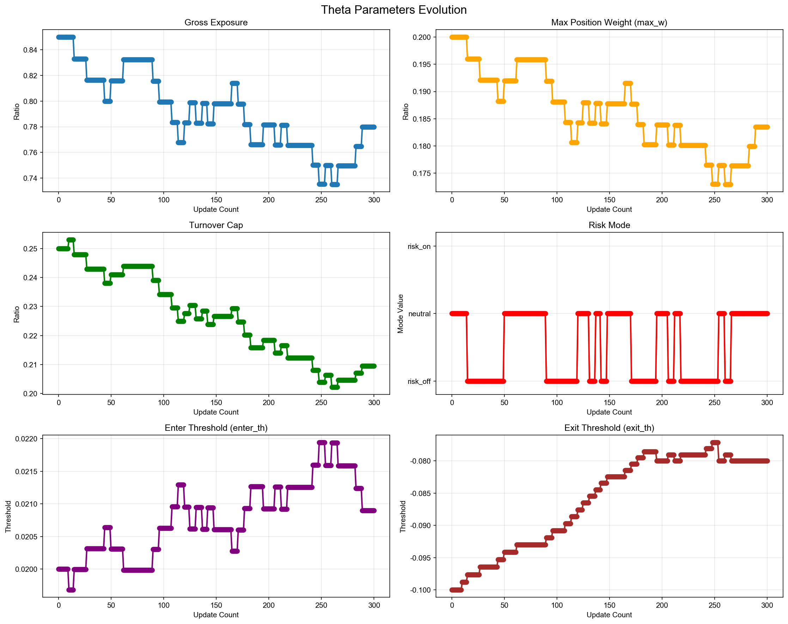
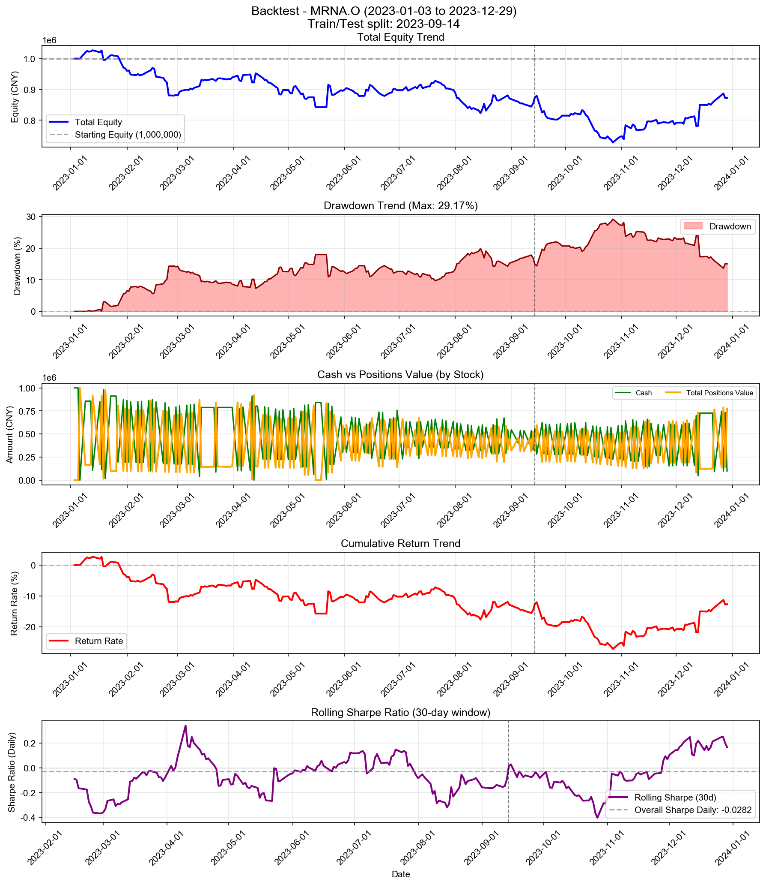

# Backtest

**策略名称:** 单股票交易系统（带每周反思层）  
**股票代码:** MRNA.O  
**回测期间:** 2023-01-03 至 2023-12-29  
**交易日数:** 250  
**初始资金:** 1000000.00 元

---

## 账户表现

| 项目 | 数值 |
|------|------|
| 初始资金 | 1000000.00 元 |
| 最终现金 | 100175.83 元 |
| 最终持仓市值 | 772495.78 元 |
| 最终总权益 | 872671.60 元 |
| 总盈亏 | -127328.40 元 |
| 总收益率 | -12.73% |
| 年化收益率 (CAGR) | -12.83% |

---

## 参数θ追踪

### 初始参数

| 参数 | 数值 |
|------|------|
| 总仓位上限 (gross_exposure) | 0.85 |
| 单票上限 (max_w) | 0.20 |
| 换手上限 (turnover_cap) | 0.25 |
| 风险模式 (risk_mode) | neutral |
| 进场阈值 (enter_th) | 0.020 |
| 出场阈值 (exit_th) | -0.100 |

### 最终参数

| 参数 | 数值 |
|------|------|
| 总仓位上限 (gross_exposure) | 0.78 |
| 单票上限 (max_w) | 0.18 |
| 换手上限 (turnover_cap) | 0.21 |
| 风险模式 (risk_mode) | neutral |
| 进场阈值 (enter_th) | 0.021 |
| 出场阈值 (exit_th) | -0.080 |

### 参数变化趋势图

---

## 持仓明细

| 股票代码 | 股数 | 成本价 | 现价 | 市值 | 权重 | 盈亏 | 收益率 |
|----------|------|--------|------|------|------|------|--------|
| MRNA.O | 776768 | 0.99 | 0.99 | 772495.78 | 88.52% | +180.06 | +0.02% |

---

## 交易统计

| 项目 | 数值 |
|------|------|
| 总交易次数 | 433 次 |
| 买入次数 | 220 次 |
| 卖出次数 | 213 次 |
| 买入总成本 | 83919017.70 元 |
| 卖出总收入 | 83019193.52 元 |
| 已实现盈亏 | -127508.46 元 |

### 交易质量指标

| 指标 | 数值 |
|------|------|
| 胜率 (Hit Rate) | 49.30% |
| 盈亏比 (Profit Factor) | 0.87 |
| 单笔平均收益 | -598.63 元 |
| 平均持仓周期 | 2.2 天 |

---

## 风险与稳健性

| 指标 | 数值 |
|------|------|
| 最大回撤 (Max Drawdown) | 29.17% |
| 年化波动率 (Volatility) | 24.27% |
| 年化夏普比率 (Sharpe) | -0.4480 |
| 日频夏普比率 (Sharpe Daily) | -0.0282 |
| 年化 Sortino 比率 | -0.4805 |
| 日频 Sortino 比率 | -0.0303 |
| Calmar 比率 (CAGR/MaxDD) | -0.4397 |
### 尾部风险 (Tail Risk)

| 指标 | 数值 |
|------|------|
| VaR 95% | -2.58% |
| VaR 99% | -4.33% |
| CVaR 95% | -3.53% |
| CVaR 99% | -5.03% |
| 极端日跌幅 (5%分位) | -2.62% |
| 极端日跌幅 (1%分位) | -4.55% |

---

## 执行与成本

| 指标 | 数值 |
|------|------|
| 换手率 (Turnover) | 9499.18% |
| 交易频率 (每日) | 1.73 次/日 |
| 交易频率 (每周) | 8.66 次/周 |

---

## 策略参数

---

## 交易记录

| 序号 | 日期 | 类型 | 股票代码 | 股数 | 价格 | 成本/收入 | 利润 |
|------|------|------|----------|------|------|-----------|------|
| 1 | 2023-01-06 | 买入 | MRNA.O | 88716 | 1.80 | 159999.31 | - |
| 2 | 2023-01-06 | 买入 | MRNA.O | 465761 | 1.80 | 839999.96 | - |
| 3 | 2023-01-09 | 卖出 | MRNA.O | 465760 | 1.84 | 856765.52 | +16767.36 |
| 4 | 2023-01-13 | 卖出 | MRNA.O | 3125 | 1.92 | 6000.00 | +364.06 |
| 5 | 2023-01-13 | 买入 | MRNA.O | 392737 | 1.92 | 754055.04 | - |
| 6 | 2023-01-17 | 卖出 | MRNA.O | 392674 | 1.91 | 748790.05 | +3041.83 |
| 7 | 2023-01-17 | 买入 | MRNA.O | 3475 | 1.91 | 6626.48 | - |
| 8 | 2023-01-18 | 卖出 | MRNA.O | 5769 | 1.97 | 11366.08 | +408.12 |
| 9 | 2023-01-18 | 买入 | MRNA.O | 379772 | 1.97 | 748226.79 | - |
| 10 | 2023-01-19 | 卖出 | MRNA.O | 463133 | 1.90 | 881712.61 | -24854.70 |
| 11 | 2023-01-19 | 买入 | MRNA.O | 7585 | 1.90 | 14440.32 | - |
| 12 | 2023-01-20 | 买入 | MRNA.O | 42733 | 1.94 | 82893.47 | - |
| 13 | 2023-01-20 | 买入 | MRNA.O | 454524 | 1.94 | 881685.66 | - |
| 14 | 2023-01-23 | 卖出 | MRNA.O | 454536 | 1.97 | 895163.20 | +13700.12 |
| 15 | 2023-01-27 | 卖出 | MRNA.O | 50306 | 1.89 | 95254.41 | -2301.96 |
| 16 | 2023-01-27 | 买入 | MRNA.O | 428390 | 1.89 | 811156.46 | - |
| 17 | 2023-01-30 | 卖出 | MRNA.O | 428390 | 1.81 | 774828.99 | -36327.47 |
| 18 | 2023-01-30 | 买入 | MRNA.O | 54673 | 1.81 | 98887.06 | - |
| 19 | 2023-01-31 | 卖出 | MRNA.O | 54673 | 1.76 | 96257.28 | -2629.77 |
| 20 | 2023-01-31 | 买入 | MRNA.O | 440243 | 1.76 | 775091.83 | - |
| 21 | 2023-02-01 | 卖出 | MRNA.O | 440243 | 1.74 | 767343.55 | -7748.28 |
| 22 | 2023-02-01 | 买入 | MRNA.O | 55670 | 1.74 | 97032.81 | - |
| 23 | 2023-02-02 | 卖出 | MRNA.O | 55670 | 1.76 | 98174.04 | +1141.23 |
| 24 | 2023-02-02 | 买入 | MRNA.O | 435061 | 1.76 | 767230.07 | - |
| 25 | 2023-02-03 | 卖出 | MRNA.O | 435061 | 1.73 | 753743.18 | -13486.89 |
| 26 | 2023-02-03 | 买入 | MRNA.O | 57444 | 1.73 | 99521.73 | - |
| 27 | 2023-02-06 | 卖出 | MRNA.O | 57444 | 1.70 | 97809.90 | -1711.83 |
| 28 | 2023-02-06 | 买入 | MRNA.O | 442776 | 1.70 | 753914.70 | - |
| 29 | 2023-02-07 | 卖出 | MRNA.O | 442776 | 1.71 | 757412.63 | +3497.93 |
| 30 | 2023-02-07 | 买入 | MRNA.O | 56974 | 1.71 | 97459.72 | - |
| 31 | 2023-02-08 | 卖出 | MRNA.O | 56974 | 1.64 | 93631.07 | -3828.65 |
| 32 | 2023-02-08 | 买入 | MRNA.O | 461115 | 1.64 | 757796.39 | - |
| 33 | 2023-02-09 | 卖出 | MRNA.O | 461115 | 1.64 | 758441.95 | +645.56 |
| 34 | 2023-02-09 | 买入 | MRNA.O | 56886 | 1.64 | 93566.09 | - |
| 35 | 2023-02-10 | 卖出 | MRNA.O | 56886 | 1.69 | 96296.62 | +2730.53 |
| 36 | 2023-02-10 | 买入 | MRNA.O | 447879 | 1.69 | 758169.57 | - |
| 37 | 2023-02-13 | 卖出 | MRNA.O | 447879 | 1.71 | 768022.91 | +9853.34 |
| 38 | 2023-02-13 | 买入 | MRNA.O | 55581 | 1.71 | 95310.30 | - |
| 39 | 2023-02-14 | 卖出 | MRNA.O | 2996 | 1.76 | 5261.58 | +124.03 |
| 40 | 2023-02-14 | 买入 | MRNA.O | 437190 | 1.76 | 767793.08 | - |
| 41 | 2023-02-15 | 卖出 | MRNA.O | 437242 | 1.77 | 775142.62 | +9201.73 |
| 42 | 2023-02-16 | 卖出 | MRNA.O | 52533 | 1.72 | 90519.61 | -1505.34 |
| 43 | 2023-02-16 | 买入 | MRNA.O | 452587 | 1.72 | 779852.66 | - |
| 44 | 2023-02-17 | 卖出 | MRNA.O | 452587 | 1.67 | 754009.94 | -25842.72 |
| 45 | 2023-02-17 | 买入 | MRNA.O | 55885 | 1.67 | 93104.41 | - |
| 46 | 2023-02-21 | 卖出 | MRNA.O | 55885 | 1.60 | 89466.30 | -3638.11 |
| 47 | 2023-02-21 | 买入 | MRNA.O | 471218 | 1.60 | 754372.90 | - |
| 48 | 2023-02-22 | 卖出 | MRNA.O | 471218 | 1.58 | 745325.51 | -9047.39 |
| 49 | 2023-02-22 | 买入 | MRNA.O | 57135 | 1.58 | 90370.43 | - |
| 50 | 2023-02-23 | 卖出 | MRNA.O | 57135 | 1.48 | 84314.12 | -6056.31 |
| 51 | 2023-02-23 | 买入 | MRNA.O | 505477 | 1.48 | 745932.41 | - |
| 52 | 2023-02-24 | 卖出 | MRNA.O | 505477 | 1.39 | 703927.27 | -42005.14 |
| 53 | 2023-02-24 | 买入 | MRNA.O | 63560 | 1.39 | 88513.66 | - |
| 54 | 2023-02-27 | 卖出 | MRNA.O | 63559 | 1.38 | 87883.03 | -629.23 |
| 55 | 2023-02-27 | 买入 | MRNA.O | 509142 | 1.38 | 703990.64 | - |
| 56 | 2023-02-28 | 卖出 | MRNA.O | 509142 | 1.39 | 706740.01 | +2749.36 |
| 57 | 2023-02-28 | 买入 | MRNA.O | 63114 | 1.39 | 87608.54 | - |
| 58 | 2023-03-01 | 卖出 | MRNA.O | 63115 | 1.36 | 85621.81 | -1988.12 |
| 59 | 2023-03-01 | 买入 | MRNA.O | 521110 | 1.36 | 706937.83 | - |
| 60 | 2023-03-02 | 卖出 | MRNA.O | 521110 | 1.38 | 718402.25 | +11464.42 |
| 61 | 2023-03-02 | 买入 | MRNA.O | 61277 | 1.38 | 84476.47 | - |
| 62 | 2023-03-03 | 卖出 | MRNA.O | 61276 | 1.43 | 87747.23 | +3272.14 |
| 63 | 2023-03-03 | 买入 | MRNA.O | 501449 | 1.43 | 718074.97 | - |
| 64 | 2023-03-06 | 卖出 | MRNA.O | 501450 | 1.44 | 722238.44 | +4162.09 |
| 65 | 2023-03-06 | 买入 | MRNA.O | 60634 | 1.44 | 87331.15 | - |
| 66 | 2023-03-07 | 卖出 | MRNA.O | 60634 | 1.41 | 85524.26 | -1806.89 |
| 67 | 2023-03-07 | 买入 | MRNA.O | 512172 | 1.41 | 722418.61 | - |
| 68 | 2023-03-08 | 卖出 | MRNA.O | 512171 | 1.42 | 727692.56 | +5275.36 |
| 69 | 2023-03-08 | 买入 | MRNA.O | 59823 | 1.42 | 84996.52 | - |
| 70 | 2023-03-09 | 卖出 | MRNA.O | 59823 | 1.37 | 82172.87 | -2823.64 |
| 71 | 2023-03-09 | 买入 | MRNA.O | 529976 | 1.37 | 727975.03 | - |
| 72 | 2023-03-10 | 卖出 | MRNA.O | 529977 | 1.38 | 732905.19 | +4928.74 |
| 73 | 2023-03-10 | 买入 | MRNA.O | 59064 | 1.38 | 81679.61 | - |
| 74 | 2023-03-13 | 买入 | MRNA.O | 35524 | 1.48 | 52540.00 | - |
| 75 | 2023-03-13 | 买入 | MRNA.O | 495158 | 1.48 | 732338.68 | - |
| 76 | 2023-03-14 | 卖出 | MRNA.O | 495246 | 1.51 | 749208.15 | +21505.84 |
| 77 | 2023-03-22 | 买入 | MRNA.O | 3596 | 1.48 | 5328.55 | - |
| 78 | 2023-03-22 | 买入 | MRNA.O | 469002 | 1.48 | 694967.16 | - |
| 79 | 2023-03-23 | 卖出 | MRNA.O | 469078 | 1.49 | 700896.35 | +6787.75 |
| 80 | 2023-04-03 | 卖出 | MRNA.O | 5214 | 1.59 | 8315.29 | +599.98 |
| 81 | 2023-04-03 | 买入 | MRNA.O | 435088 | 1.59 | 693878.34 | - |
| 82 | 2023-04-04 | 卖出 | MRNA.O | 434897 | 1.57 | 680700.78 | -4075.04 |
| 83 | 2023-04-04 | 买入 | MRNA.O | 6311 | 1.57 | 9877.98 | - |
| 84 | 2023-04-05 | 卖出 | MRNA.O | 5355 | 1.55 | 8279.37 | -149.27 |
| 85 | 2023-04-05 | 买入 | MRNA.O | 440392 | 1.55 | 680890.07 | - |
| 86 | 2023-04-06 | 卖出 | MRNA.O | 440629 | 1.58 | 697383.52 | +13967.43 |
| 87 | 2023-04-06 | 买入 | MRNA.O | 3996 | 1.58 | 6324.47 | - |
| 88 | 2023-04-10 | 卖出 | MRNA.O | 4916 | 1.60 | 7872.97 | +241.88 |
| 89 | 2023-04-10 | 买入 | MRNA.O | 435341 | 1.60 | 697198.61 | - |
| 90 | 2023-04-11 | 卖出 | MRNA.O | 528137 | 1.55 | 819932.69 | -21312.92 |
| 91 | 2023-04-11 | 买入 | MRNA.O | 6739 | 1.55 | 10462.30 | - |
| 92 | 2023-04-12 | 买入 | MRNA.O | 86190 | 1.56 | 134077.16 | - |
| 93 | 2023-04-12 | 买入 | MRNA.O | 500206 | 1.56 | 778120.45 | - |
| 94 | 2023-04-13 | 卖出 | MRNA.O | 500205 | 1.61 | 802979.09 | +24877.81 |
| 95 | 2023-04-17 | 卖出 | MRNA.O | 92930 | 1.44 | 133791.32 | -10767.31 |
| 96 | 2023-04-17 | 买入 | MRNA.O | 492674 | 1.44 | 709302.76 | - |
| 97 | 2023-04-18 | 卖出 | MRNA.O | 492674 | 1.43 | 702700.93 | -6601.83 |
| 98 | 2023-04-18 | 买入 | MRNA.O | 94266 | 1.43 | 134451.60 | - |
| 99 | 2023-04-19 | 卖出 | MRNA.O | 94265 | 1.43 | 134629.27 | +179.10 |
| 100 | 2023-04-19 | 买入 | MRNA.O | 492006 | 1.43 | 702682.97 | - |
| 101 | 2023-04-20 | 卖出 | MRNA.O | 492007 | 1.41 | 694418.68 | -8265.72 |
| 102 | 2023-04-20 | 买入 | MRNA.O | 95972 | 1.41 | 135454.88 | - |
| 103 | 2023-04-21 | 卖出 | MRNA.O | 95971 | 1.41 | 135175.15 | -278.32 |
| 104 | 2023-04-21 | 买入 | MRNA.O | 493040 | 1.41 | 694446.84 | - |
| 105 | 2023-04-24 | 卖出 | MRNA.O | 493041 | 1.38 | 681086.84 | -13361.41 |
| 106 | 2023-04-24 | 买入 | MRNA.O | 98821 | 1.38 | 136511.33 | - |
| 107 | 2023-04-25 | 卖出 | MRNA.O | 98821 | 1.35 | 133309.53 | -3201.80 |
| 108 | 2023-04-25 | 买入 | MRNA.O | 505120 | 1.35 | 681406.88 | - |
| 109 | 2023-04-26 | 卖出 | MRNA.O | 505120 | 1.31 | 660292.86 | -21114.02 |
| 110 | 2023-04-26 | 买入 | MRNA.O | 103597 | 1.31 | 135422.00 | - |
| 111 | 2023-04-27 | 卖出 | MRNA.O | 103596 | 1.30 | 134747.32 | -673.37 |
| 112 | 2023-04-27 | 买入 | MRNA.O | 507696 | 1.30 | 660360.19 | - |
| 113 | 2023-04-28 | 卖出 | MRNA.O | 507697 | 1.33 | 674678.54 | +14317.05 |
| 114 | 2023-04-28 | 买入 | MRNA.O | 100320 | 1.33 | 133315.25 | - |
| 115 | 2023-05-01 | 卖出 | MRNA.O | 100320 | 1.33 | 133826.88 | +511.63 |
| 116 | 2023-05-01 | 买入 | MRNA.O | 505717 | 1.33 | 674626.48 | - |
| 117 | 2023-05-02 | 卖出 | MRNA.O | 505717 | 1.31 | 664512.14 | -10114.34 |
| 118 | 2023-05-02 | 买入 | MRNA.O | 102617 | 1.31 | 134838.74 | - |
| 119 | 2023-05-03 | 卖出 | MRNA.O | 102617 | 1.30 | 133545.76 | -1292.97 |
| 120 | 2023-05-03 | 买入 | MRNA.O | 510713 | 1.30 | 664641.90 | - |
| 121 | 2023-05-04 | 卖出 | MRNA.O | 510713 | 1.34 | 686040.77 | +21398.87 |
| 122 | 2023-05-04 | 买入 | MRNA.O | 97823 | 1.34 | 131405.64 | - |
| 123 | 2023-05-05 | 卖出 | MRNA.O | 97823 | 1.37 | 134056.64 | +2651.00 |
| 124 | 2023-05-05 | 买入 | MRNA.O | 500420 | 1.37 | 685775.57 | - |
| 125 | 2023-05-08 | 卖出 | MRNA.O | 500420 | 1.32 | 659303.35 | -26472.22 |
| 126 | 2023-05-08 | 买入 | MRNA.O | 103760 | 1.32 | 136703.80 | - |
| 127 | 2023-05-09 | 卖出 | MRNA.O | 41433 | 1.34 | 55424.92 | +836.95 |
| 128 | 2023-05-09 | 买入 | MRNA.O | 492707 | 1.34 | 659094.15 | - |
| 129 | 2023-05-10 | 卖出 | MRNA.O | 555034 | 1.31 | 726150.98 | -15058.99 |
| 130 | 2023-05-10 | 买入 | MRNA.O | 43611 | 1.31 | 57056.27 | - |
| 131 | 2023-05-11 | 卖出 | MRNA.O | 43611 | 1.28 | 56000.89 | -1055.39 |
| 132 | 2023-05-11 | 买入 | MRNA.O | 565576 | 1.28 | 726256.14 | - |
| 133 | 2023-05-12 | 卖出 | MRNA.O | 565576 | 1.29 | 731289.77 | +5033.63 |
| 134 | 2023-05-12 | 买入 | MRNA.O | 42922 | 1.29 | 55498.15 | - |
| 135 | 2023-05-15 | 买入 | MRNA.O | 18960 | 1.30 | 24697.30 | - |
| 136 | 2023-05-15 | 买入 | MRNA.O | 561376 | 1.30 | 731248.38 | - |
| 137 | 2023-05-16 | 卖出 | MRNA.O | 623258 | 1.25 | 779758.08 | -31685.74 |
| 138 | 2023-05-22 | 买入 | MRNA.O | 60041 | 1.27 | 76095.96 | - |
| 139 | 2023-05-22 | 买入 | MRNA.O | 598288 | 1.27 | 758270.21 | - |
| 140 | 2023-05-23 | 卖出 | MRNA.O | 598333 | 1.38 | 824203.71 | +65876.46 |
| 141 | 2023-05-24 | 卖出 | MRNA.O | 59996 | 1.32 | 78948.74 | +2909.81 |
| 142 | 2023-05-24 | 买入 | MRNA.O | 563287 | 1.32 | 741229.36 | - |
| 143 | 2023-05-25 | 卖出 | MRNA.O | 563287 | 1.26 | 712389.07 | -28840.29 |
| 144 | 2023-05-25 | 买入 | MRNA.O | 64706 | 1.26 | 81833.68 | - |
| 145 | 2023-05-26 | 卖出 | MRNA.O | 64706 | 1.26 | 81684.85 | -148.82 |
| 146 | 2023-05-26 | 买入 | MRNA.O | 564325 | 1.26 | 712403.88 | - |
| 147 | 2023-05-30 | 卖出 | MRNA.O | 461710 | 1.29 | 595098.02 | +12235.31 |
| 148 | 2023-05-30 | 买入 | MRNA.O | 62215 | 1.29 | 80188.91 | - |
| 149 | 2023-05-31 | 卖出 | MRNA.O | 164830 | 1.28 | 210504.39 | +774.30 |
| 150 | 2023-05-31 | 买入 | MRNA.O | 466128 | 1.28 | 595292.07 | - |
| 151 | 2023-06-01 | 卖出 | MRNA.O | 363007 | 1.29 | 466536.60 | +2940.36 |
| 152 | 2023-06-01 | 买入 | MRNA.O | 163498 | 1.29 | 210127.63 | - |
| 153 | 2023-06-02 | 卖出 | MRNA.O | 162429 | 1.31 | 211986.09 | +3741.20 |
| 154 | 2023-06-02 | 买入 | MRNA.O | 357065 | 1.31 | 466005.53 | - |
| 155 | 2023-06-05 | 卖出 | MRNA.O | 461255 | 1.29 | 594557.70 | -5026.41 |
| 156 | 2023-06-05 | 买入 | MRNA.O | 165034 | 1.29 | 212728.83 | - |
| 157 | 2023-06-06 | 卖出 | MRNA.O | 165034 | 1.27 | 209428.15 | -3300.68 |
| 158 | 2023-06-06 | 买入 | MRNA.O | 468785 | 1.27 | 594888.17 | - |
| 159 | 2023-06-07 | 卖出 | MRNA.O | 468784 | 1.26 | 588839.58 | -6047.31 |
| 160 | 2023-06-07 | 买入 | MRNA.O | 167210 | 1.26 | 210032.48 | - |
| 161 | 2023-06-08 | 卖出 | MRNA.O | 167211 | 1.25 | 208913.42 | -1120.33 |
| 162 | 2023-06-08 | 买入 | MRNA.O | 471388 | 1.25 | 588952.17 | - |
| 163 | 2023-06-09 | 卖出 | MRNA.O | 471388 | 1.23 | 581032.85 | -7919.32 |
| 164 | 2023-06-09 | 买入 | MRNA.O | 170132 | 1.23 | 209704.70 | - |
| 165 | 2023-06-12 | 卖出 | MRNA.O | 170132 | 1.24 | 210147.05 | +442.34 |
| 166 | 2023-06-12 | 买入 | MRNA.O | 470360 | 1.24 | 580988.67 | - |
| 167 | 2023-06-13 | 卖出 | MRNA.O | 405598 | 1.28 | 519084.32 | +18089.67 |
| 168 | 2023-06-13 | 买入 | MRNA.O | 162564 | 1.28 | 208049.41 | - |
| 169 | 2023-06-14 | 卖出 | MRNA.O | 161893 | 1.26 | 204066.13 | -1067.54 |
| 170 | 2023-06-14 | 买入 | MRNA.O | 412156 | 1.26 | 519522.64 | - |
| 171 | 2023-06-15 | 卖出 | MRNA.O | 412804 | 1.30 | 536562.64 | +15850.26 |
| 172 | 2023-06-15 | 买入 | MRNA.O | 155554 | 1.30 | 202189.09 | - |
| 173 | 2023-06-16 | 卖出 | MRNA.O | 113906 | 1.29 | 146631.19 | -137.88 |
| 174 | 2023-06-16 | 买入 | MRNA.O | 417027 | 1.29 | 536838.86 | - |
| 175 | 2023-06-20 | 卖出 | MRNA.O | 523460 | 1.24 | 650294.36 | -23684.54 |
| 176 | 2023-06-20 | 买入 | MRNA.O | 119928 | 1.24 | 148986.55 | - |
| 177 | 2023-06-21 | 卖出 | MRNA.O | 119928 | 1.21 | 145196.83 | -3789.72 |
| 178 | 2023-06-21 | 买入 | MRNA.O | 537435 | 1.21 | 650672.55 | - |
| 179 | 2023-06-22 | 卖出 | MRNA.O | 537435 | 1.20 | 647501.69 | -3170.87 |
| 180 | 2023-06-22 | 买入 | MRNA.O | 120779 | 1.20 | 145514.54 | - |
| 181 | 2023-06-23 | 卖出 | MRNA.O | 120779 | 1.19 | 143123.12 | -2391.42 |
| 182 | 2023-06-23 | 买入 | MRNA.O | 546617 | 1.19 | 647741.15 | - |
| 183 | 2023-06-26 | 卖出 | MRNA.O | 478639 | 1.20 | 576329.22 | +9142.00 |
| 184 | 2023-06-26 | 买入 | MRNA.O | 117996 | 1.20 | 142078.98 | - |
| 185 | 2023-06-27 | 卖出 | MRNA.O | 118106 | 1.21 | 142518.51 | +1131.63 |
| 186 | 2023-06-27 | 买入 | MRNA.O | 477567 | 1.21 | 576280.10 | - |
| 187 | 2023-06-28 | 卖出 | MRNA.O | 477902 | 1.23 | 587819.46 | +11704.88 |
| 188 | 2023-06-28 | 买入 | MRNA.O | 114836 | 1.23 | 141248.28 | - |
| 189 | 2023-06-29 | 卖出 | MRNA.O | 114466 | 1.22 | 139774.43 | +19.43 |
| 190 | 2023-06-29 | 买入 | MRNA.O | 481518 | 1.22 | 587981.63 | - |
| 191 | 2023-06-30 | 卖出 | MRNA.O | 549421 | 1.22 | 667546.52 | -3339.94 |
| 192 | 2023-06-30 | 买入 | MRNA.O | 115317 | 1.22 | 140110.15 | - |
| 193 | 2023-07-03 | 卖出 | MRNA.O | 115316 | 1.22 | 140374.17 | +265.23 |
| 194 | 2023-07-03 | 买入 | MRNA.O | 548361 | 1.22 | 667519.85 | - |
| 195 | 2023-07-05 | 卖出 | MRNA.O | 437995 | 1.24 | 541099.02 | +7927.71 |
| 196 | 2023-07-05 | 买入 | MRNA.O | 112823 | 1.24 | 139381.53 | - |
| 197 | 2023-07-06 | 卖出 | MRNA.O | 223190 | 1.18 | 264011.45 | -9719.83 |
| 198 | 2023-07-06 | 买入 | MRNA.O | 458425 | 1.18 | 542270.93 | - |
| 199 | 2023-07-07 | 卖出 | MRNA.O | 458424 | 1.19 | 544928.61 | +2658.86 |
| 200 | 2023-07-07 | 买入 | MRNA.O | 221877 | 1.19 | 263745.19 | - |
| 201 | 2023-07-10 | 卖出 | MRNA.O | 221878 | 1.23 | 273109.63 | +9363.26 |
| 202 | 2023-07-10 | 买入 | MRNA.O | 441947 | 1.23 | 543992.56 | - |
| 203 | 2023-07-11 | 卖出 | MRNA.O | 441947 | 1.22 | 539749.87 | -4242.69 |
| 204 | 2023-07-11 | 买入 | MRNA.O | 223969 | 1.22 | 273533.34 | - |
| 205 | 2023-07-12 | 卖出 | MRNA.O | 115145 | 1.26 | 144990.58 | +4364.00 |
| 206 | 2023-07-12 | 买入 | MRNA.O | 427971 | 1.26 | 538901.08 | - |
| 207 | 2023-07-13 | 卖出 | MRNA.O | 428125 | 1.27 | 542049.06 | +6243.53 |
| 208 | 2023-07-13 | 买入 | MRNA.O | 114225 | 1.27 | 144620.27 | - |
| 209 | 2023-07-14 | 卖出 | MRNA.O | 222895 | 1.21 | 270483.08 | -10139.50 |
| 210 | 2023-07-14 | 买入 | MRNA.O | 447649 | 1.21 | 543222.06 | - |
| 211 | 2023-07-17 | 卖出 | MRNA.O | 447649 | 1.23 | 548817.67 | +5595.61 |
| 212 | 2023-07-17 | 买入 | MRNA.O | 220166 | 1.23 | 269923.52 | - |
| 213 | 2023-07-18 | 卖出 | MRNA.O | 220166 | 1.23 | 269945.53 | +22.02 |
| 214 | 2023-07-18 | 买入 | MRNA.O | 447610 | 1.23 | 548814.62 | - |
| 215 | 2023-07-19 | 卖出 | MRNA.O | 447610 | 1.25 | 560273.44 | +11458.82 |
| 216 | 2023-07-19 | 买入 | MRNA.O | 214748 | 1.25 | 268800.07 | - |
| 217 | 2023-07-20 | 卖出 | MRNA.O | 214748 | 1.25 | 267941.08 | -858.99 |
| 218 | 2023-07-20 | 买入 | MRNA.O | 449114 | 1.25 | 560359.54 | - |
| 219 | 2023-07-21 | 卖出 | MRNA.O | 449114 | 1.26 | 567814.83 | +7455.29 |
| 220 | 2023-07-21 | 买入 | MRNA.O | 211338 | 1.26 | 267194.63 | - |
| 221 | 2023-07-24 | 卖出 | MRNA.O | 211338 | 1.23 | 259966.87 | -7227.76 |
| 222 | 2023-07-24 | 买入 | MRNA.O | 462189 | 1.23 | 568538.69 | - |
| 223 | 2023-07-25 | 卖出 | MRNA.O | 462188 | 1.22 | 563268.52 | -5268.94 |
| 224 | 2023-07-25 | 买入 | MRNA.O | 213747 | 1.22 | 260493.47 | - |
| 225 | 2023-07-26 | 卖出 | MRNA.O | 213748 | 1.21 | 257886.96 | -2607.74 |
| 226 | 2023-07-26 | 买入 | MRNA.O | 467078 | 1.21 | 563529.61 | - |
| 227 | 2023-07-27 | 卖出 | MRNA.O | 467078 | 1.19 | 553534.14 | -9995.47 |
| 228 | 2023-07-27 | 买入 | MRNA.O | 218451 | 1.19 | 258886.28 | - |
| 229 | 2023-07-28 | 卖出 | MRNA.O | 218451 | 1.19 | 259213.96 | +327.68 |
| 230 | 2023-07-28 | 买入 | MRNA.O | 466460 | 1.19 | 553501.44 | - |
| 231 | 2023-07-31 | 卖出 | MRNA.O | 466460 | 1.18 | 548836.84 | -4664.60 |
| 232 | 2023-07-31 | 买入 | MRNA.O | 220704 | 1.18 | 259680.33 | - |
| 233 | 2023-08-01 | 卖出 | MRNA.O | 220704 | 1.14 | 251470.14 | -8210.19 |
| 234 | 2023-08-01 | 买入 | MRNA.O | 482410 | 1.14 | 549657.95 | - |
| 235 | 2023-08-02 | 卖出 | MRNA.O | 482410 | 1.10 | 531712.30 | -17945.65 |
| 236 | 2023-08-02 | 买入 | MRNA.O | 229781 | 1.10 | 253264.62 | - |
| 237 | 2023-08-03 | 卖出 | MRNA.O | 229781 | 1.10 | 252644.21 | -620.41 |
| 238 | 2023-08-03 | 买入 | MRNA.O | 483651 | 1.10 | 531774.27 | - |
| 239 | 2023-08-04 | 卖出 | MRNA.O | 483651 | 1.08 | 523262.02 | -8512.26 |
| 240 | 2023-08-04 | 买入 | MRNA.O | 234306 | 1.08 | 253495.66 | - |
| 241 | 2023-08-07 | 卖出 | MRNA.O | 234306 | 1.01 | 237117.67 | -16377.99 |
| 242 | 2023-08-07 | 买入 | MRNA.O | 518675 | 1.01 | 524899.10 | - |
| 243 | 2023-08-08 | 卖出 | MRNA.O | 518675 | 1.00 | 517326.44 | -7572.66 |
| 244 | 2023-08-08 | 买入 | MRNA.O | 238495 | 1.00 | 237874.91 | - |
| 245 | 2023-08-09 | 卖出 | MRNA.O | 238495 | 1.02 | 242835.61 | +4960.70 |
| 246 | 2023-08-09 | 买入 | MRNA.O | 507593 | 1.02 | 516831.19 | - |
| 247 | 2023-08-10 | 卖出 | MRNA.O | 507593 | 1.00 | 509014.26 | -7816.93 |
| 248 | 2023-08-10 | 买入 | MRNA.O | 242937 | 1.00 | 243617.22 | - |
| 249 | 2023-08-11 | 卖出 | MRNA.O | 242937 | 1.01 | 246556.76 | +2939.54 |
| 250 | 2023-08-11 | 买入 | MRNA.O | 501251 | 1.01 | 508719.64 | - |
| 251 | 2023-08-14 | 卖出 | MRNA.O | 501251 | 1.00 | 501251.00 | -7468.64 |
| 252 | 2023-08-14 | 买入 | MRNA.O | 247304 | 1.00 | 247304.00 | - |
| 253 | 2023-08-15 | 卖出 | MRNA.O | 247304 | 0.96 | 238425.79 | -8878.21 |
| 254 | 2023-08-15 | 买入 | MRNA.O | 520837 | 0.96 | 502138.95 | - |
| 255 | 2023-08-16 | 卖出 | MRNA.O | 520837 | 0.99 | 515211.96 | +13073.01 |
| 256 | 2023-08-16 | 买入 | MRNA.O | 239707 | 0.99 | 237118.16 | - |
| 257 | 2023-08-17 | 卖出 | MRNA.O | 239707 | 1.06 | 254664.72 | +17546.55 |
| 258 | 2023-08-17 | 买入 | MRNA.O | 483300 | 1.06 | 513457.92 | - |
| 259 | 2023-08-18 | 卖出 | MRNA.O | 483300 | 1.02 | 491129.46 | -22328.46 |
| 260 | 2023-08-18 | 买入 | MRNA.O | 252802 | 1.02 | 256897.39 | - |
| 261 | 2023-08-21 | 卖出 | MRNA.O | 183415 | 1.11 | 203737.38 | +17351.06 |
| 262 | 2023-08-21 | 买入 | MRNA.O | 439987 | 1.11 | 488737.56 | - |
| 263 | 2023-08-22 | 卖出 | MRNA.O | 441029 | 1.16 | 512652.11 | +28440.38 |
| 264 | 2023-08-22 | 买入 | MRNA.O | 173012 | 1.16 | 201109.15 | - |
| 265 | 2023-08-23 | 卖出 | MRNA.O | 172698 | 1.15 | 199397.11 | +1806.53 |
| 266 | 2023-08-23 | 买入 | MRNA.O | 444171 | 1.15 | 512839.84 | - |
| 267 | 2023-08-24 | 卖出 | MRNA.O | 512829 | 1.13 | 577701.87 | -13692.28 |
| 268 | 2023-08-24 | 买入 | MRNA.O | 178286 | 1.13 | 200839.18 | - |
| 269 | 2023-08-25 | 卖出 | MRNA.O | 178287 | 1.12 | 199556.64 | -1283.69 |
| 270 | 2023-08-25 | 买入 | MRNA.O | 516242 | 1.12 | 577829.67 | - |
| 271 | 2023-08-28 | 卖出 | MRNA.O | 516242 | 1.14 | 587638.27 | +9808.60 |
| 272 | 2023-08-28 | 买入 | MRNA.O | 174449 | 1.14 | 198575.30 | - |
| 273 | 2023-08-29 | 卖出 | MRNA.O | 174449 | 1.16 | 202343.40 | +3768.10 |
| 274 | 2023-08-29 | 买入 | MRNA.O | 506304 | 1.16 | 587262.01 | - |
| 275 | 2023-08-30 | 卖出 | MRNA.O | 395231 | 1.17 | 460918.39 | +2489.96 |
| 276 | 2023-08-30 | 买入 | MRNA.O | 173233 | 1.17 | 202024.32 | - |
| 277 | 2023-08-31 | 卖出 | MRNA.O | 284306 | 1.13 | 321464.79 | -9393.10 |
| 278 | 2023-08-31 | 买入 | MRNA.O | 408533 | 1.13 | 461928.26 | - |
| 279 | 2023-09-01 | 卖出 | MRNA.O | 408533 | 1.13 | 459844.74 | -2083.52 |
| 280 | 2023-09-01 | 买入 | MRNA.O | 285779 | 1.13 | 321672.84 | - |
| 281 | 2023-09-05 | 卖出 | MRNA.O | 285779 | 1.09 | 312527.91 | -9144.93 |
| 282 | 2023-09-05 | 买入 | MRNA.O | 421323 | 1.09 | 460758.83 | - |
| 283 | 2023-09-06 | 卖出 | MRNA.O | 421323 | 1.08 | 456040.02 | -4718.82 |
| 284 | 2023-09-06 | 买入 | MRNA.O | 289172 | 1.08 | 312999.77 | - |
| 285 | 2023-09-07 | 卖出 | MRNA.O | 289172 | 1.08 | 313317.86 | +318.09 |
| 286 | 2023-09-07 | 买入 | MRNA.O | 420866 | 1.08 | 456008.31 | - |
| 287 | 2023-09-08 | 卖出 | MRNA.O | 420866 | 1.08 | 453020.16 | -2988.15 |
| 288 | 2023-09-08 | 买入 | MRNA.O | 291357 | 1.08 | 313616.67 | - |
| 289 | 2023-09-11 | 卖出 | MRNA.O | 291357 | 1.06 | 308255.71 | -5360.97 |
| 290 | 2023-09-11 | 买入 | MRNA.O | 428692 | 1.06 | 453556.14 | - |
| 291 | 2023-09-12 | 卖出 | MRNA.O | 428692 | 1.05 | 451155.46 | -2400.68 |
| 292 | 2023-09-12 | 买入 | MRNA.O | 293136 | 1.05 | 308496.33 | - |
| 293 | 2023-09-13 | 卖出 | MRNA.O | 222284 | 1.09 | 241378.20 | +7446.51 |
| 294 | 2023-09-13 | 买入 | MRNA.O | 414562 | 1.09 | 450172.88 | - |
| 295 | 2023-09-14 | 卖出 | MRNA.O | 415577 | 1.13 | 468812.41 | +19569.41 |
| 296 | 2023-09-14 | 买入 | MRNA.O | 212153 | 1.13 | 239329.80 | - |
| 297 | 2023-09-15 | 卖出 | MRNA.O | 169142 | 1.15 | 193819.82 | +4983.28 |
| 298 | 2023-09-15 | 买入 | MRNA.O | 408684 | 1.15 | 468311.00 | - |
| 299 | 2023-09-18 | 卖出 | MRNA.O | 521532 | 1.04 | 543123.42 | -51175.35 |
| 300 | 2023-09-18 | 买入 | MRNA.O | 191348 | 1.04 | 199269.81 | - |
| 301 | 2023-09-19 | 卖出 | MRNA.O | 191348 | 1.07 | 204244.86 | +4975.05 |
| 302 | 2023-09-19 | 买入 | MRNA.O | 508362 | 1.07 | 542625.60 | - |
| 303 | 2023-09-20 | 卖出 | MRNA.O | 508362 | 1.04 | 526307.18 | -16318.42 |
| 304 | 2023-09-20 | 买入 | MRNA.O | 198857 | 1.04 | 205876.65 | - |
| 305 | 2023-09-21 | 卖出 | MRNA.O | 198857 | 1.00 | 199314.37 | -6562.28 |
| 306 | 2023-09-21 | 买入 | MRNA.O | 525754 | 1.00 | 526963.23 | - |
| 307 | 2023-09-22 | 卖出 | MRNA.O | 525754 | 1.00 | 525701.42 | -1261.81 |
| 308 | 2023-09-22 | 买入 | MRNA.O | 199461 | 1.00 | 199441.05 | - |
| 309 | 2023-09-25 | 卖出 | MRNA.O | 199461 | 0.98 | 195810.86 | -3630.19 |
| 310 | 2023-09-25 | 买入 | MRNA.O | 535871 | 0.98 | 526064.56 | - |
| 311 | 2023-09-26 | 卖出 | MRNA.O | 535871 | 0.98 | 525796.63 | -267.94 |
| 312 | 2023-09-26 | 买入 | MRNA.O | 199590 | 0.98 | 195837.71 | - |
| 313 | 2023-09-27 | 卖出 | MRNA.O | 199590 | 0.99 | 198472.30 | +2634.59 |
| 314 | 2023-09-27 | 买入 | MRNA.O | 528492 | 0.99 | 525532.44 | - |
| 315 | 2023-09-28 | 卖出 | MRNA.O | 528492 | 1.00 | 529918.93 | +4386.48 |
| 316 | 2023-09-28 | 买入 | MRNA.O | 197501 | 1.00 | 198034.25 | - |
| 317 | 2023-09-29 | 卖出 | MRNA.O | 197501 | 1.03 | 203998.78 | +5964.53 |
| 318 | 2023-09-29 | 买入 | MRNA.O | 512462 | 1.03 | 529322.00 | - |
| 319 | 2023-10-02 | 卖出 | MRNA.O | 512462 | 1.03 | 529424.49 | +102.49 |
| 320 | 2023-10-02 | 买入 | MRNA.O | 197453 | 1.03 | 203988.69 | - |
| 321 | 2023-10-03 | 卖出 | MRNA.O | 197453 | 1.03 | 203534.55 | -454.14 |
| 322 | 2023-10-03 | 买入 | MRNA.O | 513650 | 1.03 | 529470.42 | - |
| 323 | 2023-10-04 | 卖出 | MRNA.O | 513650 | 1.04 | 535531.49 | +6061.07 |
| 324 | 2023-10-04 | 买入 | MRNA.O | 194636 | 1.04 | 202927.49 | - |
| 325 | 2023-10-05 | 卖出 | MRNA.O | 194636 | 1.03 | 200416.69 | -2510.80 |
| 326 | 2023-10-05 | 买入 | MRNA.O | 520329 | 1.03 | 535782.77 | - |
| 327 | 2023-10-06 | 卖出 | MRNA.O | 520329 | 1.04 | 540517.77 | +4734.99 |
| 328 | 2023-10-06 | 买入 | MRNA.O | 192475 | 1.04 | 199943.03 | - |
| 329 | 2023-10-09 | 卖出 | MRNA.O | 192475 | 1.02 | 196016.54 | -3926.49 |
| 330 | 2023-10-09 | 买入 | MRNA.O | 531138 | 1.02 | 540910.94 | - |
| 331 | 2023-10-10 | 卖出 | MRNA.O | 459332 | 1.04 | 479680.41 | +11896.70 |
| 332 | 2023-10-10 | 买入 | MRNA.O | 186384 | 1.04 | 194640.81 | - |
| 333 | 2023-10-11 | 卖出 | MRNA.O | 185595 | 1.03 | 190717.42 | -1762.57 |
| 334 | 2023-10-11 | 买入 | MRNA.O | 467216 | 1.03 | 480111.16 | - |
| 335 | 2023-10-12 | 卖出 | MRNA.O | 539811 | 1.01 | 544021.53 | -11377.68 |
| 336 | 2023-10-12 | 买入 | MRNA.O | 190302 | 1.01 | 191786.36 | - |
| 337 | 2023-10-13 | 卖出 | MRNA.O | 190302 | 0.98 | 187066.87 | -4719.49 |
| 338 | 2023-10-13 | 买入 | MRNA.O | 553910 | 0.98 | 544493.53 | - |
| 339 | 2023-10-16 | 卖出 | MRNA.O | 553910 | 0.92 | 509264.85 | -35228.68 |
| 340 | 2023-10-16 | 买入 | MRNA.O | 207298 | 0.92 | 190589.78 | - |
| 341 | 2023-10-17 | 卖出 | MRNA.O | 207298 | 0.86 | 178960.36 | -11629.42 |
| 342 | 2023-10-17 | 买入 | MRNA.O | 591252 | 0.86 | 510427.85 | - |
| 343 | 2023-10-18 | 卖出 | MRNA.O | 591252 | 0.86 | 508535.85 | -1892.01 |
| 344 | 2023-10-18 | 买入 | MRNA.O | 208290 | 0.86 | 179150.23 | - |
| 345 | 2023-10-19 | 卖出 | MRNA.O | 208290 | 0.82 | 171568.47 | -7581.76 |
| 346 | 2023-10-19 | 买入 | MRNA.O | 618300 | 0.82 | 509293.71 | - |
| 347 | 2023-10-20 | 卖出 | MRNA.O | 618300 | 0.80 | 497113.20 | -12180.51 |
| 348 | 2023-10-20 | 买入 | MRNA.O | 214909 | 0.80 | 172786.84 | - |
| 349 | 2023-10-23 | 卖出 | MRNA.O | 214909 | 0.79 | 169004.44 | -3782.40 |
| 350 | 2023-10-23 | 买入 | MRNA.O | 632618 | 0.79 | 497490.80 | - |
| 351 | 2023-10-24 | 卖出 | MRNA.O | 632618 | 0.80 | 504576.12 | +7085.32 |
| 352 | 2023-10-24 | 买入 | MRNA.O | 211003 | 0.80 | 168295.99 | - |
| 353 | 2023-10-25 | 卖出 | MRNA.O | 211003 | 0.77 | 161965.90 | -6330.09 |
| 354 | 2023-10-25 | 买入 | MRNA.O | 658167 | 0.77 | 505208.99 | - |
| 355 | 2023-10-26 | 卖出 | MRNA.O | 658167 | 0.76 | 500075.29 | -5133.70 |
| 356 | 2023-10-26 | 买入 | MRNA.O | 213845 | 0.76 | 162479.43 | - |
| 357 | 2023-10-27 | 卖出 | MRNA.O | 213844 | 0.72 | 153775.22 | -8703.45 |
| 358 | 2023-10-27 | 买入 | MRNA.O | 696629 | 0.72 | 500945.91 | - |
| 359 | 2023-10-30 | 卖出 | MRNA.O | 696630 | 0.74 | 515993.84 | +15047.17 |
| 360 | 2023-10-30 | 买入 | MRNA.O | 205576 | 0.74 | 152270.14 | - |
| 361 | 2023-10-31 | 卖出 | MRNA.O | 205576 | 0.76 | 156155.53 | +3885.39 |
| 362 | 2023-10-31 | 买入 | MRNA.O | 678786 | 0.76 | 515605.85 | - |
| 363 | 2023-11-01 | 卖出 | MRNA.O | 678786 | 0.76 | 517234.93 | +1629.09 |
| 364 | 2023-11-01 | 买入 | MRNA.O | 204714 | 0.76 | 155992.07 | - |
| 365 | 2023-11-02 | 卖出 | MRNA.O | 204714 | 0.71 | 145817.78 | -10174.29 |
| 366 | 2023-11-02 | 买入 | MRNA.O | 727576 | 0.71 | 518252.38 | - |
| 367 | 2023-11-03 | 卖出 | MRNA.O | 727575 | 0.78 | 564088.90 | +45837.22 |
| 368 | 2023-11-03 | 买入 | MRNA.O | 182167 | 0.78 | 141234.08 | - |
| 369 | 2023-11-06 | 卖出 | MRNA.O | 182168 | 0.72 | 131288.48 | -9946.31 |
| 370 | 2023-11-06 | 买入 | MRNA.O | 784076 | 0.72 | 565083.57 | - |
| 371 | 2023-11-07 | 卖出 | MRNA.O | 784076 | 0.74 | 577550.38 | +12466.81 |
| 372 | 2023-11-07 | 买入 | MRNA.O | 176544 | 0.74 | 130042.31 | - |
| 373 | 2023-11-08 | 卖出 | MRNA.O | 176544 | 0.71 | 125946.49 | -4095.82 |
| 374 | 2023-11-08 | 买入 | MRNA.O | 810148 | 0.71 | 577959.58 | - |
| 375 | 2023-11-09 | 卖出 | MRNA.O | 810147 | 0.70 | 563133.18 | -14825.69 |
| 376 | 2023-11-09 | 买入 | MRNA.O | 183325 | 0.70 | 127429.21 | - |
| 377 | 2023-11-10 | 卖出 | MRNA.O | 183326 | 0.70 | 128419.86 | +989.94 |
| 378 | 2023-11-10 | 买入 | MRNA.O | 803760 | 0.70 | 563033.88 | - |
| 379 | 2023-11-13 | 卖出 | MRNA.O | 803760 | 0.70 | 564319.90 | +1286.02 |
| 380 | 2023-11-13 | 买入 | MRNA.O | 182725 | 0.70 | 128291.22 | - |
| 381 | 2023-11-14 | 卖出 | MRNA.O | 92096 | 0.74 | 68243.14 | +3582.53 |
| 382 | 2023-11-14 | 买入 | MRNA.O | 760606 | 0.74 | 563609.05 | - |
| 383 | 2023-11-15 | 卖出 | MRNA.O | 761107 | 0.76 | 581105.19 | +20277.10 |
| 384 | 2023-11-15 | 买入 | MRNA.O | 86874 | 0.76 | 66328.30 | - |
| 385 | 2023-11-16 | 卖出 | MRNA.O | 87070 | 0.77 | 66652.08 | +1355.30 |
| 386 | 2023-11-16 | 买入 | MRNA.O | 759072 | 0.77 | 581069.62 | - |
| 387 | 2023-11-17 | 卖出 | MRNA.O | 702196 | 0.76 | 536758.62 | +385.38 |
| 388 | 2023-11-17 | 买入 | MRNA.O | 87317 | 0.76 | 66745.11 | - |
| 389 | 2023-11-20 | 卖出 | MRNA.O | 234125 | 0.79 | 184865.10 | +5980.52 |
| 390 | 2023-11-20 | 买入 | MRNA.O | 679039 | 0.79 | 536169.19 | - |
| 391 | 2023-11-21 | 卖出 | MRNA.O | 679039 | 0.77 | 523810.68 | -12358.51 |
| 392 | 2023-11-21 | 买入 | MRNA.O | 241251 | 0.77 | 186101.02 | - |
| 393 | 2023-11-22 | 卖出 | MRNA.O | 241251 | 0.78 | 188585.91 | +2484.89 |
| 394 | 2023-11-22 | 买入 | MRNA.O | 669773 | 0.78 | 523561.55 | - |
| 395 | 2023-11-24 | 卖出 | MRNA.O | 669773 | 0.79 | 525905.76 | +2344.21 |
| 396 | 2023-11-24 | 买入 | MRNA.O | 239878 | 0.79 | 188352.21 | - |
| 397 | 2023-11-27 | 卖出 | MRNA.O | 96132 | 0.78 | 74713.79 | -769.06 |
| 398 | 2023-11-27 | 买入 | MRNA.O | 676914 | 0.78 | 526097.56 | - |
| 399 | 2023-11-28 | 卖出 | MRNA.O | 677079 | 0.78 | 529340.36 | +2165.79 |
| 400 | 2023-11-28 | 买入 | MRNA.O | 95083 | 0.78 | 74335.89 | - |
| 401 | 2023-11-29 | 卖出 | MRNA.O | 96237 | 0.79 | 76036.85 | +983.96 |
| 402 | 2023-11-29 | 买入 | MRNA.O | 669716 | 0.79 | 529142.61 | - |
| 403 | 2023-11-30 | 卖出 | MRNA.O | 669247 | 0.78 | 520004.92 | -7567.13 |
| 404 | 2023-11-30 | 买入 | MRNA.O | 99229 | 0.78 | 77100.93 | - |
| 405 | 2023-12-01 | 卖出 | MRNA.O | 102130 | 0.80 | 81530.38 | +1493.85 |
| 406 | 2023-12-01 | 买入 | MRNA.O | 650744 | 0.80 | 519488.94 | - |
| 407 | 2023-12-04 | 卖出 | MRNA.O | 650758 | 0.80 | 519760.41 | +1945.51 |
| 408 | 2023-12-04 | 买入 | MRNA.O | 102039 | 0.80 | 81498.55 | - |
| 409 | 2023-12-05 | 卖出 | MRNA.O | 99890 | 0.78 | 78193.89 | -1415.53 |
| 410 | 2023-12-05 | 买入 | MRNA.O | 664468 | 0.78 | 520145.55 | - |
| 411 | 2023-12-06 | 卖出 | MRNA.O | 665283 | 0.81 | 536218.10 | +13773.33 |
| 412 | 2023-12-06 | 买入 | MRNA.O | 94693 | 0.81 | 76322.56 | - |
| 413 | 2023-12-07 | 卖出 | MRNA.O | 93815 | 0.80 | 75005.09 | +553.17 |
| 414 | 2023-12-07 | 买入 | MRNA.O | 670883 | 0.80 | 536370.96 | - |
| 415 | 2023-12-08 | 卖出 | MRNA.O | 668168 | 0.80 | 536672.54 | +3161.22 |
| 416 | 2023-12-08 | 买入 | MRNA.O | 93009 | 0.80 | 74704.83 | - |
| 417 | 2023-12-11 | 卖出 | MRNA.O | 95276 | 0.82 | 78126.32 | +1875.19 |
| 418 | 2023-12-11 | 买入 | MRNA.O | 653991 | 0.82 | 536272.62 | - |
| 419 | 2023-12-12 | 卖出 | MRNA.O | 796632 | 0.78 | 621691.61 | -28739.22 |
| 420 | 2023-12-12 | 买入 | MRNA.O | 104153 | 0.78 | 81281.00 | - |
| 421 | 2023-12-13 | 买入 | MRNA.O | 38987 | 0.79 | 30643.78 | - |
| 422 | 2023-12-13 | 买入 | MRNA.O | 790882 | 0.79 | 621633.25 | - |
| 423 | 2023-12-14 | 卖出 | MRNA.O | 791618 | 0.86 | 679762.38 | +58044.96 |
| 424 | 2023-12-22 | 卖出 | MRNA.O | 8971 | 0.95 | 8512.58 | +1466.98 |
| 425 | 2023-12-22 | 买入 | MRNA.O | 675565 | 0.95 | 641043.63 | - |
| 426 | 2023-12-26 | 卖出 | MRNA.O | 675933 | 0.97 | 657885.59 | +34723.42 |
| 427 | 2023-12-26 | 买入 | MRNA.O | 6718 | 0.97 | 6538.63 | - |
| 428 | 2023-12-27 | 卖出 | MRNA.O | 10517 | 1.01 | 10593.77 | +871.88 |
| 429 | 2023-12-27 | 买入 | MRNA.O | 652646 | 1.01 | 657410.32 | - |
| 430 | 2023-12-28 | 卖出 | MRNA.O | 652362 | 0.99 | 644468.42 | -3714.93 |
| 431 | 2023-12-28 | 买入 | MRNA.O | 12259 | 0.99 | 12110.67 | - |
| 432 | 2023-12-29 | 卖出 | MRNA.O | 12980 | 0.99 | 12908.61 | +18.14 |
| 433 | 2023-12-29 | 买入 | MRNA.O | 647939 | 0.99 | 644375.34 | - |

---

## 走势图

---

*报告生成时间: 2025-12-27 14:42:14*
