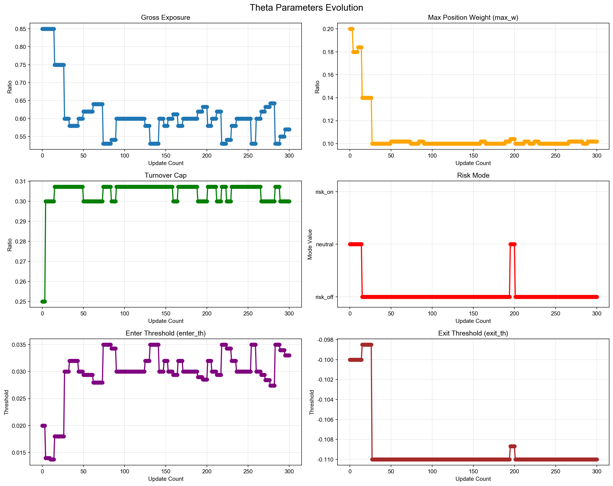
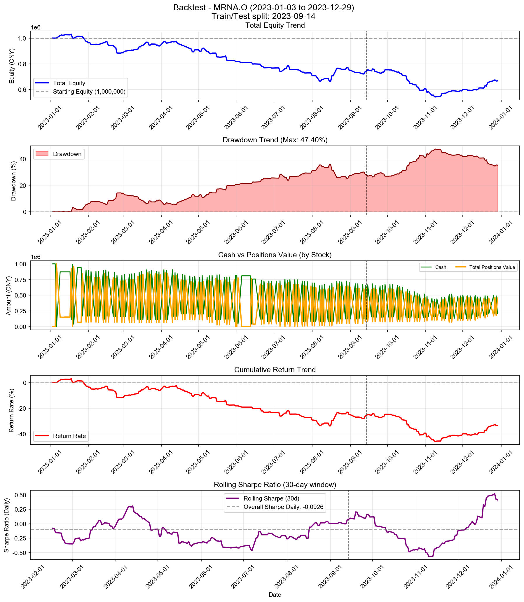

# Backtest

**策略名称:** 单股票交易系统（带 RAG 反思层）  
**股票代码:** MRNA.O  
**回测期间:** 2023-01-03 至 2023-12-29  
**交易日数:** 250  
**初始资金:** 1000000.00 元

---

## 账户表现

| 项目 | 数值 |
|------|------|
| 初始资金 | 1000000.00 元 |
| 最终现金 | 210487.52 元 |
| 最终持仓市值 | 456722.14 元 |
| 最终总权益 | 667209.66 元 |
| 总盈亏 | -332790.34 元 |
| 总收益率 | -33.28% |
| 年化收益率 (CAGR) | -33.49% |

---

## 参数θ追踪

### 初始参数

| 参数 | 数值 |
|------|------|
| 总仓位上限 (gross_exposure) | 0.85 |
| 单票上限 (max_w) | 0.20 |
| 换手上限 (turnover_cap) | 0.25 |
| 风险模式 (risk_mode) | neutral |
| 进场阈值 (enter_th) | 0.020 |
| 出场阈值 (exit_th) | -0.100 |

### 最终参数

| 参数 | 数值 |
|------|------|
| 总仓位上限 (gross_exposure) | 0.57 |
| 单票上限 (max_w) | 0.10 |
| 换手上限 (turnover_cap) | 0.30 |
| 风险模式 (risk_mode) | risk_off |
| 进场阈值 (enter_th) | 0.033 |
| 出场阈值 (exit_th) | -0.110 |

### 参数变化趋势图

---

## 持仓明细

| 股票代码 | 股数 | 成本价 | 现价 | 市值 | 权重 | 盈亏 | 收益率 |
|----------|------|--------|------|------|------|------|--------|
| MRNA.O | 459248 | 0.99 | 0.99 | 456722.14 | 68.45% | +117.42 | +0.03% |

---

## 交易统计

| 项目 | 数值 |
|------|------|
| 总交易次数 | 457 次 |
| 买入次数 | 231 次 |
| 卖出次数 | 226 次 |
| 买入总成本 | 80664155.29 元 |
| 卖出总收入 | 79874642.81 元 |
| 已实现盈亏 | -332907.76 元 |

### 交易质量指标

| 指标 | 数值 |
|------|------|
| 胜率 (Hit Rate) | 47.79% |
| 盈亏比 (Profit Factor) | 0.68 |
| 单笔平均收益 | -1473.04 元 |
| 平均持仓周期 | 2.0 天 |

---

## 风险与稳健性

| 指标 | 数值 |
|------|------|
| 最大回撤 (Max Drawdown) | 47.40% |
| 年化波动率 (Volatility) | 25.60% |
| 年化夏普比率 (Sharpe) | -1.4707 |
| 日频夏普比率 (Sharpe Daily) | -0.0926 |
| 年化 Sortino 比率 | -1.3634 |
| 日频 Sortino 比率 | -0.0859 |
| Calmar 比率 (CAGR/MaxDD) | -0.7067 |
### 尾部风险 (Tail Risk)

| 指标 | 数值 |
|------|------|
| VaR 95% | -3.16% |
| VaR 99% | -4.93% |
| CVaR 95% | -4.18% |
| CVaR 99% | -5.26% |
| 极端日跌幅 (5%分位) | -3.30% |
| 极端日跌幅 (1%分位) | -5.15% |

---

## 执行与成本

| 指标 | 数值 |
|------|------|
| 换手率 (Turnover) | 10084.56% |
| 交易频率 (每日) | 1.83 次/日 |
| 交易频率 (每周) | 9.14 次/周 |

---

## 策略参数

---

## 交易记录

| 序号 | 日期 | 类型 | 股票代码 | 股数 | 价格 | 成本/收入 | 利润 |
|------|------|------|----------|------|------|-----------|------|
| 1 | 2023-01-06 | 买入 | MRNA.O | 79844 | 1.80 | 143998.65 | - |
| 2 | 2023-01-06 | 买入 | MRNA.O | 474633 | 1.80 | 856000.62 | - |
| 3 | 2023-01-09 | 卖出 | MRNA.O | 474632 | 1.84 | 873085.56 | +17086.75 |
| 4 | 2023-01-18 | 卖出 | MRNA.O | 2860 | 1.97 | 5634.77 | +476.76 |
| 5 | 2023-01-18 | 买入 | MRNA.O | 390846 | 1.97 | 770044.79 | - |
| 6 | 2023-01-19 | 卖出 | MRNA.O | 467831 | 1.90 | 890656.66 | -18230.58 |
| 7 | 2023-01-19 | 买入 | MRNA.O | 4592 | 1.90 | 8742.25 | - |
| 8 | 2023-01-20 | 买入 | MRNA.O | 31476 | 1.94 | 61057.14 | - |
| 9 | 2023-01-20 | 买入 | MRNA.O | 459140 | 1.94 | 890639.77 | - |
| 10 | 2023-01-23 | 卖出 | MRNA.O | 459161 | 1.97 | 904271.67 | +13744.44 |
| 11 | 2023-01-27 | 卖出 | MRNA.O | 36047 | 1.89 | 68254.99 | -1656.94 |
| 12 | 2023-01-27 | 买入 | MRNA.O | 444691 | 1.89 | 842022.41 | - |
| 13 | 2023-01-30 | 卖出 | MRNA.O | 444691 | 1.81 | 804312.61 | -37709.80 |
| 14 | 2023-01-30 | 买入 | MRNA.O | 39822 | 1.81 | 72026.05 | - |
| 15 | 2023-01-31 | 卖出 | MRNA.O | 39822 | 1.76 | 70110.61 | -1915.44 |
| 16 | 2023-01-31 | 买入 | MRNA.O | 456949 | 1.76 | 804504.41 | - |
| 17 | 2023-02-01 | 卖出 | MRNA.O | 456949 | 1.74 | 796462.11 | -8042.30 |
| 18 | 2023-02-01 | 买入 | MRNA.O | 40685 | 1.74 | 70913.96 | - |
| 19 | 2023-02-02 | 卖出 | MRNA.O | 40685 | 1.76 | 71748.00 | +834.04 |
| 20 | 2023-02-02 | 买入 | MRNA.O | 451590 | 1.76 | 796378.97 | - |
| 21 | 2023-02-03 | 卖出 | MRNA.O | 451590 | 1.73 | 782379.67 | -13999.29 |
| 22 | 2023-02-03 | 买入 | MRNA.O | 42221 | 1.73 | 73147.88 | - |
| 23 | 2023-02-06 | 卖出 | MRNA.O | 42221 | 1.70 | 71889.70 | -1258.19 |
| 24 | 2023-02-06 | 买入 | MRNA.O | 459568 | 1.70 | 782506.43 | - |
| 25 | 2023-02-07 | 卖出 | MRNA.O | 459568 | 1.71 | 786137.02 | +3630.59 |
| 26 | 2023-02-07 | 买入 | MRNA.O | 41813 | 1.71 | 71525.32 | - |
| 27 | 2023-02-08 | 卖出 | MRNA.O | 41812 | 1.64 | 68713.84 | -2809.77 |
| 28 | 2023-02-08 | 买入 | MRNA.O | 478532 | 1.64 | 786419.49 | - |
| 29 | 2023-02-09 | 卖出 | MRNA.O | 478533 | 1.64 | 787091.08 | +669.88 |
| 30 | 2023-02-09 | 买入 | MRNA.O | 41735 | 1.64 | 68645.73 | - |
| 31 | 2023-02-10 | 卖出 | MRNA.O | 41735 | 1.69 | 70649.01 | +2003.28 |
| 32 | 2023-02-10 | 买入 | MRNA.O | 464846 | 1.69 | 786891.31 | - |
| 33 | 2023-02-13 | 卖出 | MRNA.O | 464846 | 1.71 | 797117.92 | +10226.61 |
| 34 | 2023-02-13 | 买入 | MRNA.O | 40603 | 1.71 | 69626.02 | - |
| 35 | 2023-02-14 | 卖出 | MRNA.O | 13136 | 1.76 | 23069.44 | +543.83 |
| 36 | 2023-02-14 | 买入 | MRNA.O | 453792 | 1.76 | 796949.51 | - |
| 37 | 2023-02-15 | 卖出 | MRNA.O | 453824 | 1.77 | 804539.19 | +8605.79 |
| 38 | 2023-02-15 | 买入 | MRNA.O | 12563 | 1.77 | 22271.69 | - |
| 39 | 2023-02-16 | 卖出 | MRNA.O | 39998 | 1.72 | 68920.55 | -1467.66 |
| 40 | 2023-02-16 | 买入 | MRNA.O | 467029 | 1.72 | 804737.67 | - |
| 41 | 2023-02-17 | 卖出 | MRNA.O | 467029 | 1.67 | 778070.31 | -26667.36 |
| 42 | 2023-02-17 | 买入 | MRNA.O | 42969 | 1.67 | 71586.35 | - |
| 43 | 2023-02-21 | 卖出 | MRNA.O | 42969 | 1.60 | 68789.07 | -2797.28 |
| 44 | 2023-02-21 | 买入 | MRNA.O | 486196 | 1.60 | 778351.18 | - |
| 45 | 2023-02-22 | 卖出 | MRNA.O | 486196 | 1.58 | 769016.21 | -9334.96 |
| 46 | 2023-02-22 | 买入 | MRNA.O | 44081 | 1.58 | 69722.92 | - |
| 47 | 2023-02-23 | 卖出 | MRNA.O | 44081 | 1.48 | 65050.33 | -4672.59 |
| 48 | 2023-02-23 | 买入 | MRNA.O | 521436 | 1.48 | 769483.11 | - |
| 49 | 2023-02-24 | 卖出 | MRNA.O | 521436 | 1.39 | 726151.77 | -43331.33 |
| 50 | 2023-02-24 | 买入 | MRNA.O | 49823 | 1.39 | 69383.51 | - |
| 51 | 2023-02-27 | 卖出 | MRNA.O | 49823 | 1.38 | 68890.26 | -493.25 |
| 52 | 2023-02-27 | 买入 | MRNA.O | 525205 | 1.38 | 726200.95 | - |
| 53 | 2023-02-28 | 卖出 | MRNA.O | 525205 | 1.39 | 729037.06 | +2836.11 |
| 54 | 2023-02-28 | 买入 | MRNA.O | 49425 | 1.39 | 68606.84 | - |
| 55 | 2023-03-01 | 卖出 | MRNA.O | 49425 | 1.36 | 67049.96 | -1556.89 |
| 56 | 2023-03-01 | 买入 | MRNA.O | 537515 | 1.36 | 729192.85 | - |
| 57 | 2023-03-02 | 卖出 | MRNA.O | 537515 | 1.38 | 741018.18 | +11825.33 |
| 58 | 2023-03-02 | 买入 | MRNA.O | 47778 | 1.38 | 65866.75 | - |
| 59 | 2023-03-03 | 卖出 | MRNA.O | 47777 | 1.43 | 68416.66 | +2551.29 |
| 60 | 2023-03-03 | 买入 | MRNA.O | 517293 | 1.43 | 740763.58 | - |
| 61 | 2023-03-06 | 卖出 | MRNA.O | 517294 | 1.44 | 745058.55 | +4293.59 |
| 62 | 2023-03-06 | 买入 | MRNA.O | 47203 | 1.44 | 67986.48 | - |
| 63 | 2023-03-07 | 卖出 | MRNA.O | 47203 | 1.41 | 66579.83 | -1406.65 |
| 64 | 2023-03-07 | 买入 | MRNA.O | 528323 | 1.41 | 745199.59 | - |
| 65 | 2023-03-08 | 卖出 | MRNA.O | 528323 | 1.42 | 750641.32 | +5441.73 |
| 66 | 2023-03-08 | 买入 | MRNA.O | 46478 | 1.42 | 66035.94 | - |
| 67 | 2023-03-09 | 卖出 | MRNA.O | 46478 | 1.37 | 63842.18 | -2193.76 |
| 68 | 2023-03-09 | 买入 | MRNA.O | 546637 | 1.37 | 750860.58 | - |
| 69 | 2023-03-10 | 卖出 | MRNA.O | 546637 | 1.38 | 755944.31 | +5083.72 |
| 70 | 2023-03-10 | 买入 | MRNA.O | 45798 | 1.38 | 63334.05 | - |
| 71 | 2023-03-13 | 卖出 | MRNA.O | 14256 | 1.48 | 21084.62 | +1370.00 |
| 72 | 2023-03-13 | 买入 | MRNA.O | 510821 | 1.48 | 755504.26 | - |
| 73 | 2023-03-14 | 卖出 | MRNA.O | 510907 | 1.51 | 772900.11 | +20124.04 |
| 74 | 2023-03-14 | 买入 | MRNA.O | 12725 | 1.51 | 19250.38 | - |
| 75 | 2023-03-15 | 卖出 | MRNA.O | 12398 | 1.50 | 18547.41 | +139.40 |
| 76 | 2023-03-15 | 买入 | MRNA.O | 516694 | 1.50 | 772974.22 | - |
| 77 | 2023-03-16 | 卖出 | MRNA.O | 516748 | 1.52 | 784320.11 | +11601.80 |
| 78 | 2023-03-16 | 买入 | MRNA.O | 11433 | 1.52 | 17353.01 | - |
| 79 | 2023-03-17 | 卖出 | MRNA.O | 11087 | 1.50 | 16632.72 | -12.15 |
| 80 | 2023-03-17 | 买入 | MRNA.O | 522861 | 1.50 | 784396.07 | - |
| 81 | 2023-03-20 | 卖出 | MRNA.O | 522971 | 1.55 | 808094.79 | +23500.58 |
| 82 | 2023-03-20 | 买入 | MRNA.O | 9148 | 1.55 | 14135.49 | - |
| 83 | 2023-03-21 | 卖出 | MRNA.O | 8673 | 1.52 | 13191.63 | +93.13 |
| 84 | 2023-03-21 | 买入 | MRNA.O | 531357 | 1.52 | 808194.00 | - |
| 85 | 2023-03-22 | 卖出 | MRNA.O | 531259 | 1.48 | 787219.59 | -20497.12 |
| 86 | 2023-03-22 | 买入 | MRNA.O | 10394 | 1.48 | 15401.83 | - |
| 87 | 2023-03-23 | 卖出 | MRNA.O | 10646 | 1.49 | 15907.25 | -179.29 |
| 88 | 2023-03-23 | 买入 | MRNA.O | 526814 | 1.49 | 787165.48 | - |
| 89 | 2023-03-24 | 卖出 | MRNA.O | 526850 | 1.51 | 794911.28 | +7179.64 |
| 90 | 2023-03-24 | 买入 | MRNA.O | 10002 | 1.51 | 15091.02 | - |
| 91 | 2023-03-27 | 卖出 | MRNA.O | 9489 | 1.48 | 14076.93 | -141.37 |
| 92 | 2023-03-27 | 买入 | MRNA.O | 535907 | 1.48 | 795018.03 | - |
| 93 | 2023-03-28 | 卖出 | MRNA.O | 535871 | 1.47 | 787301.67 | -8122.92 |
| 94 | 2023-03-28 | 买入 | MRNA.O | 10135 | 1.47 | 14890.34 | - |
| 95 | 2023-03-29 | 卖出 | MRNA.O | 10521 | 1.49 | 15655.25 | +75.96 |
| 96 | 2023-03-29 | 买入 | MRNA.O | 529047 | 1.49 | 787221.94 | - |
| 97 | 2023-03-30 | 卖出 | MRNA.O | 529012 | 1.47 | 779975.29 | -6974.07 |
| 98 | 2023-03-30 | 买入 | MRNA.O | 11136 | 1.47 | 16418.92 | - |
| 99 | 2023-03-31 | 卖出 | MRNA.O | 12957 | 1.54 | 19899.36 | +668.39 |
| 100 | 2023-03-31 | 买入 | MRNA.O | 507688 | 1.54 | 779707.23 | - |
| 101 | 2023-04-03 | 卖出 | MRNA.O | 507826 | 1.59 | 809880.90 | +31452.15 |
| 102 | 2023-04-03 | 买入 | MRNA.O | 10486 | 1.59 | 16723.07 | - |
| 103 | 2023-04-04 | 卖出 | MRNA.O | 9948 | 1.57 | 15570.61 | +163.99 |
| 104 | 2023-04-04 | 买入 | MRNA.O | 517507 | 1.57 | 810001.96 | - |
| 105 | 2023-04-05 | 卖出 | MRNA.O | 517462 | 1.55 | 800048.00 | -9401.02 |
| 106 | 2023-04-05 | 买入 | MRNA.O | 10749 | 1.55 | 16619.03 | - |
| 107 | 2023-04-06 | 卖出 | MRNA.O | 11419 | 1.58 | 18072.85 | +263.80 |
| 108 | 2023-04-06 | 买入 | MRNA.O | 505399 | 1.58 | 799895.00 | - |
| 109 | 2023-04-10 | 卖出 | MRNA.O | 505442 | 1.60 | 809465.36 | +10164.86 |
| 110 | 2023-04-10 | 买入 | MRNA.O | 10656 | 1.60 | 17065.58 | - |
| 111 | 2023-04-11 | 卖出 | MRNA.O | 41015 | 1.55 | 63675.79 | -1399.19 |
| 112 | 2023-04-11 | 买入 | MRNA.O | 521524 | 1.55 | 809666.01 | - |
| 113 | 2023-04-12 | 卖出 | MRNA.O | 490282 | 1.56 | 762682.68 | +1519.87 |
| 114 | 2023-04-12 | 买入 | MRNA.O | 40829 | 1.56 | 63513.59 | - |
| 115 | 2023-04-13 | 卖出 | MRNA.O | 41684 | 1.61 | 66915.33 | +2127.71 |
| 116 | 2023-04-13 | 买入 | MRNA.O | 474880 | 1.61 | 762324.86 | - |
| 117 | 2023-04-14 | 卖出 | MRNA.O | 474159 | 1.57 | 744903.79 | -14808.08 |
| 118 | 2023-04-14 | 买入 | MRNA.O | 43697 | 1.57 | 68647.99 | - |
| 119 | 2023-04-17 | 卖出 | MRNA.O | 74805 | 1.44 | 107696.76 | -10793.41 |
| 120 | 2023-04-17 | 买入 | MRNA.O | 518085 | 1.44 | 745886.97 | - |
| 121 | 2023-04-18 | 卖出 | MRNA.O | 518085 | 1.43 | 738944.64 | -6942.34 |
| 122 | 2023-04-18 | 买入 | MRNA.O | 75994 | 1.43 | 108390.24 | - |
| 123 | 2023-04-19 | 卖出 | MRNA.O | 75994 | 1.43 | 108534.63 | +144.39 |
| 124 | 2023-04-19 | 买入 | MRNA.O | 517386 | 1.43 | 738930.69 | - |
| 125 | 2023-04-20 | 卖出 | MRNA.O | 517386 | 1.41 | 730238.60 | -8692.08 |
| 126 | 2023-04-20 | 买入 | MRNA.O | 77514 | 1.41 | 109403.26 | - |
| 127 | 2023-04-21 | 卖出 | MRNA.O | 77514 | 1.41 | 109178.47 | -224.79 |
| 128 | 2023-04-21 | 买入 | MRNA.O | 518467 | 1.41 | 730260.77 | - |
| 129 | 2023-04-24 | 卖出 | MRNA.O | 518467 | 1.38 | 716210.31 | -14050.46 |
| 130 | 2023-04-24 | 买入 | MRNA.O | 80052 | 1.38 | 110583.83 | - |
| 131 | 2023-04-25 | 卖出 | MRNA.O | 80052 | 1.35 | 107990.15 | -2593.68 |
| 132 | 2023-04-25 | 买入 | MRNA.O | 531112 | 1.35 | 716470.09 | - |
| 133 | 2023-04-26 | 卖出 | MRNA.O | 531112 | 1.31 | 694269.61 | -22200.48 |
| 134 | 2023-04-26 | 买入 | MRNA.O | 84310 | 1.31 | 110210.03 | - |
| 135 | 2023-04-27 | 卖出 | MRNA.O | 84310 | 1.30 | 109662.02 | -548.01 |
| 136 | 2023-04-27 | 买入 | MRNA.O | 533808 | 1.30 | 694324.07 | - |
| 137 | 2023-04-28 | 卖出 | MRNA.O | 533808 | 1.33 | 709377.45 | +15053.39 |
| 138 | 2023-04-28 | 买入 | MRNA.O | 81388 | 1.33 | 108156.51 | - |
| 139 | 2023-05-01 | 卖出 | MRNA.O | 81388 | 1.33 | 108571.59 | +415.08 |
| 140 | 2023-05-01 | 买入 | MRNA.O | 531736 | 1.33 | 709335.82 | - |
| 141 | 2023-05-02 | 卖出 | MRNA.O | 531736 | 1.31 | 698701.10 | -10634.72 |
| 142 | 2023-05-02 | 买入 | MRNA.O | 83437 | 1.31 | 109636.22 | - |
| 143 | 2023-05-03 | 卖出 | MRNA.O | 83437 | 1.30 | 108584.91 | -1051.31 |
| 144 | 2023-05-03 | 买入 | MRNA.O | 536965 | 1.30 | 698806.25 | - |
| 145 | 2023-05-04 | 卖出 | MRNA.O | 536965 | 1.34 | 721305.08 | +22498.83 |
| 146 | 2023-05-04 | 买入 | MRNA.O | 79159 | 1.34 | 106334.28 | - |
| 147 | 2023-05-05 | 卖出 | MRNA.O | 79159 | 1.37 | 108479.49 | +2145.21 |
| 148 | 2023-05-05 | 买入 | MRNA.O | 526190 | 1.37 | 721090.78 | - |
| 149 | 2023-05-08 | 卖出 | MRNA.O | 526190 | 1.32 | 693255.33 | -27835.45 |
| 150 | 2023-05-08 | 买入 | MRNA.O | 84450 | 1.32 | 111262.88 | - |
| 151 | 2023-05-09 | 卖出 | MRNA.O | 50974 | 1.34 | 68187.92 | +1029.67 |
| 152 | 2023-05-09 | 买入 | MRNA.O | 518117 | 1.34 | 693085.11 | - |
| 153 | 2023-05-10 | 卖出 | MRNA.O | 551593 | 1.31 | 721649.12 | -15540.62 |
| 154 | 2023-05-10 | 买入 | MRNA.O | 53359 | 1.31 | 69809.58 | - |
| 155 | 2023-05-11 | 卖出 | MRNA.O | 53359 | 1.28 | 68518.29 | -1291.29 |
| 156 | 2023-05-11 | 买入 | MRNA.O | 562089 | 1.28 | 721778.48 | - |
| 157 | 2023-05-12 | 卖出 | MRNA.O | 562089 | 1.29 | 726781.08 | +5002.59 |
| 158 | 2023-05-12 | 买入 | MRNA.O | 52605 | 1.29 | 68018.27 | - |
| 159 | 2023-05-15 | 卖出 | MRNA.O | 18687 | 1.30 | 24341.69 | +179.40 |
| 160 | 2023-05-15 | 买入 | MRNA.O | 557907 | 1.30 | 726729.66 | - |
| 161 | 2023-05-16 | 卖出 | MRNA.O | 591825 | 1.25 | 740432.26 | -30153.37 |
| 162 | 2023-05-16 | 买入 | MRNA.O | 21893 | 1.25 | 27390.33 | - |
| 163 | 2023-05-17 | 卖出 | MRNA.O | 21893 | 1.26 | 27491.04 | +100.71 |
| 164 | 2023-05-17 | 买入 | MRNA.O | 589649 | 1.26 | 740422.25 | - |
| 165 | 2023-05-18 | 卖出 | MRNA.O | 589649 | 1.25 | 739007.09 | -1415.16 |
| 166 | 2023-05-18 | 买入 | MRNA.O | 22047 | 1.25 | 27631.51 | - |
| 167 | 2023-05-19 | 卖出 | MRNA.O | 22047 | 1.26 | 27832.13 | +200.63 |
| 168 | 2023-05-19 | 买入 | MRNA.O | 585383 | 1.26 | 738987.50 | - |
| 169 | 2023-05-22 | 卖出 | MRNA.O | 551654 | 1.27 | 699166.28 | +2758.27 |
| 170 | 2023-05-22 | 买入 | MRNA.O | 21729 | 1.27 | 27539.33 | - |
| 171 | 2023-05-23 | 卖出 | MRNA.O | 24203 | 1.38 | 33339.63 | +2738.35 |
| 172 | 2023-05-23 | 买入 | MRNA.O | 507119 | 1.38 | 698556.42 | - |
| 173 | 2023-05-24 | 卖出 | MRNA.O | 538374 | 1.32 | 708446.35 | -29627.62 |
| 174 | 2023-05-24 | 买入 | MRNA.O | 27856 | 1.32 | 36655.71 | - |
| 175 | 2023-05-25 | 卖出 | MRNA.O | 27855 | 1.26 | 35228.22 | -1426.18 |
| 176 | 2023-05-25 | 买入 | MRNA.O | 560282 | 1.26 | 708588.65 | - |
| 177 | 2023-05-26 | 卖出 | MRNA.O | 560283 | 1.26 | 707301.26 | -1288.70 |
| 178 | 2023-05-26 | 买入 | MRNA.O | 28008 | 1.26 | 35357.30 | - |
| 179 | 2023-05-30 | 买入 | MRNA.O | 4031 | 1.29 | 5195.56 | - |
| 180 | 2023-05-30 | 买入 | MRNA.O | 548706 | 1.29 | 707227.16 | - |
| 181 | 2023-05-31 | 卖出 | MRNA.O | 580745 | 1.28 | 741669.44 | -6110.58 |
| 182 | 2023-06-02 | 买入 | MRNA.O | 31379 | 1.31 | 40952.73 | - |
| 183 | 2023-06-02 | 买入 | MRNA.O | 564829 | 1.31 | 737158.33 | - |
| 184 | 2023-06-05 | 卖出 | MRNA.O | 596208 | 1.29 | 768512.11 | -9598.95 |
| 185 | 2023-06-13 | 买入 | MRNA.O | 31624 | 1.28 | 40472.40 | - |
| 186 | 2023-06-13 | 买入 | MRNA.O | 569245 | 1.28 | 728519.75 | - |
| 187 | 2023-06-14 | 卖出 | MRNA.O | 569220 | 1.26 | 717501.81 | -10985.95 |
| 188 | 2023-06-20 | 卖出 | MRNA.O | 31649 | 1.24 | 39317.55 | -1186.84 |
| 189 | 2023-06-20 | 买入 | MRNA.O | 545961 | 1.24 | 678247.35 | - |
| 190 | 2023-06-21 | 卖出 | MRNA.O | 545961 | 1.21 | 660994.98 | -17252.37 |
| 191 | 2023-06-21 | 买入 | MRNA.O | 33900 | 1.21 | 41042.73 | - |
| 192 | 2023-06-22 | 卖出 | MRNA.O | 33900 | 1.20 | 40842.72 | -200.01 |
| 193 | 2023-06-22 | 买入 | MRNA.O | 548651 | 1.20 | 661014.72 | - |
| 194 | 2023-06-23 | 卖出 | MRNA.O | 548651 | 1.19 | 650151.44 | -10863.29 |
| 195 | 2023-06-23 | 买入 | MRNA.O | 35383 | 1.19 | 41928.86 | - |
| 196 | 2023-06-26 | 卖出 | MRNA.O | 3423 | 1.20 | 4121.63 | +65.38 |
| 197 | 2023-06-26 | 买入 | MRNA.O | 539892 | 1.20 | 650083.96 | - |
| 198 | 2023-06-27 | 卖出 | MRNA.O | 539899 | 1.21 | 651496.12 | +1980.06 |
| 199 | 2023-06-27 | 买入 | MRNA.O | 3292 | 1.21 | 3972.46 | - |
| 200 | 2023-06-28 | 卖出 | MRNA.O | 3864 | 1.23 | 4752.72 | +102.88 |
| 201 | 2023-06-28 | 买入 | MRNA.O | 529605 | 1.23 | 651414.15 | - |
| 202 | 2023-06-29 | 卖出 | MRNA.O | 529581 | 1.22 | 646671.36 | -3924.53 |
| 203 | 2023-06-29 | 买入 | MRNA.O | 4301 | 1.22 | 5251.95 | - |
| 204 | 2023-06-30 | 卖出 | MRNA.O | 35706 | 1.22 | 43382.79 | -450.54 |
| 205 | 2023-06-30 | 买入 | MRNA.O | 532258 | 1.22 | 646693.47 | - |
| 206 | 2023-07-03 | 卖出 | MRNA.O | 532258 | 1.22 | 647917.66 | +1224.19 |
| 207 | 2023-07-03 | 买入 | MRNA.O | 35538 | 1.22 | 43260.41 | - |
| 208 | 2023-07-05 | 卖出 | MRNA.O | 4429 | 1.24 | 5471.59 | +80.16 |
| 209 | 2023-07-05 | 买入 | MRNA.O | 524408 | 1.24 | 647853.64 | - |
| 210 | 2023-07-06 | 卖出 | MRNA.O | 555517 | 1.18 | 657121.06 | -28601.57 |
| 211 | 2023-07-06 | 买入 | MRNA.O | 7091 | 1.18 | 8387.94 | - |
| 212 | 2023-07-07 | 卖出 | MRNA.O | 7091 | 1.19 | 8429.07 | +41.13 |
| 213 | 2023-07-07 | 买入 | MRNA.O | 552803 | 1.19 | 657116.93 | - |
| 214 | 2023-07-10 | 卖出 | MRNA.O | 552803 | 1.23 | 680445.21 | +23328.29 |
| 215 | 2023-07-10 | 买入 | MRNA.O | 4952 | 1.23 | 6095.42 | - |
| 216 | 2023-07-11 | 卖出 | MRNA.O | 4952 | 1.22 | 6047.88 | -47.54 |
| 217 | 2023-07-11 | 买入 | MRNA.O | 557153 | 1.22 | 680450.96 | - |
| 218 | 2023-07-12 | 卖出 | MRNA.O | 526026 | 1.26 | 662371.94 | +19936.39 |
| 219 | 2023-07-12 | 买入 | MRNA.O | 3126 | 1.26 | 3936.26 | - |
| 220 | 2023-07-13 | 卖出 | MRNA.O | 3286 | 1.27 | 4160.40 | +135.85 |
| 221 | 2023-07-13 | 买入 | MRNA.O | 523140 | 1.27 | 662347.55 | - |
| 222 | 2023-07-14 | 卖出 | MRNA.O | 554107 | 1.21 | 672408.84 | -27865.82 |
| 223 | 2023-07-14 | 买入 | MRNA.O | 5830 | 1.21 | 7074.70 | - |
| 224 | 2023-07-17 | 卖出 | MRNA.O | 5830 | 1.23 | 7147.58 | +72.88 |
| 225 | 2023-07-17 | 买入 | MRNA.O | 548452 | 1.23 | 672402.15 | - |
| 226 | 2023-07-18 | 卖出 | MRNA.O | 548452 | 1.23 | 672457.00 | +54.85 |
| 227 | 2023-07-18 | 买入 | MRNA.O | 5825 | 1.23 | 7142.03 | - |
| 228 | 2023-07-19 | 卖出 | MRNA.O | 5825 | 1.25 | 7291.15 | +149.12 |
| 229 | 2023-07-19 | 买入 | MRNA.O | 537223 | 1.25 | 672442.03 | - |
| 230 | 2023-07-20 | 卖出 | MRNA.O | 537223 | 1.25 | 670293.14 | -2148.89 |
| 231 | 2023-07-20 | 买入 | MRNA.O | 6016 | 1.25 | 7506.16 | - |
| 232 | 2023-07-21 | 卖出 | MRNA.O | 6016 | 1.26 | 7606.03 | +99.87 |
| 233 | 2023-07-21 | 买入 | MRNA.O | 530161 | 1.26 | 670282.55 | - |
| 234 | 2023-07-24 | 卖出 | MRNA.O | 530161 | 1.23 | 652151.05 | -18131.51 |
| 235 | 2023-07-24 | 买入 | MRNA.O | 7658 | 1.23 | 9420.11 | - |
| 236 | 2023-07-25 | 卖出 | MRNA.O | 7658 | 1.22 | 9332.80 | -87.30 |
| 237 | 2023-07-25 | 买入 | MRNA.O | 535127 | 1.22 | 652159.27 | - |
| 238 | 2023-07-26 | 卖出 | MRNA.O | 535127 | 1.21 | 645630.73 | -6528.55 |
| 239 | 2023-07-26 | 买入 | MRNA.O | 8277 | 1.21 | 9986.20 | - |
| 240 | 2023-07-27 | 卖出 | MRNA.O | 8277 | 1.19 | 9809.07 | -177.13 |
| 241 | 2023-07-27 | 买入 | MRNA.O | 544805 | 1.19 | 645648.41 | - |
| 242 | 2023-07-28 | 卖出 | MRNA.O | 544805 | 1.19 | 646465.61 | +817.21 |
| 243 | 2023-07-28 | 买入 | MRNA.O | 8197 | 1.19 | 9726.56 | - |
| 244 | 2023-07-31 | 卖出 | MRNA.O | 8197 | 1.18 | 9644.59 | -81.97 |
| 245 | 2023-07-31 | 买入 | MRNA.O | 549443 | 1.18 | 646474.63 | - |
| 246 | 2023-08-01 | 卖出 | MRNA.O | 549443 | 1.14 | 626035.35 | -20439.28 |
| 247 | 2023-08-01 | 买入 | MRNA.O | 10258 | 1.14 | 11687.97 | - |
| 248 | 2023-08-02 | 卖出 | MRNA.O | 10258 | 1.10 | 11306.37 | -381.60 |
| 249 | 2023-08-02 | 买入 | MRNA.O | 568022 | 1.10 | 626073.85 | - |
| 250 | 2023-08-03 | 卖出 | MRNA.O | 568022 | 1.10 | 624540.19 | -1533.66 |
| 251 | 2023-08-03 | 买入 | MRNA.O | 10423 | 1.10 | 11460.09 | - |
| 252 | 2023-08-04 | 卖出 | MRNA.O | 10423 | 1.08 | 11276.64 | -183.44 |
| 253 | 2023-08-04 | 买入 | MRNA.O | 577279 | 1.08 | 624558.15 | - |
| 254 | 2023-08-07 | 卖出 | MRNA.O | 577279 | 1.01 | 584206.35 | -40351.80 |
| 255 | 2023-08-07 | 买入 | MRNA.O | 15130 | 1.01 | 15311.56 | - |
| 256 | 2023-08-08 | 卖出 | MRNA.O | 15130 | 1.00 | 15090.66 | -220.90 |
| 257 | 2023-08-08 | 买入 | MRNA.O | 585752 | 1.00 | 584229.04 | - |
| 258 | 2023-08-09 | 卖出 | MRNA.O | 585752 | 1.02 | 596412.69 | +12183.64 |
| 259 | 2023-08-09 | 买入 | MRNA.O | 13624 | 1.02 | 13871.96 | - |
| 260 | 2023-08-10 | 卖出 | MRNA.O | 13624 | 1.00 | 13662.15 | -209.81 |
| 261 | 2023-08-10 | 买入 | MRNA.O | 594768 | 1.00 | 596433.35 | - |
| 262 | 2023-08-11 | 卖出 | MRNA.O | 594768 | 1.01 | 603630.04 | +7196.69 |
| 263 | 2023-08-11 | 买入 | MRNA.O | 12753 | 1.01 | 12943.02 | - |
| 264 | 2023-08-14 | 卖出 | MRNA.O | 12753 | 1.00 | 12753.00 | -190.02 |
| 265 | 2023-08-14 | 买入 | MRNA.O | 603649 | 1.00 | 603649.00 | - |
| 266 | 2023-08-15 | 卖出 | MRNA.O | 603649 | 0.96 | 581978.00 | -21671.00 |
| 267 | 2023-08-15 | 买入 | MRNA.O | 15475 | 0.96 | 14919.45 | - |
| 268 | 2023-08-16 | 卖出 | MRNA.O | 15475 | 0.99 | 15307.87 | +388.42 |
| 269 | 2023-08-16 | 买入 | MRNA.O | 588293 | 0.99 | 581939.44 | - |
| 270 | 2023-08-17 | 卖出 | MRNA.O | 588293 | 1.06 | 625002.48 | +43063.05 |
| 271 | 2023-08-17 | 买入 | MRNA.O | 10356 | 1.06 | 11002.21 | - |
| 272 | 2023-08-18 | 卖出 | MRNA.O | 10356 | 1.02 | 10523.77 | -478.45 |
| 273 | 2023-08-18 | 买入 | MRNA.O | 615085 | 1.02 | 625049.38 | - |
| 274 | 2023-08-21 | 卖出 | MRNA.O | 579990 | 1.11 | 644252.89 | +54867.05 |
| 275 | 2023-08-21 | 买入 | MRNA.O | 4236 | 1.11 | 4705.35 | - |
| 276 | 2023-08-22 | 卖出 | MRNA.O | 5704 | 1.16 | 6630.33 | +775.81 |
| 277 | 2023-08-22 | 买入 | MRNA.O | 554069 | 1.16 | 644049.81 | - |
| 278 | 2023-08-23 | 卖出 | MRNA.O | 554045 | 1.15 | 639700.36 | -9.78 |
| 279 | 2023-08-23 | 买入 | MRNA.O | 6140 | 1.15 | 7089.24 | - |
| 280 | 2023-08-24 | 卖出 | MRNA.O | 39791 | 1.13 | 44824.56 | -1118.72 |
| 281 | 2023-08-24 | 买入 | MRNA.O | 567964 | 1.13 | 639811.45 | - |
| 282 | 2023-08-25 | 卖出 | MRNA.O | 567964 | 1.12 | 635722.11 | -4089.34 |
| 283 | 2023-08-25 | 买入 | MRNA.O | 40413 | 1.12 | 45234.27 | - |
| 284 | 2023-08-28 | 卖出 | MRNA.O | 40413 | 1.14 | 46002.12 | +767.85 |
| 285 | 2023-08-28 | 买入 | MRNA.O | 558416 | 1.14 | 635644.93 | - |
| 286 | 2023-08-29 | 卖出 | MRNA.O | 558416 | 1.16 | 647706.72 | +12061.79 |
| 287 | 2023-08-29 | 买入 | MRNA.O | 38621 | 1.16 | 44796.50 | - |
| 288 | 2023-08-30 | 卖出 | MRNA.O | 38621 | 1.17 | 45039.81 | +243.31 |
| 289 | 2023-08-30 | 买入 | MRNA.O | 555378 | 1.17 | 647681.82 | - |
| 290 | 2023-08-31 | 卖出 | MRNA.O | 555378 | 1.13 | 627965.90 | -19715.92 |
| 291 | 2023-08-31 | 买入 | MRNA.O | 41577 | 1.13 | 47011.11 | - |
| 292 | 2023-09-01 | 卖出 | MRNA.O | 41577 | 1.13 | 46799.07 | -212.04 |
| 293 | 2023-09-01 | 买入 | MRNA.O | 557914 | 1.13 | 627988.00 | - |
| 294 | 2023-09-05 | 卖出 | MRNA.O | 557914 | 1.09 | 610134.75 | -17853.25 |
| 295 | 2023-09-05 | 买入 | MRNA.O | 44426 | 1.09 | 48584.27 | - |
| 296 | 2023-09-06 | 卖出 | MRNA.O | 44426 | 1.08 | 48086.70 | -497.57 |
| 297 | 2023-09-06 | 买入 | MRNA.O | 563733 | 1.08 | 610184.60 | - |
| 298 | 2023-09-07 | 卖出 | MRNA.O | 563733 | 1.08 | 610804.71 | +620.11 |
| 299 | 2023-09-07 | 买入 | MRNA.O | 44323 | 1.08 | 48023.97 | - |
| 300 | 2023-09-08 | 卖出 | MRNA.O | 44323 | 1.08 | 47709.28 | -314.69 |
| 301 | 2023-09-08 | 买入 | MRNA.O | 567481 | 1.08 | 610836.55 | - |
| 302 | 2023-09-11 | 卖出 | MRNA.O | 567481 | 1.06 | 600394.90 | -10441.65 |
| 303 | 2023-09-11 | 买入 | MRNA.O | 46081 | 1.06 | 48753.70 | - |
| 304 | 2023-09-12 | 卖出 | MRNA.O | 46081 | 1.05 | 48495.64 | -258.05 |
| 305 | 2023-09-12 | 买入 | MRNA.O | 570525 | 1.05 | 600420.51 | - |
| 306 | 2023-09-13 | 卖出 | MRNA.O | 536445 | 1.09 | 582525.63 | +17970.91 |
| 307 | 2023-09-13 | 买入 | MRNA.O | 42899 | 1.09 | 46584.02 | - |
| 308 | 2023-09-14 | 卖出 | MRNA.O | 44030 | 1.13 | 49670.24 | +2511.08 |
| 309 | 2023-09-14 | 买入 | MRNA.O | 516090 | 1.13 | 582201.13 | - |
| 310 | 2023-09-15 | 卖出 | MRNA.O | 515518 | 1.15 | 590732.08 | +10940.61 |
| 311 | 2023-09-15 | 买入 | MRNA.O | 42493 | 1.15 | 48692.73 | - |
| 312 | 2023-09-18 | 卖出 | MRNA.O | 76014 | 1.04 | 79160.98 | -7232.06 |
| 313 | 2023-09-18 | 买入 | MRNA.O | 568011 | 1.04 | 591526.66 | - |
| 314 | 2023-09-19 | 卖出 | MRNA.O | 568011 | 1.07 | 606294.94 | +14768.29 |
| 315 | 2023-09-19 | 买入 | MRNA.O | 72779 | 1.07 | 77684.30 | - |
| 316 | 2023-09-20 | 卖出 | MRNA.O | 72779 | 1.04 | 75348.10 | -2336.21 |
| 317 | 2023-09-20 | 买入 | MRNA.O | 585848 | 1.04 | 606528.43 | - |
| 318 | 2023-09-21 | 卖出 | MRNA.O | 585848 | 1.00 | 587195.45 | -19332.98 |
| 319 | 2023-09-21 | 买入 | MRNA.O | 77104 | 1.00 | 77281.34 | - |
| 320 | 2023-09-22 | 卖出 | MRNA.O | 77104 | 1.00 | 77096.29 | -185.05 |
| 321 | 2023-09-22 | 买入 | MRNA.O | 587273 | 1.00 | 587214.27 | - |
| 322 | 2023-09-25 | 卖出 | MRNA.O | 587273 | 0.98 | 576525.90 | -10688.37 |
| 323 | 2023-09-25 | 买入 | MRNA.O | 79622 | 0.98 | 78164.92 | - |
| 324 | 2023-09-26 | 卖出 | MRNA.O | 79622 | 0.98 | 78125.11 | -39.81 |
| 325 | 2023-09-26 | 买入 | MRNA.O | 587576 | 0.98 | 576529.57 | - |
| 326 | 2023-09-27 | 卖出 | MRNA.O | 587576 | 0.99 | 584285.57 | +7756.00 |
| 327 | 2023-09-27 | 买入 | MRNA.O | 77785 | 0.99 | 77349.40 | - |
| 328 | 2023-09-28 | 卖出 | MRNA.O | 77785 | 1.00 | 77995.02 | +645.62 |
| 329 | 2023-09-28 | 买入 | MRNA.O | 582648 | 1.00 | 584221.15 | - |
| 330 | 2023-09-29 | 卖出 | MRNA.O | 582648 | 1.03 | 601817.12 | +17595.97 |
| 331 | 2023-09-29 | 买入 | MRNA.O | 73807 | 1.03 | 76235.25 | - |
| 332 | 2023-10-02 | 卖出 | MRNA.O | 73807 | 1.03 | 76250.01 | +14.76 |
| 333 | 2023-10-02 | 买入 | MRNA.O | 582534 | 1.03 | 601815.88 | - |
| 334 | 2023-10-03 | 卖出 | MRNA.O | 582534 | 1.03 | 600476.05 | -1339.83 |
| 335 | 2023-10-03 | 买入 | MRNA.O | 74102 | 1.03 | 76384.34 | - |
| 336 | 2023-10-04 | 卖出 | MRNA.O | 74102 | 1.04 | 77258.75 | +874.40 |
| 337 | 2023-10-04 | 买入 | MRNA.O | 575857 | 1.04 | 600388.51 | - |
| 338 | 2023-10-05 | 卖出 | MRNA.O | 575857 | 1.03 | 592959.95 | -7428.56 |
| 339 | 2023-10-05 | 买入 | MRNA.O | 75752 | 1.03 | 78001.83 | - |
| 340 | 2023-10-06 | 卖出 | MRNA.O | 75752 | 1.04 | 78691.18 | +689.34 |
| 341 | 2023-10-06 | 买入 | MRNA.O | 570746 | 1.04 | 592890.94 | - |
| 342 | 2023-10-09 | 卖出 | MRNA.O | 570746 | 1.02 | 581247.73 | -11643.22 |
| 343 | 2023-10-09 | 买入 | MRNA.O | 78412 | 1.02 | 79854.78 | - |
| 344 | 2023-10-10 | 卖出 | MRNA.O | 43144 | 1.04 | 45055.28 | +1117.43 |
| 345 | 2023-10-10 | 买入 | MRNA.O | 556397 | 1.04 | 581045.39 | - |
| 346 | 2023-10-11 | 卖出 | MRNA.O | 556305 | 1.03 | 571659.02 | -8431.44 |
| 347 | 2023-10-11 | 买入 | MRNA.O | 44806 | 1.03 | 46042.65 | - |
| 348 | 2023-10-12 | 卖出 | MRNA.O | 80166 | 1.01 | 80791.29 | -2123.21 |
| 349 | 2023-10-12 | 买入 | MRNA.O | 567392 | 1.01 | 571817.66 | - |
| 350 | 2023-10-13 | 卖出 | MRNA.O | 567392 | 0.98 | 557746.34 | -14071.32 |
| 351 | 2023-10-13 | 买入 | MRNA.O | 83620 | 0.98 | 82198.46 | - |
| 352 | 2023-10-16 | 卖出 | MRNA.O | 83620 | 0.92 | 76880.23 | -5318.23 |
| 353 | 2023-10-16 | 买入 | MRNA.O | 607221 | 0.92 | 558278.99 | - |
| 354 | 2023-10-17 | 卖出 | MRNA.O | 607221 | 0.86 | 524213.89 | -34065.10 |
| 355 | 2023-10-17 | 买入 | MRNA.O | 92999 | 0.86 | 80286.04 | - |
| 356 | 2023-10-18 | 卖出 | MRNA.O | 92999 | 0.86 | 79988.44 | -297.60 |
| 357 | 2023-10-18 | 买入 | MRNA.O | 609515 | 0.86 | 524243.85 | - |
| 358 | 2023-10-19 | 卖出 | MRNA.O | 609515 | 0.82 | 502057.51 | -22186.35 |
| 359 | 2023-10-19 | 买入 | MRNA.O | 99802 | 0.82 | 82206.91 | - |
| 360 | 2023-10-20 | 卖出 | MRNA.O | 99802 | 0.80 | 80240.81 | -1966.10 |
| 361 | 2023-10-20 | 买入 | MRNA.O | 624695 | 0.80 | 502254.78 | - |
| 362 | 2023-10-23 | 卖出 | MRNA.O | 624695 | 0.79 | 491260.15 | -10994.63 |
| 363 | 2023-10-23 | 买入 | MRNA.O | 103433 | 0.79 | 81339.71 | - |
| 364 | 2023-10-24 | 卖出 | MRNA.O | 103433 | 0.80 | 82498.16 | +1158.45 |
| 365 | 2023-10-24 | 买入 | MRNA.O | 615778 | 0.80 | 491144.53 | - |
| 366 | 2023-10-25 | 卖出 | MRNA.O | 615778 | 0.77 | 472671.19 | -18473.34 |
| 367 | 2023-10-25 | 买入 | MRNA.O | 109882 | 0.77 | 84345.42 | - |
| 368 | 2023-10-26 | 卖出 | MRNA.O | 109882 | 0.76 | 83488.34 | -857.08 |
| 369 | 2023-10-26 | 买入 | MRNA.O | 622212 | 0.76 | 472756.68 | - |
| 370 | 2023-10-27 | 卖出 | MRNA.O | 622212 | 0.72 | 447432.65 | -25324.03 |
| 371 | 2023-10-27 | 买入 | MRNA.O | 119623 | 0.72 | 86020.90 | - |
| 372 | 2023-10-30 | 卖出 | MRNA.O | 119622 | 0.74 | 88604.02 | +2583.84 |
| 373 | 2023-10-30 | 买入 | MRNA.O | 603719 | 0.74 | 447174.66 | - |
| 374 | 2023-10-31 | 卖出 | MRNA.O | 603720 | 0.76 | 458585.71 | +11410.33 |
| 375 | 2023-10-31 | 买入 | MRNA.O | 115143 | 0.76 | 87462.62 | - |
| 376 | 2023-11-01 | 卖出 | MRNA.O | 115143 | 0.76 | 87738.97 | +276.34 |
| 377 | 2023-11-01 | 买入 | MRNA.O | 601782 | 0.76 | 458557.88 | - |
| 378 | 2023-11-02 | 卖出 | MRNA.O | 601782 | 0.71 | 428649.32 | -29908.57 |
| 379 | 2023-11-02 | 买入 | MRNA.O | 127376 | 0.71 | 90729.92 | - |
| 380 | 2023-11-03 | 卖出 | MRNA.O | 127376 | 0.78 | 98754.61 | +8024.69 |
| 381 | 2023-11-03 | 买入 | MRNA.O | 551847 | 0.78 | 427846.98 | - |
| 382 | 2023-11-06 | 卖出 | MRNA.O | 551847 | 0.72 | 397716.13 | -30130.85 |
| 383 | 2023-11-06 | 买入 | MRNA.O | 141207 | 0.72 | 101767.88 | - |
| 384 | 2023-11-07 | 卖出 | MRNA.O | 141207 | 0.74 | 104013.08 | +2245.19 |
| 385 | 2023-11-07 | 买入 | MRNA.O | 539630 | 0.74 | 397491.46 | - |
| 386 | 2023-11-08 | 卖出 | MRNA.O | 539630 | 0.71 | 384972.04 | -12519.42 |
| 387 | 2023-11-08 | 买入 | MRNA.O | 147554 | 0.71 | 105265.02 | - |
| 388 | 2023-11-09 | 卖出 | MRNA.O | 147554 | 0.70 | 102564.79 | -2700.24 |
| 389 | 2023-11-09 | 买入 | MRNA.O | 554225 | 0.70 | 385241.80 | - |
| 390 | 2023-11-10 | 卖出 | MRNA.O | 554225 | 0.70 | 388234.61 | +2992.81 |
| 391 | 2023-11-10 | 买入 | MRNA.O | 145990 | 0.70 | 102265.99 | - |
| 392 | 2023-11-13 | 卖出 | MRNA.O | 145990 | 0.70 | 102499.58 | +233.58 |
| 393 | 2023-11-13 | 买入 | MRNA.O | 552928 | 0.70 | 388210.75 | - |
| 394 | 2023-11-14 | 卖出 | MRNA.O | 552928 | 0.74 | 409719.65 | +21508.90 |
| 395 | 2023-11-14 | 买入 | MRNA.O | 135424 | 0.74 | 100349.18 | - |
| 396 | 2023-11-15 | 卖出 | MRNA.O | 98109 | 0.76 | 74906.22 | +2207.45 |
| 397 | 2023-11-15 | 买入 | MRNA.O | 536234 | 0.76 | 409414.66 | - |
| 398 | 2023-11-16 | 卖出 | MRNA.O | 536257 | 0.77 | 410504.73 | +1857.51 |
| 399 | 2023-11-16 | 买入 | MRNA.O | 97703 | 0.77 | 74791.65 | - |
| 400 | 2023-11-17 | 卖出 | MRNA.O | 96912 | 0.76 | 74079.53 | -13.87 |
| 401 | 2023-11-17 | 买入 | MRNA.O | 537048 | 0.76 | 410519.49 | - |
| 402 | 2023-11-20 | 卖出 | MRNA.O | 575131 | 0.79 | 454123.44 | +14487.85 |
| 403 | 2023-11-20 | 买入 | MRNA.O | 91984 | 0.79 | 72630.57 | - |
| 404 | 2023-11-21 | 卖出 | MRNA.O | 91984 | 0.77 | 70956.46 | -1674.11 |
| 405 | 2023-11-21 | 买入 | MRNA.O | 588917 | 0.77 | 454290.57 | - |
| 406 | 2023-11-22 | 卖出 | MRNA.O | 588917 | 0.78 | 460356.42 | +6065.85 |
| 407 | 2023-11-22 | 买入 | MRNA.O | 89996 | 0.78 | 70349.87 | - |
| 408 | 2023-11-24 | 卖出 | MRNA.O | 89996 | 0.79 | 70664.86 | +314.99 |
| 409 | 2023-11-24 | 买入 | MRNA.O | 586252 | 0.79 | 460325.07 | - |
| 410 | 2023-11-27 | 卖出 | MRNA.O | 547844 | 0.78 | 425784.36 | -4382.75 |
| 411 | 2023-11-27 | 买入 | MRNA.O | 91526 | 0.78 | 71134.01 | - |
| 412 | 2023-11-28 | 卖出 | MRNA.O | 91713 | 0.78 | 71701.22 | +205.00 |
| 413 | 2023-11-28 | 买入 | MRNA.O | 544544 | 0.78 | 425724.50 | - |
| 414 | 2023-11-29 | 卖出 | MRNA.O | 544633 | 0.79 | 430314.53 | +4600.30 |
| 415 | 2023-11-29 | 买入 | MRNA.O | 90137 | 0.79 | 71217.24 | - |
| 416 | 2023-11-30 | 卖出 | MRNA.O | 89605 | 0.78 | 69623.09 | -948.83 |
| 417 | 2023-11-30 | 买入 | MRNA.O | 554032 | 0.78 | 430482.86 | - |
| 418 | 2023-12-01 | 卖出 | MRNA.O | 554257 | 0.80 | 442463.36 | +11422.81 |
| 419 | 2023-12-01 | 买入 | MRNA.O | 85632 | 0.80 | 68360.03 | - |
| 420 | 2023-12-04 | 卖出 | MRNA.O | 85648 | 0.80 | 68407.06 | +581.13 |
| 421 | 2023-12-04 | 买入 | MRNA.O | 553974 | 0.80 | 442459.03 | - |
| 422 | 2023-12-05 | 卖出 | MRNA.O | 553807 | 0.78 | 433520.12 | -8561.81 |
| 423 | 2023-12-05 | 买入 | MRNA.O | 88591 | 0.78 | 69349.03 | - |
| 424 | 2023-12-06 | 卖出 | MRNA.O | 89515 | 0.81 | 72149.09 | +1656.84 |
| 425 | 2023-12-06 | 买入 | MRNA.O | 537500 | 0.81 | 433225.00 | - |
| 426 | 2023-12-07 | 卖出 | MRNA.O | 537432 | 0.80 | 429676.88 | -2841.88 |
| 427 | 2023-12-07 | 买入 | MRNA.O | 90710 | 0.80 | 72522.65 | - |
| 428 | 2023-12-08 | 卖出 | MRNA.O | 91591 | 0.80 | 73565.89 | +196.60 |
| 429 | 2023-12-08 | 买入 | MRNA.O | 534897 | 0.80 | 429629.27 | - |
| 430 | 2023-12-11 | 卖出 | MRNA.O | 535067 | 0.82 | 438754.94 | +9063.16 |
| 431 | 2023-12-11 | 买入 | MRNA.O | 88543 | 0.82 | 72605.26 | - |
| 432 | 2023-12-12 | 卖出 | MRNA.O | 125226 | 0.78 | 97726.37 | -4337.60 |
| 433 | 2023-12-12 | 买入 | MRNA.O | 562854 | 0.78 | 439251.26 | - |
| 434 | 2023-12-13 | 卖出 | MRNA.O | 524699 | 0.79 | 412413.41 | +2938.31 |
| 435 | 2023-12-13 | 买入 | MRNA.O | 123932 | 0.79 | 97410.55 | - |
| 436 | 2023-12-14 | 卖出 | MRNA.O | 126476 | 0.86 | 108604.94 | +9361.53 |
| 437 | 2023-12-14 | 买入 | MRNA.O | 478905 | 0.86 | 411235.72 | - |
| 438 | 2023-12-15 | 卖出 | MRNA.O | 478209 | 0.86 | 411307.56 | +3119.36 |
| 439 | 2023-12-15 | 买入 | MRNA.O | 126186 | 0.86 | 108532.58 | - |
| 440 | 2023-12-18 | 卖出 | MRNA.O | 125992 | 0.85 | 107622.37 | -559.72 |
| 441 | 2023-12-18 | 买入 | MRNA.O | 481624 | 0.85 | 411403.22 | - |
| 442 | 2023-12-19 | 卖出 | MRNA.O | 482040 | 0.89 | 429449.44 | +17540.01 |
| 443 | 2023-12-19 | 买入 | MRNA.O | 118668 | 0.89 | 105721.32 | - |
| 444 | 2023-12-20 | 卖出 | MRNA.O | 154753 | 0.86 | 133381.61 | -3174.81 |
| 445 | 2023-12-20 | 买入 | MRNA.O | 498779 | 0.86 | 429897.62 | - |
| 446 | 2023-12-21 | 卖出 | MRNA.O | 462377 | 0.91 | 421502.87 | +22980.14 |
| 447 | 2023-12-21 | 买入 | MRNA.O | 143597 | 0.91 | 130903.03 | - |
| 448 | 2023-12-22 | 卖出 | MRNA.O | 144667 | 0.95 | 137274.52 | +6850.13 |
| 449 | 2023-12-22 | 买入 | MRNA.O | 443494 | 0.95 | 420831.46 | - |
| 450 | 2023-12-26 | 卖出 | MRNA.O | 443768 | 0.97 | 431919.39 | +12378.45 |
| 451 | 2023-12-26 | 买入 | MRNA.O | 139840 | 0.97 | 136106.27 | - |
| 452 | 2023-12-27 | 卖出 | MRNA.O | 140722 | 1.01 | 141749.27 | +5571.37 |
| 453 | 2023-12-27 | 买入 | MRNA.O | 428199 | 1.01 | 431324.85 | - |
| 454 | 2023-12-28 | 卖出 | MRNA.O | 427991 | 0.99 | 422812.31 | -7050.57 |
| 455 | 2023-12-28 | 买入 | MRNA.O | 144393 | 0.99 | 142645.84 | - |
| 456 | 2023-12-29 | 卖出 | MRNA.O | 144561 | 0.99 | 143765.91 | +496.08 |
| 457 | 2023-12-29 | 买入 | MRNA.O | 425032 | 0.99 | 422694.32 | - |

---

## 走势图

---

*报告生成时间: 2025-12-27 14:49:25*
