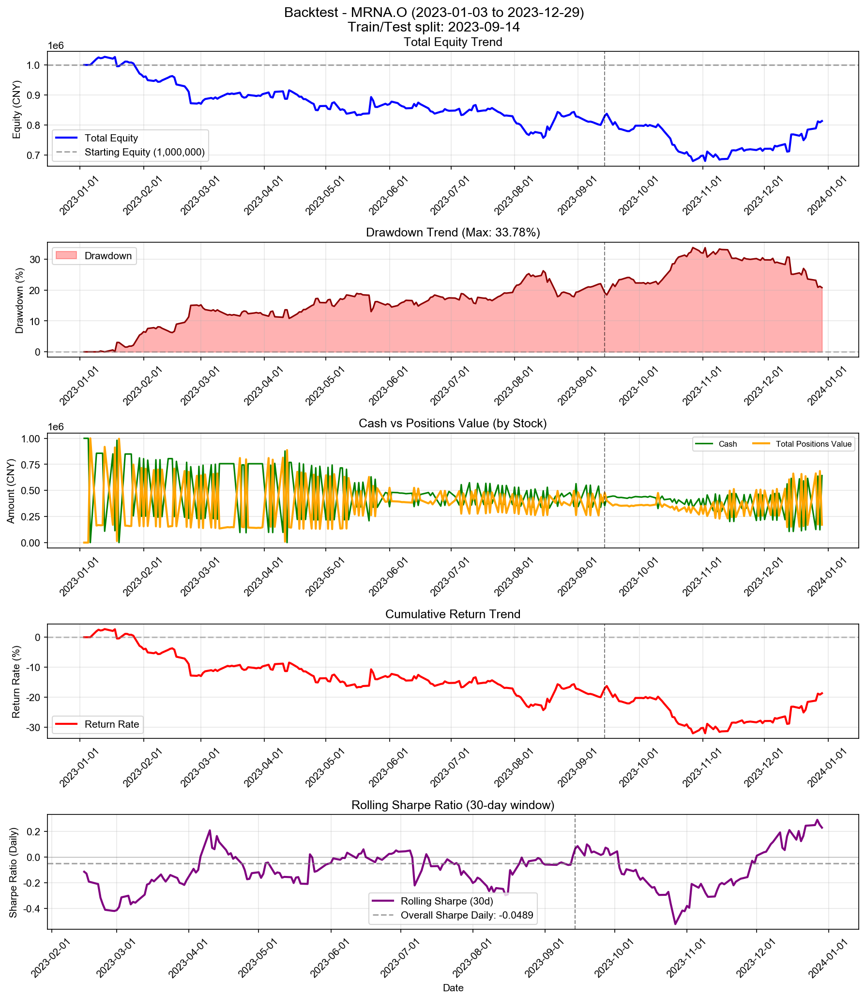

# Backtest

**策略名称:** 单股票交易系统（不带反思层）  
**股票代码:** MRNA.O  
**回测期间:** 2023-01-03 至 2023-12-29  
**交易日数:** 250  
**初始资金:** 1000000.00 元

---

## 账户表现

| 项目 | 数值 |
|------|------|
| 初始资金 | 1000000.00 元 |
| 最终现金 | 642418.83 元 |
| 最终持仓市值 | 171007.26 元 |
| 最终总权益 | 813426.09 元 |
| 总盈亏 | -186573.91 元 |
| 总收益率 | -18.66% |
| 年化收益率 (CAGR) | -18.79% |

---

## 参数θ追踪

### 初始参数

| 参数 | 数值 |
|------|------|
| 总仓位上限 (gross_exposure) | 0.85 |
| 单票上限 (max_w) | 0.20 |
| 换手上限 (turnover_cap) | 0.25 |
| 风险模式 (risk_mode) | neutral |
| 进场阈值 (enter_th) | 0.020 |
| 出场阈值 (exit_th) | -0.100 |

### 最终参数

| 参数 | 数值 |
|------|------|
| 总仓位上限 (gross_exposure) | 0.85 |
| 单票上限 (max_w) | 0.20 |
| 换手上限 (turnover_cap) | 0.25 |
| 风险模式 (risk_mode) | neutral |
| 进场阈值 (enter_th) | 0.020 |
| 出场阈值 (exit_th) | -0.100 |

### 参数变化趋势图

---

## 持仓明细

| 股票代码 | 股数 | 成本价 | 现价 | 市值 | 权重 | 盈亏 | 收益率 |
|----------|------|--------|------|------|------|------|--------|
| MRNA.O | 171953 | 0.99 | 0.99 | 171007.26 | 21.02% | +1210.77 | +0.71% |

---

## 交易统计

| 项目 | 数值 |
|------|------|
| 总交易次数 | 448 次 |
| 买入次数 | 225 次 |
| 卖出次数 | 223 次 |
| 买入总成本 | 80275932.92 元 |
| 卖出总收入 | 79918351.75 元 |
| 已实现盈亏 | -187784.68 元 |

### 交易质量指标

| 指标 | 数值 |
|------|------|
| 胜率 (Hit Rate) | 49.78% |
| 盈亏比 (Profit Factor) | 0.80 |
| 单笔平均收益 | -842.08 元 |
| 平均持仓周期 | 2.1 天 |

---

## 风险与稳健性

| 指标 | 数值 |
|------|------|
| 最大回撤 (Max Drawdown) | 33.78% |
| 年化波动率 (Volatility) | 23.41% |
| 年化夏普比率 (Sharpe) | -0.7766 |
| 日频夏普比率 (Sharpe Daily) | -0.0489 |
| 年化 Sortino 比率 | -0.8227 |
| 日频 Sortino 比率 | -0.0518 |
| Calmar 比率 (CAGR/MaxDD) | -0.5562 |
### 尾部风险 (Tail Risk)

| 指标 | 数值 |
|------|------|
| VaR 95% | -2.52% |
| VaR 99% | -3.64% |
| CVaR 95% | -3.17% |
| CVaR 99% | -4.08% |
| 极端日跌幅 (5%分位) | -2.57% |
| 极端日跌幅 (1%分位) | -4.20% |

---

## 执行与成本

| 指标 | 数值 |
|------|------|
| 换手率 (Turnover) | 9531.81% |
| 交易频率 (每日) | 1.79 次/日 |
| 交易频率 (每周) | 8.96 次/周 |

---

## 策略参数

---

## 交易记录

| 序号 | 日期 | 类型 | 股票代码 | 股数 | 价格 | 成本/收入 | 利润 |
|------|------|------|----------|------|------|-----------|------|
| 1 | 2023-01-06 | 买入 | MRNA.O | 88716 | 1.80 | 159999.31 | - |
| 2 | 2023-01-06 | 买入 | MRNA.O | 465761 | 1.80 | 839999.96 | - |
| 3 | 2023-01-09 | 卖出 | MRNA.O | 465760 | 1.84 | 856765.52 | +16767.36 |
| 4 | 2023-01-13 | 卖出 | MRNA.O | 3125 | 1.92 | 6000.00 | +364.06 |
| 5 | 2023-01-13 | 买入 | MRNA.O | 392737 | 1.92 | 754055.04 | - |
| 6 | 2023-01-17 | 卖出 | MRNA.O | 392674 | 1.91 | 748790.05 | +3041.83 |
| 7 | 2023-01-17 | 买入 | MRNA.O | 3475 | 1.91 | 6626.48 | - |
| 8 | 2023-01-18 | 卖出 | MRNA.O | 5769 | 1.97 | 11366.08 | +408.12 |
| 9 | 2023-01-18 | 买入 | MRNA.O | 379772 | 1.97 | 748226.79 | - |
| 10 | 2023-01-19 | 卖出 | MRNA.O | 463133 | 1.90 | 881712.61 | -24854.70 |
| 11 | 2023-01-19 | 买入 | MRNA.O | 7585 | 1.90 | 14440.32 | - |
| 12 | 2023-01-20 | 买入 | MRNA.O | 74567 | 1.94 | 144645.07 | - |
| 13 | 2023-01-20 | 买入 | MRNA.O | 431302 | 1.94 | 836639.62 | - |
| 14 | 2023-01-23 | 卖出 | MRNA.O | 431301 | 1.97 | 849404.19 | +12995.88 |
| 15 | 2023-01-27 | 卖出 | MRNA.O | 82153 | 1.89 | 155556.71 | -3759.99 |
| 16 | 2023-01-27 | 买入 | MRNA.O | 395516 | 1.89 | 748909.55 | - |
| 17 | 2023-01-30 | 卖出 | MRNA.O | 395516 | 1.81 | 715369.79 | -33539.76 |
| 18 | 2023-01-30 | 买入 | MRNA.O | 87859 | 1.81 | 158910.57 | - |
| 19 | 2023-01-31 | 卖出 | MRNA.O | 87859 | 1.76 | 154684.56 | -4226.02 |
| 20 | 2023-01-31 | 买入 | MRNA.O | 406561 | 1.76 | 715791.30 | - |
| 21 | 2023-02-01 | 卖出 | MRNA.O | 406561 | 1.74 | 708635.82 | -7155.47 |
| 22 | 2023-02-01 | 买入 | MRNA.O | 89157 | 1.74 | 155400.65 | - |
| 23 | 2023-02-02 | 卖出 | MRNA.O | 89157 | 1.76 | 157228.37 | +1827.72 |
| 24 | 2023-02-02 | 买入 | MRNA.O | 401731 | 1.76 | 708452.62 | - |
| 25 | 2023-02-03 | 卖出 | MRNA.O | 401731 | 1.73 | 695998.96 | -12453.66 |
| 26 | 2023-02-03 | 买入 | MRNA.O | 91471 | 1.73 | 158473.51 | - |
| 27 | 2023-02-06 | 卖出 | MRNA.O | 91471 | 1.70 | 155747.67 | -2725.84 |
| 28 | 2023-02-06 | 买入 | MRNA.O | 408922 | 1.70 | 696271.49 | - |
| 29 | 2023-02-07 | 卖出 | MRNA.O | 408922 | 1.71 | 699501.97 | +3230.48 |
| 30 | 2023-02-07 | 买入 | MRNA.O | 90860 | 1.71 | 155425.12 | - |
| 31 | 2023-02-08 | 卖出 | MRNA.O | 90860 | 1.64 | 149319.32 | -6105.79 |
| 32 | 2023-02-08 | 买入 | MRNA.O | 426015 | 1.64 | 700113.05 | - |
| 33 | 2023-02-09 | 卖出 | MRNA.O | 426015 | 1.64 | 700709.47 | +596.42 |
| 34 | 2023-02-09 | 买入 | MRNA.O | 90746 | 1.64 | 149259.02 | - |
| 35 | 2023-02-10 | 卖出 | MRNA.O | 90746 | 1.69 | 153614.83 | +4355.81 |
| 36 | 2023-02-10 | 买入 | MRNA.O | 413678 | 1.69 | 700274.12 | - |
| 37 | 2023-02-13 | 卖出 | MRNA.O | 413678 | 1.71 | 709375.03 | +9100.92 |
| 38 | 2023-02-13 | 买入 | MRNA.O | 89051 | 1.71 | 152704.65 | - |
| 39 | 2023-02-16 | 卖出 | MRNA.O | 89051 | 1.72 | 153443.78 | +739.12 |
| 40 | 2023-02-16 | 买入 | MRNA.O | 411643 | 1.72 | 709302.05 | - |
| 41 | 2023-02-17 | 卖出 | MRNA.O | 411643 | 1.67 | 685797.24 | -23504.82 |
| 42 | 2023-02-17 | 买入 | MRNA.O | 93513 | 1.67 | 155792.66 | - |
| 43 | 2023-02-21 | 卖出 | MRNA.O | 93512 | 1.60 | 149703.36 | -6087.63 |
| 44 | 2023-02-21 | 买入 | MRNA.O | 428763 | 1.60 | 686406.69 | - |
| 45 | 2023-02-22 | 卖出 | MRNA.O | 428764 | 1.58 | 678176.02 | -8232.33 |
| 46 | 2023-02-22 | 买入 | MRNA.O | 95168 | 1.58 | 150527.23 | - |
| 47 | 2023-02-23 | 卖出 | MRNA.O | 95168 | 1.48 | 140439.42 | -10087.81 |
| 48 | 2023-02-23 | 买入 | MRNA.O | 460246 | 1.48 | 679185.02 | - |
| 49 | 2023-02-24 | 卖出 | MRNA.O | 460246 | 1.39 | 640938.58 | -38246.44 |
| 50 | 2023-02-24 | 买入 | MRNA.O | 103593 | 1.39 | 144263.61 | - |
| 51 | 2023-02-27 | 卖出 | MRNA.O | 103593 | 1.38 | 143238.04 | -1025.57 |
| 52 | 2023-02-27 | 买入 | MRNA.O | 463615 | 1.38 | 641040.46 | - |
| 53 | 2023-02-28 | 卖出 | MRNA.O | 463614 | 1.39 | 643542.59 | +2503.52 |
| 54 | 2023-02-28 | 买入 | MRNA.O | 103010 | 1.39 | 142988.18 | - |
| 55 | 2023-03-01 | 卖出 | MRNA.O | 103011 | 1.36 | 139744.72 | -3244.84 |
| 56 | 2023-03-01 | 买入 | MRNA.O | 474618 | 1.36 | 643866.78 | - |
| 57 | 2023-03-02 | 卖出 | MRNA.O | 474618 | 1.38 | 654308.37 | +10441.60 |
| 58 | 2023-03-02 | 买入 | MRNA.O | 100610 | 1.38 | 138700.95 | - |
| 59 | 2023-03-03 | 卖出 | MRNA.O | 100610 | 1.43 | 144073.52 | +5372.57 |
| 60 | 2023-03-03 | 买入 | MRNA.O | 456544 | 1.43 | 653771.01 | - |
| 61 | 2023-03-06 | 卖出 | MRNA.O | 456544 | 1.44 | 657560.32 | +3789.32 |
| 62 | 2023-03-06 | 买入 | MRNA.O | 99767 | 1.44 | 143694.41 | - |
| 63 | 2023-03-07 | 卖出 | MRNA.O | 99766 | 1.41 | 140719.94 | -2973.03 |
| 64 | 2023-03-07 | 买入 | MRNA.O | 466400 | 1.41 | 657857.20 | - |
| 65 | 2023-03-08 | 卖出 | MRNA.O | 466401 | 1.42 | 662662.54 | +4803.90 |
| 66 | 2023-03-08 | 买入 | MRNA.O | 98705 | 1.42 | 140240.06 | - |
| 67 | 2023-03-09 | 卖出 | MRNA.O | 98705 | 1.37 | 135581.19 | -4658.88 |
| 68 | 2023-03-09 | 买入 | MRNA.O | 482767 | 1.37 | 663128.75 | - |
| 69 | 2023-03-10 | 卖出 | MRNA.O | 482767 | 1.38 | 667618.48 | +4489.73 |
| 70 | 2023-03-10 | 买入 | MRNA.O | 97716 | 1.38 | 135131.46 | - |
| 71 | 2023-03-20 | 卖出 | MRNA.O | 3715 | 1.55 | 5740.42 | +602.94 |
| 72 | 2023-03-20 | 买入 | MRNA.O | 431034 | 1.55 | 666033.74 | - |
| 73 | 2023-03-21 | 卖出 | MRNA.O | 430875 | 1.52 | 655360.88 | +2093.10 |
| 74 | 2023-03-21 | 买入 | MRNA.O | 4609 | 1.52 | 7010.29 | - |
| 75 | 2023-03-23 | 卖出 | MRNA.O | 3204 | 1.49 | 4787.42 | -71.03 |
| 76 | 2023-03-23 | 买入 | MRNA.O | 438780 | 1.49 | 655625.08 | - |
| 77 | 2023-03-24 | 卖出 | MRNA.O | 438878 | 1.51 | 662179.13 | +4667.56 |
| 78 | 2023-04-03 | 卖出 | MRNA.O | 4324 | 1.59 | 6895.92 | +417.85 |
| 79 | 2023-04-03 | 买入 | MRNA.O | 417210 | 1.59 | 665366.51 | - |
| 80 | 2023-04-04 | 卖出 | MRNA.O | 417024 | 1.57 | 652725.96 | -5118.64 |
| 81 | 2023-04-04 | 买入 | MRNA.O | 5367 | 1.57 | 8400.43 | - |
| 82 | 2023-04-05 | 卖出 | MRNA.O | 4430 | 1.55 | 6849.22 | -135.97 |
| 83 | 2023-04-05 | 买入 | MRNA.O | 422295 | 1.55 | 652910.30 | - |
| 84 | 2023-04-06 | 卖出 | MRNA.O | 422525 | 1.58 | 668730.32 | +13139.03 |
| 85 | 2023-04-06 | 买入 | MRNA.O | 3138 | 1.58 | 4966.51 | - |
| 86 | 2023-04-10 | 卖出 | MRNA.O | 4040 | 1.60 | 6470.06 | +197.44 |
| 87 | 2023-04-10 | 买入 | MRNA.O | 417453 | 1.60 | 668550.98 | - |
| 88 | 2023-04-11 | 卖出 | MRNA.O | 508587 | 1.55 | 789581.32 | -20466.94 |
| 89 | 2023-04-11 | 买入 | MRNA.O | 5773 | 1.55 | 8962.58 | - |
| 90 | 2023-04-12 | 买入 | MRNA.O | 85488 | 1.56 | 132985.13 | - |
| 91 | 2023-04-12 | 买入 | MRNA.O | 479122 | 1.56 | 745322.18 | - |
| 92 | 2023-04-13 | 卖出 | MRNA.O | 479121 | 1.61 | 769132.94 | +23827.35 |
| 93 | 2023-04-17 | 卖出 | MRNA.O | 91262 | 1.44 | 131389.90 | -10574.40 |
| 94 | 2023-04-17 | 买入 | MRNA.O | 471682 | 1.44 | 679080.58 | - |
| 95 | 2023-04-18 | 卖出 | MRNA.O | 471682 | 1.43 | 672760.04 | -6320.54 |
| 96 | 2023-04-18 | 买入 | MRNA.O | 92563 | 1.43 | 132022.61 | - |
| 97 | 2023-04-19 | 卖出 | MRNA.O | 92563 | 1.43 | 132198.48 | +175.87 |
| 98 | 2023-04-19 | 买入 | MRNA.O | 471042 | 1.43 | 672742.18 | - |
| 99 | 2023-04-20 | 卖出 | MRNA.O | 471042 | 1.41 | 664828.68 | -7913.51 |
| 100 | 2023-04-20 | 买入 | MRNA.O | 94226 | 1.41 | 132990.58 | - |
| 101 | 2023-04-21 | 卖出 | MRNA.O | 94226 | 1.41 | 132717.32 | -273.26 |
| 102 | 2023-04-21 | 买入 | MRNA.O | 472031 | 1.41 | 664855.66 | - |
| 103 | 2023-04-24 | 卖出 | MRNA.O | 472030 | 1.38 | 652062.24 | -12792.01 |
| 104 | 2023-04-24 | 买入 | MRNA.O | 97000 | 1.38 | 133995.80 | - |
| 105 | 2023-04-25 | 卖出 | MRNA.O | 97001 | 1.35 | 130854.35 | -3142.86 |
| 106 | 2023-04-25 | 买入 | MRNA.O | 483600 | 1.35 | 652376.40 | - |
| 107 | 2023-04-26 | 卖出 | MRNA.O | 483600 | 1.31 | 632161.92 | -20214.48 |
| 108 | 2023-04-26 | 买入 | MRNA.O | 101650 | 1.31 | 132876.88 | - |
| 109 | 2023-04-27 | 卖出 | MRNA.O | 101650 | 1.30 | 132216.15 | -660.73 |
| 110 | 2023-04-27 | 买入 | MRNA.O | 486067 | 1.30 | 632227.35 | - |
| 111 | 2023-04-28 | 卖出 | MRNA.O | 486066 | 1.33 | 645933.11 | +13707.06 |
| 112 | 2023-04-28 | 买入 | MRNA.O | 98462 | 1.33 | 130846.15 | - |
| 113 | 2023-05-01 | 卖出 | MRNA.O | 98463 | 1.33 | 131349.64 | +502.19 |
| 114 | 2023-05-01 | 买入 | MRNA.O | 484170 | 1.33 | 645882.78 | - |
| 115 | 2023-05-02 | 卖出 | MRNA.O | 484170 | 1.31 | 636199.38 | -9683.40 |
| 116 | 2023-05-02 | 买入 | MRNA.O | 100698 | 1.31 | 132317.17 | - |
| 117 | 2023-05-03 | 卖出 | MRNA.O | 100698 | 1.30 | 131048.38 | -1268.79 |
| 118 | 2023-05-03 | 买入 | MRNA.O | 488955 | 1.30 | 636326.04 | - |
| 119 | 2023-05-04 | 卖出 | MRNA.O | 488955 | 1.34 | 656813.25 | +20487.21 |
| 120 | 2023-05-04 | 买入 | MRNA.O | 96032 | 1.34 | 128999.79 | - |
| 121 | 2023-05-05 | 卖出 | MRNA.O | 96032 | 1.37 | 131602.25 | +2602.47 |
| 122 | 2023-05-05 | 买入 | MRNA.O | 479096 | 1.37 | 656553.16 | - |
| 123 | 2023-05-08 | 卖出 | MRNA.O | 479096 | 1.32 | 631208.98 | -25344.18 |
| 124 | 2023-05-08 | 买入 | MRNA.O | 101812 | 1.32 | 134137.31 | - |
| 125 | 2023-05-10 | 卖出 | MRNA.O | 101812 | 1.31 | 133200.64 | -936.67 |
| 126 | 2023-05-10 | 买入 | MRNA.O | 482536 | 1.31 | 631301.85 | - |
| 127 | 2023-05-11 | 卖出 | MRNA.O | 482536 | 1.28 | 619624.48 | -11677.37 |
| 128 | 2023-05-11 | 买入 | MRNA.O | 104640 | 1.28 | 134368.22 | - |
| 129 | 2023-05-12 | 卖出 | MRNA.O | 104640 | 1.29 | 135299.52 | +931.30 |
| 130 | 2023-05-12 | 买入 | MRNA.O | 479143 | 1.29 | 619531.90 | - |
| 131 | 2023-05-15 | 卖出 | MRNA.O | 375559 | 1.30 | 489203.15 | +3605.37 |
| 132 | 2023-05-15 | 买入 | MRNA.O | 103516 | 1.30 | 134839.94 | - |
| 133 | 2023-05-16 | 卖出 | MRNA.O | 207100 | 1.25 | 259102.81 | -9671.24 |
| 134 | 2023-05-16 | 买入 | MRNA.O | 391871 | 1.25 | 490269.81 | - |
| 135 | 2023-05-17 | 卖出 | MRNA.O | 391871 | 1.26 | 492072.41 | +1802.61 |
| 136 | 2023-05-17 | 买入 | MRNA.O | 206197 | 1.26 | 258921.57 | - |
| 137 | 2023-05-18 | 卖出 | MRNA.O | 206197 | 1.25 | 258426.70 | -494.87 |
| 138 | 2023-05-18 | 买入 | MRNA.O | 392661 | 1.25 | 492122.03 | - |
| 139 | 2023-05-19 | 卖出 | MRNA.O | 392661 | 1.26 | 495695.25 | +3573.22 |
| 140 | 2023-05-19 | 买入 | MRNA.O | 204428 | 1.26 | 258069.91 | - |
| 141 | 2023-05-22 | 卖出 | MRNA.O | 98568 | 1.27 | 124925.08 | +492.84 |
| 142 | 2023-05-22 | 买入 | MRNA.O | 391031 | 1.27 | 495592.69 | - |
| 143 | 2023-05-23 | 卖出 | MRNA.O | 393138 | 1.38 | 541547.59 | +43703.27 |
| 144 | 2023-05-23 | 买入 | MRNA.O | 86718 | 1.38 | 119454.04 | - |
| 145 | 2023-05-24 | 卖出 | MRNA.O | 190471 | 1.32 | 250640.79 | -199.29 |
| 146 | 2023-05-24 | 买入 | MRNA.O | 412434 | 1.32 | 542721.90 | - |
| 147 | 2023-05-25 | 卖出 | MRNA.O | 412434 | 1.26 | 521605.28 | -21116.62 |
| 148 | 2023-05-25 | 买入 | MRNA.O | 199851 | 1.26 | 252751.56 | - |
| 149 | 2023-05-26 | 卖出 | MRNA.O | 199851 | 1.26 | 252291.90 | -459.66 |
| 150 | 2023-05-26 | 买入 | MRNA.O | 413222 | 1.26 | 521651.45 | - |
| 151 | 2023-05-30 | 卖出 | MRNA.O | 305112 | 1.29 | 393258.86 | +8085.47 |
| 152 | 2023-05-30 | 买入 | MRNA.O | 194893 | 1.29 | 251197.59 | - |
| 153 | 2023-05-31 | 卖出 | MRNA.O | 303003 | 1.28 | 386965.13 | -710.52 |
| 154 | 2023-05-31 | 买入 | MRNA.O | 308211 | 1.28 | 393616.27 | - |
| 155 | 2023-06-01 | 卖出 | MRNA.O | 199924 | 1.29 | 256942.32 | +1619.38 |
| 156 | 2023-06-01 | 买入 | MRNA.O | 300899 | 1.29 | 386715.39 | - |
| 157 | 2023-06-02 | 卖出 | MRNA.O | 301552 | 1.31 | 393555.52 | +6647.29 |
| 158 | 2023-06-02 | 买入 | MRNA.O | 196251 | 1.31 | 256127.18 | - |
| 159 | 2023-06-05 | 卖出 | MRNA.O | 303885 | 1.29 | 391707.77 | -2519.91 |
| 160 | 2023-06-05 | 买入 | MRNA.O | 305698 | 1.29 | 394044.72 | - |
| 161 | 2023-06-06 | 卖出 | MRNA.O | 305698 | 1.27 | 387930.76 | -6113.96 |
| 162 | 2023-06-06 | 买入 | MRNA.O | 309157 | 1.27 | 392320.23 | - |
| 163 | 2023-06-07 | 卖出 | MRNA.O | 309157 | 1.26 | 388332.11 | -3988.13 |
| 164 | 2023-06-07 | 买入 | MRNA.O | 309155 | 1.26 | 388329.60 | - |
| 165 | 2023-06-08 | 卖出 | MRNA.O | 309155 | 1.25 | 386258.26 | -2071.34 |
| 166 | 2023-06-08 | 买入 | MRNA.O | 310980 | 1.25 | 388538.41 | - |
| 167 | 2023-06-09 | 卖出 | MRNA.O | 310980 | 1.23 | 383313.95 | -5224.46 |
| 168 | 2023-06-09 | 买入 | MRNA.O | 313793 | 1.23 | 386781.25 | - |
| 169 | 2023-06-12 | 卖出 | MRNA.O | 313793 | 1.24 | 387597.11 | +815.86 |
| 170 | 2023-06-12 | 买入 | MRNA.O | 310259 | 1.24 | 383231.92 | - |
| 171 | 2023-06-13 | 卖出 | MRNA.O | 201452 | 1.28 | 257818.27 | +8984.76 |
| 172 | 2023-06-13 | 买入 | MRNA.O | 301777 | 1.28 | 386214.20 | - |
| 173 | 2023-06-14 | 卖出 | MRNA.O | 301117 | 1.26 | 379557.98 | -2252.58 |
| 174 | 2023-06-14 | 买入 | MRNA.O | 205165 | 1.26 | 258610.48 | - |
| 175 | 2023-06-15 | 卖出 | MRNA.O | 206953 | 1.30 | 268997.51 | +7594.61 |
| 176 | 2023-06-15 | 买入 | MRNA.O | 291061 | 1.30 | 378321.09 | - |
| 177 | 2023-06-16 | 卖出 | MRNA.O | 290635 | 1.29 | 374134.44 | -752.73 |
| 178 | 2023-06-16 | 买入 | MRNA.O | 209350 | 1.29 | 269496.26 | - |
| 179 | 2023-06-20 | 卖出 | MRNA.O | 317455 | 1.24 | 394374.35 | -14565.46 |
| 180 | 2023-06-20 | 买入 | MRNA.O | 302312 | 1.24 | 375562.20 | - |
| 181 | 2023-06-21 | 卖出 | MRNA.O | 302312 | 1.21 | 366009.14 | -9553.06 |
| 182 | 2023-06-21 | 买入 | MRNA.O | 326530 | 1.21 | 395329.87 | - |
| 183 | 2023-06-22 | 卖出 | MRNA.O | 326530 | 1.20 | 393403.34 | -1926.53 |
| 184 | 2023-06-22 | 买入 | MRNA.O | 303953 | 1.20 | 366202.57 | - |
| 185 | 2023-06-23 | 卖出 | MRNA.O | 303953 | 1.19 | 360184.30 | -6018.27 |
| 186 | 2023-06-23 | 买入 | MRNA.O | 332493 | 1.19 | 394004.21 | - |
| 187 | 2023-06-26 | 卖出 | MRNA.O | 220297 | 1.20 | 265259.62 | +4207.67 |
| 188 | 2023-06-26 | 买入 | MRNA.O | 298605 | 1.20 | 359550.28 | - |
| 189 | 2023-06-27 | 卖出 | MRNA.O | 298705 | 1.21 | 360447.32 | +2334.83 |
| 190 | 2023-06-27 | 买入 | MRNA.O | 219733 | 1.21 | 265151.81 | - |
| 191 | 2023-06-28 | 卖出 | MRNA.O | 220851 | 1.23 | 271646.73 | +5728.99 |
| 192 | 2023-06-28 | 买入 | MRNA.O | 292418 | 1.23 | 359674.14 | - |
| 193 | 2023-06-29 | 卖出 | MRNA.O | 292080 | 1.22 | 356658.89 | -515.09 |
| 194 | 2023-06-29 | 买入 | MRNA.O | 222755 | 1.22 | 272006.13 | - |
| 195 | 2023-06-30 | 卖出 | MRNA.O | 334071 | 1.22 | 405896.27 | -2234.14 |
| 196 | 2023-06-30 | 买入 | MRNA.O | 293714 | 1.22 | 356862.51 | - |
| 197 | 2023-07-03 | 卖出 | MRNA.O | 293714 | 1.22 | 357538.05 | +675.54 |
| 198 | 2023-07-03 | 买入 | MRNA.O | 333384 | 1.22 | 405828.34 | - |
| 199 | 2023-07-05 | 卖出 | MRNA.O | 222751 | 1.24 | 275186.59 | +4031.79 |
| 200 | 2023-07-05 | 买入 | MRNA.O | 288923 | 1.24 | 356935.47 | - |
| 201 | 2023-07-06 | 卖出 | MRNA.O | 399556 | 1.18 | 472634.79 | -18974.23 |
| 202 | 2023-07-06 | 买入 | MRNA.O | 234410 | 1.18 | 277283.59 | - |
| 203 | 2023-07-07 | 卖出 | MRNA.O | 234410 | 1.19 | 278643.17 | +1359.58 |
| 204 | 2023-07-07 | 买入 | MRNA.O | 397492 | 1.19 | 472498.74 | - |
| 205 | 2023-07-10 | 卖出 | MRNA.O | 397492 | 1.23 | 489272.90 | +16774.16 |
| 206 | 2023-07-10 | 买入 | MRNA.O | 225011 | 1.23 | 276966.04 | - |
| 207 | 2023-07-11 | 卖出 | MRNA.O | 225011 | 1.22 | 274805.93 | -2160.11 |
| 208 | 2023-07-11 | 买入 | MRNA.O | 400794 | 1.22 | 489489.71 | - |
| 209 | 2023-07-12 | 卖出 | MRNA.O | 290958 | 1.26 | 366374.31 | +11027.31 |
| 210 | 2023-07-12 | 买入 | MRNA.O | 217032 | 1.26 | 273286.69 | - |
| 211 | 2023-07-13 | 卖出 | MRNA.O | 217345 | 1.27 | 275180.50 | +4267.65 |
| 212 | 2023-07-13 | 买入 | MRNA.O | 289194 | 1.27 | 366148.52 | - |
| 213 | 2023-07-14 | 卖出 | MRNA.O | 398717 | 1.21 | 483843.08 | -18821.99 |
| 214 | 2023-07-14 | 买入 | MRNA.O | 228494 | 1.21 | 277277.47 | - |
| 215 | 2023-07-17 | 卖出 | MRNA.O | 228493 | 1.23 | 280132.42 | +2856.16 |
| 216 | 2023-07-17 | 买入 | MRNA.O | 394419 | 1.23 | 483557.69 | - |
| 217 | 2023-07-18 | 卖出 | MRNA.O | 394420 | 1.23 | 483598.36 | +39.45 |
| 218 | 2023-07-18 | 买入 | MRNA.O | 228471 | 1.23 | 280128.29 | - |
| 219 | 2023-07-19 | 卖出 | MRNA.O | 228471 | 1.25 | 285977.15 | +5848.86 |
| 220 | 2023-07-19 | 买入 | MRNA.O | 385886 | 1.25 | 483013.51 | - |
| 221 | 2023-07-20 | 卖出 | MRNA.O | 385886 | 1.25 | 481469.96 | -1543.54 |
| 222 | 2023-07-20 | 买入 | MRNA.O | 229327 | 1.25 | 286131.30 | - |
| 223 | 2023-07-21 | 卖出 | MRNA.O | 229327 | 1.26 | 289938.13 | +3806.83 |
| 224 | 2023-07-21 | 买入 | MRNA.O | 380519 | 1.26 | 481090.17 | - |
| 225 | 2023-07-24 | 卖出 | MRNA.O | 380519 | 1.23 | 468076.42 | -13013.75 |
| 226 | 2023-07-24 | 买入 | MRNA.O | 236760 | 1.23 | 291238.48 | - |
| 227 | 2023-07-25 | 卖出 | MRNA.O | 236760 | 1.22 | 288539.41 | -2699.06 |
| 228 | 2023-07-25 | 买入 | MRNA.O | 384300 | 1.22 | 468346.41 | - |
| 229 | 2023-07-26 | 卖出 | MRNA.O | 384300 | 1.21 | 463657.95 | -4688.46 |
| 230 | 2023-07-26 | 买入 | MRNA.O | 239543 | 1.21 | 289008.63 | - |
| 231 | 2023-07-27 | 卖出 | MRNA.O | 239543 | 1.19 | 283882.41 | -5126.22 |
| 232 | 2023-07-27 | 买入 | MRNA.O | 391672 | 1.19 | 464170.49 | - |
| 233 | 2023-07-28 | 卖出 | MRNA.O | 391672 | 1.19 | 464758.00 | +587.51 |
| 234 | 2023-07-28 | 买入 | MRNA.O | 239191 | 1.19 | 283824.04 | - |
| 235 | 2023-07-31 | 卖出 | MRNA.O | 239191 | 1.18 | 281432.13 | -2391.91 |
| 236 | 2023-07-31 | 买入 | MRNA.O | 395204 | 1.18 | 464997.03 | - |
| 237 | 2023-08-01 | 卖出 | MRNA.O | 395204 | 1.14 | 450295.44 | -14701.59 |
| 238 | 2023-08-01 | 买入 | MRNA.O | 248290 | 1.14 | 282901.63 | - |
| 239 | 2023-08-02 | 卖出 | MRNA.O | 248290 | 1.10 | 273665.24 | -9236.39 |
| 240 | 2023-08-02 | 买入 | MRNA.O | 409381 | 1.10 | 451219.74 | - |
| 241 | 2023-08-03 | 卖出 | MRNA.O | 409381 | 1.10 | 450114.41 | -1105.33 |
| 242 | 2023-08-03 | 买入 | MRNA.O | 249000 | 1.10 | 273775.50 | - |
| 243 | 2023-08-04 | 卖出 | MRNA.O | 249000 | 1.08 | 269393.10 | -4382.40 |
| 244 | 2023-08-04 | 买入 | MRNA.O | 416446 | 1.08 | 450552.93 | - |
| 245 | 2023-08-07 | 卖出 | MRNA.O | 416446 | 1.01 | 421443.35 | -29109.58 |
| 246 | 2023-08-07 | 买入 | MRNA.O | 269075 | 1.01 | 272303.90 | - |
| 247 | 2023-08-08 | 卖出 | MRNA.O | 269075 | 1.00 | 268375.40 | -3928.50 |
| 248 | 2023-08-08 | 买入 | MRNA.O | 422936 | 1.00 | 421836.37 | - |
| 249 | 2023-08-09 | 卖出 | MRNA.O | 422936 | 1.02 | 430633.44 | +8797.07 |
| 250 | 2023-08-09 | 买入 | MRNA.O | 262714 | 1.02 | 267495.39 | - |
| 251 | 2023-08-10 | 卖出 | MRNA.O | 262714 | 1.00 | 263449.60 | -4045.80 |
| 252 | 2023-08-10 | 买入 | MRNA.O | 429835 | 1.00 | 431038.54 | - |
| 253 | 2023-08-11 | 卖出 | MRNA.O | 429835 | 1.01 | 436239.54 | +5201.00 |
| 254 | 2023-08-11 | 买入 | MRNA.O | 259069 | 1.01 | 262929.13 | - |
| 255 | 2023-08-14 | 卖出 | MRNA.O | 259069 | 1.00 | 259069.00 | -3860.13 |
| 256 | 2023-08-14 | 买入 | MRNA.O | 436626 | 1.00 | 436626.00 | - |
| 257 | 2023-08-15 | 卖出 | MRNA.O | 436626 | 0.96 | 420951.13 | -15674.87 |
| 258 | 2023-08-15 | 买入 | MRNA.O | 270341 | 0.96 | 260635.76 | - |
| 259 | 2023-08-16 | 卖出 | MRNA.O | 270341 | 0.99 | 267421.32 | +6785.56 |
| 260 | 2023-08-16 | 买入 | MRNA.O | 424861 | 0.99 | 420272.50 | - |
| 261 | 2023-08-17 | 卖出 | MRNA.O | 424861 | 1.06 | 451372.33 | +31099.83 |
| 262 | 2023-08-17 | 买入 | MRNA.O | 248787 | 1.06 | 264311.31 | - |
| 263 | 2023-08-18 | 卖出 | MRNA.O | 248787 | 1.02 | 252817.35 | -11493.96 |
| 264 | 2023-08-18 | 买入 | MRNA.O | 445308 | 1.02 | 452521.99 | - |
| 265 | 2023-08-21 | 卖出 | MRNA.O | 326354 | 1.11 | 362514.02 | +30873.09 |
| 266 | 2023-08-21 | 买入 | MRNA.O | 223807 | 1.11 | 248604.82 | - |
| 267 | 2023-08-22 | 卖出 | MRNA.O | 226653 | 1.16 | 263461.45 | +19136.45 |
| 268 | 2023-08-22 | 买入 | MRNA.O | 310345 | 1.16 | 360745.03 | - |
| 269 | 2023-08-23 | 卖出 | MRNA.O | 310021 | 1.15 | 357950.25 | +4708.43 |
| 270 | 2023-08-23 | 买入 | MRNA.O | 228473 | 1.15 | 263794.93 | - |
| 271 | 2023-08-24 | 卖出 | MRNA.O | 344905 | 1.13 | 388535.48 | -7923.53 |
| 272 | 2023-08-24 | 买入 | MRNA.O | 318614 | 1.13 | 358918.67 | - |
| 273 | 2023-08-25 | 卖出 | MRNA.O | 318614 | 1.12 | 356624.65 | -2294.02 |
| 274 | 2023-08-25 | 买入 | MRNA.O | 347329 | 1.12 | 388765.35 | - |
| 275 | 2023-08-28 | 卖出 | MRNA.O | 347329 | 1.14 | 395364.60 | +6599.25 |
| 276 | 2023-08-28 | 买入 | MRNA.O | 312716 | 1.14 | 355964.62 | - |
| 277 | 2023-08-29 | 卖出 | MRNA.O | 312716 | 1.16 | 362719.29 | +6754.67 |
| 278 | 2023-08-29 | 买入 | MRNA.O | 340279 | 1.16 | 394689.61 | - |
| 279 | 2023-08-30 | 卖出 | MRNA.O | 224523 | 1.17 | 261838.72 | +1414.49 |
| 280 | 2023-08-30 | 买入 | MRNA.O | 310842 | 1.17 | 362503.94 | - |
| 281 | 2023-08-31 | 卖出 | MRNA.O | 426598 | 1.13 | 482354.36 | -14414.97 |
| 282 | 2023-08-31 | 买入 | MRNA.O | 232912 | 1.13 | 263353.60 | - |
| 283 | 2023-09-01 | 卖出 | MRNA.O | 232912 | 1.13 | 262165.75 | -1187.85 |
| 284 | 2023-09-01 | 买入 | MRNA.O | 428636 | 1.13 | 482472.68 | - |
| 285 | 2023-09-05 | 卖出 | MRNA.O | 428636 | 1.09 | 468756.33 | -13716.35 |
| 286 | 2023-09-05 | 买入 | MRNA.O | 240982 | 1.09 | 263537.92 | - |
| 287 | 2023-09-06 | 卖出 | MRNA.O | 240982 | 1.08 | 260838.92 | -2699.00 |
| 288 | 2023-09-06 | 买入 | MRNA.O | 433321 | 1.08 | 469026.65 | - |
| 289 | 2023-09-07 | 卖出 | MRNA.O | 433321 | 1.08 | 469503.30 | +476.65 |
| 290 | 2023-09-07 | 买入 | MRNA.O | 240693 | 1.08 | 260790.87 | - |
| 291 | 2023-09-08 | 卖出 | MRNA.O | 240693 | 1.08 | 259081.95 | -1708.92 |
| 292 | 2023-09-08 | 买入 | MRNA.O | 436338 | 1.08 | 469674.22 | - |
| 293 | 2023-09-11 | 卖出 | MRNA.O | 436338 | 1.06 | 461645.60 | -8028.62 |
| 294 | 2023-09-11 | 买入 | MRNA.O | 245638 | 1.06 | 259885.00 | - |
| 295 | 2023-09-12 | 卖出 | MRNA.O | 245638 | 1.05 | 258509.43 | -1375.57 |
| 296 | 2023-09-12 | 买入 | MRNA.O | 438790 | 1.05 | 461782.60 | - |
| 297 | 2023-09-13 | 卖出 | MRNA.O | 318701 | 1.09 | 346077.42 | +10676.48 |
| 298 | 2023-09-13 | 买入 | MRNA.O | 236707 | 1.09 | 257040.13 | - |
| 299 | 2023-09-14 | 卖出 | MRNA.O | 239064 | 1.13 | 269688.10 | +12784.02 |
| 300 | 2023-09-14 | 买入 | MRNA.O | 305444 | 1.13 | 344571.38 | - |
| 301 | 2023-09-15 | 卖出 | MRNA.O | 306221 | 1.15 | 350898.64 | +10006.50 |
| 302 | 2023-09-15 | 买入 | MRNA.O | 234693 | 1.15 | 268934.71 | - |
| 303 | 2023-09-18 | 卖出 | MRNA.O | 351648 | 1.04 | 366206.23 | -32925.43 |
| 304 | 2023-09-18 | 买入 | MRNA.O | 340478 | 1.04 | 354573.79 | - |
| 305 | 2023-09-19 | 卖出 | MRNA.O | 340478 | 1.07 | 363426.22 | +8852.43 |
| 306 | 2023-09-19 | 买入 | MRNA.O | 342253 | 1.07 | 365320.85 | - |
| 307 | 2023-09-20 | 卖出 | MRNA.O | 342253 | 1.04 | 354334.53 | -10986.32 |
| 308 | 2023-09-20 | 买入 | MRNA.O | 352096 | 1.04 | 364524.99 | - |
| 309 | 2023-09-21 | 卖出 | MRNA.O | 352096 | 1.00 | 352905.82 | -11619.17 |
| 310 | 2023-09-21 | 买入 | MRNA.O | 354680 | 1.00 | 355495.76 | - |
| 311 | 2023-09-22 | 卖出 | MRNA.O | 354680 | 1.00 | 354644.53 | -851.23 |
| 312 | 2023-09-22 | 买入 | MRNA.O | 353027 | 1.00 | 352991.70 | - |
| 313 | 2023-09-25 | 卖出 | MRNA.O | 353027 | 0.98 | 346566.61 | -6425.09 |
| 314 | 2023-09-25 | 买入 | MRNA.O | 361910 | 0.98 | 355287.05 | - |
| 315 | 2023-09-26 | 卖出 | MRNA.O | 361910 | 0.98 | 355106.09 | -180.96 |
| 316 | 2023-09-26 | 买入 | MRNA.O | 353225 | 0.98 | 346584.37 | - |
| 317 | 2023-09-27 | 卖出 | MRNA.O | 353225 | 0.99 | 351246.94 | +4662.57 |
| 318 | 2023-09-27 | 买入 | MRNA.O | 356637 | 0.99 | 354639.83 | - |
| 319 | 2023-09-28 | 卖出 | MRNA.O | 356637 | 1.00 | 357599.92 | +2960.09 |
| 320 | 2023-09-28 | 买入 | MRNA.O | 350006 | 1.00 | 350951.02 | - |
| 321 | 2023-09-29 | 卖出 | MRNA.O | 350006 | 1.03 | 361521.20 | +10570.18 |
| 322 | 2023-09-29 | 买入 | MRNA.O | 345186 | 1.03 | 356542.62 | - |
| 323 | 2023-10-02 | 卖出 | MRNA.O | 345186 | 1.03 | 356611.66 | +69.04 |
| 324 | 2023-10-02 | 买入 | MRNA.O | 349932 | 1.03 | 361514.75 | - |
| 325 | 2023-10-03 | 卖出 | MRNA.O | 349932 | 1.03 | 360709.91 | -804.84 |
| 326 | 2023-10-03 | 买入 | MRNA.O | 346034 | 1.03 | 356691.85 | - |
| 327 | 2023-10-04 | 卖出 | MRNA.O | 346034 | 1.04 | 360775.05 | +4083.20 |
| 328 | 2023-10-04 | 买入 | MRNA.O | 345580 | 1.04 | 360301.71 | - |
| 329 | 2023-10-05 | 卖出 | MRNA.O | 345580 | 1.03 | 355843.73 | -4457.98 |
| 330 | 2023-10-05 | 买入 | MRNA.O | 350802 | 1.03 | 361220.82 | - |
| 331 | 2023-10-06 | 卖出 | MRNA.O | 350802 | 1.04 | 364413.12 | +3192.30 |
| 332 | 2023-10-06 | 买入 | MRNA.O | 342245 | 1.04 | 355524.11 | - |
| 333 | 2023-10-09 | 卖出 | MRNA.O | 342245 | 1.02 | 348542.31 | -6981.80 |
| 334 | 2023-10-09 | 买入 | MRNA.O | 358515 | 1.02 | 365111.68 | - |
| 335 | 2023-10-10 | 卖出 | MRNA.O | 235602 | 1.04 | 246039.17 | +6102.09 |
| 336 | 2023-10-10 | 买入 | MRNA.O | 332868 | 1.04 | 347614.05 | - |
| 337 | 2023-10-11 | 卖出 | MRNA.O | 332056 | 1.03 | 341220.75 | -3226.06 |
| 338 | 2023-10-11 | 买入 | MRNA.O | 240171 | 1.03 | 246799.72 | - |
| 339 | 2023-10-12 | 卖出 | MRNA.O | 363896 | 1.01 | 366734.39 | -8407.18 |
| 340 | 2023-10-12 | 买入 | MRNA.O | 339295 | 1.01 | 341941.50 | - |
| 341 | 2023-10-13 | 卖出 | MRNA.O | 339295 | 0.98 | 333526.98 | -8414.52 |
| 342 | 2023-10-13 | 买入 | MRNA.O | 373933 | 0.98 | 367576.14 | - |
| 343 | 2023-10-16 | 卖出 | MRNA.O | 373933 | 0.92 | 343794.00 | -23782.14 |
| 344 | 2023-10-16 | 买入 | MRNA.O | 365352 | 0.92 | 335904.63 | - |
| 345 | 2023-10-17 | 卖出 | MRNA.O | 365352 | 0.86 | 315408.38 | -20496.25 |
| 346 | 2023-10-17 | 买入 | MRNA.O | 400607 | 0.86 | 345844.02 | - |
| 347 | 2023-10-18 | 卖出 | MRNA.O | 400607 | 0.86 | 344562.08 | -1281.94 |
| 348 | 2023-10-18 | 买入 | MRNA.O | 366860 | 0.86 | 315536.29 | - |
| 349 | 2023-10-19 | 卖出 | MRNA.O | 366860 | 0.82 | 302182.58 | -13353.70 |
| 350 | 2023-10-19 | 买入 | MRNA.O | 419932 | 0.82 | 345897.99 | - |
| 351 | 2023-10-20 | 卖出 | MRNA.O | 419932 | 0.80 | 337625.33 | -8272.66 |
| 352 | 2023-10-20 | 买入 | MRNA.O | 376878 | 0.80 | 303009.91 | - |
| 353 | 2023-10-23 | 卖出 | MRNA.O | 376878 | 0.79 | 296376.86 | -6633.05 |
| 354 | 2023-10-23 | 买入 | MRNA.O | 430173 | 0.79 | 338288.05 | - |
| 355 | 2023-10-24 | 卖出 | MRNA.O | 430173 | 0.80 | 343105.98 | +4817.94 |
| 356 | 2023-10-24 | 买入 | MRNA.O | 370982 | 0.80 | 295895.24 | - |
| 357 | 2023-10-25 | 卖出 | MRNA.O | 370982 | 0.77 | 284765.78 | -11129.46 |
| 358 | 2023-10-25 | 买入 | MRNA.O | 448435 | 0.77 | 344218.71 | - |
| 359 | 2023-10-26 | 卖出 | MRNA.O | 448435 | 0.76 | 340720.91 | -3497.79 |
| 360 | 2023-10-26 | 买入 | MRNA.O | 375251 | 0.76 | 285115.71 | - |
| 361 | 2023-10-27 | 卖出 | MRNA.O | 375251 | 0.72 | 269842.99 | -15272.72 |
| 362 | 2023-10-27 | 买入 | MRNA.O | 475940 | 0.72 | 342248.45 | - |
| 363 | 2023-10-30 | 卖出 | MRNA.O | 475940 | 0.74 | 352528.76 | +10280.30 |
| 364 | 2023-10-30 | 买入 | MRNA.O | 362920 | 0.74 | 268814.84 | - |
| 365 | 2023-10-31 | 卖出 | MRNA.O | 362920 | 0.76 | 275674.03 | +6859.19 |
| 366 | 2023-10-31 | 买入 | MRNA.O | 463195 | 0.76 | 351842.92 | - |
| 367 | 2023-11-01 | 卖出 | MRNA.O | 463195 | 0.76 | 352954.59 | +1111.67 |
| 368 | 2023-11-01 | 买入 | MRNA.O | 361631 | 0.76 | 275562.82 | - |
| 369 | 2023-11-02 | 卖出 | MRNA.O | 361631 | 0.71 | 257589.76 | -17973.06 |
| 370 | 2023-11-02 | 买入 | MRNA.O | 498037 | 0.71 | 354751.76 | - |
| 371 | 2023-11-03 | 卖出 | MRNA.O | 498037 | 0.78 | 386128.09 | +31376.33 |
| 372 | 2023-11-03 | 买入 | MRNA.O | 328198 | 0.78 | 254451.91 | - |
| 373 | 2023-11-06 | 卖出 | MRNA.O | 328198 | 0.72 | 236532.30 | -17919.61 |
| 374 | 2023-11-06 | 买入 | MRNA.O | 538255 | 0.72 | 387920.38 | - |
| 375 | 2023-11-07 | 卖出 | MRNA.O | 538255 | 0.74 | 396478.63 | +8558.25 |
| 376 | 2023-11-07 | 买入 | MRNA.O | 319952 | 0.74 | 235676.64 | - |
| 377 | 2023-11-08 | 卖出 | MRNA.O | 319952 | 0.71 | 228253.76 | -7422.89 |
| 378 | 2023-11-08 | 买入 | MRNA.O | 556800 | 0.71 | 397221.12 | - |
| 379 | 2023-11-09 | 卖出 | MRNA.O | 556800 | 0.70 | 387031.68 | -10189.44 |
| 380 | 2023-11-09 | 买入 | MRNA.O | 329841 | 0.70 | 229272.48 | - |
| 381 | 2023-11-10 | 卖出 | MRNA.O | 329841 | 0.70 | 231053.62 | +1781.14 |
| 382 | 2023-11-10 | 买入 | MRNA.O | 552253 | 0.70 | 386853.23 | - |
| 383 | 2023-11-13 | 卖出 | MRNA.O | 552253 | 0.70 | 387736.83 | +883.60 |
| 384 | 2023-11-13 | 买入 | MRNA.O | 328964 | 0.70 | 230965.62 | - |
| 385 | 2023-11-14 | 卖出 | MRNA.O | 177764 | 0.74 | 131723.12 | +6915.02 |
| 386 | 2023-11-14 | 买入 | MRNA.O | 521534 | 0.74 | 386456.69 | - |
| 387 | 2023-11-15 | 卖出 | MRNA.O | 522817 | 0.76 | 399170.78 | +16334.35 |
| 388 | 2023-11-15 | 买入 | MRNA.O | 170543 | 0.76 | 130209.58 | - |
| 389 | 2023-11-16 | 卖出 | MRNA.O | 170801 | 0.77 | 130748.17 | +2838.03 |
| 390 | 2023-11-16 | 买入 | MRNA.O | 521368 | 0.77 | 399107.20 | - |
| 391 | 2023-11-17 | 卖出 | MRNA.O | 521307 | 0.76 | 398487.07 | +1358.46 |
| 392 | 2023-11-17 | 买入 | MRNA.O | 171143 | 0.76 | 130821.71 | - |
| 393 | 2023-11-20 | 卖出 | MRNA.O | 320863 | 0.79 | 253353.42 | +8475.90 |
| 394 | 2023-11-20 | 买入 | MRNA.O | 503645 | 0.79 | 397678.09 | - |
| 395 | 2023-11-21 | 卖出 | MRNA.O | 503645 | 0.77 | 388511.75 | -9166.34 |
| 396 | 2023-11-21 | 买入 | MRNA.O | 329622 | 0.77 | 254270.41 | - |
| 397 | 2023-11-22 | 卖出 | MRNA.O | 329622 | 0.78 | 257665.52 | +3395.11 |
| 398 | 2023-11-22 | 买入 | MRNA.O | 496574 | 0.78 | 388171.90 | - |
| 399 | 2023-11-24 | 卖出 | MRNA.O | 496574 | 0.79 | 389909.90 | +1738.01 |
| 400 | 2023-11-24 | 买入 | MRNA.O | 327932 | 0.79 | 257492.21 | - |
| 401 | 2023-11-27 | 卖出 | MRNA.O | 180384 | 0.78 | 140194.44 | -1443.07 |
| 402 | 2023-11-27 | 买入 | MRNA.O | 502023 | 0.78 | 390172.28 | - |
| 403 | 2023-11-28 | 卖出 | MRNA.O | 502280 | 0.78 | 392682.50 | +1397.76 |
| 404 | 2023-11-28 | 买入 | MRNA.O | 178940 | 0.78 | 139895.29 | - |
| 405 | 2023-11-29 | 卖出 | MRNA.O | 179938 | 0.79 | 142169.01 | +1719.56 |
| 406 | 2023-11-29 | 买入 | MRNA.O | 496661 | 0.79 | 392411.86 | - |
| 407 | 2023-11-30 | 卖出 | MRNA.O | 495929 | 0.78 | 385336.83 | -5418.32 |
| 408 | 2023-11-30 | 买入 | MRNA.O | 184056 | 0.78 | 143011.51 | - |
| 409 | 2023-12-01 | 卖出 | MRNA.O | 186566 | 0.80 | 148935.64 | +3068.68 |
| 410 | 2023-12-01 | 买入 | MRNA.O | 481813 | 0.80 | 384631.32 | - |
| 411 | 2023-12-04 | 卖出 | MRNA.O | 481835 | 0.80 | 384841.61 | +2021.37 |
| 412 | 2023-12-04 | 买入 | MRNA.O | 186441 | 0.80 | 148910.43 | - |
| 413 | 2023-12-05 | 卖出 | MRNA.O | 184582 | 0.78 | 144490.79 | -2596.76 |
| 414 | 2023-12-05 | 买入 | MRNA.O | 492294 | 0.78 | 385367.74 | - |
| 415 | 2023-12-06 | 卖出 | MRNA.O | 493565 | 0.81 | 397813.39 | +9859.51 |
| 416 | 2023-12-06 | 买入 | MRNA.O | 177431 | 0.81 | 143009.39 | - |
| 417 | 2023-12-07 | 卖出 | MRNA.O | 176671 | 0.80 | 141248.46 | +439.24 |
| 418 | 2023-12-07 | 买入 | MRNA.O | 497840 | 0.80 | 398023.08 | - |
| 419 | 2023-12-08 | 卖出 | MRNA.O | 498037 | 0.80 | 400023.32 | +2123.28 |
| 420 | 2023-12-08 | 买入 | MRNA.O | 175561 | 0.80 | 141010.60 | - |
| 421 | 2023-12-11 | 卖出 | MRNA.O | 177492 | 0.82 | 145543.44 | +3324.98 |
| 422 | 2023-12-11 | 买入 | MRNA.O | 487175 | 0.82 | 399483.50 | - |
| 423 | 2023-12-12 | 卖出 | MRNA.O | 630888 | 0.78 | 492345.00 | -22290.97 |
| 424 | 2023-12-12 | 买入 | MRNA.O | 189700 | 0.78 | 148041.88 | - |
| 425 | 2023-12-13 | 卖出 | MRNA.O | 44640 | 0.79 | 35087.04 | +249.98 |
| 426 | 2023-12-13 | 买入 | MRNA.O | 626258 | 0.79 | 492238.79 | - |
| 427 | 2023-12-14 | 卖出 | MRNA.O | 628091 | 0.86 | 539341.74 | +46323.71 |
| 428 | 2023-12-14 | 买入 | MRNA.O | 34330 | 0.86 | 29479.17 | - |
| 429 | 2023-12-15 | 卖出 | MRNA.O | 34517 | 0.86 | 29688.07 | +2101.85 |
| 430 | 2023-12-15 | 买入 | MRNA.O | 627040 | 0.86 | 539317.10 | - |
| 431 | 2023-12-18 | 卖出 | MRNA.O | 626903 | 0.85 | 535500.54 | +3392.01 |
| 432 | 2023-12-18 | 买入 | MRNA.O | 35287 | 0.85 | 30142.16 | - |
| 433 | 2023-12-19 | 卖出 | MRNA.O | 40009 | 0.89 | 35644.02 | +1642.01 |
| 434 | 2023-12-19 | 买入 | MRNA.O | 600343 | 0.89 | 534845.58 | - |
| 435 | 2023-12-20 | 卖出 | MRNA.O | 599662 | 0.86 | 516848.68 | -12778.02 |
| 436 | 2023-12-20 | 买入 | MRNA.O | 43841 | 0.86 | 37786.56 | - |
| 437 | 2023-12-21 | 卖出 | MRNA.O | 49830 | 0.91 | 45425.03 | +1669.15 |
| 438 | 2023-12-21 | 买入 | MRNA.O | 565971 | 0.91 | 515939.16 | - |
| 439 | 2023-12-22 | 卖出 | MRNA.O | 566808 | 0.95 | 537844.11 | +24757.87 |
| 440 | 2023-12-22 | 买入 | MRNA.O | 45123 | 0.95 | 42817.21 | - |
| 441 | 2023-12-26 | 卖出 | MRNA.O | 47728 | 0.97 | 46453.66 | +2719.13 |
| 442 | 2023-12-26 | 买入 | MRNA.O | 552154 | 0.97 | 537411.49 | - |
| 443 | 2023-12-27 | 卖出 | MRNA.O | 552850 | 1.01 | 556885.81 | +24788.27 |
| 444 | 2023-12-27 | 买入 | MRNA.O | 43815 | 1.01 | 44134.85 | - |
| 445 | 2023-12-28 | 卖出 | MRNA.O | 41824 | 0.99 | 41317.93 | +588.46 |
| 446 | 2023-12-28 | 买入 | MRNA.O | 564047 | 0.99 | 557222.03 | - |
| 447 | 2023-12-29 | 卖出 | MRNA.O | 564179 | 0.99 | 561076.02 | +5219.70 |
| 448 | 2023-12-29 | 买入 | MRNA.O | 41085 | 0.99 | 40859.03 | - |

---

## 走势图

---

*报告生成时间: 2025-12-27 14:41:59*
