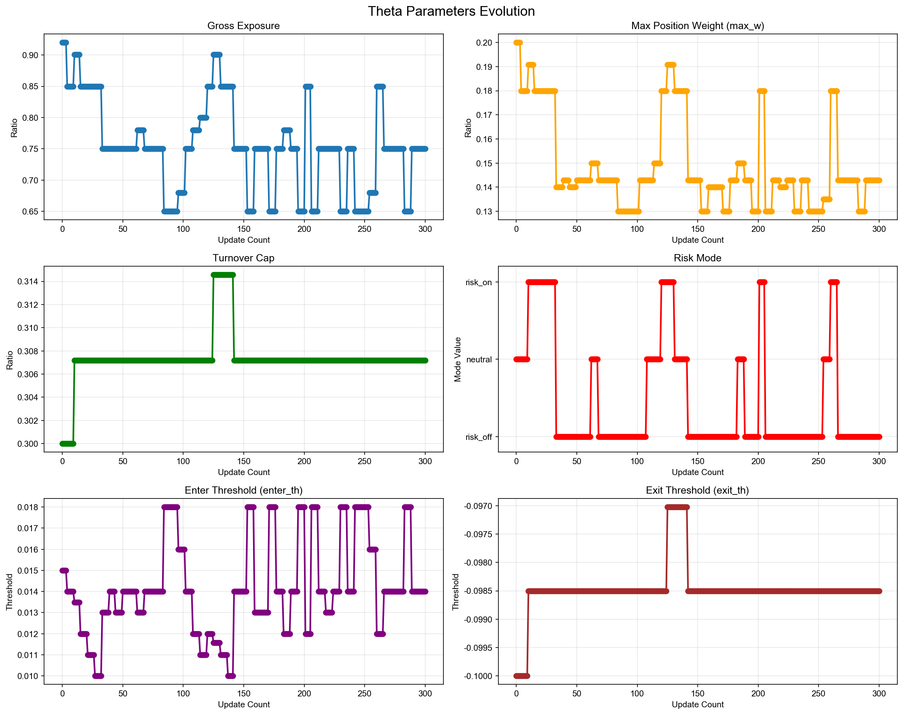
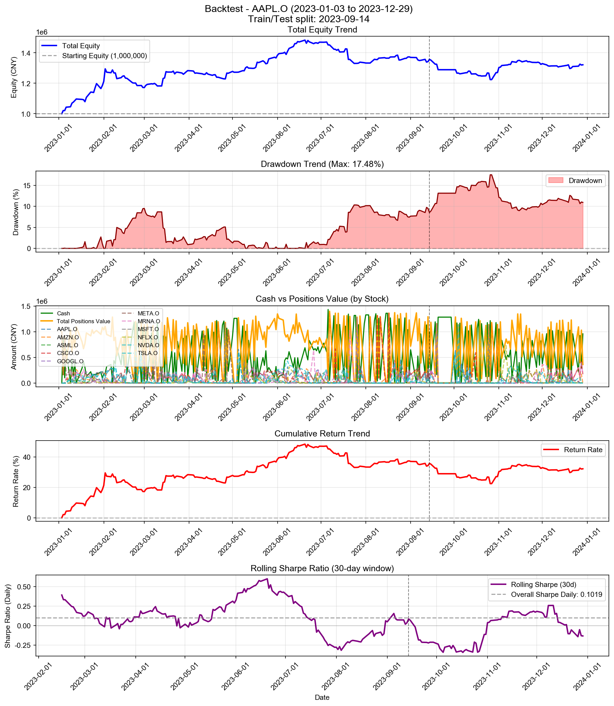

# Backtest

**策略名称:** 层级式多资产交易系统（带 RAG 反思层 - 基准版本）  
**回测期间:** 2023-01-03 至 2023-12-29  
**交易日数:** 250  
**组合股票数:** 20 支  
**初始资金:** 1000000.00 元

---

## 组合整体表现

| 项目 | 数值 |
|------|------|
| 初始资金 | 1000000.00 元 |
| 最终现金 | 960249.30 元 |
| 最终持仓市值 | 361136.89 元 |
| 最终总权益 | 1321386.19 元 |
| 总盈亏 | +321386.19 元 |
| 总收益率 | +32.14% |
| 年化收益率 (CAGR) | +32.43% |

---

## 参数θ追踪

### 初始参数

| 参数 | 数值 |
|------|------|
| 总仓位上限 (gross_exposure) | 0.92 |
| 单票上限 (max_w) | 0.20 |
| 换手上限 (turnover_cap) | 0.30 |
| 风险模式 (risk_mode) | neutral |
| 进场阈值 (enter_th) | 0.015 |
| 出场阈值 (exit_th) | -0.100 |

### 最终参数

| 参数 | 数值 |
|------|------|
| 总仓位上限 (gross_exposure) | 0.75 |
| 单票上限 (max_w) | 0.14 |
| 换手上限 (turnover_cap) | 0.31 |
| 风险模式 (risk_mode) | risk_off |
| 进场阈值 (enter_th) | 0.014 |
| 出场阈值 (exit_th) | -0.099 |

### 参数变化趋势图

---

## 持仓明细

| 股票代码 | 股数 | 成本价 | 现价 | 市值 | 权重 | 盈亏 | 收益率 | 贡献度 |
|----------|------|--------|------|------|------|------|--------|--------|
| AAPL.O | 5 | 572.46 | 556.91 | 2784.54 | 0.21% | -77.77 | -2.72% | -0.01% |
| MSFT.O | 2 | 1749.50 | 1746.87 | 3493.74 | 0.26% | -5.25 | -0.15% | -0.00% |
| NVDA.O | 3 | 260.19 | 259.11 | 777.34 | 0.06% | -3.23 | -0.41% | -0.00% |
| META.O | 1 | 3.55 | 3.54 | 3.54 | 0.00% | -0.01 | -0.18% | -0.00% |
| ASML.O | 56 | 95.83 | 96.07 | 5379.72 | 0.41% | +13.08 | +0.24% | 0.00% |
| MRNA.O | 173245 | 0.99 | 0.99 | 172292.15 | 13.04% | +1029.95 | +0.60% | 0.08% |
| NFLX.O | 60 | 66.24 | 68.16 | 4089.79 | 0.31% | +115.14 | +2.90% | 0.01% |
| CSCO.O | 816 | 210.95 | 211.17 | 172316.06 | 13.04% | +181.50 | +0.11% | 0.01% |

### 权重分布

| 股票代码 | 权重 | 市值占比 |
|----------|------|----------|
| AAPL.O | 0.21% | 0.21% |
| MSFT.O | 0.26% | 0.26% |
| NVDA.O | 0.06% | 0.06% |
| META.O | 0.00% | 0.00% |
| ASML.O | 0.41% | 0.41% |
| MRNA.O | 13.04% | 13.04% |
| NFLX.O | 0.31% | 0.31% |
| CSCO.O | 13.04% | 13.04% |

---

## 交易统计

| 项目 | 数值 |
|------|------|
| 总交易次数 | 1911 次 |
| 买入次数 | 1085 次 |
| 卖出次数 | 826 次 |
| 买入总成本 | 110613120.00 元 |
| 卖出总收入 | 110573369.30 元 |
| 已实现盈亏 | +320132.77 元 |

### 交易质量指标

| 指标 | 数值 |
|------|------|
| 胜率 (Hit Rate) | 57.63% |
| 盈亏比 (Profit Factor) | 1.39 |
| 单笔平均收益 | +387.57 元 |
| 平均持仓周期 | 3.9 天 |

---

## 风险与稳健性

| 指标 | 数值 |
|------|------|
| 最大回撤 (Max Drawdown) | 17.48% |
| 年化波动率 (Volatility) | 18.50% |
| 年化夏普比率 (Sharpe) | 1.6171 |
| 日频夏普比率 (Sharpe Daily) | 0.1019 |
| 年化 Sortino 比率 | 1.7592 |
| 日频 Sortino 比率 | 0.1108 |
| Calmar 比率 (CAGR/MaxDD) | 1.8550 |
### 尾部风险 (Tail Risk)

| 指标 | 数值 |
|------|------|
| VaR 95% | -1.70% |
| VaR 99% | -2.97% |
| CVaR 95% | -2.50% |
| CVaR 99% | -3.72% |
| 极端日跌幅 (5%分位) | -1.76% |
| 极端日跌幅 (1%分位) | -3.36% |

---

## 执行与成本

| 指标 | 数值 |
|------|------|
| 换手率 (Turnover) | 8517.48% |
| 交易频率 (每日) | 7.64 次/日 |
| 交易频率 (每周) | 38.22 次/周 |

---

## 各股票表现分析

| 股票代码 | 初始权重 | 最终权重 | 收益率 | 盈亏 | 交易次数 | 贡献度 |
|----------|----------|----------|--------|------|----------|--------|
| AAPL.O | 759.51% | 0.21% | -2.72% | -77.77 | 150 | -0.01% |
| MSFT.O | 532.64% | 0.26% | -0.15% | -5.25 | 112 | -0.00% |
| NVDA.O | 982.42% | 0.06% | -0.41% | -3.23 | 192 | -0.00% |
| META.O | 1417.53% | 0.00% | -0.18% | -0.01 | 240 | -0.00% |
| ASML.O | 333.98% | 0.41% | +0.24% | +13.08 | 87 | 0.00% |
| MRNA.O | 1005.05% | 13.04% | +0.60% | +1029.95 | 183 | 0.08% |
| NFLX.O | 915.40% | 0.31% | +2.90% | +115.14 | 157 | 0.01% |
| CSCO.O | 1363.01% | 13.04% | +0.11% | +181.50 | 187 | 0.01% |

---

## 策略参数

---

## 交易记录

| 序号 | 日期 | 类型 | 股票代码 | 股数 | 价格 | 成本/收入 | 利润 |
|------|------|------|----------|------|------|-----------|------|
| 1 | 2023-01-03 | 买入 | META.O | 128266 | 1.25 | 159999.01 | - |
| 2 | 2023-01-03 | 买入 | META.O | 673401 | 1.25 | 840000.41 | - |
| 3 | 2023-01-04 | 卖出 | META.O | 673400 | 1.27 | 857709.58 | +17710.42 |
| 4 | 2023-01-05 | 买入 | META.O | 595286 | 1.27 | 755656.05 | - |
| 5 | 2023-01-06 | 买入 | AMZN.O | 331 | 206.59 | 68381.95 | - |
| 6 | 2023-01-06 | 卖出 | META.O | 612890 | 1.30 | 796879.58 | +21267.30 |
| 7 | 2023-01-06 | 买入 | MRNA.O | 51911 | 1.80 | 93621.49 | - |
| 8 | 2023-01-06 | 买入 | CSCO.O | 393 | 197.53 | 77631.06 | - |
| 9 | 2023-01-09 | 买入 | NVDA.O | 502 | 81.73 | 41030.21 | - |
| 10 | 2023-01-09 | 买入 | TSLA.O | 1962 | 17.97 | 35248.31 | - |
| 11 | 2023-01-09 | 卖出 | META.O | 8408 | 1.29 | 10885.84 | +245.51 |
| 12 | 2023-01-09 | 买入 | ASML.O | 909 | 78.08 | 70973.68 | - |
| 13 | 2023-01-09 | 买入 | MRNA.O | 8734 | 1.84 | 16066.19 | - |
| 14 | 2023-01-09 | 卖出 | CSCO.O | 230 | 198.60 | 45677.40 | +244.47 |
| 15 | 2023-01-09 | 买入 | AMZN.O | 397 | 209.66 | 83236.61 | - |
| 16 | 2023-01-09 | 买入 | NVDA.O | 559 | 81.73 | 45689.02 | - |
| 17 | 2023-01-09 | 买入 | TSLA.O | 2184 | 17.97 | 39236.65 | - |
| 18 | 2023-01-09 | 买入 | META.O | 113813 | 1.29 | 147353.69 | - |
| 19 | 2023-01-09 | 买入 | ASML.O | 1012 | 78.08 | 79015.80 | - |
| 20 | 2023-01-09 | 买入 | MRNA.O | 67500 | 1.84 | 124166.25 | - |
| 21 | 2023-01-09 | 买入 | CSCO.O | 170 | 198.60 | 33761.56 | - |
| 22 | 2023-01-10 | 买入 | GOOGL.O | 2 | 35.33 | 70.67 | - |
| 23 | 2023-01-10 | 卖出 | AMZN.O | 134 | 215.69 | 28902.19 | +994.38 |
| 24 | 2023-01-10 | 卖出 | NVDA.O | 518 | 83.20 | 43099.20 | +761.26 |
| 25 | 2023-01-10 | 卖出 | TSLA.O | 3385 | 17.83 | 60346.09 | -467.13 |
| 26 | 2023-01-10 | 卖出 | META.O | 109296 | 1.33 | 145352.75 | +5357.58 |
| 27 | 2023-01-10 | 卖出 | ASML.O | 1100 | 79.59 | 87553.80 | +1667.06 |
| 28 | 2023-01-10 | 卖出 | MRNA.O | 55623 | 1.90 | 105489.02 | +3981.69 |
| 29 | 2023-01-10 | 买入 | NFLX.O | 983 | 45.86 | 45076.05 | - |
| 30 | 2023-01-10 | 卖出 | CSCO.O | 196 | 199.54 | 39109.38 | +286.26 |
| 31 | 2023-01-11 | 买入 | MSFT.O | 31 | 1085.63 | 33654.51 | - |
| 32 | 2023-01-11 | 买入 | GOOGL.O | 2376 | 36.57 | 86896.52 | - |
| 33 | 2023-01-11 | 卖出 | NVDA.O | 317 | 83.68 | 26527.91 | +618.39 |
| 34 | 2023-01-11 | 买入 | TSLA.O | 890 | 18.48 | 16449.87 | - |
| 35 | 2023-01-11 | 卖出 | ASML.O | 374 | 81.01 | 30298.90 | +1097.41 |
| 36 | 2023-01-11 | 卖出 | MRNA.O | 32012 | 1.87 | 59747.20 | +1327.97 |
| 37 | 2023-01-11 | 卖出 | NFLX.O | 571 | 45.82 | 26161.16 | -22.38 |
| 38 | 2023-01-11 | 卖出 | CSCO.O | 80 | 201.17 | 16093.83 | +247.66 |
| 39 | 2023-01-11 | 买入 | MSFT.O | 19 | 1085.63 | 20626.96 | - |
| 40 | 2023-01-11 | 买入 | GOOGL.O | 1478 | 36.57 | 54054.32 | - |
| 41 | 2023-01-11 | 买入 | AMZN.O | 348 | 228.22 | 79419.17 | - |
| 42 | 2023-01-11 | 买入 | NVDA.O | 140 | 83.68 | 11715.79 | - |
| 43 | 2023-01-11 | 买入 | TSLA.O | 1026 | 18.48 | 18963.56 | - |
| 44 | 2023-01-11 | 买入 | META.O | 62638 | 1.33 | 83239.64 | - |
| 45 | 2023-01-11 | 买入 | ASML.O | 277 | 81.01 | 22440.63 | - |
| 46 | 2023-01-11 | 买入 | MRNA.O | 25182 | 1.87 | 46999.68 | - |
| 47 | 2023-01-11 | 买入 | NFLX.O | 255 | 45.82 | 11683.18 | - |
| 48 | 2023-01-12 | 卖出 | GOOGL.O | 1892 | 36.42 | 68900.51 | -293.65 |
| 49 | 2023-01-12 | 卖出 | AMZN.O | 303 | 228.65 | 69280.34 | +3942.38 |
| 50 | 2023-01-12 | 买入 | NVDA.O | 693 | 86.35 | 59841.60 | - |
| 51 | 2023-01-12 | 卖出 | TSLA.O | 1539 | 18.53 | 28523.83 | +304.89 |
| 52 | 2023-01-12 | 卖出 | META.O | 62019 | 1.37 | 84786.17 | +4246.09 |
| 53 | 2023-01-12 | 卖出 | ASML.O | 319 | 82.00 | 26159.07 | +893.79 |
| 54 | 2023-01-12 | 卖出 | MRNA.O | 4792 | 1.88 | 9011.84 | +190.63 |
| 55 | 2023-01-12 | 卖出 | NFLX.O | 601 | 46.22 | 27777.14 | +226.93 |
| 56 | 2023-01-12 | 卖出 | CSCO.O | 47 | 200.31 | 9414.78 | +105.15 |
| 57 | 2023-01-13 | 卖出 | MSFT.O | 13 | 1101.56 | 14320.30 | +207.12 |
| 58 | 2023-01-13 | 买入 | GOOGL.O | 2525 | 36.81 | 92951.25 | - |
| 59 | 2023-01-13 | 买入 | AMZN.O | 218 | 235.49 | 51336.38 | - |
| 60 | 2023-01-13 | 买入 | NVDA.O | 442 | 88.38 | 39064.28 | - |
| 61 | 2023-01-13 | 卖出 | TSLA.O | 1003 | 18.36 | 18415.08 | +24.18 |
| 62 | 2023-01-13 | 卖出 | META.O | 7255 | 1.37 | 9937.90 | +516.30 |
| 63 | 2023-01-13 | 买入 | ASML.O | 265 | 82.90 | 21968.32 | - |
| 64 | 2023-01-13 | 买入 | MRNA.O | 42415 | 1.92 | 81436.80 | - |
| 65 | 2023-01-13 | 买入 | MSFT.O | 11 | 1101.56 | 12117.18 | - |
| 66 | 2023-01-13 | 买入 | GOOGL.O | 1402 | 36.81 | 51610.95 | - |
| 67 | 2023-01-13 | 买入 | AMZN.O | 268 | 235.49 | 63110.78 | - |
| 68 | 2023-01-13 | 买入 | NVDA.O | 345 | 88.38 | 30491.35 | - |
| 69 | 2023-01-13 | 买入 | META.O | 53 | 1.37 | 72.60 | - |
| 70 | 2023-01-17 | 卖出 | MSFT.O | 24 | 1106.72 | 26561.24 | +418.51 |
| 71 | 2023-01-17 | 卖出 | GOOGL.O | 2982 | 36.48 | 108785.44 | -750.06 |
| 72 | 2023-01-17 | 卖出 | AMZN.O | 562 | 230.52 | 129552.24 | +3544.79 |
| 73 | 2023-01-17 | 卖出 | NVDA.O | 122 | 92.58 | 11294.81 | +748.03 |
| 74 | 2023-01-17 | 买入 | TSLA.O | 3716 | 19.72 | 73292.53 | - |
| 75 | 2023-01-17 | 卖出 | META.O | 35119 | 1.35 | 47537.08 | +1928.97 |
| 76 | 2023-01-17 | 卖出 | ASML.O | 238 | 82.71 | 19685.18 | +487.13 |
| 77 | 2023-01-17 | 卖出 | MRNA.O | 11010 | 1.91 | 20994.97 | +369.65 |
| 78 | 2023-01-18 | 卖出 | MSFT.O | 12 | 1085.81 | 13029.76 | -41.60 |
| 79 | 2023-01-18 | 卖出 | GOOGL.O | 1495 | 36.41 | 54437.08 | -477.60 |
| 80 | 2023-01-18 | 卖出 | AMZN.O | 288 | 229.10 | 65981.95 | +1408.74 |
| 81 | 2023-01-18 | 卖出 | NVDA.O | 872 | 90.88 | 79247.92 | +3864.42 |
| 82 | 2023-01-18 | 卖出 | TSLA.O | 1943 | 19.32 | 37532.93 | -695.31 |
| 83 | 2023-01-18 | 卖出 | META.O | 32949 | 1.33 | 43828.76 | +1038.77 |
| 84 | 2023-01-18 | 卖出 | ASML.O | 220 | 81.97 | 18033.27 | +287.18 |
| 85 | 2023-01-18 | 买入 | MRNA.O | 5385 | 1.97 | 10609.53 | - |
| 86 | 2023-01-18 | 买入 | GOOGL.O | 520 | 36.41 | 18934.64 | - |
| 87 | 2023-01-18 | 买入 | AMZN.O | 101 | 229.10 | 23139.50 | - |
| 88 | 2023-01-18 | 买入 | NVDA.O | 313 | 90.88 | 28445.64 | - |
| 89 | 2023-01-18 | 买入 | TSLA.O | 702 | 19.32 | 13560.53 | - |
| 90 | 2023-01-18 | 买入 | META.O | 11834 | 1.33 | 15741.59 | - |
| 91 | 2023-01-18 | 买入 | MRNA.O | 35993 | 1.97 | 70913.41 | - |
| 92 | 2023-01-19 | 买入 | GOOGL.O | 1370 | 37.18 | 50942.10 | - |
| 93 | 2023-01-19 | 卖出 | AMZN.O | 227 | 224.83 | 51036.86 | -157.65 |
| 94 | 2023-01-19 | 卖出 | NVDA.O | 697 | 87.68 | 61112.91 | +28.09 |
| 95 | 2023-01-19 | 卖出 | TSLA.O | 1587 | 19.08 | 30272.82 | -798.43 |
| 96 | 2023-01-19 | 买入 | META.O | 42899 | 1.36 | 58406.99 | - |
| 97 | 2023-01-19 | 卖出 | MRNA.O | 80191 | 1.90 | 152667.63 | +39.25 |
| 98 | 2023-01-19 | 买入 | GOOGL.O | 2292 | 37.18 | 85225.77 | - |
| 99 | 2023-01-19 | 买入 | AMZN.O | 102 | 224.83 | 22932.86 | - |
| 100 | 2023-01-19 | 买入 | NVDA.O | 324 | 87.68 | 28408.29 | - |
| 101 | 2023-01-19 | 买入 | TSLA.O | 709 | 19.08 | 13524.53 | - |
| 102 | 2023-01-19 | 买入 | META.O | 60256 | 1.36 | 82038.54 | - |
| 103 | 2023-01-19 | 买入 | MRNA.O | 37110 | 1.90 | 70650.02 | - |
| 104 | 2023-01-20 | 卖出 | MSFT.O | 10 | 1106.12 | 11061.20 | +168.39 |
| 105 | 2023-01-20 | 卖出 | GOOGL.O | 1070 | 39.17 | 41912.00 | +2323.94 |
| 106 | 2023-01-20 | 买入 | NVDA.O | 128 | 93.30 | 11942.00 | - |
| 107 | 2023-01-20 | 买入 | TSLA.O | 2703 | 20.01 | 54095.14 | - |
| 108 | 2023-01-20 | 卖出 | META.O | 53004 | 1.39 | 73871.67 | +2567.30 |
| 109 | 2023-01-20 | 卖出 | ASML.O | 177 | 81.54 | 14432.07 | +154.53 |
| 110 | 2023-01-20 | 卖出 | MRNA.O | 28962 | 1.94 | 56180.49 | +1051.00 |
| 111 | 2023-01-20 | 买入 | NFLX.O | 2387 | 47.95 | 114456.65 | - |
| 112 | 2023-01-20 | 买入 | GOOGL.O | 1122 | 39.17 | 43948.85 | - |
| 113 | 2023-01-20 | 买入 | AMZN.O | 60 | 233.40 | 14004.00 | - |
| 114 | 2023-01-20 | 买入 | NVDA.O | 228 | 93.30 | 21271.69 | - |
| 115 | 2023-01-20 | 买入 | TSLA.O | 1100 | 20.01 | 22014.30 | - |
| 116 | 2023-01-20 | 买入 | META.O | 23348 | 1.39 | 32540.11 | - |
| 117 | 2023-01-20 | 买入 | MRNA.O | 15293 | 1.94 | 29665.36 | - |
| 118 | 2023-01-20 | 买入 | NFLX.O | 608 | 47.95 | 29153.60 | - |
| 119 | 2023-01-23 | 买入 | AAPL.O | 231 | 405.90 | 93763.70 | - |
| 120 | 2023-01-23 | 卖出 | GOOGL.O | 2465 | 39.88 | 98297.82 | +6033.73 |
| 121 | 2023-01-23 | 卖出 | AMZN.O | 74 | 234.05 | 17319.55 | +535.04 |
| 122 | 2023-01-23 | 买入 | ASML.O | 608 | 84.95 | 51651.23 | - |
| 123 | 2023-01-23 | 卖出 | MRNA.O | 35074 | 1.97 | 69074.74 | +2057.98 |
| 124 | 2023-01-23 | 卖出 | NFLX.O | 1046 | 50.04 | 52340.58 | +2232.46 |
| 125 | 2023-01-24 | 买入 | AAPL.O | 163 | 409.99 | 66828.06 | - |
| 126 | 2023-01-24 | 买入 | MSFT.O | 47 | 1114.50 | 52381.52 | - |
| 127 | 2023-01-24 | 卖出 | GOOGL.O | 2171 | 39.04 | 84760.66 | +3500.89 |
| 128 | 2023-01-24 | 买入 | NVDA.O | 187 | 100.75 | 18841.14 | - |
| 129 | 2023-01-24 | 买入 | TSLA.O | 585 | 21.58 | 12626.35 | - |
| 130 | 2023-01-24 | 卖出 | META.O | 30992 | 1.43 | 44361.95 | +2371.12 |
| 131 | 2023-01-24 | 卖出 | ASML.O | 145 | 84.20 | 12208.45 | -75.84 |
| 132 | 2023-01-24 | 买入 | CSCO.O | 144 | 195.45 | 28144.74 | - |
| 133 | 2023-01-24 | 买入 | AAPL.O | 43 | 409.99 | 17629.49 | - |
| 134 | 2023-01-24 | 买入 | NVDA.O | 146 | 100.75 | 14710.20 | - |
| 135 | 2023-01-24 | 买入 | TSLA.O | 673 | 21.58 | 14525.70 | - |
| 136 | 2023-01-24 | 买入 | META.O | 9510 | 1.43 | 13612.61 | - |
| 137 | 2023-01-24 | 买入 | MRNA.O | 4991 | 1.97 | 9820.29 | - |
| 138 | 2023-01-24 | 买入 | NFLX.O | 240 | 50.94 | 12224.69 | - |
| 139 | 2023-01-25 | 卖出 | AAPL.O | 72 | 408.06 | 29380.38 | +16.70 |
| 140 | 2023-01-25 | 卖出 | MSFT.O | 18 | 1107.92 | 19942.48 | -99.99 |
| 141 | 2023-01-25 | 卖出 | GOOGL.O | 943 | 38.05 | 35882.26 | +586.10 |
| 142 | 2023-01-25 | 买入 | AMZN.O | 164 | 233.23 | 38250.05 | - |
| 143 | 2023-01-25 | 买入 | NVDA.O | 114 | 101.06 | 11520.62 | - |
| 144 | 2023-01-25 | 买入 | TSLA.O | 922 | 21.66 | 19974.67 | - |
| 145 | 2023-01-25 | 卖出 | META.O | 41088 | 1.42 | 58139.52 | +2158.20 |
| 146 | 2023-01-25 | 买入 | ASML.O | 627 | 85.64 | 53698.68 | - |
| 147 | 2023-01-25 | 卖出 | MRNA.O | 20291 | 1.93 | 39175.83 | +282.38 |
| 148 | 2023-01-25 | 卖出 | NFLX.O | 491 | 51.51 | 25293.57 | +1614.02 |
| 149 | 2023-01-25 | 买入 | CSCO.O | 78 | 196.14 | 15299.28 | - |
| 150 | 2023-01-26 | 买入 | MSFT.O | 59 | 1141.94 | 67374.69 | - |
| 151 | 2023-01-26 | 买入 | GOOGL.O | 863 | 38.97 | 33631.36 | - |
| 152 | 2023-01-26 | 卖出 | NVDA.O | 200 | 103.56 | 20712.65 | +2191.11 |
| 153 | 2023-01-26 | 卖出 | TSLA.O | 1898 | 24.04 | 45628.87 | +7056.39 |
| 154 | 2023-01-26 | 买入 | META.O | 51035 | 1.47 | 75174.56 | - |
| 155 | 2023-01-26 | 卖出 | ASML.O | 570 | 85.94 | 48986.74 | +403.05 |
| 156 | 2023-01-26 | 卖出 | MRNA.O | 5358 | 1.93 | 10353.80 | +83.67 |
| 157 | 2023-01-26 | 卖出 | NFLX.O | 910 | 51.08 | 46484.44 | +2597.70 |
| 158 | 2023-01-27 | 买入 | AAPL.O | 103 | 419.77 | 43236.13 | - |
| 159 | 2023-01-27 | 卖出 | MSFT.O | 23 | 1142.68 | 26281.65 | +242.51 |
| 160 | 2023-01-27 | 买入 | GOOGL.O | 613 | 39.71 | 24341.97 | - |
| 161 | 2023-01-27 | 买入 | AMZN.O | 166 | 245.38 | 40732.42 | - |
| 162 | 2023-01-27 | 卖出 | TSLA.O | 1435 | 26.69 | 38292.98 | +9129.91 |
| 163 | 2023-01-27 | 买入 | META.O | 23554 | 1.52 | 35740.84 | - |
| 164 | 2023-01-27 | 卖出 | ASML.O | 555 | 83.87 | 46546.15 | -759.02 |
| 165 | 2023-01-27 | 卖出 | MRNA.O | 21201 | 1.89 | 40144.09 | -493.64 |
| 166 | 2023-01-27 | 卖出 | NFLX.O | 422 | 50.51 | 21314.29 | +962.42 |
| 167 | 2023-01-27 | 买入 | CSCO.O | 110 | 198.31 | 21814.24 | - |
| 168 | 2023-01-30 | 买入 | AAPL.O | 28 | 411.34 | 11517.52 | - |
| 169 | 2023-01-30 | 卖出 | MSFT.O | 47 | 1117.59 | 52526.51 | -683.90 |
| 170 | 2023-01-30 | 卖出 | GOOGL.O | 1097 | 38.74 | 42496.15 | -500.55 |
| 171 | 2023-01-30 | 买入 | AMZN.O | 212 | 241.32 | 51159.84 | - |
| 172 | 2023-01-30 | 卖出 | NVDA.O | 993 | 100.22 | 99514.57 | +7555.12 |
| 173 | 2023-01-30 | 买入 | TSLA.O | 2891 | 25.00 | 72272.11 | - |
| 174 | 2023-01-30 | 卖出 | META.O | 9241 | 1.47 | 13589.81 | +336.14 |
| 175 | 2023-01-30 | 卖出 | NFLX.O | 307 | 49.44 | 15176.67 | +370.92 |
| 176 | 2023-01-30 | 买入 | AAPL.O | 30 | 411.34 | 12340.20 | - |
| 177 | 2023-01-30 | 买入 | AMZN.O | 48 | 241.32 | 11583.36 | - |
| 178 | 2023-01-30 | 买入 | TSLA.O | 450 | 25.00 | 11249.55 | - |
| 179 | 2023-01-30 | 买入 | META.O | 7453 | 1.47 | 10960.38 | - |
| 180 | 2023-01-31 | 卖出 | AAPL.O | 32 | 415.05 | 13281.62 | +143.90 |
| 181 | 2023-01-31 | 卖出 | MSFT.O | 20 | 1141.07 | 22821.38 | +178.65 |
| 182 | 2023-01-31 | 买入 | GOOGL.O | 1855 | 39.50 | 73268.38 | - |
| 183 | 2023-01-31 | 买入 | NVDA.O | 150 | 102.18 | 15326.60 | - |
| 184 | 2023-01-31 | 卖出 | META.O | 7042 | 1.49 | 10490.47 | +375.70 |
| 185 | 2023-01-31 | 买入 | AAPL.O | 47 | 415.05 | 19507.39 | - |
| 186 | 2023-01-31 | 买入 | AMZN.O | 79 | 247.51 | 19553.45 | - |
| 187 | 2023-01-31 | 买入 | TSLA.O | 753 | 25.98 | 19565.20 | - |
| 188 | 2023-01-31 | 买入 | META.O | 11543 | 1.49 | 17195.61 | - |
| 189 | 2023-02-01 | 卖出 | AAPL.O | 62 | 418.33 | 25936.46 | +457.89 |
| 190 | 2023-02-01 | 买入 | MSFT.O | 39 | 1163.82 | 45388.81 | - |
| 191 | 2023-02-01 | 卖出 | GOOGL.O | 1888 | 40.13 | 75771.41 | +1310.88 |
| 192 | 2023-02-01 | 卖出 | AMZN.O | 189 | 252.36 | 47696.04 | +2837.76 |
| 193 | 2023-02-01 | 买入 | NVDA.O | 1017 | 109.53 | 111392.63 | - |
| 194 | 2023-02-01 | 卖出 | TSLA.O | 1398 | 27.21 | 38041.68 | +6350.67 |
| 195 | 2023-02-01 | 卖出 | META.O | 8882 | 1.53 | 13600.12 | +801.09 |
| 196 | 2023-02-01 | 买入 | ASML.O | 251 | 85.27 | 21401.98 | - |
| 197 | 2023-02-01 | 卖出 | CSCO.O | 281 | 198.56 | 55794.38 | +548.28 |
| 198 | 2023-02-02 | 买入 | MSFT.O | 49 | 1218.38 | 59700.64 | - |
| 199 | 2023-02-02 | 买入 | GOOGL.O | 1932 | 43.05 | 83180.98 | - |
| 200 | 2023-02-02 | 卖出 | NVDA.O | 417 | 113.54 | 47344.82 | +3771.77 |
| 201 | 2023-02-02 | 卖出 | TSLA.O | 2214 | 28.24 | 62524.47 | +12335.70 |
| 202 | 2023-02-02 | 卖出 | META.O | 51735 | 1.89 | 97660.16 | +23109.66 |
| 203 | 2023-02-02 | 买入 | CSCO.O | 247 | 201.62 | 49800.77 | - |
| 204 | 2023-02-03 | 卖出 | MSFT.O | 43 | 1189.60 | 51152.87 | -197.66 |
| 205 | 2023-02-03 | 卖出 | GOOGL.O | 922 | 41.87 | 38605.51 | -501.16 |
| 206 | 2023-02-03 | 卖出 | AMZN.O | 317 | 248.14 | 78659.11 | +3420.63 |
| 207 | 2023-02-03 | 卖出 | NVDA.O | 482 | 110.35 | 53189.52 | +2824.51 |
| 208 | 2023-02-03 | 买入 | TSLA.O | 1512 | 28.50 | 43087.46 | - |
| 209 | 2023-02-03 | 买入 | META.O | 25255 | 1.87 | 47108.15 | - |
| 210 | 2023-02-03 | 卖出 | ASML.O | 146 | 85.40 | 12468.96 | +20.00 |
| 211 | 2023-02-03 | 卖出 | CSCO.O | 152 | 198.80 | 30217.87 | -277.72 |
| 212 | 2023-02-03 | 买入 | AAPL.O | 34 | 444.42 | 15110.28 | - |
| 213 | 2023-02-03 | 买入 | TSLA.O | 445 | 28.50 | 12681.16 | - |
| 214 | 2023-02-03 | 买入 | META.O | 6766 | 1.87 | 12620.62 | - |
| 215 | 2023-02-06 | 卖出 | MSFT.O | 40 | 1182.33 | 47293.05 | -474.88 |
| 216 | 2023-02-06 | 卖出 | GOOGL.O | 1281 | 41.12 | 52674.99 | -1658.68 |
| 217 | 2023-02-06 | 卖出 | AMZN.O | 359 | 245.23 | 88038.29 | +2831.30 |
| 218 | 2023-02-06 | 卖出 | NVDA.O | 603 | 110.29 | 66507.39 | +3498.88 |
| 219 | 2023-02-06 | 买入 | TSLA.O | 839 | 29.21 | 24510.55 | - |
| 220 | 2023-02-06 | 买入 | META.O | 16623 | 1.86 | 30928.75 | - |
| 221 | 2023-02-06 | 卖出 | CSCO.O | 140 | 194.47 | 27225.59 | -862.46 |
| 222 | 2023-02-06 | 买入 | AAPL.O | 145 | 436.45 | 63285.53 | - |
| 223 | 2023-02-06 | 买入 | TSLA.O | 2137 | 29.21 | 62430.32 | - |
| 224 | 2023-02-06 | 买入 | META.O | 33538 | 1.86 | 62400.80 | - |
| 225 | 2023-02-07 | 卖出 | AAPL.O | 137 | 444.85 | 60944.63 | +3638.18 |
| 226 | 2023-02-07 | 买入 | MSFT.O | 91 | 1232.01 | 112112.91 | - |
| 227 | 2023-02-07 | 买入 | GOOGL.O | 2608 | 43.01 | 112181.49 | - |
| 228 | 2023-02-07 | 买入 | NVDA.O | 1219 | 115.96 | 141359.42 | - |
| 229 | 2023-02-07 | 卖出 | TSLA.O | 1946 | 29.52 | 57448.84 | +7200.72 |
| 230 | 2023-02-07 | 卖出 | META.O | 38751 | 1.92 | 74254.67 | +9685.27 |
| 231 | 2023-02-07 | 买入 | AAPL.O | 113 | 444.85 | 50268.20 | - |
| 232 | 2023-02-07 | 买入 | MSFT.O | 21 | 1232.01 | 25872.21 | - |
| 233 | 2023-02-07 | 买入 | GOOGL.O | 600 | 43.01 | 25808.63 | - |
| 234 | 2023-02-07 | 买入 | NVDA.O | 280 | 115.96 | 32469.76 | - |
| 235 | 2023-02-07 | 买入 | TSLA.O | 1713 | 29.52 | 50570.33 | - |
| 236 | 2023-02-07 | 买入 | META.O | 2266 | 1.92 | 4342.11 | - |
| 237 | 2023-02-08 | 卖出 | AAPL.O | 482 | 437.00 | 210633.27 | +6733.54 |
| 238 | 2023-02-08 | 卖出 | MSFT.O | 13 | 1228.19 | 15966.45 | -28.68 |
| 239 | 2023-02-08 | 卖出 | GOOGL.O | 2499 | 39.71 | 99234.23 | -8194.36 |
| 240 | 2023-02-08 | 买入 | NVDA.O | 195 | 116.13 | 22645.50 | - |
| 241 | 2023-02-08 | 卖出 | TSLA.O | 2006 | 30.19 | 60568.16 | +7441.29 |
| 242 | 2023-02-08 | 卖出 | META.O | 40681 | 1.83 | 74621.16 | +6639.40 |
| 243 | 2023-02-09 | 卖出 | AAPL.O | 152 | 433.98 | 65964.68 | +1664.35 |
| 244 | 2023-02-09 | 卖出 | MSFT.O | 69 | 1213.87 | 83756.88 | -1140.31 |
| 245 | 2023-02-09 | 卖出 | GOOGL.O | 853 | 37.97 | 32386.07 | -4283.23 |
| 246 | 2023-02-09 | 买入 | NVDA.O | 192 | 116.82 | 22429.66 | - |
| 247 | 2023-02-09 | 卖出 | META.O | 49395 | 1.78 | 87883.58 | +5339.91 |
| 248 | 2023-02-09 | 买入 | MSFT.O | 19 | 1213.87 | 23063.49 | - |
| 249 | 2023-02-09 | 买入 | NVDA.O | 1114 | 116.82 | 130138.75 | - |
| 250 | 2023-02-09 | 买入 | TSLA.O | 4185 | 31.10 | 130145.13 | - |
| 251 | 2023-02-09 | 买入 | META.O | 15507 | 1.78 | 27590.05 | - |
| 252 | 2023-02-10 | 卖出 | NVDA.O | 2676 | 111.21 | 297610.39 | -13042.97 |
| 253 | 2023-02-10 | 卖出 | TSLA.O | 8827 | 29.53 | 260692.20 | +12403.35 |
| 254 | 2023-02-10 | 卖出 | META.O | 37412 | 1.74 | 65153.00 | +1165.14 |
| 255 | 2023-02-10 | 买入 | CSCO.O | 254 | 193.20 | 49073.10 | - |
| 256 | 2023-02-10 | 买入 | MSFT.O | 49 | 1211.47 | 59362.20 | - |
| 257 | 2023-02-10 | 买入 | NVDA.O | 391 | 111.21 | 43484.93 | - |
| 258 | 2023-02-10 | 买入 | TSLA.O | 2923 | 29.53 | 86326.42 | - |
| 259 | 2023-02-10 | 买入 | META.O | 5298 | 1.74 | 9226.47 | - |
| 260 | 2023-02-10 | 买入 | CSCO.O | 271 | 193.20 | 52357.52 | - |
| 261 | 2023-02-13 | 买入 | AAPL.O | 121 | 443.23 | 53630.32 | - |
| 262 | 2023-02-13 | 卖出 | MSFT.O | 50 | 1249.32 | 62466.17 | +1548.94 |
| 263 | 2023-02-13 | 卖出 | NVDA.O | 709 | 113.95 | 80790.48 | +211.45 |
| 264 | 2023-02-13 | 卖出 | TSLA.O | 4535 | 29.20 | 132403.86 | +1651.82 |
| 265 | 2023-02-13 | 买入 | META.O | 17183 | 1.79 | 30831.46 | - |
| 266 | 2023-02-13 | 卖出 | CSCO.O | 215 | 195.65 | 42065.61 | +480.13 |
| 267 | 2023-02-13 | 买入 | AAPL.O | 249 | 443.23 | 110363.23 | - |
| 268 | 2023-02-13 | 买入 | MSFT.O | 107 | 1249.32 | 133677.60 | - |
| 269 | 2023-02-13 | 买入 | NVDA.O | 149 | 113.95 | 16978.54 | - |
| 270 | 2023-02-13 | 买入 | TSLA.O | 2688 | 29.20 | 78478.85 | - |
| 271 | 2023-02-13 | 买入 | META.O | 57272 | 1.79 | 102763.15 | - |
| 272 | 2023-02-13 | 买入 | CSCO.O | 671 | 195.65 | 131283.83 | - |
| 273 | 2023-02-14 | 卖出 | AAPL.O | 339 | 441.35 | 149618.75 | -634.81 |
| 274 | 2023-02-14 | 卖出 | MSFT.O | 121 | 1253.24 | 151641.71 | +1715.26 |
| 275 | 2023-02-14 | 买入 | NVDA.O | 153 | 120.14 | 18380.95 | - |
| 276 | 2023-02-14 | 卖出 | TSLA.O | 2318 | 31.39 | 72756.22 | +5355.69 |
| 277 | 2023-02-14 | 卖出 | META.O | 60683 | 1.79 | 108913.85 | +546.54 |
| 278 | 2023-02-14 | 买入 | MRNA.O | 24477 | 1.76 | 42986.51 | - |
| 279 | 2023-02-14 | 卖出 | CSCO.O | 694 | 195.00 | 135329.94 | +52.82 |
| 280 | 2023-02-14 | 买入 | AAPL.O | 23 | 441.35 | 10151.12 | - |
| 281 | 2023-02-14 | 买入 | MSFT.O | 29 | 1253.24 | 36343.88 | - |
| 282 | 2023-02-14 | 买入 | NVDA.O | 287 | 120.14 | 34479.30 | - |
| 283 | 2023-02-14 | 买入 | TSLA.O | 1283 | 31.39 | 40270.16 | - |
| 284 | 2023-02-14 | 买入 | META.O | 18682 | 1.79 | 33530.45 | - |
| 285 | 2023-02-14 | 买入 | MRNA.O | 18776 | 1.76 | 32974.41 | - |
| 286 | 2023-02-14 | 买入 | CSCO.O | 231 | 195.00 | 45044.98 | - |
| 287 | 2023-02-15 | 买入 | AAPL.O | 60 | 447.49 | 26849.37 | - |
| 288 | 2023-02-15 | 卖出 | MSFT.O | 52 | 1243.22 | 64647.45 | -98.12 |
| 289 | 2023-02-15 | 卖出 | NVDA.O | 340 | 119.05 | 40478.47 | +348.53 |
| 290 | 2023-02-15 | 卖出 | TSLA.O | 1111 | 32.14 | 35703.10 | +2284.77 |
| 291 | 2023-02-15 | 卖出 | META.O | 23778 | 1.77 | 42125.10 | -430.46 |
| 292 | 2023-02-15 | 卖出 | MRNA.O | 27188 | 1.77 | 48198.89 | +451.32 |
| 293 | 2023-02-15 | 买入 | NFLX.O | 578 | 50.60 | 29246.11 | - |
| 294 | 2023-02-15 | 卖出 | CSCO.O | 227 | 198.07 | 44960.97 | +705.79 |
| 295 | 2023-02-15 | 买入 | AAPL.O | 189 | 447.49 | 84575.53 | - |
| 296 | 2023-02-15 | 买入 | MSFT.O | 26 | 1243.22 | 32323.73 | - |
| 297 | 2023-02-15 | 买入 | AMZN.O | 59 | 242.78 | 14324.26 | - |
| 298 | 2023-02-15 | 买入 | NVDA.O | 533 | 119.05 | 63455.95 | - |
| 299 | 2023-02-15 | 买入 | TSLA.O | 3060 | 32.14 | 98336.16 | - |
| 300 | 2023-02-15 | 买入 | META.O | 31949 | 1.77 | 56600.85 | - |
| 301 | 2023-02-15 | 买入 | MRNA.O | 26651 | 1.77 | 47246.89 | - |
| 302 | 2023-02-15 | 买入 | NFLX.O | 1167 | 50.60 | 59048.80 | - |
| 303 | 2023-02-15 | 买入 | CSCO.O | 507 | 198.07 | 100419.44 | - |
| 304 | 2023-02-16 | 卖出 | AAPL.O | 302 | 442.82 | 133732.39 | -1137.04 |
| 305 | 2023-02-16 | 卖出 | MSFT.O | 41 | 1210.12 | 49615.02 | -1386.48 |
| 306 | 2023-02-16 | 卖出 | AMZN.O | 99 | 235.56 | 23320.44 | -494.42 |
| 307 | 2023-02-16 | 卖出 | NVDA.O | 852 | 115.07 | 98038.88 | -3066.48 |
| 308 | 2023-02-16 | 卖出 | TSLA.O | 4891 | 30.31 | 148226.65 | -5165.85 |
| 309 | 2023-02-16 | 卖出 | META.O | 51058 | 1.72 | 88044.42 | -2757.56 |
| 310 | 2023-02-16 | 卖出 | MRNA.O | 42590 | 1.72 | 73386.83 | -1850.83 |
| 311 | 2023-02-16 | 卖出 | NFLX.O | 1864 | 49.10 | 91521.28 | -2499.38 |
| 312 | 2023-02-16 | 卖出 | CSCO.O | 403 | 208.45 | 84005.18 | +4657.18 |
| 313 | 2023-02-16 | 买入 | CSCO.O | 1043 | 208.45 | 217412.92 | - |
| 314 | 2023-02-17 | 买入 | TSLA.O | 2783 | 31.25 | 86959.01 | - |
| 315 | 2023-02-17 | 买入 | META.O | 32517 | 1.73 | 56215.39 | - |
| 316 | 2023-02-17 | 卖出 | CSCO.O | 1031 | 207.55 | 213984.28 | +2440.61 |
| 317 | 2023-02-17 | 买入 | TSLA.O | 9607 | 31.25 | 300185.13 | - |
| 318 | 2023-02-17 | 买入 | META.O | 112148 | 1.73 | 193881.46 | - |
| 319 | 2023-02-17 | 买入 | CSCO.O | 1451 | 207.55 | 301155.37 | - |
| 320 | 2023-02-21 | 卖出 | TSLA.O | 12405 | 29.61 | 367256.23 | -20358.34 |
| 321 | 2023-02-21 | 卖出 | META.O | 94880 | 1.72 | 163269.50 | -763.92 |
| 322 | 2023-02-21 | 卖出 | CSCO.O | 1874 | 203.14 | 380675.23 | -7272.55 |
| 323 | 2023-02-21 | 买入 | META.O | 42985 | 1.72 | 73968.59 | - |
| 324 | 2023-02-22 | 卖出 | META.O | 92920 | 1.71 | 159004.70 | -1294.08 |
| 325 | 2023-02-23 | 买入 | NVDA.O | 690 | 123.76 | 85395.28 | - |
| 326 | 2023-02-23 | 买入 | META.O | 31248 | 1.72 | 53759.06 | - |
| 327 | 2023-02-23 | 买入 | NVDA.O | 5318 | 123.76 | 658162.43 | - |
| 328 | 2023-02-23 | 买入 | META.O | 228504 | 1.72 | 393118.28 | - |
| 329 | 2023-02-24 | 卖出 | NVDA.O | 6011 | 121.78 | 732045.74 | -11867.97 |
| 330 | 2023-02-24 | 卖出 | META.O | 259752 | 1.70 | 442591.43 | -4285.91 |
| 331 | 2023-02-27 | 买入 | NVDA.O | 675 | 122.91 | 82963.43 | - |
| 332 | 2023-02-27 | 买入 | TSLA.O | 2663 | 31.14 | 82937.80 | - |
| 333 | 2023-02-27 | 买入 | NVDA.O | 4296 | 122.91 | 528016.15 | - |
| 334 | 2023-02-27 | 买入 | TSLA.O | 15435 | 31.14 | 480715.36 | - |
| 335 | 2023-02-28 | 卖出 | NVDA.O | 4971 | 121.42 | 603570.15 | -7409.44 |
| 336 | 2023-02-28 | 卖出 | TSLA.O | 18098 | 30.86 | 558440.94 | -5212.22 |
| 337 | 2023-02-28 | 买入 | META.O | 46913 | 1.75 | 82069.60 | - |
| 338 | 2023-03-01 | 买入 | GOOGL.O | 2271 | 36.11 | 82003.67 | - |
| 339 | 2023-03-01 | 买入 | GOOGL.O | 13331 | 36.11 | 481369.86 | - |
| 340 | 2023-03-01 | 买入 | META.O | 277586 | 1.73 | 481389.64 | - |
| 341 | 2023-03-02 | 卖出 | GOOGL.O | 13344 | 36.76 | 490584.48 | +8745.20 |
| 342 | 2023-03-02 | 卖出 | META.O | 276946 | 1.75 | 483353.85 | +2465.52 |
| 343 | 2023-03-03 | 买入 | AAPL.O | 109 | 435.10 | 47426.09 | - |
| 344 | 2023-03-03 | 卖出 | GOOGL.O | 400 | 37.42 | 14969.51 | +525.89 |
| 345 | 2023-03-03 | 买入 | AMZN.O | 237 | 227.76 | 53979.12 | - |
| 346 | 2023-03-03 | 买入 | NVDA.O | 82 | 124.94 | 10245.35 | - |
| 347 | 2023-03-03 | 卖出 | META.O | 10033 | 1.85 | 18586.13 | +1164.86 |
| 348 | 2023-03-03 | 买入 | AAPL.O | 369 | 435.10 | 160552.53 | - |
| 349 | 2023-03-03 | 买入 | MSFT.O | 29 | 1178.46 | 34175.22 | - |
| 350 | 2023-03-03 | 买入 | GOOGL.O | 6198 | 37.42 | 231952.63 | - |
| 351 | 2023-03-03 | 买入 | AMZN.O | 797 | 227.76 | 181524.72 | - |
| 352 | 2023-03-03 | 买入 | NVDA.O | 275 | 124.94 | 34359.39 | - |
| 353 | 2023-03-03 | 买入 | TSLA.O | 495 | 29.67 | 14685.91 | - |
| 354 | 2023-03-03 | 买入 | META.O | 125223 | 1.85 | 231975.61 | - |
| 355 | 2023-03-06 | 卖出 | AAPL.O | 479 | 443.17 | 212277.57 | +3852.37 |
| 356 | 2023-03-06 | 卖出 | MSFT.O | 30 | 1185.75 | 35572.48 | +153.32 |
| 357 | 2023-03-06 | 卖出 | GOOGL.O | 5806 | 38.02 | 220716.33 | +5194.34 |
| 358 | 2023-03-06 | 卖出 | AMZN.O | 860 | 225.00 | 193500.00 | -2384.23 |
| 359 | 2023-03-06 | 卖出 | NVDA.O | 357 | 123.19 | 43977.39 | -627.34 |
| 360 | 2023-03-06 | 卖出 | TSLA.O | 495 | 29.07 | 14390.39 | -295.51 |
| 361 | 2023-03-06 | 卖出 | META.O | 116486 | 1.85 | 215382.61 | +2710.30 |
| 362 | 2023-03-07 | 买入 | AMZN.O | 205 | 224.52 | 46026.60 | - |
| 363 | 2023-03-07 | 买入 | GOOGL.O | 7626 | 37.51 | 286033.76 | - |
| 364 | 2023-03-07 | 买入 | AMZN.O | 1273 | 224.52 | 285813.96 | - |
| 365 | 2023-03-07 | 买入 | META.O | 155023 | 1.85 | 286032.94 | - |
| 366 | 2023-03-08 | 卖出 | GOOGL.O | 7600 | 37.66 | 286243.01 | +1854.78 |
| 367 | 2023-03-08 | 卖出 | AMZN.O | 1272 | 225.41 | 286718.98 | +691.56 |
| 368 | 2023-03-08 | 买入 | NVDA.O | 436 | 126.49 | 55148.17 | - |
| 369 | 2023-03-08 | 卖出 | META.O | 154943 | 1.85 | 286598.07 | +1402.37 |
| 370 | 2023-03-09 | 卖出 | GOOGL.O | 2276 | 36.89 | 83966.88 | -1199.92 |
| 371 | 2023-03-09 | 卖出 | AMZN.O | 381 | 221.40 | 84353.40 | -1319.91 |
| 372 | 2023-03-09 | 卖出 | NVDA.O | 436 | 122.59 | 53449.09 | -1699.08 |
| 373 | 2023-03-09 | 买入 | META.O | 417674 | 1.82 | 758871.89 | - |
| 374 | 2023-03-10 | 卖出 | META.O | 464011 | 1.80 | 832946.15 | -11215.90 |
| 375 | 2023-03-13 | 买入 | MSFT.O | 25 | 1172.13 | 29303.29 | - |
| 376 | 2023-03-13 | 买入 | GOOGL.O | 1194 | 36.41 | 43472.07 | - |
| 377 | 2023-03-13 | 买入 | AMZN.O | 196 | 221.83 | 43479.07 | - |
| 378 | 2023-03-13 | 买入 | META.O | 35379 | 1.81 | 64000.61 | - |
| 379 | 2023-03-13 | 买入 | MRNA.O | 29282 | 1.48 | 43308.08 | - |
| 380 | 2023-03-13 | 买入 | MSFT.O | 118 | 1172.13 | 138311.53 | - |
| 381 | 2023-03-13 | 买入 | GOOGL.O | 5633 | 36.41 | 205090.59 | - |
| 382 | 2023-03-13 | 买入 | AMZN.O | 924 | 221.83 | 204972.77 | - |
| 383 | 2023-03-13 | 买入 | META.O | 166841 | 1.81 | 301815.37 | - |
| 384 | 2023-03-13 | 买入 | MRNA.O | 67757 | 1.48 | 100212.60 | - |
| 385 | 2023-03-14 | 卖出 | MSFT.O | 101 | 1203.84 | 121588.30 | +3203.00 |
| 386 | 2023-03-14 | 卖出 | GOOGL.O | 5363 | 37.55 | 201389.57 | +6129.34 |
| 387 | 2023-03-14 | 卖出 | AMZN.O | 878 | 227.71 | 199931.14 | +5162.64 |
| 388 | 2023-03-14 | 买入 | NVDA.O | 175 | 125.87 | 22027.14 | - |
| 389 | 2023-03-14 | 买入 | TSLA.O | 399 | 27.49 | 10968.11 | - |
| 390 | 2023-03-14 | 卖出 | META.O | 171401 | 1.94 | 332552.22 | +22487.81 |
| 391 | 2023-03-14 | 卖出 | MRNA.O | 75921 | 1.51 | 114853.29 | +2537.82 |
| 392 | 2023-03-14 | 买入 | CSCO.O | 101 | 200.52 | 20252.40 | - |
| 393 | 2023-03-15 | 买入 | NFLX.O | 437 | 42.53 | 18585.87 | - |
| 394 | 2023-03-15 | 买入 | MSFT.O | 116 | 1225.31 | 142135.92 | - |
| 395 | 2023-03-15 | 买入 | GOOGL.O | 3759 | 38.41 | 144371.29 | - |
| 396 | 2023-03-15 | 买入 | AMZN.O | 625 | 230.88 | 144300.00 | - |
| 397 | 2023-03-15 | 买入 | NVDA.O | 490 | 126.73 | 62098.91 | - |
| 398 | 2023-03-15 | 买入 | META.O | 74195 | 1.98 | 146720.61 | - |
| 399 | 2023-03-15 | 买入 | MRNA.O | 47867 | 1.50 | 71609.03 | - |
| 400 | 2023-03-15 | 买入 | NFLX.O | 1045 | 42.53 | 44444.48 | - |
| 401 | 2023-03-15 | 买入 | CSCO.O | 161 | 200.56 | 32290.10 | - |
| 402 | 2023-03-16 | 卖出 | MSFT.O | 120 | 1274.98 | 152997.52 | +7656.68 |
| 403 | 2023-03-16 | 卖出 | GOOGL.O | 3783 | 40.09 | 151657.47 | +8483.10 |
| 404 | 2023-03-16 | 卖出 | AMZN.O | 626 | 240.10 | 150300.10 | +7350.18 |
| 405 | 2023-03-16 | 卖出 | NVDA.O | 321 | 133.60 | 42885.78 | +2277.56 |
| 406 | 2023-03-16 | 卖出 | META.O | 76769 | 2.05 | 157322.71 | +9308.28 |
| 407 | 2023-03-16 | 卖出 | MRNA.O | 50661 | 1.52 | 76893.27 | +1363.34 |
| 408 | 2023-03-16 | 卖出 | NFLX.O | 1004 | 43.41 | 43582.03 | +849.29 |
| 409 | 2023-03-16 | 卖出 | CSCO.O | 62 | 204.89 | 12703.37 | +269.64 |
| 410 | 2023-03-17 | 买入 | MSFT.O | 34 | 1289.89 | 43856.24 | - |
| 411 | 2023-03-17 | 买入 | GOOGL.O | 955 | 40.61 | 38781.31 | - |
| 412 | 2023-03-17 | 买入 | AMZN.O | 133 | 237.48 | 31584.84 | - |
| 413 | 2023-03-17 | 买入 | NVDA.O | 315 | 134.56 | 42387.35 | - |
| 414 | 2023-03-17 | 买入 | MRNA.O | 20156 | 1.50 | 30238.03 | - |
| 415 | 2023-03-17 | 卖出 | NFLX.O | 312 | 42.49 | 13256.88 | -22.62 |
| 416 | 2023-03-17 | 买入 | CSCO.O | 191 | 205.18 | 39189.22 | - |
| 417 | 2023-03-17 | 买入 | MSFT.O | 97 | 1289.89 | 125119.28 | - |
| 418 | 2023-03-17 | 买入 | GOOGL.O | 3198 | 40.61 | 129866.64 | - |
| 419 | 2023-03-17 | 买入 | AMZN.O | 500 | 237.48 | 118740.00 | - |
| 420 | 2023-03-17 | 买入 | NVDA.O | 879 | 134.56 | 118280.90 | - |
| 421 | 2023-03-17 | 买入 | META.O | 40223 | 1.96 | 78680.21 | - |
| 422 | 2023-03-17 | 买入 | MRNA.O | 51545 | 1.50 | 77327.81 | - |
| 423 | 2023-03-17 | 买入 | NFLX.O | 228 | 42.49 | 9687.72 | - |
| 424 | 2023-03-17 | 买入 | CSCO.O | 138 | 205.18 | 28314.72 | - |
| 425 | 2023-03-20 | 卖出 | MSFT.O | 145 | 1256.65 | 182214.72 | -2252.84 |
| 426 | 2023-03-20 | 卖出 | GOOGL.O | 2722 | 40.45 | 110101.79 | +1500.51 |
| 427 | 2023-03-20 | 卖出 | AMZN.O | 532 | 234.50 | 124756.13 | -244.56 |
| 428 | 2023-03-20 | 卖出 | NVDA.O | 798 | 135.48 | 108111.78 | +2168.67 |
| 429 | 2023-03-20 | 卖出 | TSLA.O | 391 | 27.49 | 10747.61 | -0.59 |
| 430 | 2023-03-20 | 卖出 | META.O | 47899 | 1.98 | 94749.01 | +1608.05 |
| 431 | 2023-03-20 | 买入 | ASML.O | 500 | 81.40 | 40699.49 | - |
| 432 | 2023-03-20 | 卖出 | MRNA.O | 23042 | 1.55 | 35604.50 | +1080.80 |
| 433 | 2023-03-20 | 卖出 | NFLX.O | 346 | 42.72 | 14780.50 | +68.17 |
| 434 | 2023-03-21 | 买入 | AAPL.O | 121 | 458.87 | 55523.16 | - |
| 435 | 2023-03-21 | 买入 | AMZN.O | 170 | 241.46 | 41048.88 | - |
| 436 | 2023-03-21 | 买入 | NVDA.O | 76 | 137.04 | 10415.23 | - |
| 437 | 2023-03-21 | 买入 | TSLA.O | 2616 | 29.64 | 77530.39 | - |
| 438 | 2023-03-21 | 卖出 | ASML.O | 510 | 80.87 | 41243.71 | -612.12 |
| 439 | 2023-03-21 | 卖出 | MRNA.O | 23469 | 1.52 | 35696.35 | +532.88 |
| 440 | 2023-03-21 | 卖出 | CSCO.O | 76 | 207.14 | 15742.75 | +282.32 |
| 441 | 2023-03-21 | 买入 | AAPL.O | 83 | 458.87 | 38086.13 | - |
| 442 | 2023-03-21 | 买入 | MSFT.O | 15 | 1263.81 | 18957.12 | - |
| 443 | 2023-03-21 | 买入 | GOOGL.O | 2114 | 41.93 | 88634.58 | - |
| 444 | 2023-03-21 | 买入 | AMZN.O | 351 | 241.46 | 84753.86 | - |
| 445 | 2023-03-21 | 买入 | NVDA.O | 559 | 137.04 | 76606.72 | - |
| 446 | 2023-03-21 | 买入 | TSLA.O | 1800 | 29.64 | 53346.60 | - |
| 447 | 2023-03-21 | 买入 | META.O | 17470 | 2.02 | 35317.35 | - |
| 448 | 2023-03-21 | 买入 | MRNA.O | 29928 | 1.52 | 45520.49 | - |
| 449 | 2023-03-21 | 买入 | CSCO.O | 310 | 207.14 | 64213.84 | - |
| 450 | 2023-03-22 | 卖出 | AAPL.O | 164 | 454.69 | 74569.45 | -685.08 |
| 451 | 2023-03-22 | 卖出 | MSFT.O | 31 | 1256.93 | 38964.84 | -373.12 |
| 452 | 2023-03-22 | 卖出 | GOOGL.O | 1810 | 41.31 | 74767.53 | +994.83 |
| 453 | 2023-03-22 | 卖出 | AMZN.O | 376 | 236.88 | 89066.88 | -755.00 |
| 454 | 2023-03-22 | 卖出 | NVDA.O | 468 | 138.45 | 64794.38 | +1736.93 |
| 455 | 2023-03-22 | 卖出 | TSLA.O | 3547 | 28.67 | 101701.36 | -3407.30 |
| 456 | 2023-03-22 | 买入 | META.O | 10239 | 2.00 | 20458.55 | - |
| 457 | 2023-03-22 | 卖出 | CSCO.O | 613 | 202.19 | 123945.46 | -1680.28 |
| 458 | 2023-03-23 | 卖出 | AMZN.O | 186 | 236.90 | 44064.14 | -369.02 |
| 459 | 2023-03-23 | 买入 | META.O | 14033 | 2.04 | 28666.61 | - |
| 460 | 2023-03-23 | 买入 | ASML.O | 430 | 83.64 | 35967.13 | - |
| 461 | 2023-03-23 | 买入 | NFLX.O | 1689 | 44.85 | 75754.69 | - |
| 462 | 2023-03-23 | 卖出 | CSCO.O | 126 | 203.30 | 25615.63 | -206.30 |
| 463 | 2023-03-23 | 买入 | AAPL.O | 32 | 457.86 | 14651.54 | - |
| 464 | 2023-03-23 | 买入 | GOOGL.O | 2017 | 42.20 | 85115.72 | - |
| 465 | 2023-03-23 | 买入 | AMZN.O | 187 | 236.90 | 44301.05 | - |
| 466 | 2023-03-23 | 买入 | NVDA.O | 594 | 142.23 | 84485.46 | - |
| 467 | 2023-03-23 | 买入 | TSLA.O | 413 | 28.83 | 11908.03 | - |
| 468 | 2023-03-23 | 买入 | META.O | 38900 | 2.04 | 79464.92 | - |
| 469 | 2023-03-23 | 买入 | ASML.O | 328 | 83.64 | 27435.39 | - |
| 470 | 2023-03-23 | 买入 | MRNA.O | 42049 | 1.49 | 62829.62 | - |
| 471 | 2023-03-23 | 买入 | NFLX.O | 1088 | 44.85 | 48798.76 | - |
| 472 | 2023-03-24 | 卖出 | MSFT.O | 7 | 1295.15 | 9066.06 | +183.30 |
| 473 | 2023-03-24 | 卖出 | GOOGL.O | 3444 | 42.14 | 145113.72 | +2814.15 |
| 474 | 2023-03-24 | 卖出 | AMZN.O | 250 | 235.51 | 58878.00 | -653.93 |
| 475 | 2023-03-24 | 卖出 | NVDA.O | 1085 | 140.08 | 151982.80 | +2574.51 |
| 476 | 2023-03-24 | 卖出 | TSLA.O | 1244 | 28.56 | 35530.51 | -1014.43 |
| 477 | 2023-03-24 | 卖出 | META.O | 65767 | 2.06 | 135486.60 | +2989.31 |
| 478 | 2023-03-24 | 卖出 | ASML.O | 816 | 81.55 | 66544.88 | -1565.95 |
| 479 | 2023-03-24 | 卖出 | MRNA.O | 68426 | 1.51 | 103241.15 | +418.58 |
| 480 | 2023-03-24 | 卖出 | NFLX.O | 2295 | 45.97 | 105511.71 | +2678.85 |
| 481 | 2023-03-24 | 买入 | CSCO.O | 289 | 206.49 | 59674.84 | - |
| 482 | 2023-03-27 | 卖出 | AAPL.O | 54 | 455.99 | 24623.36 | -131.37 |
| 483 | 2023-03-27 | 卖出 | GOOGL.O | 1365 | 40.94 | 55889.08 | -510.14 |
| 484 | 2023-03-27 | 卖出 | META.O | 9403 | 2.03 | 19073.05 | +129.32 |
| 485 | 2023-03-27 | 买入 | AAPL.O | 32 | 455.99 | 14591.62 | - |
| 486 | 2023-03-27 | 买入 | GOOGL.O | 729 | 40.94 | 29848.45 | - |
| 487 | 2023-03-27 | 买入 | AMZN.O | 517 | 235.30 | 121648.03 | - |
| 488 | 2023-03-27 | 买入 | NVDA.O | 718 | 138.78 | 99643.37 | - |
| 489 | 2023-03-27 | 买入 | META.O | 49683 | 2.03 | 100777.00 | - |
| 490 | 2023-03-27 | 买入 | MRNA.O | 86239 | 1.48 | 127935.56 | - |
| 491 | 2023-03-27 | 买入 | NFLX.O | 1385 | 45.87 | 63533.27 | - |
| 492 | 2023-03-27 | 买入 | CSCO.O | 606 | 206.61 | 125205.64 | - |
| 493 | 2023-03-28 | 卖出 | AAPL.O | 48 | 454.17 | 21800.31 | -129.16 |
| 494 | 2023-03-28 | 卖出 | GOOGL.O | 1077 | 40.37 | 43481.65 | -754.08 |
| 495 | 2023-03-28 | 卖出 | AMZN.O | 414 | 233.38 | 96617.66 | -1164.44 |
| 496 | 2023-03-28 | 卖出 | NVDA.O | 1100 | 138.15 | 151960.75 | -262.20 |
| 497 | 2023-03-28 | 卖出 | META.O | 59015 | 2.01 | 118431.30 | -995.61 |
| 498 | 2023-03-28 | 卖出 | MRNA.O | 79123 | 1.47 | 116247.51 | -1668.27 |
| 499 | 2023-03-28 | 卖出 | NFLX.O | 1855 | 45.29 | 84018.14 | -523.90 |
| 500 | 2023-03-28 | 卖出 | CSCO.O | 532 | 206.00 | 109590.28 | -282.45 |
| 501 | 2023-03-28 | 买入 | AMZN.O | 124 | 233.38 | 28938.62 | - |
| 502 | 2023-03-28 | 买入 | META.O | 6093 | 2.01 | 12227.43 | - |
| 503 | 2023-03-28 | 买入 | MRNA.O | 19805 | 1.47 | 29097.51 | - |
| 504 | 2023-03-28 | 买入 | CSCO.O | 141 | 206.00 | 29045.54 | - |
| 505 | 2023-03-29 | 买入 | AAPL.O | 76 | 463.16 | 35200.28 | - |
| 506 | 2023-03-29 | 卖出 | AMZN.O | 206 | 240.60 | 49563.60 | +1063.25 |
| 507 | 2023-03-29 | 买入 | NVDA.O | 253 | 141.15 | 35710.60 | - |
| 508 | 2023-03-29 | 买入 | TSLA.O | 836 | 29.08 | 24312.55 | - |
| 509 | 2023-03-29 | 卖出 | MRNA.O | 32336 | 1.49 | 48115.97 | +108.32 |
| 510 | 2023-03-29 | 卖出 | CSCO.O | 230 | 209.19 | 48112.65 | +643.89 |
| 511 | 2023-03-29 | 买入 | AAPL.O | 176 | 463.16 | 81516.45 | - |
| 512 | 2023-03-29 | 买入 | AMZN.O | 575 | 240.60 | 138345.00 | - |
| 513 | 2023-03-29 | 买入 | NVDA.O | 641 | 141.15 | 90476.27 | - |
| 514 | 2023-03-29 | 买入 | TSLA.O | 1967 | 29.08 | 57204.29 | - |
| 515 | 2023-03-29 | 买入 | META.O | 40131 | 2.05 | 82409.01 | - |
| 516 | 2023-03-29 | 买入 | ASML.O | 188 | 83.01 | 15605.83 | - |
| 517 | 2023-03-29 | 买入 | MRNA.O | 93151 | 1.49 | 138608.69 | - |
| 518 | 2023-03-29 | 买入 | CSCO.O | 662 | 209.19 | 138480.76 | - |
| 519 | 2023-03-30 | 卖出 | AAPL.O | 153 | 467.74 | 71564.56 | +708.42 |
| 520 | 2023-03-30 | 买入 | MSFT.O | 16 | 1311.22 | 20979.46 | - |
| 521 | 2023-03-30 | 卖出 | AMZN.O | 594 | 244.80 | 145411.20 | +3446.91 |
| 522 | 2023-03-30 | 卖出 | NVDA.O | 555 | 143.24 | 79495.83 | +1214.55 |
| 523 | 2023-03-30 | 卖出 | TSLA.O | 2067 | 29.29 | 60546.56 | +424.23 |
| 524 | 2023-03-30 | 卖出 | META.O | 45664 | 2.08 | 94908.06 | +1705.15 |
| 525 | 2023-03-30 | 卖出 | MRNA.O | 108758 | 1.47 | 160352.80 | -1366.30 |
| 526 | 2023-03-30 | 卖出 | CSCO.O | 709 | 210.25 | 149066.07 | +1369.73 |
| 527 | 2023-03-31 | 买入 | GOOGL.O | 429 | 41.45 | 17782.86 | - |
| 528 | 2023-03-31 | 卖出 | NVDA.O | 79 | 145.30 | 11478.44 | +335.70 |
| 529 | 2023-03-31 | 买入 | TSLA.O | 509 | 31.12 | 15839.57 | - |
| 530 | 2023-03-31 | 买入 | AAPL.O | 238 | 475.06 | 113064.21 | - |
| 531 | 2023-03-31 | 买入 | MSFT.O | 41 | 1330.83 | 54564.22 | - |
| 532 | 2023-03-31 | 买入 | GOOGL.O | 967 | 41.45 | 40083.98 | - |
| 533 | 2023-03-31 | 买入 | AMZN.O | 440 | 247.90 | 109074.24 | - |
| 534 | 2023-03-31 | 买入 | NVDA.O | 611 | 145.30 | 88776.27 | - |
| 535 | 2023-03-31 | 买入 | TSLA.O | 2690 | 31.12 | 83710.11 | - |
| 536 | 2023-03-31 | 买入 | META.O | 29284 | 2.12 | 62064.51 | - |
| 537 | 2023-03-31 | 买入 | ASML.O | 314 | 85.73 | 26918.84 | - |
| 538 | 2023-03-31 | 买入 | MRNA.O | 52671 | 1.54 | 80892.12 | - |
| 539 | 2023-03-31 | 买入 | NFLX.O | 561 | 48.37 | 27134.00 | - |
| 540 | 2023-03-31 | 买入 | CSCO.O | 489 | 213.70 | 104500.64 | - |
| 541 | 2023-04-03 | 卖出 | AAPL.O | 219 | 478.72 | 104839.34 | +1580.82 |
| 542 | 2023-04-03 | 卖出 | MSFT.O | 47 | 1325.90 | 62317.08 | +72.35 |
| 543 | 2023-04-03 | 卖出 | GOOGL.O | 629 | 41.70 | 26231.59 | +164.18 |
| 544 | 2023-04-03 | 卖出 | AMZN.O | 502 | 245.78 | 123383.57 | +516.45 |
| 545 | 2023-04-03 | 卖出 | NVDA.O | 532 | 146.28 | 77821.00 | +1257.56 |
| 546 | 2023-04-03 | 卖出 | TSLA.O | 3687 | 29.22 | 107717.55 | -5546.36 |
| 547 | 2023-04-03 | 卖出 | META.O | 35188 | 2.13 | 74975.07 | +1420.22 |
| 548 | 2023-04-03 | 卖出 | ASML.O | 506 | 84.88 | 42950.54 | +130.14 |
| 549 | 2023-04-03 | 卖出 | MRNA.O | 45141 | 1.59 | 71990.87 | +3395.07 |
| 550 | 2023-04-03 | 卖出 | NFLX.O | 307 | 48.76 | 14969.07 | +210.57 |
| 551 | 2023-04-03 | 卖出 | CSCO.O | 510 | 213.85 | 109061.37 | +1004.73 |
| 552 | 2023-04-04 | 卖出 | MSFT.O | 8 | 1325.66 | 10605.32 | +10.47 |
| 553 | 2023-04-04 | 买入 | GOOGL.O | 493 | 41.85 | 20630.82 | - |
| 554 | 2023-04-04 | 买入 | AMZN.O | 48 | 249.48 | 11975.04 | - |
| 555 | 2023-04-04 | 卖出 | NVDA.O | 164 | 143.60 | 23550.71 | -51.55 |
| 556 | 2023-04-04 | 卖出 | NFLX.O | 251 | 48.55 | 12184.80 | +118.39 |
| 557 | 2023-04-04 | 买入 | AAPL.O | 281 | 477.16 | 134082.74 | - |
| 558 | 2023-04-04 | 买入 | GOOGL.O | 2932 | 41.85 | 122696.89 | - |
| 559 | 2023-04-04 | 买入 | AMZN.O | 511 | 249.48 | 127484.28 | - |
| 560 | 2023-04-04 | 买入 | NVDA.O | 472 | 143.60 | 67780.09 | - |
| 561 | 2023-04-04 | 买入 | META.O | 34421 | 2.15 | 73908.77 | - |
| 562 | 2023-04-04 | 买入 | MRNA.O | 84666 | 1.57 | 132519.22 | - |
| 563 | 2023-04-04 | 买入 | CSCO.O | 548 | 213.43 | 116961.80 | - |
| 564 | 2023-04-05 | 卖出 | AAPL.O | 388 | 471.78 | 183048.89 | -1432.77 |
| 565 | 2023-04-05 | 卖出 | GOOGL.O | 4093 | 41.75 | 170872.94 | -94.48 |
| 566 | 2023-04-05 | 卖出 | AMZN.O | 713 | 242.64 | 173002.32 | -4063.30 |
| 567 | 2023-04-05 | 卖出 | NVDA.O | 659 | 140.61 | 92661.90 | -2035.33 |
| 568 | 2023-04-05 | 卖出 | META.O | 44194 | 2.11 | 93461.47 | -808.13 |
| 569 | 2023-04-05 | 卖出 | MRNA.O | 68138 | 1.55 | 105348.16 | -416.63 |
| 570 | 2023-04-05 | 卖出 | CSCO.O | 417 | 213.43 | 89001.95 | +192.09 |
| 571 | 2023-04-05 | 买入 | MRNA.O | 9809 | 1.55 | 15165.69 | - |
| 572 | 2023-04-05 | 买入 | CSCO.O | 70 | 213.43 | 14940.38 | - |
| 573 | 2023-04-06 | 买入 | AAPL.O | 67 | 474.37 | 31782.68 | - |
| 574 | 2023-04-06 | 买入 | GOOGL.O | 1016 | 43.33 | 44019.29 | - |
| 575 | 2023-04-06 | 买入 | META.O | 21241 | 2.16 | 45901.80 | - |
| 576 | 2023-04-06 | 卖出 | MRNA.O | 17956 | 1.58 | 28418.96 | +565.34 |
| 577 | 2023-04-06 | 卖出 | CSCO.O | 346 | 211.17 | 73064.34 | -650.30 |
| 578 | 2023-04-06 | 买入 | AAPL.O | 308 | 474.37 | 146105.44 | - |
| 579 | 2023-04-06 | 买入 | MSFT.O | 39 | 1346.07 | 52496.65 | - |
| 580 | 2023-04-06 | 买入 | GOOGL.O | 4407 | 43.33 | 190938.01 | - |
| 581 | 2023-04-06 | 买入 | META.O | 87460 | 2.16 | 189001.06 | - |
| 582 | 2023-04-06 | 买入 | MRNA.O | 161179 | 1.58 | 255098.00 | - |
| 583 | 2023-04-06 | 买入 | CSCO.O | 324 | 211.17 | 68418.63 | - |
| 584 | 2023-04-10 | 卖出 | AAPL.O | 376 | 466.79 | 175513.62 | -2862.72 |
| 585 | 2023-04-10 | 卖出 | MSFT.O | 40 | 1335.87 | 53434.65 | -346.03 |
| 586 | 2023-04-10 | 卖出 | GOOGL.O | 5387 | 42.53 | 229135.19 | -4060.33 |
| 587 | 2023-04-10 | 买入 | NVDA.O | 422 | 144.26 | 60878.13 | - |
| 588 | 2023-04-10 | 卖出 | META.O | 77145 | 2.15 | 165668.89 | -1010.37 |
| 589 | 2023-04-10 | 卖出 | MRNA.O | 157254 | 1.60 | 251842.28 | +3981.38 |
| 590 | 2023-04-10 | 卖出 | CSCO.O | 396 | 211.42 | 83720.64 | -56.82 |
| 591 | 2023-04-11 | 卖出 | NVDA.O | 444 | 142.12 | 63099.65 | -939.84 |
| 592 | 2023-04-11 | 买入 | META.O | 8913 | 2.14 | 19060.45 | - |
| 593 | 2023-04-11 | 卖出 | MRNA.O | 46005 | 1.55 | 71422.76 | -1089.48 |
| 594 | 2023-04-11 | 买入 | META.O | 415824 | 2.14 | 889239.62 | - |
| 595 | 2023-04-12 | 卖出 | META.O | 415849 | 2.14 | 889916.86 | -41.46 |
| 596 | 2023-04-12 | 买入 | MRNA.O | 57826 | 1.56 | 89954.13 | - |
| 597 | 2023-04-12 | 买入 | META.O | 26974 | 2.14 | 57724.36 | - |
| 598 | 2023-04-12 | 买入 | MRNA.O | 37108 | 1.56 | 57725.20 | - |
| 599 | 2023-04-13 | 买入 | AAPL.O | 88 | 476.96 | 41972.58 | - |
| 600 | 2023-04-13 | 买入 | AMZN.O | 110 | 245.76 | 27033.60 | - |
| 601 | 2023-04-13 | 卖出 | META.O | 37594 | 2.20 | 82838.38 | +2384.94 |
| 602 | 2023-04-13 | 卖出 | MRNA.O | 51812 | 1.61 | 83173.80 | +2575.06 |
| 603 | 2023-04-13 | 买入 | NFLX.O | 912 | 48.47 | 44201.54 | - |
| 604 | 2023-04-13 | 买入 | CSCO.O | 76 | 209.23 | 15901.69 | - |
| 605 | 2023-04-13 | 买入 | AAPL.O | 280 | 476.96 | 133549.11 | - |
| 606 | 2023-04-13 | 买入 | AMZN.O | 376 | 245.76 | 92405.76 | - |
| 607 | 2023-04-13 | 买入 | META.O | 87882 | 2.20 | 193647.99 | - |
| 608 | 2023-04-13 | 买入 | MRNA.O | 120631 | 1.61 | 193648.94 | - |
| 609 | 2023-04-13 | 买入 | NFLX.O | 2746 | 48.47 | 133089.28 | - |
| 610 | 2023-04-13 | 买入 | CSCO.O | 250 | 209.23 | 52308.20 | - |
| 611 | 2023-04-14 | 卖出 | AAPL.O | 380 | 475.95 | 180862.06 | -352.49 |
| 612 | 2023-04-14 | 卖出 | AMZN.O | 510 | 246.02 | 125472.24 | +72.75 |
| 613 | 2023-04-14 | 卖出 | META.O | 82317 | 2.21 | 182323.92 | +2313.61 |
| 614 | 2023-04-14 | 卖出 | MRNA.O | 124111 | 1.57 | 194978.38 | -2632.67 |
| 615 | 2023-04-14 | 卖出 | NFLX.O | 3727 | 47.41 | 176690.36 | -3917.52 |
| 616 | 2023-04-14 | 卖出 | CSCO.O | 339 | 208.16 | 70566.89 | -393.27 |
| 617 | 2023-04-14 | 买入 | META.O | 9764 | 2.21 | 21626.28 | - |
| 618 | 2023-04-14 | 买入 | MRNA.O | 10466 | 1.57 | 16442.09 | - |
| 619 | 2023-04-17 | 买入 | AAPL.O | 112 | 476.01 | 53313.17 | - |
| 620 | 2023-04-17 | 买入 | AMZN.O | 216 | 246.58 | 53260.42 | - |
| 621 | 2023-04-17 | 买入 | NVDA.O | 272 | 141.24 | 38418.04 | - |
| 622 | 2023-04-17 | 卖出 | META.O | 15952 | 2.19 | 34912.55 | -64.84 |
| 623 | 2023-04-17 | 卖出 | MRNA.O | 42716 | 1.44 | 61498.23 | -6325.46 |
| 624 | 2023-04-17 | 买入 | AAPL.O | 467 | 476.01 | 222296.87 | - |
| 625 | 2023-04-17 | 买入 | AMZN.O | 903 | 246.58 | 222658.13 | - |
| 626 | 2023-04-17 | 买入 | NVDA.O | 1138 | 141.24 | 160734.29 | - |
| 627 | 2023-04-17 | 买入 | META.O | 128441 | 2.19 | 281105.97 | - |
| 628 | 2023-04-17 | 买入 | MRNA.O | 30831 | 1.44 | 44387.39 | - |
| 629 | 2023-04-18 | 卖出 | AAPL.O | 411 | 479.58 | 197108.50 | +1468.22 |
| 630 | 2023-04-18 | 卖出 | AMZN.O | 1116 | 245.52 | 274000.32 | -1178.50 |
| 631 | 2023-04-18 | 卖出 | NVDA.O | 855 | 144.72 | 123736.70 | +2974.12 |
| 632 | 2023-04-18 | 卖出 | META.O | 122244 | 2.18 | 266357.45 | -1281.85 |
| 633 | 2023-04-18 | 卖出 | MRNA.O | 38143 | 1.43 | 54403.36 | -1603.44 |
| 634 | 2023-04-19 | 买入 | AMZN.O | 289 | 250.32 | 72342.48 | - |
| 635 | 2023-04-19 | 买入 | AAPL.O | 458 | 482.92 | 221179.45 | - |
| 636 | 2023-04-19 | 买入 | AMZN.O | 809 | 250.32 | 202508.88 | - |
| 637 | 2023-04-19 | 买入 | NVDA.O | 1516 | 146.10 | 221490.98 | - |
| 638 | 2023-04-19 | 买入 | META.O | 102712 | 2.16 | 221549.78 | - |
| 639 | 2023-04-20 | 卖出 | AAPL.O | 626 | 480.10 | 300543.41 | -605.79 |
| 640 | 2023-04-20 | 卖出 | AMZN.O | 1101 | 249.14 | 274307.54 | -1283.54 |
| 641 | 2023-04-20 | 卖出 | NVDA.O | 2071 | 141.78 | 293618.79 | -6261.94 |
| 642 | 2023-04-20 | 卖出 | META.O | 139702 | 2.13 | 297663.05 | -4872.12 |
| 643 | 2023-04-21 | 买入 | AMZN.O | 313 | 256.70 | 80348.35 | - |
| 644 | 2023-04-21 | 买入 | AMZN.O | 4268 | 256.70 | 1095612.67 | - |
| 645 | 2023-04-24 | 卖出 | AMZN.O | 4581 | 254.90 | 1167715.22 | -8245.80 |
| 646 | 2023-04-24 | 买入 | META.O | 37610 | 2.13 | 80030.32 | - |
| 647 | 2023-04-25 | 卖出 | META.O | 37610 | 2.08 | 78059.56 | -1970.76 |
| 648 | 2023-04-26 | 买入 | MSFT.O | 56 | 1363.47 | 76354.37 | - |
| 649 | 2023-04-26 | 买入 | MSFT.O | 797 | 1363.47 | 1086686.26 | - |
| 650 | 2023-04-27 | 买入 | AAPL.O | 95 | 485.17 | 46091.31 | - |
| 651 | 2023-04-27 | 卖出 | MSFT.O | 843 | 1407.14 | 1186218.67 | +36850.12 |
| 652 | 2023-04-27 | 买入 | GOOGL.O | 343 | 42.99 | 14747.08 | - |
| 653 | 2023-04-27 | 买入 | AMZN.O | 191 | 263.57 | 50341.49 | - |
| 654 | 2023-04-27 | 买入 | META.O | 21183 | 2.39 | 50534.16 | - |
| 655 | 2023-04-28 | 卖出 | AAPL.O | 95 | 488.83 | 46438.89 | +347.58 |
| 656 | 2023-04-28 | 卖出 | MSFT.O | 12 | 1418.36 | 17020.28 | +659.16 |
| 657 | 2023-04-28 | 卖出 | GOOGL.O | 513 | 42.89 | 22004.87 | -101.26 |
| 658 | 2023-04-28 | 卖出 | AMZN.O | 191 | 253.08 | 48338.28 | -2003.21 |
| 659 | 2023-04-28 | 买入 | META.O | 13052 | 2.40 | 31366.57 | - |
| 660 | 2023-04-28 | 买入 | META.O | 393010 | 2.40 | 944481.63 | - |
| 661 | 2023-05-01 | 买入 | AAPL.O | 122 | 488.57 | 59605.68 | - |
| 662 | 2023-05-01 | 买入 | GOOGL.O | 1096 | 42.84 | 46951.05 | - |
| 663 | 2023-05-01 | 买入 | NVDA.O | 394 | 151.22 | 59581.94 | - |
| 664 | 2023-05-01 | 卖出 | META.O | 397887 | 2.43 | 967581.61 | +11726.77 |
| 665 | 2023-05-01 | 买入 | AAPL.O | 52 | 488.57 | 25405.70 | - |
| 666 | 2023-05-01 | 买入 | GOOGL.O | 466 | 42.84 | 19962.76 | - |
| 667 | 2023-05-01 | 买入 | NVDA.O | 168 | 151.22 | 25405.50 | - |
| 668 | 2023-05-01 | 买入 | META.O | 12496 | 2.43 | 30387.77 | - |
| 669 | 2023-05-02 | 卖出 | AAPL.O | 174 | 485.55 | 84485.04 | -526.34 |
| 670 | 2023-05-02 | 卖出 | GOOGL.O | 1562 | 42.09 | 65740.32 | -1173.49 |
| 671 | 2023-05-02 | 卖出 | NVDA.O | 562 | 147.56 | 82929.64 | -2057.81 |
| 672 | 2023-05-02 | 卖出 | META.O | 41854 | 2.39 | 100131.51 | -783.79 |
| 673 | 2023-05-05 | 买入 | AAPL.O | 181 | 500.04 | 90506.71 | - |
| 674 | 2023-05-05 | 买入 | NVDA.O | 606 | 150.02 | 90912.19 | - |
| 675 | 2023-05-05 | 买入 | AAPL.O | 1135 | 500.04 | 567542.10 | - |
| 676 | 2023-05-05 | 买入 | NVDA.O | 3423 | 150.02 | 513518.86 | - |
| 677 | 2023-05-08 | 卖出 | AAPL.O | 1289 | 499.84 | 644287.87 | -259.94 |
| 678 | 2023-05-08 | 买入 | GOOGL.O | 1524 | 43.07 | 65633.08 | - |
| 679 | 2023-05-08 | 卖出 | NVDA.O | 3943 | 152.48 | 601243.77 | +9714.45 |
| 680 | 2023-05-08 | 买入 | NFLX.O | 1416 | 46.37 | 65659.07 | - |
| 681 | 2023-05-09 | 卖出 | AAPL.O | 27 | 494.85 | 13360.99 | -140.01 |
| 682 | 2023-05-09 | 买入 | GOOGL.O | 611 | 42.90 | 26210.98 | - |
| 683 | 2023-05-09 | 卖出 | NVDA.O | 86 | 149.45 | 12852.70 | -49.03 |
| 684 | 2023-05-09 | 买入 | MRNA.O | 32333 | 1.34 | 43251.85 | - |
| 685 | 2023-05-09 | 买入 | NFLX.O | 554 | 46.50 | 25760.78 | - |
| 686 | 2023-05-09 | 买入 | GOOGL.O | 9294 | 42.90 | 398698.55 | - |
| 687 | 2023-05-09 | 买入 | MRNA.O | 141051 | 1.34 | 188683.92 | - |
| 688 | 2023-05-09 | 买入 | NFLX.O | 8574 | 46.50 | 398687.57 | - |
| 689 | 2023-05-10 | 卖出 | GOOGL.O | 9602 | 44.66 | 428794.47 | +16668.29 |
| 690 | 2023-05-10 | 买入 | AMZN.O | 163 | 264.46 | 43106.33 | - |
| 691 | 2023-05-10 | 卖出 | MRNA.O | 169318 | 1.31 | 221518.74 | -4988.15 |
| 692 | 2023-05-10 | 卖出 | NFLX.O | 8806 | 46.96 | 413519.19 | +4197.69 |
| 693 | 2023-05-10 | 买入 | CSCO.O | 364 | 192.39 | 70028.90 | - |
| 694 | 2023-05-11 | 买入 | TSLA.O | 589 | 25.81 | 15203.27 | - |
| 695 | 2023-05-11 | 买入 | META.O | 7212 | 2.36 | 17005.17 | - |
| 696 | 2023-05-11 | 卖出 | CSCO.O | 363 | 190.99 | 69328.18 | -508.34 |
| 697 | 2023-05-11 | 买入 | GOOGL.O | 6591 | 46.58 | 307028.05 | - |
| 698 | 2023-05-11 | 买入 | AMZN.O | 495 | 269.23 | 133269.84 | - |
| 699 | 2023-05-11 | 买入 | TSLA.O | 2909 | 25.81 | 75087.11 | - |
| 700 | 2023-05-11 | 买入 | META.O | 23752 | 2.36 | 56004.84 | - |
| 701 | 2023-05-11 | 买入 | NFLX.O | 6361 | 48.27 | 307022.57 | - |
| 702 | 2023-05-12 | 卖出 | GOOGL.O | 5437 | 46.96 | 255313.69 | +6363.63 |
| 703 | 2023-05-12 | 卖出 | AMZN.O | 643 | 264.62 | 170153.23 | -2202.20 |
| 704 | 2023-05-12 | 卖出 | TSLA.O | 3708 | 25.20 | 93430.48 | -3691.35 |
| 705 | 2023-05-12 | 卖出 | META.O | 30292 | 2.34 | 70825.73 | -599.78 |
| 706 | 2023-05-12 | 卖出 | NFLX.O | 5157 | 47.58 | 245393.78 | -1541.44 |
| 707 | 2023-05-12 | 买入 | CSCO.O | 681 | 192.39 | 131015.61 | - |
| 708 | 2023-05-12 | 买入 | GOOGL.O | 275 | 46.96 | 12913.60 | - |
| 709 | 2023-05-12 | 买入 | NFLX.O | 271 | 47.58 | 12895.43 | - |
| 710 | 2023-05-12 | 买入 | CSCO.O | 63 | 192.39 | 12120.39 | - |
| 711 | 2023-05-15 | 卖出 | GOOGL.O | 408 | 46.56 | 18996.05 | +274.16 |
| 712 | 2023-05-15 | 买入 | META.O | 34756 | 2.39 | 83018.18 | - |
| 713 | 2023-05-15 | 买入 | ASML.O | 908 | 82.82 | 75197.72 | - |
| 714 | 2023-05-15 | 买入 | MRNA.O | 31404 | 1.30 | 40906.85 | - |
| 715 | 2023-05-15 | 卖出 | NFLX.O | 2182 | 47.02 | 102607.68 | -1819.11 |
| 716 | 2023-05-15 | 卖出 | CSCO.O | 77 | 193.99 | 14937.49 | +123.69 |
| 717 | 2023-05-15 | 买入 | GOOGL.O | 3848 | 46.56 | 179158.83 | - |
| 718 | 2023-05-15 | 买入 | META.O | 47897 | 2.39 | 114406.77 | - |
| 719 | 2023-05-15 | 买入 | ASML.O | 1272 | 82.82 | 105343.06 | - |
| 720 | 2023-05-15 | 买入 | MRNA.O | 48061 | 1.30 | 62604.26 | - |
| 721 | 2023-05-15 | 买入 | NFLX.O | 1393 | 47.02 | 65505.27 | - |
| 722 | 2023-05-15 | 买入 | CSCO.O | 903 | 193.99 | 175176.05 | - |
| 723 | 2023-05-16 | 买入 | MSFT.O | 48 | 1439.04 | 69073.78 | - |
| 724 | 2023-05-16 | 卖出 | GOOGL.O | 3731 | 47.76 | 178184.30 | +5539.21 |
| 725 | 2023-05-16 | 卖出 | META.O | 56982 | 2.39 | 136084.41 | -8.68 |
| 726 | 2023-05-16 | 卖出 | ASML.O | 2089 | 82.36 | 172044.02 | -1016.75 |
| 727 | 2023-05-16 | 卖出 | MRNA.O | 78779 | 1.25 | 98560.41 | -4194.47 |
| 728 | 2023-05-16 | 卖出 | NFLX.O | 2288 | 46.73 | 106906.80 | -1496.80 |
| 729 | 2023-05-16 | 卖出 | CSCO.O | 840 | 193.25 | 162331.71 | -49.02 |
| 730 | 2023-05-17 | 卖出 | GOOGL.O | 321 | 48.29 | 15500.86 | +647.18 |
| 731 | 2023-05-17 | 买入 | AMZN.O | 43 | 277.20 | 11919.60 | - |
| 732 | 2023-05-17 | 买入 | NVDA.O | 184 | 157.86 | 29045.48 | - |
| 733 | 2023-05-17 | 买入 | TSLA.O | 1992 | 26.08 | 51949.37 | - |
| 734 | 2023-05-17 | 买入 | META.O | 16418 | 2.42 | 39811.19 | - |
| 735 | 2023-05-17 | 买入 | ASML.O | 818 | 84.69 | 69274.33 | - |
| 736 | 2023-05-17 | 买入 | NFLX.O | 771 | 47.59 | 36695.28 | - |
| 737 | 2023-05-17 | 卖出 | CSCO.O | 80 | 196.18 | 15694.11 | +229.28 |
| 738 | 2023-05-17 | 买入 | MSFT.O | 55 | 1452.64 | 79895.11 | - |
| 739 | 2023-05-17 | 买入 | GOOGL.O | 2920 | 48.29 | 141004.67 | - |
| 740 | 2023-05-17 | 买入 | AMZN.O | 64 | 277.20 | 17740.80 | - |
| 741 | 2023-05-17 | 买入 | NVDA.O | 204 | 157.86 | 32202.60 | - |
| 742 | 2023-05-17 | 买入 | TSLA.O | 2294 | 26.08 | 59825.23 | - |
| 743 | 2023-05-17 | 买入 | META.O | 47248 | 2.42 | 114569.31 | - |
| 744 | 2023-05-17 | 买入 | ASML.O | 1041 | 84.69 | 88159.63 | - |
| 745 | 2023-05-17 | 买入 | NFLX.O | 1002 | 47.59 | 47689.59 | - |
| 746 | 2023-05-17 | 买入 | CSCO.O | 339 | 196.18 | 66503.78 | - |
| 747 | 2023-05-18 | 卖出 | MSFT.O | 53 | 1473.55 | 78098.09 | +1444.20 |
| 748 | 2023-05-18 | 卖出 | GOOGL.O | 3267 | 49.08 | 160359.07 | +5728.00 |
| 749 | 2023-05-18 | 买入 | AMZN.O | 157 | 283.56 | 44518.92 | - |
| 750 | 2023-05-18 | 买入 | NVDA.O | 85 | 165.70 | 14084.68 | - |
| 751 | 2023-05-18 | 卖出 | TSLA.O | 2920 | 26.53 | 77477.82 | +1320.77 |
| 752 | 2023-05-18 | 卖出 | META.O | 40762 | 2.47 | 100621.00 | +2214.67 |
| 753 | 2023-05-18 | 卖出 | ASML.O | 758 | 87.90 | 66627.73 | +2522.03 |
| 754 | 2023-05-18 | 买入 | NFLX.O | 307 | 51.98 | 15958.04 | - |
| 755 | 2023-05-18 | 卖出 | CSCO.O | 442 | 198.52 | 87747.63 | +1870.67 |
| 756 | 2023-05-19 | 买入 | GOOGL.O | 656 | 49.06 | 32181.08 | - |
| 757 | 2023-05-19 | 卖出 | AMZN.O | 66 | 279.00 | 18414.00 | -84.94 |
| 758 | 2023-05-19 | 卖出 | NVDA.O | 259 | 163.54 | 42355.97 | +1106.11 |
| 759 | 2023-05-19 | 买入 | TSLA.O | 1888 | 27.02 | 51015.65 | - |
| 760 | 2023-05-19 | 买入 | META.O | 10057 | 2.46 | 24704.01 | - |
| 761 | 2023-05-19 | 卖出 | ASML.O | 126 | 87.66 | 11044.61 | +388.51 |
| 762 | 2023-05-19 | 卖出 | NFLX.O | 1370 | 51.15 | 70076.05 | +4057.33 |
| 763 | 2023-05-19 | 买入 | CSCO.O | 166 | 202.35 | 33590.84 | - |
| 764 | 2023-05-19 | 买入 | MSFT.O | 22 | 1472.72 | 32399.76 | - |
| 765 | 2023-05-19 | 买入 | GOOGL.O | 1284 | 49.06 | 62988.58 | - |
| 766 | 2023-05-19 | 买入 | AMZN.O | 92 | 279.00 | 25668.00 | - |
| 767 | 2023-05-19 | 买入 | NVDA.O | 92 | 163.54 | 15045.36 | - |
| 768 | 2023-05-19 | 买入 | TSLA.O | 1452 | 27.02 | 39234.49 | - |
| 769 | 2023-05-19 | 买入 | META.O | 25795 | 2.46 | 63362.84 | - |
| 770 | 2023-05-19 | 买入 | ASML.O | 477 | 87.66 | 41811.73 | - |
| 771 | 2023-05-19 | 买入 | NFLX.O | 367 | 51.15 | 18772.20 | - |
| 772 | 2023-05-19 | 买入 | CSCO.O | 310 | 202.35 | 62729.89 | - |
| 773 | 2023-05-22 | 卖出 | GOOGL.O | 1210 | 49.97 | 60465.69 | +2239.06 |
| 774 | 2023-05-22 | 卖出 | AMZN.O | 126 | 276.02 | 34779.02 | -488.22 |
| 775 | 2023-05-22 | 卖出 | NVDA.O | 290 | 163.08 | 47292.12 | +732.65 |
| 776 | 2023-05-22 | 买入 | TSLA.O | 405 | 28.33 | 11473.85 | - |
| 777 | 2023-05-22 | 卖出 | META.O | 24162 | 2.48 | 59999.08 | +1238.05 |
| 778 | 2023-05-22 | 卖出 | ASML.O | 1248 | 88.24 | 110125.60 | +3414.84 |
| 779 | 2023-05-22 | 买入 | MRNA.O | 18869 | 1.27 | 23914.57 | - |
| 780 | 2023-05-22 | 卖出 | NFLX.O | 632 | 50.82 | 32119.12 | +1097.48 |
| 781 | 2023-05-22 | 卖出 | CSCO.O | 271 | 201.08 | 54492.05 | +823.30 |
| 782 | 2023-05-23 | 卖出 | MSFT.O | 58 | 1458.47 | 84591.11 | +237.56 |
| 783 | 2023-05-23 | 卖出 | GOOGL.O | 925 | 48.98 | 45303.36 | +791.27 |
| 784 | 2023-05-23 | 卖出 | TSLA.O | 2800 | 27.87 | 78023.40 | +2813.24 |
| 785 | 2023-05-23 | 卖出 | META.O | 18127 | 2.47 | 44726.56 | +642.41 |
| 786 | 2023-05-23 | 卖出 | ASML.O | 265 | 86.07 | 22808.68 | +149.74 |
| 787 | 2023-05-23 | 买入 | MRNA.O | 69699 | 1.38 | 96010.37 | - |
| 788 | 2023-05-23 | 卖出 | NFLX.O | 470 | 49.84 | 23424.14 | +354.25 |
| 789 | 2023-05-23 | 买入 | MSFT.O | 7 | 1458.47 | 10209.27 | - |
| 790 | 2023-05-23 | 买入 | GOOGL.O | 1204 | 48.98 | 58967.83 | - |
| 791 | 2023-05-23 | 买入 | AMZN.O | 104 | 275.98 | 28701.50 | - |
| 792 | 2023-05-23 | 买入 | TSLA.O | 1372 | 27.87 | 38231.47 | - |
| 793 | 2023-05-23 | 买入 | META.O | 24533 | 2.47 | 60532.72 | - |
| 794 | 2023-05-23 | 买入 | MRNA.O | 53526 | 1.38 | 73732.07 | - |
| 795 | 2023-05-23 | 买入 | CSCO.O | 430 | 201.45 | 86622.79 | - |
| 796 | 2023-05-24 | 卖出 | MSFT.O | 17 | 1451.94 | 24683.05 | -64.47 |
| 797 | 2023-05-24 | 卖出 | GOOGL.O | 2729 | 48.31 | 131846.86 | -326.03 |
| 798 | 2023-05-24 | 买入 | AMZN.O | 140 | 280.20 | 39228.00 | - |
| 799 | 2023-05-24 | 卖出 | TSLA.O | 3109 | 27.44 | 85295.42 | +647.58 |
| 800 | 2023-05-24 | 卖出 | META.O | 13758 | 2.49 | 34286.31 | +649.78 |
| 801 | 2023-05-24 | 卖出 | MRNA.O | 120481 | 1.32 | 158540.95 | -5428.21 |
| 802 | 2023-05-24 | 卖出 | CSCO.O | 451 | 199.39 | 89924.43 | +49.75 |
| 803 | 2023-05-24 | 买入 | GOOGL.O | 250 | 48.31 | 12078.31 | - |
| 804 | 2023-05-24 | 买入 | AMZN.O | 183 | 280.20 | 51276.60 | - |
| 805 | 2023-05-24 | 买入 | META.O | 23296 | 2.49 | 58055.96 | - |
| 806 | 2023-05-24 | 买入 | MRNA.O | 11497 | 1.32 | 15128.90 | - |
| 807 | 2023-05-24 | 买入 | CSCO.O | 318 | 199.39 | 63405.70 | - |
| 808 | 2023-05-25 | 买入 | MSFT.O | 38 | 1507.78 | 57295.75 | - |
| 809 | 2023-05-25 | 买入 | GOOGL.O | 1042 | 49.34 | 51416.71 | - |
| 810 | 2023-05-25 | 卖出 | AMZN.O | 402 | 276.00 | 110952.00 | -1361.21 |
| 811 | 2023-05-25 | 买入 | NVDA.O | 252 | 198.67 | 50064.04 | - |
| 812 | 2023-05-25 | 买入 | TSLA.O | 565 | 27.67 | 15633.83 | - |
| 813 | 2023-05-25 | 卖出 | META.O | 23902 | 2.53 | 60397.96 | +1618.59 |
| 814 | 2023-05-25 | 买入 | ASML.O | 197 | 89.48 | 17628.45 | - |
| 815 | 2023-05-25 | 卖出 | MRNA.O | 27112 | 1.26 | 34288.55 | -2239.51 |
| 816 | 2023-05-25 | 卖出 | CSCO.O | 362 | 201.94 | 73103.22 | +952.25 |
| 817 | 2023-05-25 | 买入 | MSFT.O | 34 | 1507.78 | 51264.62 | - |
| 818 | 2023-05-25 | 买入 | GOOGL.O | 1522 | 49.34 | 75101.95 | - |
| 819 | 2023-05-25 | 买入 | AMZN.O | 165 | 276.00 | 45540.00 | - |
| 820 | 2023-05-25 | 买入 | NVDA.O | 218 | 198.67 | 43309.36 | - |
| 821 | 2023-05-25 | 买入 | TSLA.O | 996 | 27.67 | 27559.82 | - |
| 822 | 2023-05-25 | 买入 | META.O | 43138 | 2.53 | 109005.41 | - |
| 823 | 2023-05-25 | 买入 | ASML.O | 212 | 89.48 | 18970.72 | - |
| 824 | 2023-05-25 | 买入 | MRNA.O | 8817 | 1.26 | 11150.86 | - |
| 825 | 2023-05-25 | 买入 | CSCO.O | 559 | 201.94 | 112885.92 | - |
| 826 | 2023-05-26 | 卖出 | MSFT.O | 15 | 1540.03 | 23100.42 | +524.76 |
| 827 | 2023-05-26 | 卖出 | GOOGL.O | 1303 | 49.80 | 64883.95 | +889.53 |
| 828 | 2023-05-26 | 买入 | AMZN.O | 72 | 288.26 | 20755.01 | - |
| 829 | 2023-05-26 | 卖出 | NVDA.O | 162 | 203.72 | 33002.61 | +1021.87 |
| 830 | 2023-05-26 | 买入 | TSLA.O | 1954 | 28.98 | 56618.13 | - |
| 831 | 2023-05-26 | 卖出 | META.O | 18394 | 2.62 | 48199.64 | +2406.41 |
| 832 | 2023-05-26 | 卖出 | MRNA.O | 16824 | 1.26 | 21238.62 | -804.74 |
| 833 | 2023-05-26 | 买入 | NFLX.O | 1000 | 53.04 | 53043.20 | - |
| 834 | 2023-05-26 | 卖出 | CSCO.O | 316 | 205.36 | 64894.13 | +1538.89 |
| 835 | 2023-05-26 | 买入 | AMZN.O | 37 | 288.26 | 10665.77 | - |
| 836 | 2023-05-26 | 买入 | META.O | 6538 | 2.62 | 17132.18 | - |
| 837 | 2023-05-26 | 买入 | CSCO.O | 78 | 205.36 | 16018.17 | - |
| 838 | 2023-05-30 | 买入 | AAPL.O | 245 | 511.49 | 125314.89 | - |
| 839 | 2023-05-30 | 卖出 | MSFT.O | 35 | 1532.26 | 53628.95 | +952.42 |
| 840 | 2023-05-30 | 卖出 | GOOGL.O | 479 | 49.42 | 23672.27 | +147.07 |
| 841 | 2023-05-30 | 卖出 | AMZN.O | 71 | 291.98 | 20730.86 | +833.70 |
| 842 | 2023-05-30 | 买入 | TSLA.O | 1662 | 30.17 | 50149.19 | - |
| 843 | 2023-05-30 | 卖出 | META.O | 25143 | 2.63 | 66005.40 | +3154.81 |
| 844 | 2023-05-30 | 卖出 | ASML.O | 235 | 91.98 | 21615.96 | +711.91 |
| 845 | 2023-05-30 | 买入 | MRNA.O | 15579 | 1.29 | 20079.77 | - |
| 846 | 2023-05-30 | 买入 | NFLX.O | 520 | 55.02 | 28608.94 | - |
| 847 | 2023-05-30 | 买入 | AAPL.O | 36 | 511.49 | 18413.62 | - |
| 848 | 2023-05-30 | 买入 | GOOGL.O | 240 | 49.42 | 11860.84 | - |
| 849 | 2023-05-30 | 买入 | AMZN.O | 60 | 291.98 | 17519.04 | - |
| 850 | 2023-05-30 | 买入 | NVDA.O | 52 | 209.81 | 10910.31 | - |
| 851 | 2023-05-30 | 买入 | TSLA.O | 872 | 30.17 | 26311.73 | - |
| 852 | 2023-05-30 | 买入 | META.O | 8843 | 2.63 | 23214.64 | - |
| 853 | 2023-05-30 | 买入 | NFLX.O | 244 | 55.02 | 13424.20 | - |
| 854 | 2023-05-30 | 买入 | CSCO.O | 148 | 206.64 | 30582.42 | - |
| 855 | 2023-05-31 | 买入 | AAPL.O | 111 | 511.35 | 56759.31 | - |
| 856 | 2023-05-31 | 卖出 | MSFT.O | 16 | 1519.21 | 24307.36 | +226.66 |
| 857 | 2023-05-31 | 卖出 | GOOGL.O | 1243 | 49.10 | 61031.91 | -65.26 |
| 858 | 2023-05-31 | 卖出 | AMZN.O | 313 | 289.39 | 90579.70 | +2391.83 |
| 859 | 2023-05-31 | 卖出 | NVDA.O | 235 | 197.90 | 46507.23 | -287.63 |
| 860 | 2023-05-31 | 买入 | TSLA.O | 468 | 30.59 | 14315.89 | - |
| 861 | 2023-05-31 | 买入 | META.O | 12000 | 2.65 | 31766.40 | - |
| 862 | 2023-05-31 | 卖出 | ASML.O | 147 | 91.31 | 13422.51 | +346.36 |
| 863 | 2023-05-31 | 卖出 | MRNA.O | 11450 | 1.28 | 14622.79 | -172.58 |
| 864 | 2023-05-31 | 卖出 | NFLX.O | 605 | 55.33 | 33475.98 | +1039.99 |
| 865 | 2023-05-31 | 卖出 | CSCO.O | 145 | 204.58 | 29663.90 | +431.05 |
| 866 | 2023-06-01 | 买入 | AAPL.O | 54 | 519.54 | 28055.06 | - |
| 867 | 2023-06-01 | 卖出 | MSFT.O | 10 | 1538.59 | 15385.94 | +335.50 |
| 868 | 2023-06-01 | 买入 | AMZN.O | 200 | 294.65 | 58929.60 | - |
| 869 | 2023-06-01 | 买入 | NVDA.O | 323 | 208.03 | 67193.69 | - |
| 870 | 2023-06-01 | 买入 | META.O | 5155 | 2.73 | 14053.05 | - |
| 871 | 2023-06-01 | 买入 | MRNA.O | 13390 | 1.29 | 17208.83 | - |
| 872 | 2023-06-01 | 买入 | NFLX.O | 355 | 56.44 | 20035.56 | - |
| 873 | 2023-06-01 | 卖出 | CSCO.O | 382 | 204.87 | 78259.17 | +1245.73 |
| 874 | 2023-06-01 | 买入 | AAPL.O | 70 | 519.54 | 36367.67 | - |
| 875 | 2023-06-01 | 买入 | AMZN.O | 55 | 294.65 | 16205.64 | - |
| 876 | 2023-06-01 | 买入 | NVDA.O | 72 | 208.03 | 14978.16 | - |
| 877 | 2023-06-01 | 买入 | TSLA.O | 1169 | 31.13 | 36388.63 | - |
| 878 | 2023-06-01 | 买入 | META.O | 13350 | 2.73 | 36393.44 | - |
| 879 | 2023-06-01 | 买入 | NFLX.O | 254 | 56.44 | 14335.30 | - |
| 880 | 2023-06-01 | 买入 | CSCO.O | 98 | 204.87 | 20076.96 | - |
| 881 | 2023-06-02 | 卖出 | AAPL.O | 67 | 522.02 | 34975.28 | +577.98 |
| 882 | 2023-06-02 | 买入 | MSFT.O | 14 | 1551.64 | 21722.96 | - |
| 883 | 2023-06-02 | 买入 | GOOGL.O | 941 | 49.82 | 46880.42 | - |
| 884 | 2023-06-02 | 卖出 | NVDA.O | 383 | 205.71 | 78787.98 | +9.48 |
| 885 | 2023-06-02 | 卖出 | META.O | 24911 | 2.73 | 67909.88 | +3850.99 |
| 886 | 2023-06-02 | 买入 | MRNA.O | 36576 | 1.31 | 47735.34 | - |
| 887 | 2023-06-02 | 卖出 | NFLX.O | 1146 | 56.07 | 64251.41 | +1761.39 |
| 888 | 2023-06-02 | 买入 | CSCO.O | 167 | 206.02 | 34405.37 | - |
| 889 | 2023-06-05 | 卖出 | AAPL.O | 116 | 518.07 | 60095.76 | +542.22 |
| 890 | 2023-06-05 | 买入 | GOOGL.O | 3562 | 50.36 | 179365.48 | - |
| 891 | 2023-06-05 | 卖出 | AMZN.O | 52 | 300.72 | 15637.44 | +568.27 |
| 892 | 2023-06-05 | 卖出 | META.O | 30696 | 2.71 | 83305.87 | +4370.81 |
| 893 | 2023-06-05 | 卖出 | MRNA.O | 54018 | 1.29 | 69629.20 | -531.51 |
| 894 | 2023-06-05 | 买入 | CSCO.O | 56 | 206.80 | 11580.95 | - |
| 895 | 2023-06-06 | 卖出 | AAPL.O | 30 | 517.00 | 15509.98 | +108.21 |
| 896 | 2023-06-06 | 卖出 | MSFT.O | 14 | 1543.68 | 21611.56 | -111.40 |
| 897 | 2023-06-06 | 买入 | AMZN.O | 65 | 303.86 | 19751.16 | - |
| 898 | 2023-06-06 | 卖出 | NVDA.O | 153 | 202.19 | 30935.43 | -534.83 |
| 899 | 2023-06-06 | 卖出 | META.O | 24938 | 2.71 | 67611.91 | +3483.59 |
| 900 | 2023-06-06 | 卖出 | NFLX.O | 733 | 55.90 | 40975.14 | +1005.52 |
| 901 | 2023-06-06 | 卖出 | CSCO.O | 555 | 205.16 | 113861.16 | +1183.33 |
| 902 | 2023-06-07 | 卖出 | AAPL.O | 199 | 512.99 | 102084.91 | -80.21 |
| 903 | 2023-06-07 | 卖出 | GOOGL.O | 3260 | 48.95 | 159585.57 | -3786.19 |
| 904 | 2023-06-07 | 卖出 | AMZN.O | 272 | 290.95 | 79138.94 | -273.96 |
| 905 | 2023-06-07 | 卖出 | TSLA.O | 473 | 33.69 | 15933.24 | +2050.92 |
| 906 | 2023-06-07 | 卖出 | META.O | 11693 | 2.64 | 30822.75 | +754.08 |
| 907 | 2023-06-07 | 买入 | CSCO.O | 214 | 205.03 | 43876.78 | - |
| 908 | 2023-06-07 | 买入 | AAPL.O | 52 | 512.99 | 26675.45 | - |
| 909 | 2023-06-07 | 买入 | GOOGL.O | 937 | 48.95 | 45868.61 | - |
| 910 | 2023-06-07 | 买入 | AMZN.O | 75 | 290.95 | 21821.40 | - |
| 911 | 2023-06-07 | 买入 | TSLA.O | 3992 | 33.69 | 134472.52 | - |
| 912 | 2023-06-07 | 买入 | CSCO.O | 309 | 205.03 | 63354.79 | - |
| 913 | 2023-06-08 | 买入 | AAPL.O | 223 | 520.92 | 116165.81 | - |
| 914 | 2023-06-08 | 卖出 | GOOGL.O | 2757 | 48.81 | 134565.78 | -2521.71 |
| 915 | 2023-06-08 | 买入 | AMZN.O | 51 | 298.20 | 15208.20 | - |
| 916 | 2023-06-08 | 卖出 | TSLA.O | 4225 | 35.23 | 148842.52 | +18676.13 |
| 917 | 2023-06-08 | 卖出 | META.O | 6131 | 2.65 | 16221.40 | +455.47 |
| 918 | 2023-06-08 | 买入 | NFLX.O | 515 | 57.31 | 29515.58 | - |
| 919 | 2023-06-08 | 卖出 | CSCO.O | 909 | 204.62 | 185999.40 | +412.34 |
| 920 | 2023-06-08 | 买入 | AAPL.O | 228 | 520.92 | 118770.42 | - |
| 921 | 2023-06-08 | 买入 | AMZN.O | 166 | 298.20 | 49501.20 | - |
| 922 | 2023-06-08 | 买入 | TSLA.O | 4599 | 35.23 | 162018.17 | - |
| 923 | 2023-06-08 | 买入 | NFLX.O | 310 | 57.31 | 17766.66 | - |
| 924 | 2023-06-09 | 卖出 | AAPL.O | 448 | 522.05 | 233877.51 | +1386.54 |
| 925 | 2023-06-09 | 卖出 | AMZN.O | 442 | 296.23 | 130934.54 | +609.86 |
| 926 | 2023-06-09 | 卖出 | TSLA.O | 6625 | 36.66 | 242872.50 | +27759.31 |
| 927 | 2023-06-09 | 买入 | NFLX.O | 2363 | 58.80 | 138951.02 | - |
| 928 | 2023-06-09 | 买入 | AAPL.O | 108 | 522.05 | 56381.19 | - |
| 929 | 2023-06-09 | 买入 | TSLA.O | 3835 | 36.66 | 140591.10 | - |
| 930 | 2023-06-09 | 买入 | NFLX.O | 2179 | 58.80 | 128131.30 | - |
| 931 | 2023-06-12 | 买入 | AMZN.O | 180 | 303.77 | 54678.24 | - |
| 932 | 2023-06-12 | 买入 | NVDA.O | 87 | 206.54 | 17969.40 | - |
| 933 | 2023-06-12 | 卖出 | TSLA.O | 4348 | 37.47 | 162939.13 | +14364.16 |
| 934 | 2023-06-12 | 买入 | META.O | 20274 | 2.71 | 54952.68 | - |
| 935 | 2023-06-12 | 卖出 | NFLX.O | 3345 | 59.36 | 198545.15 | +2616.43 |
| 936 | 2023-06-12 | 买入 | CSCO.O | 384 | 207.91 | 79839.29 | - |
| 937 | 2023-06-12 | 买入 | AAPL.O | 195 | 530.21 | 103391.38 | - |
| 938 | 2023-06-12 | 买入 | AMZN.O | 123 | 303.77 | 37363.46 | - |
| 939 | 2023-06-12 | 买入 | NVDA.O | 60 | 206.54 | 12392.69 | - |
| 940 | 2023-06-12 | 买入 | TSLA.O | 3484 | 37.47 | 130561.16 | - |
| 941 | 2023-06-12 | 买入 | META.O | 13922 | 2.71 | 37735.58 | - |
| 942 | 2023-06-12 | 买入 | NFLX.O | 1381 | 59.36 | 81970.36 | - |
| 943 | 2023-06-12 | 买入 | CSCO.O | 269 | 207.91 | 55929.08 | - |
| 944 | 2023-06-13 | 卖出 | AAPL.O | 267 | 528.83 | 141196.94 | +1174.45 |
| 945 | 2023-06-13 | 买入 | GOOGL.O | 278 | 49.48 | 13756.58 | - |
| 946 | 2023-06-13 | 卖出 | AMZN.O | 218 | 303.98 | 66268.51 | +47.09 |
| 947 | 2023-06-13 | 卖出 | TSLA.O | 3435 | 38.81 | 133300.33 | +11317.02 |
| 948 | 2023-06-13 | 卖出 | META.O | 20124 | 2.71 | 54600.44 | +62.25 |
| 949 | 2023-06-13 | 买入 | MRNA.O | 88240 | 1.28 | 112929.55 | - |
| 950 | 2023-06-13 | 卖出 | NFLX.O | 1638 | 61.00 | 99921.60 | +3458.09 |
| 951 | 2023-06-13 | 买入 | CSCO.O | 211 | 209.23 | 44148.12 | - |
| 952 | 2023-06-13 | 买入 | AAPL.O | 37 | 528.83 | 19566.62 | - |
| 953 | 2023-06-13 | 买入 | TSLA.O | 992 | 38.81 | 38496.05 | - |
| 954 | 2023-06-13 | 买入 | MRNA.O | 17570 | 1.28 | 22486.09 | - |
| 955 | 2023-06-13 | 买入 | NFLX.O | 340 | 61.00 | 20740.75 | - |
| 956 | 2023-06-13 | 买入 | CSCO.O | 168 | 209.23 | 35151.11 | - |
| 957 | 2023-06-14 | 卖出 | GOOGL.O | 307 | 49.42 | 15171.99 | -26.57 |
| 958 | 2023-06-14 | 买入 | NVDA.O | 517 | 224.93 | 116290.44 | - |
| 959 | 2023-06-14 | 卖出 | TSLA.O | 726 | 38.52 | 27964.43 | +1796.36 |
| 960 | 2023-06-14 | 买入 | META.O | 5691 | 2.73 | 15556.35 | - |
| 961 | 2023-06-14 | 卖出 | MRNA.O | 31310 | 1.26 | 39466.25 | -620.19 |
| 962 | 2023-06-14 | 卖出 | NFLX.O | 282 | 61.72 | 17405.15 | +701.72 |
| 963 | 2023-06-14 | 买入 | AAPL.O | 85 | 530.67 | 45107.27 | - |
| 964 | 2023-06-14 | 买入 | AMZN.O | 38 | 303.41 | 11529.50 | - |
| 965 | 2023-06-14 | 买入 | NVDA.O | 232 | 224.93 | 52184.49 | - |
| 966 | 2023-06-14 | 买入 | TSLA.O | 1898 | 38.52 | 73108.11 | - |
| 967 | 2023-06-14 | 买入 | META.O | 6966 | 2.73 | 19041.56 | - |
| 968 | 2023-06-14 | 买入 | MRNA.O | 27147 | 1.26 | 34218.79 | - |
| 969 | 2023-06-14 | 买入 | NFLX.O | 639 | 61.72 | 39439.34 | - |
| 970 | 2023-06-14 | 买入 | CSCO.O | 348 | 209.89 | 73042.35 | - |
| 971 | 2023-06-15 | 卖出 | AAPL.O | 81 | 536.62 | 43465.95 | +809.99 |
| 972 | 2023-06-15 | 买入 | MSFT.O | 45 | 1610.39 | 72467.68 | - |
| 973 | 2023-06-15 | 买入 | GOOGL.O | 515 | 49.99 | 25743.63 | - |
| 974 | 2023-06-15 | 卖出 | AMZN.O | 57 | 305.06 | 17388.65 | +80.21 |
| 975 | 2023-06-15 | 卖出 | NVDA.O | 658 | 223.13 | 146821.88 | +800.94 |
| 976 | 2023-06-15 | 卖出 | TSLA.O | 2462 | 38.38 | 94503.87 | +4181.86 |
| 977 | 2023-06-15 | 买入 | MRNA.O | 15409 | 1.30 | 20028.62 | - |
| 978 | 2023-06-15 | 卖出 | NFLX.O | 1339 | 62.34 | 83470.31 | +3293.84 |
| 979 | 2023-06-15 | 卖出 | CSCO.O | 519 | 213.89 | 111007.35 | +2670.17 |
| 980 | 2023-06-16 | 卖出 | AAPL.O | 25 | 533.47 | 13336.80 | +171.39 |
| 981 | 2023-06-16 | 卖出 | MSFT.O | 45 | 1583.70 | 71266.48 | -1201.20 |
| 982 | 2023-06-16 | 卖出 | GOOGL.O | 515 | 49.36 | 25422.58 | -321.05 |
| 983 | 2023-06-16 | 买入 | NVDA.O | 158 | 223.34 | 35287.34 | - |
| 984 | 2023-06-16 | 买入 | TSLA.O | 571 | 39.08 | 22315.25 | - |
| 985 | 2023-06-16 | 卖出 | MRNA.O | 32604 | 1.29 | 41971.13 | +292.49 |
| 986 | 2023-06-16 | 卖出 | NFLX.O | 1123 | 60.47 | 67912.75 | +669.90 |
| 987 | 2023-06-16 | 买入 | CSCO.O | 116 | 214.46 | 24877.78 | - |
| 988 | 2023-06-16 | 买入 | AAPL.O | 86 | 533.47 | 45878.60 | - |
| 989 | 2023-06-16 | 买入 | NVDA.O | 163 | 223.34 | 36404.02 | - |
| 990 | 2023-06-16 | 买入 | TSLA.O | 2230 | 39.08 | 87150.63 | - |
| 991 | 2023-06-16 | 买入 | META.O | 12257 | 2.81 | 34442.17 | - |
| 992 | 2023-06-16 | 买入 | MRNA.O | 35941 | 1.29 | 46266.85 | - |
| 993 | 2023-06-16 | 买入 | CSCO.O | 406 | 214.46 | 87072.23 | - |
| 994 | 2023-06-20 | 卖出 | AAPL.O | 183 | 533.73 | 97672.92 | +938.79 |
| 995 | 2023-06-20 | 卖出 | AMZN.O | 44 | 301.87 | 13282.37 | -78.53 |
| 996 | 2023-06-20 | 买入 | NVDA.O | 134 | 229.18 | 30709.55 | - |
| 997 | 2023-06-20 | 卖出 | TSLA.O | 2861 | 41.17 | 117780.22 | +10312.25 |
| 998 | 2023-06-20 | 买入 | META.O | 5295 | 2.84 | 15055.27 | - |
| 999 | 2023-06-20 | 卖出 | MRNA.O | 95167 | 1.24 | 118225.96 | -3677.65 |
| 1000 | 2023-06-20 | 卖出 | CSCO.O | 1082 | 212.32 | 229732.27 | +1553.43 |
| 1001 | 2023-06-20 | 买入 | AAPL.O | 25 | 533.73 | 13343.29 | - |
| 1002 | 2023-06-20 | 买入 | NVDA.O | 154 | 229.18 | 35293.07 | - |
| 1003 | 2023-06-20 | 买入 | TSLA.O | 1070 | 41.17 | 44049.23 | - |
| 1004 | 2023-06-20 | 买入 | META.O | 9918 | 2.84 | 28199.85 | - |
| 1005 | 2023-06-20 | 买入 | CSCO.O | 69 | 212.32 | 14650.21 | - |
| 1006 | 2023-06-21 | 卖出 | AAPL.O | 95 | 530.70 | 50416.75 | +111.93 |
| 1007 | 2023-06-21 | 买入 | AMZN.O | 349 | 299.59 | 104557.61 | - |
| 1008 | 2023-06-21 | 卖出 | NVDA.O | 577 | 225.18 | 129931.31 | +150.54 |
| 1009 | 2023-06-21 | 卖出 | TSLA.O | 3925 | 38.92 | 152757.07 | +2738.77 |
| 1010 | 2023-06-21 | 卖出 | META.O | 37190 | 2.82 | 104741.92 | +1523.70 |
| 1011 | 2023-06-21 | 卖出 | MRNA.O | 17107 | 1.21 | 20711.44 | -1201.67 |
| 1012 | 2023-06-21 | 卖出 | CSCO.O | 259 | 209.44 | 54244.64 | -442.40 |
| 1013 | 2023-06-21 | 买入 | AAPL.O | 66 | 530.70 | 35026.38 | - |
| 1014 | 2023-06-21 | 买入 | AMZN.O | 564 | 299.59 | 168969.89 | - |
| 1015 | 2023-06-21 | 买入 | NVDA.O | 409 | 225.18 | 92100.36 | - |
| 1016 | 2023-06-21 | 买入 | TSLA.O | 2940 | 38.92 | 114421.86 | - |
| 1017 | 2023-06-21 | 买入 | META.O | 26009 | 2.82 | 73251.75 | - |
| 1018 | 2023-06-21 | 买入 | MRNA.O | 16753 | 1.21 | 20282.86 | - |
| 1019 | 2023-06-21 | 买入 | CSCO.O | 182 | 209.44 | 38117.85 | - |
| 1020 | 2023-06-22 | 买入 | AAPL.O | 112 | 539.47 | 60420.94 | - |
| 1021 | 2023-06-22 | 卖出 | AMZN.O | 441 | 312.36 | 137750.76 | +5588.51 |
| 1022 | 2023-06-22 | 卖出 | NVDA.O | 355 | 225.08 | 79903.27 | -0.31 |
| 1023 | 2023-06-22 | 卖出 | TSLA.O | 1344 | 39.69 | 53345.38 | +1410.48 |
| 1024 | 2023-06-22 | 卖出 | MRNA.O | 23463 | 1.20 | 28268.22 | -792.36 |
| 1025 | 2023-06-22 | 卖出 | CSCO.O | 256 | 210.55 | 53901.01 | +110.07 |
| 1026 | 2023-06-22 | 买入 | AAPL.O | 143 | 539.47 | 77144.60 | - |
| 1027 | 2023-06-22 | 买入 | AMZN.O | 318 | 312.36 | 99330.48 | - |
| 1028 | 2023-06-22 | 买入 | NVDA.O | 209 | 225.08 | 47041.64 | - |
| 1029 | 2023-06-22 | 买入 | TSLA.O | 2282 | 39.69 | 90576.00 | - |
| 1030 | 2023-06-22 | 买入 | META.O | 28971 | 2.85 | 82532.58 | - |
| 1031 | 2023-06-23 | 卖出 | AAPL.O | 170 | 538.55 | 91553.42 | +316.52 |
| 1032 | 2023-06-23 | 卖出 | AMZN.O | 474 | 310.39 | 147125.81 | +2721.49 |
| 1033 | 2023-06-23 | 卖出 | NVDA.O | 530 | 220.81 | 117029.74 | -2262.75 |
| 1034 | 2023-06-23 | 卖出 | TSLA.O | 5787 | 38.49 | 222741.63 | -3264.00 |
| 1035 | 2023-06-23 | 卖出 | META.O | 35845 | 2.89 | 103495.27 | +2423.16 |
| 1036 | 2023-06-23 | 买入 | AAPL.O | 187 | 538.55 | 100708.76 | - |
| 1037 | 2023-06-23 | 买入 | AMZN.O | 325 | 310.39 | 100877.40 | - |
| 1038 | 2023-06-23 | 买入 | META.O | 34911 | 2.89 | 100798.53 | - |
| 1039 | 2023-06-26 | 卖出 | AAPL.O | 368 | 534.48 | 196689.32 | -1147.14 |
| 1040 | 2023-06-26 | 卖出 | AMZN.O | 639 | 305.59 | 195273.29 | -1196.81 |
| 1041 | 2023-06-26 | 卖出 | META.O | 68540 | 2.78 | 190863.34 | -4672.21 |
| 1042 | 2023-06-26 | 买入 | MRNA.O | 70216 | 1.20 | 84547.09 | - |
| 1043 | 2023-06-26 | 买入 | AAPL.O | 83 | 534.48 | 44361.99 | - |
| 1044 | 2023-06-26 | 买入 | AMZN.O | 146 | 305.59 | 44616.43 | - |
| 1045 | 2023-06-26 | 买入 | META.O | 16016 | 2.78 | 44599.76 | - |
| 1046 | 2023-06-26 | 买入 | MRNA.O | 457020 | 1.20 | 550297.78 | - |
| 1047 | 2023-06-27 | 买入 | NVDA.O | 258 | 219.07 | 56519.75 | - |
| 1048 | 2023-06-27 | 卖出 | MRNA.O | 481731 | 1.21 | 581304.80 | +1117.89 |
| 1049 | 2023-06-27 | 买入 | AAPL.O | 192 | 542.53 | 104165.89 | - |
| 1050 | 2023-06-27 | 买入 | AMZN.O | 337 | 310.03 | 104480.78 | - |
| 1051 | 2023-06-27 | 买入 | NVDA.O | 464 | 219.07 | 101647.91 | - |
| 1052 | 2023-06-27 | 买入 | META.O | 28229 | 2.87 | 81031.34 | - |
| 1053 | 2023-06-27 | 买入 | MRNA.O | 88396 | 1.21 | 106667.45 | - |
| 1054 | 2023-06-28 | 卖出 | AAPL.O | 135 | 545.96 | 73705.10 | +807.77 |
| 1055 | 2023-06-28 | 卖出 | AMZN.O | 401 | 309.70 | 124188.10 | +426.70 |
| 1056 | 2023-06-28 | 卖出 | NVDA.O | 688 | 215.10 | 147987.54 | -2748.89 |
| 1057 | 2023-06-28 | 卖出 | META.O | 44656 | 2.85 | 127399.10 | +567.57 |
| 1058 | 2023-06-28 | 卖出 | MRNA.O | 69741 | 1.23 | 85781.43 | +1683.30 |
| 1059 | 2023-06-28 | 买入 | NFLX.O | 1262 | 60.18 | 75944.13 | - |
| 1060 | 2023-06-28 | 买入 | AAPL.O | 278 | 545.96 | 151777.90 | - |
| 1061 | 2023-06-28 | 买入 | AMZN.O | 189 | 309.70 | 58532.54 | - |
| 1062 | 2023-06-28 | 买入 | NVDA.O | 66 | 215.10 | 14196.48 | - |
| 1063 | 2023-06-28 | 买入 | META.O | 3973 | 2.85 | 11334.57 | - |
| 1064 | 2023-06-28 | 买入 | MRNA.O | 123659 | 1.23 | 152100.57 | - |
| 1065 | 2023-06-28 | 买入 | NFLX.O | 2279 | 60.18 | 137144.75 | - |
| 1066 | 2023-06-29 | 卖出 | AAPL.O | 262 | 546.94 | 143299.47 | +815.83 |
| 1067 | 2023-06-29 | 卖出 | AMZN.O | 284 | 306.96 | 87176.64 | -668.44 |
| 1068 | 2023-06-29 | 卖出 | NVDA.O | 99 | 213.55 | 21141.94 | -294.87 |
| 1069 | 2023-06-29 | 卖出 | META.O | 5961 | 2.82 | 16782.00 | -197.12 |
| 1070 | 2023-06-29 | 卖出 | MRNA.O | 116307 | 1.22 | 142022.48 | -34.71 |
| 1071 | 2023-06-29 | 卖出 | NFLX.O | 3420 | 59.95 | 205041.31 | -766.08 |
| 1072 | 2023-06-29 | 买入 | CSCO.O | 303 | 210.92 | 63909.21 | - |
| 1073 | 2023-06-29 | 买入 | AAPL.O | 302 | 546.94 | 165177.25 | - |
| 1074 | 2023-06-29 | 买入 | MRNA.O | 135504 | 1.22 | 165463.93 | - |
| 1075 | 2023-06-29 | 买入 | NFLX.O | 215 | 59.95 | 12890.02 | - |
| 1076 | 2023-06-29 | 买入 | CSCO.O | 626 | 210.92 | 132036.86 | - |
| 1077 | 2023-06-30 | 卖出 | AAPL.O | 339 | 559.58 | 189697.73 | +4663.72 |
| 1078 | 2023-06-30 | 买入 | AMZN.O | 148 | 312.86 | 46303.87 | - |
| 1079 | 2023-06-30 | 买入 | NVDA.O | 218 | 221.30 | 48242.82 | - |
| 1080 | 2023-06-30 | 卖出 | MRNA.O | 190934 | 1.22 | 231984.81 | -1185.14 |
| 1081 | 2023-06-30 | 买入 | NFLX.O | 491 | 61.67 | 30279.28 | - |
| 1082 | 2023-06-30 | 卖出 | CSCO.O | 652 | 213.10 | 138944.09 | +1448.42 |
| 1083 | 2023-06-30 | 买入 | AAPL.O | 232 | 559.58 | 129822.63 | - |
| 1084 | 2023-06-30 | 买入 | AMZN.O | 280 | 312.86 | 87601.92 | - |
| 1085 | 2023-06-30 | 买入 | NVDA.O | 391 | 221.30 | 86527.26 | - |
| 1086 | 2023-06-30 | 买入 | MRNA.O | 35843 | 1.22 | 43549.25 | - |
| 1087 | 2023-06-30 | 买入 | NFLX.O | 1455 | 61.67 | 89727.81 | - |
| 1088 | 2023-06-30 | 买入 | CSCO.O | 568 | 213.10 | 121043.32 | - |
| 1089 | 2023-07-03 | 卖出 | AAPL.O | 338 | 555.22 | 187665.76 | +221.99 |
| 1090 | 2023-07-03 | 卖出 | AMZN.O | 204 | 312.53 | 63755.71 | -50.40 |
| 1091 | 2023-07-03 | 卖出 | NVDA.O | 283 | 221.88 | 62791.48 | +173.13 |
| 1092 | 2023-07-03 | 买入 | TSLA.O | 1480 | 41.97 | 62120.04 | - |
| 1093 | 2023-07-03 | 卖出 | MRNA.O | 52187 | 1.22 | 63527.24 | +2.57 |
| 1094 | 2023-07-03 | 卖出 | NFLX.O | 2117 | 61.80 | 130833.99 | +790.99 |
| 1095 | 2023-07-03 | 卖出 | CSCO.O | 827 | 213.43 | 176509.87 | +939.81 |
| 1096 | 2023-07-03 | 买入 | AAPL.O | 45 | 555.22 | 24985.09 | - |
| 1097 | 2023-07-03 | 买入 | AMZN.O | 404 | 312.53 | 126261.31 | - |
| 1098 | 2023-07-03 | 买入 | NVDA.O | 568 | 221.88 | 126026.72 | - |
| 1099 | 2023-07-03 | 买入 | TSLA.O | 2600 | 41.97 | 109129.80 | - |
| 1100 | 2023-07-03 | 买入 | NFLX.O | 283 | 61.80 | 17489.85 | - |
| 1101 | 2023-07-03 | 买入 | CSCO.O | 110 | 213.43 | 23477.73 | - |
| 1102 | 2023-07-05 | 卖出 | AAPL.O | 66 | 551.96 | 36429.64 | -198.90 |
| 1103 | 2023-07-05 | 卖出 | AMZN.O | 592 | 312.91 | 185243.90 | +173.54 |
| 1104 | 2023-07-05 | 卖出 | NVDA.O | 832 | 221.38 | 184184.68 | -230.79 |
| 1105 | 2023-07-05 | 卖出 | TSLA.O | 2310 | 42.37 | 97879.32 | +964.39 |
| 1106 | 2023-07-05 | 买入 | META.O | 21376 | 2.94 | 62924.53 | - |
| 1107 | 2023-07-05 | 买入 | MRNA.O | 48181 | 1.24 | 59522.81 | - |
| 1108 | 2023-07-05 | 卖出 | NFLX.O | 415 | 62.43 | 25906.79 | +316.24 |
| 1109 | 2023-07-05 | 卖出 | CSCO.O | 162 | 213.77 | 34630.08 | +122.16 |
| 1110 | 2023-07-05 | 买入 | AMZN.O | 121 | 312.91 | 37862.35 | - |
| 1111 | 2023-07-05 | 买入 | NVDA.O | 171 | 221.38 | 37855.26 | - |
| 1112 | 2023-07-05 | 买入 | TSLA.O | 4714 | 42.37 | 199741.61 | - |
| 1113 | 2023-07-05 | 买入 | META.O | 56694 | 2.94 | 166890.13 | - |
| 1114 | 2023-07-05 | 买入 | MRNA.O | 137149 | 1.24 | 169433.87 | - |
| 1115 | 2023-07-06 | 卖出 | AMZN.O | 168 | 308.06 | 51754.75 | -800.69 |
| 1116 | 2023-07-06 | 卖出 | NVDA.O | 237 | 220.26 | 52200.74 | -283.63 |
| 1117 | 2023-07-06 | 卖出 | TSLA.O | 6510 | 41.48 | 270041.31 | -5050.61 |
| 1118 | 2023-07-06 | 卖出 | META.O | 78283 | 2.92 | 228578.53 | -1842.83 |
| 1119 | 2023-07-06 | 卖出 | MRNA.O | 189377 | 1.18 | 224014.05 | -9868.84 |
| 1120 | 2023-07-07 | 买入 | AMZN.O | 302 | 311.47 | 94064.54 | - |
| 1121 | 2023-07-07 | 买入 | AMZN.O | 4143 | 311.47 | 1290428.50 | - |
| 1122 | 2023-07-10 | 卖出 | AMZN.O | 4445 | 305.11 | 1356222.84 | -28270.20 |
| 1123 | 2023-07-10 | 买入 | MRNA.O | 75179 | 1.23 | 92537.83 | - |
| 1124 | 2023-07-11 | 买入 | AMZN.O | 282 | 309.07 | 87158.30 | - |
| 1125 | 2023-07-11 | 卖出 | MRNA.O | 73105 | 1.22 | 89283.14 | -701.81 |
| 1126 | 2023-07-11 | 买入 | CSCO.O | 391 | 216.30 | 84572.30 | - |
| 1127 | 2023-07-11 | 买入 | AMZN.O | 1870 | 309.07 | 577964.64 | - |
| 1128 | 2023-07-11 | 买入 | MRNA.O | 13710 | 1.22 | 16744.02 | - |
| 1129 | 2023-07-11 | 买入 | CSCO.O | 2672 | 216.30 | 577946.74 | - |
| 1130 | 2023-07-12 | 卖出 | AMZN.O | 1940 | 313.92 | 609004.80 | +9405.12 |
| 1131 | 2023-07-12 | 买入 | NVDA.O | 190 | 229.67 | 43636.83 | - |
| 1132 | 2023-07-12 | 买入 | META.O | 14106 | 3.09 | 43635.50 | - |
| 1133 | 2023-07-12 | 买入 | MRNA.O | 19397 | 1.26 | 24424.70 | - |
| 1134 | 2023-07-12 | 买入 | NFLX.O | 668 | 62.17 | 41527.56 | - |
| 1135 | 2023-07-12 | 卖出 | CSCO.O | 2967 | 210.57 | 624762.51 | -16950.77 |
| 1136 | 2023-07-13 | 买入 | GOOGL.O | 421 | 49.77 | 20952.26 | - |
| 1137 | 2023-07-13 | 买入 | NVDA.O | 47 | 240.52 | 11304.56 | - |
| 1138 | 2023-07-13 | 卖出 | META.O | 4342 | 3.13 | 13608.26 | +176.72 |
| 1139 | 2023-07-13 | 买入 | ASML.O | 394 | 94.82 | 37359.93 | - |
| 1140 | 2023-07-13 | 买入 | MRNA.O | 10047 | 1.27 | 12720.51 | - |
| 1141 | 2023-07-13 | 买入 | NFLX.O | 205 | 63.05 | 12925.91 | - |
| 1142 | 2023-07-13 | 买入 | GOOGL.O | 1197 | 49.77 | 59572.11 | - |
| 1143 | 2023-07-13 | 买入 | AMZN.O | 537 | 322.32 | 173085.84 | - |
| 1144 | 2023-07-13 | 买入 | NVDA.O | 675 | 240.52 | 162352.77 | - |
| 1145 | 2023-07-13 | 买入 | META.O | 27734 | 3.13 | 86921.13 | - |
| 1146 | 2023-07-13 | 买入 | ASML.O | 1375 | 94.82 | 130380.46 | - |
| 1147 | 2023-07-13 | 买入 | MRNA.O | 128482 | 1.27 | 162671.06 | - |
| 1148 | 2023-07-13 | 买入 | NFLX.O | 2574 | 63.05 | 162298.94 | - |
| 1149 | 2023-07-13 | 买入 | CSCO.O | 282 | 213.85 | 60305.40 | - |
| 1150 | 2023-07-14 | 卖出 | GOOGL.O | 1556 | 50.12 | 77985.94 | +547.18 |
| 1151 | 2023-07-14 | 卖出 | AMZN.O | 507 | 323.23 | 163878.62 | +2363.52 |
| 1152 | 2023-07-14 | 卖出 | NVDA.O | 585 | 237.87 | 139151.08 | -231.69 |
| 1153 | 2023-07-14 | 卖出 | META.O | 36049 | 3.09 | 111344.55 | -1254.59 |
| 1154 | 2023-07-14 | 卖出 | ASML.O | 1061 | 95.24 | 101045.85 | +741.01 |
| 1155 | 2023-07-14 | 卖出 | MRNA.O | 166812 | 1.21 | 202426.36 | -7985.86 |
| 1156 | 2023-07-14 | 卖出 | NFLX.O | 3344 | 61.87 | 206884.59 | -3352.42 |
| 1157 | 2023-07-14 | 卖出 | CSCO.O | 376 | 209.08 | 78612.75 | -2049.65 |
| 1158 | 2023-07-17 | 买入 | GOOGL.O | 408 | 49.81 | 20323.21 | - |
| 1159 | 2023-07-17 | 买入 | TSLA.O | 1284 | 43.56 | 55927.19 | - |
| 1160 | 2023-07-17 | 卖出 | ASML.O | 625 | 95.30 | 59559.87 | +473.61 |
| 1161 | 2023-07-17 | 买入 | NFLX.O | 636 | 63.01 | 40072.45 | - |
| 1162 | 2023-07-17 | 买入 | GOOGL.O | 1607 | 49.81 | 80047.56 | - |
| 1163 | 2023-07-17 | 买入 | AMZN.O | 775 | 320.54 | 248421.60 | - |
| 1164 | 2023-07-17 | 买入 | NVDA.O | 1021 | 243.05 | 248158.75 | - |
| 1165 | 2023-07-17 | 买入 | TSLA.O | 4382 | 43.56 | 190866.77 | - |
| 1166 | 2023-07-17 | 买入 | ASML.O | 588 | 95.30 | 56033.93 | - |
| 1167 | 2023-07-17 | 买入 | NFLX.O | 2638 | 63.01 | 166212.47 | - |
| 1168 | 2023-07-18 | 买入 | MSFT.O | 35 | 1663.09 | 58208.00 | - |
| 1169 | 2023-07-18 | 卖出 | GOOGL.O | 1979 | 49.46 | 97873.71 | -701.25 |
| 1170 | 2023-07-18 | 卖出 | AMZN.O | 970 | 318.79 | 309228.24 | -1243.86 |
| 1171 | 2023-07-18 | 卖出 | NVDA.O | 1048 | 248.46 | 260384.62 | +6882.02 |
| 1172 | 2023-07-18 | 卖出 | TSLA.O | 4055 | 44.00 | 178424.05 | +1800.42 |
| 1173 | 2023-07-18 | 卖出 | ASML.O | 725 | 95.62 | 69322.04 | +357.48 |
| 1174 | 2023-07-18 | 卖出 | NFLX.O | 2366 | 66.47 | 157272.75 | +8211.13 |
| 1175 | 2023-07-19 | 卖出 | MSFT.O | 25 | 1642.68 | 41067.10 | -510.04 |
| 1176 | 2023-07-19 | 买入 | AMZN.O | 115 | 324.86 | 37359.36 | - |
| 1177 | 2023-07-19 | 卖出 | TSLA.O | 307 | 43.69 | 13412.52 | +40.52 |
| 1178 | 2023-07-19 | 买入 | META.O | 9827 | 3.16 | 31054.30 | - |
| 1179 | 2023-07-19 | 买入 | CSCO.O | 109 | 217.58 | 23716.65 | - |
| 1180 | 2023-07-19 | 买入 | MSFT.O | 26 | 1642.68 | 42709.79 | - |
| 1181 | 2023-07-19 | 买入 | AMZN.O | 470 | 324.86 | 152686.08 | - |
| 1182 | 2023-07-19 | 买入 | NVDA.O | 798 | 246.28 | 196529.15 | - |
| 1183 | 2023-07-19 | 买入 | TSLA.O | 3772 | 43.69 | 164794.91 | - |
| 1184 | 2023-07-19 | 买入 | META.O | 32628 | 3.16 | 103107.74 | - |
| 1185 | 2023-07-19 | 买入 | MRNA.O | 23412 | 1.25 | 29304.80 | - |
| 1186 | 2023-07-19 | 买入 | NFLX.O | 2885 | 66.86 | 192898.60 | - |
| 1187 | 2023-07-19 | 买入 | CSCO.O | 361 | 217.58 | 78547.80 | - |
| 1188 | 2023-07-20 | 卖出 | MSFT.O | 36 | 1604.70 | 57769.30 | -1571.35 |
| 1189 | 2023-07-20 | 卖出 | AMZN.O | 632 | 311.90 | 197123.33 | -7965.61 |
| 1190 | 2023-07-20 | 卖出 | NVDA.O | 1098 | 238.13 | 261468.81 | -7627.88 |
| 1191 | 2023-07-20 | 卖出 | TSLA.O | 5076 | 39.43 | 200172.06 | -21421.18 |
| 1192 | 2023-07-20 | 卖出 | META.O | 43904 | 3.03 | 132818.38 | -5869.62 |
| 1193 | 2023-07-20 | 卖出 | MRNA.O | 30310 | 1.25 | 37817.79 | -187.97 |
| 1194 | 2023-07-20 | 卖出 | NFLX.O | 3928 | 61.24 | 240546.01 | -18060.36 |
| 1195 | 2023-07-20 | 卖出 | CSCO.O | 485 | 217.33 | 105407.44 | -74.92 |
| 1196 | 2023-07-21 | 买入 | MRNA.O | 64562 | 1.26 | 81625.74 | - |
| 1197 | 2023-07-21 | 买入 | MSFT.O | 7 | 1590.36 | 11132.53 | - |
| 1198 | 2023-07-21 | 买入 | AMZN.O | 138 | 312.00 | 43056.00 | - |
| 1199 | 2023-07-21 | 买入 | NVDA.O | 238 | 231.80 | 55167.61 | - |
| 1200 | 2023-07-21 | 买入 | TSLA.O | 1189 | 39.00 | 46374.57 | - |
| 1201 | 2023-07-21 | 买入 | META.O | 9867 | 2.94 | 29034.63 | - |
| 1202 | 2023-07-21 | 买入 | MRNA.O | 747672 | 1.26 | 945281.71 | - |
| 1203 | 2023-07-21 | 买入 | NFLX.O | 907 | 59.85 | 54283.95 | - |
| 1204 | 2023-07-21 | 买入 | CSCO.O | 101 | 218.41 | 22059.81 | - |
| 1205 | 2023-07-24 | 卖出 | MSFT.O | 7 | 1596.56 | 11175.92 | +43.39 |
| 1206 | 2023-07-24 | 卖出 | AMZN.O | 138 | 309.12 | 42658.56 | -397.44 |
| 1207 | 2023-07-24 | 卖出 | NVDA.O | 238 | 233.38 | 55544.87 | +377.25 |
| 1208 | 2023-07-24 | 卖出 | TSLA.O | 1189 | 40.36 | 47986.85 | +1612.28 |
| 1209 | 2023-07-24 | 卖出 | META.O | 9867 | 2.92 | 28773.16 | -261.48 |
| 1210 | 2023-07-24 | 卖出 | MRNA.O | 812234 | 1.23 | 999129.04 | -27778.40 |
| 1211 | 2023-07-24 | 卖出 | NFLX.O | 908 | 59.97 | 54454.39 | +104.61 |
| 1212 | 2023-07-24 | 卖出 | CSCO.O | 101 | 220.41 | 22261.00 | +201.19 |
| 1213 | 2023-07-26 | 买入 | GOOGL.O | 1705 | 51.66 | 88076.91 | - |
| 1214 | 2023-07-26 | 买入 | GOOGL.O | 22960 | 51.66 | 1186067.96 | - |
| 1215 | 2023-07-27 | 卖出 | GOOGL.O | 22959 | 51.71 | 1187209.02 | +1360.58 |
| 1216 | 2023-07-27 | 买入 | META.O | 29914 | 3.12 | 93244.93 | - |
| 1217 | 2023-07-28 | 买入 | AAPL.O | 75 | 564.95 | 42370.96 | - |
| 1218 | 2023-07-28 | 卖出 | GOOGL.O | 404 | 52.98 | 21404.22 | +537.33 |
| 1219 | 2023-07-28 | 买入 | AMZN.O | 154 | 317.30 | 48864.82 | - |
| 1220 | 2023-07-28 | 买入 | NVDA.O | 229 | 244.57 | 56005.72 | - |
| 1221 | 2023-07-28 | 卖出 | META.O | 7133 | 3.25 | 23216.49 | +982.21 |
| 1222 | 2023-07-28 | 买入 | AAPL.O | 272 | 564.95 | 153665.36 | - |
| 1223 | 2023-07-28 | 买入 | GOOGL.O | 4699 | 52.98 | 248956.46 | - |
| 1224 | 2023-07-28 | 买入 | AMZN.O | 518 | 317.30 | 164363.47 | - |
| 1225 | 2023-07-28 | 买入 | NVDA.O | 771 | 244.57 | 188560.75 | - |
| 1226 | 2023-07-28 | 买入 | META.O | 76502 | 3.25 | 248998.71 | - |
| 1227 | 2023-07-31 | 卖出 | AAPL.O | 353 | 566.73 | 200057.39 | +691.19 |
| 1228 | 2023-07-31 | 卖出 | GOOGL.O | 4462 | 53.04 | 236649.66 | +1611.89 |
| 1229 | 2023-07-31 | 卖出 | AMZN.O | 401 | 320.83 | 128653.63 | +1414.73 |
| 1230 | 2023-07-31 | 卖出 | NVDA.O | 1000 | 244.46 | 244456.61 | -109.86 |
| 1231 | 2023-07-31 | 卖出 | META.O | 99283 | 3.19 | 316315.64 | -3693.73 |
| 1232 | 2023-08-01 | 卖出 | GOOGL.O | 1637 | 52.57 | 86055.67 | -174.01 |
| 1233 | 2023-08-01 | 卖出 | AMZN.O | 271 | 316.06 | 85651.18 | -338.21 |
| 1234 | 2023-08-04 | 买入 | AMZN.O | 284 | 334.97 | 95130.91 | - |
| 1235 | 2023-08-04 | 买入 | AMZN.O | 3571 | 334.97 | 1196170.73 | - |
| 1236 | 2023-08-07 | 买入 | GOOGL.O | 729 | 52.56 | 38317.07 | - |
| 1237 | 2023-08-07 | 卖出 | AMZN.O | 3570 | 341.33 | 1218540.96 | +22705.20 |
| 1238 | 2023-08-08 | 卖出 | GOOGL.O | 729 | 52.51 | 38279.20 | -37.87 |
| 1239 | 2023-08-08 | 卖出 | AMZN.O | 285 | 335.86 | 95718.96 | +253.08 |
| 1240 | 2023-08-09 | 买入 | CSCO.O | 440 | 219.91 | 96759.49 | - |
| 1241 | 2023-08-09 | 买入 | CSCO.O | 5534 | 219.91 | 1216970.44 | - |
| 1242 | 2023-08-10 | 卖出 | CSCO.O | 5533 | 221.48 | 1225476.05 | +8725.52 |
| 1243 | 2023-08-11 | 买入 | CSCO.O | 293 | 223.23 | 65405.78 | - |
| 1244 | 2023-08-11 | 买入 | CSCO.O | 5052 | 223.23 | 1127747.42 | - |
| 1245 | 2023-08-14 | 买入 | AMZN.O | 210 | 337.37 | 70847.28 | - |
| 1246 | 2023-08-14 | 卖出 | CSCO.O | 5051 | 223.60 | 1129410.73 | +3164.67 |
| 1247 | 2023-08-15 | 卖出 | AMZN.O | 210 | 330.41 | 69385.68 | -1461.60 |
| 1248 | 2023-08-15 | 卖出 | CSCO.O | 735 | 221.40 | 162730.41 | -1156.12 |
| 1249 | 2023-08-17 | 买入 | CSCO.O | 721 | 227.13 | 163759.94 | - |
| 1250 | 2023-08-17 | 买入 | CSCO.O | 5274 | 227.13 | 1197877.83 | - |
| 1251 | 2023-08-18 | 卖出 | CSCO.O | 5565 | 228.42 | 1271131.70 | +7159.35 |
| 1252 | 2023-08-21 | 买入 | NVDA.O | 303 | 245.70 | 74447.61 | - |
| 1253 | 2023-08-21 | 买入 | TSLA.O | 709 | 34.69 | 24596.63 | - |
| 1254 | 2023-08-21 | 买入 | MRNA.O | 67098 | 1.11 | 74532.46 | - |
| 1255 | 2023-08-21 | 卖出 | CSCO.O | 54 | 230.08 | 12424.07 | +159.11 |
| 1256 | 2023-08-21 | 买入 | NVDA.O | 1323 | 245.70 | 325063.32 | - |
| 1257 | 2023-08-21 | 买入 | TSLA.O | 3093 | 34.69 | 107302.36 | - |
| 1258 | 2023-08-21 | 买入 | MRNA.O | 292643 | 1.11 | 325067.84 | - |
| 1259 | 2023-08-21 | 买入 | CSCO.O | 1533 | 230.08 | 352705.58 | - |
| 1260 | 2023-08-22 | 卖出 | NVDA.O | 1610 | 238.91 | 384638.87 | -10940.83 |
| 1261 | 2023-08-22 | 卖出 | TSLA.O | 3767 | 34.98 | 131764.01 | +1079.25 |
| 1262 | 2023-08-22 | 卖出 | MRNA.O | 279913 | 1.16 | 325370.87 | +14443.51 |
| 1263 | 2023-08-22 | 买入 | NFLX.O | 1072 | 57.84 | 62008.55 | - |
| 1264 | 2023-08-22 | 卖出 | CSCO.O | 1503 | 230.16 | 345928.07 | +997.01 |
| 1265 | 2023-08-23 | 买入 | MSFT.O | 35 | 1515.98 | 53059.38 | - |
| 1266 | 2023-08-23 | 买入 | GOOGL.O | 1015 | 52.90 | 53690.27 | - |
| 1267 | 2023-08-23 | 买入 | NVDA.O | 64 | 246.48 | 15774.79 | - |
| 1268 | 2023-08-23 | 买入 | TSLA.O | 569 | 35.53 | 20216.00 | - |
| 1269 | 2023-08-23 | 卖出 | MRNA.O | 38502 | 1.15 | 44454.41 | +1686.39 |
| 1270 | 2023-08-23 | 卖出 | CSCO.O | 82 | 232.32 | 19049.94 | +231.35 |
| 1271 | 2023-08-23 | 买入 | MSFT.O | 103 | 1515.98 | 156146.17 | - |
| 1272 | 2023-08-23 | 买入 | GOOGL.O | 2954 | 52.90 | 156257.19 | - |
| 1273 | 2023-08-23 | 买入 | NVDA.O | 232 | 246.48 | 57183.63 | - |
| 1274 | 2023-08-23 | 买入 | TSLA.O | 1758 | 35.53 | 62459.98 | - |
| 1275 | 2023-08-23 | 买入 | MRNA.O | 120184 | 1.15 | 138764.45 | - |
| 1276 | 2023-08-23 | 买入 | NFLX.O | 3301 | 59.86 | 197587.96 | - |
| 1277 | 2023-08-23 | 买入 | CSCO.O | 940 | 232.32 | 218377.41 | - |
| 1278 | 2023-08-24 | 卖出 | MSFT.O | 138 | 1483.39 | 204707.94 | -4497.60 |
| 1279 | 2023-08-24 | 卖出 | GOOGL.O | 3969 | 51.86 | 205839.54 | -4107.91 |
| 1280 | 2023-08-24 | 卖出 | NVDA.O | 312 | 246.73 | 76978.83 | +89.18 |
| 1281 | 2023-08-24 | 卖出 | TSLA.O | 2362 | 34.51 | 81503.17 | -2387.03 |
| 1282 | 2023-08-24 | 卖出 | MRNA.O | 161510 | 1.13 | 181941.02 | -2728.35 |
| 1283 | 2023-08-24 | 卖出 | NFLX.O | 4373 | 56.97 | 249130.68 | -10465.83 |
| 1284 | 2023-08-24 | 卖出 | CSCO.O | 842 | 229.25 | 193024.62 | -1976.85 |
| 1285 | 2023-08-25 | 买入 | GOOGL.O | 931 | 51.90 | 48320.55 | - |
| 1286 | 2023-08-25 | 买入 | TSLA.O | 2414 | 35.79 | 86393.44 | - |
| 1287 | 2023-08-25 | 买入 | MRNA.O | 30590 | 1.12 | 34239.39 | - |
| 1288 | 2023-08-25 | 买入 | GOOGL.O | 4061 | 51.90 | 210773.11 | - |
| 1289 | 2023-08-25 | 买入 | TSLA.O | 10529 | 35.79 | 376817.12 | - |
| 1290 | 2023-08-25 | 买入 | MRNA.O | 133413 | 1.12 | 149329.17 | - |
| 1291 | 2023-08-25 | 买入 | CSCO.O | 1501 | 231.15 | 346962.74 | - |
| 1292 | 2023-08-28 | 卖出 | GOOGL.O | 4992 | 52.35 | 261347.87 | +2254.20 |
| 1293 | 2023-08-28 | 卖出 | TSLA.O | 12943 | 35.82 | 463657.09 | +446.53 |
| 1294 | 2023-08-28 | 卖出 | MRNA.O | 164003 | 1.14 | 186684.61 | +3116.06 |
| 1295 | 2023-08-28 | 卖出 | CSCO.O | 1543 | 233.23 | 359872.94 | +3053.13 |
| 1296 | 2023-08-29 | 买入 | AAPL.O | 71 | 531.88 | 37763.59 | - |
| 1297 | 2023-08-29 | 买入 | GOOGL.O | 711 | 53.78 | 38234.71 | - |
| 1298 | 2023-08-29 | 买入 | AMZN.O | 118 | 323.78 | 38206.51 | - |
| 1299 | 2023-08-29 | 买入 | NVDA.O | 48 | 255.21 | 12249.94 | - |
| 1300 | 2023-08-29 | 买入 | TSLA.O | 991 | 38.58 | 38229.81 | - |
| 1301 | 2023-08-29 | 卖出 | CSCO.O | 127 | 234.72 | 29809.87 | +441.03 |
| 1302 | 2023-08-29 | 买入 | AAPL.O | 321 | 531.88 | 170733.96 | - |
| 1303 | 2023-08-29 | 买入 | GOOGL.O | 3181 | 53.78 | 171061.34 | - |
| 1304 | 2023-08-29 | 买入 | AMZN.O | 528 | 323.78 | 170957.95 | - |
| 1305 | 2023-08-29 | 买入 | NVDA.O | 216 | 255.21 | 55124.73 | - |
| 1306 | 2023-08-29 | 买入 | TSLA.O | 4435 | 38.58 | 171089.00 | - |
| 1307 | 2023-08-29 | 买入 | META.O | 15785 | 2.98 | 47037.72 | - |
| 1308 | 2023-08-29 | 买入 | MRNA.O | 38289 | 1.16 | 44411.41 | - |
| 1309 | 2023-08-29 | 买入 | NFLX.O | 644 | 60.20 | 38767.90 | - |
| 1310 | 2023-08-29 | 买入 | CSCO.O | 1130 | 234.72 | 265237.42 | - |
| 1311 | 2023-08-30 | 卖出 | AAPL.O | 274 | 542.08 | 148529.61 | +2794.08 |
| 1312 | 2023-08-30 | 卖出 | GOOGL.O | 2716 | 54.30 | 147477.32 | +1421.81 |
| 1313 | 2023-08-30 | 卖出 | AMZN.O | 496 | 324.17 | 160787.33 | +190.46 |
| 1314 | 2023-08-30 | 卖出 | NVDA.O | 148 | 257.72 | 38142.28 | +371.64 |
| 1315 | 2023-08-30 | 卖出 | TSLA.O | 4849 | 38.53 | 186856.21 | -203.66 |
| 1316 | 2023-08-30 | 卖出 | META.O | 15135 | 2.95 | 44663.39 | -437.40 |
| 1317 | 2023-08-30 | 卖出 | MRNA.O | 15331 | 1.17 | 17879.01 | +96.59 |
| 1318 | 2023-08-30 | 卖出 | NFLX.O | 618 | 60.85 | 37607.65 | +404.91 |
| 1319 | 2023-08-30 | 卖出 | CSCO.O | 1095 | 235.76 | 258158.16 | +1831.69 |
| 1320 | 2023-08-31 | 买入 | AMZN.O | 55 | 331.22 | 18217.32 | - |
| 1321 | 2023-08-31 | 卖出 | MRNA.O | 19106 | 1.13 | 21603.15 | -557.90 |
| 1322 | 2023-08-31 | 买入 | AAPL.O | 333 | 542.71 | 180723.90 | - |
| 1323 | 2023-08-31 | 买入 | GOOGL.O | 3321 | 54.42 | 180713.36 | - |
| 1324 | 2023-08-31 | 买入 | AMZN.O | 526 | 331.22 | 174223.82 | - |
| 1325 | 2023-08-31 | 买入 | NVDA.O | 388 | 258.19 | 100179.34 | - |
| 1326 | 2023-08-31 | 买入 | TSLA.O | 1910 | 38.71 | 73939.92 | - |
| 1327 | 2023-08-31 | 买入 | MRNA.O | 9854 | 1.13 | 11141.92 | - |
| 1328 | 2023-08-31 | 买入 | CSCO.O | 766 | 238.00 | 182309.44 | - |
| 1329 | 2023-09-01 | 卖出 | AAPL.O | 146 | 547.31 | 79906.90 | +1084.41 |
| 1330 | 2023-09-01 | 卖出 | GOOGL.O | 2018 | 54.21 | 109398.89 | -73.86 |
| 1331 | 2023-09-01 | 卖出 | AMZN.O | 230 | 331.49 | 76242.24 | +411.86 |
| 1332 | 2023-09-01 | 卖出 | NVDA.O | 393 | 253.77 | 99731.00 | -1469.12 |
| 1333 | 2023-09-01 | 卖出 | TSLA.O | 2132 | 36.75 | 78354.20 | -4113.01 |
| 1334 | 2023-09-01 | 卖出 | MRNA.O | 11960 | 1.13 | 13462.18 | -159.15 |
| 1335 | 2023-09-01 | 买入 | NFLX.O | 580 | 61.58 | 35718.26 | - |
| 1336 | 2023-09-01 | 卖出 | CSCO.O | 357 | 240.04 | 85692.63 | +1107.74 |
| 1337 | 2023-09-05 | 卖出 | AAPL.O | 91 | 548.00 | 49868.08 | +738.99 |
| 1338 | 2023-09-05 | 买入 | MSFT.O | 86 | 1546.35 | 132985.95 | - |
| 1339 | 2023-09-05 | 卖出 | GOOGL.O | 762 | 54.26 | 41342.69 | +5.61 |
| 1340 | 2023-09-05 | 卖出 | NVDA.O | 60 | 253.97 | 15238.35 | -212.05 |
| 1341 | 2023-09-05 | 买入 | TSLA.O | 551 | 38.47 | 21198.90 | - |
| 1342 | 2023-09-05 | 买入 | NFLX.O | 1789 | 62.82 | 112376.39 | - |
| 1343 | 2023-09-05 | 买入 | CSCO.O | 186 | 237.63 | 44198.88 | - |
| 1344 | 2023-09-05 | 买入 | AAPL.O | 118 | 548.00 | 64664.10 | - |
| 1345 | 2023-09-05 | 买入 | MSFT.O | 48 | 1546.35 | 74224.71 | - |
| 1346 | 2023-09-05 | 买入 | GOOGL.O | 956 | 54.26 | 51868.26 | - |
| 1347 | 2023-09-05 | 买入 | AMZN.O | 283 | 329.45 | 93233.78 | - |
| 1348 | 2023-09-05 | 买入 | TSLA.O | 504 | 38.47 | 19390.64 | - |
| 1349 | 2023-09-05 | 买入 | NFLX.O | 1334 | 62.82 | 83795.48 | - |
| 1350 | 2023-09-05 | 买入 | CSCO.O | 244 | 237.63 | 57981.32 | - |
| 1351 | 2023-09-06 | 卖出 | AAPL.O | 244 | 528.39 | 128926.20 | -3508.79 |
| 1352 | 2023-09-06 | 卖出 | MSFT.O | 40 | 1543.24 | 61729.68 | -124.25 |
| 1353 | 2023-09-06 | 卖出 | GOOGL.O | 1987 | 53.73 | 106765.49 | -1030.79 |
| 1354 | 2023-09-06 | 卖出 | AMZN.O | 579 | 324.86 | 188096.26 | -2746.39 |
| 1355 | 2023-09-06 | 卖出 | TSLA.O | 1044 | 37.79 | 39450.67 | -770.12 |
| 1356 | 2023-09-06 | 买入 | META.O | 41224 | 2.99 | 123329.84 | - |
| 1357 | 2023-09-06 | 卖出 | NFLX.O | 1408 | 62.41 | 87868.21 | -280.10 |
| 1358 | 2023-09-06 | 卖出 | CSCO.O | 160 | 237.21 | 37954.14 | +2.46 |
| 1359 | 2023-09-07 | 卖出 | AAPL.O | 52 | 512.93 | 26672.42 | -1551.43 |
| 1360 | 2023-09-07 | 卖出 | MSFT.O | 56 | 1529.47 | 85650.49 | -945.01 |
| 1361 | 2023-09-07 | 买入 | GOOGL.O | 1277 | 54.05 | 69024.02 | - |
| 1362 | 2023-09-07 | 买入 | AMZN.O | 317 | 330.84 | 104876.28 | - |
| 1363 | 2023-09-07 | 买入 | META.O | 15498 | 2.99 | 46287.88 | - |
| 1364 | 2023-09-07 | 卖出 | NFLX.O | 917 | 62.04 | 56890.31 | -518.78 |
| 1365 | 2023-09-07 | 买入 | MSFT.O | 17 | 1529.47 | 26001.04 | - |
| 1366 | 2023-09-07 | 买入 | GOOGL.O | 899 | 54.05 | 48592.47 | - |
| 1367 | 2023-09-07 | 买入 | AMZN.O | 239 | 330.84 | 79070.76 | - |
| 1368 | 2023-09-07 | 买入 | META.O | 26276 | 2.99 | 78478.53 | - |
| 1369 | 2023-09-07 | 买入 | NFLX.O | 642 | 62.04 | 39829.42 | - |
| 1370 | 2023-09-07 | 买入 | CSCO.O | 460 | 235.68 | 108411.82 | - |
| 1371 | 2023-09-08 | 卖出 | AAPL.O | 36 | 514.72 | 18530.00 | -1009.59 |
| 1372 | 2023-09-08 | 卖出 | MSFT.O | 55 | 1549.69 | 85232.74 | +470.46 |
| 1373 | 2023-09-08 | 卖出 | GOOGL.O | 1251 | 54.50 | 68178.58 | +500.21 |
| 1374 | 2023-09-08 | 卖出 | AMZN.O | 496 | 331.75 | 164548.99 | +617.05 |
| 1375 | 2023-09-08 | 卖出 | NVDA.O | 51 | 238.42 | 12159.60 | -973.24 |
| 1376 | 2023-09-08 | 卖出 | TSLA.O | 366 | 37.27 | 13642.65 | -457.74 |
| 1377 | 2023-09-08 | 卖出 | META.O | 56811 | 2.98 | 169234.29 | -580.11 |
| 1378 | 2023-09-08 | 卖出 | NFLX.O | 1351 | 61.99 | 83751.19 | -588.79 |
| 1379 | 2023-09-08 | 卖出 | CSCO.O | 1053 | 235.18 | 247644.42 | -1609.08 |
| 1380 | 2023-09-11 | 买入 | MSFT.O | 24 | 1566.70 | 37600.81 | - |
| 1381 | 2023-09-11 | 卖出 | GOOGL.O | 607 | 54.72 | 33212.04 | +373.69 |
| 1382 | 2023-09-11 | 卖出 | AMZN.O | 56 | 343.44 | 19232.64 | +724.20 |
| 1383 | 2023-09-11 | 买入 | TSLA.O | 1407 | 41.04 | 57739.06 | - |
| 1384 | 2023-09-11 | 卖出 | META.O | 3927 | 3.08 | 12077.88 | +339.64 |
| 1385 | 2023-09-11 | 卖出 | NFLX.O | 597 | 62.35 | 37223.19 | -46.22 |
| 1386 | 2023-09-11 | 卖出 | CSCO.O | 70 | 235.89 | 16511.98 | -57.58 |
| 1387 | 2023-09-11 | 买入 | MSFT.O | 55 | 1566.70 | 86168.52 | - |
| 1388 | 2023-09-11 | 买入 | GOOGL.O | 2224 | 54.72 | 121686.28 | - |
| 1389 | 2023-09-11 | 买入 | AMZN.O | 461 | 343.44 | 158325.84 | - |
| 1390 | 2023-09-11 | 买入 | TSLA.O | 3119 | 41.04 | 127994.40 | - |
| 1391 | 2023-09-11 | 买入 | META.O | 50781 | 3.08 | 156182.04 | - |
| 1392 | 2023-09-11 | 买入 | NFLX.O | 216 | 62.35 | 13467.69 | - |
| 1393 | 2023-09-11 | 买入 | CSCO.O | 672 | 235.89 | 158514.98 | - |
| 1394 | 2023-09-12 | 卖出 | MSFT.O | 77 | 1538.10 | 118433.40 | -2202.53 |
| 1395 | 2023-09-12 | 卖出 | GOOGL.O | 1746 | 54.08 | 94430.08 | -768.08 |
| 1396 | 2023-09-12 | 卖出 | AMZN.O | 430 | 338.95 | 145749.36 | -195.21 |
| 1397 | 2023-09-12 | 卖出 | TSLA.O | 4443 | 40.12 | 178262.05 | -4065.34 |
| 1398 | 2023-09-12 | 卖出 | META.O | 72359 | 3.02 | 218278.16 | -2323.54 |
| 1399 | 2023-09-12 | 卖出 | NFLX.O | 308 | 60.86 | 18743.83 | -467.53 |
| 1400 | 2023-09-12 | 卖出 | CSCO.O | 958 | 234.02 | 224189.13 | -2034.52 |
| 1401 | 2023-09-12 | 买入 | GOOGL.O | 218 | 54.08 | 11790.24 | - |
| 1402 | 2023-09-12 | 买入 | AMZN.O | 35 | 338.95 | 11863.32 | - |
| 1403 | 2023-09-13 | 买入 | MSFT.O | 14 | 1557.98 | 21811.79 | - |
| 1404 | 2023-09-13 | 卖出 | GOOGL.O | 551 | 54.63 | 30101.76 | +90.35 |
| 1405 | 2023-09-13 | 卖出 | AMZN.O | 94 | 347.64 | 32678.16 | +779.43 |
| 1406 | 2023-09-13 | 买入 | TSLA.O | 474 | 40.70 | 19289.43 | - |
| 1407 | 2023-09-13 | 买入 | META.O | 14117 | 3.05 | 43065.32 | - |
| 1408 | 2023-09-13 | 买入 | MRNA.O | 21031 | 1.09 | 22837.56 | - |
| 1409 | 2023-09-13 | 买入 | CSCO.O | 183 | 233.56 | 42741.73 | - |
| 1410 | 2023-09-13 | 买入 | MSFT.O | 57 | 1557.98 | 88805.12 | - |
| 1411 | 2023-09-13 | 买入 | GOOGL.O | 3907 | 54.63 | 213443.85 | - |
| 1412 | 2023-09-13 | 买入 | AMZN.O | 616 | 347.64 | 214146.24 | - |
| 1413 | 2023-09-13 | 买入 | TSLA.O | 1895 | 40.70 | 77117.02 | - |
| 1414 | 2023-09-13 | 买入 | META.O | 52582 | 3.05 | 160406.65 | - |
| 1415 | 2023-09-13 | 买入 | MRNA.O | 77524 | 1.09 | 84183.31 | - |
| 1416 | 2023-09-13 | 买入 | CSCO.O | 686 | 233.56 | 160223.11 | - |
| 1417 | 2023-09-14 | 卖出 | MSFT.O | 54 | 1570.22 | 84792.08 | +648.02 |
| 1418 | 2023-09-14 | 卖出 | GOOGL.O | 3932 | 55.19 | 216993.70 | +2330.60 |
| 1419 | 2023-09-14 | 卖出 | AMZN.O | 618 | 347.33 | 214648.70 | +970.93 |
| 1420 | 2023-09-14 | 卖出 | TSLA.O | 1790 | 41.41 | 74116.74 | +1251.97 |
| 1421 | 2023-09-14 | 卖出 | META.O | 48863 | 3.12 | 152315.74 | +3256.08 |
| 1422 | 2023-09-14 | 卖出 | MRNA.O | 50222 | 1.13 | 56655.44 | +2073.03 |
| 1423 | 2023-09-14 | 卖出 | CSCO.O | 632 | 233.93 | 147846.85 | +202.96 |
| 1424 | 2023-09-15 | 卖出 | MSFT.O | 15 | 1530.91 | 22963.65 | -409.70 |
| 1425 | 2023-09-15 | 买入 | TSLA.O | 407 | 41.16 | 16751.51 | - |
| 1426 | 2023-09-15 | 卖出 | META.O | 15270 | 3.00 | 45857.34 | -724.76 |
| 1427 | 2023-09-15 | 买入 | MRNA.O | 10746 | 1.15 | 12313.84 | - |
| 1428 | 2023-09-15 | 买入 | CSCO.O | 47 | 232.57 | 10930.57 | - |
| 1429 | 2023-09-15 | 买入 | MSFT.O | 9 | 1530.91 | 13778.19 | - |
| 1430 | 2023-09-15 | 买入 | GOOGL.O | 3348 | 54.91 | 183828.20 | - |
| 1431 | 2023-09-15 | 买入 | AMZN.O | 456 | 336.94 | 153642.82 | - |
| 1432 | 2023-09-15 | 买入 | TSLA.O | 2779 | 41.16 | 114379.47 | - |
| 1433 | 2023-09-15 | 买入 | META.O | 10124 | 3.00 | 30403.38 | - |
| 1434 | 2023-09-15 | 买入 | MRNA.O | 158010 | 1.15 | 181063.66 | - |
| 1435 | 2023-09-15 | 买入 | CSCO.O | 785 | 232.57 | 182563.83 | - |
| 1436 | 2023-09-18 | 卖出 | MSFT.O | 13 | 1525.53 | 19831.92 | -179.16 |
| 1437 | 2023-09-18 | 卖出 | GOOGL.O | 2757 | 55.23 | 152270.64 | +1109.30 |
| 1438 | 2023-09-18 | 卖出 | AMZN.O | 635 | 335.95 | 213329.52 | -2203.78 |
| 1439 | 2023-09-18 | 卖出 | TSLA.O | 3848 | 39.79 | 153119.62 | -4959.12 |
| 1440 | 2023-09-18 | 卖出 | META.O | 14022 | 3.03 | 42423.56 | +129.08 |
| 1441 | 2023-09-18 | 卖出 | MRNA.O | 218835 | 1.04 | 227894.77 | -19909.73 |
| 1442 | 2023-09-18 | 卖出 | CSCO.O | 1087 | 232.86 | 253114.35 | +48.44 |
| 1443 | 2023-09-18 | 买入 | GOOGL.O | 595 | 55.23 | 32862.18 | - |
| 1444 | 2023-09-19 | 卖出 | GOOGL.O | 593 | 55.16 | 32711.43 | +136.86 |
| 1445 | 2023-09-19 | 买入 | GOOGL.O | 19253 | 55.16 | 1062045.94 | - |
| 1446 | 2023-09-20 | 卖出 | GOOGL.O | 20970 | 53.44 | 1120726.63 | -35637.27 |
| 1447 | 2023-10-02 | 买入 | AAPL.O | 157 | 501.92 | 78802.21 | - |
| 1448 | 2023-10-02 | 买入 | NVDA.O | 338 | 234.29 | 79190.17 | - |
| 1449 | 2023-10-02 | 买入 | AAPL.O | 1107 | 501.92 | 555630.85 | - |
| 1450 | 2023-10-02 | 买入 | GOOGL.O | 846 | 53.62 | 45359.24 | - |
| 1451 | 2023-10-02 | 买入 | NVDA.O | 2249 | 234.29 | 526919.20 | - |
| 1452 | 2023-10-03 | 卖出 | AAPL.O | 1082 | 498.03 | 538863.10 | -4219.64 |
| 1453 | 2023-10-03 | 卖出 | GOOGL.O | 846 | 52.92 | 44770.99 | -588.25 |
| 1454 | 2023-10-03 | 卖出 | NVDA.O | 2587 | 227.67 | 588988.02 | -17121.35 |
| 1455 | 2023-10-04 | 卖出 | AAPL.O | 182 | 501.66 | 91303.01 | -47.32 |
| 1456 | 2023-10-04 | 买入 | TSLA.O | 2311 | 39.17 | 90531.11 | - |
| 1457 | 2023-10-04 | 买入 | TSLA.O | 26700 | 39.17 | 1045945.80 | - |
| 1458 | 2023-10-05 | 买入 | AAPL.O | 178 | 505.28 | 89939.10 | - |
| 1459 | 2023-10-05 | 卖出 | TSLA.O | 29011 | 39.01 | 1131646.58 | -4830.33 |
| 1460 | 2023-10-06 | 卖出 | AAPL.O | 36 | 512.73 | 18458.24 | +268.31 |
| 1461 | 2023-10-06 | 买入 | NVDA.O | 253 | 239.42 | 60572.65 | - |
| 1462 | 2023-10-06 | 买入 | META.O | 19239 | 3.15 | 60685.58 | - |
| 1463 | 2023-10-06 | 买入 | NFLX.O | 843 | 53.41 | 45025.81 | - |
| 1464 | 2023-10-06 | 买入 | AAPL.O | 616 | 512.73 | 315841.01 | - |
| 1465 | 2023-10-06 | 买入 | NVDA.O | 1104 | 239.42 | 264317.03 | - |
| 1466 | 2023-10-06 | 买入 | META.O | 83870 | 3.15 | 264551.14 | - |
| 1467 | 2023-10-06 | 买入 | NFLX.O | 3307 | 53.41 | 176631.50 | - |
| 1468 | 2023-10-09 | 卖出 | AAPL.O | 598 | 517.06 | 309203.12 | +3426.17 |
| 1469 | 2023-10-09 | 卖出 | NVDA.O | 1357 | 236.86 | 321418.01 | -3471.68 |
| 1470 | 2023-10-09 | 卖出 | META.O | 77201 | 3.18 | 245777.10 | +2261.99 |
| 1471 | 2023-10-09 | 卖出 | NFLX.O | 4156 | 54.03 | 224561.15 | +2529.59 |
| 1472 | 2023-10-10 | 卖出 | AAPL.O | 133 | 515.33 | 68538.73 | +531.48 |
| 1473 | 2023-10-10 | 买入 | NVDA.O | 230 | 239.61 | 55109.37 | - |
| 1474 | 2023-10-10 | 卖出 | META.O | 4503 | 3.22 | 14492.46 | +288.64 |
| 1475 | 2023-10-10 | 买入 | ASML.O | 347 | 76.23 | 26451.02 | - |
| 1476 | 2023-10-10 | 买入 | MRNA.O | 52909 | 1.04 | 55252.87 | - |
| 1477 | 2023-10-10 | 买入 | AAPL.O | 115 | 515.33 | 59262.81 | - |
| 1478 | 2023-10-10 | 买入 | NVDA.O | 1010 | 239.61 | 242002.01 | - |
| 1479 | 2023-10-10 | 买入 | META.O | 93797 | 3.22 | 301876.26 | - |
| 1480 | 2023-10-10 | 买入 | ASML.O | 1681 | 76.23 | 128138.82 | - |
| 1481 | 2023-10-10 | 买入 | MRNA.O | 231858 | 1.04 | 242129.31 | - |
| 1482 | 2023-10-11 | 卖出 | AAPL.O | 46 | 519.40 | 23892.49 | +222.32 |
| 1483 | 2023-10-11 | 买入 | GOOGL.O | 825 | 56.17 | 46336.66 | - |
| 1484 | 2023-10-11 | 买入 | AMZN.O | 82 | 316.39 | 25944.14 | - |
| 1485 | 2023-10-11 | 卖出 | NVDA.O | 1000 | 244.88 | 244879.60 | +5273.65 |
| 1486 | 2023-10-11 | 卖出 | META.O | 96370 | 3.28 | 315920.13 | +6910.70 |
| 1487 | 2023-10-11 | 卖出 | ASML.O | 1978 | 76.74 | 151790.07 | +359.71 |
| 1488 | 2023-10-11 | 卖出 | MRNA.O | 272766 | 1.03 | 280294.34 | -4555.19 |
| 1489 | 2023-10-12 | 买入 | AAPL.O | 29 | 522.03 | 15138.89 | - |
| 1490 | 2023-10-12 | 卖出 | GOOGL.O | 698 | 55.53 | 38762.91 | -440.71 |
| 1491 | 2023-10-12 | 卖出 | META.O | 15944 | 3.24 | 51684.07 | +559.79 |
| 1492 | 2023-10-12 | 买入 | CSCO.O | 257 | 225.09 | 57848.36 | - |
| 1493 | 2023-10-12 | 买入 | AAPL.O | 467 | 522.03 | 243788.37 | - |
| 1494 | 2023-10-12 | 买入 | GOOGL.O | 472 | 55.53 | 26212.17 | - |
| 1495 | 2023-10-12 | 买入 | AMZN.O | 343 | 317.59 | 108934.06 | - |
| 1496 | 2023-10-12 | 买入 | NVDA.O | 1015 | 245.61 | 249290.92 | - |
| 1497 | 2023-10-12 | 买入 | META.O | 10776 | 3.24 | 34931.48 | - |
| 1498 | 2023-10-12 | 买入 | CSCO.O | 960 | 225.09 | 216087.28 | - |
| 1499 | 2023-10-13 | 卖出 | AAPL.O | 592 | 516.66 | 305861.33 | -2464.56 |
| 1500 | 2023-10-13 | 卖出 | GOOGL.O | 599 | 54.89 | 32879.64 | -465.57 |
| 1501 | 2023-10-13 | 卖出 | AMZN.O | 425 | 311.50 | 132385.80 | -2492.40 |
| 1502 | 2023-10-13 | 卖出 | NVDA.O | 1254 | 237.84 | 298254.91 | -8296.98 |
| 1503 | 2023-10-13 | 卖出 | META.O | 13664 | 3.15 | 42999.24 | -1192.58 |
| 1504 | 2023-10-13 | 卖出 | MRNA.O | 12001 | 0.98 | 11796.98 | -735.66 |
| 1505 | 2023-10-13 | 卖出 | CSCO.O | 816 | 224.76 | 183401.32 | -272.87 |
| 1506 | 2023-10-13 | 买入 | CSCO.O | 135 | 224.76 | 30342.13 | - |
| 1507 | 2023-10-16 | 买入 | AMZN.O | 283 | 318.12 | 90027.96 | - |
| 1508 | 2023-10-16 | 卖出 | CSCO.O | 137 | 226.39 | 31014.98 | +189.06 |
| 1509 | 2023-10-16 | 买入 | AMZN.O | 1583 | 318.12 | 503583.96 | - |
| 1510 | 2023-10-16 | 买入 | CSCO.O | 2225 | 226.39 | 503710.41 | - |
| 1511 | 2023-10-17 | 卖出 | AMZN.O | 1866 | 315.53 | 588775.25 | -4836.67 |
| 1512 | 2023-10-17 | 买入 | TSLA.O | 2345 | 38.23 | 89643.49 | - |
| 1513 | 2023-10-17 | 卖出 | CSCO.O | 2226 | 225.47 | 501889.78 | -1579.90 |
| 1514 | 2023-10-18 | 卖出 | TSLA.O | 2345 | 36.40 | 85362.69 | -4280.80 |
| 1515 | 2023-10-18 | 卖出 | CSCO.O | 398 | 224.76 | 89453.09 | -565.30 |
| 1516 | 2023-10-19 | 买入 | NFLX.O | 1588 | 56.25 | 89321.51 | - |
| 1517 | 2023-10-19 | 买入 | NFLX.O | 19881 | 56.25 | 1118262.51 | - |
| 1518 | 2023-10-20 | 卖出 | NFLX.O | 20024 | 56.13 | 1124035.23 | -2270.72 |
| 1519 | 2023-10-23 | 买入 | NFLX.O | 18169 | 56.96 | 1034862.63 | - |
| 1520 | 2023-10-24 | 卖出 | NFLX.O | 19614 | 57.92 | 1136086.03 | +19945.33 |
| 1521 | 2023-10-24 | 买入 | CSCO.O | 371 | 221.58 | 82206.09 | - |
| 1522 | 2023-10-25 | 买入 | MSFT.O | 52 | 1579.36 | 82126.55 | - |
| 1523 | 2023-10-25 | 卖出 | CSCO.O | 371 | 219.03 | 81260.12 | -945.97 |
| 1524 | 2023-10-25 | 买入 | MSFT.O | 666 | 1579.36 | 1051851.59 | - |
| 1525 | 2023-10-26 | 卖出 | MSFT.O | 718 | 1520.11 | 1091437.74 | -42540.41 |
| 1526 | 2023-10-27 | 买入 | AMZN.O | 259 | 306.58 | 79403.18 | - |
| 1527 | 2023-10-27 | 买入 | AMZN.O | 3571 | 306.58 | 1094782.90 | - |
| 1528 | 2023-10-30 | 卖出 | AMZN.O | 3570 | 318.50 | 1137059.28 | +42582.96 |
| 1529 | 2023-10-31 | 买入 | AMZN.O | 3297 | 319.42 | 1053114.55 | - |
| 1530 | 2023-11-01 | 买入 | MSFT.O | 49 | 1604.39 | 78615.17 | - |
| 1531 | 2023-11-01 | 卖出 | AMZN.O | 3306 | 328.80 | 1087012.80 | +34126.33 |
| 1532 | 2023-11-01 | 买入 | NFLX.O | 1361 | 58.83 | 80063.00 | - |
| 1533 | 2023-11-02 | 买入 | AAPL.O | 111 | 512.96 | 56938.56 | - |
| 1534 | 2023-11-02 | 卖出 | MSFT.O | 40 | 1614.82 | 64592.90 | +417.24 |
| 1535 | 2023-11-02 | 卖出 | AMZN.O | 37 | 331.37 | 12260.62 | +476.95 |
| 1536 | 2023-11-02 | 买入 | ASML.O | 626 | 80.13 | 50164.22 | - |
| 1537 | 2023-11-02 | 卖出 | NFLX.O | 179 | 59.46 | 10643.23 | +113.27 |
| 1538 | 2023-11-02 | 买入 | AAPL.O | 383 | 512.96 | 196463.69 | - |
| 1539 | 2023-11-02 | 买入 | MSFT.O | 28 | 1614.82 | 45215.03 | - |
| 1540 | 2023-11-02 | 买入 | AMZN.O | 735 | 331.37 | 243555.48 | - |
| 1541 | 2023-11-02 | 买入 | ASML.O | 2457 | 80.13 | 196890.57 | - |
| 1542 | 2023-11-02 | 买入 | NFLX.O | 4074 | 59.46 | 242237.60 | - |
| 1543 | 2023-11-03 | 卖出 | AAPL.O | 459 | 510.30 | 234228.77 | -1219.87 |
| 1544 | 2023-11-03 | 买入 | MSFT.O | 19 | 1635.59 | 31076.24 | - |
| 1545 | 2023-11-03 | 卖出 | AMZN.O | 635 | 332.64 | 211226.40 | +2653.55 |
| 1546 | 2023-11-03 | 买入 | NVDA.O | 225 | 235.46 | 52977.85 | - |
| 1547 | 2023-11-03 | 卖出 | ASML.O | 1872 | 81.53 | 152630.10 | +2799.97 |
| 1548 | 2023-11-03 | 卖出 | NFLX.O | 3443 | 60.53 | 208406.17 | +4177.42 |
| 1549 | 2023-11-06 | 卖出 | AAPL.O | 32 | 517.76 | 16568.17 | +153.45 |
| 1550 | 2023-11-06 | 卖出 | MSFT.O | 52 | 1652.88 | 85949.98 | +1699.96 |
| 1551 | 2023-11-06 | 卖出 | AMZN.O | 293 | 335.38 | 98265.17 | +2026.04 |
| 1552 | 2023-11-06 | 卖出 | NVDA.O | 211 | 239.36 | 50504.97 | +815.11 |
| 1553 | 2023-11-06 | 卖出 | ASML.O | 1210 | 80.90 | 97891.90 | +1046.57 |
| 1554 | 2023-11-06 | 买入 | NFLX.O | 454 | 60.86 | 27632.07 | - |
| 1555 | 2023-11-06 | 买入 | MSFT.O | 15 | 1652.88 | 24793.26 | - |
| 1556 | 2023-11-06 | 买入 | AMZN.O | 88 | 335.38 | 29513.09 | - |
| 1557 | 2023-11-06 | 买入 | NVDA.O | 63 | 239.36 | 15079.68 | - |
| 1558 | 2023-11-06 | 买入 | ASML.O | 374 | 80.90 | 30257.49 | - |
| 1559 | 2023-11-06 | 买入 | NFLX.O | 9781 | 60.86 | 595306.87 | - |
| 1560 | 2023-11-07 | 卖出 | MSFT.O | 18 | 1671.43 | 30085.71 | +457.68 |
| 1561 | 2023-11-07 | 买入 | AMZN.O | 194 | 342.50 | 66445.78 | - |
| 1562 | 2023-11-07 | 买入 | NVDA.O | 351 | 240.43 | 84390.00 | - |
| 1563 | 2023-11-07 | 买入 | ASML.O | 826 | 80.76 | 66706.91 | - |
| 1564 | 2023-11-07 | 卖出 | NFLX.O | 9853 | 60.85 | 599509.73 | +2113.67 |
| 1565 | 2023-11-07 | 买入 | AMZN.O | 223 | 342.50 | 76378.39 | - |
| 1566 | 2023-11-07 | 买入 | NVDA.O | 316 | 240.43 | 75975.04 | - |
| 1567 | 2023-11-07 | 买入 | ASML.O | 947 | 80.76 | 76478.75 | - |
| 1568 | 2023-11-07 | 买入 | NFLX.O | 1615 | 60.85 | 98265.32 | - |
| 1569 | 2023-11-08 | 卖出 | AMZN.O | 526 | 340.99 | 179361.79 | +126.85 |
| 1570 | 2023-11-08 | 卖出 | NVDA.O | 158 | 243.67 | 38499.20 | +541.63 |
| 1571 | 2023-11-08 | 卖出 | ASML.O | 810 | 81.14 | 65721.12 | +309.67 |
| 1572 | 2023-11-08 | 卖出 | NFLX.O | 1471 | 61.13 | 89923.70 | +601.92 |
| 1573 | 2023-11-08 | 买入 | NVDA.O | 603 | 243.67 | 146930.49 | - |
| 1574 | 2023-11-08 | 买入 | ASML.O | 1464 | 81.14 | 118784.85 | - |
| 1575 | 2023-11-08 | 买入 | NFLX.O | 2407 | 61.13 | 147142.32 | - |
| 1576 | 2023-11-09 | 卖出 | NVDA.O | 608 | 245.63 | 149344.85 | +2224.13 |
| 1577 | 2023-11-09 | 卖出 | ASML.O | 2888 | 80.50 | 232480.52 | -1299.29 |
| 1578 | 2023-11-09 | 卖出 | NFLX.O | 2399 | 60.92 | 146149.48 | -20.00 |
| 1579 | 2023-11-09 | 买入 | NVDA.O | 761 | 245.63 | 186926.70 | - |
| 1580 | 2023-11-09 | 买入 | NFLX.O | 3068 | 60.92 | 186905.63 | - |
| 1581 | 2023-11-10 | 买入 | AAPL.O | 119 | 539.18 | 64162.10 | - |
| 1582 | 2023-11-10 | 买入 | MSFT.O | 43 | 1713.80 | 73693.47 | - |
| 1583 | 2023-11-10 | 买入 | AMZN.O | 119 | 344.54 | 41000.74 | - |
| 1584 | 2023-11-10 | 卖出 | NVDA.O | 693 | 252.88 | 175245.16 | +6120.10 |
| 1585 | 2023-11-10 | 买入 | META.O | 17084 | 3.29 | 56167.07 | - |
| 1586 | 2023-11-10 | 买入 | ASML.O | 1329 | 83.93 | 111540.46 | - |
| 1587 | 2023-11-10 | 卖出 | NFLX.O | 2439 | 62.61 | 152714.57 | +4119.44 |
| 1588 | 2023-11-10 | 买入 | AAPL.O | 92 | 539.18 | 49604.31 | - |
| 1589 | 2023-11-10 | 买入 | MSFT.O | 33 | 1713.80 | 56555.45 | - |
| 1590 | 2023-11-10 | 买入 | AMZN.O | 89 | 344.54 | 30664.42 | - |
| 1591 | 2023-11-10 | 买入 | NVDA.O | 486 | 252.88 | 122899.21 | - |
| 1592 | 2023-11-10 | 买入 | META.O | 12798 | 3.29 | 42075.98 | - |
| 1593 | 2023-11-10 | 买入 | ASML.O | 996 | 83.93 | 83592.40 | - |
| 1594 | 2023-11-10 | 买入 | NFLX.O | 2229 | 62.61 | 139565.71 | - |
| 1595 | 2023-11-13 | 卖出 | AAPL.O | 191 | 534.55 | 102098.89 | -813.77 |
| 1596 | 2023-11-13 | 卖出 | MSFT.O | 68 | 1699.94 | 115595.91 | -882.72 |
| 1597 | 2023-11-13 | 卖出 | AMZN.O | 186 | 342.22 | 63652.18 | -433.01 |
| 1598 | 2023-11-13 | 卖出 | NVDA.O | 243 | 254.37 | 61811.93 | +1590.24 |
| 1599 | 2023-11-13 | 买入 | META.O | 5602 | 3.29 | 18441.22 | - |
| 1600 | 2023-11-13 | 卖出 | ASML.O | 2084 | 83.08 | 173139.35 | -1766.84 |
| 1601 | 2023-11-13 | 卖出 | NFLX.O | 1495 | 62.25 | 93058.97 | +895.34 |
| 1602 | 2023-11-14 | 买入 | AAPL.O | 25 | 542.19 | 13554.64 | - |
| 1603 | 2023-11-14 | 买入 | GOOGL.O | 1365 | 53.40 | 72885.99 | - |
| 1604 | 2023-11-14 | 买入 | AMZN.O | 134 | 349.92 | 46889.28 | - |
| 1605 | 2023-11-14 | 卖出 | NVDA.O | 139 | 259.79 | 36110.84 | +1663.04 |
| 1606 | 2023-11-14 | 买入 | TSLA.O | 1809 | 35.61 | 64421.20 | - |
| 1607 | 2023-11-14 | 买入 | META.O | 5077 | 3.36 | 17074.46 | - |
| 1608 | 2023-11-14 | 买入 | ASML.O | 854 | 85.72 | 73206.12 | - |
| 1609 | 2023-11-14 | 卖出 | NFLX.O | 854 | 62.81 | 53640.59 | +993.28 |
| 1610 | 2023-11-14 | 买入 | CSCO.O | 98 | 222.25 | 21780.36 | - |
| 1611 | 2023-11-14 | 买入 | AAPL.O | 32 | 542.19 | 17349.94 | - |
| 1612 | 2023-11-14 | 买入 | GOOGL.O | 907 | 53.40 | 48430.47 | - |
| 1613 | 2023-11-14 | 买入 | AMZN.O | 104 | 349.92 | 36391.68 | - |
| 1614 | 2023-11-14 | 买入 | NVDA.O | 501 | 259.79 | 130154.91 | - |
| 1615 | 2023-11-14 | 买入 | TSLA.O | 1202 | 35.61 | 42805.02 | - |
| 1616 | 2023-11-14 | 买入 | META.O | 26961 | 3.36 | 90672.54 | - |
| 1617 | 2023-11-14 | 买入 | ASML.O | 728 | 85.72 | 62405.22 | - |
| 1618 | 2023-11-14 | 买入 | NFLX.O | 946 | 62.81 | 59419.21 | - |
| 1619 | 2023-11-15 | 卖出 | AMZN.O | 153 | 343.68 | 52583.04 | -885.12 |
| 1620 | 2023-11-15 | 卖出 | NVDA.O | 764 | 255.77 | 195409.97 | +2421.97 |
| 1621 | 2023-11-15 | 卖出 | META.O | 25745 | 3.33 | 85656.19 | +84.33 |
| 1622 | 2023-11-15 | 卖出 | ASML.O | 846 | 86.05 | 72798.45 | +478.66 |
| 1623 | 2023-11-15 | 买入 | MRNA.O | 24396 | 0.76 | 18626.35 | - |
| 1624 | 2023-11-15 | 卖出 | NFLX.O | 1002 | 64.67 | 64800.94 | +2739.76 |
| 1625 | 2023-11-15 | 买入 | CSCO.O | 233 | 222.71 | 51891.04 | - |
| 1626 | 2023-11-16 | 买入 | AAPL.O | 119 | 548.75 | 65301.46 | - |
| 1627 | 2023-11-16 | 买入 | MSFT.O | 58 | 1747.48 | 101353.58 | - |
| 1628 | 2023-11-16 | 买入 | GOOGL.O | 1631 | 54.72 | 89246.77 | - |
| 1629 | 2023-11-16 | 卖出 | AMZN.O | 57 | 342.79 | 19539.14 | -380.37 |
| 1630 | 2023-11-16 | 买入 | NVDA.O | 180 | 258.87 | 46596.50 | - |
| 1631 | 2023-11-16 | 卖出 | TSLA.O | 1934 | 35.04 | 67764.46 | -1108.18 |
| 1632 | 2023-11-16 | 买入 | META.O | 6669 | 3.34 | 22287.13 | - |
| 1633 | 2023-11-16 | 卖出 | ASML.O | 291 | 86.41 | 25146.60 | +270.64 |
| 1634 | 2023-11-16 | 买入 | NFLX.O | 342 | 65.37 | 22357.57 | - |
| 1635 | 2023-11-16 | 卖出 | CSCO.O | 265 | 200.81 | 53213.41 | -5768.22 |
| 1636 | 2023-11-16 | 买入 | AAPL.O | 47 | 548.75 | 25791.33 | - |
| 1637 | 2023-11-16 | 买入 | MSFT.O | 15 | 1747.48 | 26212.13 | - |
| 1638 | 2023-11-16 | 买入 | GOOGL.O | 917 | 54.72 | 50177.37 | - |
| 1639 | 2023-11-16 | 买入 | NVDA.O | 157 | 258.87 | 40642.50 | - |
| 1640 | 2023-11-16 | 买入 | META.O | 11387 | 3.34 | 38054.22 | - |
| 1641 | 2023-11-16 | 买入 | ASML.O | 161 | 86.41 | 13912.72 | - |
| 1642 | 2023-11-16 | 买入 | NFLX.O | 374 | 65.37 | 24449.50 | - |
| 1643 | 2023-11-17 | 卖出 | AAPL.O | 198 | 548.69 | 108641.39 | +473.84 |
| 1644 | 2023-11-17 | 卖出 | MSFT.O | 74 | 1718.12 | 127140.60 | -1891.93 |
| 1645 | 2023-11-17 | 卖出 | GOOGL.O | 3215 | 54.07 | 173840.44 | -76.79 |
| 1646 | 2023-11-17 | 买入 | AMZN.O | 98 | 348.43 | 34146.34 | - |
| 1647 | 2023-11-17 | 卖出 | NVDA.O | 567 | 257.92 | 146239.08 | +1567.37 |
| 1648 | 2023-11-17 | 卖出 | META.O | 35667 | 3.35 | 119498.72 | +753.32 |
| 1649 | 2023-11-17 | 卖出 | ASML.O | 359 | 87.08 | 31260.62 | +508.26 |
| 1650 | 2023-11-17 | 卖出 | NFLX.O | 2200 | 65.23 | 143500.28 | +5698.99 |
| 1651 | 2023-11-17 | 卖出 | CSCO.O | 58 | 199.61 | 11577.61 | -1331.57 |
| 1652 | 2023-11-20 | 卖出 | GOOGL.O | 261 | 54.45 | 14210.75 | +91.81 |
| 1653 | 2023-11-20 | 买入 | AMZN.O | 46 | 350.71 | 16132.75 | - |
| 1654 | 2023-11-20 | 卖出 | TSLA.O | 940 | 35.34 | 33219.60 | -255.21 |
| 1655 | 2023-11-20 | 卖出 | ASML.O | 136 | 88.12 | 11984.35 | +334.43 |
| 1656 | 2023-11-20 | 卖出 | MRNA.O | 16638 | 0.79 | 13137.36 | +434.25 |
| 1657 | 2023-11-20 | 卖出 | NFLX.O | 217 | 66.43 | 14414.40 | +822.18 |
| 1658 | 2023-11-20 | 买入 | AAPL.O | 59 | 553.78 | 32673.31 | - |
| 1659 | 2023-11-20 | 买入 | MSFT.O | 12 | 1753.38 | 21040.50 | - |
| 1660 | 2023-11-20 | 买入 | GOOGL.O | 2145 | 54.45 | 116789.49 | - |
| 1661 | 2023-11-20 | 买入 | AMZN.O | 310 | 350.71 | 108720.72 | - |
| 1662 | 2023-11-20 | 买入 | NVDA.O | 426 | 263.73 | 112348.88 | - |
| 1663 | 2023-11-20 | 买入 | META.O | 33974 | 3.40 | 115501.41 | - |
| 1664 | 2023-11-20 | 买入 | ASML.O | 561 | 88.12 | 49435.43 | - |
| 1665 | 2023-11-20 | 买入 | NFLX.O | 1755 | 66.43 | 116577.28 | - |
| 1666 | 2023-11-21 | 卖出 | AAPL.O | 99 | 551.44 | 54592.74 | +100.42 |
| 1667 | 2023-11-21 | 卖出 | MSFT.O | 18 | 1733.07 | 31195.34 | -295.63 |
| 1668 | 2023-11-21 | 卖出 | GOOGL.O | 2194 | 54.74 | 120088.67 | +928.55 |
| 1669 | 2023-11-21 | 卖出 | AMZN.O | 335 | 345.36 | 115695.60 | -1602.96 |
| 1670 | 2023-11-21 | 卖出 | NVDA.O | 499 | 261.30 | 130387.20 | +412.01 |
| 1671 | 2023-11-21 | 买入 | TSLA.O | 1125 | 36.18 | 40702.50 | - |
| 1672 | 2023-11-21 | 卖出 | META.O | 37161 | 3.37 | 125225.14 | -23.39 |
| 1673 | 2023-11-21 | 卖出 | ASML.O | 838 | 86.86 | 72792.86 | -257.39 |
| 1674 | 2023-11-21 | 卖出 | NFLX.O | 1788 | 66.49 | 118889.48 | +2728.82 |
| 1675 | 2023-11-21 | 买入 | GOOGL.O | 310 | 54.74 | 16967.86 | - |
| 1676 | 2023-11-21 | 买入 | AMZN.O | 40 | 345.36 | 13814.40 | - |
| 1677 | 2023-11-21 | 买入 | NVDA.O | 44 | 261.30 | 11497.07 | - |
| 1678 | 2023-11-21 | 买入 | TSLA.O | 302 | 36.18 | 10926.36 | - |
| 1679 | 2023-11-21 | 买入 | META.O | 5034 | 3.37 | 16963.57 | - |
| 1680 | 2023-11-21 | 买入 | NFLX.O | 255 | 66.49 | 16955.72 | - |
| 1681 | 2023-11-22 | 卖出 | GOOGL.O | 238 | 55.34 | 13171.50 | +225.84 |
| 1682 | 2023-11-22 | 卖出 | NVDA.O | 199 | 254.87 | 50719.60 | -1145.36 |
| 1683 | 2023-11-22 | 卖出 | TSLA.O | 1345 | 35.13 | 47251.87 | -1343.25 |
| 1684 | 2023-11-22 | 卖出 | META.O | 3881 | 3.41 | 13253.23 | +173.06 |
| 1685 | 2023-11-22 | 卖出 | NFLX.O | 191 | 66.92 | 12781.72 | +316.79 |
| 1686 | 2023-11-22 | 买入 | GOOGL.O | 3083 | 55.34 | 170620.76 | - |
| 1687 | 2023-11-22 | 买入 | AMZN.O | 470 | 352.10 | 165488.88 | - |
| 1688 | 2023-11-22 | 买入 | NVDA.O | 72 | 254.87 | 18350.81 | - |
| 1689 | 2023-11-22 | 买入 | TSLA.O | 493 | 35.13 | 17319.83 | - |
| 1690 | 2023-11-22 | 买入 | META.O | 49945 | 3.41 | 170557.18 | - |
| 1691 | 2023-11-22 | 买入 | MRNA.O | 17165 | 0.78 | 13417.88 | - |
| 1692 | 2023-11-22 | 买入 | NFLX.O | 2549 | 66.92 | 170579.08 | - |
| 1693 | 2023-11-24 | 卖出 | GOOGL.O | 2870 | 54.62 | 156768.42 | -1227.83 |
| 1694 | 2023-11-24 | 卖出 | AMZN.O | 434 | 352.18 | 152844.38 | +415.29 |
| 1695 | 2023-11-24 | 卖出 | NVDA.O | 102 | 249.95 | 25495.35 | -686.13 |
| 1696 | 2023-11-24 | 卖出 | TSLA.O | 694 | 35.32 | 24510.35 | -84.10 |
| 1697 | 2023-11-24 | 卖出 | META.O | 46574 | 3.38 | 157527.24 | -880.60 |
| 1698 | 2023-11-24 | 卖出 | MRNA.O | 24316 | 0.79 | 19092.92 | +222.86 |
| 1699 | 2023-11-24 | 卖出 | NFLX.O | 2394 | 67.14 | 160729.33 | +1742.42 |
| 1700 | 2023-11-24 | 买入 | GOOGL.O | 653 | 54.62 | 35668.91 | - |
| 1701 | 2023-11-24 | 买入 | AMZN.O | 101 | 352.18 | 35569.78 | - |
| 1702 | 2023-11-24 | 买入 | META.O | 10552 | 3.38 | 35690.03 | - |
| 1703 | 2023-11-24 | 买入 | NFLX.O | 531 | 67.14 | 35650.49 | - |
| 1704 | 2023-11-27 | 卖出 | GOOGL.O | 907 | 54.51 | 49441.70 | -376.04 |
| 1705 | 2023-11-27 | 卖出 | AMZN.O | 117 | 354.55 | 41482.58 | +357.27 |
| 1706 | 2023-11-27 | 卖出 | META.O | 32471 | 3.35 | 108680.44 | -1580.49 |
| 1707 | 2023-11-27 | 买入 | MRNA.O | 88177 | 0.78 | 68531.16 | - |
| 1708 | 2023-11-27 | 卖出 | NFLX.O | 609 | 67.08 | 40854.03 | +280.39 |
| 1709 | 2023-11-27 | 买入 | GOOGL.O | 2934 | 54.51 | 159936.01 | - |
| 1710 | 2023-11-27 | 买入 | AMZN.O | 505 | 354.55 | 179048.76 | - |
| 1711 | 2023-11-27 | 买入 | META.O | 7932 | 3.35 | 26548.40 | - |
| 1712 | 2023-11-27 | 买入 | MRNA.O | 196539 | 0.78 | 152750.11 | - |
| 1713 | 2023-11-27 | 买入 | NFLX.O | 2670 | 67.08 | 179113.75 | - |
| 1714 | 2023-11-28 | 卖出 | GOOGL.O | 3162 | 54.83 | 173362.80 | +590.17 |
| 1715 | 2023-11-28 | 卖出 | AMZN.O | 554 | 352.87 | 195491.09 | -402.94 |
| 1716 | 2023-11-28 | 买入 | TSLA.O | 1381 | 37.01 | 51108.05 | - |
| 1717 | 2023-11-28 | 买入 | META.O | 4472 | 3.39 | 15159.63 | - |
| 1718 | 2023-11-28 | 卖出 | MRNA.O | 201298 | 0.78 | 157374.78 | +926.47 |
| 1719 | 2023-11-28 | 卖出 | NFLX.O | 2861 | 67.06 | 191858.66 | +341.99 |
| 1720 | 2023-11-28 | 买入 | GOOGL.O | 520 | 54.83 | 28510.01 | - |
| 1721 | 2023-11-28 | 买入 | AMZN.O | 85 | 352.87 | 29994.12 | - |
| 1722 | 2023-11-28 | 买入 | TSLA.O | 663 | 37.01 | 24536.30 | - |
| 1723 | 2023-11-28 | 买入 | META.O | 7583 | 3.39 | 25705.61 | - |
| 1724 | 2023-11-28 | 买入 | MRNA.O | 39851 | 0.78 | 31155.51 | - |
| 1725 | 2023-11-28 | 买入 | NFLX.O | 481 | 67.06 | 32255.86 | - |
| 1726 | 2023-11-29 | 卖出 | GOOGL.O | 1424 | 53.94 | 76815.97 | -1077.24 |
| 1727 | 2023-11-29 | 卖出 | AMZN.O | 56 | 351.17 | 19665.41 | -123.09 |
| 1728 | 2023-11-29 | 卖出 | META.O | 20739 | 3.32 | 68894.96 | -1126.99 |
| 1729 | 2023-11-29 | 卖出 | MRNA.O | 30736 | 0.79 | 24284.51 | +351.06 |
| 1730 | 2023-11-29 | 卖出 | NFLX.O | 389 | 66.81 | 25987.77 | -67.01 |
| 1731 | 2023-11-29 | 买入 | GOOGL.O | 404 | 53.94 | 21793.30 | - |
| 1732 | 2023-11-29 | 买入 | AMZN.O | 436 | 351.17 | 153109.25 | - |
| 1733 | 2023-11-29 | 买入 | TSLA.O | 4066 | 36.62 | 148900.99 | - |
| 1734 | 2023-11-29 | 买入 | META.O | 5924 | 3.32 | 19679.53 | - |
| 1735 | 2023-11-29 | 买入 | MRNA.O | 194857 | 0.79 | 153956.52 | - |
| 1736 | 2023-11-29 | 买入 | NFLX.O | 2317 | 66.81 | 154790.89 | - |
| 1737 | 2023-11-30 | 卖出 | GOOGL.O | 591 | 52.96 | 31299.80 | -726.02 |
| 1738 | 2023-11-30 | 卖出 | AMZN.O | 386 | 350.62 | 135337.78 | -487.99 |
| 1739 | 2023-11-30 | 卖出 | TSLA.O | 3719 | 36.01 | 133928.63 | -2732.02 |
| 1740 | 2023-11-30 | 卖出 | META.O | 8659 | 3.27 | 28327.92 | -589.47 |
| 1741 | 2023-11-30 | 卖出 | MRNA.O | 171264 | 0.78 | 133072.13 | -1610.93 |
| 1742 | 2023-11-30 | 卖出 | NFLX.O | 3387 | 66.36 | 224747.09 | -1715.62 |
| 1743 | 2023-11-30 | 买入 | AMZN.O | 206 | 350.62 | 72226.90 | - |
| 1744 | 2023-11-30 | 买入 | TSLA.O | 1924 | 36.01 | 69287.09 | - |
| 1745 | 2023-11-30 | 买入 | MRNA.O | 93299 | 0.78 | 72493.32 | - |
| 1746 | 2023-12-01 | 卖出 | AMZN.O | 195 | 352.87 | 68810.04 | +302.61 |
| 1747 | 2023-12-01 | 卖出 | TSLA.O | 2798 | 35.82 | 100236.95 | -1667.38 |
| 1748 | 2023-12-01 | 卖出 | MRNA.O | 91055 | 0.80 | 72689.21 | +1463.46 |
| 1749 | 2023-12-01 | 买入 | AMZN.O | 757 | 352.87 | 267124.10 | - |
| 1750 | 2023-12-01 | 买入 | TSLA.O | 4316 | 35.82 | 154618.54 | - |
| 1751 | 2023-12-01 | 买入 | MRNA.O | 334711 | 0.80 | 267199.79 | - |
| 1752 | 2023-12-04 | 卖出 | AMZN.O | 1027 | 347.62 | 357001.63 | -4978.92 |
| 1753 | 2023-12-04 | 卖出 | TSLA.O | 5851 | 35.34 | 206756.79 | -3767.10 |
| 1754 | 2023-12-04 | 卖出 | MRNA.O | 335512 | 0.80 | 267973.43 | +1548.34 |
| 1755 | 2023-12-04 | 买入 | MRNA.O | 303830 | 0.80 | 242669.02 | - |
| 1756 | 2023-12-05 | 买入 | AAPL.O | 112 | 559.48 | 62662.12 | - |
| 1757 | 2023-12-05 | 买入 | AMZN.O | 190 | 352.51 | 66977.28 | - |
| 1758 | 2023-12-05 | 买入 | ASML.O | 687 | 88.15 | 60557.76 | - |
| 1759 | 2023-12-05 | 卖出 | MRNA.O | 362390 | 0.78 | 283678.89 | -5293.68 |
| 1760 | 2023-12-05 | 买入 | AAPL.O | 402 | 559.48 | 224912.26 | - |
| 1761 | 2023-12-05 | 买入 | AMZN.O | 639 | 352.51 | 225255.17 | - |
| 1762 | 2023-12-05 | 买入 | ASML.O | 2555 | 88.15 | 225218.45 | - |
| 1763 | 2023-12-05 | 买入 | MRNA.O | 199912 | 0.78 | 156491.11 | - |
| 1764 | 2023-12-06 | 卖出 | AAPL.O | 502 | 556.30 | 279263.30 | -1527.61 |
| 1765 | 2023-12-06 | 卖出 | AMZN.O | 797 | 346.85 | 276437.86 | -4514.21 |
| 1766 | 2023-12-06 | 买入 | TSLA.O | 604 | 35.91 | 21686.92 | - |
| 1767 | 2023-12-06 | 卖出 | ASML.O | 3194 | 87.84 | 280551.93 | -922.68 |
| 1768 | 2023-12-06 | 卖出 | MRNA.O | 171210 | 0.81 | 137995.26 | +3397.57 |
| 1769 | 2023-12-06 | 买入 | CSCO.O | 311 | 199.38 | 62008.47 | - |
| 1770 | 2023-12-06 | 买入 | TSLA.O | 301 | 35.91 | 10807.56 | - |
| 1771 | 2023-12-06 | 买入 | MRNA.O | 44015 | 0.81 | 35476.09 | - |
| 1772 | 2023-12-06 | 买入 | CSCO.O | 159 | 199.38 | 31702.08 | - |
| 1773 | 2023-12-07 | 买入 | GOOGL.O | 917 | 54.72 | 50177.37 | - |
| 1774 | 2023-12-07 | 买入 | AMZN.O | 118 | 352.51 | 41596.42 | - |
| 1775 | 2023-12-07 | 买入 | ASML.O | 221 | 88.80 | 19624.34 | - |
| 1776 | 2023-12-07 | 卖出 | MRNA.O | 77693 | 0.80 | 62115.55 | +523.97 |
| 1777 | 2023-12-07 | 卖出 | CSCO.O | 154 | 201.72 | 31065.64 | +300.71 |
| 1778 | 2023-12-07 | 买入 | GOOGL.O | 2885 | 54.72 | 157864.46 | - |
| 1779 | 2023-12-07 | 买入 | AMZN.O | 469 | 352.51 | 165328.13 | - |
| 1780 | 2023-12-07 | 买入 | TSLA.O | 3016 | 36.40 | 109770.34 | - |
| 1781 | 2023-12-07 | 买入 | META.O | 9168 | 3.27 | 29941.77 | - |
| 1782 | 2023-12-07 | 买入 | ASML.O | 1075 | 88.80 | 95457.79 | - |
| 1783 | 2023-12-07 | 买入 | MRNA.O | 170499 | 0.80 | 136313.95 | - |
| 1784 | 2023-12-07 | 买入 | CSCO.O | 1010 | 201.72 | 203742.18 | - |
| 1785 | 2023-12-08 | 卖出 | GOOGL.O | 3613 | 53.94 | 194898.95 | -2797.46 |
| 1786 | 2023-12-08 | 卖出 | AMZN.O | 447 | 353.81 | 158152.18 | +579.31 |
| 1787 | 2023-12-08 | 卖出 | TSLA.O | 2678 | 36.58 | 97950.53 | +785.22 |
| 1788 | 2023-12-08 | 卖出 | ASML.O | 1346 | 88.39 | 118971.95 | -471.69 |
| 1789 | 2023-12-08 | 卖出 | MRNA.O | 151826 | 0.80 | 121946.64 | +810.26 |
| 1790 | 2023-12-08 | 卖出 | CSCO.O | 1020 | 202.23 | 206271.05 | +995.38 |
| 1791 | 2023-12-11 | 卖出 | AMZN.O | 57 | 350.14 | 19957.75 | -135.43 |
| 1792 | 2023-12-11 | 卖出 | TSLA.O | 1049 | 35.96 | 37723.09 | -337.56 |
| 1793 | 2023-12-11 | 卖出 | META.O | 7664 | 3.25 | 24929.46 | -106.31 |
| 1794 | 2023-12-11 | 买入 | ASML.O | 594 | 90.14 | 53544.35 | - |
| 1795 | 2023-12-11 | 买入 | NFLX.O | 287 | 64.38 | 18478.38 | - |
| 1796 | 2023-12-11 | 买入 | AAPL.O | 18 | 558.79 | 10058.20 | - |
| 1797 | 2023-12-11 | 买入 | AMZN.O | 369 | 350.14 | 129200.18 | - |
| 1798 | 2023-12-11 | 买入 | TSLA.O | 625 | 35.96 | 22475.63 | - |
| 1799 | 2023-12-11 | 买入 | META.O | 5161 | 3.25 | 16787.70 | - |
| 1800 | 2023-12-11 | 买入 | ASML.O | 2154 | 90.14 | 194165.86 | - |
| 1801 | 2023-12-11 | 买入 | MRNA.O | 268490 | 0.82 | 220161.80 | - |
| 1802 | 2023-12-11 | 买入 | NFLX.O | 1049 | 64.38 | 67539.45 | - |
| 1803 | 2023-12-11 | 买入 | CSCO.O | 1077 | 206.45 | 222344.80 | - |
| 1804 | 2023-12-12 | 卖出 | AAPL.O | 37 | 563.21 | 20838.94 | +152.93 |
| 1805 | 2023-12-12 | 卖出 | AMZN.O | 287 | 353.95 | 101584.22 | +933.17 |
| 1806 | 2023-12-12 | 卖出 | TSLA.O | 796 | 35.55 | 28298.99 | -386.64 |
| 1807 | 2023-12-12 | 买入 | META.O | 3498 | 3.34 | 11691.02 | - |
| 1808 | 2023-12-12 | 卖出 | ASML.O | 2033 | 91.45 | 185921.49 | +2736.58 |
| 1809 | 2023-12-12 | 卖出 | MRNA.O | 331594 | 0.78 | 258775.96 | -11556.68 |
| 1810 | 2023-12-12 | 卖出 | NFLX.O | 1336 | 64.82 | 86599.52 | +490.14 |
| 1811 | 2023-12-12 | 卖出 | CSCO.O | 1036 | 206.20 | 213620.60 | +955.71 |
| 1812 | 2023-12-13 | 买入 | AAPL.O | 21 | 572.62 | 12024.93 | - |
| 1813 | 2023-12-13 | 卖出 | META.O | 8872 | 3.35 | 29698.13 | +549.67 |
| 1814 | 2023-12-13 | 买入 | NFLX.O | 891 | 67.20 | 59872.71 | - |
| 1815 | 2023-12-13 | 买入 | AAPL.O | 67 | 572.62 | 38365.24 | - |
| 1816 | 2023-12-13 | 买入 | AMZN.O | 589 | 357.22 | 210400.22 | - |
| 1817 | 2023-12-13 | 买入 | META.O | 4079 | 3.35 | 13654.04 | - |
| 1818 | 2023-12-13 | 买入 | ASML.O | 2265 | 93.32 | 211372.71 | - |
| 1819 | 2023-12-13 | 买入 | MRNA.O | 38330 | 0.79 | 30127.38 | - |
| 1820 | 2023-12-13 | 买入 | NFLX.O | 2734 | 67.20 | 183717.14 | - |
| 1821 | 2023-12-13 | 买入 | CSCO.O | 1020 | 207.70 | 211856.32 | - |
| 1822 | 2023-12-14 | 卖出 | AAPL.O | 84 | 573.05 | 48136.15 | +49.22 |
| 1823 | 2023-12-14 | 卖出 | AMZN.O | 703 | 353.81 | 248727.02 | -1247.82 |
| 1824 | 2023-12-14 | 买入 | TSLA.O | 1426 | 37.66 | 53699.60 | - |
| 1825 | 2023-12-14 | 卖出 | META.O | 5216 | 3.33 | 17378.15 | +0.16 |
| 1826 | 2023-12-14 | 卖出 | ASML.O | 2347 | 95.66 | 224511.93 | +7434.79 |
| 1827 | 2023-12-14 | 买入 | MRNA.O | 17168 | 0.86 | 14742.16 | - |
| 1828 | 2023-12-14 | 卖出 | NFLX.O | 3492 | 65.78 | 229690.49 | -4862.73 |
| 1829 | 2023-12-14 | 卖出 | CSCO.O | 1048 | 206.66 | 216576.83 | -438.39 |
| 1830 | 2023-12-15 | 买入 | AMZN.O | 100 | 359.93 | 35992.80 | - |
| 1831 | 2023-12-15 | 买入 | NFLX.O | 164 | 66.09 | 10838.50 | - |
| 1832 | 2023-12-15 | 买入 | AMZN.O | 464 | 359.93 | 167006.59 | - |
| 1833 | 2023-12-15 | 买入 | TSLA.O | 3898 | 38.02 | 148221.45 | - |
| 1834 | 2023-12-15 | 买入 | ASML.O | 1931 | 95.56 | 184533.93 | - |
| 1835 | 2023-12-15 | 买入 | MRNA.O | 154123 | 0.86 | 132561.19 | - |
| 1836 | 2023-12-15 | 买入 | NFLX.O | 851 | 66.09 | 56241.23 | - |
| 1837 | 2023-12-15 | 买入 | CSCO.O | 885 | 208.45 | 184482.38 | - |
| 1838 | 2023-12-18 | 卖出 | GOOGL.O | 195 | 54.27 | 10582.16 | -87.86 |
| 1839 | 2023-12-18 | 卖出 | AMZN.O | 452 | 369.77 | 167135.14 | +4699.62 |
| 1840 | 2023-12-18 | 买入 | NVDA.O | 99 | 262.02 | 25939.57 | - |
| 1841 | 2023-12-18 | 卖出 | TSLA.O | 4080 | 37.81 | 154272.96 | -434.28 |
| 1842 | 2023-12-18 | 买入 | META.O | 4810 | 3.45 | 16576.22 | - |
| 1843 | 2023-12-18 | 卖出 | ASML.O | 2496 | 94.18 | 235074.57 | -1399.71 |
| 1844 | 2023-12-18 | 卖出 | MRNA.O | 150041 | 0.85 | 128165.02 | +1382.23 |
| 1845 | 2023-12-18 | 卖出 | NFLX.O | 1126 | 68.06 | 76631.96 | +2041.03 |
| 1846 | 2023-12-18 | 卖出 | CSCO.O | 863 | 210.00 | 181231.08 | +1655.81 |
| 1847 | 2023-12-19 | 卖出 | NVDA.O | 85 | 259.54 | 22060.98 | -197.03 |
| 1848 | 2023-12-19 | 买入 | TSLA.O | 587 | 38.58 | 22648.22 | - |
| 1849 | 2023-12-19 | 卖出 | ASML.O | 118 | 94.52 | 11153.14 | -26.34 |
| 1850 | 2023-12-19 | 买入 | MRNA.O | 12662 | 0.89 | 11280.58 | - |
| 1851 | 2023-12-19 | 买入 | AMZN.O | 534 | 369.10 | 197097.26 | - |
| 1852 | 2023-12-19 | 买入 | NVDA.O | 44 | 259.54 | 11419.80 | - |
| 1853 | 2023-12-19 | 买入 | TSLA.O | 4851 | 38.58 | 187166.13 | - |
| 1854 | 2023-12-19 | 买入 | META.O | 20324 | 3.50 | 71207.17 | - |
| 1855 | 2023-12-19 | 买入 | MRNA.O | 215690 | 0.89 | 192158.22 | - |
| 1856 | 2023-12-19 | 买入 | CSCO.O | 943 | 209.75 | 197794.68 | - |
| 1857 | 2023-12-20 | 买入 | GOOGL.O | 1194 | 55.28 | 66007.31 | - |
| 1858 | 2023-12-20 | 卖出 | AMZN.O | 518 | 365.09 | 189115.58 | -728.60 |
| 1859 | 2023-12-20 | 卖出 | NVDA.O | 58 | 251.73 | 14600.30 | -490.55 |
| 1860 | 2023-12-20 | 卖出 | TSLA.O | 6433 | 37.07 | 238477.74 | -8918.86 |
| 1861 | 2023-12-20 | 卖出 | META.O | 24287 | 3.49 | 84829.63 | +43.14 |
| 1862 | 2023-12-20 | 卖出 | MRNA.O | 275716 | 0.86 | 237639.62 | -5032.59 |
| 1863 | 2023-12-20 | 卖出 | CSCO.O | 923 | 208.16 | 192133.59 | -1050.24 |
| 1864 | 2023-12-21 | 卖出 | AMZN.O | 32 | 369.22 | 11814.91 | +87.09 |
| 1865 | 2023-12-21 | 买入 | META.O | 7583 | 3.54 | 26850.64 | - |
| 1866 | 2023-12-21 | 买入 | ASML.O | 259 | 95.86 | 24826.99 | - |
| 1867 | 2023-12-21 | 买入 | MRNA.O | 35670 | 0.91 | 32516.77 | - |
| 1868 | 2023-12-21 | 卖出 | CSCO.O | 52 | 207.74 | 10802.69 | -80.90 |
| 1869 | 2023-12-21 | 买入 | GOOGL.O | 3116 | 56.11 | 174850.29 | - |
| 1870 | 2023-12-21 | 买入 | AMZN.O | 491 | 369.22 | 181285.06 | - |
| 1871 | 2023-12-21 | 买入 | TSLA.O | 1480 | 38.18 | 56499.00 | - |
| 1872 | 2023-12-21 | 买入 | META.O | 23935 | 3.54 | 84751.44 | - |
| 1873 | 2023-12-21 | 买入 | ASML.O | 778 | 95.86 | 74576.82 | - |
| 1874 | 2023-12-21 | 买入 | MRNA.O | 160183 | 0.91 | 146022.82 | - |
| 1875 | 2023-12-21 | 买入 | CSCO.O | 873 | 207.74 | 181360.58 | - |
| 1876 | 2023-12-22 | 卖出 | GOOGL.O | 3081 | 56.54 | 174203.70 | +2027.68 |
| 1877 | 2023-12-22 | 卖出 | AMZN.O | 479 | 368.21 | 176371.63 | -134.56 |
| 1878 | 2023-12-22 | 卖出 | TSLA.O | 1645 | 37.88 | 62314.25 | -555.76 |
| 1879 | 2023-12-22 | 卖出 | META.O | 18411 | 3.53 | 65062.63 | -97.96 |
| 1880 | 2023-12-22 | 卖出 | ASML.O | 1004 | 95.51 | 95891.38 | -324.84 |
| 1881 | 2023-12-22 | 卖出 | MRNA.O | 147220 | 0.95 | 139697.06 | +5966.94 |
| 1882 | 2023-12-22 | 卖出 | CSCO.O | 855 | 209.37 | 179014.99 | +1039.45 |
| 1883 | 2023-12-26 | 卖出 | GOOGL.O | 1070 | 56.55 | 60512.00 | +717.02 |
| 1884 | 2023-12-26 | 买入 | TSLA.O | 556 | 38.49 | 21401.27 | - |
| 1885 | 2023-12-26 | 卖出 | META.O | 12372 | 3.55 | 43899.57 | +112.33 |
| 1886 | 2023-12-26 | 买入 | GOOGL.O | 476 | 56.55 | 26919.36 | - |
| 1887 | 2023-12-26 | 买入 | AMZN.O | 639 | 368.18 | 235269.58 | - |
| 1888 | 2023-12-26 | 买入 | TSLA.O | 1988 | 38.49 | 76521.10 | - |
| 1889 | 2023-12-26 | 买入 | META.O | 5490 | 3.55 | 19480.17 | - |
| 1890 | 2023-12-26 | 买入 | MRNA.O | 240934 | 0.97 | 234501.06 | - |
| 1891 | 2023-12-26 | 买入 | CSCO.O | 1120 | 210.17 | 235388.66 | - |
| 1892 | 2023-12-27 | 卖出 | GOOGL.O | 636 | 56.09 | 35675.61 | -185.06 |
| 1893 | 2023-12-27 | 卖出 | AMZN.O | 744 | 368.02 | 273803.90 | -177.20 |
| 1894 | 2023-12-27 | 卖出 | TSLA.O | 478 | 39.22 | 18745.25 | +351.57 |
| 1895 | 2023-12-27 | 卖出 | META.O | 7322 | 3.58 | 26200.31 | +236.30 |
| 1896 | 2023-12-27 | 卖出 | MRNA.O | 217934 | 1.01 | 219524.92 | +10632.64 |
| 1897 | 2023-12-27 | 卖出 | CSCO.O | 1005 | 210.84 | 211891.43 | +1137.22 |
| 1898 | 2023-12-27 | 买入 | TSLA.O | 596 | 39.22 | 23372.74 | - |
| 1899 | 2023-12-27 | 买入 | MRNA.O | 25836 | 1.01 | 26024.60 | - |
| 1900 | 2023-12-27 | 买入 | CSCO.O | 123 | 210.84 | 25932.98 | - |
| 1901 | 2023-12-28 | 卖出 | TSLA.O | 2769 | 37.98 | 105158.31 | -1832.54 |
| 1902 | 2023-12-28 | 卖出 | MRNA.O | 24401 | 0.99 | 24105.75 | +460.57 |
| 1903 | 2023-12-28 | 卖出 | CSCO.O | 125 | 211.00 | 26375.56 | +131.98 |
| 1904 | 2023-12-28 | 买入 | AMZN.O | 394 | 368.11 | 145036.13 | - |
| 1905 | 2023-12-28 | 买入 | MRNA.O | 329010 | 0.99 | 325028.98 | - |
| 1906 | 2023-12-28 | 买入 | CSCO.O | 1540 | 211.00 | 324946.84 | - |
| 1907 | 2023-12-29 | 卖出 | AMZN.O | 480 | 364.66 | 175034.88 | -1671.11 |
| 1908 | 2023-12-29 | 卖出 | MRNA.O | 329541 | 0.99 | 327728.52 | +3574.19 |
| 1909 | 2023-12-29 | 卖出 | CSCO.O | 1540 | 211.17 | 325204.33 | +623.91 |
| 1910 | 2023-12-29 | 买入 | MRNA.O | 78283 | 0.99 | 77852.44 | - |
| 1911 | 2023-12-29 | 买入 | CSCO.O | 368 | 211.17 | 77711.16 | - |

---

## 走势图

---

*报告生成时间: 2025-12-28 16:29:28*