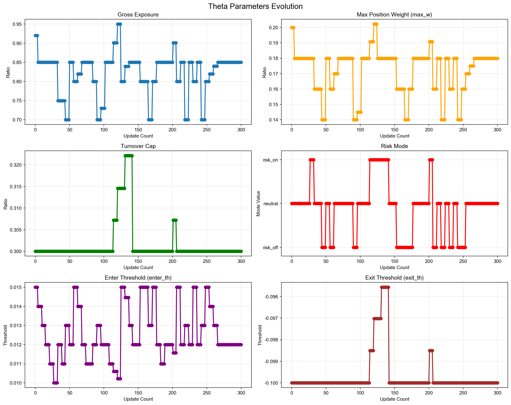
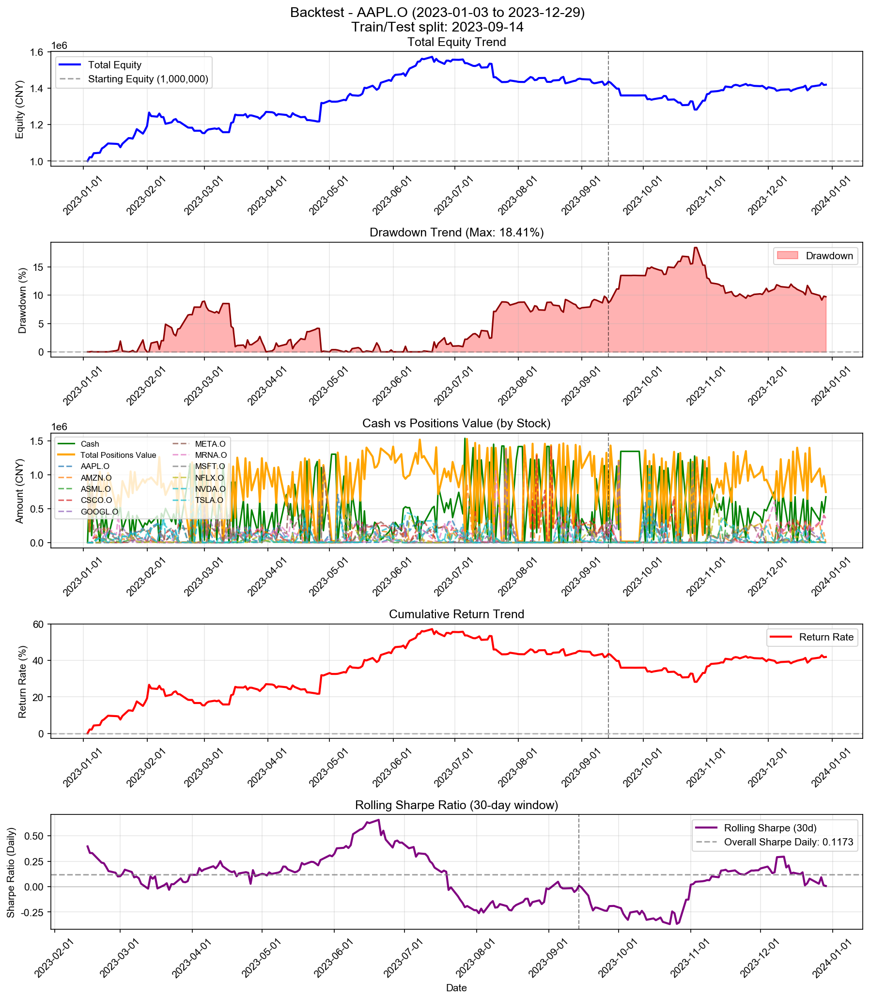

# Backtest

**策略名称:** 层级式多资产交易系统（带 RAG 反思层 + 1-shot Few-Shot Learning）  
**回测期间:** 2023-01-03 至 2023-12-29  
**交易日数:** 250  
**组合股票数:** 20 支  
**初始资金:** 1000000.00 元

---

## 组合整体表现

| 项目 | 数值 |
|------|------|
| 初始资金 | 1000000.00 元 |
| 最终现金 | 675030.11 元 |
| 最终持仓市值 | 743723.78 元 |
| 最终总权益 | 1418753.90 元 |
| 总盈亏 | +418753.90 元 |
| 总收益率 | +41.88% |
| 年化收益率 (CAGR) | +42.27% |

---

## 参数θ追踪

### 初始参数

| 参数 | 数值 |
|------|------|
| 总仓位上限 (gross_exposure) | 0.92 |
| 单票上限 (max_w) | 0.20 |
| 换手上限 (turnover_cap) | 0.30 |
| 风险模式 (risk_mode) | neutral |
| 进场阈值 (enter_th) | 0.015 |
| 出场阈值 (exit_th) | -0.100 |

### 最终参数

| 参数 | 数值 |
|------|------|
| 总仓位上限 (gross_exposure) | 0.85 |
| 单票上限 (max_w) | 0.18 |
| 换手上限 (turnover_cap) | 0.30 |
| 风险模式 (risk_mode) | neutral |
| 进场阈值 (enter_th) | 0.012 |
| 出场阈值 (exit_th) | -0.100 |

### 参数变化趋势图

---

## 持仓明细

| 股票代码 | 股数 | 成本价 | 现价 | 市值 | 权重 | 盈亏 | 收益率 | 贡献度 |
|----------|------|--------|------|------|------|------|--------|--------|
| AAPL.O | 17 | 571.21 | 556.91 | 9467.45 | 0.67% | -243.20 | -2.50% | -0.02% |
| MSFT.O | 4 | 1740.62 | 1746.87 | 6987.49 | 0.49% | +25.01 | +0.36% | 0.00% |
| GOOGL.O | 23 | 56.03 | 55.82 | 1283.91 | 0.09% | -4.77 | -0.37% | -0.00% |
| NVDA.O | 15 | 262.02 | 259.11 | 3886.68 | 0.27% | -43.56 | -1.11% | -0.00% |
| META.O | 233 | 3.54 | 3.54 | 824.73 | 0.06% | +0.96 | +0.12% | 0.00% |
| ASML.O | 73 | 95.81 | 96.07 | 7012.86 | 0.49% | +18.44 | +0.26% | 0.00% |
| MRNA.O | 354824 | 0.98 | 0.99 | 352872.47 | 24.87% | +5961.53 | +1.72% | 0.43% |
| NFLX.O | 125 | 66.74 | 68.16 | 8520.40 | 0.60% | +178.44 | +2.14% | 0.01% |
| CSCO.O | 1671 | 210.54 | 211.17 | 352867.81 | 24.87% | +1062.79 | +0.30% | 0.08% |

### 权重分布

| 股票代码 | 权重 | 市值占比 |
|----------|------|----------|
| AAPL.O | 0.67% | 0.67% |
| MSFT.O | 0.49% | 0.49% |
| GOOGL.O | 0.09% | 0.09% |
| NVDA.O | 0.27% | 0.27% |
| META.O | 0.06% | 0.06% |
| ASML.O | 0.49% | 0.49% |
| MRNA.O | 24.87% | 24.87% |
| NFLX.O | 0.60% | 0.60% |
| CSCO.O | 24.87% | 24.87% |

---

## 交易统计

| 项目 | 数值 |
|------|------|
| 总交易次数 | 2050 次 |
| 买入次数 | 1183 次 |
| 卖出次数 | 867 次 |
| 买入总成本 | 105657140.80 元 |
| 卖出总收入 | 105332170.91 元 |
| 已实现盈亏 | +411798.27 元 |

### 交易质量指标

| 指标 | 数值 |
|------|------|
| 胜率 (Hit Rate) | 58.82% |
| 盈亏比 (Profit Factor) | 1.51 |
| 单笔平均收益 | +474.97 元 |
| 平均持仓周期 | 4.3 天 |

---

## 风险与稳健性

| 指标 | 数值 |
|------|------|
| 最大回撤 (Max Drawdown) | 18.41% |
| 年化波动率 (Volatility) | 20.08% |
| 年化夏普比率 (Sharpe) | 1.8628 |
| 日频夏普比率 (Sharpe Daily) | 0.1173 |
| 年化 Sortino 比率 | 2.1511 |
| 日频 Sortino 比率 | 0.1355 |
| Calmar 比率 (CAGR/MaxDD) | 2.2968 |
### 尾部风险 (Tail Risk)

| 指标 | 数值 |
|------|------|
| VaR 95% | -1.56% |
| VaR 99% | -2.96% |
| CVaR 95% | -2.43% |
| CVaR 99% | -3.70% |
| 极端日跌幅 (5%分位) | -1.57% |
| 极端日跌幅 (1%分位) | -3.34% |

---

## 执行与成本

| 指标 | 数值 |
|------|------|
| 换手率 (Turnover) | 7835.62% |
| 交易频率 (每日) | 8.20 次/日 |
| 交易频率 (每周) | 41.00 次/周 |

---

## 各股票表现分析

| 股票代码 | 初始权重 | 最终权重 | 收益率 | 盈亏 | 交易次数 | 贡献度 |
|----------|----------|----------|--------|------|----------|--------|
| AAPL.O | 780.93% | 0.67% | -2.50% | -243.20 | 173 | -0.02% |
| MSFT.O | 468.45% | 0.49% | +0.36% | +25.01 | 123 | 0.00% |
| GOOGL.O | 1065.79% | 0.09% | -0.37% | -4.77 | 198 | -0.00% |
| NVDA.O | 986.93% | 0.27% | -1.11% | -43.56 | 208 | -0.00% |
| META.O | 1362.97% | 0.06% | +0.12% | +0.96 | 255 | 0.00% |
| ASML.O | 285.17% | 0.49% | +0.26% | +18.44 | 92 | 0.00% |
| MRNA.O | 930.78% | 24.87% | +1.72% | +5961.53 | 188 | 0.43% |
| NFLX.O | 869.76% | 0.60% | +2.14% | +178.44 | 163 | 0.01% |
| CSCO.O | 1204.22% | 24.87% | +0.30% | +1062.79 | 199 | 0.08% |

---

## 策略参数

---

## 交易记录

| 序号 | 日期 | 类型 | 股票代码 | 股数 | 价格 | 成本/收入 | 利润 |
|------|------|------|----------|------|------|-----------|------|
| 1 | 2023-01-03 | 买入 | META.O | 128266 | 1.25 | 159999.01 | - |
| 2 | 2023-01-03 | 买入 | META.O | 673401 | 1.25 | 840000.41 | - |
| 3 | 2023-01-04 | 卖出 | META.O | 673400 | 1.27 | 857709.58 | +17710.42 |
| 4 | 2023-01-05 | 买入 | META.O | 595286 | 1.27 | 755656.05 | - |
| 5 | 2023-01-06 | 买入 | AMZN.O | 331 | 206.59 | 68381.95 | - |
| 6 | 2023-01-06 | 卖出 | META.O | 612890 | 1.30 | 796879.58 | +21267.30 |
| 7 | 2023-01-06 | 买入 | MRNA.O | 51911 | 1.80 | 93621.49 | - |
| 8 | 2023-01-06 | 买入 | CSCO.O | 393 | 197.53 | 77631.06 | - |
| 9 | 2023-01-09 | 买入 | NVDA.O | 502 | 81.73 | 41030.21 | - |
| 10 | 2023-01-09 | 买入 | TSLA.O | 1962 | 17.97 | 35248.31 | - |
| 11 | 2023-01-09 | 卖出 | META.O | 8408 | 1.29 | 10885.84 | +245.51 |
| 12 | 2023-01-09 | 买入 | ASML.O | 909 | 78.08 | 70973.68 | - |
| 13 | 2023-01-09 | 买入 | MRNA.O | 8734 | 1.84 | 16066.19 | - |
| 14 | 2023-01-09 | 卖出 | CSCO.O | 230 | 198.60 | 45677.40 | +244.47 |
| 15 | 2023-01-09 | 买入 | AMZN.O | 397 | 209.66 | 83236.61 | - |
| 16 | 2023-01-09 | 买入 | NVDA.O | 559 | 81.73 | 45689.02 | - |
| 17 | 2023-01-09 | 买入 | TSLA.O | 2184 | 17.97 | 39236.65 | - |
| 18 | 2023-01-09 | 买入 | META.O | 113813 | 1.29 | 147353.69 | - |
| 19 | 2023-01-09 | 买入 | ASML.O | 1012 | 78.08 | 79015.80 | - |
| 20 | 2023-01-09 | 买入 | MRNA.O | 67500 | 1.84 | 124166.25 | - |
| 21 | 2023-01-09 | 买入 | CSCO.O | 170 | 198.60 | 33761.56 | - |
| 22 | 2023-01-10 | 买入 | GOOGL.O | 2 | 35.33 | 70.67 | - |
| 23 | 2023-01-10 | 卖出 | AMZN.O | 134 | 215.69 | 28902.19 | +994.38 |
| 24 | 2023-01-10 | 卖出 | NVDA.O | 518 | 83.20 | 43099.20 | +761.26 |
| 25 | 2023-01-10 | 卖出 | TSLA.O | 3385 | 17.83 | 60346.09 | -467.13 |
| 26 | 2023-01-10 | 卖出 | META.O | 109296 | 1.33 | 145352.75 | +5357.58 |
| 27 | 2023-01-10 | 卖出 | ASML.O | 1100 | 79.59 | 87553.80 | +1667.06 |
| 28 | 2023-01-10 | 卖出 | MRNA.O | 55623 | 1.90 | 105489.02 | +3981.69 |
| 29 | 2023-01-10 | 买入 | NFLX.O | 983 | 45.86 | 45076.05 | - |
| 30 | 2023-01-10 | 卖出 | CSCO.O | 196 | 199.54 | 39109.38 | +286.26 |
| 31 | 2023-01-11 | 买入 | MSFT.O | 31 | 1085.63 | 33654.51 | - |
| 32 | 2023-01-11 | 买入 | GOOGL.O | 2376 | 36.57 | 86896.52 | - |
| 33 | 2023-01-11 | 卖出 | NVDA.O | 317 | 83.68 | 26527.91 | +618.39 |
| 34 | 2023-01-11 | 买入 | TSLA.O | 890 | 18.48 | 16449.87 | - |
| 35 | 2023-01-11 | 卖出 | ASML.O | 374 | 81.01 | 30298.90 | +1097.41 |
| 36 | 2023-01-11 | 卖出 | MRNA.O | 32012 | 1.87 | 59747.20 | +1327.97 |
| 37 | 2023-01-11 | 卖出 | NFLX.O | 571 | 45.82 | 26161.16 | -22.38 |
| 38 | 2023-01-11 | 卖出 | CSCO.O | 80 | 201.17 | 16093.83 | +247.66 |
| 39 | 2023-01-11 | 买入 | MSFT.O | 19 | 1085.63 | 20626.96 | - |
| 40 | 2023-01-11 | 买入 | GOOGL.O | 1478 | 36.57 | 54054.32 | - |
| 41 | 2023-01-11 | 买入 | AMZN.O | 348 | 228.22 | 79419.17 | - |
| 42 | 2023-01-11 | 买入 | NVDA.O | 140 | 83.68 | 11715.79 | - |
| 43 | 2023-01-11 | 买入 | TSLA.O | 1026 | 18.48 | 18963.56 | - |
| 44 | 2023-01-11 | 买入 | META.O | 62638 | 1.33 | 83239.64 | - |
| 45 | 2023-01-11 | 买入 | ASML.O | 277 | 81.01 | 22440.63 | - |
| 46 | 2023-01-11 | 买入 | MRNA.O | 25182 | 1.87 | 46999.68 | - |
| 47 | 2023-01-11 | 买入 | NFLX.O | 255 | 45.82 | 11683.18 | - |
| 48 | 2023-01-12 | 卖出 | GOOGL.O | 1892 | 36.42 | 68900.51 | -293.65 |
| 49 | 2023-01-12 | 卖出 | AMZN.O | 303 | 228.65 | 69280.34 | +3942.38 |
| 50 | 2023-01-12 | 买入 | NVDA.O | 693 | 86.35 | 59841.60 | - |
| 51 | 2023-01-12 | 卖出 | TSLA.O | 1539 | 18.53 | 28523.83 | +304.89 |
| 52 | 2023-01-12 | 卖出 | META.O | 62019 | 1.37 | 84786.17 | +4246.09 |
| 53 | 2023-01-12 | 卖出 | ASML.O | 319 | 82.00 | 26159.07 | +893.79 |
| 54 | 2023-01-12 | 卖出 | MRNA.O | 4792 | 1.88 | 9011.84 | +190.63 |
| 55 | 2023-01-12 | 卖出 | NFLX.O | 601 | 46.22 | 27777.14 | +226.93 |
| 56 | 2023-01-12 | 卖出 | CSCO.O | 47 | 200.31 | 9414.78 | +105.15 |
| 57 | 2023-01-13 | 卖出 | MSFT.O | 21 | 1101.56 | 23132.79 | +334.57 |
| 58 | 2023-01-13 | 买入 | GOOGL.O | 1710 | 36.81 | 62949.17 | - |
| 59 | 2023-01-13 | 买入 | NVDA.O | 151 | 88.38 | 13345.49 | - |
| 60 | 2023-01-13 | 卖出 | TSLA.O | 1081 | 18.36 | 19847.16 | +26.06 |
| 61 | 2023-01-13 | 卖出 | META.O | 28542 | 1.37 | 39096.83 | +2031.17 |
| 62 | 2023-01-13 | 买入 | ASML.O | 138 | 82.90 | 11440.11 | - |
| 63 | 2023-01-13 | 买入 | MRNA.O | 18355 | 1.92 | 35241.60 | - |
| 64 | 2023-01-13 | 买入 | MSFT.O | 11 | 1101.56 | 12117.18 | - |
| 65 | 2023-01-13 | 买入 | GOOGL.O | 1461 | 36.81 | 53782.88 | - |
| 66 | 2023-01-13 | 买入 | AMZN.O | 259 | 235.49 | 60991.39 | - |
| 67 | 2023-01-13 | 买入 | NVDA.O | 481 | 88.38 | 42511.13 | - |
| 68 | 2023-01-13 | 买入 | META.O | 31371 | 1.37 | 42972.00 | - |
| 69 | 2023-01-13 | 买入 | ASML.O | 216 | 82.90 | 17906.25 | - |
| 70 | 2023-01-13 | 买入 | MRNA.O | 31533 | 1.92 | 60543.36 | - |
| 71 | 2023-01-17 | 卖出 | MSFT.O | 27 | 1106.72 | 29881.40 | +451.11 |
| 72 | 2023-01-17 | 卖出 | GOOGL.O | 3430 | 36.48 | 125128.80 | -822.27 |
| 73 | 2023-01-17 | 卖出 | AMZN.O | 591 | 230.52 | 136237.32 | +5412.20 |
| 74 | 2023-01-17 | 卖出 | NVDA.O | 437 | 92.58 | 40457.62 | +2756.80 |
| 75 | 2023-01-17 | 买入 | TSLA.O | 3356 | 19.72 | 66192.07 | - |
| 76 | 2023-01-17 | 卖出 | META.O | 73541 | 1.35 | 99545.10 | +2552.57 |
| 77 | 2023-01-17 | 卖出 | ASML.O | 508 | 82.71 | 42017.10 | +906.61 |
| 78 | 2023-01-17 | 卖出 | MRNA.O | 49808 | 1.91 | 94978.88 | +1515.45 |
| 79 | 2023-01-18 | 卖出 | MSFT.O | 9 | 1085.81 | 9772.32 | -37.77 |
| 80 | 2023-01-18 | 卖出 | GOOGL.O | 1270 | 36.41 | 46244.21 | -390.73 |
| 81 | 2023-01-18 | 卖出 | AMZN.O | 228 | 229.10 | 52235.71 | +1765.11 |
| 82 | 2023-01-18 | 卖出 | NVDA.O | 929 | 90.88 | 84428.12 | +4281.52 |
| 83 | 2023-01-18 | 卖出 | TSLA.O | 2526 | 19.32 | 48794.74 | -968.28 |
| 84 | 2023-01-18 | 卖出 | META.O | 27186 | 1.33 | 36162.82 | +307.46 |
| 85 | 2023-01-18 | 卖出 | ASML.O | 186 | 81.97 | 15246.31 | +194.04 |
| 86 | 2023-01-18 | 买入 | MRNA.O | 8468 | 1.97 | 16683.65 | - |
| 87 | 2023-01-18 | 买入 | GOOGL.O | 841 | 36.41 | 30623.13 | - |
| 88 | 2023-01-18 | 买入 | AMZN.O | 151 | 229.10 | 34594.70 | - |
| 89 | 2023-01-18 | 买入 | NVDA.O | 628 | 90.88 | 57073.04 | - |
| 90 | 2023-01-18 | 买入 | TSLA.O | 1717 | 19.32 | 33167.29 | - |
| 91 | 2023-01-18 | 买入 | META.O | 18386 | 1.33 | 24457.06 | - |
| 92 | 2023-01-18 | 买入 | ASML.O | 124 | 81.97 | 10164.21 | - |
| 93 | 2023-01-18 | 买入 | MRNA.O | 134526 | 1.97 | 265043.13 | - |
| 94 | 2023-01-19 | 买入 | GOOGL.O | 1241 | 37.18 | 46145.37 | - |
| 95 | 2023-01-19 | 卖出 | AMZN.O | 202 | 224.83 | 45416.06 | -325.80 |
| 96 | 2023-01-19 | 卖出 | NVDA.O | 839 | 87.68 | 73563.45 | -1366.74 |
| 97 | 2023-01-19 | 卖出 | TSLA.O | 2299 | 19.08 | 43854.57 | -855.39 |
| 98 | 2023-01-19 | 买入 | META.O | 40088 | 1.36 | 54579.81 | - |
| 99 | 2023-01-19 | 卖出 | ASML.O | 166 | 79.20 | 13147.16 | -400.20 |
| 100 | 2023-01-19 | 卖出 | MRNA.O | 179626 | 1.90 | 341971.98 | -6894.00 |
| 101 | 2023-01-19 | 买入 | GOOGL.O | 2790 | 37.18 | 103743.41 | - |
| 102 | 2023-01-19 | 买入 | NVDA.O | 126 | 87.68 | 11047.67 | - |
| 103 | 2023-01-19 | 买入 | META.O | 75339 | 1.36 | 102574.05 | - |
| 104 | 2023-01-19 | 买入 | MRNA.O | 26988 | 1.90 | 51379.75 | - |
| 105 | 2023-01-20 | 卖出 | GOOGL.O | 2315 | 39.17 | 90678.77 | +4968.68 |
| 106 | 2023-01-20 | 买入 | AMZN.O | 96 | 233.40 | 22406.40 | - |
| 107 | 2023-01-20 | 买入 | NVDA.O | 250 | 93.30 | 23324.22 | - |
| 108 | 2023-01-20 | 买入 | TSLA.O | 2167 | 20.01 | 43368.17 | - |
| 109 | 2023-01-20 | 卖出 | META.O | 77791 | 1.39 | 108417.32 | +3036.83 |
| 110 | 2023-01-20 | 卖出 | MRNA.O | 15814 | 1.94 | 30676.00 | +281.44 |
| 111 | 2023-01-20 | 买入 | NFLX.O | 1331 | 47.95 | 63821.45 | - |
| 112 | 2023-01-20 | 买入 | GOOGL.O | 2749 | 39.17 | 107678.59 | - |
| 113 | 2023-01-20 | 买入 | AMZN.O | 114 | 233.40 | 26607.60 | - |
| 114 | 2023-01-20 | 买入 | NVDA.O | 450 | 93.30 | 41983.59 | - |
| 115 | 2023-01-20 | 买入 | TSLA.O | 2272 | 20.01 | 45469.54 | - |
| 116 | 2023-01-20 | 买入 | META.O | 60207 | 1.39 | 83910.50 | - |
| 117 | 2023-01-20 | 买入 | MRNA.O | 32643 | 1.94 | 63320.89 | - |
| 118 | 2023-01-20 | 买入 | NFLX.O | 1284 | 47.95 | 61567.80 | - |
| 119 | 2023-01-23 | 买入 | AAPL.O | 172 | 405.90 | 69815.40 | - |
| 120 | 2023-01-23 | 卖出 | GOOGL.O | 3632 | 39.88 | 144834.76 | +6631.62 |
| 121 | 2023-01-23 | 卖出 | AMZN.O | 87 | 234.05 | 20362.18 | +127.56 |
| 122 | 2023-01-23 | 卖出 | NVDA.O | 224 | 100.38 | 22484.72 | +1863.21 |
| 123 | 2023-01-23 | 卖出 | TSLA.O | 1025 | 21.56 | 22101.56 | +1625.50 |
| 124 | 2023-01-23 | 卖出 | META.O | 45844 | 1.43 | 65680.70 | +2720.53 |
| 125 | 2023-01-23 | 买入 | ASML.O | 452 | 84.95 | 38398.61 | - |
| 126 | 2023-01-23 | 卖出 | MRNA.O | 42191 | 1.97 | 83090.96 | +1640.15 |
| 127 | 2023-01-23 | 卖出 | NFLX.O | 1385 | 50.04 | 69303.74 | +2964.91 |
| 128 | 2023-01-23 | 买入 | AAPL.O | 20 | 405.90 | 8118.07 | - |
| 129 | 2023-01-23 | 买入 | GOOGL.O | 255 | 39.88 | 10168.74 | - |
| 130 | 2023-01-23 | 买入 | NVDA.O | 86 | 100.38 | 8632.53 | - |
| 131 | 2023-01-23 | 买入 | TSLA.O | 450 | 21.56 | 9703.12 | - |
| 132 | 2023-01-23 | 买入 | META.O | 9667 | 1.43 | 13849.91 | - |
| 133 | 2023-01-24 | 买入 | AAPL.O | 82 | 409.99 | 33619.02 | - |
| 134 | 2023-01-24 | 买入 | MSFT.O | 26 | 1114.50 | 28977.01 | - |
| 135 | 2023-01-24 | 卖出 | GOOGL.O | 1373 | 39.04 | 53604.97 | +1089.81 |
| 136 | 2023-01-24 | 买入 | NVDA.O | 150 | 100.75 | 15113.22 | - |
| 137 | 2023-01-24 | 卖出 | META.O | 22229 | 1.43 | 31818.59 | +1147.83 |
| 138 | 2023-01-24 | 买入 | MRNA.O | 6698 | 1.97 | 13178.98 | - |
| 139 | 2023-01-24 | 买入 | NFLX.O | 279 | 50.94 | 14211.20 | - |
| 140 | 2023-01-24 | 买入 | CSCO.O | 93 | 195.45 | 18176.81 | - |
| 141 | 2023-01-24 | 买入 | AAPL.O | 133 | 409.99 | 54528.42 | - |
| 142 | 2023-01-24 | 买入 | MSFT.O | 14 | 1114.50 | 15603.00 | - |
| 143 | 2023-01-24 | 买入 | GOOGL.O | 480 | 39.04 | 18740.27 | - |
| 144 | 2023-01-24 | 买入 | AMZN.O | 79 | 231.17 | 18262.27 | - |
| 145 | 2023-01-24 | 买入 | NVDA.O | 462 | 100.75 | 46548.70 | - |
| 146 | 2023-01-24 | 买入 | TSLA.O | 2156 | 21.58 | 46534.03 | - |
| 147 | 2023-01-24 | 买入 | META.O | 32686 | 1.43 | 46786.74 | - |
| 148 | 2023-01-24 | 买入 | ASML.O | 189 | 84.20 | 15913.08 | - |
| 149 | 2023-01-24 | 买入 | MRNA.O | 15864 | 1.97 | 31214.01 | - |
| 150 | 2023-01-24 | 买入 | NFLX.O | 764 | 50.94 | 38915.26 | - |
| 151 | 2023-01-24 | 买入 | CSCO.O | 50 | 195.45 | 9772.48 | - |
| 152 | 2023-01-25 | 卖出 | AAPL.O | 132 | 408.06 | 53864.03 | -0.05 |
| 153 | 2023-01-25 | 卖出 | MSFT.O | 20 | 1107.92 | 22158.31 | -87.17 |
| 154 | 2023-01-25 | 卖出 | GOOGL.O | 1329 | 38.05 | 50570.02 | -606.43 |
| 155 | 2023-01-25 | 买入 | AMZN.O | 62 | 233.23 | 14460.38 | - |
| 156 | 2023-01-25 | 卖出 | NVDA.O | 230 | 101.06 | 23243.36 | +1087.62 |
| 157 | 2023-01-25 | 卖出 | TSLA.O | 609 | 21.66 | 13193.68 | +625.62 |
| 158 | 2023-01-25 | 卖出 | META.O | 56275 | 1.42 | 79629.12 | +1033.16 |
| 159 | 2023-01-25 | 买入 | ASML.O | 151 | 85.64 | 12932.22 | - |
| 160 | 2023-01-25 | 卖出 | MRNA.O | 27508 | 1.93 | 53109.70 | -469.28 |
| 161 | 2023-01-25 | 卖出 | NFLX.O | 991 | 51.51 | 51050.77 | +2241.22 |
| 162 | 2023-01-26 | 买入 | MSFT.O | 49 | 1141.94 | 55955.25 | - |
| 163 | 2023-01-26 | 买入 | GOOGL.O | 648 | 38.97 | 25252.75 | - |
| 164 | 2023-01-26 | 卖出 | NVDA.O | 134 | 103.56 | 13877.47 | +969.35 |
| 165 | 2023-01-26 | 卖出 | TSLA.O | 1378 | 24.04 | 33127.81 | +4689.74 |
| 166 | 2023-01-26 | 买入 | META.O | 41692 | 1.47 | 61412.32 | - |
| 167 | 2023-01-26 | 卖出 | ASML.O | 441 | 85.94 | 37900.27 | +498.63 |
| 168 | 2023-01-26 | 卖出 | MRNA.O | 5210 | 1.93 | 10067.80 | -80.02 |
| 169 | 2023-01-26 | 卖出 | NFLX.O | 772 | 51.08 | 39435.15 | +1411.97 |
| 170 | 2023-01-26 | 买入 | AAPL.O | 104 | 414.10 | 43066.56 | - |
| 171 | 2023-01-26 | 买入 | MSFT.O | 27 | 1141.94 | 30832.48 | - |
| 172 | 2023-01-26 | 买入 | GOOGL.O | 291 | 38.97 | 11340.35 | - |
| 173 | 2023-01-26 | 买入 | AMZN.O | 107 | 238.13 | 25479.70 | - |
| 174 | 2023-01-26 | 买入 | NVDA.O | 387 | 103.56 | 40078.98 | - |
| 175 | 2023-01-26 | 买入 | TSLA.O | 1601 | 24.04 | 38488.84 | - |
| 176 | 2023-01-26 | 买入 | META.O | 31539 | 1.47 | 46456.95 | - |
| 177 | 2023-01-26 | 买入 | ASML.O | 137 | 85.94 | 11774.01 | - |
| 178 | 2023-01-26 | 买入 | MRNA.O | 5840 | 1.93 | 11285.22 | - |
| 179 | 2023-01-26 | 买入 | NFLX.O | 212 | 51.08 | 10829.34 | - |
| 180 | 2023-01-26 | 买入 | CSCO.O | 52 | 197.62 | 10276.05 | - |
| 181 | 2023-01-27 | 卖出 | AAPL.O | 24 | 419.77 | 10074.44 | +241.19 |
| 182 | 2023-01-27 | 卖出 | MSFT.O | 47 | 1142.68 | 53705.99 | +369.30 |
| 183 | 2023-01-27 | 卖出 | NVDA.O | 407 | 106.51 | 43348.63 | +3349.70 |
| 184 | 2023-01-27 | 卖出 | TSLA.O | 2522 | 26.69 | 67299.57 | +12938.76 |
| 185 | 2023-01-27 | 卖出 | META.O | 18540 | 1.52 | 28132.60 | +1352.46 |
| 186 | 2023-01-27 | 卖出 | ASML.O | 481 | 83.87 | 40340.00 | -599.89 |
| 187 | 2023-01-27 | 卖出 | MRNA.O | 20397 | 1.89 | 38621.72 | -1022.26 |
| 188 | 2023-01-27 | 卖出 | NFLX.O | 435 | 50.51 | 21970.89 | +331.87 |
| 189 | 2023-01-27 | 买入 | CSCO.O | 49 | 198.31 | 9717.25 | - |
| 190 | 2023-01-30 | 卖出 | MSFT.O | 36 | 1117.59 | 40233.08 | -620.56 |
| 191 | 2023-01-30 | 卖出 | GOOGL.O | 725 | 38.74 | 28085.42 | -123.96 |
| 192 | 2023-01-30 | 买入 | AMZN.O | 154 | 241.32 | 37163.28 | - |
| 193 | 2023-01-30 | 卖出 | NVDA.O | 702 | 100.22 | 70351.69 | +1360.90 |
| 194 | 2023-01-30 | 买入 | TSLA.O | 1767 | 25.00 | 44173.23 | - |
| 195 | 2023-01-30 | 卖出 | META.O | 11301 | 1.47 | 16619.25 | +295.50 |
| 196 | 2023-01-30 | 卖出 | NFLX.O | 245 | 49.44 | 12111.67 | -75.82 |
| 197 | 2023-01-30 | 买入 | AAPL.O | 155 | 411.34 | 63757.71 | - |
| 198 | 2023-01-30 | 买入 | AMZN.O | 240 | 241.32 | 57916.80 | - |
| 199 | 2023-01-30 | 买入 | NVDA.O | 142 | 100.22 | 14230.68 | - |
| 200 | 2023-01-30 | 买入 | TSLA.O | 2255 | 25.00 | 56372.75 | - |
| 201 | 2023-01-30 | 买入 | META.O | 37891 | 1.47 | 55722.50 | - |
| 202 | 2023-01-30 | 买入 | CSCO.O | 107 | 197.13 | 21092.45 | - |
| 203 | 2023-01-31 | 卖出 | AAPL.O | 127 | 415.05 | 52711.45 | +614.59 |
| 204 | 2023-01-31 | 卖出 | MSFT.O | 16 | 1141.07 | 18257.10 | +99.93 |
| 205 | 2023-01-31 | 买入 | GOOGL.O | 1362 | 39.50 | 53795.98 | - |
| 206 | 2023-01-31 | 卖出 | AMZN.O | 154 | 247.51 | 38116.85 | +1529.27 |
| 207 | 2023-01-31 | 卖出 | TSLA.O | 1361 | 25.98 | 35362.86 | +3492.49 |
| 208 | 2023-01-31 | 卖出 | META.O | 31411 | 1.49 | 46792.97 | +1172.34 |
| 209 | 2023-01-31 | 卖出 | CSCO.O | 104 | 198.97 | 20692.39 | +233.55 |
| 210 | 2023-01-31 | 买入 | AAPL.O | 49 | 415.05 | 20337.49 | - |
| 211 | 2023-01-31 | 买入 | GOOGL.O | 223 | 39.50 | 8808.00 | - |
| 212 | 2023-01-31 | 买入 | AMZN.O | 83 | 247.51 | 20543.50 | - |
| 213 | 2023-01-31 | 买入 | TSLA.O | 791 | 25.98 | 20552.55 | - |
| 214 | 2023-01-31 | 买入 | META.O | 12192 | 1.49 | 18162.42 | - |
| 215 | 2023-02-01 | 卖出 | AAPL.O | 73 | 418.33 | 30538.09 | +552.58 |
| 216 | 2023-02-01 | 买入 | MSFT.O | 28 | 1163.82 | 32586.84 | - |
| 217 | 2023-02-01 | 卖出 | GOOGL.O | 1626 | 40.13 | 65256.53 | +1208.58 |
| 218 | 2023-02-01 | 卖出 | AMZN.O | 185 | 252.36 | 46686.60 | +2522.80 |
| 219 | 2023-02-01 | 买入 | NVDA.O | 694 | 109.53 | 76014.24 | - |
| 220 | 2023-02-01 | 卖出 | TSLA.O | 1574 | 27.21 | 42830.90 | +5507.61 |
| 221 | 2023-02-01 | 卖出 | META.O | 13570 | 1.53 | 20778.38 | +1011.25 |
| 222 | 2023-02-01 | 买入 | ASML.O | 155 | 85.27 | 13216.36 | - |
| 223 | 2023-02-01 | 卖出 | CSCO.O | 209 | 198.56 | 41498.31 | +383.90 |
| 224 | 2023-02-01 | 买入 | AAPL.O | 78 | 418.33 | 32629.74 | - |
| 225 | 2023-02-01 | 买入 | AMZN.O | 117 | 252.36 | 29526.12 | - |
| 226 | 2023-02-01 | 买入 | NVDA.O | 255 | 109.53 | 27930.30 | - |
| 227 | 2023-02-01 | 买入 | TSLA.O | 1160 | 27.21 | 31565.34 | - |
| 228 | 2023-02-01 | 买入 | META.O | 20213 | 1.53 | 30950.15 | - |
| 229 | 2023-02-02 | 卖出 | AAPL.O | 90 | 433.83 | 39045.09 | +1955.06 |
| 230 | 2023-02-02 | 买入 | MSFT.O | 40 | 1218.38 | 48735.22 | - |
| 231 | 2023-02-02 | 买入 | GOOGL.O | 1601 | 43.05 | 68929.99 | - |
| 232 | 2023-02-02 | 卖出 | AMZN.O | 113 | 270.98 | 30621.19 | +3369.79 |
| 233 | 2023-02-02 | 卖出 | NVDA.O | 634 | 113.54 | 71982.29 | +4779.97 |
| 234 | 2023-02-02 | 卖出 | TSLA.O | 3184 | 28.24 | 89917.75 | +12415.39 |
| 235 | 2023-02-02 | 卖出 | META.O | 64263 | 1.89 | 121309.27 | +26837.76 |
| 236 | 2023-02-02 | 买入 | CSCO.O | 203 | 201.62 | 40929.38 | - |
| 237 | 2023-02-02 | 买入 | AAPL.O | 58 | 433.83 | 25162.39 | - |
| 238 | 2023-02-02 | 买入 | MSFT.O | 11 | 1218.38 | 13402.18 | - |
| 239 | 2023-02-02 | 买入 | GOOGL.O | 322 | 43.05 | 13863.50 | - |
| 240 | 2023-02-02 | 买入 | AMZN.O | 91 | 270.98 | 24659.54 | - |
| 241 | 2023-02-02 | 买入 | NVDA.O | 131 | 113.54 | 14873.31 | - |
| 242 | 2023-02-02 | 买入 | TSLA.O | 550 | 28.24 | 15532.27 | - |
| 243 | 2023-02-02 | 买入 | META.O | 8107 | 1.89 | 15303.58 | - |
| 244 | 2023-02-03 | 卖出 | MSFT.O | 44 | 1189.60 | 52342.47 | -380.02 |
| 245 | 2023-02-03 | 卖出 | GOOGL.O | 1023 | 41.87 | 42834.53 | -682.42 |
| 246 | 2023-02-03 | 卖出 | AMZN.O | 334 | 248.14 | 82877.42 | +894.88 |
| 247 | 2023-02-03 | 卖出 | NVDA.O | 429 | 110.35 | 47340.88 | +1405.46 |
| 248 | 2023-02-03 | 买入 | TSLA.O | 1656 | 28.50 | 47191.03 | - |
| 249 | 2023-02-03 | 买入 | META.O | 27009 | 1.87 | 50379.89 | - |
| 250 | 2023-02-03 | 卖出 | CSCO.O | 122 | 198.80 | 24253.82 | -229.74 |
| 251 | 2023-02-03 | 买入 | AAPL.O | 115 | 444.42 | 51108.28 | - |
| 252 | 2023-02-03 | 买入 | MSFT.O | 9 | 1189.60 | 10706.41 | - |
| 253 | 2023-02-03 | 买入 | GOOGL.O | 337 | 41.87 | 14110.69 | - |
| 254 | 2023-02-03 | 买入 | AMZN.O | 82 | 248.14 | 20347.15 | - |
| 255 | 2023-02-03 | 买入 | NVDA.O | 135 | 110.35 | 14897.48 | - |
| 256 | 2023-02-03 | 买入 | TSLA.O | 1519 | 28.50 | 43286.94 | - |
| 257 | 2023-02-03 | 买入 | META.O | 23106 | 1.87 | 43099.62 | - |
| 258 | 2023-02-06 | 卖出 | MSFT.O | 40 | 1182.33 | 47293.05 | -567.39 |
| 259 | 2023-02-06 | 卖出 | GOOGL.O | 1392 | 41.12 | 57239.33 | -1772.72 |
| 260 | 2023-02-06 | 卖出 | AMZN.O | 341 | 245.23 | 83624.11 | -273.78 |
| 261 | 2023-02-06 | 卖出 | NVDA.O | 559 | 110.29 | 61654.44 | +1401.71 |
| 262 | 2023-02-06 | 买入 | TSLA.O | 363 | 29.21 | 10604.68 | - |
| 263 | 2023-02-06 | 买入 | META.O | 9117 | 1.86 | 16963.09 | - |
| 264 | 2023-02-06 | 卖出 | ASML.O | 175 | 83.37 | 14589.52 | -327.84 |
| 265 | 2023-02-06 | 卖出 | CSCO.O | 112 | 194.47 | 21780.47 | -696.25 |
| 266 | 2023-02-06 | 买入 | AAPL.O | 119 | 436.45 | 51937.78 | - |
| 267 | 2023-02-06 | 买入 | TSLA.O | 1758 | 29.21 | 51358.21 | - |
| 268 | 2023-02-06 | 买入 | META.O | 27605 | 1.86 | 51361.86 | - |
| 269 | 2023-02-07 | 卖出 | AAPL.O | 129 | 444.85 | 57385.82 | +2634.28 |
| 270 | 2023-02-07 | 买入 | MSFT.O | 86 | 1232.01 | 105952.86 | - |
| 271 | 2023-02-07 | 买入 | GOOGL.O | 2464 | 43.01 | 105987.42 | - |
| 272 | 2023-02-07 | 买入 | NVDA.O | 1163 | 115.96 | 134865.47 | - |
| 273 | 2023-02-07 | 卖出 | TSLA.O | 1439 | 29.52 | 42481.44 | +3402.07 |
| 274 | 2023-02-07 | 卖出 | META.O | 30497 | 1.92 | 58438.35 | +5607.23 |
| 275 | 2023-02-07 | 买入 | AAPL.O | 130 | 444.85 | 57830.67 | - |
| 276 | 2023-02-07 | 买入 | MSFT.O | 23 | 1232.01 | 28336.23 | - |
| 277 | 2023-02-07 | 买入 | GOOGL.O | 670 | 43.01 | 28819.63 | - |
| 278 | 2023-02-07 | 买入 | NVDA.O | 313 | 115.96 | 36296.55 | - |
| 279 | 2023-02-07 | 买入 | TSLA.O | 1738 | 29.52 | 51308.37 | - |
| 280 | 2023-02-07 | 买入 | META.O | 10 | 1.92 | 19.16 | - |
| 281 | 2023-02-08 | 卖出 | AAPL.O | 480 | 437.00 | 209759.27 | +4041.57 |
| 282 | 2023-02-08 | 卖出 | MSFT.O | 13 | 1228.19 | 15966.45 | -29.44 |
| 283 | 2023-02-08 | 卖出 | GOOGL.O | 2418 | 39.71 | 96017.75 | -7918.11 |
| 284 | 2023-02-08 | 买入 | NVDA.O | 160 | 116.13 | 18580.93 | - |
| 285 | 2023-02-08 | 卖出 | TSLA.O | 2019 | 30.19 | 60960.68 | +5249.01 |
| 286 | 2023-02-08 | 卖出 | META.O | 36355 | 1.83 | 66685.98 | +3706.22 |
| 287 | 2023-02-09 | 卖出 | AAPL.O | 160 | 433.98 | 69436.50 | +863.94 |
| 288 | 2023-02-09 | 卖出 | MSFT.O | 67 | 1213.87 | 81329.15 | -1111.21 |
| 289 | 2023-02-09 | 卖出 | GOOGL.O | 876 | 37.97 | 33259.32 | -4394.86 |
| 290 | 2023-02-09 | 买入 | NVDA.O | 213 | 116.82 | 24882.90 | - |
| 291 | 2023-02-09 | 卖出 | META.O | 49653 | 1.78 | 88342.62 | +2326.01 |
| 292 | 2023-02-09 | 买入 | MSFT.O | 19 | 1213.87 | 23063.49 | - |
| 293 | 2023-02-09 | 买入 | NVDA.O | 1096 | 116.82 | 128035.97 | - |
| 294 | 2023-02-09 | 买入 | TSLA.O | 4119 | 31.10 | 128092.66 | - |
| 295 | 2023-02-09 | 买入 | META.O | 15263 | 1.78 | 27155.93 | - |
| 296 | 2023-02-10 | 买入 | MSFT.O | 30 | 1211.47 | 36344.20 | - |
| 297 | 2023-02-10 | 卖出 | NVDA.O | 2339 | 111.21 | 260131.06 | -11600.70 |
| 298 | 2023-02-10 | 卖出 | TSLA.O | 6296 | 29.53 | 185942.92 | +4321.58 |
| 299 | 2023-02-10 | 卖出 | META.O | 32824 | 1.74 | 57163.00 | -260.19 |
| 300 | 2023-02-10 | 买入 | CSCO.O | 438 | 193.20 | 84622.11 | - |
| 301 | 2023-02-10 | 买入 | MSFT.O | 48 | 1211.47 | 58150.73 | - |
| 302 | 2023-02-10 | 买入 | NVDA.O | 387 | 111.21 | 43040.07 | - |
| 303 | 2023-02-10 | 买入 | TSLA.O | 3025 | 29.53 | 89338.84 | - |
| 304 | 2023-02-10 | 买入 | META.O | 5249 | 1.74 | 9141.13 | - |
| 305 | 2023-02-10 | 买入 | CSCO.O | 264 | 193.20 | 51005.11 | - |
| 306 | 2023-02-13 | 买入 | AAPL.O | 184 | 443.23 | 81553.55 | - |
| 307 | 2023-02-13 | 卖出 | MSFT.O | 34 | 1249.32 | 42476.99 | +1107.61 |
| 308 | 2023-02-13 | 卖出 | NVDA.O | 807 | 113.95 | 91957.57 | -328.30 |
| 309 | 2023-02-13 | 卖出 | TSLA.O | 5248 | 29.20 | 153220.61 | +509.41 |
| 310 | 2023-02-13 | 买入 | META.O | 24798 | 1.79 | 44495.05 | - |
| 311 | 2023-02-13 | 卖出 | CSCO.O | 129 | 195.65 | 25239.37 | +293.59 |
| 312 | 2023-02-13 | 买入 | AAPL.O | 140 | 443.23 | 62051.62 | - |
| 313 | 2023-02-13 | 买入 | MSFT.O | 73 | 1249.32 | 91200.61 | - |
| 314 | 2023-02-13 | 买入 | NVDA.O | 188 | 113.95 | 21422.58 | - |
| 315 | 2023-02-13 | 买入 | TSLA.O | 2273 | 29.20 | 66362.51 | - |
| 316 | 2023-02-13 | 买入 | META.O | 29675 | 1.79 | 53245.85 | - |
| 317 | 2023-02-13 | 买入 | CSCO.O | 447 | 195.65 | 87457.34 | - |
| 318 | 2023-02-14 | 卖出 | AAPL.O | 266 | 441.35 | 117399.96 | -498.11 |
| 319 | 2023-02-14 | 卖出 | MSFT.O | 96 | 1253.24 | 120310.78 | +2160.17 |
| 320 | 2023-02-14 | 买入 | NVDA.O | 352 | 120.14 | 42288.20 | - |
| 321 | 2023-02-14 | 卖出 | TSLA.O | 1665 | 31.39 | 52260.19 | +3740.76 |
| 322 | 2023-02-14 | 卖出 | META.O | 26207 | 1.79 | 47036.32 | +273.56 |
| 323 | 2023-02-14 | 买入 | MRNA.O | 47764 | 1.76 | 83883.14 | - |
| 324 | 2023-02-14 | 卖出 | CSCO.O | 412 | 195.00 | 80339.96 | +264.00 |
| 325 | 2023-02-14 | 买入 | MSFT.O | 22 | 1253.24 | 27571.22 | - |
| 326 | 2023-02-14 | 买入 | NVDA.O | 240 | 120.14 | 28832.86 | - |
| 327 | 2023-02-14 | 买入 | TSLA.O | 1098 | 31.39 | 34463.47 | - |
| 328 | 2023-02-14 | 买入 | META.O | 12977 | 1.79 | 23291.12 | - |
| 329 | 2023-02-14 | 买入 | MRNA.O | 14944 | 1.76 | 26244.65 | - |
| 330 | 2023-02-14 | 买入 | CSCO.O | 190 | 195.00 | 37049.98 | - |
| 331 | 2023-02-15 | 买入 | AAPL.O | 185 | 447.49 | 82785.57 | - |
| 332 | 2023-02-15 | 卖出 | MSFT.O | 66 | 1243.22 | 82052.54 | +483.65 |
| 333 | 2023-02-15 | 卖出 | NVDA.O | 411 | 119.05 | 48931.33 | +594.51 |
| 334 | 2023-02-15 | 卖出 | TSLA.O | 754 | 32.14 | 24230.54 | +1862.88 |
| 335 | 2023-02-15 | 卖出 | META.O | 20274 | 1.77 | 35917.42 | -308.17 |
| 336 | 2023-02-15 | 卖出 | MRNA.O | 33443 | 1.77 | 59287.75 | +431.60 |
| 337 | 2023-02-15 | 买入 | NFLX.O | 1218 | 50.60 | 61629.34 | - |
| 338 | 2023-02-15 | 卖出 | CSCO.O | 165 | 198.07 | 32680.88 | +586.98 |
| 339 | 2023-02-15 | 买入 | AAPL.O | 108 | 447.49 | 48328.87 | - |
| 340 | 2023-02-15 | 买入 | MSFT.O | 13 | 1243.22 | 16161.86 | - |
| 341 | 2023-02-15 | 买入 | NVDA.O | 273 | 119.05 | 32501.83 | - |
| 342 | 2023-02-15 | 买入 | TSLA.O | 1749 | 32.14 | 56205.86 | - |
| 343 | 2023-02-15 | 买入 | META.O | 15631 | 1.77 | 27691.88 | - |
| 344 | 2023-02-15 | 买入 | MRNA.O | 13527 | 1.77 | 23980.67 | - |
| 345 | 2023-02-15 | 买入 | NFLX.O | 587 | 50.60 | 29701.50 | - |
| 346 | 2023-02-15 | 买入 | CSCO.O | 287 | 198.07 | 56844.93 | - |
| 347 | 2023-02-16 | 卖出 | AAPL.O | 273 | 442.82 | 120890.54 | -1081.76 |
| 348 | 2023-02-16 | 卖出 | MSFT.O | 33 | 1210.12 | 39934.04 | -923.51 |
| 349 | 2023-02-16 | 卖出 | NVDA.O | 689 | 115.07 | 79282.62 | -2054.55 |
| 350 | 2023-02-16 | 卖出 | TSLA.O | 4374 | 30.31 | 132558.44 | -514.83 |
| 351 | 2023-02-16 | 卖出 | META.O | 39453 | 1.72 | 68032.75 | -2277.73 |
| 352 | 2023-02-16 | 卖出 | MRNA.O | 34128 | 1.72 | 58805.96 | -1390.96 |
| 353 | 2023-02-16 | 卖出 | NFLX.O | 1481 | 49.10 | 72716.21 | -2149.21 |
| 354 | 2023-02-16 | 卖出 | CSCO.O | 294 | 208.45 | 61284.18 | +3778.32 |
| 355 | 2023-02-16 | 买入 | AAPL.O | 37 | 442.82 | 16384.43 | - |
| 356 | 2023-02-16 | 买入 | NVDA.O | 97 | 115.07 | 11161.70 | - |
| 357 | 2023-02-16 | 买入 | TSLA.O | 638 | 30.31 | 19335.23 | - |
| 358 | 2023-02-16 | 买入 | META.O | 5528 | 1.72 | 9532.48 | - |
| 359 | 2023-02-16 | 买入 | NFLX.O | 208 | 49.10 | 10212.68 | - |
| 360 | 2023-02-16 | 买入 | CSCO.O | 310 | 208.45 | 64619.37 | - |
| 361 | 2023-02-17 | 卖出 | AAPL.O | 106 | 439.48 | 46584.95 | -639.12 |
| 362 | 2023-02-17 | 卖出 | MSFT.O | 8 | 1191.24 | 9529.94 | -374.92 |
| 363 | 2023-02-17 | 卖出 | NVDA.O | 277 | 111.86 | 30984.65 | -1447.53 |
| 364 | 2023-02-17 | 买入 | TSLA.O | 2488 | 31.25 | 77741.29 | - |
| 365 | 2023-02-17 | 买入 | META.O | 29219 | 1.73 | 50513.81 | - |
| 366 | 2023-02-17 | 卖出 | MRNA.O | 8839 | 1.67 | 14725.77 | -864.96 |
| 367 | 2023-02-17 | 卖出 | NFLX.O | 593 | 48.71 | 28887.64 | -809.18 |
| 368 | 2023-02-17 | 卖出 | CSCO.O | 235 | 207.55 | 48774.30 | +1826.34 |
| 369 | 2023-02-17 | 买入 | TSLA.O | 7620 | 31.25 | 238098.33 | - |
| 370 | 2023-02-17 | 买入 | META.O | 79118 | 1.73 | 136779.20 | - |
| 371 | 2023-02-17 | 买入 | CSCO.O | 1229 | 207.55 | 255079.22 | - |
| 372 | 2023-02-21 | 卖出 | TSLA.O | 11626 | 29.61 | 344193.54 | -17450.99 |
| 373 | 2023-02-21 | 卖出 | META.O | 43537 | 1.72 | 74918.47 | -552.05 |
| 374 | 2023-02-21 | 卖出 | CSCO.O | 1877 | 203.14 | 381284.63 | -2907.71 |
| 375 | 2023-02-21 | 买入 | META.O | 36177 | 1.72 | 62253.38 | - |
| 376 | 2023-02-22 | 卖出 | TSLA.O | 444 | 30.13 | 13377.28 | -434.02 |
| 377 | 2023-02-22 | 卖出 | META.O | 117958 | 1.71 | 201849.73 | -2169.39 |
| 378 | 2023-02-22 | 卖出 | CSCO.O | 70 | 201.58 | 14110.72 | -217.18 |
| 379 | 2023-02-23 | 买入 | NVDA.O | 1201 | 123.76 | 148637.28 | - |
| 380 | 2023-02-23 | 买入 | META.O | 49230 | 1.72 | 84695.29 | - |
| 381 | 2023-02-23 | 买入 | NVDA.O | 5401 | 123.76 | 668434.61 | - |
| 382 | 2023-02-23 | 买入 | META.O | 150480 | 1.72 | 258885.79 | - |
| 383 | 2023-02-24 | 卖出 | NVDA.O | 6624 | 121.78 | 806699.54 | -12948.19 |
| 384 | 2023-02-24 | 卖出 | META.O | 199710 | 1.70 | 340285.87 | -3295.21 |
| 385 | 2023-02-27 | 买入 | NVDA.O | 664 | 122.91 | 81611.44 | - |
| 386 | 2023-02-27 | 买入 | TSLA.O | 2621 | 31.14 | 81629.73 | - |
| 387 | 2023-02-27 | 买入 | NVDA.O | 4191 | 122.91 | 515110.73 | - |
| 388 | 2023-02-27 | 买入 | TSLA.O | 15047 | 31.14 | 468631.29 | - |
| 389 | 2023-02-28 | 卖出 | NVDA.O | 4855 | 121.42 | 589485.63 | -7236.54 |
| 390 | 2023-02-28 | 卖出 | TSLA.O | 17668 | 30.86 | 545172.64 | -5088.38 |
| 391 | 2023-02-28 | 买入 | META.O | 46176 | 1.75 | 80780.29 | - |
| 392 | 2023-03-01 | 买入 | GOOGL.O | 2235 | 36.11 | 80703.75 | - |
| 393 | 2023-03-01 | 买入 | GOOGL.O | 12996 | 36.11 | 469273.32 | - |
| 394 | 2023-03-01 | 买入 | META.O | 270611 | 1.73 | 469293.60 | - |
| 395 | 2023-03-02 | 卖出 | GOOGL.O | 13009 | 36.76 | 478268.39 | +8525.65 |
| 396 | 2023-03-02 | 卖出 | META.O | 270000 | 1.75 | 471231.00 | +2398.79 |
| 397 | 2023-03-03 | 买入 | AAPL.O | 133 | 435.10 | 57868.53 | - |
| 398 | 2023-03-03 | 买入 | MSFT.O | 9 | 1178.46 | 10606.10 | - |
| 399 | 2023-03-03 | 买入 | GOOGL.O | 970 | 37.42 | 36301.07 | - |
| 400 | 2023-03-03 | 买入 | AMZN.O | 313 | 227.76 | 71288.88 | - |
| 401 | 2023-03-03 | 买入 | NVDA.O | 105 | 124.94 | 13119.04 | - |
| 402 | 2023-03-03 | 买入 | META.O | 17701 | 1.85 | 32791.10 | - |
| 403 | 2023-03-03 | 买入 | AAPL.O | 298 | 435.10 | 129660.31 | - |
| 404 | 2023-03-03 | 买入 | MSFT.O | 23 | 1178.46 | 27104.48 | - |
| 405 | 2023-03-03 | 买入 | GOOGL.O | 6698 | 37.42 | 250664.52 | - |
| 406 | 2023-03-03 | 买入 | AMZN.O | 739 | 227.76 | 168314.64 | - |
| 407 | 2023-03-03 | 买入 | NVDA.O | 222 | 124.94 | 27737.40 | - |
| 408 | 2023-03-03 | 买入 | TSLA.O | 399 | 29.67 | 11837.73 | - |
| 409 | 2023-03-03 | 买入 | META.O | 79252 | 1.85 | 146814.33 | - |
| 410 | 2023-03-06 | 卖出 | AAPL.O | 440 | 443.17 | 194994.01 | +3455.59 |
| 411 | 2023-03-06 | 卖出 | MSFT.O | 34 | 1185.75 | 40315.47 | +128.68 |
| 412 | 2023-03-06 | 卖出 | GOOGL.O | 5424 | 38.02 | 206194.52 | +4810.05 |
| 413 | 2023-03-06 | 卖出 | AMZN.O | 815 | 225.00 | 183375.00 | -2781.82 |
| 414 | 2023-03-06 | 卖出 | NVDA.O | 327 | 123.19 | 40281.81 | -574.62 |
| 415 | 2023-03-06 | 卖出 | TSLA.O | 399 | 29.07 | 11599.53 | -238.20 |
| 416 | 2023-03-06 | 卖出 | META.O | 51934 | 1.85 | 96025.97 | +1780.57 |
| 417 | 2023-03-07 | 卖出 | GOOGL.O | 371 | 37.51 | 13915.36 | +140.72 |
| 418 | 2023-03-07 | 买入 | AMZN.O | 417 | 224.52 | 93624.84 | - |
| 419 | 2023-03-07 | 买入 | GOOGL.O | 5603 | 37.51 | 210155.67 | - |
| 420 | 2023-03-07 | 买入 | AMZN.O | 949 | 224.52 | 213069.48 | - |
| 421 | 2023-03-07 | 买入 | META.O | 125610 | 1.85 | 231763.01 | - |
| 422 | 2023-03-08 | 卖出 | GOOGL.O | 5186 | 37.66 | 195323.19 | +1638.83 |
| 423 | 2023-03-08 | 卖出 | AMZN.O | 992 | 225.41 | 223604.74 | +231.72 |
| 424 | 2023-03-08 | 买入 | NVDA.O | 686 | 126.49 | 86769.83 | - |
| 425 | 2023-03-08 | 卖出 | META.O | 125552 | 1.85 | 232233.53 | +2188.43 |
| 426 | 2023-03-09 | 卖出 | GOOGL.O | 3761 | 36.89 | 138751.94 | -1712.17 |
| 427 | 2023-03-09 | 卖出 | AMZN.O | 542 | 221.40 | 119998.80 | -2045.73 |
| 428 | 2023-03-09 | 卖出 | NVDA.O | 570 | 122.59 | 69876.11 | -2221.27 |
| 429 | 2023-03-09 | 买入 | GOOGL.O | 1605 | 36.89 | 59212.14 | - |
| 430 | 2023-03-09 | 买入 | AMZN.O | 230 | 221.40 | 50922.00 | - |
| 431 | 2023-03-09 | 买入 | NVDA.O | 246 | 122.59 | 30157.06 | - |
| 432 | 2023-03-09 | 买入 | META.O | 189966 | 1.82 | 345149.23 | - |
| 433 | 2023-03-10 | 卖出 | GOOGL.O | 2356 | 36.22 | 85327.14 | -1933.00 |
| 434 | 2023-03-10 | 卖出 | AMZN.O | 338 | 217.75 | 73600.18 | -1640.66 |
| 435 | 2023-03-10 | 卖出 | NVDA.O | 362 | 120.13 | 43485.59 | -1343.91 |
| 436 | 2023-03-10 | 卖出 | META.O | 281830 | 1.80 | 505913.03 | -7555.80 |
| 437 | 2023-03-13 | 买入 | MSFT.O | 25 | 1172.13 | 29303.29 | - |
| 438 | 2023-03-13 | 买入 | GOOGL.O | 1459 | 36.41 | 53120.39 | - |
| 439 | 2023-03-13 | 买入 | AMZN.O | 249 | 221.83 | 55236.17 | - |
| 440 | 2023-03-13 | 买入 | META.O | 47988 | 1.81 | 86810.29 | - |
| 441 | 2023-03-13 | 买入 | MRNA.O | 32692 | 1.48 | 48351.47 | - |
| 442 | 2023-03-13 | 买入 | MSFT.O | 95 | 1172.13 | 111352.50 | - |
| 443 | 2023-03-13 | 买入 | GOOGL.O | 5437 | 36.41 | 197954.47 | - |
| 444 | 2023-03-13 | 买入 | AMZN.O | 930 | 221.83 | 206303.76 | - |
| 445 | 2023-03-13 | 买入 | NVDA.O | 100 | 120.13 | 12013.12 | - |
| 446 | 2023-03-13 | 买入 | META.O | 178755 | 1.81 | 323367.80 | - |
| 447 | 2023-03-13 | 买入 | MRNA.O | 20406 | 1.48 | 30180.47 | - |
| 448 | 2023-03-14 | 卖出 | MSFT.O | 79 | 1203.84 | 95103.72 | +2505.32 |
| 449 | 2023-03-14 | 卖出 | GOOGL.O | 5267 | 37.55 | 197784.61 | +6019.62 |
| 450 | 2023-03-14 | 卖出 | AMZN.O | 908 | 227.71 | 206762.50 | +5339.04 |
| 451 | 2023-03-14 | 买入 | TSLA.O | 385 | 27.49 | 10583.26 | - |
| 452 | 2023-03-14 | 卖出 | META.O | 191033 | 1.94 | 370642.23 | +25063.53 |
| 453 | 2023-03-14 | 卖出 | MRNA.O | 32234 | 1.51 | 48763.60 | +905.47 |
| 454 | 2023-03-14 | 买入 | CSCO.O | 97 | 200.52 | 19450.32 | - |
| 455 | 2023-03-15 | 买入 | MSFT.O | 8 | 1225.31 | 9802.48 | - |
| 456 | 2023-03-15 | 买入 | NVDA.O | 93 | 126.73 | 11786.12 | - |
| 457 | 2023-03-15 | 买入 | NFLX.O | 349 | 42.53 | 14843.18 | - |
| 458 | 2023-03-15 | 买入 | MSFT.O | 112 | 1225.31 | 137234.68 | - |
| 459 | 2023-03-15 | 买入 | GOOGL.O | 3751 | 38.41 | 144064.04 | - |
| 460 | 2023-03-15 | 买入 | AMZN.O | 625 | 230.88 | 144300.00 | - |
| 461 | 2023-03-15 | 买入 | NVDA.O | 436 | 126.73 | 55255.36 | - |
| 462 | 2023-03-15 | 买入 | META.O | 74967 | 1.98 | 148247.24 | - |
| 463 | 2023-03-15 | 买入 | MRNA.O | 43415 | 1.50 | 64948.84 | - |
| 464 | 2023-03-15 | 买入 | NFLX.O | 894 | 42.53 | 38022.36 | - |
| 465 | 2023-03-15 | 买入 | CSCO.O | 146 | 200.56 | 29281.71 | - |
| 466 | 2023-03-16 | 卖出 | MSFT.O | 124 | 1274.98 | 158097.44 | +7838.28 |
| 467 | 2023-03-16 | 卖出 | GOOGL.O | 3861 | 40.09 | 154784.43 | +8831.51 |
| 468 | 2023-03-16 | 卖出 | AMZN.O | 650 | 240.10 | 156062.40 | +7769.20 |
| 469 | 2023-03-16 | 卖出 | NVDA.O | 311 | 133.60 | 41549.77 | +2462.36 |
| 470 | 2023-03-16 | 卖出 | META.O | 81374 | 2.05 | 166759.74 | +10266.68 |
| 471 | 2023-03-16 | 卖出 | MRNA.O | 47889 | 1.52 | 72685.92 | +1225.55 |
| 472 | 2023-03-16 | 卖出 | NFLX.O | 840 | 43.41 | 36463.06 | +506.34 |
| 473 | 2023-03-16 | 卖出 | CSCO.O | 60 | 204.89 | 12293.58 | +260.98 |
| 474 | 2023-03-17 | 买入 | MSFT.O | 38 | 1289.89 | 49015.80 | - |
| 475 | 2023-03-17 | 买入 | GOOGL.O | 1008 | 40.61 | 40933.57 | - |
| 476 | 2023-03-17 | 买入 | AMZN.O | 112 | 237.48 | 26597.76 | - |
| 477 | 2023-03-17 | 买入 | NVDA.O | 292 | 134.56 | 39292.40 | - |
| 478 | 2023-03-17 | 买入 | MRNA.O | 18390 | 1.50 | 27588.68 | - |
| 479 | 2023-03-17 | 卖出 | NFLX.O | 273 | 42.49 | 11599.77 | -86.16 |
| 480 | 2023-03-17 | 买入 | CSCO.O | 179 | 205.18 | 36727.07 | - |
| 481 | 2023-03-17 | 买入 | MSFT.O | 101 | 1289.89 | 130278.84 | - |
| 482 | 2023-03-17 | 买入 | GOOGL.O | 3418 | 40.61 | 138800.55 | - |
| 483 | 2023-03-17 | 买入 | AMZN.O | 484 | 237.48 | 114940.32 | - |
| 484 | 2023-03-17 | 买入 | NVDA.O | 825 | 134.56 | 111014.49 | - |
| 485 | 2023-03-17 | 买入 | META.O | 40288 | 1.96 | 78807.36 | - |
| 486 | 2023-03-17 | 买入 | MRNA.O | 48514 | 1.50 | 72780.70 | - |
| 487 | 2023-03-17 | 买入 | NFLX.O | 239 | 42.49 | 10155.11 | - |
| 488 | 2023-03-17 | 买入 | CSCO.O | 119 | 205.18 | 24416.32 | - |
| 489 | 2023-03-20 | 卖出 | MSFT.O | 147 | 1256.65 | 184728.03 | -2471.49 |
| 490 | 2023-03-20 | 卖出 | GOOGL.O | 2913 | 40.45 | 117827.53 | +1623.51 |
| 491 | 2023-03-20 | 卖出 | AMZN.O | 514 | 234.50 | 120535.06 | -127.57 |
| 492 | 2023-03-20 | 卖出 | NVDA.O | 744 | 135.48 | 100795.94 | +2145.13 |
| 493 | 2023-03-20 | 卖出 | TSLA.O | 374 | 27.49 | 10280.33 | -0.56 |
| 494 | 2023-03-20 | 卖出 | META.O | 48929 | 1.98 | 96786.45 | +1755.64 |
| 495 | 2023-03-20 | 买入 | ASML.O | 521 | 81.40 | 42408.87 | - |
| 496 | 2023-03-20 | 卖出 | MRNA.O | 23009 | 1.55 | 35553.51 | +1073.49 |
| 497 | 2023-03-20 | 卖出 | NFLX.O | 350 | 42.72 | 14951.37 | +32.87 |
| 498 | 2023-03-20 | 买入 | CSCO.O | 57 | 208.25 | 11869.98 | - |
| 499 | 2023-03-21 | 买入 | AAPL.O | 113 | 458.87 | 51852.21 | - |
| 500 | 2023-03-21 | 买入 | GOOGL.O | 316 | 41.93 | 13249.07 | - |
| 501 | 2023-03-21 | 买入 | AMZN.O | 209 | 241.46 | 50465.98 | - |
| 502 | 2023-03-21 | 买入 | NVDA.O | 91 | 137.04 | 12470.86 | - |
| 503 | 2023-03-21 | 买入 | TSLA.O | 2389 | 29.64 | 70802.79 | - |
| 504 | 2023-03-21 | 卖出 | ASML.O | 421 | 80.87 | 34046.28 | -253.16 |
| 505 | 2023-03-21 | 卖出 | MRNA.O | 18387 | 1.52 | 27966.63 | +412.88 |
| 506 | 2023-03-21 | 卖出 | CSCO.O | 89 | 207.14 | 18435.59 | +286.07 |
| 507 | 2023-03-21 | 买入 | AAPL.O | 76 | 458.87 | 34874.05 | - |
| 508 | 2023-03-21 | 买入 | MSFT.O | 15 | 1263.81 | 18957.12 | - |
| 509 | 2023-03-21 | 买入 | GOOGL.O | 2245 | 41.93 | 94127.08 | - |
| 510 | 2023-03-21 | 买入 | AMZN.O | 360 | 241.46 | 86927.04 | - |
| 511 | 2023-03-21 | 买入 | NVDA.O | 524 | 137.04 | 71810.24 | - |
| 512 | 2023-03-21 | 买入 | TSLA.O | 1609 | 29.64 | 47685.93 | - |
| 513 | 2023-03-21 | 买入 | META.O | 16479 | 2.02 | 33313.95 | - |
| 514 | 2023-03-21 | 买入 | MRNA.O | 28829 | 1.52 | 43848.91 | - |
| 515 | 2023-03-21 | 买入 | CSCO.O | 300 | 207.14 | 62142.42 | - |
| 516 | 2023-03-22 | 卖出 | AAPL.O | 148 | 454.69 | 67294.38 | -618.24 |
| 517 | 2023-03-22 | 卖出 | MSFT.O | 35 | 1256.93 | 43992.56 | -463.52 |
| 518 | 2023-03-22 | 卖出 | GOOGL.O | 2138 | 41.31 | 88316.56 | +1035.38 |
| 519 | 2023-03-22 | 卖出 | AMZN.O | 411 | 236.88 | 97357.68 | -875.32 |
| 520 | 2023-03-22 | 卖出 | NVDA.O | 359 | 138.45 | 49703.38 | +1349.88 |
| 521 | 2023-03-22 | 卖出 | TSLA.O | 3134 | 28.67 | 89859.62 | -3004.27 |
| 522 | 2023-03-22 | 买入 | META.O | 8382 | 2.00 | 16748.07 | - |
| 523 | 2023-03-22 | 卖出 | MRNA.O | 7954 | 1.48 | 11786.24 | -204.89 |
| 524 | 2023-03-22 | 卖出 | CSCO.O | 587 | 202.19 | 118688.39 | -1772.55 |
| 525 | 2023-03-23 | 卖出 | AMZN.O | 179 | 236.90 | 42405.82 | -376.93 |
| 526 | 2023-03-23 | 买入 | NVDA.O | 76 | 142.23 | 10809.59 | - |
| 527 | 2023-03-23 | 买入 | META.O | 13108 | 2.04 | 26777.02 | - |
| 528 | 2023-03-23 | 买入 | ASML.O | 361 | 83.64 | 30195.66 | - |
| 529 | 2023-03-23 | 买入 | NFLX.O | 1484 | 44.85 | 66560.07 | - |
| 530 | 2023-03-23 | 卖出 | CSCO.O | 126 | 203.30 | 25615.63 | -241.40 |
| 531 | 2023-03-23 | 买入 | AAPL.O | 29 | 457.86 | 13277.96 | - |
| 532 | 2023-03-23 | 买入 | GOOGL.O | 2082 | 42.20 | 87858.66 | - |
| 533 | 2023-03-23 | 买入 | AMZN.O | 181 | 236.90 | 42879.62 | - |
| 534 | 2023-03-23 | 买入 | NVDA.O | 607 | 142.23 | 86334.47 | - |
| 535 | 2023-03-23 | 买入 | TSLA.O | 390 | 28.83 | 11244.87 | - |
| 536 | 2023-03-23 | 买入 | META.O | 34777 | 2.04 | 71042.46 | - |
| 537 | 2023-03-23 | 买入 | ASML.O | 279 | 83.64 | 23336.81 | - |
| 538 | 2023-03-23 | 买入 | MRNA.O | 38311 | 1.49 | 57244.30 | - |
| 539 | 2023-03-23 | 买入 | NFLX.O | 919 | 44.85 | 41218.80 | - |
| 540 | 2023-03-24 | 买入 | AAPL.O | 41 | 461.66 | 18928.21 | - |
| 541 | 2023-03-24 | 卖出 | MSFT.O | 8 | 1295.15 | 10361.22 | +199.83 |
| 542 | 2023-03-24 | 卖出 | GOOGL.O | 2169 | 42.14 | 91391.31 | +1722.83 |
| 543 | 2023-03-24 | 卖出 | AMZN.O | 129 | 235.51 | 30381.05 | -350.46 |
| 544 | 2023-03-24 | 卖出 | NVDA.O | 915 | 140.08 | 128169.83 | +2037.40 |
| 545 | 2023-03-24 | 卖出 | TSLA.O | 1096 | 28.56 | 31303.40 | -902.61 |
| 546 | 2023-03-24 | 卖出 | META.O | 33511 | 2.06 | 69036.01 | +1585.07 |
| 547 | 2023-03-24 | 卖出 | ASML.O | 627 | 81.55 | 51131.91 | -1113.34 |
| 548 | 2023-03-24 | 卖出 | MRNA.O | 27360 | 1.51 | 41280.77 | +171.00 |
| 549 | 2023-03-24 | 卖出 | NFLX.O | 1544 | 45.97 | 70984.78 | +1825.54 |
| 550 | 2023-03-24 | 买入 | CSCO.O | 432 | 206.49 | 89202.53 | - |
| 551 | 2023-03-27 | 卖出 | AAPL.O | 70 | 455.99 | 31919.17 | -255.48 |
| 552 | 2023-03-27 | 卖出 | GOOGL.O | 2120 | 40.94 | 86802.08 | -840.69 |
| 553 | 2023-03-27 | 买入 | AMZN.O | 185 | 235.30 | 43529.76 | - |
| 554 | 2023-03-27 | 卖出 | META.O | 10533 | 2.03 | 21365.14 | +164.32 |
| 555 | 2023-03-27 | 买入 | MRNA.O | 18408 | 1.48 | 27308.27 | - |
| 556 | 2023-03-27 | 买入 | NFLX.O | 322 | 45.87 | 14770.91 | - |
| 557 | 2023-03-27 | 买入 | CSCO.O | 173 | 206.61 | 35743.52 | - |
| 558 | 2023-03-27 | 买入 | GOOGL.O | 611 | 40.94 | 25017.02 | - |
| 559 | 2023-03-27 | 买入 | AMZN.O | 266 | 235.30 | 62588.74 | - |
| 560 | 2023-03-27 | 买入 | NVDA.O | 338 | 138.78 | 46907.33 | - |
| 561 | 2023-03-27 | 买入 | META.O | 24215 | 2.03 | 49117.71 | - |
| 562 | 2023-03-27 | 买入 | MRNA.O | 45729 | 1.48 | 67838.97 | - |
| 563 | 2023-03-27 | 买入 | NFLX.O | 612 | 45.87 | 28073.91 | - |
| 564 | 2023-03-27 | 买入 | CSCO.O | 314 | 206.61 | 64875.53 | - |
| 565 | 2023-03-28 | 卖出 | AAPL.O | 31 | 454.17 | 14079.37 | -169.40 |
| 566 | 2023-03-28 | 卖出 | GOOGL.O | 1559 | 40.37 | 62941.40 | -1305.92 |
| 567 | 2023-03-28 | 卖出 | AMZN.O | 146 | 233.38 | 34072.90 | -470.09 |
| 568 | 2023-03-28 | 卖出 | NVDA.O | 889 | 138.15 | 122811.92 | -1.64 |
| 569 | 2023-03-28 | 卖出 | META.O | 42535 | 2.01 | 85359.24 | -473.58 |
| 570 | 2023-03-28 | 卖出 | MRNA.O | 31894 | 1.47 | 46858.66 | -783.21 |
| 571 | 2023-03-28 | 卖出 | NFLX.O | 1560 | 45.29 | 70656.77 | -65.74 |
| 572 | 2023-03-28 | 卖出 | CSCO.O | 198 | 206.00 | 40787.36 | -100.02 |
| 573 | 2023-03-29 | 买入 | AAPL.O | 153 | 463.16 | 70863.73 | - |
| 574 | 2023-03-29 | 买入 | NVDA.O | 448 | 141.15 | 63234.59 | - |
| 575 | 2023-03-29 | 买入 | TSLA.O | 1644 | 29.08 | 47810.81 | - |
| 576 | 2023-03-29 | 买入 | META.O | 5640 | 2.05 | 11581.74 | - |
| 577 | 2023-03-29 | 卖出 | MRNA.O | 11640 | 1.49 | 17320.32 | -67.01 |
| 578 | 2023-03-29 | 卖出 | NFLX.O | 232 | 46.48 | 10784.33 | +266.63 |
| 579 | 2023-03-29 | 卖出 | CSCO.O | 105 | 209.19 | 21964.47 | +281.77 |
| 580 | 2023-03-29 | 买入 | AAPL.O | 112 | 463.16 | 51874.10 | - |
| 581 | 2023-03-29 | 买入 | AMZN.O | 433 | 240.60 | 104179.80 | - |
| 582 | 2023-03-29 | 买入 | NVDA.O | 419 | 141.15 | 59141.28 | - |
| 583 | 2023-03-29 | 买入 | TSLA.O | 1243 | 29.08 | 36148.93 | - |
| 584 | 2023-03-29 | 买入 | META.O | 25166 | 2.05 | 51678.38 | - |
| 585 | 2023-03-29 | 买入 | ASML.O | 120 | 83.01 | 9961.17 | - |
| 586 | 2023-03-29 | 买入 | MRNA.O | 65454 | 1.49 | 97395.55 | - |
| 587 | 2023-03-29 | 买入 | CSCO.O | 376 | 209.19 | 78653.73 | - |
| 588 | 2023-03-30 | 卖出 | AAPL.O | 53 | 467.74 | 24790.34 | +249.56 |
| 589 | 2023-03-30 | 买入 | MSFT.O | 18 | 1311.22 | 23601.89 | - |
| 590 | 2023-03-30 | 卖出 | GOOGL.O | 293 | 40.32 | 11812.88 | -261.83 |
| 591 | 2023-03-30 | 卖出 | AMZN.O | 458 | 244.80 | 112118.40 | +3033.65 |
| 592 | 2023-03-30 | 卖出 | NVDA.O | 209 | 143.24 | 29936.27 | +535.96 |
| 593 | 2023-03-30 | 卖出 | TSLA.O | 1402 | 29.29 | 41067.38 | +270.92 |
| 594 | 2023-03-30 | 卖出 | META.O | 24985 | 2.08 | 51928.82 | +1068.14 |
| 595 | 2023-03-30 | 买入 | ASML.O | 372 | 85.22 | 31702.31 | - |
| 596 | 2023-03-30 | 卖出 | MRNA.O | 107753 | 1.47 | 158871.02 | -1833.35 |
| 597 | 2023-03-30 | 买入 | NFLX.O | 395 | 47.38 | 18715.18 | - |
| 598 | 2023-03-30 | 卖出 | CSCO.O | 498 | 210.25 | 104703.67 | +1376.93 |
| 599 | 2023-03-31 | 买入 | AAPL.O | 73 | 475.06 | 34679.36 | - |
| 600 | 2023-03-31 | 买入 | MSFT.O | 25 | 1330.83 | 33270.87 | - |
| 601 | 2023-03-31 | 买入 | GOOGL.O | 1227 | 41.45 | 50861.47 | - |
| 602 | 2023-03-31 | 卖出 | AMZN.O | 183 | 247.90 | 45364.97 | +1778.70 |
| 603 | 2023-03-31 | 卖出 | NVDA.O | 207 | 145.30 | 30076.41 | +957.45 |
| 604 | 2023-03-31 | 买入 | TSLA.O | 1448 | 31.12 | 45060.31 | - |
| 605 | 2023-03-31 | 卖出 | META.O | 7135 | 2.12 | 15121.92 | +597.57 |
| 606 | 2023-03-31 | 卖出 | ASML.O | 333 | 85.73 | 28547.69 | +438.95 |
| 607 | 2023-03-31 | 买入 | AAPL.O | 114 | 475.06 | 54156.81 | - |
| 608 | 2023-03-31 | 买入 | MSFT.O | 17 | 1330.83 | 22624.19 | - |
| 609 | 2023-03-31 | 买入 | GOOGL.O | 478 | 41.45 | 19814.00 | - |
| 610 | 2023-03-31 | 买入 | AMZN.O | 176 | 247.90 | 43629.70 | - |
| 611 | 2023-03-31 | 买入 | NVDA.O | 238 | 145.30 | 34580.61 | - |
| 612 | 2023-03-31 | 买入 | TSLA.O | 1201 | 31.12 | 37373.92 | - |
| 613 | 2023-03-31 | 买入 | META.O | 11512 | 2.12 | 24398.53 | - |
| 614 | 2023-03-31 | 买入 | MRNA.O | 21644 | 1.54 | 33240.86 | - |
| 615 | 2023-03-31 | 买入 | NFLX.O | 244 | 48.37 | 11801.60 | - |
| 616 | 2023-03-31 | 买入 | CSCO.O | 198 | 213.70 | 42313.14 | - |
| 617 | 2023-04-03 | 卖出 | AAPL.O | 94 | 478.72 | 44999.54 | +957.52 |
| 618 | 2023-04-03 | 卖出 | MSFT.O | 38 | 1325.90 | 50384.03 | +70.08 |
| 619 | 2023-04-03 | 卖出 | AMZN.O | 255 | 245.78 | 62674.92 | +1249.74 |
| 620 | 2023-04-03 | 卖出 | TSLA.O | 3597 | 29.22 | 105088.15 | -4053.65 |
| 621 | 2023-04-03 | 卖出 | META.O | 17290 | 2.13 | 36839.80 | +1239.24 |
| 622 | 2023-04-03 | 卖出 | ASML.O | 221 | 84.88 | 18759.03 | +104.28 |
| 623 | 2023-04-03 | 买入 | MRNA.O | 12268 | 1.59 | 19565.01 | - |
| 624 | 2023-04-03 | 卖出 | CSCO.O | 240 | 213.85 | 51323.00 | +1121.01 |
| 625 | 2023-04-04 | 卖出 | MSFT.O | 17 | 1325.66 | 22536.30 | +27.43 |
| 626 | 2023-04-04 | 买入 | GOOGL.O | 1005 | 41.85 | 42056.74 | - |
| 627 | 2023-04-04 | 买入 | AMZN.O | 148 | 249.48 | 36923.04 | - |
| 628 | 2023-04-04 | 卖出 | NVDA.O | 399 | 143.60 | 57297.16 | +654.37 |
| 629 | 2023-04-04 | 卖出 | TSLA.O | 536 | 28.89 | 15483.43 | -780.12 |
| 630 | 2023-04-04 | 买入 | META.O | 7615 | 2.15 | 16350.93 | - |
| 631 | 2023-04-04 | 卖出 | NFLX.O | 542 | 48.55 | 26311.39 | +551.64 |
| 632 | 2023-04-04 | 买入 | AAPL.O | 129 | 477.16 | 61554.00 | - |
| 633 | 2023-04-04 | 买入 | GOOGL.O | 1079 | 41.85 | 45153.46 | - |
| 634 | 2023-04-04 | 买入 | AMZN.O | 208 | 249.48 | 51891.84 | - |
| 635 | 2023-04-04 | 买入 | NVDA.O | 180 | 143.60 | 25848.34 | - |
| 636 | 2023-04-04 | 买入 | META.O | 12542 | 2.15 | 26930.18 | - |
| 637 | 2023-04-04 | 买入 | MRNA.O | 34099 | 1.57 | 53371.75 | - |
| 638 | 2023-04-04 | 买入 | CSCO.O | 201 | 213.43 | 42900.22 | - |
| 639 | 2023-04-05 | 卖出 | AAPL.O | 326 | 471.78 | 153798.81 | +239.90 |
| 640 | 2023-04-05 | 卖出 | GOOGL.O | 1278 | 41.75 | 53353.44 | +100.92 |
| 641 | 2023-04-05 | 卖出 | AMZN.O | 541 | 242.64 | 131268.24 | -1308.35 |
| 642 | 2023-04-05 | 卖出 | NVDA.O | 469 | 140.61 | 65946.02 | -852.47 |
| 643 | 2023-04-05 | 卖出 | META.O | 32725 | 2.11 | 69206.83 | +506.58 |
| 644 | 2023-04-05 | 卖出 | MRNA.O | 26109 | 1.55 | 40367.12 | +404.98 |
| 645 | 2023-04-05 | 买入 | MRNA.O | 6399 | 1.55 | 9893.49 | - |
| 646 | 2023-04-06 | 买入 | AAPL.O | 44 | 474.37 | 20872.21 | - |
| 647 | 2023-04-06 | 买入 | MSFT.O | 10 | 1346.07 | 13460.68 | - |
| 648 | 2023-04-06 | 买入 | GOOGL.O | 562 | 43.33 | 24349.25 | - |
| 649 | 2023-04-06 | 卖出 | AMZN.O | 116 | 244.94 | 28413.50 | -13.27 |
| 650 | 2023-04-06 | 卖出 | NVDA.O | 100 | 141.43 | 14142.59 | -100.16 |
| 651 | 2023-04-06 | 买入 | META.O | 35487 | 2.16 | 76687.41 | - |
| 652 | 2023-04-06 | 卖出 | MRNA.O | 6595 | 1.58 | 10437.91 | +337.22 |
| 653 | 2023-04-06 | 卖出 | CSCO.O | 430 | 211.17 | 90802.51 | +323.02 |
| 654 | 2023-04-06 | 买入 | AAPL.O | 154 | 474.37 | 73052.72 | - |
| 655 | 2023-04-06 | 买入 | MSFT.O | 15 | 1346.07 | 20191.02 | - |
| 656 | 2023-04-06 | 买入 | GOOGL.O | 2927 | 43.33 | 126815.42 | - |
| 657 | 2023-04-06 | 买入 | AMZN.O | 71 | 244.94 | 17391.02 | - |
| 658 | 2023-04-06 | 买入 | META.O | 44543 | 2.16 | 96257.42 | - |
| 659 | 2023-04-06 | 买入 | MRNA.O | 90110 | 1.58 | 142617.10 | - |
| 660 | 2023-04-06 | 买入 | CSCO.O | 246 | 211.17 | 51947.48 | - |
| 661 | 2023-04-10 | 卖出 | AAPL.O | 251 | 466.79 | 117164.68 | -1589.77 |
| 662 | 2023-04-10 | 卖出 | MSFT.O | 24 | 1335.87 | 32060.79 | -142.57 |
| 663 | 2023-04-10 | 卖出 | GOOGL.O | 4784 | 42.53 | 203486.68 | -461.53 |
| 664 | 2023-04-10 | 买入 | NVDA.O | 598 | 144.26 | 86268.06 | - |
| 665 | 2023-04-10 | 卖出 | META.O | 30114 | 2.15 | 64669.82 | -175.23 |
| 666 | 2023-04-10 | 卖出 | MRNA.O | 90860 | 1.60 | 145512.29 | +4090.27 |
| 667 | 2023-04-10 | 卖出 | CSCO.O | 404 | 211.42 | 85411.96 | +255.49 |
| 668 | 2023-04-11 | 卖出 | AAPL.O | 53 | 463.25 | 24552.15 | -523.50 |
| 669 | 2023-04-11 | 卖出 | GOOGL.O | 1009 | 42.10 | 42478.16 | -536.84 |
| 670 | 2023-04-11 | 卖出 | AMZN.O | 127 | 239.81 | 30455.62 | -659.78 |
| 671 | 2023-04-11 | 卖出 | NVDA.O | 546 | 142.12 | 77595.52 | -1072.83 |
| 672 | 2023-04-11 | 买入 | META.O | 14891 | 2.14 | 31844.40 | - |
| 673 | 2023-04-11 | 卖出 | MRNA.O | 77312 | 1.55 | 120026.88 | -307.91 |
| 674 | 2023-04-11 | 卖出 | CSCO.O | 83 | 208.49 | 17304.79 | -190.23 |
| 675 | 2023-04-11 | 买入 | AAPL.O | 28 | 463.25 | 12970.95 | - |
| 676 | 2023-04-11 | 买入 | GOOGL.O | 542 | 42.10 | 22817.80 | - |
| 677 | 2023-04-11 | 买入 | AMZN.O | 49 | 239.81 | 11750.59 | - |
| 678 | 2023-04-11 | 买入 | NVDA.O | 295 | 142.12 | 41924.32 | - |
| 679 | 2023-04-11 | 买入 | META.O | 193629 | 2.14 | 414075.62 | - |
| 680 | 2023-04-11 | 买入 | MRNA.O | 42586 | 1.55 | 66114.76 | - |
| 681 | 2023-04-11 | 买入 | CSCO.O | 44 | 208.49 | 9173.62 | - |
| 682 | 2023-04-12 | 卖出 | AAPL.O | 40 | 461.23 | 18449.26 | -199.19 |
| 683 | 2023-04-12 | 卖出 | GOOGL.O | 756 | 41.82 | 31612.55 | -328.36 |
| 684 | 2023-04-12 | 卖出 | AMZN.O | 69 | 234.79 | 16200.65 | -450.01 |
| 685 | 2023-04-12 | 卖出 | NVDA.O | 412 | 138.59 | 57099.39 | -1682.43 |
| 686 | 2023-04-12 | 卖出 | META.O | 186243 | 2.14 | 398560.02 | -347.65 |
| 687 | 2023-04-12 | 买入 | MRNA.O | 55630 | 1.56 | 86538.03 | - |
| 688 | 2023-04-12 | 卖出 | CSCO.O | 62 | 206.39 | 12796.23 | -171.49 |
| 689 | 2023-04-12 | 买入 | META.O | 66718 | 2.14 | 142776.52 | - |
| 690 | 2023-04-12 | 买入 | MRNA.O | 91783 | 1.56 | 142777.63 | - |
| 691 | 2023-04-13 | 买入 | AAPL.O | 178 | 476.96 | 84899.08 | - |
| 692 | 2023-04-13 | 买入 | AMZN.O | 225 | 245.76 | 55296.00 | - |
| 693 | 2023-04-13 | 卖出 | META.O | 74976 | 2.20 | 165209.62 | +4683.15 |
| 694 | 2023-04-13 | 卖出 | MRNA.O | 103371 | 1.61 | 165941.47 | +5196.15 |
| 695 | 2023-04-13 | 买入 | NFLX.O | 1479 | 48.47 | 71682.10 | - |
| 696 | 2023-04-13 | 买入 | CSCO.O | 149 | 209.23 | 31175.69 | - |
| 697 | 2023-04-13 | 买入 | AAPL.O | 134 | 476.96 | 63912.79 | - |
| 698 | 2023-04-13 | 买入 | AMZN.O | 169 | 245.76 | 41533.44 | - |
| 699 | 2023-04-13 | 买入 | META.O | 56573 | 2.20 | 124658.61 | - |
| 700 | 2023-04-13 | 买入 | MRNA.O | 77655 | 1.61 | 124659.57 | - |
| 701 | 2023-04-13 | 买入 | NFLX.O | 1234 | 48.47 | 59807.78 | - |
| 702 | 2023-04-13 | 买入 | CSCO.O | 112 | 209.23 | 23434.07 | - |
| 703 | 2023-04-14 | 卖出 | AAPL.O | 312 | 475.95 | 148497.27 | -314.59 |
| 704 | 2023-04-14 | 卖出 | AMZN.O | 394 | 246.02 | 96933.46 | +104.02 |
| 705 | 2023-04-14 | 卖出 | META.O | 50347 | 2.21 | 111513.57 | +2369.83 |
| 706 | 2023-04-14 | 卖出 | MRNA.O | 117910 | 1.57 | 185236.61 | -659.63 |
| 707 | 2023-04-14 | 卖出 | NFLX.O | 2877 | 47.41 | 136393.39 | -2890.96 |
| 708 | 2023-04-14 | 卖出 | CSCO.O | 261 | 208.16 | 54330.26 | -279.50 |
| 709 | 2023-04-14 | 买入 | META.O | 28285 | 2.21 | 62648.45 | - |
| 710 | 2023-04-14 | 买入 | MRNA.O | 21898 | 1.57 | 34401.76 | - |
| 711 | 2023-04-17 | 买入 | AAPL.O | 199 | 476.01 | 94726.07 | - |
| 712 | 2023-04-17 | 买入 | AMZN.O | 375 | 246.58 | 92466.00 | - |
| 713 | 2023-04-17 | 买入 | NVDA.O | 350 | 141.24 | 49434.98 | - |
| 714 | 2023-04-17 | 卖出 | META.O | 35876 | 2.19 | 78518.21 | +310.25 |
| 715 | 2023-04-17 | 卖出 | MRNA.O | 59511 | 1.44 | 85677.99 | -8060.98 |
| 716 | 2023-04-17 | 买入 | AAPL.O | 336 | 476.01 | 159939.50 | - |
| 717 | 2023-04-17 | 买入 | AMZN.O | 632 | 246.58 | 155836.03 | - |
| 718 | 2023-04-17 | 买入 | NVDA.O | 590 | 141.24 | 83333.25 | - |
| 719 | 2023-04-17 | 买入 | META.O | 124689 | 2.19 | 272894.35 | - |
| 720 | 2023-04-17 | 买入 | MRNA.O | 43024 | 1.44 | 61941.65 | - |
| 721 | 2023-04-18 | 卖出 | AAPL.O | 261 | 479.58 | 125171.09 | +932.37 |
| 722 | 2023-04-18 | 卖出 | AMZN.O | 956 | 245.52 | 234717.12 | -1009.54 |
| 723 | 2023-04-18 | 买入 | NVDA.O | 133 | 144.72 | 19247.93 | - |
| 724 | 2023-04-18 | 卖出 | META.O | 120385 | 2.18 | 262306.88 | -780.15 |
| 725 | 2023-04-18 | 卖出 | MRNA.O | 65083 | 1.43 | 92827.88 | -4154.18 |
| 726 | 2023-04-19 | 买入 | AAPL.O | 96 | 482.92 | 46360.76 | - |
| 727 | 2023-04-19 | 买入 | AMZN.O | 429 | 250.32 | 107387.28 | - |
| 728 | 2023-04-19 | 买入 | NVDA.O | 151 | 146.10 | 22061.44 | - |
| 729 | 2023-04-19 | 卖出 | META.O | 17308 | 2.16 | 37333.36 | -491.21 |
| 730 | 2023-04-19 | 买入 | AAPL.O | 378 | 482.92 | 182545.49 | - |
| 731 | 2023-04-19 | 买入 | AMZN.O | 491 | 250.32 | 122907.12 | - |
| 732 | 2023-04-19 | 买入 | NVDA.O | 1252 | 146.10 | 182919.99 | - |
| 733 | 2023-04-19 | 买入 | META.O | 56042 | 2.16 | 120882.59 | - |
| 734 | 2023-04-20 | 卖出 | AAPL.O | 748 | 480.10 | 359115.77 | -217.33 |
| 735 | 2023-04-20 | 卖出 | AMZN.O | 971 | 249.14 | 241918.82 | -950.95 |
| 736 | 2023-04-20 | 卖出 | NVDA.O | 2476 | 141.78 | 351038.20 | -5959.38 |
| 737 | 2023-04-20 | 卖出 | META.O | 116992 | 2.13 | 249274.85 | -4806.68 |
| 738 | 2023-04-21 | 买入 | AAPL.O | 58 | 475.41 | 27573.52 | - |
| 739 | 2023-04-21 | 买入 | AMZN.O | 301 | 256.70 | 77267.90 | - |
| 740 | 2023-04-21 | 买入 | NVDA.O | 194 | 141.85 | 27519.83 | - |
| 741 | 2023-04-21 | 买入 | META.O | 9547 | 2.13 | 20324.61 | - |
| 742 | 2023-04-21 | 买入 | AAPL.O | 410 | 475.41 | 194916.23 | - |
| 743 | 2023-04-21 | 买入 | AMZN.O | 2125 | 256.70 | 545496.00 | - |
| 744 | 2023-04-21 | 买入 | NVDA.O | 1374 | 141.85 | 194908.49 | - |
| 745 | 2023-04-21 | 买入 | META.O | 53240 | 2.13 | 113342.64 | - |
| 746 | 2023-04-24 | 卖出 | AAPL.O | 468 | 476.30 | 222907.70 | +417.96 |
| 747 | 2023-04-24 | 卖出 | AMZN.O | 2426 | 254.90 | 618397.10 | -4366.80 |
| 748 | 2023-04-24 | 卖出 | NVDA.O | 1568 | 141.45 | 221796.77 | -631.55 |
| 749 | 2023-04-24 | 卖出 | META.O | 22668 | 2.13 | 48235.24 | -22.67 |
| 750 | 2023-04-25 | 卖出 | META.O | 40119 | 2.08 | 83266.98 | -2142.35 |
| 751 | 2023-04-26 | 买入 | MSFT.O | 55 | 1363.47 | 74990.90 | - |
| 752 | 2023-04-26 | 买入 | META.O | 40691 | 2.09 | 85206.95 | - |
| 753 | 2023-04-26 | 买入 | MSFT.O | 393 | 1363.47 | 535844.04 | - |
| 754 | 2023-04-26 | 买入 | META.O | 238090 | 2.09 | 498560.46 | - |
| 755 | 2023-04-27 | 卖出 | MSFT.O | 435 | 1407.14 | 612105.72 | +19140.88 |
| 756 | 2023-04-27 | 买入 | GOOGL.O | 602 | 42.99 | 25882.63 | - |
| 757 | 2023-04-27 | 买入 | AMZN.O | 249 | 263.57 | 65628.43 | - |
| 758 | 2023-04-27 | 卖出 | META.O | 245637 | 2.39 | 585991.63 | +71627.75 |
| 759 | 2023-04-28 | 卖出 | MSFT.O | 20 | 1418.36 | 28367.14 | +1104.39 |
| 760 | 2023-04-28 | 卖出 | GOOGL.O | 602 | 42.89 | 25822.48 | -60.14 |
| 761 | 2023-04-28 | 卖出 | AMZN.O | 249 | 253.08 | 63016.92 | -2611.51 |
| 762 | 2023-04-28 | 买入 | META.O | 30432 | 2.40 | 73134.18 | - |
| 763 | 2023-04-28 | 买入 | META.O | 405657 | 2.40 | 974874.90 | - |
| 764 | 2023-05-01 | 买入 | AAPL.O | 224 | 488.57 | 109439.93 | - |
| 765 | 2023-05-01 | 买入 | GOOGL.O | 1548 | 42.84 | 66314.07 | - |
| 766 | 2023-05-01 | 卖出 | META.O | 409420 | 2.43 | 995627.56 | +20651.21 |
| 767 | 2023-05-01 | 买入 | AAPL.O | 21 | 488.57 | 10259.99 | - |
| 768 | 2023-05-01 | 买入 | NVDA.O | 70 | 151.22 | 10585.62 | - |
| 769 | 2023-05-01 | 买入 | META.O | 5772 | 2.43 | 14036.35 | - |
| 770 | 2023-05-02 | 卖出 | AAPL.O | 245 | 485.55 | 118958.82 | -741.11 |
| 771 | 2023-05-02 | 卖出 | GOOGL.O | 1548 | 42.09 | 65151.10 | -1162.97 |
| 772 | 2023-05-02 | 卖出 | META.O | 65585 | 2.39 | 156905.55 | +432.93 |
| 773 | 2023-05-05 | 买入 | AAPL.O | 346 | 500.04 | 173012.83 | - |
| 774 | 2023-05-05 | 买入 | GOOGL.O | 252 | 42.19 | 10631.17 | - |
| 775 | 2023-05-05 | 买入 | NVDA.O | 1084 | 150.02 | 162621.81 | - |
| 776 | 2023-05-05 | 买入 | META.O | 8576 | 2.33 | 19963.21 | - |
| 777 | 2023-05-05 | 买入 | AAPL.O | 1074 | 500.04 | 537039.84 | - |
| 778 | 2023-05-05 | 买入 | GOOGL.O | 782 | 42.19 | 32990.37 | - |
| 779 | 2023-05-05 | 买入 | NVDA.O | 2436 | 150.02 | 365449.01 | - |
| 780 | 2023-05-05 | 买入 | META.O | 36 | 2.33 | 83.80 | - |
| 781 | 2023-05-08 | 卖出 | AAPL.O | 1274 | 499.84 | 636790.34 | -256.92 |
| 782 | 2023-05-08 | 买入 | GOOGL.O | 1202 | 43.07 | 51765.72 | - |
| 783 | 2023-05-08 | 卖出 | NVDA.O | 3111 | 152.48 | 474377.22 | +7591.65 |
| 784 | 2023-05-08 | 卖出 | META.O | 5009 | 2.33 | 11684.49 | +24.54 |
| 785 | 2023-05-08 | 买入 | NFLX.O | 1980 | 46.37 | 91811.41 | - |
| 786 | 2023-05-09 | 卖出 | AAPL.O | 116 | 494.85 | 57402.77 | -601.53 |
| 787 | 2023-05-09 | 买入 | GOOGL.O | 1558 | 42.90 | 66835.85 | - |
| 788 | 2023-05-09 | 卖出 | NVDA.O | 379 | 149.45 | 56641.53 | -224.98 |
| 789 | 2023-05-09 | 买入 | MRNA.O | 36773 | 1.34 | 49191.24 | - |
| 790 | 2023-05-09 | 买入 | NFLX.O | 1500 | 46.50 | 69749.40 | - |
| 791 | 2023-05-09 | 买入 | AAPL.O | 61 | 494.85 | 30185.94 | - |
| 792 | 2023-05-09 | 买入 | GOOGL.O | 7833 | 42.90 | 336023.86 | - |
| 793 | 2023-05-09 | 买入 | NVDA.O | 204 | 149.45 | 30487.79 | - |
| 794 | 2023-05-09 | 买入 | MRNA.O | 83062 | 1.34 | 111112.04 | - |
| 795 | 2023-05-09 | 买入 | NFLX.O | 7186 | 46.50 | 334146.13 | - |
| 796 | 2023-05-10 | 卖出 | AAPL.O | 83 | 499.99 | 41499.49 | +284.93 |
| 797 | 2023-05-10 | 卖出 | GOOGL.O | 7719 | 44.66 | 344705.74 | +13926.66 |
| 798 | 2023-05-10 | 买入 | AMZN.O | 241 | 264.46 | 63733.90 | - |
| 799 | 2023-05-10 | 卖出 | NVDA.O | 277 | 151.09 | 41852.61 | +400.88 |
| 800 | 2023-05-10 | 卖出 | MRNA.O | 112221 | 1.31 | 146818.73 | -3779.20 |
| 801 | 2023-05-10 | 卖出 | NFLX.O | 6955 | 46.96 | 326598.45 | +3361.84 |
| 802 | 2023-05-10 | 买入 | CSCO.O | 679 | 192.39 | 130630.84 | - |
| 803 | 2023-05-11 | 买入 | GOOGL.O | 322 | 46.58 | 14999.70 | - |
| 804 | 2023-05-11 | 买入 | TSLA.O | 1316 | 25.81 | 33968.59 | - |
| 805 | 2023-05-11 | 买入 | META.O | 8529 | 2.36 | 20110.53 | - |
| 806 | 2023-05-11 | 卖出 | MRNA.O | 11073 | 1.28 | 14218.84 | -640.87 |
| 807 | 2023-05-11 | 买入 | NFLX.O | 372 | 48.27 | 17955.10 | - |
| 808 | 2023-05-11 | 卖出 | CSCO.O | 679 | 190.99 | 129679.98 | -950.86 |
| 809 | 2023-05-11 | 买入 | GOOGL.O | 5084 | 46.58 | 236827.58 | - |
| 810 | 2023-05-11 | 买入 | AMZN.O | 303 | 269.23 | 81577.30 | - |
| 811 | 2023-05-11 | 买入 | TSLA.O | 1786 | 25.81 | 46100.23 | - |
| 812 | 2023-05-11 | 买入 | META.O | 14580 | 2.36 | 34378.18 | - |
| 813 | 2023-05-11 | 买入 | NFLX.O | 4907 | 48.27 | 236843.22 | - |
| 814 | 2023-05-12 | 卖出 | GOOGL.O | 5261 | 46.96 | 247048.98 | +10210.68 |
| 815 | 2023-05-12 | 卖出 | AMZN.O | 514 | 264.62 | 136016.74 | -1280.97 |
| 816 | 2023-05-12 | 卖出 | TSLA.O | 3097 | 25.20 | 78035.11 | -2633.64 |
| 817 | 2023-05-12 | 卖出 | META.O | 25307 | 2.34 | 59170.30 | -398.33 |
| 818 | 2023-05-12 | 卖出 | NFLX.O | 4990 | 47.58 | 237447.15 | +286.92 |
| 819 | 2023-05-12 | 买入 | CSCO.O | 871 | 192.39 | 167569.16 | - |
| 820 | 2023-05-12 | 买入 | GOOGL.O | 415 | 46.96 | 19487.80 | - |
| 821 | 2023-05-12 | 买入 | NFLX.O | 409 | 47.58 | 19462.10 | - |
| 822 | 2023-05-12 | 买入 | CSCO.O | 89 | 192.39 | 17122.45 | - |
| 823 | 2023-05-15 | 卖出 | GOOGL.O | 760 | 46.56 | 35384.80 | +1034.32 |
| 824 | 2023-05-15 | 买入 | META.O | 37888 | 2.39 | 90499.28 | - |
| 825 | 2023-05-15 | 买入 | ASML.O | 761 | 82.82 | 63023.64 | - |
| 826 | 2023-05-15 | 买入 | MRNA.O | 31048 | 1.30 | 40443.12 | - |
| 827 | 2023-05-15 | 卖出 | NFLX.O | 2705 | 47.02 | 127201.54 | -1373.70 |
| 828 | 2023-05-15 | 卖出 | CSCO.O | 119 | 193.99 | 23085.22 | +191.15 |
| 829 | 2023-05-15 | 买入 | GOOGL.O | 3521 | 46.56 | 163934.05 | - |
| 830 | 2023-05-15 | 买入 | META.O | 37324 | 2.39 | 89152.11 | - |
| 831 | 2023-05-15 | 买入 | ASML.O | 780 | 82.82 | 64597.16 | - |
| 832 | 2023-05-15 | 买入 | MRNA.O | 29492 | 1.30 | 38416.28 | - |
| 833 | 2023-05-15 | 买入 | NFLX.O | 1618 | 47.02 | 76085.80 | - |
| 834 | 2023-05-15 | 买入 | CSCO.O | 798 | 193.99 | 154806.74 | - |
| 835 | 2023-05-16 | 买入 | MSFT.O | 88 | 1439.04 | 126635.27 | - |
| 836 | 2023-05-16 | 卖出 | GOOGL.O | 3497 | 47.76 | 167008.98 | +6633.51 |
| 837 | 2023-05-16 | 卖出 | META.O | 48094 | 2.39 | 114858.09 | +11.42 |
| 838 | 2023-05-16 | 卖出 | ASML.O | 1397 | 82.36 | 115052.90 | -727.05 |
| 839 | 2023-05-16 | 卖出 | MRNA.O | 52548 | 1.25 | 65742.80 | -2706.22 |
| 840 | 2023-05-16 | 卖出 | NFLX.O | 2898 | 46.73 | 135409.05 | -1623.14 |
| 841 | 2023-05-16 | 卖出 | CSCO.O | 728 | 193.25 | 140687.48 | +60.32 |
| 842 | 2023-05-17 | 卖出 | MSFT.O | 35 | 1452.64 | 50842.34 | +476.04 |
| 843 | 2023-05-17 | 卖出 | GOOGL.O | 691 | 48.29 | 33367.89 | +1678.02 |
| 844 | 2023-05-17 | 买入 | NVDA.O | 157 | 157.86 | 24783.38 | - |
| 845 | 2023-05-17 | 买入 | TSLA.O | 1898 | 26.08 | 49497.94 | - |
| 846 | 2023-05-17 | 买入 | META.O | 24425 | 2.42 | 59226.96 | - |
| 847 | 2023-05-17 | 买入 | ASML.O | 762 | 84.69 | 64531.83 | - |
| 848 | 2023-05-17 | 买入 | NFLX.O | 576 | 47.59 | 27414.37 | - |
| 849 | 2023-05-17 | 卖出 | CSCO.O | 76 | 196.18 | 14909.40 | +228.54 |
| 850 | 2023-05-17 | 买入 | MSFT.O | 42 | 1452.64 | 61010.81 | - |
| 851 | 2023-05-17 | 买入 | GOOGL.O | 2472 | 48.29 | 119371.08 | - |
| 852 | 2023-05-17 | 买入 | AMZN.O | 48 | 277.20 | 13305.60 | - |
| 853 | 2023-05-17 | 买入 | NVDA.O | 149 | 157.86 | 23520.53 | - |
| 854 | 2023-05-17 | 买入 | TSLA.O | 1685 | 26.08 | 43943.11 | - |
| 855 | 2023-05-17 | 买入 | META.O | 43049 | 2.42 | 104387.37 | - |
| 856 | 2023-05-17 | 买入 | ASML.O | 786 | 84.69 | 66564.33 | - |
| 857 | 2023-05-17 | 买入 | NFLX.O | 813 | 47.59 | 38694.25 | - |
| 858 | 2023-05-17 | 买入 | CSCO.O | 678 | 196.18 | 133007.57 | - |
| 859 | 2023-05-18 | 卖出 | MSFT.O | 40 | 1473.55 | 58941.95 | +1139.94 |
| 860 | 2023-05-18 | 卖出 | GOOGL.O | 2951 | 49.08 | 144848.37 | +6299.64 |
| 861 | 2023-05-18 | 买入 | AMZN.O | 209 | 283.56 | 59264.04 | - |
| 862 | 2023-05-18 | 买入 | NVDA.O | 159 | 165.70 | 26346.64 | - |
| 863 | 2023-05-18 | 卖出 | TSLA.O | 2129 | 26.53 | 56489.82 | +970.76 |
| 864 | 2023-05-18 | 卖出 | META.O | 35676 | 2.47 | 88066.21 | +1948.27 |
| 865 | 2023-05-18 | 卖出 | ASML.O | 439 | 87.90 | 38587.83 | +1502.95 |
| 866 | 2023-05-18 | 买入 | NFLX.O | 501 | 51.98 | 26042.28 | - |
| 867 | 2023-05-18 | 卖出 | CSCO.O | 892 | 198.52 | 177083.45 | +3574.51 |
| 868 | 2023-05-19 | 买入 | MSFT.O | 12 | 1472.72 | 17672.59 | - |
| 869 | 2023-05-19 | 买入 | GOOGL.O | 1576 | 49.06 | 77313.09 | - |
| 870 | 2023-05-19 | 卖出 | NVDA.O | 173 | 163.54 | 28291.83 | +622.04 |
| 871 | 2023-05-19 | 买入 | TSLA.O | 2562 | 27.02 | 69227.80 | - |
| 872 | 2023-05-19 | 买入 | META.O | 22518 | 2.46 | 55313.22 | - |
| 873 | 2023-05-19 | 买入 | ASML.O | 166 | 87.66 | 14550.83 | - |
| 874 | 2023-05-19 | 卖出 | NFLX.O | 1003 | 51.15 | 51303.85 | +2671.02 |
| 875 | 2023-05-19 | 买入 | CSCO.O | 528 | 202.35 | 106843.17 | - |
| 876 | 2023-05-19 | 买入 | MSFT.O | 18 | 1472.72 | 26508.89 | - |
| 877 | 2023-05-19 | 买入 | GOOGL.O | 1144 | 49.06 | 56120.67 | - |
| 878 | 2023-05-19 | 买入 | AMZN.O | 80 | 279.00 | 22320.00 | - |
| 879 | 2023-05-19 | 买入 | NVDA.O | 88 | 163.54 | 14391.22 | - |
| 880 | 2023-05-19 | 买入 | TSLA.O | 1159 | 27.02 | 31317.34 | - |
| 881 | 2023-05-19 | 买入 | META.O | 22387 | 2.46 | 54991.43 | - |
| 882 | 2023-05-22 | 卖出 | GOOGL.O | 302 | 49.97 | 15091.44 | +584.97 |
| 883 | 2023-05-22 | 卖出 | AMZN.O | 124 | 276.02 | 34226.98 | -541.38 |
| 884 | 2023-05-22 | 卖出 | NVDA.O | 361 | 163.08 | 58870.53 | +851.18 |
| 885 | 2023-05-22 | 买入 | TSLA.O | 2649 | 28.33 | 75047.49 | - |
| 886 | 2023-05-22 | 卖出 | META.O | 12632 | 2.48 | 31367.78 | +646.37 |
| 887 | 2023-05-22 | 卖出 | ASML.O | 967 | 88.24 | 85329.69 | +3296.71 |
| 888 | 2023-05-22 | 买入 | MRNA.O | 21186 | 1.27 | 26851.14 | - |
| 889 | 2023-05-22 | 卖出 | NFLX.O | 486 | 50.82 | 24699.20 | +1134.34 |
| 890 | 2023-05-23 | 卖出 | MSFT.O | 38 | 1458.47 | 55421.76 | +138.80 |
| 891 | 2023-05-23 | 卖出 | GOOGL.O | 1130 | 48.98 | 55343.57 | +1064.41 |
| 892 | 2023-05-23 | 卖出 | TSLA.O | 2700 | 27.87 | 75236.85 | +1628.04 |
| 893 | 2023-05-23 | 卖出 | META.O | 19155 | 2.47 | 47263.05 | +677.49 |
| 894 | 2023-05-23 | 卖出 | ASML.O | 246 | 86.07 | 21173.34 | +304.56 |
| 895 | 2023-05-23 | 买入 | MRNA.O | 79426 | 1.38 | 109409.32 | - |
| 896 | 2023-05-23 | 卖出 | NFLX.O | 398 | 49.84 | 19835.76 | +537.79 |
| 897 | 2023-05-23 | 买入 | CSCO.O | 63 | 201.45 | 12691.25 | - |
| 898 | 2023-05-24 | 卖出 | MSFT.O | 22 | 1451.94 | 31942.78 | -63.15 |
| 899 | 2023-05-24 | 卖出 | GOOGL.O | 1806 | 48.31 | 87253.73 | +503.15 |
| 900 | 2023-05-24 | 买入 | AMZN.O | 331 | 280.20 | 92746.20 | - |
| 901 | 2023-05-24 | 卖出 | TSLA.O | 2480 | 27.44 | 68038.80 | +427.74 |
| 902 | 2023-05-24 | 买入 | META.O | 14897 | 2.49 | 37124.81 | - |
| 903 | 2023-05-24 | 卖出 | MRNA.O | 49069 | 1.32 | 64569.90 | -1698.30 |
| 904 | 2023-05-24 | 买入 | GOOGL.O | 354 | 48.31 | 17102.89 | - |
| 905 | 2023-05-24 | 买入 | AMZN.O | 99 | 280.20 | 27739.80 | - |
| 906 | 2023-05-24 | 买入 | TSLA.O | 488 | 27.44 | 13388.28 | - |
| 907 | 2023-05-24 | 买入 | META.O | 15323 | 2.49 | 38186.45 | - |
| 908 | 2023-05-24 | 买入 | MRNA.O | 10327 | 1.32 | 13589.30 | - |
| 909 | 2023-05-24 | 买入 | CSCO.O | 200 | 199.39 | 39877.80 | - |
| 910 | 2023-05-25 | 买入 | MSFT.O | 47 | 1507.78 | 70865.80 | - |
| 911 | 2023-05-25 | 买入 | GOOGL.O | 954 | 49.34 | 47074.42 | - |
| 912 | 2023-05-25 | 卖出 | AMZN.O | 376 | 276.00 | 103776.00 | -1604.99 |
| 913 | 2023-05-25 | 买入 | NVDA.O | 362 | 198.67 | 71917.38 | - |
| 914 | 2023-05-25 | 卖出 | TSLA.O | 680 | 27.67 | 18815.94 | +260.12 |
| 915 | 2023-05-25 | 卖出 | META.O | 5515 | 2.53 | 13935.85 | +426.62 |
| 916 | 2023-05-25 | 买入 | ASML.O | 172 | 89.48 | 15391.34 | - |
| 917 | 2023-05-25 | 卖出 | MRNA.O | 43899 | 1.26 | 55519.07 | -3542.40 |
| 918 | 2023-05-25 | 卖出 | NFLX.O | 334 | 50.26 | 16786.84 | +592.06 |
| 919 | 2023-05-25 | 卖出 | CSCO.O | 162 | 201.94 | 32714.70 | +566.30 |
| 920 | 2023-05-25 | 买入 | MSFT.O | 8 | 1507.78 | 12062.26 | - |
| 921 | 2023-05-25 | 买入 | GOOGL.O | 407 | 49.34 | 20083.11 | - |
| 922 | 2023-05-25 | 买入 | META.O | 11920 | 2.53 | 30120.65 | - |
| 923 | 2023-05-25 | 买入 | CSCO.O | 151 | 201.94 | 30493.33 | - |
| 924 | 2023-05-26 | 卖出 | GOOGL.O | 1312 | 49.80 | 65332.11 | +1654.13 |
| 925 | 2023-05-26 | 买入 | AMZN.O | 298 | 288.26 | 85902.67 | - |
| 926 | 2023-05-26 | 买入 | TSLA.O | 3269 | 28.98 | 94720.91 | - |
| 927 | 2023-05-26 | 买入 | ASML.O | 314 | 92.95 | 29186.79 | - |
| 928 | 2023-05-26 | 卖出 | MRNA.O | 25963 | 1.26 | 32775.69 | -2154.78 |
| 929 | 2023-05-26 | 买入 | NFLX.O | 1597 | 53.04 | 84709.99 | - |
| 930 | 2023-05-26 | 卖出 | CSCO.O | 250 | 205.36 | 51340.29 | +1634.36 |
| 931 | 2023-05-26 | 买入 | META.O | 5948 | 2.62 | 15586.14 | - |
| 932 | 2023-05-26 | 买入 | CSCO.O | 62 | 205.36 | 12732.39 | - |
| 933 | 2023-05-30 | 买入 | AAPL.O | 82 | 511.49 | 41942.13 | - |
| 934 | 2023-05-30 | 卖出 | MSFT.O | 42 | 1532.26 | 64354.74 | +1723.07 |
| 935 | 2023-05-30 | 卖出 | GOOGL.O | 494 | 49.42 | 24413.57 | +437.25 |
| 936 | 2023-05-30 | 卖出 | AMZN.O | 78 | 291.98 | 22774.75 | +601.46 |
| 937 | 2023-05-30 | 买入 | TSLA.O | 1330 | 30.17 | 40131.42 | - |
| 938 | 2023-05-30 | 卖出 | META.O | 34673 | 2.63 | 91023.56 | +5511.23 |
| 939 | 2023-05-30 | 卖出 | ASML.O | 375 | 91.98 | 34493.56 | +1013.28 |
| 940 | 2023-05-30 | 买入 | MRNA.O | 17279 | 1.29 | 22270.90 | - |
| 941 | 2023-05-30 | 买入 | NFLX.O | 303 | 55.02 | 16670.21 | - |
| 942 | 2023-05-31 | 买入 | AAPL.O | 309 | 511.35 | 158005.64 | - |
| 943 | 2023-05-31 | 卖出 | MSFT.O | 21 | 1519.21 | 31903.41 | +587.57 |
| 944 | 2023-05-31 | 卖出 | GOOGL.O | 1078 | 49.10 | 52930.33 | +609.54 |
| 945 | 2023-05-31 | 卖出 | AMZN.O | 285 | 289.39 | 82476.72 | +1458.91 |
| 946 | 2023-05-31 | 卖出 | NVDA.O | 214 | 197.90 | 42351.27 | +752.17 |
| 947 | 2023-05-31 | 买入 | TSLA.O | 1214 | 30.59 | 37135.65 | - |
| 948 | 2023-05-31 | 买入 | META.O | 11569 | 2.65 | 30625.46 | - |
| 949 | 2023-05-31 | 卖出 | ASML.O | 208 | 91.31 | 18992.40 | +422.01 |
| 950 | 2023-05-31 | 卖出 | MRNA.O | 9520 | 1.28 | 12157.99 | -112.34 |
| 951 | 2023-05-31 | 卖出 | NFLX.O | 492 | 55.33 | 27223.44 | +1083.13 |
| 952 | 2023-05-31 | 卖出 | CSCO.O | 80 | 204.58 | 16366.29 | +433.66 |
| 953 | 2023-06-01 | 买入 | AAPL.O | 143 | 519.54 | 74293.96 | - |
| 954 | 2023-06-01 | 卖出 | MSFT.O | 17 | 1538.59 | 26156.09 | +805.18 |
| 955 | 2023-06-01 | 买入 | AMZN.O | 159 | 294.65 | 46849.03 | - |
| 956 | 2023-06-01 | 买入 | NVDA.O | 318 | 208.03 | 66153.54 | - |
| 957 | 2023-06-01 | 买入 | TSLA.O | 804 | 31.13 | 25026.91 | - |
| 958 | 2023-06-01 | 买入 | META.O | 11215 | 2.73 | 30573.21 | - |
| 959 | 2023-06-01 | 卖出 | ASML.O | 170 | 91.79 | 15605.09 | +427.36 |
| 960 | 2023-06-01 | 买入 | MRNA.O | 12142 | 1.29 | 15604.90 | - |
| 961 | 2023-06-01 | 卖出 | CSCO.O | 437 | 204.87 | 89526.85 | +2494.86 |
| 962 | 2023-06-01 | 买入 | AAPL.O | 27 | 519.54 | 14027.53 | - |
| 963 | 2023-06-01 | 买入 | TSLA.O | 470 | 31.13 | 14630.16 | - |
| 964 | 2023-06-01 | 买入 | META.O | 5377 | 2.73 | 14658.24 | - |
| 965 | 2023-06-02 | 卖出 | AAPL.O | 141 | 522.02 | 73604.70 | +1186.27 |
| 966 | 2023-06-02 | 买入 | MSFT.O | 12 | 1551.64 | 18619.68 | - |
| 967 | 2023-06-02 | 买入 | GOOGL.O | 534 | 49.82 | 26603.77 | - |
| 968 | 2023-06-02 | 卖出 | NVDA.O | 347 | 205.71 | 71382.32 | +989.53 |
| 969 | 2023-06-02 | 卖出 | TSLA.O | 2336 | 32.10 | 74975.09 | +6840.42 |
| 970 | 2023-06-02 | 卖出 | META.O | 38349 | 2.73 | 104543.21 | +7721.85 |
| 971 | 2023-06-02 | 买入 | MRNA.O | 31697 | 1.31 | 41367.75 | - |
| 972 | 2023-06-02 | 卖出 | NFLX.O | 748 | 56.07 | 41937.22 | +2195.44 |
| 973 | 2023-06-02 | 买入 | CSCO.O | 135 | 206.02 | 27812.72 | - |
| 974 | 2023-06-05 | 卖出 | AAPL.O | 104 | 518.07 | 53878.96 | +463.94 |
| 975 | 2023-06-05 | 买入 | GOOGL.O | 3552 | 50.36 | 178861.93 | - |
| 976 | 2023-06-05 | 卖出 | AMZN.O | 40 | 300.72 | 12028.80 | +489.12 |
| 977 | 2023-06-05 | 卖出 | META.O | 30245 | 2.71 | 82081.91 | +5721.06 |
| 978 | 2023-06-05 | 卖出 | MRNA.O | 51598 | 1.29 | 66509.82 | -463.41 |
| 979 | 2023-06-05 | 买入 | CSCO.O | 116 | 206.80 | 23989.12 | - |
| 980 | 2023-06-05 | 买入 | AAPL.O | 41 | 518.07 | 21240.74 | - |
| 981 | 2023-06-05 | 买入 | GOOGL.O | 633 | 50.36 | 31874.89 | - |
| 982 | 2023-06-05 | 买入 | AMZN.O | 44 | 300.72 | 13231.68 | - |
| 983 | 2023-06-05 | 买入 | TSLA.O | 976 | 32.64 | 31858.10 | - |
| 984 | 2023-06-05 | 买入 | META.O | 5220 | 2.71 | 14166.56 | - |
| 985 | 2023-06-05 | 买入 | CSCO.O | 120 | 206.80 | 24816.33 | - |
| 986 | 2023-06-06 | 卖出 | AAPL.O | 45 | 517.00 | 23264.98 | +130.16 |
| 987 | 2023-06-06 | 卖出 | MSFT.O | 12 | 1543.68 | 18524.19 | -95.49 |
| 988 | 2023-06-06 | 卖出 | GOOGL.O | 353 | 50.87 | 17958.79 | +301.93 |
| 989 | 2023-06-06 | 买入 | AMZN.O | 51 | 303.86 | 15497.06 | - |
| 990 | 2023-06-06 | 卖出 | NVDA.O | 165 | 202.19 | 33361.74 | -110.33 |
| 991 | 2023-06-06 | 卖出 | META.O | 27211 | 2.71 | 73774.46 | +4491.20 |
| 992 | 2023-06-06 | 卖出 | NFLX.O | 752 | 55.90 | 42037.25 | +2082.95 |
| 993 | 2023-06-06 | 卖出 | CSCO.O | 649 | 205.16 | 133145.75 | +2231.41 |
| 994 | 2023-06-07 | 卖出 | AAPL.O | 216 | 512.99 | 110805.73 | -241.38 |
| 995 | 2023-06-07 | 卖出 | GOOGL.O | 3482 | 48.95 | 170453.06 | -3714.63 |
| 996 | 2023-06-07 | 卖出 | AMZN.O | 295 | 290.95 | 85830.84 | -148.72 |
| 997 | 2023-06-07 | 卖出 | TSLA.O | 516 | 33.69 | 17381.72 | +2121.98 |
| 998 | 2023-06-07 | 卖出 | META.O | 12634 | 2.64 | 33303.22 | +1135.17 |
| 999 | 2023-06-07 | 买入 | CSCO.O | 231 | 205.03 | 47362.32 | - |
| 1000 | 2023-06-07 | 买入 | AAPL.O | 61 | 512.99 | 31292.36 | - |
| 1001 | 2023-06-07 | 买入 | GOOGL.O | 1038 | 48.95 | 50812.83 | - |
| 1002 | 2023-06-07 | 买入 | AMZN.O | 88 | 290.95 | 25603.78 | - |
| 1003 | 2023-06-07 | 买入 | TSLA.O | 4629 | 33.69 | 155930.18 | - |
| 1004 | 2023-06-07 | 买入 | CSCO.O | 383 | 205.03 | 78527.13 | - |
| 1005 | 2023-06-08 | 买入 | AAPL.O | 237 | 520.92 | 123458.73 | - |
| 1006 | 2023-06-08 | 卖出 | GOOGL.O | 2786 | 48.81 | 135981.23 | -2269.94 |
| 1007 | 2023-06-08 | 买入 | AMZN.O | 53 | 298.20 | 15804.60 | - |
| 1008 | 2023-06-08 | 卖出 | TSLA.O | 4862 | 35.23 | 171283.40 | +20074.91 |
| 1009 | 2023-06-08 | 卖出 | META.O | 6245 | 2.65 | 16523.02 | +622.32 |
| 1010 | 2023-06-08 | 买入 | NFLX.O | 548 | 57.31 | 31406.87 | - |
| 1011 | 2023-06-08 | 卖出 | CSCO.O | 1028 | 204.62 | 210349.16 | +956.75 |
| 1012 | 2023-06-08 | 买入 | AAPL.O | 255 | 520.92 | 132835.34 | - |
| 1013 | 2023-06-08 | 买入 | AMZN.O | 185 | 298.20 | 55167.00 | - |
| 1014 | 2023-06-08 | 买入 | TSLA.O | 4815 | 35.23 | 169627.64 | - |
| 1015 | 2023-06-08 | 买入 | NFLX.O | 348 | 57.31 | 19944.51 | - |
| 1016 | 2023-06-09 | 卖出 | AAPL.O | 447 | 522.05 | 233355.46 | +1314.46 |
| 1017 | 2023-06-09 | 卖出 | AMZN.O | 477 | 296.23 | 141302.66 | +717.41 |
| 1018 | 2023-06-09 | 卖出 | TSLA.O | 5019 | 36.66 | 183996.54 | +19871.37 |
| 1019 | 2023-06-09 | 买入 | NFLX.O | 3308 | 58.80 | 194519.66 | - |
| 1020 | 2023-06-09 | 买入 | AAPL.O | 120 | 522.05 | 62645.76 | - |
| 1021 | 2023-06-09 | 买入 | TSLA.O | 4275 | 36.66 | 156721.50 | - |
| 1022 | 2023-06-09 | 买入 | NFLX.O | 2429 | 58.80 | 142832.00 | - |
| 1023 | 2023-06-12 | 买入 | AAPL.O | 75 | 530.21 | 39765.92 | - |
| 1024 | 2023-06-12 | 买入 | GOOGL.O | 309 | 49.41 | 15267.13 | - |
| 1025 | 2023-06-12 | 买入 | AMZN.O | 253 | 303.77 | 76853.30 | - |
| 1026 | 2023-06-12 | 买入 | NVDA.O | 123 | 206.54 | 25405.02 | - |
| 1027 | 2023-06-12 | 卖出 | TSLA.O | 4360 | 37.47 | 163388.82 | +14493.14 |
| 1028 | 2023-06-12 | 买入 | META.O | 28475 | 2.71 | 77181.49 | - |
| 1029 | 2023-06-12 | 卖出 | NFLX.O | 3701 | 59.36 | 219675.82 | +2795.11 |
| 1030 | 2023-06-12 | 买入 | CSCO.O | 548 | 207.91 | 113937.31 | - |
| 1031 | 2023-06-12 | 买入 | AAPL.O | 151 | 530.21 | 80062.05 | - |
| 1032 | 2023-06-12 | 买入 | AMZN.O | 94 | 303.77 | 28554.19 | - |
| 1033 | 2023-06-12 | 买入 | TSLA.O | 2728 | 37.47 | 102230.44 | - |
| 1034 | 2023-06-12 | 买入 | META.O | 10634 | 2.71 | 28823.46 | - |
| 1035 | 2023-06-12 | 买入 | NFLX.O | 1093 | 59.36 | 64875.89 | - |
| 1036 | 2023-06-12 | 买入 | CSCO.O | 206 | 207.91 | 42830.45 | - |
| 1037 | 2023-06-13 | 卖出 | AAPL.O | 282 | 528.83 | 149129.35 | +1289.19 |
| 1038 | 2023-06-13 | 卖出 | AMZN.O | 227 | 303.98 | 69004.37 | +49.03 |
| 1039 | 2023-06-13 | 买入 | NVDA.O | 152 | 214.60 | 32619.38 | - |
| 1040 | 2023-06-13 | 卖出 | TSLA.O | 2879 | 38.81 | 111723.91 | +10805.66 |
| 1041 | 2023-06-13 | 卖出 | META.O | 19347 | 2.71 | 52492.28 | +55.16 |
| 1042 | 2023-06-13 | 买入 | MRNA.O | 124280 | 1.28 | 159053.54 | - |
| 1043 | 2023-06-13 | 卖出 | NFLX.O | 1556 | 61.00 | 94919.42 | +3417.91 |
| 1044 | 2023-06-13 | 买入 | CSCO.O | 443 | 209.23 | 92690.13 | - |
| 1045 | 2023-06-13 | 买入 | TSLA.O | 299 | 38.81 | 11603.14 | - |
| 1046 | 2023-06-14 | 买入 | AAPL.O | 44 | 530.67 | 23349.65 | - |
| 1047 | 2023-06-14 | 卖出 | GOOGL.O | 320 | 49.42 | 15814.46 | +1.47 |
| 1048 | 2023-06-14 | 买入 | NVDA.O | 593 | 224.93 | 133385.35 | - |
| 1049 | 2023-06-14 | 卖出 | TSLA.O | 389 | 38.52 | 14983.70 | +1289.50 |
| 1050 | 2023-06-14 | 买入 | META.O | 6154 | 2.73 | 16821.96 | - |
| 1051 | 2023-06-14 | 卖出 | MRNA.O | 23140 | 1.26 | 29167.97 | -446.60 |
| 1052 | 2023-06-14 | 买入 | CSCO.O | 97 | 209.89 | 20359.51 | - |
| 1053 | 2023-06-14 | 买入 | AAPL.O | 56 | 530.67 | 29717.73 | - |
| 1054 | 2023-06-14 | 买入 | NVDA.O | 153 | 224.93 | 34414.77 | - |
| 1055 | 2023-06-14 | 买入 | TSLA.O | 1249 | 38.52 | 48109.61 | - |
| 1056 | 2023-06-14 | 买入 | META.O | 4584 | 2.73 | 12530.36 | - |
| 1057 | 2023-06-14 | 买入 | MRNA.O | 17865 | 1.26 | 22518.83 | - |
| 1058 | 2023-06-14 | 买入 | NFLX.O | 420 | 61.72 | 25922.57 | - |
| 1059 | 2023-06-14 | 买入 | CSCO.O | 229 | 209.89 | 48065.22 | - |
| 1060 | 2023-06-15 | 卖出 | AAPL.O | 59 | 536.62 | 31660.38 | +628.04 |
| 1061 | 2023-06-15 | 买入 | MSFT.O | 37 | 1610.39 | 59584.54 | - |
| 1062 | 2023-06-15 | 买入 | GOOGL.O | 15 | 49.99 | 749.81 | - |
| 1063 | 2023-06-15 | 卖出 | NVDA.O | 697 | 223.13 | 155524.09 | +1361.80 |
| 1064 | 2023-06-15 | 卖出 | TSLA.O | 1846 | 38.38 | 70858.71 | +4954.70 |
| 1065 | 2023-06-15 | 买入 | META.O | 9657 | 2.82 | 27216.32 | - |
| 1066 | 2023-06-15 | 买入 | MRNA.O | 40419 | 1.30 | 52536.62 | - |
| 1067 | 2023-06-15 | 卖出 | NFLX.O | 1382 | 62.34 | 86150.84 | +4296.08 |
| 1068 | 2023-06-15 | 卖出 | CSCO.O | 364 | 213.89 | 77854.87 | +1885.09 |
| 1069 | 2023-06-16 | 卖出 | AAPL.O | 36 | 533.47 | 19205.00 | +270.01 |
| 1070 | 2023-06-16 | 卖出 | MSFT.O | 37 | 1583.70 | 58596.88 | -987.66 |
| 1071 | 2023-06-16 | 买入 | NVDA.O | 200 | 223.34 | 44667.52 | - |
| 1072 | 2023-06-16 | 买入 | TSLA.O | 700 | 39.08 | 27356.70 | - |
| 1073 | 2023-06-16 | 卖出 | MRNA.O | 43766 | 1.29 | 56339.97 | +200.98 |
| 1074 | 2023-06-16 | 卖出 | NFLX.O | 1508 | 60.47 | 91195.40 | +1877.75 |
| 1075 | 2023-06-16 | 买入 | CSCO.O | 145 | 214.46 | 31097.23 | - |
| 1076 | 2023-06-16 | 买入 | AAPL.O | 38 | 533.47 | 20271.94 | - |
| 1077 | 2023-06-16 | 买入 | NVDA.O | 72 | 223.34 | 16080.31 | - |
| 1078 | 2023-06-16 | 买入 | TSLA.O | 997 | 39.08 | 38963.76 | - |
| 1079 | 2023-06-16 | 买入 | META.O | 5479 | 2.81 | 15395.99 | - |
| 1080 | 2023-06-16 | 买入 | MRNA.O | 16066 | 1.29 | 20681.76 | - |
| 1081 | 2023-06-16 | 买入 | CSCO.O | 181 | 214.46 | 38817.92 | - |
| 1082 | 2023-06-20 | 卖出 | AAPL.O | 144 | 533.73 | 76857.38 | +987.95 |
| 1083 | 2023-06-20 | 卖出 | AMZN.O | 84 | 301.87 | 25357.25 | -159.26 |
| 1084 | 2023-06-20 | 买入 | NVDA.O | 361 | 229.18 | 82732.46 | - |
| 1085 | 2023-06-20 | 卖出 | TSLA.O | 1303 | 41.17 | 53641.25 | +6208.64 |
| 1086 | 2023-06-20 | 买入 | META.O | 16117 | 2.84 | 45825.47 | - |
| 1087 | 2023-06-20 | 卖出 | MRNA.O | 85137 | 1.24 | 105765.70 | -3487.89 |
| 1088 | 2023-06-20 | 卖出 | CSCO.O | 975 | 212.32 | 207013.83 | +2294.77 |
| 1089 | 2023-06-20 | 买入 | AAPL.O | 22 | 533.73 | 11742.10 | - |
| 1090 | 2023-06-20 | 买入 | NVDA.O | 126 | 229.18 | 28876.15 | - |
| 1091 | 2023-06-20 | 买入 | TSLA.O | 909 | 41.17 | 37421.26 | - |
| 1092 | 2023-06-20 | 买入 | META.O | 8182 | 2.84 | 23263.88 | - |
| 1093 | 2023-06-20 | 买入 | CSCO.O | 68 | 212.32 | 14437.89 | - |
| 1094 | 2023-06-21 | 卖出 | AAPL.O | 95 | 530.70 | 50416.75 | +290.47 |
| 1095 | 2023-06-21 | 买入 | AMZN.O | 372 | 299.59 | 111448.22 | - |
| 1096 | 2023-06-21 | 卖出 | NVDA.O | 526 | 225.18 | 118446.92 | -70.00 |
| 1097 | 2023-06-21 | 卖出 | TSLA.O | 3629 | 38.92 | 141237.05 | +7111.87 |
| 1098 | 2023-06-21 | 卖出 | META.O | 34342 | 2.82 | 96720.81 | +1154.79 |
| 1099 | 2023-06-21 | 卖出 | MRNA.O | 19284 | 1.21 | 23347.14 | -1399.40 |
| 1100 | 2023-06-21 | 卖出 | CSCO.O | 284 | 209.44 | 59480.60 | -228.48 |
| 1101 | 2023-06-21 | 买入 | AAPL.O | 53 | 530.70 | 28127.24 | - |
| 1102 | 2023-06-21 | 买入 | AMZN.O | 219 | 299.59 | 65610.65 | - |
| 1103 | 2023-06-21 | 买入 | NVDA.O | 298 | 225.18 | 67104.91 | - |
| 1104 | 2023-06-21 | 买入 | TSLA.O | 2225 | 38.92 | 86594.77 | - |
| 1105 | 2023-06-21 | 买入 | META.O | 19100 | 2.82 | 53793.24 | - |
| 1106 | 2023-06-21 | 买入 | MRNA.O | 14636 | 1.21 | 17719.81 | - |
| 1107 | 2023-06-21 | 买入 | CSCO.O | 159 | 209.44 | 33300.76 | - |
| 1108 | 2023-06-22 | 买入 | AAPL.O | 219 | 539.47 | 118144.52 | - |
| 1109 | 2023-06-22 | 买入 | AMZN.O | 95 | 312.36 | 29674.20 | - |
| 1110 | 2023-06-22 | 卖出 | NVDA.O | 297 | 225.08 | 66848.65 | -56.82 |
| 1111 | 2023-06-22 | 卖出 | TSLA.O | 342 | 39.69 | 13574.49 | +700.57 |
| 1112 | 2023-06-22 | 买入 | META.O | 20597 | 2.85 | 58676.73 | - |
| 1113 | 2023-06-22 | 卖出 | MRNA.O | 32191 | 1.20 | 38783.72 | -1710.73 |
| 1114 | 2023-06-22 | 卖出 | CSCO.O | 351 | 210.55 | 73903.33 | +206.20 |
| 1115 | 2023-06-22 | 买入 | AAPL.O | 134 | 539.47 | 72289.34 | - |
| 1116 | 2023-06-22 | 买入 | AMZN.O | 261 | 312.36 | 81525.96 | - |
| 1117 | 2023-06-22 | 买入 | NVDA.O | 201 | 225.08 | 45241.00 | - |
| 1118 | 2023-06-22 | 买入 | TSLA.O | 2187 | 39.69 | 86805.31 | - |
| 1119 | 2023-06-22 | 买入 | META.O | 27305 | 2.85 | 77786.48 | - |
| 1120 | 2023-06-23 | 卖出 | AAPL.O | 118 | 538.55 | 63548.84 | +275.28 |
| 1121 | 2023-06-23 | 卖出 | AMZN.O | 295 | 310.39 | 91565.64 | +1776.80 |
| 1122 | 2023-06-23 | 卖出 | NVDA.O | 659 | 220.81 | 145514.33 | -2905.83 |
| 1123 | 2023-06-23 | 卖出 | TSLA.O | 7134 | 38.49 | 274587.66 | +2155.07 |
| 1124 | 2023-06-23 | 卖出 | META.O | 29429 | 2.89 | 84970.35 | +1985.02 |
| 1125 | 2023-06-23 | 卖出 | CSCO.O | 87 | 207.30 | 18034.84 | -231.97 |
| 1126 | 2023-06-26 | 卖出 | AAPL.O | 225 | 534.48 | 120258.42 | -390.32 |
| 1127 | 2023-06-26 | 卖出 | AMZN.O | 397 | 305.59 | 121320.02 | +485.55 |
| 1128 | 2023-06-26 | 卖出 | TSLA.O | 606 | 36.16 | 21911.44 | -1230.43 |
| 1129 | 2023-06-26 | 卖出 | META.O | 41643 | 2.78 | 115963.26 | -1463.70 |
| 1130 | 2023-06-26 | 买入 | MRNA.O | 78015 | 1.20 | 93937.86 | - |
| 1131 | 2023-06-26 | 买入 | AAPL.O | 278 | 534.48 | 148585.95 | - |
| 1132 | 2023-06-26 | 买入 | AMZN.O | 497 | 305.59 | 151879.22 | - |
| 1133 | 2023-06-26 | 买入 | NVDA.O | 73 | 212.56 | 15516.95 | - |
| 1134 | 2023-06-26 | 买入 | TSLA.O | 825 | 36.16 | 29829.94 | - |
| 1135 | 2023-06-26 | 买入 | META.O | 54090 | 2.78 | 150624.42 | - |
| 1136 | 2023-06-26 | 买入 | MRNA.O | 150425 | 1.20 | 181126.74 | - |
| 1137 | 2023-06-27 | 卖出 | AAPL.O | 146 | 542.53 | 79209.48 | +1081.51 |
| 1138 | 2023-06-27 | 卖出 | AMZN.O | 270 | 310.03 | 83708.64 | +1320.75 |
| 1139 | 2023-06-27 | 买入 | NVDA.O | 431 | 219.07 | 94418.64 | - |
| 1140 | 2023-06-27 | 卖出 | TSLA.O | 1151 | 37.53 | 43198.76 | +719.62 |
| 1141 | 2023-06-27 | 卖出 | META.O | 47611 | 2.87 | 136667.38 | +3468.40 |
| 1142 | 2023-06-27 | 卖出 | MRNA.O | 149178 | 1.21 | 180013.09 | +59.14 |
| 1143 | 2023-06-27 | 买入 | AAPL.O | 125 | 542.53 | 67816.33 | - |
| 1144 | 2023-06-27 | 买入 | AMZN.O | 219 | 310.03 | 67897.01 | - |
| 1145 | 2023-06-27 | 买入 | NVDA.O | 256 | 219.07 | 56081.61 | - |
| 1146 | 2023-06-27 | 买入 | META.O | 16159 | 2.87 | 46384.41 | - |
| 1147 | 2023-06-27 | 买入 | MRNA.O | 37814 | 1.21 | 45630.15 | - |
| 1148 | 2023-06-28 | 卖出 | AAPL.O | 90 | 545.96 | 49136.73 | +777.24 |
| 1149 | 2023-06-28 | 卖出 | AMZN.O | 448 | 309.70 | 138743.81 | +1389.74 |
| 1150 | 2023-06-28 | 卖出 | NVDA.O | 636 | 215.10 | 136802.44 | -2628.90 |
| 1151 | 2023-06-28 | 卖出 | META.O | 40293 | 2.85 | 114951.90 | +1350.97 |
| 1152 | 2023-06-28 | 买入 | NFLX.O | 1626 | 60.18 | 97848.78 | - |
| 1153 | 2023-06-28 | 买入 | AAPL.O | 230 | 545.96 | 125571.65 | - |
| 1154 | 2023-06-28 | 买入 | AMZN.O | 201 | 309.70 | 62248.90 | - |
| 1155 | 2023-06-28 | 买入 | NVDA.O | 156 | 215.10 | 33555.31 | - |
| 1156 | 2023-06-28 | 买入 | META.O | 9706 | 2.85 | 27690.25 | - |
| 1157 | 2023-06-28 | 买入 | MRNA.O | 91324 | 1.23 | 112328.52 | - |
| 1158 | 2023-06-28 | 买入 | NFLX.O | 1135 | 60.18 | 68301.58 | - |
| 1159 | 2023-06-29 | 卖出 | AAPL.O | 199 | 546.94 | 108841.96 | +1207.91 |
| 1160 | 2023-06-29 | 卖出 | AMZN.O | 414 | 306.96 | 127081.44 | -375.25 |
| 1161 | 2023-06-29 | 卖出 | NVDA.O | 321 | 213.55 | 68551.13 | -1277.53 |
| 1162 | 2023-06-29 | 卖出 | META.O | 19970 | 2.82 | 56221.54 | -356.56 |
| 1163 | 2023-06-29 | 卖出 | MRNA.O | 60867 | 1.22 | 74324.69 | +292.62 |
| 1164 | 2023-06-29 | 卖出 | NFLX.O | 2339 | 59.95 | 140231.47 | -523.94 |
| 1165 | 2023-06-29 | 买入 | CSCO.O | 476 | 210.92 | 100398.63 | - |
| 1166 | 2023-06-29 | 买入 | AAPL.O | 219 | 546.94 | 119780.85 | - |
| 1167 | 2023-06-29 | 买入 | AMZN.O | 45 | 306.96 | 13813.20 | - |
| 1168 | 2023-06-29 | 买入 | MRNA.O | 95793 | 1.22 | 116972.83 | - |
| 1169 | 2023-06-29 | 买入 | NFLX.O | 256 | 59.95 | 15348.12 | - |
| 1170 | 2023-06-29 | 买入 | CSCO.O | 301 | 210.92 | 63487.37 | - |
| 1171 | 2023-06-30 | 卖出 | AAPL.O | 247 | 559.58 | 138216.34 | +4054.20 |
| 1172 | 2023-06-30 | 买入 | AMZN.O | 213 | 312.86 | 66640.03 | - |
| 1173 | 2023-06-30 | 买入 | NVDA.O | 338 | 221.30 | 74798.50 | - |
| 1174 | 2023-06-30 | 卖出 | MRNA.O | 179110 | 1.22 | 217618.65 | -557.42 |
| 1175 | 2023-06-30 | 买入 | NFLX.O | 739 | 61.67 | 45573.10 | - |
| 1176 | 2023-06-30 | 卖出 | CSCO.O | 183 | 213.10 | 38998.11 | +403.66 |
| 1177 | 2023-06-30 | 买入 | AAPL.O | 234 | 559.58 | 130941.79 | - |
| 1178 | 2023-06-30 | 买入 | AMZN.O | 236 | 312.86 | 73835.90 | - |
| 1179 | 2023-06-30 | 买入 | NVDA.O | 281 | 221.30 | 62184.55 | - |
| 1180 | 2023-06-30 | 买入 | MRNA.O | 52254 | 1.22 | 63488.61 | - |
| 1181 | 2023-06-30 | 买入 | NFLX.O | 1001 | 61.67 | 61730.27 | - |
| 1182 | 2023-06-30 | 买入 | CSCO.O | 432 | 213.10 | 92061.12 | - |
| 1183 | 2023-07-03 | 卖出 | AAPL.O | 410 | 555.22 | 227641.90 | +2166.30 |
| 1184 | 2023-07-03 | 卖出 | AMZN.O | 142 | 312.53 | 44378.98 | +113.10 |
| 1185 | 2023-07-03 | 卖出 | NVDA.O | 72 | 221.88 | 15975.22 | +65.38 |
| 1186 | 2023-07-03 | 买入 | TSLA.O | 2069 | 41.97 | 86842.14 | - |
| 1187 | 2023-07-03 | 卖出 | MRNA.O | 91789 | 1.22 | 111734.75 | +43.72 |
| 1188 | 2023-07-03 | 卖出 | NFLX.O | 1758 | 61.80 | 108647.21 | +1010.48 |
| 1189 | 2023-07-03 | 卖出 | CSCO.O | 759 | 213.43 | 161996.36 | +1232.19 |
| 1190 | 2023-07-03 | 买入 | AAPL.O | 55 | 555.22 | 30537.33 | - |
| 1191 | 2023-07-03 | 买入 | AMZN.O | 152 | 312.53 | 47504.26 | - |
| 1192 | 2023-07-03 | 买入 | NVDA.O | 216 | 221.88 | 47925.65 | - |
| 1193 | 2023-07-03 | 买入 | TSLA.O | 795 | 41.97 | 33368.54 | - |
| 1194 | 2023-07-03 | 买入 | MRNA.O | 12306 | 1.22 | 14980.09 | - |
| 1195 | 2023-07-03 | 买入 | NFLX.O | 235 | 61.80 | 14523.38 | - |
| 1196 | 2023-07-03 | 买入 | CSCO.O | 101 | 213.43 | 21556.83 | - |
| 1197 | 2023-07-05 | 卖出 | AAPL.O | 136 | 551.96 | 75067.13 | +88.81 |
| 1198 | 2023-07-05 | 卖出 | AMZN.O | 375 | 312.91 | 117342.00 | +364.40 |
| 1199 | 2023-07-05 | 卖出 | NVDA.O | 531 | 221.38 | 117550.56 | +88.82 |
| 1200 | 2023-07-05 | 买入 | META.O | 27396 | 2.94 | 80645.61 | - |
| 1201 | 2023-07-05 | 买入 | MRNA.O | 42586 | 1.24 | 52610.74 | - |
| 1202 | 2023-07-05 | 卖出 | NFLX.O | 582 | 62.43 | 36331.93 | +610.09 |
| 1203 | 2023-07-05 | 卖出 | CSCO.O | 250 | 213.77 | 53441.48 | +382.94 |
| 1204 | 2023-07-05 | 买入 | AAPL.O | 79 | 551.96 | 43605.17 | - |
| 1205 | 2023-07-05 | 买入 | AMZN.O | 215 | 312.91 | 67276.08 | - |
| 1206 | 2023-07-05 | 买入 | NVDA.O | 306 | 221.38 | 67741.00 | - |
| 1207 | 2023-07-05 | 买入 | TSLA.O | 3358 | 42.37 | 142285.18 | - |
| 1208 | 2023-07-05 | 买入 | META.O | 32721 | 2.94 | 96320.81 | - |
| 1209 | 2023-07-05 | 买入 | MRNA.O | 94169 | 1.24 | 116336.38 | - |
| 1210 | 2023-07-05 | 买入 | NFLX.O | 329 | 62.43 | 20538.15 | - |
| 1211 | 2023-07-05 | 买入 | CSCO.O | 143 | 213.77 | 30568.53 | - |
| 1212 | 2023-07-06 | 卖出 | AAPL.O | 155 | 553.35 | 85769.09 | +264.26 |
| 1213 | 2023-07-06 | 卖出 | AMZN.O | 420 | 308.06 | 129386.88 | -1836.96 |
| 1214 | 2023-07-06 | 卖出 | NVDA.O | 597 | 220.26 | 131493.01 | -619.67 |
| 1215 | 2023-07-06 | 卖出 | TSLA.O | 6378 | 41.48 | 264565.82 | -3687.41 |
| 1216 | 2023-07-06 | 卖出 | META.O | 63756 | 2.92 | 186161.14 | -1115.01 |
| 1217 | 2023-07-06 | 卖出 | MRNA.O | 183490 | 1.18 | 217050.32 | -8770.92 |
| 1218 | 2023-07-06 | 卖出 | NFLX.O | 642 | 61.44 | 39442.94 | -306.45 |
| 1219 | 2023-07-06 | 卖出 | CSCO.O | 280 | 212.11 | 59389.66 | -254.95 |
| 1220 | 2023-07-07 | 买入 | AMZN.O | 303 | 311.47 | 94376.02 | - |
| 1221 | 2023-07-07 | 买入 | TSLA.O | 500 | 41.16 | 20582.25 | - |
| 1222 | 2023-07-07 | 买入 | META.O | 4799 | 2.91 | 13942.53 | - |
| 1223 | 2023-07-07 | 买入 | MRNA.O | 14170 | 1.19 | 16843.88 | - |
| 1224 | 2023-07-07 | 买入 | AAPL.O | 93 | 550.09 | 51158.28 | - |
| 1225 | 2023-07-07 | 买入 | AMZN.O | 2476 | 311.47 | 771204.67 | - |
| 1226 | 2023-07-07 | 买入 | NVDA.O | 359 | 222.35 | 79823.24 | - |
| 1227 | 2023-07-07 | 买入 | TSLA.O | 4079 | 41.16 | 167910.00 | - |
| 1228 | 2023-07-07 | 买入 | META.O | 39115 | 2.91 | 113640.81 | - |
| 1229 | 2023-07-07 | 买入 | MRNA.O | 115469 | 1.19 | 137258.00 | - |
| 1230 | 2023-07-07 | 买入 | NFLX.O | 395 | 61.33 | 24226.93 | - |
| 1231 | 2023-07-07 | 买入 | CSCO.O | 171 | 211.61 | 36184.96 | - |
| 1232 | 2023-07-10 | 卖出 | AAPL.O | 93 | 544.12 | 50602.91 | -555.37 |
| 1233 | 2023-07-10 | 卖出 | AMZN.O | 2779 | 305.11 | 847906.25 | -17674.44 |
| 1234 | 2023-07-10 | 卖出 | NVDA.O | 358 | 220.66 | 78995.96 | -604.92 |
| 1235 | 2023-07-10 | 卖出 | TSLA.O | 4579 | 40.44 | 185181.63 | -3310.62 |
| 1236 | 2023-07-10 | 卖出 | META.O | 43915 | 2.94 | 129154.02 | +1567.73 |
| 1237 | 2023-07-10 | 卖出 | MRNA.O | 30714 | 1.23 | 37805.86 | +1296.13 |
| 1238 | 2023-07-10 | 卖出 | NFLX.O | 395 | 61.84 | 24426.56 | +199.63 |
| 1239 | 2023-07-10 | 卖出 | CSCO.O | 171 | 213.31 | 36475.91 | +290.96 |
| 1240 | 2023-07-11 | 买入 | AMZN.O | 220 | 309.07 | 67995.84 | - |
| 1241 | 2023-07-11 | 卖出 | MRNA.O | 76953 | 1.22 | 93982.70 | +2508.67 |
| 1242 | 2023-07-11 | 买入 | NFLX.O | 942 | 61.63 | 58054.89 | - |
| 1243 | 2023-07-11 | 买入 | CSCO.O | 314 | 216.30 | 67917.39 | - |
| 1244 | 2023-07-11 | 买入 | AMZN.O | 1242 | 309.07 | 383867.42 | - |
| 1245 | 2023-07-11 | 买入 | MRNA.O | 124006 | 1.22 | 151448.53 | - |
| 1246 | 2023-07-11 | 买入 | NFLX.O | 5321 | 61.63 | 327930.04 | - |
| 1247 | 2023-07-11 | 买入 | CSCO.O | 1774 | 216.30 | 383711.64 | - |
| 1248 | 2023-07-12 | 卖出 | AMZN.O | 1239 | 313.92 | 388946.88 | +6006.67 |
| 1249 | 2023-07-12 | 买入 | NVDA.O | 211 | 229.67 | 48459.85 | - |
| 1250 | 2023-07-12 | 买入 | META.O | 15714 | 3.09 | 48609.69 | - |
| 1251 | 2023-07-12 | 卖出 | MRNA.O | 100257 | 1.26 | 126243.61 | +4291.68 |
| 1252 | 2023-07-12 | 卖出 | NFLX.O | 5187 | 62.17 | 322460.23 | +2788.53 |
| 1253 | 2023-07-12 | 卖出 | CSCO.O | 1991 | 210.57 | 419245.76 | -11402.43 |
| 1254 | 2023-07-13 | 买入 | GOOGL.O | 357 | 49.77 | 17767.12 | - |
| 1255 | 2023-07-13 | 买入 | NVDA.O | 63 | 240.52 | 15152.93 | - |
| 1256 | 2023-07-13 | 卖出 | META.O | 5297 | 3.13 | 16601.33 | +215.59 |
| 1257 | 2023-07-13 | 买入 | ASML.O | 428 | 94.82 | 40583.88 | - |
| 1258 | 2023-07-13 | 买入 | GOOGL.O | 1021 | 49.77 | 50812.97 | - |
| 1259 | 2023-07-13 | 买入 | AMZN.O | 608 | 322.32 | 195970.56 | - |
| 1260 | 2023-07-13 | 买入 | NVDA.O | 755 | 240.52 | 181594.58 | - |
| 1261 | 2023-07-13 | 买入 | META.O | 28556 | 3.13 | 89497.36 | - |
| 1262 | 2023-07-13 | 买入 | ASML.O | 1173 | 94.82 | 111226.38 | - |
| 1263 | 2023-07-13 | 买入 | MRNA.O | 142109 | 1.27 | 179924.20 | - |
| 1264 | 2023-07-13 | 买入 | NFLX.O | 3067 | 63.05 | 193384.16 | - |
| 1265 | 2023-07-13 | 买入 | CSCO.O | 262 | 213.85 | 56028.42 | - |
| 1266 | 2023-07-14 | 卖出 | GOOGL.O | 1320 | 50.12 | 66157.74 | +461.07 |
| 1267 | 2023-07-14 | 卖出 | AMZN.O | 562 | 323.23 | 181656.38 | +2510.52 |
| 1268 | 2023-07-14 | 卖出 | NVDA.O | 669 | 237.87 | 159131.74 | -278.42 |
| 1269 | 2023-07-14 | 卖出 | META.O | 36890 | 3.09 | 113942.14 | -1273.49 |
| 1270 | 2023-07-14 | 卖出 | ASML.O | 753 | 95.24 | 71713.03 | +311.95 |
| 1271 | 2023-07-14 | 卖出 | MRNA.O | 177175 | 1.21 | 215001.86 | -7175.68 |
| 1272 | 2023-07-14 | 卖出 | NFLX.O | 3918 | 61.87 | 242396.47 | -3197.16 |
| 1273 | 2023-07-14 | 卖出 | CSCO.O | 339 | 209.08 | 70876.92 | -1842.15 |
| 1274 | 2023-07-17 | 买入 | GOOGL.O | 380 | 49.81 | 18928.48 | - |
| 1275 | 2023-07-17 | 买入 | TSLA.O | 1396 | 43.56 | 60805.57 | - |
| 1276 | 2023-07-17 | 卖出 | ASML.O | 636 | 95.30 | 60608.13 | +301.24 |
| 1277 | 2023-07-17 | 买入 | NFLX.O | 538 | 63.01 | 33897.77 | - |
| 1278 | 2023-07-17 | 买入 | GOOGL.O | 1502 | 49.81 | 74817.32 | - |
| 1279 | 2023-07-17 | 买入 | AMZN.O | 851 | 320.54 | 272782.94 | - |
| 1280 | 2023-07-17 | 买入 | NVDA.O | 1119 | 243.05 | 271978.10 | - |
| 1281 | 2023-07-17 | 买入 | TSLA.O | 4622 | 43.56 | 201320.45 | - |
| 1282 | 2023-07-17 | 买入 | ASML.O | 698 | 95.30 | 66516.47 | - |
| 1283 | 2023-07-17 | 买入 | NFLX.O | 2526 | 63.01 | 159155.68 | - |
| 1284 | 2023-07-18 | 买入 | MSFT.O | 36 | 1663.09 | 59871.09 | - |
| 1285 | 2023-07-18 | 卖出 | GOOGL.O | 1839 | 49.46 | 90949.85 | -651.20 |
| 1286 | 2023-07-18 | 卖出 | AMZN.O | 1054 | 318.79 | 336006.77 | -1396.23 |
| 1287 | 2023-07-18 | 卖出 | NVDA.O | 1149 | 248.46 | 285478.94 | +7546.99 |
| 1288 | 2023-07-18 | 卖出 | TSLA.O | 4274 | 44.00 | 188060.27 | +1897.66 |
| 1289 | 2023-07-18 | 卖出 | ASML.O | 856 | 95.62 | 81847.82 | +369.07 |
| 1290 | 2023-07-18 | 卖出 | NFLX.O | 2183 | 66.47 | 145108.38 | +7612.42 |
| 1291 | 2023-07-19 | 卖出 | MSFT.O | 25 | 1642.68 | 41067.10 | -510.04 |
| 1292 | 2023-07-19 | 买入 | AMZN.O | 118 | 324.86 | 38333.95 | - |
| 1293 | 2023-07-19 | 卖出 | TSLA.O | 392 | 43.69 | 17126.09 | +51.74 |
| 1294 | 2023-07-19 | 买入 | META.O | 8824 | 3.16 | 27884.72 | - |
| 1295 | 2023-07-19 | 买入 | CSCO.O | 100 | 217.58 | 21758.39 | - |
| 1296 | 2023-07-19 | 买入 | MSFT.O | 29 | 1642.68 | 47637.84 | - |
| 1297 | 2023-07-19 | 买入 | AMZN.O | 527 | 324.86 | 171203.33 | - |
| 1298 | 2023-07-19 | 买入 | NVDA.O | 893 | 246.28 | 219925.47 | - |
| 1299 | 2023-07-19 | 买入 | TSLA.O | 3859 | 43.69 | 168595.85 | - |
| 1300 | 2023-07-19 | 买入 | META.O | 31156 | 3.16 | 98456.08 | - |
| 1301 | 2023-07-19 | 买入 | MRNA.O | 22626 | 1.25 | 28320.96 | - |
| 1302 | 2023-07-19 | 买入 | NFLX.O | 3188 | 66.86 | 213157.97 | - |
| 1303 | 2023-07-19 | 买入 | CSCO.O | 344 | 217.58 | 74848.87 | - |
| 1304 | 2023-07-20 | 卖出 | MSFT.O | 40 | 1604.70 | 64188.11 | -1743.67 |
| 1305 | 2023-07-20 | 卖出 | AMZN.O | 711 | 311.90 | 221763.74 | -8901.24 |
| 1306 | 2023-07-20 | 卖出 | NVDA.O | 1224 | 238.13 | 291473.43 | -8517.73 |
| 1307 | 2023-07-20 | 卖出 | TSLA.O | 5211 | 39.43 | 205495.78 | -21989.13 |
| 1308 | 2023-07-20 | 卖出 | META.O | 42063 | 3.03 | 127248.99 | -5597.48 |
| 1309 | 2023-07-20 | 卖出 | MRNA.O | 33281 | 1.25 | 41524.70 | -157.64 |
| 1310 | 2023-07-20 | 卖出 | NFLX.O | 4294 | 61.24 | 262959.41 | -19859.82 |
| 1311 | 2023-07-20 | 卖出 | CSCO.O | 464 | 217.33 | 100843.41 | -54.07 |
| 1312 | 2023-07-21 | 买入 | MRNA.O | 67461 | 1.26 | 85290.94 | - |
| 1313 | 2023-07-21 | 买入 | MSFT.O | 10 | 1590.36 | 15903.61 | - |
| 1314 | 2023-07-21 | 买入 | AMZN.O | 180 | 312.00 | 56160.00 | - |
| 1315 | 2023-07-21 | 买入 | NVDA.O | 312 | 231.80 | 72320.57 | - |
| 1316 | 2023-07-21 | 买入 | TSLA.O | 1423 | 39.00 | 55501.27 | - |
| 1317 | 2023-07-21 | 买入 | META.O | 11019 | 2.94 | 32424.51 | - |
| 1318 | 2023-07-21 | 买入 | MRNA.O | 769348 | 1.26 | 972686.68 | - |
| 1319 | 2023-07-21 | 买入 | NFLX.O | 1173 | 59.85 | 70204.05 | - |
| 1320 | 2023-07-21 | 买入 | CSCO.O | 113 | 218.41 | 24680.77 | - |
| 1321 | 2023-07-24 | 卖出 | MSFT.O | 10 | 1596.56 | 15965.61 | +61.99 |
| 1322 | 2023-07-24 | 卖出 | AMZN.O | 180 | 309.12 | 55641.60 | -518.40 |
| 1323 | 2023-07-24 | 卖出 | NVDA.O | 312 | 233.38 | 72815.12 | +494.55 |
| 1324 | 2023-07-24 | 卖出 | TSLA.O | 1423 | 40.36 | 57430.86 | +1929.59 |
| 1325 | 2023-07-24 | 卖出 | META.O | 11019 | 2.92 | 32132.51 | -292.00 |
| 1326 | 2023-07-24 | 卖出 | MRNA.O | 836809 | 1.23 | 1029358.75 | -28618.87 |
| 1327 | 2023-07-24 | 卖出 | NFLX.O | 1173 | 59.97 | 70346.92 | +142.87 |
| 1328 | 2023-07-24 | 卖出 | CSCO.O | 113 | 220.41 | 24905.87 | +225.10 |
| 1329 | 2023-07-26 | 买入 | GOOGL.O | 1826 | 51.66 | 94327.53 | - |
| 1330 | 2023-07-26 | 买入 | GOOGL.O | 24767 | 51.66 | 1279413.99 | - |
| 1331 | 2023-07-27 | 卖出 | GOOGL.O | 24766 | 51.71 | 1280648.92 | +1485.34 |
| 1332 | 2023-07-27 | 买入 | META.O | 32225 | 3.12 | 100448.55 | - |
| 1333 | 2023-07-28 | 买入 | AAPL.O | 75 | 564.95 | 42370.96 | - |
| 1334 | 2023-07-28 | 卖出 | GOOGL.O | 272 | 52.98 | 14410.76 | +361.96 |
| 1335 | 2023-07-28 | 买入 | AMZN.O | 143 | 317.30 | 45374.47 | - |
| 1336 | 2023-07-28 | 买入 | NVDA.O | 213 | 244.57 | 52092.66 | - |
| 1337 | 2023-07-28 | 卖出 | META.O | 5036 | 3.25 | 16391.17 | +693.46 |
| 1338 | 2023-07-28 | 买入 | AAPL.O | 257 | 564.95 | 145191.17 | - |
| 1339 | 2023-07-28 | 买入 | GOOGL.O | 5713 | 52.98 | 302678.92 | - |
| 1340 | 2023-07-28 | 买入 | AMZN.O | 490 | 317.30 | 155478.96 | - |
| 1341 | 2023-07-28 | 买入 | NVDA.O | 729 | 244.57 | 178288.96 | - |
| 1342 | 2023-07-28 | 买入 | META.O | 92994 | 3.25 | 302676.87 | - |
| 1343 | 2023-07-31 | 卖出 | AAPL.O | 326 | 566.73 | 184755.55 | +583.09 |
| 1344 | 2023-07-31 | 卖出 | GOOGL.O | 5421 | 53.04 | 287511.83 | +1935.80 |
| 1345 | 2023-07-31 | 卖出 | AMZN.O | 318 | 320.83 | 102024.58 | +1121.90 |
| 1346 | 2023-07-31 | 卖出 | NVDA.O | 925 | 244.46 | 226122.36 | -101.62 |
| 1347 | 2023-07-31 | 卖出 | META.O | 118066 | 3.19 | 376158.28 | -4444.96 |
| 1348 | 2023-08-01 | 卖出 | GOOGL.O | 1963 | 52.57 | 103193.20 | -216.82 |
| 1349 | 2023-08-01 | 卖出 | AMZN.O | 315 | 316.06 | 99557.64 | -393.12 |
| 1350 | 2023-08-04 | 买入 | AMZN.O | 616 | 334.97 | 206340.29 | - |
| 1351 | 2023-08-04 | 买入 | AMZN.O | 3608 | 334.97 | 1208564.54 | - |
| 1352 | 2023-08-07 | 买入 | GOOGL.O | 5 | 52.56 | 262.81 | - |
| 1353 | 2023-08-07 | 卖出 | AMZN.O | 3607 | 341.33 | 1231170.10 | +22940.52 |
| 1354 | 2023-08-08 | 买入 | GOOGL.O | 231 | 52.51 | 12129.62 | - |
| 1355 | 2023-08-08 | 买入 | CSCO.O | 864 | 220.20 | 190251.44 | - |
| 1356 | 2023-08-08 | 买入 | GOOGL.O | 627 | 52.51 | 32923.26 | - |
| 1357 | 2023-08-08 | 买入 | AMZN.O | 1628 | 335.86 | 546773.57 | - |
| 1358 | 2023-08-08 | 买入 | CSCO.O | 2039 | 220.20 | 448984.58 | - |
| 1359 | 2023-08-09 | 卖出 | GOOGL.O | 863 | 51.81 | 44715.36 | -600.33 |
| 1360 | 2023-08-09 | 卖出 | AMZN.O | 2245 | 330.84 | 742735.80 | -10713.02 |
| 1361 | 2023-08-09 | 卖出 | CSCO.O | 1957 | 219.91 | 430359.80 | -568.51 |
| 1362 | 2023-08-10 | 买入 | CSCO.O | 4846 | 221.48 | 1073315.91 | - |
| 1363 | 2023-08-11 | 卖出 | CSCO.O | 4853 | 223.23 | 1083325.06 | +9478.48 |
| 1364 | 2023-08-14 | 买入 | AMZN.O | 519 | 337.37 | 175093.99 | - |
| 1365 | 2023-08-14 | 买入 | AMZN.O | 1461 | 337.37 | 492894.65 | - |
| 1366 | 2023-08-14 | 买入 | CSCO.O | 2504 | 223.60 | 559897.94 | - |
| 1367 | 2023-08-15 | 卖出 | AMZN.O | 1980 | 330.41 | 654207.84 | -13780.80 |
| 1368 | 2023-08-15 | 卖出 | CSCO.O | 3443 | 221.40 | 762286.80 | -5388.17 |
| 1369 | 2023-08-17 | 买入 | CSCO.O | 909 | 227.13 | 206460.17 | - |
| 1370 | 2023-08-17 | 买入 | CSCO.O | 5327 | 227.13 | 1209915.67 | - |
| 1371 | 2023-08-18 | 卖出 | CSCO.O | 5326 | 228.42 | 1216540.42 | +6851.88 |
| 1372 | 2023-08-21 | 买入 | NVDA.O | 481 | 245.70 | 118182.51 | - |
| 1373 | 2023-08-21 | 买入 | TSLA.O | 1158 | 34.69 | 40173.34 | - |
| 1374 | 2023-08-21 | 买入 | MRNA.O | 137988 | 1.11 | 153277.07 | - |
| 1375 | 2023-08-21 | 卖出 | CSCO.O | 53 | 230.08 | 12194.00 | +156.16 |
| 1376 | 2023-08-21 | 买入 | NVDA.O | 1041 | 245.70 | 255775.44 | - |
| 1377 | 2023-08-21 | 买入 | TSLA.O | 2421 | 34.69 | 83989.33 | - |
| 1378 | 2023-08-21 | 买入 | MRNA.O | 288492 | 1.11 | 320456.91 | - |
| 1379 | 2023-08-21 | 买入 | CSCO.O | 1117 | 230.08 | 256994.22 | - |
| 1380 | 2023-08-22 | 卖出 | NVDA.O | 1501 | 238.91 | 358598.10 | -10181.29 |
| 1381 | 2023-08-22 | 卖出 | TSLA.O | 3495 | 34.98 | 122249.86 | +1001.32 |
| 1382 | 2023-08-22 | 卖出 | MRNA.O | 252661 | 1.16 | 293693.15 | +13037.31 |
| 1383 | 2023-08-22 | 买入 | NFLX.O | 1825 | 57.84 | 105564.93 | - |
| 1384 | 2023-08-22 | 卖出 | CSCO.O | 1082 | 230.16 | 249031.38 | +1473.90 |
| 1385 | 2023-08-23 | 买入 | MSFT.O | 57 | 1515.98 | 86410.99 | - |
| 1386 | 2023-08-23 | 买入 | GOOGL.O | 1916 | 52.90 | 101350.29 | - |
| 1387 | 2023-08-23 | 买入 | NVDA.O | 91 | 246.48 | 22429.78 | - |
| 1388 | 2023-08-23 | 买入 | TSLA.O | 844 | 35.53 | 29986.48 | - |
| 1389 | 2023-08-23 | 卖出 | MRNA.O | 66664 | 1.15 | 76970.25 | +2919.88 |
| 1390 | 2023-08-23 | 买入 | NFLX.O | 367 | 59.86 | 21967.52 | - |
| 1391 | 2023-08-23 | 卖出 | CSCO.O | 88 | 232.32 | 20443.84 | +309.78 |
| 1392 | 2023-08-23 | 买入 | MSFT.O | 63 | 1515.98 | 95506.88 | - |
| 1393 | 2023-08-23 | 买入 | GOOGL.O | 2128 | 52.90 | 112564.42 | - |
| 1394 | 2023-08-23 | 买入 | NVDA.O | 144 | 246.48 | 35493.29 | - |
| 1395 | 2023-08-23 | 买入 | TSLA.O | 1030 | 35.53 | 36594.87 | - |
| 1396 | 2023-08-23 | 买入 | MRNA.O | 119020 | 1.15 | 137420.49 | - |
| 1397 | 2023-08-23 | 买入 | NFLX.O | 2435 | 59.86 | 145751.80 | - |
| 1398 | 2023-08-23 | 买入 | CSCO.O | 818 | 232.32 | 190034.81 | - |
| 1399 | 2023-08-24 | 卖出 | MSFT.O | 108 | 1483.39 | 160206.22 | -3519.86 |
| 1400 | 2023-08-24 | 卖出 | GOOGL.O | 3662 | 51.86 | 189917.97 | -3790.16 |
| 1401 | 2023-08-24 | 卖出 | NVDA.O | 247 | 246.73 | 60941.57 | +87.96 |
| 1402 | 2023-08-24 | 卖出 | TSLA.O | 1771 | 34.51 | 61110.13 | -1748.14 |
| 1403 | 2023-08-24 | 卖出 | MRNA.O | 204747 | 1.13 | 230647.50 | -1504.66 |
| 1404 | 2023-08-24 | 卖出 | NFLX.O | 4177 | 56.97 | 237964.53 | -8741.40 |
| 1405 | 2023-08-24 | 卖出 | CSCO.O | 790 | 229.25 | 181103.86 | -1047.61 |
| 1406 | 2023-08-25 | 卖出 | MSFT.O | 10 | 1497.35 | 14973.45 | -186.37 |
| 1407 | 2023-08-25 | 买入 | GOOGL.O | 1035 | 51.90 | 53718.34 | - |
| 1408 | 2023-08-25 | 买入 | TSLA.O | 4766 | 35.79 | 170567.99 | - |
| 1409 | 2023-08-25 | 买入 | MRNA.O | 26167 | 1.12 | 29288.72 | - |
| 1410 | 2023-08-25 | 卖出 | NFLX.O | 400 | 58.24 | 23297.68 | -327.50 |
| 1411 | 2023-08-25 | 买入 | GOOGL.O | 2732 | 51.90 | 141795.65 | - |
| 1412 | 2023-08-25 | 买入 | TSLA.O | 9548 | 35.79 | 341708.60 | - |
| 1413 | 2023-08-25 | 买入 | MRNA.O | 91746 | 1.12 | 102691.30 | - |
| 1414 | 2023-08-25 | 买入 | CSCO.O | 1386 | 231.15 | 320379.99 | - |
| 1415 | 2023-08-28 | 卖出 | GOOGL.O | 4149 | 52.35 | 217214.00 | +1493.43 |
| 1416 | 2023-08-28 | 卖出 | TSLA.O | 14501 | 35.82 | 519469.32 | +555.53 |
| 1417 | 2023-08-28 | 卖出 | MRNA.O | 139341 | 1.14 | 158611.86 | +2335.73 |
| 1418 | 2023-08-28 | 卖出 | CSCO.O | 1329 | 233.23 | 309961.86 | +3048.26 |
| 1419 | 2023-08-29 | 买入 | AAPL.O | 104 | 531.88 | 55315.68 | - |
| 1420 | 2023-08-29 | 买入 | GOOGL.O | 1430 | 53.78 | 76899.63 | - |
| 1421 | 2023-08-29 | 买入 | AMZN.O | 192 | 323.78 | 62166.53 | - |
| 1422 | 2023-08-29 | 买入 | NVDA.O | 46 | 255.21 | 11739.53 | - |
| 1423 | 2023-08-29 | 买入 | TSLA.O | 1973 | 38.58 | 76112.42 | - |
| 1424 | 2023-08-29 | 买入 | MRNA.O | 12867 | 1.16 | 14924.43 | - |
| 1425 | 2023-08-29 | 卖出 | CSCO.O | 143 | 234.72 | 33565.44 | +541.63 |
| 1426 | 2023-08-29 | 买入 | AAPL.O | 230 | 531.88 | 122332.75 | - |
| 1427 | 2023-08-29 | 买入 | GOOGL.O | 2965 | 53.78 | 159445.73 | - |
| 1428 | 2023-08-29 | 买入 | AMZN.O | 398 | 323.78 | 128866.03 | - |
| 1429 | 2023-08-29 | 买入 | NVDA.O | 150 | 255.21 | 38281.06 | - |
| 1430 | 2023-08-29 | 买入 | TSLA.O | 4092 | 38.58 | 157857.08 | - |
| 1431 | 2023-08-29 | 买入 | META.O | 11000 | 2.98 | 32778.90 | - |
| 1432 | 2023-08-29 | 买入 | MRNA.O | 26682 | 1.16 | 30948.45 | - |
| 1433 | 2023-08-29 | 买入 | NFLX.O | 449 | 60.20 | 27029.17 | - |
| 1434 | 2023-08-29 | 买入 | CSCO.O | 1040 | 234.72 | 244112.32 | - |
| 1435 | 2023-08-30 | 卖出 | AAPL.O | 77 | 542.08 | 41740.07 | +740.27 |
| 1436 | 2023-08-30 | 卖出 | GOOGL.O | 1666 | 54.30 | 90462.89 | +872.14 |
| 1437 | 2023-08-30 | 卖出 | AMZN.O | 326 | 324.17 | 105678.77 | +125.18 |
| 1438 | 2023-08-30 | 卖出 | TSLA.O | 4793 | 38.53 | 184698.25 | -201.31 |
| 1439 | 2023-08-30 | 卖出 | META.O | 11339 | 2.95 | 33461.39 | -773.77 |
| 1440 | 2023-08-30 | 卖出 | NFLX.O | 427 | 60.85 | 25984.57 | +328.36 |
| 1441 | 2023-08-30 | 卖出 | CSCO.O | 1019 | 235.76 | 240240.34 | +2669.34 |
| 1442 | 2023-08-31 | 买入 | GOOGL.O | 540 | 54.42 | 29384.29 | - |
| 1443 | 2023-08-31 | 买入 | AMZN.O | 287 | 331.22 | 95061.29 | - |
| 1444 | 2023-08-31 | 买入 | NVDA.O | 77 | 258.19 | 19880.95 | - |
| 1445 | 2023-08-31 | 卖出 | MRNA.O | 33683 | 1.13 | 38085.37 | -983.54 |
| 1446 | 2023-08-31 | 买入 | CSCO.O | 60 | 238.00 | 14280.11 | - |
| 1447 | 2023-08-31 | 买入 | AAPL.O | 181 | 542.71 | 98231.31 | - |
| 1448 | 2023-08-31 | 买入 | GOOGL.O | 2229 | 54.42 | 121291.80 | - |
| 1449 | 2023-08-31 | 买入 | AMZN.O | 375 | 331.22 | 124209.00 | - |
| 1450 | 2023-08-31 | 买入 | NVDA.O | 203 | 258.19 | 52413.42 | - |
| 1451 | 2023-08-31 | 买入 | TSLA.O | 1036 | 38.71 | 40105.63 | - |
| 1452 | 2023-08-31 | 买入 | CSCO.O | 564 | 238.00 | 134233.06 | - |
| 1453 | 2023-09-01 | 买入 | AAPL.O | 27 | 547.31 | 14777.30 | - |
| 1454 | 2023-09-01 | 卖出 | GOOGL.O | 1898 | 54.21 | 102893.51 | +215.54 |
| 1455 | 2023-09-01 | 卖出 | AMZN.O | 139 | 331.49 | 46076.83 | +331.53 |
| 1456 | 2023-09-01 | 卖出 | NVDA.O | 391 | 253.77 | 99223.46 | -1035.01 |
| 1457 | 2023-09-01 | 卖出 | TSLA.O | 2083 | 36.75 | 76553.37 | -3928.74 |
| 1458 | 2023-09-01 | 买入 | NFLX.O | 932 | 61.58 | 57395.54 | - |
| 1459 | 2023-09-01 | 卖出 | CSCO.O | 285 | 240.04 | 68410.08 | +1343.38 |
| 1460 | 2023-09-05 | 卖出 | AAPL.O | 149 | 548.00 | 81652.13 | +1601.20 |
| 1461 | 2023-09-05 | 买入 | MSFT.O | 79 | 1546.35 | 122161.51 | - |
| 1462 | 2023-09-05 | 卖出 | GOOGL.O | 1132 | 54.26 | 61417.22 | +178.31 |
| 1463 | 2023-09-05 | 卖出 | AMZN.O | 110 | 329.45 | 36239.28 | +37.96 |
| 1464 | 2023-09-05 | 卖出 | NVDA.O | 51 | 253.97 | 12952.60 | -124.60 |
| 1465 | 2023-09-05 | 买入 | TSLA.O | 561 | 38.47 | 21583.63 | - |
| 1466 | 2023-09-05 | 买入 | NFLX.O | 1539 | 62.82 | 96672.59 | - |
| 1467 | 2023-09-05 | 买入 | AAPL.O | 58 | 548.00 | 31784.05 | - |
| 1468 | 2023-09-05 | 买入 | MSFT.O | 14 | 1546.35 | 21648.87 | - |
| 1469 | 2023-09-05 | 买入 | GOOGL.O | 451 | 54.26 | 24469.23 | - |
| 1470 | 2023-09-05 | 买入 | AMZN.O | 123 | 329.45 | 40522.10 | - |
| 1471 | 2023-09-05 | 买入 | NFLX.O | 465 | 62.82 | 29209.07 | - |
| 1472 | 2023-09-05 | 买入 | CSCO.O | 207 | 237.63 | 49189.07 | - |
| 1473 | 2023-09-06 | 卖出 | AAPL.O | 222 | 528.39 | 117301.71 | -2332.94 |
| 1474 | 2023-09-06 | 卖出 | GOOGL.O | 1739 | 53.73 | 93439.96 | -678.75 |
| 1475 | 2023-09-06 | 卖出 | AMZN.O | 475 | 324.86 | 154310.40 | -2038.67 |
| 1476 | 2023-09-06 | 卖出 | TSLA.O | 406 | 37.79 | 15341.93 | -297.38 |
| 1477 | 2023-09-06 | 买入 | META.O | 36726 | 2.99 | 109873.17 | - |
| 1478 | 2023-09-06 | 卖出 | NFLX.O | 539 | 62.41 | 33637.05 | +20.63 |
| 1479 | 2023-09-06 | 卖出 | CSCO.O | 173 | 237.21 | 41037.91 | +264.34 |
| 1480 | 2023-09-07 | 卖出 | AAPL.O | 95 | 512.93 | 48728.46 | -2466.55 |
| 1481 | 2023-09-07 | 卖出 | MSFT.O | 58 | 1529.47 | 88709.44 | -941.68 |
| 1482 | 2023-09-07 | 买入 | GOOGL.O | 1091 | 54.05 | 58970.40 | - |
| 1483 | 2023-09-07 | 买入 | AMZN.O | 302 | 330.84 | 99913.68 | - |
| 1484 | 2023-09-07 | 卖出 | NVDA.O | 48 | 241.92 | 11612.33 | -695.61 |
| 1485 | 2023-09-07 | 买入 | META.O | 20181 | 2.99 | 60274.59 | - |
| 1486 | 2023-09-07 | 卖出 | NFLX.O | 995 | 62.04 | 61729.40 | -326.88 |
| 1487 | 2023-09-07 | 买入 | MSFT.O | 11 | 1529.47 | 16824.20 | - |
| 1488 | 2023-09-07 | 买入 | GOOGL.O | 730 | 54.05 | 39457.74 | - |
| 1489 | 2023-09-07 | 买入 | AMZN.O | 201 | 330.84 | 66498.84 | - |
| 1490 | 2023-09-07 | 买入 | META.O | 18860 | 2.99 | 56329.16 | - |
| 1491 | 2023-09-07 | 买入 | NFLX.O | 473 | 62.04 | 29344.73 | - |
| 1492 | 2023-09-07 | 买入 | CSCO.O | 369 | 235.68 | 86965.14 | - |
| 1493 | 2023-09-08 | 卖出 | AAPL.O | 63 | 514.72 | 32427.50 | -1522.88 |
| 1494 | 2023-09-08 | 卖出 | MSFT.O | 48 | 1549.69 | 74384.94 | +369.50 |
| 1495 | 2023-09-08 | 卖出 | GOOGL.O | 904 | 54.50 | 49267.33 | +379.50 |
| 1496 | 2023-09-08 | 卖出 | AMZN.O | 483 | 331.75 | 160236.22 | +759.77 |
| 1497 | 2023-09-08 | 卖出 | TSLA.O | 380 | 37.27 | 14164.50 | -473.28 |
| 1498 | 2023-09-08 | 卖出 | META.O | 49172 | 2.98 | 146478.47 | -536.67 |
| 1499 | 2023-09-08 | 卖出 | NFLX.O | 1213 | 61.99 | 75196.30 | -359.43 |
| 1500 | 2023-09-08 | 卖出 | CSCO.O | 1023 | 235.18 | 240589.02 | -515.26 |
| 1501 | 2023-09-11 | 买入 | MSFT.O | 22 | 1566.70 | 34467.41 | - |
| 1502 | 2023-09-11 | 卖出 | GOOGL.O | 945 | 54.72 | 51705.73 | +600.63 |
| 1503 | 2023-09-11 | 卖出 | AMZN.O | 81 | 343.44 | 27818.64 | +1074.14 |
| 1504 | 2023-09-11 | 买入 | TSLA.O | 1283 | 41.04 | 52650.47 | - |
| 1505 | 2023-09-11 | 卖出 | NFLX.O | 579 | 62.35 | 36100.88 | +35.95 |
| 1506 | 2023-09-11 | 卖出 | CSCO.O | 101 | 235.89 | 23824.42 | +20.38 |
| 1507 | 2023-09-11 | 买入 | MSFT.O | 42 | 1566.70 | 65801.42 | - |
| 1508 | 2023-09-11 | 买入 | GOOGL.O | 2153 | 54.72 | 117801.51 | - |
| 1509 | 2023-09-11 | 买入 | AMZN.O | 493 | 343.44 | 169315.92 | - |
| 1510 | 2023-09-11 | 买入 | TSLA.O | 2400 | 41.04 | 98488.80 | - |
| 1511 | 2023-09-11 | 买入 | META.O | 51279 | 3.08 | 157713.69 | - |
| 1512 | 2023-09-11 | 买入 | NFLX.O | 289 | 62.35 | 18019.27 | - |
| 1513 | 2023-09-11 | 买入 | CSCO.O | 718 | 235.89 | 169365.70 | - |
| 1514 | 2023-09-12 | 卖出 | MSFT.O | 61 | 1538.10 | 93823.86 | -1744.86 |
| 1515 | 2023-09-12 | 卖出 | GOOGL.O | 1597 | 54.08 | 86371.61 | -654.52 |
| 1516 | 2023-09-12 | 卖出 | AMZN.O | 474 | 338.95 | 160663.25 | +64.80 |
| 1517 | 2023-09-12 | 卖出 | TSLA.O | 3517 | 40.12 | 141109.07 | -3218.05 |
| 1518 | 2023-09-12 | 卖出 | META.O | 76122 | 3.02 | 229629.63 | -2165.07 |
| 1519 | 2023-09-12 | 卖出 | NFLX.O | 423 | 60.86 | 25742.34 | -622.71 |
| 1520 | 2023-09-12 | 卖出 | CSCO.O | 1054 | 234.02 | 246654.85 | -1894.09 |
| 1521 | 2023-09-12 | 买入 | GOOGL.O | 425 | 54.08 | 22985.56 | - |
| 1522 | 2023-09-12 | 买入 | AMZN.O | 70 | 338.95 | 23726.64 | - |
| 1523 | 2023-09-13 | 买入 | MSFT.O | 13 | 1557.98 | 20253.80 | - |
| 1524 | 2023-09-13 | 卖出 | GOOGL.O | 713 | 54.63 | 38952.00 | +156.35 |
| 1525 | 2023-09-13 | 卖出 | AMZN.O | 127 | 347.64 | 44150.28 | +1117.30 |
| 1526 | 2023-09-13 | 买入 | TSLA.O | 378 | 40.70 | 15382.71 | - |
| 1527 | 2023-09-13 | 买入 | META.O | 12520 | 3.05 | 38193.51 | - |
| 1528 | 2023-09-13 | 买入 | MRNA.O | 15221 | 1.09 | 16528.48 | - |
| 1529 | 2023-09-13 | 买入 | CSCO.O | 160 | 233.56 | 37369.82 | - |
| 1530 | 2023-09-13 | 买入 | MSFT.O | 49 | 1557.98 | 76341.25 | - |
| 1531 | 2023-09-13 | 买入 | GOOGL.O | 4340 | 54.63 | 237099.13 | - |
| 1532 | 2023-09-13 | 买入 | AMZN.O | 690 | 347.64 | 239871.60 | - |
| 1533 | 2023-09-13 | 买入 | TSLA.O | 1664 | 40.70 | 67716.48 | - |
| 1534 | 2023-09-13 | 买入 | META.O | 49093 | 3.05 | 149763.11 | - |
| 1535 | 2023-09-13 | 买入 | MRNA.O | 64500 | 1.09 | 70040.55 | - |
| 1536 | 2023-09-13 | 买入 | CSCO.O | 640 | 233.56 | 149479.29 | - |
| 1537 | 2023-09-14 | 卖出 | MSFT.O | 47 | 1570.22 | 73800.52 | +556.33 |
| 1538 | 2023-09-14 | 卖出 | GOOGL.O | 4424 | 55.19 | 244145.51 | +2696.53 |
| 1539 | 2023-09-14 | 卖出 | AMZN.O | 703 | 347.33 | 244171.58 | +1306.59 |
| 1540 | 2023-09-14 | 卖出 | TSLA.O | 1587 | 41.41 | 65711.32 | +1087.55 |
| 1541 | 2023-09-14 | 卖出 | META.O | 43708 | 3.12 | 136246.58 | +2924.12 |
| 1542 | 2023-09-14 | 卖出 | MRNA.O | 37129 | 1.13 | 41885.22 | +1378.53 |
| 1543 | 2023-09-14 | 卖出 | CSCO.O | 608 | 233.93 | 142232.41 | +148.01 |
| 1544 | 2023-09-15 | 卖出 | MSFT.O | 10 | 1530.91 | 15309.10 | -274.77 |
| 1545 | 2023-09-15 | 买入 | GOOGL.O | 1063 | 54.91 | 58366.00 | - |
| 1546 | 2023-09-15 | 买入 | AMZN.O | 68 | 336.94 | 22911.65 | - |
| 1547 | 2023-09-15 | 买入 | TSLA.O | 929 | 41.16 | 38236.25 | - |
| 1548 | 2023-09-15 | 卖出 | META.O | 12502 | 3.00 | 37544.76 | -590.08 |
| 1549 | 2023-09-15 | 买入 | MRNA.O | 59852 | 1.15 | 68584.41 | - |
| 1550 | 2023-09-15 | 买入 | CSCO.O | 266 | 232.57 | 61862.39 | - |
| 1551 | 2023-09-15 | 买入 | MSFT.O | 11 | 1530.91 | 16840.01 | - |
| 1552 | 2023-09-15 | 买入 | GOOGL.O | 3806 | 54.91 | 208975.54 | - |
| 1553 | 2023-09-15 | 买入 | AMZN.O | 445 | 336.94 | 149936.52 | - |
| 1554 | 2023-09-15 | 买入 | TSLA.O | 2460 | 41.16 | 101249.91 | - |
| 1555 | 2023-09-15 | 买入 | META.O | 14171 | 3.00 | 42556.93 | - |
| 1556 | 2023-09-15 | 买入 | MRNA.O | 171830 | 1.15 | 196900.00 | - |
| 1557 | 2023-09-15 | 买入 | CSCO.O | 577 | 232.57 | 134190.23 | - |
| 1558 | 2023-09-18 | 卖出 | MSFT.O | 17 | 1525.53 | 25934.05 | -288.10 |
| 1559 | 2023-09-18 | 卖出 | GOOGL.O | 2988 | 55.23 | 165028.90 | +1179.35 |
| 1560 | 2023-09-18 | 卖出 | AMZN.O | 673 | 335.95 | 226095.70 | -2347.16 |
| 1561 | 2023-09-18 | 卖出 | TSLA.O | 3709 | 39.79 | 147588.53 | -4816.89 |
| 1562 | 2023-09-18 | 卖出 | META.O | 21442 | 3.03 | 64872.77 | +89.00 |
| 1563 | 2023-09-18 | 卖出 | MRNA.O | 257811 | 1.04 | 268484.38 | -24491.70 |
| 1564 | 2023-09-18 | 卖出 | CSCO.O | 989 | 232.86 | 230294.47 | +39.71 |
| 1565 | 2023-09-19 | 买入 | GOOGL.O | 430 | 55.16 | 23719.93 | - |
| 1566 | 2023-09-19 | 卖出 | AMZN.O | 52 | 330.31 | 17176.22 | -474.64 |
| 1567 | 2023-09-19 | 卖出 | TSLA.O | 301 | 39.98 | 12032.48 | -335.83 |
| 1568 | 2023-09-19 | 卖出 | MRNA.O | 22329 | 1.07 | 23833.97 | -1540.67 |
| 1569 | 2023-09-19 | 卖出 | CSCO.O | 95 | 231.74 | 22014.86 | -102.63 |
| 1570 | 2023-09-19 | 买入 | GOOGL.O | 17921 | 55.16 | 988569.33 | - |
| 1571 | 2023-09-20 | 卖出 | GOOGL.O | 21568 | 53.44 | 1152686.31 | -36009.91 |
| 1572 | 2023-10-02 | 买入 | AAPL.O | 232 | 501.92 | 116446.57 | - |
| 1573 | 2023-10-02 | 买入 | GOOGL.O | 1182 | 53.62 | 63374.25 | - |
| 1574 | 2023-10-02 | 买入 | NVDA.O | 485 | 234.29 | 113630.86 | - |
| 1575 | 2023-10-02 | 买入 | AAPL.O | 945 | 501.92 | 474319.02 | - |
| 1576 | 2023-10-02 | 买入 | GOOGL.O | 4816 | 53.62 | 258215.22 | - |
| 1577 | 2023-10-02 | 买入 | NVDA.O | 1356 | 234.29 | 317697.84 | - |
| 1578 | 2023-10-03 | 卖出 | AAPL.O | 789 | 498.03 | 392941.76 | -3076.98 |
| 1579 | 2023-10-03 | 卖出 | GOOGL.O | 5998 | 52.92 | 317418.90 | -4170.57 |
| 1580 | 2023-10-03 | 卖出 | NVDA.O | 1853 | 227.67 | 421876.61 | -12529.07 |
| 1581 | 2023-10-04 | 卖出 | AAPL.O | 365 | 501.66 | 183107.69 | -94.90 |
| 1582 | 2023-10-04 | 买入 | TSLA.O | 4562 | 39.17 | 178711.79 | - |
| 1583 | 2023-10-04 | 买入 | AAPL.O | 119 | 501.66 | 59698.12 | - |
| 1584 | 2023-10-04 | 买入 | TSLA.O | 23950 | 39.17 | 938217.30 | - |
| 1585 | 2023-10-05 | 买入 | AAPL.O | 233 | 505.28 | 117729.28 | - |
| 1586 | 2023-10-05 | 卖出 | TSLA.O | 28454 | 39.01 | 1109919.41 | -4737.59 |
| 1587 | 2023-10-06 | 卖出 | AAPL.O | 173 | 512.73 | 88702.10 | +1523.17 |
| 1588 | 2023-10-06 | 买入 | NVDA.O | 307 | 239.42 | 73501.20 | - |
| 1589 | 2023-10-06 | 买入 | META.O | 21655 | 3.15 | 68306.37 | - |
| 1590 | 2023-10-06 | 买入 | NFLX.O | 815 | 53.41 | 43530.29 | - |
| 1591 | 2023-10-06 | 买入 | AAPL.O | 680 | 512.73 | 348655.66 | - |
| 1592 | 2023-10-06 | 买入 | NVDA.O | 1036 | 239.42 | 248036.64 | - |
| 1593 | 2023-10-06 | 买入 | META.O | 78686 | 3.15 | 248199.25 | - |
| 1594 | 2023-10-06 | 买入 | NFLX.O | 2823 | 53.41 | 150780.38 | - |
| 1595 | 2023-10-09 | 卖出 | AAPL.O | 673 | 517.06 | 347982.78 | +4273.28 |
| 1596 | 2023-10-09 | 卖出 | NVDA.O | 1343 | 236.86 | 318101.98 | -3435.86 |
| 1597 | 2023-10-09 | 卖出 | META.O | 68205 | 3.18 | 217137.44 | +2146.16 |
| 1598 | 2023-10-09 | 卖出 | NFLX.O | 3659 | 54.03 | 197706.75 | +2087.17 |
| 1599 | 2023-10-10 | 卖出 | AAPL.O | 161 | 515.33 | 82967.94 | +743.23 |
| 1600 | 2023-10-10 | 买入 | NVDA.O | 245 | 239.61 | 58703.46 | - |
| 1601 | 2023-10-10 | 卖出 | META.O | 7926 | 3.22 | 25509.04 | +525.23 |
| 1602 | 2023-10-10 | 买入 | ASML.O | 278 | 76.23 | 21191.31 | - |
| 1603 | 2023-10-10 | 买入 | MRNA.O | 56360 | 1.04 | 58856.75 | - |
| 1604 | 2023-10-10 | 买入 | AAPL.O | 186 | 515.33 | 95851.16 | - |
| 1605 | 2023-10-10 | 买入 | NVDA.O | 965 | 239.61 | 231219.74 | - |
| 1606 | 2023-10-10 | 买入 | META.O | 101655 | 3.22 | 327166.45 | - |
| 1607 | 2023-10-10 | 买入 | ASML.O | 1304 | 76.23 | 99400.96 | - |
| 1608 | 2023-10-10 | 买入 | MRNA.O | 221455 | 1.04 | 231265.46 | - |
| 1609 | 2023-10-11 | 卖出 | AAPL.O | 136 | 519.40 | 70638.67 | +682.74 |
| 1610 | 2023-10-11 | 买入 | GOOGL.O | 852 | 56.17 | 47853.13 | - |
| 1611 | 2023-10-11 | 买入 | AMZN.O | 76 | 316.39 | 24045.79 | - |
| 1612 | 2023-10-11 | 卖出 | NVDA.O | 929 | 244.88 | 227493.15 | +4899.22 |
| 1613 | 2023-10-11 | 卖出 | META.O | 104687 | 3.28 | 343184.92 | +7667.67 |
| 1614 | 2023-10-11 | 卖出 | ASML.O | 1551 | 76.74 | 119022.45 | -177.29 |
| 1615 | 2023-10-11 | 卖出 | MRNA.O | 263203 | 1.03 | 270467.40 | -4395.49 |
| 1616 | 2023-10-12 | 买入 | AAPL.O | 39 | 522.03 | 20359.20 | - |
| 1617 | 2023-10-12 | 卖出 | GOOGL.O | 661 | 55.53 | 36708.15 | -417.35 |
| 1618 | 2023-10-12 | 卖出 | META.O | 17746 | 3.24 | 57525.43 | +650.28 |
| 1619 | 2023-10-12 | 卖出 | MRNA.O | 11326 | 1.01 | 11414.34 | -413.40 |
| 1620 | 2023-10-12 | 买入 | CSCO.O | 269 | 225.09 | 60549.46 | - |
| 1621 | 2023-10-12 | 买入 | AAPL.O | 477 | 522.03 | 249008.68 | - |
| 1622 | 2023-10-12 | 买入 | GOOGL.O | 661 | 55.53 | 36708.15 | - |
| 1623 | 2023-10-12 | 买入 | AMZN.O | 294 | 317.59 | 93372.05 | - |
| 1624 | 2023-10-12 | 买入 | NVDA.O | 1072 | 245.61 | 263290.51 | - |
| 1625 | 2023-10-12 | 买入 | META.O | 17712 | 3.24 | 57415.22 | - |
| 1626 | 2023-10-12 | 买入 | MRNA.O | 11425 | 1.01 | 11514.11 | - |
| 1627 | 2023-10-12 | 买入 | CSCO.O | 936 | 225.09 | 210685.09 | - |
| 1628 | 2023-10-13 | 卖出 | AAPL.O | 614 | 516.66 | 317227.80 | -2549.51 |
| 1629 | 2023-10-13 | 卖出 | GOOGL.O | 852 | 54.89 | 46767.03 | -668.75 |
| 1630 | 2023-10-13 | 卖出 | AMZN.O | 371 | 311.50 | 115565.02 | -2192.26 |
| 1631 | 2023-10-13 | 卖出 | NVDA.O | 1353 | 237.84 | 321801.35 | -8818.43 |
| 1632 | 2023-10-13 | 卖出 | META.O | 22806 | 3.15 | 71768.20 | -1973.06 |
| 1633 | 2023-10-13 | 卖出 | MRNA.O | 14711 | 0.98 | 14460.91 | -484.77 |
| 1634 | 2023-10-13 | 卖出 | CSCO.O | 348 | 224.76 | 78215.27 | -116.37 |
| 1635 | 2023-10-13 | 买入 | CSCO.O | 144 | 224.76 | 32364.94 | - |
| 1636 | 2023-10-16 | 买入 | AMZN.O | 605 | 318.12 | 192462.60 | - |
| 1637 | 2023-10-16 | 卖出 | CSCO.O | 149 | 226.39 | 33731.62 | +200.24 |
| 1638 | 2023-10-16 | 买入 | AMZN.O | 1517 | 318.12 | 482588.04 | - |
| 1639 | 2023-10-16 | 买入 | CSCO.O | 2024 | 226.39 | 458206.68 | - |
| 1640 | 2023-10-17 | 卖出 | AMZN.O | 2041 | 315.53 | 643992.65 | -5290.27 |
| 1641 | 2023-10-17 | 买入 | TSLA.O | 4116 | 38.23 | 157344.39 | - |
| 1642 | 2023-10-17 | 卖出 | CSCO.O | 2054 | 225.47 | 463109.44 | -1071.10 |
| 1643 | 2023-10-18 | 卖出 | AMZN.O | 81 | 307.51 | 24908.47 | -859.25 |
| 1644 | 2023-10-18 | 卖出 | TSLA.O | 4174 | 36.40 | 151941.95 | -7674.53 |
| 1645 | 2023-10-18 | 卖出 | CSCO.O | 822 | 224.76 | 184749.86 | -1012.76 |
| 1646 | 2023-10-19 | 买入 | TSLA.O | 1327 | 33.02 | 43812.90 | - |
| 1647 | 2023-10-19 | 买入 | NFLX.O | 2212 | 56.25 | 124420.13 | - |
| 1648 | 2023-10-19 | 买入 | CSCO.O | 228 | 222.88 | 50815.62 | - |
| 1649 | 2023-10-19 | 买入 | AMZN.O | 118 | 308.16 | 36362.88 | - |
| 1650 | 2023-10-19 | 买入 | TSLA.O | 6921 | 33.02 | 228507.20 | - |
| 1651 | 2023-10-19 | 买入 | NFLX.O | 11541 | 56.25 | 649155.86 | - |
| 1652 | 2023-10-19 | 买入 | CSCO.O | 800 | 222.88 | 178300.43 | - |
| 1653 | 2023-10-20 | 卖出 | AMZN.O | 118 | 300.41 | 35448.14 | -914.74 |
| 1654 | 2023-10-20 | 卖出 | TSLA.O | 8248 | 31.80 | 262274.03 | -10046.06 |
| 1655 | 2023-10-20 | 卖出 | NFLX.O | 12123 | 56.13 | 680517.33 | -1374.75 |
| 1656 | 2023-10-20 | 卖出 | CSCO.O | 1028 | 221.25 | 227440.22 | -1675.83 |
| 1657 | 2023-10-23 | 买入 | NFLX.O | 18871 | 56.96 | 1074846.87 | - |
| 1658 | 2023-10-24 | 卖出 | NFLX.O | 20501 | 57.92 | 1187463.02 | +20932.24 |
| 1659 | 2023-10-24 | 买入 | CSCO.O | 419 | 221.58 | 92841.91 | - |
| 1660 | 2023-10-25 | 买入 | MSFT.O | 56 | 1579.36 | 88443.98 | - |
| 1661 | 2023-10-25 | 卖出 | CSCO.O | 419 | 219.03 | 91773.56 | -1068.36 |
| 1662 | 2023-10-25 | 买入 | MSFT.O | 691 | 1579.36 | 1091335.51 | - |
| 1663 | 2023-10-26 | 卖出 | MSFT.O | 749 | 1520.11 | 1138561.09 | -44303.36 |
| 1664 | 2023-10-27 | 买入 | AMZN.O | 334 | 306.58 | 102396.38 | - |
| 1665 | 2023-10-27 | 买入 | AMZN.O | 3743 | 306.58 | 1147513.97 | - |
| 1666 | 2023-10-30 | 卖出 | AMZN.O | 3742 | 318.50 | 1191841.97 | +44634.58 |
| 1667 | 2023-10-31 | 买入 | AMZN.O | 3396 | 319.42 | 1084736.74 | - |
| 1668 | 2023-11-01 | 买入 | MSFT.O | 51 | 1604.39 | 81823.96 | - |
| 1669 | 2023-11-01 | 卖出 | AMZN.O | 3440 | 328.80 | 1131072.00 | +36246.87 |
| 1670 | 2023-11-01 | 买入 | NFLX.O | 1393 | 58.83 | 81945.45 | - |
| 1671 | 2023-11-02 | 买入 | AAPL.O | 113 | 512.96 | 57964.48 | - |
| 1672 | 2023-11-02 | 卖出 | MSFT.O | 39 | 1614.82 | 62978.07 | +406.81 |
| 1673 | 2023-11-02 | 卖出 | AMZN.O | 55 | 331.37 | 18225.24 | +720.77 |
| 1674 | 2023-11-02 | 买入 | ASML.O | 644 | 80.13 | 51606.64 | - |
| 1675 | 2023-11-02 | 买入 | AAPL.O | 376 | 512.96 | 192872.97 | - |
| 1676 | 2023-11-02 | 买入 | MSFT.O | 39 | 1614.82 | 62978.07 | - |
| 1677 | 2023-11-02 | 买入 | AMZN.O | 777 | 331.37 | 257472.94 | - |
| 1678 | 2023-11-02 | 买入 | ASML.O | 2409 | 80.13 | 193044.11 | - |
| 1679 | 2023-11-02 | 买入 | NFLX.O | 4312 | 59.46 | 256388.93 | - |
| 1680 | 2023-11-03 | 卖出 | AAPL.O | 443 | 510.30 | 226063.94 | -1177.35 |
| 1681 | 2023-11-03 | 买入 | MSFT.O | 11 | 1635.59 | 17991.51 | - |
| 1682 | 2023-11-03 | 卖出 | AMZN.O | 706 | 332.64 | 234843.84 | +3053.49 |
| 1683 | 2023-11-03 | 买入 | NVDA.O | 194 | 235.46 | 45678.68 | - |
| 1684 | 2023-11-03 | 卖出 | ASML.O | 1683 | 81.53 | 137220.33 | +2503.48 |
| 1685 | 2023-11-03 | 卖出 | NFLX.O | 3620 | 60.53 | 219120.05 | +4436.35 |
| 1686 | 2023-11-06 | 卖出 | AAPL.O | 39 | 517.76 | 20192.46 | +187.02 |
| 1687 | 2023-11-06 | 卖出 | MSFT.O | 53 | 1652.88 | 87602.86 | +1928.98 |
| 1688 | 2023-11-06 | 卖出 | AMZN.O | 264 | 335.38 | 88539.26 | +1864.12 |
| 1689 | 2023-11-06 | 卖出 | NVDA.O | 167 | 239.36 | 39973.13 | +651.79 |
| 1690 | 2023-11-06 | 卖出 | ASML.O | 1251 | 80.90 | 101208.89 | +1071.77 |
| 1691 | 2023-11-06 | 买入 | NFLX.O | 758 | 60.86 | 46134.61 | - |
| 1692 | 2023-11-06 | 买入 | MSFT.O | 27 | 1652.88 | 44627.87 | - |
| 1693 | 2023-11-06 | 买入 | AMZN.O | 134 | 335.38 | 44940.38 | - |
| 1694 | 2023-11-06 | 买入 | NVDA.O | 84 | 239.36 | 20106.24 | - |
| 1695 | 2023-11-06 | 买入 | ASML.O | 648 | 80.90 | 52424.75 | - |
| 1696 | 2023-11-06 | 买入 | NFLX.O | 9055 | 60.86 | 551119.90 | - |
| 1697 | 2023-11-07 | 买入 | AMZN.O | 112 | 342.50 | 38360.45 | - |
| 1698 | 2023-11-07 | 买入 | NVDA.O | 239 | 240.43 | 57462.13 | - |
| 1699 | 2023-11-07 | 买入 | ASML.O | 387 | 80.76 | 31253.72 | - |
| 1700 | 2023-11-07 | 卖出 | NFLX.O | 9214 | 60.85 | 560629.52 | +2349.09 |
| 1701 | 2023-11-07 | 买入 | MSFT.O | 22 | 1671.43 | 36771.42 | - |
| 1702 | 2023-11-07 | 买入 | AMZN.O | 171 | 342.50 | 58568.18 | - |
| 1703 | 2023-11-07 | 买入 | NVDA.O | 207 | 240.43 | 49768.46 | - |
| 1704 | 2023-11-07 | 买入 | ASML.O | 732 | 80.76 | 59115.57 | - |
| 1705 | 2023-11-07 | 买入 | NFLX.O | 1585 | 60.85 | 96439.96 | - |
| 1706 | 2023-11-08 | 卖出 | MSFT.O | 58 | 1683.81 | 97660.78 | +1713.09 |
| 1707 | 2023-11-08 | 卖出 | AMZN.O | 460 | 340.99 | 156856.32 | +869.76 |
| 1708 | 2023-11-08 | 买入 | NVDA.O | 116 | 243.67 | 28265.24 | - |
| 1709 | 2023-11-08 | 卖出 | ASML.O | 478 | 81.14 | 38783.58 | +193.54 |
| 1710 | 2023-11-08 | 卖出 | NFLX.O | 1179 | 61.13 | 72073.45 | +525.70 |
| 1711 | 2023-11-08 | 买入 | NVDA.O | 617 | 243.67 | 150341.81 | - |
| 1712 | 2023-11-08 | 买入 | ASML.O | 1370 | 81.14 | 111157.95 | - |
| 1713 | 2023-11-08 | 买入 | NFLX.O | 2836 | 61.13 | 173367.52 | - |
| 1714 | 2023-11-09 | 卖出 | NVDA.O | 521 | 245.63 | 127974.78 | +1843.82 |
| 1715 | 2023-11-09 | 卖出 | ASML.O | 2863 | 80.50 | 230468.05 | -1223.22 |
| 1716 | 2023-11-09 | 卖出 | NFLX.O | 2826 | 60.92 | 172162.75 | +63.59 |
| 1717 | 2023-11-09 | 买入 | NVDA.O | 686 | 245.63 | 168504.22 | - |
| 1718 | 2023-11-09 | 买入 | NFLX.O | 2769 | 60.92 | 168690.25 | - |
| 1719 | 2023-11-10 | 买入 | AAPL.O | 105 | 539.18 | 56613.62 | - |
| 1720 | 2023-11-10 | 买入 | MSFT.O | 40 | 1713.80 | 68552.07 | - |
| 1721 | 2023-11-10 | 买入 | AMZN.O | 109 | 344.54 | 37555.30 | - |
| 1722 | 2023-11-10 | 卖出 | NVDA.O | 845 | 252.88 | 213682.77 | +7703.43 |
| 1723 | 2023-11-10 | 买入 | META.O | 15627 | 3.29 | 51376.89 | - |
| 1724 | 2023-11-10 | 买入 | ASML.O | 1182 | 83.93 | 99203.03 | - |
| 1725 | 2023-11-10 | 卖出 | NFLX.O | 3128 | 62.61 | 195855.34 | +5331.63 |
| 1726 | 2023-11-10 | 买入 | AAPL.O | 92 | 539.18 | 49604.31 | - |
| 1727 | 2023-11-10 | 买入 | MSFT.O | 33 | 1713.80 | 56555.45 | - |
| 1728 | 2023-11-10 | 买入 | AMZN.O | 89 | 344.54 | 30664.42 | - |
| 1729 | 2023-11-10 | 买入 | NVDA.O | 500 | 252.88 | 126439.51 | - |
| 1730 | 2023-11-10 | 买入 | META.O | 12817 | 3.29 | 42138.45 | - |
| 1731 | 2023-11-10 | 买入 | ASML.O | 969 | 83.93 | 81326.34 | - |
| 1732 | 2023-11-10 | 买入 | NFLX.O | 2247 | 62.61 | 140692.76 | - |
| 1733 | 2023-11-13 | 卖出 | AAPL.O | 186 | 534.55 | 99426.15 | -693.50 |
| 1734 | 2023-11-13 | 卖出 | MSFT.O | 66 | 1699.94 | 112196.03 | -914.87 |
| 1735 | 2023-11-13 | 卖出 | AMZN.O | 181 | 342.22 | 61941.10 | -421.37 |
| 1736 | 2023-11-13 | 卖出 | NVDA.O | 391 | 254.37 | 99458.70 | +2541.90 |
| 1737 | 2023-11-13 | 卖出 | ASML.O | 1971 | 83.08 | 163751.27 | -1671.03 |
| 1738 | 2023-11-13 | 卖出 | NFLX.O | 2009 | 62.25 | 125053.82 | +1144.82 |
| 1739 | 2023-11-13 | 买入 | NVDA.O | 139 | 254.37 | 35357.44 | - |
| 1740 | 2023-11-13 | 买入 | META.O | 5690 | 3.29 | 18730.91 | - |
| 1741 | 2023-11-13 | 买入 | NFLX.O | 578 | 62.25 | 35978.65 | - |
| 1742 | 2023-11-14 | 买入 | AAPL.O | 21 | 542.19 | 11385.90 | - |
| 1743 | 2023-11-14 | 买入 | GOOGL.O | 1213 | 53.40 | 64769.75 | - |
| 1744 | 2023-11-14 | 买入 | AMZN.O | 118 | 349.92 | 41290.56 | - |
| 1745 | 2023-11-14 | 卖出 | NVDA.O | 325 | 259.79 | 84431.82 | +3532.09 |
| 1746 | 2023-11-14 | 买入 | TSLA.O | 1609 | 35.61 | 57298.90 | - |
| 1747 | 2023-11-14 | 买入 | ASML.O | 751 | 85.72 | 64376.81 | - |
| 1748 | 2023-11-14 | 卖出 | NFLX.O | 1602 | 62.81 | 100623.22 | +1668.40 |
| 1749 | 2023-11-14 | 买入 | CSCO.O | 87 | 222.25 | 19335.62 | - |
| 1750 | 2023-11-14 | 买入 | AAPL.O | 39 | 542.19 | 21145.24 | - |
| 1751 | 2023-11-14 | 买入 | GOOGL.O | 1216 | 53.40 | 64929.94 | - |
| 1752 | 2023-11-14 | 买入 | AMZN.O | 136 | 349.92 | 47589.12 | - |
| 1753 | 2023-11-14 | 买入 | NVDA.O | 533 | 259.79 | 138468.19 | - |
| 1754 | 2023-11-14 | 买入 | TSLA.O | 1613 | 35.61 | 57441.35 | - |
| 1755 | 2023-11-14 | 买入 | META.O | 30963 | 3.36 | 104131.67 | - |
| 1756 | 2023-11-14 | 买入 | ASML.O | 933 | 85.72 | 79978.12 | - |
| 1757 | 2023-11-14 | 买入 | NFLX.O | 1959 | 62.81 | 123046.75 | - |
| 1758 | 2023-11-14 | 买入 | CSCO.O | 87 | 222.25 | 19335.62 | - |
| 1759 | 2023-11-15 | 买入 | MSFT.O | 23 | 1717.28 | 39497.44 | - |
| 1760 | 2023-11-15 | 卖出 | AMZN.O | 185 | 343.68 | 63580.80 | -1092.01 |
| 1761 | 2023-11-15 | 卖出 | NVDA.O | 699 | 255.77 | 178784.77 | +989.76 |
| 1762 | 2023-11-15 | 卖出 | TSLA.O | 815 | 36.43 | 29687.19 | +663.82 |
| 1763 | 2023-11-15 | 卖出 | META.O | 33179 | 3.33 | 110389.85 | +105.16 |
| 1764 | 2023-11-15 | 卖出 | ASML.O | 1093 | 86.05 | 94052.84 | +548.57 |
| 1765 | 2023-11-15 | 买入 | MRNA.O | 18889 | 0.76 | 14421.75 | - |
| 1766 | 2023-11-15 | 卖出 | NFLX.O | 1828 | 64.67 | 118219.68 | +4352.09 |
| 1767 | 2023-11-15 | 买入 | CSCO.O | 80 | 222.71 | 17816.67 | - |
| 1768 | 2023-11-16 | 买入 | AAPL.O | 64 | 548.75 | 35120.11 | - |
| 1769 | 2023-11-16 | 买入 | MSFT.O | 17 | 1747.48 | 29707.08 | - |
| 1770 | 2023-11-16 | 买入 | GOOGL.O | 379 | 54.72 | 20738.52 | - |
| 1771 | 2023-11-16 | 卖出 | AMZN.O | 41 | 342.79 | 14054.47 | -278.42 |
| 1772 | 2023-11-16 | 买入 | NVDA.O | 118 | 258.87 | 30546.59 | - |
| 1773 | 2023-11-16 | 卖出 | TSLA.O | 1360 | 35.04 | 47652.36 | -779.28 |
| 1774 | 2023-11-16 | 买入 | META.O | 3979 | 3.34 | 13297.42 | - |
| 1775 | 2023-11-16 | 卖出 | ASML.O | 216 | 86.41 | 18665.52 | +187.09 |
| 1776 | 2023-11-16 | 买入 | NFLX.O | 235 | 65.37 | 15362.66 | - |
| 1777 | 2023-11-16 | 卖出 | CSCO.O | 173 | 200.81 | 34739.32 | -3734.73 |
| 1778 | 2023-11-16 | 买入 | AAPL.O | 78 | 548.75 | 42802.64 | - |
| 1779 | 2023-11-16 | 买入 | MSFT.O | 26 | 1747.48 | 45434.36 | - |
| 1780 | 2023-11-16 | 买入 | GOOGL.O | 1533 | 54.72 | 83884.30 | - |
| 1781 | 2023-11-16 | 买入 | NVDA.O | 265 | 258.87 | 68600.40 | - |
| 1782 | 2023-11-16 | 买入 | TSLA.O | 571 | 35.04 | 20006.98 | - |
| 1783 | 2023-11-16 | 买入 | META.O | 19602 | 3.34 | 65507.92 | - |
| 1784 | 2023-11-16 | 买入 | ASML.O | 302 | 86.41 | 26097.16 | - |
| 1785 | 2023-11-16 | 买入 | NFLX.O | 1267 | 65.37 | 82827.59 | - |
| 1786 | 2023-11-17 | 卖出 | AAPL.O | 143 | 548.69 | 78463.23 | +370.35 |
| 1787 | 2023-11-17 | 卖出 | MSFT.O | 60 | 1718.12 | 103086.98 | -996.99 |
| 1788 | 2023-11-17 | 卖出 | GOOGL.O | 1405 | 54.07 | 75970.71 | +130.32 |
| 1789 | 2023-11-17 | 买入 | AMZN.O | 184 | 348.43 | 64111.49 | - |
| 1790 | 2023-11-17 | 卖出 | NVDA.O | 340 | 257.92 | 87691.86 | +427.13 |
| 1791 | 2023-11-17 | 卖出 | META.O | 10257 | 3.35 | 34365.05 | +193.18 |
| 1792 | 2023-11-17 | 卖出 | NFLX.O | 1135 | 65.23 | 74033.10 | +1868.59 |
| 1793 | 2023-11-17 | 卖出 | CSCO.O | 59 | 199.61 | 11777.23 | -1343.98 |
| 1794 | 2023-11-20 | 买入 | AMZN.O | 194 | 350.71 | 68038.13 | - |
| 1795 | 2023-11-20 | 买入 | NVDA.O | 160 | 263.73 | 42196.76 | - |
| 1796 | 2023-11-20 | 卖出 | TSLA.O | 1502 | 35.34 | 53080.68 | -104.07 |
| 1797 | 2023-11-20 | 买入 | META.O | 6473 | 3.40 | 22006.26 | - |
| 1798 | 2023-11-20 | 卖出 | ASML.O | 191 | 88.12 | 16830.96 | +432.94 |
| 1799 | 2023-11-20 | 买入 | NFLX.O | 203 | 66.43 | 13484.44 | - |
| 1800 | 2023-11-20 | 买入 | AAPL.O | 30 | 553.78 | 16613.55 | - |
| 1801 | 2023-11-20 | 买入 | MSFT.O | 6 | 1753.38 | 10520.25 | - |
| 1802 | 2023-11-20 | 买入 | GOOGL.O | 1166 | 54.45 | 63485.57 | - |
| 1803 | 2023-11-20 | 买入 | AMZN.O | 178 | 350.71 | 62426.74 | - |
| 1804 | 2023-11-20 | 买入 | NVDA.O | 240 | 263.73 | 63295.15 | - |
| 1805 | 2023-11-20 | 买入 | META.O | 21834 | 3.40 | 74229.05 | - |
| 1806 | 2023-11-20 | 买入 | ASML.O | 280 | 88.12 | 24673.66 | - |
| 1807 | 2023-11-20 | 买入 | NFLX.O | 1121 | 66.43 | 74463.32 | - |
| 1808 | 2023-11-21 | 卖出 | AAPL.O | 90 | 551.44 | 49629.77 | +286.59 |
| 1809 | 2023-11-21 | 卖出 | MSFT.O | 15 | 1733.07 | 25996.12 | -113.18 |
| 1810 | 2023-11-21 | 卖出 | GOOGL.O | 827 | 54.74 | 45265.87 | +515.20 |
| 1811 | 2023-11-21 | 卖出 | AMZN.O | 240 | 345.36 | 82886.40 | -1096.66 |
| 1812 | 2023-11-21 | 卖出 | NVDA.O | 408 | 261.30 | 106609.17 | +467.26 |
| 1813 | 2023-11-21 | 买入 | TSLA.O | 2480 | 36.18 | 89726.40 | - |
| 1814 | 2023-11-21 | 卖出 | META.O | 18693 | 3.37 | 62991.67 | +224.53 |
| 1815 | 2023-11-21 | 卖出 | ASML.O | 795 | 86.86 | 69057.66 | +270.76 |
| 1816 | 2023-11-21 | 卖出 | MRNA.O | 15798 | 0.77 | 12186.58 | +124.80 |
| 1817 | 2023-11-21 | 卖出 | NFLX.O | 994 | 66.49 | 66094.04 | +1903.24 |
| 1818 | 2023-11-22 | 买入 | AMZN.O | 136 | 352.10 | 47886.14 | - |
| 1819 | 2023-11-22 | 卖出 | NVDA.O | 310 | 254.87 | 79010.43 | -1636.62 |
| 1820 | 2023-11-22 | 卖出 | TSLA.O | 2000 | 35.13 | 70263.00 | -2028.12 |
| 1821 | 2023-11-22 | 买入 | GOOGL.O | 1537 | 55.34 | 85061.34 | - |
| 1822 | 2023-11-22 | 买入 | AMZN.O | 225 | 352.10 | 79223.40 | - |
| 1823 | 2023-11-22 | 买入 | META.O | 25083 | 3.41 | 85655.94 | - |
| 1824 | 2023-11-22 | 买入 | NFLX.O | 1280 | 66.92 | 85657.60 | - |
| 1825 | 2023-11-24 | 卖出 | GOOGL.O | 1245 | 54.62 | 68005.81 | +147.01 |
| 1826 | 2023-11-24 | 卖出 | AMZN.O | 144 | 352.18 | 50713.34 | +166.94 |
| 1827 | 2023-11-24 | 卖出 | NVDA.O | 92 | 249.95 | 22995.81 | -938.15 |
| 1828 | 2023-11-24 | 卖出 | TSLA.O | 596 | 35.32 | 21049.23 | -493.52 |
| 1829 | 2023-11-24 | 卖出 | META.O | 19811 | 3.38 | 67006.75 | +130.58 |
| 1830 | 2023-11-24 | 卖出 | ASML.O | 151 | 87.72 | 13246.17 | +180.98 |
| 1831 | 2023-11-24 | 卖出 | NFLX.O | 1033 | 67.14 | 69353.97 | +1882.54 |
| 1832 | 2023-11-24 | 买入 | GOOGL.O | 577 | 54.62 | 31517.55 | - |
| 1833 | 2023-11-24 | 买入 | AMZN.O | 93 | 352.18 | 32752.37 | - |
| 1834 | 2023-11-24 | 买入 | META.O | 9729 | 3.38 | 32906.40 | - |
| 1835 | 2023-11-24 | 买入 | NFLX.O | 490 | 67.14 | 32897.82 | - |
| 1836 | 2023-11-27 | 卖出 | GOOGL.O | 1502 | 54.51 | 81875.90 | -15.40 |
| 1837 | 2023-11-27 | 卖出 | AMZN.O | 121 | 354.55 | 42900.79 | +408.33 |
| 1838 | 2023-11-27 | 卖出 | META.O | 60105 | 3.35 | 201171.43 | -1780.72 |
| 1839 | 2023-11-27 | 买入 | MRNA.O | 166817 | 0.78 | 129650.17 | - |
| 1840 | 2023-11-27 | 卖出 | NFLX.O | 613 | 67.08 | 41122.37 | +928.15 |
| 1841 | 2023-11-27 | 买入 | GOOGL.O | 1182 | 54.51 | 64432.30 | - |
| 1842 | 2023-11-27 | 买入 | AMZN.O | 246 | 354.55 | 87219.79 | - |
| 1843 | 2023-11-27 | 买入 | META.O | 4364 | 3.35 | 14606.31 | - |
| 1844 | 2023-11-27 | 买入 | MRNA.O | 76050 | 0.78 | 59106.06 | - |
| 1845 | 2023-11-27 | 买入 | NFLX.O | 1300 | 67.08 | 87208.94 | - |
| 1846 | 2023-11-28 | 卖出 | GOOGL.O | 1552 | 54.83 | 85091.42 | +478.97 |
| 1847 | 2023-11-28 | 卖出 | AMZN.O | 405 | 352.87 | 142913.16 | +263.94 |
| 1848 | 2023-11-28 | 买入 | TSLA.O | 3268 | 37.01 | 120942.14 | - |
| 1849 | 2023-11-28 | 买入 | META.O | 28318 | 3.39 | 95995.19 | - |
| 1850 | 2023-11-28 | 卖出 | MRNA.O | 36849 | 0.78 | 28808.55 | +175.85 |
| 1851 | 2023-11-28 | 卖出 | NFLX.O | 1656 | 67.06 | 111051.36 | +1693.16 |
| 1852 | 2023-11-28 | 买入 | GOOGL.O | 625 | 54.83 | 34266.84 | - |
| 1853 | 2023-11-28 | 买入 | AMZN.O | 107 | 352.87 | 37757.30 | - |
| 1854 | 2023-11-28 | 买入 | TSLA.O | 900 | 37.01 | 33307.20 | - |
| 1855 | 2023-11-28 | 买入 | META.O | 11692 | 3.39 | 39634.71 | - |
| 1856 | 2023-11-28 | 买入 | MRNA.O | 57619 | 0.78 | 45046.53 | - |
| 1857 | 2023-11-28 | 买入 | NFLX.O | 702 | 67.06 | 47076.12 | - |
| 1858 | 2023-11-29 | 卖出 | GOOGL.O | 2189 | 53.94 | 118082.98 | -1403.40 |
| 1859 | 2023-11-29 | 卖出 | META.O | 40855 | 3.32 | 135720.31 | -2535.04 |
| 1860 | 2023-11-29 | 卖出 | MRNA.O | 45873 | 0.79 | 36244.26 | +552.37 |
| 1861 | 2023-11-29 | 卖出 | NFLX.O | 606 | 66.81 | 40484.80 | +332.33 |
| 1862 | 2023-11-29 | 买入 | AMZN.O | 94 | 351.17 | 33009.79 | - |
| 1863 | 2023-11-29 | 买入 | TSLA.O | 874 | 36.62 | 32006.75 | - |
| 1864 | 2023-11-29 | 买入 | MRNA.O | 44154 | 0.79 | 34886.08 | - |
| 1865 | 2023-11-29 | 买入 | NFLX.O | 529 | 66.81 | 35340.69 | - |
| 1866 | 2023-11-30 | 卖出 | GOOGL.O | 665 | 52.96 | 35218.90 | -1080.07 |
| 1867 | 2023-11-30 | 卖出 | AMZN.O | 33 | 350.62 | 11570.33 | -51.31 |
| 1868 | 2023-11-30 | 卖出 | TSLA.O | 859 | 36.01 | 30934.31 | -797.94 |
| 1869 | 2023-11-30 | 卖出 | META.O | 12466 | 3.27 | 40782.52 | -1403.04 |
| 1870 | 2023-11-30 | 卖出 | NFLX.O | 3017 | 66.36 | 200195.45 | +18.87 |
| 1871 | 2023-11-30 | 买入 | AMZN.O | 348 | 350.62 | 122014.37 | - |
| 1872 | 2023-11-30 | 买入 | TSLA.O | 2609 | 36.01 | 93955.31 | - |
| 1873 | 2023-11-30 | 买入 | MRNA.O | 157593 | 0.78 | 122449.76 | - |
| 1874 | 2023-12-01 | 卖出 | AMZN.O | 333 | 352.87 | 117506.38 | +432.11 |
| 1875 | 2023-12-01 | 卖出 | TSLA.O | 4196 | 35.82 | 150319.60 | -3187.25 |
| 1876 | 2023-12-01 | 卖出 | MRNA.O | 169192 | 0.80 | 135065.97 | +3278.60 |
| 1877 | 2023-12-01 | 买入 | AMZN.O | 377 | 352.87 | 133032.74 | - |
| 1878 | 2023-12-01 | 买入 | TSLA.O | 1708 | 35.82 | 61188.25 | - |
| 1879 | 2023-12-01 | 买入 | MRNA.O | 166818 | 0.80 | 133170.81 | - |
| 1880 | 2023-12-04 | 卖出 | AMZN.O | 951 | 347.62 | 330582.82 | -4253.62 |
| 1881 | 2023-12-04 | 卖出 | TSLA.O | 4304 | 35.34 | 152090.45 | -4070.10 |
| 1882 | 2023-12-04 | 卖出 | MRNA.O | 168298 | 0.80 | 134419.61 | +2033.97 |
| 1883 | 2023-12-04 | 买入 | MRNA.O | 505569 | 0.80 | 403797.96 | - |
| 1884 | 2023-12-05 | 买入 | AAPL.O | 164 | 559.48 | 91755.25 | - |
| 1885 | 2023-12-05 | 买入 | AMZN.O | 288 | 352.51 | 101523.46 | - |
| 1886 | 2023-12-05 | 买入 | ASML.O | 996 | 88.15 | 87795.53 | - |
| 1887 | 2023-12-05 | 卖出 | MRNA.O | 606391 | 0.78 | 474682.87 | -7204.28 |
| 1888 | 2023-12-05 | 买入 | AAPL.O | 274 | 559.48 | 153298.41 | - |
| 1889 | 2023-12-05 | 买入 | AMZN.O | 435 | 352.51 | 153342.72 | - |
| 1890 | 2023-12-05 | 买入 | ASML.O | 1504 | 88.15 | 132574.78 | - |
| 1891 | 2023-12-05 | 买入 | MRNA.O | 228147 | 0.78 | 178593.47 | - |
| 1892 | 2023-12-06 | 卖出 | AAPL.O | 390 | 556.30 | 216957.55 | -1077.34 |
| 1893 | 2023-12-06 | 卖出 | AMZN.O | 620 | 346.85 | 215045.76 | -3511.68 |
| 1894 | 2023-12-06 | 买入 | TSLA.O | 846 | 35.91 | 30376.05 | - |
| 1895 | 2023-12-06 | 卖出 | ASML.O | 2149 | 87.84 | 188762.09 | -668.23 |
| 1896 | 2023-12-06 | 卖出 | MRNA.O | 188362 | 0.81 | 151819.77 | +3478.36 |
| 1897 | 2023-12-06 | 买入 | CSCO.O | 541 | 199.38 | 107866.83 | - |
| 1898 | 2023-12-06 | 买入 | AAPL.O | 31 | 556.30 | 17245.34 | - |
| 1899 | 2023-12-06 | 买入 | AMZN.O | 49 | 346.85 | 16995.55 | - |
| 1900 | 2023-12-06 | 买入 | TSLA.O | 411 | 35.91 | 14757.16 | - |
| 1901 | 2023-12-06 | 买入 | ASML.O | 170 | 87.84 | 14932.32 | - |
| 1902 | 2023-12-06 | 买入 | MRNA.O | 92804 | 0.81 | 74800.02 | - |
| 1903 | 2023-12-06 | 买入 | CSCO.O | 274 | 199.38 | 54631.26 | - |
| 1904 | 2023-12-07 | 卖出 | AAPL.O | 70 | 561.94 | 39335.94 | +263.91 |
| 1905 | 2023-12-07 | 买入 | GOOGL.O | 1766 | 54.72 | 96633.84 | - |
| 1906 | 2023-12-07 | 买入 | AMZN.O | 117 | 352.51 | 41243.90 | - |
| 1907 | 2023-12-07 | 买入 | TSLA.O | 369 | 36.40 | 13430.12 | - |
| 1908 | 2023-12-07 | 买入 | META.O | 3761 | 3.27 | 12283.05 | - |
| 1909 | 2023-12-07 | 卖出 | MRNA.O | 152714 | 0.80 | 122094.84 | +904.92 |
| 1910 | 2023-12-07 | 卖出 | CSCO.O | 120 | 201.72 | 24206.99 | +208.32 |
| 1911 | 2023-12-07 | 买入 | AAPL.O | 27 | 561.94 | 15172.43 | - |
| 1912 | 2023-12-07 | 买入 | GOOGL.O | 1952 | 54.72 | 106811.59 | - |
| 1913 | 2023-12-07 | 买入 | AMZN.O | 290 | 352.51 | 102228.48 | - |
| 1914 | 2023-12-07 | 买入 | TSLA.O | 1755 | 36.40 | 63874.98 | - |
| 1915 | 2023-12-07 | 买入 | META.O | 4928 | 3.27 | 16094.36 | - |
| 1916 | 2023-12-07 | 买入 | ASML.O | 682 | 88.80 | 60560.20 | - |
| 1917 | 2023-12-07 | 买入 | MRNA.O | 141366 | 0.80 | 113022.12 | - |
| 1918 | 2023-12-07 | 买入 | CSCO.O | 773 | 201.72 | 155933.37 | - |
| 1919 | 2023-12-08 | 卖出 | GOOGL.O | 3136 | 53.94 | 169167.76 | -2426.37 |
| 1920 | 2023-12-08 | 卖出 | AMZN.O | 194 | 353.81 | 68638.75 | +347.74 |
| 1921 | 2023-12-08 | 卖出 | TSLA.O | 1090 | 36.58 | 39867.84 | +394.97 |
| 1922 | 2023-12-08 | 买入 | META.O | 8060 | 3.33 | 26819.65 | - |
| 1923 | 2023-12-08 | 卖出 | ASML.O | 986 | 88.39 | 87151.82 | -82.14 |
| 1924 | 2023-12-08 | 卖出 | MRNA.O | 104087 | 0.80 | 83602.68 | +681.75 |
| 1925 | 2023-12-08 | 卖出 | CSCO.O | 677 | 202.23 | 136907.36 | +905.13 |
| 1926 | 2023-12-11 | 卖出 | AAPL.O | 29 | 558.79 | 16204.88 | -37.80 |
| 1927 | 2023-12-11 | 卖出 | GOOGL.O | 409 | 53.26 | 21785.16 | -594.30 |
| 1928 | 2023-12-11 | 卖出 | AMZN.O | 116 | 350.14 | 40615.78 | -218.02 |
| 1929 | 2023-12-11 | 卖出 | TSLA.O | 1497 | 35.96 | 53833.62 | -378.20 |
| 1930 | 2023-12-11 | 卖出 | META.O | 11438 | 3.25 | 37205.53 | -535.32 |
| 1931 | 2023-12-11 | 买入 | ASML.O | 1034 | 90.14 | 93206.83 | - |
| 1932 | 2023-12-11 | 买入 | MRNA.O | 28346 | 0.82 | 23243.72 | - |
| 1933 | 2023-12-11 | 买入 | NFLX.O | 298 | 64.38 | 19186.61 | - |
| 1934 | 2023-12-11 | 买入 | AAPL.O | 21 | 558.79 | 11734.57 | - |
| 1935 | 2023-12-11 | 买入 | GOOGL.O | 197 | 53.26 | 10493.10 | - |
| 1936 | 2023-12-11 | 买入 | AMZN.O | 227 | 350.14 | 79480.87 | - |
| 1937 | 2023-12-11 | 买入 | TSLA.O | 726 | 35.96 | 26107.69 | - |
| 1938 | 2023-12-11 | 买入 | META.O | 5597 | 3.25 | 18205.92 | - |
| 1939 | 2023-12-11 | 买入 | ASML.O | 1145 | 90.14 | 103212.59 | - |
| 1940 | 2023-12-11 | 买入 | MRNA.O | 179981 | 0.82 | 147584.42 | - |
| 1941 | 2023-12-11 | 买入 | NFLX.O | 418 | 64.38 | 26912.76 | - |
| 1942 | 2023-12-11 | 买入 | CSCO.O | 759 | 206.45 | 156694.25 | - |
| 1943 | 2023-12-12 | 卖出 | AAPL.O | 37 | 563.21 | 20838.94 | +138.03 |
| 1944 | 2023-12-12 | 卖出 | GOOGL.O | 343 | 52.96 | 18164.17 | -366.21 |
| 1945 | 2023-12-12 | 卖出 | AMZN.O | 60 | 353.95 | 21237.12 | +169.97 |
| 1946 | 2023-12-12 | 卖出 | TSLA.O | 1263 | 35.55 | 44901.54 | -683.88 |
| 1947 | 2023-12-12 | 买入 | META.O | 3533 | 3.34 | 11807.99 | - |
| 1948 | 2023-12-12 | 卖出 | ASML.O | 698 | 91.45 | 63833.35 | +1019.77 |
| 1949 | 2023-12-12 | 卖出 | MRNA.O | 310640 | 0.78 | 242423.46 | -9060.49 |
| 1950 | 2023-12-12 | 卖出 | NFLX.O | 729 | 64.82 | 47253.78 | +57.11 |
| 1951 | 2023-12-12 | 卖出 | CSCO.O | 728 | 206.20 | 150111.77 | +1910.30 |
| 1952 | 2023-12-13 | 买入 | AAPL.O | 32 | 572.62 | 18323.70 | - |
| 1953 | 2023-12-13 | 卖出 | META.O | 11929 | 3.35 | 39931.13 | +657.39 |
| 1954 | 2023-12-13 | 买入 | ASML.O | 228 | 93.32 | 21277.25 | - |
| 1955 | 2023-12-13 | 卖出 | MRNA.O | 31902 | 0.79 | 25074.97 | -751.84 |
| 1956 | 2023-12-13 | 买入 | NFLX.O | 1910 | 67.20 | 128346.65 | - |
| 1957 | 2023-12-13 | 买入 | AAPL.O | 35 | 572.62 | 20041.54 | - |
| 1958 | 2023-12-13 | 买入 | AMZN.O | 371 | 357.22 | 132527.14 | - |
| 1959 | 2023-12-13 | 买入 | ASML.O | 1700 | 93.32 | 158646.19 | - |
| 1960 | 2023-12-13 | 买入 | MRNA.O | 30047 | 0.79 | 23616.94 | - |
| 1961 | 2023-12-13 | 买入 | NFLX.O | 1814 | 67.20 | 121895.72 | - |
| 1962 | 2023-12-13 | 买入 | CSCO.O | 781 | 207.70 | 162215.48 | - |
| 1963 | 2023-12-14 | 卖出 | AAPL.O | 58 | 573.05 | 33236.87 | +106.41 |
| 1964 | 2023-12-14 | 卖出 | AMZN.O | 550 | 353.81 | 194594.40 | -101.91 |
| 1965 | 2023-12-14 | 买入 | TSLA.O | 2255 | 37.66 | 84917.66 | - |
| 1966 | 2023-12-14 | 卖出 | ASML.O | 1836 | 95.66 | 175630.12 | +7155.69 |
| 1967 | 2023-12-14 | 买入 | MRNA.O | 60597 | 0.86 | 52034.64 | - |
| 1968 | 2023-12-14 | 卖出 | NFLX.O | 2989 | 65.78 | 196605.06 | -3970.47 |
| 1969 | 2023-12-14 | 卖出 | CSCO.O | 788 | 206.66 | 162845.94 | +866.37 |
| 1970 | 2023-12-15 | 买入 | AMZN.O | 322 | 359.93 | 115896.82 | - |
| 1971 | 2023-12-15 | 买入 | TSLA.O | 861 | 38.02 | 32739.52 | - |
| 1972 | 2023-12-15 | 买入 | CSCO.O | 128 | 208.45 | 26682.20 | - |
| 1973 | 2023-12-15 | 买入 | AMZN.O | 349 | 359.93 | 125614.87 | - |
| 1974 | 2023-12-15 | 买入 | TSLA.O | 2106 | 38.02 | 80080.65 | - |
| 1975 | 2023-12-15 | 买入 | ASML.O | 1057 | 95.56 | 101011.06 | - |
| 1976 | 2023-12-15 | 买入 | MRNA.O | 80727 | 0.86 | 69433.29 | - |
| 1977 | 2023-12-15 | 买入 | NFLX.O | 502 | 66.09 | 33176.38 | - |
| 1978 | 2023-12-15 | 买入 | CSCO.O | 433 | 208.45 | 90260.87 | - |
| 1979 | 2023-12-18 | 卖出 | AMZN.O | 382 | 369.77 | 141251.38 | +4350.61 |
| 1980 | 2023-12-18 | 买入 | NVDA.O | 221 | 262.02 | 57905.50 | - |
| 1981 | 2023-12-18 | 卖出 | TSLA.O | 2819 | 37.81 | 106592.03 | +81.40 |
| 1982 | 2023-12-18 | 买入 | META.O | 7548 | 3.45 | 26011.92 | - |
| 1983 | 2023-12-18 | 卖出 | ASML.O | 2572 | 94.18 | 242232.29 | +2590.50 |
| 1984 | 2023-12-18 | 卖出 | MRNA.O | 58562 | 0.85 | 50023.66 | +803.90 |
| 1985 | 2023-12-18 | 卖出 | NFLX.O | 1258 | 68.06 | 85615.45 | +1661.92 |
| 1986 | 2023-12-18 | 卖出 | CSCO.O | 472 | 210.00 | 99120.59 | +1548.61 |
| 1987 | 2023-12-19 | 卖出 | NVDA.O | 206 | 259.54 | 53465.44 | -509.82 |
| 1988 | 2023-12-19 | 买入 | TSLA.O | 1382 | 38.58 | 53321.71 | - |
| 1989 | 2023-12-19 | 买入 | META.O | 6048 | 3.50 | 21189.77 | - |
| 1990 | 2023-12-19 | 卖出 | ASML.O | 257 | 94.52 | 24291.16 | +345.61 |
| 1991 | 2023-12-19 | 买入 | MRNA.O | 56266 | 0.89 | 50127.38 | - |
| 1992 | 2023-12-19 | 买入 | AMZN.O | 337 | 369.10 | 124385.35 | - |
| 1993 | 2023-12-19 | 买入 | TSLA.O | 2519 | 38.58 | 97190.58 | - |
| 1994 | 2023-12-19 | 买入 | META.O | 10544 | 3.50 | 36941.96 | - |
| 1995 | 2023-12-19 | 买入 | MRNA.O | 126633 | 0.89 | 112817.34 | - |
| 1996 | 2023-12-19 | 买入 | CSCO.O | 593 | 209.75 | 124382.02 | - |
| 1997 | 2023-12-20 | 买入 | GOOGL.O | 1781 | 55.28 | 98458.14 | - |
| 1998 | 2023-12-20 | 卖出 | AMZN.O | 365 | 365.09 | 133257.12 | +921.28 |
| 1999 | 2023-12-20 | 卖出 | TSLA.O | 5154 | 37.07 | 191063.93 | -6121.45 |
| 2000 | 2023-12-20 | 卖出 | META.O | 21784 | 3.49 | 76087.16 | +664.56 |
| 2001 | 2023-12-20 | 卖出 | MRNA.O | 245176 | 0.86 | 211317.19 | -1604.00 |
| 2002 | 2023-12-20 | 卖出 | CSCO.O | 647 | 208.16 | 134680.86 | +167.47 |
| 2003 | 2023-12-21 | 买入 | GOOGL.O | 663 | 56.11 | 37203.38 | - |
| 2004 | 2023-12-21 | 买入 | META.O | 14907 | 3.54 | 52784.20 | - |
| 2005 | 2023-12-21 | 买入 | ASML.O | 631 | 95.86 | 60485.83 | - |
| 2006 | 2023-12-21 | 买入 | MRNA.O | 81258 | 0.91 | 74074.79 | - |
| 2007 | 2023-12-21 | 买入 | GOOGL.O | 1823 | 56.11 | 102295.28 | - |
| 2008 | 2023-12-21 | 买入 | AMZN.O | 349 | 369.22 | 128856.38 | - |
| 2009 | 2023-12-21 | 买入 | TSLA.O | 1000 | 38.18 | 38175.00 | - |
| 2010 | 2023-12-21 | 买入 | META.O | 14925 | 3.54 | 52847.93 | - |
| 2011 | 2023-12-21 | 买入 | ASML.O | 471 | 95.86 | 45148.69 | - |
| 2012 | 2023-12-21 | 买入 | MRNA.O | 120274 | 0.91 | 109641.78 | - |
| 2013 | 2023-12-21 | 买入 | CSCO.O | 216 | 207.74 | 44872.72 | - |
| 2014 | 2023-12-22 | 卖出 | GOOGL.O | 1295 | 56.54 | 73220.97 | +1039.42 |
| 2015 | 2023-12-22 | 卖出 | AMZN.O | 396 | 368.21 | 145810.37 | +1149.64 |
| 2016 | 2023-12-22 | 卖出 | TSLA.O | 2253 | 37.88 | 85345.89 | -772.63 |
| 2017 | 2023-12-22 | 卖出 | ASML.O | 1047 | 95.51 | 99998.29 | -318.94 |
| 2018 | 2023-12-22 | 卖出 | MRNA.O | 84003 | 0.95 | 79710.45 | +4205.03 |
| 2019 | 2023-12-22 | 卖出 | CSCO.O | 157 | 209.37 | 32871.76 | +235.91 |
| 2020 | 2023-12-26 | 卖出 | GOOGL.O | 2410 | 56.55 | 136293.39 | +1963.26 |
| 2021 | 2023-12-26 | 买入 | AMZN.O | 53 | 368.18 | 19513.75 | - |
| 2022 | 2023-12-26 | 买入 | TSLA.O | 999 | 38.49 | 38453.01 | - |
| 2023 | 2023-12-26 | 卖出 | META.O | 28736 | 3.55 | 101963.95 | +573.57 |
| 2024 | 2023-12-26 | 买入 | GOOGL.O | 351 | 56.55 | 19850.20 | - |
| 2025 | 2023-12-26 | 买入 | AMZN.O | 280 | 368.18 | 103091.52 | - |
| 2026 | 2023-12-26 | 买入 | TSLA.O | 643 | 38.49 | 24750.03 | - |
| 2027 | 2023-12-26 | 买入 | META.O | 3772 | 3.55 | 13384.19 | - |
| 2028 | 2023-12-26 | 买入 | MRNA.O | 109362 | 0.97 | 106442.03 | - |
| 2029 | 2023-12-26 | 买入 | CSCO.O | 508 | 210.17 | 106765.57 | - |
| 2030 | 2023-12-27 | 卖出 | GOOGL.O | 960 | 56.09 | 53849.97 | +61.63 |
| 2031 | 2023-12-27 | 卖出 | AMZN.O | 624 | 368.02 | 229641.98 | +928.66 |
| 2032 | 2023-12-27 | 买入 | TSLA.O | 1827 | 39.22 | 71647.63 | - |
| 2033 | 2023-12-27 | 卖出 | META.O | 10308 | 3.58 | 36885.12 | +441.36 |
| 2034 | 2023-12-27 | 卖出 | MRNA.O | 109525 | 1.01 | 110324.53 | +9015.52 |
| 2035 | 2023-12-27 | 卖出 | CSCO.O | 474 | 210.84 | 99936.85 | +1021.37 |
| 2036 | 2023-12-27 | 买入 | AMZN.O | 47 | 368.02 | 17296.75 | - |
| 2037 | 2023-12-27 | 买入 | TSLA.O | 1071 | 39.22 | 42000.34 | - |
| 2038 | 2023-12-27 | 买入 | MRNA.O | 59700 | 1.01 | 60135.81 | - |
| 2039 | 2023-12-27 | 买入 | CSCO.O | 285 | 210.84 | 60088.61 | - |
| 2040 | 2023-12-28 | 卖出 | TSLA.O | 4694 | 37.98 | 178264.04 | -4473.46 |
| 2041 | 2023-12-28 | 卖出 | MRNA.O | 59919 | 0.99 | 59193.98 | +2644.39 |
| 2042 | 2023-12-28 | 卖出 | CSCO.O | 282 | 211.00 | 59503.25 | +516.25 |
| 2043 | 2023-12-28 | 买入 | AMZN.O | 190 | 368.11 | 69941.28 | - |
| 2044 | 2023-12-28 | 买入 | MRNA.O | 195370 | 0.99 | 193006.02 | - |
| 2045 | 2023-12-28 | 买入 | CSCO.O | 936 | 211.00 | 197500.16 | - |
| 2046 | 2023-12-29 | 卖出 | AMZN.O | 397 | 364.66 | 144768.43 | -1114.04 |
| 2047 | 2023-12-29 | 卖出 | MRNA.O | 191665 | 0.99 | 190610.84 | +5562.04 |
| 2048 | 2023-12-29 | 卖出 | CSCO.O | 936 | 211.17 | 197656.66 | +1027.66 |
| 2049 | 2023-12-29 | 买入 | MRNA.O | 149393 | 0.99 | 148571.34 | - |
| 2050 | 2023-12-29 | 买入 | CSCO.O | 703 | 211.17 | 148453.66 | - |

---

## 走势图

---

*报告生成时间: 2025-12-28 15:25:33*