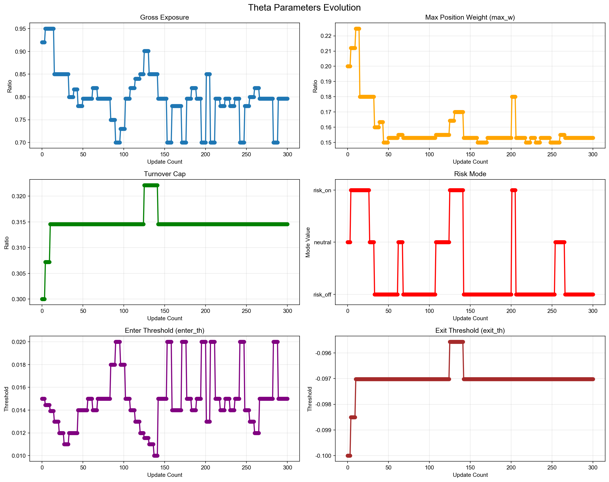
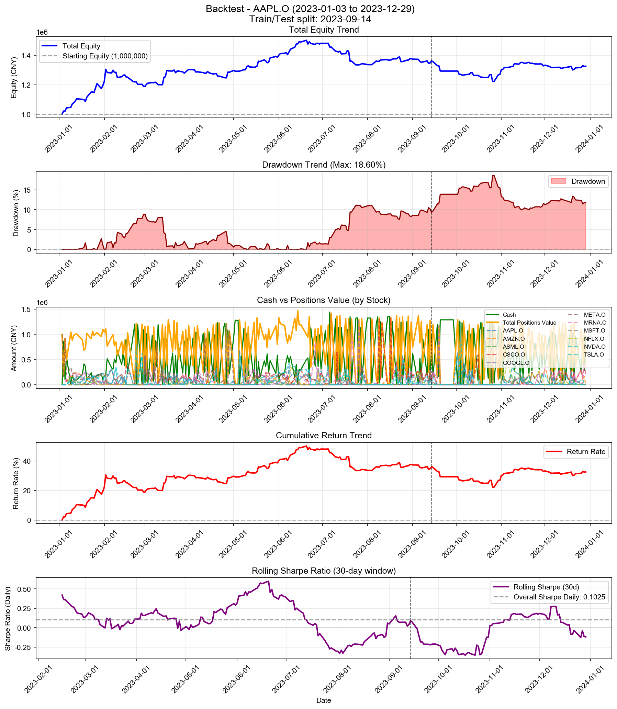

# Backtest

**策略名称:** 层级式多资产交易系统（带 RAG 反思层 + 2-shot Few-Shot Learning）  
**回测期间:** 2023-01-03 至 2023-12-29  
**交易日数:** 250  
**组合股票数:** 20 支  
**初始资金:** 1000000.00 元

---

## 组合整体表现

| 项目 | 数值 |
|------|------|
| 初始资金 | 1000000.00 元 |
| 最终现金 | 952910.99 元 |
| 最终持仓市值 | 373208.16 元 |
| 最终总权益 | 1326119.14 元 |
| 总盈亏 | +326119.14 元 |
| 总收益率 | +32.61% |
| 年化收益率 (CAGR) | +32.91% |

---

## 参数θ追踪

### 初始参数

| 参数 | 数值 |
|------|------|
| 总仓位上限 (gross_exposure) | 0.92 |
| 单票上限 (max_w) | 0.20 |
| 换手上限 (turnover_cap) | 0.30 |
| 风险模式 (risk_mode) | neutral |
| 进场阈值 (enter_th) | 0.015 |
| 出场阈值 (exit_th) | -0.100 |

### 最终参数

| 参数 | 数值 |
|------|------|
| 总仓位上限 (gross_exposure) | 0.80 |
| 单票上限 (max_w) | 0.15 |
| 换手上限 (turnover_cap) | 0.31 |
| 风险模式 (risk_mode) | risk_off |
| 进场阈值 (enter_th) | 0.015 |
| 出场阈值 (exit_th) | -0.097 |

### 参数变化趋势图

---

## 持仓明细

| 股票代码 | 股数 | 成本价 | 现价 | 市值 | 权重 | 盈亏 | 收益率 | 贡献度 |
|----------|------|--------|------|------|------|------|--------|--------|
| AAPL.O | 2 | 559.34 | 556.91 | 1113.82 | 0.08% | -4.87 | -0.44% | -0.00% |
| MSFT.O | 2 | 1746.78 | 1746.87 | 3493.74 | 0.26% | +0.19 | +0.01% | 0.00% |
| GOOGL.O | 2 | 56.38 | 55.82 | 111.64 | 0.01% | -1.11 | -0.98% | -0.00% |
| NVDA.O | 3 | 260.20 | 259.11 | 777.34 | 0.06% | -3.27 | -0.42% | -0.00% |
| META.O | 16 | 3.55 | 3.54 | 56.63 | 0.00% | -0.10 | -0.18% | -0.00% |
| ASML.O | 58 | 95.83 | 96.07 | 5571.86 | 0.42% | +13.95 | +0.25% | 0.00% |
| MRNA.O | 179916 | 0.99 | 0.99 | 178926.46 | 13.49% | +1148.86 | +0.65% | 0.09% |
| NFLX.O | 63 | 66.32 | 68.16 | 4294.28 | 0.32% | +116.16 | +2.78% | 0.01% |
| CSCO.O | 847 | 210.93 | 211.17 | 178862.38 | 13.49% | +203.33 | +0.11% | 0.02% |

### 权重分布

| 股票代码 | 权重 | 市值占比 |
|----------|------|----------|
| AAPL.O | 0.08% | 0.08% |
| MSFT.O | 0.26% | 0.26% |
| GOOGL.O | 0.01% | 0.01% |
| NVDA.O | 0.06% | 0.06% |
| META.O | 0.00% | 0.00% |
| ASML.O | 0.42% | 0.42% |
| MRNA.O | 13.49% | 13.49% |
| NFLX.O | 0.32% | 0.32% |
| CSCO.O | 13.49% | 13.49% |

---

## 交易统计

| 项目 | 数值 |
|------|------|
| 总交易次数 | 1913 次 |
| 买入次数 | 1085 次 |
| 卖出次数 | 828 次 |
| 买入总成本 | 110774582.68 元 |
| 卖出总收入 | 110727493.67 元 |
| 已实现盈亏 | +324646.01 元 |

### 交易质量指标

| 指标 | 数值 |
|------|------|
| 胜率 (Hit Rate) | 57.85% |
| 盈亏比 (Profit Factor) | 1.39 |
| 单笔平均收益 | +392.08 元 |
| 平均持仓周期 | 4.0 天 |

---

## 风险与稳健性

| 指标 | 数值 |
|------|------|
| 最大回撤 (Max Drawdown) | 18.60% |
| 年化波动率 (Volatility) | 18.62% |
| 年化夏普比率 (Sharpe) | 1.6268 |
| 日频夏普比率 (Sharpe Daily) | 0.1025 |
| 年化 Sortino 比率 | 1.7763 |
| 日频 Sortino 比率 | 0.1119 |
| Calmar 比率 (CAGR/MaxDD) | 1.7696 |
### 尾部风险 (Tail Risk)

| 指标 | 数值 |
|------|------|
| VaR 95% | -1.72% |
| VaR 99% | -2.79% |
| CVaR 95% | -2.51% |
| CVaR 99% | -3.74% |
| 极端日跌幅 (5%分位) | -1.75% |
| 极端日跌幅 (1%分位) | -3.63% |

---

## 执行与成本

| 指标 | 数值 |
|------|------|
| 换手率 (Turnover) | 8466.80% |
| 交易频率 (每日) | 7.65 次/日 |
| 交易频率 (每周) | 38.26 次/周 |

---

## 各股票表现分析

| 股票代码 | 初始权重 | 最终权重 | 收益率 | 盈亏 | 交易次数 | 贡献度 |
|----------|----------|----------|--------|------|----------|--------|
| AAPL.O | 760.93% | 0.08% | -0.44% | -4.87 | 150 | -0.00% |
| MSFT.O | 546.63% | 0.26% | +0.01% | +0.19 | 114 | 0.00% |
| GOOGL.O | 1050.28% | 0.01% | -0.98% | -1.11 | 182 | -0.00% |
| NVDA.O | 983.63% | 0.06% | -0.42% | -3.27 | 191 | -0.00% |
| META.O | 1428.98% | 0.00% | -0.18% | -0.10 | 242 | -0.00% |
| ASML.O | 317.54% | 0.42% | +0.25% | +13.95 | 86 | 0.00% |
| MRNA.O | 1022.30% | 13.49% | +0.65% | +1148.86 | 181 | 0.09% |
| NFLX.O | 925.75% | 0.32% | +2.78% | +116.16 | 150 | 0.01% |
| CSCO.O | 1364.47% | 13.49% | +0.11% | +203.33 | 190 | 0.02% |

---

## 策略参数

---

## 交易记录

| 序号 | 日期 | 类型 | 股票代码 | 股数 | 价格 | 成本/收入 | 利润 |
|------|------|------|----------|------|------|-----------|------|
| 1 | 2023-01-03 | 买入 | META.O | 128266 | 1.25 | 159999.01 | - |
| 2 | 2023-01-03 | 买入 | META.O | 673401 | 1.25 | 840000.41 | - |
| 3 | 2023-01-04 | 卖出 | META.O | 673400 | 1.27 | 857709.58 | +17710.42 |
| 4 | 2023-01-05 | 买入 | META.O | 595286 | 1.27 | 755656.05 | - |
| 5 | 2023-01-06 | 买入 | AMZN.O | 374 | 206.59 | 77265.41 | - |
| 6 | 2023-01-06 | 卖出 | META.O | 571725 | 1.30 | 743356.84 | +19838.87 |
| 7 | 2023-01-06 | 买入 | MRNA.O | 69072 | 1.80 | 124571.35 | - |
| 8 | 2023-01-06 | 买入 | CSCO.O | 445 | 197.53 | 87902.85 | - |
| 9 | 2023-01-09 | 买入 | AMZN.O | 99 | 209.66 | 20756.74 | - |
| 10 | 2023-01-09 | 买入 | NVDA.O | 660 | 81.73 | 53944.10 | - |
| 11 | 2023-01-09 | 买入 | TSLA.O | 2579 | 17.97 | 46333.02 | - |
| 12 | 2023-01-09 | 买入 | META.O | 10436 | 1.29 | 13511.49 | - |
| 13 | 2023-01-09 | 买入 | ASML.O | 1195 | 78.08 | 93304.23 | - |
| 14 | 2023-01-09 | 买入 | MRNA.O | 25584 | 1.84 | 47061.77 | - |
| 15 | 2023-01-09 | 卖出 | CSCO.O | 226 | 198.60 | 44883.01 | +240.21 |
| 16 | 2023-01-09 | 买入 | AMZN.O | 296 | 209.66 | 62060.54 | - |
| 17 | 2023-01-09 | 买入 | NVDA.O | 413 | 81.73 | 33755.93 | - |
| 18 | 2023-01-09 | 买入 | TSLA.O | 1614 | 17.97 | 28996.32 | - |
| 19 | 2023-01-09 | 买入 | META.O | 101577 | 1.29 | 131511.74 | - |
| 20 | 2023-01-09 | 买入 | ASML.O | 748 | 78.08 | 58402.98 | - |
| 21 | 2023-01-09 | 买入 | MRNA.O | 5933 | 1.84 | 10913.75 | - |
| 22 | 2023-01-10 | 卖出 | NVDA.O | 336 | 83.20 | 27956.24 | +493.79 |
| 23 | 2023-01-10 | 卖出 | TSLA.O | 3552 | 17.83 | 63323.28 | -490.18 |
| 24 | 2023-01-10 | 卖出 | META.O | 93588 | 1.33 | 124462.68 | +4866.88 |
| 25 | 2023-01-10 | 卖出 | ASML.O | 872 | 79.59 | 69406.28 | +1321.52 |
| 26 | 2023-01-10 | 买入 | MRNA.O | 18152 | 1.90 | 34425.27 | - |
| 27 | 2023-01-10 | 买入 | NFLX.O | 1610 | 45.86 | 73827.52 | - |
| 28 | 2023-01-10 | 卖出 | CSCO.O | 44 | 199.54 | 8779.66 | +88.14 |
| 29 | 2023-01-11 | 买入 | MSFT.O | 33 | 1085.63 | 35825.77 | - |
| 30 | 2023-01-11 | 买入 | GOOGL.O | 3355 | 36.57 | 122701.11 | - |
| 31 | 2023-01-11 | 买入 | AMZN.O | 118 | 228.22 | 26929.49 | - |
| 32 | 2023-01-11 | 卖出 | NVDA.O | 301 | 83.68 | 25188.96 | +587.18 |
| 33 | 2023-01-11 | 买入 | TSLA.O | 1162 | 18.48 | 21477.25 | - |
| 34 | 2023-01-11 | 卖出 | META.O | 8611 | 1.33 | 11443.16 | +439.19 |
| 35 | 2023-01-11 | 卖出 | ASML.O | 328 | 81.01 | 26572.30 | +962.44 |
| 36 | 2023-01-11 | 卖出 | MRNA.O | 36613 | 1.87 | 68334.50 | +1432.58 |
| 37 | 2023-01-11 | 卖出 | NFLX.O | 650 | 45.82 | 29780.66 | -25.48 |
| 38 | 2023-01-11 | 卖出 | CSCO.O | 72 | 201.17 | 14484.45 | +261.96 |
| 39 | 2023-01-11 | 买入 | GOOGL.O | 281 | 36.57 | 10276.90 | - |
| 40 | 2023-01-11 | 买入 | AMZN.O | 75 | 228.22 | 17116.20 | - |
| 41 | 2023-01-11 | 买入 | META.O | 13578 | 1.33 | 18043.80 | - |
| 42 | 2023-01-11 | 买入 | MRNA.O | 6899 | 1.87 | 12876.29 | - |
| 43 | 2023-01-12 | 买入 | MSFT.O | 28 | 1098.25 | 30750.89 | - |
| 44 | 2023-01-12 | 卖出 | GOOGL.O | 1165 | 36.42 | 42425.53 | -181.56 |
| 45 | 2023-01-12 | 买入 | AMZN.O | 47 | 228.65 | 10746.46 | - |
| 46 | 2023-01-12 | 买入 | NVDA.O | 1125 | 86.35 | 97145.46 | - |
| 47 | 2023-01-12 | 卖出 | META.O | 6375 | 1.37 | 8715.26 | +543.47 |
| 48 | 2023-01-12 | 卖出 | ASML.O | 220 | 82.00 | 18040.74 | +863.39 |
| 49 | 2023-01-12 | 卖出 | NFLX.O | 960 | 46.22 | 44369.47 | +348.10 |
| 50 | 2023-01-12 | 卖出 | CSCO.O | 103 | 200.31 | 20632.38 | +286.33 |
| 51 | 2023-01-13 | 卖出 | MSFT.O | 25 | 1101.56 | 27539.03 | +253.52 |
| 52 | 2023-01-13 | 买入 | GOOGL.O | 2383 | 36.81 | 87723.90 | - |
| 53 | 2023-01-13 | 买入 | AMZN.O | 44 | 235.49 | 10361.47 | - |
| 54 | 2023-01-13 | 卖出 | TSLA.O | 1803 | 18.36 | 33103.08 | +109.95 |
| 55 | 2023-01-13 | 卖出 | META.O | 69073 | 1.37 | 94616.20 | +6075.03 |
| 56 | 2023-01-13 | 买入 | ASML.O | 186 | 82.90 | 15419.27 | - |
| 57 | 2023-01-13 | 买入 | MRNA.O | 21344 | 1.92 | 40980.48 | - |
| 58 | 2023-01-17 | 卖出 | MSFT.O | 12 | 1106.72 | 13280.62 | +183.57 |
| 59 | 2023-01-17 | 卖出 | GOOGL.O | 1522 | 36.48 | 55523.62 | -319.04 |
| 60 | 2023-01-17 | 卖出 | AMZN.O | 320 | 230.52 | 73766.40 | +5318.52 |
| 61 | 2023-01-17 | 买入 | NVDA.O | 309 | 92.58 | 28607.34 | - |
| 62 | 2023-01-17 | 买入 | TSLA.O | 3987 | 19.72 | 78637.59 | - |
| 63 | 2023-01-17 | 卖出 | META.O | 31108 | 1.35 | 42107.79 | +2232.03 |
| 64 | 2023-01-17 | 卖出 | ASML.O | 225 | 82.71 | 18609.94 | +757.66 |
| 65 | 2023-01-17 | 卖出 | MRNA.O | 11898 | 1.91 | 22688.30 | +704.95 |
| 66 | 2023-01-18 | 卖出 | MSFT.O | 10 | 1085.81 | 10858.14 | -56.07 |
| 67 | 2023-01-18 | 卖出 | GOOGL.O | 1516 | 36.41 | 55201.75 | -420.77 |
| 68 | 2023-01-18 | 卖出 | AMZN.O | 332 | 229.10 | 76062.53 | +5047.85 |
| 69 | 2023-01-18 | 卖出 | NVDA.O | 833 | 90.88 | 75703.58 | +3812.30 |
| 70 | 2023-01-18 | 卖出 | TSLA.O | 1772 | 19.32 | 34229.72 | -720.32 |
| 71 | 2023-01-18 | 卖出 | META.O | 30665 | 1.33 | 40790.58 | +1482.68 |
| 72 | 2023-01-18 | 卖出 | ASML.O | 218 | 81.97 | 17869.33 | +572.46 |
| 73 | 2023-01-18 | 买入 | MRNA.O | 10376 | 1.97 | 20442.80 | - |
| 74 | 2023-01-18 | 买入 | GOOGL.O | 308 | 36.41 | 11215.13 | - |
| 75 | 2023-01-18 | 买入 | AMZN.O | 68 | 229.10 | 15579.07 | - |
| 76 | 2023-01-18 | 买入 | NVDA.O | 176 | 90.88 | 15994.99 | - |
| 77 | 2023-01-18 | 买入 | META.O | 6466 | 1.33 | 8601.07 | - |
| 78 | 2023-01-18 | 买入 | MRNA.O | 18524 | 1.97 | 36495.98 | - |
| 79 | 2023-01-19 | 买入 | GOOGL.O | 1969 | 37.18 | 73215.33 | - |
| 80 | 2023-01-19 | 卖出 | AMZN.O | 261 | 224.83 | 58681.15 | +2277.98 |
| 81 | 2023-01-19 | 卖出 | NVDA.O | 667 | 87.68 | 58482.51 | +474.79 |
| 82 | 2023-01-19 | 卖出 | TSLA.O | 1076 | 19.08 | 20525.24 | -697.25 |
| 83 | 2023-01-19 | 卖出 | META.O | 25617 | 1.36 | 34877.55 | +1860.30 |
| 84 | 2023-01-19 | 卖出 | ASML.O | 126 | 79.20 | 9979.17 | -18.10 |
| 85 | 2023-01-19 | 卖出 | MRNA.O | 70184 | 1.90 | 133616.30 | +1989.31 |
| 86 | 2023-01-19 | 买入 | GOOGL.O | 2965 | 37.18 | 110250.61 | - |
| 87 | 2023-01-19 | 买入 | AMZN.O | 150 | 224.83 | 33724.80 | - |
| 88 | 2023-01-19 | 买入 | NVDA.O | 394 | 87.68 | 34545.89 | - |
| 89 | 2023-01-19 | 买入 | TSLA.O | 824 | 19.08 | 15718.21 | - |
| 90 | 2023-01-19 | 买入 | META.O | 13652 | 1.36 | 18587.20 | - |
| 91 | 2023-01-19 | 买入 | MRNA.O | 41423 | 1.90 | 78861.11 | - |
| 92 | 2023-01-20 | 卖出 | MSFT.O | 11 | 1106.12 | 12167.32 | +161.69 |
| 93 | 2023-01-20 | 卖出 | GOOGL.O | 2317 | 39.17 | 90757.11 | +4974.05 |
| 94 | 2023-01-20 | 卖出 | AMZN.O | 97 | 233.40 | 22639.80 | +1322.98 |
| 95 | 2023-01-20 | 买入 | TSLA.O | 2354 | 20.01 | 47110.60 | - |
| 96 | 2023-01-20 | 买入 | META.O | 38545 | 1.39 | 53720.17 | - |
| 97 | 2023-01-20 | 卖出 | MRNA.O | 35803 | 1.94 | 69450.66 | +1877.43 |
| 98 | 2023-01-20 | 买入 | NFLX.O | 2337 | 47.95 | 112059.15 | - |
| 99 | 2023-01-20 | 买入 | GOOGL.O | 1583 | 39.17 | 62006.26 | - |
| 100 | 2023-01-20 | 买入 | AMZN.O | 86 | 233.40 | 20072.40 | - |
| 101 | 2023-01-20 | 买入 | NVDA.O | 309 | 93.30 | 28828.73 | - |
| 102 | 2023-01-20 | 买入 | TSLA.O | 1442 | 20.01 | 28858.75 | - |
| 103 | 2023-01-20 | 买入 | META.O | 23727 | 1.39 | 33068.32 | - |
| 104 | 2023-01-20 | 买入 | MRNA.O | 20976 | 1.94 | 40689.24 | - |
| 105 | 2023-01-20 | 买入 | NFLX.O | 780 | 47.95 | 37401.00 | - |
| 106 | 2023-01-23 | 买入 | AAPL.O | 221 | 405.90 | 89704.67 | - |
| 107 | 2023-01-23 | 卖出 | GOOGL.O | 2973 | 39.88 | 118555.55 | +6887.57 |
| 108 | 2023-01-23 | 卖出 | AMZN.O | 102 | 234.05 | 23872.90 | +1112.48 |
| 109 | 2023-01-23 | 卖出 | NVDA.O | 178 | 100.38 | 17867.32 | +2068.33 |
| 110 | 2023-01-23 | 买入 | META.O | 8990 | 1.43 | 12879.97 | - |
| 111 | 2023-01-23 | 买入 | ASML.O | 482 | 84.95 | 40947.19 | - |
| 112 | 2023-01-23 | 卖出 | MRNA.O | 40253 | 1.97 | 79274.26 | +2773.83 |
| 113 | 2023-01-23 | 卖出 | NFLX.O | 1115 | 50.04 | 55793.26 | +2329.01 |
| 114 | 2023-01-23 | 买入 | CSCO.O | 53 | 194.18 | 10291.66 | - |
| 115 | 2023-01-24 | 买入 | AAPL.O | 176 | 409.99 | 72157.91 | - |
| 116 | 2023-01-24 | 买入 | MSFT.O | 46 | 1114.50 | 51267.02 | - |
| 117 | 2023-01-24 | 卖出 | GOOGL.O | 2331 | 39.04 | 91007.42 | +3453.41 |
| 118 | 2023-01-24 | 买入 | NVDA.O | 274 | 100.75 | 27606.81 | - |
| 119 | 2023-01-24 | 卖出 | META.O | 16616 | 1.43 | 23784.14 | +957.04 |
| 120 | 2023-01-24 | 卖出 | ASML.O | 120 | 84.20 | 10103.54 | +60.72 |
| 121 | 2023-01-24 | 买入 | NFLX.O | 197 | 50.94 | 10034.43 | - |
| 122 | 2023-01-24 | 买入 | CSCO.O | 102 | 195.45 | 19935.86 | - |
| 123 | 2023-01-24 | 买入 | AAPL.O | 49 | 409.99 | 20089.42 | - |
| 124 | 2023-01-24 | 买入 | NVDA.O | 168 | 100.75 | 16926.80 | - |
| 125 | 2023-01-24 | 买入 | TSLA.O | 773 | 21.58 | 16684.05 | - |
| 126 | 2023-01-24 | 买入 | META.O | 10932 | 1.43 | 15648.06 | - |
| 127 | 2023-01-24 | 买入 | MRNA.O | 5738 | 1.97 | 11290.09 | - |
| 128 | 2023-01-24 | 买入 | NFLX.O | 275 | 50.94 | 14007.45 | - |
| 129 | 2023-01-25 | 卖出 | AAPL.O | 79 | 408.06 | 32236.81 | +7.64 |
| 130 | 2023-01-25 | 卖出 | MSFT.O | 19 | 1107.92 | 21050.40 | -98.26 |
| 131 | 2023-01-25 | 卖出 | GOOGL.O | 974 | 38.05 | 37061.85 | +477.72 |
| 132 | 2023-01-25 | 买入 | AMZN.O | 164 | 233.23 | 38250.05 | - |
| 133 | 2023-01-25 | 买入 | NVDA.O | 101 | 101.06 | 10206.87 | - |
| 134 | 2023-01-25 | 买入 | TSLA.O | 1283 | 21.66 | 27795.55 | - |
| 135 | 2023-01-25 | 卖出 | META.O | 43544 | 1.42 | 61614.76 | +1514.36 |
| 136 | 2023-01-25 | 买入 | ASML.O | 647 | 85.64 | 55411.56 | - |
| 137 | 2023-01-25 | 卖出 | MRNA.O | 22975 | 1.93 | 44357.83 | +514.51 |
| 138 | 2023-01-25 | 卖出 | NFLX.O | 705 | 51.51 | 36317.65 | +2111.25 |
| 139 | 2023-01-25 | 买入 | CSCO.O | 80 | 196.14 | 15691.57 | - |
| 140 | 2023-01-26 | 买入 | MSFT.O | 61 | 1141.94 | 69658.57 | - |
| 141 | 2023-01-26 | 买入 | GOOGL.O | 899 | 38.97 | 35034.29 | - |
| 142 | 2023-01-26 | 卖出 | NVDA.O | 209 | 103.56 | 21644.72 | +2246.74 |
| 143 | 2023-01-26 | 卖出 | TSLA.O | 1960 | 24.04 | 47119.38 | +7334.46 |
| 144 | 2023-01-26 | 买入 | META.O | 52650 | 1.47 | 77553.45 | - |
| 145 | 2023-01-26 | 卖出 | ASML.O | 593 | 85.94 | 50963.40 | +682.77 |
| 146 | 2023-01-26 | 卖出 | MRNA.O | 5066 | 1.93 | 9789.54 | +122.06 |
| 147 | 2023-01-26 | 卖出 | NFLX.O | 920 | 51.08 | 46995.26 | +2357.11 |
| 148 | 2023-01-27 | 买入 | AAPL.O | 104 | 419.77 | 43655.89 | - |
| 149 | 2023-01-27 | 卖出 | MSFT.O | 24 | 1142.68 | 27424.33 | +246.00 |
| 150 | 2023-01-27 | 买入 | GOOGL.O | 613 | 39.71 | 24341.97 | - |
| 151 | 2023-01-27 | 买入 | AMZN.O | 162 | 245.38 | 39750.91 | - |
| 152 | 2023-01-27 | 卖出 | TSLA.O | 1438 | 26.69 | 38373.03 | +9183.89 |
| 153 | 2023-01-27 | 买入 | META.O | 23321 | 1.52 | 35387.29 | - |
| 154 | 2023-01-27 | 卖出 | ASML.O | 556 | 83.87 | 46630.02 | -513.37 |
| 155 | 2023-01-27 | 卖出 | MRNA.O | 21229 | 1.89 | 40197.11 | -314.31 |
| 156 | 2023-01-27 | 卖出 | NFLX.O | 413 | 50.51 | 20859.72 | +821.08 |
| 157 | 2023-01-27 | 买入 | CSCO.O | 110 | 198.31 | 21814.24 | - |
| 158 | 2023-01-30 | 买入 | AAPL.O | 30 | 411.34 | 12340.20 | - |
| 159 | 2023-01-30 | 卖出 | MSFT.O | 48 | 1117.59 | 53644.10 | -712.57 |
| 160 | 2023-01-30 | 卖出 | GOOGL.O | 1132 | 38.74 | 43852.00 | -544.53 |
| 161 | 2023-01-30 | 买入 | AMZN.O | 220 | 241.32 | 53090.40 | - |
| 162 | 2023-01-30 | 卖出 | NVDA.O | 1023 | 100.22 | 102521.05 | +7573.03 |
| 163 | 2023-01-30 | 买入 | TSLA.O | 2980 | 25.00 | 74497.02 | - |
| 164 | 2023-01-30 | 卖出 | META.O | 9547 | 1.47 | 14039.82 | +271.47 |
| 165 | 2023-01-30 | 卖出 | NFLX.O | 317 | 49.44 | 15671.02 | +290.27 |
| 166 | 2023-01-30 | 买入 | AAPL.O | 31 | 411.34 | 12751.54 | - |
| 167 | 2023-01-30 | 买入 | AMZN.O | 50 | 241.32 | 12066.00 | - |
| 168 | 2023-01-30 | 买入 | TSLA.O | 468 | 25.00 | 11699.53 | - |
| 169 | 2023-01-30 | 买入 | META.O | 7655 | 1.47 | 11257.44 | - |
| 170 | 2023-01-31 | 卖出 | AAPL.O | 34 | 415.05 | 14111.73 | +149.33 |
| 171 | 2023-01-31 | 卖出 | MSFT.O | 19 | 1141.07 | 21680.31 | +164.13 |
| 172 | 2023-01-31 | 买入 | GOOGL.O | 1895 | 39.50 | 74848.29 | - |
| 173 | 2023-01-31 | 买入 | NVDA.O | 174 | 102.18 | 17778.85 | - |
| 174 | 2023-01-31 | 卖出 | META.O | 7002 | 1.49 | 10430.88 | +320.99 |
| 175 | 2023-01-31 | 买入 | AAPL.O | 47 | 415.05 | 19507.39 | - |
| 176 | 2023-01-31 | 买入 | AMZN.O | 80 | 247.51 | 19800.96 | - |
| 177 | 2023-01-31 | 买入 | TSLA.O | 763 | 25.98 | 19825.03 | - |
| 178 | 2023-01-31 | 买入 | META.O | 11697 | 1.49 | 17425.02 | - |
| 179 | 2023-02-01 | 卖出 | AAPL.O | 62 | 418.33 | 25936.46 | +452.13 |
| 180 | 2023-02-01 | 买入 | MSFT.O | 40 | 1163.82 | 46552.63 | - |
| 181 | 2023-02-01 | 卖出 | GOOGL.O | 1948 | 40.13 | 78179.40 | +1337.21 |
| 182 | 2023-02-01 | 卖出 | AMZN.O | 200 | 252.36 | 50472.00 | +3212.95 |
| 183 | 2023-02-01 | 买入 | NVDA.O | 1051 | 109.53 | 115116.67 | - |
| 184 | 2023-02-01 | 卖出 | TSLA.O | 1507 | 27.21 | 41007.73 | +6829.55 |
| 185 | 2023-02-01 | 卖出 | META.O | 8924 | 1.53 | 13664.43 | +743.55 |
| 186 | 2023-02-01 | 买入 | ASML.O | 259 | 85.27 | 22084.11 | - |
| 187 | 2023-02-01 | 卖出 | CSCO.O | 290 | 198.56 | 57581.39 | +646.13 |
| 188 | 2023-02-02 | 买入 | MSFT.O | 49 | 1218.38 | 59700.64 | - |
| 189 | 2023-02-02 | 买入 | GOOGL.O | 2006 | 43.05 | 86367.00 | - |
| 190 | 2023-02-02 | 卖出 | NVDA.O | 443 | 113.54 | 50296.78 | +3887.85 |
| 191 | 2023-02-02 | 卖出 | TSLA.O | 2257 | 28.24 | 63738.81 | +12550.91 |
| 192 | 2023-02-02 | 卖出 | META.O | 52715 | 1.89 | 99510.11 | +23185.11 |
| 193 | 2023-02-02 | 买入 | CSCO.O | 257 | 201.62 | 51817.00 | - |
| 194 | 2023-02-03 | 卖出 | AAPL.O | 89 | 444.42 | 39553.37 | +2971.03 |
| 195 | 2023-02-03 | 卖出 | MSFT.O | 53 | 1189.60 | 63048.88 | -225.54 |
| 196 | 2023-02-03 | 卖出 | GOOGL.O | 1239 | 41.87 | 51878.77 | -764.74 |
| 197 | 2023-02-03 | 卖出 | AMZN.O | 404 | 248.14 | 100246.94 | +4783.66 |
| 198 | 2023-02-03 | 卖出 | NVDA.O | 630 | 110.35 | 69521.57 | +3522.43 |
| 199 | 2023-02-03 | 买入 | META.O | 6611 | 1.87 | 12331.50 | - |
| 200 | 2023-02-03 | 卖出 | ASML.O | 175 | 85.40 | 14945.67 | +23.97 |
| 201 | 2023-02-03 | 卖出 | CSCO.O | 188 | 198.80 | 37374.74 | -354.85 |
| 202 | 2023-02-03 | 买入 | AAPL.O | 34 | 444.42 | 15110.28 | - |
| 203 | 2023-02-03 | 买入 | TSLA.O | 457 | 28.50 | 13023.13 | - |
| 204 | 2023-02-03 | 买入 | META.O | 6949 | 1.87 | 12961.97 | - |
| 205 | 2023-02-06 | 卖出 | MSFT.O | 31 | 1182.33 | 36652.11 | -357.45 |
| 206 | 2023-02-06 | 卖出 | GOOGL.O | 985 | 41.12 | 40503.41 | -1347.97 |
| 207 | 2023-02-06 | 卖出 | AMZN.O | 274 | 245.23 | 67193.57 | +2448.67 |
| 208 | 2023-02-06 | 卖出 | NVDA.O | 462 | 110.29 | 50955.91 | +2556.54 |
| 209 | 2023-02-06 | 买入 | TSLA.O | 604 | 29.21 | 17645.26 | - |
| 210 | 2023-02-06 | 买入 | META.O | 7751 | 1.86 | 14421.51 | - |
| 211 | 2023-02-06 | 卖出 | CSCO.O | 107 | 194.47 | 20808.13 | -665.63 |
| 212 | 2023-02-06 | 买入 | AAPL.O | 281 | 436.45 | 122643.00 | - |
| 213 | 2023-02-06 | 买入 | TSLA.O | 4123 | 29.21 | 120449.32 | - |
| 214 | 2023-02-06 | 买入 | META.O | 64702 | 1.86 | 120384.54 | - |
| 215 | 2023-02-07 | 卖出 | AAPL.O | 312 | 444.85 | 138793.62 | +6907.80 |
| 216 | 2023-02-07 | 买入 | MSFT.O | 54 | 1232.01 | 66528.54 | - |
| 217 | 2023-02-07 | 买入 | GOOGL.O | 1544 | 43.01 | 66414.20 | - |
| 218 | 2023-02-07 | 买入 | NVDA.O | 722 | 115.96 | 83725.60 | - |
| 219 | 2023-02-07 | 卖出 | TSLA.O | 4103 | 29.52 | 121126.71 | +14373.84 |
| 220 | 2023-02-07 | 卖出 | META.O | 69712 | 1.92 | 133582.13 | +16924.93 |
| 221 | 2023-02-07 | 买入 | AAPL.O | 107 | 444.85 | 47599.09 | - |
| 222 | 2023-02-07 | 买入 | MSFT.O | 16 | 1232.01 | 19712.16 | - |
| 223 | 2023-02-07 | 买入 | GOOGL.O | 461 | 43.01 | 19829.63 | - |
| 224 | 2023-02-07 | 买入 | NVDA.O | 215 | 115.96 | 24932.14 | - |
| 225 | 2023-02-07 | 买入 | TSLA.O | 1612 | 29.52 | 47588.66 | - |
| 226 | 2023-02-07 | 买入 | META.O | 23866 | 1.92 | 45732.03 | - |
| 227 | 2023-02-08 | 卖出 | AAPL.O | 413 | 437.00 | 180480.37 | +3959.47 |
| 228 | 2023-02-08 | 卖出 | GOOGL.O | 1746 | 39.71 | 69332.92 | -5704.32 |
| 229 | 2023-02-08 | 买入 | NVDA.O | 307 | 116.13 | 35652.15 | - |
| 230 | 2023-02-08 | 卖出 | TSLA.O | 1870 | 30.19 | 56461.85 | +6410.29 |
| 231 | 2023-02-08 | 卖出 | META.O | 56689 | 1.83 | 103984.63 | +6183.25 |
| 232 | 2023-02-08 | 买入 | AAPL.O | 28 | 437.00 | 12235.96 | - |
| 233 | 2023-02-08 | 买入 | MSFT.O | 23 | 1228.19 | 28248.33 | - |
| 234 | 2023-02-08 | 买入 | NVDA.O | 411 | 116.13 | 47729.75 | - |
| 235 | 2023-02-08 | 买入 | TSLA.O | 1775 | 30.19 | 53593.46 | - |
| 236 | 2023-02-08 | 买入 | META.O | 17218 | 1.83 | 31582.98 | - |
| 237 | 2023-02-09 | 卖出 | AAPL.O | 119 | 433.98 | 51643.40 | +513.01 |
| 238 | 2023-02-09 | 卖出 | MSFT.O | 70 | 1213.87 | 84970.75 | -1070.90 |
| 239 | 2023-02-09 | 卖出 | GOOGL.O | 414 | 37.97 | 15718.45 | -2073.89 |
| 240 | 2023-02-09 | 卖出 | NVDA.O | 143 | 116.82 | 16705.42 | +179.49 |
| 241 | 2023-02-09 | 卖出 | TSLA.O | 1514 | 31.10 | 47082.37 | +5324.81 |
| 242 | 2023-02-09 | 卖出 | META.O | 50327 | 1.78 | 89541.80 | +1410.22 |
| 243 | 2023-02-09 | 买入 | MSFT.O | 23 | 1213.87 | 27918.96 | - |
| 244 | 2023-02-09 | 买入 | NVDA.O | 1361 | 116.82 | 158993.57 | - |
| 245 | 2023-02-09 | 买入 | TSLA.O | 5113 | 31.10 | 159004.07 | - |
| 246 | 2023-02-09 | 买入 | META.O | 18947 | 1.78 | 33710.50 | - |
| 247 | 2023-02-10 | 卖出 | AMZN.O | 43 | 234.26 | 10073.35 | -87.34 |
| 248 | 2023-02-10 | 卖出 | NVDA.O | 2661 | 111.21 | 295942.17 | -13122.40 |
| 249 | 2023-02-10 | 卖出 | TSLA.O | 7797 | 29.53 | 230272.70 | +2547.87 |
| 250 | 2023-02-10 | 卖出 | META.O | 37149 | 1.74 | 64694.98 | -840.79 |
| 251 | 2023-02-10 | 买入 | CSCO.O | 318 | 193.20 | 61437.97 | - |
| 252 | 2023-02-10 | 买入 | MSFT.O | 66 | 1211.47 | 79957.25 | - |
| 253 | 2023-02-10 | 买入 | NVDA.O | 325 | 111.21 | 36144.76 | - |
| 254 | 2023-02-10 | 买入 | TSLA.O | 3750 | 29.53 | 110750.62 | - |
| 255 | 2023-02-10 | 买入 | CSCO.O | 385 | 193.20 | 74382.45 | - |
| 256 | 2023-02-13 | 买入 | AAPL.O | 132 | 443.23 | 58505.81 | - |
| 257 | 2023-02-13 | 卖出 | MSFT.O | 58 | 1249.32 | 72460.76 | +1922.41 |
| 258 | 2023-02-13 | 卖出 | NVDA.O | 551 | 113.95 | 62786.40 | +240.00 |
| 259 | 2023-02-13 | 卖出 | TSLA.O | 5616 | 29.20 | 163964.74 | -1041.39 |
| 260 | 2023-02-13 | 买入 | META.O | 22581 | 1.79 | 40517.09 | - |
| 261 | 2023-02-13 | 卖出 | CSCO.O | 350 | 195.65 | 68478.90 | +796.61 |
| 262 | 2023-02-13 | 买入 | AAPL.O | 242 | 443.23 | 107260.65 | - |
| 263 | 2023-02-13 | 买入 | MSFT.O | 107 | 1249.32 | 133677.60 | - |
| 264 | 2023-02-13 | 买入 | NVDA.O | 105 | 113.95 | 11964.74 | - |
| 265 | 2023-02-13 | 买入 | TSLA.O | 2558 | 29.20 | 74683.37 | - |
| 266 | 2023-02-13 | 买入 | META.O | 48385 | 1.79 | 86817.21 | - |
| 267 | 2023-02-13 | 买入 | CSCO.O | 676 | 195.65 | 132262.10 | - |
| 268 | 2023-02-14 | 卖出 | AAPL.O | 339 | 441.35 | 149618.75 | -634.81 |
| 269 | 2023-02-14 | 卖出 | MSFT.O | 127 | 1253.24 | 159161.14 | +1993.18 |
| 270 | 2023-02-14 | 买入 | NVDA.O | 234 | 120.14 | 28112.04 | - |
| 271 | 2023-02-14 | 卖出 | TSLA.O | 2151 | 31.39 | 67514.51 | +4572.96 |
| 272 | 2023-02-14 | 卖出 | META.O | 51609 | 1.79 | 92627.83 | +105.65 |
| 273 | 2023-02-14 | 买入 | MRNA.O | 26178 | 1.76 | 45973.80 | - |
| 274 | 2023-02-14 | 卖出 | CSCO.O | 713 | 195.00 | 139034.94 | +107.67 |
| 275 | 2023-02-14 | 买入 | AAPL.O | 29 | 441.35 | 12799.24 | - |
| 276 | 2023-02-14 | 买入 | MSFT.O | 32 | 1253.24 | 40103.59 | - |
| 277 | 2023-02-14 | 买入 | NVDA.O | 332 | 120.14 | 39885.46 | - |
| 278 | 2023-02-14 | 买入 | TSLA.O | 1513 | 31.39 | 47489.29 | - |
| 279 | 2023-02-14 | 买入 | META.O | 19443 | 1.79 | 34896.30 | - |
| 280 | 2023-02-14 | 买入 | MRNA.O | 21946 | 1.76 | 38541.57 | - |
| 281 | 2023-02-14 | 买入 | CSCO.O | 278 | 195.00 | 54209.98 | - |
| 282 | 2023-02-15 | 买入 | AAPL.O | 61 | 447.49 | 27296.86 | - |
| 283 | 2023-02-15 | 卖出 | MSFT.O | 54 | 1243.22 | 67133.89 | -75.39 |
| 284 | 2023-02-15 | 卖出 | NVDA.O | 407 | 119.05 | 48455.11 | +136.52 |
| 285 | 2023-02-15 | 卖出 | TSLA.O | 1282 | 32.14 | 41198.35 | +2442.25 |
| 286 | 2023-02-15 | 卖出 | META.O | 23911 | 1.77 | 42360.73 | -528.11 |
| 287 | 2023-02-15 | 卖出 | MRNA.O | 31817 | 1.77 | 56405.18 | +528.16 |
| 288 | 2023-02-15 | 买入 | NFLX.O | 553 | 50.60 | 27981.14 | - |
| 289 | 2023-02-15 | 卖出 | CSCO.O | 271 | 198.07 | 53675.87 | +853.20 |
| 290 | 2023-02-15 | 买入 | AAPL.O | 190 | 447.49 | 85023.01 | - |
| 291 | 2023-02-15 | 买入 | MSFT.O | 24 | 1243.22 | 29837.29 | - |
| 292 | 2023-02-15 | 买入 | AMZN.O | 52 | 242.78 | 12624.77 | - |
| 293 | 2023-02-15 | 买入 | NVDA.O | 488 | 119.05 | 58098.51 | - |
| 294 | 2023-02-15 | 买入 | TSLA.O | 3094 | 32.14 | 99428.78 | - |
| 295 | 2023-02-15 | 买入 | META.O | 28465 | 1.77 | 50428.59 | - |
| 296 | 2023-02-15 | 买入 | MRNA.O | 24788 | 1.77 | 43944.17 | - |
| 297 | 2023-02-15 | 买入 | NFLX.O | 1022 | 50.60 | 51711.97 | - |
| 298 | 2023-02-15 | 买入 | CSCO.O | 516 | 198.07 | 102202.03 | - |
| 299 | 2023-02-16 | 卖出 | AAPL.O | 311 | 442.82 | 137717.80 | -1128.42 |
| 300 | 2023-02-16 | 卖出 | MSFT.O | 40 | 1210.12 | 48404.90 | -1347.07 |
| 301 | 2023-02-16 | 卖出 | AMZN.O | 51 | 235.56 | 12013.56 | -368.42 |
| 302 | 2023-02-16 | 卖出 | NVDA.O | 801 | 115.07 | 92170.36 | -3085.35 |
| 303 | 2023-02-16 | 卖出 | TSLA.O | 5075 | 30.31 | 153802.95 | -5450.19 |
| 304 | 2023-02-16 | 卖出 | META.O | 46704 | 1.72 | 80536.38 | -2613.74 |
| 305 | 2023-02-16 | 卖出 | MRNA.O | 40671 | 1.72 | 70080.20 | -1753.45 |
| 306 | 2023-02-16 | 卖出 | NFLX.O | 1676 | 49.10 | 82290.59 | -2268.21 |
| 307 | 2023-02-16 | 卖出 | CSCO.O | 391 | 208.45 | 81503.79 | +4548.95 |
| 308 | 2023-02-16 | 买入 | CSCO.O | 1147 | 208.45 | 239091.68 | - |
| 309 | 2023-02-17 | 买入 | TSLA.O | 2942 | 31.25 | 91927.20 | - |
| 310 | 2023-02-17 | 买入 | META.O | 30128 | 1.73 | 52085.29 | - |
| 311 | 2023-02-17 | 卖出 | CSCO.O | 1141 | 207.55 | 236814.80 | +2803.02 |
| 312 | 2023-02-17 | 买入 | TSLA.O | 9520 | 31.25 | 297466.68 | - |
| 313 | 2023-02-17 | 买入 | META.O | 97234 | 1.73 | 168098.14 | - |
| 314 | 2023-02-17 | 买入 | CSCO.O | 1494 | 207.55 | 310080.03 | - |
| 315 | 2023-02-21 | 卖出 | TSLA.O | 12517 | 29.61 | 370572.04 | -20547.74 |
| 316 | 2023-02-21 | 卖出 | META.O | 69905 | 1.72 | 120292.52 | -572.94 |
| 317 | 2023-02-21 | 卖出 | CSCO.O | 1965 | 203.14 | 399160.53 | -7518.58 |
| 318 | 2023-02-21 | 买入 | META.O | 56159 | 1.72 | 96638.41 | - |
| 319 | 2023-02-22 | 卖出 | META.O | 114102 | 1.71 | 195251.34 | -1570.28 |
| 320 | 2023-02-23 | 买入 | NVDA.O | 796 | 123.76 | 98513.97 | - |
| 321 | 2023-02-23 | 买入 | META.O | 31722 | 1.72 | 54574.53 | - |
| 322 | 2023-02-23 | 买入 | NVDA.O | 5666 | 123.76 | 701231.35 | - |
| 323 | 2023-02-23 | 买入 | META.O | 205201 | 1.72 | 353027.80 | - |
| 324 | 2023-02-24 | 卖出 | NVDA.O | 6471 | 121.78 | 788066.54 | -12749.07 |
| 325 | 2023-02-24 | 卖出 | META.O | 236923 | 1.70 | 403693.10 | -3909.23 |
| 326 | 2023-02-27 | 买入 | NVDA.O | 734 | 122.91 | 90215.05 | - |
| 327 | 2023-02-27 | 买入 | TSLA.O | 2896 | 31.14 | 90194.47 | - |
| 328 | 2023-02-27 | 买入 | NVDA.O | 4358 | 122.91 | 535636.50 | - |
| 329 | 2023-02-27 | 买入 | TSLA.O | 15274 | 31.14 | 475701.09 | - |
| 330 | 2023-02-28 | 卖出 | NVDA.O | 5092 | 121.42 | 618261.76 | -7589.79 |
| 331 | 2023-02-28 | 卖出 | TSLA.O | 18170 | 30.86 | 560662.60 | -5232.96 |
| 332 | 2023-02-28 | 买入 | META.O | 51015 | 1.75 | 89245.64 | - |
| 333 | 2023-03-01 | 买入 | GOOGL.O | 2469 | 36.11 | 89153.27 | - |
| 334 | 2023-03-01 | 买入 | GOOGL.O | 13442 | 36.11 | 485377.96 | - |
| 335 | 2023-03-01 | 买入 | META.O | 279894 | 1.73 | 485392.17 | - |
| 336 | 2023-03-02 | 卖出 | GOOGL.O | 13456 | 36.76 | 494702.09 | +8818.60 |
| 337 | 2023-03-02 | 卖出 | META.O | 279200 | 1.75 | 487287.76 | +2444.86 |
| 338 | 2023-03-03 | 买入 | AAPL.O | 106 | 435.10 | 46120.78 | - |
| 339 | 2023-03-03 | 卖出 | GOOGL.O | 449 | 37.42 | 16803.28 | +590.31 |
| 340 | 2023-03-03 | 买入 | AMZN.O | 254 | 227.76 | 57851.04 | - |
| 341 | 2023-03-03 | 买入 | NVDA.O | 82 | 124.94 | 10245.35 | - |
| 342 | 2023-03-03 | 卖出 | META.O | 11188 | 1.85 | 20725.77 | +1297.32 |
| 343 | 2023-03-03 | 买入 | AAPL.O | 349 | 435.10 | 151850.49 | - |
| 344 | 2023-03-03 | 买入 | MSFT.O | 27 | 1178.46 | 31818.31 | - |
| 345 | 2023-03-03 | 买入 | GOOGL.O | 6352 | 37.42 | 237715.89 | - |
| 346 | 2023-03-03 | 买入 | AMZN.O | 808 | 227.76 | 184030.08 | - |
| 347 | 2023-03-03 | 买入 | NVDA.O | 260 | 124.94 | 32485.24 | - |
| 348 | 2023-03-03 | 买入 | TSLA.O | 468 | 29.67 | 13884.86 | - |
| 349 | 2023-03-03 | 买入 | META.O | 128333 | 1.85 | 237736.88 | - |
| 350 | 2023-03-06 | 卖出 | AAPL.O | 459 | 443.17 | 203414.21 | +3657.13 |
| 351 | 2023-03-06 | 卖出 | MSFT.O | 28 | 1185.75 | 33200.98 | +138.87 |
| 352 | 2023-03-06 | 卖出 | GOOGL.O | 5910 | 38.02 | 224669.91 | +5360.22 |
| 353 | 2023-03-06 | 卖出 | AMZN.O | 885 | 225.00 | 199125.00 | -2455.11 |
| 354 | 2023-03-06 | 卖出 | NVDA.O | 342 | 123.19 | 42129.60 | -600.98 |
| 355 | 2023-03-06 | 卖出 | TSLA.O | 468 | 29.07 | 13605.46 | -279.40 |
| 356 | 2023-03-06 | 卖出 | META.O | 118536 | 1.85 | 219173.06 | +2883.61 |
| 357 | 2023-03-07 | 买入 | AMZN.O | 235 | 224.52 | 52762.20 | - |
| 358 | 2023-03-07 | 买入 | GOOGL.O | 7638 | 37.51 | 286483.85 | - |
| 359 | 2023-03-07 | 买入 | AMZN.O | 1276 | 224.52 | 286487.52 | - |
| 360 | 2023-03-07 | 买入 | META.O | 155282 | 1.85 | 286510.82 | - |
| 361 | 2023-03-08 | 卖出 | GOOGL.O | 7638 | 37.66 | 287674.23 | +1930.92 |
| 362 | 2023-03-08 | 卖出 | AMZN.O | 1280 | 225.41 | 288522.24 | +697.67 |
| 363 | 2023-03-08 | 买入 | NVDA.O | 432 | 126.49 | 54642.22 | - |
| 364 | 2023-03-08 | 卖出 | META.O | 155758 | 1.85 | 288105.57 | +1495.16 |
| 365 | 2023-03-09 | 卖出 | GOOGL.O | 2448 | 36.89 | 90312.35 | -1269.16 |
| 366 | 2023-03-09 | 卖出 | AMZN.O | 409 | 221.40 | 90552.60 | -1416.34 |
| 367 | 2023-03-09 | 卖出 | NVDA.O | 432 | 122.59 | 52958.73 | -1683.49 |
| 368 | 2023-03-09 | 买入 | META.O | 416777 | 1.82 | 757242.13 | - |
| 369 | 2023-03-10 | 卖出 | META.O | 466619 | 1.80 | 837627.77 | -11328.67 |
| 370 | 2023-03-13 | 买入 | MSFT.O | 24 | 1172.13 | 28131.16 | - |
| 371 | 2023-03-13 | 买入 | GOOGL.O | 1235 | 36.41 | 44964.83 | - |
| 372 | 2023-03-13 | 买入 | AMZN.O | 207 | 221.83 | 45919.22 | - |
| 373 | 2023-03-13 | 买入 | META.O | 38100 | 1.81 | 68922.90 | - |
| 374 | 2023-03-13 | 买入 | MRNA.O | 30635 | 1.48 | 45309.17 | - |
| 375 | 2023-03-13 | 买入 | MSFT.O | 112 | 1172.13 | 131278.74 | - |
| 376 | 2023-03-13 | 买入 | GOOGL.O | 5644 | 36.41 | 205491.09 | - |
| 377 | 2023-03-13 | 买入 | AMZN.O | 946 | 221.83 | 209853.07 | - |
| 378 | 2023-03-13 | 买入 | META.O | 174070 | 1.81 | 314892.63 | - |
| 379 | 2023-03-13 | 买入 | MRNA.O | 66077 | 1.48 | 97727.88 | - |
| 380 | 2023-03-14 | 卖出 | MSFT.O | 94 | 1203.84 | 113161.39 | +2981.01 |
| 381 | 2023-03-14 | 卖出 | GOOGL.O | 5314 | 37.55 | 199549.53 | +6073.34 |
| 382 | 2023-03-14 | 卖出 | AMZN.O | 893 | 227.71 | 203346.82 | +5250.84 |
| 383 | 2023-03-14 | 买入 | NVDA.O | 174 | 125.87 | 21901.27 | - |
| 384 | 2023-03-14 | 买入 | TSLA.O | 396 | 27.49 | 10885.64 | - |
| 385 | 2023-03-14 | 卖出 | META.O | 178829 | 1.94 | 346964.03 | +23462.36 |
| 386 | 2023-03-14 | 卖出 | MRNA.O | 75227 | 1.51 | 113803.41 | +2448.36 |
| 387 | 2023-03-14 | 买入 | CSCO.O | 100 | 200.52 | 20051.88 | - |
| 388 | 2023-03-15 | 买入 | MSFT.O | 9 | 1225.31 | 11027.79 | - |
| 389 | 2023-03-15 | 买入 | NFLX.O | 414 | 42.53 | 17607.67 | - |
| 390 | 2023-03-15 | 买入 | MSFT.O | 117 | 1225.31 | 143361.23 | - |
| 391 | 2023-03-15 | 买入 | GOOGL.O | 3856 | 38.41 | 148096.76 | - |
| 392 | 2023-03-15 | 买入 | AMZN.O | 641 | 230.88 | 147994.08 | - |
| 393 | 2023-03-15 | 买入 | NVDA.O | 468 | 126.73 | 59310.80 | - |
| 394 | 2023-03-15 | 买入 | META.O | 76391 | 1.98 | 151063.20 | - |
| 395 | 2023-03-15 | 买入 | MRNA.O | 46324 | 1.50 | 69300.70 | - |
| 396 | 2023-03-15 | 买入 | NFLX.O | 984 | 42.53 | 41850.11 | - |
| 397 | 2023-03-15 | 买入 | CSCO.O | 155 | 200.56 | 31086.75 | - |
| 398 | 2023-03-16 | 卖出 | MSFT.O | 129 | 1274.98 | 164472.33 | +8122.38 |
| 399 | 2023-03-16 | 卖出 | GOOGL.O | 3864 | 40.09 | 154904.70 | +8729.54 |
| 400 | 2023-03-16 | 卖出 | AMZN.O | 641 | 240.10 | 153901.54 | +7581.08 |
| 401 | 2023-03-16 | 卖出 | NVDA.O | 298 | 133.60 | 39812.96 | +2116.39 |
| 402 | 2023-03-16 | 卖出 | META.O | 79162 | 2.05 | 162226.69 | +9736.70 |
| 403 | 2023-03-16 | 卖出 | MRNA.O | 49563 | 1.52 | 75226.72 | +1331.06 |
| 404 | 2023-03-16 | 卖出 | NFLX.O | 930 | 43.41 | 40369.81 | +722.70 |
| 405 | 2023-03-16 | 卖出 | CSCO.O | 56 | 204.89 | 11474.01 | +243.56 |
| 406 | 2023-03-17 | 买入 | MSFT.O | 38 | 1289.89 | 49015.80 | - |
| 407 | 2023-03-17 | 买入 | GOOGL.O | 1006 | 40.61 | 40852.36 | - |
| 408 | 2023-03-17 | 买入 | AMZN.O | 131 | 237.48 | 31109.88 | - |
| 409 | 2023-03-17 | 买入 | NVDA.O | 331 | 134.56 | 44540.36 | - |
| 410 | 2023-03-17 | 买入 | MRNA.O | 20984 | 1.50 | 31480.20 | - |
| 411 | 2023-03-17 | 卖出 | NFLX.O | 306 | 42.49 | 13001.94 | -43.24 |
| 412 | 2023-03-17 | 买入 | CSCO.O | 202 | 205.18 | 41446.19 | - |
| 413 | 2023-03-17 | 买入 | MSFT.O | 99 | 1289.89 | 127699.06 | - |
| 414 | 2023-03-17 | 买入 | GOOGL.O | 3295 | 40.61 | 133805.68 | - |
| 415 | 2023-03-17 | 买入 | AMZN.O | 503 | 237.48 | 119452.44 | - |
| 416 | 2023-03-17 | 买入 | NVDA.O | 868 | 134.56 | 116800.70 | - |
| 417 | 2023-03-17 | 买入 | META.O | 40970 | 1.96 | 80141.42 | - |
| 418 | 2023-03-17 | 买入 | MRNA.O | 50977 | 1.50 | 76475.70 | - |
| 419 | 2023-03-17 | 买入 | NFLX.O | 230 | 42.49 | 9772.70 | - |
| 420 | 2023-03-17 | 买入 | CSCO.O | 78 | 205.18 | 16003.97 | - |
| 421 | 2023-03-20 | 卖出 | MSFT.O | 149 | 1256.65 | 187241.33 | -2381.02 |
| 422 | 2023-03-20 | 卖出 | GOOGL.O | 2788 | 40.45 | 112771.42 | +1613.43 |
| 423 | 2023-03-20 | 卖出 | AMZN.O | 537 | 234.50 | 125928.65 | -159.59 |
| 424 | 2023-03-20 | 卖出 | NVDA.O | 778 | 135.48 | 105402.21 | +2110.95 |
| 425 | 2023-03-20 | 卖出 | TSLA.O | 386 | 27.49 | 10610.18 | -0.58 |
| 426 | 2023-03-20 | 卖出 | META.O | 49674 | 1.98 | 98260.14 | +1725.31 |
| 427 | 2023-03-20 | 买入 | ASML.O | 528 | 81.40 | 42978.66 | - |
| 428 | 2023-03-20 | 卖出 | MRNA.O | 21668 | 1.55 | 33481.39 | +1016.38 |
| 429 | 2023-03-20 | 卖出 | NFLX.O | 350 | 42.72 | 14951.37 | +58.16 |
| 430 | 2023-03-20 | 买入 | CSCO.O | 82 | 208.25 | 17076.11 | - |
| 431 | 2023-03-21 | 买入 | AAPL.O | 125 | 458.87 | 57358.64 | - |
| 432 | 2023-03-21 | 买入 | GOOGL.O | 257 | 41.93 | 10775.35 | - |
| 433 | 2023-03-21 | 买入 | AMZN.O | 191 | 241.46 | 46119.62 | - |
| 434 | 2023-03-21 | 买入 | NVDA.O | 87 | 137.04 | 11922.69 | - |
| 435 | 2023-03-21 | 买入 | TSLA.O | 2681 | 29.64 | 79456.80 | - |
| 436 | 2023-03-21 | 卖出 | ASML.O | 504 | 80.87 | 40758.49 | -534.16 |
| 437 | 2023-03-21 | 卖出 | MRNA.O | 22875 | 1.52 | 34792.88 | +519.42 |
| 438 | 2023-03-21 | 卖出 | CSCO.O | 84 | 207.14 | 17399.88 | +265.31 |
| 439 | 2023-03-21 | 买入 | AAPL.O | 79 | 458.87 | 36250.66 | - |
| 440 | 2023-03-21 | 买入 | MSFT.O | 15 | 1263.81 | 18957.12 | - |
| 441 | 2023-03-21 | 买入 | GOOGL.O | 2102 | 41.93 | 88131.45 | - |
| 442 | 2023-03-21 | 买入 | AMZN.O | 346 | 241.46 | 83546.54 | - |
| 443 | 2023-03-21 | 买入 | NVDA.O | 538 | 137.04 | 73728.83 | - |
| 444 | 2023-03-21 | 买入 | TSLA.O | 1700 | 29.64 | 50382.90 | - |
| 445 | 2023-03-21 | 买入 | META.O | 16834 | 2.02 | 34031.61 | - |
| 446 | 2023-03-21 | 买入 | MRNA.O | 29124 | 1.52 | 44297.60 | - |
| 447 | 2023-03-21 | 买入 | CSCO.O | 301 | 207.14 | 62349.57 | - |
| 448 | 2023-03-22 | 卖出 | AAPL.O | 164 | 454.69 | 74569.45 | -685.08 |
| 449 | 2023-03-22 | 卖出 | MSFT.O | 34 | 1256.93 | 42735.63 | -426.74 |
| 450 | 2023-03-22 | 卖出 | GOOGL.O | 2048 | 41.31 | 84598.84 | +1114.01 |
| 451 | 2023-03-22 | 卖出 | AMZN.O | 388 | 236.88 | 91909.44 | -746.26 |
| 452 | 2023-03-22 | 卖出 | NVDA.O | 432 | 138.45 | 59810.20 | +1624.82 |
| 453 | 2023-03-22 | 卖出 | TSLA.O | 3526 | 28.67 | 101099.24 | -3383.58 |
| 454 | 2023-03-22 | 买入 | META.O | 11322 | 2.00 | 22622.49 | - |
| 455 | 2023-03-22 | 卖出 | CSCO.O | 626 | 202.19 | 126573.99 | -1884.30 |
| 456 | 2023-03-23 | 卖出 | AMZN.O | 186 | 236.90 | 44064.14 | -353.28 |
| 457 | 2023-03-23 | 买入 | META.O | 14704 | 2.04 | 30037.33 | - |
| 458 | 2023-03-23 | 买入 | ASML.O | 429 | 83.64 | 35883.49 | - |
| 459 | 2023-03-23 | 买入 | NFLX.O | 1717 | 44.85 | 77010.54 | - |
| 460 | 2023-03-23 | 卖出 | CSCO.O | 125 | 203.30 | 25412.33 | -238.29 |
| 461 | 2023-03-23 | 买入 | AAPL.O | 30 | 457.86 | 13735.82 | - |
| 462 | 2023-03-23 | 买入 | GOOGL.O | 2021 | 42.20 | 85284.51 | - |
| 463 | 2023-03-23 | 买入 | AMZN.O | 185 | 236.90 | 43827.24 | - |
| 464 | 2023-03-23 | 买入 | NVDA.O | 594 | 142.23 | 84485.46 | - |
| 465 | 2023-03-23 | 买入 | TSLA.O | 400 | 28.83 | 11533.20 | - |
| 466 | 2023-03-23 | 买入 | META.O | 37567 | 2.04 | 76741.87 | - |
| 467 | 2023-03-23 | 买入 | ASML.O | 311 | 83.64 | 26013.44 | - |
| 468 | 2023-03-23 | 买入 | MRNA.O | 40841 | 1.49 | 61024.62 | - |
| 469 | 2023-03-23 | 买入 | NFLX.O | 1031 | 44.85 | 46242.21 | - |
| 470 | 2023-03-24 | 卖出 | GOOGL.O | 3485 | 42.14 | 146841.27 | +2907.37 |
| 471 | 2023-03-24 | 卖出 | AMZN.O | 264 | 235.51 | 62175.17 | -685.22 |
| 472 | 2023-03-24 | 卖出 | NVDA.O | 1113 | 140.08 | 155904.94 | +2783.59 |
| 473 | 2023-03-24 | 卖出 | TSLA.O | 1197 | 28.56 | 34188.12 | -979.06 |
| 474 | 2023-03-24 | 卖出 | META.O | 63792 | 2.06 | 131417.90 | +2997.64 |
| 475 | 2023-03-24 | 卖出 | ASML.O | 794 | 81.55 | 64750.78 | -1489.55 |
| 476 | 2023-03-24 | 卖出 | MRNA.O | 65482 | 1.51 | 98799.24 | +409.19 |
| 477 | 2023-03-24 | 卖出 | NFLX.O | 2235 | 45.97 | 102753.23 | +2619.29 |
| 478 | 2023-03-24 | 买入 | CSCO.O | 297 | 206.49 | 61326.74 | - |
| 479 | 2023-03-27 | 卖出 | AAPL.O | 52 | 455.99 | 23711.39 | -127.34 |
| 480 | 2023-03-27 | 卖出 | GOOGL.O | 1485 | 40.94 | 60802.40 | -529.54 |
| 481 | 2023-03-27 | 买入 | AMZN.O | 46 | 235.30 | 10823.62 | - |
| 482 | 2023-03-27 | 卖出 | META.O | 11684 | 2.03 | 23699.83 | +178.66 |
| 483 | 2023-03-27 | 买入 | AAPL.O | 30 | 455.99 | 13679.65 | - |
| 484 | 2023-03-27 | 买入 | GOOGL.O | 762 | 40.94 | 31199.62 | - |
| 485 | 2023-03-27 | 买入 | AMZN.O | 508 | 235.30 | 119530.37 | - |
| 486 | 2023-03-27 | 买入 | NVDA.O | 675 | 138.78 | 93675.87 | - |
| 487 | 2023-03-27 | 买入 | META.O | 47393 | 2.03 | 96131.96 | - |
| 488 | 2023-03-27 | 买入 | MRNA.O | 85701 | 1.48 | 127137.43 | - |
| 489 | 2023-03-27 | 买入 | NFLX.O | 1296 | 45.87 | 59450.63 | - |
| 490 | 2023-03-27 | 买入 | CSCO.O | 597 | 206.61 | 123346.15 | - |
| 491 | 2023-03-28 | 卖出 | AAPL.O | 46 | 454.17 | 20891.97 | -125.73 |
| 492 | 2023-03-28 | 卖出 | GOOGL.O | 1148 | 40.37 | 46348.13 | -804.13 |
| 493 | 2023-03-28 | 卖出 | AMZN.O | 433 | 233.38 | 101051.81 | -1200.41 |
| 494 | 2023-03-28 | 卖出 | NVDA.O | 1073 | 138.15 | 148230.81 | -170.14 |
| 495 | 2023-03-28 | 卖出 | META.O | 57341 | 2.01 | 115071.92 | -921.72 |
| 496 | 2023-03-28 | 卖出 | MRNA.O | 78546 | 1.47 | 115399.78 | -1678.52 |
| 497 | 2023-03-28 | 卖出 | NFLX.O | 1791 | 45.29 | 81119.40 | -450.68 |
| 498 | 2023-03-28 | 卖出 | CSCO.O | 510 | 206.00 | 105058.35 | -271.56 |
| 499 | 2023-03-28 | 买入 | AMZN.O | 122 | 233.38 | 28471.87 | - |
| 500 | 2023-03-28 | 买入 | META.O | 5716 | 2.01 | 11470.87 | - |
| 501 | 2023-03-28 | 买入 | MRNA.O | 19562 | 1.47 | 28740.49 | - |
| 502 | 2023-03-28 | 买入 | CSCO.O | 139 | 206.00 | 28633.55 | - |
| 503 | 2023-03-29 | 买入 | AAPL.O | 76 | 463.16 | 35200.28 | - |
| 504 | 2023-03-29 | 卖出 | MSFT.O | 7 | 1294.87 | 9064.12 | +177.75 |
| 505 | 2023-03-29 | 卖出 | AMZN.O | 204 | 240.60 | 49082.40 | +1050.70 |
| 506 | 2023-03-29 | 买入 | NVDA.O | 247 | 141.15 | 34863.71 | - |
| 507 | 2023-03-29 | 买入 | TSLA.O | 811 | 29.08 | 23585.50 | - |
| 508 | 2023-03-29 | 卖出 | MRNA.O | 32019 | 1.49 | 47644.27 | +90.90 |
| 509 | 2023-03-29 | 卖出 | CSCO.O | 228 | 209.19 | 47694.28 | +636.30 |
| 510 | 2023-03-29 | 买入 | AAPL.O | 165 | 463.16 | 76421.67 | - |
| 511 | 2023-03-29 | 买入 | AMZN.O | 587 | 240.60 | 141232.20 | - |
| 512 | 2023-03-29 | 买入 | NVDA.O | 606 | 141.15 | 85536.07 | - |
| 513 | 2023-03-29 | 买入 | TSLA.O | 1848 | 29.08 | 53743.54 | - |
| 514 | 2023-03-29 | 买入 | META.O | 38247 | 2.05 | 78540.21 | - |
| 515 | 2023-03-29 | 买入 | ASML.O | 176 | 83.01 | 14609.72 | - |
| 516 | 2023-03-29 | 买入 | MRNA.O | 95202 | 1.49 | 141660.58 | - |
| 517 | 2023-03-29 | 买入 | CSCO.O | 676 | 209.19 | 141409.36 | - |
| 518 | 2023-03-30 | 卖出 | AAPL.O | 139 | 467.74 | 65016.17 | +643.86 |
| 519 | 2023-03-30 | 买入 | MSFT.O | 16 | 1311.22 | 20979.46 | - |
| 520 | 2023-03-30 | 卖出 | AMZN.O | 602 | 244.80 | 147369.60 | +3529.75 |
| 521 | 2023-03-30 | 卖出 | NVDA.O | 513 | 143.24 | 73479.93 | +1137.59 |
| 522 | 2023-03-30 | 卖出 | TSLA.O | 1923 | 29.29 | 56328.52 | +389.57 |
| 523 | 2023-03-30 | 卖出 | META.O | 43063 | 2.08 | 89502.14 | +1626.95 |
| 524 | 2023-03-30 | 卖出 | MRNA.O | 112682 | 1.47 | 166138.34 | -1429.38 |
| 525 | 2023-03-30 | 卖出 | CSCO.O | 735 | 210.25 | 154532.52 | +1443.04 |
| 526 | 2023-03-30 | 买入 | AMZN.O | 43 | 244.80 | 10526.40 | - |
| 527 | 2023-03-31 | 买入 | GOOGL.O | 422 | 41.45 | 17492.70 | - |
| 528 | 2023-03-31 | 卖出 | AMZN.O | 85 | 247.90 | 21071.16 | +691.97 |
| 529 | 2023-03-31 | 卖出 | NVDA.O | 76 | 145.30 | 11042.55 | +325.16 |
| 530 | 2023-03-31 | 买入 | TSLA.O | 515 | 31.12 | 16026.29 | - |
| 531 | 2023-03-31 | 买入 | AAPL.O | 246 | 475.06 | 116864.69 | - |
| 532 | 2023-03-31 | 买入 | MSFT.O | 40 | 1330.83 | 53233.39 | - |
| 533 | 2023-03-31 | 买入 | GOOGL.O | 926 | 41.45 | 38384.45 | - |
| 534 | 2023-03-31 | 买入 | AMZN.O | 438 | 247.90 | 108578.45 | - |
| 535 | 2023-03-31 | 买入 | NVDA.O | 600 | 145.30 | 87178.01 | - |
| 536 | 2023-03-31 | 买入 | TSLA.O | 2607 | 31.12 | 81127.23 | - |
| 537 | 2023-03-31 | 买入 | META.O | 28774 | 2.12 | 60983.62 | - |
| 538 | 2023-03-31 | 买入 | ASML.O | 311 | 85.73 | 26661.66 | - |
| 539 | 2023-03-31 | 买入 | MRNA.O | 51830 | 1.54 | 79600.51 | - |
| 540 | 2023-03-31 | 买入 | NFLX.O | 544 | 48.37 | 26311.76 | - |
| 541 | 2023-03-31 | 买入 | CSCO.O | 480 | 213.70 | 102577.31 | - |
| 542 | 2023-04-03 | 卖出 | AAPL.O | 220 | 478.72 | 105318.06 | +1586.08 |
| 543 | 2023-04-03 | 卖出 | MSFT.O | 46 | 1325.90 | 60991.19 | +75.63 |
| 544 | 2023-04-03 | 卖出 | GOOGL.O | 585 | 41.70 | 24396.63 | +154.58 |
| 545 | 2023-04-03 | 卖出 | AMZN.O | 478 | 245.78 | 117484.75 | +303.26 |
| 546 | 2023-04-03 | 卖出 | NVDA.O | 516 | 146.28 | 75480.52 | +1251.46 |
| 547 | 2023-04-03 | 卖出 | TSLA.O | 3607 | 29.22 | 105380.31 | -5366.73 |
| 548 | 2023-04-03 | 卖出 | META.O | 34876 | 2.13 | 74310.29 | +1443.05 |
| 549 | 2023-04-03 | 卖出 | ASML.O | 504 | 84.88 | 42780.77 | +135.12 |
| 550 | 2023-04-03 | 卖出 | MRNA.O | 43349 | 1.59 | 69132.99 | +3294.64 |
| 551 | 2023-04-03 | 卖出 | NFLX.O | 297 | 48.76 | 14481.48 | +221.56 |
| 552 | 2023-04-03 | 卖出 | CSCO.O | 508 | 213.85 | 108633.67 | +1046.88 |
| 553 | 2023-04-04 | 卖出 | MSFT.O | 8 | 1325.66 | 10605.32 | +11.31 |
| 554 | 2023-04-04 | 买入 | GOOGL.O | 502 | 41.85 | 21007.45 | - |
| 555 | 2023-04-04 | 买入 | AMZN.O | 58 | 249.48 | 14469.84 | - |
| 556 | 2023-04-04 | 卖出 | NVDA.O | 172 | 143.60 | 24699.53 | -43.49 |
| 557 | 2023-04-04 | 卖出 | NFLX.O | 251 | 48.55 | 12184.80 | +133.48 |
| 558 | 2023-04-04 | 买入 | AAPL.O | 291 | 477.16 | 138854.37 | - |
| 559 | 2023-04-04 | 买入 | GOOGL.O | 2846 | 41.85 | 119098.00 | - |
| 560 | 2023-04-04 | 买入 | AMZN.O | 523 | 249.48 | 130478.04 | - |
| 561 | 2023-04-04 | 买入 | NVDA.O | 469 | 143.60 | 67349.29 | - |
| 562 | 2023-04-04 | 买入 | META.O | 33248 | 2.15 | 71390.11 | - |
| 563 | 2023-04-04 | 买入 | MRNA.O | 87013 | 1.57 | 136192.75 | - |
| 564 | 2023-04-04 | 买入 | CSCO.O | 531 | 213.43 | 113333.42 | - |
| 565 | 2023-04-05 | 卖出 | AAPL.O | 405 | 471.78 | 191069.08 | -1474.79 |
| 566 | 2023-04-05 | 卖出 | GOOGL.O | 4003 | 41.75 | 167115.65 | -81.99 |
| 567 | 2023-04-05 | 卖出 | AMZN.O | 734 | 242.64 | 178097.76 | -4259.21 |
| 568 | 2023-04-05 | 卖出 | NVDA.O | 660 | 140.61 | 92802.51 | -2027.54 |
| 569 | 2023-04-05 | 卖出 | META.O | 43094 | 2.11 | 91135.19 | -748.38 |
| 570 | 2023-04-05 | 卖出 | MRNA.O | 69914 | 1.55 | 108094.04 | -380.91 |
| 571 | 2023-04-05 | 卖出 | CSCO.O | 385 | 213.43 | 82172.07 | +194.76 |
| 572 | 2023-04-05 | 买入 | MRNA.O | 9652 | 1.55 | 14922.96 | - |
| 573 | 2023-04-05 | 买入 | CSCO.O | 68 | 213.43 | 14513.51 | - |
| 574 | 2023-04-06 | 买入 | AAPL.O | 64 | 474.37 | 30359.57 | - |
| 575 | 2023-04-06 | 买入 | GOOGL.O | 1069 | 43.33 | 46315.57 | - |
| 576 | 2023-04-06 | 买入 | META.O | 22423 | 2.16 | 48456.10 | - |
| 577 | 2023-04-06 | 卖出 | MRNA.O | 18020 | 1.58 | 28520.25 | +576.39 |
| 578 | 2023-04-06 | 卖出 | CSCO.O | 356 | 211.17 | 75176.03 | -653.64 |
| 579 | 2023-04-06 | 买入 | AAPL.O | 294 | 474.37 | 139464.28 | - |
| 580 | 2023-04-06 | 买入 | MSFT.O | 37 | 1346.07 | 49804.52 | - |
| 581 | 2023-04-06 | 买入 | GOOGL.O | 4465 | 43.33 | 193450.92 | - |
| 582 | 2023-04-06 | 买入 | META.O | 88487 | 2.16 | 191220.41 | - |
| 583 | 2023-04-06 | 买入 | MRNA.O | 164242 | 1.58 | 259945.81 | - |
| 584 | 2023-04-06 | 买入 | CSCO.O | 336 | 211.17 | 70952.66 | - |
| 585 | 2023-04-10 | 卖出 | AAPL.O | 361 | 466.79 | 168511.75 | -2751.40 |
| 586 | 2023-04-10 | 卖出 | MSFT.O | 38 | 1335.87 | 50762.92 | -325.49 |
| 587 | 2023-04-10 | 卖出 | GOOGL.O | 5490 | 42.53 | 233516.27 | -4112.30 |
| 588 | 2023-04-10 | 买入 | NVDA.O | 439 | 144.26 | 63330.57 | - |
| 589 | 2023-04-10 | 卖出 | META.O | 77659 | 2.15 | 166772.70 | -1012.23 |
| 590 | 2023-04-10 | 卖出 | MRNA.O | 160354 | 1.60 | 256806.93 | +4117.75 |
| 591 | 2023-04-10 | 卖出 | CSCO.O | 414 | 211.42 | 87526.12 | -62.47 |
| 592 | 2023-04-11 | 卖出 | NVDA.O | 464 | 142.12 | 65941.98 | -980.09 |
| 593 | 2023-04-11 | 买入 | META.O | 10716 | 2.14 | 22916.17 | - |
| 594 | 2023-04-11 | 卖出 | MRNA.O | 48889 | 1.55 | 75900.17 | -1140.13 |
| 595 | 2023-04-11 | 买入 | META.O | 416674 | 2.14 | 891057.35 | - |
| 596 | 2023-04-12 | 卖出 | META.O | 416704 | 2.14 | 891746.56 | -71.27 |
| 597 | 2023-04-12 | 买入 | MRNA.O | 62947 | 1.56 | 97920.35 | - |
| 598 | 2023-04-12 | 买入 | META.O | 27785 | 2.14 | 59459.90 | - |
| 599 | 2023-04-12 | 买入 | MRNA.O | 38224 | 1.56 | 59461.25 | - |
| 600 | 2023-04-13 | 买入 | AAPL.O | 94 | 476.96 | 44834.34 | - |
| 601 | 2023-04-13 | 买入 | AMZN.O | 105 | 245.76 | 25804.80 | - |
| 602 | 2023-04-13 | 卖出 | META.O | 39440 | 2.20 | 86906.04 | +2500.24 |
| 603 | 2023-04-13 | 卖出 | MRNA.O | 54360 | 1.61 | 87264.11 | +2701.69 |
| 604 | 2023-04-13 | 买入 | NFLX.O | 914 | 48.47 | 44298.47 | - |
| 605 | 2023-04-13 | 买入 | CSCO.O | 75 | 209.23 | 15692.46 | - |
| 606 | 2023-04-13 | 买入 | AAPL.O | 282 | 476.96 | 134503.03 | - |
| 607 | 2023-04-13 | 买入 | AMZN.O | 356 | 245.76 | 87490.56 | - |
| 608 | 2023-04-13 | 买入 | META.O | 89626 | 2.20 | 197490.89 | - |
| 609 | 2023-04-13 | 买入 | MRNA.O | 123025 | 1.61 | 197492.03 | - |
| 610 | 2023-04-13 | 买入 | NFLX.O | 2598 | 48.47 | 125916.23 | - |
| 611 | 2023-04-13 | 买入 | CSCO.O | 236 | 209.23 | 49378.94 | - |
| 612 | 2023-04-14 | 卖出 | AAPL.O | 389 | 475.95 | 185145.64 | -359.11 |
| 613 | 2023-04-14 | 卖出 | AMZN.O | 491 | 246.02 | 120797.78 | +49.14 |
| 614 | 2023-04-14 | 卖出 | META.O | 79441 | 2.21 | 175953.87 | +2293.70 |
| 615 | 2023-04-14 | 卖出 | MRNA.O | 129538 | 1.57 | 203504.20 | -2668.67 |
| 616 | 2023-04-14 | 卖出 | NFLX.O | 3586 | 47.41 | 170005.81 | -3761.87 |
| 617 | 2023-04-14 | 卖出 | CSCO.O | 326 | 208.16 | 67860.79 | -384.11 |
| 618 | 2023-04-14 | 买入 | META.O | 12313 | 2.21 | 27272.06 | - |
| 619 | 2023-04-14 | 买入 | MRNA.O | 11203 | 1.57 | 17599.91 | - |
| 620 | 2023-04-17 | 买入 | AAPL.O | 122 | 476.01 | 58073.27 | - |
| 621 | 2023-04-17 | 买入 | AMZN.O | 236 | 246.58 | 58191.94 | - |
| 622 | 2023-04-17 | 买入 | NVDA.O | 251 | 141.24 | 35451.94 | - |
| 623 | 2023-04-17 | 卖出 | META.O | 21029 | 2.19 | 46024.07 | -77.98 |
| 624 | 2023-04-17 | 卖出 | MRNA.O | 42718 | 1.44 | 61501.10 | -6297.49 |
| 625 | 2023-04-17 | 买入 | AAPL.O | 466 | 476.01 | 221820.86 | - |
| 626 | 2023-04-17 | 买入 | AMZN.O | 899 | 246.58 | 221671.82 | - |
| 627 | 2023-04-17 | 买入 | NVDA.O | 962 | 141.24 | 135875.56 | - |
| 628 | 2023-04-17 | 买入 | META.O | 135437 | 2.19 | 296417.42 | - |
| 629 | 2023-04-17 | 买入 | MRNA.O | 33437 | 1.44 | 48139.25 | - |
| 630 | 2023-04-18 | 卖出 | AAPL.O | 417 | 479.58 | 199986.00 | +1489.65 |
| 631 | 2023-04-18 | 卖出 | AMZN.O | 1117 | 245.52 | 274245.84 | -1179.55 |
| 632 | 2023-04-18 | 卖出 | NVDA.O | 622 | 144.72 | 90016.64 | +2162.10 |
| 633 | 2023-04-18 | 卖出 | META.O | 130239 | 2.18 | 283777.76 | -1363.77 |
| 634 | 2023-04-18 | 卖出 | MRNA.O | 41552 | 1.43 | 59265.62 | -1831.10 |
| 635 | 2023-04-19 | 买入 | AMZN.O | 255 | 250.32 | 63831.60 | - |
| 636 | 2023-04-19 | 买入 | AAPL.O | 492 | 482.92 | 237598.89 | - |
| 637 | 2023-04-19 | 买入 | AMZN.O | 713 | 250.32 | 178478.16 | - |
| 638 | 2023-04-19 | 买入 | NVDA.O | 1631 | 146.10 | 238292.73 | - |
| 639 | 2023-04-19 | 买入 | META.O | 96486 | 2.16 | 208120.30 | - |
| 640 | 2023-04-20 | 卖出 | AAPL.O | 663 | 480.10 | 318307.16 | -689.51 |
| 641 | 2023-04-20 | 卖出 | AMZN.O | 986 | 249.14 | 245655.98 | -1092.14 |
| 642 | 2023-04-20 | 卖出 | NVDA.O | 2223 | 141.78 | 315168.79 | -6741.13 |
| 643 | 2023-04-20 | 卖出 | META.O | 137256 | 2.13 | 292451.36 | -4929.61 |
| 644 | 2023-04-21 | 买入 | AMZN.O | 375 | 256.70 | 96264.00 | - |
| 645 | 2023-04-21 | 买入 | AMZN.O | 4323 | 256.70 | 1109731.39 | - |
| 646 | 2023-04-24 | 卖出 | AMZN.O | 4698 | 254.90 | 1197538.99 | -8456.40 |
| 647 | 2023-04-24 | 买入 | META.O | 44981 | 2.13 | 95715.07 | - |
| 648 | 2023-04-25 | 卖出 | META.O | 44981 | 2.08 | 93358.07 | -2357.00 |
| 649 | 2023-04-26 | 买入 | MSFT.O | 68 | 1363.47 | 92716.02 | - |
| 650 | 2023-04-26 | 买入 | MSFT.O | 806 | 1363.47 | 1098957.50 | - |
| 651 | 2023-04-27 | 买入 | AAPL.O | 68 | 485.17 | 32991.67 | - |
| 652 | 2023-04-27 | 卖出 | MSFT.O | 860 | 1407.14 | 1210140.04 | +37592.49 |
| 653 | 2023-04-27 | 买入 | GOOGL.O | 280 | 42.99 | 12038.43 | - |
| 654 | 2023-04-27 | 买入 | AMZN.O | 210 | 263.57 | 55349.28 | - |
| 655 | 2023-04-27 | 买入 | META.O | 23253 | 2.39 | 55472.36 | - |
| 656 | 2023-04-28 | 卖出 | AAPL.O | 67 | 488.83 | 32751.64 | +245.14 |
| 657 | 2023-04-28 | 卖出 | MSFT.O | 16 | 1418.36 | 22693.71 | +878.87 |
| 658 | 2023-04-28 | 卖出 | GOOGL.O | 478 | 42.89 | 20503.57 | -105.07 |
| 659 | 2023-04-28 | 卖出 | AMZN.O | 210 | 253.08 | 53146.80 | -2202.48 |
| 660 | 2023-04-28 | 买入 | META.O | 17685 | 2.40 | 42500.59 | - |
| 661 | 2023-04-28 | 买入 | META.O | 399104 | 2.40 | 959126.73 | - |
| 662 | 2023-05-01 | 买入 | AAPL.O | 130 | 488.57 | 63514.25 | - |
| 663 | 2023-05-01 | 买入 | GOOGL.O | 1003 | 42.84 | 42967.06 | - |
| 664 | 2023-05-01 | 买入 | NVDA.O | 425 | 151.22 | 64269.86 | - |
| 665 | 2023-05-01 | 卖出 | META.O | 406373 | 2.43 | 988217.86 | +12000.21 |
| 666 | 2023-05-01 | 买入 | AAPL.O | 44 | 488.57 | 21497.13 | - |
| 667 | 2023-05-01 | 买入 | GOOGL.O | 337 | 42.84 | 14436.59 | - |
| 668 | 2023-05-01 | 买入 | NVDA.O | 143 | 151.22 | 21624.92 | - |
| 669 | 2023-05-01 | 买入 | META.O | 11326 | 2.43 | 27542.57 | - |
| 670 | 2023-05-02 | 卖出 | AAPL.O | 175 | 485.55 | 84970.58 | -525.97 |
| 671 | 2023-05-02 | 卖出 | GOOGL.O | 1340 | 42.09 | 56396.95 | -1006.71 |
| 672 | 2023-05-02 | 卖出 | NVDA.O | 568 | 147.56 | 83815.01 | -2079.78 |
| 673 | 2023-05-02 | 卖出 | META.O | 44995 | 2.39 | 107646.04 | -778.56 |
| 674 | 2023-05-05 | 买入 | AAPL.O | 197 | 500.04 | 98507.31 | - |
| 675 | 2023-05-05 | 买入 | NVDA.O | 659 | 150.02 | 98863.26 | - |
| 676 | 2023-05-05 | 买入 | AAPL.O | 1150 | 500.04 | 575042.65 | - |
| 677 | 2023-05-05 | 买入 | NVDA.O | 3385 | 150.02 | 507818.10 | - |
| 678 | 2023-05-08 | 卖出 | AAPL.O | 1315 | 499.84 | 657283.59 | -265.19 |
| 679 | 2023-05-08 | 买入 | GOOGL.O | 1585 | 43.07 | 68260.13 | - |
| 680 | 2023-05-08 | 卖出 | NVDA.O | 3940 | 152.48 | 600786.32 | +9707.05 |
| 681 | 2023-05-08 | 买入 | NFLX.O | 1472 | 46.37 | 68255.76 | - |
| 682 | 2023-05-09 | 卖出 | AAPL.O | 32 | 494.85 | 15835.25 | -165.94 |
| 683 | 2023-05-09 | 买入 | GOOGL.O | 738 | 42.90 | 31659.08 | - |
| 684 | 2023-05-09 | 卖出 | NVDA.O | 104 | 149.45 | 15542.80 | -59.30 |
| 685 | 2023-05-09 | 买入 | MRNA.O | 32235 | 1.34 | 43120.76 | - |
| 686 | 2023-05-09 | 买入 | NFLX.O | 671 | 46.50 | 31201.23 | - |
| 687 | 2023-05-09 | 买入 | GOOGL.O | 9465 | 42.90 | 406034.19 | - |
| 688 | 2023-05-09 | 买入 | MRNA.O | 134067 | 1.34 | 179341.43 | - |
| 689 | 2023-05-09 | 买入 | NFLX.O | 8732 | 46.50 | 406034.51 | - |
| 690 | 2023-05-10 | 卖出 | GOOGL.O | 9821 | 44.66 | 438574.31 | +17046.62 |
| 691 | 2023-05-10 | 买入 | AMZN.O | 161 | 264.46 | 42577.42 | - |
| 692 | 2023-05-10 | 卖出 | MRNA.O | 162439 | 1.31 | 212518.94 | -4861.92 |
| 693 | 2023-05-10 | 卖出 | NFLX.O | 9004 | 46.96 | 422817.04 | +4293.32 |
| 694 | 2023-05-10 | 买入 | CSCO.O | 386 | 192.39 | 74261.42 | - |
| 695 | 2023-05-11 | 买入 | TSLA.O | 553 | 25.81 | 14274.04 | - |
| 696 | 2023-05-11 | 买入 | META.O | 7123 | 2.36 | 16795.32 | - |
| 697 | 2023-05-11 | 卖出 | CSCO.O | 379 | 190.99 | 72383.97 | -530.74 |
| 698 | 2023-05-11 | 买入 | GOOGL.O | 6713 | 46.58 | 312711.16 | - |
| 699 | 2023-05-11 | 买入 | AMZN.O | 472 | 269.23 | 127077.50 | - |
| 700 | 2023-05-11 | 买入 | TSLA.O | 2732 | 25.81 | 70518.38 | - |
| 701 | 2023-05-11 | 买入 | META.O | 22303 | 2.36 | 52588.24 | - |
| 702 | 2023-05-11 | 买入 | NFLX.O | 6479 | 48.27 | 312718.01 | - |
| 703 | 2023-05-12 | 卖出 | GOOGL.O | 5477 | 46.96 | 257192.03 | +6602.32 |
| 704 | 2023-05-12 | 卖出 | AMZN.O | 613 | 264.62 | 162214.51 | -2080.06 |
| 705 | 2023-05-12 | 卖出 | TSLA.O | 3491 | 25.20 | 87962.73 | -3658.39 |
| 706 | 2023-05-12 | 卖出 | META.O | 28518 | 2.34 | 66677.94 | -564.66 |
| 707 | 2023-05-12 | 卖出 | NFLX.O | 5190 | 47.58 | 246964.07 | -1463.38 |
| 708 | 2023-05-12 | 买入 | CSCO.O | 709 | 192.39 | 136402.45 | - |
| 709 | 2023-05-12 | 买入 | GOOGL.O | 330 | 46.96 | 15496.32 | - |
| 710 | 2023-05-12 | 买入 | NFLX.O | 325 | 47.58 | 15465.00 | - |
| 711 | 2023-05-12 | 买入 | CSCO.O | 73 | 192.39 | 14044.26 | - |
| 712 | 2023-05-15 | 卖出 | GOOGL.O | 444 | 46.56 | 20672.17 | +307.80 |
| 713 | 2023-05-15 | 买入 | META.O | 36785 | 2.39 | 87864.65 | - |
| 714 | 2023-05-15 | 买入 | ASML.O | 884 | 82.82 | 73210.11 | - |
| 715 | 2023-05-15 | 买入 | MRNA.O | 30277 | 1.30 | 39438.82 | - |
| 716 | 2023-05-15 | 卖出 | NFLX.O | 2325 | 47.02 | 109332.19 | -1896.42 |
| 717 | 2023-05-15 | 卖出 | CSCO.O | 70 | 193.99 | 13579.54 | +112.44 |
| 718 | 2023-05-15 | 买入 | GOOGL.O | 3837 | 46.56 | 178646.68 | - |
| 719 | 2023-05-15 | 买入 | META.O | 46831 | 2.39 | 111860.53 | - |
| 720 | 2023-05-15 | 买入 | ASML.O | 1144 | 82.82 | 94742.50 | - |
| 721 | 2023-05-15 | 买入 | MRNA.O | 43247 | 1.30 | 56333.54 | - |
| 722 | 2023-05-15 | 买入 | NFLX.O | 1441 | 47.02 | 67762.45 | - |
| 723 | 2023-05-15 | 买入 | CSCO.O | 892 | 193.99 | 173042.12 | - |
| 724 | 2023-05-16 | 买入 | MSFT.O | 54 | 1439.04 | 77708.01 | - |
| 725 | 2023-05-16 | 卖出 | GOOGL.O | 3704 | 47.76 | 176894.84 | +5585.75 |
| 726 | 2023-05-16 | 卖出 | META.O | 57373 | 2.39 | 137018.20 | -4.03 |
| 727 | 2023-05-16 | 卖出 | ASML.O | 1914 | 82.36 | 157631.53 | -941.61 |
| 728 | 2023-05-16 | 卖出 | MRNA.O | 72158 | 1.25 | 90276.87 | -3865.38 |
| 729 | 2023-05-16 | 卖出 | NFLX.O | 2411 | 46.73 | 112653.98 | -1599.39 |
| 730 | 2023-05-16 | 卖出 | CSCO.O | 818 | 193.25 | 158080.16 | -20.01 |
| 731 | 2023-05-17 | 卖出 | GOOGL.O | 364 | 48.29 | 17577.30 | +742.38 |
| 732 | 2023-05-17 | 买入 | AMZN.O | 39 | 277.20 | 10810.80 | - |
| 733 | 2023-05-17 | 买入 | NVDA.O | 186 | 157.86 | 29361.20 | - |
| 734 | 2023-05-17 | 买入 | TSLA.O | 1981 | 26.08 | 51662.50 | - |
| 735 | 2023-05-17 | 买入 | META.O | 19407 | 2.42 | 47059.06 | - |
| 736 | 2023-05-17 | 买入 | ASML.O | 808 | 84.69 | 68427.46 | - |
| 737 | 2023-05-17 | 买入 | NFLX.O | 743 | 47.59 | 35362.64 | - |
| 738 | 2023-05-17 | 卖出 | CSCO.O | 75 | 196.18 | 14713.23 | +217.49 |
| 739 | 2023-05-17 | 买入 | MSFT.O | 52 | 1452.64 | 75537.19 | - |
| 740 | 2023-05-17 | 买入 | GOOGL.O | 2876 | 48.29 | 138879.95 | - |
| 741 | 2023-05-17 | 买入 | AMZN.O | 59 | 277.20 | 16354.80 | - |
| 742 | 2023-05-17 | 买入 | NVDA.O | 187 | 157.86 | 29519.05 | - |
| 743 | 2023-05-17 | 买入 | TSLA.O | 2108 | 26.08 | 54974.53 | - |
| 744 | 2023-05-17 | 买入 | META.O | 46860 | 2.42 | 113628.47 | - |
| 745 | 2023-05-17 | 买入 | ASML.O | 966 | 84.69 | 81808.07 | - |
| 746 | 2023-05-17 | 买入 | NFLX.O | 939 | 47.59 | 44691.14 | - |
| 747 | 2023-05-17 | 买入 | CSCO.O | 345 | 196.18 | 67680.84 | - |
| 748 | 2023-05-18 | 卖出 | MSFT.O | 53 | 1473.55 | 78098.09 | +1475.49 |
| 749 | 2023-05-18 | 卖出 | GOOGL.O | 3310 | 49.08 | 162469.70 | +5997.02 |
| 750 | 2023-05-18 | 买入 | AMZN.O | 177 | 283.56 | 50190.12 | - |
| 751 | 2023-05-18 | 买入 | NVDA.O | 126 | 165.70 | 20878.47 | - |
| 752 | 2023-05-18 | 卖出 | TSLA.O | 2672 | 26.53 | 70897.51 | +1202.50 |
| 753 | 2023-05-18 | 卖出 | META.O | 37050 | 2.47 | 91457.93 | +2011.13 |
| 754 | 2023-05-18 | 卖出 | ASML.O | 632 | 87.90 | 55552.41 | +2121.08 |
| 755 | 2023-05-18 | 买入 | NFLX.O | 467 | 51.98 | 24274.94 | - |
| 756 | 2023-05-18 | 卖出 | CSCO.O | 484 | 198.52 | 96085.64 | +2084.29 |
| 757 | 2023-05-19 | 买入 | GOOGL.O | 742 | 49.06 | 36399.94 | - |
| 758 | 2023-05-19 | 卖出 | AMZN.O | 71 | 279.00 | 19809.00 | -98.93 |
| 759 | 2023-05-19 | 卖出 | NVDA.O | 271 | 163.54 | 44318.41 | +1002.55 |
| 760 | 2023-05-19 | 买入 | TSLA.O | 1921 | 27.02 | 51907.34 | - |
| 761 | 2023-05-19 | 买入 | META.O | 7731 | 2.46 | 18990.43 | - |
| 762 | 2023-05-19 | 卖出 | ASML.O | 143 | 87.66 | 12534.75 | +445.07 |
| 763 | 2023-05-19 | 卖出 | NFLX.O | 1428 | 51.15 | 73042.77 | +3851.31 |
| 764 | 2023-05-19 | 买入 | CSCO.O | 186 | 202.35 | 37637.93 | - |
| 765 | 2023-05-19 | 买入 | MSFT.O | 19 | 1472.72 | 27981.61 | - |
| 766 | 2023-05-19 | 买入 | GOOGL.O | 1155 | 49.06 | 56660.29 | - |
| 767 | 2023-05-19 | 买入 | AMZN.O | 81 | 279.00 | 22599.00 | - |
| 768 | 2023-05-19 | 买入 | NVDA.O | 83 | 163.54 | 13573.54 | - |
| 769 | 2023-05-19 | 买入 | TSLA.O | 1259 | 27.02 | 34019.44 | - |
| 770 | 2023-05-19 | 买入 | META.O | 23395 | 2.46 | 57467.48 | - |
| 771 | 2023-05-19 | 买入 | ASML.O | 419 | 87.66 | 36727.70 | - |
| 772 | 2023-05-19 | 买入 | NFLX.O | 332 | 51.15 | 16981.93 | - |
| 773 | 2023-05-19 | 买入 | CSCO.O | 279 | 202.35 | 56456.90 | - |
| 774 | 2023-05-22 | 卖出 | GOOGL.O | 1087 | 49.97 | 54319.18 | +2082.48 |
| 775 | 2023-05-22 | 卖出 | AMZN.O | 118 | 276.02 | 32570.83 | -471.93 |
| 776 | 2023-05-22 | 卖出 | NVDA.O | 288 | 163.08 | 46965.96 | +648.53 |
| 777 | 2023-05-22 | 买入 | TSLA.O | 777 | 28.33 | 22012.80 | - |
| 778 | 2023-05-22 | 卖出 | META.O | 22337 | 2.48 | 55467.24 | +1205.65 |
| 779 | 2023-05-22 | 卖出 | ASML.O | 1208 | 88.24 | 106595.93 | +3463.66 |
| 780 | 2023-05-22 | 买入 | MRNA.O | 17989 | 1.27 | 22799.26 | - |
| 781 | 2023-05-22 | 卖出 | NFLX.O | 631 | 50.82 | 32068.30 | +1039.66 |
| 782 | 2023-05-22 | 卖出 | CSCO.O | 240 | 201.08 | 48258.64 | +776.60 |
| 783 | 2023-05-23 | 卖出 | MSFT.O | 56 | 1458.47 | 81674.17 | +315.34 |
| 784 | 2023-05-23 | 卖出 | GOOGL.O | 1053 | 48.98 | 51572.37 | +969.56 |
| 785 | 2023-05-23 | 卖出 | TSLA.O | 2950 | 27.87 | 82203.23 | +2715.44 |
| 786 | 2023-05-23 | 卖出 | META.O | 20792 | 2.47 | 51302.18 | +793.74 |
| 787 | 2023-05-23 | 卖出 | ASML.O | 284 | 86.07 | 24444.02 | +197.69 |
| 788 | 2023-05-23 | 买入 | MRNA.O | 71331 | 1.38 | 98258.45 | - |
| 789 | 2023-05-23 | 卖出 | NFLX.O | 482 | 49.84 | 24022.21 | +320.45 |
| 790 | 2023-05-23 | 买入 | MSFT.O | 7 | 1458.47 | 10209.27 | - |
| 791 | 2023-05-23 | 买入 | GOOGL.O | 1107 | 48.98 | 54217.10 | - |
| 792 | 2023-05-23 | 买入 | AMZN.O | 93 | 275.98 | 25665.77 | - |
| 793 | 2023-05-23 | 买入 | TSLA.O | 1288 | 27.87 | 35890.76 | - |
| 794 | 2023-05-23 | 买入 | META.O | 22532 | 2.47 | 55595.46 | - |
| 795 | 2023-05-23 | 买入 | MRNA.O | 48359 | 1.38 | 66614.52 | - |
| 796 | 2023-05-23 | 买入 | CSCO.O | 399 | 201.45 | 80377.90 | - |
| 797 | 2023-05-24 | 卖出 | MSFT.O | 18 | 1451.94 | 26135.00 | -46.90 |
| 798 | 2023-05-24 | 卖出 | GOOGL.O | 2674 | 48.31 | 129189.63 | -140.64 |
| 799 | 2023-05-24 | 买入 | AMZN.O | 158 | 280.20 | 44271.60 | - |
| 800 | 2023-05-24 | 卖出 | TSLA.O | 3110 | 27.44 | 85322.85 | +559.90 |
| 801 | 2023-05-24 | 卖出 | META.O | 11068 | 2.49 | 27582.56 | +553.59 |
| 802 | 2023-05-24 | 卖出 | MRNA.O | 115926 | 1.32 | 152547.02 | -5195.10 |
| 803 | 2023-05-24 | 卖出 | CSCO.O | 437 | 199.39 | 87132.98 | +153.38 |
| 804 | 2023-05-24 | 买入 | GOOGL.O | 272 | 48.31 | 13141.20 | - |
| 805 | 2023-05-24 | 买入 | AMZN.O | 194 | 280.20 | 54358.80 | - |
| 806 | 2023-05-24 | 买入 | META.O | 24774 | 2.49 | 61739.29 | - |
| 807 | 2023-05-24 | 买入 | MRNA.O | 12269 | 1.32 | 16144.78 | - |
| 808 | 2023-05-24 | 买入 | CSCO.O | 339 | 199.39 | 67592.86 | - |
| 809 | 2023-05-25 | 买入 | MSFT.O | 39 | 1507.78 | 58803.54 | - |
| 810 | 2023-05-25 | 买入 | GOOGL.O | 1067 | 49.34 | 52650.32 | - |
| 811 | 2023-05-25 | 卖出 | AMZN.O | 423 | 276.00 | 116748.00 | -1491.57 |
| 812 | 2023-05-25 | 买入 | NVDA.O | 254 | 198.67 | 50461.37 | - |
| 813 | 2023-05-25 | 买入 | TSLA.O | 556 | 27.67 | 15384.80 | - |
| 814 | 2023-05-25 | 卖出 | META.O | 24971 | 2.53 | 63099.22 | +1734.09 |
| 815 | 2023-05-25 | 买入 | ASML.O | 193 | 89.48 | 17270.51 | - |
| 816 | 2023-05-25 | 卖出 | MRNA.O | 28754 | 1.26 | 36365.18 | -2364.74 |
| 817 | 2023-05-25 | 卖出 | CSCO.O | 382 | 201.94 | 77142.08 | +1068.43 |
| 818 | 2023-05-25 | 买入 | MSFT.O | 33 | 1507.78 | 49756.84 | - |
| 819 | 2023-05-25 | 买入 | GOOGL.O | 1464 | 49.34 | 72239.98 | - |
| 820 | 2023-05-25 | 买入 | AMZN.O | 156 | 276.00 | 43056.00 | - |
| 821 | 2023-05-25 | 买入 | NVDA.O | 207 | 198.67 | 41124.03 | - |
| 822 | 2023-05-25 | 买入 | TSLA.O | 952 | 27.67 | 26342.32 | - |
| 823 | 2023-05-25 | 买入 | META.O | 41705 | 2.53 | 105384.36 | - |
| 824 | 2023-05-25 | 买入 | ASML.O | 202 | 89.48 | 18075.87 | - |
| 825 | 2023-05-25 | 买入 | MRNA.O | 8369 | 1.26 | 10584.27 | - |
| 826 | 2023-05-25 | 买入 | CSCO.O | 541 | 201.94 | 109250.95 | - |
| 827 | 2023-05-26 | 卖出 | MSFT.O | 25 | 1540.03 | 38500.70 | +892.54 |
| 828 | 2023-05-26 | 卖出 | GOOGL.O | 1647 | 49.80 | 82013.71 | +1168.45 |
| 829 | 2023-05-26 | 卖出 | NVDA.O | 209 | 203.72 | 42577.44 | +1431.92 |
| 830 | 2023-05-26 | 买入 | TSLA.O | 1435 | 28.98 | 41579.84 | - |
| 831 | 2023-05-26 | 卖出 | META.O | 38512 | 2.62 | 100916.84 | +5129.42 |
| 832 | 2023-05-26 | 卖出 | MRNA.O | 17567 | 1.26 | 22176.58 | -866.16 |
| 833 | 2023-05-26 | 买入 | NFLX.O | 859 | 53.04 | 45564.11 | - |
| 834 | 2023-05-26 | 卖出 | CSCO.O | 508 | 205.36 | 104323.48 | +2549.34 |
| 835 | 2023-05-26 | 买入 | AMZN.O | 43 | 288.26 | 12395.35 | - |
| 836 | 2023-05-26 | 买入 | TSLA.O | 416 | 28.98 | 12053.81 | - |
| 837 | 2023-05-26 | 买入 | META.O | 6702 | 2.62 | 17561.92 | - |
| 838 | 2023-05-26 | 买入 | CSCO.O | 86 | 205.36 | 17661.06 | - |
| 839 | 2023-05-30 | 买入 | AAPL.O | 208 | 511.49 | 106389.78 | - |
| 840 | 2023-05-30 | 卖出 | MSFT.O | 37 | 1532.26 | 56693.47 | +1033.39 |
| 841 | 2023-05-30 | 卖出 | GOOGL.O | 556 | 49.42 | 27477.62 | +185.60 |
| 842 | 2023-05-30 | 卖出 | AMZN.O | 82 | 291.98 | 23942.69 | +1056.58 |
| 843 | 2023-05-30 | 买入 | TSLA.O | 430 | 30.17 | 12974.82 | - |
| 844 | 2023-05-30 | 卖出 | META.O | 22946 | 2.63 | 60237.84 | +2853.74 |
| 845 | 2023-05-30 | 卖出 | ASML.O | 335 | 91.98 | 30814.24 | +1061.55 |
| 846 | 2023-05-30 | 买入 | MRNA.O | 15562 | 1.29 | 20057.86 | - |
| 847 | 2023-05-30 | 买入 | NFLX.O | 441 | 55.02 | 24262.59 | - |
| 848 | 2023-05-30 | 卖出 | CSCO.O | 118 | 206.64 | 24383.28 | +682.35 |
| 849 | 2023-05-30 | 买入 | AAPL.O | 82 | 511.49 | 41942.13 | - |
| 850 | 2023-05-30 | 买入 | GOOGL.O | 481 | 49.42 | 23771.11 | - |
| 851 | 2023-05-30 | 买入 | AMZN.O | 129 | 291.98 | 37665.94 | - |
| 852 | 2023-05-30 | 买入 | NVDA.O | 115 | 209.81 | 24128.58 | - |
| 853 | 2023-05-30 | 买入 | TSLA.O | 1786 | 30.17 | 53890.76 | - |
| 854 | 2023-05-30 | 买入 | META.O | 16884 | 2.63 | 44323.88 | - |
| 855 | 2023-05-30 | 买入 | NFLX.O | 567 | 55.02 | 31194.75 | - |
| 856 | 2023-05-30 | 买入 | CSCO.O | 287 | 206.64 | 59305.10 | - |
| 857 | 2023-05-31 | 卖出 | MSFT.O | 11 | 1519.21 | 16711.31 | +163.72 |
| 858 | 2023-05-31 | 卖出 | GOOGL.O | 1379 | 49.10 | 67709.57 | -111.16 |
| 859 | 2023-05-31 | 卖出 | AMZN.O | 369 | 289.39 | 106785.65 | +2450.17 |
| 860 | 2023-05-31 | 卖出 | NVDA.O | 309 | 197.90 | 61152.06 | -859.82 |
| 861 | 2023-05-31 | 卖出 | TSLA.O | 1340 | 30.59 | 40989.93 | +2278.28 |
| 862 | 2023-05-31 | 卖出 | META.O | 4632 | 2.65 | 12261.83 | +514.41 |
| 863 | 2023-05-31 | 卖出 | MRNA.O | 12951 | 1.28 | 16539.72 | -185.97 |
| 864 | 2023-05-31 | 卖出 | NFLX.O | 1046 | 55.33 | 57877.48 | +1615.55 |
| 865 | 2023-05-31 | 卖出 | CSCO.O | 263 | 204.58 | 53804.18 | +547.49 |
| 866 | 2023-05-31 | 买入 | AAPL.O | 32 | 511.35 | 16363.04 | - |
| 867 | 2023-05-31 | 买入 | TSLA.O | 577 | 30.59 | 17650.14 | - |
| 868 | 2023-05-31 | 买入 | META.O | 6394 | 2.65 | 16926.20 | - |
| 869 | 2023-05-31 | 买入 | CSCO.O | 87 | 204.58 | 17798.34 | - |
| 870 | 2023-06-01 | 买入 | AMZN.O | 195 | 294.65 | 57456.36 | - |
| 871 | 2023-06-01 | 买入 | NVDA.O | 284 | 208.03 | 59080.52 | - |
| 872 | 2023-06-01 | 卖出 | ASML.O | 133 | 91.79 | 12208.68 | +396.42 |
| 873 | 2023-06-01 | 买入 | MRNA.O | 11533 | 1.29 | 14822.21 | - |
| 874 | 2023-06-01 | 买入 | NFLX.O | 388 | 56.44 | 21898.02 | - |
| 875 | 2023-06-01 | 卖出 | CSCO.O | 281 | 204.87 | 57567.61 | +605.03 |
| 876 | 2023-06-01 | 买入 | AAPL.O | 160 | 519.54 | 83126.11 | - |
| 877 | 2023-06-01 | 买入 | GOOGL.O | 266 | 49.44 | 13151.08 | - |
| 878 | 2023-06-01 | 买入 | AMZN.O | 140 | 294.65 | 41250.72 | - |
| 879 | 2023-06-01 | 买入 | NVDA.O | 181 | 208.03 | 37653.43 | - |
| 880 | 2023-06-01 | 买入 | TSLA.O | 2686 | 31.13 | 83609.81 | - |
| 881 | 2023-06-01 | 买入 | META.O | 30569 | 2.73 | 83334.15 | - |
| 882 | 2023-06-01 | 买入 | NFLX.O | 666 | 56.44 | 37587.84 | - |
| 883 | 2023-06-01 | 买入 | CSCO.O | 275 | 204.87 | 56338.40 | - |
| 884 | 2023-06-02 | 卖出 | AAPL.O | 46 | 522.02 | 24012.88 | +361.91 |
| 885 | 2023-06-02 | 买入 | MSFT.O | 9 | 1551.64 | 13964.76 | - |
| 886 | 2023-06-02 | 买入 | GOOGL.O | 919 | 49.82 | 45784.39 | - |
| 887 | 2023-06-02 | 卖出 | NVDA.O | 374 | 205.71 | 76936.56 | -459.17 |
| 888 | 2023-06-02 | 卖出 | TSLA.O | 1133 | 32.10 | 36364.20 | +2667.77 |
| 889 | 2023-06-02 | 卖出 | META.O | 17729 | 2.73 | 48331.03 | +2109.10 |
| 890 | 2023-06-02 | 买入 | MRNA.O | 38863 | 1.31 | 50720.10 | - |
| 891 | 2023-06-02 | 卖出 | NFLX.O | 1213 | 56.07 | 68007.82 | +1073.23 |
| 892 | 2023-06-02 | 买入 | CSCO.O | 58 | 206.02 | 11949.17 | - |
| 893 | 2023-06-05 | 卖出 | AAPL.O | 106 | 518.07 | 54915.09 | +415.02 |
| 894 | 2023-06-05 | 买入 | GOOGL.O | 3113 | 50.36 | 156755.96 | - |
| 895 | 2023-06-05 | 卖出 | AMZN.O | 63 | 300.72 | 18945.36 | +535.63 |
| 896 | 2023-06-05 | 卖出 | META.O | 32389 | 2.71 | 87900.51 | +3457.95 |
| 897 | 2023-06-05 | 卖出 | MRNA.O | 54974 | 1.29 | 70861.49 | -593.13 |
| 898 | 2023-06-05 | 买入 | CSCO.O | 78 | 206.80 | 16130.61 | - |
| 899 | 2023-06-05 | 买入 | GOOGL.O | 229 | 50.36 | 11531.36 | - |
| 900 | 2023-06-05 | 买入 | TSLA.O | 354 | 32.64 | 11555.09 | - |
| 901 | 2023-06-06 | 卖出 | AAPL.O | 23 | 517.00 | 11890.99 | +65.50 |
| 902 | 2023-06-06 | 卖出 | MSFT.O | 13 | 1543.68 | 20067.87 | +85.81 |
| 903 | 2023-06-06 | 卖出 | GOOGL.O | 261 | 50.87 | 13278.31 | +195.22 |
| 904 | 2023-06-06 | 买入 | AMZN.O | 69 | 303.86 | 20966.62 | - |
| 905 | 2023-06-06 | 卖出 | NVDA.O | 172 | 202.19 | 34777.09 | -816.67 |
| 906 | 2023-06-06 | 卖出 | TSLA.O | 411 | 33.20 | 13643.76 | +1363.49 |
| 907 | 2023-06-06 | 卖出 | META.O | 23561 | 2.71 | 63878.58 | +2451.83 |
| 908 | 2023-06-06 | 卖出 | NFLX.O | 792 | 55.90 | 44273.28 | +569.90 |
| 909 | 2023-06-06 | 卖出 | CSCO.O | 565 | 205.16 | 115912.71 | +733.72 |
| 910 | 2023-06-06 | 买入 | AAPL.O | 32 | 517.00 | 16543.98 | - |
| 911 | 2023-06-06 | 买入 | GOOGL.O | 485 | 50.87 | 24674.26 | - |
| 912 | 2023-06-06 | 买入 | AMZN.O | 45 | 303.86 | 13673.88 | - |
| 913 | 2023-06-06 | 买入 | TSLA.O | 744 | 33.20 | 24698.20 | - |
| 914 | 2023-06-07 | 卖出 | AAPL.O | 251 | 512.99 | 128760.36 | -359.16 |
| 915 | 2023-06-07 | 卖出 | GOOGL.O | 3720 | 48.95 | 182103.78 | -4634.19 |
| 916 | 2023-06-07 | 卖出 | AMZN.O | 345 | 290.95 | 100378.44 | -1407.17 |
| 917 | 2023-06-07 | 卖出 | TSLA.O | 919 | 33.69 | 30956.97 | +3206.12 |
| 918 | 2023-06-07 | 卖出 | META.O | 12846 | 2.64 | 33862.06 | +370.77 |
| 919 | 2023-06-07 | 买入 | CSCO.O | 235 | 205.03 | 48182.44 | - |
| 920 | 2023-06-07 | 买入 | AAPL.O | 52 | 512.99 | 26675.45 | - |
| 921 | 2023-06-07 | 买入 | GOOGL.O | 805 | 48.95 | 39406.87 | - |
| 922 | 2023-06-07 | 买入 | AMZN.O | 75 | 290.95 | 21821.40 | - |
| 923 | 2023-06-07 | 买入 | TSLA.O | 4097 | 33.69 | 138009.49 | - |
| 924 | 2023-06-07 | 买入 | CSCO.O | 380 | 205.03 | 77912.04 | - |
| 925 | 2023-06-08 | 买入 | AAPL.O | 246 | 520.92 | 128147.04 | - |
| 926 | 2023-06-08 | 卖出 | GOOGL.O | 2152 | 48.81 | 105036.47 | -1987.61 |
| 927 | 2023-06-08 | 买入 | AMZN.O | 78 | 298.20 | 23259.60 | - |
| 928 | 2023-06-08 | 卖出 | TSLA.O | 4309 | 35.23 | 151801.76 | +16056.58 |
| 929 | 2023-06-08 | 卖出 | META.O | 5271 | 2.65 | 13946.01 | +203.79 |
| 930 | 2023-06-08 | 买入 | NFLX.O | 528 | 57.31 | 30260.63 | - |
| 931 | 2023-06-08 | 卖出 | CSCO.O | 1015 | 204.62 | 207689.10 | +51.97 |
| 932 | 2023-06-08 | 买入 | AAPL.O | 306 | 520.92 | 159402.41 | - |
| 933 | 2023-06-08 | 买入 | AMZN.O | 222 | 298.20 | 66200.40 | - |
| 934 | 2023-06-08 | 买入 | TSLA.O | 5251 | 35.23 | 184987.48 | - |
| 935 | 2023-06-08 | 买入 | NFLX.O | 418 | 57.31 | 23956.33 | - |
| 936 | 2023-06-09 | 卖出 | AAPL.O | 492 | 522.05 | 256847.62 | +1253.70 |
| 937 | 2023-06-09 | 卖出 | AMZN.O | 502 | 296.23 | 148708.46 | -41.84 |
| 938 | 2023-06-09 | 卖出 | TSLA.O | 5204 | 36.66 | 190778.64 | +18272.43 |
| 939 | 2023-06-09 | 买入 | NFLX.O | 3074 | 58.80 | 180759.81 | - |
| 940 | 2023-06-09 | 买入 | AAPL.O | 100 | 522.05 | 52204.80 | - |
| 941 | 2023-06-09 | 买入 | TSLA.O | 3367 | 36.66 | 123434.22 | - |
| 942 | 2023-06-09 | 买入 | NFLX.O | 2025 | 58.80 | 119075.67 | - |
| 943 | 2023-06-12 | 买入 | AAPL.O | 72 | 530.21 | 38175.28 | - |
| 944 | 2023-06-12 | 买入 | GOOGL.O | 312 | 49.41 | 15415.36 | - |
| 945 | 2023-06-12 | 买入 | AMZN.O | 246 | 303.77 | 74726.93 | - |
| 946 | 2023-06-12 | 买入 | NVDA.O | 120 | 206.54 | 24785.39 | - |
| 947 | 2023-06-12 | 卖出 | TSLA.O | 3449 | 37.47 | 129249.55 | +10862.21 |
| 948 | 2023-06-12 | 买入 | META.O | 27786 | 2.71 | 75313.95 | - |
| 949 | 2023-06-12 | 卖出 | NFLX.O | 3268 | 59.36 | 193974.75 | +2569.73 |
| 950 | 2023-06-12 | 买入 | CSCO.O | 538 | 207.91 | 111858.17 | - |
| 951 | 2023-06-12 | 买入 | AAPL.O | 169 | 530.21 | 89605.87 | - |
| 952 | 2023-06-12 | 买入 | AMZN.O | 112 | 303.77 | 34022.02 | - |
| 953 | 2023-06-12 | 买入 | NVDA.O | 54 | 206.54 | 11153.42 | - |
| 954 | 2023-06-12 | 买入 | TSLA.O | 2999 | 37.47 | 112386.03 | - |
| 955 | 2023-06-12 | 买入 | META.O | 12627 | 2.71 | 34225.48 | - |
| 956 | 2023-06-12 | 买入 | NFLX.O | 1261 | 59.36 | 74847.66 | - |
| 957 | 2023-06-12 | 买入 | CSCO.O | 244 | 207.91 | 50731.21 | - |
| 958 | 2023-06-13 | 卖出 | AAPL.O | 287 | 528.83 | 151773.49 | +1172.27 |
| 959 | 2023-06-13 | 卖出 | AMZN.O | 248 | 303.98 | 75388.03 | +53.57 |
| 960 | 2023-06-13 | 买入 | NVDA.O | 95 | 214.60 | 20387.11 | - |
| 961 | 2023-06-13 | 卖出 | TSLA.O | 3132 | 38.81 | 121541.96 | +10954.25 |
| 962 | 2023-06-13 | 卖出 | META.O | 21798 | 2.71 | 59142.33 | +58.85 |
| 963 | 2023-06-13 | 买入 | MRNA.O | 123983 | 1.28 | 158673.44 | - |
| 964 | 2023-06-13 | 卖出 | NFLX.O | 1698 | 61.00 | 103581.74 | +3713.82 |
| 965 | 2023-06-13 | 买入 | CSCO.O | 333 | 209.23 | 69674.52 | - |
| 966 | 2023-06-14 | 买入 | AAPL.O | 56 | 530.67 | 29717.73 | - |
| 967 | 2023-06-14 | 卖出 | GOOGL.O | 312 | 49.42 | 15419.10 | +3.74 |
| 968 | 2023-06-14 | 买入 | NVDA.O | 578 | 224.93 | 130011.36 | - |
| 969 | 2023-06-14 | 买入 | META.O | 6723 | 2.73 | 18377.32 | - |
| 970 | 2023-06-14 | 卖出 | MRNA.O | 25236 | 1.26 | 31809.98 | -487.05 |
| 971 | 2023-06-14 | 买入 | CSCO.O | 82 | 209.89 | 17211.13 | - |
| 972 | 2023-06-14 | 买入 | AAPL.O | 63 | 530.67 | 33432.45 | - |
| 973 | 2023-06-14 | 买入 | NVDA.O | 171 | 224.93 | 38463.57 | - |
| 974 | 2023-06-14 | 买入 | TSLA.O | 1322 | 38.52 | 50921.46 | - |
| 975 | 2023-06-14 | 买入 | META.O | 5137 | 2.73 | 14041.99 | - |
| 976 | 2023-06-14 | 买入 | MRNA.O | 20019 | 1.26 | 25233.95 | - |
| 977 | 2023-06-14 | 买入 | NFLX.O | 471 | 61.72 | 29070.31 | - |
| 978 | 2023-06-14 | 买入 | CSCO.O | 242 | 209.89 | 50793.82 | - |
| 979 | 2023-06-15 | 卖出 | AAPL.O | 62 | 536.62 | 33270.23 | +618.86 |
| 980 | 2023-06-15 | 买入 | MSFT.O | 26 | 1610.39 | 41870.22 | - |
| 981 | 2023-06-15 | 买入 | GOOGL.O | 2 | 49.99 | 99.98 | - |
| 982 | 2023-06-15 | 卖出 | NVDA.O | 694 | 223.13 | 154854.69 | +1601.46 |
| 983 | 2023-06-15 | 卖出 | TSLA.O | 1745 | 38.38 | 66981.82 | +4417.21 |
| 984 | 2023-06-15 | 买入 | META.O | 9111 | 2.82 | 25677.53 | - |
| 985 | 2023-06-15 | 买入 | MRNA.O | 38238 | 1.30 | 49701.75 | - |
| 986 | 2023-06-15 | 卖出 | NFLX.O | 1316 | 62.34 | 82036.54 | +3995.32 |
| 987 | 2023-06-15 | 卖出 | CSCO.O | 354 | 213.89 | 75716.00 | +1848.61 |
| 988 | 2023-06-16 | 卖出 | AAPL.O | 44 | 533.47 | 23472.77 | +300.83 |
| 989 | 2023-06-16 | 卖出 | MSFT.O | 26 | 1583.70 | 41176.19 | -694.03 |
| 990 | 2023-06-16 | 买入 | NVDA.O | 177 | 223.34 | 39530.75 | - |
| 991 | 2023-06-16 | 买入 | TSLA.O | 436 | 39.08 | 17039.32 | - |
| 992 | 2023-06-16 | 卖出 | MRNA.O | 46431 | 1.29 | 59770.63 | +236.33 |
| 993 | 2023-06-16 | 卖出 | NFLX.O | 1495 | 60.47 | 90409.23 | +1752.98 |
| 994 | 2023-06-16 | 买入 | CSCO.O | 96 | 214.46 | 20588.51 | - |
| 995 | 2023-06-16 | 买入 | AAPL.O | 39 | 533.47 | 20805.41 | - |
| 996 | 2023-06-16 | 买入 | NVDA.O | 75 | 223.34 | 16750.32 | - |
| 997 | 2023-06-16 | 买入 | TSLA.O | 971 | 39.08 | 37947.65 | - |
| 998 | 2023-06-16 | 买入 | META.O | 5652 | 2.81 | 15882.12 | - |
| 999 | 2023-06-16 | 买入 | MRNA.O | 16574 | 1.29 | 21335.71 | - |
| 1000 | 2023-06-16 | 买入 | CSCO.O | 177 | 214.46 | 37960.06 | - |
| 1001 | 2023-06-20 | 卖出 | AAPL.O | 145 | 533.73 | 77391.11 | +902.67 |
| 1002 | 2023-06-20 | 卖出 | AMZN.O | 78 | 301.87 | 23546.02 | -147.89 |
| 1003 | 2023-06-20 | 买入 | NVDA.O | 313 | 229.18 | 71732.02 | - |
| 1004 | 2023-06-20 | 卖出 | TSLA.O | 1249 | 41.17 | 51418.21 | +5875.92 |
| 1005 | 2023-06-20 | 买入 | META.O | 14664 | 2.84 | 41694.15 | - |
| 1006 | 2023-06-20 | 卖出 | MRNA.O | 85442 | 1.24 | 106144.60 | -3466.69 |
| 1007 | 2023-06-20 | 卖出 | CSCO.O | 923 | 212.32 | 195973.09 | +2299.40 |
| 1008 | 2023-06-20 | 买入 | AAPL.O | 26 | 533.73 | 13877.03 | - |
| 1009 | 2023-06-20 | 买入 | NVDA.O | 144 | 229.18 | 33001.31 | - |
| 1010 | 2023-06-20 | 买入 | TSLA.O | 1006 | 41.17 | 41414.51 | - |
| 1011 | 2023-06-20 | 买入 | META.O | 9721 | 2.84 | 27639.72 | - |
| 1012 | 2023-06-20 | 买入 | CSCO.O | 70 | 212.32 | 14862.53 | - |
| 1013 | 2023-06-21 | 卖出 | AAPL.O | 97 | 530.70 | 51478.16 | +226.07 |
| 1014 | 2023-06-21 | 买入 | AMZN.O | 352 | 299.59 | 105456.38 | - |
| 1015 | 2023-06-21 | 卖出 | NVDA.O | 532 | 225.18 | 119798.02 | +27.45 |
| 1016 | 2023-06-21 | 卖出 | TSLA.O | 3583 | 38.92 | 139446.78 | +6447.61 |
| 1017 | 2023-06-21 | 卖出 | META.O | 36202 | 2.82 | 101959.31 | +1205.00 |
| 1018 | 2023-06-21 | 卖出 | MRNA.O | 18055 | 1.21 | 21859.19 | -1303.09 |
| 1019 | 2023-06-21 | 卖出 | CSCO.O | 261 | 209.44 | 54663.51 | -192.42 |
| 1020 | 2023-06-21 | 买入 | AAPL.O | 53 | 530.70 | 28127.24 | - |
| 1021 | 2023-06-21 | 买入 | AMZN.O | 230 | 299.59 | 68906.16 | - |
| 1022 | 2023-06-21 | 买入 | NVDA.O | 300 | 225.18 | 67555.27 | - |
| 1023 | 2023-06-21 | 买入 | TSLA.O | 2173 | 38.92 | 84570.99 | - |
| 1024 | 2023-06-21 | 买入 | META.O | 20038 | 2.82 | 56435.02 | - |
| 1025 | 2023-06-21 | 买入 | MRNA.O | 14180 | 1.21 | 17167.73 | - |
| 1026 | 2023-06-21 | 买入 | CSCO.O | 145 | 209.44 | 30368.62 | - |
| 1027 | 2023-06-22 | 买入 | AAPL.O | 208 | 539.47 | 112210.32 | - |
| 1028 | 2023-06-22 | 买入 | AMZN.O | 60 | 312.36 | 18741.60 | - |
| 1029 | 2023-06-22 | 卖出 | NVDA.O | 278 | 225.08 | 62572.13 | -20.11 |
| 1030 | 2023-06-22 | 买入 | META.O | 18218 | 2.85 | 51899.44 | - |
| 1031 | 2023-06-22 | 卖出 | MRNA.O | 30344 | 1.20 | 36558.45 | -1548.16 |
| 1032 | 2023-06-22 | 卖出 | CSCO.O | 312 | 210.55 | 65691.85 | +202.69 |
| 1033 | 2023-06-22 | 买入 | AAPL.O | 139 | 539.47 | 74986.70 | - |
| 1034 | 2023-06-22 | 买入 | AMZN.O | 267 | 312.36 | 83400.12 | - |
| 1035 | 2023-06-22 | 买入 | NVDA.O | 207 | 225.08 | 46591.48 | - |
| 1036 | 2023-06-22 | 买入 | TSLA.O | 2186 | 39.69 | 86765.62 | - |
| 1037 | 2023-06-22 | 买入 | META.O | 28409 | 2.85 | 80931.56 | - |
| 1038 | 2023-06-23 | 卖出 | AAPL.O | 279 | 538.55 | 150255.32 | +575.95 |
| 1039 | 2023-06-23 | 卖出 | AMZN.O | 575 | 310.39 | 178475.40 | +3577.12 |
| 1040 | 2023-06-23 | 卖出 | NVDA.O | 730 | 220.81 | 161191.90 | -3154.06 |
| 1041 | 2023-06-23 | 卖出 | TSLA.O | 7985 | 38.49 | 307342.65 | +1410.74 |
| 1042 | 2023-06-23 | 卖出 | META.O | 60830 | 2.89 | 175634.46 | +4070.78 |
| 1043 | 2023-06-23 | 卖出 | CSCO.O | 77 | 207.30 | 15961.87 | -200.52 |
| 1044 | 2023-06-26 | 卖出 | AAPL.O | 192 | 534.48 | 102620.52 | -384.64 |
| 1045 | 2023-06-26 | 卖出 | AMZN.O | 333 | 305.59 | 101762.14 | +473.22 |
| 1046 | 2023-06-26 | 卖出 | META.O | 35641 | 2.78 | 99249.49 | -1271.65 |
| 1047 | 2023-06-26 | 买入 | MRNA.O | 69513 | 1.20 | 83700.60 | - |
| 1048 | 2023-06-26 | 买入 | AAPL.O | 150 | 534.48 | 80172.28 | - |
| 1049 | 2023-06-26 | 买入 | AMZN.O | 263 | 305.59 | 80370.70 | - |
| 1050 | 2023-06-26 | 买入 | META.O | 28904 | 2.78 | 80488.97 | - |
| 1051 | 2023-06-26 | 买入 | MRNA.O | 615746 | 1.20 | 741419.76 | - |
| 1052 | 2023-06-27 | 卖出 | AAPL.O | 52 | 542.53 | 28211.59 | +406.83 |
| 1053 | 2023-06-27 | 卖出 | AMZN.O | 91 | 310.03 | 28212.91 | +418.46 |
| 1054 | 2023-06-27 | 买入 | NVDA.O | 278 | 219.07 | 60901.12 | - |
| 1055 | 2023-06-27 | 卖出 | META.O | 16475 | 2.87 | 47291.49 | +1348.21 |
| 1056 | 2023-06-27 | 卖出 | MRNA.O | 642200 | 1.21 | 774942.74 | +1310.79 |
| 1057 | 2023-06-27 | 买入 | AAPL.O | 87 | 542.53 | 47200.17 | - |
| 1058 | 2023-06-27 | 买入 | AMZN.O | 152 | 310.03 | 47124.86 | - |
| 1059 | 2023-06-27 | 买入 | NVDA.O | 207 | 219.07 | 45347.24 | - |
| 1060 | 2023-06-27 | 买入 | META.O | 11957 | 2.87 | 34322.57 | - |
| 1061 | 2023-06-27 | 买入 | MRNA.O | 37672 | 1.21 | 45458.80 | - |
| 1062 | 2023-06-28 | 卖出 | AAPL.O | 39 | 545.96 | 21292.58 | +308.88 |
| 1063 | 2023-06-28 | 卖出 | AMZN.O | 249 | 309.70 | 77114.30 | +573.83 |
| 1064 | 2023-06-28 | 卖出 | NVDA.O | 444 | 215.10 | 95503.59 | -1762.95 |
| 1065 | 2023-06-28 | 卖出 | META.O | 25668 | 2.85 | 73228.24 | +751.79 |
| 1066 | 2023-06-28 | 卖出 | MRNA.O | 15488 | 1.23 | 19050.24 | +378.98 |
| 1067 | 2023-06-28 | 买入 | NFLX.O | 1264 | 60.18 | 76064.49 | - |
| 1068 | 2023-06-28 | 买入 | AAPL.O | 442 | 545.96 | 241315.94 | - |
| 1069 | 2023-06-28 | 买入 | AMZN.O | 289 | 309.70 | 89502.14 | - |
| 1070 | 2023-06-28 | 买入 | NVDA.O | 110 | 215.10 | 23660.80 | - |
| 1071 | 2023-06-28 | 买入 | META.O | 6272 | 2.85 | 17893.39 | - |
| 1072 | 2023-06-28 | 买入 | MRNA.O | 195542 | 1.23 | 240516.66 | - |
| 1073 | 2023-06-28 | 买入 | NFLX.O | 3400 | 60.18 | 204603.84 | - |
| 1074 | 2023-06-29 | 卖出 | AAPL.O | 425 | 546.94 | 232451.43 | +1331.85 |
| 1075 | 2023-06-29 | 卖出 | AMZN.O | 386 | 306.96 | 118486.56 | -814.10 |
| 1076 | 2023-06-29 | 卖出 | NVDA.O | 146 | 213.55 | 31179.02 | -382.72 |
| 1077 | 2023-06-29 | 卖出 | META.O | 8366 | 2.82 | 23552.80 | -248.13 |
| 1078 | 2023-06-29 | 卖出 | MRNA.O | 187036 | 1.22 | 228389.66 | -423.87 |
| 1079 | 2023-06-29 | 卖出 | NFLX.O | 4535 | 59.95 | 271889.58 | -1015.84 |
| 1080 | 2023-06-29 | 买入 | CSCO.O | 348 | 210.92 | 73400.68 | - |
| 1081 | 2023-06-29 | 买入 | AAPL.O | 134 | 546.94 | 73290.57 | - |
| 1082 | 2023-06-29 | 买入 | MRNA.O | 60234 | 1.22 | 73551.74 | - |
| 1083 | 2023-06-29 | 买入 | CSCO.O | 258 | 210.92 | 54417.75 | - |
| 1084 | 2023-06-30 | 卖出 | AAPL.O | 175 | 559.58 | 97926.55 | +2527.12 |
| 1085 | 2023-06-30 | 买入 | AMZN.O | 154 | 312.86 | 48181.06 | - |
| 1086 | 2023-06-30 | 买入 | NVDA.O | 226 | 221.30 | 50013.20 | - |
| 1087 | 2023-06-30 | 卖出 | MRNA.O | 118917 | 1.22 | 144484.15 | -880.15 |
| 1088 | 2023-06-30 | 买入 | NFLX.O | 687 | 61.67 | 42366.33 | - |
| 1089 | 2023-06-30 | 卖出 | CSCO.O | 271 | 213.10 | 57751.30 | +591.58 |
| 1090 | 2023-06-30 | 买入 | AAPL.O | 356 | 559.58 | 199210.59 | - |
| 1091 | 2023-06-30 | 买入 | AMZN.O | 422 | 312.86 | 132028.61 | - |
| 1092 | 2023-06-30 | 买入 | NVDA.O | 589 | 221.30 | 130344.13 | - |
| 1093 | 2023-06-30 | 买入 | MRNA.O | 57397 | 1.22 | 69737.36 | - |
| 1094 | 2023-06-30 | 买入 | NFLX.O | 2078 | 61.67 | 128147.35 | - |
| 1095 | 2023-06-30 | 买入 | CSCO.O | 851 | 213.10 | 181351.88 | - |
| 1096 | 2023-07-03 | 卖出 | AAPL.O | 467 | 555.22 | 259289.67 | -121.10 |
| 1097 | 2023-07-03 | 卖出 | AMZN.O | 342 | 312.53 | 106884.58 | -90.59 |
| 1098 | 2023-07-03 | 卖出 | NVDA.O | 475 | 221.88 | 105392.06 | +290.66 |
| 1099 | 2023-07-03 | 买入 | TSLA.O | 1563 | 41.97 | 65603.80 | - |
| 1100 | 2023-07-03 | 卖出 | MRNA.O | 75211 | 1.22 | 91554.35 | +15.96 |
| 1101 | 2023-07-03 | 卖出 | NFLX.O | 2722 | 61.80 | 168223.96 | +542.93 |
| 1102 | 2023-07-03 | 卖出 | CSCO.O | 1115 | 213.43 | 237978.84 | +1054.90 |
| 1103 | 2023-07-03 | 买入 | AMZN.O | 147 | 312.53 | 45941.62 | - |
| 1104 | 2023-07-03 | 买入 | NVDA.O | 207 | 221.88 | 45928.75 | - |
| 1105 | 2023-07-03 | 买入 | TSLA.O | 942 | 41.97 | 39538.57 | - |
| 1106 | 2023-07-05 | 卖出 | AAPL.O | 23 | 551.96 | 12695.18 | -80.94 |
| 1107 | 2023-07-05 | 卖出 | AMZN.O | 340 | 312.91 | 106390.08 | +74.27 |
| 1108 | 2023-07-05 | 卖出 | NVDA.O | 479 | 221.38 | 106039.01 | -57.37 |
| 1109 | 2023-07-05 | 卖出 | TSLA.O | 627 | 42.37 | 26567.24 | +250.17 |
| 1110 | 2023-07-05 | 买入 | META.O | 22093 | 2.94 | 65035.16 | - |
| 1111 | 2023-07-05 | 买入 | MRNA.O | 49450 | 1.24 | 61090.53 | - |
| 1112 | 2023-07-05 | 卖出 | CSCO.O | 56 | 213.77 | 11970.89 | +71.57 |
| 1113 | 2023-07-05 | 买入 | AAPL.O | 23 | 551.96 | 12695.18 | - |
| 1114 | 2023-07-05 | 买入 | AMZN.O | 189 | 312.91 | 59140.37 | - |
| 1115 | 2023-07-05 | 买入 | NVDA.O | 267 | 221.38 | 59107.34 | - |
| 1116 | 2023-07-05 | 买入 | TSLA.O | 6914 | 42.37 | 292960.01 | - |
| 1117 | 2023-07-05 | 买入 | META.O | 82257 | 2.94 | 242139.93 | - |
| 1118 | 2023-07-05 | 买入 | MRNA.O | 199596 | 1.24 | 246580.90 | - |
| 1119 | 2023-07-05 | 买入 | CSCO.O | 54 | 213.77 | 11543.36 | - |
| 1120 | 2023-07-06 | 卖出 | AAPL.O | 30 | 553.35 | 16600.47 | +16.91 |
| 1121 | 2023-07-06 | 卖出 | AMZN.O | 240 | 308.06 | 73935.36 | -1152.21 |
| 1122 | 2023-07-06 | 卖出 | NVDA.O | 340 | 220.26 | 74887.14 | -389.38 |
| 1123 | 2023-07-06 | 卖出 | TSLA.O | 8792 | 41.48 | 364700.95 | -7084.35 |
| 1124 | 2023-07-06 | 卖出 | META.O | 104589 | 2.92 | 305389.42 | -2465.62 |
| 1125 | 2023-07-06 | 卖出 | MRNA.O | 253784 | 1.18 | 300201.09 | -13236.90 |
| 1126 | 2023-07-06 | 卖出 | CSCO.O | 69 | 212.11 | 14635.31 | -95.37 |
| 1127 | 2023-07-07 | 买入 | AMZN.O | 356 | 311.47 | 110884.03 | - |
| 1128 | 2023-07-07 | 买入 | AMZN.O | 4171 | 311.47 | 1299149.71 | - |
| 1129 | 2023-07-10 | 卖出 | AMZN.O | 4528 | 305.11 | 1381547.14 | -28799.47 |
| 1130 | 2023-07-10 | 买入 | MRNA.O | 88797 | 1.23 | 109300.23 | - |
| 1131 | 2023-07-11 | 买入 | AMZN.O | 290 | 309.07 | 89630.88 | - |
| 1132 | 2023-07-11 | 卖出 | MRNA.O | 80819 | 1.22 | 98704.24 | -775.86 |
| 1133 | 2023-07-11 | 买入 | CSCO.O | 414 | 216.30 | 89547.14 | - |
| 1134 | 2023-07-11 | 买入 | AMZN.O | 1786 | 309.07 | 552002.59 | - |
| 1135 | 2023-07-11 | 买入 | MRNA.O | 49085 | 1.22 | 59947.51 | - |
| 1136 | 2023-07-11 | 买入 | CSCO.O | 2552 | 216.30 | 551991.04 | - |
| 1137 | 2023-07-12 | 卖出 | AMZN.O | 1854 | 313.92 | 582007.68 | +8988.19 |
| 1138 | 2023-07-12 | 买入 | NVDA.O | 196 | 229.67 | 45014.84 | - |
| 1139 | 2023-07-12 | 买入 | META.O | 14601 | 3.09 | 45166.73 | - |
| 1140 | 2023-07-12 | 卖出 | MRNA.O | 19086 | 1.26 | 24033.09 | +697.74 |
| 1141 | 2023-07-12 | 买入 | NFLX.O | 554 | 62.17 | 34440.52 | - |
| 1142 | 2023-07-12 | 卖出 | CSCO.O | 2849 | 210.57 | 599915.20 | -16316.18 |
| 1143 | 2023-07-13 | 买入 | GOOGL.O | 382 | 49.77 | 19011.32 | - |
| 1144 | 2023-07-13 | 买入 | NVDA.O | 61 | 240.52 | 14671.88 | - |
| 1145 | 2023-07-13 | 卖出 | META.O | 5118 | 3.13 | 16040.32 | +208.30 |
| 1146 | 2023-07-13 | 买入 | ASML.O | 437 | 94.82 | 41437.28 | - |
| 1147 | 2023-07-13 | 买入 | MRNA.O | 10934 | 1.27 | 13843.54 | - |
| 1148 | 2023-07-13 | 买入 | NFLX.O | 257 | 63.05 | 16204.67 | - |
| 1149 | 2023-07-13 | 买入 | GOOGL.O | 1057 | 49.77 | 52604.61 | - |
| 1150 | 2023-07-13 | 买入 | AMZN.O | 568 | 322.32 | 183077.76 | - |
| 1151 | 2023-07-13 | 买入 | NVDA.O | 709 | 240.52 | 170530.54 | - |
| 1152 | 2023-07-13 | 买入 | META.O | 26095 | 3.13 | 81784.34 | - |
| 1153 | 2023-07-13 | 买入 | ASML.O | 1214 | 94.82 | 115114.09 | - |
| 1154 | 2023-07-13 | 买入 | MRNA.O | 134595 | 1.27 | 170410.73 | - |
| 1155 | 2023-07-13 | 买入 | NFLX.O | 2706 | 63.05 | 170621.96 | - |
| 1156 | 2023-07-13 | 买入 | CSCO.O | 264 | 213.85 | 56456.12 | - |
| 1157 | 2023-07-14 | 卖出 | GOOGL.O | 1379 | 50.12 | 69114.79 | +484.52 |
| 1158 | 2023-07-14 | 卖出 | AMZN.O | 536 | 323.23 | 173252.35 | +2484.28 |
| 1159 | 2023-07-14 | 卖出 | NVDA.O | 624 | 237.87 | 148427.81 | -283.95 |
| 1160 | 2023-07-14 | 卖出 | META.O | 34034 | 3.09 | 105120.82 | -1175.94 |
| 1161 | 2023-07-14 | 卖出 | ASML.O | 835 | 95.24 | 79522.42 | +358.05 |
| 1162 | 2023-07-14 | 卖出 | MRNA.O | 175321 | 1.21 | 212752.03 | -7645.10 |
| 1163 | 2023-07-14 | 卖出 | NFLX.O | 3528 | 61.87 | 218268.19 | -3475.28 |
| 1164 | 2023-07-14 | 卖出 | CSCO.O | 365 | 209.08 | 76312.90 | -2016.40 |
| 1165 | 2023-07-17 | 买入 | GOOGL.O | 399 | 49.81 | 19874.91 | - |
| 1166 | 2023-07-17 | 买入 | TSLA.O | 1346 | 43.56 | 58627.72 | - |
| 1167 | 2023-07-17 | 卖出 | ASML.O | 637 | 95.30 | 60703.42 | +310.96 |
| 1168 | 2023-07-17 | 买入 | NFLX.O | 602 | 63.01 | 37930.21 | - |
| 1169 | 2023-07-17 | 买入 | GOOGL.O | 1507 | 49.81 | 75066.38 | - |
| 1170 | 2023-07-17 | 买入 | AMZN.O | 784 | 320.54 | 251306.50 | - |
| 1171 | 2023-07-17 | 买入 | NVDA.O | 1031 | 243.05 | 250589.30 | - |
| 1172 | 2023-07-17 | 买入 | TSLA.O | 4397 | 43.56 | 191520.13 | - |
| 1173 | 2023-07-17 | 买入 | ASML.O | 596 | 95.30 | 56796.29 | - |
| 1174 | 2023-07-17 | 买入 | NFLX.O | 2493 | 63.01 | 157076.45 | - |
| 1175 | 2023-07-18 | 买入 | MSFT.O | 36 | 1663.09 | 59871.09 | - |
| 1176 | 2023-07-18 | 卖出 | GOOGL.O | 1865 | 49.46 | 92235.71 | -660.73 |
| 1177 | 2023-07-18 | 卖出 | AMZN.O | 984 | 318.79 | 313691.33 | -1255.19 |
| 1178 | 2023-07-18 | 卖出 | NVDA.O | 1060 | 248.46 | 263366.12 | +6978.31 |
| 1179 | 2023-07-18 | 卖出 | TSLA.O | 4070 | 44.00 | 179084.07 | +1807.08 |
| 1180 | 2023-07-18 | 卖出 | ASML.O | 738 | 95.62 | 70565.06 | +321.39 |
| 1181 | 2023-07-18 | 卖出 | NFLX.O | 2183 | 66.47 | 145108.38 | +7580.78 |
| 1182 | 2023-07-19 | 卖出 | MSFT.O | 26 | 1642.68 | 42709.79 | -530.44 |
| 1183 | 2023-07-19 | 买入 | AMZN.O | 119 | 324.86 | 38658.82 | - |
| 1184 | 2023-07-19 | 卖出 | TSLA.O | 358 | 43.69 | 15640.66 | +47.26 |
| 1185 | 2023-07-19 | 买入 | META.O | 9597 | 3.16 | 30327.48 | - |
| 1186 | 2023-07-19 | 买入 | CSCO.O | 107 | 217.58 | 23281.48 | - |
| 1187 | 2023-07-19 | 买入 | MSFT.O | 26 | 1642.68 | 42709.79 | - |
| 1188 | 2023-07-19 | 买入 | AMZN.O | 480 | 324.86 | 155934.72 | - |
| 1189 | 2023-07-19 | 买入 | NVDA.O | 810 | 246.28 | 199484.47 | - |
| 1190 | 2023-07-19 | 买入 | TSLA.O | 3649 | 43.69 | 159421.16 | - |
| 1191 | 2023-07-19 | 买入 | META.O | 30928 | 3.16 | 97735.57 | - |
| 1192 | 2023-07-19 | 买入 | MRNA.O | 22257 | 1.25 | 27859.09 | - |
| 1193 | 2023-07-19 | 买入 | NFLX.O | 2917 | 66.86 | 195038.20 | - |
| 1194 | 2023-07-19 | 买入 | CSCO.O | 342 | 217.58 | 74413.70 | - |
| 1195 | 2023-07-20 | 卖出 | MSFT.O | 36 | 1604.70 | 57769.30 | -1571.35 |
| 1196 | 2023-07-20 | 卖出 | AMZN.O | 653 | 311.90 | 203673.31 | -8203.87 |
| 1197 | 2023-07-20 | 卖出 | NVDA.O | 1122 | 238.13 | 267183.98 | -7762.41 |
| 1198 | 2023-07-20 | 卖出 | TSLA.O | 4964 | 39.43 | 195755.34 | -20943.28 |
| 1199 | 2023-07-20 | 卖出 | META.O | 42069 | 3.03 | 127267.14 | -5618.21 |
| 1200 | 2023-07-20 | 卖出 | MRNA.O | 30441 | 1.25 | 37981.24 | -166.01 |
| 1201 | 2023-07-20 | 卖出 | NFLX.O | 3990 | 61.24 | 244342.81 | -18293.70 |
| 1202 | 2023-07-20 | 卖出 | CSCO.O | 465 | 217.33 | 101060.74 | -68.06 |
| 1203 | 2023-07-21 | 买入 | MRNA.O | 67787 | 1.26 | 85703.10 | - |
| 1204 | 2023-07-21 | 买入 | MSFT.O | 8 | 1590.36 | 12722.89 | - |
| 1205 | 2023-07-21 | 买入 | AMZN.O | 155 | 312.00 | 48360.00 | - |
| 1206 | 2023-07-21 | 买入 | NVDA.O | 267 | 231.80 | 61889.72 | - |
| 1207 | 2023-07-21 | 买入 | TSLA.O | 1270 | 39.00 | 49533.81 | - |
| 1208 | 2023-07-21 | 买入 | META.O | 10324 | 2.94 | 30379.40 | - |
| 1209 | 2023-07-21 | 买入 | MRNA.O | 732220 | 1.26 | 925745.75 | - |
| 1210 | 2023-07-21 | 买入 | NFLX.O | 1013 | 59.85 | 60628.05 | - |
| 1211 | 2023-07-21 | 买入 | CSCO.O | 106 | 218.41 | 23151.88 | - |
| 1212 | 2023-07-24 | 卖出 | MSFT.O | 8 | 1596.56 | 12772.48 | +49.59 |
| 1213 | 2023-07-24 | 卖出 | AMZN.O | 155 | 309.12 | 47913.60 | -446.40 |
| 1214 | 2023-07-24 | 卖出 | NVDA.O | 268 | 233.38 | 62546.32 | +411.55 |
| 1215 | 2023-07-24 | 卖出 | TSLA.O | 1270 | 40.36 | 51255.93 | +1722.12 |
| 1216 | 2023-07-24 | 卖出 | META.O | 10324 | 2.92 | 30105.82 | -273.59 |
| 1217 | 2023-07-24 | 卖出 | MRNA.O | 800008 | 1.23 | 984089.84 | -27360.26 |
| 1218 | 2023-07-24 | 卖出 | NFLX.O | 1013 | 59.97 | 60751.43 | +123.38 |
| 1219 | 2023-07-24 | 卖出 | CSCO.O | 106 | 220.41 | 23363.03 | +211.15 |
| 1220 | 2023-07-26 | 买入 | GOOGL.O | 1835 | 51.66 | 94792.45 | - |
| 1221 | 2023-07-26 | 买入 | GOOGL.O | 23089 | 51.66 | 1192731.84 | - |
| 1222 | 2023-07-27 | 卖出 | GOOGL.O | 23088 | 51.71 | 1193879.60 | +1374.97 |
| 1223 | 2023-07-27 | 买入 | META.O | 32158 | 3.12 | 100239.70 | - |
| 1224 | 2023-07-28 | 买入 | AAPL.O | 77 | 564.95 | 43500.86 | - |
| 1225 | 2023-07-28 | 卖出 | GOOGL.O | 349 | 52.98 | 18490.28 | +464.28 |
| 1226 | 2023-07-28 | 买入 | AMZN.O | 146 | 317.30 | 46326.38 | - |
| 1227 | 2023-07-28 | 买入 | NVDA.O | 218 | 244.57 | 53315.49 | - |
| 1228 | 2023-07-28 | 卖出 | META.O | 6287 | 3.25 | 20462.93 | +865.72 |
| 1229 | 2023-07-28 | 买入 | AAPL.O | 247 | 564.95 | 139541.71 | - |
| 1230 | 2023-07-28 | 买入 | GOOGL.O | 5082 | 52.98 | 269248.08 | - |
| 1231 | 2023-07-28 | 买入 | AMZN.O | 469 | 317.30 | 148815.58 | - |
| 1232 | 2023-07-28 | 买入 | NVDA.O | 698 | 244.57 | 170707.40 | - |
| 1233 | 2023-07-28 | 买入 | META.O | 82735 | 3.25 | 269285.88 | - |
| 1234 | 2023-07-31 | 卖出 | AAPL.O | 320 | 566.73 | 181355.14 | +572.36 |
| 1235 | 2023-07-31 | 卖出 | GOOGL.O | 4836 | 53.04 | 256485.38 | +1803.70 |
| 1236 | 2023-07-31 | 卖出 | AMZN.O | 316 | 320.83 | 101382.91 | +1114.85 |
| 1237 | 2023-07-31 | 卖出 | NVDA.O | 906 | 244.46 | 221477.69 | -99.53 |
| 1238 | 2023-07-31 | 卖出 | META.O | 107483 | 3.19 | 342440.84 | -3869.23 |
| 1239 | 2023-08-01 | 卖出 | GOOGL.O | 1836 | 52.57 | 96516.92 | -173.64 |
| 1240 | 2023-08-01 | 卖出 | AMZN.O | 299 | 316.06 | 94500.74 | -373.15 |
| 1241 | 2023-08-04 | 买入 | AMZN.O | 305 | 334.97 | 102165.24 | - |
| 1242 | 2023-08-04 | 买入 | AMZN.O | 3555 | 334.97 | 1190811.24 | - |
| 1243 | 2023-08-07 | 买入 | GOOGL.O | 604 | 52.56 | 31746.93 | - |
| 1244 | 2023-08-07 | 卖出 | AMZN.O | 3554 | 341.33 | 1213079.71 | +22603.44 |
| 1245 | 2023-08-08 | 卖出 | GOOGL.O | 604 | 52.51 | 31715.55 | -31.38 |
| 1246 | 2023-08-08 | 卖出 | AMZN.O | 306 | 335.86 | 102771.94 | +271.73 |
| 1247 | 2023-08-09 | 买入 | CSCO.O | 473 | 219.91 | 104016.45 | - |
| 1248 | 2023-08-09 | 买入 | CSCO.O | 5510 | 219.91 | 1211692.65 | - |
| 1249 | 2023-08-10 | 卖出 | CSCO.O | 5509 | 221.48 | 1220160.41 | +8687.67 |
| 1250 | 2023-08-11 | 买入 | CSCO.O | 4995 | 223.23 | 1115023.43 | - |
| 1251 | 2023-08-14 | 买入 | AMZN.O | 305 | 337.37 | 102897.24 | - |
| 1252 | 2023-08-14 | 卖出 | CSCO.O | 4999 | 223.60 | 1117783.46 | +3305.56 |
| 1253 | 2023-08-15 | 卖出 | AMZN.O | 305 | 330.41 | 100774.44 | -2122.80 |
| 1254 | 2023-08-15 | 卖出 | CSCO.O | 470 | 221.40 | 104058.90 | -722.98 |
| 1255 | 2023-08-17 | 买入 | CSCO.O | 461 | 227.13 | 104706.42 | - |
| 1256 | 2023-08-17 | 买入 | CSCO.O | 5371 | 227.13 | 1219909.34 | - |
| 1257 | 2023-08-18 | 卖出 | CSCO.O | 5371 | 228.42 | 1226819.11 | +6909.77 |
| 1258 | 2023-08-21 | 买入 | NVDA.O | 291 | 245.70 | 71499.19 | - |
| 1259 | 2023-08-21 | 买入 | TSLA.O | 699 | 34.69 | 24249.71 | - |
| 1260 | 2023-08-21 | 买入 | MRNA.O | 70936 | 1.11 | 78795.71 | - |
| 1261 | 2023-08-21 | 卖出 | CSCO.O | 60 | 230.08 | 13804.52 | +176.79 |
| 1262 | 2023-08-21 | 买入 | NVDA.O | 1254 | 245.70 | 308109.90 | - |
| 1263 | 2023-08-21 | 买入 | TSLA.O | 2915 | 34.69 | 101127.18 | - |
| 1264 | 2023-08-21 | 买入 | MRNA.O | 295534 | 1.11 | 328279.17 | - |
| 1265 | 2023-08-21 | 买入 | CSCO.O | 1567 | 230.08 | 360528.14 | - |
| 1266 | 2023-08-22 | 卖出 | NVDA.O | 1538 | 238.91 | 367437.63 | -10440.32 |
| 1267 | 2023-08-22 | 卖出 | TSLA.O | 3575 | 34.98 | 125048.14 | +1024.24 |
| 1268 | 2023-08-22 | 卖出 | MRNA.O | 281413 | 1.16 | 327114.47 | +14520.91 |
| 1269 | 2023-08-22 | 买入 | NFLX.O | 1062 | 57.84 | 61430.12 | - |
| 1270 | 2023-08-22 | 卖出 | CSCO.O | 1535 | 230.16 | 353293.14 | +1048.98 |
| 1271 | 2023-08-23 | 买入 | MSFT.O | 36 | 1515.98 | 54575.36 | - |
| 1272 | 2023-08-23 | 买入 | GOOGL.O | 1053 | 52.90 | 55700.34 | - |
| 1273 | 2023-08-23 | 买入 | NVDA.O | 61 | 246.48 | 15035.35 | - |
| 1274 | 2023-08-23 | 买入 | TSLA.O | 547 | 35.53 | 19434.36 | - |
| 1275 | 2023-08-23 | 卖出 | MRNA.O | 42451 | 1.15 | 49013.92 | +1859.35 |
| 1276 | 2023-08-23 | 卖出 | CSCO.O | 90 | 232.32 | 20908.48 | +255.72 |
| 1277 | 2023-08-23 | 买入 | MSFT.O | 102 | 1515.98 | 154630.18 | - |
| 1278 | 2023-08-23 | 买入 | GOOGL.O | 2923 | 52.90 | 154617.39 | - |
| 1279 | 2023-08-23 | 买入 | NVDA.O | 216 | 246.48 | 53239.93 | - |
| 1280 | 2023-08-23 | 买入 | TSLA.O | 1627 | 35.53 | 57805.68 | - |
| 1281 | 2023-08-23 | 买入 | MRNA.O | 118203 | 1.15 | 136477.18 | - |
| 1282 | 2023-08-23 | 买入 | NFLX.O | 3262 | 59.86 | 195253.53 | - |
| 1283 | 2023-08-23 | 买入 | CSCO.O | 949 | 232.32 | 220468.25 | - |
| 1284 | 2023-08-24 | 卖出 | MSFT.O | 138 | 1483.39 | 204707.94 | -4497.60 |
| 1285 | 2023-08-24 | 卖出 | GOOGL.O | 3976 | 51.86 | 206202.58 | -4115.15 |
| 1286 | 2023-08-24 | 卖出 | NVDA.O | 294 | 246.73 | 72537.75 | +85.66 |
| 1287 | 2023-08-24 | 卖出 | TSLA.O | 2213 | 34.51 | 76361.78 | -2231.26 |
| 1288 | 2023-08-24 | 卖出 | MRNA.O | 160809 | 1.13 | 181151.34 | -2652.59 |
| 1289 | 2023-08-24 | 卖出 | NFLX.O | 4324 | 56.97 | 246339.14 | -10344.50 |
| 1290 | 2023-08-24 | 卖出 | CSCO.O | 838 | 229.25 | 192107.64 | -1941.37 |
| 1291 | 2023-08-25 | 买入 | TSLA.O | 2904 | 35.79 | 103929.80 | - |
| 1292 | 2023-08-25 | 买入 | MRNA.O | 33684 | 1.12 | 37702.50 | - |
| 1293 | 2023-08-25 | 买入 | TSLA.O | 13102 | 35.79 | 468900.93 | - |
| 1294 | 2023-08-25 | 买入 | MRNA.O | 151976 | 1.12 | 170106.74 | - |
| 1295 | 2023-08-25 | 买入 | CSCO.O | 2003 | 231.15 | 463002.25 | - |
| 1296 | 2023-08-28 | 卖出 | TSLA.O | 16005 | 35.82 | 573347.11 | +552.17 |
| 1297 | 2023-08-28 | 卖出 | MRNA.O | 185660 | 1.14 | 211336.78 | +3527.54 |
| 1298 | 2023-08-28 | 卖出 | CSCO.O | 2008 | 233.23 | 468324.61 | +4015.33 |
| 1299 | 2023-08-29 | 买入 | AAPL.O | 65 | 531.88 | 34572.30 | - |
| 1300 | 2023-08-29 | 买入 | GOOGL.O | 786 | 53.78 | 42267.91 | - |
| 1301 | 2023-08-29 | 买入 | AMZN.O | 120 | 323.78 | 38854.08 | - |
| 1302 | 2023-08-29 | 买入 | NVDA.O | 45 | 255.21 | 11484.32 | - |
| 1303 | 2023-08-29 | 买入 | TSLA.O | 1095 | 38.58 | 42241.82 | - |
| 1304 | 2023-08-29 | 卖出 | CSCO.O | 158 | 234.72 | 37086.29 | +552.00 |
| 1305 | 2023-08-29 | 买入 | AAPL.O | 289 | 531.88 | 153713.75 | - |
| 1306 | 2023-08-29 | 买入 | GOOGL.O | 3282 | 53.78 | 176492.71 | - |
| 1307 | 2023-08-29 | 买入 | AMZN.O | 501 | 323.78 | 162215.78 | - |
| 1308 | 2023-08-29 | 买入 | NVDA.O | 189 | 255.21 | 48234.14 | - |
| 1309 | 2023-08-29 | 买入 | TSLA.O | 4575 | 38.58 | 176489.78 | - |
| 1310 | 2023-08-29 | 买入 | META.O | 13823 | 2.98 | 41191.16 | - |
| 1311 | 2023-08-29 | 买入 | MRNA.O | 33529 | 1.16 | 38890.29 | - |
| 1312 | 2023-08-29 | 买入 | NFLX.O | 564 | 60.20 | 33952.01 | - |
| 1313 | 2023-08-29 | 买入 | CSCO.O | 1213 | 234.72 | 284719.46 | - |
| 1314 | 2023-08-30 | 卖出 | AAPL.O | 230 | 542.08 | 124678.14 | +2260.43 |
| 1315 | 2023-08-30 | 卖出 | GOOGL.O | 2773 | 54.30 | 150572.39 | +1451.65 |
| 1316 | 2023-08-30 | 卖出 | AMZN.O | 478 | 324.17 | 154952.30 | +183.55 |
| 1317 | 2023-08-30 | 卖出 | NVDA.O | 126 | 257.72 | 32472.48 | +316.39 |
| 1318 | 2023-08-30 | 卖出 | TSLA.O | 5082 | 38.53 | 195834.87 | -210.95 |
| 1319 | 2023-08-30 | 卖出 | META.O | 14260 | 2.95 | 42081.26 | -671.51 |
| 1320 | 2023-08-30 | 卖出 | MRNA.O | 12206 | 1.17 | 14234.64 | +76.90 |
| 1321 | 2023-08-30 | 卖出 | NFLX.O | 536 | 60.85 | 32617.64 | +351.19 |
| 1322 | 2023-08-30 | 卖出 | CSCO.O | 1183 | 235.76 | 278905.12 | +2027.03 |
| 1323 | 2023-08-31 | 买入 | AMZN.O | 79 | 331.22 | 26166.70 | - |
| 1324 | 2023-08-31 | 卖出 | MRNA.O | 17321 | 1.13 | 19584.85 | -505.77 |
| 1325 | 2023-08-31 | 买入 | AAPL.O | 305 | 542.71 | 165527.90 | - |
| 1326 | 2023-08-31 | 买入 | GOOGL.O | 3480 | 54.42 | 189365.40 | - |
| 1327 | 2023-08-31 | 买入 | AMZN.O | 539 | 331.22 | 178529.74 | - |
| 1328 | 2023-08-31 | 买入 | NVDA.O | 344 | 258.19 | 88818.80 | - |
| 1329 | 2023-08-31 | 买入 | TSLA.O | 1715 | 38.71 | 66391.08 | - |
| 1330 | 2023-08-31 | 买入 | MRNA.O | 9699 | 1.13 | 10966.66 | - |
| 1331 | 2023-08-31 | 买入 | CSCO.O | 805 | 238.00 | 191591.51 | - |
| 1332 | 2023-09-01 | 卖出 | AAPL.O | 119 | 547.31 | 65129.60 | +914.67 |
| 1333 | 2023-09-01 | 卖出 | GOOGL.O | 2168 | 54.21 | 117530.62 | -65.91 |
| 1334 | 2023-09-01 | 卖出 | AMZN.O | 236 | 331.49 | 78231.17 | +392.25 |
| 1335 | 2023-09-01 | 卖出 | NVDA.O | 347 | 253.77 | 88057.65 | -1288.07 |
| 1336 | 2023-09-01 | 卖出 | TSLA.O | 1989 | 36.75 | 73098.73 | -3830.54 |
| 1337 | 2023-09-01 | 卖出 | MRNA.O | 12005 | 1.13 | 13512.83 | -163.62 |
| 1338 | 2023-09-01 | 买入 | NFLX.O | 613 | 61.58 | 37750.50 | - |
| 1339 | 2023-09-01 | 卖出 | CSCO.O | 392 | 240.04 | 94093.86 | +1239.05 |
| 1340 | 2023-09-05 | 卖出 | AAPL.O | 98 | 548.00 | 53704.09 | +821.20 |
| 1341 | 2023-09-05 | 买入 | MSFT.O | 88 | 1546.35 | 136078.64 | - |
| 1342 | 2023-09-05 | 卖出 | GOOGL.O | 849 | 54.26 | 46062.92 | +11.51 |
| 1343 | 2023-09-05 | 卖出 | NVDA.O | 58 | 253.97 | 14730.40 | -203.46 |
| 1344 | 2023-09-05 | 买入 | TSLA.O | 589 | 38.47 | 22660.89 | - |
| 1345 | 2023-09-05 | 买入 | NFLX.O | 1817 | 62.82 | 114135.22 | - |
| 1346 | 2023-09-05 | 买入 | CSCO.O | 172 | 237.63 | 40872.08 | - |
| 1347 | 2023-09-05 | 买入 | AAPL.O | 111 | 548.00 | 60828.10 | - |
| 1348 | 2023-09-05 | 买入 | MSFT.O | 45 | 1546.35 | 69585.67 | - |
| 1349 | 2023-09-05 | 买入 | GOOGL.O | 913 | 54.26 | 49535.27 | - |
| 1350 | 2023-09-05 | 买入 | AMZN.O | 270 | 329.45 | 88950.96 | - |
| 1351 | 2023-09-05 | 买入 | TSLA.O | 470 | 38.47 | 18082.55 | - |
| 1352 | 2023-09-05 | 买入 | NFLX.O | 1278 | 62.82 | 80277.83 | - |
| 1353 | 2023-09-05 | 买入 | CSCO.O | 247 | 237.63 | 58694.21 | - |
| 1354 | 2023-09-06 | 卖出 | AAPL.O | 241 | 528.39 | 127341.05 | -3393.20 |
| 1355 | 2023-09-06 | 卖出 | MSFT.O | 38 | 1543.24 | 58643.20 | -118.03 |
| 1356 | 2023-09-06 | 卖出 | GOOGL.O | 1993 | 53.73 | 107087.89 | -1025.54 |
| 1357 | 2023-09-06 | 卖出 | AMZN.O | 593 | 324.86 | 192644.35 | -2866.32 |
| 1358 | 2023-09-06 | 卖出 | TSLA.O | 1022 | 37.79 | 38619.34 | -748.35 |
| 1359 | 2023-09-06 | 买入 | META.O | 42292 | 2.99 | 126524.98 | - |
| 1360 | 2023-09-06 | 卖出 | NFLX.O | 1388 | 62.41 | 86620.08 | -259.62 |
| 1361 | 2023-09-06 | 卖出 | CSCO.O | 174 | 237.21 | 41275.13 | +11.29 |
| 1362 | 2023-09-07 | 卖出 | AAPL.O | 52 | 512.93 | 26672.42 | -1535.80 |
| 1363 | 2023-09-07 | 卖出 | MSFT.O | 58 | 1529.47 | 88709.44 | -978.76 |
| 1364 | 2023-09-07 | 买入 | GOOGL.O | 1325 | 54.05 | 71618.50 | - |
| 1365 | 2023-09-07 | 买入 | AMZN.O | 329 | 330.84 | 108846.36 | - |
| 1366 | 2023-09-07 | 买入 | META.O | 15389 | 2.99 | 45962.33 | - |
| 1367 | 2023-09-07 | 卖出 | NFLX.O | 960 | 62.04 | 59558.02 | -531.69 |
| 1368 | 2023-09-07 | 买入 | MSFT.O | 16 | 1529.47 | 24471.57 | - |
| 1369 | 2023-09-07 | 买入 | GOOGL.O | 906 | 54.05 | 48970.84 | - |
| 1370 | 2023-09-07 | 买入 | AMZN.O | 240 | 330.84 | 79401.60 | - |
| 1371 | 2023-09-07 | 买入 | META.O | 26417 | 2.99 | 78899.65 | - |
| 1372 | 2023-09-07 | 买入 | NFLX.O | 628 | 62.04 | 38960.87 | - |
| 1373 | 2023-09-07 | 买入 | CSCO.O | 458 | 235.68 | 107940.47 | - |
| 1374 | 2023-09-08 | 卖出 | AAPL.O | 34 | 514.72 | 17500.55 | -943.28 |
| 1375 | 2023-09-08 | 卖出 | MSFT.O | 53 | 1549.69 | 82133.37 | +446.91 |
| 1376 | 2023-09-08 | 卖出 | GOOGL.O | 1005 | 54.50 | 54771.76 | +404.16 |
| 1377 | 2023-09-08 | 卖出 | AMZN.O | 458 | 331.75 | 151942.42 | +554.78 |
| 1378 | 2023-09-08 | 卖出 | NVDA.O | 47 | 238.42 | 11205.91 | -895.67 |
| 1379 | 2023-09-08 | 卖出 | TSLA.O | 352 | 37.27 | 13120.80 | -438.32 |
| 1380 | 2023-09-08 | 卖出 | META.O | 57870 | 2.98 | 172388.94 | -601.05 |
| 1381 | 2023-09-08 | 卖出 | NFLX.O | 1319 | 61.99 | 81767.45 | -565.74 |
| 1382 | 2023-09-08 | 卖出 | CSCO.O | 995 | 235.18 | 234003.98 | -1492.39 |
| 1383 | 2023-09-11 | 买入 | MSFT.O | 24 | 1566.70 | 37600.81 | - |
| 1384 | 2023-09-11 | 卖出 | GOOGL.O | 873 | 54.72 | 47766.24 | +539.46 |
| 1385 | 2023-09-11 | 卖出 | AMZN.O | 71 | 343.44 | 24384.24 | +915.85 |
| 1386 | 2023-09-11 | 买入 | TSLA.O | 1367 | 41.04 | 56097.58 | - |
| 1387 | 2023-09-11 | 卖出 | NFLX.O | 596 | 62.35 | 37160.84 | -42.03 |
| 1388 | 2023-09-11 | 卖出 | CSCO.O | 90 | 235.89 | 21229.68 | -71.50 |
| 1389 | 2023-09-11 | 买入 | MSFT.O | 47 | 1566.70 | 73634.92 | - |
| 1390 | 2023-09-11 | 买入 | GOOGL.O | 1996 | 54.72 | 109211.25 | - |
| 1391 | 2023-09-11 | 买入 | AMZN.O | 467 | 343.44 | 160386.48 | - |
| 1392 | 2023-09-11 | 买入 | TSLA.O | 2648 | 41.04 | 108665.98 | - |
| 1393 | 2023-09-11 | 买入 | META.O | 49994 | 3.08 | 153761.55 | - |
| 1394 | 2023-09-11 | 买入 | NFLX.O | 195 | 62.35 | 12158.33 | - |
| 1395 | 2023-09-11 | 买入 | CSCO.O | 680 | 235.89 | 160402.06 | - |
| 1396 | 2023-09-12 | 卖出 | MSFT.O | 68 | 1538.10 | 104590.53 | -1945.09 |
| 1397 | 2023-09-12 | 卖出 | GOOGL.O | 1412 | 54.08 | 76366.13 | -594.34 |
| 1398 | 2023-09-12 | 卖出 | AMZN.O | 443 | 338.95 | 150155.74 | -37.71 |
| 1399 | 2023-09-12 | 卖出 | TSLA.O | 3871 | 40.12 | 155312.26 | -3541.96 |
| 1400 | 2023-09-12 | 卖出 | META.O | 74214 | 3.02 | 223873.95 | -2136.95 |
| 1401 | 2023-09-12 | 卖出 | NFLX.O | 285 | 60.86 | 17344.13 | -432.59 |
| 1402 | 2023-09-12 | 卖出 | CSCO.O | 995 | 234.02 | 232847.80 | -2127.76 |
| 1403 | 2023-09-12 | 买入 | GOOGL.O | 306 | 54.08 | 16549.60 | - |
| 1404 | 2023-09-12 | 买入 | AMZN.O | 50 | 338.95 | 16947.60 | - |
| 1405 | 2023-09-13 | 买入 | MSFT.O | 13 | 1557.98 | 20253.80 | - |
| 1406 | 2023-09-13 | 卖出 | GOOGL.O | 618 | 54.63 | 33762.04 | +119.65 |
| 1407 | 2023-09-13 | 卖出 | AMZN.O | 109 | 347.64 | 37892.76 | +939.18 |
| 1408 | 2023-09-13 | 买入 | TSLA.O | 406 | 40.70 | 16522.17 | - |
| 1409 | 2023-09-13 | 买入 | META.O | 13580 | 3.05 | 41427.15 | - |
| 1410 | 2023-09-13 | 买入 | MRNA.O | 20214 | 1.09 | 21950.38 | - |
| 1411 | 2023-09-13 | 买入 | CSCO.O | 174 | 233.56 | 40639.68 | - |
| 1412 | 2023-09-13 | 买入 | MSFT.O | 50 | 1557.98 | 77899.23 | - |
| 1413 | 2023-09-13 | 买入 | GOOGL.O | 4004 | 54.63 | 218743.07 | - |
| 1414 | 2023-09-13 | 买入 | AMZN.O | 634 | 347.64 | 220403.76 | - |
| 1415 | 2023-09-13 | 买入 | TSLA.O | 1690 | 40.70 | 68774.55 | - |
| 1416 | 2023-09-13 | 买入 | META.O | 50017 | 3.05 | 152581.86 | - |
| 1417 | 2023-09-13 | 买入 | MRNA.O | 67338 | 1.09 | 73122.33 | - |
| 1418 | 2023-09-13 | 买入 | CSCO.O | 650 | 233.56 | 151814.90 | - |
| 1419 | 2023-09-14 | 卖出 | MSFT.O | 48 | 1570.22 | 75370.74 | +568.46 |
| 1420 | 2023-09-14 | 卖出 | GOOGL.O | 4051 | 55.19 | 223560.91 | +2442.74 |
| 1421 | 2023-09-14 | 卖出 | AMZN.O | 641 | 347.33 | 222637.25 | +1159.43 |
| 1422 | 2023-09-14 | 卖出 | TSLA.O | 1613 | 41.41 | 66787.88 | +1111.38 |
| 1423 | 2023-09-14 | 卖出 | META.O | 45208 | 3.12 | 140922.38 | +3020.42 |
| 1424 | 2023-09-14 | 卖出 | MRNA.O | 38192 | 1.13 | 43084.40 | +1573.00 |
| 1425 | 2023-09-14 | 卖出 | CSCO.O | 617 | 233.93 | 144337.82 | +161.65 |
| 1426 | 2023-09-15 | 卖出 | MSFT.O | 14 | 1530.91 | 21432.74 | -384.59 |
| 1427 | 2023-09-15 | 买入 | TSLA.O | 419 | 41.16 | 17245.41 | - |
| 1428 | 2023-09-15 | 卖出 | META.O | 16626 | 3.00 | 49929.54 | -786.22 |
| 1429 | 2023-09-15 | 买入 | MRNA.O | 12758 | 1.15 | 14619.39 | - |
| 1430 | 2023-09-15 | 买入 | CSCO.O | 69 | 232.57 | 16047.01 | - |
| 1431 | 2023-09-15 | 买入 | MSFT.O | 9 | 1530.91 | 13778.19 | - |
| 1432 | 2023-09-15 | 买入 | GOOGL.O | 3394 | 54.91 | 186353.91 | - |
| 1433 | 2023-09-15 | 买入 | AMZN.O | 440 | 336.94 | 148251.84 | - |
| 1434 | 2023-09-15 | 买入 | TSLA.O | 2583 | 41.16 | 106312.41 | - |
| 1435 | 2023-09-15 | 买入 | META.O | 11001 | 3.00 | 33037.10 | - |
| 1436 | 2023-09-15 | 买入 | MRNA.O | 157529 | 1.15 | 180512.48 | - |
| 1437 | 2023-09-15 | 买入 | CSCO.O | 774 | 232.57 | 180005.61 | - |
| 1438 | 2023-09-18 | 卖出 | MSFT.O | 13 | 1525.53 | 19831.92 | -179.79 |
| 1439 | 2023-09-18 | 卖出 | GOOGL.O | 2806 | 55.23 | 154976.94 | +1153.28 |
| 1440 | 2023-09-18 | 卖出 | AMZN.O | 640 | 335.95 | 215009.28 | -2346.40 |
| 1441 | 2023-09-18 | 卖出 | TSLA.O | 3629 | 39.79 | 144405.17 | -4682.20 |
| 1442 | 2023-09-18 | 卖出 | META.O | 15458 | 3.03 | 46768.18 | +135.49 |
| 1443 | 2023-09-18 | 卖出 | MRNA.O | 221343 | 1.04 | 230506.60 | -20118.73 |
| 1444 | 2023-09-18 | 卖出 | CSCO.O | 1087 | 232.86 | 253114.35 | +45.54 |
| 1445 | 2023-09-18 | 买入 | GOOGL.O | 481 | 55.23 | 26565.90 | - |
| 1446 | 2023-09-19 | 卖出 | GOOGL.O | 479 | 55.16 | 26422.90 | +123.60 |
| 1447 | 2023-09-19 | 买入 | GOOGL.O | 19300 | 55.16 | 1064638.58 | - |
| 1448 | 2023-09-20 | 卖出 | GOOGL.O | 21146 | 53.44 | 1130132.82 | -35859.62 |
| 1449 | 2023-10-02 | 买入 | AAPL.O | 162 | 501.92 | 81311.83 | - |
| 1450 | 2023-10-02 | 买入 | NVDA.O | 347 | 234.29 | 81298.78 | - |
| 1451 | 2023-10-02 | 买入 | AAPL.O | 1096 | 501.92 | 550109.68 | - |
| 1452 | 2023-10-02 | 买入 | GOOGL.O | 1114 | 53.62 | 59728.35 | - |
| 1453 | 2023-10-02 | 买入 | NVDA.O | 2206 | 234.29 | 516844.71 | - |
| 1454 | 2023-10-03 | 卖出 | AAPL.O | 1258 | 498.03 | 626515.50 | -4906.01 |
| 1455 | 2023-10-03 | 卖出 | GOOGL.O | 1114 | 52.92 | 58953.76 | -774.59 |
| 1456 | 2023-10-03 | 卖出 | NVDA.O | 2553 | 227.67 | 581247.16 | -16896.33 |
| 1457 | 2023-10-04 | 买入 | TSLA.O | 2483 | 39.17 | 97269.04 | - |
| 1458 | 2023-10-04 | 买入 | TSLA.O | 29098 | 39.17 | 1139885.05 | - |
| 1459 | 2023-10-05 | 买入 | AAPL.O | 58 | 505.28 | 29306.00 | - |
| 1460 | 2023-10-05 | 卖出 | TSLA.O | 31580 | 39.01 | 1231856.85 | -5258.07 |
| 1461 | 2023-10-06 | 买入 | AAPL.O | 97 | 512.73 | 49734.70 | - |
| 1462 | 2023-10-06 | 买入 | NVDA.O | 265 | 239.42 | 63445.66 | - |
| 1463 | 2023-10-06 | 买入 | META.O | 20117 | 3.15 | 63455.05 | - |
| 1464 | 2023-10-06 | 买入 | NFLX.O | 758 | 53.41 | 40485.84 | - |
| 1465 | 2023-10-06 | 买入 | AAPL.O | 692 | 512.73 | 354808.41 | - |
| 1466 | 2023-10-06 | 买入 | NVDA.O | 1183 | 239.42 | 283231.02 | - |
| 1467 | 2023-10-06 | 买入 | META.O | 89856 | 3.15 | 283432.78 | - |
| 1468 | 2023-10-06 | 买入 | NFLX.O | 1755 | 53.41 | 93737.01 | - |
| 1469 | 2023-10-09 | 卖出 | AAPL.O | 662 | 517.06 | 342295.10 | +3206.41 |
| 1470 | 2023-10-09 | 卖出 | NVDA.O | 1448 | 236.86 | 342972.20 | -3704.49 |
| 1471 | 2023-10-09 | 卖出 | META.O | 80041 | 3.18 | 254818.53 | +2345.20 |
| 1472 | 2023-10-09 | 卖出 | NFLX.O | 2524 | 54.03 | 136379.29 | +1470.32 |
| 1473 | 2023-10-10 | 卖出 | AAPL.O | 148 | 515.33 | 76268.66 | +460.32 |
| 1474 | 2023-10-10 | 买入 | NVDA.O | 241 | 239.61 | 57745.03 | - |
| 1475 | 2023-10-10 | 卖出 | META.O | 6137 | 3.22 | 19751.32 | +393.38 |
| 1476 | 2023-10-10 | 买入 | ASML.O | 306 | 76.23 | 23325.69 | - |
| 1477 | 2023-10-10 | 买入 | MRNA.O | 55360 | 1.04 | 57812.45 | - |
| 1478 | 2023-10-10 | 买入 | AAPL.O | 145 | 515.33 | 74722.68 | - |
| 1479 | 2023-10-10 | 买入 | NVDA.O | 964 | 239.61 | 230980.13 | - |
| 1480 | 2023-10-10 | 买入 | META.O | 95115 | 3.22 | 306118.12 | - |
| 1481 | 2023-10-10 | 买入 | ASML.O | 1390 | 76.23 | 105956.55 | - |
| 1482 | 2023-10-10 | 买入 | MRNA.O | 221295 | 1.04 | 231098.37 | - |
| 1483 | 2023-10-11 | 卖出 | AAPL.O | 86 | 519.40 | 44668.57 | +404.67 |
| 1484 | 2023-10-11 | 买入 | GOOGL.O | 862 | 56.17 | 48414.79 | - |
| 1485 | 2023-10-11 | 买入 | AMZN.O | 78 | 316.39 | 24678.58 | - |
| 1486 | 2023-10-11 | 卖出 | NVDA.O | 941 | 244.88 | 230431.71 | +4962.51 |
| 1487 | 2023-10-11 | 卖出 | META.O | 97845 | 3.28 | 320755.48 | +7106.19 |
| 1488 | 2023-10-11 | 卖出 | ASML.O | 1654 | 76.74 | 126926.58 | +105.96 |
| 1489 | 2023-10-11 | 卖出 | MRNA.O | 263303 | 1.03 | 270570.16 | -4397.16 |
| 1490 | 2023-10-12 | 买入 | AAPL.O | 36 | 522.03 | 18793.11 | - |
| 1491 | 2023-10-12 | 卖出 | GOOGL.O | 697 | 55.53 | 38707.38 | -440.08 |
| 1492 | 2023-10-12 | 卖出 | META.O | 17041 | 3.24 | 55240.11 | +613.94 |
| 1493 | 2023-10-12 | 卖出 | MRNA.O | 10780 | 1.01 | 10864.08 | -393.47 |
| 1494 | 2023-10-12 | 买入 | CSCO.O | 265 | 225.09 | 59649.09 | - |
| 1495 | 2023-10-12 | 买入 | AAPL.O | 456 | 522.03 | 238046.03 | - |
| 1496 | 2023-10-12 | 买入 | GOOGL.O | 568 | 55.53 | 31543.46 | - |
| 1497 | 2023-10-12 | 买入 | AMZN.O | 296 | 317.59 | 94007.23 | - |
| 1498 | 2023-10-12 | 买入 | NVDA.O | 1011 | 245.61 | 248308.50 | - |
| 1499 | 2023-10-12 | 买入 | META.O | 13887 | 3.24 | 45016.10 | - |
| 1500 | 2023-10-12 | 买入 | CSCO.O | 916 | 225.09 | 206183.28 | - |
| 1501 | 2023-10-13 | 卖出 | AAPL.O | 588 | 516.66 | 303794.70 | -2455.31 |
| 1502 | 2023-10-13 | 卖出 | GOOGL.O | 733 | 54.89 | 40235.02 | -575.77 |
| 1503 | 2023-10-13 | 卖出 | AMZN.O | 374 | 311.50 | 116499.50 | -2186.30 |
| 1504 | 2023-10-13 | 卖出 | NVDA.O | 1275 | 237.84 | 303249.61 | -8314.86 |
| 1505 | 2023-10-13 | 卖出 | META.O | 17911 | 3.15 | 56364.13 | -1551.20 |
| 1506 | 2023-10-13 | 卖出 | CSCO.O | 750 | 224.76 | 168567.39 | -250.80 |
| 1507 | 2023-10-13 | 买入 | CSCO.O | 186 | 224.76 | 41804.71 | - |
| 1508 | 2023-10-16 | 买入 | AMZN.O | 304 | 318.12 | 96708.48 | - |
| 1509 | 2023-10-16 | 卖出 | CSCO.O | 189 | 226.39 | 42787.09 | +263.96 |
| 1510 | 2023-10-16 | 买入 | AMZN.O | 1554 | 318.12 | 494358.48 | - |
| 1511 | 2023-10-16 | 买入 | CSCO.O | 2183 | 226.39 | 494202.17 | - |
| 1512 | 2023-10-17 | 卖出 | AMZN.O | 1858 | 315.53 | 586251.02 | -4815.94 |
| 1513 | 2023-10-17 | 买入 | TSLA.O | 2515 | 38.23 | 96142.16 | - |
| 1514 | 2023-10-17 | 卖出 | CSCO.O | 2184 | 225.47 | 492420.17 | -1508.40 |
| 1515 | 2023-10-18 | 卖出 | TSLA.O | 2516 | 36.40 | 91587.43 | -4593.90 |
| 1516 | 2023-10-18 | 卖出 | CSCO.O | 427 | 224.76 | 95971.03 | -598.33 |
| 1517 | 2023-10-19 | 买入 | NFLX.O | 1703 | 56.25 | 95790.00 | - |
| 1518 | 2023-10-19 | 买入 | NFLX.O | 19870 | 56.25 | 1117643.79 | - |
| 1519 | 2023-10-20 | 卖出 | NFLX.O | 19869 | 56.13 | 1115334.39 | -2253.14 |
| 1520 | 2023-10-23 | 买入 | NFLX.O | 17902 | 56.96 | 1019654.96 | - |
| 1521 | 2023-10-24 | 卖出 | NFLX.O | 19606 | 57.92 | 1135622.65 | +20121.45 |
| 1522 | 2023-10-25 | 买入 | MSFT.O | 61 | 1579.36 | 96340.76 | - |
| 1523 | 2023-10-25 | 买入 | MSFT.O | 717 | 1579.36 | 1132398.79 | - |
| 1524 | 2023-10-26 | 卖出 | MSFT.O | 778 | 1520.11 | 1182644.23 | -46095.32 |
| 1525 | 2023-10-27 | 买入 | AMZN.O | 299 | 306.58 | 91666.22 | - |
| 1526 | 2023-10-27 | 买入 | AMZN.O | 3562 | 306.58 | 1092023.71 | - |
| 1527 | 2023-10-30 | 卖出 | AMZN.O | 3562 | 318.50 | 1134511.25 | +42487.54 |
| 1528 | 2023-10-31 | 买入 | AMZN.O | 3251 | 319.42 | 1038421.42 | - |
| 1529 | 2023-11-01 | 买入 | MSFT.O | 51 | 1604.39 | 81823.96 | - |
| 1530 | 2023-11-01 | 卖出 | AMZN.O | 3276 | 328.80 | 1077148.80 | +34284.83 |
| 1531 | 2023-11-01 | 买入 | NFLX.O | 1393 | 58.83 | 81945.45 | - |
| 1532 | 2023-11-02 | 买入 | AAPL.O | 113 | 512.96 | 57964.48 | - |
| 1533 | 2023-11-02 | 卖出 | MSFT.O | 40 | 1614.82 | 64592.90 | +417.24 |
| 1534 | 2023-11-02 | 卖出 | AMZN.O | 43 | 331.37 | 14248.82 | +560.44 |
| 1535 | 2023-11-02 | 买入 | ASML.O | 640 | 80.13 | 51286.11 | - |
| 1536 | 2023-11-02 | 买入 | AAPL.O | 362 | 512.96 | 185691.53 | - |
| 1537 | 2023-11-02 | 买入 | MSFT.O | 33 | 1614.82 | 53289.14 | - |
| 1538 | 2023-11-02 | 买入 | AMZN.O | 738 | 331.37 | 244549.58 | - |
| 1539 | 2023-11-02 | 买入 | ASML.O | 2320 | 80.13 | 185912.14 | - |
| 1540 | 2023-11-02 | 买入 | NFLX.O | 4029 | 59.46 | 239561.92 | - |
| 1541 | 2023-11-03 | 卖出 | AAPL.O | 437 | 510.30 | 223002.12 | -1161.40 |
| 1542 | 2023-11-03 | 买入 | MSFT.O | 16 | 1635.59 | 26169.47 | - |
| 1543 | 2023-11-03 | 卖出 | AMZN.O | 656 | 332.64 | 218211.84 | +2872.65 |
| 1544 | 2023-11-03 | 买入 | NVDA.O | 216 | 235.46 | 50858.74 | - |
| 1545 | 2023-11-03 | 卖出 | ASML.O | 1659 | 81.53 | 135263.54 | +2476.87 |
| 1546 | 2023-11-03 | 卖出 | NFLX.O | 3467 | 60.53 | 209858.90 | +4276.81 |
| 1547 | 2023-11-06 | 卖出 | AAPL.O | 34 | 517.76 | 17603.68 | +163.04 |
| 1548 | 2023-11-06 | 卖出 | MSFT.O | 54 | 1652.88 | 89255.75 | +1859.53 |
| 1549 | 2023-11-06 | 卖出 | AMZN.O | 285 | 335.38 | 95582.16 | +2027.79 |
| 1550 | 2023-11-06 | 卖出 | NVDA.O | 197 | 239.36 | 47153.93 | +768.88 |
| 1551 | 2023-11-06 | 卖出 | ASML.O | 1260 | 80.90 | 101937.02 | +1086.39 |
| 1552 | 2023-11-06 | 买入 | NFLX.O | 529 | 60.86 | 32196.84 | - |
| 1553 | 2023-11-06 | 买入 | MSFT.O | 19 | 1652.88 | 31404.80 | - |
| 1554 | 2023-11-06 | 买入 | AMZN.O | 100 | 335.38 | 33537.60 | - |
| 1555 | 2023-11-06 | 买入 | NVDA.O | 68 | 239.36 | 16276.48 | - |
| 1556 | 2023-11-06 | 买入 | ASML.O | 451 | 80.90 | 36486.98 | - |
| 1557 | 2023-11-06 | 买入 | NFLX.O | 9093 | 60.86 | 553432.71 | - |
| 1558 | 2023-11-07 | 买入 | MSFT.O | 14 | 1671.43 | 23400.00 | - |
| 1559 | 2023-11-07 | 买入 | AMZN.O | 138 | 342.50 | 47265.55 | - |
| 1560 | 2023-11-07 | 买入 | NVDA.O | 282 | 240.43 | 67800.51 | - |
| 1561 | 2023-11-07 | 买入 | ASML.O | 557 | 80.76 | 44982.75 | - |
| 1562 | 2023-11-07 | 卖出 | NFLX.O | 9246 | 60.85 | 562576.57 | +2278.03 |
| 1563 | 2023-11-07 | 买入 | MSFT.O | 26 | 1671.43 | 43457.14 | - |
| 1564 | 2023-11-07 | 买入 | AMZN.O | 181 | 342.50 | 61993.22 | - |
| 1565 | 2023-11-07 | 买入 | NVDA.O | 251 | 240.43 | 60347.26 | - |
| 1566 | 2023-11-07 | 买入 | ASML.O | 771 | 80.76 | 62265.17 | - |
| 1567 | 2023-11-07 | 买入 | NFLX.O | 1587 | 60.85 | 96561.65 | - |
| 1568 | 2023-11-08 | 卖出 | MSFT.O | 65 | 1683.81 | 109447.42 | +1474.80 |
| 1569 | 2023-11-08 | 卖出 | AMZN.O | 447 | 340.99 | 152423.42 | +435.74 |
| 1570 | 2023-11-08 | 卖出 | ASML.O | 480 | 81.14 | 38945.85 | +187.71 |
| 1571 | 2023-11-08 | 卖出 | NFLX.O | 1319 | 61.13 | 80631.79 | +570.05 |
| 1572 | 2023-11-08 | 买入 | NVDA.O | 566 | 243.67 | 137914.86 | - |
| 1573 | 2023-11-08 | 买入 | ASML.O | 1257 | 81.14 | 101989.45 | - |
| 1574 | 2023-11-08 | 买入 | NFLX.O | 2296 | 61.13 | 140356.78 | - |
| 1575 | 2023-11-09 | 卖出 | NVDA.O | 539 | 245.63 | 132396.18 | +2048.71 |
| 1576 | 2023-11-09 | 卖出 | ASML.O | 2680 | 80.50 | 215736.77 | -1154.42 |
| 1577 | 2023-11-09 | 卖出 | NFLX.O | 2288 | 60.92 | 139387.25 | +44.54 |
| 1578 | 2023-11-09 | 买入 | NVDA.O | 777 | 245.63 | 190856.83 | - |
| 1579 | 2023-11-09 | 买入 | NFLX.O | 3133 | 60.92 | 190865.49 | - |
| 1580 | 2023-11-10 | 买入 | AAPL.O | 108 | 539.18 | 58231.15 | - |
| 1581 | 2023-11-10 | 买入 | MSFT.O | 40 | 1713.80 | 68552.07 | - |
| 1582 | 2023-11-10 | 买入 | AMZN.O | 109 | 344.54 | 37555.30 | - |
| 1583 | 2023-11-10 | 卖出 | NVDA.O | 866 | 252.88 | 218993.23 | +7770.63 |
| 1584 | 2023-11-10 | 买入 | META.O | 15646 | 3.29 | 51439.35 | - |
| 1585 | 2023-11-10 | 买入 | ASML.O | 1048 | 83.93 | 87956.66 | - |
| 1586 | 2023-11-10 | 卖出 | NFLX.O | 3391 | 62.61 | 212322.72 | +5769.59 |
| 1587 | 2023-11-10 | 买入 | AAPL.O | 91 | 539.18 | 49065.14 | - |
| 1588 | 2023-11-10 | 买入 | MSFT.O | 33 | 1713.80 | 56555.45 | - |
| 1589 | 2023-11-10 | 买入 | AMZN.O | 88 | 344.54 | 30319.87 | - |
| 1590 | 2023-11-10 | 买入 | NVDA.O | 454 | 252.88 | 114807.08 | - |
| 1591 | 2023-11-10 | 买入 | META.O | 12747 | 3.29 | 41908.31 | - |
| 1592 | 2023-11-10 | 买入 | ASML.O | 854 | 83.93 | 71674.61 | - |
| 1593 | 2023-11-10 | 买入 | NFLX.O | 1913 | 62.61 | 119779.82 | - |
| 1594 | 2023-11-13 | 卖出 | AAPL.O | 194 | 534.55 | 103702.54 | -797.64 |
| 1595 | 2023-11-13 | 卖出 | MSFT.O | 70 | 1699.94 | 118995.79 | -970.32 |
| 1596 | 2023-11-13 | 卖出 | AMZN.O | 189 | 342.22 | 64678.82 | -439.99 |
| 1597 | 2023-11-13 | 卖出 | NVDA.O | 377 | 254.37 | 95897.52 | +2427.37 |
| 1598 | 2023-11-13 | 卖出 | ASML.O | 1826 | 83.08 | 151704.63 | -1548.10 |
| 1599 | 2023-11-13 | 卖出 | NFLX.O | 1664 | 62.25 | 103578.68 | +950.06 |
| 1600 | 2023-11-13 | 买入 | NVDA.O | 186 | 254.37 | 47312.84 | - |
| 1601 | 2023-11-13 | 买入 | META.O | 8810 | 3.29 | 29001.64 | - |
| 1602 | 2023-11-13 | 买入 | NFLX.O | 764 | 62.25 | 47556.56 | - |
| 1603 | 2023-11-14 | 买入 | AAPL.O | 27 | 542.19 | 14639.01 | - |
| 1604 | 2023-11-14 | 买入 | GOOGL.O | 1256 | 53.40 | 67065.79 | - |
| 1605 | 2023-11-14 | 买入 | AMZN.O | 128 | 349.92 | 44789.76 | - |
| 1606 | 2023-11-14 | 卖出 | NVDA.O | 339 | 259.79 | 88068.89 | +3525.63 |
| 1607 | 2023-11-14 | 买入 | TSLA.O | 1665 | 35.61 | 59293.15 | - |
| 1608 | 2023-11-14 | 卖出 | META.O | 6574 | 3.36 | 22109.02 | +489.14 |
| 1609 | 2023-11-14 | 买入 | ASML.O | 803 | 85.72 | 68834.33 | - |
| 1610 | 2023-11-14 | 卖出 | NFLX.O | 1644 | 62.81 | 103261.28 | +1652.88 |
| 1611 | 2023-11-14 | 买入 | CSCO.O | 90 | 222.25 | 20002.37 | - |
| 1612 | 2023-11-14 | 买入 | AAPL.O | 36 | 542.19 | 19518.68 | - |
| 1613 | 2023-11-14 | 买入 | GOOGL.O | 1272 | 53.40 | 67920.13 | - |
| 1614 | 2023-11-14 | 买入 | AMZN.O | 138 | 349.92 | 48288.96 | - |
| 1615 | 2023-11-14 | 买入 | NVDA.O | 487 | 259.79 | 126517.84 | - |
| 1616 | 2023-11-14 | 买入 | TSLA.O | 1687 | 35.61 | 60076.60 | - |
| 1617 | 2023-11-14 | 买入 | META.O | 31025 | 3.36 | 104340.18 | - |
| 1618 | 2023-11-14 | 买入 | ASML.O | 891 | 85.72 | 76377.82 | - |
| 1619 | 2023-11-14 | 买入 | NFLX.O | 1740 | 62.81 | 109291.14 | - |
| 1620 | 2023-11-14 | 买入 | CSCO.O | 91 | 222.25 | 20224.62 | - |
| 1621 | 2023-11-15 | 买入 | AAPL.O | 22 | 543.83 | 11964.36 | - |
| 1622 | 2023-11-15 | 买入 | MSFT.O | 28 | 1717.28 | 48083.84 | - |
| 1623 | 2023-11-15 | 卖出 | GOOGL.O | 275 | 53.80 | 14793.88 | +109.89 |
| 1624 | 2023-11-15 | 卖出 | AMZN.O | 193 | 343.68 | 66330.24 | -1174.03 |
| 1625 | 2023-11-15 | 卖出 | NVDA.O | 631 | 255.77 | 161392.26 | +728.92 |
| 1626 | 2023-11-15 | 卖出 | TSLA.O | 910 | 36.43 | 33147.66 | +741.20 |
| 1627 | 2023-11-15 | 卖出 | META.O | 30264 | 3.33 | 100691.35 | +29.17 |
| 1628 | 2023-11-15 | 卖出 | ASML.O | 1033 | 86.05 | 88889.83 | +419.11 |
| 1629 | 2023-11-15 | 买入 | MRNA.O | 16779 | 0.76 | 12810.77 | - |
| 1630 | 2023-11-15 | 卖出 | NFLX.O | 1468 | 64.67 | 94937.91 | +3464.63 |
| 1631 | 2023-11-15 | 买入 | CSCO.O | 83 | 222.71 | 18484.79 | - |
| 1632 | 2023-11-16 | 买入 | AAPL.O | 51 | 548.75 | 27986.34 | - |
| 1633 | 2023-11-16 | 买入 | MSFT.O | 18 | 1747.48 | 31454.56 | - |
| 1634 | 2023-11-16 | 买入 | GOOGL.O | 260 | 54.72 | 14226.95 | - |
| 1635 | 2023-11-16 | 卖出 | AMZN.O | 40 | 342.79 | 13711.68 | -278.84 |
| 1636 | 2023-11-16 | 买入 | NVDA.O | 145 | 258.87 | 37536.07 | - |
| 1637 | 2023-11-16 | 卖出 | TSLA.O | 1485 | 35.04 | 52032.17 | -850.90 |
| 1638 | 2023-11-16 | 买入 | META.O | 4406 | 3.34 | 14724.41 | - |
| 1639 | 2023-11-16 | 卖出 | ASML.O | 207 | 86.41 | 17887.79 | +159.38 |
| 1640 | 2023-11-16 | 卖出 | CSCO.O | 194 | 200.81 | 38956.24 | -4188.03 |
| 1641 | 2023-11-16 | 买入 | AAPL.O | 75 | 548.75 | 41156.38 | - |
| 1642 | 2023-11-16 | 买入 | MSFT.O | 25 | 1747.48 | 43686.89 | - |
| 1643 | 2023-11-16 | 买入 | GOOGL.O | 1295 | 54.72 | 70861.17 | - |
| 1644 | 2023-11-16 | 买入 | NVDA.O | 249 | 258.87 | 64458.49 | - |
| 1645 | 2023-11-16 | 买入 | TSLA.O | 492 | 35.04 | 17238.94 | - |
| 1646 | 2023-11-16 | 买入 | META.O | 18445 | 3.34 | 61641.35 | - |
| 1647 | 2023-11-16 | 买入 | ASML.O | 272 | 86.41 | 23504.72 | - |
| 1648 | 2023-11-16 | 买入 | NFLX.O | 1098 | 65.37 | 71779.55 | - |
| 1649 | 2023-11-17 | 卖出 | AAPL.O | 176 | 548.69 | 96570.13 | +479.95 |
| 1650 | 2023-11-17 | 卖出 | MSFT.O | 68 | 1718.12 | 116831.91 | -1126.68 |
| 1651 | 2023-11-17 | 卖出 | GOOGL.O | 2194 | 54.07 | 118633.26 | +296.66 |
| 1652 | 2023-11-17 | 买入 | AMZN.O | 116 | 348.43 | 40418.11 | - |
| 1653 | 2023-11-17 | 卖出 | NVDA.O | 480 | 257.92 | 123800.28 | +485.45 |
| 1654 | 2023-11-17 | 卖出 | TSLA.O | 442 | 35.15 | 15534.09 | -120.20 |
| 1655 | 2023-11-17 | 卖出 | META.O | 28789 | 3.35 | 96454.67 | +507.34 |
| 1656 | 2023-11-17 | 卖出 | ASML.O | 303 | 87.08 | 26384.31 | +354.92 |
| 1657 | 2023-11-17 | 卖出 | NFLX.O | 1747 | 65.23 | 113952.27 | +3192.34 |
| 1658 | 2023-11-17 | 卖出 | CSCO.O | 62 | 199.61 | 12376.07 | -1412.30 |
| 1659 | 2023-11-20 | 卖出 | GOOGL.O | 241 | 54.45 | 13121.80 | +123.11 |
| 1660 | 2023-11-20 | 买入 | AMZN.O | 42 | 350.71 | 14729.90 | - |
| 1661 | 2023-11-20 | 卖出 | TSLA.O | 836 | 35.34 | 29544.24 | -64.32 |
| 1662 | 2023-11-20 | 卖出 | META.O | 3395 | 3.40 | 11541.98 | +227.20 |
| 1663 | 2023-11-20 | 卖出 | ASML.O | 152 | 88.12 | 13394.27 | +336.62 |
| 1664 | 2023-11-20 | 卖出 | NFLX.O | 206 | 66.43 | 13683.71 | +623.30 |
| 1665 | 2023-11-20 | 买入 | AAPL.O | 56 | 553.78 | 31011.95 | - |
| 1666 | 2023-11-20 | 买入 | MSFT.O | 11 | 1753.38 | 19287.13 | - |
| 1667 | 2023-11-20 | 买入 | GOOGL.O | 2175 | 54.45 | 118422.91 | - |
| 1668 | 2023-11-20 | 买入 | AMZN.O | 315 | 350.71 | 110474.28 | - |
| 1669 | 2023-11-20 | 买入 | NVDA.O | 429 | 263.73 | 113140.07 | - |
| 1670 | 2023-11-20 | 买入 | META.O | 34946 | 3.40 | 118805.92 | - |
| 1671 | 2023-11-20 | 买入 | ASML.O | 549 | 88.12 | 48377.99 | - |
| 1672 | 2023-11-20 | 买入 | NFLX.O | 1797 | 66.43 | 119367.16 | - |
| 1673 | 2023-11-21 | 卖出 | AAPL.O | 92 | 551.44 | 50732.65 | +100.92 |
| 1674 | 2023-11-21 | 卖出 | MSFT.O | 15 | 1733.07 | 25996.12 | -205.56 |
| 1675 | 2023-11-21 | 卖出 | GOOGL.O | 2182 | 54.74 | 119431.85 | +1059.16 |
| 1676 | 2023-11-21 | 卖出 | AMZN.O | 345 | 345.36 | 119149.20 | -1642.80 |
| 1677 | 2023-11-21 | 卖出 | NVDA.O | 493 | 261.30 | 128819.42 | +45.53 |
| 1678 | 2023-11-21 | 买入 | TSLA.O | 1083 | 36.18 | 39182.94 | - |
| 1679 | 2023-11-21 | 卖出 | META.O | 34809 | 3.37 | 117299.37 | -139.40 |
| 1680 | 2023-11-21 | 卖出 | ASML.O | 820 | 86.86 | 71229.29 | -325.99 |
| 1681 | 2023-11-21 | 卖出 | MRNA.O | 17637 | 0.77 | 13605.18 | -518.92 |
| 1682 | 2023-11-21 | 卖出 | NFLX.O | 1806 | 66.49 | 120086.36 | +2236.70 |
| 1683 | 2023-11-21 | 买入 | GOOGL.O | 309 | 54.74 | 16913.13 | - |
| 1684 | 2023-11-21 | 买入 | AMZN.O | 38 | 345.36 | 13123.68 | - |
| 1685 | 2023-11-21 | 买入 | NVDA.O | 42 | 261.30 | 10974.47 | - |
| 1686 | 2023-11-21 | 买入 | TSLA.O | 283 | 36.18 | 10238.94 | - |
| 1687 | 2023-11-21 | 买入 | META.O | 5026 | 3.37 | 16936.61 | - |
| 1688 | 2023-11-21 | 买入 | NFLX.O | 254 | 66.49 | 16889.22 | - |
| 1689 | 2023-11-22 | 卖出 | GOOGL.O | 244 | 55.34 | 13503.56 | +244.80 |
| 1690 | 2023-11-22 | 卖出 | NVDA.O | 194 | 254.87 | 49445.23 | -1231.74 |
| 1691 | 2023-11-22 | 卖出 | TSLA.O | 1301 | 35.13 | 45706.08 | -1253.65 |
| 1692 | 2023-11-22 | 卖出 | META.O | 4029 | 3.41 | 13758.63 | +168.55 |
| 1693 | 2023-11-22 | 卖出 | NFLX.O | 196 | 66.92 | 13116.32 | +281.76 |
| 1694 | 2023-11-22 | 买入 | GOOGL.O | 3082 | 55.34 | 170565.42 | - |
| 1695 | 2023-11-22 | 买入 | AMZN.O | 466 | 352.10 | 164080.46 | - |
| 1696 | 2023-11-22 | 买入 | NVDA.O | 75 | 254.87 | 19115.43 | - |
| 1697 | 2023-11-22 | 买入 | TSLA.O | 506 | 35.13 | 17776.54 | - |
| 1698 | 2023-11-22 | 买入 | META.O | 49960 | 3.41 | 170608.40 | - |
| 1699 | 2023-11-22 | 买入 | MRNA.O | 15839 | 0.78 | 12381.35 | - |
| 1700 | 2023-11-22 | 买入 | NFLX.O | 2549 | 66.92 | 170579.08 | - |
| 1701 | 2023-11-24 | 卖出 | GOOGL.O | 2876 | 54.62 | 157096.16 | -1153.80 |
| 1702 | 2023-11-24 | 卖出 | AMZN.O | 420 | 352.18 | 147913.92 | +399.24 |
| 1703 | 2023-11-24 | 卖出 | NVDA.O | 107 | 249.95 | 26745.13 | -746.55 |
| 1704 | 2023-11-24 | 卖出 | TSLA.O | 717 | 35.32 | 25322.65 | -86.39 |
| 1705 | 2023-11-24 | 卖出 | META.O | 46721 | 3.38 | 158024.44 | -903.45 |
| 1706 | 2023-11-24 | 卖出 | MRNA.O | 16785 | 0.79 | 13179.58 | +27.41 |
| 1707 | 2023-11-24 | 卖出 | NFLX.O | 2401 | 67.14 | 161199.30 | +1619.10 |
| 1708 | 2023-11-24 | 买入 | GOOGL.O | 644 | 54.62 | 35177.30 | - |
| 1709 | 2023-11-24 | 买入 | AMZN.O | 99 | 352.18 | 34865.42 | - |
| 1710 | 2023-11-24 | 买入 | META.O | 10402 | 3.38 | 35182.68 | - |
| 1711 | 2023-11-24 | 买入 | NFLX.O | 524 | 67.14 | 35180.52 | - |
| 1712 | 2023-11-27 | 卖出 | GOOGL.O | 955 | 54.51 | 52058.24 | -381.82 |
| 1713 | 2023-11-27 | 卖出 | AMZN.O | 110 | 354.55 | 39000.72 | +336.51 |
| 1714 | 2023-11-27 | 卖出 | META.O | 32905 | 3.35 | 110133.04 | -1618.14 |
| 1715 | 2023-11-27 | 买入 | MRNA.O | 88458 | 0.78 | 68749.56 | - |
| 1716 | 2023-11-27 | 卖出 | NFLX.O | 580 | 67.08 | 38908.60 | +249.03 |
| 1717 | 2023-11-27 | 买入 | GOOGL.O | 2807 | 54.51 | 153013.08 | - |
| 1718 | 2023-11-27 | 买入 | AMZN.O | 510 | 354.55 | 180821.52 | - |
| 1719 | 2023-11-27 | 买入 | META.O | 8316 | 3.35 | 27833.65 | - |
| 1720 | 2023-11-27 | 买入 | MRNA.O | 188978 | 0.78 | 146873.70 | - |
| 1721 | 2023-11-27 | 买入 | NFLX.O | 2702 | 67.08 | 181260.43 | - |
| 1722 | 2023-11-28 | 卖出 | GOOGL.O | 3045 | 54.83 | 166948.05 | +570.70 |
| 1723 | 2023-11-28 | 卖出 | AMZN.O | 570 | 352.87 | 201137.04 | -396.45 |
| 1724 | 2023-11-28 | 买入 | TSLA.O | 1423 | 37.01 | 52662.38 | - |
| 1725 | 2023-11-28 | 买入 | META.O | 4401 | 3.39 | 14918.95 | - |
| 1726 | 2023-11-28 | 卖出 | MRNA.O | 190502 | 0.78 | 148934.46 | +872.96 |
| 1727 | 2023-11-28 | 卖出 | NFLX.O | 2903 | 67.06 | 194675.18 | +330.72 |
| 1728 | 2023-11-28 | 买入 | GOOGL.O | 500 | 54.83 | 27413.47 | - |
| 1729 | 2023-11-28 | 买入 | AMZN.O | 83 | 352.87 | 29288.38 | - |
| 1730 | 2023-11-28 | 买入 | TSLA.O | 666 | 37.01 | 24647.33 | - |
| 1731 | 2023-11-28 | 买入 | META.O | 7657 | 3.39 | 25956.46 | - |
| 1732 | 2023-11-28 | 买入 | MRNA.O | 40348 | 0.78 | 31544.07 | - |
| 1733 | 2023-11-28 | 买入 | NFLX.O | 494 | 67.06 | 33127.64 | - |
| 1734 | 2023-11-29 | 卖出 | GOOGL.O | 1378 | 53.94 | 74334.56 | -1040.02 |
| 1735 | 2023-11-29 | 卖出 | AMZN.O | 49 | 351.17 | 17207.23 | -106.90 |
| 1736 | 2023-11-29 | 卖出 | META.O | 21089 | 3.32 | 70057.66 | -1143.73 |
| 1737 | 2023-11-29 | 卖出 | MRNA.O | 31106 | 0.79 | 24576.85 | +355.81 |
| 1738 | 2023-11-29 | 卖出 | NFLX.O | 412 | 66.81 | 27524.32 | -72.24 |
| 1739 | 2023-11-29 | 买入 | GOOGL.O | 414 | 53.94 | 22332.73 | - |
| 1740 | 2023-11-29 | 买入 | AMZN.O | 427 | 351.17 | 149948.74 | - |
| 1741 | 2023-11-29 | 买入 | TSLA.O | 3992 | 36.62 | 146191.03 | - |
| 1742 | 2023-11-29 | 买入 | META.O | 6365 | 3.32 | 21144.53 | - |
| 1743 | 2023-11-29 | 买入 | MRNA.O | 192129 | 0.79 | 151801.12 | - |
| 1744 | 2023-11-29 | 买入 | NFLX.O | 2291 | 66.81 | 153053.92 | - |
| 1745 | 2023-11-30 | 卖出 | GOOGL.O | 613 | 52.96 | 32464.94 | -758.31 |
| 1746 | 2023-11-30 | 卖出 | AMZN.O | 370 | 350.62 | 129727.92 | -475.41 |
| 1747 | 2023-11-30 | 卖出 | TSLA.O | 3731 | 36.01 | 134360.77 | -2748.10 |
| 1748 | 2023-11-30 | 卖出 | META.O | 9420 | 3.27 | 30817.53 | -647.05 |
| 1749 | 2023-11-30 | 卖出 | MRNA.O | 166101 | 0.78 | 129060.48 | -1538.75 |
| 1750 | 2023-11-30 | 卖出 | NFLX.O | 3392 | 66.36 | 225078.87 | -1728.69 |
| 1751 | 2023-11-30 | 买入 | AMZN.O | 208 | 350.62 | 72928.13 | - |
| 1752 | 2023-11-30 | 买入 | TSLA.O | 1814 | 36.01 | 65325.77 | - |
| 1753 | 2023-11-30 | 买入 | MRNA.O | 93978 | 0.78 | 73020.91 | - |
| 1754 | 2023-12-01 | 卖出 | AMZN.O | 191 | 352.87 | 67398.55 | +291.61 |
| 1755 | 2023-12-01 | 卖出 | TSLA.O | 2649 | 35.82 | 94899.10 | -1602.91 |
| 1756 | 2023-12-01 | 卖出 | MRNA.O | 89091 | 0.80 | 71121.35 | +1429.82 |
| 1757 | 2023-12-01 | 买入 | AMZN.O | 763 | 352.87 | 269241.34 | - |
| 1758 | 2023-12-01 | 买入 | TSLA.O | 4064 | 35.82 | 145590.77 | - |
| 1759 | 2023-12-01 | 买入 | MRNA.O | 337664 | 0.80 | 269557.17 | - |
| 1760 | 2023-12-04 | 卖出 | AMZN.O | 1053 | 347.62 | 366039.65 | -5091.81 |
| 1761 | 2023-12-04 | 卖出 | TSLA.O | 5604 | 35.34 | 198028.55 | -3663.80 |
| 1762 | 2023-12-04 | 卖出 | MRNA.O | 338528 | 0.80 | 270382.31 | +1627.63 |
| 1763 | 2023-12-04 | 买入 | MRNA.O | 293713 | 0.80 | 234588.57 | - |
| 1764 | 2023-12-05 | 买入 | AAPL.O | 113 | 559.48 | 63221.61 | - |
| 1765 | 2023-12-05 | 买入 | AMZN.O | 193 | 352.51 | 68034.82 | - |
| 1766 | 2023-12-05 | 买入 | ASML.O | 698 | 88.15 | 61527.39 | - |
| 1767 | 2023-12-05 | 卖出 | MRNA.O | 359500 | 0.78 | 281416.60 | -5194.30 |
| 1768 | 2023-12-05 | 买入 | AAPL.O | 403 | 559.48 | 225471.75 | - |
| 1769 | 2023-12-05 | 买入 | AMZN.O | 639 | 352.51 | 225255.17 | - |
| 1770 | 2023-12-05 | 买入 | ASML.O | 2559 | 88.15 | 225571.04 | - |
| 1771 | 2023-12-05 | 买入 | MRNA.O | 202290 | 0.78 | 158352.61 | - |
| 1772 | 2023-12-06 | 卖出 | AAPL.O | 503 | 556.30 | 279819.61 | -1530.29 |
| 1773 | 2023-12-06 | 卖出 | AMZN.O | 798 | 346.85 | 276784.70 | -4519.87 |
| 1774 | 2023-12-06 | 买入 | TSLA.O | 592 | 35.91 | 21256.06 | - |
| 1775 | 2023-12-06 | 卖出 | ASML.O | 3202 | 87.84 | 281254.63 | -931.00 |
| 1776 | 2023-12-06 | 卖出 | MRNA.O | 170489 | 0.81 | 137414.13 | +3383.14 |
| 1777 | 2023-12-06 | 买入 | CSCO.O | 327 | 199.38 | 65198.62 | - |
| 1778 | 2023-12-06 | 买入 | MRNA.O | 42011 | 0.81 | 33860.87 | - |
| 1779 | 2023-12-06 | 买入 | CSCO.O | 151 | 199.38 | 30107.01 | - |
| 1780 | 2023-12-07 | 买入 | GOOGL.O | 974 | 54.72 | 53296.35 | - |
| 1781 | 2023-12-07 | 买入 | AMZN.O | 119 | 352.51 | 41948.93 | - |
| 1782 | 2023-12-07 | 买入 | TSLA.O | 368 | 36.40 | 13393.73 | - |
| 1783 | 2023-12-07 | 买入 | ASML.O | 214 | 88.80 | 19002.76 | - |
| 1784 | 2023-12-07 | 卖出 | MRNA.O | 79262 | 0.80 | 63369.97 | +568.26 |
| 1785 | 2023-12-07 | 卖出 | CSCO.O | 141 | 201.72 | 28443.22 | +276.65 |
| 1786 | 2023-12-07 | 买入 | GOOGL.O | 3002 | 54.72 | 164266.59 | - |
| 1787 | 2023-12-07 | 买入 | AMZN.O | 467 | 352.51 | 164623.10 | - |
| 1788 | 2023-12-07 | 买入 | TSLA.O | 2927 | 36.40 | 106531.09 | - |
| 1789 | 2023-12-07 | 买入 | META.O | 8904 | 3.27 | 29079.57 | - |
| 1790 | 2023-12-07 | 买入 | ASML.O | 1051 | 88.80 | 93326.64 | - |
| 1791 | 2023-12-07 | 买入 | MRNA.O | 169873 | 0.80 | 135813.46 | - |
| 1792 | 2023-12-07 | 买入 | CSCO.O | 1049 | 201.72 | 211609.45 | - |
| 1793 | 2023-12-08 | 卖出 | AAPL.O | 19 | 566.11 | 10756.04 | +128.51 |
| 1794 | 2023-12-08 | 卖出 | GOOGL.O | 3769 | 53.94 | 203314.18 | -2916.50 |
| 1795 | 2023-12-08 | 卖出 | AMZN.O | 425 | 353.81 | 150368.40 | +550.80 |
| 1796 | 2023-12-08 | 卖出 | TSLA.O | 2611 | 36.58 | 95499.94 | +665.03 |
| 1797 | 2023-12-08 | 卖出 | ASML.O | 1320 | 88.39 | 116673.83 | -456.46 |
| 1798 | 2023-12-08 | 卖出 | MRNA.O | 142604 | 0.80 | 114539.53 | +780.29 |
| 1799 | 2023-12-08 | 卖出 | CSCO.O | 1037 | 202.23 | 209708.91 | +1023.70 |
| 1800 | 2023-12-11 | 卖出 | AMZN.O | 77 | 350.14 | 26960.47 | -182.95 |
| 1801 | 2023-12-11 | 卖出 | TSLA.O | 1051 | 35.96 | 37795.01 | -378.67 |
| 1802 | 2023-12-11 | 卖出 | META.O | 7205 | 3.25 | 23436.42 | -103.66 |
| 1803 | 2023-12-11 | 买入 | ASML.O | 668 | 90.14 | 60214.86 | - |
| 1804 | 2023-12-11 | 买入 | NFLX.O | 251 | 64.38 | 16160.53 | - |
| 1805 | 2023-12-11 | 买入 | AMZN.O | 340 | 350.14 | 119046.24 | - |
| 1806 | 2023-12-11 | 买入 | TSLA.O | 654 | 35.96 | 23518.49 | - |
| 1807 | 2023-12-11 | 买入 | META.O | 5400 | 3.25 | 17565.12 | - |
| 1808 | 2023-12-11 | 买入 | ASML.O | 2167 | 90.14 | 195337.71 | - |
| 1809 | 2023-12-11 | 买入 | MRNA.O | 275195 | 0.82 | 225659.90 | - |
| 1810 | 2023-12-11 | 买入 | NFLX.O | 895 | 64.38 | 57624.22 | - |
| 1811 | 2023-12-11 | 买入 | CSCO.O | 1106 | 206.45 | 228331.80 | - |
| 1812 | 2023-12-12 | 卖出 | GOOGL.O | 211 | 52.96 | 11173.88 | -371.54 |
| 1813 | 2023-12-12 | 卖出 | AMZN.O | 246 | 353.95 | 87072.19 | +788.15 |
| 1814 | 2023-12-12 | 卖出 | TSLA.O | 842 | 35.55 | 29934.36 | -422.45 |
| 1815 | 2023-12-12 | 卖出 | ASML.O | 2047 | 91.45 | 187201.81 | +2756.33 |
| 1816 | 2023-12-12 | 卖出 | MRNA.O | 342446 | 0.78 | 267244.86 | -11793.14 |
| 1817 | 2023-12-12 | 卖出 | NFLX.O | 1153 | 64.82 | 74737.46 | +368.75 |
| 1818 | 2023-12-12 | 卖出 | CSCO.O | 1071 | 206.20 | 220837.51 | +1092.72 |
| 1819 | 2023-12-13 | 卖出 | META.O | 5764 | 3.35 | 19294.41 | +524.06 |
| 1820 | 2023-12-13 | 买入 | NFLX.O | 974 | 67.20 | 65450.07 | - |
| 1821 | 2023-12-13 | 买入 | AMZN.O | 608 | 357.22 | 217187.33 | - |
| 1822 | 2023-12-13 | 买入 | META.O | 4103 | 3.35 | 13734.38 | - |
| 1823 | 2023-12-13 | 买入 | ASML.O | 2387 | 93.32 | 222757.91 | - |
| 1824 | 2023-12-13 | 买入 | MRNA.O | 37698 | 0.79 | 29630.63 | - |
| 1825 | 2023-12-13 | 买入 | NFLX.O | 2815 | 67.20 | 189160.12 | - |
| 1826 | 2023-12-13 | 买入 | CSCO.O | 1076 | 207.70 | 223487.65 | - |
| 1827 | 2023-12-14 | 卖出 | AMZN.O | 730 | 353.81 | 258279.84 | -1267.15 |
| 1828 | 2023-12-14 | 买入 | TSLA.O | 1470 | 37.66 | 55356.53 | - |
| 1829 | 2023-12-14 | 卖出 | META.O | 5267 | 3.33 | 17548.06 | +45.01 |
| 1830 | 2023-12-14 | 卖出 | ASML.O | 2473 | 95.66 | 236564.98 | +7895.12 |
| 1831 | 2023-12-14 | 买入 | MRNA.O | 15312 | 0.86 | 13148.41 | - |
| 1832 | 2023-12-14 | 卖出 | NFLX.O | 3609 | 65.78 | 237386.31 | -5004.12 |
| 1833 | 2023-12-14 | 卖出 | CSCO.O | 1107 | 206.66 | 228769.61 | -410.39 |
| 1834 | 2023-12-15 | 买入 | AMZN.O | 109 | 359.93 | 39232.15 | - |
| 1835 | 2023-12-15 | 买入 | AMZN.O | 476 | 359.93 | 171325.73 | - |
| 1836 | 2023-12-15 | 买入 | TSLA.O | 3729 | 38.02 | 141795.23 | - |
| 1837 | 2023-12-15 | 买入 | ASML.O | 1883 | 95.56 | 179946.86 | - |
| 1838 | 2023-12-15 | 买入 | MRNA.O | 147548 | 0.86 | 126906.03 | - |
| 1839 | 2023-12-15 | 买入 | NFLX.O | 836 | 66.09 | 55249.90 | - |
| 1840 | 2023-12-15 | 买入 | CSCO.O | 905 | 208.45 | 188651.47 | - |
| 1841 | 2023-12-18 | 卖出 | AMZN.O | 465 | 369.77 | 171942.12 | +4847.42 |
| 1842 | 2023-12-18 | 买入 | NVDA.O | 99 | 262.02 | 25939.57 | - |
| 1843 | 2023-12-18 | 卖出 | TSLA.O | 3961 | 37.81 | 149773.33 | -379.83 |
| 1844 | 2023-12-18 | 买入 | META.O | 4745 | 3.45 | 16352.22 | - |
| 1845 | 2023-12-18 | 卖出 | ASML.O | 2514 | 94.18 | 236769.82 | -1201.26 |
| 1846 | 2023-12-18 | 卖出 | MRNA.O | 146188 | 0.85 | 124873.79 | +1522.16 |
| 1847 | 2023-12-18 | 卖出 | NFLX.O | 1002 | 68.06 | 68192.91 | +1740.86 |
| 1848 | 2023-12-18 | 卖出 | CSCO.O | 890 | 210.00 | 186901.11 | +1738.52 |
| 1849 | 2023-12-19 | 卖出 | NVDA.O | 85 | 259.54 | 22060.98 | -193.58 |
| 1850 | 2023-12-19 | 买入 | TSLA.O | 562 | 38.58 | 21683.65 | - |
| 1851 | 2023-12-19 | 卖出 | ASML.O | 121 | 94.52 | 11436.69 | -16.97 |
| 1852 | 2023-12-19 | 买入 | MRNA.O | 16276 | 0.89 | 14500.29 | - |
| 1853 | 2023-12-19 | 买入 | AMZN.O | 542 | 369.10 | 200050.03 | - |
| 1854 | 2023-12-19 | 买入 | NVDA.O | 44 | 259.54 | 11419.80 | - |
| 1855 | 2023-12-19 | 买入 | TSLA.O | 4594 | 38.58 | 177250.30 | - |
| 1856 | 2023-12-19 | 买入 | META.O | 19136 | 3.50 | 67044.89 | - |
| 1857 | 2023-12-19 | 买入 | MRNA.O | 216106 | 0.89 | 192528.84 | - |
| 1858 | 2023-12-19 | 买入 | CSCO.O | 956 | 209.75 | 200521.43 | - |
| 1859 | 2023-12-20 | 买入 | GOOGL.O | 1233 | 55.28 | 68163.33 | - |
| 1860 | 2023-12-20 | 卖出 | AMZN.O | 530 | 365.09 | 193496.64 | -680.81 |
| 1861 | 2023-12-20 | 卖出 | NVDA.O | 59 | 251.73 | 14852.02 | -499.90 |
| 1862 | 2023-12-20 | 卖出 | TSLA.O | 6138 | 37.07 | 227541.80 | -8459.11 |
| 1863 | 2023-12-20 | 卖出 | META.O | 23036 | 3.49 | 80460.14 | +66.70 |
| 1864 | 2023-12-20 | 卖出 | MRNA.O | 278779 | 0.86 | 240279.62 | -5039.28 |
| 1865 | 2023-12-20 | 卖出 | CSCO.O | 943 | 208.16 | 196296.83 | -1044.63 |
| 1866 | 2023-12-21 | 卖出 | AMZN.O | 32 | 369.22 | 11814.91 | +90.99 |
| 1867 | 2023-12-21 | 买入 | META.O | 7335 | 3.54 | 25972.50 | - |
| 1868 | 2023-12-21 | 买入 | ASML.O | 249 | 95.86 | 23868.42 | - |
| 1869 | 2023-12-21 | 买入 | MRNA.O | 37319 | 0.91 | 34020.00 | - |
| 1870 | 2023-12-21 | 卖出 | CSCO.O | 52 | 207.74 | 10802.69 | -79.34 |
| 1871 | 2023-12-21 | 买入 | GOOGL.O | 3100 | 56.11 | 173952.47 | - |
| 1872 | 2023-12-21 | 买入 | AMZN.O | 498 | 369.22 | 183869.57 | - |
| 1873 | 2023-12-21 | 买入 | TSLA.O | 1405 | 38.18 | 53635.88 | - |
| 1874 | 2023-12-21 | 买入 | META.O | 22429 | 3.54 | 79418.85 | - |
| 1875 | 2023-12-21 | 买入 | ASML.O | 726 | 95.86 | 69592.26 | - |
| 1876 | 2023-12-21 | 买入 | MRNA.O | 160980 | 0.91 | 146749.37 | - |
| 1877 | 2023-12-21 | 买入 | CSCO.O | 886 | 207.74 | 184061.25 | - |
| 1878 | 2023-12-22 | 卖出 | GOOGL.O | 3047 | 56.54 | 172281.30 | +2029.25 |
| 1879 | 2023-12-22 | 卖出 | AMZN.O | 490 | 368.21 | 180421.92 | -109.14 |
| 1880 | 2023-12-22 | 卖出 | TSLA.O | 1587 | 37.88 | 60117.15 | -541.65 |
| 1881 | 2023-12-22 | 卖出 | META.O | 17019 | 3.53 | 60143.44 | -86.23 |
| 1882 | 2023-12-22 | 卖出 | ASML.O | 943 | 95.51 | 90065.31 | -298.57 |
| 1883 | 2023-12-22 | 卖出 | MRNA.O | 147304 | 0.95 | 139776.77 | +5992.67 |
| 1884 | 2023-12-22 | 卖出 | CSCO.O | 870 | 209.37 | 182155.60 | +1052.49 |
| 1885 | 2023-12-26 | 卖出 | GOOGL.O | 1109 | 56.55 | 62717.58 | +751.87 |
| 1886 | 2023-12-26 | 买入 | TSLA.O | 534 | 38.49 | 20554.46 | - |
| 1887 | 2023-12-26 | 卖出 | META.O | 11945 | 3.55 | 42384.44 | +111.49 |
| 1888 | 2023-12-26 | 买入 | GOOGL.O | 521 | 56.55 | 29464.26 | - |
| 1889 | 2023-12-26 | 买入 | AMZN.O | 635 | 368.18 | 233796.84 | - |
| 1890 | 2023-12-26 | 买入 | TSLA.O | 1829 | 38.49 | 70400.95 | - |
| 1891 | 2023-12-26 | 买入 | META.O | 5590 | 3.55 | 19835.00 | - |
| 1892 | 2023-12-26 | 买入 | MRNA.O | 239601 | 0.97 | 233203.65 | - |
| 1893 | 2023-12-26 | 买入 | CSCO.O | 1115 | 210.17 | 234337.82 | - |
| 1894 | 2023-12-27 | 卖出 | GOOGL.O | 703 | 56.09 | 39433.89 | -198.67 |
| 1895 | 2023-12-27 | 卖出 | AMZN.O | 746 | 368.02 | 274539.94 | -169.08 |
| 1896 | 2023-12-27 | 卖出 | TSLA.O | 322 | 39.22 | 12627.55 | +237.18 |
| 1897 | 2023-12-27 | 卖出 | META.O | 7547 | 3.58 | 27005.43 | +244.79 |
| 1898 | 2023-12-27 | 卖出 | MRNA.O | 214134 | 1.01 | 215697.18 | +10594.29 |
| 1899 | 2023-12-27 | 卖出 | CSCO.O | 989 | 210.84 | 208518.03 | +1138.01 |
| 1900 | 2023-12-27 | 买入 | TSLA.O | 578 | 39.22 | 22666.85 | - |
| 1901 | 2023-12-27 | 买入 | MRNA.O | 26955 | 1.01 | 27151.77 | - |
| 1902 | 2023-12-27 | 买入 | CSCO.O | 128 | 210.84 | 26987.17 | - |
| 1903 | 2023-12-28 | 卖出 | TSLA.O | 2730 | 37.98 | 103677.21 | -1797.35 |
| 1904 | 2023-12-28 | 卖出 | MRNA.O | 24497 | 0.99 | 24200.59 | +479.85 |
| 1905 | 2023-12-28 | 卖出 | CSCO.O | 126 | 211.00 | 26586.56 | +135.48 |
| 1906 | 2023-12-28 | 买入 | AMZN.O | 368 | 368.11 | 135465.22 | - |
| 1907 | 2023-12-28 | 买入 | MRNA.O | 329710 | 0.99 | 325720.51 | - |
| 1908 | 2023-12-28 | 买入 | CSCO.O | 1543 | 211.00 | 325579.86 | - |
| 1909 | 2023-12-29 | 卖出 | AMZN.O | 455 | 364.66 | 165918.48 | -1583.85 |
| 1910 | 2023-12-29 | 卖出 | MRNA.O | 330269 | 0.99 | 328452.52 | +3715.92 |
| 1911 | 2023-12-29 | 卖出 | CSCO.O | 1543 | 211.17 | 325837.84 | +652.26 |
| 1912 | 2023-12-29 | 买入 | MRNA.O | 77806 | 0.99 | 77378.07 | - |
| 1913 | 2023-12-29 | 买入 | CSCO.O | 366 | 211.17 | 77288.82 | - |

---

## 走势图

---

*报告生成时间: 2025-12-28 16:02:44*