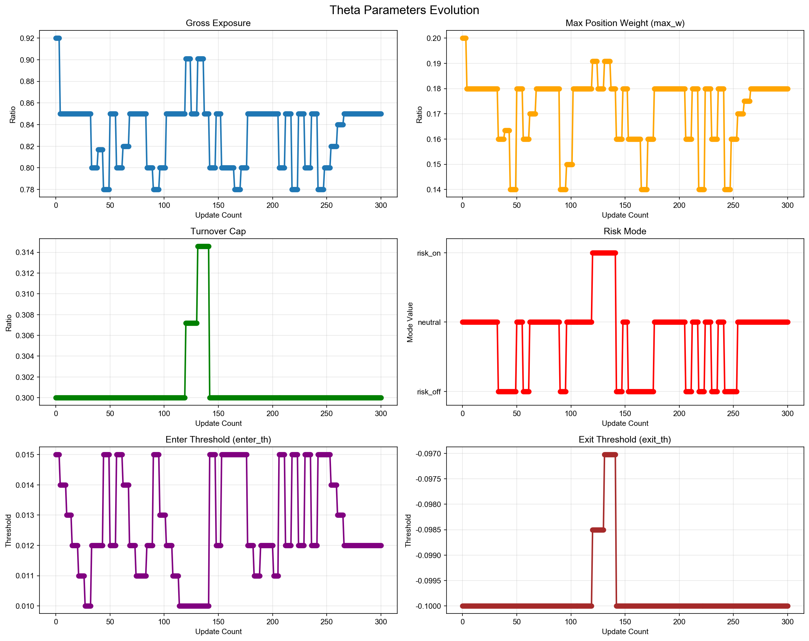
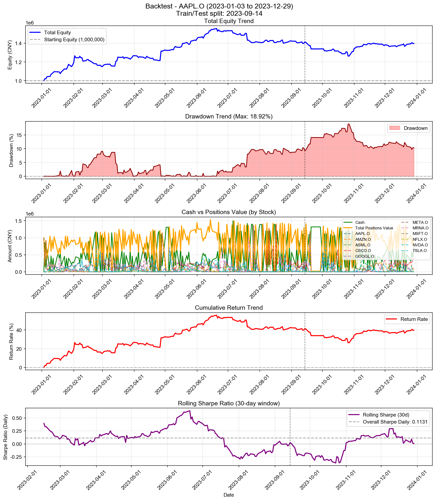

# Backtest

**策略名称:** 层级式多资产交易系统（带 RAG 反思层 + 3-shot Few-Shot Learning）  
**回测期间:** 2023-01-03 至 2023-12-29  
**交易日数:** 250  
**组合股票数:** 20 支  
**初始资金:** 1000000.00 元

---

## 组合整体表现

| 项目 | 数值 |
|------|------|
| 初始资金 | 1000000.00 元 |
| 最终现金 | 664298.66 元 |
| 最终持仓市值 | 733563.68 元 |
| 最终总权益 | 1397862.34 元 |
| 总盈亏 | +397862.34 元 |
| 总收益率 | +39.79% |
| 年化收益率 (CAGR) | +40.16% |

---

## 参数θ追踪

### 初始参数

| 参数 | 数值 |
|------|------|
| 总仓位上限 (gross_exposure) | 0.92 |
| 单票上限 (max_w) | 0.20 |
| 换手上限 (turnover_cap) | 0.30 |
| 风险模式 (risk_mode) | neutral |
| 进场阈值 (enter_th) | 0.015 |
| 出场阈值 (exit_th) | -0.100 |

### 最终参数

| 参数 | 数值 |
|------|------|
| 总仓位上限 (gross_exposure) | 0.85 |
| 单票上限 (max_w) | 0.18 |
| 换手上限 (turnover_cap) | 0.30 |
| 风险模式 (risk_mode) | neutral |
| 进场阈值 (enter_th) | 0.012 |
| 出场阈值 (exit_th) | -0.100 |

### 参数变化趋势图

---

## 持仓明细

| 股票代码 | 股数 | 成本价 | 现价 | 市值 | 权重 | 盈亏 | 收益率 | 贡献度 |
|----------|------|--------|------|------|------|------|--------|--------|
| AAPL.O | 17 | 571.18 | 556.91 | 9467.45 | 0.68% | -242.57 | -2.50% | -0.02% |
| MSFT.O | 4 | 1740.79 | 1746.87 | 6987.49 | 0.50% | +24.34 | +0.35% | 0.00% |
| GOOGL.O | 22 | 56.03 | 55.82 | 1228.08 | 0.09% | -4.59 | -0.37% | -0.00% |
| NVDA.O | 15 | 262.02 | 259.11 | 3886.68 | 0.28% | -43.56 | -1.11% | -0.00% |
| META.O | 230 | 3.54 | 3.54 | 814.11 | 0.06% | +0.95 | +0.12% | 0.00% |
| ASML.O | 72 | 95.81 | 96.07 | 6916.79 | 0.49% | +18.24 | +0.26% | 0.00% |
| MRNA.O | 349792 | 0.98 | 0.99 | 347868.14 | 24.89% | +5872.13 | +1.72% | 0.43% |
| NFLX.O | 123 | 66.74 | 68.16 | 8384.07 | 0.60% | +175.56 | +2.14% | 0.01% |
| CSCO.O | 1648 | 210.54 | 211.17 | 348010.87 | 24.90% | +1047.42 | +0.30% | 0.08% |

### 权重分布

| 股票代码 | 权重 | 市值占比 |
|----------|------|----------|
| AAPL.O | 0.68% | 0.68% |
| MSFT.O | 0.50% | 0.50% |
| GOOGL.O | 0.09% | 0.09% |
| NVDA.O | 0.28% | 0.28% |
| META.O | 0.06% | 0.06% |
| ASML.O | 0.49% | 0.49% |
| MRNA.O | 24.89% | 24.89% |
| NFLX.O | 0.60% | 0.60% |
| CSCO.O | 24.90% | 24.90% |

---

## 交易统计

| 项目 | 数值 |
|------|------|
| 总交易次数 | 2051 次 |
| 买入次数 | 1184 次 |
| 卖出次数 | 867 次 |
| 买入总成本 | 106897183.18 元 |
| 卖出总收入 | 106561481.84 元 |
| 已实现盈亏 | +391014.42 元 |

### 交易质量指标

| 指标 | 数值 |
|------|------|
| 胜率 (Hit Rate) | 58.59% |
| 盈亏比 (Profit Factor) | 1.47 |
| 单笔平均收益 | +451.00 元 |
| 平均持仓周期 | 4.1 天 |

---

## 风险与稳健性

| 指标 | 数值 |
|------|------|
| 最大回撤 (Max Drawdown) | 18.92% |
| 年化波动率 (Volatility) | 19.99% |
| 年化夏普比率 (Sharpe) | 1.7954 |
| 日频夏普比率 (Sharpe Daily) | 0.1131 |
| 年化 Sortino 比率 | 2.0581 |
| 日频 Sortino 比率 | 0.1296 |
| Calmar 比率 (CAGR/MaxDD) | 2.1226 |
### 尾部风险 (Tail Risk)

| 指标 | 数值 |
|------|------|
| VaR 95% | -1.57% |
| VaR 99% | -2.94% |
| CVaR 95% | -2.45% |
| CVaR 99% | -3.69% |
| 极端日跌幅 (5%分位) | -1.65% |
| 极端日跌幅 (1%分位) | -3.34% |

---

## 执行与成本

| 指标 | 数值 |
|------|------|
| 换手率 (Turnover) | 8005.59% |
| 交易频率 (每日) | 8.20 次/日 |
| 交易频率 (每周) | 41.02 次/周 |

---

## 各股票表现分析

| 股票代码 | 初始权重 | 最终权重 | 收益率 | 盈亏 | 交易次数 | 贡献度 |
|----------|----------|----------|--------|------|----------|--------|
| AAPL.O | 788.14% | 0.68% | -2.50% | -242.57 | 173 | -0.02% |
| MSFT.O | 467.45% | 0.50% | +0.35% | +24.34 | 122 | 0.00% |
| GOOGL.O | 1061.44% | 0.09% | -0.37% | -4.59 | 199 | -0.00% |
| NVDA.O | 973.25% | 0.28% | -1.11% | -43.56 | 204 | -0.00% |
| META.O | 1392.07% | 0.06% | +0.12% | +0.95 | 253 | 0.00% |
| ASML.O | 281.80% | 0.49% | +0.26% | +18.24 | 93 | 0.00% |
| MRNA.O | 983.26% | 24.89% | +1.72% | +5872.13 | 190 | 0.43% |
| NFLX.O | 874.50% | 0.60% | +2.14% | +175.56 | 160 | 0.01% |
| CSCO.O | 1245.91% | 24.90% | +0.30% | +1047.42 | 204 | 0.08% |

---

## 策略参数

---

## 交易记录

| 序号 | 日期 | 类型 | 股票代码 | 股数 | 价格 | 成本/收入 | 利润 |
|------|------|------|----------|------|------|-----------|------|
| 1 | 2023-01-03 | 买入 | META.O | 128266 | 1.25 | 159999.01 | - |
| 2 | 2023-01-03 | 买入 | META.O | 673401 | 1.25 | 840000.41 | - |
| 3 | 2023-01-04 | 卖出 | META.O | 673400 | 1.27 | 857709.58 | +17710.42 |
| 4 | 2023-01-05 | 买入 | META.O | 595286 | 1.27 | 755656.05 | - |
| 5 | 2023-01-06 | 买入 | AMZN.O | 331 | 206.59 | 68381.95 | - |
| 6 | 2023-01-06 | 卖出 | META.O | 612890 | 1.30 | 796879.58 | +21267.30 |
| 7 | 2023-01-06 | 买入 | MRNA.O | 51911 | 1.80 | 93621.49 | - |
| 8 | 2023-01-06 | 买入 | CSCO.O | 393 | 197.53 | 77631.06 | - |
| 9 | 2023-01-09 | 买入 | NVDA.O | 502 | 81.73 | 41030.21 | - |
| 10 | 2023-01-09 | 买入 | TSLA.O | 1962 | 17.97 | 35248.31 | - |
| 11 | 2023-01-09 | 卖出 | META.O | 8408 | 1.29 | 10885.84 | +245.51 |
| 12 | 2023-01-09 | 买入 | ASML.O | 909 | 78.08 | 70973.68 | - |
| 13 | 2023-01-09 | 买入 | MRNA.O | 8734 | 1.84 | 16066.19 | - |
| 14 | 2023-01-09 | 卖出 | CSCO.O | 230 | 198.60 | 45677.40 | +244.47 |
| 15 | 2023-01-09 | 买入 | AMZN.O | 397 | 209.66 | 83236.61 | - |
| 16 | 2023-01-09 | 买入 | NVDA.O | 559 | 81.73 | 45689.02 | - |
| 17 | 2023-01-09 | 买入 | TSLA.O | 2184 | 17.97 | 39236.65 | - |
| 18 | 2023-01-09 | 买入 | META.O | 113813 | 1.29 | 147353.69 | - |
| 19 | 2023-01-09 | 买入 | ASML.O | 1012 | 78.08 | 79015.80 | - |
| 20 | 2023-01-09 | 买入 | MRNA.O | 67500 | 1.84 | 124166.25 | - |
| 21 | 2023-01-09 | 买入 | CSCO.O | 170 | 198.60 | 33761.56 | - |
| 22 | 2023-01-10 | 买入 | GOOGL.O | 2 | 35.33 | 70.67 | - |
| 23 | 2023-01-10 | 卖出 | AMZN.O | 134 | 215.69 | 28902.19 | +994.38 |
| 24 | 2023-01-10 | 卖出 | NVDA.O | 518 | 83.20 | 43099.20 | +761.26 |
| 25 | 2023-01-10 | 卖出 | TSLA.O | 3385 | 17.83 | 60346.09 | -467.13 |
| 26 | 2023-01-10 | 卖出 | META.O | 109296 | 1.33 | 145352.75 | +5357.58 |
| 27 | 2023-01-10 | 卖出 | ASML.O | 1100 | 79.59 | 87553.80 | +1667.06 |
| 28 | 2023-01-10 | 卖出 | MRNA.O | 55623 | 1.90 | 105489.02 | +3981.69 |
| 29 | 2023-01-10 | 买入 | NFLX.O | 983 | 45.86 | 45076.05 | - |
| 30 | 2023-01-10 | 卖出 | CSCO.O | 196 | 199.54 | 39109.38 | +286.26 |
| 31 | 2023-01-11 | 买入 | MSFT.O | 31 | 1085.63 | 33654.51 | - |
| 32 | 2023-01-11 | 买入 | GOOGL.O | 2376 | 36.57 | 86896.52 | - |
| 33 | 2023-01-11 | 卖出 | NVDA.O | 317 | 83.68 | 26527.91 | +618.39 |
| 34 | 2023-01-11 | 买入 | TSLA.O | 890 | 18.48 | 16449.87 | - |
| 35 | 2023-01-11 | 卖出 | ASML.O | 374 | 81.01 | 30298.90 | +1097.41 |
| 36 | 2023-01-11 | 卖出 | MRNA.O | 32012 | 1.87 | 59747.20 | +1327.97 |
| 37 | 2023-01-11 | 卖出 | NFLX.O | 571 | 45.82 | 26161.16 | -22.38 |
| 38 | 2023-01-11 | 卖出 | CSCO.O | 80 | 201.17 | 16093.83 | +247.66 |
| 39 | 2023-01-11 | 买入 | MSFT.O | 19 | 1085.63 | 20626.96 | - |
| 40 | 2023-01-11 | 买入 | GOOGL.O | 1478 | 36.57 | 54054.32 | - |
| 41 | 2023-01-11 | 买入 | AMZN.O | 348 | 228.22 | 79419.17 | - |
| 42 | 2023-01-11 | 买入 | NVDA.O | 140 | 83.68 | 11715.79 | - |
| 43 | 2023-01-11 | 买入 | TSLA.O | 1026 | 18.48 | 18963.56 | - |
| 44 | 2023-01-11 | 买入 | META.O | 62638 | 1.33 | 83239.64 | - |
| 45 | 2023-01-11 | 买入 | ASML.O | 277 | 81.01 | 22440.63 | - |
| 46 | 2023-01-11 | 买入 | MRNA.O | 25182 | 1.87 | 46999.68 | - |
| 47 | 2023-01-11 | 买入 | NFLX.O | 255 | 45.82 | 11683.18 | - |
| 48 | 2023-01-12 | 卖出 | GOOGL.O | 1892 | 36.42 | 68900.51 | -293.65 |
| 49 | 2023-01-12 | 卖出 | AMZN.O | 303 | 228.65 | 69280.34 | +3942.38 |
| 50 | 2023-01-12 | 买入 | NVDA.O | 693 | 86.35 | 59841.60 | - |
| 51 | 2023-01-12 | 卖出 | TSLA.O | 1539 | 18.53 | 28523.83 | +304.89 |
| 52 | 2023-01-12 | 卖出 | META.O | 62019 | 1.37 | 84786.17 | +4246.09 |
| 53 | 2023-01-12 | 卖出 | ASML.O | 319 | 82.00 | 26159.07 | +893.79 |
| 54 | 2023-01-12 | 卖出 | MRNA.O | 4792 | 1.88 | 9011.84 | +190.63 |
| 55 | 2023-01-12 | 卖出 | NFLX.O | 601 | 46.22 | 27777.14 | +226.93 |
| 56 | 2023-01-12 | 卖出 | CSCO.O | 47 | 200.31 | 9414.78 | +105.15 |
| 57 | 2023-01-13 | 卖出 | MSFT.O | 21 | 1101.56 | 23132.79 | +334.57 |
| 58 | 2023-01-13 | 买入 | GOOGL.O | 1710 | 36.81 | 62949.17 | - |
| 59 | 2023-01-13 | 买入 | NVDA.O | 151 | 88.38 | 13345.49 | - |
| 60 | 2023-01-13 | 卖出 | TSLA.O | 1081 | 18.36 | 19847.16 | +26.06 |
| 61 | 2023-01-13 | 卖出 | META.O | 28542 | 1.37 | 39096.83 | +2031.17 |
| 62 | 2023-01-13 | 买入 | ASML.O | 138 | 82.90 | 11440.11 | - |
| 63 | 2023-01-13 | 买入 | MRNA.O | 18355 | 1.92 | 35241.60 | - |
| 64 | 2023-01-13 | 买入 | MSFT.O | 11 | 1101.56 | 12117.18 | - |
| 65 | 2023-01-13 | 买入 | GOOGL.O | 1461 | 36.81 | 53782.88 | - |
| 66 | 2023-01-13 | 买入 | AMZN.O | 259 | 235.49 | 60991.39 | - |
| 67 | 2023-01-13 | 买入 | NVDA.O | 481 | 88.38 | 42511.13 | - |
| 68 | 2023-01-13 | 买入 | META.O | 31371 | 1.37 | 42972.00 | - |
| 69 | 2023-01-13 | 买入 | ASML.O | 216 | 82.90 | 17906.25 | - |
| 70 | 2023-01-13 | 买入 | MRNA.O | 31533 | 1.92 | 60543.36 | - |
| 71 | 2023-01-17 | 卖出 | MSFT.O | 27 | 1106.72 | 29881.40 | +451.11 |
| 72 | 2023-01-17 | 卖出 | GOOGL.O | 3430 | 36.48 | 125128.80 | -822.27 |
| 73 | 2023-01-17 | 卖出 | AMZN.O | 591 | 230.52 | 136237.32 | +5412.20 |
| 74 | 2023-01-17 | 卖出 | NVDA.O | 437 | 92.58 | 40457.62 | +2756.80 |
| 75 | 2023-01-17 | 买入 | TSLA.O | 3356 | 19.72 | 66192.07 | - |
| 76 | 2023-01-17 | 卖出 | META.O | 73541 | 1.35 | 99545.10 | +2552.57 |
| 77 | 2023-01-17 | 卖出 | ASML.O | 508 | 82.71 | 42017.10 | +906.61 |
| 78 | 2023-01-17 | 卖出 | MRNA.O | 49808 | 1.91 | 94978.88 | +1515.45 |
| 79 | 2023-01-18 | 卖出 | MSFT.O | 9 | 1085.81 | 9772.32 | -37.77 |
| 80 | 2023-01-18 | 卖出 | GOOGL.O | 1270 | 36.41 | 46244.21 | -390.73 |
| 81 | 2023-01-18 | 卖出 | AMZN.O | 228 | 229.10 | 52235.71 | +1765.11 |
| 82 | 2023-01-18 | 卖出 | NVDA.O | 929 | 90.88 | 84428.12 | +4281.52 |
| 83 | 2023-01-18 | 卖出 | TSLA.O | 2526 | 19.32 | 48794.74 | -968.28 |
| 84 | 2023-01-18 | 卖出 | META.O | 27186 | 1.33 | 36162.82 | +307.46 |
| 85 | 2023-01-18 | 卖出 | ASML.O | 186 | 81.97 | 15246.31 | +194.04 |
| 86 | 2023-01-18 | 买入 | MRNA.O | 8468 | 1.97 | 16683.65 | - |
| 87 | 2023-01-18 | 买入 | GOOGL.O | 841 | 36.41 | 30623.13 | - |
| 88 | 2023-01-18 | 买入 | AMZN.O | 151 | 229.10 | 34594.70 | - |
| 89 | 2023-01-18 | 买入 | NVDA.O | 628 | 90.88 | 57073.04 | - |
| 90 | 2023-01-18 | 买入 | TSLA.O | 1717 | 19.32 | 33167.29 | - |
| 91 | 2023-01-18 | 买入 | META.O | 18386 | 1.33 | 24457.06 | - |
| 92 | 2023-01-18 | 买入 | ASML.O | 124 | 81.97 | 10164.21 | - |
| 93 | 2023-01-18 | 买入 | MRNA.O | 134526 | 1.97 | 265043.13 | - |
| 94 | 2023-01-19 | 买入 | GOOGL.O | 1241 | 37.18 | 46145.37 | - |
| 95 | 2023-01-19 | 卖出 | AMZN.O | 202 | 224.83 | 45416.06 | -325.80 |
| 96 | 2023-01-19 | 卖出 | NVDA.O | 839 | 87.68 | 73563.45 | -1366.74 |
| 97 | 2023-01-19 | 卖出 | TSLA.O | 2299 | 19.08 | 43854.57 | -855.39 |
| 98 | 2023-01-19 | 买入 | META.O | 40088 | 1.36 | 54579.81 | - |
| 99 | 2023-01-19 | 卖出 | ASML.O | 166 | 79.20 | 13147.16 | -400.20 |
| 100 | 2023-01-19 | 卖出 | MRNA.O | 179626 | 1.90 | 341971.98 | -6894.00 |
| 101 | 2023-01-19 | 买入 | GOOGL.O | 2790 | 37.18 | 103743.41 | - |
| 102 | 2023-01-19 | 买入 | NVDA.O | 126 | 87.68 | 11047.67 | - |
| 103 | 2023-01-19 | 买入 | META.O | 75339 | 1.36 | 102574.05 | - |
| 104 | 2023-01-19 | 买入 | MRNA.O | 26988 | 1.90 | 51379.75 | - |
| 105 | 2023-01-20 | 卖出 | GOOGL.O | 2315 | 39.17 | 90678.77 | +4968.68 |
| 106 | 2023-01-20 | 买入 | AMZN.O | 96 | 233.40 | 22406.40 | - |
| 107 | 2023-01-20 | 买入 | NVDA.O | 250 | 93.30 | 23324.22 | - |
| 108 | 2023-01-20 | 买入 | TSLA.O | 2167 | 20.01 | 43368.17 | - |
| 109 | 2023-01-20 | 卖出 | META.O | 77791 | 1.39 | 108417.32 | +3036.83 |
| 110 | 2023-01-20 | 卖出 | MRNA.O | 15814 | 1.94 | 30676.00 | +281.44 |
| 111 | 2023-01-20 | 买入 | NFLX.O | 1331 | 47.95 | 63821.45 | - |
| 112 | 2023-01-20 | 买入 | GOOGL.O | 2749 | 39.17 | 107678.59 | - |
| 113 | 2023-01-20 | 买入 | AMZN.O | 114 | 233.40 | 26607.60 | - |
| 114 | 2023-01-20 | 买入 | NVDA.O | 450 | 93.30 | 41983.59 | - |
| 115 | 2023-01-20 | 买入 | TSLA.O | 2272 | 20.01 | 45469.54 | - |
| 116 | 2023-01-20 | 买入 | META.O | 60207 | 1.39 | 83910.50 | - |
| 117 | 2023-01-20 | 买入 | MRNA.O | 32643 | 1.94 | 63320.89 | - |
| 118 | 2023-01-20 | 买入 | NFLX.O | 1284 | 47.95 | 61567.80 | - |
| 119 | 2023-01-23 | 买入 | AAPL.O | 172 | 405.90 | 69815.40 | - |
| 120 | 2023-01-23 | 卖出 | GOOGL.O | 3632 | 39.88 | 144834.76 | +6631.62 |
| 121 | 2023-01-23 | 卖出 | AMZN.O | 87 | 234.05 | 20362.18 | +127.56 |
| 122 | 2023-01-23 | 卖出 | NVDA.O | 224 | 100.38 | 22484.72 | +1863.21 |
| 123 | 2023-01-23 | 卖出 | TSLA.O | 1025 | 21.56 | 22101.56 | +1625.50 |
| 124 | 2023-01-23 | 卖出 | META.O | 45844 | 1.43 | 65680.70 | +2720.53 |
| 125 | 2023-01-23 | 买入 | ASML.O | 452 | 84.95 | 38398.61 | - |
| 126 | 2023-01-23 | 卖出 | MRNA.O | 42191 | 1.97 | 83090.96 | +1640.15 |
| 127 | 2023-01-23 | 卖出 | NFLX.O | 1385 | 50.04 | 69303.74 | +2964.91 |
| 128 | 2023-01-23 | 买入 | AAPL.O | 20 | 405.90 | 8118.07 | - |
| 129 | 2023-01-23 | 买入 | GOOGL.O | 255 | 39.88 | 10168.74 | - |
| 130 | 2023-01-23 | 买入 | NVDA.O | 86 | 100.38 | 8632.53 | - |
| 131 | 2023-01-23 | 买入 | TSLA.O | 450 | 21.56 | 9703.12 | - |
| 132 | 2023-01-23 | 买入 | META.O | 9667 | 1.43 | 13849.91 | - |
| 133 | 2023-01-24 | 买入 | AAPL.O | 82 | 409.99 | 33619.02 | - |
| 134 | 2023-01-24 | 买入 | MSFT.O | 26 | 1114.50 | 28977.01 | - |
| 135 | 2023-01-24 | 卖出 | GOOGL.O | 1373 | 39.04 | 53604.97 | +1089.81 |
| 136 | 2023-01-24 | 买入 | NVDA.O | 150 | 100.75 | 15113.22 | - |
| 137 | 2023-01-24 | 卖出 | META.O | 22229 | 1.43 | 31818.59 | +1147.83 |
| 138 | 2023-01-24 | 买入 | MRNA.O | 6698 | 1.97 | 13178.98 | - |
| 139 | 2023-01-24 | 买入 | NFLX.O | 279 | 50.94 | 14211.20 | - |
| 140 | 2023-01-24 | 买入 | CSCO.O | 93 | 195.45 | 18176.81 | - |
| 141 | 2023-01-24 | 买入 | AAPL.O | 133 | 409.99 | 54528.42 | - |
| 142 | 2023-01-24 | 买入 | MSFT.O | 14 | 1114.50 | 15603.00 | - |
| 143 | 2023-01-24 | 买入 | GOOGL.O | 480 | 39.04 | 18740.27 | - |
| 144 | 2023-01-24 | 买入 | AMZN.O | 79 | 231.17 | 18262.27 | - |
| 145 | 2023-01-24 | 买入 | NVDA.O | 462 | 100.75 | 46548.70 | - |
| 146 | 2023-01-24 | 买入 | TSLA.O | 2156 | 21.58 | 46534.03 | - |
| 147 | 2023-01-24 | 买入 | META.O | 32686 | 1.43 | 46786.74 | - |
| 148 | 2023-01-24 | 买入 | ASML.O | 189 | 84.20 | 15913.08 | - |
| 149 | 2023-01-24 | 买入 | MRNA.O | 15864 | 1.97 | 31214.01 | - |
| 150 | 2023-01-24 | 买入 | NFLX.O | 764 | 50.94 | 38915.26 | - |
| 151 | 2023-01-24 | 买入 | CSCO.O | 50 | 195.45 | 9772.48 | - |
| 152 | 2023-01-25 | 卖出 | AAPL.O | 132 | 408.06 | 53864.03 | -0.05 |
| 153 | 2023-01-25 | 卖出 | MSFT.O | 20 | 1107.92 | 22158.31 | -87.17 |
| 154 | 2023-01-25 | 卖出 | GOOGL.O | 1329 | 38.05 | 50570.02 | -606.43 |
| 155 | 2023-01-25 | 买入 | AMZN.O | 62 | 233.23 | 14460.38 | - |
| 156 | 2023-01-25 | 卖出 | NVDA.O | 230 | 101.06 | 23243.36 | +1087.62 |
| 157 | 2023-01-25 | 卖出 | TSLA.O | 609 | 21.66 | 13193.68 | +625.62 |
| 158 | 2023-01-25 | 卖出 | META.O | 56275 | 1.42 | 79629.12 | +1033.16 |
| 159 | 2023-01-25 | 买入 | ASML.O | 151 | 85.64 | 12932.22 | - |
| 160 | 2023-01-25 | 卖出 | MRNA.O | 27508 | 1.93 | 53109.70 | -469.28 |
| 161 | 2023-01-25 | 卖出 | NFLX.O | 991 | 51.51 | 51050.77 | +2241.22 |
| 162 | 2023-01-26 | 买入 | MSFT.O | 49 | 1141.94 | 55955.25 | - |
| 163 | 2023-01-26 | 买入 | GOOGL.O | 648 | 38.97 | 25252.75 | - |
| 164 | 2023-01-26 | 卖出 | NVDA.O | 134 | 103.56 | 13877.47 | +969.35 |
| 165 | 2023-01-26 | 卖出 | TSLA.O | 1378 | 24.04 | 33127.81 | +4689.74 |
| 166 | 2023-01-26 | 买入 | META.O | 41692 | 1.47 | 61412.32 | - |
| 167 | 2023-01-26 | 卖出 | ASML.O | 441 | 85.94 | 37900.27 | +498.63 |
| 168 | 2023-01-26 | 卖出 | MRNA.O | 5210 | 1.93 | 10067.80 | -80.02 |
| 169 | 2023-01-26 | 卖出 | NFLX.O | 772 | 51.08 | 39435.15 | +1411.97 |
| 170 | 2023-01-26 | 买入 | AAPL.O | 104 | 414.10 | 43066.56 | - |
| 171 | 2023-01-26 | 买入 | MSFT.O | 27 | 1141.94 | 30832.48 | - |
| 172 | 2023-01-26 | 买入 | GOOGL.O | 291 | 38.97 | 11340.35 | - |
| 173 | 2023-01-26 | 买入 | AMZN.O | 107 | 238.13 | 25479.70 | - |
| 174 | 2023-01-26 | 买入 | NVDA.O | 387 | 103.56 | 40078.98 | - |
| 175 | 2023-01-26 | 买入 | TSLA.O | 1601 | 24.04 | 38488.84 | - |
| 176 | 2023-01-26 | 买入 | META.O | 31539 | 1.47 | 46456.95 | - |
| 177 | 2023-01-26 | 买入 | ASML.O | 137 | 85.94 | 11774.01 | - |
| 178 | 2023-01-26 | 买入 | MRNA.O | 5840 | 1.93 | 11285.22 | - |
| 179 | 2023-01-26 | 买入 | NFLX.O | 212 | 51.08 | 10829.34 | - |
| 180 | 2023-01-26 | 买入 | CSCO.O | 52 | 197.62 | 10276.05 | - |
| 181 | 2023-01-27 | 卖出 | AAPL.O | 24 | 419.77 | 10074.44 | +241.19 |
| 182 | 2023-01-27 | 卖出 | MSFT.O | 47 | 1142.68 | 53705.99 | +369.30 |
| 183 | 2023-01-27 | 卖出 | NVDA.O | 407 | 106.51 | 43348.63 | +3349.70 |
| 184 | 2023-01-27 | 卖出 | TSLA.O | 2522 | 26.69 | 67299.57 | +12938.76 |
| 185 | 2023-01-27 | 卖出 | META.O | 18540 | 1.52 | 28132.60 | +1352.46 |
| 186 | 2023-01-27 | 卖出 | ASML.O | 481 | 83.87 | 40340.00 | -599.89 |
| 187 | 2023-01-27 | 卖出 | MRNA.O | 20397 | 1.89 | 38621.72 | -1022.26 |
| 188 | 2023-01-27 | 卖出 | NFLX.O | 435 | 50.51 | 21970.89 | +331.87 |
| 189 | 2023-01-27 | 买入 | CSCO.O | 49 | 198.31 | 9717.25 | - |
| 190 | 2023-01-30 | 卖出 | MSFT.O | 36 | 1117.59 | 40233.08 | -620.56 |
| 191 | 2023-01-30 | 卖出 | GOOGL.O | 725 | 38.74 | 28085.42 | -123.96 |
| 192 | 2023-01-30 | 买入 | AMZN.O | 154 | 241.32 | 37163.28 | - |
| 193 | 2023-01-30 | 卖出 | NVDA.O | 702 | 100.22 | 70351.69 | +1360.90 |
| 194 | 2023-01-30 | 买入 | TSLA.O | 1767 | 25.00 | 44173.23 | - |
| 195 | 2023-01-30 | 卖出 | META.O | 11301 | 1.47 | 16619.25 | +295.50 |
| 196 | 2023-01-30 | 卖出 | NFLX.O | 245 | 49.44 | 12111.67 | -75.82 |
| 197 | 2023-01-30 | 买入 | AAPL.O | 155 | 411.34 | 63757.71 | - |
| 198 | 2023-01-30 | 买入 | AMZN.O | 240 | 241.32 | 57916.80 | - |
| 199 | 2023-01-30 | 买入 | NVDA.O | 142 | 100.22 | 14230.68 | - |
| 200 | 2023-01-30 | 买入 | TSLA.O | 2255 | 25.00 | 56372.75 | - |
| 201 | 2023-01-30 | 买入 | META.O | 37891 | 1.47 | 55722.50 | - |
| 202 | 2023-01-30 | 买入 | CSCO.O | 107 | 197.13 | 21092.45 | - |
| 203 | 2023-01-31 | 卖出 | AAPL.O | 127 | 415.05 | 52711.45 | +614.59 |
| 204 | 2023-01-31 | 卖出 | MSFT.O | 16 | 1141.07 | 18257.10 | +99.93 |
| 205 | 2023-01-31 | 买入 | GOOGL.O | 1362 | 39.50 | 53795.98 | - |
| 206 | 2023-01-31 | 卖出 | AMZN.O | 154 | 247.51 | 38116.85 | +1529.27 |
| 207 | 2023-01-31 | 卖出 | TSLA.O | 1361 | 25.98 | 35362.86 | +3492.49 |
| 208 | 2023-01-31 | 卖出 | META.O | 31411 | 1.49 | 46792.97 | +1172.34 |
| 209 | 2023-01-31 | 卖出 | CSCO.O | 104 | 198.97 | 20692.39 | +233.55 |
| 210 | 2023-01-31 | 买入 | AAPL.O | 49 | 415.05 | 20337.49 | - |
| 211 | 2023-01-31 | 买入 | GOOGL.O | 223 | 39.50 | 8808.00 | - |
| 212 | 2023-01-31 | 买入 | AMZN.O | 83 | 247.51 | 20543.50 | - |
| 213 | 2023-01-31 | 买入 | TSLA.O | 791 | 25.98 | 20552.55 | - |
| 214 | 2023-01-31 | 买入 | META.O | 12192 | 1.49 | 18162.42 | - |
| 215 | 2023-02-01 | 卖出 | AAPL.O | 73 | 418.33 | 30538.09 | +552.58 |
| 216 | 2023-02-01 | 买入 | MSFT.O | 28 | 1163.82 | 32586.84 | - |
| 217 | 2023-02-01 | 卖出 | GOOGL.O | 1626 | 40.13 | 65256.53 | +1208.58 |
| 218 | 2023-02-01 | 卖出 | AMZN.O | 185 | 252.36 | 46686.60 | +2522.80 |
| 219 | 2023-02-01 | 买入 | NVDA.O | 694 | 109.53 | 76014.24 | - |
| 220 | 2023-02-01 | 卖出 | TSLA.O | 1574 | 27.21 | 42830.90 | +5507.61 |
| 221 | 2023-02-01 | 卖出 | META.O | 13570 | 1.53 | 20778.38 | +1011.25 |
| 222 | 2023-02-01 | 买入 | ASML.O | 155 | 85.27 | 13216.36 | - |
| 223 | 2023-02-01 | 卖出 | CSCO.O | 209 | 198.56 | 41498.31 | +383.90 |
| 224 | 2023-02-01 | 买入 | AAPL.O | 78 | 418.33 | 32629.74 | - |
| 225 | 2023-02-01 | 买入 | AMZN.O | 117 | 252.36 | 29526.12 | - |
| 226 | 2023-02-01 | 买入 | NVDA.O | 255 | 109.53 | 27930.30 | - |
| 227 | 2023-02-01 | 买入 | TSLA.O | 1160 | 27.21 | 31565.34 | - |
| 228 | 2023-02-01 | 买入 | META.O | 20213 | 1.53 | 30950.15 | - |
| 229 | 2023-02-02 | 卖出 | AAPL.O | 90 | 433.83 | 39045.09 | +1955.06 |
| 230 | 2023-02-02 | 买入 | MSFT.O | 40 | 1218.38 | 48735.22 | - |
| 231 | 2023-02-02 | 买入 | GOOGL.O | 1601 | 43.05 | 68929.99 | - |
| 232 | 2023-02-02 | 卖出 | AMZN.O | 113 | 270.98 | 30621.19 | +3369.79 |
| 233 | 2023-02-02 | 卖出 | NVDA.O | 634 | 113.54 | 71982.29 | +4779.97 |
| 234 | 2023-02-02 | 卖出 | TSLA.O | 3184 | 28.24 | 89917.75 | +12415.39 |
| 235 | 2023-02-02 | 卖出 | META.O | 64263 | 1.89 | 121309.27 | +26837.76 |
| 236 | 2023-02-02 | 买入 | CSCO.O | 203 | 201.62 | 40929.38 | - |
| 237 | 2023-02-02 | 买入 | AAPL.O | 58 | 433.83 | 25162.39 | - |
| 238 | 2023-02-02 | 买入 | MSFT.O | 11 | 1218.38 | 13402.18 | - |
| 239 | 2023-02-02 | 买入 | GOOGL.O | 322 | 43.05 | 13863.50 | - |
| 240 | 2023-02-02 | 买入 | AMZN.O | 91 | 270.98 | 24659.54 | - |
| 241 | 2023-02-02 | 买入 | NVDA.O | 131 | 113.54 | 14873.31 | - |
| 242 | 2023-02-02 | 买入 | TSLA.O | 550 | 28.24 | 15532.27 | - |
| 243 | 2023-02-02 | 买入 | META.O | 8107 | 1.89 | 15303.58 | - |
| 244 | 2023-02-03 | 卖出 | AAPL.O | 71 | 444.42 | 31553.81 | +2073.02 |
| 245 | 2023-02-03 | 卖出 | MSFT.O | 51 | 1189.60 | 60669.68 | -440.47 |
| 246 | 2023-02-03 | 卖出 | GOOGL.O | 1266 | 41.87 | 53009.30 | -844.52 |
| 247 | 2023-02-03 | 卖出 | AMZN.O | 393 | 248.14 | 97517.45 | +1052.95 |
| 248 | 2023-02-03 | 卖出 | NVDA.O | 526 | 110.35 | 58045.00 | +1723.24 |
| 249 | 2023-02-03 | 买入 | TSLA.O | 560 | 28.50 | 15958.32 | - |
| 250 | 2023-02-03 | 买入 | META.O | 10352 | 1.87 | 19309.59 | - |
| 251 | 2023-02-03 | 卖出 | ASML.O | 125 | 85.40 | 10675.48 | +20.22 |
| 252 | 2023-02-03 | 卖出 | CSCO.O | 148 | 198.80 | 29422.67 | -278.71 |
| 253 | 2023-02-03 | 买入 | AAPL.O | 115 | 444.42 | 51108.28 | - |
| 254 | 2023-02-03 | 买入 | MSFT.O | 9 | 1189.60 | 10706.41 | - |
| 255 | 2023-02-03 | 买入 | GOOGL.O | 337 | 41.87 | 14110.69 | - |
| 256 | 2023-02-03 | 买入 | AMZN.O | 82 | 248.14 | 20347.15 | - |
| 257 | 2023-02-03 | 买入 | NVDA.O | 135 | 110.35 | 14897.48 | - |
| 258 | 2023-02-03 | 买入 | TSLA.O | 1519 | 28.50 | 43286.94 | - |
| 259 | 2023-02-03 | 买入 | META.O | 23106 | 1.87 | 43099.62 | - |
| 260 | 2023-02-06 | 卖出 | AAPL.O | 68 | 436.45 | 29678.73 | +935.09 |
| 261 | 2023-02-06 | 卖出 | MSFT.O | 32 | 1182.33 | 37834.44 | -443.73 |
| 262 | 2023-02-06 | 卖出 | GOOGL.O | 1136 | 41.12 | 46712.56 | -1416.15 |
| 263 | 2023-02-06 | 卖出 | AMZN.O | 279 | 245.23 | 68419.73 | -253.65 |
| 264 | 2023-02-06 | 卖出 | NVDA.O | 457 | 110.29 | 50404.44 | +1085.91 |
| 265 | 2023-02-06 | 卖出 | TSLA.O | 360 | 29.21 | 10517.04 | +1096.17 |
| 266 | 2023-02-06 | 卖出 | CSCO.O | 84 | 194.47 | 16335.35 | -522.18 |
| 267 | 2023-02-06 | 买入 | AAPL.O | 229 | 436.45 | 99947.49 | - |
| 268 | 2023-02-06 | 买入 | TSLA.O | 3339 | 29.21 | 97545.55 | - |
| 269 | 2023-02-06 | 买入 | META.O | 52404 | 1.86 | 97502.88 | - |
| 270 | 2023-02-07 | 卖出 | AAPL.O | 234 | 444.85 | 104095.21 | +3975.27 |
| 271 | 2023-02-07 | 买入 | MSFT.O | 47 | 1232.01 | 57904.47 | - |
| 272 | 2023-02-07 | 买入 | GOOGL.O | 1361 | 43.01 | 58542.57 | - |
| 273 | 2023-02-07 | 买入 | NVDA.O | 646 | 115.96 | 74912.38 | - |
| 274 | 2023-02-07 | 卖出 | TSLA.O | 3252 | 29.52 | 96003.92 | +7178.33 |
| 275 | 2023-02-07 | 卖出 | META.O | 58693 | 1.92 | 112467.53 | +10875.35 |
| 276 | 2023-02-07 | 买入 | AAPL.O | 147 | 444.85 | 65393.15 | - |
| 277 | 2023-02-07 | 买入 | MSFT.O | 21 | 1232.01 | 25872.21 | - |
| 278 | 2023-02-07 | 买入 | GOOGL.O | 602 | 43.01 | 25894.65 | - |
| 279 | 2023-02-07 | 买入 | NVDA.O | 280 | 115.96 | 32469.76 | - |
| 280 | 2023-02-07 | 买入 | TSLA.O | 2210 | 29.52 | 65242.52 | - |
| 281 | 2023-02-07 | 买入 | META.O | 32781 | 1.92 | 62814.95 | - |
| 282 | 2023-02-08 | 卖出 | AAPL.O | 425 | 437.00 | 185724.35 | +1853.24 |
| 283 | 2023-02-08 | 卖出 | GOOGL.O | 1712 | 39.71 | 67982.79 | -5568.03 |
| 284 | 2023-02-08 | 买入 | NVDA.O | 233 | 116.13 | 27058.47 | - |
| 285 | 2023-02-08 | 卖出 | TSLA.O | 2412 | 30.19 | 72826.72 | +5443.63 |
| 286 | 2023-02-08 | 卖出 | META.O | 62340 | 1.83 | 114350.26 | +3187.53 |
| 287 | 2023-02-08 | 买入 | AAPL.O | 21 | 437.00 | 9176.97 | - |
| 288 | 2023-02-08 | 买入 | MSFT.O | 15 | 1228.19 | 18422.82 | - |
| 289 | 2023-02-08 | 买入 | NVDA.O | 276 | 116.13 | 32052.10 | - |
| 290 | 2023-02-08 | 买入 | TSLA.O | 1223 | 30.19 | 36926.65 | - |
| 291 | 2023-02-08 | 买入 | META.O | 12156 | 1.83 | 22297.75 | - |
| 292 | 2023-02-09 | 卖出 | AAPL.O | 119 | 433.98 | 51643.40 | +67.92 |
| 293 | 2023-02-09 | 卖出 | MSFT.O | 62 | 1213.87 | 75259.81 | -935.17 |
| 294 | 2023-02-09 | 卖出 | GOOGL.O | 424 | 37.97 | 16098.12 | -2117.74 |
| 295 | 2023-02-09 | 卖出 | TSLA.O | 879 | 31.10 | 27335.14 | +2413.91 |
| 296 | 2023-02-09 | 卖出 | META.O | 44668 | 1.78 | 79473.31 | -597.66 |
| 297 | 2023-02-09 | 买入 | MSFT.O | 26 | 1213.87 | 31560.56 | - |
| 298 | 2023-02-09 | 买入 | NVDA.O | 1499 | 116.82 | 175114.89 | - |
| 299 | 2023-02-09 | 买入 | TSLA.O | 5634 | 31.10 | 175206.13 | - |
| 300 | 2023-02-09 | 买入 | META.O | 20877 | 1.78 | 37144.36 | - |
| 301 | 2023-02-10 | 卖出 | AMZN.O | 42 | 234.26 | 9839.09 | -498.84 |
| 302 | 2023-02-10 | 卖出 | NVDA.O | 2704 | 111.21 | 300724.40 | -13582.74 |
| 303 | 2023-02-10 | 卖出 | TSLA.O | 8252 | 29.53 | 243710.44 | -1445.27 |
| 304 | 2023-02-10 | 卖出 | META.O | 38218 | 1.74 | 66556.65 | -1699.51 |
| 305 | 2023-02-10 | 买入 | CSCO.O | 291 | 193.20 | 56221.54 | - |
| 306 | 2023-02-10 | 买入 | MSFT.O | 53 | 1211.47 | 64208.09 | - |
| 307 | 2023-02-10 | 买入 | NVDA.O | 292 | 111.21 | 32474.68 | - |
| 308 | 2023-02-10 | 买入 | TSLA.O | 3088 | 29.53 | 91199.45 | - |
| 309 | 2023-02-10 | 买入 | CSCO.O | 304 | 193.20 | 58733.16 | - |
| 310 | 2023-02-13 | 买入 | AAPL.O | 121 | 443.23 | 53630.32 | - |
| 311 | 2023-02-13 | 卖出 | MSFT.O | 51 | 1249.32 | 63715.49 | +1673.35 |
| 312 | 2023-02-13 | 卖出 | NVDA.O | 524 | 113.95 | 59709.75 | +103.81 |
| 313 | 2023-02-13 | 卖出 | TSLA.O | 4874 | 29.20 | 142301.30 | -2076.11 |
| 314 | 2023-02-13 | 买入 | META.O | 20265 | 1.79 | 36361.49 | - |
| 315 | 2023-02-13 | 卖出 | CSCO.O | 270 | 195.65 | 52826.58 | +599.74 |
| 316 | 2023-02-13 | 买入 | AAPL.O | 246 | 443.23 | 109033.55 | - |
| 317 | 2023-02-13 | 买入 | MSFT.O | 111 | 1249.32 | 138674.89 | - |
| 318 | 2023-02-13 | 买入 | NVDA.O | 133 | 113.95 | 15155.34 | - |
| 319 | 2023-02-13 | 买入 | TSLA.O | 2783 | 29.20 | 81252.47 | - |
| 320 | 2023-02-13 | 买入 | META.O | 49556 | 1.79 | 88918.33 | - |
| 321 | 2023-02-13 | 买入 | CSCO.O | 699 | 195.65 | 136762.15 | - |
| 322 | 2023-02-14 | 卖出 | AAPL.O | 333 | 441.35 | 146970.63 | -623.57 |
| 323 | 2023-02-14 | 卖出 | MSFT.O | 129 | 1253.24 | 161667.61 | +1907.26 |
| 324 | 2023-02-14 | 买入 | NVDA.O | 170 | 120.14 | 20423.28 | - |
| 325 | 2023-02-14 | 卖出 | TSLA.O | 2451 | 31.39 | 76930.76 | +5027.81 |
| 326 | 2023-02-14 | 卖出 | META.O | 52211 | 1.79 | 93708.30 | +49.86 |
| 327 | 2023-02-14 | 买入 | MRNA.O | 22835 | 1.76 | 40102.83 | - |
| 328 | 2023-02-14 | 卖出 | CSCO.O | 731 | 195.00 | 142544.94 | +57.40 |
| 329 | 2023-02-14 | 买入 | AAPL.O | 25 | 441.35 | 11033.83 | - |
| 330 | 2023-02-14 | 买入 | MSFT.O | 28 | 1253.24 | 35090.64 | - |
| 331 | 2023-02-14 | 买入 | NVDA.O | 281 | 120.14 | 33758.47 | - |
| 332 | 2023-02-14 | 买入 | TSLA.O | 1294 | 31.39 | 40615.42 | - |
| 333 | 2023-02-14 | 买入 | META.O | 16521 | 1.79 | 29651.89 | - |
| 334 | 2023-02-14 | 买入 | MRNA.O | 18395 | 1.76 | 32305.30 | - |
| 335 | 2023-02-14 | 买入 | CSCO.O | 237 | 195.00 | 46214.98 | - |
| 336 | 2023-02-15 | 买入 | AAPL.O | 56 | 447.49 | 25059.41 | - |
| 337 | 2023-02-15 | 卖出 | MSFT.O | 49 | 1243.22 | 60917.79 | -78.45 |
| 338 | 2023-02-15 | 卖出 | NVDA.O | 349 | 119.05 | 41549.96 | +290.26 |
| 339 | 2023-02-15 | 卖出 | TSLA.O | 1095 | 32.14 | 35188.92 | +2094.03 |
| 340 | 2023-02-15 | 卖出 | META.O | 20613 | 1.77 | 36517.99 | -467.06 |
| 341 | 2023-02-15 | 卖出 | MRNA.O | 27181 | 1.77 | 48186.48 | +300.02 |
| 342 | 2023-02-15 | 买入 | NFLX.O | 505 | 50.60 | 25552.39 | - |
| 343 | 2023-02-15 | 卖出 | CSCO.O | 232 | 198.07 | 45951.30 | +721.67 |
| 344 | 2023-02-15 | 买入 | AAPL.O | 197 | 447.49 | 88155.44 | - |
| 345 | 2023-02-15 | 买入 | MSFT.O | 26 | 1243.22 | 32323.73 | - |
| 346 | 2023-02-15 | 买入 | AMZN.O | 53 | 242.78 | 12867.55 | - |
| 347 | 2023-02-15 | 买入 | NVDA.O | 515 | 119.05 | 61312.98 | - |
| 348 | 2023-02-15 | 买入 | TSLA.O | 3249 | 32.14 | 104409.86 | - |
| 349 | 2023-02-15 | 买入 | META.O | 30087 | 1.77 | 53302.13 | - |
| 350 | 2023-02-15 | 买入 | MRNA.O | 26246 | 1.77 | 46528.91 | - |
| 351 | 2023-02-15 | 买入 | NFLX.O | 1052 | 50.60 | 53229.94 | - |
| 352 | 2023-02-15 | 买入 | CSCO.O | 542 | 198.07 | 107351.74 | - |
| 353 | 2023-02-16 | 卖出 | AAPL.O | 307 | 442.82 | 135946.51 | -1139.19 |
| 354 | 2023-02-16 | 卖出 | MSFT.O | 41 | 1210.12 | 49615.02 | -1382.01 |
| 355 | 2023-02-16 | 卖出 | AMZN.O | 51 | 235.56 | 12013.56 | -368.42 |
| 356 | 2023-02-16 | 卖出 | NVDA.O | 804 | 115.07 | 92515.56 | -2957.45 |
| 357 | 2023-02-16 | 卖出 | TSLA.O | 5069 | 30.31 | 153621.11 | -5703.99 |
| 358 | 2023-02-16 | 卖出 | META.O | 46959 | 1.72 | 80976.10 | -2608.47 |
| 359 | 2023-02-16 | 卖出 | MRNA.O | 40963 | 1.72 | 70583.35 | -1869.28 |
| 360 | 2023-02-16 | 卖出 | NFLX.O | 1641 | 49.10 | 80572.12 | -2369.62 |
| 361 | 2023-02-16 | 卖出 | CSCO.O | 417 | 208.45 | 86923.48 | +4808.67 |
| 362 | 2023-02-16 | 买入 | CSCO.O | 957 | 208.45 | 199486.26 | - |
| 363 | 2023-02-17 | 买入 | TSLA.O | 2678 | 31.25 | 83678.13 | - |
| 364 | 2023-02-17 | 买入 | META.O | 27447 | 1.73 | 47450.37 | - |
| 365 | 2023-02-17 | 卖出 | CSCO.O | 955 | 207.55 | 198210.46 | +2620.44 |
| 366 | 2023-02-17 | 买入 | TSLA.O | 9515 | 31.25 | 297310.45 | - |
| 367 | 2023-02-17 | 买入 | META.O | 97167 | 1.73 | 167982.31 | - |
| 368 | 2023-02-17 | 买入 | CSCO.O | 1531 | 207.55 | 317759.39 | - |
| 369 | 2023-02-21 | 卖出 | TSLA.O | 12269 | 29.61 | 363229.88 | -20147.47 |
| 370 | 2023-02-21 | 卖出 | META.O | 69202 | 1.72 | 119082.80 | -572.80 |
| 371 | 2023-02-21 | 卖出 | CSCO.O | 1975 | 203.14 | 401191.88 | -7501.51 |
| 372 | 2023-02-21 | 买入 | META.O | 41612 | 1.72 | 71605.93 | - |
| 373 | 2023-02-22 | 卖出 | META.O | 97702 | 1.71 | 167187.66 | -1402.21 |
| 374 | 2023-02-23 | 买入 | NVDA.O | 767 | 123.76 | 94924.89 | - |
| 375 | 2023-02-23 | 买入 | META.O | 30711 | 1.72 | 52835.20 | - |
| 376 | 2023-02-23 | 买入 | NVDA.O | 5485 | 123.76 | 678830.56 | - |
| 377 | 2023-02-23 | 买入 | META.O | 198949 | 1.72 | 342271.86 | - |
| 378 | 2023-02-24 | 卖出 | NVDA.O | 6264 | 121.78 | 762857.18 | -12323.24 |
| 379 | 2023-02-24 | 卖出 | META.O | 229661 | 1.70 | 391319.38 | -3789.41 |
| 380 | 2023-02-27 | 买入 | NVDA.O | 663 | 122.91 | 81488.53 | - |
| 381 | 2023-02-27 | 买入 | TSLA.O | 2617 | 31.14 | 81505.16 | - |
| 382 | 2023-02-27 | 买入 | NVDA.O | 4221 | 122.91 | 518798.00 | - |
| 383 | 2023-02-27 | 买入 | TSLA.O | 15167 | 31.14 | 472368.63 | - |
| 384 | 2023-02-28 | 卖出 | NVDA.O | 4884 | 121.42 | 593006.76 | -7279.76 |
| 385 | 2023-02-28 | 卖出 | TSLA.O | 17784 | 30.86 | 548752.00 | -5121.79 |
| 386 | 2023-02-28 | 买入 | META.O | 46098 | 1.75 | 80643.84 | - |
| 387 | 2023-03-01 | 买入 | GOOGL.O | 2231 | 36.11 | 80559.31 | - |
| 388 | 2023-03-01 | 买入 | GOOGL.O | 13099 | 36.11 | 472992.56 | - |
| 389 | 2023-03-01 | 买入 | META.O | 272750 | 1.73 | 473003.05 | - |
| 390 | 2023-03-02 | 卖出 | GOOGL.O | 13111 | 36.76 | 482018.37 | +8592.50 |
| 391 | 2023-03-02 | 卖出 | META.O | 272124 | 1.75 | 474938.02 | +2422.57 |
| 392 | 2023-03-03 | 买入 | AAPL.O | 136 | 435.10 | 59173.83 | - |
| 393 | 2023-03-03 | 买入 | MSFT.O | 10 | 1178.46 | 11784.56 | - |
| 394 | 2023-03-03 | 买入 | GOOGL.O | 968 | 37.42 | 36226.23 | - |
| 395 | 2023-03-03 | 买入 | AMZN.O | 349 | 227.76 | 79488.24 | - |
| 396 | 2023-03-03 | 买入 | NVDA.O | 105 | 124.94 | 13119.04 | - |
| 397 | 2023-03-03 | 买入 | META.O | 17662 | 1.85 | 32718.85 | - |
| 398 | 2023-03-03 | 买入 | AAPL.O | 300 | 435.10 | 130530.51 | - |
| 399 | 2023-03-03 | 买入 | MSFT.O | 23 | 1178.46 | 27104.48 | - |
| 400 | 2023-03-03 | 买入 | GOOGL.O | 6756 | 37.42 | 252835.10 | - |
| 401 | 2023-03-03 | 买入 | AMZN.O | 745 | 227.76 | 169681.20 | - |
| 402 | 2023-03-03 | 买入 | NVDA.O | 224 | 124.94 | 27987.28 | - |
| 403 | 2023-03-03 | 买入 | TSLA.O | 403 | 29.67 | 11956.41 | - |
| 404 | 2023-03-03 | 买入 | META.O | 74994 | 1.85 | 138926.39 | - |
| 405 | 2023-03-06 | 卖出 | AAPL.O | 441 | 443.17 | 195437.18 | +3500.17 |
| 406 | 2023-03-06 | 卖出 | MSFT.O | 34 | 1185.75 | 40315.47 | +182.60 |
| 407 | 2023-03-06 | 卖出 | GOOGL.O | 5484 | 38.02 | 208475.43 | +4852.45 |
| 408 | 2023-03-06 | 卖出 | AMZN.O | 820 | 225.00 | 184500.00 | -2285.68 |
| 409 | 2023-03-06 | 卖出 | NVDA.O | 329 | 123.19 | 40528.19 | -578.14 |
| 410 | 2023-03-06 | 卖出 | TSLA.O | 403 | 29.07 | 11715.81 | -240.59 |
| 411 | 2023-03-06 | 卖出 | META.O | 47723 | 1.85 | 88239.83 | +1690.38 |
| 412 | 2023-03-07 | 卖出 | GOOGL.O | 371 | 37.51 | 13915.36 | +139.99 |
| 413 | 2023-03-07 | 买入 | AMZN.O | 416 | 224.52 | 93400.32 | - |
| 414 | 2023-03-07 | 买入 | GOOGL.O | 5574 | 37.51 | 209067.95 | - |
| 415 | 2023-03-07 | 买入 | AMZN.O | 944 | 224.52 | 211946.88 | - |
| 416 | 2023-03-07 | 买入 | META.O | 124962 | 1.85 | 230567.39 | - |
| 417 | 2023-03-08 | 卖出 | GOOGL.O | 5157 | 37.66 | 194230.95 | +1627.02 |
| 418 | 2023-03-08 | 卖出 | AMZN.O | 987 | 225.41 | 222477.70 | +332.40 |
| 419 | 2023-03-08 | 买入 | NVDA.O | 685 | 126.49 | 86643.34 | - |
| 420 | 2023-03-08 | 卖出 | META.O | 124905 | 1.85 | 231036.78 | +2240.45 |
| 421 | 2023-03-09 | 卖出 | GOOGL.O | 3756 | 36.89 | 138567.48 | -1711.82 |
| 422 | 2023-03-09 | 卖出 | AMZN.O | 541 | 221.40 | 119777.40 | -1986.13 |
| 423 | 2023-03-09 | 卖出 | NVDA.O | 569 | 122.59 | 69753.52 | -2217.37 |
| 424 | 2023-03-09 | 买入 | GOOGL.O | 1595 | 36.89 | 58843.22 | - |
| 425 | 2023-03-09 | 买入 | AMZN.O | 229 | 221.40 | 50700.60 | - |
| 426 | 2023-03-09 | 买入 | NVDA.O | 245 | 122.59 | 30034.47 | - |
| 427 | 2023-03-09 | 买入 | META.O | 188777 | 1.82 | 342988.93 | - |
| 428 | 2023-03-10 | 卖出 | GOOGL.O | 2344 | 36.22 | 84892.54 | -1924.37 |
| 429 | 2023-03-10 | 卖出 | AMZN.O | 337 | 217.75 | 73382.42 | -1625.87 |
| 430 | 2023-03-10 | 卖出 | NVDA.O | 361 | 120.13 | 43365.46 | -1341.45 |
| 431 | 2023-03-10 | 卖出 | META.O | 280491 | 1.80 | 503509.39 | -7477.83 |
| 432 | 2023-03-13 | 买入 | MSFT.O | 25 | 1172.13 | 29303.29 | - |
| 433 | 2023-03-13 | 买入 | GOOGL.O | 1457 | 36.41 | 53047.58 | - |
| 434 | 2023-03-13 | 买入 | AMZN.O | 249 | 221.83 | 55236.17 | - |
| 435 | 2023-03-13 | 买入 | META.O | 47908 | 1.81 | 86665.57 | - |
| 436 | 2023-03-13 | 买入 | MRNA.O | 33129 | 1.48 | 48997.79 | - |
| 437 | 2023-03-13 | 买入 | MSFT.O | 95 | 1172.13 | 111352.50 | - |
| 438 | 2023-03-13 | 买入 | GOOGL.O | 5417 | 36.41 | 197226.30 | - |
| 439 | 2023-03-13 | 买入 | AMZN.O | 926 | 221.83 | 205416.43 | - |
| 440 | 2023-03-13 | 买入 | NVDA.O | 99 | 120.13 | 11892.99 | - |
| 441 | 2023-03-13 | 买入 | META.O | 178088 | 1.81 | 322161.19 | - |
| 442 | 2023-03-13 | 买入 | MRNA.O | 19356 | 1.48 | 28627.52 | - |
| 443 | 2023-03-14 | 卖出 | MSFT.O | 79 | 1203.84 | 95103.72 | +2505.32 |
| 444 | 2023-03-14 | 卖出 | GOOGL.O | 5248 | 37.55 | 197071.12 | +5997.91 |
| 445 | 2023-03-14 | 卖出 | AMZN.O | 904 | 227.71 | 205851.65 | +5315.52 |
| 446 | 2023-03-14 | 买入 | TSLA.O | 384 | 27.49 | 10555.78 | - |
| 447 | 2023-03-14 | 卖出 | META.O | 190346 | 1.94 | 369309.31 | +24973.40 |
| 448 | 2023-03-14 | 卖出 | MRNA.O | 31165 | 1.51 | 47146.41 | +952.50 |
| 449 | 2023-03-14 | 买入 | CSCO.O | 97 | 200.52 | 19450.32 | - |
| 450 | 2023-03-15 | 买入 | MSFT.O | 8 | 1225.31 | 9802.48 | - |
| 451 | 2023-03-15 | 买入 | NVDA.O | 94 | 126.73 | 11912.85 | - |
| 452 | 2023-03-15 | 买入 | NFLX.O | 371 | 42.53 | 15778.85 | - |
| 453 | 2023-03-15 | 买入 | MSFT.O | 111 | 1225.31 | 136009.37 | - |
| 454 | 2023-03-15 | 买入 | GOOGL.O | 3730 | 38.41 | 143257.49 | - |
| 455 | 2023-03-15 | 买入 | AMZN.O | 621 | 230.88 | 143376.48 | - |
| 456 | 2023-03-15 | 买入 | NVDA.O | 434 | 126.73 | 55001.89 | - |
| 457 | 2023-03-15 | 买入 | META.O | 74544 | 1.98 | 147410.76 | - |
| 458 | 2023-03-15 | 买入 | MRNA.O | 43171 | 1.50 | 64583.82 | - |
| 459 | 2023-03-15 | 买入 | NFLX.O | 889 | 42.53 | 37809.70 | - |
| 460 | 2023-03-15 | 买入 | CSCO.O | 145 | 200.56 | 29081.15 | - |
| 461 | 2023-03-16 | 卖出 | MSFT.O | 123 | 1274.98 | 156822.46 | +7785.48 |
| 462 | 2023-03-16 | 卖出 | GOOGL.O | 3840 | 40.09 | 153942.55 | +8789.59 |
| 463 | 2023-03-16 | 卖出 | AMZN.O | 647 | 240.10 | 155342.11 | +7741.28 |
| 464 | 2023-03-16 | 卖出 | NVDA.O | 309 | 133.60 | 41282.57 | +2444.31 |
| 465 | 2023-03-16 | 卖出 | META.O | 80942 | 2.05 | 165874.44 | +10224.04 |
| 466 | 2023-03-16 | 卖出 | MRNA.O | 47638 | 1.52 | 72304.96 | +1259.26 |
| 467 | 2023-03-16 | 卖出 | NFLX.O | 835 | 43.41 | 36246.01 | +607.90 |
| 468 | 2023-03-16 | 卖出 | CSCO.O | 59 | 204.89 | 12088.69 | +256.63 |
| 469 | 2023-03-17 | 买入 | MSFT.O | 38 | 1289.89 | 49015.80 | - |
| 470 | 2023-03-17 | 买入 | GOOGL.O | 1006 | 40.61 | 40852.36 | - |
| 471 | 2023-03-17 | 买入 | AMZN.O | 112 | 237.48 | 26597.76 | - |
| 472 | 2023-03-17 | 买入 | NVDA.O | 291 | 134.56 | 39157.84 | - |
| 473 | 2023-03-17 | 买入 | MRNA.O | 18358 | 1.50 | 27540.67 | - |
| 474 | 2023-03-17 | 卖出 | NFLX.O | 272 | 42.49 | 11557.28 | -51.78 |
| 475 | 2023-03-17 | 买入 | CSCO.O | 178 | 205.18 | 36521.89 | - |
| 476 | 2023-03-17 | 买入 | MSFT.O | 101 | 1289.89 | 130278.84 | - |
| 477 | 2023-03-17 | 买入 | GOOGL.O | 3394 | 40.61 | 137825.94 | - |
| 478 | 2023-03-17 | 买入 | AMZN.O | 480 | 237.48 | 113990.40 | - |
| 479 | 2023-03-17 | 买入 | NVDA.O | 819 | 134.56 | 110207.12 | - |
| 480 | 2023-03-17 | 买入 | META.O | 40006 | 1.96 | 78255.74 | - |
| 481 | 2023-03-17 | 买入 | MRNA.O | 48174 | 1.50 | 72270.63 | - |
| 482 | 2023-03-17 | 买入 | NFLX.O | 237 | 42.49 | 10070.13 | - |
| 483 | 2023-03-17 | 买入 | CSCO.O | 113 | 205.18 | 23185.24 | - |
| 484 | 2023-03-20 | 卖出 | MSFT.O | 147 | 1256.65 | 184728.03 | -2468.87 |
| 485 | 2023-03-20 | 卖出 | GOOGL.O | 2889 | 40.45 | 116856.75 | +1617.36 |
| 486 | 2023-03-20 | 卖出 | AMZN.O | 509 | 234.50 | 119362.54 | -121.89 |
| 487 | 2023-03-20 | 卖出 | NVDA.O | 738 | 135.48 | 99983.07 | +2133.77 |
| 488 | 2023-03-20 | 卖出 | TSLA.O | 373 | 27.49 | 10252.84 | -0.56 |
| 489 | 2023-03-20 | 卖出 | META.O | 48631 | 1.98 | 96196.98 | +1750.02 |
| 490 | 2023-03-20 | 买入 | ASML.O | 470 | 81.40 | 38257.52 | - |
| 491 | 2023-03-20 | 卖出 | MRNA.O | 22710 | 1.55 | 35091.49 | +1063.63 |
| 492 | 2023-03-20 | 卖出 | NFLX.O | 349 | 42.72 | 14908.65 | +51.24 |
| 493 | 2023-03-20 | 买入 | CSCO.O | 63 | 208.25 | 13119.45 | - |
| 494 | 2023-03-21 | 买入 | AAPL.O | 113 | 458.87 | 51852.21 | - |
| 495 | 2023-03-21 | 买入 | GOOGL.O | 315 | 41.93 | 13207.14 | - |
| 496 | 2023-03-21 | 买入 | AMZN.O | 208 | 241.46 | 50224.51 | - |
| 497 | 2023-03-21 | 买入 | NVDA.O | 90 | 137.04 | 12333.82 | - |
| 498 | 2023-03-21 | 买入 | TSLA.O | 2385 | 29.64 | 70684.25 | - |
| 499 | 2023-03-21 | 卖出 | ASML.O | 420 | 80.87 | 33965.41 | -404.89 |
| 500 | 2023-03-21 | 卖出 | MRNA.O | 18356 | 1.52 | 27919.48 | +415.49 |
| 501 | 2023-03-21 | 卖出 | CSCO.O | 89 | 207.14 | 18435.59 | +283.23 |
| 502 | 2023-03-21 | 买入 | AAPL.O | 76 | 458.87 | 34874.05 | - |
| 503 | 2023-03-21 | 买入 | MSFT.O | 15 | 1263.81 | 18957.12 | - |
| 504 | 2023-03-21 | 买入 | GOOGL.O | 2241 | 41.93 | 93959.37 | - |
| 505 | 2023-03-21 | 买入 | AMZN.O | 359 | 241.46 | 86685.58 | - |
| 506 | 2023-03-21 | 买入 | NVDA.O | 523 | 137.04 | 71673.19 | - |
| 507 | 2023-03-21 | 买入 | TSLA.O | 1606 | 29.64 | 47597.02 | - |
| 508 | 2023-03-21 | 买入 | META.O | 16446 | 2.02 | 33247.23 | - |
| 509 | 2023-03-21 | 买入 | MRNA.O | 28771 | 1.52 | 43760.69 | - |
| 510 | 2023-03-21 | 买入 | CSCO.O | 300 | 207.14 | 62142.42 | - |
| 511 | 2023-03-22 | 卖出 | AAPL.O | 148 | 454.69 | 67294.38 | -618.24 |
| 512 | 2023-03-22 | 卖出 | MSFT.O | 35 | 1256.93 | 43992.56 | -463.11 |
| 513 | 2023-03-22 | 卖出 | GOOGL.O | 2134 | 41.31 | 88151.33 | +1036.66 |
| 514 | 2023-03-22 | 卖出 | AMZN.O | 410 | 236.88 | 97120.80 | -869.63 |
| 515 | 2023-03-22 | 卖出 | NVDA.O | 358 | 138.45 | 49564.93 | +1348.37 |
| 516 | 2023-03-22 | 卖出 | TSLA.O | 3128 | 28.67 | 89687.58 | -2998.49 |
| 517 | 2023-03-22 | 买入 | META.O | 8374 | 2.00 | 16732.09 | - |
| 518 | 2023-03-22 | 卖出 | MRNA.O | 7932 | 1.48 | 11753.64 | -203.45 |
| 519 | 2023-03-22 | 卖出 | CSCO.O | 586 | 202.19 | 118486.20 | -1781.74 |
| 520 | 2023-03-23 | 卖出 | AMZN.O | 178 | 236.90 | 42168.91 | -373.28 |
| 521 | 2023-03-23 | 买入 | NVDA.O | 76 | 142.23 | 10809.59 | - |
| 522 | 2023-03-23 | 买入 | META.O | 13085 | 2.04 | 26730.04 | - |
| 523 | 2023-03-23 | 买入 | ASML.O | 360 | 83.64 | 30112.02 | - |
| 524 | 2023-03-23 | 买入 | NFLX.O | 1482 | 44.85 | 66470.37 | - |
| 525 | 2023-03-23 | 卖出 | CSCO.O | 126 | 203.30 | 25615.63 | -244.03 |
| 526 | 2023-03-23 | 买入 | AAPL.O | 29 | 457.86 | 13277.96 | - |
| 527 | 2023-03-23 | 买入 | GOOGL.O | 2079 | 42.20 | 87732.06 | - |
| 528 | 2023-03-23 | 买入 | AMZN.O | 181 | 236.90 | 42879.62 | - |
| 529 | 2023-03-23 | 买入 | NVDA.O | 606 | 142.23 | 86192.24 | - |
| 530 | 2023-03-23 | 买入 | TSLA.O | 390 | 28.83 | 11244.87 | - |
| 531 | 2023-03-23 | 买入 | META.O | 34719 | 2.04 | 70923.97 | - |
| 532 | 2023-03-23 | 买入 | ASML.O | 279 | 83.64 | 23336.81 | - |
| 533 | 2023-03-23 | 买入 | MRNA.O | 38247 | 1.49 | 57148.67 | - |
| 534 | 2023-03-23 | 买入 | NFLX.O | 918 | 44.85 | 41173.95 | - |
| 535 | 2023-03-24 | 买入 | AAPL.O | 41 | 461.66 | 18928.21 | - |
| 536 | 2023-03-24 | 卖出 | MSFT.O | 8 | 1295.15 | 10361.22 | +199.92 |
| 537 | 2023-03-24 | 卖出 | GOOGL.O | 2166 | 42.14 | 91264.90 | +1722.28 |
| 538 | 2023-03-24 | 卖出 | AMZN.O | 130 | 235.51 | 30616.56 | -352.46 |
| 539 | 2023-03-24 | 卖出 | NVDA.O | 913 | 140.08 | 127889.68 | +2035.18 |
| 540 | 2023-03-24 | 卖出 | TSLA.O | 1095 | 28.56 | 31274.84 | -901.57 |
| 541 | 2023-03-24 | 卖出 | META.O | 33455 | 2.06 | 68920.65 | +1583.24 |
| 542 | 2023-03-24 | 卖出 | ASML.O | 626 | 81.55 | 51050.36 | -1144.64 |
| 543 | 2023-03-24 | 卖出 | MRNA.O | 27315 | 1.51 | 41212.87 | +172.59 |
| 544 | 2023-03-24 | 卖出 | NFLX.O | 1542 | 45.97 | 70892.83 | +1824.08 |
| 545 | 2023-03-24 | 买入 | CSCO.O | 432 | 206.49 | 89202.53 | - |
| 546 | 2023-03-27 | 卖出 | AAPL.O | 70 | 455.99 | 31919.17 | -255.48 |
| 547 | 2023-03-27 | 卖出 | GOOGL.O | 2117 | 40.94 | 86679.25 | -837.71 |
| 548 | 2023-03-27 | 买入 | AMZN.O | 185 | 235.30 | 43529.76 | - |
| 549 | 2023-03-27 | 卖出 | META.O | 10515 | 2.03 | 21328.63 | +164.29 |
| 550 | 2023-03-27 | 买入 | MRNA.O | 18377 | 1.48 | 27262.28 | - |
| 551 | 2023-03-27 | 买入 | NFLX.O | 322 | 45.87 | 14770.91 | - |
| 552 | 2023-03-27 | 买入 | CSCO.O | 172 | 206.61 | 35536.91 | - |
| 553 | 2023-03-27 | 买入 | GOOGL.O | 610 | 40.94 | 24976.07 | - |
| 554 | 2023-03-27 | 买入 | AMZN.O | 266 | 235.30 | 62588.74 | - |
| 555 | 2023-03-27 | 买入 | NVDA.O | 337 | 138.78 | 46768.55 | - |
| 556 | 2023-03-27 | 买入 | META.O | 24162 | 2.03 | 49010.20 | - |
| 557 | 2023-03-27 | 买入 | MRNA.O | 45628 | 1.48 | 67689.14 | - |
| 558 | 2023-03-27 | 买入 | NFLX.O | 610 | 45.87 | 27982.16 | - |
| 559 | 2023-03-27 | 买入 | CSCO.O | 313 | 206.61 | 64668.92 | - |
| 560 | 2023-03-28 | 卖出 | AAPL.O | 31 | 454.17 | 14079.37 | -169.40 |
| 561 | 2023-03-28 | 卖出 | GOOGL.O | 1556 | 40.37 | 62820.28 | -1302.42 |
| 562 | 2023-03-28 | 卖出 | AMZN.O | 146 | 233.38 | 34072.90 | -469.44 |
| 563 | 2023-03-28 | 卖出 | NVDA.O | 887 | 138.15 | 122535.63 | +0.12 |
| 564 | 2023-03-28 | 卖出 | META.O | 42451 | 2.01 | 85190.67 | -471.88 |
| 565 | 2023-03-28 | 卖出 | MRNA.O | 31816 | 1.47 | 46744.07 | -780.17 |
| 566 | 2023-03-28 | 卖出 | NFLX.O | 1556 | 45.29 | 70475.60 | -65.13 |
| 567 | 2023-03-28 | 卖出 | CSCO.O | 197 | 206.00 | 40581.36 | -99.62 |
| 568 | 2023-03-29 | 买入 | AAPL.O | 153 | 463.16 | 70863.73 | - |
| 569 | 2023-03-29 | 买入 | NVDA.O | 447 | 141.15 | 63093.44 | - |
| 570 | 2023-03-29 | 买入 | TSLA.O | 1640 | 29.08 | 47694.48 | - |
| 571 | 2023-03-29 | 买入 | META.O | 5630 | 2.05 | 11561.20 | - |
| 572 | 2023-03-29 | 卖出 | MRNA.O | 11620 | 1.49 | 17290.56 | -66.48 |
| 573 | 2023-03-29 | 卖出 | NFLX.O | 232 | 46.48 | 10784.33 | +266.69 |
| 574 | 2023-03-29 | 卖出 | CSCO.O | 105 | 209.19 | 21964.47 | +281.71 |
| 575 | 2023-03-29 | 买入 | AAPL.O | 111 | 463.16 | 51410.94 | - |
| 576 | 2023-03-29 | 买入 | AMZN.O | 432 | 240.60 | 103939.20 | - |
| 577 | 2023-03-29 | 买入 | NVDA.O | 419 | 141.15 | 59141.28 | - |
| 578 | 2023-03-29 | 买入 | TSLA.O | 1241 | 29.08 | 36090.76 | - |
| 579 | 2023-03-29 | 买入 | META.O | 25115 | 2.05 | 51573.65 | - |
| 580 | 2023-03-29 | 买入 | ASML.O | 119 | 83.01 | 9878.16 | - |
| 581 | 2023-03-29 | 买入 | MRNA.O | 65322 | 1.49 | 97199.14 | - |
| 582 | 2023-03-29 | 买入 | CSCO.O | 377 | 209.19 | 78862.91 | - |
| 583 | 2023-03-30 | 卖出 | AAPL.O | 52 | 467.74 | 24322.60 | +244.88 |
| 584 | 2023-03-30 | 买入 | MSFT.O | 18 | 1311.22 | 23601.89 | - |
| 585 | 2023-03-30 | 卖出 | GOOGL.O | 292 | 40.32 | 11772.56 | -260.75 |
| 586 | 2023-03-30 | 卖出 | AMZN.O | 457 | 244.80 | 111873.60 | +3028.60 |
| 587 | 2023-03-30 | 卖出 | NVDA.O | 209 | 143.24 | 29936.27 | +536.12 |
| 588 | 2023-03-30 | 卖出 | TSLA.O | 1399 | 29.29 | 40979.51 | +270.31 |
| 589 | 2023-03-30 | 卖出 | META.O | 24934 | 2.08 | 51822.83 | +1066.26 |
| 590 | 2023-03-30 | 买入 | ASML.O | 372 | 85.22 | 31702.31 | - |
| 591 | 2023-03-30 | 卖出 | MRNA.O | 107550 | 1.47 | 158571.72 | -1827.70 |
| 592 | 2023-03-30 | 买入 | NFLX.O | 394 | 47.38 | 18667.80 | - |
| 593 | 2023-03-30 | 卖出 | CSCO.O | 499 | 210.25 | 104913.92 | +1378.21 |
| 594 | 2023-03-31 | 买入 | AAPL.O | 73 | 475.06 | 34679.36 | - |
| 595 | 2023-03-31 | 买入 | MSFT.O | 25 | 1330.83 | 33270.87 | - |
| 596 | 2023-03-31 | 买入 | GOOGL.O | 1225 | 41.45 | 50778.56 | - |
| 597 | 2023-03-31 | 卖出 | AMZN.O | 182 | 247.90 | 45117.07 | +1769.61 |
| 598 | 2023-03-31 | 卖出 | NVDA.O | 207 | 145.30 | 30076.41 | +957.61 |
| 599 | 2023-03-31 | 买入 | TSLA.O | 1446 | 31.12 | 44998.07 | - |
| 600 | 2023-03-31 | 卖出 | META.O | 7123 | 2.12 | 15096.49 | +596.65 |
| 601 | 2023-03-31 | 卖出 | ASML.O | 333 | 85.73 | 28547.69 | +434.66 |
| 602 | 2023-03-31 | 买入 | AAPL.O | 114 | 475.06 | 54156.81 | - |
| 603 | 2023-03-31 | 买入 | MSFT.O | 17 | 1330.83 | 22624.19 | - |
| 604 | 2023-03-31 | 买入 | GOOGL.O | 476 | 41.45 | 19731.10 | - |
| 605 | 2023-03-31 | 买入 | AMZN.O | 176 | 247.90 | 43629.70 | - |
| 606 | 2023-03-31 | 买入 | NVDA.O | 237 | 145.30 | 34435.31 | - |
| 607 | 2023-03-31 | 买入 | TSLA.O | 1198 | 31.12 | 37280.56 | - |
| 608 | 2023-03-31 | 买入 | META.O | 11484 | 2.12 | 24339.19 | - |
| 609 | 2023-03-31 | 买入 | MRNA.O | 21590 | 1.54 | 33157.92 | - |
| 610 | 2023-03-31 | 买入 | NFLX.O | 243 | 48.37 | 11753.23 | - |
| 611 | 2023-03-31 | 买入 | CSCO.O | 198 | 213.70 | 42313.14 | - |
| 612 | 2023-04-03 | 卖出 | AAPL.O | 95 | 478.72 | 45478.25 | +967.73 |
| 613 | 2023-04-03 | 卖出 | MSFT.O | 38 | 1325.90 | 50384.03 | +70.09 |
| 614 | 2023-04-03 | 卖出 | AMZN.O | 256 | 245.78 | 62920.70 | +1255.28 |
| 615 | 2023-04-03 | 卖出 | TSLA.O | 3590 | 29.22 | 104883.65 | -4045.67 |
| 616 | 2023-04-03 | 卖出 | META.O | 17252 | 2.13 | 36758.84 | +1236.88 |
| 617 | 2023-04-03 | 卖出 | ASML.O | 220 | 84.88 | 18674.15 | +100.97 |
| 618 | 2023-04-03 | 买入 | MRNA.O | 12265 | 1.59 | 19560.22 | - |
| 619 | 2023-04-03 | 卖出 | CSCO.O | 240 | 213.85 | 51323.00 | +1119.93 |
| 620 | 2023-04-04 | 卖出 | MSFT.O | 17 | 1325.66 | 22536.30 | +27.43 |
| 621 | 2023-04-04 | 买入 | GOOGL.O | 1004 | 41.85 | 42014.90 | - |
| 622 | 2023-04-04 | 买入 | AMZN.O | 148 | 249.48 | 36923.04 | - |
| 623 | 2023-04-04 | 卖出 | NVDA.O | 398 | 143.60 | 57153.55 | +653.91 |
| 624 | 2023-04-04 | 卖出 | TSLA.O | 535 | 28.89 | 15454.55 | -778.65 |
| 625 | 2023-04-04 | 买入 | META.O | 7601 | 2.15 | 16320.87 | - |
| 626 | 2023-04-04 | 卖出 | NFLX.O | 540 | 48.55 | 26214.30 | +550.15 |
| 627 | 2023-04-04 | 买入 | AAPL.O | 129 | 477.16 | 61554.00 | - |
| 628 | 2023-04-04 | 买入 | GOOGL.O | 1079 | 41.85 | 45153.46 | - |
| 629 | 2023-04-04 | 买入 | AMZN.O | 208 | 249.48 | 51891.84 | - |
| 630 | 2023-04-04 | 买入 | NVDA.O | 180 | 143.60 | 25848.34 | - |
| 631 | 2023-04-04 | 买入 | META.O | 12539 | 2.15 | 26923.74 | - |
| 632 | 2023-04-04 | 买入 | MRNA.O | 34090 | 1.57 | 53357.67 | - |
| 633 | 2023-04-04 | 买入 | CSCO.O | 201 | 213.43 | 42900.22 | - |
| 634 | 2023-04-05 | 卖出 | AAPL.O | 325 | 471.78 | 153327.04 | +237.38 |
| 635 | 2023-04-05 | 卖出 | GOOGL.O | 1277 | 41.75 | 53311.69 | +100.61 |
| 636 | 2023-04-05 | 卖出 | AMZN.O | 540 | 242.64 | 131025.60 | -1308.32 |
| 637 | 2023-04-05 | 卖出 | NVDA.O | 468 | 140.61 | 65805.41 | -850.00 |
| 638 | 2023-04-05 | 卖出 | META.O | 32687 | 2.11 | 69126.47 | +505.78 |
| 639 | 2023-04-05 | 卖出 | MRNA.O | 26113 | 1.55 | 40373.31 | +404.68 |
| 640 | 2023-04-05 | 买入 | MRNA.O | 6354 | 1.55 | 9823.92 | - |
| 641 | 2023-04-06 | 买入 | AAPL.O | 44 | 474.37 | 20872.21 | - |
| 642 | 2023-04-06 | 买入 | MSFT.O | 10 | 1346.07 | 13460.68 | - |
| 643 | 2023-04-06 | 买入 | GOOGL.O | 561 | 43.33 | 24305.93 | - |
| 644 | 2023-04-06 | 卖出 | AMZN.O | 116 | 244.94 | 28413.50 | -13.78 |
| 645 | 2023-04-06 | 卖出 | NVDA.O | 100 | 141.43 | 14142.59 | -100.02 |
| 646 | 2023-04-06 | 买入 | META.O | 35427 | 2.16 | 76557.75 | - |
| 647 | 2023-04-06 | 卖出 | MRNA.O | 6549 | 1.58 | 10365.10 | +334.81 |
| 648 | 2023-04-06 | 卖出 | CSCO.O | 429 | 211.17 | 90591.34 | +320.14 |
| 649 | 2023-04-06 | 买入 | AAPL.O | 154 | 474.37 | 73052.72 | - |
| 650 | 2023-04-06 | 买入 | MSFT.O | 15 | 1346.07 | 20191.02 | - |
| 651 | 2023-04-06 | 买入 | GOOGL.O | 2921 | 43.33 | 126555.46 | - |
| 652 | 2023-04-06 | 买入 | AMZN.O | 71 | 244.94 | 17391.02 | - |
| 653 | 2023-04-06 | 买入 | META.O | 44448 | 2.16 | 96052.13 | - |
| 654 | 2023-04-06 | 买入 | MRNA.O | 89917 | 1.58 | 142311.64 | - |
| 655 | 2023-04-06 | 买入 | CSCO.O | 245 | 211.17 | 51736.31 | - |
| 656 | 2023-04-10 | 卖出 | AAPL.O | 251 | 466.79 | 117164.68 | -1590.29 |
| 657 | 2023-04-10 | 卖出 | MSFT.O | 24 | 1335.87 | 32060.79 | -142.57 |
| 658 | 2023-04-10 | 卖出 | GOOGL.O | 4775 | 42.53 | 203103.86 | -460.22 |
| 659 | 2023-04-10 | 买入 | NVDA.O | 597 | 144.26 | 86123.80 | - |
| 660 | 2023-04-10 | 卖出 | META.O | 30044 | 2.15 | 64519.49 | -174.79 |
| 661 | 2023-04-10 | 卖出 | MRNA.O | 90667 | 1.60 | 145203.20 | +4081.75 |
| 662 | 2023-04-10 | 卖出 | CSCO.O | 403 | 211.42 | 85200.55 | +254.14 |
| 663 | 2023-04-11 | 卖出 | AAPL.O | 53 | 463.25 | 24552.15 | -523.60 |
| 664 | 2023-04-11 | 卖出 | GOOGL.O | 1007 | 42.10 | 42393.96 | -535.68 |
| 665 | 2023-04-11 | 卖出 | AMZN.O | 127 | 239.81 | 30455.62 | -660.07 |
| 666 | 2023-04-11 | 卖出 | NVDA.O | 545 | 142.12 | 77453.40 | -1070.64 |
| 667 | 2023-04-11 | 买入 | META.O | 14866 | 2.14 | 31790.94 | - |
| 668 | 2023-04-11 | 卖出 | MRNA.O | 77182 | 1.55 | 119825.05 | -307.25 |
| 669 | 2023-04-11 | 卖出 | CSCO.O | 83 | 208.49 | 17304.79 | -190.38 |
| 670 | 2023-04-11 | 买入 | AAPL.O | 28 | 463.25 | 12970.95 | - |
| 671 | 2023-04-11 | 买入 | GOOGL.O | 541 | 42.10 | 22775.70 | - |
| 672 | 2023-04-11 | 买入 | AMZN.O | 49 | 239.81 | 11750.59 | - |
| 673 | 2023-04-11 | 买入 | NVDA.O | 295 | 142.12 | 41924.32 | - |
| 674 | 2023-04-11 | 买入 | META.O | 193232 | 2.14 | 413226.63 | - |
| 675 | 2023-04-11 | 买入 | MRNA.O | 42498 | 1.55 | 65978.15 | - |
| 676 | 2023-04-11 | 买入 | CSCO.O | 44 | 208.49 | 9173.62 | - |
| 677 | 2023-04-12 | 卖出 | AAPL.O | 40 | 461.23 | 18449.26 | -199.22 |
| 678 | 2023-04-12 | 卖出 | GOOGL.O | 755 | 41.82 | 31570.73 | -328.05 |
| 679 | 2023-04-12 | 卖出 | AMZN.O | 69 | 234.79 | 16200.65 | -450.05 |
| 680 | 2023-04-12 | 卖出 | NVDA.O | 412 | 138.59 | 57099.39 | -1682.38 |
| 681 | 2023-04-12 | 卖出 | META.O | 185858 | 2.14 | 397736.12 | -347.05 |
| 682 | 2023-04-12 | 买入 | MRNA.O | 55552 | 1.56 | 86416.69 | - |
| 683 | 2023-04-12 | 卖出 | CSCO.O | 62 | 206.39 | 12796.23 | -171.52 |
| 684 | 2023-04-12 | 买入 | META.O | 66591 | 2.14 | 142504.74 | - |
| 685 | 2023-04-12 | 买入 | MRNA.O | 91608 | 1.56 | 142505.40 | - |
| 686 | 2023-04-13 | 买入 | AAPL.O | 178 | 476.96 | 84899.08 | - |
| 687 | 2023-04-13 | 买入 | AMZN.O | 224 | 245.76 | 55050.24 | - |
| 688 | 2023-04-13 | 卖出 | META.O | 74835 | 2.20 | 164898.92 | +4674.31 |
| 689 | 2023-04-13 | 卖出 | MRNA.O | 103176 | 1.61 | 165628.43 | +5186.34 |
| 690 | 2023-04-13 | 买入 | NFLX.O | 1476 | 48.47 | 71536.70 | - |
| 691 | 2023-04-13 | 买入 | CSCO.O | 149 | 209.23 | 31175.69 | - |
| 692 | 2023-04-13 | 买入 | AAPL.O | 133 | 476.96 | 63435.83 | - |
| 693 | 2023-04-13 | 买入 | AMZN.O | 168 | 245.76 | 41287.68 | - |
| 694 | 2023-04-13 | 买入 | META.O | 56479 | 2.20 | 124451.48 | - |
| 695 | 2023-04-13 | 买入 | MRNA.O | 77525 | 1.61 | 124450.88 | - |
| 696 | 2023-04-13 | 买入 | NFLX.O | 1232 | 48.47 | 59710.85 | - |
| 697 | 2023-04-13 | 买入 | CSCO.O | 112 | 209.23 | 23434.07 | - |
| 698 | 2023-04-14 | 卖出 | AAPL.O | 311 | 475.95 | 148021.32 | -313.59 |
| 699 | 2023-04-14 | 卖出 | AMZN.O | 392 | 246.02 | 96441.41 | +103.49 |
| 700 | 2023-04-14 | 卖出 | META.O | 50264 | 2.21 | 111329.73 | +2365.89 |
| 701 | 2023-04-14 | 卖出 | MRNA.O | 117712 | 1.57 | 184925.55 | -658.55 |
| 702 | 2023-04-14 | 卖出 | NFLX.O | 2872 | 47.41 | 136156.35 | -2885.50 |
| 703 | 2023-04-14 | 卖出 | CSCO.O | 261 | 208.16 | 54330.26 | -279.50 |
| 704 | 2023-04-14 | 买入 | META.O | 28361 | 2.21 | 62816.78 | - |
| 705 | 2023-04-14 | 买入 | MRNA.O | 21957 | 1.57 | 34494.45 | - |
| 706 | 2023-04-17 | 买入 | AAPL.O | 199 | 476.01 | 94726.07 | - |
| 707 | 2023-04-17 | 买入 | AMZN.O | 374 | 246.58 | 92219.42 | - |
| 708 | 2023-04-17 | 买入 | NVDA.O | 349 | 141.24 | 49293.73 | - |
| 709 | 2023-04-17 | 卖出 | META.O | 35941 | 2.19 | 78660.47 | +309.38 |
| 710 | 2023-04-17 | 卖出 | MRNA.O | 59506 | 1.44 | 85670.79 | -8060.03 |
| 711 | 2023-04-17 | 买入 | AAPL.O | 335 | 476.01 | 159463.49 | - |
| 712 | 2023-04-17 | 买入 | AMZN.O | 630 | 246.58 | 155342.88 | - |
| 713 | 2023-04-17 | 买入 | NVDA.O | 589 | 141.24 | 83192.00 | - |
| 714 | 2023-04-17 | 买入 | META.O | 124400 | 2.19 | 272261.84 | - |
| 715 | 2023-04-17 | 买入 | MRNA.O | 42924 | 1.44 | 61797.68 | - |
| 716 | 2023-04-18 | 卖出 | AAPL.O | 261 | 479.58 | 125171.09 | +932.37 |
| 717 | 2023-04-18 | 卖出 | AMZN.O | 953 | 245.52 | 233980.56 | -1006.37 |
| 718 | 2023-04-18 | 买入 | NVDA.O | 134 | 144.72 | 19392.65 | - |
| 719 | 2023-04-18 | 卖出 | META.O | 120103 | 2.18 | 261692.43 | -779.96 |
| 720 | 2023-04-18 | 卖出 | MRNA.O | 64946 | 1.43 | 92632.48 | -4146.65 |
| 721 | 2023-04-19 | 买入 | AAPL.O | 96 | 482.92 | 46360.76 | - |
| 722 | 2023-04-19 | 买入 | AMZN.O | 428 | 250.32 | 107136.96 | - |
| 723 | 2023-04-19 | 买入 | NVDA.O | 150 | 146.10 | 21915.33 | - |
| 724 | 2023-04-19 | 卖出 | META.O | 17278 | 2.16 | 37268.65 | -490.59 |
| 725 | 2023-04-19 | 买入 | AAPL.O | 378 | 482.92 | 182545.49 | - |
| 726 | 2023-04-19 | 买入 | AMZN.O | 490 | 250.32 | 122656.80 | - |
| 727 | 2023-04-19 | 买入 | NVDA.O | 1250 | 146.10 | 182627.79 | - |
| 728 | 2023-04-19 | 买入 | META.O | 55893 | 2.16 | 120561.20 | - |
| 729 | 2023-04-20 | 卖出 | AAPL.O | 747 | 480.10 | 358635.66 | -221.43 |
| 730 | 2023-04-20 | 卖出 | AMZN.O | 969 | 249.14 | 241420.54 | -948.60 |
| 731 | 2023-04-20 | 卖出 | NVDA.O | 2472 | 141.78 | 350471.10 | -5950.41 |
| 732 | 2023-04-20 | 卖出 | META.O | 116739 | 2.13 | 248735.79 | -4797.90 |
| 733 | 2023-04-21 | 买入 | AAPL.O | 58 | 475.41 | 27573.52 | - |
| 734 | 2023-04-21 | 买入 | AMZN.O | 301 | 256.70 | 77267.90 | - |
| 735 | 2023-04-21 | 买入 | NVDA.O | 194 | 141.85 | 27519.83 | - |
| 736 | 2023-04-21 | 买入 | META.O | 9530 | 2.13 | 20288.42 | - |
| 737 | 2023-04-21 | 买入 | AAPL.O | 409 | 475.41 | 194440.82 | - |
| 738 | 2023-04-21 | 买入 | AMZN.O | 2122 | 256.70 | 544725.89 | - |
| 739 | 2023-04-21 | 买入 | NVDA.O | 1371 | 141.85 | 194482.93 | - |
| 740 | 2023-04-21 | 买入 | META.O | 53062 | 2.13 | 112963.69 | - |
| 741 | 2023-04-24 | 卖出 | AAPL.O | 467 | 476.30 | 222431.40 | +417.07 |
| 742 | 2023-04-24 | 卖出 | AMZN.O | 2423 | 254.90 | 617632.39 | -4361.40 |
| 743 | 2023-04-24 | 卖出 | NVDA.O | 1565 | 141.45 | 221372.42 | -630.34 |
| 744 | 2023-04-24 | 卖出 | META.O | 22541 | 2.13 | 47964.99 | -22.54 |
| 745 | 2023-04-25 | 卖出 | META.O | 40051 | 2.08 | 83125.85 | -2138.72 |
| 746 | 2023-04-26 | 买入 | MSFT.O | 55 | 1363.47 | 74990.90 | - |
| 747 | 2023-04-26 | 买入 | META.O | 40622 | 2.09 | 85062.47 | - |
| 748 | 2023-04-26 | 买入 | MSFT.O | 392 | 1363.47 | 534480.57 | - |
| 749 | 2023-04-26 | 买入 | META.O | 237819 | 2.09 | 497992.99 | - |
| 750 | 2023-04-27 | 卖出 | MSFT.O | 434 | 1407.14 | 610698.58 | +19097.20 |
| 751 | 2023-04-27 | 买入 | GOOGL.O | 601 | 42.99 | 25839.63 | - |
| 752 | 2023-04-27 | 买入 | AMZN.O | 249 | 263.57 | 65628.43 | - |
| 753 | 2023-04-27 | 卖出 | META.O | 245353 | 2.39 | 585314.12 | +71544.93 |
| 754 | 2023-04-28 | 卖出 | MSFT.O | 20 | 1418.36 | 28367.14 | +1104.40 |
| 755 | 2023-04-28 | 卖出 | GOOGL.O | 601 | 42.89 | 25779.59 | -60.04 |
| 756 | 2023-04-28 | 卖出 | AMZN.O | 249 | 253.08 | 63016.92 | -2611.51 |
| 757 | 2023-04-28 | 买入 | META.O | 32569 | 2.40 | 78269.82 | - |
| 758 | 2023-04-28 | 买入 | META.O | 404900 | 2.40 | 973055.68 | - |
| 759 | 2023-05-01 | 买入 | AAPL.O | 226 | 488.57 | 110417.07 | - |
| 760 | 2023-05-01 | 买入 | GOOGL.O | 1399 | 42.84 | 59931.13 | - |
| 761 | 2023-05-01 | 卖出 | META.O | 409021 | 2.43 | 994657.27 | +20590.90 |
| 762 | 2023-05-01 | 买入 | META.O | 5177 | 2.43 | 12589.43 | - |
| 763 | 2023-05-02 | 卖出 | AAPL.O | 226 | 485.55 | 109733.44 | -683.64 |
| 764 | 2023-05-02 | 卖出 | GOOGL.O | 1399 | 42.09 | 58880.10 | -1051.03 |
| 765 | 2023-05-02 | 卖出 | META.O | 66713 | 2.39 | 159604.18 | +469.35 |
| 766 | 2023-05-05 | 买入 | AAPL.O | 345 | 500.04 | 172512.80 | - |
| 767 | 2023-05-05 | 买入 | NVDA.O | 1152 | 150.02 | 172823.18 | - |
| 768 | 2023-05-05 | 买入 | META.O | 8883 | 2.33 | 20677.85 | - |
| 769 | 2023-05-05 | 买入 | AAPL.O | 1080 | 500.04 | 540040.06 | - |
| 770 | 2023-05-05 | 买入 | GOOGL.O | 771 | 42.19 | 32526.31 | - |
| 771 | 2023-05-05 | 买入 | NVDA.O | 2477 | 150.02 | 371599.83 | - |
| 772 | 2023-05-05 | 买入 | META.O | 60 | 2.33 | 139.67 | - |
| 773 | 2023-05-08 | 卖出 | AAPL.O | 1279 | 499.84 | 639289.51 | -257.93 |
| 774 | 2023-05-08 | 买入 | GOOGL.O | 1458 | 43.07 | 62790.70 | - |
| 775 | 2023-05-08 | 卖出 | NVDA.O | 3151 | 152.48 | 480476.57 | +7763.18 |
| 776 | 2023-05-08 | 卖出 | META.O | 5207 | 2.33 | 12146.37 | +25.51 |
| 777 | 2023-05-08 | 买入 | NFLX.O | 1975 | 46.37 | 91579.57 | - |
| 778 | 2023-05-09 | 卖出 | AAPL.O | 115 | 494.85 | 56907.92 | -596.35 |
| 779 | 2023-05-09 | 买入 | GOOGL.O | 1555 | 42.90 | 66707.15 | - |
| 780 | 2023-05-09 | 卖出 | NVDA.O | 378 | 149.45 | 56492.08 | -215.52 |
| 781 | 2023-05-09 | 买入 | MRNA.O | 36658 | 1.34 | 49037.41 | - |
| 782 | 2023-05-09 | 买入 | NFLX.O | 1497 | 46.50 | 69609.90 | - |
| 783 | 2023-05-09 | 买入 | AAPL.O | 61 | 494.85 | 30185.94 | - |
| 784 | 2023-05-09 | 买入 | GOOGL.O | 7814 | 42.90 | 335208.79 | - |
| 785 | 2023-05-09 | 买入 | NVDA.O | 205 | 149.45 | 30637.24 | - |
| 786 | 2023-05-09 | 买入 | MRNA.O | 82825 | 1.34 | 110795.00 | - |
| 787 | 2023-05-09 | 买入 | NFLX.O | 7169 | 46.50 | 333355.63 | - |
| 788 | 2023-05-10 | 卖出 | AAPL.O | 83 | 499.99 | 41499.49 | +281.79 |
| 789 | 2023-05-10 | 卖出 | GOOGL.O | 7698 | 44.66 | 343767.95 | +13736.97 |
| 790 | 2023-05-10 | 买入 | AMZN.O | 240 | 264.46 | 63469.44 | - |
| 791 | 2023-05-10 | 卖出 | NVDA.O | 278 | 151.09 | 42003.70 | +404.64 |
| 792 | 2023-05-10 | 卖出 | MRNA.O | 111879 | 1.31 | 146371.30 | -3768.30 |
| 793 | 2023-05-10 | 卖出 | NFLX.O | 6937 | 46.96 | 325753.20 | +3353.11 |
| 794 | 2023-05-10 | 买入 | CSCO.O | 677 | 192.39 | 130246.06 | - |
| 795 | 2023-05-11 | 买入 | GOOGL.O | 323 | 46.58 | 15046.28 | - |
| 796 | 2023-05-11 | 买入 | TSLA.O | 1313 | 25.81 | 33891.16 | - |
| 797 | 2023-05-11 | 买入 | META.O | 8377 | 2.36 | 19752.13 | - |
| 798 | 2023-05-11 | 卖出 | MRNA.O | 11057 | 1.28 | 14198.29 | -640.00 |
| 799 | 2023-05-11 | 买入 | NFLX.O | 372 | 48.27 | 17955.10 | - |
| 800 | 2023-05-11 | 卖出 | CSCO.O | 677 | 190.99 | 129298.01 | -948.06 |
| 801 | 2023-05-11 | 买入 | GOOGL.O | 5073 | 46.58 | 236315.17 | - |
| 802 | 2023-05-11 | 买入 | AMZN.O | 302 | 269.23 | 81308.06 | - |
| 803 | 2023-05-11 | 买入 | TSLA.O | 1782 | 25.81 | 45996.98 | - |
| 804 | 2023-05-11 | 买入 | META.O | 14548 | 2.36 | 34302.73 | - |
| 805 | 2023-05-11 | 买入 | NFLX.O | 4896 | 48.27 | 236312.29 | - |
| 806 | 2023-05-12 | 卖出 | GOOGL.O | 5249 | 46.96 | 246485.48 | +10143.03 |
| 807 | 2023-05-12 | 卖出 | AMZN.O | 512 | 264.62 | 135487.49 | -1276.50 |
| 808 | 2023-05-12 | 卖出 | TSLA.O | 3090 | 25.20 | 77858.73 | -2629.24 |
| 809 | 2023-05-12 | 卖出 | META.O | 25258 | 2.34 | 59055.73 | -393.57 |
| 810 | 2023-05-12 | 卖出 | NFLX.O | 4979 | 47.58 | 236923.72 | +286.70 |
| 811 | 2023-05-12 | 买入 | CSCO.O | 870 | 192.39 | 167376.77 | - |
| 812 | 2023-05-12 | 买入 | GOOGL.O | 415 | 46.96 | 19487.80 | - |
| 813 | 2023-05-12 | 买入 | NFLX.O | 410 | 47.58 | 19509.69 | - |
| 814 | 2023-05-12 | 买入 | CSCO.O | 89 | 192.39 | 17122.45 | - |
| 815 | 2023-05-15 | 卖出 | GOOGL.O | 760 | 46.56 | 35384.80 | +1028.31 |
| 816 | 2023-05-15 | 买入 | META.O | 37827 | 2.39 | 90353.57 | - |
| 817 | 2023-05-15 | 买入 | ASML.O | 759 | 82.82 | 62858.00 | - |
| 818 | 2023-05-15 | 买入 | MRNA.O | 30999 | 1.30 | 40379.30 | - |
| 819 | 2023-05-15 | 卖出 | NFLX.O | 2701 | 47.02 | 127013.44 | -1371.51 |
| 820 | 2023-05-15 | 卖出 | CSCO.O | 119 | 193.99 | 23085.22 | +191.15 |
| 821 | 2023-05-15 | 买入 | GOOGL.O | 3511 | 46.56 | 163468.46 | - |
| 822 | 2023-05-15 | 买入 | META.O | 37218 | 2.39 | 88898.91 | - |
| 823 | 2023-05-15 | 买入 | ASML.O | 778 | 82.82 | 64431.52 | - |
| 824 | 2023-05-15 | 买入 | MRNA.O | 29409 | 1.30 | 38308.16 | - |
| 825 | 2023-05-15 | 买入 | NFLX.O | 1613 | 47.02 | 75850.68 | - |
| 826 | 2023-05-15 | 买入 | CSCO.O | 796 | 193.99 | 154418.75 | - |
| 827 | 2023-05-16 | 买入 | MSFT.O | 88 | 1439.04 | 126635.27 | - |
| 828 | 2023-05-16 | 卖出 | GOOGL.O | 3487 | 47.76 | 166531.40 | +6601.84 |
| 829 | 2023-05-16 | 卖出 | META.O | 47970 | 2.39 | 114561.95 | +11.55 |
| 830 | 2023-05-16 | 卖出 | ASML.O | 1393 | 82.36 | 114723.47 | -725.86 |
| 831 | 2023-05-16 | 卖出 | MRNA.O | 52429 | 1.25 | 65593.92 | -2700.09 |
| 832 | 2023-05-16 | 卖出 | NFLX.O | 2891 | 46.73 | 135081.98 | -1619.85 |
| 833 | 2023-05-16 | 卖出 | CSCO.O | 727 | 193.25 | 140494.23 | +60.62 |
| 834 | 2023-05-17 | 卖出 | MSFT.O | 35 | 1452.64 | 50842.34 | +476.04 |
| 835 | 2023-05-17 | 卖出 | GOOGL.O | 690 | 48.29 | 33319.60 | +1673.08 |
| 836 | 2023-05-17 | 买入 | NVDA.O | 156 | 157.86 | 24625.52 | - |
| 837 | 2023-05-17 | 买入 | TSLA.O | 1894 | 26.08 | 49393.63 | - |
| 838 | 2023-05-17 | 买入 | META.O | 24386 | 2.42 | 59132.39 | - |
| 839 | 2023-05-17 | 买入 | ASML.O | 761 | 84.69 | 64447.15 | - |
| 840 | 2023-05-17 | 买入 | NFLX.O | 574 | 47.59 | 27319.19 | - |
| 841 | 2023-05-17 | 卖出 | CSCO.O | 75 | 196.18 | 14713.23 | +225.58 |
| 842 | 2023-05-17 | 买入 | MSFT.O | 42 | 1452.64 | 61010.81 | - |
| 843 | 2023-05-17 | 买入 | GOOGL.O | 2465 | 48.29 | 119033.06 | - |
| 844 | 2023-05-17 | 买入 | AMZN.O | 48 | 277.20 | 13305.60 | - |
| 845 | 2023-05-17 | 买入 | NVDA.O | 149 | 157.86 | 23520.53 | - |
| 846 | 2023-05-17 | 买入 | TSLA.O | 1680 | 26.08 | 43812.72 | - |
| 847 | 2023-05-17 | 买入 | META.O | 42932 | 2.42 | 104103.66 | - |
| 848 | 2023-05-17 | 买入 | ASML.O | 784 | 84.69 | 66394.96 | - |
| 849 | 2023-05-17 | 买入 | NFLX.O | 811 | 47.59 | 38599.06 | - |
| 850 | 2023-05-17 | 买入 | CSCO.O | 676 | 196.18 | 132615.21 | - |
| 851 | 2023-05-18 | 卖出 | MSFT.O | 40 | 1473.55 | 58941.95 | +1139.94 |
| 852 | 2023-05-18 | 卖出 | GOOGL.O | 2943 | 49.08 | 144455.69 | +6278.75 |
| 853 | 2023-05-18 | 买入 | AMZN.O | 209 | 283.56 | 59264.04 | - |
| 854 | 2023-05-18 | 买入 | NVDA.O | 159 | 165.70 | 26346.64 | - |
| 855 | 2023-05-18 | 卖出 | TSLA.O | 2122 | 26.53 | 56304.09 | +967.53 |
| 856 | 2023-05-18 | 卖出 | META.O | 35571 | 2.47 | 87807.01 | +1942.77 |
| 857 | 2023-05-18 | 卖出 | ASML.O | 439 | 87.90 | 38587.83 | +1503.08 |
| 858 | 2023-05-18 | 买入 | NFLX.O | 501 | 51.98 | 26042.28 | - |
| 859 | 2023-05-18 | 卖出 | CSCO.O | 890 | 198.52 | 176686.40 | +3567.92 |
| 860 | 2023-05-19 | 买入 | GOOGL.O | 714 | 49.06 | 35026.36 | - |
| 861 | 2023-05-19 | 卖出 | AMZN.O | 63 | 279.00 | 17577.00 | -111.99 |
| 862 | 2023-05-19 | 卖出 | NVDA.O | 256 | 163.54 | 41865.36 | +919.50 |
| 863 | 2023-05-19 | 买入 | TSLA.O | 1746 | 27.02 | 47178.67 | - |
| 864 | 2023-05-19 | 买入 | META.O | 4744 | 2.46 | 11653.16 | - |
| 865 | 2023-05-19 | 卖出 | ASML.O | 163 | 87.66 | 14287.86 | +518.36 |
| 866 | 2023-05-19 | 卖出 | NFLX.O | 1363 | 51.15 | 69718.00 | +3627.54 |
| 867 | 2023-05-19 | 买入 | CSCO.O | 247 | 202.35 | 49981.56 | - |
| 868 | 2023-05-19 | 买入 | MSFT.O | 18 | 1472.72 | 26508.89 | - |
| 869 | 2023-05-19 | 买入 | GOOGL.O | 1166 | 49.06 | 57199.91 | - |
| 870 | 2023-05-19 | 买入 | AMZN.O | 79 | 279.00 | 22041.00 | - |
| 871 | 2023-05-19 | 买入 | NVDA.O | 83 | 163.54 | 13573.54 | - |
| 872 | 2023-05-19 | 买入 | TSLA.O | 1201 | 27.02 | 32452.22 | - |
| 873 | 2023-05-19 | 买入 | META.O | 23149 | 2.46 | 56863.20 | - |
| 874 | 2023-05-19 | 买入 | ASML.O | 408 | 87.66 | 35763.49 | - |
| 875 | 2023-05-19 | 买入 | NFLX.O | 337 | 51.15 | 17237.68 | - |
| 876 | 2023-05-19 | 买入 | CSCO.O | 309 | 202.35 | 62527.54 | - |
| 877 | 2023-05-22 | 卖出 | GOOGL.O | 962 | 49.97 | 48072.72 | +2047.79 |
| 878 | 2023-05-22 | 卖出 | AMZN.O | 124 | 276.02 | 34226.98 | -531.97 |
| 879 | 2023-05-22 | 卖出 | NVDA.O | 281 | 163.08 | 45824.43 | +616.52 |
| 880 | 2023-05-22 | 买入 | TSLA.O | 1171 | 28.33 | 33175.02 | - |
| 881 | 2023-05-22 | 卖出 | META.O | 20120 | 2.48 | 49961.98 | +1123.87 |
| 882 | 2023-05-22 | 卖出 | ASML.O | 1160 | 88.24 | 102360.33 | +3401.47 |
| 883 | 2023-05-22 | 买入 | MRNA.O | 12903 | 1.27 | 16353.26 | - |
| 884 | 2023-05-22 | 卖出 | NFLX.O | 678 | 50.82 | 34456.91 | +1107.80 |
| 885 | 2023-05-22 | 卖出 | CSCO.O | 360 | 201.08 | 72387.96 | +1028.22 |
| 886 | 2023-05-23 | 卖出 | MSFT.O | 52 | 1458.47 | 75840.30 | +342.96 |
| 887 | 2023-05-23 | 卖出 | GOOGL.O | 1112 | 48.98 | 54461.99 | +1260.61 |
| 888 | 2023-05-23 | 卖出 | TSLA.O | 2781 | 27.87 | 77493.96 | +2349.32 |
| 889 | 2023-05-23 | 卖出 | META.O | 20746 | 2.47 | 51188.68 | +831.05 |
| 890 | 2023-05-23 | 卖出 | ASML.O | 272 | 86.07 | 23411.17 | +207.02 |
| 891 | 2023-05-23 | 买入 | MRNA.O | 75317 | 1.38 | 103749.17 | - |
| 892 | 2023-05-23 | 卖出 | NFLX.O | 418 | 49.84 | 20832.53 | +272.17 |
| 893 | 2023-05-23 | 买入 | MSFT.O | 9 | 1458.47 | 13126.21 | - |
| 894 | 2023-05-23 | 买入 | GOOGL.O | 1107 | 48.98 | 54217.10 | - |
| 895 | 2023-05-23 | 买入 | AMZN.O | 84 | 275.98 | 23181.98 | - |
| 896 | 2023-05-23 | 买入 | TSLA.O | 1388 | 27.87 | 38677.31 | - |
| 897 | 2023-05-23 | 买入 | META.O | 22132 | 2.47 | 54608.50 | - |
| 898 | 2023-05-23 | 买入 | MRNA.O | 45058 | 1.38 | 62067.39 | - |
| 899 | 2023-05-23 | 买入 | CSCO.O | 405 | 201.45 | 81586.59 | - |
| 900 | 2023-05-24 | 卖出 | MSFT.O | 22 | 1451.94 | 31942.78 | -41.94 |
| 901 | 2023-05-24 | 卖出 | GOOGL.O | 2614 | 48.31 | 126290.83 | +284.24 |
| 902 | 2023-05-24 | 买入 | AMZN.O | 191 | 280.20 | 53518.20 | - |
| 903 | 2023-05-24 | 卖出 | TSLA.O | 3275 | 27.44 | 89849.63 | +474.37 |
| 904 | 2023-05-24 | 卖出 | META.O | 8639 | 2.49 | 21529.25 | +449.06 |
| 905 | 2023-05-24 | 卖出 | MRNA.O | 105244 | 1.32 | 138490.58 | -4979.33 |
| 906 | 2023-05-24 | 卖出 | CSCO.O | 430 | 199.39 | 85737.26 | +41.77 |
| 907 | 2023-05-24 | 买入 | GOOGL.O | 316 | 48.31 | 15266.99 | - |
| 908 | 2023-05-24 | 买入 | AMZN.O | 168 | 280.20 | 47073.60 | - |
| 909 | 2023-05-24 | 买入 | TSLA.O | 398 | 27.44 | 10919.13 | - |
| 910 | 2023-05-24 | 买入 | META.O | 22463 | 2.49 | 55980.04 | - |
| 911 | 2023-05-24 | 买入 | MRNA.O | 13317 | 1.32 | 17523.84 | - |
| 912 | 2023-05-24 | 买入 | CSCO.O | 292 | 199.39 | 58221.58 | - |
| 913 | 2023-05-25 | 买入 | MSFT.O | 34 | 1507.78 | 51264.62 | - |
| 914 | 2023-05-25 | 买入 | GOOGL.O | 787 | 49.34 | 38833.93 | - |
| 915 | 2023-05-25 | 卖出 | AMZN.O | 391 | 276.00 | 107916.00 | -1431.99 |
| 916 | 2023-05-25 | 买入 | NVDA.O | 222 | 198.67 | 44104.03 | - |
| 917 | 2023-05-25 | 卖出 | META.O | 20529 | 2.53 | 51874.73 | +1493.44 |
| 918 | 2023-05-25 | 买入 | ASML.O | 138 | 89.48 | 12348.86 | - |
| 919 | 2023-05-25 | 卖出 | MRNA.O | 33298 | 1.26 | 42111.98 | -2854.97 |
| 920 | 2023-05-25 | 卖出 | CSCO.O | 285 | 201.94 | 57553.64 | +748.01 |
| 921 | 2023-05-25 | 买入 | MSFT.O | 28 | 1507.78 | 42217.92 | - |
| 922 | 2023-05-25 | 买入 | GOOGL.O | 1290 | 49.34 | 63654.08 | - |
| 923 | 2023-05-25 | 买入 | AMZN.O | 151 | 276.00 | 41676.00 | - |
| 924 | 2023-05-25 | 买入 | NVDA.O | 170 | 198.67 | 33773.36 | - |
| 925 | 2023-05-25 | 买入 | TSLA.O | 910 | 27.67 | 25180.16 | - |
| 926 | 2023-05-25 | 买入 | META.O | 41251 | 2.53 | 104237.15 | - |
| 927 | 2023-05-25 | 买入 | ASML.O | 172 | 89.48 | 15391.34 | - |
| 928 | 2023-05-25 | 买入 | MRNA.O | 10550 | 1.26 | 13342.58 | - |
| 929 | 2023-05-25 | 买入 | CSCO.O | 524 | 201.94 | 105817.93 | - |
| 930 | 2023-05-26 | 卖出 | GOOGL.O | 1004 | 49.80 | 49995.00 | +855.76 |
| 931 | 2023-05-26 | 买入 | AMZN.O | 86 | 288.26 | 24790.70 | - |
| 932 | 2023-05-26 | 卖出 | NVDA.O | 89 | 203.72 | 18131.06 | +739.75 |
| 933 | 2023-05-26 | 买入 | TSLA.O | 1977 | 28.98 | 57284.56 | - |
| 934 | 2023-05-26 | 卖出 | META.O | 15348 | 2.62 | 40217.90 | +2108.41 |
| 935 | 2023-05-26 | 买入 | ASML.O | 149 | 92.95 | 13849.78 | - |
| 936 | 2023-05-26 | 卖出 | MRNA.O | 21567 | 1.26 | 27226.18 | -1164.86 |
| 937 | 2023-05-26 | 买入 | NFLX.O | 952 | 53.04 | 50497.13 | - |
| 938 | 2023-05-26 | 卖出 | CSCO.O | 306 | 205.36 | 62840.52 | +1530.87 |
| 939 | 2023-05-26 | 买入 | GOOGL.O | 227 | 49.80 | 11303.65 | - |
| 940 | 2023-05-26 | 买入 | AMZN.O | 47 | 288.26 | 13548.41 | - |
| 941 | 2023-05-26 | 买入 | TSLA.O | 441 | 28.98 | 12778.20 | - |
| 942 | 2023-05-26 | 买入 | META.O | 8966 | 2.62 | 23494.51 | - |
| 943 | 2023-05-26 | 买入 | CSCO.O | 102 | 205.36 | 20946.84 | - |
| 944 | 2023-05-30 | 买入 | AAPL.O | 241 | 511.49 | 123268.93 | - |
| 945 | 2023-05-30 | 卖出 | MSFT.O | 40 | 1532.26 | 61290.23 | +1225.46 |
| 946 | 2023-05-30 | 卖出 | GOOGL.O | 692 | 49.42 | 34198.76 | +275.74 |
| 947 | 2023-05-30 | 卖出 | AMZN.O | 76 | 291.98 | 22190.78 | +849.23 |
| 948 | 2023-05-30 | 买入 | TSLA.O | 1546 | 30.17 | 46649.00 | - |
| 949 | 2023-05-30 | 卖出 | META.O | 29781 | 2.63 | 78181.08 | +3858.04 |
| 950 | 2023-05-30 | 卖出 | ASML.O | 308 | 91.98 | 28330.71 | +770.07 |
| 951 | 2023-05-30 | 买入 | MRNA.O | 14482 | 1.29 | 18665.85 | - |
| 952 | 2023-05-30 | 买入 | NFLX.O | 552 | 55.02 | 30369.49 | - |
| 953 | 2023-05-30 | 买入 | TSLA.O | 421 | 30.17 | 12703.25 | - |
| 954 | 2023-05-30 | 买入 | META.O | 4498 | 2.63 | 11808.15 | - |
| 955 | 2023-05-30 | 买入 | CSCO.O | 73 | 206.64 | 15084.57 | - |
| 956 | 2023-05-31 | 买入 | AAPL.O | 166 | 511.35 | 84883.29 | - |
| 957 | 2023-05-31 | 卖出 | MSFT.O | 17 | 1519.21 | 25826.57 | +299.04 |
| 958 | 2023-05-31 | 卖出 | GOOGL.O | 1041 | 49.10 | 51113.61 | +82.01 |
| 959 | 2023-05-31 | 卖出 | AMZN.O | 256 | 289.39 | 74084.35 | +2197.00 |
| 960 | 2023-05-31 | 卖出 | NVDA.O | 176 | 197.90 | 34830.95 | +439.14 |
| 961 | 2023-05-31 | 买入 | TSLA.O | 1042 | 30.59 | 31874.26 | - |
| 962 | 2023-05-31 | 买入 | META.O | 15441 | 2.65 | 40875.42 | - |
| 963 | 2023-05-31 | 卖出 | ASML.O | 160 | 91.31 | 14609.54 | +292.33 |
| 964 | 2023-05-31 | 卖出 | MRNA.O | 11371 | 1.28 | 14521.90 | -214.64 |
| 965 | 2023-05-31 | 卖出 | NFLX.O | 346 | 55.33 | 19144.94 | +717.40 |
| 966 | 2023-05-31 | 卖出 | CSCO.O | 108 | 204.58 | 22094.49 | +367.95 |
| 967 | 2023-06-01 | 买入 | AAPL.O | 91 | 519.54 | 47277.97 | - |
| 968 | 2023-06-01 | 卖出 | MSFT.O | 13 | 1538.59 | 20001.72 | +480.67 |
| 969 | 2023-06-01 | 买入 | AMZN.O | 197 | 294.65 | 58045.66 | - |
| 970 | 2023-06-01 | 买入 | NVDA.O | 333 | 208.03 | 69273.99 | - |
| 971 | 2023-06-01 | 买入 | TSLA.O | 659 | 31.13 | 20513.35 | - |
| 972 | 2023-06-01 | 买入 | META.O | 9026 | 2.73 | 24605.78 | - |
| 973 | 2023-06-01 | 买入 | MRNA.O | 13684 | 1.29 | 17586.68 | - |
| 974 | 2023-06-01 | 买入 | NFLX.O | 396 | 56.44 | 22349.53 | - |
| 975 | 2023-06-01 | 卖出 | CSCO.O | 407 | 204.87 | 83380.84 | +1503.96 |
| 976 | 2023-06-01 | 买入 | AAPL.O | 55 | 519.54 | 28574.60 | - |
| 977 | 2023-06-01 | 买入 | AMZN.O | 41 | 294.65 | 12080.57 | - |
| 978 | 2023-06-01 | 买入 | NVDA.O | 54 | 208.03 | 11233.62 | - |
| 979 | 2023-06-01 | 买入 | TSLA.O | 926 | 31.13 | 28824.53 | - |
| 980 | 2023-06-01 | 买入 | META.O | 10584 | 2.73 | 28853.04 | - |
| 981 | 2023-06-01 | 买入 | CSCO.O | 73 | 204.87 | 14955.29 | - |
| 982 | 2023-06-02 | 卖出 | AAPL.O | 113 | 522.02 | 58988.17 | +985.35 |
| 983 | 2023-06-02 | 买入 | MSFT.O | 14 | 1551.64 | 21722.96 | - |
| 984 | 2023-06-02 | 买入 | GOOGL.O | 807 | 49.82 | 40204.57 | - |
| 985 | 2023-06-02 | 卖出 | NVDA.O | 398 | 205.71 | 81873.67 | +572.95 |
| 986 | 2023-06-02 | 卖出 | TSLA.O | 1635 | 32.10 | 52476.14 | +4433.91 |
| 987 | 2023-06-02 | 卖出 | META.O | 33723 | 2.73 | 91932.27 | +5432.85 |
| 988 | 2023-06-02 | 买入 | MRNA.O | 35137 | 1.31 | 45857.30 | - |
| 989 | 2023-06-02 | 卖出 | NFLX.O | 1009 | 56.07 | 56570.39 | +2103.01 |
| 990 | 2023-06-02 | 买入 | CSCO.O | 146 | 206.02 | 30078.95 | - |
| 991 | 2023-06-05 | 卖出 | AAPL.O | 104 | 518.07 | 53878.96 | +495.83 |
| 992 | 2023-06-05 | 买入 | GOOGL.O | 3563 | 50.36 | 179415.84 | - |
| 993 | 2023-06-05 | 卖出 | AMZN.O | 49 | 300.72 | 14735.28 | +592.27 |
| 994 | 2023-06-05 | 卖出 | META.O | 29437 | 2.71 | 79889.07 | +4383.23 |
| 995 | 2023-06-05 | 卖出 | MRNA.O | 55048 | 1.29 | 70956.87 | -551.38 |
| 996 | 2023-06-05 | 买入 | CSCO.O | 101 | 206.80 | 20887.08 | - |
| 997 | 2023-06-05 | 买入 | GOOGL.O | 265 | 50.36 | 13344.15 | - |
| 998 | 2023-06-05 | 买入 | TSLA.O | 418 | 32.64 | 13644.15 | - |
| 999 | 2023-06-06 | 卖出 | AAPL.O | 27 | 517.00 | 13958.99 | +99.91 |
| 1000 | 2023-06-06 | 卖出 | MSFT.O | 14 | 1543.68 | 21611.56 | -111.40 |
| 1001 | 2023-06-06 | 买入 | AMZN.O | 70 | 303.86 | 21270.48 | - |
| 1002 | 2023-06-06 | 卖出 | NVDA.O | 153 | 202.19 | 30935.43 | -318.36 |
| 1003 | 2023-06-06 | 卖出 | META.O | 25385 | 2.71 | 68823.81 | +3711.34 |
| 1004 | 2023-06-06 | 卖出 | NFLX.O | 733 | 55.90 | 40975.14 | +1406.67 |
| 1005 | 2023-06-06 | 卖出 | CSCO.O | 581 | 205.16 | 119195.19 | +1412.40 |
| 1006 | 2023-06-06 | 买入 | GOOGL.O | 303 | 50.87 | 15415.06 | - |
| 1007 | 2023-06-06 | 买入 | TSLA.O | 465 | 33.20 | 15436.37 | - |
| 1008 | 2023-06-07 | 卖出 | AAPL.O | 209 | 512.99 | 107214.80 | -64.74 |
| 1009 | 2023-06-07 | 卖出 | GOOGL.O | 3849 | 48.95 | 188418.67 | -4543.58 |
| 1010 | 2023-06-07 | 卖出 | AMZN.O | 285 | 290.95 | 82921.32 | -26.52 |
| 1011 | 2023-06-07 | 卖出 | TSLA.O | 871 | 33.69 | 29340.07 | +3431.10 |
| 1012 | 2023-06-07 | 卖出 | META.O | 12240 | 2.64 | 32264.64 | +869.07 |
| 1013 | 2023-06-07 | 买入 | CSCO.O | 224 | 205.03 | 45927.10 | - |
| 1014 | 2023-06-07 | 买入 | AAPL.O | 54 | 512.99 | 27701.43 | - |
| 1015 | 2023-06-07 | 买入 | GOOGL.O | 916 | 48.95 | 44840.61 | - |
| 1016 | 2023-06-07 | 买入 | AMZN.O | 78 | 290.95 | 22694.26 | - |
| 1017 | 2023-06-07 | 买入 | TSLA.O | 3897 | 33.69 | 131272.39 | - |
| 1018 | 2023-06-07 | 买入 | CSCO.O | 320 | 205.03 | 65610.14 | - |
| 1019 | 2023-06-08 | 买入 | AAPL.O | 230 | 520.92 | 119812.27 | - |
| 1020 | 2023-06-08 | 卖出 | GOOGL.O | 2694 | 48.81 | 131490.82 | -2506.50 |
| 1021 | 2023-06-08 | 买入 | AMZN.O | 52 | 298.20 | 15506.40 | - |
| 1022 | 2023-06-08 | 卖出 | TSLA.O | 4133 | 35.23 | 145601.46 | +17223.97 |
| 1023 | 2023-06-08 | 卖出 | META.O | 6352 | 2.65 | 16806.12 | +513.26 |
| 1024 | 2023-06-08 | 买入 | NFLX.O | 532 | 57.31 | 30489.88 | - |
| 1025 | 2023-06-08 | 卖出 | CSCO.O | 941 | 204.62 | 192547.23 | +552.03 |
| 1026 | 2023-06-08 | 买入 | AAPL.O | 265 | 520.92 | 138044.57 | - |
| 1027 | 2023-06-08 | 买入 | AMZN.O | 194 | 298.20 | 57850.80 | - |
| 1028 | 2023-06-08 | 买入 | TSLA.O | 5099 | 35.23 | 179632.67 | - |
| 1029 | 2023-06-08 | 买入 | NFLX.O | 360 | 57.31 | 20632.25 | - |
| 1030 | 2023-06-09 | 卖出 | AAPL.O | 450 | 522.05 | 234921.61 | +1367.58 |
| 1031 | 2023-06-09 | 卖出 | AMZN.O | 480 | 296.23 | 142191.36 | +740.52 |
| 1032 | 2023-06-09 | 卖出 | TSLA.O | 4859 | 36.66 | 178130.94 | +19032.11 |
| 1033 | 2023-06-09 | 买入 | NFLX.O | 3277 | 58.80 | 192696.78 | - |
| 1034 | 2023-06-09 | 买入 | AAPL.O | 105 | 522.05 | 54815.04 | - |
| 1035 | 2023-06-09 | 买入 | TSLA.O | 3944 | 36.66 | 144587.04 | - |
| 1036 | 2023-06-09 | 买入 | NFLX.O | 2114 | 58.80 | 124309.12 | - |
| 1037 | 2023-06-12 | 买入 | AAPL.O | 98 | 530.21 | 51960.80 | - |
| 1038 | 2023-06-12 | 买入 | GOOGL.O | 253 | 49.41 | 12500.27 | - |
| 1039 | 2023-06-12 | 买入 | AMZN.O | 238 | 303.77 | 72296.78 | - |
| 1040 | 2023-06-12 | 买入 | NVDA.O | 116 | 206.54 | 23959.21 | - |
| 1041 | 2023-06-12 | 卖出 | TSLA.O | 4032 | 37.47 | 151097.18 | +13763.23 |
| 1042 | 2023-06-12 | 买入 | META.O | 26851 | 2.71 | 72779.64 | - |
| 1043 | 2023-06-12 | 卖出 | NFLX.O | 3319 | 59.36 | 197001.90 | +2537.97 |
| 1044 | 2023-06-12 | 买入 | CSCO.O | 506 | 207.91 | 105204.89 | - |
| 1045 | 2023-06-12 | 买入 | AAPL.O | 152 | 530.21 | 80592.26 | - |
| 1046 | 2023-06-12 | 买入 | AMZN.O | 88 | 303.77 | 26731.58 | - |
| 1047 | 2023-06-12 | 买入 | TSLA.O | 2842 | 37.47 | 106502.53 | - |
| 1048 | 2023-06-12 | 买入 | META.O | 9992 | 2.71 | 27083.32 | - |
| 1049 | 2023-06-12 | 买入 | NFLX.O | 1095 | 59.36 | 64994.60 | - |
| 1050 | 2023-06-12 | 买入 | CSCO.O | 193 | 207.91 | 40127.56 | - |
| 1051 | 2023-06-13 | 卖出 | AAPL.O | 282 | 528.83 | 149129.35 | +1206.09 |
| 1052 | 2023-06-13 | 卖出 | AMZN.O | 203 | 303.98 | 61708.75 | +49.48 |
| 1053 | 2023-06-13 | 买入 | NVDA.O | 148 | 214.60 | 31760.98 | - |
| 1054 | 2023-06-13 | 卖出 | TSLA.O | 2997 | 38.81 | 116303.08 | +11461.69 |
| 1055 | 2023-06-13 | 卖出 | META.O | 17197 | 2.71 | 46658.90 | +58.53 |
| 1056 | 2023-06-13 | 买入 | MRNA.O | 115389 | 1.28 | 147674.84 | - |
| 1057 | 2023-06-13 | 卖出 | NFLX.O | 1577 | 61.00 | 96200.47 | +3476.95 |
| 1058 | 2023-06-13 | 买入 | CSCO.O | 465 | 209.23 | 97293.26 | - |
| 1059 | 2023-06-14 | 买入 | AAPL.O | 41 | 530.67 | 21757.63 | - |
| 1060 | 2023-06-14 | 卖出 | GOOGL.O | 304 | 49.42 | 15023.73 | -13.24 |
| 1061 | 2023-06-14 | 买入 | NVDA.O | 615 | 224.93 | 138333.88 | - |
| 1062 | 2023-06-14 | 买入 | META.O | 6476 | 2.73 | 17702.15 | - |
| 1063 | 2023-06-14 | 卖出 | MRNA.O | 14790 | 1.26 | 18642.79 | -290.05 |
| 1064 | 2023-06-14 | 买入 | CSCO.O | 212 | 209.89 | 44497.06 | - |
| 1065 | 2023-06-14 | 买入 | AAPL.O | 51 | 530.67 | 27064.36 | - |
| 1066 | 2023-06-14 | 买入 | NVDA.O | 140 | 224.93 | 31490.64 | - |
| 1067 | 2023-06-14 | 买入 | TSLA.O | 1212 | 38.52 | 46684.42 | - |
| 1068 | 2023-06-14 | 买入 | MRNA.O | 16359 | 1.26 | 20620.52 | - |
| 1069 | 2023-06-14 | 买入 | NFLX.O | 385 | 61.72 | 23762.35 | - |
| 1070 | 2023-06-14 | 买入 | CSCO.O | 145 | 209.89 | 30434.31 | - |
| 1071 | 2023-06-15 | 卖出 | AAPL.O | 44 | 536.62 | 23611.13 | +464.46 |
| 1072 | 2023-06-15 | 买入 | MSFT.O | 14 | 1610.39 | 22545.50 | - |
| 1073 | 2023-06-15 | 买入 | GOOGL.O | 21 | 49.99 | 1049.74 | - |
| 1074 | 2023-06-15 | 卖出 | NVDA.O | 651 | 223.13 | 145259.94 | +1168.08 |
| 1075 | 2023-06-15 | 卖出 | TSLA.O | 1760 | 38.38 | 67557.60 | +5126.67 |
| 1076 | 2023-06-15 | 买入 | META.O | 14841 | 2.82 | 41826.39 | - |
| 1077 | 2023-06-15 | 买入 | MRNA.O | 44234 | 1.30 | 57495.35 | - |
| 1078 | 2023-06-15 | 卖出 | NFLX.O | 1247 | 62.34 | 77735.24 | +3925.40 |
| 1079 | 2023-06-15 | 卖出 | CSCO.O | 246 | 213.89 | 52616.20 | +1269.55 |
| 1080 | 2023-06-16 | 卖出 | AAPL.O | 52 | 533.47 | 27740.55 | +385.39 |
| 1081 | 2023-06-16 | 卖出 | MSFT.O | 14 | 1583.70 | 22171.79 | -373.71 |
| 1082 | 2023-06-16 | 买入 | NVDA.O | 152 | 223.34 | 33947.31 | - |
| 1083 | 2023-06-16 | 卖出 | MRNA.O | 48323 | 1.29 | 62206.20 | +184.40 |
| 1084 | 2023-06-16 | 卖出 | NFLX.O | 1620 | 60.47 | 97968.53 | +2080.84 |
| 1085 | 2023-06-16 | 买入 | AAPL.O | 22 | 533.47 | 11736.39 | - |
| 1086 | 2023-06-16 | 买入 | TSLA.O | 574 | 39.08 | 22432.49 | - |
| 1087 | 2023-06-16 | 买入 | MRNA.O | 9259 | 1.29 | 11919.11 | - |
| 1088 | 2023-06-16 | 买入 | CSCO.O | 104 | 214.46 | 22304.22 | - |
| 1089 | 2023-06-20 | 卖出 | AAPL.O | 125 | 533.73 | 66716.47 | +890.70 |
| 1090 | 2023-06-20 | 卖出 | AMZN.O | 87 | 301.87 | 26262.86 | -162.54 |
| 1091 | 2023-06-20 | 买入 | NVDA.O | 419 | 229.18 | 96024.65 | - |
| 1092 | 2023-06-20 | 卖出 | TSLA.O | 747 | 41.17 | 30752.12 | +4049.79 |
| 1093 | 2023-06-20 | 买入 | META.O | 19600 | 2.84 | 55728.68 | - |
| 1094 | 2023-06-20 | 卖出 | MRNA.O | 76110 | 1.24 | 94551.45 | -3156.20 |
| 1095 | 2023-06-20 | 卖出 | CSCO.O | 868 | 212.32 | 184295.39 | +2750.27 |
| 1096 | 2023-06-20 | 买入 | AAPL.O | 36 | 533.73 | 19214.34 | - |
| 1097 | 2023-06-20 | 买入 | NVDA.O | 194 | 229.18 | 44460.10 | - |
| 1098 | 2023-06-20 | 买入 | TSLA.O | 1413 | 41.17 | 58169.68 | - |
| 1099 | 2023-06-20 | 买入 | META.O | 12600 | 2.84 | 35825.58 | - |
| 1100 | 2023-06-20 | 买入 | MRNA.O | 9940 | 1.24 | 12348.46 | - |
| 1101 | 2023-06-20 | 买入 | CSCO.O | 109 | 212.32 | 23143.08 | - |
| 1102 | 2023-06-21 | 卖出 | AAPL.O | 108 | 530.70 | 57315.89 | +310.50 |
| 1103 | 2023-06-21 | 买入 | AMZN.O | 358 | 299.59 | 107253.94 | - |
| 1104 | 2023-06-21 | 卖出 | NVDA.O | 577 | 225.18 | 129931.31 | -382.54 |
| 1105 | 2023-06-21 | 卖出 | TSLA.O | 4039 | 38.92 | 157193.84 | +9054.52 |
| 1106 | 2023-06-21 | 卖出 | META.O | 37712 | 2.82 | 106212.08 | +902.87 |
| 1107 | 2023-06-21 | 卖出 | MRNA.O | 29290 | 1.21 | 35461.40 | -1931.51 |
| 1108 | 2023-06-21 | 卖出 | CSCO.O | 326 | 209.44 | 68277.03 | -83.44 |
| 1109 | 2023-06-21 | 买入 | AAPL.O | 39 | 530.70 | 20697.40 | - |
| 1110 | 2023-06-21 | 买入 | AMZN.O | 153 | 299.59 | 45837.58 | - |
| 1111 | 2023-06-21 | 买入 | NVDA.O | 215 | 225.18 | 48414.61 | - |
| 1112 | 2023-06-21 | 买入 | TSLA.O | 1625 | 38.92 | 63243.37 | - |
| 1113 | 2023-06-21 | 买入 | META.O | 13830 | 2.82 | 38950.81 | - |
| 1114 | 2023-06-21 | 买入 | MRNA.O | 11088 | 1.21 | 13424.24 | - |
| 1115 | 2023-06-21 | 买入 | CSCO.O | 120 | 209.44 | 25132.65 | - |
| 1116 | 2023-06-22 | 买入 | AAPL.O | 220 | 539.47 | 118683.99 | - |
| 1117 | 2023-06-22 | 买入 | AMZN.O | 154 | 312.36 | 48103.44 | - |
| 1118 | 2023-06-22 | 卖出 | NVDA.O | 218 | 225.08 | 49067.36 | -127.04 |
| 1119 | 2023-06-22 | 买入 | META.O | 24094 | 2.85 | 68638.99 | - |
| 1120 | 2023-06-22 | 卖出 | MRNA.O | 28947 | 1.20 | 34875.35 | -1545.93 |
| 1121 | 2023-06-22 | 卖出 | CSCO.O | 316 | 210.55 | 66534.06 | +293.00 |
| 1122 | 2023-06-22 | 买入 | AAPL.O | 158 | 539.47 | 85236.69 | - |
| 1123 | 2023-06-22 | 买入 | AMZN.O | 306 | 312.36 | 95582.16 | - |
| 1124 | 2023-06-22 | 买入 | NVDA.O | 241 | 225.08 | 54244.19 | - |
| 1125 | 2023-06-22 | 买入 | TSLA.O | 2597 | 39.69 | 103078.83 | - |
| 1126 | 2023-06-22 | 买入 | META.O | 32134 | 2.85 | 91543.34 | - |
| 1127 | 2023-06-23 | 卖出 | AAPL.O | 296 | 538.55 | 159410.66 | +599.24 |
| 1128 | 2023-06-23 | 卖出 | AMZN.O | 617 | 310.39 | 191511.86 | +2974.60 |
| 1129 | 2023-06-23 | 卖出 | NVDA.O | 766 | 220.81 | 169141.09 | -3580.78 |
| 1130 | 2023-06-23 | 卖出 | TSLA.O | 8107 | 38.49 | 312038.43 | +3638.48 |
| 1131 | 2023-06-23 | 卖出 | META.O | 63919 | 2.89 | 184553.33 | +3945.96 |
| 1132 | 2023-06-23 | 卖出 | CSCO.O | 110 | 207.30 | 22802.67 | -255.93 |
| 1133 | 2023-06-26 | 卖出 | AAPL.O | 193 | 534.48 | 103155.00 | -394.34 |
| 1134 | 2023-06-26 | 卖出 | AMZN.O | 338 | 305.59 | 103290.10 | +7.12 |
| 1135 | 2023-06-26 | 卖出 | META.O | 36057 | 2.78 | 100407.93 | -1473.51 |
| 1136 | 2023-06-26 | 买入 | MRNA.O | 63710 | 1.20 | 76713.21 | - |
| 1137 | 2023-06-26 | 买入 | AAPL.O | 205 | 534.48 | 109568.78 | - |
| 1138 | 2023-06-26 | 买入 | AMZN.O | 363 | 305.59 | 110929.90 | - |
| 1139 | 2023-06-26 | 买入 | META.O | 39764 | 2.78 | 110730.81 | - |
| 1140 | 2023-06-26 | 买入 | MRNA.O | 518104 | 1.20 | 623849.03 | - |
| 1141 | 2023-06-27 | 卖出 | AAPL.O | 114 | 542.53 | 61848.50 | +887.83 |
| 1142 | 2023-06-27 | 卖出 | AMZN.O | 205 | 310.03 | 63556.56 | +910.75 |
| 1143 | 2023-06-27 | 买入 | NVDA.O | 253 | 219.07 | 55424.40 | - |
| 1144 | 2023-06-27 | 卖出 | META.O | 29410 | 2.87 | 84421.41 | +2372.42 |
| 1145 | 2023-06-27 | 卖出 | MRNA.O | 542350 | 1.21 | 654453.75 | +879.80 |
| 1146 | 2023-06-27 | 买入 | AAPL.O | 99 | 542.53 | 53710.54 | - |
| 1147 | 2023-06-27 | 买入 | AMZN.O | 174 | 310.03 | 53945.57 | - |
| 1148 | 2023-06-27 | 买入 | NVDA.O | 232 | 219.07 | 50823.96 | - |
| 1149 | 2023-06-27 | 买入 | META.O | 13268 | 2.87 | 38085.79 | - |
| 1150 | 2023-06-27 | 买入 | MRNA.O | 41438 | 1.21 | 50003.23 | - |
| 1151 | 2023-06-28 | 卖出 | AAPL.O | 51 | 545.96 | 27844.15 | +393.54 |
| 1152 | 2023-06-28 | 卖出 | AMZN.O | 273 | 309.70 | 84547.01 | +572.98 |
| 1153 | 2023-06-28 | 卖出 | NVDA.O | 463 | 215.10 | 99590.45 | -2000.55 |
| 1154 | 2023-06-28 | 卖出 | META.O | 26564 | 2.85 | 75784.44 | +706.09 |
| 1155 | 2023-06-28 | 卖出 | MRNA.O | 17607 | 1.23 | 21656.61 | +425.89 |
| 1156 | 2023-06-28 | 买入 | NFLX.O | 1210 | 60.18 | 72814.90 | - |
| 1157 | 2023-06-28 | 买入 | AAPL.O | 441 | 545.96 | 240769.98 | - |
| 1158 | 2023-06-28 | 买入 | AMZN.O | 291 | 309.70 | 90121.54 | - |
| 1159 | 2023-06-28 | 买入 | NVDA.O | 128 | 215.10 | 27532.57 | - |
| 1160 | 2023-06-28 | 买入 | META.O | 7263 | 2.85 | 20720.61 | - |
| 1161 | 2023-06-28 | 买入 | MRNA.O | 194095 | 1.23 | 238736.85 | - |
| 1162 | 2023-06-28 | 买入 | NFLX.O | 3175 | 60.18 | 191063.88 | - |
| 1163 | 2023-06-29 | 卖出 | AAPL.O | 423 | 546.94 | 231357.54 | +1319.20 |
| 1164 | 2023-06-29 | 卖出 | AMZN.O | 388 | 306.96 | 119100.48 | -835.25 |
| 1165 | 2023-06-29 | 卖出 | NVDA.O | 171 | 213.55 | 36517.89 | -471.44 |
| 1166 | 2023-06-29 | 卖出 | META.O | 9663 | 2.82 | 27204.24 | -292.42 |
| 1167 | 2023-06-29 | 卖出 | MRNA.O | 184570 | 1.22 | 225378.43 | -410.35 |
| 1168 | 2023-06-29 | 卖出 | NFLX.O | 4225 | 59.95 | 253303.96 | -946.40 |
| 1169 | 2023-06-29 | 买入 | CSCO.O | 327 | 210.92 | 68971.33 | - |
| 1170 | 2023-06-29 | 买入 | AAPL.O | 152 | 546.94 | 83135.57 | - |
| 1171 | 2023-06-29 | 买入 | MRNA.O | 68237 | 1.22 | 83324.20 | - |
| 1172 | 2023-06-29 | 买入 | CSCO.O | 272 | 210.92 | 57370.65 | - |
| 1173 | 2023-06-30 | 卖出 | AAPL.O | 94 | 559.58 | 52600.55 | +1349.47 |
| 1174 | 2023-06-30 | 买入 | AMZN.O | 269 | 312.86 | 84160.42 | - |
| 1175 | 2023-06-30 | 买入 | NVDA.O | 339 | 221.30 | 75019.80 | - |
| 1176 | 2023-06-30 | 卖出 | MRNA.O | 110844 | 1.22 | 134675.46 | -811.78 |
| 1177 | 2023-06-30 | 买入 | NFLX.O | 1048 | 61.67 | 64628.69 | - |
| 1178 | 2023-06-30 | 卖出 | CSCO.O | 90 | 213.10 | 19179.40 | +197.62 |
| 1179 | 2023-06-30 | 买入 | AAPL.O | 380 | 559.58 | 212640.52 | - |
| 1180 | 2023-06-30 | 买入 | AMZN.O | 443 | 312.86 | 138598.75 | - |
| 1181 | 2023-06-30 | 买入 | NVDA.O | 540 | 221.30 | 119500.57 | - |
| 1182 | 2023-06-30 | 买入 | MRNA.O | 63822 | 1.22 | 77543.73 | - |
| 1183 | 2023-06-30 | 买入 | NFLX.O | 1885 | 61.67 | 116245.31 | - |
| 1184 | 2023-06-30 | 买入 | CSCO.O | 803 | 213.10 | 171122.86 | - |
| 1185 | 2023-07-03 | 卖出 | AAPL.O | 518 | 555.22 | 287606.11 | +658.60 |
| 1186 | 2023-07-03 | 卖出 | AMZN.O | 310 | 312.53 | 96883.68 | -80.17 |
| 1187 | 2023-07-03 | 卖出 | NVDA.O | 281 | 221.88 | 62347.72 | +174.24 |
| 1188 | 2023-07-03 | 买入 | TSLA.O | 2098 | 41.97 | 88059.35 | - |
| 1189 | 2023-07-03 | 卖出 | MRNA.O | 86984 | 1.22 | 105885.62 | -48.82 |
| 1190 | 2023-07-03 | 卖出 | NFLX.O | 2568 | 61.80 | 158706.51 | +539.61 |
| 1191 | 2023-07-03 | 卖出 | CSCO.O | 1094 | 213.43 | 233496.73 | +1299.13 |
| 1192 | 2023-07-05 | 卖出 | AAPL.O | 56 | 551.96 | 30910.00 | -111.36 |
| 1193 | 2023-07-05 | 卖出 | AMZN.O | 221 | 312.91 | 69153.55 | +27.71 |
| 1194 | 2023-07-05 | 卖出 | NVDA.O | 321 | 221.38 | 71061.64 | +37.83 |
| 1195 | 2023-07-05 | 买入 | TSLA.O | 876 | 42.37 | 37117.87 | - |
| 1196 | 2023-07-05 | 买入 | META.O | 30801 | 2.94 | 90668.90 | - |
| 1197 | 2023-07-05 | 买入 | MRNA.O | 64631 | 1.24 | 79845.14 | - |
| 1198 | 2023-07-05 | 卖出 | NFLX.O | 281 | 62.43 | 17541.71 | +234.50 |
| 1199 | 2023-07-05 | 卖出 | CSCO.O | 119 | 213.77 | 25438.15 | +180.82 |
| 1200 | 2023-07-05 | 买入 | AAPL.O | 81 | 551.96 | 44709.10 | - |
| 1201 | 2023-07-05 | 买入 | AMZN.O | 314 | 312.91 | 98254.37 | - |
| 1202 | 2023-07-05 | 买入 | NVDA.O | 457 | 221.38 | 101168.75 | - |
| 1203 | 2023-07-05 | 买入 | TSLA.O | 5284 | 42.37 | 223893.65 | - |
| 1204 | 2023-07-05 | 买入 | META.O | 50252 | 2.94 | 147926.81 | - |
| 1205 | 2023-07-05 | 买入 | MRNA.O | 132823 | 1.24 | 164089.53 | - |
| 1206 | 2023-07-05 | 买入 | NFLX.O | 392 | 62.43 | 24470.99 | - |
| 1207 | 2023-07-05 | 买入 | CSCO.O | 168 | 213.77 | 35912.68 | - |
| 1208 | 2023-07-06 | 卖出 | AAPL.O | 132 | 553.35 | 73042.06 | +81.37 |
| 1209 | 2023-07-06 | 卖出 | AMZN.O | 510 | 308.06 | 157112.64 | -2447.90 |
| 1210 | 2023-07-06 | 卖出 | NVDA.O | 741 | 220.26 | 163209.92 | -796.09 |
| 1211 | 2023-07-06 | 卖出 | TSLA.O | 8561 | 41.48 | 355118.84 | -5478.51 |
| 1212 | 2023-07-06 | 卖出 | META.O | 81423 | 2.92 | 237747.02 | -1901.56 |
| 1213 | 2023-07-06 | 卖出 | MRNA.O | 215213 | 1.18 | 254575.46 | -10987.21 |
| 1214 | 2023-07-06 | 卖出 | NFLX.O | 635 | 61.44 | 39012.88 | -424.33 |
| 1215 | 2023-07-06 | 卖出 | CSCO.O | 273 | 212.11 | 57904.92 | -293.63 |
| 1216 | 2023-07-07 | 买入 | AMZN.O | 304 | 311.47 | 94687.49 | - |
| 1217 | 2023-07-07 | 买入 | TSLA.O | 475 | 41.16 | 19553.14 | - |
| 1218 | 2023-07-07 | 买入 | META.O | 4447 | 2.91 | 12919.87 | - |
| 1219 | 2023-07-07 | 买入 | MRNA.O | 12056 | 1.19 | 14330.97 | - |
| 1220 | 2023-07-07 | 买入 | AAPL.O | 60 | 550.09 | 33005.34 | - |
| 1221 | 2023-07-07 | 买入 | AMZN.O | 2568 | 311.47 | 799860.10 | - |
| 1222 | 2023-07-07 | 买入 | NVDA.O | 335 | 222.35 | 74486.86 | - |
| 1223 | 2023-07-07 | 买入 | TSLA.O | 4009 | 41.16 | 165028.48 | - |
| 1224 | 2023-07-07 | 买入 | META.O | 37534 | 2.91 | 109047.53 | - |
| 1225 | 2023-07-07 | 买入 | MRNA.O | 101760 | 1.19 | 120962.11 | - |
| 1226 | 2023-07-07 | 买入 | NFLX.O | 294 | 61.33 | 18032.20 | - |
| 1227 | 2023-07-07 | 买入 | CSCO.O | 125 | 211.61 | 26450.99 | - |
| 1228 | 2023-07-10 | 卖出 | AAPL.O | 60 | 544.12 | 32647.04 | -358.30 |
| 1229 | 2023-07-10 | 卖出 | AMZN.O | 2872 | 305.11 | 876281.66 | -18265.92 |
| 1230 | 2023-07-10 | 卖出 | NVDA.O | 335 | 220.66 | 73920.80 | -566.06 |
| 1231 | 2023-07-10 | 卖出 | TSLA.O | 4484 | 40.44 | 181339.69 | -3241.93 |
| 1232 | 2023-07-10 | 卖出 | META.O | 41981 | 2.94 | 123466.12 | +1498.72 |
| 1233 | 2023-07-10 | 卖出 | MRNA.O | 16727 | 1.23 | 20589.26 | +705.88 |
| 1234 | 2023-07-10 | 卖出 | NFLX.O | 295 | 61.84 | 18242.62 | +148.32 |
| 1235 | 2023-07-10 | 卖出 | CSCO.O | 125 | 213.31 | 26663.68 | +212.69 |
| 1236 | 2023-07-11 | 买入 | AMZN.O | 215 | 309.07 | 66450.48 | - |
| 1237 | 2023-07-11 | 卖出 | MRNA.O | 75526 | 1.22 | 92239.90 | +2462.15 |
| 1238 | 2023-07-11 | 买入 | NFLX.O | 925 | 61.63 | 57007.19 | - |
| 1239 | 2023-07-11 | 买入 | CSCO.O | 308 | 216.30 | 66619.61 | - |
| 1240 | 2023-07-11 | 买入 | AMZN.O | 1208 | 309.07 | 373358.98 | - |
| 1241 | 2023-07-11 | 买入 | MRNA.O | 120674 | 1.22 | 147379.16 | - |
| 1242 | 2023-07-11 | 买入 | NFLX.O | 5178 | 61.63 | 319117.03 | - |
| 1243 | 2023-07-11 | 买入 | CSCO.O | 1727 | 216.30 | 373545.66 | - |
| 1244 | 2023-07-12 | 卖出 | AMZN.O | 1204 | 313.92 | 377959.68 | +5836.99 |
| 1245 | 2023-07-12 | 买入 | NVDA.O | 208 | 229.67 | 47770.85 | - |
| 1246 | 2023-07-12 | 买入 | META.O | 15424 | 3.09 | 47712.60 | - |
| 1247 | 2023-07-12 | 卖出 | MRNA.O | 97359 | 1.26 | 122594.45 | +4171.07 |
| 1248 | 2023-07-12 | 卖出 | NFLX.O | 5047 | 62.17 | 313756.85 | +2713.27 |
| 1249 | 2023-07-12 | 卖出 | CSCO.O | 1940 | 210.57 | 408506.67 | -11110.35 |
| 1250 | 2023-07-13 | 买入 | GOOGL.O | 344 | 49.77 | 17120.14 | - |
| 1251 | 2023-07-13 | 买入 | NVDA.O | 62 | 240.52 | 14912.40 | - |
| 1252 | 2023-07-13 | 卖出 | META.O | 5196 | 3.13 | 16284.78 | +211.48 |
| 1253 | 2023-07-13 | 买入 | ASML.O | 305 | 94.82 | 28920.76 | - |
| 1254 | 2023-07-13 | 买入 | GOOGL.O | 992 | 49.77 | 49369.70 | - |
| 1255 | 2023-07-13 | 买入 | AMZN.O | 591 | 322.32 | 190491.12 | - |
| 1256 | 2023-07-13 | 买入 | NVDA.O | 734 | 240.52 | 176543.60 | - |
| 1257 | 2023-07-13 | 买入 | META.O | 27738 | 3.13 | 86933.67 | - |
| 1258 | 2023-07-13 | 买入 | ASML.O | 1140 | 94.82 | 108097.25 | - |
| 1259 | 2023-07-13 | 买入 | MRNA.O | 138037 | 1.27 | 174768.65 | - |
| 1260 | 2023-07-13 | 买入 | NFLX.O | 2979 | 63.05 | 187835.48 | - |
| 1261 | 2023-07-13 | 买入 | CSCO.O | 254 | 213.85 | 54317.63 | - |
| 1262 | 2023-07-14 | 卖出 | GOOGL.O | 1285 | 50.12 | 64403.56 | +447.51 |
| 1263 | 2023-07-14 | 卖出 | AMZN.O | 546 | 323.23 | 176484.67 | +2453.65 |
| 1264 | 2023-07-14 | 卖出 | NVDA.O | 649 | 237.87 | 154374.44 | -265.23 |
| 1265 | 2023-07-14 | 卖出 | META.O | 35921 | 3.09 | 110949.19 | -1236.96 |
| 1266 | 2023-07-14 | 卖出 | ASML.O | 727 | 95.24 | 69236.89 | +587.35 |
| 1267 | 2023-07-14 | 卖出 | MRNA.O | 172452 | 1.21 | 209270.50 | -6966.34 |
| 1268 | 2023-07-14 | 卖出 | NFLX.O | 3814 | 61.87 | 235962.26 | -3101.46 |
| 1269 | 2023-07-14 | 卖出 | CSCO.O | 330 | 209.08 | 68995.23 | -1794.86 |
| 1270 | 2023-07-17 | 买入 | GOOGL.O | 373 | 49.81 | 18579.80 | - |
| 1271 | 2023-07-17 | 买入 | TSLA.O | 1370 | 43.56 | 59673.09 | - |
| 1272 | 2023-07-17 | 卖出 | ASML.O | 625 | 95.30 | 59559.87 | +542.04 |
| 1273 | 2023-07-17 | 买入 | NFLX.O | 528 | 63.01 | 33267.70 | - |
| 1274 | 2023-07-17 | 买入 | GOOGL.O | 1474 | 49.81 | 73422.59 | - |
| 1275 | 2023-07-17 | 买入 | AMZN.O | 836 | 320.54 | 267974.78 | - |
| 1276 | 2023-07-17 | 买入 | NVDA.O | 1099 | 243.05 | 267117.01 | - |
| 1277 | 2023-07-17 | 买入 | TSLA.O | 4539 | 43.56 | 197705.22 | - |
| 1278 | 2023-07-17 | 买入 | ASML.O | 686 | 95.30 | 65372.92 | - |
| 1279 | 2023-07-17 | 买入 | NFLX.O | 2480 | 63.01 | 156257.36 | - |
| 1280 | 2023-07-18 | 买入 | MSFT.O | 36 | 1663.09 | 59871.09 | - |
| 1281 | 2023-07-18 | 卖出 | GOOGL.O | 1805 | 49.46 | 89268.34 | -639.21 |
| 1282 | 2023-07-18 | 卖出 | AMZN.O | 1035 | 318.79 | 329949.72 | -1364.74 |
| 1283 | 2023-07-18 | 卖出 | NVDA.O | 1129 | 248.46 | 280509.77 | +7418.96 |
| 1284 | 2023-07-18 | 卖出 | TSLA.O | 4196 | 44.00 | 184628.20 | +1863.02 |
| 1285 | 2023-07-18 | 卖出 | ASML.O | 841 | 95.62 | 80413.57 | +439.50 |
| 1286 | 2023-07-18 | 卖出 | NFLX.O | 2143 | 66.47 | 142449.50 | +7473.37 |
| 1287 | 2023-07-19 | 卖出 | MSFT.O | 25 | 1642.68 | 41067.10 | -510.04 |
| 1288 | 2023-07-19 | 买入 | AMZN.O | 116 | 324.86 | 37684.22 | - |
| 1289 | 2023-07-19 | 卖出 | TSLA.O | 386 | 43.69 | 16863.95 | +50.95 |
| 1290 | 2023-07-19 | 买入 | META.O | 8664 | 3.16 | 27379.11 | - |
| 1291 | 2023-07-19 | 买入 | CSCO.O | 99 | 217.58 | 21540.81 | - |
| 1292 | 2023-07-19 | 买入 | MSFT.O | 29 | 1642.68 | 47637.84 | - |
| 1293 | 2023-07-19 | 买入 | AMZN.O | 517 | 324.86 | 167954.69 | - |
| 1294 | 2023-07-19 | 买入 | NVDA.O | 876 | 246.28 | 215738.76 | - |
| 1295 | 2023-07-19 | 买入 | TSLA.O | 3786 | 43.69 | 165406.55 | - |
| 1296 | 2023-07-19 | 买入 | META.O | 30562 | 3.16 | 96578.98 | - |
| 1297 | 2023-07-19 | 买入 | MRNA.O | 22195 | 1.25 | 27781.48 | - |
| 1298 | 2023-07-19 | 买入 | NFLX.O | 3127 | 66.86 | 209079.35 | - |
| 1299 | 2023-07-19 | 买入 | CSCO.O | 338 | 217.58 | 73543.37 | - |
| 1300 | 2023-07-20 | 卖出 | MSFT.O | 40 | 1604.70 | 64188.11 | -1743.67 |
| 1301 | 2023-07-20 | 卖出 | AMZN.O | 698 | 311.90 | 217708.99 | -8737.11 |
| 1302 | 2023-07-20 | 卖出 | NVDA.O | 1201 | 238.13 | 285996.40 | -8355.75 |
| 1303 | 2023-07-20 | 卖出 | TSLA.O | 5113 | 39.43 | 201631.15 | -21575.54 |
| 1304 | 2023-07-20 | 卖出 | META.O | 41271 | 3.03 | 124853.03 | -5491.87 |
| 1305 | 2023-07-20 | 卖出 | MRNA.O | 32657 | 1.25 | 40746.14 | -153.60 |
| 1306 | 2023-07-20 | 卖出 | NFLX.O | 4213 | 61.24 | 257999.06 | -19481.63 |
| 1307 | 2023-07-20 | 卖出 | CSCO.O | 456 | 217.33 | 99104.73 | -55.24 |
| 1308 | 2023-07-21 | 买入 | MRNA.O | 66240 | 1.26 | 83747.23 | - |
| 1309 | 2023-07-21 | 买入 | MSFT.O | 9 | 1590.36 | 14313.25 | - |
| 1310 | 2023-07-21 | 买入 | AMZN.O | 177 | 312.00 | 55224.00 | - |
| 1311 | 2023-07-21 | 买入 | NVDA.O | 307 | 231.80 | 71161.59 | - |
| 1312 | 2023-07-21 | 买入 | TSLA.O | 1398 | 39.00 | 54526.19 | - |
| 1313 | 2023-07-21 | 买入 | META.O | 10819 | 2.94 | 31835.99 | - |
| 1314 | 2023-07-21 | 买入 | MRNA.O | 755440 | 1.26 | 955102.79 | - |
| 1315 | 2023-07-21 | 买入 | NFLX.O | 1151 | 59.85 | 68887.35 | - |
| 1316 | 2023-07-21 | 买入 | CSCO.O | 111 | 218.41 | 24243.95 | - |
| 1317 | 2023-07-24 | 卖出 | MSFT.O | 9 | 1596.56 | 14369.04 | +55.79 |
| 1318 | 2023-07-24 | 卖出 | AMZN.O | 177 | 309.12 | 54714.24 | -509.76 |
| 1319 | 2023-07-24 | 卖出 | NVDA.O | 307 | 233.38 | 71648.21 | +486.63 |
| 1320 | 2023-07-24 | 卖出 | TSLA.O | 1398 | 40.36 | 56421.88 | +1895.69 |
| 1321 | 2023-07-24 | 卖出 | META.O | 10819 | 2.92 | 31549.29 | -286.70 |
| 1322 | 2023-07-24 | 卖出 | MRNA.O | 821681 | 1.23 | 1010749.80 | -28101.48 |
| 1323 | 2023-07-24 | 卖出 | NFLX.O | 1151 | 59.97 | 69027.54 | +140.19 |
| 1324 | 2023-07-24 | 卖出 | CSCO.O | 111 | 220.41 | 24465.06 | +221.11 |
| 1325 | 2023-07-26 | 买入 | GOOGL.O | 1793 | 51.66 | 92622.82 | - |
| 1326 | 2023-07-26 | 买入 | GOOGL.O | 24319 | 51.66 | 1256271.20 | - |
| 1327 | 2023-07-27 | 卖出 | GOOGL.O | 24318 | 51.71 | 1257482.85 | +1458.63 |
| 1328 | 2023-07-27 | 买入 | META.O | 31642 | 3.12 | 98631.28 | - |
| 1329 | 2023-07-28 | 买入 | AAPL.O | 74 | 564.95 | 41806.02 | - |
| 1330 | 2023-07-28 | 卖出 | GOOGL.O | 267 | 52.98 | 14145.86 | +355.31 |
| 1331 | 2023-07-28 | 买入 | AMZN.O | 140 | 317.30 | 44422.56 | - |
| 1332 | 2023-07-28 | 买入 | NVDA.O | 209 | 244.57 | 51114.39 | - |
| 1333 | 2023-07-28 | 卖出 | META.O | 4944 | 3.25 | 16091.73 | +680.79 |
| 1334 | 2023-07-28 | 买入 | AAPL.O | 253 | 564.95 | 142931.39 | - |
| 1335 | 2023-07-28 | 买入 | GOOGL.O | 5609 | 52.98 | 297168.93 | - |
| 1336 | 2023-07-28 | 买入 | AMZN.O | 481 | 317.30 | 152623.22 | - |
| 1337 | 2023-07-28 | 买入 | NVDA.O | 716 | 244.57 | 175109.59 | - |
| 1338 | 2023-07-28 | 买入 | META.O | 91313 | 3.25 | 297205.55 | - |
| 1339 | 2023-07-31 | 卖出 | AAPL.O | 321 | 566.73 | 181921.88 | +574.15 |
| 1340 | 2023-07-31 | 卖出 | GOOGL.O | 5322 | 53.04 | 282261.20 | +1900.78 |
| 1341 | 2023-07-31 | 卖出 | AMZN.O | 312 | 320.83 | 100099.58 | +1100.74 |
| 1342 | 2023-07-31 | 卖出 | NVDA.O | 909 | 244.46 | 222211.06 | -99.86 |
| 1343 | 2023-07-31 | 卖出 | META.O | 115932 | 3.19 | 369359.35 | -4364.57 |
| 1344 | 2023-08-01 | 卖出 | GOOGL.O | 1927 | 52.57 | 101300.71 | -212.73 |
| 1345 | 2023-08-01 | 卖出 | AMZN.O | 309 | 316.06 | 97661.30 | -385.63 |
| 1346 | 2023-08-04 | 买入 | AMZN.O | 605 | 334.97 | 202655.64 | - |
| 1347 | 2023-08-04 | 买入 | AMZN.O | 3543 | 334.97 | 1186791.62 | - |
| 1348 | 2023-08-07 | 买入 | GOOGL.O | 4 | 52.56 | 210.24 | - |
| 1349 | 2023-08-07 | 卖出 | AMZN.O | 3542 | 341.33 | 1208983.78 | +22527.12 |
| 1350 | 2023-08-08 | 买入 | GOOGL.O | 227 | 52.51 | 11919.59 | - |
| 1351 | 2023-08-08 | 买入 | CSCO.O | 848 | 220.20 | 186728.26 | - |
| 1352 | 2023-08-08 | 买入 | GOOGL.O | 616 | 52.51 | 32345.66 | - |
| 1353 | 2023-08-08 | 买入 | AMZN.O | 1599 | 335.86 | 537033.74 | - |
| 1354 | 2023-08-08 | 买入 | CSCO.O | 2002 | 220.20 | 440837.24 | - |
| 1355 | 2023-08-09 | 卖出 | GOOGL.O | 848 | 51.81 | 43938.15 | -590.02 |
| 1356 | 2023-08-09 | 卖出 | AMZN.O | 2205 | 330.84 | 729502.20 | -10522.15 |
| 1357 | 2023-08-09 | 卖出 | CSCO.O | 1921 | 219.91 | 422443.12 | -558.05 |
| 1358 | 2023-08-10 | 买入 | CSCO.O | 4759 | 221.48 | 1054046.72 | - |
| 1359 | 2023-08-11 | 卖出 | CSCO.O | 4766 | 223.23 | 1063904.23 | +9308.54 |
| 1360 | 2023-08-14 | 买入 | AMZN.O | 510 | 337.37 | 172057.68 | - |
| 1361 | 2023-08-14 | 买入 | AMZN.O | 1434 | 337.37 | 483785.71 | - |
| 1362 | 2023-08-14 | 买入 | CSCO.O | 2459 | 223.60 | 549835.87 | - |
| 1363 | 2023-08-15 | 卖出 | AMZN.O | 1944 | 330.41 | 642313.15 | -13530.24 |
| 1364 | 2023-08-15 | 卖出 | CSCO.O | 3381 | 221.40 | 748559.88 | -5291.35 |
| 1365 | 2023-08-17 | 买入 | CSCO.O | 892 | 227.13 | 202598.98 | - |
| 1366 | 2023-08-17 | 买入 | CSCO.O | 5232 | 227.13 | 1188338.42 | - |
| 1367 | 2023-08-18 | 卖出 | CSCO.O | 5231 | 228.42 | 1194840.95 | +6729.66 |
| 1368 | 2023-08-21 | 买入 | NVDA.O | 473 | 245.70 | 116216.89 | - |
| 1369 | 2023-08-21 | 买入 | TSLA.O | 1137 | 34.69 | 39444.80 | - |
| 1370 | 2023-08-21 | 买入 | MRNA.O | 135492 | 1.11 | 150504.51 | - |
| 1371 | 2023-08-21 | 卖出 | CSCO.O | 52 | 230.08 | 11963.92 | +153.22 |
| 1372 | 2023-08-21 | 买入 | NVDA.O | 1023 | 245.70 | 251352.81 | - |
| 1373 | 2023-08-21 | 买入 | TSLA.O | 2378 | 34.69 | 82497.58 | - |
| 1374 | 2023-08-21 | 买入 | MRNA.O | 283341 | 1.11 | 314735.18 | - |
| 1375 | 2023-08-21 | 买入 | CSCO.O | 1096 | 230.08 | 252162.63 | - |
| 1376 | 2023-08-22 | 卖出 | NVDA.O | 1475 | 238.91 | 352386.54 | -10005.71 |
| 1377 | 2023-08-22 | 卖出 | TSLA.O | 3433 | 34.98 | 120081.19 | +983.55 |
| 1378 | 2023-08-22 | 卖出 | MRNA.O | 248157 | 1.16 | 288457.70 | +12804.90 |
| 1379 | 2023-08-22 | 买入 | NFLX.O | 1792 | 57.84 | 103656.09 | - |
| 1380 | 2023-08-22 | 卖出 | CSCO.O | 1061 | 230.16 | 244198.06 | +1445.40 |
| 1381 | 2023-08-23 | 买入 | MSFT.O | 56 | 1515.98 | 84895.00 | - |
| 1382 | 2023-08-23 | 买入 | GOOGL.O | 1881 | 52.90 | 99498.91 | - |
| 1383 | 2023-08-23 | 买入 | NVDA.O | 90 | 246.48 | 22183.30 | - |
| 1384 | 2023-08-23 | 买入 | TSLA.O | 829 | 35.53 | 29453.54 | - |
| 1385 | 2023-08-23 | 卖出 | MRNA.O | 65459 | 1.15 | 75578.96 | +2867.10 |
| 1386 | 2023-08-23 | 买入 | NFLX.O | 361 | 59.86 | 21608.38 | - |
| 1387 | 2023-08-23 | 卖出 | CSCO.O | 86 | 232.32 | 19979.21 | +302.75 |
| 1388 | 2023-08-23 | 买入 | MSFT.O | 62 | 1515.98 | 93990.90 | - |
| 1389 | 2023-08-23 | 买入 | GOOGL.O | 2090 | 52.90 | 110554.34 | - |
| 1390 | 2023-08-23 | 买入 | NVDA.O | 141 | 246.48 | 34753.84 | - |
| 1391 | 2023-08-23 | 买入 | TSLA.O | 1012 | 35.53 | 35955.35 | - |
| 1392 | 2023-08-23 | 买入 | MRNA.O | 116869 | 1.15 | 134936.95 | - |
| 1393 | 2023-08-23 | 买入 | NFLX.O | 2391 | 59.86 | 143118.09 | - |
| 1394 | 2023-08-23 | 买入 | CSCO.O | 801 | 232.32 | 186085.43 | - |
| 1395 | 2023-08-24 | 卖出 | MSFT.O | 106 | 1483.39 | 157239.44 | -3454.68 |
| 1396 | 2023-08-24 | 卖出 | GOOGL.O | 3596 | 51.86 | 186495.09 | -3721.85 |
| 1397 | 2023-08-24 | 卖出 | NVDA.O | 243 | 246.73 | 59954.67 | +86.30 |
| 1398 | 2023-08-24 | 卖出 | TSLA.O | 1739 | 34.51 | 60005.93 | -1716.93 |
| 1399 | 2023-08-24 | 卖出 | MRNA.O | 201045 | 1.13 | 226477.19 | -1477.48 |
| 1400 | 2023-08-24 | 卖出 | NFLX.O | 4102 | 56.97 | 233691.76 | -8584.92 |
| 1401 | 2023-08-24 | 卖出 | CSCO.O | 774 | 229.25 | 177435.94 | -1024.01 |
| 1402 | 2023-08-25 | 卖出 | MSFT.O | 10 | 1497.35 | 14973.45 | -186.37 |
| 1403 | 2023-08-25 | 买入 | GOOGL.O | 1016 | 51.90 | 52732.20 | - |
| 1404 | 2023-08-25 | 买入 | TSLA.O | 4680 | 35.79 | 167490.18 | - |
| 1405 | 2023-08-25 | 买入 | MRNA.O | 25693 | 1.12 | 28758.17 | - |
| 1406 | 2023-08-25 | 卖出 | NFLX.O | 392 | 58.24 | 22831.73 | -320.99 |
| 1407 | 2023-08-25 | 买入 | GOOGL.O | 2682 | 51.90 | 139200.56 | - |
| 1408 | 2023-08-25 | 买入 | TSLA.O | 9373 | 35.79 | 335445.61 | - |
| 1409 | 2023-08-25 | 买入 | MRNA.O | 90061 | 1.12 | 100805.28 | - |
| 1410 | 2023-08-25 | 买入 | CSCO.O | 1361 | 231.15 | 314601.13 | - |
| 1411 | 2023-08-28 | 卖出 | GOOGL.O | 4073 | 52.35 | 213235.15 | +1466.08 |
| 1412 | 2023-08-28 | 卖出 | TSLA.O | 14237 | 35.82 | 510012.05 | +545.49 |
| 1413 | 2023-08-28 | 卖出 | MRNA.O | 136795 | 1.14 | 155713.75 | +2292.98 |
| 1414 | 2023-08-28 | 卖出 | CSCO.O | 1305 | 233.23 | 304364.35 | +2994.72 |
| 1415 | 2023-08-29 | 买入 | AAPL.O | 102 | 531.88 | 54251.91 | - |
| 1416 | 2023-08-29 | 买入 | GOOGL.O | 1404 | 53.78 | 75501.45 | - |
| 1417 | 2023-08-29 | 买入 | AMZN.O | 188 | 323.78 | 60871.39 | - |
| 1418 | 2023-08-29 | 买入 | NVDA.O | 46 | 255.21 | 11739.53 | - |
| 1419 | 2023-08-29 | 买入 | TSLA.O | 1937 | 38.58 | 74723.65 | - |
| 1420 | 2023-08-29 | 买入 | MRNA.O | 12634 | 1.16 | 14654.18 | - |
| 1421 | 2023-08-29 | 卖出 | CSCO.O | 140 | 234.72 | 32861.27 | +530.43 |
| 1422 | 2023-08-29 | 买入 | AAPL.O | 225 | 531.88 | 119673.34 | - |
| 1423 | 2023-08-29 | 买入 | GOOGL.O | 2912 | 53.78 | 156595.60 | - |
| 1424 | 2023-08-29 | 买入 | AMZN.O | 391 | 323.78 | 126599.54 | - |
| 1425 | 2023-08-29 | 买入 | NVDA.O | 148 | 255.21 | 37770.65 | - |
| 1426 | 2023-08-29 | 买入 | TSLA.O | 4018 | 38.58 | 155002.39 | - |
| 1427 | 2023-08-29 | 买入 | META.O | 10801 | 2.98 | 32185.90 | - |
| 1428 | 2023-08-29 | 买入 | MRNA.O | 26199 | 1.16 | 30388.22 | - |
| 1429 | 2023-08-29 | 买入 | NFLX.O | 441 | 60.20 | 26547.58 | - |
| 1430 | 2023-08-29 | 买入 | CSCO.O | 1021 | 234.72 | 239652.57 | - |
| 1431 | 2023-08-30 | 卖出 | AAPL.O | 75 | 542.08 | 40655.92 | +720.12 |
| 1432 | 2023-08-30 | 卖出 | GOOGL.O | 1637 | 54.30 | 88888.21 | +856.96 |
| 1433 | 2023-08-30 | 卖出 | AMZN.O | 320 | 324.17 | 103733.76 | +122.88 |
| 1434 | 2023-08-30 | 卖出 | TSLA.O | 4706 | 38.53 | 181345.71 | -197.65 |
| 1435 | 2023-08-30 | 卖出 | META.O | 11134 | 2.95 | 32856.43 | -759.83 |
| 1436 | 2023-08-30 | 卖出 | NFLX.O | 421 | 60.85 | 25619.45 | +324.52 |
| 1437 | 2023-08-30 | 卖出 | CSCO.O | 1001 | 235.76 | 235996.64 | +2623.47 |
| 1438 | 2023-08-31 | 买入 | GOOGL.O | 531 | 54.42 | 28894.55 | - |
| 1439 | 2023-08-31 | 买入 | AMZN.O | 282 | 331.22 | 93405.17 | - |
| 1440 | 2023-08-31 | 买入 | NVDA.O | 74 | 258.19 | 19106.37 | - |
| 1441 | 2023-08-31 | 卖出 | MRNA.O | 33073 | 1.13 | 37395.64 | -965.73 |
| 1442 | 2023-08-31 | 买入 | CSCO.O | 59 | 238.00 | 14042.11 | - |
| 1443 | 2023-08-31 | 买入 | AAPL.O | 178 | 542.71 | 96603.17 | - |
| 1444 | 2023-08-31 | 买入 | GOOGL.O | 2189 | 54.42 | 119115.19 | - |
| 1445 | 2023-08-31 | 买入 | AMZN.O | 368 | 331.22 | 121890.43 | - |
| 1446 | 2023-08-31 | 买入 | NVDA.O | 200 | 258.19 | 51638.84 | - |
| 1447 | 2023-08-31 | 买入 | TSLA.O | 1017 | 38.71 | 39370.10 | - |
| 1448 | 2023-08-31 | 买入 | CSCO.O | 554 | 238.00 | 131853.04 | - |
| 1449 | 2023-09-01 | 卖出 | AAPL.O | 75 | 547.31 | 41048.07 | +798.82 |
| 1450 | 2023-09-01 | 卖出 | GOOGL.O | 2554 | 54.21 | 138456.28 | +289.78 |
| 1451 | 2023-09-01 | 卖出 | AMZN.O | 306 | 331.49 | 101435.33 | +729.46 |
| 1452 | 2023-09-01 | 卖出 | NVDA.O | 416 | 253.77 | 105567.67 | -1102.72 |
| 1453 | 2023-09-01 | 卖出 | TSLA.O | 2161 | 36.75 | 79419.99 | -4075.84 |
| 1454 | 2023-09-01 | 买入 | NFLX.O | 771 | 61.58 | 47480.65 | - |
| 1455 | 2023-09-01 | 卖出 | CSCO.O | 529 | 240.04 | 126978.71 | +2493.47 |
| 1456 | 2023-09-05 | 卖出 | AAPL.O | 163 | 548.00 | 89324.14 | +1849.11 |
| 1457 | 2023-09-05 | 买入 | MSFT.O | 66 | 1546.35 | 102058.98 | - |
| 1458 | 2023-09-05 | 卖出 | GOOGL.O | 1288 | 54.26 | 69881.08 | +202.75 |
| 1459 | 2023-09-05 | 卖出 | AMZN.O | 148 | 329.45 | 48758.30 | +50.89 |
| 1460 | 2023-09-05 | 卖出 | NVDA.O | 47 | 253.97 | 11936.71 | -115.00 |
| 1461 | 2023-09-05 | 买入 | TSLA.O | 529 | 38.47 | 20352.48 | - |
| 1462 | 2023-09-05 | 买入 | NFLX.O | 1163 | 62.82 | 73054.08 | - |
| 1463 | 2023-09-05 | 卖出 | CSCO.O | 65 | 237.63 | 15445.84 | +149.93 |
| 1464 | 2023-09-05 | 买入 | AAPL.O | 108 | 548.00 | 59184.09 | - |
| 1465 | 2023-09-05 | 买入 | MSFT.O | 37 | 1546.35 | 57214.88 | - |
| 1466 | 2023-09-05 | 买入 | GOOGL.O | 855 | 54.26 | 46388.45 | - |
| 1467 | 2023-09-05 | 买入 | AMZN.O | 249 | 329.45 | 82032.55 | - |
| 1468 | 2023-09-05 | 买入 | TSLA.O | 348 | 38.47 | 13388.78 | - |
| 1469 | 2023-09-05 | 买入 | NFLX.O | 1101 | 62.82 | 69159.54 | - |
| 1470 | 2023-09-05 | 买入 | CSCO.O | 423 | 237.63 | 100516.80 | - |
| 1471 | 2023-09-06 | 卖出 | AAPL.O | 236 | 528.39 | 124699.12 | -2896.76 |
| 1472 | 2023-09-06 | 卖出 | MSFT.O | 34 | 1543.24 | 52470.23 | -85.94 |
| 1473 | 2023-09-06 | 卖出 | GOOGL.O | 1880 | 53.73 | 101016.17 | -793.13 |
| 1474 | 2023-09-06 | 卖出 | AMZN.O | 548 | 324.86 | 178025.47 | -2390.24 |
| 1475 | 2023-09-06 | 卖出 | TSLA.O | 763 | 37.79 | 28832.24 | -536.42 |
| 1476 | 2023-09-06 | 买入 | META.O | 31564 | 2.99 | 94430.02 | - |
| 1477 | 2023-09-06 | 卖出 | NFLX.O | 1336 | 62.41 | 83374.95 | -55.16 |
| 1478 | 2023-09-06 | 卖出 | CSCO.O | 443 | 237.21 | 105085.53 | +476.27 |
| 1479 | 2023-09-06 | 买入 | CSCO.O | 57 | 237.21 | 13521.16 | - |
| 1480 | 2023-09-07 | 卖出 | AAPL.O | 45 | 512.93 | 23081.90 | -1247.82 |
| 1481 | 2023-09-07 | 卖出 | MSFT.O | 46 | 1529.47 | 70355.76 | -749.65 |
| 1482 | 2023-09-07 | 买入 | GOOGL.O | 993 | 54.05 | 53673.33 | - |
| 1483 | 2023-09-07 | 买入 | AMZN.O | 247 | 330.84 | 81717.48 | - |
| 1484 | 2023-09-07 | 买入 | META.O | 10398 | 2.99 | 31055.71 | - |
| 1485 | 2023-09-07 | 卖出 | NFLX.O | 785 | 62.04 | 48701.09 | -320.35 |
| 1486 | 2023-09-07 | 卖出 | CSCO.O | 58 | 235.68 | 13669.32 | -31.10 |
| 1487 | 2023-09-07 | 买入 | AAPL.O | 23 | 512.93 | 11797.42 | - |
| 1488 | 2023-09-07 | 买入 | MSFT.O | 23 | 1529.47 | 35177.88 | - |
| 1489 | 2023-09-07 | 买入 | GOOGL.O | 1467 | 54.05 | 79293.84 | - |
| 1490 | 2023-09-07 | 买入 | AMZN.O | 388 | 330.84 | 128365.92 | - |
| 1491 | 2023-09-07 | 买入 | META.O | 42066 | 2.99 | 125638.52 | - |
| 1492 | 2023-09-07 | 买入 | NFLX.O | 946 | 62.04 | 58689.46 | - |
| 1493 | 2023-09-07 | 买入 | CSCO.O | 721 | 235.68 | 169923.75 | - |
| 1494 | 2023-09-08 | 卖出 | AAPL.O | 48 | 514.72 | 24706.66 | -607.26 |
| 1495 | 2023-09-08 | 卖出 | MSFT.O | 48 | 1549.69 | 74384.94 | +562.81 |
| 1496 | 2023-09-08 | 卖出 | GOOGL.O | 928 | 54.50 | 50575.32 | +398.48 |
| 1497 | 2023-09-08 | 卖出 | AMZN.O | 452 | 331.75 | 149951.90 | +556.12 |
| 1498 | 2023-09-08 | 卖出 | META.O | 57841 | 2.98 | 172302.55 | -595.90 |
| 1499 | 2023-09-08 | 卖出 | NFLX.O | 1207 | 61.99 | 74824.34 | -308.58 |
| 1500 | 2023-09-08 | 卖出 | CSCO.O | 993 | 235.18 | 233533.62 | -766.13 |
| 1501 | 2023-09-11 | 买入 | MSFT.O | 22 | 1566.70 | 34467.41 | - |
| 1502 | 2023-09-11 | 卖出 | GOOGL.O | 930 | 54.72 | 50885.00 | +600.03 |
| 1503 | 2023-09-11 | 卖出 | AMZN.O | 79 | 343.44 | 27131.76 | +1020.55 |
| 1504 | 2023-09-11 | 买入 | TSLA.O | 1045 | 41.04 | 42883.67 | - |
| 1505 | 2023-09-11 | 卖出 | NFLX.O | 570 | 62.35 | 35539.73 | +58.56 |
| 1506 | 2023-09-11 | 卖出 | CSCO.O | 100 | 235.89 | 23588.54 | -6.60 |
| 1507 | 2023-09-11 | 买入 | MSFT.O | 41 | 1566.70 | 64234.72 | - |
| 1508 | 2023-09-11 | 买入 | GOOGL.O | 2086 | 54.72 | 114135.60 | - |
| 1509 | 2023-09-11 | 买入 | AMZN.O | 478 | 343.44 | 164164.32 | - |
| 1510 | 2023-09-11 | 买入 | TSLA.O | 2325 | 41.04 | 95411.02 | - |
| 1511 | 2023-09-11 | 买入 | META.O | 49682 | 3.08 | 152801.96 | - |
| 1512 | 2023-09-11 | 买入 | NFLX.O | 280 | 62.35 | 17458.11 | - |
| 1513 | 2023-09-11 | 买入 | CSCO.O | 696 | 235.89 | 164176.22 | - |
| 1514 | 2023-09-12 | 卖出 | MSFT.O | 60 | 1538.10 | 92285.76 | -1716.26 |
| 1515 | 2023-09-12 | 卖出 | GOOGL.O | 1538 | 54.08 | 83180.68 | -621.61 |
| 1516 | 2023-09-12 | 卖出 | AMZN.O | 459 | 338.95 | 155578.97 | +29.00 |
| 1517 | 2023-09-12 | 卖出 | TSLA.O | 3425 | 40.12 | 137417.85 | -2601.79 |
| 1518 | 2023-09-12 | 卖出 | META.O | 74137 | 3.02 | 223641.67 | -2068.88 |
| 1519 | 2023-09-12 | 卖出 | NFLX.O | 413 | 60.86 | 25133.78 | -601.95 |
| 1520 | 2023-09-12 | 卖出 | CSCO.O | 1026 | 234.02 | 240102.35 | -1939.94 |
| 1521 | 2023-09-12 | 买入 | GOOGL.O | 477 | 54.08 | 25797.91 | - |
| 1522 | 2023-09-12 | 买入 | AMZN.O | 78 | 338.95 | 26438.26 | - |
| 1523 | 2023-09-13 | 买入 | MSFT.O | 12 | 1557.98 | 18695.82 | - |
| 1524 | 2023-09-13 | 卖出 | GOOGL.O | 760 | 54.63 | 41519.66 | +176.77 |
| 1525 | 2023-09-13 | 卖出 | AMZN.O | 134 | 347.64 | 46583.76 | +1170.81 |
| 1526 | 2023-09-13 | 买入 | TSLA.O | 372 | 40.70 | 15138.54 | - |
| 1527 | 2023-09-13 | 买入 | META.O | 12335 | 3.05 | 37629.15 | - |
| 1528 | 2023-09-13 | 买入 | MRNA.O | 15016 | 1.09 | 16305.87 | - |
| 1529 | 2023-09-13 | 买入 | CSCO.O | 157 | 233.56 | 36669.14 | - |
| 1530 | 2023-09-13 | 买入 | MSFT.O | 48 | 1557.98 | 74783.26 | - |
| 1531 | 2023-09-13 | 买入 | GOOGL.O | 4229 | 54.63 | 231035.07 | - |
| 1532 | 2023-09-13 | 买入 | AMZN.O | 672 | 347.64 | 233614.08 | - |
| 1533 | 2023-09-13 | 买入 | TSLA.O | 1621 | 40.70 | 65966.60 | - |
| 1534 | 2023-09-13 | 买入 | META.O | 47832 | 3.05 | 145916.30 | - |
| 1535 | 2023-09-13 | 买入 | MRNA.O | 62842 | 1.09 | 68240.13 | - |
| 1536 | 2023-09-13 | 买入 | CSCO.O | 623 | 233.56 | 145508.74 | - |
| 1537 | 2023-09-14 | 卖出 | MSFT.O | 45 | 1570.22 | 70660.07 | +532.08 |
| 1538 | 2023-09-14 | 卖出 | GOOGL.O | 4312 | 55.19 | 237964.61 | +2644.47 |
| 1539 | 2023-09-14 | 卖出 | AMZN.O | 685 | 347.33 | 237919.68 | +1277.54 |
| 1540 | 2023-09-14 | 卖出 | TSLA.O | 1545 | 41.41 | 63972.27 | +1076.57 |
| 1541 | 2023-09-14 | 卖出 | META.O | 42528 | 3.12 | 132568.28 | +2846.53 |
| 1542 | 2023-09-14 | 卖出 | MRNA.O | 35879 | 1.13 | 40475.10 | +1331.20 |
| 1543 | 2023-09-14 | 卖出 | CSCO.O | 591 | 233.93 | 138255.52 | +138.74 |
| 1544 | 2023-09-15 | 卖出 | MSFT.O | 10 | 1530.91 | 15309.10 | -274.89 |
| 1545 | 2023-09-15 | 买入 | GOOGL.O | 1047 | 54.91 | 57487.49 | - |
| 1546 | 2023-09-15 | 买入 | AMZN.O | 66 | 336.94 | 22237.78 | - |
| 1547 | 2023-09-15 | 买入 | TSLA.O | 915 | 41.16 | 37660.03 | - |
| 1548 | 2023-09-15 | 卖出 | META.O | 12317 | 3.00 | 36989.18 | -580.96 |
| 1549 | 2023-09-15 | 买入 | MRNA.O | 58951 | 1.15 | 67551.95 | - |
| 1550 | 2023-09-15 | 买入 | CSCO.O | 261 | 232.57 | 60699.57 | - |
| 1551 | 2023-09-15 | 买入 | MSFT.O | 11 | 1530.91 | 16840.01 | - |
| 1552 | 2023-09-15 | 买入 | GOOGL.O | 3729 | 54.91 | 204747.71 | - |
| 1553 | 2023-09-15 | 买入 | AMZN.O | 436 | 336.94 | 146904.10 | - |
| 1554 | 2023-09-15 | 买入 | TSLA.O | 2410 | 41.16 | 99191.98 | - |
| 1555 | 2023-09-15 | 买入 | META.O | 13884 | 3.00 | 41695.04 | - |
| 1556 | 2023-09-15 | 买入 | MRNA.O | 168355 | 1.15 | 192917.99 | - |
| 1557 | 2023-09-15 | 买入 | CSCO.O | 566 | 232.57 | 131632.01 | - |
| 1558 | 2023-09-18 | 卖出 | MSFT.O | 17 | 1525.53 | 25934.05 | -288.19 |
| 1559 | 2023-09-18 | 卖出 | GOOGL.O | 2923 | 55.23 | 161438.91 | +1156.75 |
| 1560 | 2023-09-18 | 卖出 | AMZN.O | 659 | 335.95 | 221392.37 | -2305.83 |
| 1561 | 2023-09-18 | 卖出 | TSLA.O | 3640 | 39.79 | 144842.88 | -4719.83 |
| 1562 | 2023-09-18 | 卖出 | META.O | 21047 | 3.03 | 63677.70 | +86.34 |
| 1563 | 2023-09-18 | 卖出 | MRNA.O | 253048 | 1.04 | 263524.19 | -24032.14 |
| 1564 | 2023-09-18 | 卖出 | CSCO.O | 971 | 232.86 | 226103.07 | +35.84 |
| 1565 | 2023-09-19 | 买入 | GOOGL.O | 424 | 55.16 | 23388.95 | - |
| 1566 | 2023-09-19 | 卖出 | AMZN.O | 52 | 330.31 | 17176.22 | -475.23 |
| 1567 | 2023-09-19 | 卖出 | TSLA.O | 297 | 39.98 | 11872.58 | -330.76 |
| 1568 | 2023-09-19 | 卖出 | MRNA.O | 21997 | 1.07 | 23479.60 | -1517.15 |
| 1569 | 2023-09-19 | 卖出 | CSCO.O | 94 | 231.74 | 21783.13 | -101.86 |
| 1570 | 2023-09-19 | 买入 | GOOGL.O | 17572 | 55.16 | 969317.57 | - |
| 1571 | 2023-09-20 | 卖出 | GOOGL.O | 21165 | 53.44 | 1131148.26 | -35329.79 |
| 1572 | 2023-10-02 | 买入 | AAPL.O | 228 | 501.92 | 114438.87 | - |
| 1573 | 2023-10-02 | 买入 | GOOGL.O | 1165 | 53.62 | 62462.78 | - |
| 1574 | 2023-10-02 | 买入 | NVDA.O | 460 | 234.29 | 107773.60 | - |
| 1575 | 2023-10-02 | 买入 | AAPL.O | 928 | 501.92 | 465786.30 | - |
| 1576 | 2023-10-02 | 买入 | GOOGL.O | 4729 | 53.62 | 253550.62 | - |
| 1577 | 2023-10-02 | 买入 | NVDA.O | 1347 | 234.29 | 315589.22 | - |
| 1578 | 2023-10-03 | 卖出 | AAPL.O | 774 | 498.03 | 385471.38 | -3018.48 |
| 1579 | 2023-10-03 | 卖出 | GOOGL.O | 5894 | 52.92 | 311915.14 | -4098.26 |
| 1580 | 2023-10-03 | 卖出 | NVDA.O | 1837 | 227.67 | 418233.86 | -12821.54 |
| 1581 | 2023-10-04 | 卖出 | AAPL.O | 359 | 501.66 | 180097.70 | -93.34 |
| 1582 | 2023-10-04 | 买入 | TSLA.O | 4495 | 39.17 | 176087.13 | - |
| 1583 | 2023-10-04 | 买入 | AAPL.O | 117 | 501.66 | 58694.79 | - |
| 1584 | 2023-10-04 | 买入 | TSLA.O | 23600 | 39.17 | 924506.40 | - |
| 1585 | 2023-10-05 | 买入 | AAPL.O | 229 | 505.28 | 115708.17 | - |
| 1586 | 2023-10-05 | 卖出 | TSLA.O | 28038 | 39.01 | 1093692.28 | -4668.33 |
| 1587 | 2023-10-06 | 卖出 | AAPL.O | 170 | 512.73 | 87163.92 | +1497.17 |
| 1588 | 2023-10-06 | 买入 | NVDA.O | 302 | 239.42 | 72304.12 | - |
| 1589 | 2023-10-06 | 买入 | META.O | 21336 | 3.15 | 67300.14 | - |
| 1590 | 2023-10-06 | 买入 | NFLX.O | 804 | 53.41 | 42942.77 | - |
| 1591 | 2023-10-06 | 买入 | AAPL.O | 670 | 512.73 | 343528.37 | - |
| 1592 | 2023-10-06 | 买入 | NVDA.O | 1021 | 239.42 | 244445.37 | - |
| 1593 | 2023-10-06 | 买入 | META.O | 77544 | 3.15 | 244597.04 | - |
| 1594 | 2023-10-06 | 买入 | NFLX.O | 2782 | 53.41 | 148590.51 | - |
| 1595 | 2023-10-09 | 卖出 | AAPL.O | 663 | 517.06 | 342812.16 | +4210.00 |
| 1596 | 2023-10-09 | 卖出 | NVDA.O | 1323 | 236.86 | 313364.79 | -3384.70 |
| 1597 | 2023-10-09 | 卖出 | META.O | 67218 | 3.18 | 213995.22 | +2114.98 |
| 1598 | 2023-10-09 | 卖出 | NFLX.O | 3606 | 54.03 | 194843.00 | +2063.44 |
| 1599 | 2023-10-10 | 卖出 | AAPL.O | 159 | 515.33 | 81937.28 | +734.05 |
| 1600 | 2023-10-10 | 买入 | NVDA.O | 242 | 239.61 | 57984.64 | - |
| 1601 | 2023-10-10 | 卖出 | META.O | 7809 | 3.22 | 25132.49 | +517.46 |
| 1602 | 2023-10-10 | 买入 | ASML.O | 274 | 76.23 | 20886.40 | - |
| 1603 | 2023-10-10 | 买入 | MRNA.O | 55528 | 1.04 | 57987.89 | - |
| 1604 | 2023-10-10 | 买入 | AAPL.O | 183 | 515.33 | 94305.17 | - |
| 1605 | 2023-10-10 | 买入 | NVDA.O | 950 | 239.61 | 227625.65 | - |
| 1606 | 2023-10-10 | 买入 | META.O | 100147 | 3.22 | 322313.10 | - |
| 1607 | 2023-10-10 | 买入 | ASML.O | 1285 | 76.23 | 97952.64 | - |
| 1608 | 2023-10-10 | 买入 | MRNA.O | 218170 | 1.04 | 227834.93 | - |
| 1609 | 2023-10-11 | 卖出 | AAPL.O | 134 | 519.40 | 69599.87 | +672.22 |
| 1610 | 2023-10-11 | 买入 | GOOGL.O | 840 | 56.17 | 47179.15 | - |
| 1611 | 2023-10-11 | 买入 | AMZN.O | 75 | 316.39 | 23729.40 | - |
| 1612 | 2023-10-11 | 卖出 | NVDA.O | 915 | 244.88 | 224064.84 | +4825.39 |
| 1613 | 2023-10-11 | 卖出 | META.O | 103134 | 3.28 | 338093.88 | +7553.96 |
| 1614 | 2023-10-11 | 卖出 | ASML.O | 1529 | 76.74 | 117334.19 | -166.45 |
| 1615 | 2023-10-11 | 卖出 | MRNA.O | 259301 | 1.03 | 266457.71 | -4330.33 |
| 1616 | 2023-10-12 | 买入 | AAPL.O | 39 | 522.03 | 20359.20 | - |
| 1617 | 2023-10-12 | 卖出 | GOOGL.O | 652 | 55.53 | 36208.34 | -411.67 |
| 1618 | 2023-10-12 | 卖出 | META.O | 17484 | 3.24 | 56676.13 | +640.69 |
| 1619 | 2023-10-12 | 卖出 | MRNA.O | 11159 | 1.01 | 11246.04 | -407.30 |
| 1620 | 2023-10-12 | 买入 | CSCO.O | 265 | 225.09 | 59649.09 | - |
| 1621 | 2023-10-12 | 买入 | AAPL.O | 471 | 522.03 | 245876.49 | - |
| 1622 | 2023-10-12 | 买入 | GOOGL.O | 651 | 55.53 | 36152.80 | - |
| 1623 | 2023-10-12 | 买入 | AMZN.O | 290 | 317.59 | 92101.68 | - |
| 1624 | 2023-10-12 | 买入 | NVDA.O | 1056 | 245.61 | 259360.80 | - |
| 1625 | 2023-10-12 | 买入 | META.O | 17454 | 3.24 | 56578.89 | - |
| 1626 | 2023-10-12 | 买入 | MRNA.O | 11259 | 1.01 | 11346.82 | - |
| 1627 | 2023-10-12 | 买入 | CSCO.O | 922 | 225.09 | 207533.82 | - |
| 1628 | 2023-10-13 | 卖出 | AAPL.O | 606 | 516.66 | 313094.54 | -2522.16 |
| 1629 | 2023-10-13 | 卖出 | GOOGL.O | 839 | 54.89 | 46053.45 | -658.49 |
| 1630 | 2023-10-13 | 卖出 | AMZN.O | 366 | 311.50 | 114007.54 | -2162.99 |
| 1631 | 2023-10-13 | 卖出 | NVDA.O | 1333 | 237.84 | 317044.49 | -8687.16 |
| 1632 | 2023-10-13 | 卖出 | META.O | 22473 | 3.15 | 70720.28 | -1944.28 |
| 1633 | 2023-10-13 | 卖出 | MRNA.O | 14497 | 0.98 | 14250.55 | -477.71 |
| 1634 | 2023-10-13 | 卖出 | CSCO.O | 343 | 224.76 | 77091.48 | -114.70 |
| 1635 | 2023-10-13 | 买入 | CSCO.O | 139 | 224.76 | 31241.16 | - |
| 1636 | 2023-10-16 | 买入 | AMZN.O | 596 | 318.12 | 189599.52 | - |
| 1637 | 2023-10-16 | 卖出 | CSCO.O | 144 | 226.39 | 32599.68 | +193.40 |
| 1638 | 2023-10-16 | 买入 | AMZN.O | 1496 | 318.12 | 475907.52 | - |
| 1639 | 2023-10-16 | 买入 | CSCO.O | 1992 | 226.39 | 450962.31 | - |
| 1640 | 2023-10-17 | 卖出 | AMZN.O | 2012 | 315.53 | 634842.34 | -5215.10 |
| 1641 | 2023-10-17 | 买入 | TSLA.O | 4055 | 38.23 | 155012.51 | - |
| 1642 | 2023-10-17 | 卖出 | CSCO.O | 2022 | 225.47 | 455894.49 | -1054.59 |
| 1643 | 2023-10-18 | 卖出 | AMZN.O | 80 | 307.51 | 24600.96 | -848.64 |
| 1644 | 2023-10-18 | 卖出 | TSLA.O | 4112 | 36.40 | 149685.02 | -7560.41 |
| 1645 | 2023-10-18 | 卖出 | CSCO.O | 809 | 224.76 | 181828.02 | -996.81 |
| 1646 | 2023-10-19 | 买入 | TSLA.O | 1307 | 33.02 | 43152.57 | - |
| 1647 | 2023-10-19 | 买入 | NFLX.O | 2180 | 56.25 | 122620.20 | - |
| 1648 | 2023-10-19 | 买入 | CSCO.O | 224 | 222.88 | 49924.12 | - |
| 1649 | 2023-10-19 | 买入 | AMZN.O | 116 | 308.16 | 35746.56 | - |
| 1650 | 2023-10-19 | 买入 | TSLA.O | 6818 | 33.02 | 225106.50 | - |
| 1651 | 2023-10-19 | 买入 | NFLX.O | 11370 | 56.25 | 639537.49 | - |
| 1652 | 2023-10-19 | 买入 | CSCO.O | 789 | 222.88 | 175848.80 | - |
| 1653 | 2023-10-20 | 卖出 | AMZN.O | 116 | 300.41 | 34847.33 | -899.23 |
| 1654 | 2023-10-20 | 卖出 | TSLA.O | 8125 | 31.80 | 258362.81 | -9896.25 |
| 1655 | 2023-10-20 | 卖出 | NFLX.O | 11944 | 56.13 | 670469.27 | -1354.45 |
| 1656 | 2023-10-20 | 卖出 | CSCO.O | 1013 | 221.25 | 224121.54 | -1651.38 |
| 1657 | 2023-10-23 | 买入 | NFLX.O | 18593 | 56.96 | 1059012.66 | - |
| 1658 | 2023-10-24 | 卖出 | NFLX.O | 20199 | 57.92 | 1169970.52 | +20623.89 |
| 1659 | 2023-10-24 | 买入 | CSCO.O | 413 | 221.58 | 91512.43 | - |
| 1660 | 2023-10-25 | 买入 | MSFT.O | 55 | 1579.36 | 86864.62 | - |
| 1661 | 2023-10-25 | 卖出 | CSCO.O | 413 | 219.03 | 90459.38 | -1053.06 |
| 1662 | 2023-10-25 | 买入 | MSFT.O | 681 | 1579.36 | 1075541.95 | - |
| 1663 | 2023-10-26 | 卖出 | MSFT.O | 738 | 1520.11 | 1121839.90 | -43651.63 |
| 1664 | 2023-10-27 | 买入 | AMZN.O | 329 | 306.58 | 100863.50 | - |
| 1665 | 2023-10-27 | 买入 | AMZN.O | 3688 | 306.58 | 1130652.29 | - |
| 1666 | 2023-10-30 | 卖出 | AMZN.O | 3687 | 318.50 | 1174324.25 | +43978.54 |
| 1667 | 2023-10-31 | 买入 | AMZN.O | 3346 | 319.42 | 1068765.94 | - |
| 1668 | 2023-11-01 | 买入 | MSFT.O | 50 | 1604.39 | 80219.57 | - |
| 1669 | 2023-11-01 | 卖出 | AMZN.O | 3389 | 328.80 | 1114303.20 | +35708.76 |
| 1670 | 2023-11-01 | 买入 | NFLX.O | 1373 | 58.83 | 80768.92 | - |
| 1671 | 2023-11-02 | 买入 | AAPL.O | 112 | 512.96 | 57451.52 | - |
| 1672 | 2023-11-02 | 卖出 | MSFT.O | 38 | 1614.82 | 61363.25 | +396.38 |
| 1673 | 2023-11-02 | 卖出 | AMZN.O | 55 | 331.37 | 18225.24 | +720.76 |
| 1674 | 2023-11-02 | 买入 | ASML.O | 635 | 80.13 | 50885.43 | - |
| 1675 | 2023-11-02 | 买入 | AAPL.O | 370 | 512.96 | 189795.21 | - |
| 1676 | 2023-11-02 | 买入 | MSFT.O | 38 | 1614.82 | 61363.25 | - |
| 1677 | 2023-11-02 | 买入 | AMZN.O | 766 | 331.37 | 253827.89 | - |
| 1678 | 2023-11-02 | 买入 | ASML.O | 2374 | 80.13 | 190239.40 | - |
| 1679 | 2023-11-02 | 买入 | NFLX.O | 4249 | 59.46 | 252642.99 | - |
| 1680 | 2023-11-03 | 卖出 | AAPL.O | 437 | 510.30 | 223002.12 | -1161.40 |
| 1681 | 2023-11-03 | 买入 | MSFT.O | 12 | 1635.59 | 19627.10 | - |
| 1682 | 2023-11-03 | 卖出 | AMZN.O | 696 | 332.64 | 231517.44 | +3005.59 |
| 1683 | 2023-11-03 | 买入 | NVDA.O | 191 | 235.46 | 44972.31 | - |
| 1684 | 2023-11-03 | 卖出 | ASML.O | 1658 | 81.53 | 135182.00 | +2465.20 |
| 1685 | 2023-11-03 | 卖出 | NFLX.O | 3567 | 60.53 | 215911.94 | +4371.51 |
| 1686 | 2023-11-06 | 卖出 | AAPL.O | 38 | 517.76 | 19674.70 | +182.22 |
| 1687 | 2023-11-06 | 卖出 | MSFT.O | 53 | 1652.88 | 87602.86 | +1911.22 |
| 1688 | 2023-11-06 | 卖出 | AMZN.O | 260 | 335.38 | 87197.76 | +1834.14 |
| 1689 | 2023-11-06 | 卖出 | NVDA.O | 164 | 239.36 | 39255.05 | +640.08 |
| 1690 | 2023-11-06 | 卖出 | ASML.O | 1233 | 80.90 | 99752.65 | +1055.54 |
| 1691 | 2023-11-06 | 买入 | NFLX.O | 746 | 60.86 | 45404.25 | - |
| 1692 | 2023-11-06 | 买入 | MSFT.O | 27 | 1652.88 | 44627.87 | - |
| 1693 | 2023-11-06 | 买入 | AMZN.O | 132 | 335.38 | 44269.63 | - |
| 1694 | 2023-11-06 | 买入 | NVDA.O | 83 | 239.36 | 19866.88 | - |
| 1695 | 2023-11-06 | 买入 | ASML.O | 637 | 80.90 | 51534.82 | - |
| 1696 | 2023-11-06 | 买入 | NFLX.O | 8905 | 60.86 | 541990.36 | - |
| 1697 | 2023-11-07 | 买入 | AMZN.O | 111 | 342.50 | 38017.94 | - |
| 1698 | 2023-11-07 | 买入 | NVDA.O | 235 | 240.43 | 56500.43 | - |
| 1699 | 2023-11-07 | 买入 | ASML.O | 382 | 80.76 | 30849.93 | - |
| 1700 | 2023-11-07 | 卖出 | NFLX.O | 9061 | 60.85 | 551320.17 | +2314.53 |
| 1701 | 2023-11-07 | 买入 | MSFT.O | 22 | 1671.43 | 36771.42 | - |
| 1702 | 2023-11-07 | 买入 | AMZN.O | 168 | 342.50 | 57540.67 | - |
| 1703 | 2023-11-07 | 买入 | NVDA.O | 204 | 240.43 | 49047.18 | - |
| 1704 | 2023-11-07 | 买入 | ASML.O | 721 | 80.76 | 58227.22 | - |
| 1705 | 2023-11-07 | 买入 | NFLX.O | 1563 | 60.85 | 95101.36 | - |
| 1706 | 2023-11-08 | 卖出 | MSFT.O | 58 | 1683.81 | 97660.78 | +1710.07 |
| 1707 | 2023-11-08 | 卖出 | AMZN.O | 453 | 340.99 | 154469.38 | +851.62 |
| 1708 | 2023-11-08 | 买入 | NVDA.O | 114 | 243.67 | 27777.90 | - |
| 1709 | 2023-11-08 | 卖出 | ASML.O | 470 | 81.14 | 38134.48 | +190.33 |
| 1710 | 2023-11-08 | 卖出 | NFLX.O | 1163 | 61.13 | 71095.35 | +518.88 |
| 1711 | 2023-11-08 | 买入 | NVDA.O | 606 | 243.67 | 147661.49 | - |
| 1712 | 2023-11-08 | 买入 | ASML.O | 1345 | 81.14 | 109129.52 | - |
| 1713 | 2023-11-08 | 买入 | NFLX.O | 2784 | 61.13 | 170188.70 | - |
| 1714 | 2023-11-09 | 卖出 | NVDA.O | 511 | 245.63 | 125518.45 | +1810.86 |
| 1715 | 2023-11-09 | 卖出 | ASML.O | 2816 | 80.50 | 226684.61 | -1202.05 |
| 1716 | 2023-11-09 | 卖出 | NFLX.O | 2775 | 60.92 | 169055.77 | +64.02 |
| 1717 | 2023-11-09 | 买入 | NVDA.O | 679 | 245.63 | 166784.79 | - |
| 1718 | 2023-11-09 | 买入 | NFLX.O | 2740 | 60.92 | 166923.54 | - |
| 1719 | 2023-11-10 | 买入 | AAPL.O | 103 | 539.18 | 55535.26 | - |
| 1720 | 2023-11-10 | 买入 | MSFT.O | 40 | 1713.80 | 68552.07 | - |
| 1721 | 2023-11-10 | 买入 | AMZN.O | 107 | 344.54 | 36866.21 | - |
| 1722 | 2023-11-10 | 卖出 | NVDA.O | 836 | 252.88 | 211406.86 | +7620.42 |
| 1723 | 2023-11-10 | 买入 | META.O | 15397 | 3.29 | 50620.72 | - |
| 1724 | 2023-11-10 | 买入 | ASML.O | 1165 | 83.93 | 97776.25 | - |
| 1725 | 2023-11-10 | 卖出 | NFLX.O | 3094 | 62.61 | 193726.48 | +5274.53 |
| 1726 | 2023-11-10 | 买入 | AAPL.O | 90 | 539.18 | 48525.96 | - |
| 1727 | 2023-11-10 | 买入 | MSFT.O | 32 | 1713.80 | 54841.65 | - |
| 1728 | 2023-11-10 | 买入 | AMZN.O | 87 | 344.54 | 29975.33 | - |
| 1729 | 2023-11-10 | 买入 | NVDA.O | 491 | 252.88 | 124163.60 | - |
| 1730 | 2023-11-10 | 买入 | META.O | 12589 | 3.29 | 41388.86 | - |
| 1731 | 2023-11-10 | 买入 | ASML.O | 952 | 83.93 | 79899.56 | - |
| 1732 | 2023-11-10 | 买入 | NFLX.O | 2207 | 62.61 | 138188.22 | - |
| 1733 | 2023-11-13 | 卖出 | AAPL.O | 183 | 534.55 | 97822.50 | -679.03 |
| 1734 | 2023-11-13 | 卖出 | MSFT.O | 65 | 1699.94 | 110496.09 | -901.01 |
| 1735 | 2023-11-13 | 卖出 | AMZN.O | 177 | 342.22 | 60572.23 | -412.06 |
| 1736 | 2023-11-13 | 卖出 | NVDA.O | 383 | 254.37 | 97423.74 | +2492.50 |
| 1737 | 2023-11-13 | 卖出 | ASML.O | 1940 | 83.08 | 161175.78 | -1644.75 |
| 1738 | 2023-11-13 | 卖出 | NFLX.O | 1972 | 62.25 | 122750.69 | +1126.44 |
| 1739 | 2023-11-13 | 买入 | NVDA.O | 140 | 254.37 | 35611.81 | - |
| 1740 | 2023-11-13 | 买入 | META.O | 5723 | 3.29 | 18839.54 | - |
| 1741 | 2023-11-13 | 买入 | NFLX.O | 581 | 62.25 | 36165.39 | - |
| 1742 | 2023-11-14 | 买入 | AAPL.O | 21 | 542.19 | 11385.90 | - |
| 1743 | 2023-11-14 | 买入 | GOOGL.O | 1196 | 53.40 | 63862.01 | - |
| 1744 | 2023-11-14 | 买入 | AMZN.O | 116 | 349.92 | 40590.72 | - |
| 1745 | 2023-11-14 | 卖出 | NVDA.O | 324 | 259.79 | 84172.03 | +3516.97 |
| 1746 | 2023-11-14 | 买入 | TSLA.O | 1585 | 35.61 | 56444.23 | - |
| 1747 | 2023-11-14 | 买入 | ASML.O | 740 | 85.72 | 63433.88 | - |
| 1748 | 2023-11-14 | 卖出 | NFLX.O | 1589 | 62.81 | 99806.68 | +1654.19 |
| 1749 | 2023-11-14 | 买入 | CSCO.O | 86 | 222.25 | 19113.37 | - |
| 1750 | 2023-11-14 | 买入 | AAPL.O | 38 | 542.19 | 20603.05 | - |
| 1751 | 2023-11-14 | 买入 | GOOGL.O | 1195 | 53.40 | 63808.61 | - |
| 1752 | 2023-11-14 | 买入 | AMZN.O | 133 | 349.92 | 46539.36 | - |
| 1753 | 2023-11-14 | 买入 | NVDA.O | 524 | 259.79 | 136130.08 | - |
| 1754 | 2023-11-14 | 买入 | TSLA.O | 1585 | 35.61 | 56444.23 | - |
| 1755 | 2023-11-14 | 买入 | META.O | 30428 | 3.36 | 102332.41 | - |
| 1756 | 2023-11-14 | 买入 | ASML.O | 917 | 85.72 | 78606.58 | - |
| 1757 | 2023-11-14 | 买入 | NFLX.O | 1925 | 62.81 | 120911.17 | - |
| 1758 | 2023-11-14 | 买入 | CSCO.O | 86 | 222.25 | 19113.37 | - |
| 1759 | 2023-11-15 | 买入 | MSFT.O | 22 | 1717.28 | 37780.16 | - |
| 1760 | 2023-11-15 | 卖出 | AMZN.O | 181 | 343.68 | 62206.08 | -1067.25 |
| 1761 | 2023-11-15 | 卖出 | NVDA.O | 687 | 255.77 | 175715.51 | +971.81 |
| 1762 | 2023-11-15 | 卖出 | TSLA.O | 798 | 36.43 | 29067.95 | +649.97 |
| 1763 | 2023-11-15 | 卖出 | META.O | 32688 | 3.33 | 108756.24 | +106.36 |
| 1764 | 2023-11-15 | 卖出 | ASML.O | 1074 | 86.05 | 92417.89 | +538.93 |
| 1765 | 2023-11-15 | 买入 | MRNA.O | 18611 | 0.76 | 14209.50 | - |
| 1766 | 2023-11-15 | 卖出 | NFLX.O | 1796 | 64.67 | 116150.19 | +4276.96 |
| 1767 | 2023-11-15 | 买入 | CSCO.O | 78 | 222.71 | 17371.25 | - |
| 1768 | 2023-11-16 | 买入 | AAPL.O | 64 | 548.75 | 35120.11 | - |
| 1769 | 2023-11-16 | 买入 | MSFT.O | 18 | 1747.48 | 31454.56 | - |
| 1770 | 2023-11-16 | 买入 | GOOGL.O | 376 | 54.72 | 20574.36 | - |
| 1771 | 2023-11-16 | 卖出 | AMZN.O | 40 | 342.79 | 13711.68 | -271.38 |
| 1772 | 2023-11-16 | 买入 | NVDA.O | 116 | 258.87 | 30028.85 | - |
| 1773 | 2023-11-16 | 卖出 | TSLA.O | 1340 | 35.04 | 46951.59 | -767.82 |
| 1774 | 2023-11-16 | 买入 | META.O | 3920 | 3.34 | 13100.25 | - |
| 1775 | 2023-11-16 | 卖出 | ASML.O | 213 | 86.41 | 18406.27 | +184.47 |
| 1776 | 2023-11-16 | 买入 | NFLX.O | 230 | 65.37 | 15035.79 | - |
| 1777 | 2023-11-16 | 卖出 | CSCO.O | 170 | 200.81 | 34136.91 | -3669.73 |
| 1778 | 2023-11-16 | 买入 | AAPL.O | 77 | 548.75 | 42253.89 | - |
| 1779 | 2023-11-16 | 买入 | MSFT.O | 25 | 1747.48 | 43686.89 | - |
| 1780 | 2023-11-16 | 买入 | GOOGL.O | 1515 | 54.72 | 82899.36 | - |
| 1781 | 2023-11-16 | 买入 | NVDA.O | 262 | 258.87 | 67823.79 | - |
| 1782 | 2023-11-16 | 买入 | TSLA.O | 564 | 35.04 | 19761.71 | - |
| 1783 | 2023-11-16 | 买入 | META.O | 19370 | 3.34 | 64732.60 | - |
| 1784 | 2023-11-16 | 买入 | ASML.O | 299 | 86.41 | 25837.91 | - |
| 1785 | 2023-11-16 | 买入 | NFLX.O | 1252 | 65.37 | 81847.00 | - |
| 1786 | 2023-11-17 | 卖出 | AAPL.O | 141 | 548.69 | 77365.84 | +359.46 |
| 1787 | 2023-11-17 | 卖出 | MSFT.O | 59 | 1718.12 | 101368.86 | -994.68 |
| 1788 | 2023-11-17 | 卖出 | GOOGL.O | 1389 | 54.07 | 75105.56 | +126.69 |
| 1789 | 2023-11-17 | 买入 | AMZN.O | 180 | 348.43 | 62717.76 | - |
| 1790 | 2023-11-17 | 卖出 | NVDA.O | 337 | 257.92 | 86918.11 | +422.91 |
| 1791 | 2023-11-17 | 卖出 | META.O | 10163 | 3.35 | 34050.12 | +191.80 |
| 1792 | 2023-11-17 | 卖出 | NFLX.O | 1121 | 65.23 | 73119.92 | +1845.01 |
| 1793 | 2023-11-17 | 卖出 | CSCO.O | 58 | 199.61 | 11577.61 | -1321.12 |
| 1794 | 2023-11-20 | 买入 | AMZN.O | 192 | 350.71 | 67336.70 | - |
| 1795 | 2023-11-20 | 买入 | NVDA.O | 159 | 263.73 | 41933.03 | - |
| 1796 | 2023-11-20 | 卖出 | TSLA.O | 1482 | 35.34 | 52373.88 | -102.27 |
| 1797 | 2023-11-20 | 买入 | META.O | 6379 | 3.40 | 21686.69 | - |
| 1798 | 2023-11-20 | 卖出 | ASML.O | 190 | 88.12 | 16742.84 | +430.49 |
| 1799 | 2023-11-20 | 买入 | NFLX.O | 200 | 66.43 | 13285.16 | - |
| 1800 | 2023-11-20 | 买入 | AAPL.O | 29 | 553.78 | 16059.76 | - |
| 1801 | 2023-11-20 | 买入 | MSFT.O | 6 | 1753.38 | 10520.25 | - |
| 1802 | 2023-11-20 | 买入 | GOOGL.O | 1149 | 54.45 | 62559.96 | - |
| 1803 | 2023-11-20 | 买入 | AMZN.O | 175 | 350.71 | 61374.60 | - |
| 1804 | 2023-11-20 | 买入 | NVDA.O | 237 | 263.73 | 62503.96 | - |
| 1805 | 2023-11-20 | 买入 | META.O | 21501 | 3.40 | 73096.95 | - |
| 1806 | 2023-11-20 | 买入 | ASML.O | 276 | 88.12 | 24321.18 | - |
| 1807 | 2023-11-20 | 买入 | NFLX.O | 1104 | 66.43 | 73334.08 | - |
| 1808 | 2023-11-21 | 卖出 | AAPL.O | 89 | 551.44 | 49078.33 | +283.66 |
| 1809 | 2023-11-21 | 卖出 | MSFT.O | 15 | 1733.07 | 25996.12 | -115.67 |
| 1810 | 2023-11-21 | 卖出 | GOOGL.O | 815 | 54.74 | 44609.05 | +506.82 |
| 1811 | 2023-11-21 | 卖出 | AMZN.O | 236 | 345.36 | 81504.96 | -1079.10 |
| 1812 | 2023-11-21 | 卖出 | NVDA.O | 403 | 261.30 | 105302.69 | +456.16 |
| 1813 | 2023-11-21 | 买入 | TSLA.O | 2444 | 36.18 | 88423.92 | - |
| 1814 | 2023-11-21 | 卖出 | META.O | 18407 | 3.37 | 62027.91 | +221.63 |
| 1815 | 2023-11-21 | 卖出 | ASML.O | 784 | 86.86 | 68102.15 | +266.21 |
| 1816 | 2023-11-21 | 卖出 | MRNA.O | 15566 | 0.77 | 12007.61 | +122.97 |
| 1817 | 2023-11-21 | 卖出 | NFLX.O | 979 | 66.49 | 65096.65 | +1874.50 |
| 1818 | 2023-11-22 | 买入 | AMZN.O | 134 | 352.10 | 47181.94 | - |
| 1819 | 2023-11-22 | 卖出 | NVDA.O | 305 | 254.87 | 77736.06 | -1614.29 |
| 1820 | 2023-11-22 | 卖出 | TSLA.O | 1971 | 35.13 | 69244.19 | -1998.87 |
| 1821 | 2023-11-22 | 买入 | GOOGL.O | 1515 | 55.34 | 83843.81 | - |
| 1822 | 2023-11-22 | 买入 | AMZN.O | 222 | 352.10 | 78167.09 | - |
| 1823 | 2023-11-22 | 买入 | META.O | 24729 | 3.41 | 84447.06 | - |
| 1824 | 2023-11-22 | 买入 | NFLX.O | 1262 | 66.92 | 84453.04 | - |
| 1825 | 2023-11-24 | 卖出 | GOOGL.O | 1227 | 54.62 | 67022.60 | +143.85 |
| 1826 | 2023-11-24 | 卖出 | AMZN.O | 143 | 352.18 | 50361.17 | +165.56 |
| 1827 | 2023-11-24 | 卖出 | NVDA.O | 91 | 249.95 | 22745.85 | -929.17 |
| 1828 | 2023-11-24 | 卖出 | TSLA.O | 587 | 35.32 | 20731.37 | -486.12 |
| 1829 | 2023-11-24 | 卖出 | META.O | 19535 | 3.38 | 66073.23 | +129.00 |
| 1830 | 2023-11-24 | 卖出 | ASML.O | 148 | 87.72 | 12983.00 | +177.23 |
| 1831 | 2023-11-24 | 卖出 | NFLX.O | 1019 | 67.14 | 68414.03 | +1856.66 |
| 1832 | 2023-11-24 | 买入 | GOOGL.O | 568 | 54.62 | 31025.95 | - |
| 1833 | 2023-11-24 | 买入 | AMZN.O | 91 | 352.18 | 32048.02 | - |
| 1834 | 2023-11-24 | 买入 | META.O | 9577 | 3.38 | 32392.29 | - |
| 1835 | 2023-11-24 | 买入 | NFLX.O | 482 | 67.14 | 32360.71 | - |
| 1836 | 2023-11-27 | 卖出 | GOOGL.O | 1480 | 54.51 | 80676.65 | -16.23 |
| 1837 | 2023-11-27 | 卖出 | AMZN.O | 118 | 354.55 | 41837.14 | +398.15 |
| 1838 | 2023-11-27 | 卖出 | META.O | 59211 | 3.35 | 198179.22 | -1753.55 |
| 1839 | 2023-11-27 | 买入 | MRNA.O | 164364 | 0.78 | 127743.70 | - |
| 1840 | 2023-11-27 | 卖出 | NFLX.O | 603 | 67.08 | 40451.53 | +913.02 |
| 1841 | 2023-11-27 | 买入 | GOOGL.O | 1167 | 54.51 | 63614.63 | - |
| 1842 | 2023-11-27 | 买入 | AMZN.O | 243 | 354.55 | 86156.14 | - |
| 1843 | 2023-11-27 | 买入 | META.O | 4311 | 3.35 | 14428.92 | - |
| 1844 | 2023-11-27 | 买入 | MRNA.O | 75117 | 0.78 | 58380.93 | - |
| 1845 | 2023-11-27 | 买入 | NFLX.O | 1284 | 67.08 | 86135.60 | - |
| 1846 | 2023-11-28 | 卖出 | GOOGL.O | 1532 | 54.83 | 83994.88 | +472.04 |
| 1847 | 2023-11-28 | 卖出 | AMZN.O | 400 | 352.87 | 141148.80 | +259.87 |
| 1848 | 2023-11-28 | 买入 | TSLA.O | 3220 | 37.01 | 119165.76 | - |
| 1849 | 2023-11-28 | 买入 | META.O | 27889 | 3.39 | 94540.92 | - |
| 1850 | 2023-11-28 | 卖出 | MRNA.O | 36493 | 0.78 | 28530.23 | +174.14 |
| 1851 | 2023-11-28 | 卖出 | NFLX.O | 1635 | 67.06 | 109643.10 | +1670.37 |
| 1852 | 2023-11-28 | 买入 | GOOGL.O | 615 | 54.83 | 33718.57 | - |
| 1853 | 2023-11-28 | 买入 | AMZN.O | 105 | 352.87 | 37051.56 | - |
| 1854 | 2023-11-28 | 买入 | TSLA.O | 885 | 37.01 | 32752.08 | - |
| 1855 | 2023-11-28 | 买入 | META.O | 11495 | 3.39 | 38966.90 | - |
| 1856 | 2023-11-28 | 买入 | MRNA.O | 56648 | 0.78 | 44287.41 | - |
| 1857 | 2023-11-28 | 买入 | NFLX.O | 690 | 67.06 | 46271.40 | - |
| 1858 | 2023-11-29 | 卖出 | GOOGL.O | 2155 | 53.94 | 116248.89 | -1382.31 |
| 1859 | 2023-11-29 | 卖出 | META.O | 40228 | 3.32 | 133637.42 | -2495.57 |
| 1860 | 2023-11-29 | 卖出 | MRNA.O | 45074 | 0.79 | 35612.97 | +542.82 |
| 1861 | 2023-11-29 | 卖出 | NFLX.O | 595 | 66.81 | 39749.93 | +326.15 |
| 1862 | 2023-11-29 | 买入 | AMZN.O | 93 | 351.17 | 32658.62 | - |
| 1863 | 2023-11-29 | 买入 | TSLA.O | 867 | 36.62 | 31750.41 | - |
| 1864 | 2023-11-29 | 买入 | MRNA.O | 43780 | 0.79 | 34590.58 | - |
| 1865 | 2023-11-29 | 买入 | NFLX.O | 524 | 66.81 | 35006.66 | - |
| 1866 | 2023-11-30 | 卖出 | GOOGL.O | 655 | 52.96 | 34689.29 | -1064.04 |
| 1867 | 2023-11-30 | 卖出 | AMZN.O | 32 | 350.62 | 11219.71 | -49.76 |
| 1868 | 2023-11-30 | 卖出 | TSLA.O | 851 | 36.01 | 30646.21 | -790.17 |
| 1869 | 2023-11-30 | 卖出 | META.O | 12283 | 3.27 | 40183.83 | -1382.27 |
| 1870 | 2023-11-30 | 卖出 | NFLX.O | 2975 | 66.36 | 197408.51 | +16.79 |
| 1871 | 2023-11-30 | 买入 | AMZN.O | 343 | 350.62 | 120261.29 | - |
| 1872 | 2023-11-30 | 买入 | TSLA.O | 2569 | 36.01 | 92514.83 | - |
| 1873 | 2023-11-30 | 买入 | MRNA.O | 155174 | 0.78 | 120570.20 | - |
| 1874 | 2023-12-01 | 卖出 | AMZN.O | 329 | 352.87 | 116094.89 | +426.88 |
| 1875 | 2023-12-01 | 卖出 | TSLA.O | 4132 | 35.82 | 148026.83 | -3138.09 |
| 1876 | 2023-12-01 | 卖出 | MRNA.O | 166879 | 0.80 | 133219.51 | +3232.61 |
| 1877 | 2023-12-01 | 买入 | AMZN.O | 371 | 352.87 | 130915.51 | - |
| 1878 | 2023-12-01 | 买入 | TSLA.O | 1683 | 35.82 | 60292.63 | - |
| 1879 | 2023-12-01 | 买入 | MRNA.O | 164367 | 0.80 | 131214.18 | - |
| 1880 | 2023-12-04 | 卖出 | AMZN.O | 936 | 347.62 | 325368.58 | -4186.52 |
| 1881 | 2023-12-04 | 卖出 | TSLA.O | 4241 | 35.34 | 149864.22 | -4010.19 |
| 1882 | 2023-12-04 | 卖出 | MRNA.O | 165823 | 0.80 | 132442.83 | +2003.34 |
| 1883 | 2023-12-04 | 买入 | MRNA.O | 498802 | 0.80 | 398393.16 | - |
| 1884 | 2023-12-05 | 买入 | AAPL.O | 163 | 559.48 | 91195.77 | - |
| 1885 | 2023-12-05 | 买入 | AMZN.O | 284 | 352.51 | 100113.41 | - |
| 1886 | 2023-12-05 | 买入 | ASML.O | 981 | 88.15 | 86473.31 | - |
| 1887 | 2023-12-05 | 卖出 | MRNA.O | 598144 | 0.78 | 468227.12 | -7109.30 |
| 1888 | 2023-12-05 | 买入 | AAPL.O | 270 | 559.48 | 151060.48 | - |
| 1889 | 2023-12-05 | 买入 | AMZN.O | 428 | 352.51 | 150875.14 | - |
| 1890 | 2023-12-05 | 买入 | ASML.O | 1481 | 88.15 | 130547.37 | - |
| 1891 | 2023-12-05 | 买入 | MRNA.O | 224666 | 0.78 | 175868.54 | - |
| 1892 | 2023-12-06 | 卖出 | AAPL.O | 385 | 556.30 | 214176.04 | -1070.96 |
| 1893 | 2023-12-06 | 卖出 | AMZN.O | 610 | 346.85 | 211577.28 | -3455.04 |
| 1894 | 2023-12-06 | 买入 | TSLA.O | 833 | 35.91 | 29909.28 | - |
| 1895 | 2023-12-06 | 卖出 | ASML.O | 2116 | 87.84 | 185863.46 | -657.97 |
| 1896 | 2023-12-06 | 卖出 | MRNA.O | 185467 | 0.81 | 149486.40 | +3424.24 |
| 1897 | 2023-12-06 | 买入 | CSCO.O | 533 | 199.38 | 106271.75 | - |
| 1898 | 2023-12-06 | 买入 | AAPL.O | 30 | 556.30 | 16689.04 | - |
| 1899 | 2023-12-06 | 买入 | AMZN.O | 49 | 346.85 | 16995.55 | - |
| 1900 | 2023-12-06 | 买入 | TSLA.O | 404 | 35.91 | 14505.82 | - |
| 1901 | 2023-12-06 | 买入 | ASML.O | 167 | 87.84 | 14668.81 | - |
| 1902 | 2023-12-06 | 买入 | MRNA.O | 91303 | 0.81 | 73590.22 | - |
| 1903 | 2023-12-06 | 买入 | CSCO.O | 269 | 199.38 | 53634.34 | - |
| 1904 | 2023-12-07 | 卖出 | AAPL.O | 68 | 561.94 | 38212.05 | +254.77 |
| 1905 | 2023-12-07 | 买入 | GOOGL.O | 1739 | 54.72 | 95156.43 | - |
| 1906 | 2023-12-07 | 买入 | AMZN.O | 114 | 352.51 | 40186.37 | - |
| 1907 | 2023-12-07 | 买入 | TSLA.O | 365 | 36.40 | 13284.54 | - |
| 1908 | 2023-12-07 | 买入 | META.O | 3705 | 3.27 | 12100.16 | - |
| 1909 | 2023-12-07 | 卖出 | MRNA.O | 150331 | 0.80 | 120189.63 | +891.34 |
| 1910 | 2023-12-07 | 卖出 | CSCO.O | 117 | 201.72 | 23601.82 | +202.00 |
| 1911 | 2023-12-07 | 买入 | AAPL.O | 27 | 561.94 | 15172.43 | - |
| 1912 | 2023-12-07 | 买入 | GOOGL.O | 1924 | 54.72 | 105279.45 | - |
| 1913 | 2023-12-07 | 买入 | AMZN.O | 286 | 352.51 | 100818.43 | - |
| 1914 | 2023-12-07 | 买入 | TSLA.O | 1730 | 36.40 | 62965.08 | - |
| 1915 | 2023-12-07 | 买入 | META.O | 4856 | 3.27 | 15859.21 | - |
| 1916 | 2023-12-07 | 买入 | ASML.O | 672 | 88.80 | 59672.22 | - |
| 1917 | 2023-12-07 | 买入 | MRNA.O | 139300 | 0.80 | 111370.35 | - |
| 1918 | 2023-12-07 | 买入 | CSCO.O | 762 | 201.72 | 153714.40 | - |
| 1919 | 2023-12-08 | 卖出 | GOOGL.O | 3090 | 53.94 | 166686.34 | -2390.72 |
| 1920 | 2023-12-08 | 卖出 | AMZN.O | 191 | 353.81 | 67577.33 | +343.74 |
| 1921 | 2023-12-08 | 卖出 | TSLA.O | 1074 | 36.58 | 39282.62 | +388.89 |
| 1922 | 2023-12-08 | 买入 | META.O | 7942 | 3.33 | 26427.01 | - |
| 1923 | 2023-12-08 | 卖出 | ASML.O | 971 | 88.39 | 85825.98 | -81.12 |
| 1924 | 2023-12-08 | 卖出 | MRNA.O | 102569 | 0.80 | 82383.42 | +671.97 |
| 1925 | 2023-12-08 | 卖出 | CSCO.O | 668 | 202.23 | 135087.32 | +890.12 |
| 1926 | 2023-12-11 | 卖出 | AAPL.O | 30 | 558.79 | 16763.67 | -39.45 |
| 1927 | 2023-12-11 | 卖出 | GOOGL.O | 403 | 53.26 | 21465.58 | -585.58 |
| 1928 | 2023-12-11 | 卖出 | AMZN.O | 114 | 350.14 | 39915.50 | -213.44 |
| 1929 | 2023-12-11 | 卖出 | TSLA.O | 1476 | 35.96 | 53078.44 | -373.28 |
| 1930 | 2023-12-11 | 卖出 | META.O | 11270 | 3.25 | 36659.06 | -527.46 |
| 1931 | 2023-12-11 | 买入 | ASML.O | 1019 | 90.14 | 91854.70 | - |
| 1932 | 2023-12-11 | 买入 | MRNA.O | 27928 | 0.82 | 22900.96 | - |
| 1933 | 2023-12-11 | 买入 | NFLX.O | 293 | 64.38 | 18864.69 | - |
| 1934 | 2023-12-11 | 买入 | AAPL.O | 20 | 558.79 | 11175.78 | - |
| 1935 | 2023-12-11 | 买入 | GOOGL.O | 194 | 53.26 | 10333.30 | - |
| 1936 | 2023-12-11 | 买入 | AMZN.O | 224 | 350.14 | 78430.46 | - |
| 1937 | 2023-12-11 | 买入 | TSLA.O | 714 | 35.96 | 25676.15 | - |
| 1938 | 2023-12-11 | 买入 | META.O | 5508 | 3.25 | 17916.42 | - |
| 1939 | 2023-12-11 | 买入 | ASML.O | 1127 | 90.14 | 101590.03 | - |
| 1940 | 2023-12-11 | 买入 | MRNA.O | 177102 | 0.82 | 145223.64 | - |
| 1941 | 2023-12-11 | 买入 | NFLX.O | 412 | 64.38 | 26526.46 | - |
| 1942 | 2023-12-11 | 买入 | CSCO.O | 747 | 206.45 | 154216.87 | - |
| 1943 | 2023-12-12 | 卖出 | AAPL.O | 35 | 563.21 | 19712.51 | +130.28 |
| 1944 | 2023-12-12 | 卖出 | GOOGL.O | 338 | 52.96 | 17899.38 | -361.03 |
| 1945 | 2023-12-12 | 卖出 | AMZN.O | 60 | 353.95 | 21237.12 | +170.16 |
| 1946 | 2023-12-12 | 卖出 | TSLA.O | 1243 | 35.55 | 44190.51 | -673.33 |
| 1947 | 2023-12-12 | 买入 | META.O | 3488 | 3.34 | 11657.59 | - |
| 1948 | 2023-12-12 | 卖出 | ASML.O | 687 | 91.45 | 62827.38 | +1003.81 |
| 1949 | 2023-12-12 | 卖出 | MRNA.O | 305837 | 0.78 | 238675.19 | -8918.19 |
| 1950 | 2023-12-12 | 卖出 | NFLX.O | 719 | 64.82 | 46605.58 | +55.65 |
| 1951 | 2023-12-12 | 卖出 | CSCO.O | 717 | 206.20 | 147843.60 | +1880.85 |
| 1952 | 2023-12-12 | 买入 | CSCO.O | 50 | 206.20 | 10309.87 | - |
| 1953 | 2023-12-13 | 买入 | AAPL.O | 31 | 572.62 | 17751.08 | - |
| 1954 | 2023-12-13 | 卖出 | META.O | 11753 | 3.35 | 39341.99 | +647.21 |
| 1955 | 2023-12-13 | 买入 | ASML.O | 225 | 93.32 | 20997.29 | - |
| 1956 | 2023-12-13 | 卖出 | MRNA.O | 31431 | 0.79 | 24704.77 | -740.51 |
| 1957 | 2023-12-13 | 买入 | NFLX.O | 1883 | 67.20 | 126532.33 | - |
| 1958 | 2023-12-13 | 买入 | AAPL.O | 34 | 572.62 | 19468.93 | - |
| 1959 | 2023-12-13 | 买入 | AMZN.O | 360 | 357.22 | 128597.76 | - |
| 1960 | 2023-12-13 | 买入 | ASML.O | 1647 | 93.32 | 153700.16 | - |
| 1961 | 2023-12-13 | 买入 | MRNA.O | 29113 | 0.79 | 22882.82 | - |
| 1962 | 2023-12-13 | 买入 | NFLX.O | 1758 | 67.20 | 118132.68 | - |
| 1963 | 2023-12-13 | 买入 | CSCO.O | 756 | 207.70 | 157022.92 | - |
| 1964 | 2023-12-14 | 卖出 | AAPL.O | 56 | 573.05 | 32090.77 | +104.83 |
| 1965 | 2023-12-14 | 卖出 | AMZN.O | 537 | 353.81 | 189994.90 | -85.88 |
| 1966 | 2023-12-14 | 买入 | TSLA.O | 2222 | 37.66 | 83674.96 | - |
| 1967 | 2023-12-14 | 卖出 | ASML.O | 1781 | 95.66 | 170368.87 | +6963.11 |
| 1968 | 2023-12-14 | 买入 | MRNA.O | 60195 | 0.86 | 51689.45 | - |
| 1969 | 2023-12-14 | 卖出 | NFLX.O | 2916 | 65.78 | 191803.40 | -3873.14 |
| 1970 | 2023-12-14 | 卖出 | CSCO.O | 812 | 206.66 | 167805.71 | +890.35 |
| 1971 | 2023-12-15 | 买入 | AMZN.O | 318 | 359.93 | 114457.10 | - |
| 1972 | 2023-12-15 | 买入 | TSLA.O | 849 | 38.02 | 32283.22 | - |
| 1973 | 2023-12-15 | 买入 | CSCO.O | 126 | 208.45 | 26265.29 | - |
| 1974 | 2023-12-15 | 买入 | AMZN.O | 344 | 359.93 | 123815.23 | - |
| 1975 | 2023-12-15 | 买入 | TSLA.O | 2075 | 38.02 | 78901.88 | - |
| 1976 | 2023-12-15 | 买入 | ASML.O | 1041 | 95.56 | 99482.04 | - |
| 1977 | 2023-12-15 | 买入 | MRNA.O | 79514 | 0.86 | 68389.99 | - |
| 1978 | 2023-12-15 | 买入 | NFLX.O | 494 | 66.09 | 32647.67 | - |
| 1979 | 2023-12-15 | 买入 | CSCO.O | 425 | 208.45 | 88593.23 | - |
| 1980 | 2023-12-18 | 卖出 | AMZN.O | 376 | 369.77 | 139032.77 | +4283.25 |
| 1981 | 2023-12-18 | 买入 | NVDA.O | 217 | 262.02 | 56857.44 | - |
| 1982 | 2023-12-18 | 卖出 | TSLA.O | 2778 | 37.81 | 105041.74 | +79.93 |
| 1983 | 2023-12-18 | 买入 | META.O | 7436 | 3.45 | 25625.94 | - |
| 1984 | 2023-12-18 | 卖出 | ASML.O | 2534 | 94.18 | 238653.43 | +2573.11 |
| 1985 | 2023-12-18 | 卖出 | MRNA.O | 57676 | 0.85 | 49266.84 | +781.79 |
| 1986 | 2023-12-18 | 卖出 | NFLX.O | 1239 | 68.06 | 84322.38 | +1636.57 |
| 1987 | 2023-12-18 | 卖出 | CSCO.O | 463 | 210.00 | 97230.58 | +1519.40 |
| 1988 | 2023-12-19 | 卖出 | NVDA.O | 202 | 259.54 | 52427.28 | -499.92 |
| 1989 | 2023-12-19 | 买入 | TSLA.O | 1361 | 38.58 | 52511.46 | - |
| 1990 | 2023-12-19 | 买入 | META.O | 5959 | 3.50 | 20877.95 | - |
| 1991 | 2023-12-19 | 卖出 | ASML.O | 253 | 94.52 | 23913.08 | +342.32 |
| 1992 | 2023-12-19 | 买入 | MRNA.O | 55437 | 0.89 | 49388.82 | - |
| 1993 | 2023-12-19 | 买入 | AMZN.O | 332 | 369.10 | 122539.87 | - |
| 1994 | 2023-12-19 | 买入 | TSLA.O | 2480 | 38.58 | 95685.84 | - |
| 1995 | 2023-12-19 | 买入 | META.O | 10379 | 3.50 | 36363.86 | - |
| 1996 | 2023-12-19 | 买入 | MRNA.O | 124653 | 0.89 | 111053.36 | - |
| 1997 | 2023-12-19 | 买入 | CSCO.O | 584 | 209.75 | 122494.27 | - |
| 1998 | 2023-12-20 | 买入 | GOOGL.O | 1748 | 55.28 | 96633.82 | - |
| 1999 | 2023-12-20 | 卖出 | AMZN.O | 361 | 365.09 | 131796.77 | +913.18 |
| 2000 | 2023-12-20 | 卖出 | TSLA.O | 5076 | 37.07 | 188172.40 | -6028.31 |
| 2001 | 2023-12-20 | 卖出 | META.O | 21453 | 3.49 | 74931.04 | +654.78 |
| 2002 | 2023-12-20 | 卖出 | MRNA.O | 241451 | 0.86 | 208106.62 | -1596.25 |
| 2003 | 2023-12-20 | 卖出 | CSCO.O | 637 | 208.16 | 132599.24 | +165.68 |
| 2004 | 2023-12-21 | 买入 | GOOGL.O | 660 | 56.11 | 37035.04 | - |
| 2005 | 2023-12-21 | 买入 | META.O | 14687 | 3.54 | 52005.20 | - |
| 2006 | 2023-12-21 | 买入 | ASML.O | 622 | 95.86 | 59623.12 | - |
| 2007 | 2023-12-21 | 买入 | MRNA.O | 80062 | 0.91 | 72984.52 | - |
| 2008 | 2023-12-21 | 买入 | GOOGL.O | 1797 | 56.11 | 100836.32 | - |
| 2009 | 2023-12-21 | 买入 | AMZN.O | 344 | 369.22 | 127010.30 | - |
| 2010 | 2023-12-21 | 买入 | TSLA.O | 985 | 38.18 | 37602.38 | - |
| 2011 | 2023-12-21 | 买入 | META.O | 14709 | 3.54 | 52083.10 | - |
| 2012 | 2023-12-21 | 买入 | ASML.O | 464 | 95.86 | 44477.69 | - |
| 2013 | 2023-12-21 | 买入 | MRNA.O | 118531 | 0.91 | 108052.86 | - |
| 2014 | 2023-12-21 | 买入 | CSCO.O | 211 | 207.74 | 43834.00 | - |
| 2015 | 2023-12-22 | 卖出 | GOOGL.O | 1277 | 56.54 | 72203.22 | +1023.20 |
| 2016 | 2023-12-22 | 卖出 | AMZN.O | 390 | 368.21 | 143601.12 | +1132.38 |
| 2017 | 2023-12-22 | 卖出 | TSLA.O | 2219 | 37.88 | 84057.94 | -760.84 |
| 2018 | 2023-12-22 | 卖出 | ASML.O | 1032 | 95.51 | 98565.65 | -313.59 |
| 2019 | 2023-12-22 | 卖出 | MRNA.O | 82795 | 0.95 | 78564.18 | +4142.77 |
| 2020 | 2023-12-22 | 卖出 | CSCO.O | 154 | 209.37 | 32243.64 | +231.52 |
| 2021 | 2023-12-26 | 卖出 | GOOGL.O | 2375 | 56.55 | 134314.03 | +1931.45 |
| 2022 | 2023-12-26 | 买入 | AMZN.O | 52 | 368.18 | 19145.57 | - |
| 2023 | 2023-12-26 | 买入 | TSLA.O | 984 | 38.49 | 37875.64 | - |
| 2024 | 2023-12-26 | 卖出 | META.O | 28317 | 3.55 | 100477.21 | +565.26 |
| 2025 | 2023-12-26 | 买入 | GOOGL.O | 346 | 56.55 | 19567.43 | - |
| 2026 | 2023-12-26 | 买入 | AMZN.O | 276 | 368.18 | 101618.78 | - |
| 2027 | 2023-12-26 | 买入 | TSLA.O | 633 | 38.49 | 24365.12 | - |
| 2028 | 2023-12-26 | 买入 | META.O | 3715 | 3.55 | 13181.93 | - |
| 2029 | 2023-12-26 | 买入 | MRNA.O | 107718 | 0.97 | 104841.93 | - |
| 2030 | 2023-12-26 | 买入 | CSCO.O | 500 | 210.17 | 105084.23 | - |
| 2031 | 2023-12-27 | 卖出 | GOOGL.O | 946 | 56.09 | 53064.66 | +59.60 |
| 2032 | 2023-12-27 | 卖出 | AMZN.O | 615 | 368.02 | 226329.84 | +915.18 |
| 2033 | 2023-12-27 | 买入 | TSLA.O | 1800 | 39.22 | 70588.80 | - |
| 2034 | 2023-12-27 | 卖出 | META.O | 10154 | 3.58 | 36334.06 | +434.80 |
| 2035 | 2023-12-27 | 卖出 | MRNA.O | 107879 | 1.01 | 108666.52 | +8879.07 |
| 2036 | 2023-12-27 | 卖出 | CSCO.O | 466 | 210.84 | 98250.16 | +1004.54 |
| 2037 | 2023-12-27 | 买入 | AMZN.O | 46 | 368.02 | 16928.74 | - |
| 2038 | 2023-12-27 | 买入 | TSLA.O | 1056 | 39.22 | 41412.10 | - |
| 2039 | 2023-12-27 | 买入 | MRNA.O | 58865 | 1.01 | 59294.71 | - |
| 2040 | 2023-12-27 | 买入 | CSCO.O | 281 | 210.84 | 59245.27 | - |
| 2041 | 2023-12-28 | 卖出 | TSLA.O | 4625 | 37.98 | 175643.63 | -4408.06 |
| 2042 | 2023-12-28 | 卖出 | MRNA.O | 59080 | 0.99 | 58365.13 | +2606.32 |
| 2043 | 2023-12-28 | 卖出 | CSCO.O | 279 | 211.00 | 58870.24 | +510.90 |
| 2044 | 2023-12-28 | 买入 | AMZN.O | 187 | 368.11 | 68836.94 | - |
| 2045 | 2023-12-28 | 买入 | MRNA.O | 192474 | 0.99 | 190145.06 | - |
| 2046 | 2023-12-28 | 买入 | CSCO.O | 922 | 211.00 | 194546.10 | - |
| 2047 | 2023-12-29 | 卖出 | AMZN.O | 390 | 364.66 | 142215.84 | -1094.72 |
| 2048 | 2023-12-29 | 卖出 | MRNA.O | 188823 | 0.99 | 187784.47 | +5478.06 |
| 2049 | 2023-12-29 | 卖出 | CSCO.O | 921 | 211.17 | 194489.08 | +1011.19 |
| 2050 | 2023-12-29 | 买入 | MRNA.O | 147386 | 0.99 | 146575.38 | - |
| 2051 | 2023-12-29 | 买入 | CSCO.O | 694 | 211.17 | 146553.12 | - |

---

## 走势图

---

*报告生成时间: 2025-12-28 16:13:15*