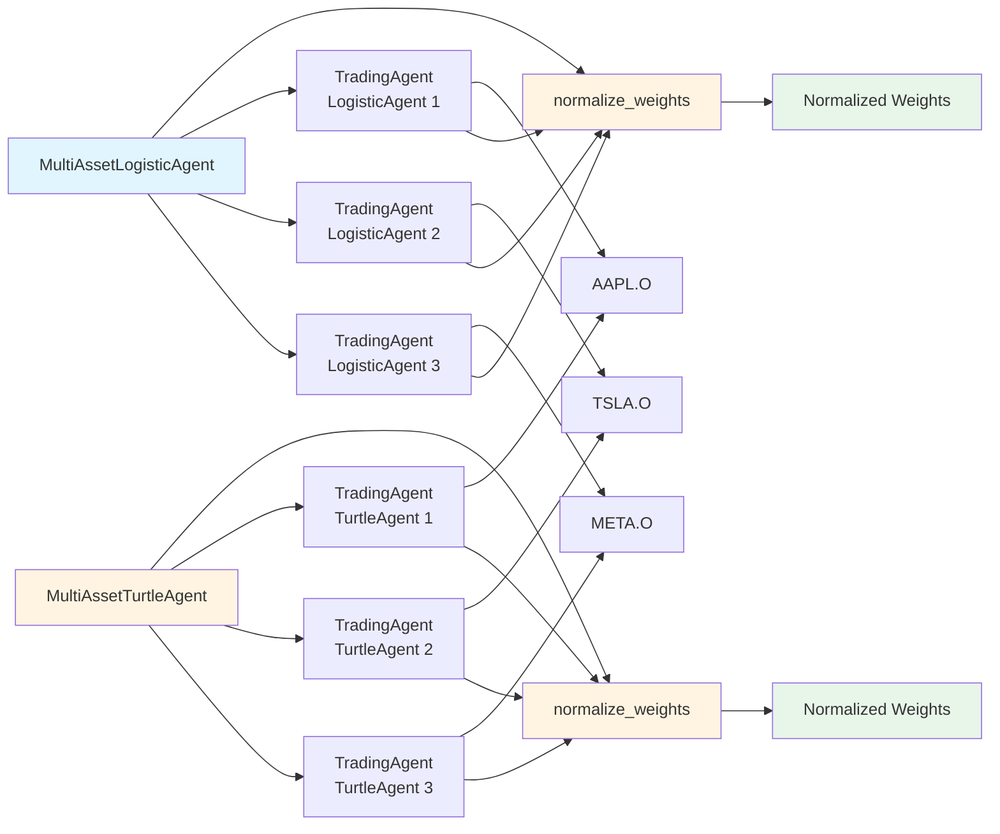

# TradingAgent 模块文档

## 核心概念

TradingAgent 区分两个关键概念：

### Score（研究问题）
- **定义**: 表达"看好程度/预期收益"，范围 `[-1, 1]`
- **用途**: 排序和筛选股票，正数表示看好，负数表示看空
- **特点**: 纯粹的研究问题，不考虑实际交易限制

### Weight（工程 + 风控问题）
- **定义**: 表达"实际配置多少资金"，范围 `[0, 1]`
- **用途**: 决定实际买入/卖出的资金量，考虑风险控制和仓位限制
- **特点**: 工程和风控问题，需要考虑单股仓位、总仓位、账户风险等

## 类层次结构

```
TradingAgent (基类)
  ├── score() - 抽象方法：计算看好程度（必须实现）
  ├── weight() - 默认实现：计算配置比例（可以重写）
  ├── get_scores() - 批量计算 score
  └── get_weights() - 批量计算 weight

具体实现：
  ├── DCAAgent - 定投策略
  ├── TurtleAgent - 海龟交易策略
  ├── LogisticAgent - 逻辑回归预测策略
  ├── ChasingExtremesAgent - 追涨杀跌策略
  ├── MultiAssetLogisticAgent - 多资产交易策略（使用 LogisticAgent）
  └── MultiAssetTurtleAgent - 多资产交易策略（使用 TurtleAgent）
```

## MultiAgent 架构

### MultiAssetLogisticAgent

`MultiAssetLogisticAgent` 使用多个独立的 `LogisticAgent` 分别处理不同股票，然后通过权重归一化统一管理：



**工作流程**：
1. `MultiAssetLogisticAgent` / `MultiAssetTurtleAgent` 为每支股票创建独立的 Agent
2. 每个 Agent 独立计算对应股票的 score 和 weight
3. 收集所有 Agent 的权重
4. 通过 `normalize_weights()` 进行归一化，确保总权重不超过 `max_total_weight`
5. 返回归一化后的权重用于实际交易

## 使用示例

```python
from trader.agent import TradingAgent
from trader.backtest.engine import BacktestEngine

class MyAgent(TradingAgent):
    def score(self, stock_code: str, engine: BacktestEngine) -> float:
        """计算看好程度（必须实现）"""
        ret_1d = engine.get_feature("ret_1d", stock_code)
        ret_20d = engine.get_feature("ret_20d", stock_code)
        if ret_1d is None or ret_20d is None:
            return 0.0
        return (ret_1d * 0.3 + ret_20d * 0.7)

def on_trading_day(engine: BacktestEngine, date: str):
    agent = MyAgent(
        max_position_weight=0.1,  # 单个股票最多10%
        min_score_threshold=0.0,  # score >= 0 才配置
        max_total_weight=0.8      # 总配置不超过80%
    )
    
    stock_codes = ["AAPL.O", "MSFT.O", "GOOGL.O"]
    
    # 1. 计算 score
    scores = agent.get_scores(stock_codes, engine)
    
    # 2. 计算 weight
    weights = agent.get_weights(scores, engine)
    
    # 3. 归一化权重
    normalized_weights = agent.normalize_weights(weights)
    
    # 4. 执行交易
    account_equity = engine.account.equity(engine.get_market_prices(stock_codes))
    for stock_code, weight in normalized_weights.items():
        if weight > 0:
            engine.buy(stock_code, amount=account_equity * weight)
```

## 注意事项

- **Score 和 Weight 的区别**: Score 高不代表 Weight 高，Weight 需要考虑风险控制
- **日期保护**: 通过 engine 访问数据，自动带有日期保护，不能访问未来数据
- **错误处理**: `get_scores()` 和 `get_weights()` 会自动处理异常，失败返回 0.0

