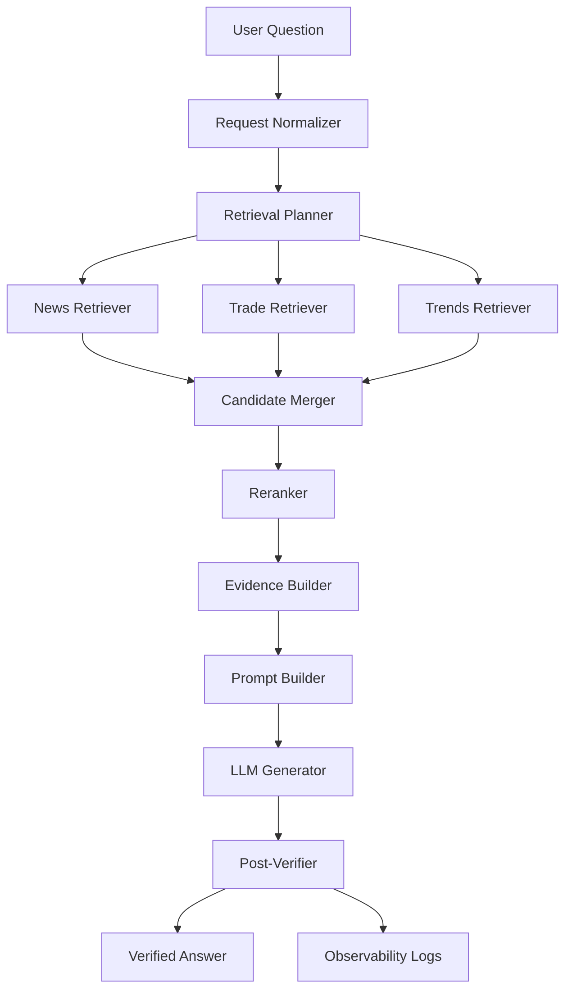

User Question（用户问题）

用户输入的自然语言问题，例如“今天为什么跌”“是否应该减仓”“回测结果如何解释”等。

这是系统的起点。

Request Normalizer（请求标准化）

把用户问题解析成统一结构的请求对象。

典型产物：stock_code、decision_time、frequency、问题原文等。

作用：让后续模块只处理标准字段，而不是直接处理自然语言噪声。

Retrieval Planner（检索计划器）

根据问题类型生成“检索计划”。

决定：要用哪些文档类型（trends/trade/news）、每类取多少（recall_k/final_k）、时间窗口、硬约束（如 impact 阈值）与查询表达。

作用：把“问什么”转成“去哪里找、找多少、按什么规则找”。

News Retriever（新闻检索器）

按计划从 news_piece 数据源中召回候选新闻。

通常带：时间过滤（publish_time）、标的过滤（stock_code/实体映射）、impact 过滤；可结合关键词检索/向量检索。

作用：为“叙事解释、事件冲击”提供证据。

Trade Retriever（交易记录检索器）

按计划从 trade_history 中取出用户或策略的交易行为记录候选。

通常以 stock_code + 时间窗口过滤，再取最近 N 笔或 N 天。

作用：为“为什么这么买/卖、复盘执行是否一致”提供证据。

Trends Retriever（趋势/特征检索器）

从 trends（结构化特征）中检索与当前状态相关的候选。

推荐方式是“特征相似度检索”（KNN/距离度量），而不是文本检索。

作用：为“市场状态/波动异常/估值水平”等提供数据证据。

Candidate Merger（候选合并器）

把三路 retriever 的候选合并成统一候选池，并按 doc_id 去重。

作用：形成一个可统一排序与筛选的候选集合。

Reranker（重排器）

在候选池上进行二次筛选与排序，选出最终进入上下文的 top-k。

常用信号：相关性、时间衰减（越新权重越高）、质量（如 impact）、多样性（去重复事件）。

作用：减少无关/重复证据，提高最终回答的“证据密度”。

Evidence Builder（证据构建器）

把最终候选压缩成“证据卡片”（EvidencePack）。

每条证据包含：doc_id、类型、时间戳、关键事实（1-3条）、核心信号（sentiment/impact/ret_5d 等）。

作用：让 LLM 读到的是结构化证据，而不是杂乱原文，便于引用与审计。

Prompt Builder（提示词构建器）

把用户问题 + EvidencePack 组装成严格格式的 prompt。

通常会强制：必须引用 doc_id、证据不足要说明、输出格式固定。

作用：把“模型该怎么回答”写成可控的指令。

LLM Generator（模型生成器）

调用大模型，根据 prompt 输出答案。

作用：生成最终的自然语言解释/结论（可能包含策略建议，但受约束）。

Post-Verifier（后验校验器）

对模型输出做自动校验与降级：

引用校验：doc_id 必须存在于证据包

时间校验：不得引用未来新闻

越界校验：不得引入证据包外的关键事实

置信度门控：证据不足时禁止给明确动作

作用：把 RAG 系统从“可能会编”变成“可控、可审计”。

Verified Answer（最终答案）

通过校验后的最终输出。

通常包含：结论 + 引用证据 + 不确定性说明（必要时降级）。

Observability Logs（可观测性日志）

记录全链路信息：检索计划、各类召回数量、重排分数、证据包、校验结果、最终输出。

作用：用于排错、评估、迭代优化与审计追溯。